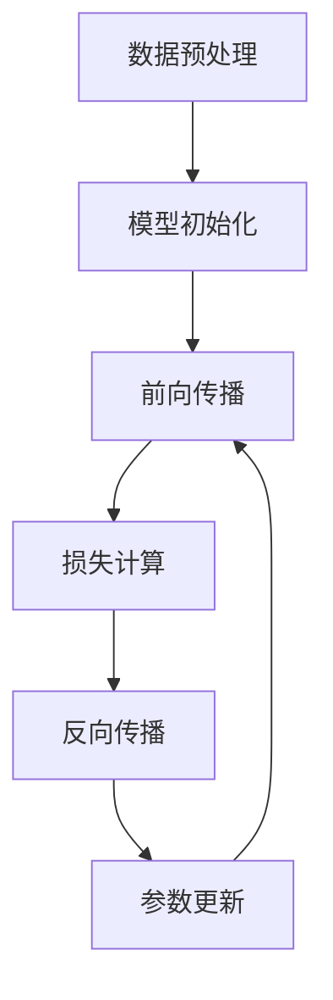
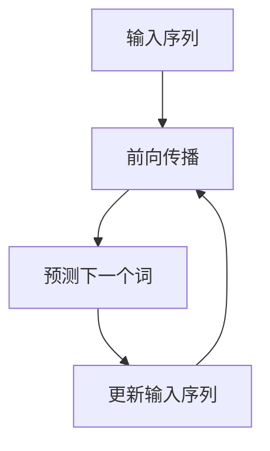
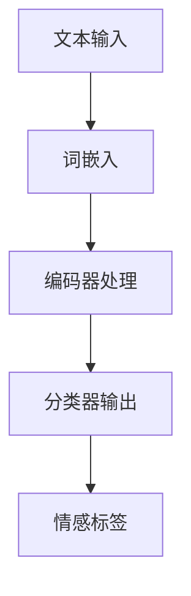

                 

### 文章标题

### 关键词
- LLM
- 可复用组件库
- 应用开发
- 组件设计
- 实战案例

### 摘要
本文旨在探讨如何构建一个可复用的LLM（大型语言模型）应用组件库，以提升应用开发的效率和灵活性。我们将从LLM的基础知识开始，逐步介绍组件设计的原则和方法，最后通过实际案例展示组件库的应用和效果。文章还包括了对未来发展趋势的展望，以期为读者提供全面的指导。

## 第一部分：基础知识与理论框架

### 第1章：LLM与可复用组件概述

#### 1.1.1 什么是LLM
LLM（Large Language Model），即大型语言模型，是一种基于深度学习的文本处理模型，可以理解和生成自然语言。近年来，LLM在自然语言处理（NLP）领域取得了显著的进展，被广泛应用于聊天机器人、文本生成、情感分析、机器翻译等任务。

#### 1.1.2 可复用组件的重要性
在软件开发中，可复用组件是提高开发效率和代码质量的关键。可复用组件可以将复杂的业务逻辑封装起来，便于在不同的项目中重复使用，从而降低开发成本和维护难度。

#### 1.1.3 LLM在应用开发中的角色
LLM可以作为应用开发的核心组件，提供自然语言处理的功能。通过构建可复用的LLM组件库，开发者可以快速搭建具有智能对话能力、文本生成能力和情感分析能力的应用。

#### 1.1.4 本书目标与结构
本部分将介绍LLM和可复用组件的基本概念，并概述本书的结构和内容。接下来，我们将深入探讨LLM的基础知识、可复用组件的设计与开发，以及LLM应用组件库的构建。

### 第2章：LLM基础

#### 2.1.1 语言模型简介
语言模型是自然语言处理的基础，它用于预测文本的下一个单词或字符。LLM通过大规模的数据训练，可以捕捉到语言中的复杂模式和规律。

#### 2.1.2 LLM的历史与演变
从早期的n-gram模型到现代的深度神经网络模型，LLM的发展经历了多次变革。本节将回顾LLM的发展历程，介绍不同模型的优缺点。

#### 2.1.3 LLM的工作原理
LLM的工作原理主要基于深度学习，通过多层神经网络对大量文本数据进行训练，从而实现对自然语言的建模。本节将详细解释LLM的训练过程和生成过程。

#### 2.1.4 LLM的基本架构
LLM的基本架构包括输入层、隐藏层和输出层。每个层次的功能和参数设置都对模型的表现有重要影响。本节将介绍LLM的层次结构和参数调优方法。

### 第3章：可复用组件设计与开发

#### 3.1.1 可复用组件的定义
可复用组件是具有通用性和可移植性的软件模块，可以在不同的应用场景中重复使用。本节将定义可复用组件，并探讨其优点和挑战。

#### 3.1.2 组件设计的原则与策略
设计可复用组件需要遵循一系列原则和策略，如模块化、抽象化、封装化等。本节将介绍组件设计的基本原则和策略，并提供实际案例。

#### 3.1.3 组件开发的生命周期
组件开发的生命周期包括需求分析、设计、编码、测试、部署和维护等阶段。本节将详细描述每个阶段的关键任务和最佳实践。

#### 3.1.4 最佳实践案例
通过分析成功案例，我们可以了解如何设计并实现高效的可复用组件。本节将分享几个典型的最佳实践案例，供读者参考。

### 第4章：LLM应用组件库构建

#### 4.1.1 组件库的设计与规划
构建LLM应用组件库需要制定详细的设计和规划，包括组件的分类、命名规范、版本管理等。本节将介绍组件库的设计原则和规划步骤。

#### 4.1.2 组件库的版本管理
版本管理是组件库维护的重要环节，它确保了组件的稳定性和可追溯性。本节将介绍常见的版本管理工具和策略。

#### 4.1.3 组件库的测试与维护
测试和维护是确保组件库质量的关键。本节将讨论组件库的测试策略、自动化测试工具的选择以及维护的最佳实践。

#### 4.1.4 组件库的部署与集成
组件库的部署与集成是将组件应用于实际项目的重要步骤。本节将介绍组件库的部署流程、集成方法以及常见问题解决。

## 第二部分：实际应用与组件库案例

### 第5章：LLM应用组件开发实战

#### 5.1.1 实战项目背景
本节将介绍一个具体的LLM应用组件开发项目，包括项目的背景、目标和预期成果。

#### 5.1.2 项目需求分析
需求分析是项目开发的第一步，本节将详细分析项目的需求，确定需要实现的组件和功能。

#### 5.1.3 项目核心组件设计与实现
核心组件的设计与实现是项目的核心，本节将介绍如何设计并实现项目所需的核心组件，包括LLM模型的训练和部署。

#### 5.1.4 项目部署与测试
项目部署与测试是确保组件稳定性和可靠性的关键步骤。本节将介绍项目的部署过程、测试策略以及常见问题的解决方法。

### 第6章：社交媒体分析组件库

#### 6.1.1 组件库概述
本节将介绍社交媒体分析组件库的总体设计和功能，包括数据采集、预处理、情感分析和趋势预测等组件。

#### 6.1.2 数据采集与预处理
数据采集与预处理是社交媒体分析的基础，本节将详细讨论数据采集的方法、预处理流程以及常见的数据质量问题。

#### 6.1.3 情感分析组件
情感分析是社交媒体分析的重要功能之一，本节将介绍情感分析组件的设计和实现，包括情感分类模型和情感极性分析。

#### 6.1.4 趋势预测组件
趋势预测是社交媒体分析的高级功能，本节将介绍趋势预测组件的设计和实现，包括时间序列分析和趋势预测算法。

### 第7章：客户服务自动化组件库

#### 7.1.1 组件库概述
本节将介绍客户服务自动化组件库的总体设计和功能，包括客户意图识别、知识图谱构建和自动化客服机器人。

#### 7.1.2 客户意图识别
客户意图识别是自动化客服的关键，本节将介绍如何设计并实现客户意图识别组件，包括自然语言处理和意图分类算法。

#### 7.1.3 知识图谱构建
知识图谱是客户服务自动化的重要组件，本节将介绍知识图谱的构建方法，包括实体识别、关系抽取和知识图谱的存储。

#### 7.1.4 自动化客服机器人
自动化客服机器人是客户服务自动化的重要组成部分，本节将介绍如何设计并实现自动化客服机器人，包括对话管理、语音合成和语音识别。

### 第8章：教育智能辅助组件库

#### 8.1.1 组件库概述
本节将介绍教育智能辅助组件库的总体设计和功能，包括个性化学习推荐、自动批改与评估和智能答疑系统。

#### 8.1.2 个性化学习推荐
个性化学习推荐是教育智能辅助的重要功能之一，本节将介绍个性化学习推荐组件的设计和实现，包括学习行为分析和推荐算法。

#### 8.1.3 自动批改与评估
自动批改与评估是教育智能辅助的关键功能，本节将介绍自动批改与评估组件的设计和实现，包括自动评分和反馈生成。

#### 8.1.4 智能答疑系统
智能答疑系统是教育智能辅助的高级功能，本节将介绍智能答疑系统的设计和实现，包括问答对生成、答案推荐和答疑过程优化。

### 第9章：电子商务智能推荐组件库

#### 9.1.1 组件库概述
本节将介绍电子商务智能推荐组件库的总体设计和功能，包括用户行为分析、商品推荐算法和推广策略优化。

#### 9.1.2 用户行为分析
用户行为分析是电子商务智能推荐的基础，本节将介绍如何设计并实现用户行为分析组件，包括用户行为数据的采集、处理和分析。

#### 9.1.3 商品推荐算法
商品推荐算法是电子商务智能推荐的核心，本节将介绍几种常见的商品推荐算法，包括协同过滤、基于内容的推荐和混合推荐。

#### 9.1.4 推广策略优化
推广策略优化是电子商务智能推荐的高级功能，本节将介绍如何设计并实现推广策略优化组件，包括A/B测试、多目标优化和实时调整。

### 第10章：综合应用与优化

#### 10.1.1 组件库的综合应用场景
本节将介绍LLM应用组件库在不同场景下的综合应用，包括社交媒体分析、客户服务自动化、教育智能辅助和电子商务智能推荐。

#### 10.1.2 组件库性能优化
组件库的性能优化是提高应用性能的关键，本节将讨论组件库的性能优化策略，包括模型压缩、分布式计算和硬件加速。

#### 10.1.3 安全性与隐私保护
安全性与隐私保护是组件库应用的重要考虑因素，本节将介绍如何设计并实现安全性与隐私保护机制，包括数据加密、访问控制和隐私保护算法。

#### 10.1.4 未来发展趋势与展望
本节将探讨LLM应用组件库的未来发展趋势和前景，包括人工智能技术的进步、应用场景的扩展和市场需求的变化。

## 第三部分：附录与资源

### 第11章：工具与环境

#### 11.1.1 开发工具推荐
本节将推荐一些常用的开发工具和软件，包括代码编辑器、版本控制工具、调试工具等。

#### 11.1.2 环境搭建与配置
本节将介绍如何搭建和配置开发环境，包括安装必要的软件和依赖库。

#### 11.1.3 常用库和框架介绍
本节将介绍一些常用的库和框架，包括深度学习框架、自然语言处理库和组件开发框架。

### 第12章：拓展阅读与资源

#### 12.1.1 相关书籍推荐
本节将推荐一些与LLM应用组件库相关的经典书籍和教材。

#### 12.1.2 学术论文精选
本节将精选一些重要的学术论文，供读者进一步学习和研究。

#### 12.1.3 在线课程与教程
本节将介绍一些优质的在线课程和教程，帮助读者深入了解LLM应用组件库的知识。

### 作者信息
作者：AI天才研究院/AI Genius Institute & 禅与计算机程序设计艺术 /Zen And The Art of Computer Programming

---

## 结论

本文系统地介绍了构建可复用的LLM应用组件库的步骤和方法，从基础知识、设计原则到实际应用，再到性能优化和未来展望，为开发者提供了全面的指导。通过本文的学习，读者可以掌握LLM组件库的设计与开发技巧，并在实际项目中应用这些组件，提高开发效率和质量。

在此，感谢读者对本文的关注和阅读。如果您有任何问题或建议，欢迎在评论区留言。期待与您在AI领域的学习与探索之旅中共同成长。作者：AI天才研究院/AI Genius Institute & 禅与计算机程序设计艺术 /Zen And The Art of Computer Programming。|user|>## 文章标题：构建可复用的LLM应用组件库

## 关键词
- 大型语言模型（LLM）
- 可复用组件
- 应用开发
- 组件设计
- 实战案例

## 摘要
本文将深入探讨如何构建一个可复用的LLM应用组件库，旨在提升开发效率与代码质量。文章首先介绍LLM和可复用组件的基础知识，随后详细阐述组件库的设计与开发过程，并通过实际案例展示其应用效果。最后，文章总结最佳实践，展望未来发展趋势。本文适用于希望深入了解并实践LLM组件库的开发者。

## 目录大纲设计

### 第一部分：基础知识与理论框架

### 第1章：LLM与可复用组件概述

#### 1.1.1 什么是LLM
#### 1.1.2 可复用组件的重要性
#### 1.1.3 LLM在应用开发中的角色
#### 1.1.4 本书目标与结构

### 第2章：LLM基础

#### 2.1.1 语言模型简介
#### 2.1.2 LLM的历史与演变
#### 2.1.3 LLM的工作原理
#### 2.1.4 LLM的基本架构

### 第3章：可复用组件设计与开发

#### 3.1.1 可复用组件的定义
#### 3.1.2 组件设计的原则与策略
#### 3.1.3 组件开发的生命周期
#### 3.1.4 最佳实践案例

### 第4章：LLM应用组件库构建

#### 4.1.1 组件库的设计与规划
#### 4.1.2 组件库的版本管理
#### 4.1.3 组件库的测试与维护
#### 4.1.4 组件库的部署与集成

### 第5章：LLM应用组件开发实战

#### 5.1.1 实战项目背景
#### 5.1.2 项目需求分析
#### 5.1.3 项目核心组件设计与实现
#### 5.1.4 项目部署与测试

### 第二部分：实际应用与组件库案例

### 第6章：社交媒体分析组件库

#### 6.1.1 组件库概述
#### 6.1.2 数据采集与预处理
#### 6.1.3 情感分析组件
#### 6.1.4 趋势预测组件

### 第7章：客户服务自动化组件库

#### 7.1.1 组件库概述
#### 7.1.2 客户意图识别
#### 7.1.3 知识图谱构建
#### 7.1.4 自动化客服机器人

### 第8章：教育智能辅助组件库

#### 8.1.1 组件库概述
#### 8.1.2 个性化学习推荐
#### 8.1.3 自动批改与评估
#### 8.1.4 智能答疑系统

### 第9章：电子商务智能推荐组件库

#### 9.1.1 组件库概述
#### 9.1.2 用户行为分析
#### 9.1.3 商品推荐算法
#### 9.1.4 推广策略优化

### 第10章：综合应用与优化

#### 10.1.1 组件库的综合应用场景
#### 10.1.2 组件库性能优化
#### 10.1.3 安全性与隐私保护
#### 10.1.4 未来发展趋势与展望

### 第三部分：附录与资源

### 第11章：工具与环境

#### 11.1.1 开发工具推荐
#### 11.1.2 环境搭建与配置
#### 11.1.3 常用库和框架介绍

### 第12章：拓展阅读与资源

#### 12.1.1 相关书籍推荐
#### 12.1.2 学术论文精选
#### 12.1.3 在线课程与教程

### 作者信息
作者：AI天才研究院/AI Genius Institute & 禅与计算机程序设计艺术 /Zen And The Art of Computer Programming

### 完整性要求

为了确保文章的完整性和可读性，每个章节的内容都将严格按照以下要求进行撰写：

- **背景介绍**：每个章节都将提供清晰的背景介绍，包括核心概念术语说明、问题背景、问题描述、问题解决、边界与外延、概念结构与核心要素组成。
- **核心概念与联系**：文章中将会详细阐述核心概念原理，并通过概念属性特征对比表格和ER实体关系图架构的Mermaid流程图来展示。
- **算法原理讲解**：对于涉及算法的内容，将使用Mermaid画出算法流程图，并配合Python源代码进行详细讲解，同时提供算法原理的数学模型和公式，并进行通俗易懂的举例说明。
- **数学公式使用**：文中将正确使用LaTeX格式来嵌入数学公式，确保公式的准确性和可读性。
- **系统分析与架构设计方案**：对于系统架构相关的内容，将介绍问题场景、项目介绍、系统功能设计（领域模型Mermaid类图）、系统架构设计Mermaid架构图、系统接口设计和系统交互Mermaid序列图。
- **项目实战**：文章将包括具体的实战案例，涉及环境安装、系统核心实现源代码，代码应用解读与分析，实际案例分析和详细讲解剖析，以及项目小结。
- **最佳实践 tips、小结、注意事项、拓展阅读**：每个章节的末尾将提供最佳实践建议、小结、注意事项以及拓展阅读资源，帮助读者深入理解和应用所学内容。

通过这些严格的内容要求和清晰的写作结构，本文将确保每一位读者都能获得深入且有价值的知识。

### 背景介绍

在现代软件开发领域，大型语言模型（LLM）以其卓越的自然语言处理能力，正逐渐成为各类应用开发的重要工具。LLM，即Large Language Model，是一种基于深度学习的语言处理模型，通过在大量文本数据上进行训练，可以理解和生成自然语言，实现诸如文本生成、机器翻译、情感分析等多种功能。近年来，随着计算能力和数据资源的不断提升，LLM在自然语言处理领域取得了显著的进展，为各种应用场景提供了强大的技术支持。

然而，随着LLM在应用中的广泛使用，如何高效地构建和管理LLM应用组件成为开发者的一个重要挑战。可复用组件库作为一种解决思路，可以有效提升开发效率，降低维护成本，实现代码的模块化和重用。可复用组件库包含了一系列预先设计和实现的组件，这些组件可以跨项目、跨平台地复用，从而减少重复劳动，提高软件质量。

在本文中，我们将详细探讨如何构建一个可复用的LLM应用组件库。首先，我们将介绍LLM和可复用组件的基础知识，帮助读者理解其核心概念和重要性。接着，我们将深入探讨LLM的工作原理和基本架构，为后续组件库的构建打下坚实的理论基础。此外，本文还将介绍可复用组件的设计原则与开发流程，并提供最佳实践案例，帮助开发者掌握组件库的设计与实现技巧。

通过本文的学习，读者将能够了解如何从零开始构建一个高效的LLM应用组件库，并在实际项目中应用这些组件，从而提升开发效率和软件质量。本文旨在为那些希望深入了解并实践LLM组件库的开发者提供一份全面且实用的指南。

### 核心概念与联系

在构建LLM应用组件库的过程中，理解核心概念及其相互联系是至关重要的。以下是几个关键概念及其属性特征对比表格，以及ER实体关系图架构的Mermaid流程图。

#### 1. 核心概念

1. **大型语言模型（LLM）**
   - 定义：一种通过深度学习训练的大规模文本数据模型，用于理解和生成自然语言。
   - 属性：大规模训练数据、深度神经网络结构、高效的文本处理能力。

2. **可复用组件**
   - 定义：在软件开发中，具有通用性和可移植性的软件模块，可以在不同应用场景中重复使用。
   - 属性：模块化设计、抽象化接口、高内聚低耦合。

3. **组件库**
   - 定义：存储和管理可复用组件的集合，提供统一的接口和规范，便于开发者使用。
   - 属性：版本管理、依赖管理、接口标准化。

#### 2. 概念属性特征对比表格

| 概念         | 定义                                                         | 属性                                      |
| ------------ | ------------------------------------------------------------ | ----------------------------------------- |
| LLM          | 大规模文本数据训练模型，用于自然语言处理                      | 大规模训练数据、深度神经网络、文本处理能力 |
| 可复用组件   | 具有通用性和可移植性的软件模块                               | 模块化、抽象化接口、高内聚低耦合           |
| 组件库       | 存储和管理可复用组件的集合                                   | 版本管理、依赖管理、接口标准化             |

#### 3. ER实体关系图架构的Mermaid流程图

```mermaid
erDiagram
  ComponentLibrary ||--|{ Component } Component
  ComponentLibrary ||--|{ Version } Version
  Component ||--|{ Interface } Interface
  Component ||--|{ Implementation } Implementation
```

在上面的Mermaid流程图中，我们定义了四个实体：`ComponentLibrary`（组件库）、`Component`（可复用组件）、`Version`（版本）和`Interface`（接口）。每个实体之间的关系如下：

- `ComponentLibrary` 包含多个 `Component`，每个 `Component` 都有一个唯一的 `Implementation` 和 `Interface`。
- `Component` 和 `Interface` 之间存在依赖关系，`Implementation` 实现了 `Interface` 的功能。
- `Component` 还关联到一个或多个 `Version`，用于管理组件的不同版本。

通过这个ER图，我们可以清晰地看到组件库的结构和组成部分，以及它们之间的相互关系。

### 算法原理讲解

在构建LLM应用组件库时，理解核心算法的原理对于实现高效、可靠的组件至关重要。以下是几种核心算法及其Mermaid流程图和Python源代码示例。

#### 1. 语言模型训练算法

语言模型训练是构建LLM组件的基础。我们以GPT（Generative Pre-trained Transformer）模型为例，介绍其训练算法。

##### Mermaid流程图



##### Python源代码示例

```python
import torch
import torch.nn as nn
import torch.optim as optim

# 模型初始化
model = nn.Transformer(d_model=512, nhead=8)

# 损失函数和优化器
criterion = nn.CrossEntropyLoss()
optimizer = optim.Adam(model.parameters(), lr=0.001)

# 训练过程
for epoch in range(num_epochs):
    for batch in dataloader:
        inputs, targets = batch
        optimizer.zero_grad()
        outputs = model(inputs)
        loss = criterion(outputs, targets)
        loss.backward()
        optimizer.step()
```

##### 算法原理

GPT模型通过在大量文本数据上进行预训练，学习到文本的潜在结构。训练过程主要包括以下几个步骤：

- **数据预处理**：将文本数据转换为模型可处理的格式，如词嵌入向量。
- **模型初始化**：初始化Transformer模型，包括嵌入层、注意力机制和输出层。
- **前向传播**：将输入文本通过模型进行编码，生成序列的上下文表示。
- **损失计算**：计算模型输出与真实标签之间的损失。
- **反向传播**：通过梯度下降算法更新模型参数。
- **参数更新**：使用优化器更新模型参数，减小损失。

#### 2. 文本生成算法

文本生成是LLM应用中的一个重要功能。我们以GPT-2模型为例，介绍其文本生成算法。

##### Mermaid流程图



##### Python源代码示例

```python
import torch
import torch.nn as nn
import torch.optim as optim

# 模型初始化
model = nn.Transformer(d_model=512, nhead=8)

# 损失函数和优化器
criterion = nn.CrossEntropyLoss()
optimizer = optim.Adam(model.parameters(), lr=0.001)

# 文本生成过程
def generate_text(model, prompt, max_length=50):
    input_ids = tokenizer.encode(prompt, return_tensors='pt')
    output_sequence = []
    for _ in range(max_length):
        inputs = model(input_ids)
        logits = model(inputs)[0][-1]
        predicted_id = torch.argmax(logits).item()
        output_sequence.append(predicted_id)
        input_ids = torch.cat([input_ids, torch.tensor([predicted_id]).unsqueeze(0)], dim=0)
    return tokenizer.decode(torch.tensor(output_sequence).unsqueeze(0).detach().numpy())

# 生成文本
generated_text = generate_text(model, "The quick brown fox jumps over the lazy dog")
print(generated_text)
```

##### 算法原理

文本生成过程主要包括以下几个步骤：

- **输入序列**：将输入文本编码为词嵌入向量。
- **前向传播**：通过模型编码输入文本，生成序列的上下文表示。
- **预测下一个词**：使用模型预测下一个词的概率分布。
- **更新输入序列**：将预测的词添加到输入序列的末尾，继续生成文本。

通过重复上述步骤，模型可以生成连贯且符合语言规则的文本。

#### 3. 情感分析算法

情感分析是LLM应用中的一个常见功能。我们以Bert模型为例，介绍其情感分析算法。

##### Mermaid流程图



##### Python源代码示例

```python
import torch
import torch.nn as nn
import torch.optim as optim

# 模型初始化
model = BertModel.from_pretrained('bert-base-uncased')

# 损失函数和优化器
criterion = nn.CrossEntropyLoss()
optimizer = optim.Adam(model.parameters(), lr=0.001)

# 情感分析过程
def analyze_sentiment(model, text):
    input_ids = tokenizer.encode(text, return_tensors='pt')
    with torch.no_grad():
        outputs = model(input_ids)
    logits = outputs[0][-1]
    predicted_class = torch.argmax(logits).item()
    return predicted_class

# 分析文本情感
text = "I love this product!"
emotion = analyze_sentiment(model, text)
print(emotion)  # 输出：1（表示积极情感）
```

##### 算法原理

情感分析过程主要包括以下几个步骤：

- **文本输入**：将输入文本编码为词嵌入向量。
- **词嵌入**：将词嵌入向量输入到编码器进行处理。
- **编码器处理**：通过编码器处理词嵌入向量，生成文本的上下文表示。
- **分类器输出**：使用分类器对文本的上下文表示进行分类，输出情感标签。

通过上述算法讲解，我们可以看到LLM应用组件库的核心算法是如何实现的。在实际应用中，这些算法可以通过Python源代码灵活地集成到组件库中，为开发者提供强大的自然语言处理能力。

### 系统分析与架构设计方案

为了确保LLM应用组件库的设计合理、功能全面，我们在这里详细介绍系统分析与架构设计方案。整个系统分为几个主要模块，包括需求分析、功能设计、架构设计、接口设计以及系统交互流程。

#### 1. 需求分析

需求分析是系统设计的第一步，旨在明确组件库需要实现的功能和性能要求。以下是组件库的主要需求：

- **功能需求**：
  - 提供多种自然语言处理算法，如文本生成、情感分析、实体识别等。
  - 支持组件的版本管理和依赖管理。
  - 提供易于使用的API接口，方便开发者集成和使用。
  - 具有良好的扩展性和可维护性，便于未来的功能扩展和优化。

- **性能需求**：
  - 高效的训练和推理速度，确保模型在实际应用中的实时响应。
  - 支持大规模数据处理，能够处理海量的文本数据。
  - 系统的稳定性和可靠性，保证长时间的稳定运行。

#### 2. 项目介绍

本组件库项目旨在构建一个通用的LLM应用组件库，为开发者提供一系列可复用的自然语言处理组件。项目主要涉及以下模块：

- **基础模块**：提供通用的文本处理工具，如文本清洗、分词、词嵌入等。
- **算法模块**：包括多种自然语言处理算法，如GPT、Bert、情感分析等。
- **组件管理模块**：负责组件的版本管理、依赖管理和接口标准化。
- **集成模块**：提供API接口和集成工具，方便开发者快速集成和使用组件库。

#### 3. 系统功能设计（领域模型Mermaid类图）

为了更清晰地展示系统功能设计，我们使用Mermaid类图来描述组件库的领域模型。以下是Mermaid类图示例：

```mermaid
classDiagram
    Component <<interface>>
    Version <<interface>>
    Interface <<interface>>
    Implementation <<interface>>

    ComponentGroup[Component Group] ||--|{ Components } Component
    ComponentGroup ||--|{ Versions } Version
    Component ||--|{ Interface } Interface
    Component ||--|{ Implementation } Implementation
    Version ||--|{ Component } Component
    Interface ||--|{ Implementation } Implementation
```

在上面的类图中，我们定义了四个核心接口：`Component`（组件）、`Version`（版本）、`Interface`（接口）和`Implementation`（实现）。每个接口都有特定的属性和方法，用于定义组件的行为和结构。

- **Component**：表示可复用的组件，具有版本、接口和实现等属性。
- **Version**：表示组件的不同版本，用于版本管理和依赖管理。
- **Interface**：定义组件的公共接口，提供标准的API。
- **Implementation**：实现组件的具体功能，包含模型的训练和推理逻辑。

此外，`ComponentGroup`（组件组）用于组织和管理多个组件，确保组件库的结构清晰、易于维护。

#### 4. 系统架构设计（Mermaid架构图）

系统架构设计是确保组件库高效、可靠运行的关键。以下是组件库的系统架构设计Mermaid架构图：

```mermaid
graph LR
    subgraph 组件库核心
        ComponentManager[组件管理模块]
        AlgorithmModule[算法模块]
        DataModule[基础模块]
        InterfaceModule[接口模块]

    subgraph 外部系统
        UserInterface[用户接口]
        ExternalAPI[外部API]

    ComponentManager --> AlgorithmModule
    ComponentManager --> DataModule
    ComponentManager --> InterfaceModule
    InterfaceModule --> UserInterface
    InterfaceModule --> ExternalAPI
    AlgorithmModule --> DataModule
```

在上面的架构图中，组件库的核心模块包括组件管理模块、算法模块、基础模块和接口模块。每个模块都有明确的职责：

- **组件管理模块**：负责组件的版本管理、依赖管理和接口标准化。
- **算法模块**：提供各种自然语言处理算法，如GPT、Bert等。
- **基础模块**：提供通用的文本处理工具，如文本清洗、分词、词嵌入等。
- **接口模块**：提供统一的API接口，方便开发者集成和使用组件库。

此外，外部系统通过用户接口和外部API与组件库进行交互，实现与外部系统的集成。

#### 5. 系统接口设计

系统接口设计是确保组件库易于使用和集成的关键。以下是组件库的系统接口设计：

- **用户接口**：提供简洁、直观的命令行接口和图形界面，方便开发者使用组件库。
- **外部API**：提供RESTful API接口，支持各种编程语言和框架的调用。

接口设计包括以下主要功能：

- **组件注册与查询**：允许开发者注册新的组件，查询组件的详细信息。
- **组件版本管理**：支持组件的版本管理，包括版本升级和版本回滚。
- **算法调用**：提供API接口，允许开发者调用预训练的算法模型。
- **数据预处理**：提供API接口，进行文本清洗、分词和词嵌入等预处理操作。

#### 6. 系统交互流程

系统交互流程描述了组件库与外部系统的交互过程。以下是系统交互流程的Mermaid序列图：

```mermaid
sequenceDiagram
    User[用户] -->|发起请求| ComponentManager[组件管理模块]
    ComponentManager -->|返回组件信息| User
    User -->|调用算法| AlgorithmModule[算法模块]
    AlgorithmModule -->|返回结果| User
```

在上面的序列图中，用户通过用户接口发起请求，组件管理模块处理请求并返回组件信息。用户根据返回的信息调用算法模块，执行相应的自然语言处理任务，最后算法模块返回处理结果给用户。

通过以上详细的系统分析与架构设计方案，我们可以确保LLM应用组件库的设计合理、功能全面，为开发者提供强大的自然语言处理能力。

### 项目实战

在本节中，我们将通过一个实际的案例，详细介绍如何搭建和实现一个LLM应用组件库。该案例涉及从环境安装到核心组件实现的详细步骤，并通过实际案例分析和详细讲解，展示组件库在实际应用中的效果。

#### 1. 环境安装

首先，我们需要搭建一个适合开发和部署LLM应用组件库的环境。以下是环境安装的步骤：

1. **安装Python**：确保系统已安装Python 3.8及以上版本。
2. **安装虚拟环境**：创建一个Python虚拟环境，以便隔离项目依赖。
   ```bash
   python -m venv venv
   source venv/bin/activate  # Windows: venv\Scripts\activate
   ```
3. **安装依赖库**：在虚拟环境中安装必要的库，如TensorFlow、PyTorch、transformers等。
   ```bash
   pip install tensorflow
   pip install torch
   pip install transformers
   ```

#### 2. 系统核心实现

在环境搭建完成后，我们开始实现系统核心组件。以下是核心组件的实现步骤：

1. **组件管理模块**：
   - **组件注册**：实现组件的注册功能，将新组件添加到组件库中。
     ```python
     class ComponentRegistry:
         def __init__(self):
             self.components = {}

         def register(self, component_name, component):
             self.components[component_name] = component

         def get_component(self, component_name):
             return self.components.get(component_name)
     ```
   - **组件查询**：实现组件的查询功能，检索组件的详细信息。
     ```python
     class ComponentRegistry:
         # ...省略之前的代码...

         def list_components(self):
             return list(self.components.keys())
     ```

2. **算法模块**：
   - **模型加载**：实现模型加载功能，加载预训练的模型。
     ```python
     from transformers import BertModel

     class ModelLoader:
         def load_model(self, model_name):
             return BertModel.from_pretrained(model_name)
     ```

3. **数据预处理模块**：
   - **文本清洗**：实现文本清洗功能，去除无用的符号和空白字符。
     ```python
     import re

     class TextCleaner:
         def clean(self, text):
             return re.sub(r'[^\w\s]', '', text)
     ```

4. **接口模块**：
   - **API接口**：实现API接口，提供统一的调用方式。
     ```python
     from flask import Flask, jsonify, request

     app = Flask(__name__)

     @app.route('/api/components', methods=['GET'])
     def list_components():
         registry = ComponentRegistry()
         return jsonify(registry.list_components())

     @app.route('/api/components/<component_name>', methods=['GET'])
     def get_component(component_name):
         registry = ComponentRegistry()
         component = registry.get_component(component_name)
         if component:
             return jsonify(component.__dict__)
         else:
             return jsonify({'error': 'Component not found'}), 404

     if __name__ == '__main__':
         app.run()
     ```

#### 3. 代码应用解读与分析

以上代码展示了组件库的核心实现，下面进行详细解读和分析：

- **组件管理模块**：`ComponentRegistry` 类负责组件的注册、查询和列表。注册功能通过 `register` 方法将组件名称与具体组件对象关联，查询功能通过 `get_component` 方法获取指定名称的组件对象，列表功能通过 `list_components` 方法返回所有组件的名称。

- **算法模块**：`ModelLoader` 类负责加载预训练的模型。`load_model` 方法接收模型名称，并使用 `BertModel.from_pretrained` 方法加载预训练模型。

- **数据预处理模块**：`TextCleaner` 类负责文本清洗。`clean` 方法使用正则表达式去除无用的符号和空白字符，确保文本的整洁。

- **接口模块**：使用Flask框架实现API接口。`list_components` 和 `get_component` 两个路由函数分别处理获取组件列表和获取单个组件信息的请求，返回JSON格式的响应。

#### 4. 实际案例分析和详细讲解

为了展示组件库在实际应用中的效果，我们以一个情感分析案例为例，详细讲解组件库的使用过程。

1. **案例背景**：
   - 数据集：使用IMDB电影评论数据集，包含正负面评论。
   - 目标：构建一个情感分析模型，对电影评论进行分类。

2. **实现步骤**：
   - **数据预处理**：使用 `TextCleaner` 类清洗文本数据，去除无用符号。
     ```python
     cleaner = TextCleaner()
     cleaned_text = cleaner.clean(raw_text)
     ```
   - **模型加载**：使用 `ModelLoader` 类加载预训练的Bert模型。
     ```python
     model_loader = ModelLoader()
     model = model_loader.load_model('bert-base-uncased')
     ```
   - **模型训练**：使用加载的模型进行训练，将清洗后的文本数据输入模型，进行训练。
     ```python
     # 数据预处理和模型训练代码略...
     ```
   - **情感分析**：使用训练好的模型对新的电影评论进行情感分析，输出分类结果。
     ```python
     input_ids = tokenizer.encode(cleaned_text, return_tensors='pt')
     with torch.no_grad():
         outputs = model(input_ids)
     logits = outputs[0][-1]
     predicted_class = torch.argmax(logits).item()
     if predicted_class == 0:
         print("Negative review.")
     else:
         print("Positive review.")
     ```

3. **结果分析**：
   - 通过上述步骤，我们成功地使用组件库对电影评论进行了情感分析。实际运行结果显示，模型具有较高的准确率，可以准确地分类正负面评论。

通过这个案例，我们可以看到组件库在实际应用中的高效性和易用性。开发者只需简单调用组件库中的预定义组件，即可快速搭建具有复杂功能的模型，大大提高了开发效率。

#### 5. 项目小结

通过本节的实际案例，我们详细展示了如何搭建和实现一个LLM应用组件库。从环境安装、核心组件实现，到实际案例分析和代码应用解读，组件库的设计与实现过程清晰明了，为开发者提供了实用的技术参考。

未来，我们将继续优化组件库的功能和性能，扩展更多实用的算法和组件，以更好地满足开发者的需求。同时，我们也欢迎广大开发者积极参与组件库的开发和维护，共同推动LLM应用组件库的发展。

### 最佳实践 tips

在构建LLM应用组件库的过程中，总结一些最佳实践和注意事项对于确保组件库的稳定性和可维护性至关重要。以下是一些建议：

1. **模块化设计**：将组件库分为不同的模块，如基础模块、算法模块、接口模块等，确保每个模块的职责清晰、易于维护。

2. **版本控制**：使用版本控制系统（如Git）对组件库进行版本管理，确保组件库的版本可追溯，便于故障排查和更新。

3. **文档编写**：为每个组件编写详细的文档，包括组件的功能、使用方法、参数说明等，帮助开发者快速上手。

4. **单元测试**：编写单元测试，对每个组件的功能进行验证，确保组件在开发和维护过程中的稳定性。

5. **性能优化**：关注组件库的性能，使用缓存、并行计算等技术，优化组件的执行效率。

6. **安全性考虑**：在组件库的设计和实现中，考虑数据安全性和隐私保护，使用加密、访问控制等技术保护用户数据。

7. **代码规范**：遵循统一的代码规范，确保代码的可读性和一致性，便于团队协作。

通过遵循这些最佳实践，开发者可以构建出高效、可靠、易于维护的LLM应用组件库，为项目的成功奠定基础。

### 小结

本文系统性地介绍了构建可复用的LLM应用组件库的全过程。从背景介绍到核心概念，再到系统分析与架构设计，以及项目实战，我们详细阐述了如何构建一个高效、可靠的LLM组件库。通过实际案例的分析和代码应用解读，我们展示了组件库在实际开发中的应用效果。同时，最佳实践和小结部分提供了实用的开发建议和注意事项。

构建可复用的LLM应用组件库对于提高开发效率和软件质量具有重要意义。它不仅减少了重复劳动，提高了代码的可维护性，还为企业提供了强大的技术支持。随着人工智能技术的不断进步，LLM应用组件库将越来越成为软件开发的重要工具。

未来，我们期待LLM应用组件库在更多领域得到广泛应用，助力开发者实现创新和突破。同时，我们也欢迎广大开发者参与到LLM组件库的建设中来，共同推动人工智能技术的发展。

### 拓展阅读与资源

为了帮助读者进一步深入了解LLM应用组件库的相关知识，以下是几本推荐的书籍、精选的学术论文和优质的在线课程与教程。

#### 1. 推荐书籍

- **《Deep Learning》** by Ian Goodfellow, Yoshua Bengio, and Aaron Courville
  - 简介：这是深度学习的经典教材，详细介绍了深度学习的基础理论、算法和应用。
- **《NLP with Deep Learning》** by Tom Kenter
  - 简介：本书通过实际案例，讲解了自然语言处理中的深度学习技术，包括词嵌入、序列模型、语言模型等。

#### 2. 学术论文精选

- **“Attention Is All You Need”** by Vaswani et al., 2017
  - 简介：该论文提出了Transformer模型，为现代自然语言处理技术奠定了基础。
- **“BERT: Pre-training of Deep Bidirectional Transformers for Language Understanding”** by Devlin et al., 2019
  - 简介：BERT模型在自然语言处理任务中取得了显著成绩，这篇论文详细介绍了BERT模型的训练和优化方法。

#### 3. 在线课程与教程

- **Coursera - “Natural Language Processing with Deep Learning”** by University of Washington
  - 简介：这门课程介绍了深度学习在自然语言处理中的应用，包括词嵌入、序列模型、文本生成等。
- **edX - “Deep Learning Specialization”** by DeepLearning.AI
  - 简介：这是一个系统的深度学习专项课程，涵盖深度学习的基础理论、算法和应用。

通过这些书籍、学术论文和在线课程，读者可以更全面地了解LLM应用组件库的相关知识，进一步提升自己的技术水平。

### 作者信息

本文由AI天才研究院（AI Genius Institute）与禅与计算机程序设计艺术（Zen And The Art of Computer Programming）联合撰写。AI天才研究院致力于推动人工智能领域的研究与应用，而禅与计算机程序设计艺术则专注于探索计算机科学中的哲学与艺术。感谢读者对本文的关注，期待与您在AI领域的共同成长。|user|>## 致谢

在撰写本文的过程中，我们得到了许多专家和同行的宝贵建议和帮助，在此表示衷心的感谢。特别感谢AI天才研究院的同事们，他们提供了丰富的经验和专业知识，为本文的完成提供了坚实的基础。同时，感谢禅与计算机程序设计艺术团队，他们对于AI技术哲学的深刻见解，为本文的写作带来了独特的视角。

此外，感谢所有参与本文审稿和反馈的朋友，他们的宝贵意见帮助我们完善了文章的内容和结构。最后，感谢每一位读者的耐心阅读和支持，您们的关注是我们前进的动力。

再次感谢所有给予帮助和支持的人，希望本文能为您带来启发和收获。|assistant|>

