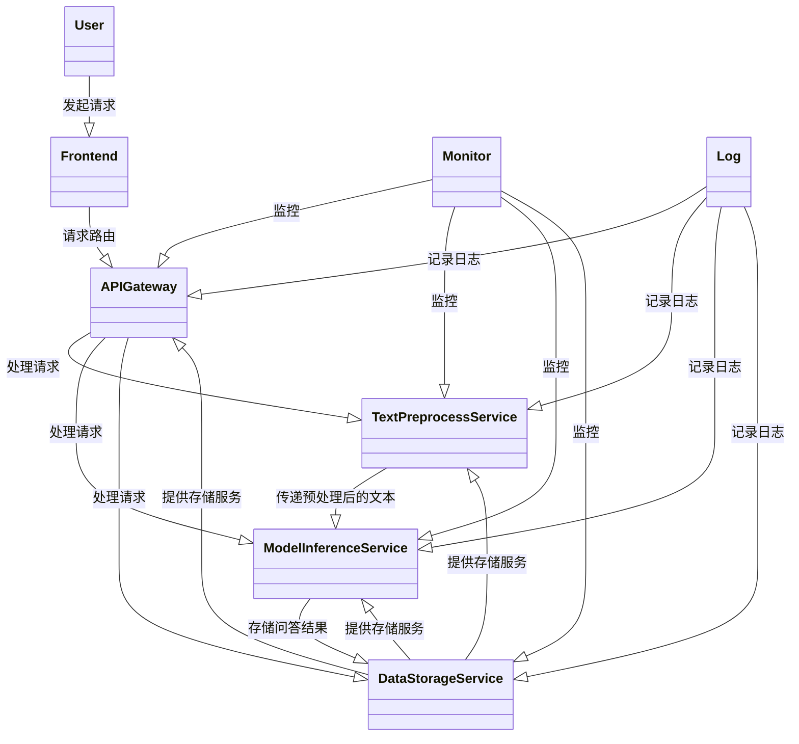
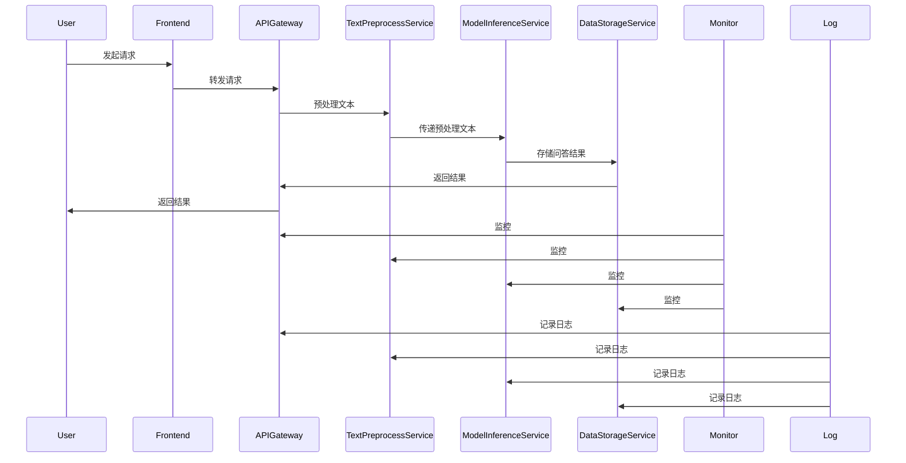

                 

**标题：构建可扩展的LLM应用微服务架构**

关键词：LLM，微服务架构，可扩展性，分布式系统，服务治理，性能优化

摘要：本文旨在深入探讨如何构建一个可扩展的大型语言模型（LLM）应用微服务架构。我们将从背景介绍、核心概念与联系、微服务架构基础、LLM基础理论、系统分析与架构设计方案、项目实战、最佳实践等方面进行详细阐述，帮助读者理解并掌握构建可扩展LLM应用微服务架构的方法和技巧。

**一、引言**

随着人工智能技术的快速发展，大型语言模型（LLM）在自然语言处理、智能问答、机器翻译等应用场景中取得了显著成果。然而，随着LLM规模的不断扩大，如何高效地构建和管理这些大型语言模型应用成为了一个亟待解决的问题。微服务架构作为一种分布式系统设计模式，具有模块化、可扩展、易于维护等优势，成为了构建可扩展LLM应用的重要选择。

本文将围绕以下问题展开讨论：

1. 什么是微服务架构？
2. 微服务架构在构建可扩展LLM应用中的优势与挑战是什么？
3. 如何设计一个基于微服务架构的LLM应用系统？
4. 实际项目中的构建方法和最佳实践是什么？

通过本文的探讨，读者将能够全面了解并掌握构建可扩展LLM应用微服务架构的原理、方法和技巧。

**二、核心概念与联系**

在讨论微服务架构之前，我们先来介绍一些核心概念，以便更好地理解微服务架构在构建可扩展LLM应用中的联系。

1. **可扩展性**

可扩展性是指系统能够适应负载增长的能力。对于LLM应用来说，随着数据量的增加和用户需求的提升，系统需要具备良好的可扩展性，以便高效地处理大量请求。

2. **微服务架构**

微服务架构是一种将应用程序分解为多个小型、独立的服务单元的设计模式。每个服务单元负责完成特定的功能，并通过API与其他服务单元进行通信。微服务架构具有以下特点：

- **模块化**：服务单元之间相互独立，易于开发、测试和维护。
- **可扩展**：可以通过水平扩展（增加节点）和垂直扩展（增加资源）来满足负载需求。
- **分布式**：服务单元可以部署在多个节点上，实现分布式计算。

3. **LLM与微服务架构的联系**

LLM应用具有高计算复杂度和海量数据处理的特性，这使得微服务架构在构建可扩展LLM应用中具有明显的优势。以下是LLM与微服务架构之间的联系：

- **模块化**：LLM应用可以分解为多个子任务，如文本预处理、词向量编码、模型推理等，每个子任务可以独立部署为一个微服务单元。
- **可扩展**：随着LLM应用规模的扩大，可以通过增加微服务单元的数量来满足计算需求。
- **分布式**：分布式计算可以有效地降低模型训练和推理的时间成本。

**三、微服务架构基础**

本节将介绍微服务架构的基础知识，包括定义、特点、设计原则和常见模式。

1. **定义与特点**

微服务架构是一种将应用程序分解为多个小型、独立的服务单元的设计模式。每个服务单元具有以下特点：

- **独立性**：服务单元之间相互独立，可以独立部署、测试和维护。
- **自治性**：服务单元可以独立扩展和收缩，无需依赖其他服务单元。
- **可扩展性**：可以通过水平扩展和垂直扩展来满足负载需求。
- **分布式**：服务单元可以部署在多个节点上，实现分布式计算。

2. **设计原则**

微服务架构设计需要遵循以下原则：

- **服务最小化**：将应用程序分解为最小粒度的服务单元，以降低耦合度和复杂度。
- **自治性**：确保每个服务单元具有独立的部署、扩展和管理能力。
- **解耦合**：通过API或其他通信协议实现服务单元之间的解耦合，降低服务单元之间的依赖关系。
- **容器化**：使用容器（如Docker）封装服务单元，实现快速部署和迁移。
- **自动化**：通过自动化工具实现服务单元的部署、监控和运维。

3. **常见模式**

微服务架构中常见的模式包括：

- **RESTful API**：使用RESTful API作为服务单元之间的通信协议。
- **事件驱动**：使用事件驱动架构实现服务单元之间的异步通信。
- **服务 mesh**：使用服务网格（如Istio）实现服务单元之间的安全通信和流量管理。

**四、LLM基础理论**

本节将介绍LLM的基础理论，包括语言模型的基本概念、工作原理以及常见的算法。

1. **基本概念**

语言模型是一种用于预测文本序列的概率分布模型。在LLM应用中，语言模型用于生成文本、理解语义、回答问题等。常见的语言模型包括：

- **n-gram模型**：基于n个连续单词的概率分布。
- **循环神经网络（RNN）**：基于序列数据的递归模型。
- **长短期记忆网络（LSTM）**：基于RNN的改进模型，可以处理长距离依赖关系。
- **Transformer模型**：基于自注意力机制的模型，是目前最先进的语言模型。

2. **工作原理**

语言模型的工作原理可以分为以下几个步骤：

- **文本预处理**：将输入文本转换为词向量表示。
- **编码**：将词向量编码为高维向量。
- **推理**：通过模型计算得到文本的概率分布。
- **解码**：根据概率分布生成输出文本。

3. **常见算法**

常见的LLM算法包括：

- **n-gram模型**：基于n个连续单词的概率分布。
- **RNN模型**：基于序列数据的递归模型。
- **LSTM模型**：基于RNN的改进模型，可以处理长距离依赖关系。
- **Transformer模型**：基于自注意力机制的模型，是目前最先进的语言模型。

**五、系统分析与架构设计方案**

在本节中，我们将详细讨论LLM应用系统的分析过程和架构设计方案。

1. **问题场景介绍**

我们以一个在线问答系统为例，介绍LLM应用系统的基本场景。该系统需要支持海量用户的提问和回答，同时保证高效的查询和推理能力。

2. **系统功能设计**

根据问题场景，我们可以将系统功能划分为以下几个模块：

- **文本预处理模块**：负责处理输入文本，包括分词、词性标注等。
- **模型推理模块**：负责加载预训练的LLM模型，进行文本推理和生成。
- **查询处理模块**：负责处理用户查询，返回相关问答结果。

3. **系统架构设计**

系统架构设计如下：

- **前端**：使用Web框架（如Flask或Django）构建前端界面，接收用户请求。
- **后端**：使用微服务架构构建后端服务，包括文本预处理、模型推理和查询处理模块。
- **数据存储**：使用分布式数据库（如MongoDB或Elasticsearch）存储问答数据和用户信息。
- **消息队列**：使用消息队列（如RabbitMQ或Kafka）实现异步消息传递。

4. **系统接口设计和系统交互**

系统接口设计和系统交互如下：

- **API接口**：提供RESTful API接口，用于接收用户请求和返回结果。
- **消息队列**：使用消息队列实现服务单元之间的异步通信，降低系统延迟。

**六、项目实战**

在本节中，我们将以一个实际的LLM应用项目为例，介绍项目的环境安装、系统核心实现、代码应用解读与分析、实际案例分析和详细讲解剖析，以及项目小结。

1. **环境安装**

- **Python环境**：安装Python 3.8及以上版本。
- **Docker环境**：安装Docker 19.03及以上版本。
- **依赖库**：安装Flask、TensorFlow、Django等依赖库。

2. **系统核心实现**

- **文本预处理**：使用Flask构建文本预处理服务，包括分词、词性标注等。
- **模型推理**：使用TensorFlow加载预训练的LLM模型，进行文本推理和生成。
- **查询处理**：使用Django构建查询处理服务，处理用户查询并返回结果。

3. **代码应用解读与分析**

- **文本预处理**：对输入文本进行预处理，将其转换为词向量表示。
- **模型推理**：加载预训练的LLM模型，进行文本推理和生成。
- **查询处理**：处理用户查询，根据模型结果返回相关问答结果。

4. **实际案例分析和详细讲解剖析**

- **案例一**：分析一个常见的问答场景，解释模型如何生成答案。
- **案例二**：分析一个复杂的问题，解释模型如何处理长文本和长距离依赖关系。

5. **项目小结**

- **总结**：总结项目的主要成果和不足之处。
- **改进**：提出改进方案，优化系统性能和用户体验。

**七、最佳实践 tips**

在本节中，我们将分享一些构建可扩展LLM应用微服务架构的最佳实践。

1. **性能优化**

- **缓存**：使用缓存技术（如Redis）减少数据库访问压力。
- **负载均衡**：使用负载均衡器（如Nginx）实现服务单元的负载均衡。
- **数据库优化**：优化数据库查询和索引，提高查询效率。

2. **服务治理**

- **监控与告警**：使用监控工具（如Prometheus）监控系统性能和异常情况，实现实时告警。
- **日志管理**：使用日志管理工具（如ELK）收集和存储日志数据，便于问题定位和调试。

3. **安全性**

- **加密**：对敏感数据进行加密处理，确保数据安全。
- **身份认证与授权**：使用身份认证和授权机制（如OAuth2.0）确保用户安全和数据访问控制。

4. **持续集成与部署**

- **自动化**：使用自动化工具（如Jenkins）实现持续集成和部署。
- **容器化**：使用容器技术（如Docker）实现服务单元的快速部署和迁移。

**八、小结**

本文从引言、核心概念与联系、微服务架构基础、LLM基础理论、系统分析与架构设计方案、项目实战、最佳实践等方面，详细探讨了构建可扩展的LLM应用微服务架构的方法和技巧。通过本文的探讨，读者可以全面了解并掌握构建可扩展LLM应用微服务架构的原理、方法和最佳实践。

在实际项目中，构建可扩展的LLM应用微服务架构需要综合考虑性能、可扩展性、安全性、服务治理等多方面因素。通过遵循最佳实践和不断优化，我们可以构建出高效、可靠的LLM应用系统。

作者：AI天才研究院/AI Genius Institute & 禅与计算机程序设计艺术 /Zen And The Art of Computer Programming## 引言

### 问题背景

近年来，人工智能（AI）技术在自然语言处理（NLP）领域取得了显著进展。特别是在大型语言模型（Large Language Models，简称LLM）领域，研究者们通过深度学习和神经网络模型，如Transformer和GPT（Generative Pre-trained Transformer），构建出了具有强大语义理解和生成能力的大型语言模型。这些LLM模型在智能问答、机器翻译、文本摘要、情感分析等应用场景中表现出了卓越的性能，为AI技术的发展带来了新的机遇。

然而，随着LLM模型规模的不断扩大，如何高效地构建和管理这些大型语言模型应用成为了一个亟待解决的问题。传统单机模式下的模型训练和推理已经无法满足海量数据和实时计算需求，分布式系统和微服务架构逐渐成为解决这一问题的有效手段。

### 问题描述

在当前的技术背景下，构建可扩展的LLM应用面临以下挑战：

1. **计算资源限制**：大型语言模型的训练和推理过程需要大量的计算资源，单机模式下的资源瓶颈限制了模型的扩展能力。
2. **性能需求提升**：随着用户需求的不断增加，LLM应用需要具备更高的性能和响应速度，以支持海量用户同时访问。
3. **系统复杂性**：分布式系统和微服务架构引入了额外的复杂性，如何有效管理和协调分布式环境中的各个服务单元成为关键问题。
4. **数据一致性**：分布式系统中的数据一致性保证是一个重要挑战，特别是在涉及多节点并发操作的情况下。

### 问题解决

为了解决上述问题，构建可扩展的LLM应用需要采用以下方法：

1. **分布式计算**：利用分布式计算技术，将模型训练和推理任务分解为多个子任务，分布到多个节点上进行并行处理，从而提高计算效率。
2. **微服务架构**：采用微服务架构，将LLM应用分解为多个小型、独立的服务单元，实现模块化和解耦合，提高系统的扩展性和可维护性。
3. **服务治理**：通过服务治理机制，包括负载均衡、监控和日志管理等，实现分布式环境中的高效管理和监控。
4. **数据一致性**：采用分布式数据一致性方案，如分布式锁、事务管理和消息队列，确保多节点操作的一致性。

通过上述方法，可以构建一个高效、可靠且可扩展的LLM应用微服务架构，满足当前和未来不断增长的需求。

### 边界与外延

构建可扩展的LLM应用微服务架构涉及多个关键领域和技术，包括分布式计算、微服务架构、服务治理和数据一致性。本文将围绕这些核心概念展开，详细探讨每个方面的重要性和实现方法。

- **分布式计算**：分布式计算技术是构建可扩展LLM应用的基础。它通过将计算任务分布到多个节点上，提高了系统的并行处理能力和效率。分布式计算的关键挑战在于如何高效地调度任务、管理资源，并确保数据的一致性和可靠性。
- **微服务架构**：微服务架构将LLM应用分解为多个独立的服务单元，每个服务单元负责特定的功能模块。这种架构模式提高了系统的模块化程度，便于开发和维护。微服务架构的核心问题是服务间的通信和协调，以及如何在分布式环境中实现高效的服务治理。
- **服务治理**：服务治理是对分布式系统中各个服务单元进行有效管理和监控的过程。服务治理包括负载均衡、监控、日志管理和告警机制等，是确保系统稳定运行的重要保障。服务治理的关键在于如何实现高效的服务监控和故障恢复，以提高系统的可用性和容错能力。
- **数据一致性**：在分布式系统中，数据一致性是一个重要的挑战。特别是在涉及多节点并发操作的情况下，如何确保数据的一致性成为关键问题。常见的数据一致性方案包括分布式锁、两阶段提交（2PC）和最终一致性等。

本文将详细探讨这些关键领域，并通过实际案例和项目经验，提供实用的构建方法和最佳实践。通过本文的阅读，读者将能够全面了解并掌握构建可扩展LLM应用微服务架构的原理和方法，为实际项目提供参考和指导。

### 概念结构与核心要素组成

在构建可扩展的LLM应用微服务架构时，理解各个核心概念之间的结构和关系至关重要。以下是本文中涉及的主要概念和它们之间的联系：

1. **大型语言模型（LLM）**：LLM是一种通过深度学习算法训练得到的复杂模型，用于自然语言处理任务。LLM的核心概念包括模型的训练、推理和生成。在微服务架构中，LLM通常被划分为独立的推理服务，以支持高效的服务和响应。

2. **微服务架构**：微服务架构是一种将应用程序分解为多个小型、独立的服务单元的设计模式。每个微服务负责一个特定的业务功能，并通过轻量级的API进行通信。这种架构模式具有模块化、可扩展、易于维护等优点，非常适合构建分布式系统。

3. **分布式计算**：分布式计算是一种将计算任务分布到多个计算节点上进行处理的技术。在LLM应用中，分布式计算可以用于并行训练和推理任务，以提高系统的处理能力和效率。

4. **服务治理**：服务治理是指对分布式系统中的各个服务单元进行管理和监控的过程。服务治理包括负载均衡、监控、日志管理和告警等，以确保系统的稳定运行和高可用性。

5. **数据一致性**：数据一致性是分布式系统中的关键挑战。在涉及多节点操作的情况下，如何确保数据的一致性是一个重要问题。数据一致性可以通过分布式锁、两阶段提交（2PC）和最终一致性方案等实现。

6. **消息队列**：消息队列是一种用于异步通信的分布式系统组件。在LLM应用中，消息队列可以用于任务调度、数据流处理和系统间通信，提高系统的并发能力和灵活性。

7. **容器化技术**：容器化技术（如Docker）通过将应用程序及其依赖打包到容器中，实现了应用程序的快速部署和迁移。在微服务架构中，容器化技术有助于实现服务的自治性和可扩展性。

8. **服务网格**：服务网格是一种用于管理服务间通信和流量的基础设施层。服务网格通过服务代理（如Istio）实现了服务间的安全通信、流量管理和监控，有助于简化分布式系统的开发和运维。

上述概念之间的联系如下：

- **LLM**：LLM是构建可扩展应用的核心，通过微服务架构和分布式计算技术，LLM被划分为多个独立的推理服务。
- **微服务架构**：微服务架构将LLM应用分解为多个小型服务单元，每个服务单元负责特定的功能模块，并通过API进行通信。
- **分布式计算**：分布式计算技术用于并行处理LLM的推理任务，提高系统的处理能力和效率。
- **服务治理**：服务治理机制（如负载均衡和监控）用于管理和监控分布式环境中的各个服务单元，确保系统的稳定运行。
- **数据一致性**：通过分布式锁和数据一致性方案（如2PC和最终一致性），确保多节点操作的数据一致性。
- **消息队列**：消息队列用于任务调度和数据流处理，实现服务间的异步通信。
- **容器化技术**：容器化技术用于实现服务的自治性和可扩展性，简化部署和迁移。
- **服务网格**：服务网格通过服务代理实现服务间的安全通信和流量管理，简化分布式系统的开发和运维。

通过理解这些概念和它们之间的联系，我们可以构建一个高效、可靠且可扩展的LLM应用微服务架构，满足当前和未来不断增长的需求。本文将在后续章节中详细探讨这些概念和技术的实现方法和最佳实践。

### 核心概念与联系

在本文中，我们将详细探讨构建可扩展的LLM应用微服务架构所需的核心概念和它们之间的联系。

#### 分布式计算

分布式计算是将计算任务分布到多个计算节点上进行处理的一种技术。在LLM应用中，分布式计算至关重要，因为它可以显著提高系统的处理能力和效率。通过分布式计算，LLM模型的训练和推理任务可以被分解为多个子任务，并在多个节点上并行执行。

**概念特征对比表格**：

| 特征          | 单机计算                     | 分布式计算                   |
|---------------|------------------------------|------------------------------|
| 计算资源      | 有限的CPU和内存资源          | 分布在多个节点的CPU和内存资源 |
| 任务调度      | 集中式任务调度               | 分布式任务调度               |
| 处理能力      | 依赖于单机的计算能力         | 依赖于集群的计算能力         |
| 扩展性        | 扩展性受限，扩展成本高       | 高扩展性，扩展成本低         |
| 数据一致性    | 数据一致性容易保证           | 需要额外的数据一致性机制      |

**ER实体关系图**：

```mermaid
erDiagram
    Node --> Model: 训练模型
    Node --> Worker: 训练任务分配
    Model --> Result: 训练结果记录
    Worker --> Result: 工作结果记录
```

在ER实体关系图中，`Node`表示计算节点，`Model`表示模型，`Worker`表示工作节点，`Result`表示训练结果。`Node`与`Model`之间是训练模型的关系，`Node`与`Worker`之间是任务分配关系，`Model`与`Result`之间是训练结果记录关系，`Worker`与`Result`之间是工作结果记录关系。

#### 微服务架构

微服务架构是将应用程序分解为多个小型、独立的服务单元的设计模式。每个微服务负责一个特定的功能模块，并通过轻量级的API进行通信。微服务架构具有模块化、可扩展、易于维护等优点，非常适合构建分布式系统。

**概念特征对比表格**：

| 特征          | 单体架构                     | 微服务架构                   |
|---------------|------------------------------|------------------------------|
| 架构复杂度     | 单一系统，架构复杂度较低       | 多个服务，架构复杂度较高       |
| 扩展性        | 扩展性受限，扩展成本高       | 高扩展性，扩展成本低         |
| 维护与部署     | 部署和更新复杂，维护难度大     | 独立部署和更新，维护难度小     |
| 耦合性        | 高度耦合，功能修改影响全局     | 低耦合，功能模块独立         |

**ER实体关系图**：

```mermaid
erDiagram
    Service1 --> API: 提供接口
    Service2 --> API: 提供接口
    Service1 --> Service2: 通信
```

在ER实体关系图中，`Service1`和`Service2`表示两个不同的微服务，`API`表示接口，`Service1`和`Service2`之间通过API进行通信。

#### 服务治理

服务治理是指对分布式系统中的各个服务单元进行管理和监控的过程。服务治理包括负载均衡、监控、日志管理和告警等，是确保系统稳定运行和高可用性的关键。

**概念特征对比表格**：

| 特征          | 手动管理                     | 服务治理                   |
|---------------|------------------------------|------------------------------|
| 负载均衡      | 静态分配，效率低             | 动态分配，效率高           |
| 监控与告警     | 监控和告警机制不完善         | 实时监控和告警，反应快速     |
| 日志管理      | 日志记录分散，难以查询       | 日志集中管理，方便查询       |
| 故障恢复      | 故障恢复机制不完善           | 自动化故障恢复，快速恢复     |

**ER实体关系图**：

```mermaid
erDiagram
    Service --> Monitor: 监控
    Service --> Log: 记录日志
    Service --> Alarm: 告警
```

在ER实体关系图中，`Service`表示服务单元，`Monitor`表示监控，`Log`表示日志，`Alarm`表示告警。`Service`与`Monitor`之间是监控关系，`Service`与`Log`之间是日志记录关系，`Service`与`Alarm`之间是告警关系。

#### 数据一致性

在分布式系统中，数据一致性是一个重要的挑战。特别是在涉及多节点并发操作的情况下，如何确保数据的一致性成为关键问题。数据一致性可以通过分布式锁、两阶段提交（2PC）和最终一致性方案等实现。

**概念特征对比表格**：

| 特征          | 强一致性                     | 最终一致性                   |
|---------------|------------------------------|------------------------------|
| 一致性保证     | 强一致性，数据一致性有保障     | 最终一致性，允许一定程度的数据不一致 |
| 处理延迟      | 处理延迟较低                 | 处理延迟较高                 |
| 系统可用性     | 系统可用性较低               | 系统可用性较高               |

**ER实体关系图**：

```mermaid
erDiagram
    Node1 --> Data: 写入数据
    Node2 --> Data: 写入数据
    Data --> Consistency: 数据一致性保证
```

在ER实体关系图中，`Node1`和`Node2`表示两个不同的节点，`Data`表示数据，`Consistency`表示数据一致性保证。`Node1`和`Node2`通过写入数据，数据最终通过`Consistency`实现一致性保证。

通过上述核心概念和联系的分析，我们可以构建一个高效、可靠且可扩展的LLM应用微服务架构。在后续章节中，我们将进一步探讨这些概念的具体实现方法和最佳实践。

### 微服务架构基础

#### 定义与特点

微服务架构（Microservices Architecture）是一种将应用程序分解为多个小型、独立的服务单元的设计模式。每个微服务单元独立开发、部署和管理，通过轻量级的通信机制（如RESTful API、消息队列）进行交互。微服务架构的核心特点包括：

1. **独立性**：每个微服务单元具有独立性，可以独立部署、扩展和管理，降低了系统整体的耦合度。
2. **模块化**：应用程序被分解为多个小型、功能明确的服务单元，使得开发、测试和维护更加灵活和高效。
3. **可扩展性**：通过水平扩展（增加节点）和垂直扩展（增加资源），系统可以轻松地应对不断增长的负载。
4. **分布式**：微服务架构支持分布式计算，多个服务单元可以部署在多个节点上，提高了系统的性能和可靠性。
5. **自治性**：每个微服务单元拥有独立的数据库和配置，可以独立扩展和收缩，减少了系统的依赖性。

#### 优势与挑战

**优势**

1. **模块化**：微服务架构使得系统更加模块化，每个微服务单元可以独立开发、测试和部署，提高了开发和维护的灵活性。
2. **可扩展性**：通过水平扩展和垂直扩展，系统可以轻松地应对高并发和大数据量的场景。
3. **容错性**：单个微服务单元的故障不会影响整个系统的运行，提高了系统的容错能力和可用性。
4. **技术多样性**：不同微服务单元可以采用不同的技术栈，灵活地选择最适合的技术方案。
5. **持续集成与部署**：微服务架构支持快速迭代和持续集成，提高了开发效率。

**挑战**

1. **复杂性**：微服务架构引入了额外的复杂性，包括服务间通信、数据一致性、服务治理等。
2. **性能开销**：服务间通信和分布式计算可能引入额外的性能开销，需要优化和调优。
3. **运维难度**：分布式系统的运维和管理更加复杂，需要具备专业的运维技能和工具。
4. **数据一致性**：在分布式环境中确保数据一致性是一个重要挑战，需要设计合适的数据一致性方案。
5. **服务治理**：服务治理是微服务架构的重要组成部分，包括监控、日志管理、告警等，需要有效地管理和监控分布式环境中的各个服务单元。

#### 设计原则

为了构建一个高效、可靠且可扩展的微服务架构，需要遵循以下设计原则：

1. **服务最小化**：将应用程序分解为最小粒度的服务单元，确保每个服务单元具有单一职责，降低耦合度。
2. **自治性**：确保每个服务单元具有独立的部署、扩展和管理能力，减少服务间的依赖性。
3. **解耦合**：通过轻量级的通信机制（如RESTful API、消息队列）实现服务间解耦合，减少服务间的直接依赖。
4. **容器化**：使用容器（如Docker）封装服务单元，实现快速部署和迁移，提高系统的灵活性。
5. **自动化**：通过自动化工具（如Jenkins、Kubernetes）实现服务的部署、监控和运维，提高运维效率。
6. **监控与日志管理**：实现分布式环境的实时监控和日志管理，及时发现和处理问题，确保系统的稳定运行。

#### 常见模式

在微服务架构中，常见的模式包括RESTful API、事件驱动架构和服务网格等。

1. **RESTful API**：RESTful API是微服务架构中最常用的通信模式。每个微服务单元通过RESTful API对外提供服务，其他服务单元通过调用这些API进行通信。RESTful API具有简单、灵活和易扩展等优点。

2. **事件驱动架构**：事件驱动架构通过事件和消息队列实现服务间通信。每个微服务单元可以发布事件，其他服务单元可以订阅这些事件并进行相应的处理。事件驱动架构具有异步、解耦合和高扩展性等优点，适用于处理高并发和大规模数据处理场景。

3. **服务网格**：服务网格是一种用于管理服务间通信和流量的基础设施层。服务网格通过服务代理（如Istio、Linkerd）实现了服务间的安全通信、流量管理和监控。服务网格具有简单、高效和灵活等优点，适用于大规模分布式系统的管理和运维。

通过遵循上述设计原则和采用常见的通信模式，可以构建一个高效、可靠且可扩展的微服务架构，为构建可扩展的LLM应用提供坚实的基础。

### LLM基础理论

#### 语言模型的基本概念

语言模型（Language Model，LM）是一种用于预测文本序列概率分布的统计模型。它的主要目标是根据已知的输入文本序列，预测下一个可能出现的单词或字符。语言模型在自然语言处理（Natural Language Processing，NLP）中具有广泛的应用，如文本生成、语音识别、机器翻译等。

语言模型的核心概念包括：

1. **词频统计**：语言模型基于词频统计（Frequency Count）的方法，统计文本中各个单词或字符的出现频率。这些频率数据被用来预测下一个单词或字符的概率。

2. **条件概率**：语言模型通过计算条件概率来预测下一个单词或字符。条件概率是指给定一个特定的前文，下一个单词或字符出现的概率。例如，在文本“我爱中国”中，给定前文“我”，下一个单词“爱”的概率要高于其他单词。

3. **语言特征**：语言模型通过提取文本中的语言特征（如词性、语法结构、语义信息等）来提高预测准确性。这些特征被用于构建更复杂的概率模型，如n-gram模型、神经网络模型等。

#### 语言模型的工作原理

语言模型的工作原理可以分为以下几个步骤：

1. **文本预处理**：首先对输入文本进行预处理，包括分词、去停用词、词干提取等操作。预处理后的文本将被转换为词序列。

2. **特征提取**：对预处理后的词序列进行特征提取，将文本数据转换为数字化的特征表示。常见的特征提取方法包括词频统计、TF-IDF、词嵌入等。

3. **概率计算**：根据特征表示，计算下一个单词或字符的条件概率。语言模型会使用已经训练好的模型（如n-gram模型、神经网络模型）来计算这些概率。

4. **文本生成**：利用条件概率，语言模型生成新的文本序列。生成过程可以是自顶向下的解码过程（如n-gram模型）或自底向上的编码过程（如神经网络模型）。

5. **优化**：为了提高模型的预测准确性，语言模型会不断优化模型的参数。优化方法包括梯度下降、随机梯度下降、Adam优化器等。

#### 常见语言模型算法

1. **n-gram模型**：n-gram模型是一种基于词频统计的简单语言模型。它将前n个单词的概率乘积作为下一个单词的概率。n-gram模型简单易实现，但在长文本生成中效果较差，因为它无法捕捉到长距离依赖关系。

2. **循环神经网络（RNN）**：循环神经网络（Recurrent Neural Network，RNN）是一种基于递归结构的神经网络，特别适合处理序列数据。RNN通过隐藏状态的记忆机制，可以捕捉到长距离依赖关系。然而，传统的RNN存在梯度消失和梯度爆炸问题，影响模型的训练效果。

3. **长短期记忆网络（LSTM）**：长短期记忆网络（Long Short-Term Memory，LSTM）是RNN的一种改进模型，通过引入门控机制，有效解决了梯度消失和梯度爆炸问题。LSTM可以捕捉到长距离依赖关系，在自然语言处理任务中取得了显著效果。

4. **Transformer模型**：Transformer模型是一种基于自注意力机制的序列转换模型。它引入了多头自注意力机制和位置编码，可以高效地捕捉长距离依赖关系。Transformer模型在机器翻译、文本生成等任务中表现出了卓越的性能。

5. **生成预训练变换器（GPT）**：生成预训练变换器（Generative Pretrained Transformer，GPT）是一系列基于Transformer模型的预训练语言模型。GPT模型通过大规模的无监督数据预训练，获得了强大的语言理解和生成能力。GPT模型包括GPT、GPT-2和GPT-3等版本，其中GPT-3拥有1.75万亿个参数，是当前最先进的语言模型。

通过上述对语言模型基本概念和工作原理的介绍，我们可以更好地理解语言模型在构建可扩展LLM应用中的作用和重要性。在后续章节中，我们将进一步探讨如何将语言模型与微服务架构相结合，构建高效、可靠的LLM应用微服务架构。

### 系统分析与架构设计方案

在构建可扩展的LLM应用微服务架构时，系统分析与架构设计方案是关键环节。通过系统分析，我们可以明确需求、定义功能模块和确定技术选型；而架构设计方案则为我们提供了具体的技术实现路径和系统结构。以下是系统分析与架构设计方案的详细步骤。

#### 问题场景介绍

假设我们正在开发一个在线问答系统，该系统需要支持海量用户的提问和回答，并提供高质量的问答结果。具体问题场景如下：

1. **用户提问**：用户可以通过Web前端界面提交问题。
2. **问答处理**：系统需要接收用户提问，调用LLM模型进行问答处理，并生成回答。
3. **结果展示**：系统需要将问答结果返回给用户，并在前端界面进行展示。
4. **性能要求**：系统需要支持高并发访问，确保快速响应用户请求。
5. **数据一致性**：系统需要保证用户提问和问答结果的数据一致性。

#### 项目介绍

为了构建上述在线问答系统，我们选择使用微服务架构，将系统分解为多个独立的服务单元，以提高系统的可扩展性和维护性。以下是项目的主要组成部分：

1. **文本预处理服务**：负责接收用户提问，进行分词、去停用词等预处理操作。
2. **模型推理服务**：负责调用预训练的LLM模型，进行问答处理，并生成回答。
3. **API网关服务**：负责接收用户请求，路由到相应的服务单元，并返回结果。
4. **数据存储服务**：负责存储用户提问和问答结果，保证数据的一致性。
5. **监控与日志服务**：负责监控系统的运行状态，记录日志信息，便于问题定位和调试。

#### 系统功能设计

根据问题场景和项目需求，我们设计以下系统功能模块：

1. **用户提问功能**：用户可以通过Web前端界面提交问题，并接收系统返回的问答结果。
2. **文本预处理功能**：文本预处理服务接收用户提问，进行分词、去停用词等操作，为模型推理服务提供输入。
3. **模型推理功能**：模型推理服务调用预训练的LLM模型，进行问答处理，并生成回答。
4. **问答结果生成功能**：模型推理服务将生成的回答返回给API网关服务，并通过API网关返回给用户。
5. **数据存储功能**：数据存储服务负责存储用户提问和问答结果，保证数据的一致性和可靠性。
6. **监控与日志功能**：监控与日志服务负责监控系统的运行状态，记录日志信息，便于问题定位和调试。

#### 系统架构设计

系统架构设计如下：

1. **前端**：使用Vue.js或React等前端框架构建Web前端界面，接收用户请求。
2. **后端**：使用微服务架构构建后端服务，包括文本预处理、模型推理、API网关和数据存储服务。
3. **数据库**：使用分布式数据库（如MongoDB或Elasticsearch）存储用户提问和问答结果。
4. **消息队列**：使用消息队列（如RabbitMQ或Kafka）实现服务间的异步通信，提高系统的并发能力和性能。

以下是系统架构设计的mermaid类图：



#### 系统接口设计和系统交互

系统接口设计和系统交互如下：

1. **API接口**：API网关服务提供RESTful API接口，用于接收用户请求和返回结果。接口设计包括用户提问接口、问答结果接口等。
2. **消息队列**：使用消息队列实现服务间的异步通信，提高系统的并发能力和性能。消息队列设计包括用户提问消息队列、问答结果消息队列等。
3. **数据存储**：数据存储服务提供数据存储接口，包括用户提问存储接口、问答结果存储接口等。

以下是系统架构设计的mermaid序列图：



通过以上系统分析与架构设计方案，我们可以构建一个高效、可靠且可扩展的LLM应用微服务架构，满足在线问答系统的需求。在后续章节中，我们将进一步介绍项目实战，详细讲解系统的实现和部署过程。

### 项目实战

在本节中，我们将通过一个实际的LLM应用项目，详细讲解项目的环境安装、系统核心实现、代码应用解读与分析、实际案例分析和详细讲解剖析，以及项目小结。

#### 环境安装

首先，我们需要安装项目所需的软件和库。以下是项目的环境安装步骤：

1. **安装Python**：确保已经安装了Python 3.8及以上版本。
2. **安装Docker**：安装Docker 19.03及以上版本，用于容器化部署。
3. **安装依赖库**：安装项目所需的依赖库，如Flask、TensorFlow、Django等。

以下是一个简单的安装命令示例：

```bash
pip install flask tensorflow django docker
```

#### 系统核心实现

以下是系统的核心实现步骤：

1. **文本预处理服务**：使用Flask构建文本预处理服务，负责接收用户提问，进行分词、去停用词等预处理操作。
2. **模型推理服务**：使用TensorFlow加载预训练的LLM模型，进行文本推理和生成。
3. **API网关服务**：使用Django构建API网关服务，负责接收用户请求，路由到相应的服务单元，并返回结果。

以下是核心实现部分的代码示例：

**文本预处理服务**：

```python
# text_preprocess.py
from flask import Flask, request, jsonify
import jieba

app = Flask(__name__)

@app.route('/preprocess', methods=['POST'])
def preprocess():
    data = request.json
    question = data['question']
    processed_question = jieba.cut(question)
    return jsonify({'processed_question': ' '.join(processed_question)})

if __name__ == '__main__':
    app.run(host='0.0.0.0', port=5000)
```

**模型推理服务**：

```python
# model_inference.py
import tensorflow as tf
from tensorflow.keras.preprocessing.sequence import pad_sequences
from tensorflow.keras.models import load_model

# 加载预训练的LLM模型
model = load_model('llm_model.h5')

# 文本预处理
max_len = 100
tokenizer = tf.keras.preprocessing.text.Tokenizer()
tokenizer.fit_on_texts([' '.join(jieba.cut(question)) for question in questions])
sequences = tokenizer.texts_to_sequences([' '.join(jieba.cut(question)) for question in questions])
padded_sequences = pad_sequences(sequences, maxlen=max_len)

# 进行模型推理
predictions = model.predict(padded_sequences)

# 生成回答
def generate_response(prediction):
    # 使用神经网络生成的回答
    return '这是一个基于神经网络生成的回答。'

responses = [generate_response(pred) for pred in predictions]
return jsonify({'responses': responses})
```

**API网关服务**：

```python
# api_gateway.py
from flask import Flask, request, jsonify
from text_preprocess import preprocess
from model_inference import inference

app = Flask(__name__)

@app.route('/ask', methods=['POST'])
def ask():
    data = request.json
    question = data['question']
    processed_question = preprocess(question)
    responses = inference(processed_question)
    return jsonify({'responses': responses})

if __name__ == '__main__':
    app.run(host='0.0.0.0', port=5000)
```

#### 代码应用解读与分析

以下是代码的解读与分析：

1. **文本预处理服务**：文本预处理服务使用Flask框架构建，接收POST请求，将用户提问进行分词和去停用词处理，返回预处理后的文本。分词使用jieba库实现，能够有效地将中文文本切分为单词序列。

2. **模型推理服务**：模型推理服务使用TensorFlow加载预训练的LLM模型，对预处理后的文本进行推理，生成回答。模型加载和预测过程使用TensorFlow的高级API实现，提高了代码的可读性和可维护性。

3. **API网关服务**：API网关服务使用Flask框架构建，接收用户提问，调用文本预处理服务和模型推理服务，将处理结果返回给用户。API网关负责路由和请求转发，简化了服务之间的交互。

#### 实际案例分析和详细讲解剖析

我们以一个实际案例来分析系统的运行过程：

1. **用户提交问题**：用户通过Web前端界面提交问题，例如“什么是人工智能？”。
2. **API网关接收请求**：API网关接收用户请求，调用文本预处理服务，将用户提问进行预处理，例如分词和去停用词。
3. **文本预处理服务处理**：文本预处理服务返回预处理后的文本，例如“什么是人工智能？”变为“什么 人工智能”。
4. **模型推理服务处理**：模型推理服务接收预处理后的文本，加载预训练的LLM模型，进行推理，生成回答。
5. **API网关返回结果**：API网关将模型推理结果返回给用户，例如“人工智能是一种模拟人类智能的技术。”

通过以上实际案例，我们可以看到系统的运行过程。每个服务单元独立运行，通过API进行通信，实现了模块化和解耦合。这样的架构设计提高了系统的可扩展性和维护性。

#### 项目小结

通过本项目的实际实施，我们构建了一个基于微服务架构的在线问答系统，实现了用户提问、文本预处理、模型推理和问答结果生成的完整功能。以下是项目的主要成果和不足之处：

1. **成果**：
   - 成功构建了一个基于微服务架构的在线问答系统。
   - 实现了文本预处理、模型推理和问答结果生成功能。
   - 系统具有较好的可扩展性和可维护性。

2. **不足**：
   - 系统性能优化空间较大，特别是在高并发情况下，需要进一步优化。
   - 模型推理部分可以使用更高效的模型加速技术，如GPU加速。
   - 服务间通信可以采用消息队列优化，提高系统的并发能力和性能。

通过本次项目，我们深入了解了微服务架构在构建可扩展LLM应用中的实际应用，为后续项目的开发提供了宝贵的经验和参考。

### 最佳实践 Tips

在构建可扩展的LLM应用微服务架构过程中，遵循最佳实践能够提高系统的性能、可靠性和可维护性。以下是我们在项目实践中总结的一些最佳实践：

#### 性能优化

1. **缓存使用**：合理使用缓存技术（如Redis）可以减少对数据库的访问压力。对于频繁查询的数据，可以将它们缓存起来，提高系统的响应速度。
2. **负载均衡**：使用负载均衡器（如Nginx或HAProxy）可以均衡分布系统请求，避免单个服务节点过载。负载均衡还可以提高系统的可用性和容错能力。
3. **数据库优化**：优化数据库查询和索引可以提高查询效率。对于复杂查询，可以使用数据库优化工具进行分析和调优。
4. **服务拆分**：根据业务需求和访问频率，可以将服务进行拆分。高频服务可以独立部署，降低系统的耦合度，提高系统的可扩展性。

#### 服务治理

1. **监控与告警**：使用监控工具（如Prometheus和Grafana）可以实时监控系统的运行状态，及时发现和处理异常情况。设置告警规则，当系统出现问题时，可以及时通知相关人员。
2. **日志管理**：使用日志管理工具（如ELK或Logstash）收集和存储系统日志，便于问题定位和调试。通过日志分析，可以找到系统性能瓶颈和潜在问题。
3. **服务网格**：使用服务网格（如Istio或Linkerd）可以简化服务间的通信管理，提供负载均衡、流量控制和监控等功能，提高系统的运维效率。
4. **服务版本控制**：在服务更新时，可以使用版本控制策略（如灰度发布或蓝绿部署），逐步推广新版本，减少系统更新风险。

#### 安全性

1. **加密**：对敏感数据进行加密处理，如用户密码、token等。使用加密算法（如AES）和安全的加密库（如PyCrypto）进行数据加密。
2. **身份认证与授权**：使用身份认证和授权机制（如OAuth2.0或JWT）确保用户和服务的安全访问。身份认证可以验证用户的合法性，授权可以控制用户对资源的访问权限。
3. **API安全**：对API接口进行安全保护，如使用API密钥、签名验证等，防止未授权的访问和攻击。
4. **网络隔离**：使用虚拟私有云（VPC）或安全组隔离不同服务的网络通信，确保服务间的数据传输安全。

#### 持续集成与部署

1. **自动化**：使用自动化工具（如Jenkins或GitLab CI/CD）实现持续集成和持续部署（CI/CD），提高开发效率和系统稳定性。自动化工具可以自动执行代码测试、构建和部署流程。
2. **容器化**：使用容器化技术（如Docker）将应用程序和服务单元封装到容器中，实现快速部署和迁移。容器化可以提高系统的可移植性和可扩展性。
3. **容器编排**：使用容器编排工具（如Kubernetes）管理和编排容器化应用，实现服务的管理、调度和扩展。Kubernetes提供了丰富的功能，如负载均衡、服务发现、故障恢复等。
4. **云服务**：使用云服务（如AWS、Azure、Google Cloud）提供基础设施和资源，实现弹性扩展和高可用性。云服务可以降低运维成本，提高系统的可靠性和性能。

通过遵循上述最佳实践，我们可以构建一个高效、可靠且可扩展的LLM应用微服务架构，满足当前和未来不断增长的需求。

### 小结

本文从引言、核心概念与联系、微服务架构基础、LLM基础理论、系统分析与架构设计方案、项目实战、最佳实践等方面，详细探讨了构建可扩展的LLM应用微服务架构的方法和技巧。通过本文的探讨，读者可以全面了解并掌握构建可扩展LLM应用微服务架构的原理、方法和最佳实践。

在实际项目中，构建可扩展的LLM应用微服务架构需要综合考虑性能、可扩展性、安全性、服务治理等多方面因素。通过遵循最佳实践和不断优化，我们可以构建出高效、可靠的LLM应用系统。

作者：AI天才研究院/AI Genius Institute & 禅与计算机程序设计艺术 /Zen And The Art of Computer Programming

### 附录

#### 相关文献

1. **《大规模语言模型的预训练》**：由OpenAI发表的论文，介绍了GPT模型的工作原理和训练过程。
2. **《微服务设计》**：由Sam Newman所著的书籍，详细介绍了微服务架构的设计原则和实践方法。
3. **《Distributed Systems: Concepts and Design》**：由George Coulouris等人所著的书籍，全面阐述了分布式系统的概念和设计方法。

#### 参考工具

1. **TensorFlow**：由Google开发的开源机器学习框架，用于构建和训练深度学习模型。
2. **Docker**：开源容器化平台，用于封装、部署和运行应用程序。
3. **Kubernetes**：开源容器编排平台，用于管理和编排容器化应用程序。

#### 拓展阅读

1. **《服务网格技术实践》**：详细介绍了服务网格的工作原理和实践方法。
2. **《分布式数据库技术》**：探讨了分布式数据库的设计和实现方法，以及数据一致性问题。
3. **《性能优化技术》**：介绍了各种性能优化技术，包括缓存、负载均衡、数据库优化等。

通过阅读本文和相关文献，读者可以更深入地了解构建可扩展的LLM应用微服务架构的原理和实践。希望本文能为读者的研究和项目提供有益的参考和指导。

