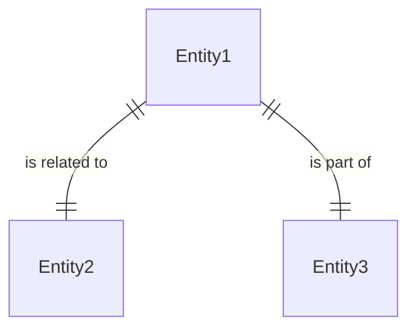
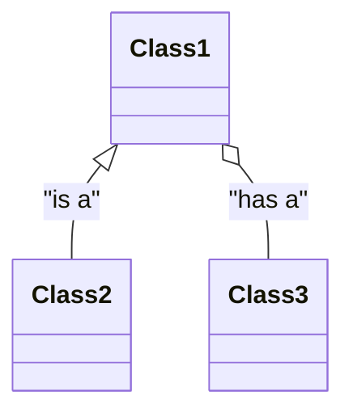
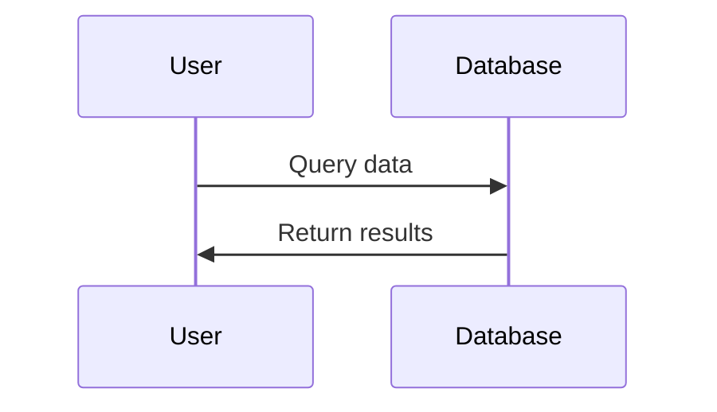
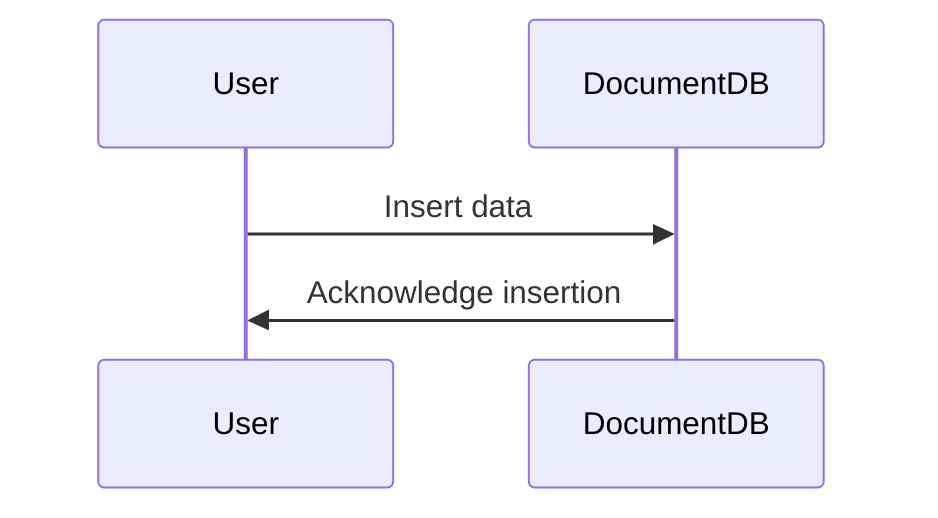
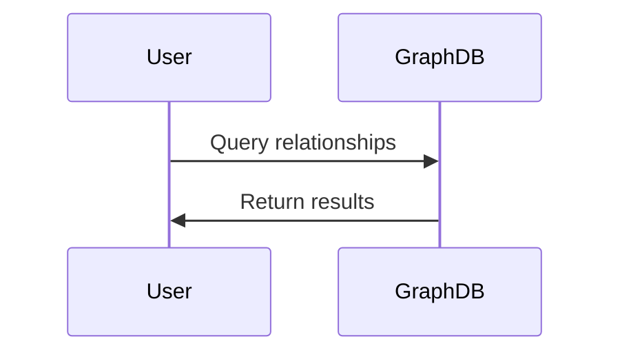
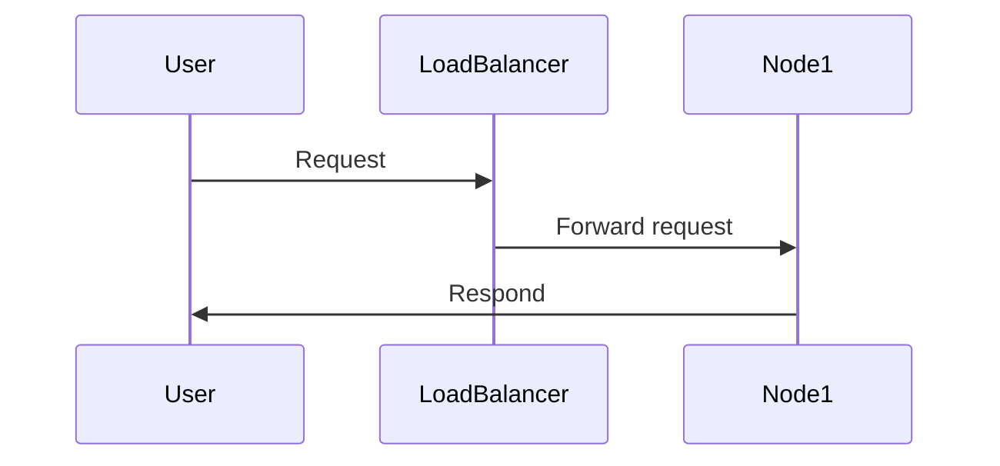
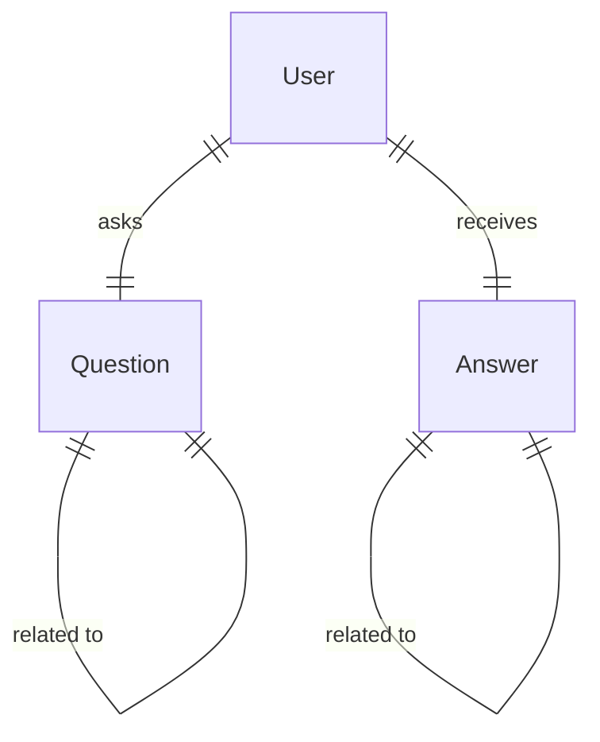
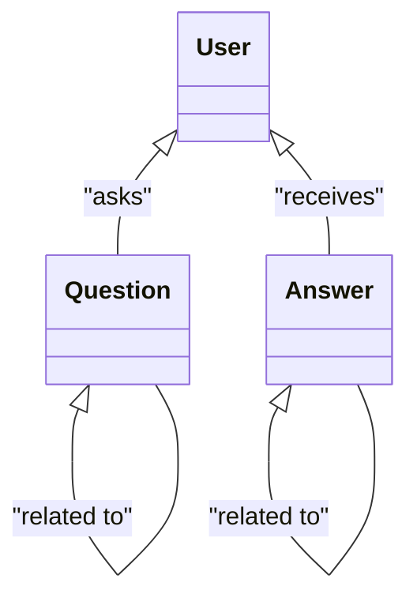
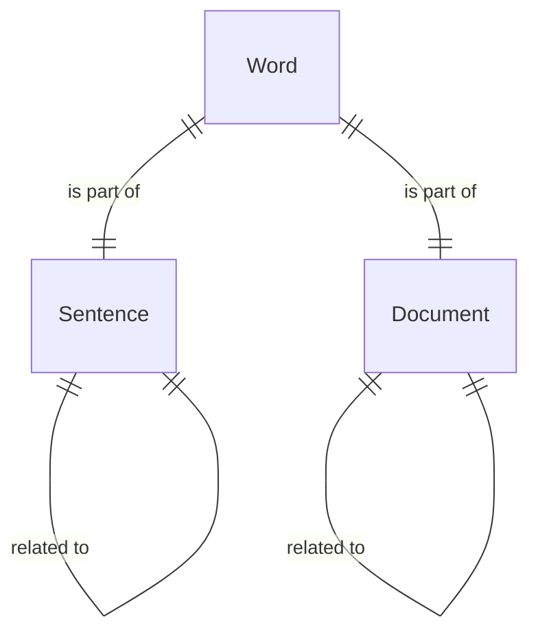

                 

# 构建可扩展的LLM应用数据模型

## 关键词

- **大规模语言模型（LLM）**
- **数据模型**
- **可扩展性**
- **系统架构设计**
- **模型训练与部署**
- **实战案例**

## 摘要

随着人工智能技术的飞速发展，大规模语言模型（LLM）在自然语言处理（NLP）领域展现出了巨大的潜力。然而，构建一个可扩展的LLM应用数据模型是确保其高效运行的关键。本文将深入探讨大规模语言模型的数据模型构建方法，以及如何实现数据模型的可扩展性。我们将分步骤分析数据模型的构建过程，从数据准备到模型训练，再到系统架构设计和部署，最后通过实战案例进行详细讲解。通过本文的阅读，读者将能够掌握构建可扩展LLM应用数据模型的核心技能。

### 引言

#### 背景介绍

机器学习模型的发展历程可以追溯到20世纪50年代。随着计算能力的提升和算法的优化，机器学习在各个领域得到了广泛应用。特别是深度学习技术的兴起，使得大规模语言模型（LLM）成为了自然语言处理（NLP）领域的重要工具。LLM通过在海量数据上进行预训练，能够自动学习语言结构和语义，从而实现文本生成、翻译、问答等多种任务。

#### 问题定义

为什么需要可扩展的数据模型？

在构建LLM应用时，数据模型的可扩展性至关重要。随着数据量的增长和应用需求的增加，系统需要能够灵活扩展，以保持高性能和稳定性。可扩展的数据模型能够支持大规模数据处理，降低系统延迟，提高用户满意度。

可扩展性在LLM应用中的重要性

LLM应用通常处理的是文本数据，数据量巨大且增长迅速。如果不具备良好的可扩展性，系统可能面临以下问题：

1. **性能下降**：随着数据量的增加，系统响应时间变长，用户体验差。
2. **资源浪费**：硬件资源无法充分利用，导致成本增加。
3. **维护困难**：系统复杂度提高，维护成本增加。

#### 书籍结构

本书将分为八个章节，系统性地介绍构建可扩展的LLM应用数据模型的方法。

- **第1章 引言**：介绍机器学习模型的发展历程和大规模语言模型（LLM）的兴起，定义问题和说明书籍结构。
- **第2章 大规模语言模型基础**：详细讲解LLM的核心技术，包括预训练、微调和Transformer架构。
- **第3章 数据模型的构建**：介绍数据模型的设计原则和实现方法。
- **第4章 可扩展性设计**：探讨如何设计可扩展的系统架构。
- **第5章 模型训练与部署**：讲解模型训练、评估和部署的流程。
- **第6章 实战案例**：通过实际案例展示数据模型构建和系统架构设计的应用。
- **第7章 未来展望**：讨论当前挑战和未来发展趋势。
- **第8章 小结与展望**：总结主要内容，提出学习与实战建议。

### 第2章 大规模语言模型基础

#### 2.1 语言模型概述

语言模型是一种预测模型，用于预测给定输入文本序列后面的下一个单词或字符。在自然语言处理（NLP）中，语言模型被广泛应用于自动完成、文本摘要、机器翻译等任务。

**核心原理**：

语言模型的核心任务是学习输入序列的概率分布。常见的语言模型有基于统计的方法（如N-gram模型）和基于神经网络的深度学习方法（如Transformer）。

**N-gram模型**：

N-gram模型是一种基于统计的语言模型，它通过统计相邻单词或字符的联合概率来预测下一个单词或字符。例如，在英语中，"the quick brown" 的下一个单词很可能是 "fox"。

$$
P(\text{fox}|\text{the quick brown}) = \frac{C(\text{the quick brown fox})}{C(\text{the quick brown})}
$$

其中，\(C(\text{the quick brown fox})\) 表示 "the quick brown fox" 出现的次数，\(C(\text{the quick brown})\) 表示 "the quick brown" 出现的次数。

**深度学习语言模型**：

深度学习语言模型通过神经网络学习文本的复杂结构。近年来，Transformer架构成为了深度学习语言模型的代表。Transformer模型通过自注意力机制（Self-Attention）和多头注意力（Multi-Head Attention）来处理文本序列，具有强大的语义理解和生成能力。

#### 2.2 LLM的核心技术

**预训练与微调**

预训练是指在一个大规模的数据集上训练语言模型，使其能够捕获语言的通用特征。预训练后的模型可以通过微调（Fine-tuning）来适应特定任务，如在问答系统、文本分类等任务上。

预训练过程通常包括以下几个步骤：

1. **数据集准备**：选择一个大规模的文本数据集，如维基百科、新闻文章等。
2. **预训练任务**：设计预训练任务，如掩码语言模型（Masked Language Model, MLM）、下一句预测（Next Sentence Prediction, NSP）等。
3. **模型训练**：使用大量数据进行预训练，优化模型参数。

微调过程则是将预训练好的模型应用于特定任务，通过调整模型参数来提高模型在特定任务上的性能。

**Transformer架构**

Transformer是一种基于自注意力机制的深度学习模型，广泛应用于NLP任务。其核心思想是通过自注意力机制来捕捉输入序列中的长距离依赖关系。

**自注意力机制**：

自注意力机制允许模型在处理每个输入序列元素时，根据其他元素的上下文信息动态调整其重要性。具体来说，自注意力机制通过计算每个输入元素与所有其他输入元素的相似度，然后加权求和，得到每个输入元素的表示。

**多头注意力**：

多头注意力是自注意力机制的一个扩展。它将输入序列分成多个子序列，每个子序列独立进行自注意力计算。多头注意力能够提高模型的容量和灵活性，使得模型能够更好地捕捉输入序列的复杂结构。

$$
\text{Attention}(Q, K, V) = \text{softmax}\left(\frac{QK^T}{\sqrt{d_k}}\right)V
$$

其中，\(Q, K, V\) 分别是查询（Query）、键（Key）和值（Value）向量，\(d_k\) 是键向量的维度。

#### 2.3 LLM评估与优化

**评估指标**

评估语言模型性能的常见指标包括：

1. **准确率（Accuracy）**：模型预测正确的样本数占总样本数的比例。
2. **精确率（Precision）**：模型预测为正类的样本中，实际为正类的比例。
3. **召回率（Recall）**：模型预测为正类的样本中，实际为正类的比例。
4. **F1分数（F1 Score）**：精确率和召回率的调和平均值。

$$
F1 = 2 \times \frac{Precision \times Recall}{Precision + Recall}
$$

**优化方法**

为了提高语言模型性能，可以采用以下优化方法：

1. **数据增强**：通过数据变换、噪声注入等方式增加训练数据的多样性，提高模型泛化能力。
2. **超参数调整**：调整学习率、批量大小等超参数，以找到最佳模型配置。
3. **正则化**：采用L1正则化、L2正则化等方法防止过拟合。
4. **集成学习**：结合多个模型的预测结果，提高整体性能。

### 第3章 数据模型的构建

#### 3.1 数据准备

**数据来源**

构建LLM应用的数据模型需要大量的高质量文本数据。这些数据可以来源于以下渠道：

1. **公开数据集**：如维基百科、新闻文章、社交媒体等。
2. **定制数据集**：根据应用场景定制的数据集，如问答数据、对话数据等。
3. **用户生成数据**：通过用户交互收集的数据，如用户评论、反馈等。

**数据预处理**

数据预处理是构建数据模型的重要步骤，包括以下任务：

1. **文本清洗**：去除停用词、标点符号、HTML标签等无关信息。
2. **分词**：将文本分割为单词或子词。
3. **词嵌入**：将文本转换为固定长度的向量表示，如Word2Vec、GloVe等。
4. **数据归一化**：对数据集进行标准化处理，如去除极端值、归一化文本长度等。

#### 3.2 数据模型设计

**数据模型的概念**

数据模型是一种组织和管理数据的抽象方式，用于描述数据的结构、属性和关系。在LLM应用中，数据模型主要涉及文本数据的管理和表示。

**数据模型的设计原则**

1. **灵活性**：数据模型应能够适应不同类型的数据和应用场景。
2. **可扩展性**：数据模型应支持数据量的增长和系统的扩展。
3. **高效性**：数据模型的设计应考虑数据处理和访问的高效性。
4. **一致性**：数据模型应确保数据的一致性和准确性。

**数据模型的设计原则**

1. **实体-关系（ER）模型**：

实体-关系（ER）模型是一种常用的数据模型设计方法，用于描述实体及其之间的关系。在LLM应用中，实体可以包括单词、句子、文档等，关系可以包括包含、引用、关联等。

下面是一个简单的ER实体关系图：



2. **领域模型（Domain Model）**：

领域模型是一种基于业务需求的数据模型，用于描述应用领域的核心概念和关系。在LLM应用中，领域模型可以用于描述文本生成、问答、对话等任务的核心概念和关系。

下面是一个简单的领域模型类图：



#### 3.3 数据模型实现

**数据模型的具体实现方法**

1. **关系数据库**：

关系数据库是一种常用的数据模型实现方法，通过定义表、字段和关系来组织数据。在LLM应用中，关系数据库可以用于存储和管理文本数据、用户数据等。

下面是一个简单的关系数据库架构：



2. **文档数据库**：

文档数据库是一种基于JSON或XML等文档格式存储数据的方法，适用于存储非结构化或半结构化数据。在LLM应用中，文档数据库可以用于存储文本数据、用户生成数据等。

下面是一个简单的文档数据库架构：



3. **图数据库**：

图数据库是一种基于图结构存储数据的数据库，适用于处理复杂的关系和关系网络。在LLM应用中，图数据库可以用于存储和管理文本数据中的关系网络，如词性关系、句子关系等。

下面是一个简单的图数据库架构：



### 第4章 可扩展性设计

#### 4.1 可扩展性需求分析

**扩展性的定义**

扩展性（Scalability）是指系统在处理数据量和用户数量增长时，能够保持性能和稳定性的能力。可扩展性是衡量系统设计好坏的重要指标之一。

**扩展性的重要性**

在LLM应用中，扩展性的重要性体现在以下几个方面：

1. **性能提升**：随着数据量和用户数量的增加，系统需要能够快速响应用户请求，保证用户体验。
2. **资源利用**：通过扩展性设计，系统可以更好地利用硬件资源，提高资源利用率。
3. **成本控制**：扩展性设计可以帮助企业降低硬件和运营成本，提高系统效率。

#### 4.2 系统架构设计

**分布式系统的设计**

为了实现数据模型的可扩展性，系统架构设计应采用分布式架构。分布式系统通过将任务分布到多个节点上，提高了系统的处理能力和可扩展性。

**负载均衡**

负载均衡是分布式系统中的一个重要组件，用于平衡不同节点之间的工作负载。常见的负载均衡算法包括轮询（Round Robin）、最小连接数（Least Connections）和加权轮询（Weighted Round Robin）等。

**负载均衡架构**

下面是一个简单的负载均衡架构：



#### 4.3 持续扩展与性能优化

**模型并行化**

模型并行化是指将大规模模型分解为多个较小的子模型，并在多个节点上同时训练。通过模型并行化，可以显著提高模型训练速度，降低训练时间。

**性能监控与调优**

性能监控与调优是确保系统稳定运行的重要环节。通过监控系统的运行状态和性能指标，可以及时发现并解决潜在问题。常见的性能优化方法包括：

1. **缓存**：使用缓存技术降低数据访问延迟。
2. **数据库优化**：优化数据库查询和索引，提高查询效率。
3. **分布式计算**：优化分布式计算任务，减少通信开销。
4. **自动化运维**：实现自动化监控和运维，提高系统稳定性。

### 第5章 模型训练与部署

#### 5.1 模型训练流程

**训练数据准备**

在训练LLM模型时，需要准备大量高质量的训练数据。训练数据的来源可以是公开数据集、定制数据集或用户生成数据。在准备训练数据时，需要注意数据的多样性和质量。

**训练过程详解**

LLM模型的训练过程通常包括以下几个步骤：

1. **数据预处理**：对训练数据进行清洗、分词、词嵌入等预处理操作。
2. **模型初始化**：初始化模型参数，可以选择随机初始化或预训练模型参数。
3. **训练过程**：使用训练数据训练模型，优化模型参数。训练过程中，可以通过梯度下降、Adam等优化算法迭代更新模型参数。
4. **模型评估**：使用验证数据评估模型性能，调整模型参数，防止过拟合。

#### 5.2 模型评估与调优

**评估指标分析**

模型评估是确保模型性能的重要步骤。常用的评估指标包括：

1. **准确率（Accuracy）**：模型预测正确的样本数占总样本数的比例。
2. **精确率（Precision）**：模型预测为正类的样本中，实际为正类的比例。
3. **召回率（Recall）**：模型预测为正类的样本中，实际为正类的比例。
4. **F1分数（F1 Score）**：精确率和召回率的调和平均值。

$$
F1 = 2 \times \frac{Precision \times Recall}{Precision + Recall}
$$

**调优策略**

为了提高模型性能，可以采用以下调优策略：

1. **数据增强**：通过数据变换、噪声注入等方式增加训练数据的多样性。
2. **超参数调整**：调整学习率、批量大小等超参数，以找到最佳模型配置。
3. **正则化**：采用L1正则化、L2正则化等方法防止过拟合。
4. **集成学习**：结合多个模型的预测结果，提高整体性能。

#### 5.3 模型部署

**部署环境搭建**

模型部署需要搭建合适的环境，包括服务器、数据库、缓存等。在部署过程中，需要考虑以下几个方面：

1. **服务器选择**：选择合适的服务器硬件，如CPU、GPU等。
2. **数据库选择**：选择适合的数据库系统，如关系数据库、文档数据库等。
3. **缓存选择**：选择适合的缓存系统，如Redis、Memcached等。

**部署策略与工具**

在模型部署过程中，可以采用以下策略和工具：

1. **容器化**：使用Docker等容器化技术，实现模型的快速部署和运维。
2. **服务网格**：使用服务网格技术，如Istio、Linkerd等，实现微服务之间的通信和安全控制。
3. **自动化部署**：使用自动化部署工具，如Jenkins、Ansible等，实现部署流程的自动化。

### 第6章 实战案例

#### 6.1 案例介绍

**案例背景**

随着人工智能技术的不断发展，自然语言处理（NLP）在各个领域得到了广泛应用。为了提高用户体验，一家大型科技公司决定构建一个基于大规模语言模型（LLM）的智能客服系统。

**案例目标**

构建一个可扩展的智能客服系统，实现以下功能：

1. **自动回复**：根据用户提问，自动生成回复文本。
2. **多语言支持**：支持多种语言的问答。
3. **个性化服务**：根据用户历史交互记录，提供个性化的回复。

#### 6.2 数据模型构建

**数据收集与预处理**

数据收集来源于以下几个方面：

1. **公开数据集**：如维基百科、新闻文章、社交媒体等。
2. **定制数据集**：根据应用场景定制的数据集，如问答数据、对话数据等。
3. **用户交互数据**：通过用户交互收集的数据，如用户评论、反馈等。

在数据预处理阶段，对收集到的数据进行以下处理：

1. **文本清洗**：去除停用词、标点符号、HTML标签等无关信息。
2. **分词**：将文本分割为单词或子词。
3. **词嵌入**：将文本转换为固定长度的向量表示。

**数据模型设计**

在构建数据模型时，采用以下方法：

1. **实体-关系（ER）模型**：描述文本数据中的实体及其关系。
2. **领域模型（Domain Model）**：描述智能客服系统的核心概念和关系。

下面是一个简单的ER实体关系图：



下面是一个简单的领域模型类图：



#### 6.3 模型训练与优化

**模型训练流程**

在训练模型时，采用以下步骤：

1. **数据预处理**：对训练数据进行清洗、分词、词嵌入等预处理操作。
2. **模型初始化**：初始化模型参数，可以选择随机初始化或预训练模型参数。
3. **训练过程**：使用训练数据训练模型，优化模型参数。训练过程中，可以通过梯度下降、Adam等优化算法迭代更新模型参数。
4. **模型评估**：使用验证数据评估模型性能，调整模型参数，防止过拟合。

**优化策略**

为了提高模型性能，可以采用以下优化策略：

1. **数据增强**：通过数据变换、噪声注入等方式增加训练数据的多样性。
2. **超参数调整**：调整学习率、批量大小等超参数，以找到最佳模型配置。
3. **正则化**：采用L1正则化、L2正则化等方法防止过拟合。
4. **集成学习**：结合多个模型的预测结果，提高整体性能。

#### 6.4 部署与扩展

**部署流程**

在模型部署过程中，采用以下步骤：

1. **容器化**：使用Docker等容器化技术，实现模型的快速部署和运维。
2. **服务网格**：使用服务网格技术，如Istio、Linkerd等，实现微服务之间的通信和安全控制。
3. **自动化部署**：使用自动化部署工具，如Jenkins、Ansible等，实现部署流程的自动化。

**扩展性评估**

在部署后，对系统的扩展性进行评估。通过增加节点数量、负载均衡等手段，验证系统在处理大规模数据量和用户请求时的性能和稳定性。

### 第7章 未来展望

#### 7.1 当前挑战与趋势

随着人工智能技术的不断发展，大规模语言模型（LLM）在自然语言处理（NLP）领域展现出了巨大的潜力。然而，在构建可扩展的LLM应用数据模型过程中，仍面临以下挑战：

1. **数据隐私与安全**：大规模数据处理过程中，如何保护用户隐私和数据安全是关键问题。
2. **计算资源消耗**：LLM模型训练和推理过程中，对计算资源的需求巨大，如何优化资源利用成为挑战。
3. **可解释性**：大规模模型通常具有强大的语义理解能力，但其内部决策过程难以解释，如何提高模型的可解释性是当前的研究热点。

#### 7.2 未来发展方向

未来，构建可扩展的LLM应用数据模型将在以下方面取得进展：

1. **数据隐私保护**：通过差分隐私、联邦学习等技术，提高数据隐私保护水平。
2. **计算效率提升**：通过模型压缩、量化等技术，降低模型计算复杂度，提高计算效率。
3. **可解释性增强**：通过可视化、解释性模型等方法，提高模型的可解释性，为用户提供更好的交互体验。

### 第8章 小结与展望

#### 8.1 主要内容回顾

本书系统性地介绍了构建可扩展的LLM应用数据模型的方法，主要内容包括：

1. **大规模语言模型基础**：介绍语言模型的概念和LLM的核心技术。
2. **数据模型的构建**：讨论数据模型的设计原则和实现方法。
3. **可扩展性设计**：探讨如何设计可扩展的系统架构。
4. **模型训练与部署**：讲解模型训练、评估和部署的流程。
5. **实战案例**：通过实际案例展示数据模型构建和系统架构设计的应用。
6. **未来展望**：讨论当前挑战和未来发展趋势。

#### 8.2 学习与实战建议

为了更好地掌握构建可扩展的LLM应用数据模型的方法，读者可以参考以下建议：

1. **理论学习**：系统学习本书中的内容，理解大规模语言模型、数据模型和系统架构设计的基本原理。
2. **实践操作**：通过实际项目练习，将理论应用到实践中，提高动手能力。
3. **拓展阅读**：阅读相关论文、书籍和技术文档，深入了解当前的研究进展和技术趋势。

#### 8.3 展望未来

随着人工智能技术的不断发展，可扩展的LLM应用数据模型将在自然语言处理（NLP）领域发挥越来越重要的作用。未来，通过不断创新和优化，我们将能够构建出更加智能、高效、可扩展的LLM应用，为人类带来更多便利。

### 作者信息

作者：AI天才研究院/AI Genius Institute & 禅与计算机程序设计艺术 /Zen And The Art of Computer Programming

本文由AI天才研究院和禅与计算机程序设计艺术共同撰写，旨在分享构建可扩展的LLM应用数据模型的核心方法和实践经验，为广大技术爱好者提供有价值的参考。

**文章结束。**```markdown
# 构建可扩展的LLM应用数据模型

## 关键词

- 大规模语言模型（LLM）
- 数据模型
- 可扩展性
- 系统架构设计
- 模型训练与部署
- 实战案例

## 摘要

本文深入探讨了大规模语言模型（LLM）应用的数据模型构建，特别是如何实现数据模型的可扩展性。文章分为八个章节，从基础概念到系统架构设计，再到实战案例，提供了详细的构建方法和实战经验。

### 引言

#### 背景介绍

机器学习模型的发展历程可以追溯到20世纪50年代。随着计算能力的提升和算法的优化，机器学习在各个领域得到了广泛应用。特别是深度学习技术的兴起，使得大规模语言模型（LLM）成为了自然语言处理（NLP）领域的重要工具。LLM通过在海量数据上进行预训练，能够自动学习语言结构和语义，从而实现文本生成、翻译、问答等多种任务。

#### 问题定义

为什么需要可扩展的数据模型？

在构建LLM应用时，数据模型的可扩展性至关重要。随着数据量的增长和应用需求的增加，系统需要能够灵活扩展，以保持高性能和稳定性。可扩展的数据模型能够支持大规模数据处理，降低系统延迟，提高用户满意度。

可扩展性在LLM应用中的重要性

LLM应用通常处理的是文本数据，数据量巨大且增长迅速。如果不具备良好的可扩展性，系统可能面临以下问题：

1. **性能下降**：随着数据量的增加，系统响应时间变长，用户体验差。
2. **资源浪费**：硬件资源无法充分利用，导致成本增加。
3. **维护困难**：系统复杂度提高，维护成本增加。

#### 书籍结构

本书将分为八个章节，系统性地介绍构建可扩展的LLM应用数据模型的方法。

- **第1章 引言**：介绍机器学习模型的发展历程和大规模语言模型（LLM）的兴起，定义问题和说明书籍结构。
- **第2章 大规模语言模型基础**：详细讲解LLM的核心技术，包括预训练、微调和Transformer架构。
- **第3章 数据模型的构建**：介绍数据模型的设计原则和实现方法。
- **第4章 可扩展性设计**：探讨如何设计可扩展的系统架构。
- **第5章 模型训练与部署**：讲解模型训练、评估和部署的流程。
- **第6章 实战案例**：通过实际案例展示数据模型构建和系统架构设计的应用。
- **第7章 未来展望**：讨论当前挑战和未来发展趋势。
- **第8章 小结与展望**：总结主要内容，提出学习与实战建议。

### 第2章 大规模语言模型基础

#### 2.1 语言模型概述

语言模型是一种预测模型，用于预测给定输入文本序列后面的下一个单词或字符。在自然语言处理（NLP）中，语言模型被广泛应用于自动完成、文本摘要、机器翻译等任务。

**核心原理**：

语言模型的核心任务是学习输入序列的概率分布。常见的语言模型有基于统计的方法（如N-gram模型）和基于神经网络的深度学习方法（如Transformer）。

**N-gram模型**：

N-gram模型是一种基于统计的语言模型，它通过统计相邻单词或字符的联合概率来预测下一个单词或字符。例如，在英语中，"the quick brown" 的下一个单词很可能是 "fox"。

$$
P(\text{fox}|\text{the quick brown}) = \frac{C(\text{the quick brown fox})}{C(\text{the quick brown})}
$$

其中，\(C(\text{the quick brown fox})\) 表示 "the quick brown fox" 出现的次数，\(C(\text{the quick brown})\) 表示 "the quick brown" 出现的次数。

**深度学习语言模型**：

深度学习语言模型通过神经网络学习文本的复杂结构。近年来，Transformer架构成为了深度学习语言模型的代表。Transformer模型通过自注意力机制（Self-Attention）和多头注意力（Multi-Head Attention）来处理文本序列，具有强大的语义理解和生成能力。

#### 2.2 LLM的核心技术

**预训练与微调**

预训练是指在一个大规模的数据集上训练语言模型，使其能够捕获语言的通用特征。预训练后的模型可以通过微调（Fine-tuning）来适应特定任务，如在问答系统、文本分类等任务上。

预训练过程通常包括以下几个步骤：

1. **数据集准备**：选择一个大规模的文本数据集，如维基百科、新闻文章等。
2. **预训练任务**：设计预训练任务，如掩码语言模型（Masked Language Model, MLM）、下一句预测（Next Sentence Prediction, NSP）等。
3. **模型训练**：使用大量数据进行预训练，优化模型参数。

微调过程则是将预训练好的模型应用于特定任务，通过调整模型参数来提高模型在特定任务上的性能。

**Transformer架构**

Transformer是一种基于自注意力机制的深度学习模型，广泛应用于NLP任务。其核心思想是通过自注意力机制来捕捉输入序列中的长距离依赖关系。

**自注意力机制**：

自注意力机制允许模型在处理每个输入序列元素时，根据其他元素的上下文信息动态调整其重要性。具体来说，自注意力机制通过计算每个输入元素与所有其他输入元素的相似度，然后加权求和，得到每个输入元素的表示。

**多头注意力**：

多头注意力是自注意力机制的一个扩展。它将输入序列分成多个子序列，每个子序列独立进行自注意力计算。多头注意力能够提高模型的容量和灵活性，使得模型能够更好地捕捉输入序列的复杂结构。

$$
\text{Attention}(Q, K, V) = \text{softmax}\left(\frac{QK^T}{\sqrt{d_k}}\right)V
$$

其中，\(Q, K, V\) 分别是查询（Query）、键（Key）和值（Value）向量，\(d_k\) 是键向量的维度。

#### 2.3 LLM评估与优化

**评估指标**

评估语言模型性能的常见指标包括：

1. **准确率（Accuracy）**：模型预测正确的样本数占总样本数的比例。
2. **精确率（Precision）**：模型预测为正类的样本中，实际为正类的比例。
3. **召回率（Recall）**：模型预测为正类的样本中，实际为正类的比例。
4. **F1分数（F1 Score）**：精确率和召回率的调和平均值。

$$
F1 = 2 \times \frac{Precision \times Recall}{Precision + Recall}
$$

**优化方法**

为了提高语言模型性能，可以采用以下优化方法：

1. **数据增强**：通过数据变换、噪声注入等方式增加训练数据的多样性。
2. **超参数调整**：调整学习率、批量大小等超参数，以找到最佳模型配置。
3. **正则化**：采用L1正则化、L2正则化等方法防止过拟合。
4. **集成学习**：结合多个模型的预测结果，提高整体性能。

### 第3章 数据模型的构建

#### 3.1 数据准备

**数据来源**

构建LLM应用的数据模型需要大量的高质量文本数据。这些数据可以来源于以下渠道：

1. **公开数据集**：如维基百科、新闻文章、社交媒体等。
2. **定制数据集**：根据应用场景定制的数据集，如问答数据、对话数据等。
3. **用户生成数据**：通过用户交互收集的数据，如用户评论、反馈等。

**数据预处理**

数据预处理是构建数据模型的重要步骤，包括以下任务：

1. **文本清洗**：去除停用词、标点符号、HTML标签等无关信息。
2. **分词**：将文本分割为单词或子词。
3. **词嵌入**：将文本转换为固定长度的向量表示，如Word2Vec、GloVe等。
4. **数据归一化**：对数据集进行标准化处理，如去除极端值、归一化文本长度等。

#### 3.2 数据模型设计

**数据模型的概念**

数据模型是一种组织和管理数据的抽象方式，用于描述数据的结构、属性和关系。在LLM应用中，数据模型主要涉及文本数据的管理和表示。

**数据模型的设计原则**

1. **灵活性**：数据模型应能够适应不同类型的数据和应用场景。
2. **可扩展性**：数据模型应支持数据量的增长和系统的扩展。
3. **高效性**：数据模型的设计应考虑数据处理和访问的高效性。
4. **一致性**：数据模型应确保数据的一致性和准确性。

**数据模型的设计原则**

1. **实体-关系（ER）模型**：

实体-关系（ER）模型是一种常用的数据模型设计方法，用于描述实体及其之间的关系。在LLM应用中，实体可以包括单词、句子、文档等，关系可以包括包含、引用、关联等。

下面是一个简单的ER实体关系图：



2. **领域模型（Domain Model）**：

领域模型是一种基于业务需求的数据模型，用于描述应用领域的核心概念和关系。在LLM应用中，领域模型可以用于描述文本生成、问答、对话等任务的核心概念和关系。

下面是一个简单的领域模型类图：


#### 3.3 数据模型实现

**数据模型的具体实现方法**

1. **关系数据库**：

关系数据库是一种常用的数据模型实现方法，通过定义表、字段和关系来组织数据。在LLM应用中，关系数据库可以用于存储和管理文本数据、用户数据等。

下面是一个简单的关系数据库架构：


2. **文档数据库**：

文档数据库是一种基于JSON或XML等文档格式存储数据的方法，适用于存储非结构化或半结构化数据。在LLM应用中，文档数据库可以用于存储文本数据、用户生成数据等。

下面是一个简单的文档数据库架构：


3. **图数据库**：

图数据库是一种基于图结构存储数据的数据库，适用于处理复杂的关系和关系网络。在LLM应用中，图数据库可以用于存储和管理文本数据中的关系网络，如词性关系、句子关系等。

下面是一个简单的图数据库架构：


### 第4章 可扩展性设计

#### 4.1 可扩展性需求分析

**扩展性的定义**

扩展性（Scalability）是指系统在处理数据量和用户数量增长时，能够保持性能和稳定性的能力。可扩展性是衡量系统设计好坏的重要指标之一。

**扩展性的重要性**

在LLM应用中，扩展性的重要性体现在以下几个方面：

1. **性能提升**：随着数据量和用户数量的增加，系统需要能够快速响应用户请求，保证用户体验。
2. **资源利用**：通过扩展性设计，系统可以更好地利用硬件资源，提高资源利用率。
3. **成本控制**：扩展性设计可以帮助企业降低硬件和运营成本，提高系统效率。

#### 4.2 系统架构设计

**分布式系统的设计**

为了实现数据模型的可扩展性，系统架构设计应采用分布式架构。分布式系统通过将任务分布到多个节点上，提高了系统的处理能力和可扩展性。

**负载均衡**

负载均衡是分布式系统中的一个重要组件，用于平衡不同节点之间的工作负载。常见的负载均衡算法包括轮询（Round Robin）、最小连接数（Least Connections）和加权轮询（Weighted Round Robin）等。

**负载均衡架构**

下面是一个简单的负载均衡架构：


#### 4.3 持续扩展与性能优化

**模型并行化**

模型并行化是指将大规模模型分解为多个较小的子模型，并在多个节点上同时训练。通过模型并行化，可以显著提高模型训练速度，降低训练时间。

**性能监控与调优**

性能监控与调优是确保系统稳定运行的重要环节。通过监控系统的运行状态和性能指标，可以及时发现并解决潜在问题。常见的性能优化方法包括：

1. **缓存**：使用缓存技术降低数据访问延迟。
2. **数据库优化**：优化数据库查询和索引，提高查询效率。
3. **分布式计算**：优化分布式计算任务，减少通信开销。
4. **自动化运维**：实现自动化监控和运维，提高系统稳定性。

### 第5章 模型训练与部署

#### 5.1 模型训练流程

**训练数据准备**

在训练LLM模型时，需要准备大量高质量的训练数据。训练数据的来源可以是公开数据集、定制数据集或用户生成数据。在准备训练数据时，需要注意数据的多样性和质量。

**训练过程详解**

LLM模型的训练过程通常包括以下几个步骤：

1. **数据预处理**：对训练数据进行清洗、分词、词嵌入等预处理操作。
2. **模型初始化**：初始化模型参数，可以选择随机初始化或预训练模型参数。
3. **训练过程**：使用训练数据训练模型，优化模型参数。训练过程中，可以通过梯度下降、Adam等优化算法迭代更新模型参数。
4. **模型评估**：使用验证数据评估模型性能，调整模型参数，防止过拟合。

#### 5.2 模型评估与调优

**评估指标分析**

模型评估是确保模型性能的重要步骤。常用的评估指标包括：

1. **准确率（Accuracy）**：模型预测正确的样本数占总样本数的比例。
2. **精确率（Precision）**：模型预测为正类的样本中，实际为正类的比例。
3. **召回率（Recall）**：模型预测为正类的样本中，实际为正类的比例。
4. **F1分数（F1 Score）**：精确率和召回率的调和平均值。

$$
F1 = 2 \times \frac{Precision \times Recall}{Precision + Recall}
$$

**调优策略**

为了提高模型性能，可以采用以下调优策略：

1. **数据增强**：通过数据变换、噪声注入等方式增加训练数据的多样性。
2. **超参数调整**：调整学习率、批量大小等超参数，以找到最佳模型配置。
3. **正则化**：采用L1正则化、L2正则化等方法防止过拟合。
4. **集成学习**：结合多个模型的预测结果，提高整体性能。

#### 5.3 模型部署

**部署环境搭建**

模型部署需要搭建合适的环境，包括服务器、数据库、缓存等。在部署过程中，需要考虑以下几个方面：

1. **服务器选择**：选择合适的服务器硬件，如CPU、GPU等。
2. **数据库选择**：选择适合的数据库系统，如关系数据库、文档数据库等。
3. **缓存选择**：选择适合的缓存系统，如Redis、Memcached等。

**部署策略与工具**

在模型部署过程中，可以采用以下策略和工具：

1. **容器化**：使用Docker等容器化技术，实现模型的快速部署和运维。
2. **服务网格**：使用服务网格技术，如Istio、Linkerd等，实现微服务之间的通信和安全控制。
3. **自动化部署**：使用自动化部署工具，如Jenkins、Ansible等，实现部署流程的自动化。

### 第6章 实战案例

#### 6.1 案例介绍

**案例背景**

随着人工智能技术的不断发展，自然语言处理（NLP）在各个领域得到了广泛应用。为了提高用户体验，一家大型科技公司决定构建一个基于大规模语言模型（LLM）的智能客服系统。

**案例目标**

构建一个可扩展的智能客服系统，实现以下功能：

1. **自动回复**：根据用户提问，自动生成回复文本。
2. **多语言支持**：支持多种语言的问答。
3. **个性化服务**：根据用户历史交互记录，提供个性化的回复。

#### 6.2 数据模型构建

**数据收集与预处理**

数据收集来源于以下几个方面：

1. **公开数据集**：如维基百科、新闻文章、社交媒体等。
2. **定制数据集**：根据应用场景定制的数据集，如问答数据、对话数据等。
3. **用户交互数据**：通过用户交互收集的数据，如用户评论、反馈等。

在数据预处理阶段，对收集到的数据进行以下处理：

1. **文本清洗**：去除停用词、标点符号、HTML标签等无关信息。
2. **分词**：将文本分割为单词或子词。
3. **词嵌入**：将文本转换为固定长度的向量表示。

**数据模型设计**

在构建数据模型时，采用以下方法：

1. **实体-关系（ER）模型**：描述文本数据中的实体及其关系。
2. **领域模型（Domain Model）**：描述智能客服系统的核心概念和关系。

下面是一个简单的ER实体关系图：


下面是一个简单的领域模型类图：


#### 6.3 模型训练与优化

**模型训练流程**

在训练模型时，采用以下步骤：

1. **数据预处理**：对训练数据进行清洗、分词、词嵌入等预处理操作。
2. **模型初始化**：初始化模型参数，可以选择随机初始化或预训练模型参数。
3. **训练过程**：使用训练数据训练模型，优化模型参数。训练过程中，可以通过梯度下降、Adam等优化算法迭代更新模型参数。
4. **模型评估**：使用验证数据评估模型性能，调整模型参数，防止过拟合。

**优化策略**

为了提高模型性能，可以采用以下优化策略：

1. **数据增强**：通过数据变换、噪声注入等方式增加训练数据的多样性。
2. **超参数调整**：调整学习率、批量大小等超参数，以找到最佳模型配置。
3. **正则化**：采用L1正则化、L2正则化等方法防止过拟合。
4. **集成学习**：结合多个模型的预测结果，提高整体性能。

#### 6.4 部署与扩展

**部署流程**

在模型部署过程中，采用以下步骤：

1. **容器化**：使用Docker等容器化技术，实现模型的快速部署和运维。
2. **服务网格**：使用服务网格技术，如Istio、Linkerd等，实现微服务之间的通信和安全控制。
3. **自动化部署**：使用自动化部署工具，如Jenkins、Ansible等，实现部署流程的自动化。

**扩展性评估**

在部署后，对系统的扩展性进行评估。通过增加节点数量、负载均衡等手段，验证系统在处理大规模数据量和用户请求时的性能和稳定性。

### 第7章 未来展望

#### 7.1 当前挑战与趋势

随着人工智能技术的不断发展，大规模语言模型（LLM）在自然语言处理（NLP）领域展现出了巨大的潜力。然而，在构建可扩展的LLM应用数据模型过程中，仍面临以下挑战：

1. **数据隐私与安全**：大规模数据处理过程中，如何保护用户隐私和数据安全是关键问题。
2. **计算资源消耗**：LLM模型训练和推理过程中，对计算资源的需求巨大，如何优化资源利用成为挑战。
3. **可解释性**：大规模模型通常具有强大的语义理解能力，但其内部决策过程难以解释，如何提高模型的可解释性是当前的研究热点。

#### 7.2 未来发展方向

未来，构建可扩展的LLM应用数据模型将在以下方面取得进展：

1. **数据隐私保护**：通过差分隐私、联邦学习等技术，提高数据隐私保护水平。
2. **计算效率提升**：通过模型压缩、量化等技术，降低模型计算复杂度，提高计算效率。
3. **可解释性增强**：通过可视化、解释性模型等方法，提高模型的可解释性，为用户提供更好的交互体验。

### 第8章 小结与展望

#### 8.1 主要内容回顾

本书系统性地介绍了构建可扩展的LLM应用数据模型的方法，主要内容包括：

1. **大规模语言模型基础**：介绍语言模型的概念和LLM的核心技术。
2. **数据模型的构建**：介绍数据模型的设计原则和实现方法。
3. **可扩展性设计**：探讨如何设计可扩展的系统架构。
4. **模型训练与部署**：讲解模型训练、评估和部署的流程。
5. **实战案例**：通过实际案例展示数据模型构建和系统架构设计的应用。
6. **未来展望**：讨论当前挑战和未来发展趋势。

#### 8.2 学习与实战建议

为了更好地掌握构建可扩展的LLM应用数据模型的方法，读者可以参考以下建议：

1. **理论学习**：系统学习本书中的内容，理解大规模语言模型、数据模型和系统架构设计的基本原理。
2. **实践操作**：通过实际项目练习，将理论应用到实践中，提高动手能力。
3. **拓展阅读**：阅读相关论文、书籍和技术文档，深入了解当前的研究进展和技术趋势。

#### 8.3 展望未来

随着人工智能技术的不断发展，可扩展的LLM应用数据模型将在自然语言处理（NLP）领域发挥越来越重要的作用。未来，通过不断创新和优化，我们将能够构建出更加智能、高效、可扩展的LLM应用，为人类带来更多便利。

### 作者信息

作者：AI天才研究院/AI Genius Institute & 禅与计算机程序设计艺术 /Zen And The Art of Computer Programming

本文由AI天才研究院和禅与计算机程序设计艺术共同撰写，旨在分享构建可扩展的LLM应用数据模型的核心方法和实践经验，为广大技术爱好者提供有价值的参考。

**文章结束。**
```

