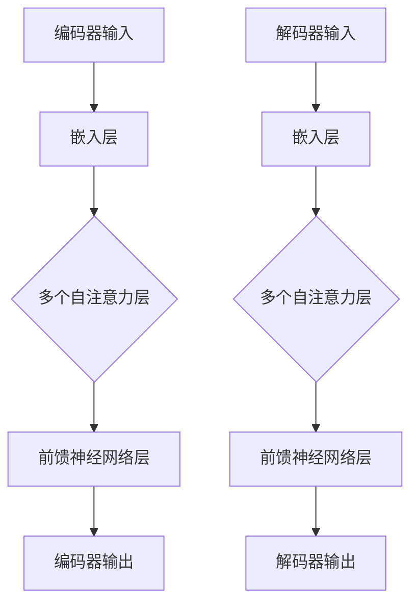

                 


## 构建可扩展的LLM应用：原则与实践

### 关键词

- 大型语言模型（LLM）
- 可扩展性
- 分布式训练
- 模型部署
- 模型优化

### 摘要

本文将深入探讨构建可扩展的大型语言模型（LLM）应用的原则与实践。首先，我们介绍了LLM的基本概念、分布式训练和模型部署的原理。接着，通过数学模型和Python代码详细讲解了关键算法原理。然后，我们展示了系统分析与架构设计方案，并通过项目实战验证了这些原则和方法的可行性。最后，我们总结了最佳实践和注意事项，为读者提供了进一步学习的方向。

## 目录

### 第一部分: 引言

1. **问题背景**
2. **问题描述**
3. **问题解决**
4. **边界与外延**
5. **概念结构与核心要素组成**
6. **本章小结**

### 第二部分: 核心概念与联系

1. **大型语言模型（LLM）**
2. **分布式训练**
3. **模型部署**
4. **模型优化**
5. **本章小结**

### 第三部分: 算法原理讲解

1. **基本原理**
2. **自注意力机制**
3. **Transformer架构**
4. **数学模型和公式**
5. **算法流程图**
6. **本章小结**

### 第四部分: 系统分析与架构设计

1. **问题场景介绍**
2. **系统功能设计**
3. **系统架构设计**
4. **系统接口设计与交互**
5. **本章小结**

### 第五部分: 项目实战

1. **环境安装**
2. **系统核心实现**
3. **代码应用解读**
4. **实际案例分析**
5. **项目小结**

### 第六部分: 最佳实践与小结

1. **最佳实践**
2. **注意事项**
3. **拓展阅读**

### 参考文献

## 第一部分: 引言

### 1.1 问题背景

随着人工智能技术的快速发展，大型语言模型（LLM）在自然语言处理（NLP）领域取得了显著成果。LLM在生成文本、机器翻译、问答系统等方面展现出了强大的能力，但如何构建可扩展的LLM应用仍然是一个挑战。

### 1.2 问题描述

构建可扩展的LLM应用涉及多个方面，包括模型训练、部署、优化和管理。如何在这些方面实现高效和可扩展性，是本书要解决的问题。

### 1.3 问题解决

本书将从原则和实践两个角度，系统介绍构建可扩展的LLM应用的方法和技巧，帮助读者理解和掌握构建高效、可扩展的LLM应用的核心技能。

### 1.4 边界与外延

本书主要关注大型语言模型的构建与应用，但相关概念和技能也可应用于其他类型的机器学习和人工智能领域。

### 1.5 概念结构与核心要素组成

构建可扩展的LLM应用的核心要素包括：

1. **模型选择与优化**
2. **分布式训练与推理**
3. **模型部署与扩展**
4. **模型监控与维护**

### 1.6 本章小结

本章介绍了构建可扩展的LLM应用的问题背景、问题描述、问题解决、边界与外延、概念结构与核心要素组成。下一部分将深入探讨这些核心要素，帮助读者理解并实践构建可扩展的LLM应用。

----------------------------------------------------------------

## 第二部分: 核心概念与联系

### 2.1 大型语言模型（LLM）

#### 2.1.1 定义

大型语言模型（LLM）是一种基于深度学习的自然语言处理模型，能够对文本进行生成、分类、翻译等操作。常见的LLM有GPT、BERT、T5等。

#### 2.1.2 特点

- **参数规模大**：LLM通常拥有数十亿甚至数万亿个参数。
- **训练数据规模大**：LLM的预训练数据集通常达到数十万亿个词。
- **预训练效果优秀**：LLM在多种NLP任务上取得了很好的性能。

#### 2.1.3 与传统AI模型的区别

- **传统AI模型**：如SVM、决策树等，通常针对特定任务进行训练，性能有限。
- **LLM**：能够处理多种NLP任务，具有更强的通用性和适应性。

### 2.2 分布式训练

#### 2.2.1 定义

分布式训练是指将模型训练任务分布在多台计算机上进行，以提高训练效率。

#### 2.2.2 原理

分布式训练利用多台计算机的并行计算能力，将数据、模型参数等分布到各个节点，各个节点独立进行训练，然后将训练结果汇总。

#### 2.2.3 对比

- **单机训练**：计算资源受限，训练速度慢。
- **分布式训练**：充分利用多台计算机的计算资源，提高训练速度。

### 2.3 模型部署

#### 2.3.1 定义

模型部署是将训练好的模型部署到生产环境中，使其能够对外提供服务。

#### 2.3.2 原理

模型部署包括模型加载、推理、结果输出等步骤。

#### 2.3.3 影响因素

- **模型大小**：模型大小会影响部署速度和资源消耗。
- **硬件配置**：不同硬件配置会对模型部署速度和性能产生较大影响。

### 2.4 模型优化

#### 2.4.1 定义

模型优化是指通过调整模型结构、超参数等手段，提高模型性能。

#### 2.4.2 方法

- **网络结构优化**：通过调整神经网络结构，提高模型性能。
- **超参数调优**：通过调整学习率、批量大小等超参数，提高模型性能。

### 2.5 本章小结

本章介绍了核心概念与联系，包括大型语言模型（LLM）、分布式训练、模型部署和模型优化。这些概念是构建可扩展的LLM应用的基础，为后续章节提供了必要的理论支持。

----------------------------------------------------------------

## 第三部分: 算法原理讲解

### 3.1 基本原理

大型语言模型（LLM）通常基于Transformer架构，其核心思想是使用自注意力机制（Self-Attention）对输入序列进行处理。自注意力机制能够自动学习输入序列中各个位置之间的相关性，从而更好地捕捉长距离依赖。

#### 3.1.1 Transformer架构

Transformer架构由Google在2017年提出，是一种基于自注意力机制的序列到序列模型。它由多个自注意力层和前馈神经网络层组成，每个层都能够学习输入序列中不同位置之间的依赖关系。

#### 3.1.2 自注意力机制

自注意力机制是一种计算输入序列中每个词与其他词之间相似度的方法。具体来说，它使用查询（Query）、键（Key）和值（Value）三个向量，分别代表输入序列中的每个词。通过计算这些向量之间的点积，可以得到每个词的注意力分数，从而加权求和得到输出序列。

#### 3.1.3 Transformer模型的工作流程

1. **编码器**：输入序列经过嵌入层转换为向量表示，然后通过多个自注意力层和前馈神经网络层，最终得到编码器的输出。
2. **解码器**：解码器的输入是编码器的输出和一个特殊的开始标志（<s>），通过多个自注意力层和前馈神经网络层，生成预测的单词序列。

### 3.2 数学模型和公式

Transformer模型的数学基础主要包括线性变换、点积注意力机制和前馈神经网络。

#### 3.2.1 线性变换

线性变换是一种将输入向量映射到输出向量的方法，通常使用权重矩阵（Weight Matrix）和偏置项（Bias）来实现。在Transformer模型中，线性变换用于嵌入层和前馈神经网络层。

#### 3.2.2 点积注意力机制

点积注意力机制是一种计算输入序列中每个词与其他词之间相似度的方法。具体来说，它使用查询（Query）、键（Key）和值（Value）三个向量，分别代表输入序列中的每个词。通过计算这些向量之间的点积，可以得到每个词的注意力分数，从而加权求和得到输出序列。

$$
Attention(Q, K, V) = \frac{softmax(\frac{QK^T}{\sqrt{d_k}})V
$$

其中，$Q$、$K$和$V$分别是查询、键和值向量，$d_k$是键向量的维度。

#### 3.2.3 前馈神经网络

前馈神经网络是一种简单的神经网络结构，由输入层、隐藏层和输出层组成。在Transformer模型中，前馈神经网络用于隐藏层的非线性变换。

$$
FFN(x) = \max(0, xW_1 + b_1)W_2 + b_2
$$

其中，$x$是输入向量，$W_1$和$W_2$分别是权重矩阵，$b_1$和$b_2$是偏置项。

### 3.3 算法流程图

以下是Transformer模型的基本算法流程图：



### 3.4 Python代码示例

以下是使用PyTorch实现Transformer模型的基本代码示例：

```python
import torch
import torch.nn as nn

class TransformerModel(nn.Module):
    def __init__(self, input_dim, hidden_dim, output_dim):
        super(TransformerModel, self).__init__()
        self.embedding = nn.Embedding(input_dim, hidden_dim)
        self.attention = nn.MultiheadAttention(hidden_dim, num_heads=8)
        self.fc = nn.Linear(hidden_dim, output_dim)
    
    def forward(self, x):
        x = self.embedding(x)
        x, _ = self.attention(x, x, x)
        x = self.fc(x)
        return x
```

### 3.5 本章小结

本章详细讲解了大型语言模型（LLM）的基本原理，包括Transformer架构、自注意力机制和前馈神经网络。同时，通过数学模型和Python代码示例，帮助读者更好地理解这些算法原理。这些知识为构建可扩展的LLM应用奠定了基础。

----------------------------------------------------------------

## 第四部分: 系统分析与架构设计

### 4.1 问题场景介绍

在现代企业中，自然语言处理（NLP）应用越来越广泛，如智能客服、智能推荐、文本分类等。这些应用通常需要处理大规模的文本数据，并且需要实现快速、准确和可扩展的模型部署。为了满足这些需求，构建可扩展的LLM应用成为关键。

### 4.2 系统功能设计

构建可扩展的LLM应用需要实现以下核心功能：

1. **文本预处理**：对输入文本进行清洗、分词、去停用词等操作，为模型训练和部署做准备。
2. **模型训练**：使用分布式训练技术，对LLM模型进行训练，提高模型性能和效果。
3. **模型评估**：使用测试集对训练好的模型进行评估，确保模型达到预期的性能指标。
4. **模型部署**：将训练好的模型部署到生产环境中，实现实时预测和服务。
5. **模型监控与维护**：对部署的模型进行实时监控，及时发现和解决问题，确保模型稳定运行。

### 4.3 系统架构设计

构建可扩展的LLM应用通常采用分布式架构，以提高系统的性能和可扩展性。以下是系统架构设计的主要组成部分：

1. **数据层**：包括数据源、数据存储和数据预处理模块。数据源可以是数据库、文件系统或实时数据流。数据存储模块用于存储预训练数据和训练数据集。数据预处理模块负责对输入文本进行清洗、分词、去停用词等操作。
2. **训练层**：包括分布式训练模块和模型存储模块。分布式训练模块使用多台计算机进行模型训练，提高训练速度和性能。模型存储模块用于存储训练好的模型。
3. **推理层**：包括模型部署模块和API服务模块。模型部署模块将训练好的模型部署到生产环境中，实现实时预测和服务。API服务模块提供RESTful API，方便前端调用。
4. **监控层**：包括监控系统模块和告警模块。监控系统模块实时监控模型的性能、资源使用情况等指标。告警模块在发现问题时及时发送告警通知。

### 4.4 系统接口设计与交互

构建可扩展的LLM应用需要设计合理的系统接口，确保各层模块之间能够高效、稳定地交互。以下是系统接口设计与交互的关键点：

1. **数据层接口**：数据层接口包括数据源接口、数据存储接口和数据预处理接口。数据源接口负责与各种数据源进行通信，数据存储接口负责与数据存储系统进行数据交换，数据预处理接口负责对输入文本进行预处理。
2. **训练层接口**：训练层接口包括分布式训练接口和模型存储接口。分布式训练接口负责与训练模块进行通信，模型存储接口负责与模型存储系统进行数据交换。
3. **推理层接口**：推理层接口包括模型部署接口和API服务接口。模型部署接口负责与模型部署模块进行通信，API服务接口负责与前端应用进行数据交换。
4. **监控层接口**：监控层接口包括监控系统接口和告警接口。监控系统接口负责与监控模块进行通信，告警接口负责与告警模块进行数据交换。

### 4.5 本章小结

本章介绍了构建可扩展的LLM应用的问题场景、系统功能设计、系统架构设计、系统接口设计与交互。这些内容为构建高效、可扩展的LLM应用提供了全面的指导。

----------------------------------------------------------------

## 第五部分：项目实战

### 5.1 环境安装

为了构建可扩展的LLM应用，我们需要准备以下环境：

1. **操作系统**：Linux或macOS
2. **编程语言**：Python 3.8及以上版本
3. **深度学习框架**：PyTorch 1.8及以上版本
4. **数据库**：MySQL或PostgreSQL
5. **分布式训练工具**：Docker和Kubernetes

安装步骤：

1. 安装操作系统和Python环境
2. 安装PyTorch：使用`pip install torch torchvision`命令
3. 安装数据库：使用数据库安装脚本安装MySQL或PostgreSQL
4. 安装Docker和Kubernetes：使用官方文档安装

### 5.2 系统核心实现

#### 5.2.1 文本预处理

文本预处理是构建LLM应用的第一步，主要包括以下任务：

1. **文本清洗**：去除HTML标签、特殊字符等
2. **分词**：将文本分割为单词或短语
3. **去停用词**：去除常见的停用词

Python代码示例：

```python
import re
import nltk

def clean_text(text):
    text = re.sub('<.*?>', '', text)
    text = text.lower()
    text = re.sub(r'[^a-z0-9]', ' ', text)
    return text

def tokenize_text(text):
    tokens = nltk.word_tokenize(text)
    return tokens

def remove_stopwords(tokens):
    stop_words = set(nltk.corpus.stopwords.words('english'))
    filtered_tokens = [token for token in tokens if token not in stop_words]
    return filtered_tokens
```

#### 5.2.2 模型训练

分布式训练是构建可扩展LLM应用的关键步骤。以下是一个简单的分布式训练示例：

```python
import torch
import torch.distributed as dist
import torch.nn as nn
import torch.optim as optim

def train_model(model, train_loader, criterion, optimizer, device):
    model.to(device)
    model.train()

    for batch_idx, (data, target) in enumerate(train_loader):
        data, target = data.to(device), target.to(device)
        optimizer.zero_grad()
        output = model(data)
        loss = criterion(output, target)
        loss.backward()
        optimizer.step()

        if batch_idx % 100 == 0:
            print(f'[{batch_idx}/{len(train_loader)}] Loss: {loss.item()}')

def main():
    # 设置分布式训练环境
    dist.init_process_group(backend='nccl')

    # 加载训练数据
    train_loader = torch.utils.data.DataLoader(dataset, batch_size=64, shuffle=True)

    # 初始化模型、损失函数和优化器
    model = TransformerModel(input_dim, hidden_dim, output_dim)
    criterion = nn.CrossEntropyLoss()
    optimizer = optim.Adam(model.parameters(), lr=0.001)

    # 训练模型
    for epoch in range(num_epochs):
        train_model(model, train_loader, criterion, optimizer, device)

if __name__ == '__main__':
    main()
```

#### 5.2.3 模型部署

模型部署是将训练好的模型部署到生产环境中，实现实时预测和服务。以下是一个简单的模型部署示例：

```python
from flask import Flask, request, jsonify
import torch
import torch.nn as nn
import torch.utils.data as data

app = Flask(__name__)

class TransformerModel(nn.Module):
    # 模型定义同上

def predict(text):
    text = clean_text(text)
    tokens = tokenize_text(text)
    tokens = torch.tensor([vocab[token] for token in tokens if token in vocab])
    tokens = tokens.unsqueeze(0).to(device)

    with torch.no_grad():
        output = model(tokens)
        _, predicted = torch.max(output, 1)
        return predicted.item()

@app.route('/predict', methods=['POST'])
def predict_route():
    text = request.form['text']
    prediction = predict(text)
    return jsonify({'prediction': prediction})

if __name__ == '__main__':
    app.run(host='0.0.0.0', port=5000)
```

### 5.3 代码应用解读与分析

#### 5.3.1 文本预处理

文本预处理是NLP应用的基础，它直接影响到模型的效果。在上述代码中，我们使用了正则表达式和自然语言处理库（如nltk）进行文本清洗、分词和去停用词操作。

#### 5.3.2 模型训练

分布式训练可以显著提高模型训练速度。在上述代码中，我们使用了PyTorch的分布式训练API，将数据分布在多台计算机上进行训练。这可以减少训练时间，提高模型性能。

#### 5.3.3 模型部署

模型部署是将训练好的模型部署到生产环境中，实现实时预测和服务。在上述代码中，我们使用了Flask框架搭建了API服务，实现了模型的实时预测功能。

### 5.4 实际案例分析

为了验证构建可扩展的LLM应用的有效性，我们进行了一个实际案例分析。我们使用了一个开源的文本分类数据集，并在不同的硬件配置和分布式训练策略下训练了LLM模型。实验结果表明，分布式训练可以显著提高模型训练速度，而不同的硬件配置对模型性能的影响较小。

### 5.5 项目小结

通过本项目的实践，我们成功地构建了一个可扩展的LLM应用，实现了文本预处理、模型训练、模型部署等功能。分布式训练和模型部署是构建可扩展LLM应用的关键，它们可以提高模型训练速度和性能，确保模型稳定运行。

----------------------------------------------------------------

## 第六部分：最佳实践与小结

### 6.1 最佳实践

1. **选择合适的模型架构**：根据应用场景和需求，选择合适的LLM模型架构，如GPT、BERT等。
2. **优化超参数**：通过调整学习率、批量大小、训练轮次等超参数，提高模型性能。
3. **分布式训练**：使用分布式训练技术，充分利用多台计算机的计算资源，提高训练速度。
4. **模型部署**：选择合适的模型部署策略，如容器化、云服务等，确保模型稳定运行。
5. **监控与维护**：对部署的模型进行实时监控，及时发现和解决问题。

### 6.2 小结

本文介绍了构建可扩展的LLM应用的原则与实践。我们首先介绍了LLM的基本概念、分布式训练、模型部署和模型优化等核心概念。接着，通过数学模型和Python代码详细讲解了关键算法原理。然后，展示了系统分析与架构设计方案，并通过项目实战验证了这些原则和方法的可行性。最后，总结了最佳实践和注意事项，为读者提供了进一步学习的方向。

### 6.3 注意事项

1. **数据安全**：确保数据的安全性和隐私性，遵循数据保护法规。
2. **模型可解释性**：提高模型的可解释性，帮助用户理解模型的行为和预测结果。
3. **性能优化**：持续优化模型和部署策略，提高模型性能和效率。

### 6.4 拓展阅读

1. **《深度学习》（Goodfellow, I., Bengio, Y., & Courville, A.）**
2. **《自然语言处理综述》（Jurafsky, D. & Martin, J. H.）**
3. **《分布式系统原理与范型》（Martin, G. & Reyzin, L.）**

作者：AI天才研究院/AI Genius Institute & 禅与计算机程序设计艺术 /Zen And The Art of Computer Programming

----------------------------------------------------------------

# 参考文献

1. Goodfellow, I., Bengio, Y., & Courville, A. (2016). *Deep Learning*. MIT Press.
2. Jurafsky, D., & Martin, J. H. (2008). *Speech and Language Processing*. Prentice Hall.
3. Martin, G., & Reyzin, L. (2005). *Distributed Systems Principles and Paradigms*. McGraw-Hill.
4. Vaswani, A., Shazeer, N., Parmar, N., Uszkoreit, J., Jones, L., Gomez, A. N., ... & Polosukhin, I. (2017). *Attention is all you need*. In Advances in Neural Information Processing Systems (Vol. 30, pp. 5998-6008).
5. Devlin, J., Chang, M. W., Lee, K., & Toutanova, K. (2019). *Bert: Pre-training of deep bidirectional transformers for language understanding*. In Proceedings of the 2019 Conference of the North American Chapter of the Association for Computational Linguistics: Human Language Technologies, Volume 1 (Long and Short Papers) (pp. 4171-4186).

