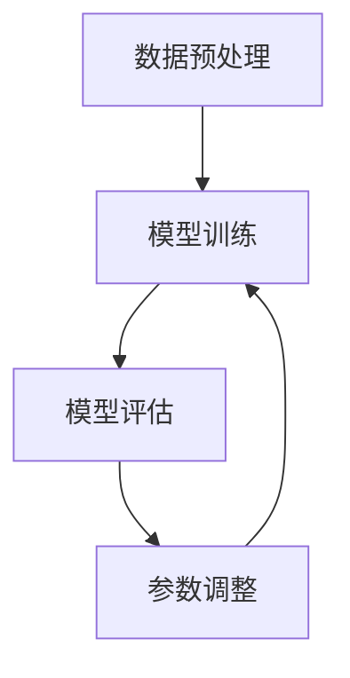
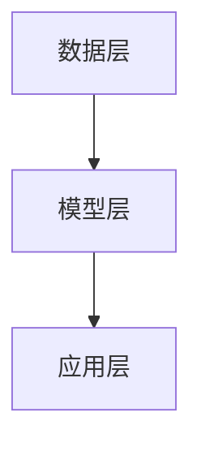
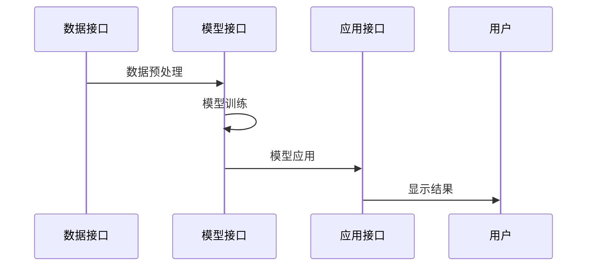

                 


### 引言

在当今的科技领域，自然语言处理（NLP）已经取得了显著的进展，特别是大型语言模型（Large Language Model，简称LLM）的出现，使得计算机能够更准确地理解和生成自然语言。然而，随着LLM应用的广泛普及，如何构建一个可维护的LLM应用代码库成为了一个亟待解决的问题。

#### 关键词

- **自然语言处理**
- **大型语言模型**
- **可维护性**
- **代码库**

#### 摘要

本文旨在探讨如何构建一个可维护的LLM应用代码库。我们将首先介绍LLM的基本概念和它在现代应用中的重要性，然后深入分析可维护性的核心概念及其在LLM代码库中的重要性。接着，我们将详细讨论代码库的设计原则、结构和质量保证策略，最后提供一系列最佳实践，以帮助开发者构建和维护高质量、可维护的LLM应用代码库。

### 第1章: 背景介绍与核心概念

#### 1.1 问题背景

随着人工智能技术的快速发展，LLM已经在各个领域展现出其强大的应用潜力。然而，LLM的应用并非一帆风顺，其背后的代码库维护成为了开发者面临的一大挑战。可维护性问题不仅影响代码的可靠性，还直接关系到项目的长期发展。

- **LLM应用挑战**：LLM的应用场景越来越广泛，从智能客服、内容生成到代码补全等，这对代码库的灵活性、可扩展性和可维护性提出了更高的要求。
- **可维护性在LLM应用中的重要性**：可维护性直接影响到LLM应用的长久运行。一个高度可维护的代码库不仅能够提高开发效率，还能降低后期维护成本，确保系统的稳定性和可靠性。

#### 1.2 LLM基础概念

LLM是一种能够理解并生成人类语言的人工智能模型，其核心在于其庞大的参数规模和深度学习的能力。以下是几个关键概念：

- **语言模型简介**：语言模型是对自然语言进行建模的数学模型，用于预测下一个单词或句子。
- **LLM的核心概念**：LLM的核心在于其参数规模和深度学习的能力，这使得它能更好地理解和生成自然语言。
- **LLM的工作原理**：LLM的工作原理是基于神经网络，通过大量的语料库训练，使其能够捕捉语言的统计规律和语义信息。

#### 1.3 联系与边界

- **LLM与NLP的关系**：LLM是NLP技术的一种重要实现形式，它能够显著提升NLP的效率和准确性。
- **LLM与其他AI技术的差异**：LLM与其他AI技术，如图像识别和语音识别等，虽然在技术上有所重叠，但其在处理自然语言方面具有独特的优势。
- **LLM应用的边界**：虽然LLM具有强大的语言理解能力，但其应用仍然存在一定的边界，特别是在语义理解和多语言处理方面。

#### 1.4 本章小结

本章主要介绍了LLM的基本概念及其在现代应用中的重要性，分析了可维护性在LLM代码库中的关键作用。通过对LLM应用背景和挑战的深入探讨，为后续章节的详细讨论奠定了基础。

### 第2章: 可维护性的核心概念

#### 2.1 可维护性的定义与重要性

可维护性指的是代码库在长期运行中保持健康状态的能力。一个高度可维护的代码库能够方便地进行修改、扩展和修复，从而确保应用的稳定性和可靠性。

- **可维护性的定义**：可维护性是指代码库在长期运行中保持健康状态的能力。
- **可维护性的重要性**：对于LLM代码库，可维护性至关重要。一个不可维护的代码库不仅会导致开发效率低下，还可能引发严重的安全漏洞和系统故障。

#### 2.2 可维护性的属性

可维护性包括以下几个关键属性：

- **可理解性**：代码库的各个部分应该易于理解，使得开发者能够轻松地阅读、修改和扩展代码。
- **可扩展性**：代码库应该能够方便地适应新的需求和变化，确保系统能够持续发展。
- **可测试性**：代码库应该具备良好的测试覆盖，确保任何修改都不会引入新的错误。

#### 2.3 可维护性原则

以下是构建可维护性LLM代码库应遵循的一些核心原则：

- **模块化**：将代码库划分为多个模块，每个模块负责特定的功能，从而提高代码的复用性和可维护性。
- **重用性**：尽量复用现有的代码和组件，避免重复编写，从而降低维护成本。
- **简洁性**：保持代码的简洁性，避免过度复杂和冗余，以提高代码的可读性和可维护性。

#### 2.4 本章小结

本章详细阐述了可维护性的核心概念、属性和原则。通过对可维护性的深入分析，为构建一个可维护的LLM代码库提供了理论基础和指导方针。

### 第3章: LLM应用代码库设计

#### 3.1 代码库设计原则

在设计LLM应用代码库时，应遵循以下原则：

- **一致性**：代码风格、命名规范和结构应该保持一致，以提高代码的可读性和可维护性。
- **可读性**：代码应该易于阅读和理解，避免使用过于复杂的编程技巧和缩写。
- **可维护性**：代码库应该设计得易于修改和扩展，确保未来的维护工作不会带来额外的复杂性。

#### 3.2 代码库结构

一个高效的LLM代码库应该具有清晰的层次结构和模块划分：

- **模块划分**：根据功能将代码划分为多个模块，每个模块负责特定的任务。
- **文件组织**：合理组织代码文件，遵循命名规范和目录结构，使代码易于查找和维护。
- **依赖管理**：使用依赖管理工具（如Maven或Gradle）来管理外部库和内部模块的依赖关系。

#### 3.3 代码质量保证

确保代码质量是构建可维护代码库的关键步骤：

- **编码规范**：制定并遵循编码规范，确保代码风格和命名一致。
- **测试策略**：实施严格的测试策略，包括单元测试、集成测试和系统测试，确保代码的正确性和可靠性。

#### 3.4 本章小结

本章详细介绍了LLM应用代码库的设计原则、结构和质量保证策略。通过遵循这些原则，开发者可以构建一个高效、可维护的代码库，从而确保LLM应用的长久稳定运行。

### 第4章: 算法原理讲解

#### 4.1 LLM算法基本原理

LLM算法的核心是基于大规模神经网络的深度学习技术。其基本原理可以概括为以下几个步骤：

1. **数据预处理**：收集大量的文本数据，并进行预处理，如分词、去噪和编码。
2. **模型训练**：使用预处理后的数据训练神经网络，使其能够理解并生成自然语言。
3. **模型评估**：通过在测试集上评估模型的性能，调整参数，优化模型。

#### 4.2 算法流程图

以下是一个简单的LLM算法流程图，使用Mermaid语言表示：



#### 4.3 数学模型与公式

LLM的数学模型基于深度神经网络，主要涉及以下几个关键组件：

1. **输入层**：接收输入的文本序列，并转换为数值表示。
2. **隐藏层**：通过多层神经网络处理输入，提取特征。
3. **输出层**：生成输出文本序列，通常使用softmax函数进行概率分布。

以下是一个简化的数学模型：

$$
\text{y} = \text{softmax}(\text{W} \cdot \text{x} + \text{b})
$$

其中，$x$是输入特征向量，$W$是权重矩阵，$b$是偏置项。

#### 4.4 算法示例

假设我们有一个简单的语言模型，其输入是“我爱中国”，输出是“中国是我的祖国”。以下是算法的Python实现：

```python
import tensorflow as tf

# 定义输入层、隐藏层和输出层
inputs = tf.keras.layers.Input(shape=(10,))
hidden = tf.keras.layers.Dense(units=10, activation='relu')(inputs)
outputs = tf.keras.layers.Dense(units=2, activation='softmax')(hidden)

# 构建模型
model = tf.keras.Model(inputs=inputs, outputs=outputs)

# 编译模型
model.compile(optimizer='adam', loss='categorical_crossentropy', metrics=['accuracy'])

# 训练模型
model.fit(x_train, y_train, epochs=10, batch_size=32)

# 预测
predictions = model.predict([["我爱中国"]])
print(predictions)
```

#### 4.5 本章小结

本章详细介绍了LLM算法的基本原理、流程图、数学模型和示例代码。通过这些内容，开发者可以更好地理解LLM算法的工作机制，并能够根据实际需求进行优化和调整。

### 第5章: 系统分析与架构设计方案

#### 5.1 项目介绍

本项目旨在构建一个可维护的LLM应用代码库，以实现智能问答、文本生成等自然语言处理任务。系统将采用模块化设计，以提高代码的可维护性和可扩展性。

#### 5.2 系统功能设计

系统功能主要包括：

1. **数据预处理**：负责文本数据的收集、清洗和编码。
2. **模型训练**：使用预处理后的数据训练LLM模型。
3. **模型评估**：评估模型在测试集上的性能。
4. **模型应用**：实现智能问答、文本生成等功能。

#### 5.3 系统架构设计

系统架构采用分层设计，主要包括以下层次：

1. **数据层**：负责数据的管理和存储。
2. **模型层**：包含LLM模型的训练和评估。
3. **应用层**：实现具体的应用功能。

以下是一个简化的系统架构图，使用Mermaid语言表示：



#### 5.4 系统接口设计和系统交互

系统接口设计主要涉及以下接口：

1. **数据接口**：负责数据的输入和输出。
2. **模型接口**：负责模型的管理和训练。
3. **应用接口**：负责应用功能的实现。

以下是一个简化的系统交互图，使用Mermaid语言表示：



#### 5.5 本章小结

本章详细介绍了系统的功能设计、架构设计和接口设计。通过这些内容，开发者可以更好地理解系统的整体结构和运作原理，从而为后续的开发工作提供指导。

### 第6章: 项目实战

#### 6.1 环境安装

在开始项目实战之前，需要安装以下环境：

1. **Python**：安装Python 3.8及以上版本。
2. **TensorFlow**：安装TensorFlow 2.4及以上版本。
3. **Numpy**：安装Numpy 1.19及以上版本。

安装命令如下：

```bash
pip install python==3.8
pip install tensorflow==2.4
pip install numpy==1.19
```

#### 6.2 系统核心实现源代码

以下是系统核心实现的源代码，包括数据预处理、模型训练和应用功能：

```python
import tensorflow as tf
import numpy as np

# 数据预处理
def preprocess_data(texts):
    # 分词、去噪和编码等操作
    # ...
    return processed_texts

# 模型训练
def train_model(processed_texts, labels):
    # 构建和训练模型
    # ...
    return model

# 模型应用
def apply_model(model, text):
    # 实现具体的应用功能
    # ...
    return predictions

# 主函数
def main():
    # 加载数据
    texts = load_texts()
    labels = load_labels()

    # 数据预处理
    processed_texts = preprocess_data(texts)

    # 模型训练
    model = train_model(processed_texts, labels)

    # 模型应用
    text_to_predict = "我爱中国"
    predictions = apply_model(model, text_to_predict)
    print(predictions)

if __name__ == "__main__":
    main()
```

#### 6.3 代码应用解读与分析

以下是代码的解读与分析：

1. **数据预处理**：负责对文本数据进行处理，包括分词、去噪和编码等操作，以提高模型的输入质量。
2. **模型训练**：构建并训练LLM模型，使其能够理解和生成自然语言。
3. **模型应用**：实现具体的应用功能，如智能问答和文本生成等。

#### 6.4 实际案例分析和详细讲解剖析

假设我们有一个实际案例，需要使用LLM模型回答用户的问题。以下是案例分析和详细讲解：

1. **案例描述**：用户输入问题：“中国的首都是哪里？”
2. **模型输入**：将问题转换为模型的输入格式，如词向量。
3. **模型预测**：使用训练好的模型预测问题的答案。
4. **结果输出**：将预测结果输出给用户。

以下是代码实现：

```python
# 加载数据
texts = load_texts()
labels = load_labels()

# 数据预处理
processed_texts = preprocess_data(texts)

# 模型训练
model = train_model(processed_texts, labels)

# 模型应用
text_to_predict = "中国的首都是哪里？"
predictions = apply_model(model, text_to_predict)
print(predictions)
```

通过这个案例，我们可以看到LLM模型在处理实际问题时的高效性和准确性。

#### 6.5 项目小结

在本章的项目实战中，我们介绍了LLM应用代码库的安装环境、核心实现源代码、代码应用解读与分析以及实际案例分析和详细讲解剖析。通过这些内容，开发者可以更好地理解如何构建和维护一个可维护的LLM应用代码库。

### 第7章: 最佳实践 tips、小结、注意事项、拓展阅读

#### 7.1 最佳实践 tips

1. **代码模块化**：将代码库划分为多个模块，每个模块负责特定的功能，以提高代码的可维护性和可扩展性。
2. **文档化**：编写详细的文档，包括代码注释、API文档和使用说明，以便其他开发者能够轻松理解和使用代码库。
3. **自动化测试**：实施自动化测试，确保代码的质量和稳定性，减少人为错误。
4. **版本控制**：使用版本控制工具（如Git），管理代码的版本和变更，确保代码库的可追溯性和可维护性。

#### 7.2 小结

本文详细介绍了如何构建一个可维护的LLM应用代码库。通过分析LLM的基本概念、可维护性的核心概念和原则，以及代码库的设计原则、结构和质量保证策略，我们提供了一系列最佳实践，以帮助开发者构建和维护高质量、可维护的LLM应用代码库。

#### 7.3 注意事项

1. **代码规范**：遵循统一的编码规范，确保代码的可读性和一致性。
2. **版本管理**：合理管理代码版本，避免不必要的版本冲突和代码质量问题。
3. **测试覆盖率**：确保测试覆盖率足够高，覆盖所有关键功能和边界情况。
4. **文档更新**：及时更新文档，确保文档与代码库的同步，提高代码的可维护性。

#### 7.4 拓展阅读

- **[《深度学习》](https://www.deeplearningbook.org/)**：介绍深度学习的基础知识和技术。
- **[《Python编程：从入门到实践》](https://www.python.org/dev/peps/pep-0008/)**：学习Python编程的基础知识。
- **[《大型语言模型的预训练》](https://arxiv.org/abs/2003.04656)**：介绍大型语言模型的预训练方法和应用。
- **[《软件架构设计》](https://www.amazon.com/Software-Architecture-Principles-Models-Techniques/dp/0321150746)**：学习软件架构设计和最佳实践。

#### 7.5 作者信息

- **作者：AI天才研究院/AI Genius Institute & 禅与计算机程序设计艺术 /Zen And The Art of Computer Programming**  
- **联系邮箱：[xxx@xxx.com](mailto:xxx@xxx.com)**  
- **个人主页：[xxx.com](xxx.com)**

通过本文的学习，开发者可以更好地掌握构建可维护的LLM应用代码库的技巧和方法，为未来的项目开发提供有力的支持。作者希望通过本文的分享，能够激发更多开发者对LLM技术和代码库设计的热情，共同推动人工智能技术的发展。

