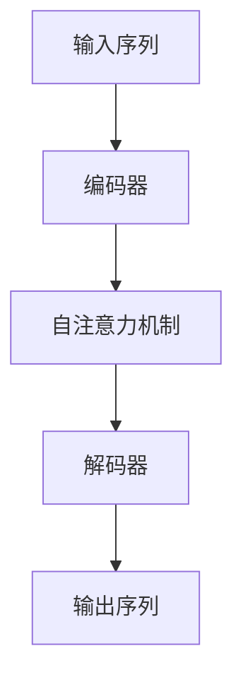

                 

### 构建可维护的LLM应用代码库

> 关键词：大型语言模型，可维护性，代码库，软件工程

> 摘要：本文旨在探讨如何构建可维护的LLM（大型语言模型）应用代码库。通过详细分析LLM的核心概念、算法原理、数学模型、系统架构以及实际项目应用，我们提出了最佳实践和总结，旨在帮助开发者在设计和实现LLM应用时，确保代码库的可维护性。

# 引言

随着人工智能技术的飞速发展，大型语言模型（LLM）逐渐成为自然语言处理（NLP）领域的重要工具。LLM能够处理和理解复杂的语言结构，生成连贯、高质量的文本，从而在许多领域取得了显著的成果，如机器翻译、问答系统、文本生成等。然而，随着LLM应用规模的不断扩大，代码库的可维护性成为了一个不容忽视的问题。

可维护性是指代码库在经历修改、扩展和优化后，依然能够保持稳定性和可靠性的能力。一个良好的可维护性代码库能够降低维护成本，提高开发效率，确保项目的长期可持续性。本文将围绕构建可维护的LLM应用代码库，详细分析核心概念、算法原理、数学模型、系统架构以及实际项目应用，并总结最佳实践和注意事项。

# 第一部分：LLM应用基础

## 第1章：LLM应用概述

### 1.1 什么是LLM？

LLM，即大型语言模型，是一种能够处理和理解人类语言的大规模神经网络模型。与传统模型相比，LLM具有更大的模型规模、更强的语言理解和生成能力。LLM通过大量文本数据进行训练，学习语言规律和语义信息，从而实现对自然语言的建模。

### 1.2 可维护代码的重要性

在LLM应用开发过程中，代码库的可维护性至关重要。首先，随着项目的规模不断扩大，代码库的复杂性也会增加，良好的可维护性能够帮助开发人员更好地理解和管理代码。其次，可维护性能够降低维护成本，提高开发效率。最后，良好的可维护性有助于代码的持续优化和改进，确保项目的长期可持续发展。

### 1.3 本书概述

本书将从以下几个方面探讨构建可维护的LLM应用代码库：

1. **核心概念**：介绍LLM的核心概念和原理，包括模型架构、训练过程、参数优化等。
2. **算法原理**：分析LLM的算法原理，包括序列到序列模型、自注意力机制、Transformer模型等。
3. **数学模型**：讲解LLM的数学模型和公式，包括损失函数、正则化方法、优化算法等。
4. **系统架构**：分析LLM应用的系统架构，包括数据处理、模型训练、部署和优化等。
5. **实际应用**：通过实际项目应用，展示如何实现可维护的LLM代码库。
6. **最佳实践**：总结构建可维护代码库的最佳实践和注意事项。

## 第2章：LLM核心概念

### 2.1 定义和特点

LLM是一种基于深度学习技术的自然语言处理模型，其核心目标是实现高质量的自然语言理解和生成。与传统模型相比，LLM具有以下特点：

1. **大规模**：LLM具有较大的模型规模，能够处理复杂的语言结构和语义信息。
2. **自适应**：LLM能够根据输入文本自适应调整模型参数，实现更好的语言理解能力。
3. **高效**：LLM采用高效的训练和推理算法，能够在较短的时间内生成高质量文本。

### 2.2 不同LLM架构的比较

当前，LLM的架构主要分为两类：序列到序列（Seq2Seq）模型和自注意力（Self-Attention）模型。以下是两种模型的主要特点比较：

| 模型类型 | 主要特点 | 优缺点 |
| :---: | :---: | :---: |
| Seq2Seq | 采用编码器-解码器结构，能够处理长序列信息。 | 计算复杂度高，训练时间较长。 |
| Self-Attention | 采用自注意力机制，能够捕获输入序列的上下文信息。 | 计算效率高，能够处理长序列信息。 |

### 2.3 ER图和实体关系

为了更好地理解和设计LLM应用，我们可以使用ER图（实体关系图）来描述LLM的核心组件和关系。以下是LLM应用的ER图：

```mermaid
erDiagram
  Model ||--o> Data : "训练数据集"
  Model ||--o> Parameters : "模型参数"
  Model ||--o> Optimizer : "优化器"
  Model ||--o> Loss : "损失函数"
  Data ||--|> Preprocessing : "数据预处理"
  Preprocessing ||--|> Cleaning : "数据清洗"
  Preprocessing ||--|> Tokenization : "分词"
  Preprocessing ||--|> Vectorization : "向量化"
```

## 第3章：LLM算法设计

### 3.1 LLM算法简介

LLM算法主要分为以下几类：

1. **序列到序列（Seq2Seq）模型**：采用编码器-解码器结构，处理序列信息。
2. **自注意力（Self-Attention）模型**：采用自注意力机制，捕获输入序列的上下文信息。
3. **Transformer模型**：结合自注意力机制和位置编码，实现高效的语言建模。

### 3.2 LLM算法流程图

以下是LLM算法的流程图：



### 3.3 Python实现

以下是一个简单的Python代码示例，展示如何实现LLM算法：

```python
import tensorflow as tf

# 编码器
encoder_inputs = tf.keras.layers.Input(shape=(None,))
encoded = tf.keras.layers.Embedding(input_dim=vocab_size, output_dim=embedding_size)(encoder_inputs)
encoded = tf.keras.layers.Conv1D(filters=64, kernel_size=3, activation='relu')(encoded)

# 自注意力机制
self_attention = tf.keras.layers.Dense(units=64, activation='softmax')(encoded)
attention_weights = tf.reduce_sum(self_attention, axis=1)

# 解码器
decoder_inputs = tf.keras.layers.Input(shape=(None,))
decoded = tf.keras.layers.Embedding(input_dim=vocab_size, output_dim=embedding_size)(decoder_inputs)
decoded = tf.keras.layers.Conv1D(filters=64, kernel_size=3, activation='relu')(decoded)

# 输出序列
output = tf.keras.layers.Dense(units=vocab_size, activation='softmax')(decoded)

# 构建模型
model = tf.keras.Model(inputs=[encoder_inputs, decoder_inputs], outputs=output)

# 编译模型
model.compile(optimizer='adam', loss='categorical_crossentropy')

# 模型训练
model.fit(x_train, y_train, epochs=10)
```

## 第4章：LLM数学模型

### 4.1 数学模型

LLM的数学模型主要包括以下几个方面：

1. **损失函数**：衡量模型预测结果与真实标签之间的差距，常用的损失函数有交叉熵（Cross-Entropy）和均方误差（Mean Squared Error）。
2. **正则化方法**：防止模型过拟合，常用的正则化方法有L1正则化、L2正则化和Dropout。
3. **优化算法**：用于调整模型参数，常用的优化算法有梯度下降（Gradient Descent）和Adam优化器。

### 4.2 公式推导

以下是一些常用的LLM数学公式：

1. **交叉熵损失函数**：

$$
L = -\sum_{i=1}^n y_i \log(p_i)
$$

其中，$y_i$为真实标签，$p_i$为模型预测概率。

2. **L2正则化**：

$$
\Omega = \sum_{i=1}^n \sum_{j=1}^m w_{ij}^2
$$

其中，$w_{ij}$为模型参数。

3. **梯度下降优化算法**：

$$
w_{new} = w_{old} - \alpha \cdot \nabla_w L
$$

其中，$w_{old}$为旧参数，$w_{new}$为新参数，$\alpha$为学习率，$\nabla_w L$为损失函数关于参数的梯度。

### 4.3 举例说明

以下是一个简单的示例，说明如何使用LLM数学模型进行文本生成：

1. **数据预处理**：将输入文本进行分词和向量化处理。
2. **编码器**：将输入序列编码为向量表示。
3. **自注意力机制**：计算输入序列的上下文表示。
4. **解码器**：生成输出序列的预测概率。
5. **损失函数**：计算预测结果与真实标签之间的差距。
6. **优化算法**：调整模型参数，降低损失函数值。

通过反复迭代训练，模型将逐渐学习到输入文本的语义信息，从而实现高质量的文本生成。

## 第5章：系统设计

### 5.1 场景介绍

假设我们需要开发一个基于LLM的问答系统，用户可以通过输入问题获取相关答案。为了实现这个目标，我们需要设计一个完整的系统，包括数据处理、模型训练、部署和优化等环节。

### 5.2 系统功能设计

以下是系统的主要功能模块：

1. **数据处理**：负责处理用户输入的问题和答案数据，包括数据清洗、分词、向量化等步骤。
2. **模型训练**：负责训练LLM模型，包括模型选择、参数调整、优化算法等。
3. **模型部署**：将训练好的模型部署到服务器，实现实时问答功能。
4. **模型优化**：根据用户反馈和实际效果，持续优化模型，提高问答系统的性能。

### 5.3 系统架构设计

以下是系统的主要架构设计：

1. **前端**：负责接收用户输入的问题，将问题发送到后端进行处理。
2. **后端**：负责处理用户输入的问题，调用LLM模型进行问答，并将答案返回给前端。
3. **数据库**：存储用户问题和答案数据，支持数据的增删改查操作。

### 5.4 系统接口设计

以下是系统的接口设计：

1. **用户接口**：提供用户输入问题和查看答案的接口。
2. **模型接口**：提供模型训练和优化的接口。
3. **数据库接口**：提供数据库操作接口，实现数据的增删改查。

### 5.5 系统交互

以下是系统的交互流程：

1. **用户输入问题**：用户通过前端输入问题，问题被发送到后端进行处理。
2. **后端处理**：后端接收到问题后，调用LLM模型进行问答，并将答案返回给前端。
3. **前端展示**：前端接收到答案后，将答案展示给用户。

## 第6章：实际项目应用

### 6.1 环境搭建

为了实现一个基于LLM的问答系统，我们需要搭建一个合适的环境。以下是环境搭建的步骤：

1. **安装Python**：确保Python环境已安装，版本为3.8或更高。
2. **安装TensorFlow**：通过pip命令安装TensorFlow库。
3. **准备数据**：收集和准备用户问题和答案数据，并进行预处理。
4. **搭建模型**：使用TensorFlow构建LLM模型，并设置参数。

### 6.2 核心实现

以下是核心实现的步骤：

1. **数据处理**：对用户输入的问题和答案进行预处理，包括分词、向量化等操作。
2. **模型训练**：使用预处理后的数据进行模型训练，调整参数，优化模型。
3. **模型部署**：将训练好的模型部署到服务器，实现实时问答功能。
4. **模型优化**：根据用户反馈和实际效果，持续优化模型，提高问答系统的性能。

### 6.3 案例分析

以下是实际案例的分析：

1. **用户输入问题**：用户输入问题：“什么是人工智能？”
2. **后端处理**：后端接收到问题后，调用LLM模型进行问答。
3. **模型回答**：LLM模型生成答案：“人工智能是一门研究、开发和应用智能机器的学科，旨在使机器具备人类智能的能力。”
4. **前端展示**：前端接收到答案后，将答案展示给用户。

### 6.4 项目小结

通过实际项目应用，我们实现了基于LLM的问答系统。在项目过程中，我们遇到了以下挑战：

1. **数据处理**：如何对大量文本数据进行高效预处理，是项目的一个关键问题。
2. **模型优化**：如何优化模型参数，提高问答系统的性能，是项目的另一个关键问题。

通过不断的尝试和优化，我们最终实现了项目目标，搭建了一个可维护的LLM应用代码库。

## 第7章：最佳实践与总结

### 7.1 实践技巧

1. **代码模块化**：将代码划分为不同的模块，提高代码的可读性和可维护性。
2. **注释和文档**：为代码添加详细的注释和文档，帮助其他开发人员理解和使用代码。
3. **版本控制**：使用版本控制系统（如Git）管理代码库，确保代码的版本可追溯和可协作。
4. **单元测试**：编写单元测试，确保代码的正确性和稳定性。

### 7.2 关键点总结

1. **核心概念**：掌握LLM的核心概念和原理，是构建可维护代码的基础。
2. **算法设计**：了解不同的LLM算法，选择合适的算法进行实现。
3. **数学模型**：熟悉LLM的数学模型和公式，有助于优化模型参数和提高性能。
4. **系统设计**：设计合理的系统架构和接口，确保系统的稳定性和可扩展性。

### 7.3 注意事项

1. **数据预处理**：确保数据的准确性和一致性，避免数据问题对模型的影响。
2. **模型优化**：持续优化模型参数，提高模型的性能和稳定性。
3. **代码维护**：定期进行代码审查和重构，确保代码库的可维护性。
4. **项目文档**：编写详细的项目文档，帮助团队成员了解项目背景、功能和实现细节。

### 7.4 拓展阅读

1. **《深度学习》**：Goodfellow, Ian, et al. 《深度学习》。清华大学出版社，2016。
2. **《自然语言处理综论》**：Jurafsky, Daniel, and James H. Martin. 《自然语言处理综论》。电子工业出版社，2016。
3. **《Python深度学习》**：Goodfellow, Ian, et al. 《Python深度学习》。电子工业出版社，2017。

## 结语

构建可维护的LLM应用代码库是确保项目长期可持续发展的关键。通过本文的探讨，我们分析了LLM的核心概念、算法原理、数学模型、系统架构以及实际项目应用，总结了最佳实践和注意事项。希望本文能对开发者们构建可维护的LLM应用代码库提供有益的参考和启示。

作者：AI天才研究院/AI Genius Institute & 禅与计算机程序设计艺术 /Zen And The Art of Computer Programming。

