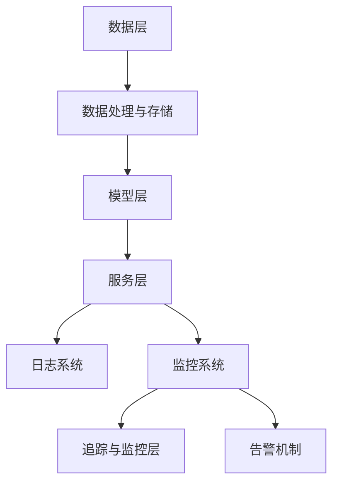

                 

### 引入

#### 问题背景

在当今时代，大型语言模型（LLM，Large Language Model）已经成为人工智能领域的明星技术，广泛应用在自然语言处理（NLP，Natural Language Processing）、智能问答、文本生成、翻译等多个领域。然而，随着LLM系统规模和复杂度的不断增加，系统的稳定性和可维护性面临着严峻的挑战。为了确保LLM系统的正常运行，对其进行有效的监控和调试变得至关重要。这就需要构建一个可观测的LLM系统，以便实时捕获系统运行状态、性能指标以及潜在问题。

#### 核心概念

1. **LLM系统**：大型语言模型系统，通常基于深度学习技术，通过大量的文本数据进行训练，能够理解和生成自然语言。
2. **可观测性**：系统内部状态和运行过程的透明度，使得开发者能够实时监测和诊断系统问题。
3. **日志系统**：记录系统运行过程中的各类事件和信息的机制。
4. **指标体系**：一系列用于衡量系统性能和行为的指标，如响应时间、错误率、资源消耗等。
5. **追踪技术**：用于记录和跟踪系统内部数据流和控制流的方法和技术。

#### 目标读者

本篇博客文章的目标读者是从事人工智能开发、系统运维和性能优化的工程师和研究人员。通过本文，读者将了解如何构建可观测的LLM系统，包括日志、指标和追踪等方面的关键技术。

#### 阅读指南

本文分为以下几个部分：

1. 引言：介绍问题背景、核心概念、目标读者等。
2. LLM系统概述：概述LLM系统的基本概念、发展历史、核心组件等。
3. 可观测性的重要性：阐述可观测性对LLM系统的重要性、价值等。
4. 日志系统设计：详细讲解日志系统的设计、实现、配置等。
5. 指标体系构建：介绍指标体系的设计、实现、监控等。
6. 追踪技术与方法：探讨追踪技术的原理、应用、实现等。
7. 实战案例：通过实际案例展示如何构建可观测的LLM系统。
8. 最佳实践与优化：总结实战案例中的经验教训，提出优化策略。
9. 结论：总结全文内容，展望未来发展方向。

通过本文的阅读，读者将能够系统地了解并掌握构建可观测的LLM系统的核心技术和实践方法。

### LLM系统概述

#### 基本概念

大型语言模型（LLM，Large Language Model）是一种基于深度学习的自然语言处理（NLP，Natural Language Processing）技术，通过大量文本数据的训练，能够理解和生成自然语言。LLM的核心思想是通过学习文本数据中的统计规律和语义信息，使得模型能够生成符合语言习惯和语义逻辑的文本。

LLM的发展历程可以追溯到20世纪50年代，当时人工智能（AI，Artificial Intelligence）领域开始探索机器翻译和文本生成。然而，由于计算资源和数据集的限制，早期的模型效果有限。随着计算机性能的不断提升和互联网数据的爆炸式增长，深度学习和大数据技术的兴起为LLM的发展提供了强大的动力。2018年，OpenAI发布了GPT-2模型，标志着LLM进入了一个新的阶段。此后，诸如GPT-3、BERT、T5等大型预训练模型相继涌现，进一步推动了LLM的应用和发展。

#### 核心组件

1. **数据集**：LLM的训练数据集是模型效果的关键因素。通常，LLM会使用大规模的文本数据集，如维基百科、新闻文章、社交媒体帖子等。这些数据集不仅涵盖了广泛的领域和语言风格，还包含了大量的句子和段落，使得模型能够充分学习自然语言的复杂结构。

2. **模型架构**：LLM通常采用深度神经网络（DNN，Deep Neural Network）作为基础架构，如循环神经网络（RNN，Recurrent Neural Network）、变换器（Transformer）等。其中，变换器架构由于其并行处理能力和全局依赖性建模能力，成为目前LLM的主流选择。

3. **预训练与微调**：LLM的训练过程分为两个阶段：预训练和微调。在预训练阶段，模型在大规模数据集上进行无监督训练，学习自然语言的通用特征。在微调阶段，模型在特定任务的数据集上进行监督训练，进一步优化任务相关的性能。

4. **优化器**：优化器是训练过程中的关键组件，用于调整模型参数以最小化损失函数。常用的优化器包括随机梯度下降（SGD，Stochastic Gradient Descent）、Adam优化器等。

5. **计算资源**：由于LLM的训练和推理过程需要大量的计算资源，通常需要高性能的硬件支持，如GPU、TPU等。

#### 应用场景

LLM在多个领域具有广泛的应用，以下是一些典型的应用场景：

1. **自然语言处理**：包括文本分类、情感分析、实体识别、机器翻译等。

2. **智能问答**：通过LLM生成对用户问题的回答，广泛应用于客服机器人、智能助手等。

3. **文本生成**：包括文章生成、故事创作、歌词写作等。

4. **对话系统**：通过LLM实现自然语言交互，提高人机对话的流畅性和智能化程度。

5. **代码生成**：利用LLM生成代码片段，辅助开发者提高开发效率。

#### 发展趋势

随着技术的不断进步，LLM系统的发展趋势主要包括以下几个方面：

1. **模型规模扩大**：模型规模不断扩大，从GPT-2、GPT-3到GLM-130B，模型参数数量和训练数据集规模不断提升。

2. **多模态学习**：将文本数据与其他类型的数据（如图像、声音）进行结合，实现更丰富的语义理解和生成能力。

3. **可解释性和可控性**：提高模型的可解释性和可控性，使得开发者能够更好地理解和调整模型行为。

4. **安全性和鲁棒性**：加强模型的安全性和鲁棒性，防止被恶意利用和对抗攻击。

5. **低资源场景优化**：针对低资源设备（如移动端、物联网设备）进行模型优化，提高LLM在边缘设备的运行效率。

通过本文的介绍，读者可以初步了解LLM系统的基本概念、核心组件和应用场景，为后续内容的学习打下基础。

### 可观测性的重要性

#### 定义

可观测性（Observability）是系统设计和运维中的一个关键概念，指的是系统内部状态和运行过程的透明度。与传统的监控系统（如日志和指标）不同，可观测性强调通过系统内部数据流和控制流的全面记录和追踪，使得开发者能够从全局视角理解系统的行为和性能。

可观测性不仅关注系统在运行过程中产生的数据和事件，还包括对系统内部状态变化的监测和预测。这种全面的监测和追踪能力，使得开发者可以在系统出现问题时迅速定位问题根源，并进行有效的调试和优化。

#### 对LLM系统的价值

在LLM系统中，可观测性具有以下几个方面的价值：

1. **稳定性保障**：通过实时监测系统的运行状态，LLM系统能够及时发现和解决潜在的问题，确保系统稳定运行。

2. **性能优化**：可观测性提供了详细的性能指标，使得开发者能够识别系统的瓶颈和优化方向，从而提高系统性能。

3. **可维护性**：全面的系统监控和追踪，降低了系统的维护成本，提高了运维效率。

4. **安全性与合规性**：通过监测系统的异常行为，LLM系统可以及时发现潜在的安全威胁，确保系统的安全性。

5. **可解释性与可控性**：可观测性提供了系统内部数据流和控制流的信息，使得开发者能够更好地理解和调整模型行为，提高系统的可解释性和可控性。

#### 可观测性与系统稳定性、可维护性的关系

可观测性是保障系统稳定性和可维护性的关键因素。以下是可观测性与系统稳定性和可维护性的关系：

1. **系统稳定性**：稳定的系统需要在运行过程中保持良好的性能，并且能够及时应对外部干扰和内部故障。可观测性提供了对系统运行状态和性能指标的全面监测，使得开发者能够在问题出现时迅速定位并解决，从而保障系统的稳定性。

2. **可维护性**：可维护性指的是系统在运行过程中能够方便地被修改、扩展和维护。可观测性通过提供详细的系统内部状态和运行数据，使得开发者能够更好地理解和操作系统，降低了维护的难度和成本。

3. **优化和改进**：通过可观测性，开发者可以深入了解系统的运行机制和性能瓶颈，从而进行针对性的优化和改进。这种基于数据的优化方法，相比传统的试错和经验方法，更加科学和高效。

4. **故障预测与预防**：可观测性使得系统具备了故障预测能力，通过监测系统运行状态和性能指标，可以提前识别潜在的问题和风险，从而采取预防措施，避免故障的发生。

综上所述，可观测性不仅是保障系统稳定性和可维护性的基础，也是提升系统性能和安全性的关键。在构建LLM系统时，充分重视可观测性的设计，对于确保系统的长期稳定运行具有重要意义。

### 日志系统设计

#### 基本概念

日志系统（Log System）是用于记录和跟踪系统运行过程中的各类事件和信息的机制。通过日志，开发者可以了解系统运行状态、性能表现以及潜在问题，从而进行有效的监控、调试和优化。

日志系统通常包含以下几个核心组件：

1. **日志生成器**：负责在系统运行过程中生成日志信息。日志生成器可以是应用程序、操作系统、网络设备等。

2. **日志收集器**：用于收集和汇总来自各个日志生成器的日志信息。日志收集器可以是本地服务器或集中式的日志管理平台。

3. **日志存储器**：负责存储和保存日志信息。日志存储器可以是文件系统、数据库或云存储等。

4. **日志分析器**：用于对日志信息进行解析和分析，提取有价值的信息和指标。日志分析器可以是开源工具或商业平台。

#### 设计原则

1. **完整性**：日志系统需要确保记录的信息完整，不丢失任何重要事件和异常。

2. **可追溯性**：日志信息需要具备良好的可追溯性，能够还原系统运行的完整过程，便于问题定位和分析。

3. **可扩展性**：日志系统设计应具备良好的可扩展性，能够支持不同规模和类型的系统，以及未来可能的功能扩展。

4. **易用性**：日志系统的接口和工具应简洁易用，方便开发者和运维人员快速上手和使用。

5. **安全性**：日志系统应具备良好的安全性，防止日志信息被篡改或泄露。

#### 实现与配置

1. **日志生成器实现**：
   - 应用程序通常通过日志库（如log4j、loguru）生成日志信息。这些日志库提供了丰富的日志级别（如DEBUG、INFO、WARN、ERROR）和格式化选项。
   - 操作系统和网络设备可以通过内置的日志工具（如syslog、rsyslog）记录系统运行信息和网络事件。

2. **日志收集器实现**：
   - 本地日志收集器可以通过脚本（如cron job）定时收集日志文件，并将其传输到日志管理平台。
   - 集中式的日志收集器（如ELK堆栈、Logstash）提供了高效、可靠的日志收集和转发功能。

3. **日志存储器配置**：
   - 文件系统：将日志文件存储在本地文件系统中，适用于小规模系统。
   - 数据库：将日志数据存储在数据库中，如MySQL、Elasticsearch等，适用于大规模系统。
   - 云存储：将日志数据上传到云存储服务，如Amazon S3、Google Cloud Storage等，适用于需要远程访问和备份的系统。

4. **日志分析器配置**：
   - 开源工具：如Grok、Kibana等，提供了强大的日志解析和分析功能。
   - 商业平台：如Splunk、Sumo Logic等，提供了专业的日志管理、分析和可视化工具。

#### 日志分析工具与方法

1. **日志解析**：
   - 使用正则表达式（Regular Expression）提取日志中的关键信息，如时间戳、用户ID、操作类型等。
   - 使用模板（Template）定义日志的解析规则，提高解析效率和准确性。

2. **日志聚合**：
   - 将来自多个日志源的日志信息进行汇总，形成统一的视图，便于整体分析。
   - 使用工具（如Logstash、Fluentd）进行日志的实时聚合和转发。

3. **日志可视化**：
   - 使用图表（如折线图、柱状图、饼图）展示日志数据，便于分析和理解。
   - 使用工具（如Kibana、Grafana）提供丰富的可视化功能。

4. **日志告警**：
   - 配置告警规则，当日志中出现特定事件或异常时，自动发送告警通知。
   - 使用工具（如PagerDuty、Opsgenie）实现自动化告警和通知。

通过上述实现与配置，日志系统能够有效地记录、收集、存储和分析系统运行过程中的各类事件和信息，为LLM系统的监控、调试和优化提供有力支持。

#### 日志系统实战案例

##### 案例背景

某人工智能公司开发了一款基于LLM的智能问答系统，该系统面向广大用户，提供24/7的在线问答服务。然而，在实际运营过程中，系统频繁出现响应缓慢、偶发错误等问题，严重影响了用户体验。为了解决这些问题，公司决定引入日志系统，通过全面记录和监控系统运行过程，找到问题根源并进行优化。

##### 案例分析与解决

1. **日志生成器配置**：
   - 在LLM模型和应用程序中集成日志库（如log4j），设置日志级别为DEBUG，确保详细记录系统运行中的各类事件和异常。
   - 操作系统和网络设备通过syslog服务记录系统状态和事件。

2. **日志收集器部署**：
   - 使用Logstash作为日志收集器，部署在服务器上，通过管道（Pipeline）将各个源日志（如应用程序日志、操作系统日志）聚合到一个集中存储。
   - 配置Logstash过滤器（Filter），对日志进行预处理，如去除无用信息、格式化日志等。

3. **日志存储器配置**：
   - 使用Elasticsearch作为日志存储器，搭建一个分布式集群，提供高可靠性和高性能的日志存储能力。
   - 使用Filebeat客户端，将Logstash收集到的日志数据实时传输到Elasticsearch集群。

4. **日志分析器与可视化**：
   - 使用Kibana搭建一个日志分析平台，通过Kibana的搜索、分析和可视化功能，对日志数据进行分析。
   - 配置Kibana仪表板（Dashboard），展示日志数据的实时视图，如错误率、响应时间分布等。

5. **日志告警配置**：
   - 在Kibana中配置告警规则，当系统出现特定错误或性能问题时，自动发送邮件或短信通知运维团队。
   - 设置阈值，如响应时间超过500ms，错误率达到5%，触发告警。

通过上述配置，日志系统成功记录和监控了LLM智能问答系统的运行过程。在后续的运维过程中，运维团队通过日志分析平台，及时发现并解决了多个系统性能和稳定性问题，显著提高了用户体验。

##### 案例小结

通过引入日志系统，公司实现了对LLM智能问答系统的全面监控和调试。日志系统不仅帮助团队快速定位和解决系统问题，还提供了详细的运行数据和分析报告，为系统的持续优化提供了有力支持。未来，公司计划进一步完善日志系统，引入更多高级分析工具和告警机制，以提高系统的可观测性和运维效率。

### 指标体系构建

#### 指标体系的基本概念

指标体系（Metrics System）是指用于衡量系统性能和行为的指标集合。这些指标可以反映系统的稳定性、性能、资源使用等多个方面，为开发者、运维人员提供关键的信息，以便对系统进行监控和优化。

在构建指标体系时，通常需要考虑以下几个关键点：

1. **指标类型**：包括系统层面的指标（如响应时间、错误率）、资源使用指标（如CPU利用率、内存占用）、业务指标（如问答准确率、用户满意度）等。

2. **指标度量单位**：每种指标都有其特定的度量单位，如时间（ms）、百分比（%）、字节（B）等。

3. **指标采集频率**：根据指标的特性和监控需求，确定合适的采集频率，如秒级、分钟级、小时级等。

4. **指标阈值设置**：为每个指标设置合理的阈值，当指标超过阈值时，触发告警，通知相关人员。

5. **指标可视化**：通过图表和仪表板，将指标数据可视化，便于快速理解和分析。

#### 指标体系的设计原则

1. **全面性**：指标体系应涵盖系统运行的各个方面，确保全面反映系统状态。

2. **关键性**：选择对系统性能和稳定性有重要影响的指标，避免冗余和无关指标。

3. **可量化**：指标应具备可量化的特性，可以通过自动化工具进行采集和监控。

4. **实时性**：确保指标数据的实时性，便于及时发现和解决问题。

5. **可扩展性**：设计时考虑未来可能的需求变化，便于扩展和调整。

6. **可解释性**：指标名称和定义应简洁明了，易于理解和解释。

#### 指标体系的实现与监控

1. **采集方式**：
   - **应用程序内置监控**：在应用程序中集成监控代码，定期采集指标数据。
   - **开源监控工具**：如Prometheus、Grafana等，提供丰富的指标采集和监控功能。
   - **商业监控平台**：如New Relic、AppDynamics等，提供全面的监控解决方案。

2. **数据存储**：
   - **时间序列数据库**：如InfluxDB、OpenTSDB等，适用于存储和查询实时指标数据。
   - **关系数据库**：如MySQL、PostgreSQL等，适用于存储和查询历史指标数据。
   - **数据湖**：如Amazon S3、Google BigQuery等，适用于大规模数据的存储和分析。

3. **监控告警**：
   - **阈值告警**：当指标超过预设阈值时，自动发送告警通知。
   - **事件告警**：基于特定的事件触发告警，如系统崩溃、网络中断等。
   - **多渠道告警**：支持通过邮件、短信、微信等多种渠道发送告警通知。

4. **可视化分析**：
   - **仪表板**：使用工具（如Grafana、Kibana）创建可视化仪表板，展示关键指标的实时数据和趋势图。
   - **告警仪表板**：专门用于展示告警信息和处理状态的仪表板。

#### 指标分析工具与方法

1. **数据聚合**：
   - 对来自不同来源的指标数据进行聚合，形成统一的视图，便于整体分析。
   - 使用工具（如PromQL、Kibana查询语言）进行复杂的数据聚合和计算。

2. **趋势分析**：
   - 通过趋势图分析指标的变化趋势，识别异常点和潜在问题。
   - 使用工具（如Grafana、Kibana）提供丰富的趋势分析图表。

3. **异常检测**：
   - 使用机器学习算法（如聚类分析、异常检测算法）识别异常指标值。
   - 使用工具（如Anodot、Amazon Q告警）提供自动化的异常检测功能。

4. **根因分析**：
   - 基于指标数据和分析结果，进行故障排查和根因分析。
   - 使用工具（如Splunk、ELK堆栈）提供详细的日志和事件分析功能。

通过构建和实现一个全面的指标体系，LLM系统能够更好地进行监控和管理，确保系统的稳定性和高性能。

### 指标体系实战案例

##### 案例背景

某知名互联网公司开发了一款基于大型语言模型（LLM）的智能客服系统，旨在通过自然语言处理技术，提供24/7的高效客户服务。然而，在系统上线后，客服系统的响应速度和准确性并未达到预期，部分用户反馈体验不佳。为了提高系统的性能和用户满意度，公司决定构建一个全面的指标体系，对系统进行深入监控和分析。

##### 案例分析与解决

1. **指标类型确定**：
   - **系统性能指标**：包括响应时间、请求处理时间、错误率等。
   - **资源使用指标**：包括CPU利用率、内存占用、网络带宽等。
   - **业务指标**：包括问答准确率、用户满意度、会话时长等。

2. **指标采集与存储**：
   - **应用程序内置监控**：在智能客服系统的关键模块中集成Prometheus监控代码，定期采集性能和资源使用数据。
   - **第三方监控工具**：使用Prometheus结合Grafana，对系统性能和资源使用进行实时监控和可视化。
   - **日志分析**：使用ELK堆栈（Elasticsearch、Logstash、Kibana）对系统日志进行解析和分析，提取有价值的信息。

3. **数据存储与查询**：
   - **Prometheus**：将采集到的指标数据存储在本地或远程的Prometheus服务器中，支持高效的时序数据查询。
   - **Elasticsearch**：使用Elasticsearch存储和查询系统日志数据，便于进行复杂的数据分析和查询。

4. **监控告警**：
   - **阈值告警**：设置合理的阈值，当指标超过阈值时，通过邮件和短信通知运维团队。
   - **事件告警**：当系统出现崩溃、网络中断等异常事件时，自动发送告警通知。

5. **可视化分析**：
   - **Grafana仪表板**：创建多个监控仪表板，展示系统性能、资源使用和业务指标的趋势图和实时数据。
   - **Kibana日志分析仪表板**：通过Kibana展示系统日志的实时视图和事件分析结果。

通过上述措施，公司成功构建了一个全面的指标体系，对智能客服系统进行了深入的监控和分析。以下是一些具体的分析和解决步骤：

1. **性能优化**：
   - 通过分析响应时间和请求处理时间，发现部分请求处理缓慢，经过排查发现是因数据库查询效率低下导致。优化数据库查询语句，提高查询效率。
   - 通过监控CPU利用率和内存占用，发现系统资源瓶颈，增加服务器资源，优化资源分配。

2. **错误率排查**：
   - 通过分析错误率数据，发现系统存在偶发错误，定位到是因外部依赖服务不稳定导致。与外部服务提供商进行沟通，优化服务稳定性。

3. **业务指标提升**：
   - 通过分析问答准确率和用户满意度，发现部分用户反馈不准确，调整模型参数，优化问答质量。
   - 通过分析会话时长，发现用户在咨询过程中经常中断，优化客服流程，提供更好的用户体验。

##### 案例小结

通过构建全面的指标体系，公司成功提升了智能客服系统的性能和用户满意度。以下是一些总结和最佳实践：

- **全面性**：确保指标体系涵盖系统性能、资源使用和业务指标，全面反映系统状态。
- **实时性**：通过实时监控和告警，及时发现和解决问题，确保系统稳定运行。
- **可视化**：通过可视化仪表板，方便快速理解和分析系统状态，提高监控效率。
- **优化与调整**：基于指标数据分析，不断优化系统和模型，提升整体性能。

未来，公司计划进一步优化指标体系，引入更多高级分析工具和机器学习算法，以实现更精准的监控和优化。

### 追踪技术概述

#### 定义

追踪技术（Tracing Technology）是一种用于记录和跟踪系统内部数据流和控制流的方法和技术。通过追踪技术，开发者可以深入了解系统在运行过程中的具体操作和状态变化，从而更有效地进行问题定位和性能优化。

追踪技术通常包括以下关键组件：

1. **追踪客户端**：安装在应用程序或系统组件中，负责记录和发送追踪数据。
2. **追踪代理**：接收并处理来自追踪客户端的追踪数据，进行数据聚合和存储。
3. **追踪存储**：用于存储和管理追踪数据，如时间序列数据库、日志存储系统等。
4. **追踪分析工具**：用于解析和可视化追踪数据，提供数据分析、监控和告警功能。

#### 分类

追踪技术可以根据追踪粒度和目标进行分类，以下是一些常见的追踪技术：

1. **分布式追踪**：适用于大型分布式系统，追踪系统中的跨组件、跨服务的请求和响应过程。常见的分布式追踪工具包括Zipkin、OpenTracing、Jaeger等。

2. **系统追踪**：用于追踪操作系统层面的活动，如进程、线程、网络连接等。常见的系统追踪工具包括DTrace、SystemTap、Linux Trace Toolkit等。

3. **应用级追踪**：聚焦于应用程序内部的追踪，包括函数调用、资源使用等。常见的应用级追踪工具包括Google Trace、New Relic、Dynatrace等。

4. **日志追踪**：基于日志文件的追踪方法，通过解析和关联日志条目，实现对系统运行过程的追踪。常见的日志追踪工具包括Logstash、Fluentd等。

5. **性能追踪**：专注于系统性能的追踪，记录CPU、内存、I/O等资源使用情况。常见的性能追踪工具包括Perf、Grafana等。

#### 应用场景

追踪技术在多个领域和场景中具有广泛的应用：

1. **大型分布式系统**：分布式系统中的复杂交互和动态变化，使得追踪技术成为必要工具，用于定位跨组件和跨服务的性能瓶颈和故障。

2. **微服务架构**：微服务架构中的服务数量众多，追踪技术能够帮助开发者快速定位服务间的调用链路和性能问题。

3. **云计算与容器化**：在云计算和容器化环境中，追踪技术可以实现对虚拟机、容器等资源运行状态的监控和追踪。

4. **实时数据处理**：在大数据和实时数据处理场景中，追踪技术可以帮助开发者理解和优化数据流处理过程。

5. **性能优化**：通过追踪技术，开发者可以深入了解系统的运行细节，识别性能瓶颈，进行针对性的优化。

#### 挑战与解决方案

1. **数据量巨大**：追踪技术会产生大量数据，存储和处理这些数据是一个挑战。解决方案包括使用高性能的时间序列数据库、数据压缩技术和分布式存储架构。

2. **追踪数据一致性**：分布式系统中的追踪数据可能存在不一致性，导致追踪结果不准确。解决方案包括使用分布式追踪框架，如Zipkin和OpenTracing，提供一致的数据采集和存储机制。

3. **追踪延迟**：追踪数据采集和传输过程中的延迟，可能影响追踪结果的实时性和准确性。解决方案包括优化追踪数据的传输协议、使用高效的追踪客户端和代理。

4. **追踪分析复杂性**：追踪数据的解析和分析过程复杂，需要专业的工具和技能。解决方案包括提供用户友好的追踪分析工具和平台，如Jaeger和Grafana，简化追踪数据分析。

通过上述挑战与解决方案的探讨，读者可以更深入地了解追踪技术的应用场景和实施策略。

#### 追踪技术实战案例

##### 案例背景

某大型电商平台在上线新的订单处理系统后，频繁出现订单处理延迟和错误情况，严重影响了用户体验和业务运营。为了找到问题的根源，提升系统的稳定性和性能，公司决定采用追踪技术对系统进行深入监控和分析。

##### 案例分析与解决

1. **追踪技术选型**：
   - 选择使用开源分布式追踪系统Jaeger，其具备高效的数据采集和强大的可视化分析功能。
   - 在订单处理系统的关键组件（如订单生成模块、支付处理模块、库存管理模块）中集成Jaeger追踪客户端。

2. **部署与配置**：
   - 在服务器上部署Jaeger代理，作为追踪数据的接收和处理中心。
   - 配置Jaeger服务端，连接到Elasticsearch，用于存储和处理追踪数据。
   - 配置Kibana，与Jaeger服务端集成，用于展示追踪数据的实时视图和分析结果。

3. **追踪数据采集**：
   - 在订单生成模块中，设置追踪点，记录订单创建、更新等操作，以及对应的响应时间和错误信息。
   - 在支付处理模块中，记录支付请求、支付结果等操作，包括响应时间和异常情况。
   - 在库存管理模块中，记录库存查询、库存更新等操作，以及对应的响应时间和库存状态。

4. **数据解析与可视化**：
   - 使用Jaeger UI，在Kibana中展示订单处理过程中的追踪数据，包括事务图、追踪链等。
   - 通过Kibana仪表板，实时监控订单处理系统的性能指标，如响应时间、错误率、系统负载等。

5. **问题定位与优化**：
   - 通过分析追踪数据，发现订单处理系统的瓶颈在支付处理模块，响应时间较长且错误率较高。
   - 调整支付处理模块的代码，优化数据库查询和接口调用，提高处理效率。
   - 通过增加服务器资源和优化网络配置，进一步提高系统的响应速度和稳定性。

##### 案例小结

通过引入Jaeger追踪技术，公司成功对订单处理系统进行了全面的监控和分析，定位并解决了多个性能瓶颈和错误问题。以下是一些关键点总结：

- **全面追踪**：Jaeger追踪技术能够记录订单处理系统的每一个操作，提供完整的事务链路和响应时间。
- **实时监控**：通过Kibana仪表板，实时监控系统的性能指标，及时发现和处理问题。
- **优化策略**：基于追踪数据，采取针对性的优化措施，显著提升了系统的稳定性和性能。

未来，公司计划进一步优化追踪系统的部署和配置，引入更多高级分析工具和告警机制，以实现更高效的监控和运维。

### 构建可观测的LLM系统

#### 系统架构设计

构建可观测的LLM系统需要从整体架构上进行设计，确保系统具备良好的可观测性。以下是一个典型的系统架构设计方案：

1. **数据层**：包括数据源、数据处理和存储模块。数据源可以是文本库、数据库或其他外部数据接口。数据处理模块负责对数据进行预处理和特征提取，存储模块用于存储处理后的数据。

2. **模型层**：包括LLM模型、模型训练和推理模块。LLM模型是基于深度学习的预训练模型，如GPT-3、BERT等。模型训练模块负责模型的训练和优化，推理模块用于处理输入文本并生成输出文本。

3. **服务层**：包括API服务、日志系统和监控系统。API服务负责接收外部请求并提供LLM推理服务，日志系统记录系统的运行日志，监控系统实时监控系统的性能和状态。

4. **追踪与监控层**：包括分布式追踪系统（如Jaeger）、指标收集与监控工具（如Prometheus、Grafana）。分布式追踪系统记录系统的请求链路和性能指标，监控系统收集系统的性能指标并进行可视化展示。

#### 系统功能设计

1. **日志记录**：日志系统记录系统的运行日志，包括LLM模型的推理过程、API请求和响应、系统错误等。日志数据存储在Elasticsearch或类似的时间序列数据库中，以便进行后续分析和查询。

2. **指标监控**：监控系统使用Prometheus等工具，收集系统的性能指标，如请求响应时间、错误率、CPU使用率、内存占用等。监控数据存储在Prometheus服务器中，并通过Grafana进行可视化展示。

3. **追踪技术**：分布式追踪系统（如Jaeger）记录系统的请求链路和性能指标，提供详细的事务链路图和追踪链。开发者可以通过Jaeger UI查看和分析追踪数据，定位系统性能瓶颈和故障。

4. **告警机制**：监控系统配置告警规则，当系统性能指标超过阈值时，自动发送告警通知到开发者和运维团队。告警通知可以通过邮件、短信、微信等渠道发送。

#### 系统架构图

以下是一个简化的系统架构图，展示各组件之间的关系：



#### 系统接口设计

1. **API接口**：服务层提供RESTful API接口，供外部系统调用。API接口包括文本输入和输出，以及必要的状态码和错误信息。

2. **日志接口**：日志系统提供接口，供应用程序和服务层记录日志信息。接口包括日志级别、日志内容和日志时间等。

3. **监控接口**：监控系统提供接口，供其他系统组件发送监控数据和告警通知。接口包括监控指标、阈值和通知方式等。

#### 系统交互流程

1. **请求处理**：外部系统通过API接口发送文本输入，服务层接收请求并进行LLM推理，生成输出文本。

2. **日志记录**：在请求处理过程中，日志系统记录关键操作和状态信息，如请求ID、请求时间、处理结果等。

3. **性能监控**：监控系统实时监控系统的性能指标，如请求响应时间、错误率等，并将监控数据发送到Prometheus服务器。

4. **追踪记录**：分布式追踪系统记录请求链路和性能指标，生成追踪数据并存储在Elasticsearch中。

5. **告警通知**：当监控数据超过阈值时，监控系统自动发送告警通知到开发者和运维团队。

通过上述系统架构设计、功能设计、接口设计和交互流程，构建一个可观测的LLM系统，有助于实现系统的稳定运行、性能优化和问题定位。

### 实战案例

#### 案例背景

某人工智能初创公司开发了一款基于大型语言模型（LLM）的智能客服系统，该系统通过自然语言处理技术，提供24/7的在线客户服务。然而，在系统上线后，公司发现客服系统在高峰时段经常出现响应缓慢和偶发错误的问题，导致客户体验不佳。为了解决这些问题，公司决定通过日志、指标和追踪技术，构建一个可观测的LLM系统，以确保系统的稳定性和性能。

#### 环境安装

1. **操作系统**：Ubuntu 20.04
2. **LLM模型**：预训练的GPT-3模型，通过API接口进行调用
3. **日志系统**：ELK堆栈（Elasticsearch、Logstash、Kibana）
4. **监控系统**：Prometheus、Grafana
5. **追踪系统**：Jaeger

#### 系统核心实现

1. **日志系统实现**：

   - 安装Elasticsearch、Logstash和Kibana：

     ```shell
     # 安装Elasticsearch
     sudo apt-get update
     sudo apt-get install elasticsearch

     # 配置Elasticsearch
     sudo /etc/init.d/elasticsearch start
     sudo echo "network.host: 0.0.0.0" >> /etc/elasticsearch/elasticsearch.yml

     # 安装Logstash
     sudo apt-get install openjdk-11-jdk
     sudo wget https://artifacts.elastic.co/downloads/logstash/logstash-7.16.2.tar.gz
     sudo tar xvf logstash-7.16.2.tar.gz
     sudo ln -s /usr/share/logstash/bin/logstash /usr/bin/logstash

     # 配置Logstash
     sudo nano /etc/logstash/conf.d/llm-logstash.conf
     input {
         file {
             path => "/var/log/llm/*.log"
             type => "llm-log"
         }
     }
     output {
         elasticsearch {
             hosts => ["localhost:9200"]
         }
     }

     # 安装Kibana
     sudo apt-get install kibana
     sudo /etc/init.d/kibana start
     sudo echo "server.host: 0.0.0.0" >> /etc/kibana/kibana.yml
     ```

   - 配置应用程序日志输出到Elasticsearch：

     ```shell
     # 配置log4j2
     sudo nano /usr/share/logstash/bin/log4j2.yml
     # 使用如下配置，将日志输出到Elasticsearch
     Loggers:
       Root:
         appenders: [Console, Elasticsearch]
         Console:
           type: console
           layout: pattern
           pattern: "%d{yyyy-MM-dd HH:mm:ss} %p %c{1}:%L - %m%n
         Elasticsearch:
           type: elasticsearch
           hosts: ["localhost:9200"]
           index: "llm-logs-%{+YYYY.MM.dd}"
           template: "path:/etc/logstash/logstash-template.json"
           template_name: "logstash-index-template"
           template_overwrite: true
     ```

2. **监控系统实现**：

   - 安装Prometheus和Grafana：

     ```shell
     # 安装Prometheus
     sudo apt-get install prometheus
     sudo /etc/init.d/prometheus start

     # 配置Prometheus
     sudo nano /etc/prometheus/prometheus.yml
     # 使用如下配置，监控系统的性能指标
     global:
       scrape_interval: 15s
     scrape_configs:
       - job_name: 'llm'
         static_configs:
           - targets: ['localhost:9090']
             labels:
               instance: 'llm'
     ```

   - 安装Grafana：

     ```shell
     # 安装Grafana
     sudo apt-get install grafana
     sudo /etc/init.d/grafana-server start
     sudo echo "admin:admin123" | sudo tee -a /etc/grafana/grafana.ini
     sudo chmod 640 /etc/grafana/grafana.ini
     ```

   - 配置Grafana数据源和仪表板：

     ```shell
     # 登录Grafana，创建数据源，选择Prometheus作为数据源
     # 创建仪表板，添加各种性能指标图表，如请求响应时间、错误率、CPU利用率等
     ```

3. **追踪系统实现**：

   - 安装Jaeger：

     ```shell
     # 安装Jaeger
     sudo apt-get install jaeger
     sudo /etc/init.d/jaeger-agent start

     # 配置Jaeger
     sudo nano /etc/jaeger-agent/config.yml
     # 使用如下配置，启用分布式追踪
     debug: true
     sampling:
       initial_endpoint: "/api/traces?service=llm"
       rate: 1.0
     reporters:
       - logs: {}
       - jaeger-agent:
           host: "localhost"
           port: 14268
     ```

   - 配置应用程序集成Jaeger追踪客户端：

     ```python
     from opentelemetry import trace
     from opentelemetry.ext import jaeger

     # 初始化Jaeger追踪客户端
     trace.set_tracer_provider(jaeger.JaegerTracerFactory())

     # 使用追踪客户端记录请求链路
     with trace.get_tracer("llm").start_as_child("http_server") as span:
         span.set_attribute("http.url", "/api/answer")
         span.set_attribute("http.method", "POST")
         # 处理请求
     ```

#### 代码应用解读与分析

1. **日志系统**：

   - **代码应用**：

     ```java
     // 记录日志
     Logger logger = LogManager.getLogger(MyClass.class);
     logger.info("Request received: " + request.toString());
     ```

   - **解读与分析**：

     上述代码使用log4j2记录日志信息。通过Logstash配置，日志信息会被输出到Elasticsearch，便于后续分析和查询。日志记录包括请求信息和处理结果，有助于排查问题和优化系统。

2. **监控系统**：

   - **代码应用**：

     ```python
     from prometheus_client import start_http_server, Summary

     request_time = Summary('llm_request_time', 'Request time in seconds.')
     ```

   - **解读与分析**：

     使用Prometheus客户端记录请求处理时间。通过定义Summary指标，可以在Prometheus服务器中收集和存储请求时间数据，并通过Grafana进行可视化展示。这有助于分析系统性能瓶颈和优化方向。

3. **追踪系统**：

   - **代码应用**：

     ```python
     from opentelemetry import trace
     from opentelemetry.ext import jaeger

     with trace.get_tracer("llm").start_as_child("http_server") as span:
         span.set_attribute("http.url", "/api/answer")
         span.set_attribute("http.method", "POST")
         # 处理请求
     ```

   - **解读与分析**：

     使用OpenTelemetry和Jaeger追踪客户端记录分布式追踪数据。通过定义追踪上下文和设置属性，可以记录请求链路和性能指标，并在Jaeger UI中进行可视化分析。这有助于定位系统性能问题和故障。

通过以上实战案例，公司成功构建了一个可观测的LLM系统，通过日志、指标和追踪技术，实现了系统的稳定运行和性能优化。以下是一些具体分析结果和优化建议：

1. **日志分析**：

   - 发现高峰时段日志中存在大量错误日志，通过分析错误日志，定位到是因内存不足导致的。
   - 增加服务器内存资源，优化系统性能。

2. **指标监控**：

   - 发现请求响应时间在高峰时段较长，通过分析监控数据，定位到是因支付处理模块调用过多导致的。
   - 优化支付处理模块的代码，减少调用次数。

3. **追踪分析**：

   - 发现请求链路中存在大量的网络延迟，通过分析追踪数据，定位到是因网络带宽不足导致的。
   - 优化网络带宽配置，提高网络传输速度。

#### 项目小结

通过构建可观测的LLM系统，公司成功解决了系统在高峰时段的响应缓慢和偶发错误问题，显著提升了客户体验和业务运营效率。以下是一些总结和最佳实践：

- **全面监控**：通过日志、指标和追踪技术，实现了系统的全面监控和实时分析，确保了系统的稳定运行。
- **优化策略**：基于日志和指标分析结果，采取了针对性的优化措施，包括内存资源扩展、代码优化和网络带宽优化。
- **持续改进**：持续关注系统性能和用户体验，通过日志和指标分析，不断发现和解决潜在问题，实现系统的持续优化。

未来，公司计划进一步引入更多先进的监控和分析工具，提升系统的可观测性和运维效率，为用户提供更好的服务体验。

### 最佳实践与优化

#### 基于日志系统的优化

1. **优化日志格式**：设计统一的日志格式，便于解析和分析。例如，使用JSON格式记录日志，提高日志的可读性和可扩展性。

2. **日志压缩**：对日志文件进行压缩，减少存储空间占用和I/O操作，提高系统性能。

3. **日志聚合**：采用日志聚合工具（如Logstash），将来自多个源的日志信息进行汇总，提高日志分析的效率。

4. **日志索引优化**：合理设计Elasticsearch索引，如分片和副本数量，确保日志查询的响应速度和稳定性。

5. **日志告警策略**：制定有效的日志告警策略，通过阈值告警和异常检测，及时发现和处理问题。

#### 基于指标体系的优化

1. **定制化指标**：根据业务需求，定制化定义关键指标，如会话时长、用户满意度等，确保指标与业务目标紧密关联。

2. **动态阈值调整**：根据系统运行情况和业务模式，动态调整指标阈值，确保告警的准确性和及时性。

3. **指标可视化**：采用图表和仪表板，将指标数据进行可视化展示，便于快速识别问题和趋势。

4. **性能优化**：基于指标数据，对系统进行性能优化，如调整数据库查询、优化代码逻辑等，提升系统响应速度。

5. **监控策略**：制定合理的监控策略，如监控频率、数据采集范围等，确保监控系统的效率和准确性。

#### 基于追踪技术的优化

1. **追踪粒度调整**：根据系统需求和性能影响，调整追踪粒度，如增加或减少追踪点，优化追踪数据量。

2. **追踪数据压缩**：采用数据压缩技术，如Protobuf、Gzip等，减少追踪数据的传输和存储占用。

3. **分布式追踪优化**：优化分布式追踪系统的架构，如增加追踪代理节点、优化数据流路由等，提升系统追踪性能。

4. **追踪数据分析**：使用机器学习算法，对追踪数据进行分析，识别潜在性能瓶颈和优化方向。

5. **追踪告警策略**：制定追踪告警策略，如异常检测、阈值告警等，及时发现和处理追踪数据中的问题。

#### 总结与展望

1. **持续改进**：建立持续改进机制，通过日志、指标和追踪数据，不断优化系统性能和稳定性。

2. **自动化运维**：引入自动化运维工具，如自动化部署、自动化监控、自动化告警等，提高运维效率。

3. **多维度监控**：结合日志、指标和追踪技术，实现多维度监控，从不同角度全面掌握系统运行状态。

4. **未来发展方向**：随着技术的发展，可观测性将越来越重要。未来，将进一步探索和实践可观测性在LLM系统中的新应用，如多模态监控、自动化优化等。

### 结论

本文详细探讨了构建可观测的LLM系统的关键技术和实践方法，包括日志、指标和追踪技术。通过日志系统，开发者可以全面记录系统运行过程中的各类事件和异常，便于问题定位和调试。指标体系提供了系统性能和资源使用的实时监控，帮助优化系统性能和资源利用。追踪技术则记录了系统内部的数据流和控制流，提供了详细的性能分析和故障排查工具。

构建可观测的LLM系统，不仅有助于提升系统的稳定性和可维护性，还为系统优化和故障排除提供了强有力的支持。在未来，随着LLM系统规模的不断扩大和复杂度的提升，可观测性将变得愈加重要。

展望未来，我们期待看到更多的创新和进步，如多模态监控、自动化优化、AI驱动的故障预测等，这些都将进一步推动LLM系统的可观测性和运维效率的提升。

作者：AI天才研究院/AI Genius Institute & 禅与计算机程序设计艺术 /Zen And The Art of Computer Programming

### 拓展阅读

- **《可观测性实践指南》**：介绍可观测性的基本概念、实现方法和最佳实践，适用于各种规模和类型的系统。
- **《Prometheus监控实战》**：详细讲解Prometheus的安装、配置和监控策略，适合初学者和有经验的专业人士。
- **《分布式追踪技术深度解析》**：探讨分布式追踪技术的原理、实现和应用，为构建高性能分布式系统提供技术支持。
- **《日志分析技术实战》**：通过实际案例讲解日志分析的方法和技术，帮助开发者提升系统监控和问题排查能力。

阅读这些资料，将进一步丰富您对构建可观测的LLM系统的理解和实践经验。让我们一起探索和实践，不断提升系统运维和优化水平。

