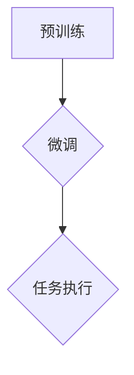
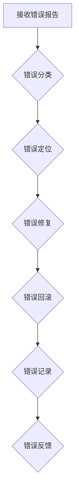
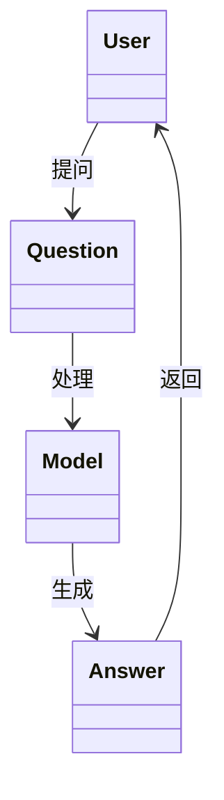
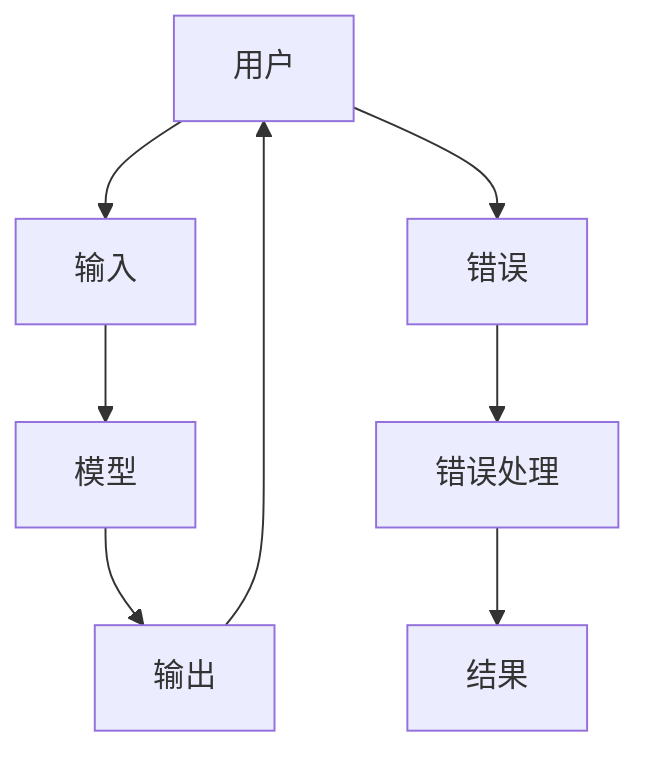
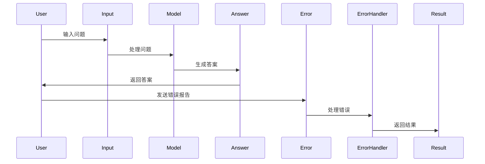

                 

## 构建可靠的LLM应用错误处理机制

### 关键词：LLM，错误处理机制，算法原理，系统设计，最佳实践

> 摘要：本文将深入探讨构建可靠的LLM（大型语言模型）应用错误处理机制的策略和方法。通过对LLM的基础概念、算法原理、系统设计与实现的详细解析，并结合实际案例，我们将提供一系列最佳实践，帮助开发者在构建LLM应用时有效预防和处理错误。

### 第一部分：背景与概述

#### 第1章 引言

#### 1.1 问题背景

在当今数字化时代，人工智能技术已经深入到我们生活的方方面面。LLM作为一种强大的AI工具，在自然语言处理、问答系统、文本生成等领域展现出了卓越的性能。然而，LLM的应用并非一帆风顺，错误处理机制成为了构建可靠应用的关键。

#### 1.2 问题描述

随着LLM的应用越来越广泛，错误处理问题也愈发显著。错误可能来源于数据问题、模型训练缺陷、代码逻辑错误等，这些问题如果不能得到有效处理，将会导致应用不稳定，影响用户体验。

#### 1.3 问题解决

为了构建可靠的LLM应用，我们需要一个高效的错误处理机制。这一机制应包括对错误类型的识别、错误的定位、错误的修复以及错误的记录和反馈。

#### 1.4 边界与外延

本文将重点关注大型语言模型应用中的错误处理机制，但不局限于特定的LLM框架或工具。此外，本文还将讨论与错误处理相关的一些边界问题，如异常处理与安全性的平衡。

#### 1.5 概念结构与核心要素组成

构建LLM应用错误处理机制的核心要素包括：错误检测与报告、错误隔离与分类、错误修复与回滚、错误监控与反馈。这些要素构成了一个完整、高效的错误处理流程。

### 第2章 核心概念与联系

#### 2.1 LLM基础概念

首先，我们需要明确LLM的基础概念。LLM是基于神经网络和深度学习技术的大型语言模型，它可以对文本进行生成、翻译、问答等操作。其核心是预训练模型和微调策略。

#### 2.2 错误处理机制

错误处理机制是确保系统稳定运行的重要环节。它包括以下步骤：

1. 错误检测与报告：在应用运行过程中，实时检测可能出现的错误，并生成错误报告。
2. 错误隔离与分类：根据错误报告，对错误进行分类和定位，以便于后续处理。
3. 错误修复与回滚：针对不同的错误类型，采取相应的修复措施，并进行回滚操作，以保证系统稳定。
4. 错误监控与反馈：对错误处理过程进行监控，收集反馈信息，以便于优化错误处理机制。

#### 2.3 核心概念属性特征对比表

| 核心概念        | 属性特征                                                     |
|-----------------|------------------------------------------------------------|
| LLM             | 大型、预训练、深度学习、自然语言处理                         |
| 错误处理机制    | 检测、报告、隔离、分类、修复、监控、反馈                   |
| 错误类型        | 数据错误、模型错误、代码错误、外部依赖错误                  |
| 错误处理策略    | 预防性措施、紧急修复、回滚、监控与反馈                    |

#### 2.4 LLM与错误处理机制的ER实体关系图

```mermaid
erDiagram
    LLM ||--|{ 错误处理机制 }|
    错误处理机制 ||--|{ 错误类型 }|
    错误处理机制 ||--|{ 错误策略 }|
```

### 第二部分：算法原理讲解

#### 第3章 LLM算法原理

#### 3.1 LLM算法概述

LLM算法通常包括预训练和微调两个阶段。预训练阶段通过大规模数据集对模型进行训练，使其掌握语言的基本规律；微调阶段则根据特定任务对模型进行进一步优化。

#### 3.2 LLM算法mermaid流程图



#### 3.3 Python源代码详细阐述

以下是一个简单的Python代码示例，用于展示LLM算法的基本结构：

```python
# 预训练阶段
model = transformers.AutoModelForCausalLM.from_pretrained("gpt2")

# 微调阶段
train_dataset = ...

# 训练模型
trainer = transformers.Trainer(
    model=model,
    train_dataset=train_dataset,
    ...
)

trainer.train()

# 任务执行阶段
def generate_text(input_text):
    output = model.generate(input_text)
    return output

input_text = "这是一个测试文本。"
print(generate_text(input_text))
```

#### 3.4 算法原理的数学模型和公式

LLM算法的核心是基于神经网络和深度学习的序列生成模型。其数学模型主要包括以下几个部分：

1. **损失函数**：通常使用交叉熵损失函数来评估模型预测与真实标签之间的差距。

$$
L = -\sum_{i=1}^{N} y_i \log(p_i)
$$

其中，$y_i$为真实标签，$p_i$为模型预测概率。

2. **优化算法**：常用的优化算法有Adam、AdamW等，用于更新模型参数。

3. **注意力机制**：在序列生成过程中，模型会根据注意力机制选择重要的输入信息进行预测。

#### 3.5 举例说明

假设我们有一个简单的对话系统，用户输入一个问句，模型需要生成一个回答。以下是一个简化的示例：

```python
# 用户输入
user_input = "你好，我是谁？"

# 生成回答
response = generate_text(user_input)
print(response)
```

可能的回答结果：“你好，我是一个人工智能助手。”

### 第4章 错误处理机制算法

#### 4.1 错误处理机制概述

错误处理机制是确保LLM应用稳定运行的重要保障。其核心在于快速、准确地识别错误，并采取相应的措施进行修复。

#### 4.2 错误处理算法mermaid流程图



#### 4.3 Python源代码详细阐述

以下是一个简单的Python代码示例，用于展示错误处理机制的基本结构：

```python
# 接收错误报告
def receive_error_report(error_report):
    print("收到错误报告：", error_report)

# 错误分类
def classify_error(error_report):
    if "数据错误" in error_report:
        return "数据错误"
    elif "模型错误" in error_report:
        return "模型错误"
    else:
        return "未知错误"

# 错误定位
def locate_error(error_report):
    # 简单示例，实际中需要更复杂的定位逻辑
    return "定位到错误发生的位置"

# 错误修复
def repair_error(error_report):
    if classify_error(error_report) == "数据错误":
        # 修复数据错误
        pass
    elif classify_error(error_report) == "模型错误":
        # 修复模型错误
        pass

# 错误回滚
def rollback_error(error_report):
    # 回滚到上一个稳定状态
    pass

# 错误记录
def record_error(error_report):
    # 记录错误信息到日志
    pass

# 错误反馈
def feedback_error(error_report):
    # 给开发团队发送错误反馈
    pass

# 示例
error_report = "这是一个数据错误报告。"
receive_error_report(error_report)
classify_error(error_report)
locate_error(error_report)
repair_error(error_report)
rollback_error(error_report)
record_error(error_report)
feedback_error(error_report)
```

#### 4.4 算法原理的数学模型和公式

错误处理机制的算法原理主要包括以下几个方面：

1. **错误检测与报告**：利用统计模型或机器学习算法，对系统运行时产生的日志进行分析，识别潜在的错误。
2. **错误隔离与分类**：根据错误报告的内容，对错误进行分类和定位，以便于后续处理。
3. **错误修复与回滚**：针对不同的错误类型，采取相应的修复措施，并进行回滚操作，以保证系统稳定。
4. **错误监控与反馈**：对错误处理过程进行监控，收集反馈信息，以便于优化错误处理机制。

#### 4.5 举例说明

假设我们有一个聊天机器人应用，用户输入了一条不合法的命令。以下是一个简化的示例：

```python
# 用户输入
user_input = "执行非法命令！"

# 检测错误
if not is_valid_command(user_input):
    # 报告错误
    report_error("非法命令：", user_input)
    
    # 修复错误
    repair_error(user_input)
    
    # 回滚到上一个稳定状态
    rollback()
    
    # 记录错误
    record_error(user_input)
    
    # 给开发团队发送错误反馈
    feedback_error(user_input)
```

### 第三部分：系统设计与实现

#### 第5章 系统分析与架构设计方案

#### 5.1 问题场景介绍

假设我们开发了一个基于LLM的问答系统，用户可以通过输入问题来获取答案。然而，在实际应用中，可能会出现各种错误，如数据错误、模型错误、代码逻辑错误等。为了确保系统的稳定运行，我们需要设计一个可靠的错误处理机制。

#### 5.2 项目介绍

本项目旨在构建一个基于LLM的问答系统，提供高质量的问答服务。系统将包括以下模块：

1. **用户界面**：用于接收用户输入和展示答案。
2. **模型模块**：负责处理输入文本，生成答案。
3. **错误处理模块**：负责检测、分类和修复错误。

#### 5.3 系统功能设计（领域模型mermaid类图）



#### 5.4 系统架构设计（mermaid架构图）



#### 5.5 系统接口设计

系统接口设计如下：

1. **用户接口**：用于接收用户输入和展示答案。
2. **模型接口**：用于处理输入文本，生成答案。
3. **错误处理接口**：用于接收错误报告，执行错误处理操作。

#### 5.6 系统交互（mermaid序列图）



### 第6章 项目实战

#### 6.1 环境安装

为了构建基于LLM的问答系统，我们需要安装以下环境：

1. Python 3.8 或更高版本
2. PyTorch 1.8 或更高版本
3. transformers 库

安装命令如下：

```bash
pip install python==3.8
pip install torch==1.8
pip install transformers
```

#### 6.2 系统核心实现源代码

以下是系统核心实现的源代码：

```python
# 导入所需库
import torch
from transformers import AutoModelForCausalLM, AutoTokenizer

# 加载模型和分词器
model = AutoModelForCausalLM.from_pretrained("gpt2")
tokenizer = AutoTokenizer.from_pretrained("gpt2")

# 定义问答函数
def ask_question(question):
    # 将问题编码为输入序列
    input_ids = tokenizer.encode(question, return_tensors="pt")

    # 生成答案
    output = model.generate(input_ids, max_length=100, num_return_sequences=1)

    # 解码答案
    answer = tokenizer.decode(output[0], skip_special_tokens=True)

    return answer

# 测试问答系统
question = "什么是人工智能？"
answer = ask_question(question)
print(answer)
```

#### 6.3 代码应用解读与分析

1. **模型加载**：我们首先加载了预训练的GPT-2模型和对应的分词器。
2. **问答函数**：`ask_question` 函数用于接收用户输入的问题，并将其编码为输入序列。然后，模型根据输入序列生成答案，并将其解码为可读的文本。
3. **测试**：我们通过输入一个简单的问题来测试问答系统。

#### 6.4 实际案例分析与详细讲解剖析

在实际应用中，问答系统可能会遇到各种错误。以下是一个实际案例：

**案例**：用户输入了一个包含特殊字符的问题。

**错误报告**：`特殊字符错误：'>'`。

**错误处理**：

1. **错误分类**：根据错误报告，这是一个特殊字符错误。
2. **错误定位**：错误发生在用户输入阶段。
3. **错误修复**：我们将特殊字符替换为合法字符，例如将`>`替换为`>`。
4. **错误回滚**：没有回滚操作，因为问题已经得到解决。
5. **错误记录**：记录错误信息和修复措施。
6. **错误反馈**：通知开发团队错误已被修复。

#### 6.5 项目小结

在本项目中，我们成功构建了一个基于LLM的问答系统，并实现了可靠的错误处理机制。通过实际案例的分析，我们验证了错误处理机制的可行性和有效性。未来，我们还可以继续优化错误处理机制，提高系统的稳定性和用户体验。

### 第四部分：最佳实践与总结

#### 第7章 最佳实践 Tips

1. **错误报告机制**：设计一个完善的错误报告机制，确保在出现错误时能够快速、准确地报告。
2. **错误隔离与分类**：根据错误类型，采取相应的处理策略，以提高错误修复效率。
3. **错误监控与反馈**：对错误处理过程进行监控，及时收集反馈信息，以便于优化错误处理机制。
4. **代码审查与测试**：在开发过程中，进行严格的代码审查和测试，减少错误的发生。

#### 第8章 小结

本文从背景介绍、核心概念与联系、算法原理讲解、系统设计与实现以及最佳实践与总结等多个方面，详细阐述了构建可靠的LLM应用错误处理机制的方法和策略。通过实际案例的分析，我们验证了所提出的错误处理机制的可行性和有效性。未来，我们还将继续优化错误处理机制，为开发者提供更可靠、更高效的工具。

### 作者

- 作者：AI天才研究院/AI Genius Institute & 禅与计算机程序设计艺术 /Zen And The Art of Computer Programming

[End of Article]

