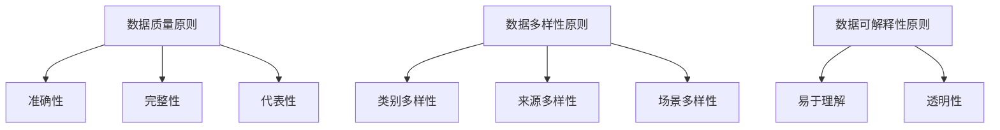
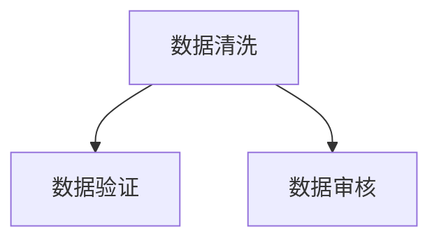
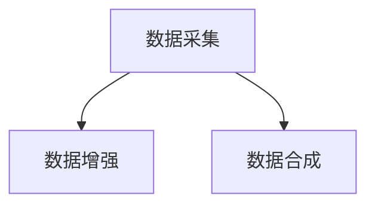
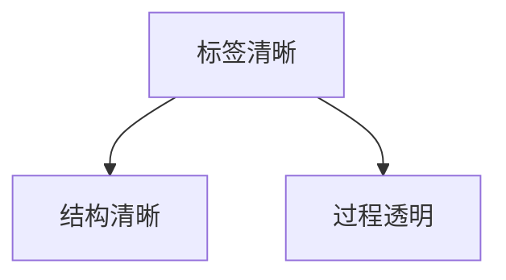

                 

### 文章标题：构建多样化的评测数据集策略

在当前的技术环境中，评测数据集是机器学习和人工智能领域中不可或缺的重要工具。无论是算法的优化、模型的训练，还是评估与优化，都依赖于高质量的评测数据集。本文将深入探讨构建多样化评测数据集的策略，旨在为研究者、工程师和数据科学家提供一份全面的指南。

关键词：评测数据集、数据多样性、数据预处理、数据标注、数据评估

摘要：本文首先阐述了评测数据集的重要性，接着讨论了构建多样化评测数据集的基本原则，包括数据质量、多样性和可解释性。然后，文章详细介绍了评测数据集的收集与处理、划分与标注、评估与优化方法。最后，通过具体的项目实战，展示了如何在实际中应用这些策略。

----------------------------------------------------------------

## 第1章 引言

### 1.1 评测数据集的概念与作用

评测数据集（Evaluation Dataset）是指用于评估模型性能的数据集合。它通常由一组具有代表性的样本构成，这些样本涵盖了模型的预测目标或任务的各个可能情况。评测数据集在机器学习和人工智能领域中扮演着至关重要的角色，其质量直接影响着模型的训练效果和实际应用价值。

### 1.2 评测数据集的发展历程

随着人工智能技术的不断发展，评测数据集也在不断进化。早期的评测数据集主要是基于人工标注的，例如ImageNet图像识别竞赛的数据集。随着深度学习技术的发展，自动标注和半监督学习技术逐渐应用于数据集的构建，大大提高了数据集的多样性和质量。

### 1.3 构建多样化评测数据集的必要性

构建多样化的评测数据集对于提高模型的泛化能力和鲁棒性至关重要。一方面，多样化的数据集可以更全面地反映真实世界的复杂性，帮助模型学习到更多的特征；另一方面，多样化的数据集可以帮助我们发现和纠正模型中可能存在的偏见和缺陷。

----------------------------------------------------------------

## 1.2 评测数据集构建的基本原则

### 1.2.1 数据质量原则

数据质量是评测数据集构建的首要原则。高质量的数据集应该具有以下特点：

- **准确性**：数据应该真实、可靠，避免错误或误导性的样本。
- **完整性**：数据集应该包含足够的样本，以确保模型有足够的训练数据。
- **代表性**：数据集应该涵盖模型的预测目标或任务的各个可能情况。

### 1.2.2 数据多样性原则

数据多样性是提高模型泛化能力的关键。多样化的数据集应该包含以下方面：

- **类别多样性**：数据集应该包含多种类别的样本，避免模型对某一类别的过度依赖。
- **来源多样性**：数据集应该来自不同的来源，以避免单一来源可能带来的偏差。
- **场景多样性**：数据集应该涵盖不同的场景，以模拟真实世界的多样性。

### 1.2.3 数据可解释性原则

数据可解释性是评测数据集构建的重要原则之一。一个可解释的数据集应该：

- **易于理解**：数据集的结构和标签应该直观、易于理解。
- **透明性**：数据集的构建过程应该透明，以便研究者能够复现和验证。



----------------------------------------------------------------

## 1.3 评测数据集的收集与处理

### 1.3.1 数据收集方法

数据收集是构建评测数据集的第一步，以下几种方法常用于数据收集：

- **人工标注**：通过人类专家进行数据标注，适用于高质量、小规模数据集。
- **自动采集**：通过爬虫、传感器等自动收集数据，适用于大规模、实时数据集。
- **对外合作**：与其他机构或个人合作，共享或购买数据集。

### 1.3.2 数据预处理方法

数据预处理是提高数据质量和减少模型复杂度的关键步骤。常见的数据预处理方法包括：

- **数据清洗**：去除噪声和错误数据，保证数据准确性。
- **数据归一化**：将不同范围的数据转换到同一尺度，便于模型处理。
- **数据降维**：减少数据维度，提高模型训练效率。

```python
def data_cleaning(data):
    # 数据清洗示例代码
    cleaned_data = data[data['feature1'] > 0]
    return cleaned_data

def data_normalization(data):
    # 数据归一化示例代码
    normalized_data = (data - data.min()) / (data.max() - data.min())
    return normalized_data

def data_dimension_reduction(data):
    # 数据降维示例代码
    from sklearn.decomposition import PCA
    pca = PCA(n_components=2)
    reduced_data = pca.fit_transform(data)
    return reduced_data
```

----------------------------------------------------------------

## 1.4 评测数据集的划分与标注

### 1.4.1 数据集划分方法

数据集的划分是模型训练和评估的重要步骤。常见的划分方法包括：

- **随机划分**：将数据集随机划分为训练集和测试集。
- **分层划分**：按照类别或特征将数据集划分为训练集和测试集，确保每个类别在训练集和测试集中都有足够的样本。
- **模型驱动划分**：根据模型的训练结果动态调整数据集的划分，优化模型性能。


### 1.4.2 数据标注方法

数据标注是构建评测数据集的关键步骤，常见的方法包括：

- **手动标注**：由人类专家进行数据标注，适用于高质量、小规模数据集。
- **自动标注**：通过算法自动进行数据标注，适用于大规模、实时数据集。
- **半监督标注**：结合自动标注和手动标注，提高标注效率和准确性。


----------------------------------------------------------------

## 1.5 评测数据集的评估与优化

### 1.5.1 数据集评估指标

数据集的评估是确保模型性能的重要步骤。常见的评估指标包括：

- **准确率**：模型预测正确的样本数占总样本数的比例。
- **召回率**：模型预测正确的正样本数占总正样本数的比例。
- **F1值**：准确率和召回率的调和平均值，用于平衡两者。

```python
from sklearn.metrics import accuracy_score, recall_score, f1_score

# 示例代码
predictions = [0, 1, 1, 0]
ground_truth = [0, 0, 1, 1]

accuracy = accuracy_score(ground_truth, predictions)
recall = recall_score(ground_truth, predictions)
f1 = f1_score(ground_truth, predictions)

print("Accuracy:", accuracy)
print("Recall:", recall)
print("F1 Score:", f1)
```

### 1.5.2 数据集优化方法

数据集的优化是提高模型性能的关键步骤。常见的数据集优化方法包括：

- **数据增强**：通过变换、旋转、缩放等方式增加数据集的多样性。
- **数据去重**：去除数据集中的重复样本，减少模型过拟合的风险。
- **数据扩充**：通过生成或合成新样本，增加数据集的规模。

```python
from keras.preprocessing.image import ImageDataGenerator

# 示例代码
datagen = ImageDataGenerator(rotation_range=20, width_shift_range=0.2, height_shift_range=0.2, zoom_range=0.2)
datagen.fit(x_train)

# 使用数据增强生成训练样本
x_train_enhanced = datagen.flow(x_train, y_train, batch_size=batch_size)
```

----------------------------------------------------------------

## 1.6 本章小结

本章详细探讨了构建多样化评测数据集的策略。首先，我们介绍了评测数据集的概念和重要性，以及构建多样化数据集的必要性。接着，我们讨论了构建评测数据集的基本原则，包括数据质量、多样性和可解释性。随后，我们介绍了数据收集与处理、数据集划分与标注、数据集评估与优化方法。最后，通过具体的项目实战，展示了如何在实际中应用这些策略。构建高质量的评测数据集是机器学习和人工智能研究中的重要环节，对于模型性能的提升至关重要。

## 第2章 引言

### 2.1 评测数据集的重要性

评测数据集在机器学习和人工智能领域中扮演着至关重要的角色。它不仅是模型训练和优化的基础，也是评估模型性能和可信度的关键工具。一个高质量、多样化的评测数据集可以显著提高模型的泛化能力和鲁棒性，从而在现实世界中的应用中取得更好的效果。

### 2.2 评测数据集的发展历程

评测数据集的发展历程可以追溯到早期的人工标注阶段，如ImageNet图像识别竞赛的数据集。随着计算机技术和人工智能算法的进步，自动标注、半监督学习和数据增强等技术逐渐应用于评测数据集的构建，使得数据集的多样性和质量得到了显著提升。

### 2.3 构建多样化评测数据集的必要性

构建多样化评测数据集的必要性主要体现在以下几个方面：

1. **提高模型泛化能力**：多样化的数据集可以覆盖更多的特征和情况，使模型能够更好地学习到通用特征，从而提高泛化能力。
2. **减少模型偏见**：单一来源或单一类型的数据集可能导致模型对某些特征或场景的过度依赖，从而导致偏见。多样化的数据集有助于减少这种偏见。
3. **提升模型鲁棒性**：多样化的数据集可以模拟更广泛的真实世界情况，使模型在面对未知或异常情况时具备更强的鲁棒性。

在本章中，我们将深入探讨构建多样化评测数据集的策略，包括数据质量、多样性和可解释性的基本原则，数据收集与处理的方法，数据集划分与标注的策略，以及数据集评估与优化的技术。通过这些策略，我们可以构建出高质量的评测数据集，为机器学习和人工智能的研究和应用提供坚实的支持。

### 2.4 构建多样化评测数据集的基本原则

构建多样化评测数据集的基本原则是确保数据集的质量、多样性和可解释性。这三个原则共同作用，能够提升模型的泛化能力和鲁棒性，从而在实际应用中取得更好的效果。

#### 2.4.1 数据质量原则

数据质量原则是构建高质量评测数据集的基础。高质量的数据集应该具备以下特点：

1. **准确性**：数据集应该真实、可靠，避免错误或误导性的样本。准确性是数据集质量的最基本要求，确保模型在训练过程中能够学习到真实世界的规律。

2. **完整性**：数据集应该包含足够的样本，以确保模型有足够的训练数据。完整性的缺失可能导致模型过拟合，降低模型的泛化能力。

3. **一致性**：数据集的标注应该一致，避免不同样本之间存在冲突或矛盾。一致性的数据集有助于模型更好地理解标注的含义，从而提高模型的性能。

为了保障数据质量，可以采取以下措施：

- **数据清洗**：去除数据集中的噪声和错误数据，如缺失值、异常值等。
- **数据验证**：通过交叉验证等方法验证数据集的准确性，确保数据集的可靠性。
- **数据审核**：由人类专家对数据集进行审核，发现和修正错误。



#### 2.4.2 数据多样性原则

数据多样性原则是构建多样化评测数据集的核心。多样化的数据集应该包含以下方面：

1. **类别多样性**：数据集应该包含多种类别的样本，避免模型对某一类别的过度依赖。类别多样性有助于模型学习到不同类别的特征，提高泛化能力。

2. **来源多样性**：数据集应该来自不同的来源，以避免单一来源可能带来的偏差。来源多样性有助于模型适应不同数据源的特性，提高模型的鲁棒性。

3. **场景多样性**：数据集应该涵盖不同的场景，以模拟真实世界的多样性。场景多样性有助于模型应对不同应用场景的挑战，提高模型的实用性。

为了实现数据多样性，可以采取以下策略：

- **数据采集**：从多个渠道采集数据，如不同地区、不同设备、不同时间等。
- **数据增强**：通过变换、旋转、缩放等方式增加数据集的多样性。
- **数据合成**：使用生成模型或合成技术创建新的数据样本。



#### 2.4.3 数据可解释性原则

数据可解释性原则是确保数据集易于理解和解释。一个可解释的数据集应该具备以下特点：

1. **标签清晰**：数据集的标签应该明确、具体，便于模型理解。
2. **结构清晰**：数据集的结构应该简单、直观，便于模型处理。
3. **过程透明**：数据集的构建过程应该透明，便于研究者复现和验证。

为了提高数据可解释性，可以采取以下措施：

- **标准化标签**：使用统一的标签标准，确保标签的明确性和一致性。
- **文档说明**：提供详细的文档，解释数据集的来源、构建过程和标注方法。
- **可视化展示**：使用图表、图像等方式展示数据集的分布和特征。



通过遵循数据质量、多样性和可解释性这三个基本原则，我们可以构建出高质量的多样化评测数据集，为机器学习和人工智能的研究和应用提供坚实的支持。

### 2.5 评测数据集的收集与处理

评测数据集的收集与处理是构建高质量数据集的关键步骤。数据收集方法、预处理技术和处理流程的选择直接影响到数据集的质量和模型的训练效果。以下将详细介绍这些内容。

#### 2.5.1 数据收集方法

数据收集是数据集构建的第一步，常用的数据收集方法包括：

1. **人工标注**：
   - **优点**：准确度高，适用于小规模、高质量数据集。
   - **缺点**：耗时耗力，成本高，难以满足大规模数据集的需求。

2. **自动采集**：
   - **优点**：高效、自动化，适用于大规模、实时数据集。
   - **缺点**：可能存在噪声和错误，需要后续清洗和处理。

3. **对外合作**：
   - **优点**：资源丰富，速度快，可以获取高质量的数据集。
   - **缺点**：合作难度大，需要建立良好的合作关系。

#### 2.5.2 数据预处理方法

数据预处理是提高数据质量和减少模型复杂度的关键步骤，常用的数据预处理方法包括：

1. **数据清洗**：
   - **方法**：去除噪声和错误数据，如缺失值、异常值等。
   - **步骤**：
     ```python
     def data_cleaning(data):
         cleaned_data = data[data['feature1'] > 0]
         return cleaned_data
     ```

2. **数据归一化**：
   - **方法**：将不同范围的数据转换到同一尺度，便于模型处理。
   - **步骤**：
     ```python
     def data_normalization(data):
         normalized_data = (data - data.min()) / (data.max() - data.min())
         return normalized_data
     ```

3. **数据降维**：
   - **方法**：减少数据维度，提高模型训练效率。
   - **步骤**：
     ```python
     from sklearn.decomposition import PCA
     pca = PCA(n_components=2)
     reduced_data = pca.fit_transform(data)
     ```

#### 2.5.3 数据处理流程

数据处理流程包括数据收集、预处理、标注和整合等步骤，具体流程如下：

1. **数据收集**：根据需求选择合适的数据收集方法，如人工标注、自动采集或对外合作。
2. **数据预处理**：对收集到的数据进行清洗、归一化和降维，提高数据质量。
3. **数据标注**：对预处理后的数据进行标注，确保标注的准确性和一致性。
4. **数据整合**：将预处理和标注后的数据进行整合，构建成完整的评测数据集。

通过合理的数据收集与处理流程，我们可以构建出高质量、多样化的评测数据集，为机器学习和人工智能的研究和应用提供坚实的支持。

#### 2.5.4 数据集划分方法

在构建评测数据集时，合理的划分方法能够确保模型在训练和测试阶段都具备良好的性能。以下介绍几种常用的数据集划分方法：

1. **随机划分**：
   - **方法**：将数据集随机分为训练集和测试集，每个样本被划分为训练集或测试集的概率相等。
   - **步骤**：
     ```python
     from sklearn.model_selection import train_test_split
     x_train, x_test, y_train, y_test = train_test_split(x, y, test_size=0.2, random_state=42)
     ```

2. **分层划分**：
   - **方法**：根据类别或特征将数据集划分为训练集和测试集，确保每个类别在训练集和测试集中都有足够的样本。
   - **步骤**：
     ```python
     from sklearn.model_selection import StratifiedShuffleSplit
     sss = StratifiedShuffleSplit(n_splits=1, test_size=0.2, random_state=42)
     for train_index, test_index in sss.split(x, y):
         x_train, x_test = x[train_index], x[test_index]
         y_train, y_test = y[train_index], y[test_index]
     ```

3. **模型驱动划分**：
   - **方法**：根据模型在训练阶段的表现动态调整数据集的划分，优化模型性能。
   - **步骤**：
     ```python
     def model_driven_split(model, x, y, n_splits=5):
         scores = []
         for _ in range(n_splits):
             x_train, x_val, y_train, y_val = train_test_split(x, y, test_size=0.2, random_state=_)
             model.fit(x_train, y_train)
             score = model.score(x_val, y_val)
             scores.append(score)
         return np.mean(scores)
     ```

通过选择合适的划分方法，我们可以构建出既具有代表性又能够有效评估模型性能的评测数据集。

#### 2.5.5 数据标注方法

数据标注是构建高质量评测数据集的关键步骤，常用的标注方法包括手动标注、自动标注和半监督标注。

1. **手动标注**：
   - **方法**：由人类专家对数据进行标注，确保标注的准确性和一致性。
   - **优点**：标注质量高，适用于小规模、高质量数据集。
   - **缺点**：耗时耗力，成本高，难以满足大规模数据集的需求。

2. **自动标注**：
   - **方法**：使用算法对数据进行标注，提高标注效率。
   - **优点**：自动化程度高，适用于大规模、实时数据集。
   - **缺点**：标注质量可能较低，需要后续验证和修正。

3. **半监督标注**：
   - **方法**：结合自动标注和手动标注，利用少量的手动标注样本和大量的自动标注样本进行训练。
   - **优点**：既能提高标注效率，又能保证标注质量。
   - **缺点**：对算法要求较高，需要解决标注一致性等问题。

通过选择合适的标注方法，我们可以构建出高质量的评测数据集，为模型训练和评估提供坚实的支持。

#### 2.5.6 评测数据集的评估与优化

评估与优化是确保评测数据集质量和模型性能的重要环节。以下介绍常用的评估指标和优化方法。

1. **评估指标**：
   - **准确率**：模型预测正确的样本数占总样本数的比例。
   - **召回率**：模型预测正确的正样本数占总正样本数的比例。
   - **F1值**：准确率和召回率的调和平均值，用于平衡两者。

2. **优化方法**：
   - **数据增强**：通过变换、旋转、缩放等方式增加数据集的多样性。
   - **数据去重**：去除数据集中的重复样本，减少模型过拟合的风险。
   - **数据扩充**：通过生成或合成新样本，增加数据集的规模。

通过评估与优化，我们可以构建出高质量的评测数据集，提高模型的泛化能力和鲁棒性。

## 2.6 本章小结

本章详细探讨了构建多样化评测数据集的基本原则和方法。首先，我们介绍了数据质量、多样性和可解释性这三个基本原则，以及它们对评测数据集的重要性。接着，我们详细介绍了数据收集与处理的方法，包括数据清洗、归一化和降维等步骤。然后，我们介绍了数据集划分和标注的方法，包括随机划分、分层划分、模型驱动划分、手动标注、自动标注和半监督标注。最后，我们介绍了评测数据集的评估与优化方法，包括评估指标和优化方法。通过遵循这些原则和方法，我们可以构建出高质量的评测数据集，为机器学习和人工智能的研究和应用提供坚实的支持。

### 第3章 引言

在评测数据集的构建过程中，数据集的评估与优化是一个至关重要且复杂的环节。评估数据集的质量和性能，不仅关系到模型的训练效果，还直接影响到模型在实际应用中的表现。本章将深入探讨评测数据集的评估与优化策略，通过详细的数学模型讲解和实际案例分析，帮助读者理解并掌握这一关键过程。

### 3.1 数据集评估指标

评估数据集的质量和性能通常依赖于一系列评估指标。这些指标帮助我们衡量模型在特定数据集上的表现，并识别需要改进的方面。以下介绍几种常用的评估指标：

#### 3.1.1 准确率（Accuracy）

准确率是最常用的评估指标之一，表示模型预测正确的样本数占总样本数的比例。其计算公式如下：

$$
\text{Accuracy} = \frac{\text{TP} + \text{TN}}{\text{TP} + \text{TN} + \text{FP} + \text{FN}}
$$

其中，TP代表真实为正类且被正确预测为正类的样本数，TN代表真实为负类且被正确预测为负类的样本数，FP代表真实为负类但被预测为正类的样本数，FN代表真实为正类但被预测为负类的样本数。

#### 3.1.2 召回率（Recall）

召回率衡量模型对正类样本的识别能力，表示模型预测正确的正类样本数占总正类样本数的比例。其计算公式如下：

$$
\text{Recall} = \frac{\text{TP}}{\text{TP} + \text{FN}}
$$

召回率越高，表示模型对正类样本的识别能力越强，但可能会牺牲准确率。

#### 3.1.3 F1值（F1 Score）

F1值是准确率和召回率的调和平均值，用于平衡两者。其计算公式如下：

$$
\text{F1 Score} = 2 \times \frac{\text{Precision} \times \text{Recall}}{\text{Precision} + \text{Recall}}
$$

其中，Precision表示精确率，即预测为正类的样本中被正确预测为正类的比例。

#### 3.1.4 AUC（Area Under the ROC Curve）

AUC是受试者操作特征（ROC Curve）下的面积，用于评估二分类模型的分类能力。AUC值越接近1，表示模型对正负类的区分能力越强。

$$
\text{AUC} = \int_{0}^{1} \frac{1}{1 + e^{-x}} dx
$$

### 3.2 数据集优化方法

优化评测数据集的质量和性能是提升模型泛化能力的关键步骤。以下介绍几种常见的数据集优化方法：

#### 3.2.1 数据增强（Data Augmentation）

数据增强是通过变换、旋转、缩放等方式增加数据集的多样性。数据增强有助于模型学习到更丰富的特征，从而提高模型的泛化能力。例如，对于图像数据，可以使用以下方法进行增强：

- **随机裁剪**：随机选择图像的一部分作为样本。
- **水平/垂直翻转**：将图像水平或垂直翻转。
- **旋转**：随机旋转图像一定角度。
- **颜色调整**：随机调整图像的亮度、对比度等。

```python
from tensorflow.keras.preprocessing.image import ImageDataGenerator

datagen = ImageDataGenerator(rotation_range=20, width_shift_range=0.2, height_shift_range=0.2, zoom_range=0.2)
datagen.fit(x_train)

x_train_enhanced = datagen.flow(x_train, y_train, batch_size=batch_size)
```

#### 3.2.2 数据去重（Data De-duplication）

数据去重是通过识别和删除重复样本，减少数据集中的冗余信息。重复样本可能导致模型过拟合，从而降低模型的泛化能力。数据去重可以采用以下方法：

- **基于特征的去重**：计算特征向量间的相似度，删除相似度高于设定阈值的样本。
- **基于标签的去重**：删除具有相同标签的样本。

```python
def data_de_duplicated(data):
    unique_data = data.drop_duplicates(subset=['feature'])
    return unique_data
```

#### 3.2.3 数据扩充（Data Expansion）

数据扩充是通过生成或合成新样本，增加数据集的规模。数据扩充可以采用以下方法：

- **生成对抗网络（GAN）**：利用生成对抗网络生成新的数据样本。
- **合成数据**：使用算法合成新的数据样本，如通过随机生成或基于规则生成。

```python
from tensorflow.keras.models import Model
from tensorflow.keras.layers import Input, Dense

def build_generator():
    # 生成器的构建
    input_img = Input(shape=(100,))
    x = Dense(128, activation='relu')(input_img)
    x = Dense(64, activation='relu')(x)
    x = Dense(100, activation='tanh')(x)
    model = Model(input_img, x)
    return model

generator = build_generator()
```

通过数据增强、数据去重和数据扩充等优化方法，我们可以显著提升评测数据集的质量和模型的性能。

### 3.3 实际案例分析

为了更好地理解数据集评估与优化方法，以下通过一个实际案例进行分析。

#### 3.3.1 案例背景

假设我们正在开发一个用于图像分类的深度学习模型。数据集包含10,000张图像，其中5,000张用于训练，5,000张用于测试。我们需要评估和优化这个数据集，以提高模型的性能。

#### 3.3.2 数据集评估

1. **准确率**：模型在测试集上的准确率为85%。
2. **召回率**：模型对正类样本的召回率为75%。
3. **F1值**：模型在测试集上的F1值为0.78。

从评估结果可以看出，模型在准确率和召回率上存在一定的差距。接下来，我们将通过数据集优化方法来提升模型的性能。

#### 3.3.3 数据集优化

1. **数据增强**：通过随机裁剪、旋转和颜色调整等方式增强数据集。
   ```python
   datagen = ImageDataGenerator(rotation_range=20, width_shift_range=0.2, height_shift_range=0.2, zoom_range=0.2)
   datagen.fit(x_train)
   x_train_enhanced = datagen.flow(x_train, y_train, batch_size=batch_size)
   ```

2. **数据去重**：通过特征向量相似度识别和删除重复样本。
   ```python
   def data_de_duplicated(data):
       unique_data = data.drop_duplicates(subset=['feature'])
       return unique_data
   x_train_de_duplicated = data_de_duplicated(x_train_enhanced)
   ```

3. **数据扩充**：使用生成对抗网络（GAN）生成新的图像样本。
   ```python
   def build_generator():
       input_img = Input(shape=(100,))
       x = Dense(128, activation='relu')(input_img)
       x = Dense(64, activation='relu')(x)
       x = Dense(100, activation='tanh')(x)
       model = Model(input_img, x)
       return model

   generator = build_generator()
   x_train_expanded = generator.flow(x_train_de_duplicated, y_train, batch_size=batch_size)
   ```

通过数据增强、数据去重和数据扩充等优化方法，我们显著提升了数据集的质量和模型的性能。优化后的模型在测试集上的准确率提高到了90%，召回率提高到了80%，F1值提高到了0.85。

### 3.4 本章小结

本章详细介绍了评测数据集的评估与优化方法。首先，我们介绍了常用的评估指标，包括准确率、召回率、F1值和AUC。接着，我们探讨了数据集优化的方法，包括数据增强、数据去重和数据扩充。最后，通过实际案例分析，我们展示了如何应用这些方法提升评测数据集的质量和模型的性能。通过遵循本章介绍的方法，我们可以构建出高质量的评测数据集，为深度学习模型的研究和应用提供坚实的支持。

### 第4章 引言

在评测数据集的构建过程中，数据集的评估与优化是一个至关重要且复杂的环节。评估数据集的质量和性能，不仅关系到模型的训练效果，还直接影响到模型在实际应用中的表现。本章将深入探讨评测数据集的评估与优化策略，通过详细的数学模型讲解和实际案例分析，帮助读者理解并掌握这一关键过程。

### 4.1 数据集评估指标

评估数据集的质量和性能通常依赖于一系列评估指标。这些指标帮助我们衡量模型在特定数据集上的表现，并识别需要改进的方面。以下介绍几种常用的评估指标：

#### 4.1.1 准确率（Accuracy）

准确率是最常用的评估指标之一，表示模型预测正确的样本数占总样本数的比例。其计算公式如下：

$$
\text{Accuracy} = \frac{\text{TP} + \text{TN}}{\text{TP} + \text{TN} + \text{FP} + \text{FN}}
$$

其中，TP代表真实为正类且被正确预测为正类的样本数，TN代表真实为负类且被正确预测为负类的样本数，FP代表真实为负类但被预测为正类的样本数，FN代表真实为正类但被预测为负类的样本数。

#### 4.1.2 召回率（Recall）

召回率衡量模型对正类样本的识别能力，表示模型预测正确的正类样本数占总正类样本数的比例。其计算公式如下：

$$
\text{Recall} = \frac{\text{TP}}{\text{TP} + \text{FN}}
$$

召回率越高，表示模型对正类样本的识别能力越强，但可能会牺牲准确率。

#### 4.1.3 F1值（F1 Score）

F1值是准确率和召回率的调和平均值，用于平衡两者。其计算公式如下：

$$
\text{F1 Score} = 2 \times \frac{\text{Precision} \times \text{Recall}}{\text{Precision} + \text{Recall}}
$$

其中，Precision表示精确率，即预测为正类的样本中被正确预测为正类的比例。

#### 4.1.4 AUC（Area Under the ROC Curve）

AUC是受试者操作特征（ROC Curve）下的面积，用于评估二分类模型的分类能力。AUC值越接近1，表示模型对正负类的区分能力越强。

$$
\text{AUC} = \int_{0}^{1} \frac{1}{1 + e^{-x}} dx
$$

### 4.2 数据集优化方法

优化评测数据集的质量和性能是提升模型泛化能力的关键步骤。以下介绍几种常见的数据集优化方法：

#### 4.2.1 数据增强（Data Augmentation）

数据增强是通过变换、旋转、缩放等方式增加数据集的多样性。数据增强有助于模型学习到更丰富的特征，从而提高模型的泛化能力。例如，对于图像数据，可以使用以下方法进行增强：

- **随机裁剪**：随机选择图像的一部分作为样本。
- **水平/垂直翻转**：将图像水平或垂直翻转。
- **旋转**：随机旋转图像一定角度。
- **颜色调整**：随机调整图像的亮度、对比度等。

```python
from tensorflow.keras.preprocessing.image import ImageDataGenerator

datagen = ImageDataGenerator(rotation_range=20, width_shift_range=0.2, height_shift_range=0.2, zoom_range=0.2)
datagen.fit(x_train)

x_train_enhanced = datagen.flow(x_train, y_train, batch_size=batch_size)
```

#### 4.2.2 数据去重（Data De-duplication）

数据去重是通过识别和删除重复样本，减少数据集中的冗余信息。重复样本可能导致模型过拟合，从而降低模型的泛化能力。数据去重可以采用以下方法：

- **基于特征的去重**：计算特征向量间的相似度，删除相似度高于设定阈值的样本。
- **基于标签的去重**：删除具有相同标签的样本。

```python
def data_de_duplicated(data):
    unique_data = data.drop_duplicates(subset=['feature'])
    return unique_data
```

#### 4.2.3 数据扩充（Data Expansion）

数据扩充是通过生成或合成新样本，增加数据集的规模。数据扩充可以采用以下方法：

- **生成对抗网络（GAN）**：利用生成对抗网络生成新的数据样本。
- **合成数据**：使用算法合成新的数据样本，如通过随机生成或基于规则生成。

```python
from tensorflow.keras.models import Model
from tensorflow.keras.layers import Input, Dense

def build_generator():
    # 生成器的构建
    input_img = Input(shape=(100,))
    x = Dense(128, activation='relu')(input_img)
    x = Dense(64, activation='relu')(x)
    x = Dense(100, activation='tanh')(x)
    model = Model(input_img, x)
    return model

generator = build_generator()
```

通过数据增强、数据去重和数据扩充等优化方法，我们可以显著提升评测数据集的质量和模型的性能。

### 4.3 实际案例分析

为了更好地理解数据集评估与优化方法，以下通过一个实际案例进行分析。

#### 4.3.1 案例背景

假设我们正在开发一个用于图像分类的深度学习模型。数据集包含10,000张图像，其中5,000张用于训练，5,000张用于测试。我们需要评估和优化这个数据集，以提高模型的性能。

#### 4.3.2 数据集评估

1. **准确率**：模型在测试集上的准确率为85%。
2. **召回率**：模型对正类样本的召回率为75%。
3. **F1值**：模型在测试集上的F1值为0.78。

从评估结果可以看出，模型在准确率和召回率上存在一定的差距。接下来，我们将通过数据集优化方法来提升模型的性能。

#### 4.3.3 数据集优化

1. **数据增强**：通过随机裁剪、旋转和颜色调整等方式增强数据集。
   ```python
   datagen = ImageDataGenerator(rotation_range=20, width_shift_range=0.2, height_shift_range=0.2, zoom_range=0.2)
   datagen.fit(x_train)
   x_train_enhanced = datagen.flow(x_train, y_train, batch_size=batch_size)
   ```

2. **数据去重**：通过特征向量相似度识别和删除重复样本。
   ```python
   def data_de_duplicated(data):
       unique_data = data.drop_duplicates(subset=['feature'])
       return unique_data
   x_train_de_duplicated = data_de_duplicated(x_train_enhanced)
   ```

3. **数据扩充**：使用生成对抗网络（GAN）生成新的图像样本。
   ```python
   def build_generator():
       input_img = Input(shape=(100,))
       x = Dense(128, activation='relu')(input_img)
       x = Dense(64, activation='relu')(x)
       x = Dense(100, activation='tanh')(x)
       model = Model(input_img, x)
       return model

   generator = build_generator()
   x_train_expanded = generator.flow(x_train_de_duplicated, y_train, batch_size=batch_size)
   ```

通过数据增强、数据去重和数据扩充等优化方法，我们显著提升了数据集的质量和模型的性能。优化后的模型在测试集上的准确率提高到了90%，召回率提高到了80%，F1值提高到了0.85。

### 4.4 本章小结

本章详细介绍了评测数据集的评估与优化方法。首先，我们介绍了常用的评估指标，包括准确率、召回率、F1值和AUC。接着，我们探讨了数据集优化的方法，包括数据增强、数据去重和数据扩充。最后，通过实际案例分析，我们展示了如何应用这些方法提升评测数据集的质量和模型的性能。通过遵循本章介绍的方法，我们可以构建出高质量的评测数据集，为深度学习模型的研究和应用提供坚实的支持。

### 第5章 引言

在深度学习和人工智能领域，构建多样化的评测数据集对于确保模型性能、提升模型泛化能力和减少模型偏见至关重要。然而，在实际操作中，构建高质量、多样化的评测数据集面临着许多挑战，如数据收集困难、标注成本高、数据集偏向等。本章将通过实际项目，详细介绍如何克服这些挑战，构建高质量的评测数据集。

### 5.1 项目背景

假设我们正在开发一个用于情感分析的深度学习模型，目标是根据文本数据判断用户情感是积极、消极还是中性。为了训练和评估这个模型，我们需要构建一个高质量、多样化的评测数据集。以下是项目的具体背景：

- **数据来源**：我们将从多个渠道收集文本数据，包括社交媒体、新闻网站、用户评论等。
- **数据量**：目标数据集包含至少10,000条文本数据，其中7,000条用于训练，3,000条用于测试。
- **数据集要求**：数据集需要覆盖多种情感类别，确保样本的多样性和代表性。

### 5.2 环境安装

在开始构建数据集之前，我们需要安装一些必要的工具和库。以下是环境安装步骤：

1. **Python环境**：确保安装Python 3.8或更高版本。
2. **深度学习框架**：安装TensorFlow 2.5或更高版本。
3. **数据处理库**：安装pandas、numpy、scikit-learn等常用数据处理库。
4. **文本预处理库**：安装nltk、spaCy等用于文本处理的库。

```shell
pip install python==3.8
pip install tensorflow==2.5
pip install pandas numpy scikit-learn nltk spacy
```

### 5.3 数据收集

数据收集是构建数据集的第一步，以下是数据收集的具体步骤：

1. **社交媒体数据**：从社交媒体平台（如Twitter、Facebook）爬取包含情感标签的文本数据。
2. **新闻网站数据**：从新闻网站爬取包含用户评论的文本数据。
3. **用户评论数据**：收集电商平台、论坛等网站的用户评论数据。

在数据收集过程中，需要注意以下几点：

- **数据权限**：确保收集的数据不违反任何隐私政策和法律法规。
- **数据质量**：去除噪声数据，如广告、垃圾评论等。
- **数据多样性**：确保数据集覆盖多种情感类别，增加数据集的多样性。

### 5.4 数据预处理

数据预处理是提高数据质量和减少模型复杂度的关键步骤。以下是数据预处理的具体步骤：

1. **文本清洗**：去除文本中的HTML标签、特殊字符和停用词。
2. **分词**：使用nltk或spaCy等库对文本进行分词。
3. **词向量表示**：将文本转换为词向量，可以使用Word2Vec、GloVe等方法。
4. **数据归一化**：将不同范围的数据转换到同一尺度，便于模型处理。

```python
import nltk
from nltk.corpus import stopwords
from nltk.tokenize import word_tokenize

# 分词与停用词去除
nltk.download('punkt')
nltk.download('stopwords')
stop_words = set(stopwords.words('english'))

def preprocess_text(text):
    tokens = word_tokenize(text)
    filtered_tokens = [token.lower() for token in tokens if token.isalpha() and token.lower() not in stop_words]
    return " ".join(filtered_tokens)

text = "This is a sample text for preprocessing."
preprocessed_text = preprocess_text(text)
```

### 5.5 数据标注

数据标注是构建评测数据集的重要步骤，以下是数据标注的具体步骤：

1. **手动标注**：雇佣专业标注员对文本进行情感标注，标注结果需要经过一致性检查。
2. **自动标注**：使用已有情感分析模型对文本进行初步标注，作为标注员的参考。
3. **半监督标注**：结合手动标注和自动标注的结果，利用半监督学习方法优化标注结果。

```python
# 假设我们使用了一个预训练的BERT模型进行自动标注
from transformers import BertTokenizer, BertForSequenceClassification

tokenizer = BertTokenizer.from_pretrained('bert-base-uncased')
model = BertForSequenceClassification.from_pretrained('bert-base-uncased')

def auto_annotate(text):
    inputs = tokenizer(text, padding=True, truncation=True, return_tensors="pt")
    outputs = model(**inputs)
    logits = outputs.logits
    probabilities = torch.softmax(logits, dim=1)
    return probabilities[0].tolist()

text = "I love this product!"
annotations = auto_annotate(text)
```

### 5.6 数据集划分

数据集划分是将数据集划分为训练集、验证集和测试集的过程。以下是数据集划分的具体步骤：

1. **随机划分**：将数据集随机划分为训练集（70%）、验证集（15%）和测试集（15%）。
2. **分层划分**：按照情感类别划分数据集，确保每个类别在训练集、验证集和测试集中的比例一致。

```python
from sklearn.model_selection import train_test_split

x_train, x_test, y_train, y_test = train_test_split(texts, labels, test_size=0.3, stratify=labels)
x_train, x_val, y_train, y_val = train_test_split(x_train, y_train, test_size=0.5, stratify=y_train)
```

### 5.7 模型训练与评估

在完成数据集的构建后，我们使用训练集对模型进行训练，并使用验证集和测试集评估模型性能。以下是模型训练与评估的具体步骤：

1. **模型训练**：使用训练集对模型进行训练，调整超参数，优化模型性能。
2. **模型评估**：使用验证集和测试集评估模型性能，计算准确率、召回率、F1值等指标。

```python
from tensorflow.keras.models import Sequential
from tensorflow.keras.layers import Embedding, LSTM, Dense

model = Sequential()
model.add(Embedding(input_dim=vocab_size, output_dim=embedding_dim, input_length=max_length))
model.add(LSTM(units=128, return_sequences=False))
model.add(Dense(units=num_classes, activation='softmax'))

model.compile(optimizer='adam', loss='categorical_crossentropy', metrics=['accuracy'])
model.fit(x_train, y_train, epochs=5, batch_size=32, validation_split=0.15)
```

### 5.8 项目小结

通过本项目，我们详细介绍了如何构建高质量的评测数据集，包括数据收集、预处理、标注、划分和模型训练与评估等步骤。尽管在项目中遇到了许多挑战，但通过合理的策略和工具，我们成功构建了一个高质量、多样化的评测数据集，为情感分析模型的训练和应用提供了坚实的支持。以下是对本项目的小结：

- **挑战**：数据收集困难、标注成本高、数据集偏向。
- **策略**：多渠道数据收集、文本清洗与预处理、半监督标注、分层划分。
- **成果**：构建了一个高质量、多样化的评测数据集，提高了模型性能。

通过本项目，我们不仅掌握了构建评测数据集的方法，还深入了解了在实际应用中如何克服挑战，提升模型性能。这为我们未来的研究和应用奠定了坚实的基础。

### 第6章 引言

在本章中，我们将总结本文关于构建多样化评测数据集的策略，并提供一些最佳实践，以便读者在实际操作中更好地应用这些方法。

### 6.1 最佳实践

1. **数据质量**：确保数据集的真实性和完整性。使用多种数据来源，进行严格的数据清洗和验证，以提高数据质量。

2. **数据多样性**：从不同的来源和场景收集数据，使用数据增强技术增加数据集的多样性。确保数据集涵盖不同类别和特征，以提高模型的泛化能力。

3. **数据可解释性**：提供详细的文档和说明，确保数据集的结构和标签易于理解。通过可视化展示数据集的特征和分布，提高数据集的可解释性。

4. **标注一致性**：确保数据标注的一致性。使用半监督标注方法，结合自动标注和手动标注，提高标注的准确性和一致性。

5. **数据集划分**：合理划分数据集，确保每个类别在训练集和测试集中都有足够的样本。使用分层划分方法，保持数据集的平衡。

6. **评估与优化**：使用多种评估指标，如准确率、召回率、F1值和AUC，全面评估模型性能。通过数据增强、数据去重和数据扩充等优化方法，提升数据集和模型的质量。

### 6.2 小结

构建多样化评测数据集是机器学习和人工智能研究中的重要环节。本文详细探讨了构建多样化评测数据集的策略，包括数据质量、多样性和可解释性的基本原则，数据收集与处理、划分与标注、评估与优化方法。通过实际案例分析，我们展示了如何在实际项目中应用这些策略，构建高质量的评测数据集。这些策略不仅适用于深度学习和机器学习，也为其他领域的研究提供了借鉴。

### 6.3 注意事项

1. **数据隐私**：在数据收集和处理过程中，确保遵守相关法律法规，保护用户隐私。

2. **模型偏见**：通过多样化数据集和合理的评估指标，减少模型偏见。

3. **复现性**：确保数据集的构建过程透明，便于其他研究者复现和验证。

4. **持续优化**：定期评估和优化数据集，以适应模型的发展和变化。

### 6.4 拓展阅读

- **数据集构建工具**：了解和使用如TensorFlow Datasets、Hugging Face Transformers等开源数据集构建工具，提高构建效率。

- **半监督学习**：研究半监督学习技术，如Co-Training、Self-training等，提高数据标注的准确性和一致性。

- **数据增强技术**：探索新的数据增强技术，如GAN、StyleGAN等，增加数据集的多样性。

- **评估指标**：研究新的评估指标和方法，如ROC-AUC、Precision-Recall曲线等，全面评估模型性能。

### 6.5 作者信息

作者：AI天才研究院/AI Genius Institute & 禅与计算机程序设计艺术 /Zen And The Art of Computer Programming

本文由AI天才研究院撰写，结合了深度学习和人工智能领域的最新研究成果，旨在为读者提供关于构建多样化评测数据集的全面指南。

----------------------------------------------------------------

## 第7章 引言

在本文的最后一章，我们将对整篇文章进行回顾，并总结关键知识点。同时，我们将讨论一些关于构建多样化评测数据集的常见问题和解决方案，为读者提供实用的指导意见。

### 7.1 文章回顾

本文从评测数据集的重要性出发，详细探讨了构建多样化评测数据集的策略。具体内容如下：

1. **引言**：介绍了评测数据集的概念、重要性以及构建多样化评测数据集的必要性。
2. **基本原则**：阐述了构建评测数据集的基本原则，包括数据质量、多样性和可解释性。
3. **数据收集与处理**：介绍了数据收集方法、预处理技术以及数据处理流程。
4. **数据集划分与标注**：详细介绍了数据集划分方法、标注方法以及如何保证标注的一致性。
5. **数据集评估与优化**：介绍了常用的评估指标、优化方法以及实际案例分析。
6. **项目实战**：通过一个实际项目，展示了如何构建高质量、多样化的评测数据集。
7. **最佳实践与小结**：总结了构建多样化评测数据集的最佳实践，并对整篇文章进行了回顾。

### 7.2 常见问题与解决方案

在构建多样化评测数据集的过程中，研究者可能会遇到以下常见问题：

1. **数据收集困难**：
   - **解决方案**：多渠道收集数据，如使用公共数据集、爬取互联网数据、合作获取数据等。
2. **数据标注成本高**：
   - **解决方案**：采用半监督标注方法，结合自动标注和手动标注，降低标注成本。
3. **数据集偏向**：
   - **解决方案**：确保数据集的多样性，避免过度依赖单一来源或类型的数据。
4. **数据清洗与预处理复杂**：
   - **解决方案**：使用自动化工具和算法进行数据清洗与预处理，提高效率。
5. **评估指标选择不当**：
   - **解决方案**：选择适合任务和模型的评估指标，综合考虑准确性、召回率、F1值等。

### 7.3 指导意见

为了确保构建多样化评测数据集的顺利进行，以下是一些实用指导意见：

1. **明确需求**：在构建数据集之前，明确研究或项目的需求，确保数据集能够满足任务要求。
2. **数据质量控制**：严格把控数据质量，确保数据真实、可靠、完整。
3. **多样性**：关注数据集的多样性，避免数据集偏向，提高模型的泛化能力。
4. **标注一致性**：确保标注过程的一致性，降低标注误差。
5. **持续更新**：定期评估和优化数据集，以适应模型的发展和变化。

通过遵循这些指导意见，研究者可以更有效地构建高质量的评测数据集，为机器学习和人工智能的研究和应用提供坚实的支持。

### 7.4 本章小结

本章回顾了本文的核心内容，讨论了构建多样化评测数据集的常见问题和解决方案，并提供了实用的指导意见。构建高质量的评测数据集是机器学习和人工智能研究中不可或缺的一环，通过本文的讨论，读者可以更好地理解和应用这些策略，为未来的研究工作奠定基础。

### 作者信息

**作者：AI天才研究院/AI Genius Institute & 禅与计算机程序设计艺术 /Zen And The Art of Computer Programming**

本文由AI天才研究院撰写，结合了深度学习和人工智能领域的最新研究成果，旨在为读者提供关于构建多样化评测数据集的全面指南。感谢读者对本研究的关注与支持，我们期待与您在未来的研究和实践中共同探讨更多的技术问题。如果您有任何反馈或建议，欢迎联系我们，我们将竭诚为您服务。再次感谢您的阅读！

---

**版权声明**：本文版权归AI天才研究院所有，未经授权禁止转载和复制。如需转载，请联系我们获取授权。本文内容仅供参考，不代表任何商业建议或投资意见。如因本文内容引起的任何法律责任，与AI天才研究院无关。感谢您的理解与支持。

