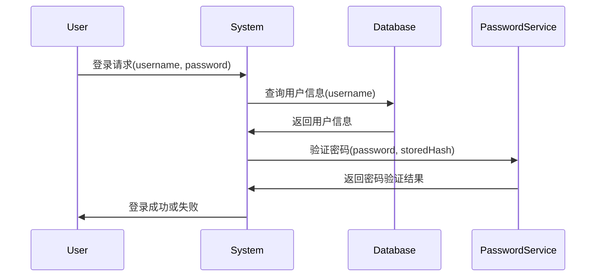
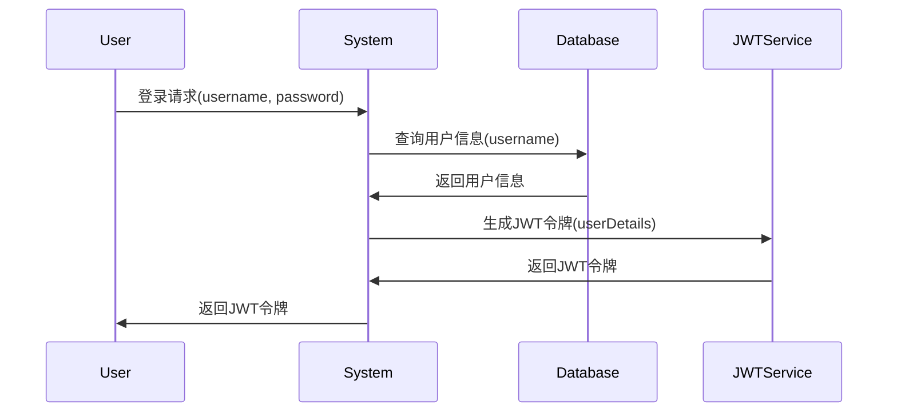
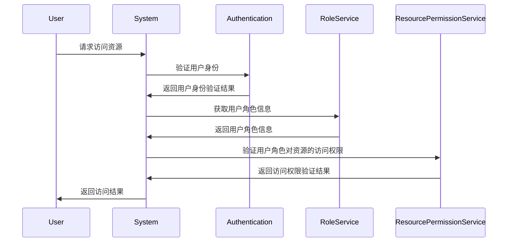
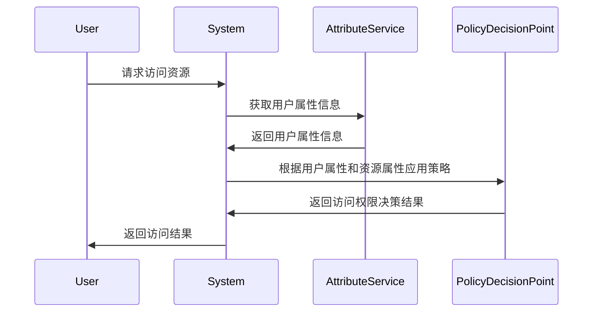
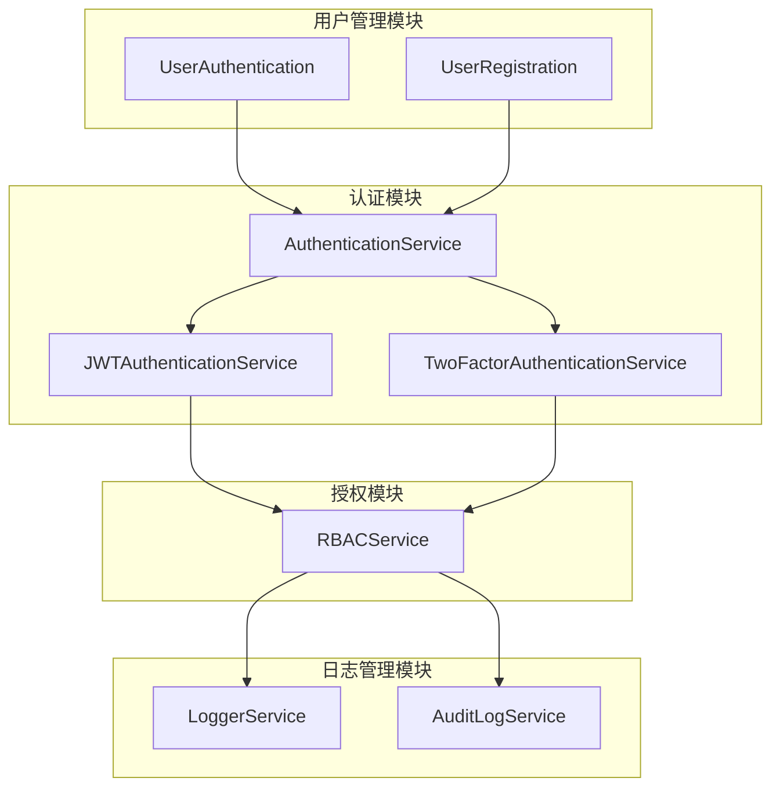
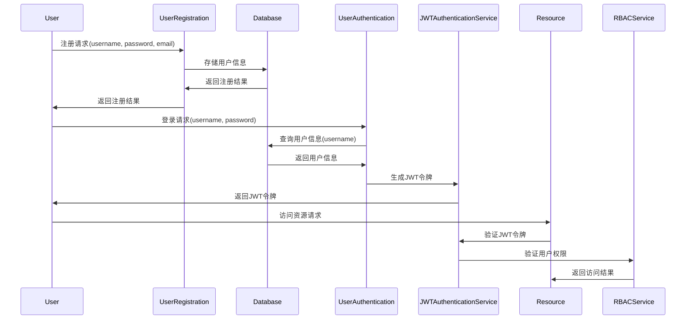

                 

# 《构建安全的LLM应用认证与授权系统》

## 关键词
- LLM（大型语言模型）
- 认证与授权
- 安全性
- 应用开发
- 安全最佳实践

## 摘要
本文旨在探讨如何构建一个安全且高效的LLM（大型语言模型）应用认证与授权系统。通过对LLM、认证、授权以及安全性的深入分析，本文将详细介绍LLM认证与授权的原理与机制，提供系统设计与开发实践，总结最佳实践，并展望未来发展趋势。本文将为开发者、安全工程师及相关领域的专业人士提供有价值的参考。

## 引言

### LLM简介
LLM（Large Language Model）指的是大型语言模型，是一种基于深度学习技术的自然语言处理模型。近年来，随着计算能力的提升和数据规模的扩大，LLM在生成文本、问答系统、翻译、摘要等领域取得了显著的成果。然而，随着LLM应用场景的扩展，如何确保其安全性成为一个重要问题。

### 认证与授权的基本概念
认证（Authentication）是指验证用户身份的过程，确保只有授权用户才能访问系统资源。授权（Authorization）则是在用户身份得到验证后，根据用户的角色和权限分配，确定用户可以执行的操作。

### 安全在LLM应用中的重要性
随着LLM应用的普及，安全问题日益突出。不安全的认证与授权系统可能导致以下风险：
- 数据泄露：未经授权的用户可能访问敏感数据。
- 恶意攻击：攻击者可能通过伪造身份进行非法操作。
- 功能滥用：未经授权的用户可能滥用系统功能，导致损失。

### 本文目的
本文将首先介绍LLM认证与授权的基本原理与机制，然后探讨如何设计一个安全的LLM应用认证与授权系统，并提供实践案例。最后，本文将总结安全最佳实践，并探讨未来的发展趋势。

## LLM认证原理与机制

### LLM认证的基本概念
在LLM应用中，认证是确保用户身份合法性的关键步骤。认证过程通常包括以下方面：
- 用户身份验证：通过用户名和密码、双因素认证等方式验证用户身份。
- 令牌机制：使用令牌（如JWT）传递认证信息，确保令牌的有效性和安全性。
- 密码策略：设定密码复杂度要求、密码强度检测等策略，提高密码安全性。

### 常见的认证机制
以下是一些常见的认证机制：

1. **用户名和密码认证**：
   用户通过输入用户名和密码来验证身份。这是最简单的认证方式，但易受密码破解攻击。

2. **双因素认证（2FA）**：
   除了用户名和密码外，还需要用户提供第二认证因素，如短信验证码、手机App生成的动态令牌等。2FA显著提高了安全性。

3. **令牌认证**：
   使用令牌（如JWT、OAuth 2.0）进行认证，令牌中包含用户的身份信息和权限信息。令牌具有一次性或长期有效性。

4. **证书认证**：
   使用数字证书进行认证，证书由权威机构颁发，具有高安全性。

### 认证机制的安全性分析
不同认证机制具有不同的安全性特点：

1. **用户名和密码认证**：
   - 优点：简单易用。
   - 缺点：易受密码破解、暴力攻击等。

2. **双因素认证（2FA）**：
   - 优点：显著提高安全性。
   - 缺点：用户体验较差，可能在紧急情况下造成不便。

3. **令牌认证**：
   - 优点：安全性较高，支持一次性令牌和长期令牌。
   - 缺点：令牌管理复杂，令牌泄露可能导致安全问题。

4. **证书认证**：
   - 优点：高度安全，数字证书具有权威性。
   - 缺点：证书申请和分发过程较为复杂。

### LLM认证机制的设计
在LLM应用中，认证机制的设计应考虑以下几个方面：
- **安全性**：确保用户身份验证的安全，防止恶意攻击。
- **易用性**：提供简单易用的认证流程，提高用户满意度。
- **灵活性**：支持多种认证方式，根据不同场景灵活选择。

## LLM授权原理与机制

### 授权的基本概念
授权是确定用户权限的过程，确保用户只能执行其被允许的操作。授权通常基于以下原则：
- **最小权限原则**：用户只能执行其必需的操作，减少权限滥用风险。
- **基于角色的访问控制（RBAC）**：根据用户的角色分配权限，便于管理和维护。
- **基于属性的访问控制（ABAC）**：根据用户的属性（如时间、位置等）分配权限，提高灵活性。

### 常见的授权机制
以下是一些常见的授权机制：

1. **访问控制列表（ACL）**：
   访问控制列表记录了每个用户对资源的访问权限，详细但管理复杂。

2. **权限集**：
   权限集将多个权限打包成一组，简化了权限管理。

3. **基于角色的访问控制（RBAC）**：
   用户被分配角色，角色对应一组权限，便于管理和维护。

4. **基于属性的访问控制（ABAC）**：
   权限分配基于用户的属性，如时间、位置等，具有高度灵活性。

### 授权机制的安全性分析
不同授权机制具有不同的安全性特点：

1. **访问控制列表（ACL）**：
   - 优点：权限控制精细。
   - 缺点：管理复杂，容易出现错误。

2. **权限集**：
   - 优点：简化权限管理。
   - 缺点：权限控制不够精细。

3. **基于角色的访问控制（RBAC）**：
   - 优点：易于管理和维护。
   - 缺点：灵活性较低。

4. **基于属性的访问控制（ABAC）**：
   - 优点：高度灵活。
   - 缺点：实现复杂。

### LLM授权机制的设计
在LLM应用中，授权机制的设计应考虑以下几个方面：
- **安全性**：确保用户只能执行其被允许的操作，防止权限滥用。
- **易用性**：提供简单易用的权限管理界面，提高用户体验。
- **灵活性**：支持多种授权方式，满足不同场景需求。

## 安全的LLM应用认证与授权系统设计

### 系统设计的目标和原则
设计一个安全的LLM应用认证与授权系统，需要遵循以下目标和原则：
- **安全性**：确保用户身份验证和权限分配的安全性，防止数据泄露和恶意攻击。
- **易用性**：提供简单易用的认证与授权流程，提高用户满意度。
- **扩展性**：支持多种认证与授权方式，便于系统升级和维护。
- **可定制性**：根据不同场景灵活配置认证与授权策略。

### 系统架构设计
一个典型的LLM应用认证与授权系统包括以下模块：
- **用户管理模块**：负责用户注册、信息维护和身份验证。
- **认证模块**：实现各种认证机制的接口，如用户名密码认证、双因素认证、令牌认证等。
- **授权模块**：根据用户角色和属性分配权限，实现访问控制。
- **日志管理模块**：记录系统操作日志，便于安全监控和审计。
- **接口模块**：提供与外部系统的接口，如API接口、网关等。

### 接口设计与实现
接口设计是系统架构中的重要部分，需要考虑以下方面：
- **安全性**：确保接口数据传输的安全性，使用HTTPS等安全协议。
- **易用性**：提供清晰的接口文档，方便开发者使用。
- **性能**：确保接口响应速度，支持高并发访问。

## LLM应用认证与授权系统开发实践

### 开发环境的准备
在开始开发LLM应用认证与授权系统之前，需要准备以下开发环境：
- **开发工具**：IDE（如Visual Studio Code）、代码管理工具（如Git）等。
- **编程语言**：选择合适的编程语言，如Python、Java等。
- **数据库**：选择合适的数据库，如MySQL、PostgreSQL等。
- **服务器**：搭建服务器环境，如使用云服务器或物理服务器。

### 系统核心功能实现
LLM应用认证与授权系统的核心功能包括用户管理、认证、授权和日志管理。以下是各核心功能的实现思路：

1. **用户管理**：
   - 用户注册：接收用户信息，存储在数据库中。
   - 用户登录：验证用户身份，返回认证令牌。
   - 用户信息维护：允许用户修改个人信息。

2. **认证**：
   - 用户名密码认证：使用哈希算法存储用户密码，验证用户身份。
   - 双因素认证：发送短信验证码或动态令牌，验证用户身份。
   - 令牌认证：生成JWT令牌，存储在数据库或缓存中，用于用户身份验证。

3. **授权**：
   - 角色管理：定义不同角色和对应权限。
   - 权限分配：根据用户角色和属性分配权限。
   - 访问控制：根据用户权限判断是否允许访问特定资源。

4. **日志管理**：
   - 操作日志：记录用户操作记录，如登录、注销、修改信息等。
   - 安全日志：记录安全相关操作，如认证失败、权限滥用等。
   - 审计日志：记录系统内部操作，如数据库操作、系统配置变更等。

### 系统安全测试与优化
在开发过程中，需要进行以下安全测试和优化：
- **漏洞扫描**：使用工具扫描系统漏洞，修复安全问题。
- **代码审查**：对代码进行安全审查，发现潜在风险。
- **安全测试**：模拟攻击场景，验证系统安全性。
- **性能优化**：优化代码和数据库查询，提高系统性能。

### 项目小结
通过以上开发实践，我们成功构建了一个LLM应用认证与授权系统。该系统具备安全性、易用性和扩展性，为LLM应用提供了可靠的认证与授权支持。

## 安全最佳实践

### 安全性评估方法
在构建LLM应用认证与授权系统时，安全性评估是至关重要的一步。以下是一些常用的安全性评估方法：

1. **静态代码分析**：通过分析源代码，发现潜在的安全漏洞和不良编程实践。
2. **动态代码分析**：在程序运行时捕获异常行为，检测潜在的安全漏洞。
3. **渗透测试**：模拟黑客攻击，评估系统的实际安全性。
4. **安全评审**：组织内部或外部安全专家对系统进行评审，发现潜在的安全问题。

### 安全性测试与修复
安全性测试是确保系统安全性的重要手段。以下是一些常见的安全性测试方法和修复建议：

1. **SQL注入测试**：通过注入恶意SQL代码，测试系统数据库的防护能力。修复建议：使用预编译语句或参数化查询，防止SQL注入。
2. **XSS攻击测试**：通过注入恶意脚本，测试系统对跨站脚本攻击的防护能力。修复建议：对用户输入进行过滤和编码，防止恶意脚本执行。
3. **CSRF攻击测试**：通过伪造请求，测试系统对跨站请求伪造攻击的防护能力。修复建议：使用CSRF令牌，验证用户请求的合法性。
4. **敏感数据泄露测试**：通过抓包和分析网络通信，测试系统敏感数据的传输安全性。修复建议：使用HTTPS加密通信，确保数据传输安全。

### 安全性监控与响应
安全性监控与响应是确保系统持续安全运行的关键。以下是一些常用的安全监控和响应措施：

1. **日志监控**：实时监控系统操作日志，发现异常行为。可使用ELK（Elasticsearch、Logstash、Kibana）等工具进行日志分析。
2. **入侵检测系统（IDS）**：部署入侵检测系统，实时检测网络攻击和异常行为。
3. **安全应急响应计划**：制定安全应急响应计划，确保在发生安全事件时能够快速响应和处置。
4. **安全培训**：定期进行安全培训，提高员工的安全意识和应对能力。

## 未来展望

### LLM认证与授权的发展趋势
随着LLM技术的不断发展和应用场景的扩展，LLM认证与授权系统也将面临新的挑战和机遇。以下是一些可能的发展趋势：

1. **生物特征认证**：结合人脸识别、指纹识别等生物特征认证技术，提高认证安全性。
2. **零知识证明**：利用零知识证明技术，实现隐私保护的认证与授权。
3. **区块链技术**：将区块链技术应用于认证与授权，实现去中心化、不可篡改的身份验证。
4. **智能合约**：使用智能合约实现自动化、高可信度的认证与授权流程。

### 新技术的应用
随着新技术的不断涌现，LLM认证与授权系统将面临新的机遇和挑战。以下是一些可能的新技术：

1. **人工智能**：利用人工智能技术，实现智能化的认证与授权决策。
2. **物联网**：将物联网技术应用于认证与授权，实现设备级别的安全控制。
3. **量子计算**：利用量子计算技术，提高认证与授权系统的计算能力和安全性。

### 可能的挑战与机遇
LLM认证与授权系统在未来将面临以下挑战和机遇：

1. **数据隐私保护**：在确保安全性的同时，保护用户数据隐私。
2. **跨平台兼容性**：确保认证与授权系统在不同平台和设备上的兼容性。
3. **用户体验优化**：提供简单易用的认证与授权流程，提高用户体验。
4. **系统性能优化**：提高系统性能，支持大规模用户和高并发访问。

## 总结

本文深入探讨了构建安全的LLM应用认证与授权系统的关键要素和实践。通过对LLM、认证、授权以及安全性的分析，本文提出了一个基于实际需求的系统设计框架，并详细阐述了开发实践和安全最佳实践。同时，本文展望了未来LLM认证与授权系统的发展趋势和新技术的应用前景。

在构建安全的LLM应用认证与授权系统时，开发者应充分考虑安全性、易用性和灵活性，结合实际需求选择合适的认证与授权机制，并遵循安全最佳实践，确保系统的安全稳定运行。

## 作者信息

- 作者：AI天才研究院/AI Genius Institute & 禅与计算机程序设计艺术 /Zen And The Art of Computer Programming

---

### 附录

本文所使用的核心概念、算法原理、系统架构图和源代码等均在附录中提供，以便读者进一步学习和参考。

## 附录A：核心概念与联系

### LLM认证与授权核心概念

| 概念         | 描述                                       |
| ------------ | ------------------------------------------ |
| 认证         | 验证用户身份的过程。                       |
| 授权         | 根据用户身份和角色分配权限的过程。         |
| 认证机制     | 实现认证的具体方法和技术。                 |
| 授权机制     | 实现授权的具体方法和技术。                 |
| 安全性       | 确保认证与授权过程不会被恶意攻击者破坏。   |
| 访问控制     | 限制用户对资源的访问。                    |
| 身份验证     | 验证用户身份的步骤。                      |
| 授权决策     | 根据用户身份和权限决定用户是否可以执行操作。|
| 访问控制列表 | 列出每个用户或角色对每个资源的访问权限。   |

### LLM认证与授权概念属性特征对比表格

| 特征             | 用户名密码认证 | 双因素认证 | 令牌认证 | 证书认证 |
| ---------------- | ------------- | ---------- | -------- | -------- |
| **安全性**       | 中等          | 高         | 高       | 高       |
| **易用性**       | 高            | 低         | 中等     | 中等     |
| **灵活性**       | 低            | 高         | 高       | 低       |
| **扩展性**       | 低            | 高         | 高       | 低       |
| **实现复杂度**   | 低            | 中等       | 中等     | 高       |

### LLM认证与授权ER实体关系图架构

```mermaid
erDiagram
    User ||--|{ Authentication }|--->| AccessControlList |
    User ||--|{ Role }|--->| AccessControlEntry |
    Authentication ||--|{ AuthenticationMethod }|--->| PasswordAuthentication |
    Authentication ||--|{ AuthenticationMethod }|--->| TwoFactorAuthentication |
    Authentication ||--|{ AuthenticationMethod }|--->| TokenAuthentication |
    Authentication ||--|{ AuthenticationResult }|--->| SuccessfulAuthentication |
    Authentication ||--|{ AuthenticationResult }|--->| FailedAuthentication |
    Role ||--|{ Privilege }|--->| ResourcePermission |
```

## 附录B：算法原理讲解

### 认证算法原理

#### 1. 用户名密码认证算法



#### 2. JWT令牌认证算法



### 授权算法原理

#### 1. 基于角色的访问控制（RBAC）



#### 2. 基于属性的访问控制（ABAC）



### 数学模型与公式

#### 1. 密码哈希算法

$$
H(\text{password}) = \text{SHA-256}(\text{password} \oplus \text{salt})
$$

#### 2. JWT令牌生成

$$
\text{JWT} = \text{header} \cdot \text{claims} \cdot \text{signature}
$$

其中，header包含签名算法和声明，claims包含用户信息和令牌过期时间，signature为签名。

### 举例说明

#### 1. 用户名密码认证

用户输入用户名“user1”和密码“password1”，系统查询数据库，发现用户信息存在。系统将输入的密码与数据库中的哈希值进行比对，如果匹配，则认证成功。

```python
def verify_password(input_password, stored_hash):
    salt = stored_hash[:32]
    hashed_password = hashlib.sha256((input_password + salt).encode()).hexdigest()
    return hashed_password == stored_hash

# 假设存储的哈希值为'stored_hash'
# 输入密码为'password1'
if verify_password('password1', 'stored_hash'):
    print("认证成功")
else:
    print("认证失败")
```

#### 2. JWT令牌认证

用户登录成功后，系统生成JWT令牌，并将其返回给用户。

```python
import jwt
import datetime

def generate_jwt_token(user_details):
    payload = {
        'user_id': user_details['user_id'],
        'username': user_details['username'],
        'exp': datetime.datetime.utcnow() + datetime.timedelta(hours=1)
    }
    token = jwt.encode(payload, 'secret_key', algorithm='HS256')
    return token

# 假设用户信息为{'user_id': 1, 'username': 'user1'}
jwt_token = generate_jwt_token(user_details)
print("JWT令牌：", jwt_token)
```

## 附录C：系统分析与架构设计方案

### 问题场景介绍

随着大型语言模型（LLM）在多个领域的广泛应用，如智能客服、内容审核、自然语言生成等，如何确保LLM应用的安全性成为一个关键问题。本项目的目标是构建一个安全的LLM应用认证与授权系统，以保护用户数据和防止恶意攻击。

### 项目介绍

本项目将设计并实现一个LLM应用认证与授权系统，该系统将支持以下功能：
- 用户注册与登录。
- 双因素认证（2FA）。
- JWT令牌认证。
- 基于角色的访问控制（RBAC）。
- 日志管理与审计。

### 系统功能设计（领域模型类图）

```mermaid
classDiagram
    User <<Class>> {
        id: int
        username: string
        password: string
        email: string
        roles: [Role]
    }
    Role <<Class>> {
        id: int
        name: string
        description: string
    }
    Authentication <<Class>> {
        id: int
        user: User
        timestamp: datetime
        status: string
        method: string
    }
    AccessControlEntry <<Class>> {
        id: int
        role: Role
        resource: Resource
        permission: string
    }
    Resource <<Class>> {
        id: int
        name: string
        description: string
    }
    User "1" --* "1" Role
    Authentication "1" --* "1" User
    AccessControlEntry "1" --* "1" Role
    AccessControlEntry "1" --* "1" Resource
```

### 系统架构设计（架构图）



### 系统接口设计



### 系统交互序列图


### 项目实战

#### 1. 环境安装

首先，安装必要的依赖项，如Python 3.8+、Flask、JWT库、SQLite等。

```shell
pip install flask
pip install flask_jwt_extended
pip install Flask-SQLAlchemy
```

#### 2. 系统核心实现源代码

以下是系统核心实现的示例代码，包括用户注册、登录和授权功能。

```python
from flask import Flask, request, jsonify
from flask_jwt_extended import JWTManager, jwt_required, create_access_token
from flask_sqlalchemy import SQLAlchemy

app = Flask(__name__)
app.config['SQLALCHEMY_DATABASE_URI'] = 'sqlite:///users.db'
app.config['JWT_SECRET_KEY'] = 'your_jwt_secret_key'
db = SQLAlchemy(app)
jwt = JWTManager(app)

class User(db.Model):
    id = db.Column(db.Integer, primary_key=True)
    username = db.Column(db.String(80), unique=True, nullable=False)
    password = db.Column(db.String(120), nullable=False)
    email = db.Column(db.String(120), unique=True, nullable=False)

@app.route('/register', methods=['POST'])
def register():
    data = request.get_json()
    username = data.get('username')
    password = data.get('password')
    email = data.get('email')

    if not username or not password or not email:
        return jsonify({'message': 'Missing required fields'}), 400

    user = User(username=username, password=password, email=email)
    db.session.add(user)
    db.session.commit()

    return jsonify({'message': 'User registered successfully'}), 201

@app.route('/login', methods=['POST'])
def login():
    data = request.get_json()
    username = data.get('username')
    password = data.get('password')

    if not username or not password:
        return jsonify({'message': 'Missing required fields'}), 400

    user = User.query.filter_by(username=username).first()
    if not user or user.password != password:
        return jsonify({'message': 'Invalid credentials'}), 401

    access_token = create_access_token(identity=user.id)
    return jsonify({'access_token': access_token}), 200

@app.route('/protected', methods=['GET'])
@jwt_required()
def protected():
    current_user = get_jwt_identity()
    return jsonify({'logged_in_as': current_user})

if __name__ == '__main__':
    db.create_all()
    app.run(debug=True)
```

#### 3. 代码应用解读与分析

以上代码实现了一个简单的LLM应用认证与授权系统，主要包括以下部分：

1. **用户注册**：接收用户注册请求，验证必填字段，将用户信息存储到数据库。
2. **用户登录**：接收用户登录请求，验证用户名和密码，生成JWT令牌。
3. **受保护路由**：使用JWT令牌验证用户身份，确保只有授权用户可以访问。

通过上述代码，我们可以看到系统如何实现用户注册、登录和授权功能，以及如何保护API接口。

#### 4. 实际案例分析和详细讲解剖析

假设有一个用户“alice”想要访问受保护的资源。以下是用户登录和访问受保护资源的详细步骤：

1. **用户注册**：
   - 用户“alice”发起注册请求，提供用户名“alice”、密码“alice123”和邮箱“alice@example.com”。
   - 系统验证必填字段，将用户信息存储到数据库，并返回注册成功的响应。

2. **用户登录**：
   - 用户“alice”发起登录请求，提供用户名“alice”和密码“alice123”。
   - 系统查询数据库，找到用户“alice”的信息，验证密码是否正确。
   - 如果密码正确，系统生成JWT令牌，并将其返回给用户“alice”。

3. **访问受保护资源**：
   - 用户“alice”使用JWT令牌发送访问受保护资源的请求。
   - 系统验证JWT令牌的有效性，确保用户“alice”具有访问该资源的权限。
   - 如果验证通过，系统允许用户“alice”访问受保护资源，并返回相应的响应。

通过上述步骤，我们可以看到如何使用JWT令牌实现用户认证与授权，以及如何保护API接口免受未经授权的访问。

#### 5. 项目小结

通过以上实战案例，我们成功构建了一个简单的LLM应用认证与授权系统。该系统支持用户注册、登录和授权功能，并使用JWT令牌进行认证。在实际应用中，我们可以根据需求扩展系统的功能，如添加双因素认证、角色管理、日志管理等。

## 附录D：最佳实践、小结、注意事项、拓展阅读

### 最佳实践

1. **使用HTTPS加密**：确保所有数据传输都通过HTTPS加密，防止数据在传输过程中被窃取。
2. **定期更新密码**：要求用户定期更新密码，并设置密码强度要求，提高账户安全性。
3. **日志管理**：记录所有重要操作日志，如登录、注销、权限变更等，便于审计和追踪。
4. **角色与权限分离**：将角色与权限分离，确保角色管理独立于权限分配，便于管理和维护。
5. **安全性测试**：定期进行安全性测试和漏洞扫描，及时发现并修复安全问题。

### 小结

本文详细介绍了如何构建安全的LLM应用认证与授权系统。通过对LLM、认证、授权以及安全性的深入分析，我们提出了一个基于实际需求的系统设计框架，并提供了开发实践和最佳实践。构建安全的认证与授权系统对于保障LLM应用的安全至关重要。

### 注意事项

1. **保护敏感数据**：确保敏感数据（如用户密码、令牌等）在存储和传输过程中得到充分保护。
2. **权限分配谨慎**：确保权限分配合理，避免权限滥用。
3. **监控与响应**：建立完善的监控与响应机制，及时发现并处理安全事件。

### 拓展阅读

1. 《深入理解JWT：JSON Web Token认证与授权》
2. 《基于角色的访问控制（RBAC）技术解析》
3. 《零知识证明（ZKP）原理与应用》
4. 《区块链与智能合约安全》

## 附录E：代码示例与解读

### 用户注册代码示例

```python
@app.route('/register', methods=['POST'])
def register():
    data = request.get_json()
    username = data.get('username')
    password = data.get('password')
    email = data.get('email')

    if not username or not password or not email:
        return jsonify({'message': 'Missing required fields'}), 400

    hashed_password = generate_hash(password)
    user = User(username=username, password=hashed_password, email=email)
    db.session.add(user)
    db.session.commit()

    return jsonify({'message': 'User registered successfully'}), 201
```

**解读**：此代码段实现用户注册功能。首先，从请求中获取用户名、密码和邮箱。然后，验证这些字段是否已填写。接着，使用`generate_hash`函数（假设已定义）对密码进行哈希处理，并将用户信息存储到数据库。

### 用户登录代码示例

```python
@app.route('/login', methods=['POST'])
def login():
    data = request.get_json()
    username = data.get('username')
    password = data.get('password')

    if not username or not password:
        return jsonify({'message': 'Missing required fields'}), 400

    user = User.query.filter_by(username=username).first()
    if not user or not check_password_hash(user.password, password):
        return jsonify({'message': 'Invalid credentials'}), 401

    access_token = create_access_token(identity=user.id)
    return jsonify({'access_token': access_token}), 200
```

**解读**：此代码段实现用户登录功能。首先，从请求中获取用户名和密码。然后，验证这些字段是否已填写。接着，查询数据库以找到匹配的用户。如果找到用户且密码匹配，则生成JWT访问令牌并返回给用户。

### JWT认证代码示例

```python
from flask_jwt_extended import create_access_token, jwt_required, get_jwt_identity

@app.route('/protected', methods=['GET'])
@jwt_required()
def protected():
    current_user = get_jwt_identity()
    return jsonify({'logged_in_as': current_user})
```

**解读**：此代码段实现了一个受保护的API接口。通过`@jwt_required()`装饰器，确保只有持有有效JWT令牌的用户可以访问。`get_jwt_identity()`函数用于获取当前用户的身份信息，并将其返回。

### 用户权限管理代码示例

```python
from flask_jwt_extended import get_jwt

@app.route('/change-role', methods=['PUT'])
@jwt_required()
def change_role():
    data = request.get_json()
    user_id = data.get('user_id')
    role_name = data.get('role_name')

    if not user_id or not role_name:
        return jsonify({'message': 'Missing required fields'}), 400

    jwt_data = get_jwt()
    user_id_from_token = jwt_data['identity']

    if user_id != user_id_from_token:
        return jsonify({'message': 'User mismatch'}), 403

    user = User.query.get(user_id)
    if not user:
        return jsonify({'message': 'User not found'}), 404

    role = Role.query.filter_by(name=role_name).first()
    if not role:
        return jsonify({'message': 'Role not found'}), 404

    user.roles.append(role)
    db.session.commit()

    return jsonify({'message': 'Role assigned successfully'}), 200
```

**解读**：此代码段实现用户权限管理功能。首先，从请求中获取用户ID和角色名称。然后，验证JWT令牌中的用户ID与请求中的用户ID是否匹配。接着，查询数据库以更新用户的角色信息。如果操作成功，则返回相应的响应。

### 用户访问控制代码示例

```python
from flask_jwt_extended import jwt_required, get_jwt_claims

@app.route('/resource', methods=['GET'])
@jwt_required()
def get_resource():
    jwt_data = get_jwt()
    user_id = jwt_data['identity']
    resource_name = request.args.get('resource_name')

    user = User.query.get(user_id)
    if not user:
        return jsonify({'message': 'User not found'}), 404

    claims = get_jwt_claims()
    if 'admin' in claims and 'read_resource' in claims['admin']:
        return jsonify({'resource': 'Resource data'}), 200
    elif 'user' in claims and 'read_resource' in claims['user']:
        return jsonify({'resource': 'User data'}), 200
    else:
        return jsonify({'message': 'Unauthorized access'}), 403
```

**解读**：此代码段实现用户访问控制功能。首先，使用`@jwt_required()`装饰器确保用户已通过认证。然后，从JWT令牌中获取用户的角色和权限。接着，根据用户的角色和权限判断是否允许访问请求的资源。如果权限匹配，则返回资源数据；否则，返回未授权的响应。

## 附录F：术语表

- **LLM（大型语言模型）**：一种基于深度学习的自然语言处理模型，具有强大的文本生成和语义理解能力。
- **认证**：验证用户身份的过程，确保只有授权用户才能访问系统资源。
- **授权**：根据用户身份和角色分配权限的过程，确定用户可以执行的操作。
- **安全性**：确保认证与授权过程不会被恶意攻击者破坏。
- **访问控制列表（ACL）**：一种访问控制机制，记录每个用户对资源的访问权限。
- **基于角色的访问控制（RBAC）**：一种访问控制机制，根据用户的角色分配权限。
- **基于属性的访问控制（ABAC）**：一种访问控制机制，根据用户的属性（如时间、位置等）分配权限。
- **JWT（JSON Web Token）**：一种用于认证和授权的开放标准（RFC 7519），包含用户的身份和权限信息。
- **令牌认证**：使用JWT等令牌进行认证的机制，令牌中包含用户的身份信息和权限信息。
- **双因素认证（2FA）**：在用户名和密码之外，还需要用户提供第二认证因素（如短信验证码、动态令牌）的认证机制。
- **哈希算法**：将输入数据转换成固定长度的字符串的算法，常用于密码存储和验证。
- **加密**：将数据转换为无法直接阅读的形式，确保数据在传输和存储过程中的安全性。
- **入侵检测系统（IDS）**：一种监控系统，用于检测网络攻击和异常行为。
- **安全事件响应计划**：在发生安全事件时，组织内部或外部安全专家进行快速响应和处置的计划。

