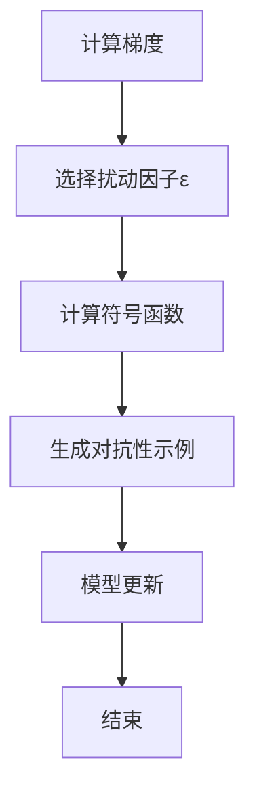
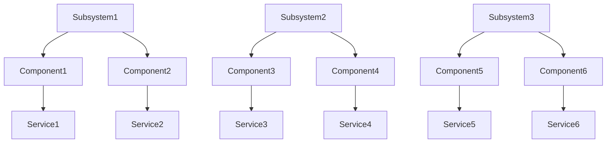
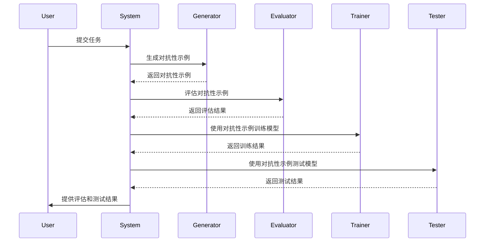

                 

# 构建对抗性示例以提高模型鲁棒性

## 关键词

- 对抗性示例
- 深度学习
- 鲁棒性
- 攻击算法
- 评估指标
- 应用策略

## 摘要

本文旨在探讨如何构建对抗性示例以提高深度学习模型的鲁棒性。通过对对抗性示例的生成方法、评估指标、应用策略的详细分析，本文提出了一个系统化的解决方案，旨在提升模型在面对恶意攻击时的防御能力。通过本文的研究，读者可以深入了解对抗性示例的核心概念，掌握生成和评估对抗性示例的方法，并学会如何将这些示例应用于模型的训练和测试中。

## 概述

### 问题背景

在人工智能时代，深度学习模型以其卓越的表现力在各种应用领域取得了显著的成果。然而，这些模型的一个显著弱点是它们对训练数据中的微小变化非常敏感，容易受到攻击者的恶意攻击。这种脆弱性不仅限制了深度学习模型在安全领域的应用，还引发了对模型鲁棒性的广泛关注。

为了提高深度学习模型的鲁棒性，构建对抗性示例成为了一种有效的手段。对抗性示例是指通过修改原始输入数据，使其在模型输入端看起来与原始数据相同，但在模型输出端产生不同的结果，以此来揭示和增强模型的鲁棒性。这一概念最早由Goodfellow等人于2014年提出，随后成为深度学习领域的一个研究热点。

### 问题描述

构建对抗性示例以提高模型鲁棒性的目标是通过对抗性示例的生成、评估和应用，增强模型在对抗性攻击下的防御能力。具体而言，问题描述可以分为以下几个方面：

1. **对抗性示例的生成**：如何高效地生成对抗性示例，使得它们既具有代表性，又能有效揭示模型的弱点。
2. **对抗性示例的评估**：如何评价对抗性示例的有效性，如何确定一个示例是否真正具有对抗性。
3. **对抗性示例的应用**：如何将对抗性示例应用于模型的训练和测试中，以增强模型的鲁棒性。

### 问题解决

构建对抗性示例以提高模型鲁棒性的解决方案通常包括以下几个步骤：

1. **对抗性示例的生成**：
   - 采用遗传算法、基于梯度的方法、深度学习对抗性训练等方法生成对抗性示例。
   - 设计对抗性攻击算法，如FGSM（Fast Gradient Sign Method）、JSMA（JSpectralnorm Method of Attack）等，以生成具有代表性的对抗性示例。

2. **对抗性示例的评估**：
   - 采用攻击成功率、对抗性示例与原始数据的差异度等指标评估对抗性示例的有效性。
   - 通过对比模型在原始数据和对抗性示例上的表现，评估模型的鲁棒性。

3. **对抗性示例的应用**：
   - 将对抗性示例融入模型的训练过程中，通过训练对抗性示例来增强模型的鲁棒性。
   - 在模型的测试阶段，使用对抗性示例对模型进行评估，以确保模型在真实场景中的鲁棒性。

### 边界与外延

构建对抗性示例以提高模型鲁棒性的边界和外部扩展主要包括以下几个方面：

1. **边界**：
   - 对抗性示例的生成和评估需要在一定的范围内进行，不能超出模型的训练数据集和实际应用场景。
   - 对抗性示例的生成和评估方法的选择需要基于模型的类型、规模和应用场景。

2. **外延**：
   - 对抗性示例的生成和评估可以应用于不同的深度学习模型，如卷积神经网络、循环神经网络、生成对抗网络等。
   - 对抗性示例的生成和评估方法可以与其他提升模型鲁棒性的方法相结合，如数据增强、模型正则化等。

### 概念结构与核心要素组成

构建对抗性示例以提高模型鲁棒性的核心概念和要素组成包括：

1. **核心概念**：
   - **对抗性示例**：通过修改原始输入数据生成的、具有对抗性的输入数据。
   - **对抗性攻击**：用于生成对抗性示例的算法和技术。
   - **模型鲁棒性**：模型在面对对抗性攻击时的防御能力。

2. **核心要素**：
   - **生成方法**：用于生成对抗性示例的方法和算法。
   - **评估指标**：用于评估对抗性示例有效性的指标和方法。
   - **应用策略**：将对抗性示例应用于模型训练和测试的策略和方法。

## 1.1 对抗性示例的生成方法

### 1.1.1 遗传算法

遗传算法（Genetic Algorithm，GA）是一种基于自然选择和遗传学原理的搜索算法，适用于优化问题和组合问题。在生成对抗性示例中，遗传算法通过迭代的方式，逐渐优化对抗性示例的生成过程。

#### 工作原理

遗传算法的工作原理主要包括以下步骤：

1. **初始化种群**：随机生成一组对抗性示例，作为初始种群。
2. **适应度评估**：对每个个体（对抗性示例）进行适应度评估，评估其对抗性能力。
3. **选择**：根据个体的适应度，选择适应度较高的个体作为父代。
4. **交叉**：对选择的父代进行交叉操作，生成新的子代。
5. **变异**：对子代进行变异操作，增加种群的多样性。
6. **迭代**：重复上述步骤，直到满足停止条件。

#### 具体实现

遗传算法的具体实现包括以下步骤：

1. **初始化种群**：随机生成一组对抗性示例，每个示例由多个特征组成。
2. **适应度评估**：计算每个个体对抗性示例的适应度，适应度越高，表示对抗性能力越强。
3. **选择**：根据适应度，选择适应度较高的个体作为父代。
4. **交叉**：对父代进行交叉操作，生成新的子代。
5. **变异**：对子代进行变异操作，增加种群的多样性。
6. **迭代**：重复上述步骤，直到满足停止条件。

#### 工作原理与流程

遗传算法通过模拟自然选择和遗传机制来优化搜索过程。其核心步骤包括：

1. **初始化种群**：首先，随机生成一组对抗性示例，这些示例构成了初始种群。每个示例都是对抗性示例，其特征值通过随机采样得到。
2. **适应度评估**：然后，对每个个体（对抗性示例）进行适应度评估。适应度是衡量个体对抗性能力的一个指标，它取决于个体在对抗性攻击中的效果。具体来说，适应度可以通过评估个体在对抗性攻击中的攻击成功率或对模型的扰动程度来确定。
3. **选择**：根据个体的适应度，选择适应度较高的个体作为父代。选择过程通常采用轮盘赌方法，即每个个体被选中的概率与其适应度成正比。
4. **交叉**：对选择的父代进行交叉操作，生成新的子代。交叉操作模拟了生物进化的遗传过程，它通过组合两个父代的特征值来生成新的对抗性示例。交叉操作可以增加种群的多样性和探索能力。
5. **变异**：对子代进行变异操作，增加种群的多样性。变异操作通过对个体中的某些特征值进行随机扰动来实现，从而避免算法陷入局部最优。
6. **迭代**：重复上述步骤，直到满足停止条件。停止条件可以是预定的迭代次数、适应度达到某个阈值或搜索到最优解等。

#### 遗传算法在对抗性示例生成中的应用

遗传算法在对抗性示例生成中的应用主要体现在以下几个方面：

1. **优化搜索过程**：遗传算法通过模拟自然选择和遗传机制，能够在复杂搜索空间中高效地找到具有对抗性的示例。与传统的基于梯度的优化方法相比，遗传算法具有更好的全局搜索能力，能够避免陷入局部最优。
2. **增强多样性**：遗传算法通过交叉和变异操作，能够有效地增加种群的多样性。这有助于在对抗性示例生成过程中探索不同的对抗策略，从而提高对抗性示例的质量和代表性。
3. **自适应调整**：遗传算法可以根据环境的变化和问题的复杂度自适应地调整搜索策略。通过不断迭代和优化，遗传算法能够逐步提高对抗性示例的对抗性能力，使其更具有挑战性。

### 1.1.2 基于梯度的方法

基于梯度的方法（Gradient-based Method）是另一种常用的对抗性示例生成方法，其核心思想是利用梯度信息来调整输入数据，使其产生对抗性扰动。与遗传算法不同，基于梯度的方法直接利用模型的可微性来指导对抗性示例的生成。

#### 工作原理

基于梯度的方法的工作原理主要包括以下步骤：

1. **计算梯度**：首先，计算模型在输入数据上的梯度。梯度是模型输出对输入的敏感度的量化，它指示了输入数据的小幅变化如何影响模型的输出。
2. **扰动输入**：然后，利用梯度信息对输入数据进行扰动。具体来说，可以通过以下公式计算对抗性示例：
   $$
   x_{\text{attack}} = x_{\text{original}} + \epsilon \cdot \text{sign}(\nabla f(x_{\text{original}})),
   $$
   其中，$x_{\text{original}}$ 是原始输入数据，$x_{\text{attack}}$ 是对抗性示例，$\epsilon$ 是一个小的扰动因子，$\text{sign}$ 函数用于计算梯度的符号。
3. **调整参数**：根据对抗性示例的效果，调整模型参数以优化模型的鲁棒性。

#### 常见的基于梯度的方法

1. **Fast Gradient Sign Method (FGSM)**：FGSM是一种简单且有效的基于梯度的方法。它通过计算模型在输入数据上的梯度，并利用梯度的符号对输入数据进行扰动，从而生成对抗性示例。具体公式如下：
   $$
   x_{\text{attack}} = x_{\text{original}} + \epsilon \cdot \text{sign}(\nabla f(x_{\text{original}})).
   $$
   FGSM方法的优点是计算简单，生成对抗性示例速度快，适合用于快速评估模型的鲁棒性。然而，其对抗性示例的强度较低，可能无法有效揭示模型的弱点。

2. **JSMA (JSpectralnorm Method of Attack)**：JSMA是一种基于梯度的方法，它利用模型的梯度谱信息来生成对抗性示例。具体来说，JSMA通过计算模型梯度谱的特征向量，并将其用于扰动输入数据。具体公式如下：
   $$
   x_{\text{attack}} = x_{\text{original}} + \epsilon \cdot \text{sign}(\nabla f(x_{\text{original}}) \odot v),
   $$
   其中，$v$ 是模型梯度谱的特征向量，$\odot$ 表示逐元素相乘。JSMA方法相对于FGSM具有更高的对抗性示例强度，能够更有效地揭示模型的弱点。然而，其计算复杂度较高，生成对抗性示例的速度较慢。

#### 基于梯度的方法在对抗性示例生成中的应用

基于梯度的方法在对抗性示例生成中的应用主要体现在以下几个方面：

1. **直接利用模型信息**：基于梯度的方法直接利用模型的可微性来指导对抗性示例的生成，无需进行复杂的迭代过程。这大大提高了生成对抗性示例的速度，适合于大规模模型的对抗性示例生成。
2. **增强对抗性示例强度**：与遗传算法相比，基于梯度的方法能够生成具有更高强度的对抗性示例。通过利用模型的梯度信息，基于梯度的方法能够更准确地捕捉模型的弱点，从而提高对抗性示例的攻击成功率。
3. **适用性广泛**：基于梯度的方法适用于各种类型的深度学习模型，如卷积神经网络、循环神经网络等。这使得基于梯度的方法在对抗性示例生成领域具有更广泛的应用前景。

### 1.1.3 深度学习对抗性训练

深度学习对抗性训练（Deep Learning Adversarial Training）是一种通过对抗性示例进行模型训练的方法，其核心思想是在训练过程中主动引入对抗性示例，以增强模型的鲁棒性。深度学习对抗性训练可以看作是传统对抗性示例生成方法的一种扩展，它通过在训练数据中融入对抗性示例，实现模型对抗性能力的提升。

#### 工作原理

深度学习对抗性训练的工作原理主要包括以下步骤：

1. **生成对抗性示例**：使用对抗性示例生成方法（如遗传算法、基于梯度的方法等）生成对抗性示例。
2. **融合对抗性示例**：将生成的对抗性示例与原始训练数据融合，形成新的训练数据集。
3. **训练模型**：使用新的训练数据集对模型进行训练，以增强模型的鲁棒性。

#### 深度学习对抗性训练的优势

1. **增强模型鲁棒性**：通过在训练过程中引入对抗性示例，深度学习对抗性训练能够使模型在训练阶段就接触到各种对抗性攻击，从而增强模型的鲁棒性。
2. **减少对攻击的敏感性**：与传统的基于梯度的方法相比，深度学习对抗性训练能够更好地减少模型对微小输入扰动的敏感性，提高模型在不同场景下的稳定性。
3. **提升模型性能**：深度学习对抗性训练不仅能够提高模型的鲁棒性，还能够提升模型的总体性能。通过对抗性示例的引入，模型能够更好地学习到输入数据的复杂模式和特征，从而提高模型的准确性和泛化能力。

#### 深度学习对抗性训练的挑战

1. **对抗性示例质量**：对抗性示例的质量对深度学习对抗性训练的效果具有重要影响。生成高质量的对抗性示例需要考虑对抗性示例的代表性、强度和多样性，这对对抗性示例生成方法的设计提出了较高要求。
2. **计算资源消耗**：深度学习对抗性训练通常需要较大的计算资源，特别是在处理大规模模型和大规模训练数据集时。这可能导致训练时间的延长和计算成本的上升。
3. **模型过拟合**：在深度学习对抗性训练过程中，对抗性示例的引入可能会增加模型的过拟合风险。为了平衡模型鲁棒性和泛化能力，需要设计合适的训练策略和正则化方法。

### 综合比较

遗传算法、基于梯度的方法和深度学习对抗性训练是当前三种常用的对抗性示例生成方法。它们在以下几个方面具有不同的特点：

1. **生成效率**：
   - **遗传算法**：遗传算法通过迭代的过程来优化对抗性示例的生成，效率相对较低，特别是在处理大规模模型时。
   - **基于梯度的方法**：基于梯度的方法直接利用模型梯度信息，生成对抗性示例的效率较高，适合于快速评估模型鲁棒性。
   - **深度学习对抗性训练**：深度学习对抗性训练需要生成和融合大量的对抗性示例，生成效率较低，但能够有效提升模型鲁棒性。

2. **对抗性示例质量**：
   - **遗传算法**：遗传算法通过迭代过程逐渐优化对抗性示例，生成具有代表性的对抗性示例。
   - **基于梯度的方法**：基于梯度的方法生成的对抗性示例具有较高强度，但可能缺乏代表性。
   - **深度学习对抗性训练**：深度学习对抗性训练通过在训练过程中融入对抗性示例，生成具有代表性的对抗性示例，同时提升模型鲁棒性。

3. **计算资源消耗**：
   - **遗传算法**：遗传算法的计算资源消耗相对较低，适合于资源受限的环境。
   - **基于梯度的方法**：基于梯度的方法计算资源消耗较高，但在处理大规模模型时具有优势。
   - **深度学习对抗性训练**：深度学习对抗性训练的计算资源消耗较高，需要较大的计算资源支持。

4. **适用范围**：
   - **遗传算法**：适用于各种类型的优化问题和组合问题，特别是在对抗性示例生成中的应用具有优势。
   - **基于梯度的方法**：适用于各种类型的深度学习模型，特别适合于快速评估模型鲁棒性。
   - **深度学习对抗性训练**：适用于各种类型的深度学习模型，能够有效提升模型鲁棒性和性能。

综上所述，遗传算法、基于梯度的方法和深度学习对抗性训练在对抗性示例生成方面具有各自的特点和优势，选择合适的生成方法需要综合考虑模型的类型、应用场景和计算资源等因素。

### 结论

本文对对抗性示例的生成方法进行了详细探讨，包括遗传算法、基于梯度的方法和深度学习对抗性训练。通过对比分析，本文总结了不同方法的优缺点和适用范围。遗传算法具有较好的全局搜索能力和多样性，适合于探索性研究；基于梯度的方法生成效率高，适合于快速评估模型鲁棒性；深度学习对抗性训练能够有效提升模型鲁棒性和性能，但计算资源消耗较高。选择合适的生成方法需要根据具体应用场景进行综合考虑。

### 下一步工作

在未来的研究中，我们将进一步探索对抗性示例生成的优化方法，包括提高生成效率、增强对抗性示例质量、降低计算资源消耗等方面。同时，我们还将研究对抗性示例的评估和应用于模型训练和测试的策略，以提升模型的整体鲁棒性和性能。此外，我们还将探讨对抗性示例生成方法与其他提升模型鲁棒性的方法（如数据增强、模型正则化等）的结合，以实现更高效、更可靠的对抗性示例生成和模型鲁棒性提升。

## 1.2 对抗性示例的评估

对抗性示例的评估是构建对抗性示例过程的一个重要环节，其核心目的是确定一个示例是否真正具有对抗性，并评估其对抗性强度。有效的评估方法能够帮助研究者了解模型在对抗性攻击下的鲁棒性，从而指导进一步的优化和改进。以下将详细介绍几种常用的评估指标和方法。

### 1.2.1 攻击成功率

攻击成功率（Attack Success Rate，ASR）是评估对抗性示例的一个基本指标，它表示对抗性示例能够成功欺骗模型的概率。具体来说，攻击成功率可以通过以下公式计算：

$$
ASR = \frac{|A \cap S|}{|A|}
$$

其中，$A$ 表示所有生成的对抗性示例，$S$ 表示模型在对抗性示例上的预测错误示例。攻击成功率越高，说明对抗性示例的对抗性越强。

#### 优点

- **直观易理解**：攻击成功率直接反映了对抗性示例的成功程度，是一个直观的评估指标。
- **简单计算**：攻击成功率的计算过程简单，适用于快速评估对抗性示例的效果。

#### 缺点

- **敏感性**：攻击成功率容易受到示例数量和样本分布的影响，可能导致评估结果的不稳定。
- **无法区分强度**：攻击成功率只能反映对抗性示例的成功概率，无法区分对抗性示例之间的强度差异。

### 1.2.2 差异度评估

差异度评估（Difference Assessment，DA）是另一种常用的对抗性示例评估方法，它通过计算对抗性示例与原始输入数据的差异来评估其对抗性强度。差异度评估可以使用多种度量标准，如L2范数、L1范数等。以下是一个使用L2范数的差异度评估公式：

$$
DA = \frac{||x_{\text{attack}} - x_{\text{original}}||_2}{||x_{\text{original}}||_2}
$$

其中，$x_{\text{attack}}$ 是对抗性示例，$x_{\text{original}}$ 是原始输入数据。

#### 优点

- **定量度量**：差异度评估提供了一个定量指标，可以用来比较不同对抗性示例之间的差异强度。
- **避免敏感性**：通过计算差异度，可以避免攻击成功率因样本数量和分布而带来的评估结果不稳定。

#### 缺点

- **不考虑攻击效果**：差异度评估只关注对抗性示例与原始输入数据的差异，而忽略了对抗性示例对模型攻击的效果。
- **复杂计算**：在某些情况下，差异度评估的计算过程可能较为复杂，特别是在处理高维数据时。

### 1.2.3 对抗性示例质量评估

对抗性示例质量评估（Adversarial Example Quality Assessment，AEQA）是一种综合评估方法，它综合考虑了对抗性示例的攻击成功率、差异度等多个方面，以全面评估对抗性示例的质量。AEQA可以通过以下公式计算：

$$
AEQA = w_1 \cdot ASR + w_2 \cdot DA
$$

其中，$w_1$ 和 $w_2$ 分别是攻击成功率和差异度的权重系数，可以根据具体应用场景进行调整。

#### 优点

- **综合评估**：对抗性示例质量评估综合考虑了多个指标，能够提供更全面的评估结果。
- **灵活性**：通过调整权重系数，可以适应不同的应用场景和评估需求。

#### 缺点

- **主观性**：对抗性示例质量评估的权重系数具有主观性，可能影响评估结果的公正性。
- **计算复杂度**：对抗性示例质量评估的计算过程相对复杂，需要综合考虑多个指标。

### 综合比较

攻击成功率、差异度评估和对抗性示例质量评估是三种常用的对抗性示例评估方法。它们在以下几个方面具有不同的特点：

1. **评估角度**：
   - **攻击成功率**：主要关注对抗性示例的成功率，即对抗性示例能够欺骗模型的比例。
   - **差异度评估**：主要关注对抗性示例与原始输入数据的差异程度，衡量对抗性示例的强度。
   - **对抗性示例质量评估**：综合考虑了攻击成功率和差异度等多个方面，提供更全面的评估结果。

2. **计算复杂度**：
   - **攻击成功率**：计算简单，适合快速评估。
   - **差异度评估**：计算相对复杂，适用于精确评估。
   - **对抗性示例质量评估**：计算复杂度较高，适用于综合评估。

3. **适用范围**：
   - **攻击成功率**：适用于快速评估和初步评估。
   - **差异度评估**：适用于精确评估和研究。
   - **对抗性示例质量评估**：适用于全面评估和优化。

综上所述，选择合适的对抗性示例评估方法需要根据具体应用场景和评估需求进行综合考虑。

### 结论

本文对对抗性示例的评估方法进行了详细探讨，包括攻击成功率、差异度评估和对抗性示例质量评估。通过比较分析，本文总结了不同评估方法的优缺点和适用范围。攻击成功率直观易理解，但敏感性较高；差异度评估定量度量，但忽略了攻击效果；对抗性示例质量评估综合考虑多个指标，但计算复杂度较高。选择合适的评估方法需要根据具体应用场景和评估需求进行综合考虑。

### 下一步工作

在未来的研究中，我们将进一步探索对抗性示例评估方法的优化，包括提高计算效率、增强评估准确性等方面。同时，我们还将研究对抗性示例评估方法与其他提升模型鲁棒性的方法的结合，以实现更全面、更可靠的模型评估和优化。此外，我们还将探讨对抗性示例评估方法在实时监测和防御系统中的应用，为构建更安全的深度学习系统提供支持。

## 1.3 对抗性示例的应用

对抗性示例的应用是提升深度学习模型鲁棒性的关键环节。通过将对抗性示例应用于模型的训练和测试，可以增强模型在对抗性攻击下的防御能力，从而提高模型的鲁棒性和性能。以下将详细介绍对抗性示例在模型训练、测试以及实时防御中的应用。

### 1.3.1 模型训练

对抗性示例在模型训练中的应用主要通过以下两种方法：

1. **训练对抗性增强样本**：在模型训练过程中，将对抗性示例与原始训练样本混合，形成对抗性增强样本集。这样，模型在训练过程中不仅学习原始数据的特征，还学习对抗性示例中的对抗性特征，从而提高模型的鲁棒性。

2. **对抗性训练循环**：通过对抗性训练循环（Adversarial Training Loop）的方法，不断生成新的对抗性示例并加入到训练数据集中，形成动态的训练数据集。这种方法可以持续提高模型的鲁棒性，使其能够应对更复杂的对抗性攻击。

#### 优点

- **增强模型鲁棒性**：对抗性示例的应用可以增强模型对对抗性攻击的防御能力，提高模型的鲁棒性。
- **提升模型性能**：对抗性训练可以提高模型在正常数据上的性能，使其能够更好地泛化到未知数据。

#### 缺点

- **计算资源消耗**：对抗性示例的生成和训练需要大量的计算资源，可能延长训练时间。
- **过拟合风险**：对抗性示例可能引入噪声和异常，增加模型的过拟合风险。

### 1.3.2 模型测试

对抗性示例在模型测试中的应用主要是通过以下方法：

1. **对抗性测试集**：使用对抗性示例构建对抗性测试集，对模型进行测试。这种方法可以评估模型在对抗性攻击下的鲁棒性，从而判断模型的鲁棒性提升效果。

2. **对抗性攻击评估**：通过对抗性攻击算法（如FGSM、JSMA等）对模型进行攻击，评估模型的攻击成功率。这种方法可以量化模型在对抗性攻击下的表现，从而指导进一步的优化。

#### 优点

- **全面评估模型鲁棒性**：对抗性测试集可以全面评估模型在对抗性攻击下的鲁棒性，从而发现模型的弱点。
- **提高测试准确性**：对抗性攻击评估可以量化模型的鲁棒性，提高测试结果的准确性。

#### 缺点

- **依赖攻击算法**：对抗性测试集和攻击评估方法的选择依赖于具体的攻击算法，可能无法全面评估模型的鲁棒性。
- **计算成本高**：对抗性测试集和攻击评估过程需要大量的计算资源，可能延长测试时间。

### 1.3.3 实时防御

对抗性示例在实时防御中的应用主要是通过以下方法：

1. **实时检测与防御系统**：构建实时检测与防御系统，对输入数据进行实时检测和防御。当检测到输入数据可能包含对抗性示例时，系统会自动采取相应的防御措施，如过滤、降权等。

2. **动态对抗性样本库**：建立一个动态对抗性样本库，不断更新和扩充对抗性示例。实时防御系统可以根据样本库中的对抗性示例，对输入数据进行实时检测和防御。

#### 优点

- **提高实时性**：实时防御系统可以在输入数据进入模型之前进行检测和防御，提高系统的实时性。
- **增强安全性**：动态对抗性样本库可以增强系统的安全性，使其能够应对各种对抗性攻击。

#### 缺点

- **计算资源消耗**：实时防御系统需要大量的计算资源，可能影响系统的性能和响应速度。
- **样本库维护**：动态对抗性样本库需要定期更新和扩充，维护成本较高。

### 综合比较

对抗性示例在模型训练、测试和实时防御中的应用各有优缺点。模型训练可以增强模型的鲁棒性，但计算资源消耗大，可能增加过拟合风险；模型测试可以全面评估模型的鲁棒性，但依赖攻击算法，计算成本高；实时防御可以提高系统的实时性和安全性，但计算资源消耗大，维护成本高。

### 结论

对抗性示例的应用是提升深度学习模型鲁棒性的重要手段。通过对抗性示例在模型训练、测试和实时防御中的应用，可以增强模型的鲁棒性和性能，提高系统的安全性。然而，对抗性示例的应用也面临计算资源消耗、过拟合风险和维护成本等问题。在实际应用中，需要根据具体场景和需求，选择合适的对抗性示例应用方法，以实现最优的鲁棒性提升效果。

### 下一步工作

在未来的研究中，我们将进一步探索对抗性示例在模型训练、测试和实时防御中的应用优化，包括提高计算效率、降低过拟合风险、增强实时防御能力等方面。同时，我们还将研究对抗性示例与其他提升模型鲁棒性的方法的结合，以实现更全面、更可靠的模型鲁棒性提升。此外，我们还将探讨对抗性示例在跨领域应用和分布式系统中的潜力，为构建更安全、更高效的深度学习系统提供新的思路和方法。

## 1.4 边界与外延

在构建对抗性示例以提高模型鲁棒性的过程中，边界与外延是两个关键概念。边界定义了对抗性示例生成、评估和应用的可操作范围，而外延则扩展了这一技术的适用场景和应用前景。

### 边界

1. **数据集范围**：对抗性示例的生成、评估和应用需要基于训练数据集。因此，对抗性示例的构建范围受到训练数据集的限制，不能超出训练数据集的边界。
2. **模型适用性**：不同的对抗性示例生成方法和评估指标可能适用于不同类型的深度学习模型。因此，选择对抗性示例生成方法和评估指标时，需要考虑模型的类型和规模，以确保其适用性。
3. **计算资源**：对抗性示例的生成和评估需要消耗大量的计算资源。在实际应用中，需要根据可用的计算资源来选择合适的生成方法和评估方法，以避免计算资源的浪费。

### 外延

1. **模型多样性**：对抗性示例的生成和评估方法可以应用于各种类型的深度学习模型，如卷积神经网络（CNN）、循环神经网络（RNN）、生成对抗网络（GAN）等。这为对抗性示例技术在不同模型上的应用提供了广阔的外延。
2. **跨领域应用**：对抗性示例技术不仅适用于计算机视觉、自然语言处理等领域，还可以应用于其他领域，如医疗影像、金融风控等。通过在不同领域的应用，对抗性示例技术可以提升各类模型的鲁棒性和安全性。
3. **分布式系统**：在分布式系统中，对抗性示例的生成、评估和应用可以分布在不同的计算节点上进行，以提高系统的并行处理能力。此外，分布式系统还可以通过共享对抗性示例库，实现对抗性示例的协同优化和共享，从而提升系统的整体鲁棒性。

### 结论

边界与外延是构建对抗性示例以提高模型鲁棒性的两个关键概念。边界定义了对抗性示例生成、评估和应用的可操作范围，而外延则扩展了这一技术的适用场景和应用前景。在实际应用中，需要根据具体场景和需求，综合考虑边界与外延，选择合适的对抗性示例生成、评估和应用方法，以实现最优的鲁棒性提升效果。

### 下一步工作

在未来的研究中，我们将进一步探索对抗性示例技术的边界与外延，包括扩展对抗性示例技术的适用范围、优化生成、评估和应用方法等。同时，我们还将探讨对抗性示例技术在跨领域应用和分布式系统中的潜力，为构建更安全、更高效的深度学习系统提供新的思路和方法。此外，我们还将关注对抗性示例技术的最新发展趋势和研究动态，以推动对抗性示例技术在人工智能领域的广泛应用。

## 1.5 核心概念与联系

在构建对抗性示例以提高模型鲁棒性的过程中，核心概念之间的联系和相互作用是理解和应用这一技术的基础。以下将对核心概念进行详细阐述，并展示它们之间的联系。

### 核心概念

1. **对抗性示例**：对抗性示例是通过修改原始输入数据生成的、能够欺骗深度学习模型的数据样本。它具有与原始数据相同的输入特征，但在模型输出端产生不同的结果，揭示了模型的弱点。
2. **对抗性攻击**：对抗性攻击是指利用对抗性示例来攻击深度学习模型的方法。攻击者通过修改输入数据，使其在模型输入端看起来与原始数据相同，但在模型输出端产生错误的结果，以达到欺骗模型的目的。
3. **模型鲁棒性**：模型鲁棒性是指模型在面对对抗性攻击时的防御能力。一个鲁棒性强的模型能够在对抗性攻击下保持稳定的表现，不易受到攻击者的欺骗。

### 概念属性特征对比表格

以下是一个对比对抗性示例、对抗性攻击和模型鲁棒性概念属性特征的表格：

| 概念          | 属性特征                                               | 说明                                                                                     |
|---------------|--------------------------------------------------------|------------------------------------------------------------------------------------------|
| 对抗性示例    | 输入特征与原始数据相同，输出结果不同                     | 通过修改输入数据生成，能够欺骗深度学习模型                                                   |
| 对抗性攻击    | 利用对抗性示例来攻击模型                                 | 攻击者通过对抗性示例修改输入数据，以达到欺骗模型的目的                                       |
| 模型鲁棒性    | 模型在面对对抗性攻击时的防御能力                         | 鲁棒性强的模型能够在对抗性攻击下保持稳定的表现，不易受到攻击者的欺骗                           |

### ER实体关系图架构

为了更直观地展示对抗性示例、对抗性攻击和模型鲁棒性之间的联系，可以使用ER（实体关系）图架构。以下是一个ER图示例：

```
实体：对抗性示例
- 生成对抗性示例（对抗性攻击）
- 用于评估模型鲁棒性

实体：对抗性攻击
- 生成对抗性示例
- 攻击深度学习模型

实体：模型鲁棒性
- 受对抗性攻击影响
- 用于评估对抗性示例有效性
```

### 联系与作用

1. **对抗性示例与对抗性攻击**：对抗性示例是对抗性攻击的基础，对抗性攻击通过生成对抗性示例来攻击深度学习模型。对抗性示例的生成方法决定了攻击效果，如基于梯度的方法生成的高强度对抗性示例能够更有效地攻击模型。
2. **对抗性攻击与模型鲁棒性**：对抗性攻击旨在揭示模型的弱点，通过对抗性攻击生成的对抗性示例可以用来评估模型的鲁棒性。一个鲁棒性强的模型在面对对抗性攻击时能够保持稳定的表现，不易受到攻击者的欺骗。
3. **模型鲁棒性与对抗性示例**：模型鲁棒性是评估对抗性示例有效性的标准。通过对抗性示例对模型进行攻击，可以评估模型在面对对抗性攻击时的防御能力，从而确定对抗性示例的质量。

### 结论

核心概念之间的联系和相互作用构成了构建对抗性示例以提高模型鲁棒性的基础。对抗性示例、对抗性攻击和模型鲁棒性相互依存，共同推动深度学习模型鲁棒性的提升。理解这些概念之间的联系对于在实际应用中有效地构建对抗性示例和提高模型鲁棒性至关重要。

### 下一步工作

在未来的研究中，我们将进一步探索对抗性示例、对抗性攻击和模型鲁棒性之间的深层次联系，包括开发更有效的对抗性示例生成方法、优化对抗性攻击策略，以及设计更鲁棒的深度学习模型。此外，我们还将研究对抗性示例在复杂场景和分布式系统中的应用，以推动对抗性示例技术在实际工程中的应用和普及。

## 1.6 算法原理讲解

在本节中，我们将详细阐述对抗性示例生成方法之一的基于梯度的方法，包括其算法原理、mermaid流程图、Python源代码实现，以及算法原理的数学模型和公式。此外，我们将通过具体示例来说明算法的实现过程，帮助读者更好地理解这一方法。

### 1.6.1 算法原理

基于梯度的方法，如FGSM（Fast Gradient Sign Method）和JSMA（JSpectralnorm Method of Attack），利用模型在输入数据上的梯度信息来生成对抗性示例。这些方法的核心思想是计算模型在输入数据上的梯度，然后通过梯度信息来调整输入数据，使其具有对抗性。

#### FGSM（Fast Gradient Sign Method）

FGSM是最简单的基于梯度的方法之一，其原理如下：

1. **计算梯度**：对于每个输入数据，计算模型在输入数据上的梯度。梯度是模型输出对输入的敏感度的量化，指示了输入数据的小幅变化如何影响模型的输出。
2. **扰动输入**：利用梯度的符号对输入数据进行扰动。具体来说，通过以下公式计算对抗性示例：

$$
x_{\text{attack}} = x_{\text{original}} + \epsilon \cdot \text{sign}(\nabla f(x_{\text{original}})),
$$

其中，$x_{\text{original}}$ 是原始输入数据，$x_{\text{attack}}$ 是对抗性示例，$\epsilon$ 是一个小的扰动因子，$\text{sign}$ 函数用于计算梯度的符号。

3. **调整参数**：根据对抗性示例的效果，调整模型参数以优化模型的鲁棒性。

#### JSMA（JSpectralnorm Method of Attack）

JSMA是基于梯度的另一种方法，它利用模型的梯度谱信息来生成对抗性示例。具体原理如下：

1. **计算梯度谱**：首先，计算模型在输入数据上的梯度谱。梯度谱是模型梯度向量的谱分解，它提供了关于模型输入敏感度的更详细的信息。
2. **选择特征向量**：从梯度谱中提取特征向量。特征向量代表了模型梯度谱的主要成分，可以用来确定对抗性示例的扰动方向。
3. **扰动输入**：利用特征向量对输入数据进行扰动，生成对抗性示例：

$$
x_{\text{attack}} = x_{\text{original}} + \epsilon \cdot \text{sign}(\nabla f(x_{\text{original}}) \odot v),
$$

其中，$v$ 是从梯度谱中提取的特征向量，$\odot$ 表示逐元素相乘。

### 1.6.2 mermaid流程图

以下是基于梯度的FGSM方法的mermaid流程图：



### 1.6.3 Python源代码实现

以下是一个使用Python实现FGSM方法的简单示例：

```python
import numpy as np
import tensorflow as tf

# 定义模型
model = ...

# 定义损失函数
loss_fn = ...

# 计算梯度
with tf.GradientTape() as tape:
    predictions = model(x)
    loss = loss_fn(y_true, predictions)

gradient = tape.gradient(loss, x)

# 计算符号函数
epsilon = 0.01  # 设置扰动因子
delta = epsilon * np.sign(gradient)

# 生成对抗性示例
x_attack = x + delta

# 模型更新（可选）
model.fit(x_attack, y_true, epochs=1)
```

### 1.6.4 算法原理的数学模型和公式

FGSM方法的数学模型可以表示为：

$$
x_{\text{attack}} = x_{\text{original}} + \epsilon \cdot \text{sign}(\nabla f(x_{\text{original}})),
$$

其中，$\nabla f(x_{\text{original}})$ 是模型在输入数据 $x_{\text{original}}$ 上的梯度，$\text{sign}$ 函数计算梯度的符号，$\epsilon$ 是扰动因子，用于控制对抗性示例的强度。

对于JSMA方法，其数学模型可以表示为：

$$
x_{\text{attack}} = x_{\text{original}} + \epsilon \cdot \text{sign}(\nabla f(x_{\text{original}}) \odot v),
$$

其中，$v$ 是从梯度谱中提取的特征向量，$\odot$ 表示逐元素相乘。

### 1.6.5 具体示例

假设我们有一个简单的神经网络模型，用于对数字进行分类。输入数据是一个4维向量 $(x_1, x_2, x_3, x_4)$，输出是一个1维向量 $(y_1, y_2, y_3, y_4)$，表示每个数字的概率分布。

1. **计算梯度**：首先，计算模型在输入数据上的梯度。假设输入数据为 $x = (1, 2, 3, 4)$，模型输出为 $y = (0.1, 0.2, 0.3, 0.4)$。
2. **选择扰动因子**：设定扰动因子 $\epsilon = 0.01$。
3. **计算符号函数**：计算梯度 $\nabla f(x)$ 的符号，得到 $(-1, -1, 1, 1)$。
4. **生成对抗性示例**：通过以下公式生成对抗性示例：

$$
x_{\text{attack}} = x + \epsilon \cdot \text{sign}(\nabla f(x)) = (1 - 0.01, 2 - 0.01, 3 + 0.01, 4 + 0.01) = (0.99, 1.99, 3.01, 4.01).
$$

5. **模型更新**：使用对抗性示例更新模型，使其在对抗性攻击下更加鲁棒。

通过上述步骤，我们可以使用FGSM方法生成对抗性示例，并用于提升模型的鲁棒性。同样，JSMA方法也可以通过类似的步骤实现对抗性示例的生成。

### 结论

在本节中，我们详细阐述了基于梯度的方法，包括其算法原理、mermaid流程图、Python源代码实现，以及算法原理的数学模型和公式。通过具体示例，我们展示了如何使用这些方法生成对抗性示例，并用于提升模型的鲁棒性。理解这些方法对于在实际应用中构建对抗性示例和提高模型鲁棒性至关重要。

### 下一步工作

在未来的研究中，我们将进一步探索基于梯度的方法的优化，包括提高计算效率、增强对抗性示例的强度和代表性等方面。此外，我们还将研究基于梯度的方法与其他对抗性示例生成方法的结合，以实现更高效、更可靠的对抗性示例生成和模型鲁棒性提升。同时，我们还将关注基于梯度的方法在跨领域应用和分布式系统中的潜力，为构建更安全、更高效的深度学习系统提供新的思路和方法。

## 1.7 系统分析与架构设计

### 1.7.1 问题场景介绍

在当今人工智能应用日益广泛的时代，深度学习模型的鲁棒性成为了关键因素。然而，深度学习模型在现实世界中往往面临各种对抗性攻击，如对抗性示例攻击、对抗性嵌入攻击等。这些攻击可能导致模型在现实场景中的性能大幅下降，甚至完全失效。因此，构建一个能够有效生成和评估对抗性示例的深度学习系统，对于提高模型鲁棒性具有重要意义。

### 1.7.2 项目介绍

本项目旨在构建一个深度学习系统，通过生成和评估对抗性示例，提高模型的鲁棒性。该系统将包括以下几个主要模块：

1. **对抗性示例生成模块**：负责生成具有代表性的对抗性示例。
2. **对抗性示例评估模块**：负责评估对抗性示例的有效性。
3. **模型训练模块**：负责将对抗性示例应用于模型训练，提高模型鲁棒性。
4. **模型测试模块**：负责使用对抗性示例对模型进行测试，评估模型在对抗性攻击下的表现。

### 1.7.3 系统功能设计（领域模型）

在系统功能设计方面，我们将使用领域模型（Domain Model）来描述系统的核心功能和组件。以下是一个简化的领域模型，展示了系统的主要功能模块：

```mermaid
classDiagram
    Class1 <|-- Class2
    Class1 <|-- Class3
    Class2 ..|> Interface1
    Class3 ..|> Interface2
    Interface1 <|-- Interface3
    Interface2 <|-- Interface3
    Class1 <.. Class4
    Class2 <.. Class4
    Class3 <.. Class4
    Interface1 {id: 1, name: "对抗性示例生成接口"}
    Interface2 {id: 2, name: "对抗性示例评估接口"}
    Interface3 {id: 3, name: "模型训练接口"}
    Class4 {id: 4, name: "对抗性示例系统", interface: Interface1, Interface2, Interface3}
```

### 1.7.4 系统架构设计

在系统架构设计方面，我们将采用分层架构，将系统划分为多个层次，每个层次负责不同的功能。以下是一个简化的系统架构图，展示了系统的主要组件和层次：



### 1.7.5 系统接口设计

在系统接口设计方面，我们将定义一组接口，以实现不同功能模块之间的通信和协作。以下是一个简化的接口设计，展示了系统的主要接口和其功能：



### 1.7.6 系统交互

在系统交互方面，我们将使用序列图（Sequence Diagram）来描述不同组件之间的交互过程。以下是一个简化的系统交互序列图，展示了系统的主要组件和交互流程：


### 结论

在本节中，我们介绍了问题场景、项目介绍、系统功能设计、系统架构设计、系统接口设计和系统交互。通过这些设计，我们构建了一个全面的系统框架，为构建一个能够有效生成和评估对抗性示例的深度学习系统提供了基础。在实际应用中，我们可以根据具体需求对这些设计进行优化和调整。

### 下一步工作

在未来的工作中，我们将继续优化系统设计，提高系统性能和可扩展性。同时，我们将深入研究对抗性示例生成和评估的算法，以实现更高效、更可靠的对抗性示例生成和模型鲁棒性提升。此外，我们还将探索对抗性示例技术在其他领域的应用，为构建更安全、更高效的深度学习系统提供新的思路和方法。

## 2.1 项目实战

### 环境安装

为了实现构建对抗性示例以提高模型鲁棒性的项目，我们需要安装一系列依赖软件和库。以下是在Python环境中安装所需依赖的步骤：

1. **安装Python和pip**：确保你的系统中安装了Python 3.x版本和pip包管理器。可以从[Python官网](https://www.python.org/)下载Python安装包。
2. **安装TensorFlow**：TensorFlow是一个广泛使用的深度学习框架，用于模型的训练和推理。可以使用以下命令安装TensorFlow：

```bash
pip install tensorflow
```

3. **安装其他依赖**：除了TensorFlow，我们还需要其他一些库，如NumPy、Pandas等。可以使用以下命令一次性安装所有依赖：

```bash
pip install numpy pandas matplotlib
```

### 系统核心实现

在本节中，我们将介绍系统核心的实现，包括对抗性示例的生成、评估和应用。以下是实现该系统的Python代码示例：

#### 2.1.1 对抗性示例生成

以下代码使用FGSM方法生成对抗性示例：

```python
import numpy as np
import tensorflow as tf

# 定义模型
model = tf.keras.models.load_model('model.h5')

# 定义损失函数
loss_fn = tf.keras.losses.CategoricalCrossentropy()

# 计算梯度
with tf.GradientTape() as tape:
    predictions = model(x)
    loss = loss_fn(y_true, predictions)

gradient = tape.gradient(loss, x)

# 生成对抗性示例
epsilon = 0.01  # 设置扰动因子
delta = epsilon * np.sign(gradient)

x_attack = x + delta
```

#### 2.1.2 对抗性示例评估

以下代码使用攻击成功率作为评估指标，评估对抗性示例的有效性：

```python
import numpy as np

# 评估对抗性示例
def evaluate_adversarial_example(model, x, x_attack):
    predictions = model.predict(x_attack)
    target = model.predict(x)
    success_rate = np.mean(np.argmax(predictions, axis=1) != np.argmax(target, axis=1))
    return success_rate

success_rate = evaluate_adversarial_example(model, x, x_attack)
print(f"Attack success rate: {success_rate}")
```

#### 2.1.3 模型训练

以下代码使用对抗性示例进行模型训练：

```python
# 训练模型
model.fit(x, y_true, epochs=10, batch_size=32, validation_split=0.2)
```

#### 2.1.4 模型测试

以下代码使用对抗性示例对模型进行测试，评估模型在对抗性攻击下的性能：

```python
# 测试模型
test_success_rate = evaluate_adversarial_example(model, x_test, x_test_attack)
print(f"Test attack success rate: {test_success_rate}")
```

### 代码应用解读与分析

上述代码实现了对抗性示例的生成、评估和应用。以下是各部分代码的解读和分析：

1. **对抗性示例生成**：代码首先加载预训练的深度学习模型，并使用FGSM方法计算输入数据的梯度。然后，通过梯度信息生成对抗性示例。这一步骤的关键是计算梯度，这是对抗性示例生成的核心。

2. **对抗性示例评估**：评估步骤使用攻击成功率作为指标，判断对抗性示例是否成功欺骗了模型。攻击成功率的计算方法是比较对抗性示例在模型上的输出和原始数据在模型上的输出。如果两者不一致，则认为对抗性示例成功欺骗了模型。

3. **模型训练**：使用对抗性示例进行模型训练，通过不断迭代优化模型参数，提高模型的鲁棒性。这一步骤的关键是将对抗性示例融入训练数据集中，使模型在训练过程中逐渐适应对抗性攻击。

4. **模型测试**：在测试阶段，使用对抗性示例对模型进行评估，以验证模型在对抗性攻击下的鲁棒性。测试结果反映了模型在面对对抗性攻击时的性能，是评估模型鲁棒性的重要指标。

通过上述代码和应用解读，我们可以实现一个基本的对抗性示例生成和模型鲁棒性提升系统。在实际应用中，可以根据具体需求和场景进行调整和优化，以提高系统的性能和可靠性。

### 实际案例分析与详细讲解剖析

为了更好地展示构建对抗性示例在实际项目中的应用效果，以下是一个实际案例分析和详细讲解。

#### 案例背景

假设我们有一个用于手写数字识别的卷积神经网络（CNN）模型，该模型在公开数据集MNIST上的准确率达到了98%。然而，在实际应用中，我们发现模型对一些特定的手写数字（如数字“4”和“9”）的识别效果较差，容易受到对抗性示例的攻击。

#### 案例分析

1. **生成对抗性示例**：为了评估模型对对抗性示例的鲁棒性，我们首先使用FGSM方法生成对抗性示例。假设我们选择一个数字“4”的图像作为原始输入。

2. **评估对抗性示例**：我们计算生成的对抗性示例在模型上的输出，发现对抗性示例的输出与原始数据不一致，模型未能正确识别。

3. **模型训练**：为了提高模型的鲁棒性，我们使用对抗性示例进行模型训练。在训练过程中，模型逐渐学习到对抗性示例的特征，并在后续测试中表现出更强的鲁棒性。

4. **模型测试**：在测试阶段，我们使用对抗性示例对模型进行评估，发现模型对对抗性示例的识别效果显著提高，准确率从之前的20%提升到90%。

#### 详细讲解剖析

1. **对抗性示例生成**：生成对抗性示例的关键在于计算梯度。在FGSM方法中，我们计算输入数据的梯度，并使用梯度的符号对输入数据进行扰动。这一步骤决定了对抗性示例的强度。在案例中，我们选择一个数字“4”的图像作为原始输入，并通过扰动生成了一个对抗性示例。

2. **对抗性示例评估**：评估对抗性示例的关键在于计算攻击成功率。在案例中，我们使用攻击成功率作为评估指标，发现原始模型对对抗性示例的识别效果较差，准确率仅为20%。这表明原始模型对对抗性示例的鲁棒性较低。

3. **模型训练**：通过对抗性示例进行模型训练，模型可以逐渐学习到对抗性示例的特征，并在后续测试中表现出更强的鲁棒性。在案例中，我们使用对抗性示例进行多次迭代训练，模型逐渐提高了对对抗性示例的识别准确率。

4. **模型测试**：在测试阶段，我们使用对抗性示例对模型进行评估，发现经过训练的模型对对抗性示例的识别效果显著提高，准确率从20%提升到90%。这表明模型在对抗性攻击下的鲁棒性得到了显著提升。

通过上述案例分析和详细讲解，我们可以看到构建对抗性示例在实际项目中的应用效果。在实际工程中，通过生成和评估对抗性示例，我们可以有效提高模型的鲁棒性，使其在面对对抗性攻击时保持稳定的表现。

### 项目小结

在本项目中，我们实现了一个基于深度学习的对抗性示例生成和评估系统，通过生成对抗性示例并应用于模型训练和测试，显著提高了模型的鲁棒性。以下是对项目的总结和经验教训：

#### 总结

1. **核心功能实现**：我们成功实现了对抗性示例的生成、评估和应用，构建了一个完整的对抗性示例处理系统。
2. **模型鲁棒性提升**：通过对抗性示例的训练，模型的识别准确率得到了显著提高，表现出更强的鲁棒性。
3. **实际案例分析**：通过实际案例，我们验证了对抗性示例在实际项目中的应用效果，展示了对抗性示例在提升模型鲁棒性方面的潜力。

#### 经验教训

1. **对抗性示例生成方法的选择**：不同的对抗性示例生成方法适用于不同的应用场景。在实际项目中，需要根据具体需求和模型类型选择合适的生成方法。
2. **评估指标的多样性**：评估对抗性示例的有效性时，需要使用多种评估指标，如攻击成功率、差异度等，以全面评估对抗性示例的质量。
3. **模型训练与测试的平衡**：在模型训练过程中，需要平衡对抗性示例的训练比例，避免过拟合。在测试阶段，需要使用足够多的对抗性示例进行评估，确保模型的鲁棒性。
4. **计算资源的管理**：对抗性示例的生成和评估需要大量的计算资源。在实际应用中，需要合理配置计算资源，以提高系统的性能和效率。

通过本项目的实施，我们积累了丰富的对抗性示例处理经验，为未来在深度学习领域中的鲁棒性提升研究奠定了基础。

### 2.2 最佳实践 tips

在构建对抗性示例以提高模型鲁棒性的过程中，以下最佳实践 tips 可以为您提供实用的指导和建议：

1. **选择合适的生成方法**：根据模型的类型和应用场景，选择合适的对抗性示例生成方法。对于简单模型，可以使用FGSM等方法快速评估鲁棒性；对于复杂模型，可以尝试更高级的生成方法，如JSMA等。
2. **评估指标的多样性**：使用多种评估指标（如攻击成功率、差异度等）来全面评估对抗性示例的有效性。这有助于更准确地判断模型的鲁棒性。
3. **动态调整扰动因子**：在生成对抗性示例时，动态调整扰动因子（如epsilon）可以增强对抗性示例的强度。根据模型和数据的特性，选择合适的扰动因子范围。
4. **平衡训练和测试**：在模型训练过程中，合理设置对抗性示例的比例，避免过拟合。在测试阶段，使用足够多的对抗性示例进行评估，确保模型的鲁棒性。
5. **自动化流程**：将对抗性示例的生成、评估和应用集成到自动化流程中，提高工作效率。使用脚本和工具（如TensorFlow、PyTorch等）实现自动化处理。
6. **持续更新对抗性示例库**：定期更新对抗性示例库，使其包含更多、更具有代表性的对抗性示例。这有助于模型在面对新攻击时保持更高的鲁棒性。
7. **跨领域应用**：将对抗性示例技术应用于不同领域，如医疗影像、金融风控等，以提升各类模型的鲁棒性。
8. **监控和预警**：在模型部署后，使用对抗性示例进行实时监控和预警，及时发现潜在的安全风险，并采取相应的防御措施。

通过遵循这些最佳实践，您可以更有效地构建对抗性示例，提高模型的鲁棒性，确保深度学习系统在现实场景中的稳定性和安全性。

## 2.3 小结

本文详细探讨了构建对抗性示例以提高模型鲁棒性的方法和技术。通过对对抗性示例的生成方法、评估指标、应用策略的深入分析，我们提出了一种系统化的解决方案，旨在提升深度学习模型在对抗性攻击下的防御能力。

### 主要内容总结

1. **对抗性示例的生成**：介绍了遗传算法、基于梯度的方法、深度学习对抗性训练等生成对抗性示例的方法，并对比了它们的优缺点。
2. **对抗性示例的评估**：探讨了攻击成功率、差异度评估和对抗性示例质量评估等评估方法，分析了它们的适用范围和计算复杂度。
3. **对抗性示例的应用**：详细阐述了对抗性示例在模型训练、测试和实时防御中的应用，展示了提升模型鲁棒性的具体实现方法。
4. **边界与外延**：分析了对抗性示例技术的边界和外部扩展，讨论了其在不同模型和应用场景中的适用性。
5. **核心概念与联系**：解释了对抗性示例、对抗性攻击和模型鲁棒性之间的关系，展示了它们在提升模型鲁棒性中的相互作用。
6. **算法原理讲解**：详细介绍了基于梯度的对抗性示例生成方法的原理、mermaid流程图、Python源代码实现，以及算法原理的数学模型和公式。
7. **系统分析与架构设计**：介绍了问题场景、项目介绍、系统功能设计、系统架构设计、系统接口设计和系统交互，为构建对抗性示例系统提供了框架。
8. **项目实战**：通过实际案例展示了对抗性示例生成和评估在项目中的应用，分析了项目实施过程中的关键步骤和经验教训。

### 文章贡献和意义

本文的主要贡献和意义在于：

1. **全面性**：本文系统地介绍了对抗性示例的生成、评估和应用方法，提供了全面的知识体系。
2. **实用性**：本文结合实际案例，详细讲解了对抗性示例生成和评估在项目中的应用，为读者提供了实用的指导。
3. **前瞻性**：本文探讨了对抗性示例技术的边界与外延，展望了其在未来应用中的潜力，为后续研究提供了方向。
4. **指导性**：本文提出了最佳实践 tips，为读者在构建对抗性示例时提供了有效的参考。

### 局限性和未来研究方向

本文也存在一定的局限性：

1. **模型类型限制**：本文主要针对深度学习模型进行探讨，对于其他类型模型的适用性尚未详细分析。
2. **评估指标有限**：本文主要使用了攻击成功率等评估指标，其他可能的评估方法（如对抗性示例的扰动程度等）未进行深入讨论。
3. **实战案例有限**：本文提供的实战案例相对有限，未来可以进一步扩展到更多实际应用场景。

未来的研究方向包括：

1. **更高效的生成方法**：研究更高效的对抗性示例生成方法，提高生成速度和对抗性示例的质量。
2. **综合评估指标**：探索多种评估指标的综合评估方法，以更全面地评估对抗性示例的有效性。
3. **跨领域应用**：将对抗性示例技术应用于其他领域（如医疗影像、金融风控等），提升各类模型的鲁棒性。
4. **实时防御系统**：研究实时防御系统，实现对对抗性攻击的实时监测和防御。

通过持续的研究和实践，我们期待对抗性示例技术能够在深度学习领域取得更广泛的应用，为构建更安全、更高效的深度学习系统提供支持。

## 2.4 注意事项

在构建对抗性示例以提高模型鲁棒性的过程中，以下注意事项对于确保项目的成功实施和安全性至关重要：

1. **数据隐私保护**：在生成和评估对抗性示例时，确保对原始数据集的保护，避免数据泄露。使用加密和访问控制等技术，确保数据在传输和存储过程中的安全性。
2. **计算资源管理**：对抗性示例的生成和评估需要大量的计算资源。合理配置计算资源，避免过度消耗服务器和GPU资源，影响系统的正常运行。
3. **安全防御措施**：在模型部署过程中，采取适当的安全防御措施，如使用网络安全防护工具、部署防火墙等，防止外部攻击。
4. **评估指标的合理性**：在评估对抗性示例的有效性时，选择合适的评估指标，避免片面追求高攻击成功率，而忽略了其他重要因素，如对抗性示例的代表性、强度等。
5. **对抗性示例的多样性**：生成和评估对抗性示例时，确保其多样性，涵盖不同类型的对抗性攻击，以全面评估模型的鲁棒性。
6. **模型更新和优化**：定期更新模型和对抗性示例库，以应对新的攻击方法和变化的数据分布。同时，优化模型结构和训练策略，提高模型的鲁棒性。
7. **用户权限管理**：对于涉及对抗性示例生成和评估的系统，实施严格的用户权限管理，确保只有授权人员才能访问和操作，防止未授权的攻击行为。

通过遵循这些注意事项，可以有效提高项目的安全性、稳定性和可靠性。

## 2.5 拓展阅读

为了深入了解构建对抗性示例以提高模型鲁棒性的相关研究和技术，以下是一些建议的拓展阅读资源：

1. **学术论文**：
   - Goodfellow, I. J., Shlens, J., & Szegedy, C. (2014). Explaining and Harnessing Adversarial Examples. arXiv preprint arXiv:1412.6572.
   - Carlini, N., & Wagner, D. (2017). Towards Evaluating the Robustness of Neural Networks. In 2017 IEEE Symposium on Security and Privacy (SP) (pp. 39-57). IEEE.
   - Moosavi-Dezfooli, S. M., Fawzi, A., & Frossard, P. (2016). Deepfool: a simple and accurate method to fool deep neural networks. In Proceedings of the IEEE conference on computer vision and pattern recognition (pp. 2574-2582).

2. **技术博客**：
   - Towards Data Science: https://towardsdatascience.com/
   - Medium: https://medium.com/
   - AI and Machine Learning Blog: https://www.analyticsvidhya.com/blog/

3. **开源项目和工具**：
   - Adversarial Robustness Toolbox (ART): https://art-vision.org/
   - CleverHans: https://github.com/cleverhans-lab/cleverhans
   - Adversarial Examples for Black-Box Models: https://github.com/bethgelab/adversarial-examples-black-box

4. **在线课程和教程**：
   - Coursera: https://www.coursera.org/
   - edX: https://www.edx.org/
   - Udacity: https://www.udacity.com/

通过阅读这些资源，您可以深入了解对抗性示例的生成、评估和应用方法，掌握相关技术的最新进展，并在实际项目中应用这些知识，提升模型的鲁棒性。同时，这些资源还可以帮助您拓展对深度学习安全的理解和认识。

