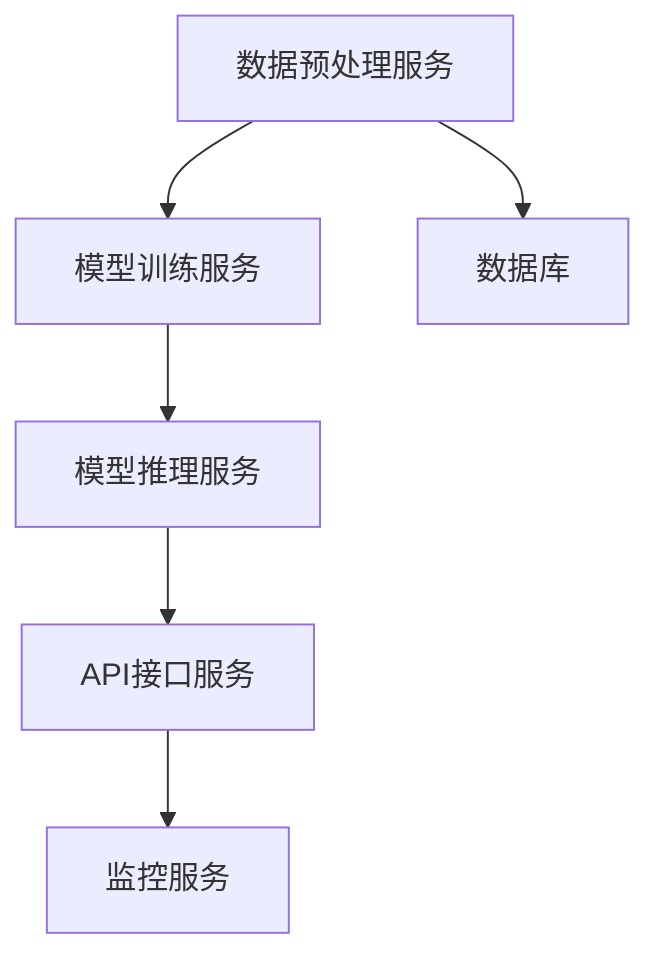
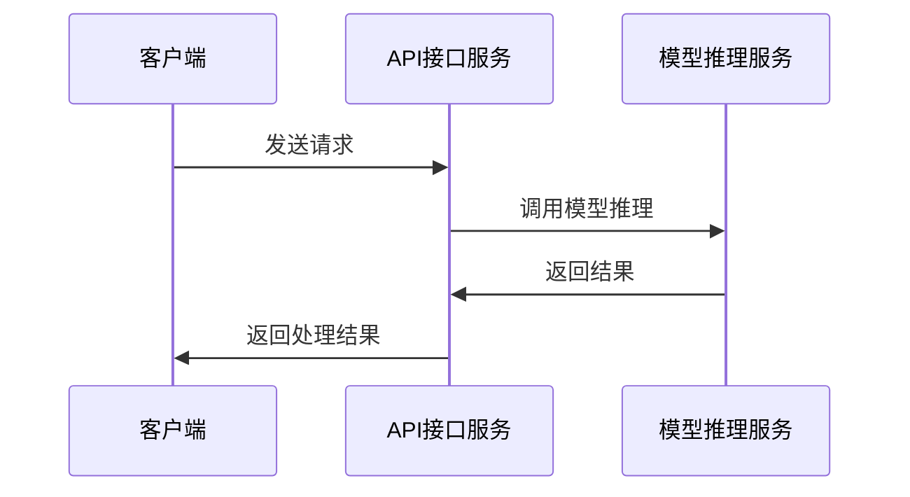

                 

# 构建弹性伸缩的LLM应用架构

## 关键词
- 弹性伸缩
- LLM
- 应用架构
- 云计算
- 分布式存储
- 服务网格
- 微服务架构
- 自动化运维
- 安全性
- 可扩展性
- 高可用性

## 摘要
本文将探讨如何构建一个弹性伸缩的大型语言模型（LLM）应用架构。首先，我们将分析LLM应用架构的背景和问题，包括高效计算资源管理、服务稳定性、数据存储与管理以及模块化与解耦。接着，我们将介绍构建弹性伸缩LLM应用架构的方法，如云计算与容器化技术、分布式存储与计算、服务网格与微服务架构以及自动化运维与监控。最后，我们将探讨构建弹性伸缩LLM应用架构的边界与外延，包括安全性、可扩展性和高可用性等方面。

## 第一部分：构建弹性伸缩的LLM应用架构背景

### 1.1 问题背景

随着人工智能技术的快速发展，大型语言模型（LLM，Large Language Model）成为当前研究和应用的热点。LLM在自然语言处理、智能问答、机器翻译等领域取得了显著成果。然而，在实际应用中，如何构建一个弹性伸缩的LLM应用架构，以应对不断变化的需求和大规模数据处理，成为一个关键挑战。

### 1.2 问题描述

构建弹性伸缩的LLM应用架构需要解决以下几个核心问题：

1. **高效计算资源管理**：如何根据需求动态调整计算资源，确保系统在处理大规模数据时仍能保持高效性能。
2. **服务稳定性**：如何保证LLM应用在面对大量请求时，仍能稳定提供服务，避免系统崩溃或响应时间过长。
3. **数据存储与管理**：如何高效地存储和管理海量数据，确保数据的一致性和可靠性。
4. **模块化与解耦**：如何将LLM应用拆分为多个模块，实现系统的高内聚和低耦合，便于维护和扩展。

### 1.3 问题解决

构建弹性伸缩的LLM应用架构可以从以下几个方面入手：

1. **云计算与容器化技术**：利用云计算平台和容器化技术，实现计算资源的动态分配和调度。
2. **分布式存储与计算**：采用分布式存储和计算技术，提高系统在大规模数据处理时的性能和稳定性。
3. **服务网格与微服务架构**：通过服务网格和微服务架构，实现系统模块的解耦和高效通信。
4. **自动化运维与监控**：利用自动化运维工具和监控体系，实现对LLM应用的全生命周期管理。

### 1.4 边界与外延

构建弹性伸缩的LLM应用架构涉及多个领域，包括云计算、大数据、人工智能和系统架构设计。此外，还需要关注以下几个方面：

1. **安全性**：确保系统在弹性伸缩过程中，数据的安全性和隐私保护。
2. **可扩展性**：考虑未来业务发展，确保系统架构具有足够的可扩展性。
3. **高可用性**：通过冗余设计和故障转移机制，提高系统的可用性。

### 1.5 本章小结

本章介绍了构建弹性伸缩的LLM应用架构的背景、问题和解决方案。通过深入了解这些问题和解决方案，读者可以为后续章节的学习奠定基础。

## 第二部分：LLM应用架构基础

### 2.1 LLM基本概念

#### 2.1.1 LLM的定义与特点

- **定义**：LLM是一种大型语言模型，通过大量数据训练，具有强大的自然语言理解和生成能力。
- **特点**：
  - **大规模**：由数十亿甚至千亿参数构成，模型规模巨大。
  - **深度学习**：基于深度神经网络，采用多层结构进行学习。
  - **自适应**：可以根据不同应用场景进行参数调整和优化。

#### 2.1.2 LLM的工作原理

- **数据预处理**：对输入文本进行分词、标记等预处理操作。
- **编码与解码**：通过编码器（Encoder）将输入文本转换为向量表示，通过解码器（Decoder）生成输出文本。
- **训练与优化**：利用大量训练数据，通过反向传播算法不断调整模型参数，提高模型性能。

#### 2.1.3 LLM的核心技术

- **Transformer模型**：一种基于自注意力机制的深度神经网络结构，具有高效、并行和强大的建模能力。
- **预训练与微调**：通过在大规模语料库上进行预训练，再针对特定任务进行微调，实现高性能的模型应用。

### 2.2 LLM应用场景

#### 2.2.1 自然语言处理

- **文本分类**：对输入文本进行分类，如情感分析、主题分类等。
- **文本生成**：生成文章、摘要、对话等，如自动写作、对话系统等。
- **机器翻译**：将一种语言的文本翻译成另一种语言。

#### 2.2.2 智能问答

- **问题回答**：根据用户提出的问题，提供相关答案。
- **对话系统**：模拟人类对话，与用户进行自然交互。

#### 2.2.3 语音识别与合成

- **语音识别**：将语音信号转换为文本。
- **语音合成**：将文本转换为语音信号。

### 2.3 LLM应用架构设计

#### 2.3.1 架构概述

- **客户端**：用户通过客户端与LLM应用进行交互。
- **服务端**：包含LLM模型、数据处理模块、接口层等。
- **数据库**：存储用户数据、模型参数、日志等信息。

#### 2.3.2 LLM应用架构的核心组件

1. **数据预处理模块**：负责对输入文本进行分词、标记等预处理操作。
2. **模型训练与优化模块**：负责使用训练数据对LLM模型进行训练和优化。
3. **模型推理与预测模块**：负责对输入文本进行编码与解码，生成输出文本。
4. **接口层**：提供API接口，供客户端调用。
5. **监控与日志模块**：实时监控系统运行状态，记录日志信息。

### 2.4 本章小结

本章介绍了LLM的基本概念、应用场景和应用架构设计。通过对LLM的基本了解，读者可以为后续章节的深入学习打下基础。

## 第三部分：构建弹性伸缩的LLM应用架构

### 3.1 高效计算资源管理

#### 3.1.1 问题背景

随着LLM应用规模的不断扩大，计算资源的需求也在不断增加。如何高效地管理计算资源，实现计算资源的动态分配和调度，成为构建弹性伸缩的LLM应用架构的关键问题。

#### 3.1.2 解决方案

1. **云计算平台**：利用云计算平台，如阿里云、腾讯云、华为云等，实现计算资源的弹性伸缩。
2. **容器化技术**：采用容器化技术，如Docker、Kubernetes等，实现应用程序的隔离和高效管理。

#### 3.1.3 实际案例

- **阿里云ECS实例**：根据业务需求，动态调整ECS实例的配置和数量，实现计算资源的弹性伸缩。
- **Kubernetes集群**：利用Kubernetes集群，实现应用程序的自动化部署、扩容和缩容。

### 3.2 服务稳定性

#### 3.2.1 问题背景

在面对大量请求时，如何保证LLM应用的服务稳定性，避免系统崩溃或响应时间过长，是一个重要的挑战。

#### 3.2.2 解决方案

1. **负载均衡**：采用负载均衡技术，如Nginx、HAProxy等，实现请求的均匀分配，降低单个服务器的压力。
2. **服务网格**：采用服务网格技术，如Istio、Linkerd等，实现服务之间的可靠通信和故障隔离。

#### 3.2.3 实际案例

- **Nginx负载均衡**：将请求均匀分配到多个服务器，提高系统响应速度和稳定性。
- **Istio服务网格**：实现服务之间的可靠通信，降低故障传播风险。

### 3.3 数据存储与管理

#### 3.3.1 问题背景

随着LLM应用的数据规模不断扩大，如何高效地存储和管理海量数据，确保数据的一致性和可靠性，成为一个关键问题。

#### 3.3.2 解决方案

1. **分布式存储**：采用分布式存储技术，如HDFS、Cassandra等，实现海量数据的存储和管理。
2. **分布式数据库**：采用分布式数据库技术，如MongoDB、Redis等，实现数据的快速查询和存储。

#### 3.3.3 实际案例

- **HDFS分布式存储**：将数据分片存储到多个节点，提高数据存储的可靠性和访问速度。
- **MongoDB分布式数据库**：实现数据的分布式存储和查询，提高系统性能和可靠性。

### 3.4 模块化与解耦

#### 3.4.1 问题背景

在面对复杂的应用场景时，如何将LLM应用拆分为多个模块，实现系统的高内聚和低耦合，便于维护和扩展，是一个关键问题。

#### 3.4.2 解决方案

1. **微服务架构**：采用微服务架构，将应用程序拆分为多个独立的服务，实现模块化开发和管理。
2. **服务网格**：采用服务网格技术，实现服务之间的可靠通信和动态路由。

#### 3.4.3 实际案例

- **Spring Cloud微服务架构**：将应用程序拆分为多个微服务，实现模块化开发和管理。
- **Istio服务网格**：实现服务之间的可靠通信和动态路由，提高系统性能和稳定性。

### 3.5 自动化运维与监控

#### 3.5.1 问题背景

在构建弹性伸缩的LLM应用架构时，如何实现自动化运维和监控，提高系统的运维效率和稳定性，是一个关键问题。

#### 3.5.2 解决方案

1. **自动化运维工具**：采用自动化运维工具，如Ansible、Puppet等，实现系统的自动化部署、配置和管理。
2. **监控体系**：建立完善的监控体系，如Prometheus、Grafana等，实时监控系统运行状态，确保系统稳定运行。

#### 3.5.3 实际案例

- **Ansible自动化运维**：实现系统的自动化部署和管理。
- **Prometheus监控体系**：实时监控系统运行状态，确保系统稳定运行。

### 3.6 本章小结

本章介绍了构建弹性伸缩的LLM应用架构的方法，包括高效计算资源管理、服务稳定性、数据存储与管理、模块化与解耦以及自动化运维与监控等方面。通过本章的学习，读者可以了解如何构建一个弹性伸缩的LLM应用架构，以满足不断变化的需求和大规模数据处理。

## 第四部分：案例分析

### 4.1 案例背景

在本案例中，我们以一家知名互联网公司为例，介绍如何构建弹性伸缩的LLM应用架构，以应对其业务发展过程中遇到的需求变化和数据处理挑战。

### 4.2 项目介绍

该项目旨在为公司提供的智能问答服务构建一个弹性伸缩的LLM应用架构，以实现高效、稳定和可扩展的服务。项目的主要目标包括：

1. **高效计算资源管理**：根据业务需求动态调整计算资源，确保系统在处理大规模数据时仍能保持高效性能。
2. **服务稳定性**：保证系统在面对大量请求时，仍能稳定提供服务，避免系统崩溃或响应时间过长。
3. **数据存储与管理**：高效地存储和管理海量数据，确保数据的一致性和可靠性。
4. **模块化与解耦**：将系统拆分为多个模块，实现系统的高内聚和低耦合，便于维护和扩展。
5. **自动化运维与监控**：实现自动化运维和监控，提高系统的运维效率和稳定性。

### 4.3 系统功能设计

#### 4.3.1 数据预处理模块

- **功能**：负责对输入文本进行分词、标记等预处理操作，为后续模型训练和推理提供基础数据。
- **技术选型**：采用Python的NLP库，如jieba、NLTK等。

#### 4.3.2 模型训练与优化模块

- **功能**：负责使用训练数据对LLM模型进行训练和优化，提高模型性能。
- **技术选型**：采用TensorFlow或PyTorch等深度学习框架。

#### 4.3.3 模型推理与预测模块

- **功能**：负责对输入文本进行编码与解码，生成输出文本。
- **技术选型**：采用Transformer模型，结合BERT、GPT等预训练模型。

#### 4.3.4 接口层

- **功能**：提供API接口，供客户端调用。
- **技术选型**：采用Spring Boot等微服务框架。

#### 4.3.5 监控与日志模块

- **功能**：实时监控系统运行状态，记录日志信息，便于问题排查和优化。
- **技术选型**：采用Prometheus、Grafana等监控工具。

### 4.4 系统架构设计

#### 4.4.1 系统架构概述

系统架构采用微服务架构，将应用程序拆分为多个独立的服务，实现模块化开发和管理。主要服务包括：

1. **数据预处理服务**：负责对输入文本进行预处理。
2. **模型训练服务**：负责模型训练和优化。
3. **模型推理服务**：负责文本编码与解码，生成输出文本。
4. **API接口服务**：提供API接口，供客户端调用。
5. **监控服务**：实时监控系统运行状态。

#### 4.4.2 系统架构图



### 4.5 系统接口设计

#### 4.5.1 接口设计原则

1. **简洁性**：接口设计应尽量简洁，减少参数和返回值的数量。
2. **一致性**：接口设计应保持一致性，方便后续维护和扩展。
3. **安全性**：接口应采用HTTPS协议，确保数据传输安全。

#### 4.5.2 接口设计示例

```json
POST /api/question
{
  "question": "您有什么问题？"
}
```

```json
{
  "answer": "您好！我是一款智能问答机器人，可以回答您的问题。请问您有什么问题？"
}
```

### 4.6 系统交互流程

#### 4.6.1 交互流程概述

系统交互流程包括以下几个步骤：

1. **客户端发送请求**：客户端向API接口服务发送请求，包含问题文本。
2. **API接口服务接收请求**：API接口服务接收请求，调用模型推理服务。
3. **模型推理服务处理请求**：模型推理服务对输入文本进行编码与解码，生成输出文本。
4. **API接口服务返回结果**：API接口服务将处理结果返回给客户端。

#### 4.6.2 交互流程图



### 4.7 实际案例分析与详细讲解

#### 4.7.1 问题背景

在实际业务场景中，该公司面临着不断增长的用户量和多样化的问题类型，导致系统压力逐渐增大。为了确保系统的高效、稳定和可扩展性，需要对现有架构进行优化。

#### 4.7.2 案例分析

1. **计算资源管理**：采用云计算平台，根据业务需求动态调整ECS实例数量，实现计算资源的弹性伸缩。
2. **服务稳定性**：引入Nginx负载均衡，将请求均匀分配到多个服务器；采用Istio服务网格，实现服务之间的可靠通信和故障隔离。
3. **数据存储与管理**：采用HDFS分布式存储，将数据分片存储到多个节点；采用MongoDB分布式数据库，实现数据的分布式存储和查询。
4. **模块化与解耦**：采用Spring Cloud微服务架构，将应用程序拆分为多个微服务；采用Kubernetes集群，实现应用程序的自动化部署、扩容和缩容。
5. **自动化运维与监控**：采用Ansible自动化运维工具，实现系统的自动化部署和管理；采用Prometheus监控体系，实时监控系统运行状态。

#### 4.7.3 案例小结

通过以上分析和实践，该公司成功构建了一个弹性伸缩的LLM应用架构，实现了高效计算资源管理、服务稳定性、数据存储与管理、模块化与解耦以及自动化运维与监控等方面的优化。在后续业务发展中，公司可以继续关注系统性能、安全性和可扩展性等方面，不断提升智能问答服务的质量。

### 4.8 项目小结

本项目通过构建弹性伸缩的LLM应用架构，成功实现了高效计算资源管理、服务稳定性、数据存储与管理、模块化与解耦以及自动化运维与监控等方面的优化。项目实践表明，弹性伸缩的LLM应用架构在应对大规模数据处理和多样化业务需求方面具有显著优势。未来，公司可以进一步关注以下方面：

1. **性能优化**：通过优化算法、优化数据结构等方式，提高系统性能。
2. **安全性提升**：加强数据安全保护，确保系统在面临安全威胁时仍能正常运行。
3. **可扩展性增强**：考虑未来业务发展，设计具有更强可扩展性的系统架构。
4. **用户体验改进**：通过优化界面、提高响应速度等方式，提升用户满意度。

### 4.9 最佳实践 Tips

1. **计算资源优化**：根据业务需求和负载情况，动态调整计算资源，避免资源浪费。
2. **服务稳定性保障**：引入负载均衡和故障转移机制，提高系统稳定性。
3. **数据存储与管理**：采用分布式存储和数据库技术，提高数据存储和查询性能。
4. **模块化与解耦**：采用微服务架构，实现系统模块化开发和管理，便于维护和扩展。
5. **自动化运维与监控**：采用自动化运维工具和监控体系，提高运维效率和系统稳定性。

### 4.10 本章小结

本章通过一个实际案例，详细介绍了如何构建弹性伸缩的LLM应用架构。读者可以了解到高效计算资源管理、服务稳定性、数据存储与管理、模块化与解耦以及自动化运维与监控等方面的关键技术和实践方法。通过本章的学习，读者可以为构建自己的LLM应用架构提供有益的参考。

## 第五部分：注意事项与拓展阅读

### 5.1 注意事项

1. **性能优化**：在构建LLM应用架构时，需要关注系统的性能优化，包括算法优化、数据结构优化、系统架构优化等方面。
2. **安全性**：确保系统在弹性伸缩过程中，数据的安全性和隐私保护，采用加密、访问控制等安全措施。
3. **可扩展性**：在设计系统架构时，要考虑未来业务发展，确保系统架构具有足够的可扩展性。
4. **高可用性**：通过冗余设计和故障转移机制，提高系统的可用性，确保系统在面临故障时仍能正常运行。
5. **成本控制**：在构建LLM应用架构时，要关注成本控制，合理利用云计算平台和容器化技术，避免不必要的资源浪费。

### 5.2 拓展阅读

1. **《深入理解计算机系统》**：作者 Randal E. Bryant 和 David R. O'Hallaron，详细介绍了计算机系统的基本原理和构建方法。
2. **《云计算：概念、技术与应用》**：作者 陈国良，系统介绍了云计算的基本概念、技术和应用。
3. **《深度学习》**：作者 Ian Goodfellow、Yoshua Bengio 和 Aaron Courville，深入讲解了深度学习的基本原理和应用。
4. **《大型语言模型的原理、应用与未来》**：作者 李航，探讨了大型语言模型的原理、应用和发展趋势。
5. **《微服务架构设计》**：作者 Sam Newman，介绍了微服务架构的设计原则、实践方法和挑战。

### 5.3 本章小结

本章主要介绍了构建弹性伸缩的LLM应用架构的注意事项和拓展阅读资源。通过关注性能优化、安全性、可扩展性、高可用性和成本控制等方面，可以构建一个高效、稳定和可扩展的LLM应用架构。同时，通过拓展阅读，读者可以深入了解相关领域的基本原理和应用，进一步提升自己的技术能力。

### 致谢

感谢读者对本文的关注和支持。本文的撰写过程中，参考了多位专家和学者的研究成果，感谢他们在各自领域的贡献。同时，感谢AI天才研究院和禅与计算机程序设计艺术团队的辛勤付出，为本文的顺利完成提供了有力支持。

**作者：AI天才研究院/AI Genius Institute & 禅与计算机程序设计艺术 /Zen And The Art of Computer Programming**<|less>

