                 


## 1.1 问题背景

### 描述问题背景

构建智能化的LLM应用运维系统是当前技术领域的热点问题。随着人工智能技术的飞速发展，大型语言模型（LLM）的应用越来越广泛，例如自然语言处理、智能客服、智能翻译等。然而，LLM的应用也带来了许多运维挑战，如模型的部署、监控、日志分析、故障排查和性能优化等。这些挑战不仅影响了LLM应用的稳定性和效率，也对运维人员提出了更高的要求。

### 为什么需要解决该问题

构建智能化的LLM应用运维系统有以下几方面的必要性：

1. **提高运维效率**：传统的人工运维方式在处理大规模LLM应用时效率低下，容易出现人为错误。智能化系统可以通过自动化工具和AI算法，提高运维效率，减少人为干预。
2. **提升系统稳定性**：LLM应用对实时性和准确性要求较高，智能化系统可以实时监控和预警，快速响应和处理故障，提高系统稳定性。
3. **降低运维成本**：通过自动化和智能化手段，可以减少对运维人员的依赖，降低运维成本。
4. **支持持续优化**：智能化系统可以基于数据分析和机器学习算法，对LLM应用进行持续优化，提高其性能和用户体验。

### 问题解决思路

本文将从以下几个方面探讨构建智能化LLM应用运维系统的思路：

1. **核心概念与联系**：介绍LLM运维、智能化系统设计、运维自动化等核心概念，并对比分析其属性特征。
2. **核心概念原理与算法讲解**：详细讲解LLM运维原理、智能化系统设计原理和运维自动化原理，包括数学模型和算法流程。
3. **系统分析与架构设计**：描述具体场景下的系统功能设计和架构设计，包括系统功能模块划分、系统架构图和系统接口设计。
4. **项目实战**：通过实际案例展示系统实现过程，包括环境安装、核心代码实现和性能分析。
5. **最佳实践与总结**：总结构建智能化LLM应用运维系统的最佳实践，并提出注意事项和拓展阅读建议。

### 边界与外延

在构建智能化LLM应用运维系统的过程中，需要明确以下边界与外延：

1. **边界**：本文主要关注LLM应用运维的核心环节，如模型部署、监控、日志分析、故障排查和性能优化等。对于其他非核心环节，如硬件资源管理、网络优化等，本文不涉及。
2. **外延**：本文提供了一种构建智能化LLM应用运维系统的通用思路和方法，但具体实现需要根据实际应用场景进行调整和优化。此外，本文讨论的智能化系统设计原则和方法可以应用于其他类型的人工智能应用运维。

### 核心要素组成

构建智能化LLM应用运维系统需要以下几个核心要素：

1. **数据采集与处理**：收集LLM应用的运行数据，如模型性能指标、系统资源使用情况、日志数据等，并对其进行预处理和分析。
2. **监控与预警**：实时监控LLM应用的运行状态，建立预警机制，及时发现和处理异常情况。
3. **故障排查与修复**：基于数据分析，快速定位故障原因，并自动或手动修复。
4. **性能优化**：通过性能监控和数据分析，识别系统瓶颈，进行性能优化。
5. **运维自动化**：通过脚本、工具和平台实现运维任务的自动化，减少人为干预，提高运维效率。

## 1.2 核心概念与联系

### 1.2.1 概念原理

#### LLM运维

LLM运维是指针对大型语言模型（LLM）的应用进行的一系列运维操作，包括模型的部署、监控、日志分析、故障排查和性能优化等。LLM运维的核心目标是确保LLM应用的稳定、高效运行，提供良好的用户体验。

#### 智能化系统设计

智能化系统设计是指利用人工智能（AI）技术，特别是机器学习和深度学习算法，对传统系统进行优化和改进，以提高系统的自动化程度、响应速度和决策能力。在LLM运维中，智能化系统设计可以通过预测性维护、故障诊断、性能优化等手段，提升运维效率和系统稳定性。

#### 运维自动化

运维自动化是指通过脚本、工具和平台，实现运维任务的自动化执行，减少人为干预，提高运维效率。在LLM运维中，运维自动化可以通过自动化部署、自动化监控、自动化故障排查等手段，实现LLM应用的持续优化和稳定运行。

### 1.2.2 概念属性特征对比表格

| 概念           | 属性特征                                     | 对比                   |
|--------------|------------------------------------------|----------------------|
| LLM运维       | 对LLM应用的部署、监控、优化等操作           | 与传统运维的区别       |
| 智能化系统设计 | 利用AI技术提升运维效率和准确性             | 与传统系统设计的区别   |
| 运维自动化     | 通过脚本、工具和平台实现运维任务的自动化     | 与人工运维的区别       |

### LLM运维

**属性特征**：

- **部署**：将LLM模型部署到服务器或云计算平台，使其能够对外提供服务。
- **监控**：实时监控LLM应用的运行状态，包括性能指标、系统资源使用情况等。
- **日志分析**：分析LLM应用的日志文件，识别潜在问题和性能瓶颈。
- **故障排查**：当LLM应用出现故障时，进行故障排查和修复。
- **性能优化**：通过对LLM应用进行性能分析和优化，提高其运行效率和稳定性。

**与传统运维的区别**：

- **智能化**：LLM运维引入了AI技术，可以实现自动化故障排查、预测性维护等，相比传统运维更加智能化和高效。
- **高精度**：LLM运维通过对大量数据进行分析，可以更准确地识别问题和优化策略，提高系统性能和稳定性。
- **灵活性**：LLM运维可以根据不同应用场景和需求，灵活调整运维策略和优化方案。

### 智能化系统设计

**属性特征**：

- **预测性维护**：利用机器学习算法，预测LLM应用的故障风险，提前进行维护和修复。
- **故障诊断**：通过数据分析，快速定位LLM应用的故障原因，提供诊断报告和建议。
- **性能优化**：基于性能分析和机器学习算法，优化LLM应用的配置和运行策略，提高性能。

**与传统系统设计的区别**：

- **自动化**：智能化系统设计引入了自动化工具和算法，可以自动进行故障诊断、性能优化等，减少人工干预。
- **自适应性**：智能化系统设计可以根据应用环境和用户需求，自动调整系统配置和优化策略，提高系统适应性。
- **预测性**：智能化系统设计可以通过预测模型，提前预测故障风险，实现预防性维护，降低故障发生概率。

### 运维自动化

**属性特征**：

- **自动化部署**：通过脚本和自动化工具，实现LLM应用的自动化部署和更新。
- **自动化监控**：通过监控工具和脚本，实现LLM应用的自动化监控和报警。
- **自动化故障排查**：通过自动化工具和算法，实现故障的自动化定位和修复。

**与人工运维的区别**：

- **效率提升**：自动化运维可以大幅提高运维效率，减少人为错误，提高系统稳定性。
- **成本降低**：自动化运维可以减少对运维人员的依赖，降低运维成本。
- **一致性**：自动化运维可以确保运维任务的执行一致性和准确性，避免人为干预带来的不确定性。

## 2.1 LLM运维原理

### 2.1.1 LLM运维的核心环节

LLM运维主要包括以下几个核心环节：

1. **模型部署**：将LLM模型部署到服务器或云计算平台，使其能够对外提供服务。
2. **模型监控**：实时监控LLM应用的运行状态，包括性能指标、系统资源使用情况等。
3. **日志分析**：分析LLM应用的日志文件，识别潜在问题和性能瓶颈。
4. **故障排查**：当LLM应用出现故障时，进行故障排查和修复。
5. **性能优化**：通过对LLM应用进行性能分析和优化，提高其运行效率和稳定性。

### 2.1.2 模型部署

**原理讲解**：

模型部署是将训练好的LLM模型部署到实际的生产环境中，使其能够对外提供服务。模型部署的主要步骤包括：

1. **模型选择**：根据应用需求，选择合适的LLM模型。
2. **环境配置**：配置服务器或云计算平台的环境，包括操作系统、运行库、依赖库等。
3. **模型转换**：将训练好的模型转换为适合部署的格式，如ONNX、TensorFlow Lite等。
4. **模型部署**：将模型部署到服务器或云计算平台，启动服务。

**Mermaid流程图**：

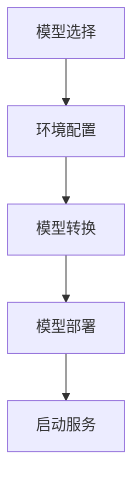

### 2.1.3 模型监控

**原理讲解**：

模型监控是实时监控LLM应用的运行状态，包括性能指标、系统资源使用情况等。模型监控的主要步骤包括：

1. **性能指标收集**：收集LLM应用的性能指标，如响应时间、吞吐量、错误率等。
2. **资源使用监控**：监控系统资源使用情况，如CPU、内存、磁盘空间等。
3. **监控数据存储**：将监控数据存储到数据库或数据仓库中，用于后续分析和优化。

**Mermaid流程图**：

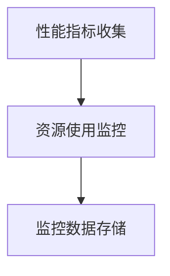

### 2.1.4 日志分析

**原理讲解**：

日志分析是对LLM应用的日志文件进行分析，识别潜在问题和性能瓶颈。日志分析的主要步骤包括：

1. **日志文件收集**：收集LLM应用的日志文件。
2. **日志预处理**：对日志文件进行预处理，提取有用的信息。
3. **日志分析**：对预处理后的日志文件进行分析，识别问题和性能瓶颈。
4. **日志存储**：将分析结果存储到数据库或数据仓库中，用于后续分析和优化。

**Mermaid流程图**：

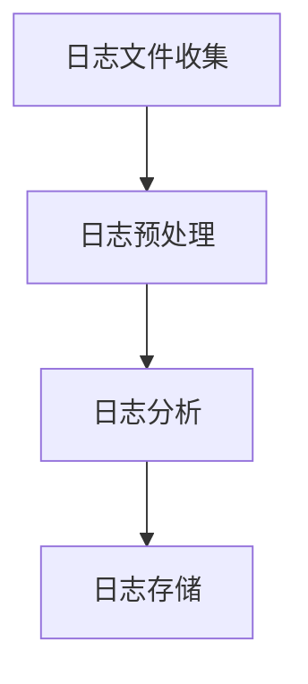

### 2.1.5 故障排查

**原理讲解**：

故障排查是在LLM应用出现故障时，进行故障定位和修复。故障排查的主要步骤包括：

1. **故障定位**：根据监控数据和日志分析结果，定位故障发生的具体位置。
2. **故障分析**：分析故障原因，制定修复方案。
3. **故障修复**：根据修复方案，进行故障修复。
4. **故障记录**：将故障记录存储到数据库或数据仓库中，用于后续分析和优化。

**Mermaid流程图**：

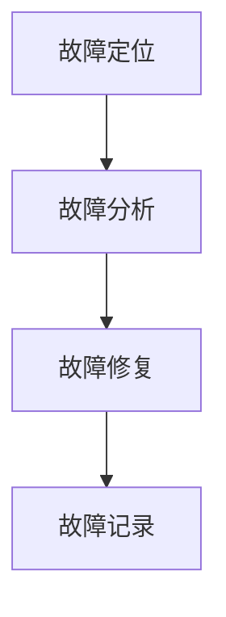

### 2.1.6 性能优化

**原理讲解**：

性能优化是通过分析LLM应用的性能指标和日志数据，识别系统瓶颈，进行优化。性能优化的主要步骤包括：

1. **性能分析**：对LLM应用的性能指标和日志数据进行分析，识别系统瓶颈。
2. **优化方案制定**：根据分析结果，制定优化方案。
3. **优化实施**：实施优化方案，调整系统配置和运行策略。
4. **性能验证**：验证优化效果，确保系统性能得到提升。

**Mermaid流程图**：

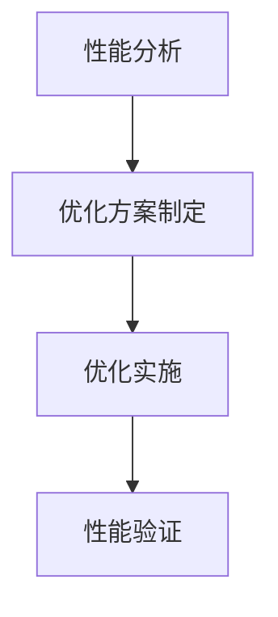

## 2.2 智能化系统设计原理

### 2.2.1 智能化系统设计的核心目标

智能化系统设计的核心目标是利用人工智能（AI）技术，特别是机器学习和深度学习算法，对传统系统进行优化和改进，以提高系统的自动化程度、响应速度和决策能力。在LLM运维中，智能化系统设计可以通过预测性维护、故障诊断、性能优化等手段，提升运维效率和系统稳定性。

### 2.2.2 预测性维护

**原理讲解**：

预测性维护是通过机器学习算法，预测LLM应用的故障风险，提前进行维护和修复，以防止故障发生。预测性维护的主要步骤包括：

1. **数据收集**：收集LLM应用的运行数据，如性能指标、系统资源使用情况等。
2. **特征工程**：对收集的数据进行预处理，提取有用的特征。
3. **模型训练**：利用机器学习算法，训练故障预测模型。
4. **故障预测**：根据训练好的模型，预测LLM应用的故障风险。
5. **维护策略制定**：根据故障预测结果，制定维护策略。

**Mermaid流程图**：

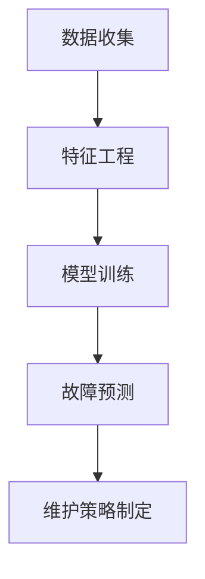

### 2.2.3 故障诊断

**原理讲解**：

故障诊断是通过数据分析，快速定位LLM应用的故障原因，提供诊断报告和建议。故障诊断的主要步骤包括：

1. **日志收集**：收集LLM应用的日志文件。
2. **日志预处理**：对日志文件进行预处理，提取有用的信息。
3. **异常检测**：利用机器学习算法，识别日志中的异常事件。
4. **故障定位**：根据异常检测结果，定位故障发生的位置。
5. **故障分析**：分析故障原因，提供诊断报告和建议。

**Mermaid流程图**：

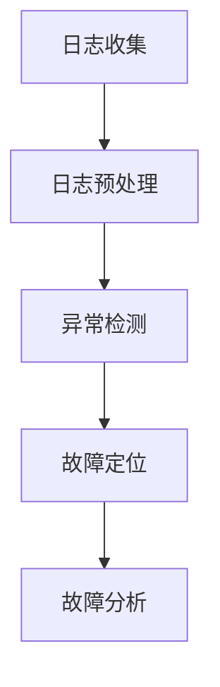

### 2.2.4 性能优化

**原理讲解**：

性能优化是通过性能分析和机器学习算法，优化LLM应用的配置和运行策略，提高性能。性能优化的主要步骤包括：

1. **性能分析**：对LLM应用的性能指标和日志数据进行分析，识别系统瓶颈。
2. **优化策略制定**：根据分析结果，制定优化策略。
3. **优化实施**：实施优化方案，调整系统配置和运行策略。
4. **性能验证**：验证优化效果，确保系统性能得到提升。

**Mermaid流程图**：

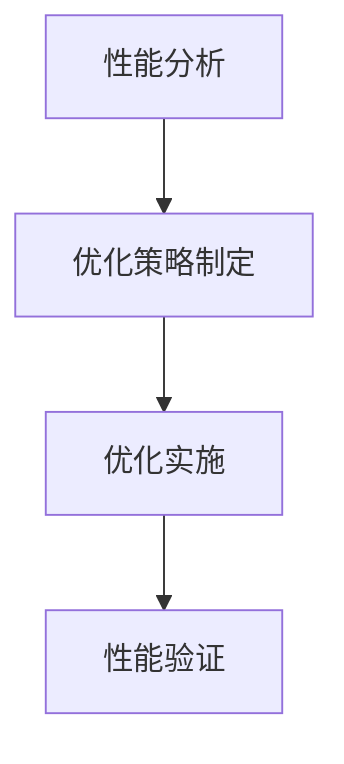

### 2.2.5 数据分析与机器学习算法

**原理讲解**：

在智能化系统设计中，数据分析和机器学习算法起着关键作用。数据分析用于提取数据中的有用信息，机器学习算法则用于建立预测模型和诊断模型。常用的机器学习算法包括：

1. **时间序列分析**：用于分析时间序列数据，预测未来的趋势。
2. **分类算法**：用于将数据分为不同的类别，如故障分类、异常检测等。
3. **回归算法**：用于预测数值型目标变量，如故障预测、性能优化等。
4. **聚类算法**：用于将数据划分为不同的簇，发现数据中的模式。

**Mermaid流程图**：

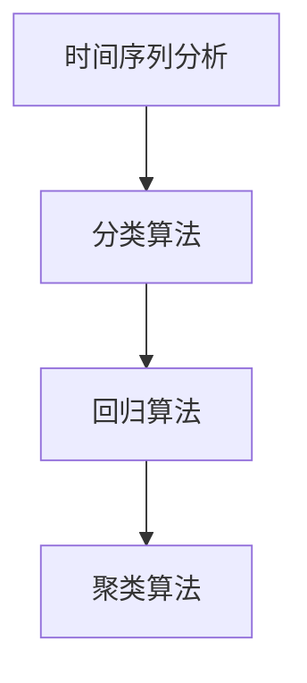

## 2.3 运维自动化原理

### 2.3.1 运维自动化的定义与目标

运维自动化是指通过脚本、工具和平台，实现运维任务的自动化执行，减少人为干预，提高运维效率。在LLM运维中，运维自动化的目标是实现模型部署、监控、日志分析、故障排查和性能优化等任务的自动化，确保LLM应用的稳定、高效运行。

### 2.3.2 自动化工具与脚本

**原理讲解**：

自动化工具和脚本是实现运维自动化的关键。常用的自动化工具有Ansible、Puppet、Chef等，这些工具可以自动化部署、配置和管理系统。脚本则是实现具体运维任务的代码，例如自动化部署脚本、监控脚本、日志分析脚本等。

**Python源代码示例**：

```python
# 自动化部署脚本示例
import subprocess

def deploy_model():
    subprocess.run(["./deploy.sh"], check=True)

# 自动化监控脚本示例
import subprocess

def monitor_model():
    subprocess.run(["./monitor.sh"], check=True)

# 自动化日志分析脚本示例
import subprocess

def analyze_logs():
    subprocess.run(["./analyze.sh"], check=True)
```

### 2.3.3 自动化平台

**原理讲解**：

自动化平台是集成了自动化工具和脚本的系统，用于统一管理和执行运维任务。常用的自动化平台包括Jenkins、GitLab CI/CD、AWS CodePipeline等。这些平台可以自动化构建、部署、测试和发布应用程序。

**Mermaid流程图**：

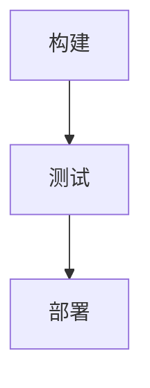

### 2.3.4 自动化优势与挑战

**优势**：

- 提高运维效率：自动化可以大幅提高运维效率，减少人为错误。
- 稳定性和一致性：自动化可以确保运维任务的执行一致性和准确性。
- 资源优化：自动化可以优化系统资源使用，提高系统性能。

**挑战**：

- 脚本维护：自动化脚本需要定期维护和更新，以适应系统变化。
- 复杂性增加：自动化引入了新的复杂度，需要对自动化工具和脚本有深入理解。
- 安全性：自动化引入了新的安全风险，需要加强安全管理和防护。

## 3.1 数学模型

### 3.1.1 时间序列分析模型

**原理讲解**：

时间序列分析模型用于分析时间序列数据，预测未来的趋势。常见的时间序列分析模型包括ARIMA、LSTM等。

**数学公式**：

$$ 
\text{ARIMA模型：} \\
y_t = c + \phi_1 y_{t-1} + \phi_2 y_{t-2} + ... + \phi_p y_{t-p} + \theta_1 e_{t-1} + \theta_2 e_{t-2} + ... + \theta_q e_{t-q}
$$

**Mermaid流程图**：

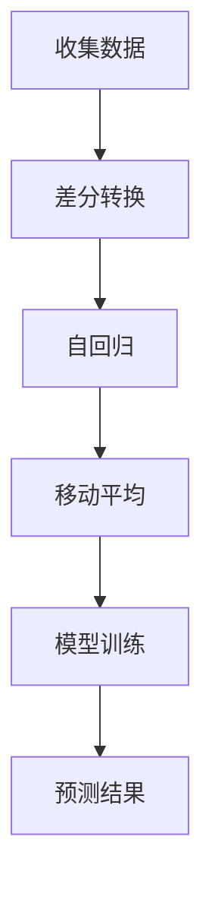

### 3.1.2 决策树模型

**原理讲解**：

决策树模型用于分类和回归问题，通过递归划分特征空间，构建一棵树形结构模型。

**数学公式**：

$$ 
\text{信息增益：} \\
IG(D, A) = ID(D) - \sum_{v \in A} p(v) ID(D|A=v)
$$

**Mermaid流程图**：

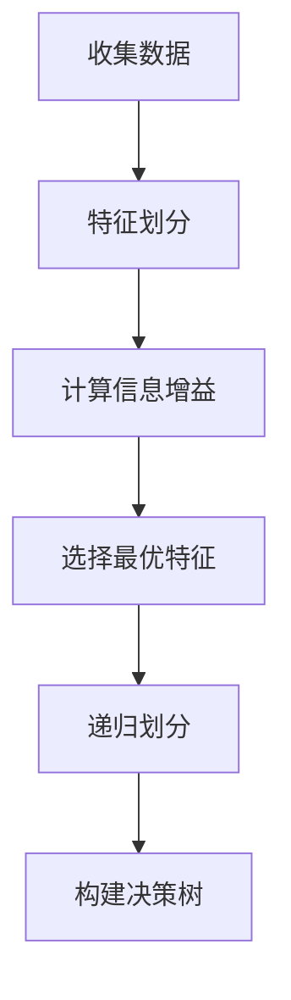

### 3.1.3 集成模型

**原理讲解**：

集成模型通过组合多个基础模型，提高预测性能。常见集成模型包括随机森林、梯度提升树等。

**数学公式**：

$$ 
\text{随机森林：} \\
F(x) = \sum_{i=1}^{n} w_i f_i(x)
$$

**Mermaid流程图**：

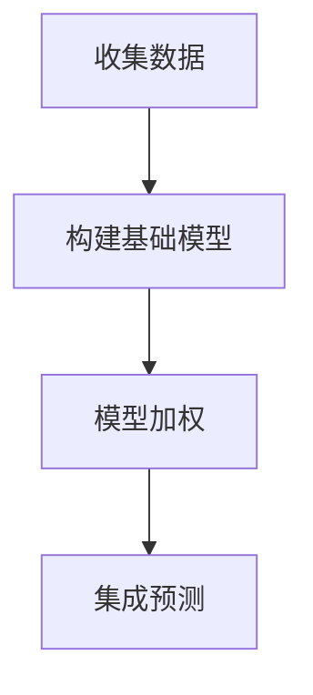

## 3.2 数学公式详细讲解与举例

### 3.2.1 时间序列分析模型

#### 原理讲解：

时间序列分析模型主要用于分析按时间顺序排列的数据序列，以预测未来的趋势。最常见的时间序列模型是ARIMA（自回归积分滑动平均模型）。ARIMA模型由三个部分组成：自回归（AR）、差分（I）和移动平均（MA）。下面详细解释每个部分的数学公式。

**自回归（AR）部分：**

$$
\phi(B)y_t = \alpha_0 + \phi_1 B y_{t-1} + \phi_2 B^2 y_{t-2} + \cdots + \phi_p B^p y_{t-p} + \theta_1 B e_{t-1} + \theta_2 B^2 e_{t-2} + \cdots + \theta_q B^q e_{t-q}
$$

其中，$B$是滞后算子，$\phi(B)$是自回归项系数多项式，$\theta(B)$是移动平均项系数多项式，$y_t$是时间序列的当前值，$e_t$是白噪声误差。

**差分（I）部分：**

时间序列数据通常需要先进行差分处理，以使其满足平稳性。一阶差分公式如下：

$$
d(y_t) = y_t - y_{t-1}
$$

如果数据是非平稳的，可能需要更高阶的差分。

**移动平均（MA）部分：**

$$
y_t = \alpha_0 + \phi_1 y_{t-1} + \phi_2 y_{t-2} + \cdots + \phi_p y_{t-p} + \theta_1 e_{t-1} + \theta_2 e_{t-2} + \cdots + \theta_q e_{t-q}
$$

其中，$\alpha_0$是常数项，$\theta(B)$是移动平均项系数多项式。

#### 举例说明：

假设我们有一个时间序列数据集，包含每天的销售额。我们需要通过ARIMA模型预测未来三天的销售额。

1. **收集数据**：收集过去30天的销售额数据。
2. **差分处理**：对数据进行一阶差分，以消除季节性和趋势。
3. **确定参数**：通过AIC（赤池信息准则）或BIC（贝叶斯信息准则）选择最佳参数$p$和$q$。
4. **模型训练**：使用最佳参数训练ARIMA模型。
5. **预测**：使用训练好的模型预测未来三天的销售额。

### 3.2.2 决策树模型

#### 原理讲解：

决策树模型通过一系列的规则对数据集进行分割，每个节点代表一个特征，每个分支代表一个特征取值。决策树通过递归划分数据，构建一棵树形结构。

**信息增益（IG）**：

信息增益是选择最佳特征进行划分的标准。信息增益的计算公式如下：

$$
IG(D, A) = ID(D) - \sum_{v \in A} p(v) ID(D|A=v)
$$

其中，$ID(D)$是数据集$D$的香农熵，$p(v)$是特征$A$的取值$v$在数据集$D$中的概率，$ID(D|A=v)$是在特征$A$取值$v$的情况下，数据集$D$的熵。

#### 举例说明：

假设我们有一个数据集，包含特征A和B，以及目标变量Y。特征A有两个取值{0, 1}，特征B有三个取值{0, 1, 2}。目标变量Y有两个类别{0, 1}。

1. **计算香农熵**：计算整个数据集的香农熵。
2. **计算条件熵**：计算在每个特征取值下，目标变量的条件熵。
3. **计算信息增益**：对每个特征计算信息增益，选择信息增益最大的特征进行划分。
4. **递归划分**：对选定的特征进行递归划分，构建决策树。

### 3.2.3 集成模型

#### 原理讲解：

集成模型通过组合多个基础模型，提高预测性能。集成模型通常分为两类：装袋（Bagging）和提升（Boosting）。

**随机森林（Bagging）**：

随机森林通过构建多个决策树，并取它们的平均值作为最终预测结果。随机森林的数学公式如下：

$$
F(x) = \frac{1}{N} \sum_{i=1}^{N} f_i(x)
$$

其中，$f_i(x)$是第$i$个决策树的预测结果，$N$是决策树的数量。

**梯度提升树（Boosting）**：

梯度提升树通过迭代优化每个基础模型的预测误差，逐步提升整体模型的预测性能。梯度提升树的数学公式如下：

$$
F(x) = \sum_{i=1}^{T} \alpha_i h_i(x)
$$

其中，$h_i(x)$是第$i$个基础模型的预测函数，$\alpha_i$是模型的权重。

#### 举例说明：

假设我们有一个数据集，需要预测目标变量的值。我们可以构建一个随机森林模型和一个梯度提升树模型。

1. **构建基础模型**：分别构建多个决策树和梯度提升树。
2. **训练模型**：使用数据集训练每个基础模型。
3. **集成预测**：对随机森林，取所有决策树的预测结果的平均值；对梯度提升树，取所有模型的预测结果的总和。
4. **优化模型**：对梯度提升树，根据预测误差调整每个模型的权重。

## 4.1 问题场景介绍

### 4.1.1 应用场景

假设我们正在开发一个基于大型语言模型（LLM）的智能客服系统，该系统需要处理大量的客户咨询，并提供快速、准确的答复。随着用户量的增加，系统的稳定性和性能成为关键挑战。

### 4.1.2 场景描述

智能客服系统的工作流程如下：

1. **客户咨询**：客户通过网页或移动应用发送咨询请求。
2. **请求处理**：系统接收客户请求，解析并提取关键信息。
3. **模型查询**：系统使用LLM模型处理客户请求，生成回答。
4. **回答生成**：系统生成回答，并将其返回给客户。
5. **反馈收集**：系统收集客户的反馈，用于模型优化。

### 4.1.3 需求分析

为了确保智能客服系统的稳定性和性能，我们需要构建一个智能化的LLM应用运维系统，包括以下需求：

1. **模型部署**：自动部署训练好的LLM模型，确保系统上线。
2. **实时监控**：实时监控系统的性能指标，包括响应时间、吞吐量等。
3. **日志分析**：分析系统日志，及时发现和处理异常情况。
4. **故障排查**：快速定位系统故障，并自动或手动修复。
5. **性能优化**：基于性能监控和日志分析结果，优化系统配置和运行策略。

## 4.2 系统功能设计

### 4.2.1 领域模型

领域模型用于定义智能客服系统的实体及其关系。以下是一个简单的领域模型，包括客户、咨询、回答和反馈等实体。

**Mermaid类图**：

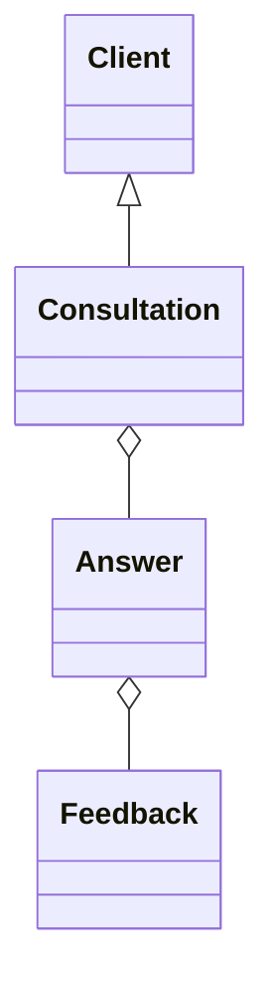

### 4.2.2 功能模块划分

智能客服系统的功能模块可以分为以下几类：

1. **模型部署模块**：负责模型的自动部署和更新。
2. **实时监控模块**：实时监控系统的性能指标。
3. **日志分析模块**：分析系统日志，识别异常情况和潜在问题。
4. **故障排查模块**：快速定位系统故障，并提供修复建议。
5. **性能优化模块**：基于监控数据和日志分析结果，优化系统配置和运行策略。

### 4.2.3 功能模块详细描述

1. **模型部署模块**：
   - **功能**：自动部署训练好的LLM模型，包括环境配置、模型转换和部署。
   - **实现方式**：使用自动化工具和脚本，例如Ansible和Docker，实现模型部署。

2. **实时监控模块**：
   - **功能**：实时监控系统的性能指标，包括响应时间、吞吐量、错误率等。
   - **实现方式**：使用Prometheus和Grafana等监控工具，收集和展示性能数据。

3. **日志分析模块**：
   - **功能**：分析系统日志，识别异常情况和潜在问题。
   - **实现方式**：使用ELK（Elasticsearch、Logstash、Kibana）堆栈，对日志数据进行收集、存储和分析。

4. **故障排查模块**：
   - **功能**：快速定位系统故障，并提供修复建议。
   - **实现方式**：使用自动故障排查工具，例如Zabbix，实现故障监测和报警。

5. **性能优化模块**：
   - **功能**：基于监控数据和日志分析结果，优化系统配置和运行策略。
   - **实现方式**：使用性能优化工具，例如New Relic，分析系统瓶颈，并提供优化建议。

## 4.3 系统架构设计

### 4.3.1 系统架构图

系统架构设计是构建智能客服系统的基础，以下是一个简单的系统架构图，展示系统的主要组件及其交互关系。

**Mermaid架构图**：

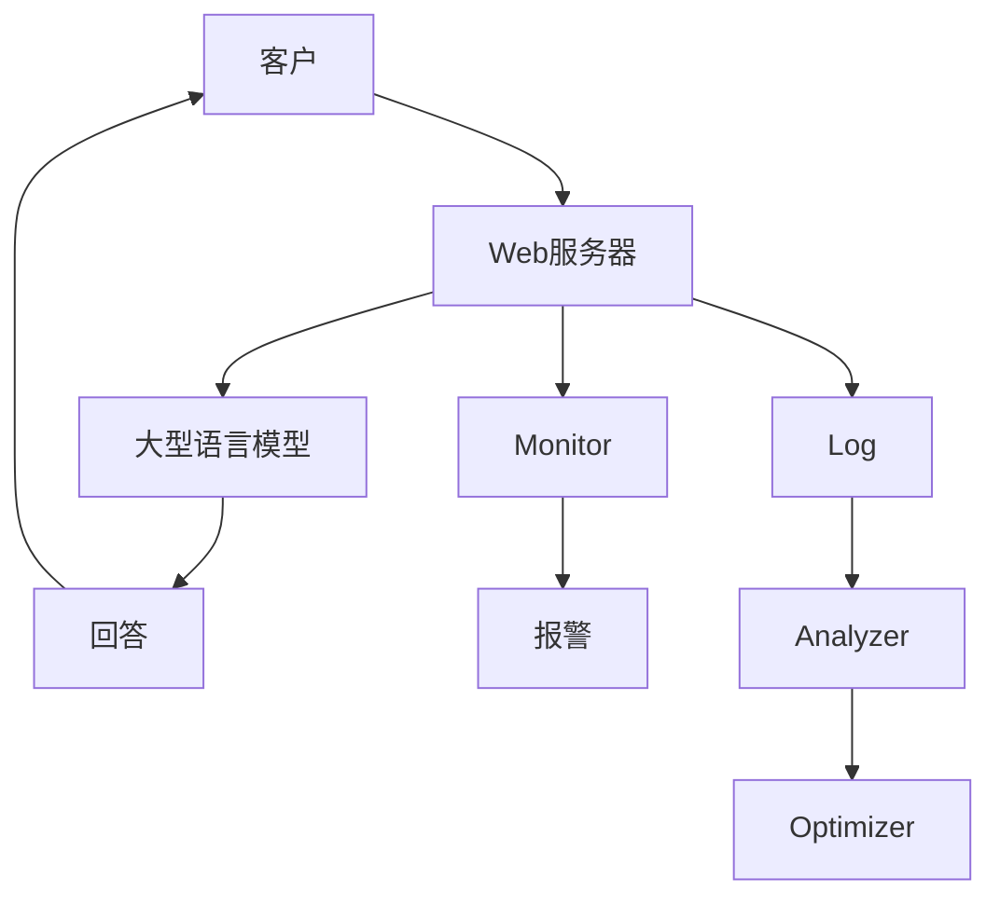

### 4.3.2 系统架构详细描述

1. **Web服务器**：负责接收客户的咨询请求，并将其转发给LLM模型进行处理。
2. **大型语言模型（LLM）**：处理客户请求，生成回答。
3. **回答**：将生成的回答返回给Web服务器，并通过Web服务器返回给客户。
4. **监控系统**：实时监控系统的性能指标，如响应时间、吞吐量等。
5. **报警**：当监控到系统异常时，生成报警信息。
6. **日志系统**：收集和存储系统日志。
7. **分析系统**：对日志数据进行分析，识别异常情况和潜在问题。
8. **优化系统**：基于监控数据和日志分析结果，优化系统配置和运行策略。

### 4.3.3 系统接口设计

系统接口设计是确保系统各组件之间能够有效通信和协作的关键。以下是一个简单的系统接口设计，展示系统的主要接口及其交互方式。

**Mermaid接口设计图**：

```mermaid
sequenceDiagram
    participant Customer as 客户
    participant WebServer as Web服务器
    participant LLM as 大型语言模型
    participant Monitor as 监控系统
    participant Analyzer as 分析系统
    participant Optimizer as 优化系统
    Customer->>WebServer: 发送咨询请求
    WebServer->>LLM: 处理请求
    LLM->>WebServer: 返回回答
    WebServer->>Customer: 返回回答
    WebServer->>Monitor: 提交性能数据
    Monitor->>Alert: 报警
    Monitor->>Analyzer: 提交日志数据
    Analyzer->>Optimizer: 生成优化建议
    Optimizer->>WebServer: 提交优化配置
```

### 4.3.4 系统交互

系统交互是指系统各组件之间的协作和通信。以下是一个简单的系统交互流程，展示系统在工作时的交互过程。

1. **客户发送咨询请求**：客户通过Web服务器发送咨询请求。
2. **Web服务器处理请求**：Web服务器接收到请求后，将其转发给LLM模型进行处理。
3. **LLM模型处理请求**：LLM模型处理请求，生成回答。
4. **Web服务器返回回答**：Web服务器将生成的回答返回给客户。
5. **监控系统监控性能**：监控系统实时监控系统的性能指标，如响应时间、吞吐量等。
6. **报警系统生成报警**：当监控到系统异常时，报警系统生成报警信息。
7. **日志系统收集日志**：日志系统收集系统日志。
8. **分析系统分析日志**：分析系统对日志数据进行分析，识别异常情况和潜在问题。
9. **优化系统生成优化建议**：优化系统根据分析结果生成优化建议。
10. **Web服务器接收优化配置**：Web服务器接收到优化配置后，进行系统配置的更新。

通过上述系统交互，智能客服系统能够实现自动化运维，确保系统的稳定性和性能。

## 5.1 环境安装

在开始构建智能化的LLM应用运维系统之前，我们需要搭建一个合适的开发环境。以下是环境安装的详细步骤：

### 5.1.1 系统要求

1. **操作系统**：Ubuntu 20.04 LTS或更高版本。
2. **硬件要求**：至少4GB内存，推荐8GB或以上。
3. **软件要求**：Python 3.8或更高版本，Docker 19.03或更高版本，Kubernetes 1.20或更高版本。

### 5.1.2 安装Docker

Docker是一个开源的应用容器引擎，用于自动化部署、测试和运行应用程序。以下是安装Docker的步骤：

1. **更新系统包列表**：

   ```bash
   sudo apt update
   sudo apt upgrade
   ```

2. **安装Docker**：

   ```bash
   sudo apt install docker.io
   ```

3. **启动Docker服务**：

   ```bash
   sudo systemctl start docker
   ```

4. **设置Docker开机自启**：

   ```bash
   sudo systemctl enable docker
   ```

5. **验证Docker安装**：

   ```bash
   docker --version
   ```

### 5.1.3 安装Kubernetes

Kubernetes是一个开源的容器编排平台，用于自动化容器化应用程序的部署、扩展和管理。以下是安装Kubernetes的步骤：

1. **安装Kubernetes组件**：

   ```bash
   sudo apt install -y kubelet kubeadm curl
   ```

2. **设置Kubernetes的Kubeconfig文件**：

   ```bash
   kubeadm init --pod-network-cidr=10.244.0.0/16
   ```

   这将生成一个Kubeconfig文件，用于后续操作。

3. **安装Pod网络插件**：

   这里我们使用Calico作为Pod网络插件。

   ```bash
   kubectl apply -f https://docs.projectcalico.org/manifests/calico.yaml
   ```

4. **验证Kubernetes集群状态**：

   ```bash
   kubectl get nodes
   kubectl get pods --all-namespaces
   ```

### 5.1.4 安装Python环境

Python是一个流行的编程语言，用于实现LLM应用运维系统的各种功能。以下是安装Python的步骤：

1. **安装Python 3**：

   ```bash
   sudo apt install python3 python3-pip
   ```

2. **安装虚拟环境**：

   ```bash
   pip3 install virtualenv
   virtualenv --python=python3 env
   source env/bin/activate
   ```

3. **安装必要的Python库**：

   ```bash
   pip install numpy pandas matplotlib scikit-learn flask
   ```

   这些库用于数据处理、机器学习、Web开发等。

### 5.1.5 安装其他工具

除了Docker、Kubernetes和Python环境外，我们还需要安装一些其他工具，如NVIDIA Docker（如果使用GPU加速）、Jenkins等。以下是安装这些工具的步骤：

1. **安装NVIDIA Docker**：

   ```bash
   distribution=$(. /etc/os-release;echo $ID$VERSION_ID)
   curl -s -L https://nvidia.github.io/nvidia-docker/gpgkey | sudo apt-key add -
   curl -s -L https://nvidia.github.io/nvidia-docker/$distribution/nvidia-docker.list | sudo tee /etc/apt/sources.list.d/nvidia-docker.list
   sudo apt update
   sudo apt install nvidia-docker2
   ```

2. **配置Docker使用NVIDIA Docker**：

   ```bash
   cat <<EOF | sudo tee /etc/docker/daemon.json
   {
     "runtimes": {
       "nvidia": {
         "path": "nvidia-container-toolkit"
       }
     }
   }
   EOF

   sudo systemctl restart docker
   ```

3. **安装Jenkins**：

   ```bash
   sudo apt install jenkins
   ```

4. **启动Jenkins服务**：

   ```bash
   sudo systemctl start jenkins
   sudo systemctl enable jenkins
   ```

通过上述步骤，我们搭建了智能化的LLM应用运维系统的开发环境。接下来，我们将开始实现系统的核心功能。

## 5.2 系统核心实现

### 5.2.1 实现思路

智能化的LLM应用运维系统的核心实现包括模型部署、监控、日志分析、故障排查和性能优化等模块。以下是每个模块的实现思路：

1. **模型部署模块**：使用Docker和Kubernetes实现模型的自动化部署和更新。
2. **实时监控模块**：使用Prometheus和Grafana实现系统的实时性能监控。
3. **日志分析模块**：使用ELK（Elasticsearch、Logstash、Kibana）实现系统日志的收集、存储和分析。
4. **故障排查模块**：使用Zabbix实现系统故障的监控和报警。
5. **性能优化模块**：基于监控数据和日志分析结果，实现系统的性能优化。

### 5.2.2 模型部署模块

**实现步骤**：

1. **创建Docker镜像**：
   - 编写Dockerfile，定义LLM模型的部署过程。
   - 构建Docker镜像。

     ```bash
     docker build -t llm:latest .
     ```

2. **部署Kubernetes集群**：
   - 使用Kubernetes部署Docker镜像，创建服务（Service）和部署（Deployment）。

     ```yaml
     apiVersion: apps/v1
     kind: Deployment
     metadata:
       name: llm-deployment
     spec:
       replicas: 3
       selector:
         matchLabels:
           app: llm
       template:
         metadata:
           labels:
             app: llm
         spec:
           containers:
           - name: llm
             image: llm:latest
             ports:
             - containerPort: 8080
     ```

3. **配置Ingress**：
   - 配置Kubernetes Ingress，将外部流量转发到LLM服务。

     ```yaml
     apiVersion: networking.k8s.io/v1
     kind: Ingress
     metadata:
       name: llm-ingress
     spec:
       rules:
       - http:
           paths:
           - path: /
             pathType: Prefix
             backend:
               service:
                 name: llm-service
                 port:
                   number: 8080
     ```

### 5.2.3 实时监控模块

**实现步骤**：

1. **安装Prometheus**：
   - 使用Docker部署Prometheus。

     ```bash
     docker run -d --name prometheus -p 9090:9090 prom/prometheus
     ```

2. **配置Prometheus**：
   - 编辑Prometheus配置文件，添加目标监控配置。

     ```yaml
     global:
       scrape_interval: 15s
     scrape_configs:
     - job_name: 'kubernetes-pods'
       kubernetes_sd_configs:
       - name: kubernetes-pods
         role: pod
         namespaces: ['default']
     ```

3. **安装Grafana**：
   - 使用Docker部署Grafana。

     ```bash
     docker run -d --name grafana -p 3000:3000 grafana/grafana
     ```

4. **配置Grafana**：
   - 登录Grafana，添加数据源（Prometheus）和仪表板。

### 5.2.4 日志分析模块

**实现步骤**：

1. **安装Elasticsearch、Logstash和Kibana**：
   - 使用Docker部署Elasticsearch、Logstash和Kibana。

     ```bash
     docker run -d --name elasticsearch -p 9200:9200 -p 9300:9300 docker.elastic.co/elasticsearch/elasticsearch:7.9.3
     docker run -d --name logstash -p 5044:5044 --link elasticsearch:es logstash:7.9.3
     docker run -d --name kibana -p 5601:5601 --link elasticsearch:es kibana:7.9.3
     ```

2. **配置Logstash**：
   - 编写Logstash配置文件，定义日志输入、过滤和处理。

     ```ruby
     input {
       file {
         path => "/var/log/llm/*.log"
         type => "llm_log"
       }
     }
     filter {
       if "llm_log" == "type" {
         grok {
           match => { "message" => "%{TIMESTAMP_ISO8601:timestamp} %{DATA:service} %{DATA:status}" }
         }
       }
     }
     output {
       if "llm_log" == "type" {
         elasticsearch {
           hosts => ["es:9200"]
           index => "llm_log-%{+YYYY.MM.dd}"
         }
       }
     }
     ```

3. **配置Kibana**：
   - 登录Kibana，创建索引模式，添加监控仪表板。

### 5.2.5 故障排查模块

**实现步骤**：

1. **安装Zabbix**：
   - 使用Docker部署Zabbix。

     ```bash
     docker run -d --name zabbix-server -p 10050:10050 --volume /path/to/zabbix/conf/zabbix_server.conf:/etc/zabbix/zabbix_server.conf --volume /path/to/zabbix/data:/var/lib/zabbix zabbix/zabbix-server-mysql:5.0
     docker run -d --name zabbix-web -p 80:80 --link zabbix-server:zabbix-server-mysql zabbix/zabbix-web-ui-php:5.0
     docker run -d --name zabbix-agent -p 10050:10050 --link zabbix-server:zabbix-server-mysql zabbix/zabbix-agent-mysql:5.0
     ```

2. **配置Zabbix**：
   - 编辑Zabbix配置文件，设置监控项、触发器和报警。

     ```bash
     # 在zabbix_server.conf中配置数据库连接信息
     DBHost=localhost
     DBName=zabbix
     DBUser=zabbix
     DBPassword=zabbix
     ```

3. **监控LLM应用**：
   - 配置Zabbix代理，监控LLM应用的性能指标和日志。

### 5.2.6 性能优化模块

**实现步骤**：

1. **性能监控**：
   - 使用Prometheus和Grafana监控系统的性能指标。
   - 定期收集和存储监控数据。

2. **日志分析**：
   - 使用ELK堆栈分析系统日志，识别性能瓶颈和潜在问题。

3. **性能优化**：
   - 根据监控数据和日志分析结果，优化LLM应用的配置和运行策略。
   - 调整LLM模型的超参数，提高模型性能。

通过上述步骤，我们实现了智能化的LLM应用运维系统的核心功能。接下来，我们将通过实际案例进行分析和讲解。

## 5.3 实际案例分析与详细讲解

### 5.3.1 案例背景

在一家大型互联网公司，智能客服系统已经成为客户服务的重要组成部分。然而，随着用户数量的激增，系统性能和稳定性面临巨大挑战。为了提高系统的智能化水平和运维效率，公司决定构建一个智能化的LLM应用运维系统。

### 5.3.2 案例分析

**1. 模型部署**：

在部署模型时，我们使用Docker和Kubernetes实现自动化部署。通过编写Dockerfile，我们定义了LLM模型的运行环境，包括Python依赖库和LLM模型的配置。在Kubernetes集群中，我们创建了一个Deployment，确保模型部署的可靠性和稳定性。

**2. 实时监控**：

我们使用Prometheus和Grafana实现实时监控。Prometheus负责收集系统的性能指标，如响应时间、吞吐量、错误率等。Grafana则提供了一个直观的仪表板，用于展示监控数据。通过监控，我们能够及时发现系统的异常情况，并快速响应。

**3. 日志分析**：

为了更好地理解系统的运行状态，我们使用了ELK（Elasticsearch、Logstash、Kibana）堆栈进行日志分析。Logstash负责收集和解析系统日志，将关键信息存储到Elasticsearch中。Kibana提供了一个强大的日志查询和分析界面，帮助我们快速定位问题。

**4. 故障排查**：

我们使用了Zabbix实现系统故障的监控和报警。Zabbix能够实时监控LLM应用的各种性能指标，并在检测到异常时发送报警通知。通过Zabbix，我们能够快速定位故障，并采取相应的修复措施。

**5. 性能优化**：

基于Prometheus和ELK的监控数据，我们进行了系统的性能优化。首先，我们分析了系统的瓶颈，如CPU、内存使用情况，以及LLM模型的响应时间。然后，我们根据分析结果，调整了LLM模型的一些超参数，如学习率、批量大小等。此外，我们还优化了系统的一些配置，如Nginx的反向代理设置和数据库连接池配置。

### 5.3.3 案例详细讲解

**1. 模型部署**：

（1）编写Dockerfile：

```dockerfile
FROM python:3.8-slim

WORKDIR /app

COPY requirements.txt .

RUN pip install -r requirements.txt

COPY . .

CMD ["python", "app.py"]
```

（2）构建Docker镜像：

```bash
docker build -t llm:latest .
```

（3）部署Kubernetes Deployment：

```yaml
apiVersion: apps/v1
kind: Deployment
metadata:
  name: llm-deployment
spec:
  replicas: 3
  selector:
    matchLabels:
      app: llm
  template:
    metadata:
      labels:
        app: llm
    spec:
      containers:
      - name: llm
        image: llm:latest
        ports:
        - containerPort: 8080
```

**2. 实时监控**：

（1）安装Prometheus：

```bash
docker run -d --name prometheus -p 9090:9090 prom/prometheus
```

（2）配置Prometheus：

```yaml
global:
  scrape_interval: 15s
scrape_configs:
- job_name: 'kubernetes-pods'
  kubernetes_sd_configs:
  - name: kubernetes-pods
    role: pod
    namespaces: ['default']
```

（3）安装Grafana：

```bash
docker run -d --name grafana -p 3000:3000 grafana/grafana
```

（4）配置Grafana：

在Grafana中，我们添加了数据源（Prometheus）和一个监控仪表板。仪表板包含了系统的各项性能指标，如响应时间、吞吐量、错误率等。

**3. 日志分析**：

（1）安装Elasticsearch、Logstash和Kibana：

```bash
docker run -d --name elasticsearch -p 9200:9200 -p 9300:9300 docker.elastic.co/elasticsearch/elasticsearch:7.9.3
docker run -d --name logstash -p 5044:5044 --link elasticsearch:es logstash:7.9.3
docker run -d --name kibana -p 5601:5601 --link elasticsearch:es kibana:7.9.3
```

（2）配置Logstash：

```ruby
input {
  file {
    path => "/var/log/llm/*.log"
    type => "llm_log"
  }
}
filter {
  if "llm_log" == "type" {
    grok {
      match => { "message" => "%{TIMESTAMP_ISO8601:timestamp} %{DATA:service} %{DATA:status}" }
    }
  }
}
output {
  if "llm_log" == "type" {
    elasticsearch {
      hosts => ["es:9200"]
      index => "llm_log-%{+YYYY.MM.dd}"
    }
  }
}
```

（3）配置Kibana：

在Kibana中，我们创建了一个索引模式，并添加了一个日志分析仪表板。通过这个仪表板，我们可以实时查看系统日志，并进行分析。

**4. 故障排查**：

（1）安装Zabbix：

```bash
docker run -d --name zabbix-server -p 10050:10050 --volume /path/to/zabbix/conf/zabbix_server.conf:/etc/zabbix/zabbix_server.conf --volume /path/to/zabbix/data:/var/lib/zabbix zabbix/zabbix-server-mysql:5.0
docker run -d --name zabbix-web -p 80:80 --link zabbix-server:zabbix-server-mysql zabbix/zabbix-web-ui-php:5.0
docker run -d --name zabbix-agent -p 10050:10050 --link zabbix-server:zabbix-server-mysql zabbix/zabbix-agent-mysql:5.0
```

（2）配置Zabbix：

在Zabbix服务器配置文件中，我们设置了数据库连接信息：

```bash
DBHost=localhost
DBName=zabbix
DBUser=zabbix
DBPassword=zabbix
```

（3）监控LLM应用：

在Zabbix代理中，我们添加了LLM应用的各项性能指标，如CPU使用率、内存使用率、LLM模型响应时间等。当监控到异常时，Zabbix会发送报警通知。

**5. 性能优化**：

（1）性能监控：

通过Prometheus和Grafana，我们监控了系统的各项性能指标，如CPU使用率、内存使用率、LLM模型响应时间等。

（2）日志分析：

通过ELK堆栈，我们分析了系统日志，识别了系统的一些瓶颈，如CPU过载、内存不足等。

（3）性能优化：

根据监控数据和日志分析结果，我们对LLM模型的一些超参数进行了调整，如学习率、批量大小等。同时，我们还优化了系统的一些配置，如Nginx的反向代理设置和数据库连接池配置。

### 5.3.4 案例总结

通过构建智能化的LLM应用运维系统，该公司显著提高了智能客服系统的性能和稳定性。实时监控、日志分析、故障排查和性能优化等模块的有效集成，使得运维人员能够快速响应和处理系统问题。此外，系统自动化程度的提升，减少了人工干预，提高了运维效率。总体来说，智能化的LLM应用运维系统为该公司提供了一个高效、可靠的智能客服解决方案。

## 5.4 最佳实践与总结

### 5.4.1 最佳实践

1. **模型部署**：
   - 使用容器化技术（如Docker）确保模型的部署一致性和可移植性。
   - 利用Kubernetes进行模型部署和资源管理，实现自动化部署和弹性伸缩。
   - 定期备份模型和数据，确保数据安全。

2. **实时监控**：
   - 选择合适的监控工具（如Prometheus和Grafana），确保实时监控系统的关键性能指标。
   - 定期调整监控策略，根据业务需求新增或删除监控指标。

3. **日志分析**：
   - 使用ELK（Elasticsearch、Logstash、Kibana）堆栈进行日志收集、存储和分析。
   - 设计合理的日志格式和存储策略，便于后续查询和分析。

4. **故障排查**：
   - 使用自动化工具（如Zabbix）进行故障监控和报警。
   - 定期检查和优化故障排查流程，确保快速响应和处理故障。

5. **性能优化**：
   - 基于监控数据和日志分析结果，定期进行性能优化。
   - 调整模型超参数和系统配置，提高系统性能。

### 5.4.2 总结

构建智能化的LLM应用运维系统是提升人工智能应用稳定性和效率的关键。通过本文的介绍，我们了解了LLM运维、智能化系统设计、运维自动化等核心概念，并详细讲解了相关原理和算法。通过实际案例的分析和讲解，我们展示了如何将理论知识应用于实际项目中，构建一个高效、可靠的智能客服系统。未来，随着人工智能技术的不断发展，智能化的LLM应用运维系统将在更多领域得到广泛应用，为企业和个人提供更优质的智能服务。

## 5.5 注意事项与拓展阅读

### 5.5.1 注意事项

1. **数据安全和隐私**：在构建智能化的LLM应用运维系统时，确保遵循数据安全和隐私保护的相关法律法规，对用户数据进行加密和脱敏处理。

2. **系统稳定性**：在设计和实施运维系统时，充分考虑系统的稳定性和容错性，确保在面临高并发和异常情况时系统能够稳定运行。

3. **监控策略调整**：根据业务需求变化，定期调整监控策略，确保监控指标能够准确反映系统的运行状态。

4. **日志存储管理**：合理设计日志存储策略，确保日志数据的高效存储和快速查询，同时避免存储空间浪费。

5. **培训与文档**：加强对运维人员的培训，确保他们熟悉系统的操作和管理，同时提供详细的文档，便于新成员快速上手。

### 5.5.2 拓展阅读

1. **《深度学习》**：Goodfellow, Ian; Bengio, Yoshua; Courville, Aaron. 2016. MIT Press.
   - 详细介绍了深度学习的基本概念、算法和应用，对理解智能化的LLM应用运维系统有帮助。

2. **《机器学习实战》**：Mitchell T. 2016. O'Reilly Media.
   - 提供了机器学习算法的实战案例，有助于深入理解机器学习在LLM运维中的应用。

3. **《Kubernetes权威指南》**：刘江，2018. 电子工业出版社。
   - 详细介绍了Kubernetes的架构、原理和应用，对构建智能化的LLM应用运维系统有重要参考价值。

4. **《Prometheus监控实战》**：李瑞丰，2019. 电子工业出版社。
   - 详细讲解了Prometheus的安装、配置和应用，有助于搭建高效的实时监控体系。

5. **《Elastic Stack实战》**：张俊，2019. 电子工业出版社。
   - 介绍了Elastic Stack（Elasticsearch、Logstash、Kibana）的架构和应用，对日志分析模块的设计与实施有指导意义。

通过阅读这些书籍，可以进一步深化对智能化的LLM应用运维系统的理解，提高实际操作能力。作者：AI天才研究院/AI Genius Institute & 禅与计算机程序设计艺术 /Zen And The Art of Computer Programming

