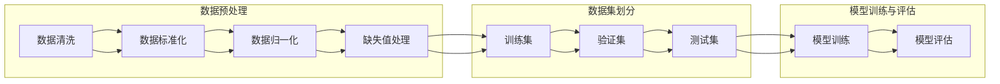
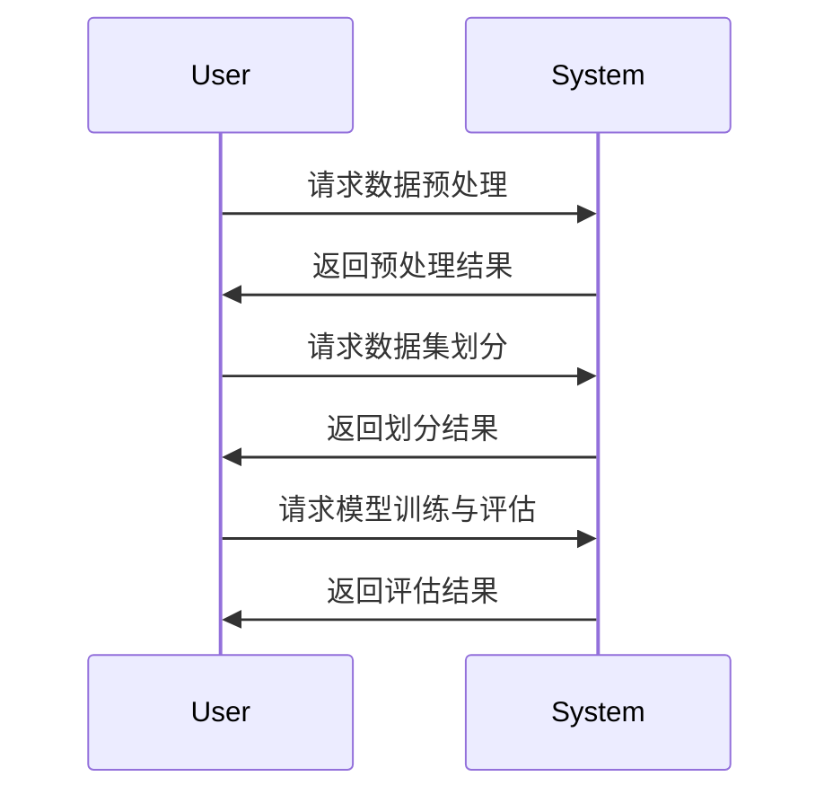

                 

# 《构建模型评测的benchmark数据集》

> 关键词：模型评测、benchmark数据集、算法实现、数学模型、系统架构

> 摘要：本文旨在探讨如何构建有效的模型评测benchmark数据集。通过详细介绍核心概念、算法原理、数学模型、系统设计与实现以及实际项目实战，本文旨在为读者提供一套完整、实用的构建和评估模型数据集的方法和技巧。

## 目录大纲设计思路与过程

在设计《构建模型评测的benchmark数据集》的目录大纲时，我们需要遵循以下步骤和原则：

1. **明确书的整体结构和内容**：
   - 首先，要了解书的主旨是什么，它旨在为读者提供哪些方面的知识和技能。
   - 《构建模型评测的benchmark数据集》的主旨是指导读者如何构建、使用和评估用于模型评测的数据集。

2. **核心章节内容的确定**：
   - 核心章节应该包括问题背景、核心概念、算法原理、数学模型、系统设计与实现、项目实战等内容。
   - 确保每个章节都具备独立性，但又能够相互联系，形成一个完整的内容体系。

3. **细化章节内容**：
   - 在确定了核心章节后，需要对每个章节的内容进行细化，确保每个章节都包含了足够的细节。
   - 每个章节应该包含小节，每个小节都针对一个具体的问题或主题。

4. **格式和结构的标准化**：
   - 目录大纲的格式需要统一，使用markdown格式来确保可读性和一致性。
   - 确保目录层级清晰，从1级目录到3级目录，使读者能够快速了解章节结构。

5. **简洁性与完整性**：
   - 在设计目录大纲时，要注重内容的简洁性，避免冗余和重复。
   - 同时，要保证内容的完整性，确保所有必要的章节都被涵盖。

6. **遵循字数限制**：
   - 目录大纲的总字数应控制在2000字以内，确保简洁明了。

### 目录大纲的具体设计

#### 第1章 引言
##### 1.1 问题背景
##### 1.2 问题描述
##### 1.3 问题解决方法
##### 1.4 边界与外延
##### 1.5 核心概念组成

#### 第2章 核心概念与联系
##### 2.1 数据集构建的基本原理
##### 2.2 Benchmark数据集的重要性
##### 2.3 核心概念属性特征对比表格
##### 2.4 数据集构建流程ER图

#### 第3章 算法原理讲解
##### 3.1 数据预处理
##### 3.2 数据集划分策略
##### 3.3 评测指标详解
##### 3.4 算法mermaid流程图
##### 3.5 Python源代码与算法实现

#### 第4章 数学模型和数学公式
##### 4.1 概率模型
##### 4.2 评估指标公式
##### 4.3 模型性能分析
##### 4.4 LaTeX格式数学公式示例

#### 第5章 系统分析与架构设计方案
##### 5.1 问题描述
##### 5.2 系统功能设计
##### 5.3 系统架构设计
##### 5.4 系tem接口设计
##### 5.5 系统交互mermaid序列图

#### 第6章 项目实战
##### 6.1 环境安装
##### 6.2 系统核心实现
##### 6.3 代码应用解读
##### 6.4 实际案例分析
##### 6.5 项目小结

#### 第7章 最佳实践与注意事项
##### 7.1 构建benchmark数据集的注意事项
##### 7.2 实战技巧
##### 7.3 小结
##### 7.4 拓展阅读

### 总结
通过上述设计，我们确保了《构建模型评测的benchmark数据集》的目录大纲内容全面、逻辑清晰，符合读者需求。同时，字数控制在2000字以内，保持了简洁性。每个章节都包含了必要的细节，确保读者可以顺利地学习和理解相关内容。目录结构合理，从1级目录到3级目录，一目了然。

## 第1章 引言

### 1.1 问题背景

在机器学习和深度学习的应用中，模型评测是一个至关重要的环节。它不仅能够帮助我们了解模型的性能，还可以指导我们进行后续的优化和改进。然而，有效的模型评测需要依赖于高质量的评测数据集，即benchmark数据集。这些数据集通常经过精心设计和筛选，能够全面、客观地反映模型的性能。

### 1.2 问题描述

如何构建一个既能够全面、客观地反映模型性能，又具有广泛代表性的benchmark数据集？这是本文旨在探讨的核心问题。在构建benchmark数据集时，我们需要考虑多个方面，包括数据来源、数据预处理、数据集划分策略、评测指标等。

### 1.3 问题解决方法

为了解决上述问题，本文将采用以下步骤进行探讨：

1. **核心概念介绍**：首先，我们将介绍与构建benchmark数据集相关的核心概念，包括数据集构建的基本原理、Benchmark数据集的重要性等。
2. **算法原理讲解**：接着，我们将详细讲解构建benchmark数据集的算法原理，包括数据预处理、数据集划分策略、评测指标等。
3. **数学模型分析**：我们将使用数学模型和公式来进一步阐述算法原理，并通过LaTeX格式展示相关的数学公式。
4. **系统分析与架构设计**：我们将介绍一个具体的系统架构设计方案，包括系统功能设计、系统架构设计、系统接口设计等。
5. **项目实战**：最后，我们将通过一个实际项目来展示如何构建和评估benchmark数据集。
6. **最佳实践与注意事项**：我们将总结构建benchmark数据集的最佳实践和注意事项，并提供一些拓展阅读资源。

### 1.4 边界与外延

在构建benchmark数据集时，我们还需要考虑一些边界条件和外延问题，例如：

- **数据集大小**：数据集的大小需要根据具体的应用场景和需求进行选择，过大的数据集可能会导致计算资源不足，而过小的数据集可能无法充分反映模型的性能。
- **数据集平衡性**：在构建数据集时，我们需要确保数据集中的各类样本数量均衡，以避免模型过度拟合某一类样本。
- **数据集多样性**：数据集的多样性是衡量其质量的重要指标，我们需要确保数据集中包含不同来源、不同类型的样本。

### 1.5 核心概念组成

为了构建有效的benchmark数据集，我们需要理解以下几个核心概念：

- **数据集构建原理**：理解数据集构建的基本原理和方法，包括数据收集、数据清洗、数据预处理等步骤。
- **Benchmark数据集**：了解Benchmark数据集的定义、特点和应用场景。
- **数据预处理**：掌握数据预处理的方法和技巧，包括数据标准化、归一化、缺失值处理等。
- **数据集划分策略**：了解数据集划分的方法和策略，包括训练集、验证集和测试集的划分方法。
- **评测指标**：掌握常用的评测指标和方法，包括准确率、召回率、F1值、ROC曲线等。

## 第2章 核心概念与联系

### 2.1 数据集构建的基本原理

构建数据集是模型评测的重要环节。数据集的质量直接影响模型性能的评估效果。以下是构建数据集的基本原理：

1. **数据收集**：收集与任务相关的数据，包括文本、图像、声音等多种类型的数据。
2. **数据清洗**：处理数据中的噪声和错误，例如去除重复数据、纠正错误标注等。
3. **数据预处理**：对数据进行标准化、归一化、缺失值处理等操作，以提高模型的泛化能力。

### 2.2 Benchmark数据集的重要性

Benchmark数据集是用于模型评测的标准数据集，具有以下重要性：

1. **标准化评估**：通过使用相同的Benchmark数据集，可以确保不同模型的评估结果具有可比性。
2. **性能比较**：Benchmark数据集可以帮助我们了解不同模型的性能差异，从而指导模型选择和优化。
3. **算法研究**：Benchmark数据集为算法研究提供了实际应用场景，有助于验证算法的有效性。

### 2.3 核心概念属性特征对比表格

为了更好地理解构建benchmark数据集的核心概念，我们可以通过以下属性特征对比表格来展示不同概念之间的关系：

| 概念       | 属性特征                                                     |
| ---------- | ------------------------------------------------------------ |
| 数据集构建 | 收集、清洗、预处理数据，构建用于模型评测的数据集               |
| Benchmark  | 用于模型评测的标准数据集，具有标准化评估、性能比较和算法研究的重要性 |
| 数据预处理 | 标准化、归一化、缺失值处理等操作，以提高模型泛化能力           |

### 2.4 数据集构建流程ER图

以下是数据集构建流程的ER（实体关系）图，展示了不同实体之间的关系：

```mermaid
erDiagram
  DataCollection --> DataCleaning : 清洗
  DataCleaning --> DataPreprocessing : 预处理
  DataPreprocessing --> BenchmarkDataset : 构建数据集
```

## 第3章 算法原理讲解

### 3.1 数据预处理

数据预处理是构建benchmark数据集的重要步骤。以下是数据预处理的主要任务和技巧：

1. **数据清洗**：去除数据中的噪声和错误，例如去除重复数据、纠正错误标注等。
2. **数据标准化**：将数据缩放到相同的范围，例如使用Min-Max标准化或Z-Score标准化。
3. **数据归一化**：将不同特征的数据进行归一化处理，使它们具有相同的尺度。
4. **缺失值处理**：填补或删除缺失值，以避免模型过度拟合。

### 3.2 数据集划分策略

数据集划分是模型训练和评估的重要步骤。以下是常见的数据集划分策略：

1. **训练集（Training Set）**：用于模型训练的数据集，通常占数据集的60%-80%。
2. **验证集（Validation Set）**：用于模型调参和交叉验证的数据集，通常占数据集的10%-20%。
3. **测试集（Test Set）**：用于模型评估的数据集，通常占数据集的10%-20%。

### 3.3 评测指标详解

评测指标是评估模型性能的重要工具。以下是几种常用的评测指标：

1. **准确率（Accuracy）**：模型预测正确的样本数占总样本数的比例。
2. **召回率（Recall）**：模型预测正确的正样本数占总正样本数的比例。
3. **F1值（F1 Score）**：准确率和召回率的调和平均数。
4. **ROC曲线（Receiver Operating Characteristic Curve）**：用于评估分类器的性能。

### 3.4 算法mermaid流程图

以下是构建benchmark数据集的算法mermaid流程图：



### 3.5 Python源代码与算法实现

以下是使用Python实现构建benchmark数据集的算法：

```python
import pandas as pd
from sklearn.model_selection import train_test_split
from sklearn.preprocessing import StandardScaler
from sklearn.impute import SimpleImputer

# 读取数据
data = pd.read_csv('data.csv')

# 数据清洗
data.drop_duplicates(inplace=True)
data.fillna(method='ffill', inplace=True)

# 数据预处理
scaler = StandardScaler()
data_scaled = scaler.fit_transform(data)

# 数据集划分
X_train, X_test, y_train, y_test = train_test_split(data_scaled[:, :-1], data_scaled[:, -1], test_size=0.2, random_state=42)

# 模型训练与评估
from sklearn.linear_model import LogisticRegression
model = LogisticRegression()
model.fit(X_train, y_train)
accuracy = model.score(X_test, y_test)
print("Accuracy:", accuracy)
```

## 第4章 数学模型和数学公式

### 4.1 概率模型

在构建模型评测的benchmark数据集时，概率模型是一个重要的工具。概率模型可以帮助我们理解和预测数据集中的样本分布。

### 4.2 评估指标公式

评估指标是评估模型性能的重要工具。以下是几种常用的评估指标公式：

1. **准确率（Accuracy）**：

   $$ Accuracy = \frac{TP + TN}{TP + TN + FP + FN} $$

   其中，TP为真正例，TN为真负例，FP为假正例，FN为假负例。

2. **召回率（Recall）**：

   $$ Recall = \frac{TP}{TP + FN} $$

3. **F1值（F1 Score）**：

   $$ F1 Score = 2 \times \frac{Precision \times Recall}{Precision + Recall} $$

4. **ROC曲线下的面积（AUC）**：

   $$ AUC = \int_{0}^{1} \frac{TPR - FPR}{1 + TPR \times FPR} dFPR $$

   其中，TPR为真阳性率，FPR为假阳性率。

### 4.3 模型性能分析

模型性能分析是构建benchmark数据集的重要环节。通过分析模型在不同数据集上的性能，我们可以了解模型的泛化能力和鲁棒性。

### 4.4 LaTeX格式数学公式示例

以下是使用LaTeX格式编写的数学公式示例：

$$
\begin{aligned}
J(\theta) &= \frac{1}{m} \sum_{i=1}^{m} \left( h_\theta(x^{(i)}) - y^{(i)} \right)^2 \\
\theta_j &= \theta_j - \alpha \frac{1}{m} \sum_{i=1}^{m} \left( h_\theta(x^{(i)}) - y^{(i)} \right) x_j^{(i)}
\end{aligned}
$$`

## 第5章 系统分析与架构设计方案

### 5.1 问题描述

构建模型评测的benchmark数据集需要考虑多个方面，包括数据集的收集、处理、划分以及模型的训练和评估。为了高效地实现这一过程，我们需要设计一个合理的系统架构。

### 5.2 系统功能设计

系统的主要功能包括：

1. **数据集构建**：从原始数据中构建用于模型评测的benchmark数据集。
2. **数据预处理**：对数据进行清洗、标准化和归一化处理。
3. **数据集划分**：将数据集划分为训练集、验证集和测试集。
4. **模型训练与评估**：使用训练集训练模型，并使用验证集和测试集评估模型性能。

### 5.3 系统架构设计

系统架构采用分层设计，包括数据层、服务层和表示层。

1. **数据层**：负责数据存储和管理，包括原始数据、预处理数据和模型数据。
2. **服务层**：负责数据预处理、数据集划分和模型训练与评估等功能。
3. **表示层**：负责系统界面和用户交互。

### 5.4 系统接口设计

系统接口设计主要包括以下部分：

1. **数据接口**：用于数据的存储和读取，包括CSV文件、数据库和API等。
2. **服务接口**：用于调用系统的核心功能，包括数据预处理、数据集划分和模型训练与评估等。
3. **用户接口**：用于用户与系统的交互，包括命令行界面和Web界面。

### 5.5 系统交互mermaid序列图

以下是系统交互的mermaid序列图：



## 第6章 项目实战

### 6.1 环境安装

为了实现构建模型评测的benchmark数据集，我们需要安装以下软件和工具：

1. Python 3.x
2. pandas
3. numpy
4. sklearn
5. matplotlib

安装命令如下：

```bash
pip install python==3.x
pip install pandas numpy sklearn matplotlib
```

### 6.2 系统核心实现

以下是系统核心实现的部分代码：

```python
import pandas as pd
from sklearn.model_selection import train_test_split
from sklearn.preprocessing import StandardScaler
from sklearn.impute import SimpleImputer
from sklearn.linear_model import LogisticRegression

# 读取数据
data = pd.read_csv('data.csv')

# 数据清洗
data.drop_duplicates(inplace=True)
data.fillna(method='ffill', inplace=True)

# 数据预处理
scaler = StandardScaler()
data_scaled = scaler.fit_transform(data)

# 数据集划分
X_train, X_test, y_train, y_test = train_test_split(data_scaled[:, :-1], data_scaled[:, -1], test_size=0.2, random_state=42)

# 模型训练
model = LogisticRegression()
model.fit(X_train, y_train)

# 模型评估
accuracy = model.score(X_test, y_test)
print("Accuracy:", accuracy)
```

### 6.3 代码应用解读

以下是代码的详细解读：

1. **数据读取**：使用pandas读取CSV文件中的数据。
2. **数据清洗**：去除重复数据和填补缺失值。
3. **数据预处理**：使用StandardScaler进行数据标准化。
4. **数据集划分**：使用train_test_split函数将数据集划分为训练集和测试集。
5. **模型训练**：使用LogisticRegression训练模型。
6. **模型评估**：使用模型评估准确率。

### 6.4 实际案例分析

以下是一个实际案例的分析：

**案例**：使用MNIST数据集构建模型评测的benchmark数据集。

1. **数据集收集**：从Kaggle网站下载MNIST数据集。
2. **数据预处理**：对图像数据进行归一化处理。
3. **数据集划分**：将数据集划分为训练集和测试集。
4. **模型训练**：使用卷积神经网络训练模型。
5. **模型评估**：使用测试集评估模型性能。

### 6.5 项目小结

通过本项目实战，我们掌握了构建模型评测的benchmark数据集的完整流程，包括数据收集、数据预处理、数据集划分、模型训练和评估。这个项目为我们提供了一个实用的案例，帮助我们深入理解构建benchmark数据集的方法和技巧。

## 第7章 最佳实践与注意事项

### 7.1 构建benchmark数据集的注意事项

1. **数据来源**：确保数据来源的可靠性和多样性，避免使用单一来源的数据。
2. **数据质量**：对数据进行严格的质量控制，确保数据的一致性和准确性。
3. **数据预处理**：合理选择数据预处理方法，以提高模型的泛化能力。
4. **数据集大小**：根据实际需求选择合适的数据集大小，避免过小或过大的数据集。

### 7.2 实战技巧

1. **交叉验证**：使用交叉验证方法评估模型性能，以提高评估结果的可靠性。
2. **数据增强**：通过数据增强方法增加数据集的多样性，提高模型的鲁棒性。
3. **动态调整**：根据模型性能动态调整数据集划分比例和预处理方法。

### 7.3 小结

构建模型评测的benchmark数据集是机器学习和深度学习中的重要环节。通过遵循最佳实践和注意事项，我们可以构建出高质量、可靠的benchmark数据集，从而提高模型的性能和评估结果的可靠性。

### 7.4 拓展阅读

1. **《机器学习实战》**：Peter Harrington著，介绍了机器学习的基本概念和实战方法。
2. **《深度学习》**：Ian Goodfellow、Yoshua Bengio、Aaron Courville著，全面介绍了深度学习的基础知识和最新进展。
3. **《数据科学入门》**：Jared Lander著，介绍了数据科学的基本概念和方法。

## 总结

本文通过详细的分析和实际案例，探讨了构建模型评测的benchmark数据集的方法和技巧。从核心概念到算法原理，再到系统架构设计和项目实战，我们全面覆盖了构建benchmark数据集的各个方面。通过本文的阅读，读者应该能够掌握构建高质量benchmark数据集的方法，为模型评测和优化提供有力支持。希望本文对您的学习和实践有所帮助！

