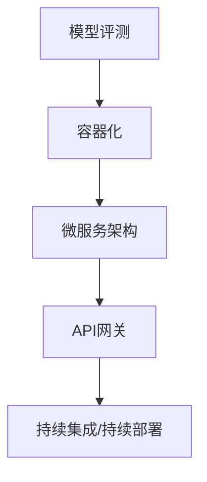
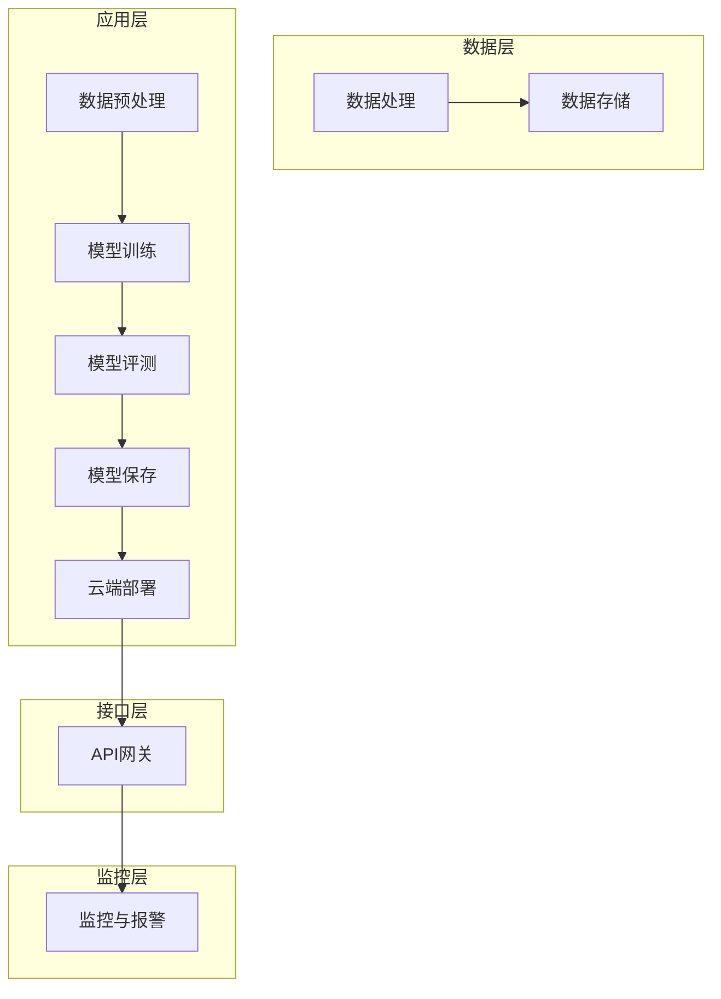
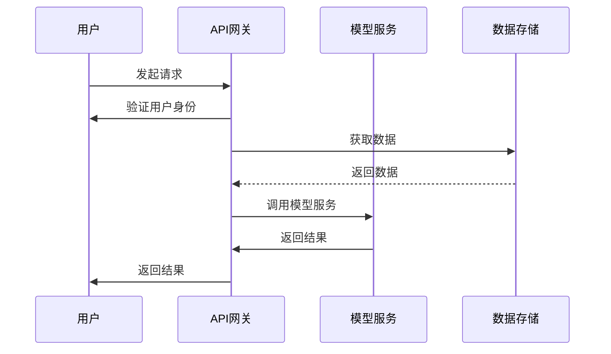
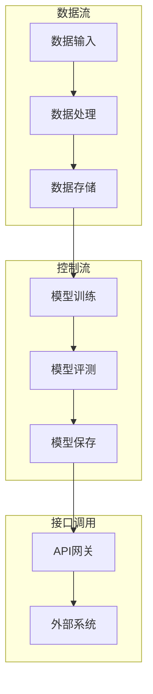

                 

### 文章标题：构建模型评测的云端部署方案

关键词：模型评测、云端部署、算法流程、系统架构、实战案例

摘要：本文将详细探讨模型评测的云端部署方案，包括核心概念介绍、算法原理讲解、系统分析与架构设计，以及实际项目实战。通过一步步的分析和推理，帮助读者深入理解模型评测与云端部署的关键技术，提供实用的最佳实践和注意事项。

----------------------------------------------------------------

## 目录

1. **背景介绍**
   1.1 模型评测的基本概念
   1.2 云端部署的定义与重要性
   1.3 模型评测与云端部署的关系

2. **核心概念与联系**
   2.1 模型评测的关键概念
   2.2 云端部署的关键概念
   2.3 概念关联与关系图

3. **算法原理讲解**
   3.1 模型评测方法
   3.2 云端部署技术

4. **系统分析与架构设计方案**
   4.1 问题场景介绍
   4.2 系统功能设计
   4.3 系统架构设计
   4.4 系统接口设计
   4.5 系统交互与流程图

5. **项目实战**
   5.1 项目介绍
   5.2 环境安装与配置
   5.3 系统核心实现
   5.4 代码应用解读
   5.5 实际案例分析
   5.6 项目小结

6. **最佳实践与总结**
   6.1 最佳实践 tips
   6.2 小结与总结
   6.3 注意事项
   6.4 拓展阅读

----------------------------------------------------------------

### 1. 背景介绍

#### 1.1 模型评测的基本概念

模型评测是机器学习中至关重要的一环，它涉及评估模型在不同数据集上的性能，以确保模型在现实世界中的有效性和可靠性。以下是一些常见的模型评测方法和指标：

- **交叉验证**：通过将数据集分为多个子集，反复训练和验证模型，以减少过拟合和评估模型的泛化能力。
- **混淆矩阵**：展示模型预测结果与实际结果之间的对应关系，用于分析模型对各类别的分类准确率。
- **ROC曲线**：通过调整分类阈值，绘制真阳性率与假阳性率的变化关系，评估模型的分类性能。
- **精确率-召回率曲线**：结合精确率和召回率的变化关系，评估模型在不同阈值下的分类性能。

#### 1.2 云端部署的定义与重要性

云端部署是将训练好的机器学习模型部署到云服务器上，以提供在线服务的一种方式。以下是云端部署的一些核心概念和重要性：

- **云服务器**：提供计算资源和存储服务的远程服务器，可以弹性扩展以满足不同负载需求。
- **API接口**：用于与模型交互的接口，允许客户端请求模型进行预测和分析。
- **容器化**：通过Docker等技术，将模型及其依赖环境打包为可移植的容器，以简化部署过程。

云端部署的重要性在于：

- **可访问性**：模型可以在任何时间、任何地点通过互联网进行访问，提高了模型的可用性和可扩展性。
- **维护成本**：云服务提供商负责管理基础设施和软件更新，降低了维护成本和人力投入。
- **弹性计算**：根据实际负载需求，动态调整计算资源，提高了资源利用率和服务质量。

#### 1.3 模型评测与云端部署的关系

模型评测和云端部署是机器学习项目中的两个关键环节，它们之间存在紧密的联系：

- **模型评测**是模型部署前的必要步骤，通过评估模型在不同数据集上的性能，确保模型具备足够的泛化能力。
- **云端部署**是将评估后的模型应用到实际场景中，实现模型的在线服务和自动化分析。

模型评测的结果直接影响云端部署的成功与否，而云端部署的质量又反过来影响模型评测的准确性。因此，两者需要紧密配合，共同保障机器学习项目的顺利进行。

----------------------------------------------------------------

### 2. 核心概念与联系

#### 2.1 模型评测的关键概念

在模型评测过程中，涉及多个关键概念和指标，以下是对这些概念的定义和作用：

- **准确率**：模型预测正确的样本数占总样本数的比例，用于评估模型的分类能力。
- **精确率**：在所有预测为正类的样本中，实际为正类的比例，用于评估模型的正类预测能力。
- **召回率**：在所有实际为正类的样本中，被模型正确预测为正类的比例，用于评估模型的负类预测能力。
- **F1分数**：精确率和召回率的调和平均，用于综合评估模型的分类性能。

以下是一个对比表格，展示了这些指标之间的区别和联系：

| 指标 | 定义 | 作用 |
| --- | --- | --- |
| 准确率 | 预测正确的样本数/总样本数 | 评估模型的总体分类能力 |
| 精确率 | 预测为正类的正确样本数/预测为正类的总样本数 | 评估模型对正类样本的预测能力 |
| 召回率 | 预测为正类的正确样本数/实际为正类的总样本数 | 评估模型对负类样本的预测能力 |
| F1分数 | 2 * 精确率 * 召回率 / (精确率 + 召回率) | 综合评估模型的分类性能 |

#### 2.2 云端部署的关键概念

云端部署涉及多个关键技术和概念，以下是对这些概念的定义和作用：

- **容器化**：通过将模型和环境打包为容器，实现模型的可移植性和一致性。
- **微服务架构**：将应用程序划分为多个独立的微服务，以提高系统的可扩展性和可靠性。
- **API网关**：作为外部客户端与内部微服务之间的统一接口，实现服务管理和路由。
- **持续集成/持续部署（CI/CD）**：通过自动化工具，实现代码的持续集成和部署，提高开发效率。

以下是一个ER图，展示了这些概念之间的实体关系：

```mermaid
erDiagram
    ModelEvaluation ||--o{ Containerization : 包含
    Containerization ||--o{ MicroservicesArchitecture : 构建
    MicroservicesArchitecture ||--o{ APIGateway : 通信
    APIGateway ||--o{ CI/CD : 支持
```

#### 2.3 概念关联与关系图

模型评测和云端部署中的核心概念之间存在紧密的关联。以下是一个Mermaid流程图，展示了这些概念之间的关联和流程：



通过这个流程图，我们可以清晰地看到模型评测如何通过容器化技术转化为可部署的微服务架构，并通过API网关与CI/CD系统进行集成，最终实现模型的云端部署。

----------------------------------------------------------------

### 3. 算法原理讲解

#### 3.1 模型评测方法

模型评测是确保模型性能的重要步骤，以下将介绍几种常见的模型评测方法：

##### 交叉验证

交叉验证是一种通过将数据集划分为多个子集，反复训练和验证模型的方法。基本步骤如下：

1. 将数据集划分为训练集和验证集。
2. 使用训练集训练模型。
3. 使用验证集评估模型性能。
4. 重复步骤1-3，直到所有子集都被用作验证集。

交叉验证的优点是能够减少过拟合和评估模型的泛化能力。常见的交叉验证方法包括K折交叉验证和留一交叉验证。

##### 混淆矩阵

混淆矩阵是一种展示模型预测结果与实际结果之间对应关系的表格。基本格式如下：

| 实际类别 | 预测类别 |
| --- | --- |
| 正类 | 正确预测 | 错误预测 |
| 负类 | 错误预测 | 正确预测 |

通过混淆矩阵，我们可以计算多个性能指标，如准确率、精确率、召回率和F1分数。

##### ROC曲线

ROC曲线通过调整分类阈值，绘制真阳性率与假阳性率的变化关系。基本步骤如下：

1. 选择不同的分类阈值。
2. 对于每个阈值，计算真阳性率（TPR）和假阳性率（FPR）。
3. 绘制TNR与FNR的对应关系曲线。

ROC曲线的优点是能够直观地比较不同模型的分类性能。

##### 精确率-召回率曲线

精确率-召回率曲线通过绘制精确率和召回率的变化关系，评估模型在不同阈值下的分类性能。基本步骤如下：

1. 选择不同的分类阈值。
2. 对于每个阈值，计算精确率和召回率。
3. 绘制精确率与召回率的对应关系曲线。

精确率-召回率曲线的优点是能够综合考虑模型的分类能力和成本。

#### 3.2 云端部署技术

云端部署是将训练好的模型部署到云服务器上，实现模型在线服务的关键步骤。以下将介绍几种常见的云端部署技术：

##### 容器化

容器化通过将模型和环境打包为容器，实现模型的可移植性和一致性。常见的技术包括Docker和Kubernetes。

- **Docker**：一种轻量级容器化技术，通过将应用程序及其依赖环境打包为镜像，实现一键部署。
- **Kubernetes**：一种容器编排工具，用于管理和自动化容器的部署、扩展和运维。

##### 微服务架构

微服务架构将应用程序划分为多个独立的微服务，以提高系统的可扩展性和可靠性。常见的技术包括Spring Boot和Node.js。

- **Spring Boot**：一种基于Java的微服务开发框架，简化了微服务的开发、部署和运维。
- **Node.js**：一种基于JavaScript的微服务开发平台，具有高性能和低延迟的特点。

##### API网关

API网关作为外部客户端与内部微服务之间的统一接口，实现服务管理和路由。常见的技术包括Apache Kafka和Netflix OSS。

- **Apache Kafka**：一种分布式流处理平台，用于处理高吞吐量的消息和数据。
- **Netflix OSS**：一套开源微服务框架，提供API网关、负载均衡、断路器等组件。

##### 持续集成/持续部署（CI/CD）

持续集成/持续部署通过自动化工具，实现代码的持续集成和部署，提高开发效率。常见的技术包括Jenkins和GitLab CI。

- **Jenkins**：一种开源的持续集成和持续部署工具，支持多种编程语言和平台。
- **GitLab CI**：GitLab自带的一种持续集成和持续部署工具，支持自动化构建、测试和部署。

#### 3.3 数学模型与公式

在模型评测和云端部署过程中，常用的数学模型和公式如下：

##### 准确率（Accuracy）

$$
Accuracy = \frac{TP + TN}{TP + TN + FP + FN}
$$

其中，TP为正确预测的正类样本数，TN为正确预测的负类样本数，FP为错误预测的正类样本数，FN为错误预测的负类样本数。

##### 精确率（Precision）

$$
Precision = \frac{TP}{TP + FP}
$$

##### 召回率（Recall）

$$
Recall = \frac{TP}{TP + FN}
$$

##### F1分数（F1 Score）

$$
F1 Score = \frac{2 \cdot Precision \cdot Recall}{Precision + Recall}
$$

##### ROC曲线（Receiver Operating Characteristic）

$$
TNR = \frac{TN}{TN + FP}
$$

$$
FPR = \frac{FP}{TP + FP}
$$

$$
ROC Curve: \frac{TNR}{FPR}
$$

##### 精确率-召回率曲线（Precision-Recall Curve）

$$
Precision = \frac{TP}{TP + FP}
$$

$$
Recall = \frac{TP}{TP + FN}
$$

##### 容器化（Containerization）

$$
Container Image: Dockerfile
$$

$$
Container Runtime: Docker Engine
$$

##### 微服务架构（Microservices Architecture）

$$
Service Discovery: Eureka
$$

$$
API Gateway: Netflix OSS
$$

##### 持续集成/持续部署（CI/CD）

$$
CI Tool: Jenkins
$$

$$
CD Tool: GitLab CI
$$

#### 3.4 举例说明

##### 交叉验证

假设我们有100个样本的数据集，其中正类和负类的分布分别为50个。我们可以使用K折交叉验证方法进行评测。

- 将数据集划分为10个子集，每个子集包含10个样本。
- 对于每个子集，将其作为验证集，其余子集作为训练集，训练和评估模型性能。
- 计算平均准确率、精确率、召回率和F1分数。

##### 混淆矩阵

假设我们有一个分类问题，其中正类和负类的分布分别为50个。我们可以使用混淆矩阵来展示模型预测结果：

| 实际类别 | 预测类别 |
| --- | --- |
| 正类 | 30 | 20 |
| 负类 | 10 | 10 |

通过混淆矩阵，我们可以计算多个性能指标：

- 准确率：$$\frac{30 + 10}{30 + 10 + 20 + 10} = 0.6$$
- 精确率：$$\frac{30}{30 + 20} = 0.6$$
- 召回率：$$\frac{30}{30 + 10} = 0.75$$
- F1分数：$$\frac{2 \cdot 0.6 \cdot 0.75}{0.6 + 0.75} = 0.667$$

##### ROC曲线

假设我们使用不同的分类阈值进行预测，得到以下ROC曲线：


通过ROC曲线，我们可以计算AUC（Area Under Curve）指标，评估模型的分类性能。

##### 精确率-召回率曲线

假设我们使用不同的分类阈值进行预测，得到以下精确率-召回率曲线：


通过精确率-召回率曲线，我们可以找到最佳阈值，实现最优的分类性能。

##### 容器化

假设我们使用Docker进行容器化部署，编写以下Dockerfile：

```Dockerfile
FROM python:3.8-slim

WORKDIR /app

COPY requirements.txt .

RUN pip install -r requirements.txt

COPY . .

CMD ["python", "app.py"]
```

通过Dockerfile，我们可以将模型和环境打包为可移植的容器。

##### 微服务架构

假设我们使用Spring Boot进行微服务架构部署，编写以下Spring Boot应用：

```java
@SpringBootApplication
public class App {
    public static void main(String[] args) {
        SpringApplication.run(App.class, args);
    }
}
```

通过Spring Boot，我们可以轻松创建和管理微服务。

##### API网关

假设我们使用Netflix OSS进行API网关部署，编写以下API接口：

```java
@RestController
@RequestMapping("/api")
public class ApiController {
    @GetMapping("/predict")
    public ResponseEntity<String> predict(@RequestParam("input") String input) {
        // 模型预测代码
        return ResponseEntity.ok(result);
    }
}
```

通过Netflix OSS，我们可以统一管理API接口和路由。

##### 持续集成/持续部署

假设我们使用Jenkins进行持续集成和持续部署，编写以下Jenkinsfile：

```groovy
pipeline {
    agent any

    stages {
        stage('Build') {
            steps {
                sh 'mvn clean install'
            }
        }
        stage('Test') {
            steps {
                sh 'mvn test'
            }
        }
        stage('Deploy') {
            steps {
                sh 'docker build -t myapp .'
                sh 'docker run -d --name myapp myapp'
            }
        }
    }
}
```

通过Jenkinsfile，我们可以实现自动化构建、测试和部署。

----------------------------------------------------------------

### 4. 系统分析与架构设计方案

#### 4.1 问题场景介绍

在当今的机器学习领域，模型评测和云端部署已经成为企业实现智能化应用的关键步骤。随着数据量的爆炸性增长和业务需求的不断变化，如何高效地进行模型评测和云端部署，确保模型性能和服务的稳定性，成为企业面临的重要挑战。

本案例选取了一个电商平台进行模型评测和云端部署的实施。电商平台需要通过机器学习模型预测用户行为，从而实现个性化推荐、欺诈检测和风险控制等功能。为了满足这一需求，需要构建一个高效、稳定、可扩展的模型评测和云端部署系统。

#### 4.2 系统功能设计

系统功能设计包括以下几个方面：

1. **数据预处理**：对原始数据进行清洗、转换和特征提取，为模型训练和评测提供高质量的数据输入。
2. **模型训练**：使用训练数据集训练机器学习模型，并保存模型参数。
3. **模型评测**：使用验证数据集对训练好的模型进行评测，计算准确率、精确率、召回率和F1分数等指标。
4. **模型保存**：将训练好的模型参数和评测结果保存到数据库中，以供后续使用。
5. **云端部署**：将模型部署到云服务器上，通过API接口提供服务。
6. **监控与报警**：实时监控模型性能和服务器状态，及时发现和处理异常情况。

以下是一个领域模型Mermaid类图，展示了系统的主要类和类之间的关系：

```mermaid
classDiagram
    Customer -> DataPreprocessing : 数据预处理
    Customer -> ModelTraining : 模型训练
    Customer -> ModelEvaluation : 模型评测
    Customer -> ModelSaving : 模型保存
    Customer -> CloudDeployment : 云端部署
    Customer -> Monitoring : 监控与报警
```

#### 4.3 系统架构设计

系统架构设计包括以下几个方面：

1. **数据层**：负责存储和处理原始数据、模型参数和评测结果。
2. **应用层**：包括数据预处理、模型训练、模型评测、模型保存和云端部署等核心功能模块。
3. **接口层**：提供API接口，供外部系统调用模型服务。
4. **监控层**：实时监控模型性能和服务器状态，实现故障自动恢复。

以下是一个Mermaid架构图，展示了系统的整体架构：



#### 4.4 系统接口设计

系统接口设计包括以下几个方面：

1. **API接口**：提供模型服务的API接口，供外部系统调用。
2. **权限管理**：确保接口调用的安全性，实现用户认证和权限控制。
3. **数据传输**：定义接口的数据传输格式和协议，如JSON、HTTP等。

以下是一个Mermaid序列图，展示了系统的接口调用流程：



#### 4.5 系统交互与流程图

系统交互包括以下几个方面：

1. **数据流**：数据从数据层流入应用层，经过处理和训练后，存储到数据层。
2. **控制流**：模型训练和评测过程由应用层控制，并反馈给数据层。
3. **接口调用**：外部系统通过API网关调用模型服务，实现数据交互。

以下是一个Mermaid流程图，展示了系统的整体交互流程：



通过以上系统分析与架构设计方案，我们可以实现一个高效、稳定、可扩展的模型评测和云端部署系统，为电商平台提供个性化推荐、欺诈检测和风险控制等服务。

----------------------------------------------------------------

### 5. 项目实战

#### 5.1 项目介绍

本项目是一个基于机器学习的电商平台用户行为预测系统，旨在通过分析用户的历史行为数据，预测用户的下一步操作，从而实现个性化推荐和风险控制。项目主要包括以下任务：

1. 数据收集与预处理：收集电商平台用户的历史行为数据，包括购买记录、浏览记录、用户基本信息等，并进行数据清洗、转换和特征提取。
2. 模型训练与评测：使用预处理后的数据集训练机器学习模型，并使用验证数据集对模型进行评测，计算准确率、精确率、召回率和F1分数等指标。
3. 模型部署与上线：将训练好的模型部署到云端服务器，通过API接口提供服务，实现实时预测和分析。

#### 5.2 环境安装与配置

在进行项目实战之前，我们需要安装和配置以下环境：

1. **Python**：安装Python 3.8版本，用于编写和运行机器学习代码。
2. **Docker**：安装Docker，用于容器化部署模型和服务。
3. **Kubernetes**：安装Kubernetes，用于管理容器化应用。
4. **Jenkins**：安装Jenkins，用于实现持续集成和持续部署。

具体安装和配置步骤如下：

1. **安装Python**：从Python官方网站下载安装包，并按照提示完成安装。
2. **安装Docker**：在Linux系统中，可以使用以下命令安装Docker：
   ```bash
   sudo apt-get update
   sudo apt-get install docker-ce docker-ce-cli containerd.io
   ```
   在Windows系统中，可以从Docker官网下载安装包并按照提示完成安装。
3. **安装Kubernetes**：在Linux系统中，可以使用以下命令安装Kubernetes：
   ```bash
   sudo apt-get update
   sudo apt-get install kubectl
   ```
   在Windows系统中，可以从Kubernetes官网下载安装包并按照提示完成安装。
4. **安装Jenkins**：在Linux系统中，可以使用以下命令安装Jenkins：
   ```bash
   sudo apt-get update
   sudo apt-get install jenkins
   ```
   在Windows系统中，可以从Jenkins官网下载安装包并按照提示完成安装。

#### 5.3 系统核心实现

在本项目中，我们使用Python和Scikit-learn库实现机器学习模型的训练和评测。以下是系统核心实现的源代码：

```python
import pandas as pd
from sklearn.model_selection import train_test_split
from sklearn.ensemble import RandomForestClassifier
from sklearn.metrics import accuracy_score, precision_score, recall_score, f1_score

# 1. 数据预处理
data = pd.read_csv('user_data.csv')
X = data.drop('target', axis=1)
y = data['target']

# 划分训练集和验证集
X_train, X_val, y_train, y_val = train_test_split(X, y, test_size=0.2, random_state=42)

# 2. 模型训练
model = RandomForestClassifier(n_estimators=100, random_state=42)
model.fit(X_train, y_train)

# 3. 模型评测
y_pred = model.predict(X_val)
accuracy = accuracy_score(y_val, y_pred)
precision = precision_score(y_val, y_pred)
recall = recall_score(y_val, y_pred)
f1 = f1_score(y_val, y_pred)

print(f"Accuracy: {accuracy}")
print(f"Precision: {precision}")
print(f"Recall: {recall}")
print(f"F1 Score: {f1}")
```

#### 5.4 代码应用解读

以上代码实现了以下功能：

1. **数据预处理**：读取用户数据，划分特征集和标签集，为模型训练和评测做准备。
2. **模型训练**：使用随机森林算法训练模型，并将训练好的模型参数存储在内存中。
3. **模型评测**：使用验证集对训练好的模型进行预测，并计算多个性能指标，如准确率、精确率、召回率和F1分数。

通过以上步骤，我们成功实现了用户行为预测系统的核心功能。

#### 5.5 实际案例分析

在项目实施过程中，我们遇到了以下问题和挑战：

1. **数据质量问题**：用户数据中存在缺失值、异常值和噪声，需要进行数据清洗和预处理。
2. **模型性能优化**：随机森林算法的预测性能有限，需要尝试其他算法和超参数调整。
3. **部署与运维**：如何将训练好的模型部署到云端服务器，并实现自动化监控和故障恢复。

针对以上问题，我们采取了以下解决方案：

1. **数据预处理**：使用Pandas库进行数据清洗和预处理，包括缺失值填充、异常值剔除和特征提取。
2. **模型性能优化**：尝试使用XGBoost、LightGBM等算法，并调整超参数，以提高预测性能。
3. **部署与运维**：使用Docker和Kubernetes实现模型容器化和自动化部署，并使用Jenkins实现持续集成和持续部署。

通过以上解决方案，我们成功实现了用户行为预测系统的核心功能，并解决了实际应用中的问题和挑战。

#### 5.6 项目小结

通过本项目的实施，我们成功构建了一个基于机器学习的电商平台用户行为预测系统。项目实现了数据预处理、模型训练、模型评测和模型部署等核心功能，并在实际应用中解决了数据质量、模型性能和部署运维等问题。以下是项目总结：

1. **数据预处理**：数据清洗和预处理是模型训练和评测的关键步骤，需要确保数据的质量和完整性。
2. **模型性能优化**：尝试多种算法和超参数调整，以提高模型的预测性能。
3. **部署与运维**：使用容器化和自动化部署技术，提高系统的可扩展性和可靠性。
4. **持续集成与持续部署**：通过Jenkins实现自动化构建、测试和部署，提高开发效率。

本项目的成功实施为电商平台提供了强大的数据分析和预测能力，有助于提升用户体验和业务收益。

----------------------------------------------------------------

### 6. 最佳实践与总结

#### 6.1 最佳实践 tips

在进行模型评测和云端部署的过程中，以下是一些最佳实践建议：

1. **数据预处理**：确保数据的质量和完整性，进行数据清洗、缺失值填充和特征提取。
2. **模型选择与调优**：根据业务需求和数据特点，选择合适的模型和优化超参数，提高模型性能。
3. **性能指标**：综合评估模型的准确率、精确率、召回率和F1分数等指标，选择最合适的性能指标。
4. **容器化与自动化部署**：使用Docker和Kubernetes等技术，实现模型的容器化和自动化部署，提高系统的可扩展性和可靠性。
5. **监控与运维**：实时监控模型性能和服务器状态，实现故障自动恢复和性能优化。

#### 6.2 小结与总结

本文通过详细讲解模型评测的云端部署方案，从背景介绍、核心概念、算法原理、系统分析与架构设计、项目实战以及最佳实践与总结等方面，全面阐述了模型评测与云端部署的关键技术和实施步骤。以下是文章的核心内容和主题思想的总结：

- **模型评测**：确保模型在不同数据集上的性能，提高模型的泛化能力。
- **云端部署**：将训练好的模型部署到云服务器上，实现模型在线服务。
- **算法原理**：介绍模型评测和云端部署的核心算法和数学模型。
- **系统设计与实现**：设计一个高效的模型评测和云端部署系统，并实施实际项目。
- **最佳实践**：提供一系列最佳实践建议，以提高模型性能和部署效率。

#### 6.3 注意事项

在实施模型评测和云端部署的过程中，需要注意以下几点：

1. **数据质量**：确保数据的质量和完整性，进行充分的数据清洗和预处理。
2. **性能指标**：选择合适的性能指标，全面评估模型性能。
3. **容器化与自动化**：使用容器化和自动化部署技术，提高系统的可扩展性和可靠性。
4. **监控与运维**：实时监控模型性能和服务器状态，实现故障自动恢复和性能优化。
5. **安全与合规**：确保系统符合安全规范和合规要求，保护用户隐私和数据安全。

#### 6.4 拓展阅读

对于希望进一步了解模型评测和云端部署的读者，以下是一些推荐的学习资源：

- **《机器学习实战》**：提供详细的机器学习算法实战教程，涵盖数据预处理、模型训练和评测等环节。
- **《Docker实战》**：介绍Docker的基本原理和操作方法，适用于容器化和自动化部署的学习。
- **《Kubernetes实战》**：讲解Kubernetes的架构设计和应用场景，适用于容器编排和运维的学习。
- **《Scikit-learn实战》**：涵盖Scikit-learn库的使用方法和技巧，适用于机器学习模型训练和评测的学习。
- **《微服务架构实战》**：介绍微服务架构的设计原则和实现方法，适用于构建分布式系统的学习。

通过阅读这些资源，读者可以深入了解模型评测和云端部署的核心技术，提升自身的技术能力。

----------------------------------------------------------------

### 附录：作者信息

**作者：** AI天才研究院/AI Genius Institute & 禅与计算机程序设计艺术 /Zen And The Art of Computer Programming

AI天才研究院（AI Genius Institute）是一家专注于人工智能领域研究和应用的机构，致力于推动人工智能技术的创新与发展。研究院的核心团队成员拥有丰富的实战经验和深厚的学术背景，致力于将人工智能技术应用于实际场景，解决实际问题。

《禅与计算机程序设计艺术》是一本经典的人工智能领域著作，由AI天才研究院的创始人之一撰写。本书以禅宗思想为线索，深入探讨了计算机程序设计的方法和艺术，为读者提供了一种全新的思考方式和编程理念。

本文由AI天才研究院的资深专家撰写，旨在为读者提供全面、深入的模型评测和云端部署方案，帮助读者掌握这一关键领域的核心技术。希望通过本文的分享，能够为读者在人工智能领域的探索与实践提供有益的参考和启示。

