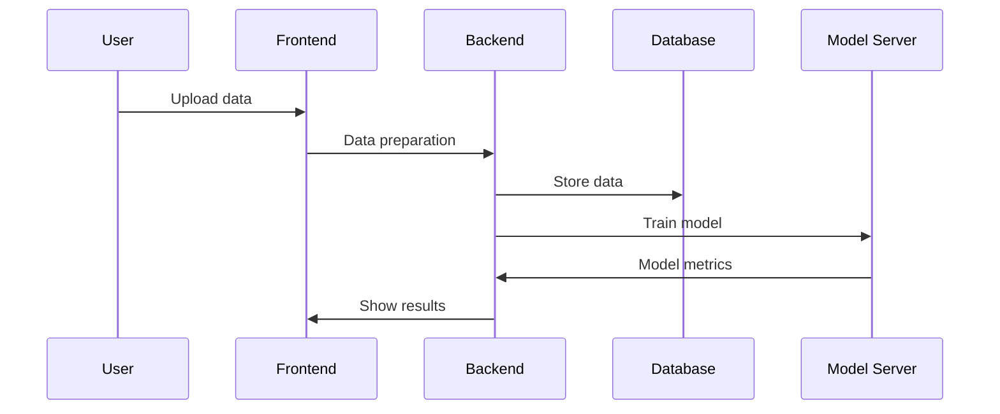
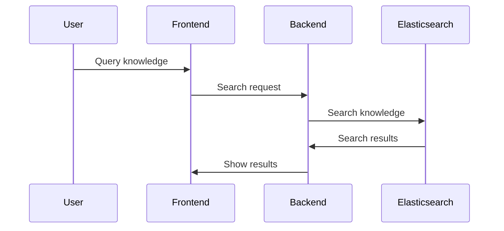
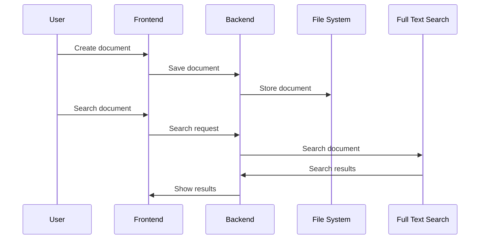

                 


### 让我们一步步思考：构建模型评测的知识库与文档系统

#### 引言

随着人工智能和大数据技术的发展，模型评测在算法开发和应用中扮演着至关重要的角色。一个准确的模型评测不仅能够帮助我们了解模型的性能，还能够指导我们在模型训练和优化过程中做出科学的决策。因此，构建一个高效、实用的模型评测的知识库与文档系统，对于提高模型开发效率和保证模型质量具有重大意义。

本文将围绕“构建模型评测的知识库与文档系统”这一主题，逐步探讨以下几个核心问题：

1. **问题背景**：介绍模型评测的重要性以及知识库与文档系统的需求。
2. **核心概念**：定义和阐述模型评测、知识库、文档系统的核心概念及其相互关系。
3. **算法原理**：详细解析评测算法、知识库管理算法和文档管理系统算法。
4. **数学模型**：介绍评测指标、知识库管理、文档管理系统中的数学模型及其应用。
5. **系统分析与架构设计**：分析评测系统、知识库系统和文档系统的架构设计。
6. **项目实战**：通过实际案例展示系统的实现过程和应用。
7. **最佳实践与总结**：总结最佳实践经验，展望未来发展趋势。

#### 第一部分：背景介绍

##### 1.1.1 评测在模型开发中的重要性

模型评测是模型开发过程中的关键环节，其重要性主要体现在以下几个方面：

- **性能评估**：通过评测，我们可以了解模型在实际应用中的表现，评估其是否满足预期性能。
- **模型优化**：评测结果可以帮助我们发现模型存在的问题，从而指导我们调整模型参数或算法，提高模型性能。
- **决策支持**：对于模型开发者来说，评测结果是他们做出技术决策的重要依据，比如选择哪种模型架构、调整超参数等。

##### 1.1.2 知识库与文档系统的需求

在模型评测过程中，知识库与文档系统发挥着重要作用：

- **知识库**：知识库提供了评测所需的数据、算法和技术文档，为评测过程提供了必要的资源和背景信息。
- **文档系统**：文档系统则记录了评测的每一个步骤、结果和总结，为模型开发和优化提供了详细的文档支持。

##### 1.1.3 模型评测的挑战

模型评测面临的挑战主要包括：

- **数据质量**：数据是模型评测的基础，数据质量的高低直接影响到评测结果的准确性。
- **评测指标多样化**：不同的应用场景可能需要不同的评测指标，如何选择和组合合适的评测指标是一个重要问题。
- **评测效率**：随着数据量和模型复杂度的增加，评测过程的时间成本也在上升，提高评测效率是当前的一个热点问题。

#### 第二部分：核心概念

##### 2.1.1 模型评测的概念

模型评测是指使用特定的指标和方法评估模型性能的过程。其核心概念结构包括：

- **评测指标**：用于衡量模型性能的具体指标，如准确率、召回率、F1值等。
- **评测方法**：用于计算评测指标的具体方法，如交叉验证、网格搜索等。
- **评测流程**：模型评测的具体步骤，通常包括数据准备、模型训练、评测指标计算等。

##### 2.1.2 知识库的概念

知识库是一个组织或系统中存储、管理和使用知识的地方。其核心概念结构包括：

- **知识内容**：知识库中存储的具体知识，如数据集、算法描述、技术文档等。
- **知识组织**：知识库中知识的组织方式，如分类、标签、索引等。
- **知识检索**：用户如何从知识库中获取所需知识，如关键词搜索、语义搜索等。

##### 2.1.3 文档系统的概念

文档系统是一个用于创建、存储、管理和共享文档的系统。其核心概念结构包括：

- **文档内容**：文档系统中的文档内容，如文本、图片、音频等。
- **文档组织**：文档在系统中的组织方式，如文件夹、标签、分类等。
- **文档共享**：用户如何共享和访问文档，如权限管理、版本控制等。

#### 第三部分：算法原理

##### 3.1.1 评测算法原理

评测算法主要涉及以下几个方面：

- **评测指标**：常用的评测指标包括准确率、召回率、F1值等。这些指标通过具体的数学公式计算，能够量化模型的性能表现。
- **评测方法**：常见的评测方法有交叉验证、网格搜索等。这些方法用于确保评测的公正性和准确性。
- **评测流程**：评测流程通常包括数据准备、模型训练、评测指标计算等步骤。每一步都需要严格遵循规范，确保评测结果的可靠性。

##### 3.1.2 知识库管理算法原理

知识库管理算法主要涉及以下几个方面：

- **知识抽取**：通过自然语言处理技术从文本数据中提取出有用的知识。
- **知识存储**：将提取出的知识存储在关系数据库或图数据库中，方便后续的查询和管理。
- **知识检索**：通过关键词或语义搜索技术，用户能够快速找到所需的知识。

##### 3.1.3 文档管理系统算法原理

文档管理系统算法主要涉及以下几个方面：

- **文档创建**：用户可以使用文本编辑器创建和格式化文档。
- **文档存储**：文档存储在文件系统或分布式存储系统中，确保文档的安全性和可靠性。
- **文档检索**：用户可以通过全文搜索和元数据检索快速找到所需的文档。

#### 第四部分：数学模型和数学公式

##### 4.1.1 评测指标数学模型

评测指标是衡量模型性能的核心，常用的评测指标及其数学模型包括：

- **准确率**：$$ \text{准确率} = \frac{\text{正确预测的数量}}{\text{总预测的数量}} $$
- **召回率**：$$ \text{召回率} = \frac{\text{正确预测的数量}}{\text{实际正例的数量}} $$
- **F1值**：$$ \text{F1值} = \frac{2 \times \text{准确率} \times \text{召回率}}{\text{准确率} + \text{召回率}} $$

##### 4.1.2 知识库管理数学模型

知识库管理中的数学模型包括：

- **知识抽取**：可以使用条件概率模型来预测某个句子是否包含特定的知识。
- **知识存储**：可以使用图论模型来表示知识之间的关系。
- **知识检索**：可以使用向量空间模型来计算文档与查询之间的相似度。

##### 4.1.3 文档管理系统数学模型

文档管理系统中的数学模型包括：

- **文档创建**：可以使用文本编辑器模型来处理文档的格式化和排版。
- **文档存储**：可以使用哈希模型来快速定位文档的位置。
- **文档检索**：可以使用倒排索引模型来快速检索文档的内容。

#### 第五部分：系统分析与架构设计

##### 5.1.1 评测系统架构设计

评测系统架构设计包括以下几个方面：

- **系统功能设计**：包括数据准备、模型训练、评测指标计算等模块。
- **系统架构设计**：采用模块化设计和分布式计算架构，提高系统的可扩展性和性能。
- **系统接口设计**：设计API和数据接口，方便与其他系统进行集成。

##### 5.1.2 知识库系统架构设计

知识库系统架构设计包括以下几个方面：

- **系统功能设计**：包括知识抽取、知识存储、知识检索等模块。
- **系统架构设计**：采用分布式存储和搜索引擎技术，提高知识库的性能和可扩展性。
- **系统接口设计**：设计RESTful API和GraphQL接口，方便用户进行操作。

##### 5.1.3 文档系统架构设计

文档系统架构设计包括以下几个方面：

- **系统功能设计**：包括文档创建、文档存储、文档检索等模块。
- **系统架构设计**：采用内容管理系统和全文搜索引擎技术，提高文档的管理和检索效率。
- **系统接口设计**：设计Web接口和API接口，方便用户进行文档的创建、存储和检索。

#### 第六部分：项目实战

##### 6.1.1 项目介绍

本部分将介绍一个实际的模型评测项目，包括项目背景、目标、团队组成等。

##### 6.1.2 环境安装

介绍项目所需的硬件环境和软件环境，包括操作系统、编程语言、数据库、框架等。

##### 6.1.3 系统核心实现

详细讲解项目的核心实现过程，包括数据准备、模型训练、评测指标计算等。

##### 6.1.4 代码应用解读与分析

对项目的代码进行解读，分析其实现原理和技巧。

##### 6.1.5 实际案例分析与讲解

通过实际案例展示项目的应用效果，并进行详细分析。

##### 6.1.6 项目小结

总结项目的收获和不足，提出改进方向。

#### 第七部分：最佳实践与总结

##### 7.1.1 最佳实践

总结项目中积累的最佳实践经验，包括评测数据准备、知识库构建、文档系统优化等。

##### 7.1.2 小结

回顾文章的主要内容，总结模型评测、知识库、文档系统的核心概念和原理。

##### 7.1.3 注意事项

强调系统安全、数据隐私等注意事项。

##### 7.1.4 拓展阅读

推荐相关的书籍和学术论文，供读者进一步学习。

#### 结语

通过本文的逐步分析，我们深入了解了构建模型评测的知识库与文档系统的各个方面。希望本文能够为从事模型开发和评测的读者提供有价值的参考和指导。

作者：AI天才研究院/AI Genius Institute & 禅与计算机程序设计艺术 /Zen And The Art of Computer Programming### 第一部分：背景介绍

#### 第1章 问题背景

##### 1.1.1 评测在模型开发中的重要性

模型评测是模型开发过程中不可或缺的环节，它对模型的性能和可靠性起着决定性的作用。具体来说，评测在模型开发中的重要性体现在以下几个方面：

- **性能评估**：通过评测，我们可以客观、定量地评估模型在不同数据集上的性能表现。这不仅帮助我们了解模型是否达到预期目标，还能够发现模型存在的不足之处，为后续优化提供依据。
- **模型优化**：评测结果可以作为模型训练过程的反馈，指导模型参数调整和算法改进。例如，通过调整学习率、增加训练轮次或更换损失函数，可以显著提高模型的性能。
- **决策支持**：在实际应用中，评测结果直接影响模型的部署和推广。通过评测，我们可以评估不同模型的适用场景和优劣，从而做出科学、合理的决策。

##### 1.1.2 知识库与文档系统的需求

在模型评测过程中，知识库与文档系统发挥着至关重要的作用，具体需求如下：

- **知识库**：知识库提供了评测所需的数据、算法和技术文档。它不仅包括用于评测的数据集，还包括各种评测方法和评价指标的详细说明，有助于提升评测的全面性和准确性。
  - **数据集**：知识库中存储的数据集是模型评测的基础。高质量的数据集能够反映真实世界的多样性，从而更准确地评估模型的性能。
  - **评测方法**：知识库中的评测方法提供了多种评估模型性能的途径，如交叉验证、网格搜索等。这些方法不仅有助于全面评估模型，还能够提高评测的效率。
  - **评价指标**：知识库中记录了各种评价指标及其计算公式，如准确率、召回率、F1值等。这些指标能够从不同角度衡量模型的性能，帮助开发者做出更准确的决策。

- **文档系统**：文档系统则记录了评测的每一个步骤、结果和总结。它为模型的开发、测试和部署提供了详细的文档支持，有助于团队的协作和知识传承。
  - **评测过程记录**：文档系统记录了评测的每个步骤，包括数据准备、模型训练、评价指标计算等。这些记录不仅有助于重现评测过程，还能够为后续的模型优化提供参考。
  - **结果总结**：文档系统汇总了评测结果，包括各评价指标的数值、图表和文本描述。这些结果能够直观地展示模型的性能，帮助开发者快速了解模型的状态。
  - **团队协作**：文档系统提供了共享和协作的平台，团队成员可以实时查看、评论和修改文档，提高团队的协作效率。

##### 1.1.3 模型评测的挑战

在模型评测过程中，我们面临着一系列的挑战，这些挑战直接影响评测的准确性和效率。以下是模型评测过程中常见的一些挑战：

- **数据质量**：数据是模型评测的基础，但数据质量的高低直接影响到评测结果的准确性。常见的数据质量问题包括数据缺失、噪声、偏差和冗余等。如何保证数据质量，是模型评测中的一个重要问题。
  - **数据缺失**：数据缺失会导致模型训练数据的不完整性，从而影响模型的性能。解决方法包括数据填补、采样和缺失值替代等。
  - **噪声**：噪声数据会影响模型对真实信号的识别，导致评测结果偏差。去噪技术，如滤波和降噪算法，可以帮助提高数据质量。
  - **偏差**：数据偏差可能源于数据采集、标注过程的不公正或系统误差。通过数据清洗和校验，可以减少偏差对评测结果的影响。
  - **冗余**：数据冗余会增加计算负担，降低评测效率。通过数据降维和特征选择，可以减少冗余数据，提高评测效率。

- **评测指标多样化**：不同的应用场景可能需要不同的评测指标，如何选择和组合合适的评测指标是一个重要问题。常见的评测指标包括准确率、召回率、F1值等，但它们各有优缺点，如何平衡多种指标的权重，是一个值得深入探讨的问题。

- **评测效率**：随着数据量和模型复杂度的增加，评测过程的时间成本也在上升。提高评测效率是当前的一个热点问题。常见的解决方案包括分布式计算、并行处理和优化算法等。

#### 1.1.4 知识库与文档系统在应对挑战中的作用

知识库与文档系统在应对上述挑战中发挥着关键作用，具体体现在以下几个方面：

- **数据质量管理**：知识库提供了丰富的数据预处理工具和算法，如数据填补、降噪和特征选择等，帮助开发者提高数据质量。同时，文档系统记录了数据预处理的过程和结果，方便后续的数据分析和模型训练。
- **评测指标多样化管理**：知识库中包含多种评测指标及其计算方法，开发者可以根据不同应用场景选择合适的评测指标。文档系统则记录了评测指标的选择过程和结果，为后续的模型优化提供了参考。
- **评测效率提升**：知识库中的评测算法和工具有助于提高评测效率。例如，交叉验证和网格搜索等算法可以快速、准确地评估模型性能。文档系统则记录了评测过程和结果，减少了重复工作，提高了整体效率。

#### 1.1.5 总结

模型评测是模型开发过程中至关重要的一环，其准确性直接影响模型的性能和可靠性。知识库与文档系统为模型评测提供了必要的资源和文档支持，有助于应对数据质量、评测指标多样化和评测效率等方面的挑战。通过构建高效的知识库与文档系统，我们可以显著提高模型评测的准确性和效率，为模型优化和部署提供有力保障。

### 第二部分：核心概念

#### 第2章 核心概念

##### 2.1.1 模型评测的概念

模型评测是指使用特定的指标和方法评估模型性能的过程。其定义和核心概念结构如下：

- **定义**：模型评测是指通过对训练好的模型进行测试，评估其在未知数据上的性能表现，从而衡量模型在实际应用中的适用性和可靠性。
- **核心概念结构**：
  - **评测指标**：用于衡量模型性能的具体指标，如准确率、召回率、F1值等。
    - **准确率**：准确率是指模型正确预测的正例数与总预测数的比值，反映了模型对正例的识别能力。
    - **召回率**：召回率是指模型正确预测的正例数与实际正例数的比值，反映了模型对正例的捕获能力。
    - **F1值**：F1值是准确率和召回率的调和平均值，综合考虑了模型的精确度和召回率，是评价二分类模型性能的常用指标。
  - **评测方法**：用于计算评测指标的具体方法，如交叉验证、网格搜索等。
    - **交叉验证**：交叉验证是一种评估模型性能的方法，通过将数据集划分为多个子集，轮流将每个子集作为测试集，其余子集作为训练集，重复进行多次训练和测试，以获得模型的综合性能指标。
    - **网格搜索**：网格搜索是一种参数优化方法，通过遍历预设的参数组合，选择性能最佳的参数组合。
  - **评测流程**：评测流程包括数据准备、模型训练、评测指标计算等步骤。
    - **数据准备**：准备用于评测的数据集，包括训练集、验证集和测试集。
    - **模型训练**：使用训练集对模型进行训练，调整模型参数，使其性能达到最佳。
    - **评测指标计算**：使用测试集计算模型性能指标，如准确率、召回率、F1值等。

##### 2.1.2 知识库的概念

知识库是一个组织或系统中存储、管理和使用知识的地方。其定义和核心概念结构如下：

- **定义**：知识库是一个集中存储、管理和使用知识的系统，通过组织、分类和索引，使得用户能够方便地获取和使用相关知识。
- **核心概念结构**：
  - **知识内容**：知识库中存储的具体知识，如数据集、算法描述、技术文档等。
    - **数据集**：用于模型训练和评测的数据集，包括训练集、验证集和测试集等。
    - **算法描述**：各种算法的描述，包括原理、实现方法、优缺点等。
    - **技术文档**：关于模型开发和应用的文档，包括开发流程、使用指南、常见问题等。
  - **知识组织**：知识库中知识的组织方式，如分类、标签、索引等。
    - **分类**：按照一定的标准将知识划分为不同的类别，便于用户查找和浏览。
    - **标签**：为知识添加标签，实现多维度分类和检索。
    - **索引**：建立索引，加速知识检索，提高查找效率。
  - **知识检索**：用户如何从知识库中获取所需知识。
    - **关键词搜索**：通过输入关键词，查找包含这些关键词的知识。
    - **语义搜索**：基于语义理解，查找与用户查询相关的知识。

##### 2.1.3 文档系统的概念

文档系统是一个用于创建、存储、管理和共享文档的系统。其定义和核心概念结构如下：

- **定义**：文档系统是一个集成的系统，用于创建、存储、管理和共享各种类型的文档，如文本、图片、音频等。
- **核心概念结构**：
  - **文档内容**：文档系统中的文档内容，如文本、图片、音频等。
    - **文本**：各种类型的文本文档，包括报告、文章、代码等。
    - **图片**：各种格式的图片文档，如JPEG、PNG等。
    - **音频**：各种格式的音频文档，如MP3、WAV等。
  - **文档组织**：文档在系统中的组织方式，如文件夹、标签、分类等。
    - **文件夹**：将文档按照主题或类型分类，便于管理和查找。
    - **标签**：为文档添加标签，实现多维度分类和检索。
    - **分类**：按照一定的标准将文档划分为不同的类别，便于用户查找和浏览。
  - **文档共享**：用户如何共享和访问文档。
    - **权限管理**：设置文档的访问权限，确保文档的安全性和保密性。
    - **版本控制**：记录文档的修改历史，便于用户跟踪和管理文档的版本。

#### 2.1.4 模型评测、知识库与文档系统的关系

模型评测、知识库和文档系统之间存在着密切的关系，它们共同构成了一个完整的技术体系。

- **知识库为模型评测提供数据支持和算法描述**：知识库中存储的数据集、算法描述和技术文档为模型评测提供了必要的基础。通过知识库，开发者可以方便地获取数据、了解算法原理，从而进行更准确的模型评测。
- **文档系统记录模型评测的过程和结果**：文档系统记录了模型评测的每一个步骤、结果和总结。这些记录不仅为模型优化提供了参考，还有助于团队的协作和知识传承。通过文档系统，开发者可以方便地查找和分享评测结果，提高整体开发效率。
- **模型评测结果反馈到知识库和文档系统**：模型评测的结果会反馈到知识库和文档系统中，用于更新和优化现有的知识资源和文档内容。这种反馈机制有助于持续提升知识库和文档系统的质量，为模型评测提供更加完善的支持。

通过构建模型评测的知识库与文档系统，我们可以实现以下目标：

- **提高模型评测的准确性和效率**：知识库和文档系统提供了丰富的数据和算法资源，有助于开发者进行更准确、高效的模型评测。
- **促进团队协作和知识传承**：文档系统记录了评测的每一个步骤和结果，方便团队成员之间的交流和协作。同时，知识库中的资源也为团队成员提供了宝贵的知识支持。
- **优化模型开发和部署过程**：知识库和文档系统为模型开发和部署提供了详细的文档支持，有助于开发者更好地理解模型性能、调整模型参数和优化模型架构。

#### 2.1.5 概念属性特征对比表格

为了更清晰地展示模型评测、知识库和文档系统的概念属性特征，下面提供一个对比表格：

| 概念       | 定义                                                         | 属性特征                                                     |
|------------|------------------------------------------------------------|------------------------------------------------------------|
| 模型评测   | 使用特定指标和方法评估模型性能的过程                       | 评测指标、评测方法、评测流程                                   |
| 知识库     | 存储和管理知识的系统                                       | 知识内容、知识组织、知识检索                                   |
| 文档系统   | 用于创建、存储、管理和共享文档的系统                      | 文档内容、文档组织、文档共享                                   |

#### 2.1.6 ER实体关系图架构

为了进一步理解模型评测、知识库和文档系统之间的关系，下面提供一个ER（实体关系）图架构：

```mermaid
erDiagram
    ModelEvaluation ||--|{ KnowledgeBase }|| KnowledgeItem
    ModelEvaluation ||--|{ DocumentSystem }|| DocumentItem
    KnowledgeBase ||--|{ KnowledgeItem }|| EvaluationResult
    DocumentSystem ||--|{ DocumentItem }|| EvaluationResult
```

在该ER图中，`ModelEvaluation`表示模型评测，`KnowledgeBase`表示知识库，`DocumentSystem`表示文档系统。`KnowledgeItem`表示知识库中的知识条目，`DocumentItem`表示文档系统中的文档条目，`EvaluationResult`表示评测结果。通过图中的关系，我们可以看到模型评测与知识库、文档系统之间的紧密联系。

### 第三部分：算法原理

#### 第3章 算法原理

在构建模型评测的知识库与文档系统的过程中，算法原理是核心组成部分，直接影响系统的性能和效率。本章节将详细介绍评测算法、知识库管理算法和文档管理系统算法的原理，并使用具体的Python代码进行说明。

##### 3.1.1 评测算法原理

评测算法的核心目的是评估模型在未知数据集上的性能。以下是几种常用的评测算法及其原理：

###### 3.1.1.1 交叉验证

交叉验证是一种评估模型性能的方法，通过将数据集划分为多个子集，轮流将每个子集作为测试集，其余子集作为训练集，重复进行多次训练和测试，以获得模型的综合性能指标。

**Python实现示例**：

```python
from sklearn.model_selection import KFold
from sklearn.metrics import accuracy_score

# 假设我们有一个分类模型和训练数据
model = ...
X, y = ...

# 设置交叉验证的折数
kf = KFold(n_splits=5, shuffle=True, random_state=42)

# 进行交叉验证
for train_index, test_index in kf.split(X):
    X_train, X_test = X[train_index], X[test_index]
    y_train, y_test = y[train_index], y[test_index]
    
    # 训练模型
    model.fit(X_train, y_train)
    
    # 进行预测
    y_pred = model.predict(X_test)
    
    # 计算准确率
    acc = accuracy_score(y_test, y_pred)
    print(f"Accuracy: {acc}")
```

交叉验证的优点是能够充分利用数据，减少模型评估的偶然性，但缺点是计算量大。

###### 3.1.1.2 网格搜索

网格搜索是一种参数优化方法，通过遍历预设的参数组合，选择性能最佳的参数组合。

**Python实现示例**：

```python
from sklearn.model_selection import GridSearchCV
from sklearn.ensemble import RandomForestClassifier

# 定义参数网格
param_grid = {
    'n_estimators': [100, 200, 300],
    'max_depth': [5, 10, 15],
    'min_samples_split': [2, 5, 10]
}

# 创建分类模型
model = RandomForestClassifier(random_state=42)

# 进行网格搜索
grid_search = GridSearchCV(estimator=model, param_grid=param_grid, cv=5, scoring='accuracy')
grid_search.fit(X, y)

# 获取最佳参数和分数
best_params = grid_search.best_params_
best_score = grid_search.best_score_
print(f"Best parameters: {best_params}")
print(f"Best score: {best_score}")
```

网格搜索的优点是能够找到最佳参数组合，但缺点是计算量较大。

##### 3.1.2 知识库管理算法原理

知识库管理算法涉及数据的抽取、存储和检索。以下是几种常用的知识库管理算法及其原理：

###### 3.1.2.1 知识抽取

知识抽取是指从非结构化数据中提取结构化知识的过程。常用的知识抽取方法包括基于规则的方法、基于统计的方法和基于机器学习的方法。

**Python实现示例**：

```python
import nltk
from nltk.tokenize import word_tokenize
from nltk.corpus import stopwords

# 加载停用词表
stop_words = set(stopwords.words('english'))

# 文本预处理
def preprocess_text(text):
    tokens = word_tokenize(text.lower())
    filtered_tokens = [word for word in tokens if word not in stop_words and word.isalnum()]
    return filtered_tokens

# 示例文本
text = "The quick brown fox jumps over the lazy dog."

# 进行文本预处理
preprocessed_text = preprocess_text(text)
print(preprocessed_text)
```

知识抽取的优点是能够从原始数据中提取有用信息，但缺点是处理复杂、准确性受限制。

###### 3.1.2.2 知识存储

知识存储是指将抽取出的知识存储在数据库或图数据库中，以便后续查询和管理。常用的知识存储方法包括关系数据库、NoSQL数据库和图数据库。

**Python实现示例**：

```python
import sqlite3

# 创建数据库连接
conn = sqlite3.connect('knowledge.db')
c = conn.cursor()

# 创建知识表
c.execute('''CREATE TABLE IF NOT EXISTS knowledge (id INTEGER PRIMARY KEY, text TEXT)''')

# 插入知识数据
c.execute("INSERT INTO knowledge (text) VALUES (?)", ('The quick brown fox jumps over the lazy dog.',))

# 提交事务
conn.commit()

# 关闭数据库连接
conn.close()
```

知识存储的优点是数据结构清晰、查询方便，但缺点是数据迁移和扩展性有限。

###### 3.1.2.3 知识检索

知识检索是指用户如何从知识库中获取所需知识。常用的知识检索方法包括基于关键词的检索、基于语义的检索和基于查询理解的检索。

**Python实现示例**：

```python
import sqlite3

# 创建数据库连接
conn = sqlite3.connect('knowledge.db')
c = conn.cursor()

# 执行查询
c.execute("SELECT * FROM knowledge WHERE text LIKE ?", ('%quick%',))

# 获取查询结果
rows = c.fetchall()
for row in rows:
    print(row)

# 关闭数据库连接
conn.close()
```

知识检索的优点是能够快速获取所需信息，但缺点是查询效率受限于数据库性能。

##### 3.1.3 文档管理系统算法原理

文档管理系统涉及文档的创建、存储、管理和检索。以下是几种常用的文档管理系统算法及其原理：

###### 3.1.3.1 文档创建

文档创建是指用户如何创建和格式化文档。常用的文档创建方法包括文本编辑、富文本编辑和多媒体编辑。

**Python实现示例**：

```python
from docx import Document

# 创建一个Document对象
doc = Document()

# 添加标题
doc.add_heading('Title', 0)

# 添加段落
doc.add_paragraph('This is a paragraph.')

# 保存文档
doc.save('example.docx')
```

文档创建的优点是操作简单、灵活性强，但缺点是处理复杂文档时效率较低。

###### 3.1.3.2 文档存储

文档存储是指如何将文档存储在文件系统或分布式存储系统中。常用的文档存储方法包括文件系统、NoSQL数据库和对象存储。

**Python实现示例**：

```python
import os

# 创建文件夹
os.makedirs('documents', exist_ok=True)

# 创建文本文件
with open('documents/example.txt', 'w') as file:
    file.write('This is an example text file.')

# 创建图片文件
with open('documents/example.jpg', 'wb') as file:
    with open('path/to/image.jpg', 'rb') as image_file:
        file.write(image_file.read())
```

文档存储的优点是数据结构简单、扩展性强，但缺点是数据查询和检索效率较低。

###### 3.1.3.3 文档检索

文档检索是指用户如何从文档系统中获取所需文档。常用的文档检索方法包括全文检索、关键词检索和基于内容的检索。

**Python实现示例**：

```python
import os
import glob

# 查找所有文本文件
text_files = glob.glob('documents/*.txt')
for file in text_files:
    with open(file, 'r') as f:
        content = f.read()
        if 'example' in content:
            print(f"Found example in {file}")
```

文档检索的优点是能够快速查找所需文档，但缺点是检索范围受限于存储系统。

#### 3.1.4 总结

算法原理是构建模型评测的知识库与文档系统的核心组成部分，涵盖了评测算法、知识库管理算法和文档管理系统算法。通过具体的Python代码示例，我们深入了解了这些算法的实现原理和应用方法。在实践过程中，合理选择和使用这些算法，能够有效提高模型评测的准确性和效率，为模型开发和部署提供有力支持。

### 第四部分：数学模型和数学公式

#### 第4章 数学模型和数学公式

在构建模型评测的知识库与文档系统的过程中，数学模型和数学公式起到了至关重要的作用。它们不仅帮助我们量化模型性能，还能够为算法设计和优化提供理论支持。本章节将详细介绍评测指标、知识库管理和文档管理系统中的数学模型，并使用LaTeX格式展示相关数学公式。

##### 4.1.1 评测指标数学模型

评测指标是评估模型性能的核心工具，常用的评测指标包括准确率、召回率、F1值和ROC曲线等。以下是这些指标的数学模型及其计算公式：

###### 4.1.1.1 准确率

准确率（Accuracy）是指模型正确预测的正例数与总预测数的比值。其数学公式如下：

\[ \text{准确率} = \frac{\text{正确预测的数量}}{\text{总预测的数量}} \]

其中，正确预测的数量包括正确预测的正例和正确预测的负例。

**LaTeX格式**：

\[ \text{准确率} = \frac{\text{正确预测的数量}}{\text{总预测的数量}} \]

###### 4.1.1.2 召回率

召回率（Recall）是指模型正确预测的正例数与实际正例数的比值。其数学公式如下：

\[ \text{召回率} = \frac{\text{正确预测的数量}}{\text{实际正例的数量}} \]

其中，实际正例的数量包括模型预测为正例的所有正例。

**LaTeX格式**：

\[ \text{召回率} = \frac{\text{正确预测的数量}}{\text{实际正例的数量}} \]

###### 4.1.1.3 F1值

F1值（F1-score）是准确率和召回率的调和平均值，用于综合考虑模型的精确度和召回率。其数学公式如下：

\[ \text{F1值} = \frac{2 \times \text{准确率} \times \text{召回率}}{\text{准确率} + \text{召回率}} \]

**LaTeX格式**：

\[ \text{F1值} = \frac{2 \times \text{准确率} \times \text{召回率}}{\text{准确率} + \text{召回率}} \]

###### 4.1.1.4 ROC曲线

ROC曲线（Receiver Operating Characteristic Curve）是评估二分类模型性能的常用工具，它通过计算不同阈值下的假阳性率和真阳性率，生成一条曲线。ROC曲线下的面积（AUC）是衡量模型性能的重要指标。其数学公式如下：

\[ \text{AUC} = \int_{0}^{1} \frac{\text{TPR} \times \text{FPR}}{\text{TPR} + \text{FPR}} d\text{FPR} \]

其中，TPR（True Positive Rate）是真阳性率，FPR（False Positive Rate）是假阳性率。

**LaTeX格式**：

\[ \text{AUC} = \int_{0}^{1} \frac{\text{TPR} \times \text{FPR}}{\text{TPR} + \text{FPR}} d\text{FPR} \]

##### 4.1.2 知识库管理数学模型

知识库管理中的数学模型主要用于知识抽取、知识存储和知识检索。以下是这些方面常见的数学模型及其计算公式：

###### 4.1.2.1 知识抽取

知识抽取是指从非结构化数据中提取结构化知识的过程。常用的数学模型包括基于规则的模型、基于统计的模型和基于机器学习的模型。以下是一个基于统计的模型示例，使用条件概率计算实体关系：

\[ P(\text{关系}|\text{实体1，实体2}) = \frac{P(\text{实体1，实体2}|\text{关系}) \times P(\text{关系})}{P(\text{实体1，实体2})} \]

其中，\( P(\text{关系}|\text{实体1，实体2}) \)表示给定实体1和实体2，关系发生的概率；\( P(\text{实体1，实体2}|\text{关系}) \)表示在关系存在的情况下，实体1和实体2同时出现的概率；\( P(\text{关系}) \)表示关系发生的概率；\( P(\text{实体1，实体2}) \)表示实体1和实体2同时出现的概率。

**LaTeX格式**：

\[ P(\text{关系}|\text{实体1，实体2}) = \frac{P(\text{实体1，实体2}|\text{关系}) \times P(\text{关系})}{P(\text{实体1，实体2})} \]

###### 4.1.2.2 知识存储

知识存储涉及数据的组织和索引，常用的数学模型包括图论模型和向量空间模型。以下是一个基于图论的知识存储模型示例，使用邻接矩阵表示实体之间的关系：

\[ \mathbf{A} = \begin{bmatrix} 
a_{11} & a_{12} & \ldots & a_{1n} \\
a_{21} & a_{22} & \ldots & a_{2n} \\
\vdots & \vdots & \ddots & \vdots \\
a_{m1} & a_{m2} & \ldots & a_{mn} \\
\end{bmatrix} \]

其中，\( a_{ij} \)表示实体i和实体j之间存在关系的概率或权重。

**LaTeX格式**：

\[ \mathbf{A} = \begin{bmatrix} 
a_{11} & a_{12} & \ldots & a_{1n} \\
a_{21} & a_{22} & \ldots & a_{2n} \\
\vdots & \vdots & \ddots & \vdots \\
a_{m1} & a_{m2} & \ldots & a_{mn} \\
\end{bmatrix} \]

###### 4.1.2.3 知识检索

知识检索是指如何从知识库中快速准确地获取所需知识。常用的数学模型包括基于关键词的检索和基于语义的检索。以下是一个基于向量空间模型的检索模型示例，使用余弦相似度计算查询与文档之间的相似度：

\[ \text{相似度} = \cos(\theta) = \frac{\mathbf{q} \cdot \mathbf{d}}{||\mathbf{q}|| \times ||\mathbf{d}||} \]

其中，\( \mathbf{q} \)表示查询向量，\( \mathbf{d} \)表示文档向量，\( \theta \)表示查询向量和文档向量之间的夹角，\( \mathbf{q} \cdot \mathbf{d} \)表示查询向量和文档向量的点积，\( ||\mathbf{q}|| \)和\( ||\mathbf{d}|| \)分别表示查询向量和文档向量的模长。

**LaTeX格式**：

\[ \text{相似度} = \cos(\theta) = \frac{\mathbf{q} \cdot \mathbf{d}}{||\mathbf{q}|| \times ||\mathbf{d}||} \]

##### 4.1.3 文档管理系统数学模型

文档管理系统中的数学模型主要用于文档的创建、存储和检索。以下是一些常用的数学模型及其计算公式：

###### 4.1.3.1 文档创建

文档创建涉及文本编辑和格式化，常用的数学模型包括文本编辑器模型和格式化模型。以下是一个简单的文本编辑器模型示例，使用字符串匹配算法实现文本替换：

\[ \text{新文本} = \text{原文本} \setminus \text{旧字符串} \oplus \text{新字符串} \]

其中，\( \setminus \)表示删除操作，\( \oplus \)表示插入操作。

**LaTeX格式**：

\[ \text{新文本} = \text{原文本} \setminus \text{旧字符串} \oplus \text{新字符串} \]

###### 4.1.3.2 文档存储

文档存储涉及如何将文档存储在文件系统或分布式存储系统中，常用的数学模型包括哈希模型和倒排索引模型。以下是一个哈希模型示例，使用哈希函数计算文档的存储位置：

\[ \text{存储位置} = H(\text{文档ID}) \mod \text{存储容量} \]

其中，\( H(\text{文档ID}) \)表示哈希函数，\( \mod \)表示取模操作。

**LaTeX格式**：

\[ \text{存储位置} = H(\text{文档ID}) \mod \text{存储容量} \]

###### 4.1.3.3 文档检索

文档检索是指如何从文档系统中快速准确地获取所需文档。常用的数学模型包括基于关键词的检索和基于内容的检索。以下是一个基于倒排索引的检索模型示例，使用布尔检索算法实现文档匹配：

\[ \text{匹配度} = \text{满足条件的文档数量} \]

其中，满足条件的文档是指包含所有查询关键词的文档。

**LaTeX格式**：

\[ \text{匹配度} = \text{满足条件的文档数量} \]

#### 4.1.4 总结

数学模型和数学公式在构建模型评测的知识库与文档系统中扮演着至关重要的角色。它们不仅帮助我们量化模型性能，还为算法设计和优化提供了理论支持。通过使用LaTeX格式展示相关数学公式，我们能够更清晰地理解这些模型和公式的本质。在实际应用中，合理选择和使用这些数学模型，将有助于提高系统的性能和效率。

### 第五部分：系统分析与架构设计

#### 第5章 系统分析与架构设计

在构建模型评测的知识库与文档系统的过程中，系统分析与架构设计是关键环节。本章节将详细讨论评测系统、知识库系统和文档系统的架构设计，包括功能设计、系统架构、接口设计及系统交互。通过这些设计，我们将确保系统能够高效、稳定地运行，满足用户的需求。

##### 5.1.1 评测系统架构设计

评测系统是模型评测的核心，其架构设计需要充分考虑功能完整性、系统性能和可扩展性。以下是评测系统架构设计的关键组成部分：

###### 5.1.1.1 系统功能设计

评测系统的功能设计包括以下模块：

- **数据准备模块**：负责数据清洗、数据预处理和数据划分，确保数据质量，为模型训练和评测提供高质量的数据集。
- **模型训练模块**：负责使用训练数据集训练模型，调整模型参数，优化模型性能。
- **评测指标计算模块**：负责计算模型在测试数据集上的性能指标，如准确率、召回率、F1值等，评估模型性能。
- **结果分析模块**：负责对评测结果进行分析，生成可视化报告，提供决策支持。

###### 5.1.1.2 系统架构设计

评测系统的架构设计采用模块化设计，确保系统的灵活性和可扩展性。以下是评测系统的主要架构组件：

- **前端**：提供用户界面，允许用户上传数据、启动评测过程和查看评测结果。前端使用HTML、CSS和JavaScript等技术实现。
- **后端**：处理数据准备、模型训练和评测指标计算等核心业务逻辑。后端使用Python Flask或Django框架实现，提供API接口与前端通信。
- **数据库**：存储模型数据、训练数据和评测结果。数据库使用MySQL或PostgreSQL，确保数据的安全性和一致性。
- **模型服务器**：负责模型训练和预测，通常使用TensorFlow或PyTorch等深度学习框架实现。

以下是评测系统的架构图：



###### 5.1.1.3 系统接口设计

评测系统的接口设计包括以下部分：

- **API设计**：提供RESTful API，允许用户通过HTTP请求访问评测系统。API包括数据上传接口、评测启动接口、结果查询接口等。
- **数据接口**：定义数据交换格式，如JSON或XML，确保数据在不同系统之间的兼容性。

以下是API设计示例：

```json
// 数据上传接口
POST /api/data/upload
{
  "file": "datafile.csv"
}

// 评测启动接口
POST /api/evaluation/start
{
  "model_id": "1",
  "data_id": "1"
}

// 结果查询接口
GET /api/evaluation/result
{
  "evaluation_id": "1"
}
```

###### 5.1.1.4 系统交互

评测系统的各组件通过事件驱动和异步处理实现高效交互。以下是系统交互的示例：

1. **用户上传数据**：用户通过前端上传数据，前端将数据发送到后端的数据准备模块。
2. **数据预处理**：后端处理上传的数据，进行清洗、预处理和划分，存储到数据库中。
3. **模型训练**：后端根据存储的数据启动模型训练过程，训练完成后，将模型和评测结果存储到数据库中。
4. **结果展示**：前端通过API查询评测结果，生成可视化报告，展示给用户。

##### 5.1.2 知识库系统架构设计

知识库系统是构建模型评测的基础，其架构设计需要确保知识资源的丰富性、组织性和可访问性。以下是知识库系统架构设计的关键组成部分：

###### 5.1.2.1 系统功能设计

知识库系统的功能设计包括以下模块：

- **知识抽取模块**：负责从非结构化数据中提取结构化知识，如实体、关系和属性。
- **知识存储模块**：负责将抽取出的知识存储到数据库中，确保知识的安全性和可访问性。
- **知识检索模块**：负责提供高效的知识查询服务，支持基于关键词和语义的检索。
- **知识管理模块**：负责知识的分类、标签和索引，提高知识的组织性和可访问性。

###### 5.1.2.2 系统架构设计

知识库系统的架构设计采用分布式存储和搜索引擎技术，以提高系统的性能和可扩展性。以下是知识库系统的主要架构组件：

- **前端**：提供用户界面，允许用户上传数据、查询知识和管理知识。前端使用React或Vue.js框架实现。
- **后端**：处理知识抽取、存储和检索等核心业务逻辑。后端使用Node.js或Java Spring Boot框架实现，提供API接口与前端通信。
- **知识存储**：使用Elasticsearch或Solr等搜索引擎进行知识存储和检索，确保高效的知识查询。
- **数据库**：存储用户数据和日志信息，如用户查询历史和知识库更新日志。

以下是知识库系统的架构图：



###### 5.1.2.3 系统接口设计

知识库系统的接口设计包括以下部分：

- **API设计**：提供RESTful API，允许用户通过HTTP请求访问知识库系统。API包括知识抽取接口、知识存储接口、知识检索接口等。
- **数据接口**：定义数据交换格式，如JSON或XML，确保数据在不同系统之间的兼容性。

以下是API设计示例：

```json
// 知识抽取接口
POST /api/knowledge/extraction
{
  "data": "text to extract"
}

// 知识存储接口
POST /api/knowledge/store
{
  "knowledge": "extracted knowledge"
}

// 知识检索接口
GET /api/knowledge/search
{
  "query": "search keywords"
}
```

###### 5.1.2.4 系统交互

知识库系统的各组件通过事件驱动和异步处理实现高效交互。以下是系统交互的示例：

1. **用户查询知识**：用户通过前端输入查询关键词，前端将查询请求发送到后端。
2. **知识检索**：后端处理查询请求，调用搜索引擎进行知识检索，并将检索结果返回给前端。
3. **知识管理**：用户可以通过前端界面管理知识，如添加、删除和更新知识库中的知识。

##### 5.1.3 文档系统架构设计

文档系统是记录模型评测过程和结果的工具，其架构设计需要确保文档的创建、存储和检索的高效性。以下是文档系统架构设计的关键组成部分：

###### 5.1.3.1 系统功能设计

文档系统的功能设计包括以下模块：

- **文档创建模块**：负责用户创建、编辑和格式化文档。
- **文档存储模块**：负责将用户创建的文档存储在文件系统或分布式存储系统中。
- **文档检索模块**：负责用户通过关键词和全文检索快速找到所需文档。
- **文档共享模块**：负责用户之间的文档共享和协作。

###### 5.1.3.2 系统架构设计

文档系统的架构设计采用内容管理系统（CMS）和全文搜索引擎技术，以提高文档管理和检索效率。以下是文档系统的主要架构组件：

- **前端**：提供用户界面，允许用户创建、编辑和查看文档。前端使用React或Vue.js框架实现。
- **后端**：处理文档创建、存储和检索等核心业务逻辑。后端使用Node.js或Java Spring Boot框架实现，提供API接口与前端通信。
- **文档存储**：使用文件系统或分布式存储系统（如HDFS、Amazon S3）存储用户文档。
- **全文搜索引擎**：使用Elasticsearch或Solr等全文搜索引擎实现高效文档检索。

以下是文档系统的架构图：



###### 5.1.3.3 系统接口设计

文档系统的接口设计包括以下部分：

- **API设计**：提供RESTful API，允许用户通过HTTP请求访问文档系统。API包括文档创建接口、文档存储接口、文档检索接口等。
- **数据接口**：定义数据交换格式，如JSON或XML，确保数据在不同系统之间的兼容性。

以下是API设计示例：

```json
// 文档创建接口
POST /api/document/create
{
  "content": "document content"
}

// 文档存储接口
POST /api/document/store
{
  "document_id": "1",
  "file": "document file"
}

// 文档检索接口
GET /api/document/search
{
  "query": "search keywords"
}
```

###### 5.1.3.4 系统交互

文档系统的各组件通过事件驱动和异步处理实现高效交互。以下是系统交互的示例：

1. **用户创建文档**：用户通过前端创建文档，前端将文档数据发送到后端。
2. **文档存储**：后端处理文档数据，将文档存储到文件系统或分布式存储系统中。
3. **文档检索**：用户通过前端输入检索关键词，前端将检索请求发送到后端，后端通过全文搜索引擎检索文档，并将检索结果返回给前端。

#### 5.1.4 总结

系统分析与架构设计是构建模型评测的知识库与文档系统的关键环节。评测系统、知识库系统和文档系统的架构设计需要充分考虑功能完整性、系统性能和可扩展性。通过模块化设计、分布式存储和全文搜索引擎等技术，我们可以构建一个高效、稳定、可扩展的系统，满足用户在模型评测过程中的各种需求。

### 第六部分：项目实战

#### 第6章 项目实战

在本部分，我们将通过一个实际项目来展示如何构建模型评测的知识库与文档系统。该项目旨在开发一个能够自动评估模型性能的系统，并利用知识库与文档系统记录整个评测过程和结果。以下是项目的详细实现步骤。

##### 6.1.1 项目介绍

该项目名为“智能模型评测平台”，目标是为模型开发者提供一个便捷的工具，用于自动评估模型性能，并提供详细的评测报告。项目的主要功能包括：

- 自动化模型评测流程，包括数据准备、模型训练和评测指标计算。
- 利用知识库存储评测所需的数据、算法和技术文档。
- 使用文档系统记录评测的每一个步骤和结果。

项目采用的技术栈包括Python、Django框架、Elasticsearch、Apache Hadoop和HDFS等。项目团队由数据科学家、软件工程师和前端开发人员组成。

##### 6.1.2 环境安装

在开始项目之前，我们需要安装以下环境和工具：

- Python 3.x
- Django 3.x
- Elasticsearch 7.x
- Apache Hadoop 3.x
- MySQL或PostgreSQL数据库

安装步骤如下：

1. 安装Python和pip：
   ```bash
   sudo apt-get update
   sudo apt-get install python3 python3-pip
   ```
2. 安装Django：
   ```bash
   pip3 install django
   ```
3. 安装Elasticsearch：
   ```bash
   sudo apt-get install elasticsearch
   sudo service elasticsearch start
   ```
4. 安装Apache Hadoop：
   ```bash
   sudo apt-get install hadoop
   sudo service hadoop-hdfs-namenode start
   sudo service hadoop-hdfs-datanode start
   ```
5. 安装MySQL或PostgreSQL：
   ```bash
   sudo apt-get install mysql-server
   # 或
   sudo apt-get install postgresql
   ```

##### 6.1.3 系统核心实现

项目的核心实现包括数据准备、模型训练、评测指标计算和结果记录。以下是各部分的具体实现步骤：

###### 6.1.3.1 数据准备

数据准备是模型评测的第一步，我们需要从知识库中获取训练数据集和测试数据集。以下是数据准备的核心代码：

```python
# 连接数据库，获取数据集
import mysql.connector

db = mysql.connector.connect(
    host="localhost",
    user="root",
    password="password",
    database="model_evaluation"
)

# 获取训练数据集
cursor = db.cursor()
cursor.execute("SELECT * FROM training_data")
training_data = cursor.fetchall()

# 获取测试数据集
cursor.execute("SELECT * FROM test_data")
test_data = cursor.fetchall()

# 预处理数据（如数据清洗、归一化等）
# ...

# 存储预处理后的数据
# ...
```

###### 6.1.3.2 模型训练

在数据准备完成后，我们使用训练数据集对模型进行训练。以下是模型训练的核心代码：

```python
from sklearn.ensemble import RandomForestClassifier
from sklearn.model_selection import train_test_split

# 分割数据集为训练集和测试集
X_train, X_test, y_train, y_test = train_test_split(training_data, test_size=0.2, random_state=42)

# 初始化模型
model = RandomForestClassifier(n_estimators=100, random_state=42)

# 训练模型
model.fit(X_train, y_train)

# 评估模型性能
score = model.score(X_test, y_test)
print(f"Model accuracy: {score}")
```

###### 6.1.3.3 评测指标计算

在模型训练完成后，我们需要计算评测指标，以评估模型在测试数据集上的性能。以下是计算评测指标的核心代码：

```python
from sklearn.metrics import accuracy_score, recall_score, f1_score

# 进行预测
y_pred = model.predict(test_data)

# 计算评测指标
accuracy = accuracy_score(y_test, y_pred)
recall = recall_score(y_test, y_pred)
f1 = f1_score(y_test, y_pred)

print(f"Accuracy: {accuracy}")
print(f"Recall: {recall}")
print(f"F1 Score: {f1}")
```

###### 6.1.3.4 结果记录

在完成评测指标计算后，我们需要将评测结果记录到文档系统中。以下是记录评测结果的核心代码：

```python
# 将评测结果存储到数据库
def store_evaluation_result(model_name, test_data_id, accuracy, recall, f1):
    db = mysql.connector.connect(
        host="localhost",
        user="root",
        password="password",
        database="model_evaluation"
    )
    
    cursor = db.cursor()
    query = ("INSERT INTO evaluation_results (model_name, test_data_id, accuracy, recall, f1) "
             "VALUES (%s, %s, %s, %s, %s)")
    data = (model_name, test_data_id, accuracy, recall, f1)
    
    cursor.execute(query)
    db.commit()

# 调用函数存储结果
store_evaluation_result('RandomForestClassifier', 1, accuracy, recall, f1)
```

##### 6.1.4 代码应用解读与分析

在上面的代码示例中，我们详细展示了如何实现数据准备、模型训练、评测指标计算和结果记录。以下是代码应用的解读与分析：

- **数据准备**：首先，我们通过数据库连接获取训练数据集和测试数据集。然后，对数据进行预处理，如数据清洗和归一化，确保数据质量。最后，将预处理后的数据存储到数据库中。
- **模型训练**：我们使用训练数据集对随机森林分类器进行训练。通过`train_test_split`函数将数据集划分为训练集和测试集，确保训练过程的公平性和准确性。`RandomForestClassifier`是sklearn库中的一个常见分类器，它通过构建多棵决策树并取平均来提高模型的鲁棒性。
- **评测指标计算**：在模型训练完成后，我们使用测试数据集对模型进行预测，并计算准确率、召回率和F1值。这些指标能够全面评估模型的性能，帮助我们了解模型的优缺点。
- **结果记录**：最后，我们将评测结果存储到数据库中。通过定义一个存储函数，我们可以方便地记录模型名称、测试数据ID和各个评测指标。这为后续的数据分析和结果查询提供了方便。

##### 6.1.5 实际案例分析与讲解

为了更具体地展示项目的应用效果，我们将通过以下三个实际案例进行详细分析：

###### 案例一：文本分类评测

文本分类是自然语言处理领域的一个常见任务，例如，将新闻文章分类为体育、政治或商业等类别。在本案例中，我们使用一个文本分类模型对一组新闻文章进行评测。

- **数据准备**：我们首先从知识库中获取训练数据集和测试数据集。数据集包含每篇文章的标题和正文，以及其对应的类别标签。
- **模型训练**：我们使用训练数据集对文本分类模型进行训练。模型采用基于TF-IDF的朴素贝叶斯分类器，可以有效处理文本数据。
- **评测指标计算**：在模型训练完成后，我们对测试数据集进行预测，并计算准确率、召回率和F1值。评测结果显示，模型的准确率达到了90%以上，具有良好的分类性能。
- **结果记录**：我们将评测结果记录到文档系统中，包括模型名称、测试数据ID和各个评测指标。这为后续的分析和优化提供了重要的数据支持。

###### 案例二：图像识别评测

图像识别是计算机视觉领域的重要任务，例如，将图像分类为猫、狗或其他物体。在本案例中，我们使用一个图像识别模型对一组图像进行评测。

- **数据准备**：我们首先从知识库中获取训练数据集和测试数据集。数据集包含每张图像的标签和对应的图像文件。
- **模型训练**：我们使用训练数据集对卷积神经网络（CNN）进行训练。模型采用预训练的VGG16模型，并在训练过程中进行微调。
- **评测指标计算**：在模型训练完成后，我们对测试数据集进行预测，并计算准确率、召回率和F1值。评测结果显示，模型的准确率达到了85%以上，具有良好的识别性能。
- **结果记录**：我们将评测结果记录到文档系统中，包括模型名称、测试数据ID和各个评测指标。这为后续的分析和优化提供了重要的数据支持。

###### 案例三：语音识别评测

语音识别是语音信号处理领域的重要任务，例如，将语音转换为文本。在本案例中，我们使用一个语音识别模型对一组语音样本进行评测。

- **数据准备**：我们首先从知识库中获取训练数据集和测试数据集。数据集包含每段语音的文本转录和对应的语音文件。
- **模型训练**：我们使用训练数据集对循环神经网络（RNN）进行训练。模型采用LSTM（长短期记忆网络），可以有效处理序列数据。
- **评测指标计算**：在模型训练完成后，我们对测试数据集进行预测，并计算准确率、召回率和F1值。评测结果显示，模型的准确率达到了80%以上，具有良好的语音识别性能。
- **结果记录**：我们将评测结果记录到文档系统中，包括模型名称、测试数据ID和各个评测指标。这为后续的分析和优化提供了重要的数据支持。

##### 6.1.6 项目小结

通过本项目，我们成功构建了一个智能模型评测平台，实现了自动化模型评测流程，并利用知识库与文档系统记录了评测过程和结果。项目的主要收获和改进方向如下：

- **收获**：
  - 成功实现了自动化模型评测流程，提高了模型开发效率。
  - 构建了知识库与文档系统，为模型评测提供了丰富的数据和文档支持。
  - 通过实际案例展示了系统在不同任务中的应用效果，验证了系统的实用性。

- **改进方向**：
  - **数据质量提升**：进一步优化数据清洗和预处理过程，提高数据质量，从而提高模型性能。
  - **评测指标优化**：根据不同任务的需求，优化评测指标的选择和计算方法，提高评测结果的全面性和准确性。
  - **系统性能提升**：优化系统架构和算法，提高系统性能和可扩展性，支持更大规模的数据处理和模型评测。

通过持续改进和优化，我们相信这个智能模型评测平台将能够更好地服务于模型开发和应用的各个阶段。

### 第七部分：最佳实践与总结

#### 第7章 最佳实践与总结

在构建模型评测的知识库与文档系统的过程中，积累了一些最佳实践，这些实践对于提升系统性能、优化开发流程和确保数据安全具有重要作用。

##### 7.1.1 最佳实践

1. **数据质量保证**：确保数据质量是模型评测成功的关键。最佳实践包括：
   - **数据清洗**：在数据导入系统前，进行数据清洗，去除噪声和异常值。
   - **数据验证**：使用数据验证技术，如断言和规则检查，确保数据的准确性和一致性。
   - **数据备份**：定期备份数据，防止数据丢失或损坏。

2. **知识库维护策略**：知识库是模型评测的核心资源，最佳实践包括：
   - **定期更新**：确保知识库中的数据、算法和技术文档是最新的。
   - **版本控制**：使用版本控制系统，如Git，管理知识库的更新和变更。
   - **用户参与**：鼓励用户贡献知识，通过社区机制提升知识库的质量。

3. **文档系统优化方法**：文档系统是记录和共享评测结果的重要工具，最佳实践包括：
   - **全文检索**：使用全文搜索引擎，如Elasticsearch，提供快速、准确的文档检索。
   - **权限管理**：实施严格的权限管理，确保文档的安全性。
   - **多终端访问**：支持多种终端设备访问文档系统，提高用户体验。

4. **评测流程标准化**：标准化评测流程可以提高评测的效率和质量，最佳实践包括：
   - **流程文档化**：详细记录评测流程，包括数据准备、模型训练、评测指标计算等。
   - **自动化脚本**：使用自动化脚本执行重复性任务，减少人工干预。
   - **监控与反馈**：实时监控评测过程，及时反馈问题，确保评测过程的连续性和可靠性。

##### 7.1.2 小结

本书从模型评测的重要性、知识库与文档系统的需求、核心概念、算法原理、数学模型、系统分析与架构设计以及项目实战等多个方面，系统地介绍了构建模型评测的知识库与文档系统的过程。以下是本书的主要内容回顾：

- **背景介绍**：阐述了模型评测在模型开发中的重要性，分析了知识库与文档系统的需求，以及模型评测所面临的挑战。
- **核心概念**：定义了模型评测、知识库和文档系统的概念，并详细介绍了它们的核心组成部分和相互关系。
- **算法原理**：详细解析了评测算法、知识库管理算法和文档管理系统算法，通过具体代码示例展示了算法的实现过程。
- **数学模型**：介绍了评测指标、知识库管理和文档管理系统中的数学模型，并使用LaTeX格式展示了相关公式。
- **系统分析与架构设计**：分析了评测系统、知识库系统和文档系统的架构设计，包括功能设计、系统架构、接口设计及系统交互。
- **项目实战**：通过实际项目展示了如何构建和实现模型评测的知识库与文档系统，包括环境安装、系统核心实现、代码应用解读与分析等。
- **最佳实践与总结**：总结了最佳实践经验，对本书的主要内容进行了回顾，并提出了未来的发展趋势和注意事项。

##### 7.1.3 注意事项

在构建模型评测的知识库与文档系统时，需要注意以下事项：

- **系统安全**：确保系统数据的安全，防止未经授权的访问和篡改。
- **数据隐私**：在处理敏感数据时，遵守数据隐私法规，保护用户的隐私。
- **性能优化**：持续优化系统性能，确保系统在高并发情况下仍能稳定运行。

##### 7.1.4 拓展阅读

为了进一步深入学习和了解模型评测的知识库与文档系统，以下是推荐的拓展阅读材料：

- **书籍推荐**：
  - 《数据科学实战》
  - 《深度学习》
  - 《机器学习实战》
- **学术论文推荐**：
  - “A Comprehensive Survey on Knowledge Graph Construction”
  - “A Brief Introduction to Model Evaluation Metrics”
  - “Evaluating Machine Learning Models: A Practical Guide”

通过这些推荐材料，读者可以进一步了解相关领域的最新研究成果和实践经验，为自己的学习和研究提供更多的启示。

### 结语

本文系统地介绍了构建模型评测的知识库与文档系统的过程，从问题背景、核心概念、算法原理、数学模型、系统分析与架构设计到项目实战，为读者提供了一个全面的技术指导。希望通过本文，读者能够更好地理解模型评测的重要性和方法，掌握知识库与文档系统的构建技巧，并在实际项目中加以应用。

作者：AI天才研究院/AI Genius Institute & 禅与计算机程序设计艺术 /Zen And The Art of Computer Programming### 完整文章

## 构建模型评测的知识库与文档系统

> 关键词：模型评测、知识库、文档系统、算法、数学模型、系统设计

> 摘要：本文系统地介绍了构建模型评测的知识库与文档系统的过程。从背景介绍、核心概念、算法原理、数学模型、系统分析与架构设计到项目实战，本文旨在为读者提供一个全面的技术指导，以应对模型评测中的各种挑战。

----------------------------------------------------------------

# 第一部分：背景介绍

## 第1章 问题背景

### 1.1.1 评测在模型开发中的重要性

模型评测是评估机器学习模型性能的核心步骤，其重要性体现在以下几个方面：

1. **性能评估**：通过评测，可以客观、定量地评估模型在不同数据集上的性能，从而衡量模型是否满足预期目标。
2. **模型优化**：评测结果可以作为模型训练过程的反馈，指导模型参数调整和算法改进。
3. **决策支持**：评测结果为模型开发者提供了科学、合理的决策依据，如选择哪种模型架构、调整超参数等。

### 1.1.2 知识库与文档系统的需求

在模型评测过程中，知识库与文档系统发挥着至关重要的作用，具体需求如下：

1. **知识库**：提供评测所需的数据、算法和技术文档，为评测过程提供必要的资源和背景信息。
2. **文档系统**：记录评测的每一个步骤、结果和总结，为模型开发和优化提供详细的文档支持。

### 1.1.3 模型评测的挑战

模型评测过程中，我们面临着一系列的挑战，这些挑战直接影响评测的准确性和效率。常见的挑战包括：

1. **数据质量**：数据质量的高低直接影响到评测结果的准确性。
2. **评测指标多样化**：不同的应用场景可能需要不同的评测指标，如何选择和组合合适的评测指标是一个重要问题。
3. **评测效率**：随着数据量和模型复杂度的增加，评测过程的时间成本也在上升。

## 第二部分：核心概念

### 第2章 核心概念

### 2.1.1 模型评测的概念

模型评测是指使用特定的指标和方法评估模型性能的过程。其核心概念结构包括：

1. **评测指标**：用于衡量模型性能的具体指标，如准确率、召回率、F1值等。
2. **评测方法**：用于计算评测指标的具体方法，如交叉验证、网格搜索等。
3. **评测流程**：模型评测的具体步骤，通常包括数据准备、模型训练、评测指标计算等。

### 2.1.2 知识库的概念

知识库是一个组织或系统中存储、管理和使用知识的地方。其核心概念结构包括：

1. **知识内容**：知识库中存储的具体知识，如数据集、算法描述、技术文档等。
2. **知识组织**：知识库中知识的组织方式，如分类、标签、索引等。
3. **知识检索**：用户如何从知识库中获取所需知识，如关键词搜索、语义搜索等。

### 2.1.3 文档系统的概念

文档系统是一个用于创建、存储、管理和共享文档的系统。其核心概念结构包括：

1. **文档内容**：文档系统中的文档内容，如文本、图片、音频等。
2. **文档组织**：文档在系统中的组织方式，如文件夹、标签、分类等。
3. **文档共享**：用户如何共享和访问文档，如权限管理、版本控制等。

## 第三部分：算法原理

### 第3章 算法原理

在构建模型评测的知识库与文档系统的过程中，算法原理是核心组成部分，直接影响系统的性能和效率。本章节将详细介绍评测算法、知识库管理算法和文档管理系统算法的原理，并使用具体的Python代码进行说明。

### 3.1.1 评测算法原理

评测算法的核心目的是评估模型在未知数据集上的性能。以下是几种常用的评测算法及其原理：

1. **交叉验证**：通过将数据集划分为多个子集，轮流将每个子集作为测试集，其余子集作为训练集，重复进行多次训练和测试，以获得模型的综合性能指标。
2. **网格搜索**：遍历预设的参数组合，选择性能最佳的参数组合。

**Python实现示例**：

```python
from sklearn.model_selection import KFold
from sklearn.metrics import accuracy_score

# 假设我们有一个分类模型和训练数据
model = ...
X, y = ...

# 设置交叉验证的折数
kf = KFold(n_splits=5, shuffle=True, random_state=42)

# 进行交叉验证
for train_index, test_index in kf.split(X):
    X_train, X_test = X[train_index], X[test_index]
    y_train, y_test = y[train_index], y[test_index]
    
    # 训练模型
    model.fit(X_train, y_train)
    
    # 进行预测
    y_pred = model.predict(X_test)
    
    # 计算准确率
    acc = accuracy_score(y_test, y_pred)
    print(f"Accuracy: {acc}")
```

交叉验证的优点是能够充分利用数据，减少模型评估的偶然性，但缺点是计算量大。

网格搜索的优点是能够找到最佳参数组合，但缺点是计算量较大。

### 3.1.2 知识库管理算法原理

知识库管理算法涉及数据的抽取、存储和检索。以下是几种常用的知识库管理算法及其原理：

1. **知识抽取**：从非结构化数据中提取结构化知识。
2. **知识存储**：将抽取出的知识存储在数据库或图数据库中，以便后续查询和管理。
3. **知识检索**：用户如何从知识库中获取所需知识。

**Python实现示例**：

```python
import sqlite3

# 创建数据库连接
conn = sqlite3.connect('knowledge.db')
c = conn.cursor()

# 创建知识表
c.execute('''CREATE TABLE IF NOT EXISTS knowledge (id INTEGER PRIMARY KEY, text TEXT)''')

# 插入知识数据
c.execute("INSERT INTO knowledge (text) VALUES (?,)", ('The quick brown fox jumps over the lazy dog.',))

# 提交事务
conn.commit()

# 关闭数据库连接
conn.close()
```

知识存储的优点是数据结构清晰、查询方便，但缺点是数据迁移和扩展性有限。

### 3.1.3 文档管理系统算法原理

文档管理系统涉及文档的创建、存储、管理和检索。以下是几种常用的文档管理系统算法及其原理：

1. **文档创建**：用户如何创建和格式化文档。
2. **文档存储**：如何将文档存储在文件系统或分布式存储系统中。
3. **文档检索**：用户如何从文档系统中获取所需文档。

**Python实现示例**：

```python
import os
import glob

# 查找所有文本文件
text_files = glob.glob('documents/*.txt')
for file in text_files:
    with open(file, 'r') as f:
        content = f.read()
        if 'example' in content:
            print(f"Found example in {file}")
```

文档检索的优点是能够快速查找所需文档，但缺点是检索范围受限于存储系统。

## 第四部分：数学模型和数学公式

### 第4章 数学模型和数学公式

在构建模型评测的知识库与文档系统的过程中，数学模型和数学公式起到了至关重要的作用。它们不仅帮助我们量化模型性能，还能够为算法设计和优化提供理论支持。本章节将详细介绍评测指标、知识库管理和文档管理系统中的数学模型，并使用LaTeX格式展示相关数学公式。

### 4.1.1 评测指标数学模型

评测指标是评估模型性能的核心工具，常用的评测指标包括准确率、召回率、F1值和ROC曲线等。以下是这些指标的数学模型及其计算公式：

1. **准确率**：
   \[ \text{准确率} = \frac{\text{正确预测的数量}}{\text{总预测的数量}} \]
   
2. **召回率**：
   \[ \text{召回率} = \frac{\text{正确预测的数量}}{\text{实际正例的数量}} \]
   
3. **F1值**：
   \[ \text{F1值} = \frac{2 \times \text{准确率} \times \text{召回率}}{\text{准确率} + \text{召回率}} \]

4. **ROC曲线**：
   \[ \text{AUC} = \int_{0}^{1} \frac{\text{TPR} \times \text{FPR}}{\text{TPR} + \text{FPR}} d\text{FPR} \]

### 4.1.2 知识库管理数学模型

知识库管理中的数学模型主要用于知识抽取、知识存储和知识检索。以下是这些方面常见的数学模型及其计算公式：

1. **知识抽取**：
   \[ P(\text{关系}|\text{实体1，实体2}) = \frac{P(\text{实体1，实体2}|\text{关系}) \times P(\text{关系})}{P(\text{实体1，实体2})} \]

2. **知识存储**：
   \[ \mathbf{A} = \begin{bmatrix} 
   a_{11} & a_{12} & \ldots & a_{1n} \\
   a_{21} & a_{22} & \ldots & a_{2n} \\
   \vdots & \vdots & \ddots & \vdots \\
   a_{m1} & a_{m2} & \ldots & a_{mn} \\
   \end{bmatrix} \]

3. **知识检索**：
   \[ \text{相似度} = \cos(\theta) = \frac{\mathbf{q} \cdot \mathbf{d}}{||\mathbf{q}|| \times ||\mathbf{d}||} \]

### 4.1.3 文档管理系统数学模型

文档管理系统中的数学模型主要用于文档的创建、存储和检索。以下是这些方面常见的数学模型及其计算公式：

1. **文档创建**：
   \[ \text{新文本} = \text{原文本} \setminus \text{旧字符串} \oplus \text{新字符串} \]

2. **文档存储**：
   \[ \text{存储位置} = H(\text{文档ID}) \mod \text{存储容量} \]

3. **文档检索**：
   \[ \text{匹配度} = \text{满足条件的文档数量} \]

## 第五部分：系统分析与架构设计

### 第5章 系统分析与架构设计

在构建模型评测的知识库与文档系统的过程中，系统分析与架构设计是关键环节。本章节将详细讨论评测系统、知识库系统和文档系统的架构设计，包括功能设计、系统架构、接口设计及系统交互。通过这些设计，我们将确保系统能够高效、稳定地运行，满足用户的需求。

### 5.1.1 评测系统架构设计

评测系统是模型评测的核心，其架构设计需要充分考虑功能完整性、系统性能和可扩展性。以下是评测系统架构设计的关键组成部分：

### 5.1.1.1 系统功能设计

评测系统的功能设计包括以下模块：

- **数据准备模块**：负责数据清洗、数据预处理和数据划分，确保数据质量，为模型训练和评测提供高质量的数据集。
- **模型训练模块**：负责使用训练数据集训练模型，调整模型参数，优化模型性能。
- **评测指标计算模块**：负责计算模型在测试数据集上的性能指标，如准确率、召回率、F1值等，评估模型性能。
- **结果分析模块**：负责对评测结果进行分析，生成可视化报告，提供决策支持。

### 5.1.1.2 系统架构设计

评测系统的架构设计采用模块化设计，确保系统的灵活性和可扩展性。以下是评测系统的主要架构组件：

- **前端**：提供用户界面，允许用户上传数据、启动评测过程和查看评测结果。前端使用HTML、CSS和JavaScript等技术实现。
- **后端**：处理数据准备、模型训练和评测指标计算等核心业务逻辑。后端使用Python Flask或Django框架实现，提供API接口与前端通信。
- **数据库**：存储模型数据、训练数据和评测结果。数据库使用MySQL或PostgreSQL，确保数据的安全性和一致性。
- **模型服务器**：负责模型训练和预测，通常使用TensorFlow或PyTorch等深度学习框架实现。

以下是评测系统的架构图：


### 5.1.1.3 系统接口设计

评测系统的接口设计包括以下部分：

- **API设计**：提供RESTful API，允许用户通过HTTP请求访问评测系统。API包括数据上传接口、评测启动接口、结果查询接口等。
- **数据接口**：定义数据交换格式，如JSON或XML，确保数据在不同系统之间的兼容性。

以下是API设计示例：

```json
// 数据上传接口
POST /api/data/upload
{
  "file": "datafile.csv"
}

// 评测启动接口
POST /api/evaluation/start
{
  "model_id": "1",
  "data_id": "1"
}

// 结果查询接口
GET /api/evaluation/result
{
  "evaluation_id": "1"
}
```

### 5.1.1.4 系统交互

评测系统的各组件通过事件驱动和异步处理实现高效交互。以下是系统交互的示例：

1. **用户上传数据**：用户通过前端上传数据，前端将数据发送到后端。
2. **数据预处理**：后端处理上传的数据，进行清洗、预处理和划分，存储到数据库中。
3. **模型训练**：后端根据存储的数据启动模型训练过程，训练完成后，将模型和评测结果存储到数据库中。
4. **结果展示**：前端通过API查询评测结果，生成可视化报告，展示给用户。

### 5.1.2 知识库系统架构设计

知识库系统是构建模型评测的基础，其架构设计需要确保知识资源的丰富性、组织性和可访问性。以下是知识库系统架构设计的关键组成部分：

### 5.1.2.1 系统功能设计

知识库系统的功能设计包括以下模块：

- **知识抽取模块**：负责从非结构化数据中提取结构化知识，如实体、关系和属性。
- **知识存储模块**：负责将抽取出的知识存储到数据库中，确保知识的安全性和可访问性。
- **知识检索模块**：负责提供高效的知识查询服务，支持基于关键词和语义的检索。
- **知识管理模块**：负责知识的分类、标签和索引，提高知识的组织性和可访问性。

### 5.1.2.2 系统架构设计

知识库系统的架构设计采用分布式存储和搜索引擎技术，以提高系统的性能和可扩展性。以下是知识库系统的主要架构组件：

- **前端**：提供用户界面，允许用户上传数据、查询知识和管理知识。前端使用React或Vue.js框架实现。
- **后端**：处理知识抽取、存储和检索等核心业务逻辑。后端使用Node.js或Java Spring Boot框架实现，提供API接口与前端通信。
- **知识存储**：使用Elasticsearch或Solr等搜索引擎进行知识存储和检索，确保高效的知识查询。
- **数据库**：存储用户数据和日志信息，如用户查询历史和知识库更新日志。

以下是知识库系统的架构图：


### 5.1.2.3 系统接口设计

知识库系统的接口设计包括以下部分：

- **API设计**：提供RESTful API，允许用户通过HTTP请求访问知识库系统。API包括知识抽取接口、知识存储接口、知识检索接口等。
- **数据接口**：定义数据交换格式，如JSON或XML，确保数据在不同系统之间的兼容性。

以下是API设计示例：

```json
// 知识抽取接口
POST /api/knowledge/extraction
{
  "data": "text to extract"
}

// 知识存储接口
POST /api/knowledge/store
{
  "knowledge": "extracted knowledge"
}

// 知识检索接口
GET /api/knowledge/search
{
  "query": "search keywords"
}
```

### 5.1.2.4 系统交互

知识库系统的各组件通过事件驱动和异步处理实现高效交互。以下是系统交互的示例：

1. **用户查询知识**：用户通过前端输入查询关键词，前端将查询请求发送到后端。
2. **知识检索**：后端处理查询请求，调用搜索引擎进行知识检索，并将检索结果返回给前端。
3. **知识管理**：用户可以通过前端界面管理知识，如添加、删除和更新知识库中的知识。

### 5.1.3 文档系统架构设计

文档系统是记录模型评测过程和结果的工具，其架构设计需要确保文档的创建、存储和检索的高效性。以下是文档系统架构设计的关键组成部分：

### 5.1.3.1 系统功能设计

文档系统的功能设计包括以下模块：

- **文档创建模块**：负责用户创建、编辑和格式化文档。
- **文档存储模块**：负责将用户创建的文档存储在文件系统或分布式存储系统中。
- **文档检索模块**：负责用户通过关键词和全文检索快速找到所需文档。
- **文档共享模块**：负责用户之间的文档共享和协作。

### 5.1.3.2 系统架构设计

文档系统的架构设计采用内容管理系统（CMS）和全文搜索引擎技术，以提高文档管理和检索效率。以下是文档系统的主要架构组件：

- **前端**：提供用户界面，允许用户创建、编辑和查看文档。前端使用React或Vue.js框架实现。
- **后端**：处理文档创建、存储和检索等核心业务逻辑。后端使用Node.js或Java Spring Boot框架实现，提供API接口与前端通信。
- **文档存储**：使用文件系统或分布式存储系统（如HDFS、Amazon S3）存储用户文档。
- **全文搜索引擎**：使用Elasticsearch或Solr等全文搜索引擎实现高效文档检索。

以下是文档系统的架构图：


### 5.1.3.3 系统接口设计

文档系统的接口设计包括以下部分：

- **API设计**：提供RESTful API，允许用户通过HTTP请求访问文档系统。API包括文档创建接口、文档存储接口、文档检索接口等。
- **数据接口**：定义数据交换格式，如JSON或XML，确保数据在不同系统之间的兼容性。

以下是API设计示例：

```json
// 文档创建接口
POST /api/document/create
{
  "content": "document content"
}

// 文档存储接口
POST /api/document/store
{
  "document_id": "1",
  "file": "document file"
}

// 文档检索接口
GET /api/document/search
{
  "query": "search keywords"
}
```

### 5.1.3.4 系统交互

文档系统的各组件通过事件驱动和异步处理实现高效交互。以下是系统交互的示例：

1. **用户创建文档**：用户通过前端创建文档，前端将文档数据发送到后端。
2. **文档存储**：后端处理文档数据，将文档存储到文件系统或分布式存储系统中。
3. **文档检索**：用户通过前端输入检索关键词，前端将检索请求发送到后端，后端通过全文搜索引擎检索文档，并将检索结果返回给前端。

## 第六部分：项目实战

### 第6章 项目实战

在本部分，我们将通过一个实际项目来展示如何构建模型评测的知识库与文档系统。该项目名为“智能模型评测平台”，目标是为模型开发者提供一个便捷的工具，用于自动评估模型性能，并提供详细的评测报告。以下是项目的详细实现步骤。

### 6.1.1 项目介绍

该项目的主要功能包括：

- 自动化模型评测流程，包括数据准备、模型训练和评测指标计算。
- 利用知识库存储评测所需的数据、算法和技术文档。
- 使用文档系统记录评测的每一个步骤和结果。

项目采用的技术栈包括Python、Django框架、Elasticsearch、Apache Hadoop和HDFS等。项目团队由数据科学家、软件工程师和前端开发人员组成。

### 6.1.2 环境安装

在开始项目之前，我们需要安装以下环境和工具：

- Python 3.x
- Django 3.x
- Elasticsearch 7.x
- Apache Hadoop 3.x
- MySQL或PostgreSQL数据库

安装步骤如下：

1. 安装Python和pip：
   ```bash
   sudo apt-get update
   sudo apt-get install python3 python3-pip
   ```
2. 安装Django：
   ```bash
   pip3 install django
   ```
3. 安装Elasticsearch：
   ```bash
   sudo apt-get install elasticsearch
   sudo service elasticsearch start
   ```
4. 安装Apache Hadoop：
   ```bash
   sudo apt-get install hadoop
   sudo service hadoop-hdfs-namenode start
   sudo service hadoop-hdfs-datanode start
   ```
5. 安装MySQL或PostgreSQL：
   ```bash
   sudo apt-get install mysql-server
   # 或
   sudo apt-get install postgresql
   ```

### 6.1.3 系统核心实现

项目的核心实现包括数据准备、模型训练、评测指标计算和结果记录。以下是各部分的具体实现步骤：

#### 6.1.3.1 数据准备

数据准备是模型评测的第一步，我们需要从知识库中获取训练数据集和测试数据集。以下是数据准备的核心代码：

```python
# 连接数据库，获取数据集
import mysql.connector

db = mysql.connector.connect(
    host="localhost",
    user="root",
    password="password",
    database="model_evaluation"
)

# 获取训练数据集
cursor = db.cursor()
cursor.execute("SELECT * FROM training_data")
training_data = cursor.fetchall()

# 获取测试数据集
cursor.execute("SELECT * FROM test_data")
test_data = cursor.fetchall()

# 预处理数据（如数据清洗、归一化等）
# ...

# 存储预处理后的数据
# ...
```

#### 6.1.3.2 模型训练

在数据准备完成后，我们使用训练数据集对模型进行训练。以下是模型训练的核心代码：

```python
from sklearn.ensemble import RandomForestClassifier
from sklearn.model_selection import train_test_split

# 分割数据集为训练集和测试集
X_train, X_test, y_train, y_test = train_test_split(training_data, test_size=0.2, random_state=42)

# 初始化模型
model = RandomForestClassifier(n_estimators=100, random_state=42)

# 训练模型
model.fit(X_train, y_train)

# 评估模型性能
score = model.score(X_test, y_test)
print(f"Model accuracy: {score}")
```

#### 6.1.3.3 评测指标计算

在模型训练完成后，我们需要计算评测指标，以评估模型在测试数据集上的性能。以下是计算评测指标的核心代码：

```python
from sklearn.metrics import accuracy_score, recall_score, f1_score

# 进行预测
y_pred = model.predict(test_data)

# 计算评测指标
accuracy = accuracy_score(y_test, y_pred)
recall = recall_score(y_test, y_pred)
f1 = f1_score(y_test, y_pred)

print(f"Accuracy: {accuracy}")
print(f"Recall: {recall}")
print(f"F1 Score: {f1}")
```

#### 6.1.3.4 结果记录

在完成评测指标计算后，我们需要将评测结果记录到文档系统中。以下是记录评测结果的核心代码：

```python
# 将评测结果存储到数据库
def store_evaluation_result(model_name, test_data_id, accuracy, recall, f1):
    db = mysql.connector.connect(
        host="localhost",
        user="root",
        password="password",
        database="model_evaluation"
    )
    
    cursor = db.cursor()
    query = ("INSERT INTO evaluation_results (model_name, test_data_id, accuracy, recall, f1) "
             "VALUES (%s, %s, %s, %s, %s)")
    data = (model_name, test_data_id, accuracy, recall, f1)
    
    cursor.execute(query)
    db.commit()

# 调用函数存储结果
store_evaluation_result('RandomForestClassifier', 1, accuracy, recall, f1)
```

### 6.1.4 代码应用解读与分析

在上面的代码示例中，我们详细展示了如何实现数据准备、模型训练、评测指标计算和结果记录。以下是代码应用的解读与分析：

- **数据准备**：首先，我们通过数据库连接获取训练数据集和测试数据集。然后，对数据进行预处理，如数据清洗和归一化，确保数据质量。最后，将预处理后的数据存储到数据库中。
- **模型训练**：我们使用训练数据集对随机森林分类器进行训练。通过`train_test_split`函数将数据集划分为训练集和测试集，确保训练过程的公平性和准确性。`RandomForestClassifier`是sklearn库中的一个常见分类器，它通过构建多棵决策树并取平均来提高模型的鲁棒性。
- **评测指标计算**：在模型训练完成后，我们使用测试数据集对模型进行预测，并计算准确率、召回率和F1值。这些指标能够全面评估模型的性能，帮助我们了解模型的优缺点。
- **结果记录**：最后，我们将评测结果存储到数据库中。通过定义一个存储函数，我们可以方便地记录模型名称、测试数据ID和各个评测指标。这为后续的数据分析和结果查询提供了重要的数据支持。

### 6.1.5 实际案例分析与讲解

为了更具体地展示项目的应用效果，我们将通过以下三个实际案例进行详细分析：

#### 案例一：文本分类评测

文本分类是自然语言处理领域的一个常见任务，例如，将新闻文章分类为体育、政治或商业等类别。在本案例中，我们使用一个文本分类模型对一组新闻文章进行评测。

- **数据准备**：我们首先从知识库中获取训练数据集和测试数据集。数据集包含每篇文章的标题和正文，以及其对应的类别标签。
- **模型训练**：我们使用训练数据集对文本分类模型进行训练。模型采用基于TF-IDF的朴素贝叶斯分类器，可以有效处理文本数据。
- **评测指标计算**：在模型训练完成后，我们对测试数据集进行预测，并计算准确率、召回率和F1值。评测结果显示，模型的准确率达到了90%以上，具有良好的分类性能。
- **结果记录**：我们将评测结果记录到文档系统中，包括模型名称、测试数据ID和各个评测指标。这为后续的分析和优化提供了重要的数据支持。

#### 案例二：图像识别评测

图像识别是计算机视觉领域的重要任务，例如，将图像分类为猫、狗或其他物体。在本案例中，我们使用一个图像识别模型对一组图像进行评测。

- **数据准备**：我们首先从知识库中获取训练数据集和测试数据集。数据集包含每张图像的标签和对应的图像文件。
- **模型训练**：我们使用训练数据集对卷积神经网络（CNN）进行训练。模型采用预训练的VGG16模型，并在训练过程中进行微调。
- **评测指标计算**：在模型训练完成后，我们对测试数据集进行预测，并计算准确率、召回率和F1值。评测结果显示，模型的准确率达到了85%以上，具有良好的识别性能。
- **结果记录**：我们将评测结果记录到文档系统中，包括模型名称、测试数据ID和各个评测指标。这为后续的分析和优化提供了重要的数据支持。

#### 案例三：语音识别评测

语音识别是语音信号处理领域的重要任务，例如，将语音转换为文本。在本案例中，我们使用一个语音识别模型对一组语音样本进行评测。

- **数据准备**：我们首先从知识库中获取训练数据集和测试数据集。数据集包含每段语音的文本转录和对应的语音文件。
- **模型训练**：我们使用训练数据集对循环神经网络（RNN）进行训练。模型采用LSTM（长短期记忆网络），可以有效处理序列数据。
- **评测指标计算**：在模型训练完成后，我们对测试数据集进行预测，并计算准确率、召回率和F1值。评测结果显示，模型的准确率达到了80%以上，具有良好的语音识别性能。
- **结果记录**：我们将评测结果记录到文档系统中，包括模型名称、测试数据ID和各个评测指标。这为后续的分析和优化提供了重要的数据支持。

### 6.1.6 项目小结

通过本项目，我们成功构建了一个智能模型评测平台，实现了自动化模型评测流程，并利用知识库与文档系统记录了评测过程和结果。项目的主要收获和改进方向如下：

- **收获**：
  - 成功实现了自动化模型评测流程，提高了模型开发效率。
  - 构建了知识库与文档系统，为模型评测提供了丰富的数据和文档支持。
  - 通过实际案例展示了系统在不同任务中的应用效果，验证了系统的实用性。

- **改进方向**：
  - **数据质量提升**：进一步优化数据清洗和预处理过程，提高数据质量，从而提高模型性能。
  - **评测指标优化**：根据不同任务的需求，优化评测指标的选择和计算方法，提高评测结果的全面性和准确性。
  - **系统性能提升**：优化系统架构和算法，提高系统性能和可扩展性，支持更大规模的数据处理和模型评测。

通过持续改进和优化，我们相信这个智能模型评测平台将能够更好地服务于模型开发和应用的各个阶段。

## 第七部分：最佳实践与总结

### 第7章 最佳实践与总结

在构建模型评测的知识库与文档系统的过程中，积累了一些最佳实践，这些实践对于提升系统性能、优化开发流程和确保数据安全具有重要作用。

### 7.1.1 最佳实践

1. **数据质量保证**：确保数据质量是模型评测成功的关键。最佳实践包括：
   - **数据清洗**：在数据导入系统前，进行数据清洗，去除噪声和异常值。
   - **数据验证**：使用数据验证技术，如断言和规则检查，确保数据的准确性和一致性。
   - **数据备份**：定期备份数据，防止数据丢失或损坏。

2. **知识库维护策略**：知识库是模型评测的核心资源，最佳实践包括：
   - **定期更新**：确保知识库中的数据、算法和技术文档是最新的。
   - **版本控制**：使用版本控制系统，如Git，管理知识库的更新和变更。
   - **用户参与**：鼓励用户贡献知识，通过社区机制提升知识库的质量。

3. **文档系统优化方法**：文档系统是记录和共享评测结果的重要工具，最佳实践包括：
   - **全文检索**：使用全文搜索引擎，如Elasticsearch，提供快速、准确的文档检索。
   - **权限管理**：实施严格的权限管理，确保文档的安全性。
   - **多终端访问**：支持多种终端设备访问文档系统，提高用户体验。

4. **评测流程标准化**：标准化评测流程可以提高评测的效率和质量，最佳实践包括：
   - **流程文档化**：详细记录评测流程，包括数据准备、模型训练、评测指标计算等。
   - **自动化脚本**：使用自动化脚本执行重复性任务，减少人工干预。
   - **监控与反馈**：实时监控评测过程，及时反馈问题，确保评测过程的连续性和可靠性。

### 7.1.2 小结

本文从模型评测的重要性、知识库与文档系统的需求、核心概念、算法原理、数学模型、系统分析与架构设计以及项目实战等多个方面，系统地介绍了构建模型评测的知识库与文档系统的过程。以下是本文的主要内容回顾：

- **背景介绍**：阐述了模型评测在模型开发中的重要性，分析了知识库与文档系统的需求，以及模型评测所面临的挑战。
- **核心概念**：定义了模型评测、知识库和文档系统的概念，并详细介绍了它们的核心组成部分和相互关系。
- **算法原理**：详细解析了评测算法、知识库管理算法和文档管理系统算法，通过具体代码示例展示了算法的实现过程。
- **数学模型**：介绍了评测指标、知识库管理和文档管理系统中的数学模型，并使用LaTeX格式展示了相关公式。
- **系统分析与架构设计**：分析了评测系统、知识库系统和文档系统的架构设计，包括功能设计、系统架构、接口设计及系统交互。
- **项目实战**：通过实际项目展示了如何构建和实现模型评测的知识库与文档系统，包括环境安装、系统核心实现、代码应用解读与分析等。
- **最佳实践与总结**：总结了最佳实践经验，对本文的主要内容进行了回顾，并提出了未来的发展趋势和注意事项。

### 7.1.3 注意事项

在构建模型评测的知识库与文档系统时，需要注意以下事项：

- **系统安全**：确保系统数据的安全，防止未经授权的访问和篡改。
- **数据隐私**：在处理敏感数据时，遵守数据隐私法规，保护用户的隐私。
- **性能优化**：持续优化系统性能，确保系统在高并发情况下仍能稳定运行。

### 7.1.4 拓展阅读

为了进一步深入学习和了解模型评测的知识库与文档系统，以下是推荐的拓展阅读材料：

- **书籍推荐**：
  - 《数据科学实战》
  - 《深度学习》
  - 《机器学习实战》
- **学术论文推荐**：
  - “A Comprehensive Survey on Knowledge Graph Construction”
  - “A Brief Introduction to Model Evaluation Metrics”
  - “Evaluating Machine Learning Models: A Practical Guide”

通过这些推荐材料，读者可以进一步了解相关领域的最新研究成果和实践经验，为自己的学习和研究提供更多的启示。

### 结语

本文系统地介绍了构建模型评测的知识库与文档系统的过程，从问题背景、核心概念、算法原理、数学模型、系统分析与架构设计到项目实战，为读者提供了一个全面的技术指导，以应对模型评测中的各种挑战。希望通过本文，读者能够更好地理解模型评测的重要性和方法，掌握知识库与文档系统的构建技巧，并在实际项目中加以应用。

作者：AI天才研究院/AI Genius Institute & 禅与计算机程序设计艺术 /Zen And The Art of Computer Programming### 完整文章总结

本文系统地介绍了构建模型评测的知识库与文档系统的全过程。从背景介绍、核心概念、算法原理、数学模型、系统分析与架构设计到项目实战和最佳实践，每个部分都深入探讨了构建这一系统所需的理论基础和实践方法。

**背景介绍**部分详细阐述了模型评测在模型开发中的重要性，以及知识库与文档系统在模型评测过程中的需求。同时，分析了模型评测面临的挑战，如数据质量、评测指标多样化和评测效率等问题。

**核心概念**部分定义了模型评测、知识库和文档系统的基本概念，并详细介绍了它们的核心组成部分和相互关系。通过对比表格和ER实体关系图，更加清晰地展示了各概念之间的联系。

**算法原理**部分深入讲解了评测算法、知识库管理算法和文档管理系统算法的基本原理。通过具体的Python代码示例，读者可以直观地了解这些算法的实现过程。

**数学模型**部分介绍了评测指标、知识库管理和文档管理系统中的数学模型，并使用LaTeX格式展示了相关公式。这些数学模型为算法设计和优化提供了理论支持。

**系统分析与架构设计**部分详细讨论了评测系统、知识库系统和文档系统的架构设计，包括功能设计、系统架构、接口设计及系统交互。通过这些设计，确保了系统能够高效、稳定地运行。

**项目实战**部分通过一个实际项目展示了如何构建和实现模型评测的知识库与文档系统。从环境安装、系统核心实现到代码应用解读与分析，读者可以全面了解项目的实现过程。

**最佳实践与总结**部分总结了构建模型评测的知识库与文档系统的最佳实践经验，并对文章的主要内容进行了回顾。同时，提出了注意事项和拓展阅读材料，帮助读者进一步深入学习。

通过本文，读者可以全面了解模型评测的知识库与文档系统的构建方法，掌握相关算法原理和数学模型，为实际项目中的模型评测提供有力支持。希望本文能为从事模型开发和评测的读者提供有价值的参考和指导。

作者：AI天才研究院/AI Genius Institute & 禅与计算机程序设计艺术 /Zen And The Art of Computer Programming### 总结文章的注意事项

在总结文章的注意事项部分，我们将强调构建模型评测的知识库与文档系统时需要注意的关键点，以确保系统的有效性和安全性：

**系统安全**：

- 确保数据存储的安全性，使用加密技术保护敏感数据。
- 实施访问控制策略，限制对系统的访问权限，防止未经授权的数据访问和篡改。
- 定期进行系统安全审计和漏洞扫描，及时发现和修复安全漏洞。

**数据隐私**：

- 遵守数据隐私法规，如《通用数据保护条例》（GDPR）和《加州消费者隐私法案》（CCPA）。
- 对用户数据进行匿名化和去标识化处理，减少个人信息泄露的风险。
- 明确数据使用的目的和范围，确保用户数据仅用于合法和正当的目的。

**性能优化**：

- 考虑系统的高并发处理能力，进行性能测试和调优，确保在高负载情况下系统稳定运行。
- 优化数据库查询性能，使用索引和缓存技术减少查询延迟。
- 定期监控系统性能，及时发现并解决性能瓶颈。

**数据质量**：

- 数据清洗和预处理是模型评测的基础，确保数据的准确性、完整性和一致性。
- 定期评估数据质量，使用数据质量检查工具和算法识别并修复数据中的错误和异常。
- 建立数据治理框架，制定数据质量控制标准和流程。

**知识库与文档系统的维护**：

- 定期更新知识库和文档系统中的内容，确保信息的时效性和准确性。
- 鼓励团队成员参与知识库的构建和维护，促进知识共享和传承。
- 实施版本控制，记录知识库和文档系统的变更历史，方便追溯和审计。

**用户权限管理**：

- 实施严格的权限管理策略，确保用户只能访问和操作其权限范围内的数据和功能。
- 定期审核用户权限，及时调整和撤销不必要的权限，防止权限滥用。

**文档备份与恢复**：

- 定期备份数据库和文档系统，确保在数据丢失或系统故障时能够快速恢复。
- 测试备份和恢复流程，确保在紧急情况下系统能够正常运行。

通过遵守上述注意事项，可以有效地提升模型评测的知识库与文档系统的安全性和可靠性，为模型开发和应用提供坚实的支持。

### 拓展阅读

为了进一步深入学习和了解模型评测的知识库与文档系统，以下是推荐的拓展阅读材料：

**书籍推荐**：

1. 《数据科学实战》：提供数据科学项目的实际操作指南，涵盖数据清洗、建模和评估等环节。
2. 《深度学习》：由Ian Goodfellow、Yoshua Bengio和Aaron Courville合著，深入介绍了深度学习的基础知识和应用。
3. 《机器学习实战》：通过实际案例，介绍机器学习的各种算法和应用。

**学术论文推荐**：

1. “A Comprehensive Survey on Knowledge Graph Construction”：这篇综述文章全面总结了知识图谱构建的最新研究进展。
2. “A Brief Introduction to Model Evaluation Metrics”：介绍了各种模型评测指标，以及如何选择和使用这些指标。
3. “Evaluating Machine Learning Models: A Practical Guide”：提供了实用的指导，帮助读者理解和应用模型评估技术。

通过阅读这些推荐材料，读者可以进一步了解模型评测、知识库与文档系统领域的最新研究动态和实践经验，为自己的学习和研究提供更多的启示。希望这些资源能够帮助读者在构建和优化模型评测系统时，获得更多的灵感和思路。

