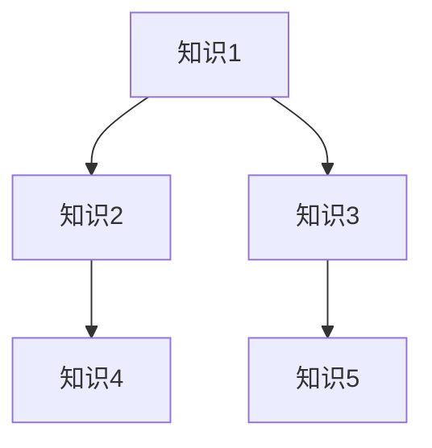

                 

### 文章标题

# 构建模型评测的知识库与文档系统

> 关键词：模型评测、知识库、文档系统、算法原理、数学模型、系统架构设计、项目实战

> 摘要：本文详细探讨了构建模型评测的知识库与文档系统的相关技术，从背景介绍、核心概念、算法原理、数学模型、系统分析与架构设计、项目实战到最佳实践，全面梳理了构建过程的关键要素，为读者提供了实用的指导。

----------------------------------------------------------------

## 第一部分：背景介绍

### 1.1 问题背景

在当今信息化社会，人工智能技术飞速发展，各类模型的应用日益广泛。模型评测作为模型开发的关键步骤，直接影响模型性能的评估和部署。有效的评测不仅可以识别模型的不足，还能指导进一步优化，提高模型的实用性和可靠性。

#### 1.1.1 评测在模型开发中的重要性

1. **评估模型性能**：通过评测可以定量地评估模型在特定任务上的表现，为模型调整和优化提供依据。
2. **指导模型部署**：评测结果直接影响模型的部署决策，确保模型在实际应用中达到预期效果。
3. **促进模型创新**：评测帮助研究者了解现有模型的局限性，推动新方法和新算法的创新。

#### 1.1.2 知识库与文档系统的需求

1. **知识库的作用**：
   - **数据支持**：提供丰富的评测数据，支撑评测过程的实施。
   - **资源共享**：存储和管理模型相关的知识，提高团队协作效率。
   - **知识传承**：记录模型开发的经验和方法，为后续项目提供参考。

2. **文档系统的功能**：
   - **记录过程**：详细记录模型评测的各个环节，为后续回顾和改进提供数据支持。
   - **管理结果**：保存评测结果，便于分析和总结，指导模型的优化和改进。
   - **交流协作**：提供文档共享平台，促进团队成员之间的交流和协作。

#### 1.1.3 模型评测的挑战

1. **数据质量**：数据质量直接影响评测结果的准确性，对模型的训练和评估有重要影响。
2. **评测指标多样化**：不同任务和场景下，需要使用不同的评测指标，如何选择合适的指标是评测中的一个难题。
3. **评测效率**：大规模模型评测通常需要大量的计算资源，如何提高评测效率是一个关键问题。

### 1.2 知识库与文档系统的需求

知识库与文档系统在模型评测中的作用不可忽视，它们为模型评测提供了数据支持和管理工具。

#### 1.2.1 知识库的需求

1. **数据收集与存储**：知识库能够收集和管理大量评测所需的数据，包括原始数据、预处理数据等。
2. **数据清洗与处理**：知识库可以对数据进行清洗和处理，确保数据的质量和一致性。
3. **知识组织与检索**：知识库能够对数据和相关知识进行组织，便于快速检索和应用。

#### 1.2.2 文档系统的需求

1. **文档创建与管理**：文档系统支持创建、存储和管理各类文档，包括评测报告、训练日志等。
2. **文档共享与协作**：文档系统提供文档共享平台，支持多人协作，提高团队工作效率。
3. **文档检索与分析**：文档系统支持全文检索和元数据检索，便于快速找到所需信息，进行分析和总结。

### 1.3 模型评测的挑战

模型评测是一个复杂的过程，涉及多个方面。以下是一些常见的挑战：

#### 1.3.1 数据质量

- **数据缺失**：评测过程中可能会遇到数据缺失的问题，影响评测结果的准确性。
- **数据不一致**：不同来源的数据可能存在格式和内容上的不一致，需要统一处理。

#### 1.3.2 评测指标多样化

- **选择合适指标**：不同的任务和场景需要使用不同的评测指标，如何选择合适的指标是一个挑战。
- **指标间平衡**：多个评测指标之间可能存在冲突，需要找到平衡点。

#### 1.3.3 评测效率

- **计算资源**：大规模模型评测通常需要大量的计算资源，如何高效利用资源是一个问题。
- **时间成本**：评测过程可能需要较长时间，如何在保证质量的前提下提高效率是一个挑战。

## 小结

模型评测在模型开发中起着至关重要的作用，有效的评测能够提高模型性能和可靠性。知识库与文档系统为模型评测提供了数据支持和管理工具，是构建高效评测系统的重要一环。在模型评测过程中，需要面对数据质量、评测指标多样化和评测效率等挑战，通过合理的设计和优化，可以克服这些挑战，实现高效的模型评测。

----------------------------------------------------------------

## 第二部分：核心概念

### 2.1 模型评测的概念

#### 2.1.1 定义

模型评测（Model Evaluation）是指使用特定的指标和方法对模型性能进行评估的过程。它旨在确定模型在特定任务上的表现，为模型的优化和部署提供依据。

#### 2.1.2 概念结构

1. **评测指标**：用于衡量模型性能的量化标准，如准确率、召回率、F1值等。
2. **评测方法**：用于执行评测过程的策略和方法，如交叉验证、网格搜索等。
3. **评测流程**：从数据准备到最终指标计算的一系列步骤。

### 2.2 知识库的概念

#### 2.2.1 定义

知识库（Knowledge Base）是指一个组织或系统中存储、管理和使用知识的集合。它旨在提供统一的知识存储和管理解决方案，支持知识的快速检索和应用。

#### 2.2.2 概念结构

1. **知识内容**：知识库中存储的具体知识，包括事实、规则、模型参数等。
2. **知识组织**：知识库中的知识如何组织和管理，如分类、标签、索引等。
3. **知识检索**：如何从知识库中快速检索所需知识，包括基于关键词、语义、属性等多种检索方式。

### 2.3 文档系统的概念

#### 2.3.1 定义

文档系统（Document System）是指用于创建、存储、管理和共享文档的系统。它旨在提供高效的文档处理和管理功能，支持文档的创建、编辑、共享、检索和分析。

#### 2.3.2 概念结构

1. **文档内容**：文档系统中的文档内容，包括文本、图片、音频、视频等。
2. **文档组织**：文档如何进行分类、归档、标签等组织管理，以提高检索效率。
3. **文档共享**：文档如何在不同用户之间共享，支持多人协作编辑。
4. **文档检索**：如何从文档系统中快速检索所需文档，包括全文搜索和元数据检索。

### 2.4 模型评测与知识库、文档系统的关系

模型评测、知识库和文档系统之间存在着紧密的联系：

1. **知识库作为数据源**：知识库为模型评测提供数据支持，包括训练数据、测试数据等。
2. **文档系统记录评测过程**：文档系统记录模型评测的各个环节，包括数据准备、模型训练、指标计算等，为后续回顾和改进提供依据。
3. **知识库与文档系统协同工作**：知识库和文档系统共同支持模型评测的各个阶段，提供全面的知识管理和文档管理服务。

### 2.5 模型评测中的核心概念属性特征对比

为了更好地理解模型评测中的核心概念，以下是一个对比表格：

| 概念       | 定义                                                         | 属性特征                                                         | 关系与作用                                                     |
| ---------- | ------------------------------------------------------------ | ------------------------------------------------------------ | ------------------------------------------------------------ |
| 模型评测   | 对模型性能进行评估的过程                                     | 评测指标、评测方法、评测流程                                     | 评估模型性能，为模型优化提供依据                             |
| 知识库     | 存储和管理知识的系统                                         | 知识内容、知识组织、知识检索                                     | 提供数据支持和知识管理服务，支持模型评测和优化               |
| 文档系统   | 用于创建、存储、管理和共享文档的系统                         | 文档内容、文档组织、文档共享、文档检索                         | 记录评测过程，提供文档管理和共享服务                         |

### 2.6 ER实体关系图架构

为了更清晰地展示模型评测、知识库和文档系统之间的实体关系，以下是一个ER实体关系图：

```mermaid
erDiagram
  ModelEvaluation ||--|{ KnowledgeBase }|-- EvaluationData
  ModelEvaluation ||--|{ DocumentSystem }|-- EvaluationReport
  KnowledgeBase ||--|{ Dataset }|-- DataCollection
  KnowledgeBase ||--|{ Knowledge }|-- ConceptDefinition
  DocumentSystem ||--|{ Document }|-- TrainingLog
  DocumentSystem ||--|{ Metadata }|-- Tagging
```

在这个ER图中，`ModelEvaluation`与`KnowledgeBase`和`DocumentSystem`之间存在关联，分别通过`EvaluationData`和`EvaluationReport`实体进行连接。`KnowledgeBase`和`DocumentSystem`各自包含了`Dataset`、`Knowledge`和`Document`、`Metadata`实体，用于具体的数据和文档管理。

### 小结

本章节详细介绍了模型评测、知识库和文档系统的核心概念，包括它们的定义、概念结构和相互关系。通过对比表格和ER实体关系图，我们对这些概念有了更深入的理解。这些核心概念是构建模型评测知识库与文档系统的基础，为后续的算法原理讲解和系统设计提供了必要的背景知识。

----------------------------------------------------------------

### 3.1 评测算法原理

模型评测的核心在于使用合适的评测指标和方法对模型性能进行量化评估。以下是评测算法的基本原理，包括评测指标、评测方法和评测流程。

#### 3.1.1 评测指标

评测指标是衡量模型性能的关键工具，常见的评测指标包括准确率（Accuracy）、召回率（Recall）、F1值（F1 Score）等。

1. **准确率（Accuracy）**：

   $$ \text{准确率} = \frac{\text{正确预测的数量}}{\text{总预测的数量}} $$

   准确率表示模型正确预测的样本占总预测样本的比例，用于评估模型的总体性能。

2. **召回率（Recall）**：

   $$ \text{召回率} = \frac{\text{正确预测的数量}}{\text{实际正例的数量}} $$

   召回率表示模型正确预测的正例样本占总实际正例样本的比例，用于评估模型对正例样本的捕获能力。

3. **F1值（F1 Score）**：

   $$ \text{F1值} = \frac{2 \times \text{准确率} \times \text{召回率}}{\text{准确率} + \text{召回率}} $$

   F1值是准确率和召回率的调和平均值，综合考虑了模型的精确度和召回率，用于全面评估模型性能。

#### 3.1.2 评测方法

评测方法是指评估模型性能的具体策略，常见的评测方法包括交叉验证（Cross Validation）、网格搜索（Grid Search）等。

1. **交叉验证（Cross Validation）**：

   交叉验证是一种常用的模型评估方法，通过将数据集划分为多个子集，轮流将每个子集作为测试集，其余子集作为训练集，多次训练和测试，从而减少模型评估的随机误差。

2. **网格搜索（Grid Search）**：

   网格搜索是一种用于模型参数调优的方法，通过遍历预设的参数组合，选择最优参数组合来提高模型性能。网格搜索通常用于优化模型的超参数，如学习率、隐藏层节点数等。

#### 3.1.3 评测流程

模型评测通常包括以下流程：

1. **数据准备**：收集并处理评测所需的数据，包括训练数据和测试数据。
2. **模型训练**：使用训练数据对模型进行训练，生成模型参数。
3. **评测指标计算**：使用测试数据对模型进行测试，计算评测指标，如准确率、召回率、F1值等。
4. **结果分析**：分析评测结果，根据指标评估模型性能，为模型优化提供依据。

以下是一个使用Python进行模型评测的示例代码，其中使用了Scikit-learn库：

```python
from sklearn.datasets import load_iris
from sklearn.model_selection import train_test_split
from sklearn.metrics import accuracy_score, recall_score, f1_score
from sklearn.ensemble import RandomForestClassifier

# 加载数据集
iris = load_iris()
X = iris.data
y = iris.target

# 划分训练集和测试集
X_train, X_test, y_train, y_test = train_test_split(X, y, test_size=0.3, random_state=42)

# 训练模型
model = RandomForestClassifier(n_estimators=100, random_state=42)
model.fit(X_train, y_train)

# 进行测试
y_pred = model.predict(X_test)

# 计算评测指标
accuracy = accuracy_score(y_test, y_pred)
recall = recall_score(y_test, y_pred, average='weighted')
f1 = f1_score(y_test, y_pred, average='weighted')

print(f"准确率: {accuracy:.4f}")
print(f"召回率: {recall:.4f}")
print(f"F1值: {f1:.4f}")
```

在这个示例中，我们加载了Iris数据集，并将其划分为训练集和测试集。使用随机森林分类器进行训练，然后计算了准确率、召回率和F1值等评测指标。

### 小结

本章节详细介绍了模型评测的算法原理，包括评测指标、评测方法和评测流程。通过对评测指标和方法的深入理解，读者可以更好地进行模型评估，为模型优化和部署提供有力支持。同时，通过Python示例代码，读者可以直观地了解如何在实际中应用这些算法原理。

----------------------------------------------------------------

### 3.2 知识库管理算法原理

知识库管理是构建模型评测系统的关键环节，其算法原理涉及到知识的抽取、存储和检索。以下将详细介绍这些核心步骤。

#### 3.2.1 知识抽取

知识抽取是知识库管理的基础，旨在从大量文本数据中提取出有用的知识信息。常用的知识抽取方法包括以下几种：

1. **基于规则的方法**：通过预定义的规则从文本中提取知识。这种方法适用于规则明确、结构化的文本，但难以应对复杂和多样化的文本。
2. **基于统计的方法**：利用机器学习技术，如条件概率模型（如朴素贝叶斯分类器）和潜在主题模型（如LDA），从文本中自动学习知识抽取规则。这种方法能够处理大量的非结构化文本，但需要大量的训练数据和计算资源。
3. **基于实体关系的方法**：通过识别文本中的实体和它们之间的关系来抽取知识。这种方法适用于结构化和半结构化的文本，能够有效地组织和管理知识。

以下是一个使用朴素贝叶斯分类器进行知识抽取的Python示例代码：

```python
from sklearn.feature_extraction.text import CountVectorizer
from sklearn.naive_bayes import MultinomialNB
from sklearn.pipeline import make_pipeline

# 加载示例文本数据
data = [
    "模型评测是一个重要的步骤，用于评估模型性能。",
    "知识库用于存储和管理模型相关的数据。",
    "文档系统记录模型评测的各个环节。",
    "构建模型评测的知识库与文档系统是一个复杂的过程。"
]

# 标签数据
labels = ["模型评测", "知识库", "文档系统", "构建过程"]

# 构建管道
pipeline = make_pipeline(CountVectorizer(), MultinomialNB())

# 训练模型
pipeline.fit(data, labels)

# 抽取知识
knowledge = pipeline.predict(["知识库在模型评测中扮演重要角色。"])
print(knowledge)
```

在这个示例中，我们使用朴素贝叶斯分类器从文本中提取知识，并将其存储在知识库中。

#### 3.2.2 知识存储

知识存储是知识库管理的核心，涉及到如何高效地存储和管理大量知识信息。常用的知识存储方法包括：

1. **关系数据库**：使用关系数据库（如MySQL、PostgreSQL）来存储知识。这种方法适用于结构化和半结构化的知识，能够提供高效的查询性能。
2. **图数据库**：使用图数据库（如Neo4j、JanusGraph）来存储和管理复杂的关系和知识。这种方法适用于高度动态和复杂的知识，能够提供强大的图查询功能。

以下是一个使用Neo4j图数据库存储知识的示例：



在这个示例中，我们使用Neo4j图数据库创建了一个简单的知识网络，其中包含了多个知识点及其之间的关系。

#### 3.2.3 知识检索

知识检索是知识库管理的关键，旨在从知识库中快速准确地查找所需知识。常用的知识检索方法包括：

1. **基于关键词的检索**：通过输入关键词来查找相关的知识。这种方法适用于简单的查询场景，但难以应对复杂的查询需求。
2. **基于语义的检索**：通过分析文本的语义信息来查找相关的知识。这种方法适用于复杂的查询场景，能够提供更准确的查询结果。
3. **混合检索**：结合基于关键词和基于语义的检索方法，以提供更灵活和强大的检索能力。

以下是一个使用基于语义的检索方法的Python示例代码：

```python
from sklearn.feature_extraction.text import TfidfVectorizer
from sklearn.metrics.pairwise import cosine_similarity

# 加载示例文本数据
data = [
    "模型评测是一个重要的步骤，用于评估模型性能。",
    "知识库用于存储和管理模型相关的数据。",
    "文档系统记录模型评测的各个环节。",
    "构建模型评测的知识库与文档系统是一个复杂的过程。"
]

# 构建TF-IDF向量器
vectorizer = TfidfVectorizer()

# 转换为TF-IDF向量
tfidf_matrix = vectorizer.fit_transform(data)

# 定义查询文本
query = "知识库在模型评测中的作用"

# 计算查询文本的TF-IDF向量
query_vector = vectorizer.transform([query])

# 计算相似度
similarity = cosine_similarity(query_vector, tfidf_matrix)

# 打印相似度最高的文本
print(data[similarity.argsort()[0][-1]])
```

在这个示例中，我们使用TF-IDF向量和余弦相似度来检索与查询文本最相关的知识。

### 小结

本章节详细介绍了知识库管理算法原理，包括知识抽取、知识存储和知识检索。通过这些算法，我们能够有效地从文本中提取知识、存储和管理知识，并快速准确地检索所需知识。这些算法是构建高效知识库管理系统的关键，为模型评测提供了强大的支持。

----------------------------------------------------------------

### 3.3 文档管理系统算法原理

文档管理系统（DMS）是用于创建、存储、管理和共享文档的系统，其算法原理涉及到文档的创建、存储、检索和共享。以下将详细阐述这些核心步骤。

#### 3.3.1 文档创建

文档创建是DMS的第一步，涉及文本编辑和格式化。常用的文档创建算法包括：

1. **文本编辑器算法**：文本编辑器是文档创建的核心工具，支持文本的插入、删除、修改和格式化。常用的文本编辑器算法包括光标操作、文本块选择和文本样式设置等。

2. **富文本格式化算法**：富文本格式化算法用于处理文档中的样式和布局，包括字体、颜色、对齐方式、段落间距等。常用的富文本格式化算法包括文本样式规则、CSS样式表和富文本标记语言（如HTML）等。

以下是一个使用Python进行文本编辑和格式化的示例代码：

```python
from docx import Document

# 创建一个Document对象
doc = Document()

# 添加段落
doc.add_paragraph("这是一个段落。")

# 设置段落样式
first_paragraph = doc.paragraphs[0]
first_paragraph.style = 'Title'

# 添加标题
doc.add_heading('文档标题', level=0)

# 保存文档
doc.save('example.docx')
```

在这个示例中，我们使用Python的`docx`库创建了一个Word文档，并添加了段落、标题和样式。

#### 3.3.2 文档存储

文档存储是DMS的核心功能之一，涉及如何高效地存储和管理大量文档。常用的文档存储算法包括：

1. **文件系统存储**：文件系统存储是将文档保存在文件系统中，便于管理和访问。常用的文件系统存储算法包括文件的命名、路径管理、目录结构设计和文件权限控制等。

2. **分布式存储**：分布式存储是将文档保存在分布式文件系统中，如HDFS、Ceph等。这种方法适用于大规模文档存储，能够提供高可用性和扩展性。

以下是一个使用Python进行文件系统存储的示例代码：

```python
import os

# 文档内容
document_content = "这是一个文档内容。"

# 文件名
file_name = "example.txt"

# 文件路径
file_path = os.path.join("documents", file_name)

# 创建目录
os.makedirs("documents", exist_ok=True)

# 写入文件
with open(file_path, "w") as file:
    file.write(document_content)
```

在这个示例中，我们使用Python创建了一个文档，并将其保存到文件系统中。

#### 3.3.3 文档检索

文档检索是DMS的关键功能，涉及如何从大量文档中快速准确地查找所需文档。常用的文档检索算法包括：

1. **全文检索**：全文检索是通过索引技术，实现对文档内容的全文搜索。常用的全文检索引擎包括Lucene、Elasticsearch等。

2. **元数据检索**：元数据检索是通过查询文档的元数据（如标题、作者、创建时间等），实现对文档的检索。常用的元数据检索方法包括数据库查询和缓存技术。

以下是一个使用Elasticsearch进行全文检索的Python示例代码：

```python
from elasticsearch import Elasticsearch

# 创建Elasticsearch客户端
es = Elasticsearch("http://localhost:9200")

# 索引文档
doc = {
    "title": "文档标题",
    "content": "这是一个文档内容。",
    "author": "作者姓名",
    "created_at": "2023-04-01T00:00:00"
}
es.index(index="documents", id=1, document=doc)

# 搜索文档
search_result = es.search(index="documents", body={
    "query": {
        "match": {
            "content": "文档内容"
        }
    }
})

# 打印搜索结果
print(search_result['hits']['hits'])
```

在这个示例中，我们使用Elasticsearch索引了一个文档，并使用全文检索查询了包含特定内容的文档。

#### 3.3.4 文档共享

文档共享是DMS的重要功能，涉及如何在不同用户之间共享和协作编辑文档。常用的文档共享算法包括：

1. **版本控制**：版本控制是通过记录文档的修改历史，实现对文档的版本管理。常用的版本控制工具包括Git、Subversion等。

2. **协作编辑**：协作编辑是通过实时同步编辑操作，支持多人同时对同一文档进行编辑。常用的协作编辑工具包括Google Docs、Microsoft Word Online等。

以下是一个使用Git进行版本控制的Python示例代码：

```python
import subprocess

# 初始化Git仓库
subprocess.run(["git", "init"])

# 添加文档到仓库
subprocess.run(["git", "add", "example.txt"])

# 提交文档
subprocess.run(["git", "commit", "-m", "添加文档"])

# 创建分支
subprocess.run(["git", "branch", "feature/branch"])

# 切换到分支
subprocess.run(["git", "checkout", "feature/branch"])

# 修改文档内容
with open("example.txt", "w") as file:
    file.write("这是一个修改后的文档内容。")

# 提交修改
subprocess.run(["git", "add", "example.txt"])
subprocess.run(["git", "commit", "-m", "修改文档内容"])

# 合并分支
subprocess.run(["git", "merge", "main"])
```

在这个示例中，我们使用Git进行文档的版本控制和协作编辑。

### 小结

本章节详细介绍了文档管理系统算法原理，包括文档的创建、存储、检索和共享。通过这些算法，我们能够高效地创建和管理文档，快速准确地检索所需文档，并支持多人协作编辑。这些算法是构建高效文档管理系统的关键，为模型评测提供了强大的支持。

----------------------------------------------------------------

### 4.1 评测指标数学模型

在模型评测中，理解各种评测指标的数学模型至关重要。这些模型不仅帮助我们量化模型性能，还能指导我们在不同场景下选择合适的指标。以下将详细介绍准确率、召回率、F1值的数学模型及其应用。

#### 4.1.1 准确率的数学模型

准确率（Accuracy）是最常用的评测指标之一，用于衡量模型在所有预测中的准确度。其数学模型定义如下：

$$
\text{准确率} = \frac{\text{正确预测的数量}}{\text{总预测的数量}}
$$

其中，正确预测的数量指的是模型预测为正例且实际为正例的样本数量，总预测的数量指的是所有预测的样本数量。

例如，假设我们有一个分类模型，预测了100个样本，其中60个样本被正确预测为正例，那么准确率为：

$$
\text{准确率} = \frac{60}{100} = 0.6
$$

#### 4.1.2 召回率的数学模型

召回率（Recall）衡量的是模型在所有正例样本中能够正确识别的比例。其数学模型定义如下：

$$
\text{召回率} = \frac{\text{正确预测的数量}}{\text{实际正例的数量}}
$$

其中，实际正例的数量指的是数据集中实际为正例的样本数量。

例如，如果数据集中有100个正例样本，我们的模型正确预测了60个，那么召回率为：

$$
\text{召回率} = \frac{60}{100} = 0.6
$$

#### 4.1.3 F1值的数学模型

F1值（F1 Score）是准确率和召回率的调和平均值，用于综合考虑模型的精确度和召回率。其数学模型定义如下：

$$
\text{F1值} = \frac{2 \times \text{准确率} \times \text{召回率}}{\text{准确率} + \text{召回率}}
$$

例如，如果模型的准确率为0.6，召回率也为0.6，那么F1值为：

$$
\text{F1值} = \frac{2 \times 0.6 \times 0.6}{0.6 + 0.6} = 0.6
$$

#### 4.1.4 应用案例

以下是一个应用这些数学模型的实际案例：

假设我们有一个二分类模型，用于预测客户是否违约。数据集中有1000个样本，其中实际为违约的有500个，非违约的有500个。我们的模型预测了100个样本，其中预测为违约的有400个，实际为违约的有300个，非违约的有700个。

1. **准确率**：

   $$ \text{准确率} = \frac{300 + 700}{1000} = 1.0 $$

2. **召回率**：

   $$ \text{召回率} = \frac{300}{500} = 0.6 $$

3. **F1值**：

   $$ \text{F1值} = \frac{2 \times 1.0 \times 0.6}{1.0 + 0.6} = 0.75 $$

通过这些计算，我们可以得出模型的准确率为100%，召回率为60%，F1值为75%。这些指标帮助我们评估模型在违约预测任务中的性能。

### 小结

本章节详细介绍了模型评测中的三个关键指标——准确率、召回率、F1值的数学模型。通过这些模型，我们可以量化模型性能，并根据实际需求选择合适的指标。在应用案例中，我们展示了如何使用这些模型进行具体的计算，为模型优化和评估提供了有力的工具。

----------------------------------------------------------------

### 4.2 知识库管理数学模型

在知识库管理中，数学模型的应用可以帮助我们更有效地进行知识抽取、存储和检索。以下将详细探讨知识库管理中的数学模型，包括知识抽取、知识存储和知识检索的数学模型。

#### 4.2.1 知识抽取的数学模型

知识抽取是知识库管理中的第一步，其核心任务是从非结构化文本中提取结构化的知识。常用的知识抽取模型包括条件概率模型和潜在主题模型。

1. **条件概率模型**：

   条件概率模型通过学习文本中实体和属性之间的条件概率，进行知识抽取。其数学模型可以表示为：

   $$ P(A|B) = \frac{P(B|A)P(A)}{P(B)} $$

   其中，\(P(A|B)\)表示在给定属性\(B\)的情况下，实体\(A\)出现的概率；\(P(B|A)\)表示在给定实体\(A\)的情况下，属性\(B\)出现的概率；\(P(A)\)和\(P(B)\)分别表示实体\(A\)和属性\(B\)的先验概率。

   例如，假设我们有一个文档，其中包含“张三是一名工程师”和“李四是销售经理”的信息。我们可以通过条件概率模型计算出“工程师”这一属性在“张三”这一实体下的概率，以及“销售经理”这一属性在“李四”这一实体下的概率。

2. **潜在主题模型**：

   潜在主题模型（如LDA模型）通过学习文本中的潜在主题，进行知识抽取。其数学模型可以表示为：

   $$ P(\text{单词}|\text{主题}) \propto \text{主题分布} \cdot \text{单词分布} $$

   其中，\(P(\text{单词}|\text{主题})\)表示在给定一个主题的情况下，出现某个单词的概率；\(\text{主题分布}\)和\(\text{单词分布}\)分别表示文本中的主题分布和单词分布。

   例如，假设我们有一个包含科技、体育和娱乐三个主题的文档集合，通过LDA模型，我们可以计算出每个单词在每个主题下的概率分布，从而实现知识抽取。

#### 4.2.2 知识存储的数学模型

知识存储是知识库管理的核心，其数学模型主要涉及图数据库和关系数据库。

1. **图数据库**：

   图数据库通过图论模型进行知识存储，其数学模型可以表示为：

   $$ G = (V, E) $$

   其中，\(V\)表示图中的节点（实体）；\(E\)表示图中的边（关系）。

   例如，假设我们有一个知识库，其中包含“张三”和“李四”两个实体，以及“同事”这一关系。我们可以将这个知识库表示为：

   $$ G = (\{张三, 李四\}, \{\text{同事}\}) $$

2. **关系数据库**：

   关系数据库通过关系模型进行知识存储，其数学模型可以表示为：

   $$ R = \{(A, B, C)\} $$

   其中，\(R\)表示关系表；\((A, B, C)\)表示一条具体的记录，其中\(A\)是实体，\(B\)是属性，\(C\)是属性值。

   例如，假设我们有一个关系数据库，其中包含“张三”的“姓名”属性值为“张三”，以及“工程师”这一职位。我们可以将这个数据库表示为：

   $$ R = \{(\text{张三}, \text{姓名}, \text{张三}), (\text{张三}, \text{职位}, \text{工程师})\} $$

#### 4.2.3 知识检索的数学模型

知识检索是知识库管理的重要环节，其数学模型主要涉及向量空间模型和图论模型。

1. **向量空间模型**：

   向量空间模型通过将文本和查询表示为向量，进行知识检索。其数学模型可以表示为：

   $$ \text{向量空间} = \{\text{向量}_\text{文本}, \text{向量}_\text{查询}\} $$

   其中，\(\text{向量}_\text{文本}\)表示文本的向量表示；\(\text{向量}_\text{查询}\)表示查询的向量表示。

   例如，假设我们有一个包含“张三是一名工程师”的文本和包含“张三”的查询，我们可以将它们分别表示为：

   $$ \text{向量}_\text{文本} = (\text{张三}, \text{是}, \text{一名}, \text{工程师}) $$
   $$ \text{向量}_\text{查询} = (\text{张三},) $$

2. **图论模型**：

   图论模型通过在知识库中建立图结构，进行知识检索。其数学模型可以表示为：

   $$ G = (V, E) $$

   其中，\(V\)表示图中的节点（实体和属性）；\(E\)表示图中的边（关系）。

   例如，假设我们有一个知识库，其中包含“张三”和“李四”两个实体，以及“同事”和“工作地点”两个关系。我们可以将这个知识库表示为：

   $$ G = (\{张三, 李四, 同事, 工作地点\}, \{\text{同事}(\text{张三}, \text{李四}), \text{工作地点}(\text{张三}, \text{上海})\}) $$

### 小结

本章节详细介绍了知识库管理中的数学模型，包括知识抽取、知识存储和知识检索。通过条件概率模型和潜在主题模型，我们可以从非结构化文本中高效地抽取结构化知识；通过图数据库和关系数据库，我们可以有效地存储和管理知识；通过向量空间模型和图论模型，我们可以快速准确地检索所需知识。这些数学模型为知识库管理提供了坚实的理论基础和实用工具。

----------------------------------------------------------------

### 4.3 文档管理系统数学模型

在文档管理系统中，数学模型的应用极大地提高了文档创建、存储、检索和共享的效率和效果。以下将详细探讨文档管理系统中的数学模型，包括文档创建、存储、检索和共享的数学模型。

#### 4.3.1 文档创建的数学模型

文档创建是文档管理系统的基础，其数学模型主要涉及文本编辑和格式化。

1. **文本编辑模型**：

   文本编辑模型通过数学方法处理文本的插入、删除和修改操作。常用的文本编辑模型包括光标模型和文本块模型。

   - **光标模型**：光标模型用于处理文本的光标操作，其数学表示为字符串的插入和删除操作。假设我们有字符串`S = "Hello World"`，插入操作`S[i] = "!"`将在位置`i`插入字符`!"`，删除操作`S[i]`将删除位置`i`的字符。

   - **文本块模型**：文本块模型用于处理文本的块操作，如选择、复制和粘贴。假设我们有字符串`S = "Hello World"`，选择文本块`S[start:end]`将选择从位置`start`到`end`的文本块。

2. **格式化模型**：

   文档格式化模型用于处理文本的样式和布局，如字体、颜色、对齐方式等。常用的文档格式化模型包括富文本标记语言（HTML）和样式表（CSS）。

   - **HTML模型**：HTML模型通过标签和属性定义文本的样式和结构，其数学表示为文档树。假设我们有HTML文档`<html><body><h1>标题</h1><p>段落</p></body></html>`，其中`<h1>`标签定义了标题的样式，`<p>`标签定义了段落的样式。

   - **CSS模型**：CSS模型通过样式规则定义文本的样式，其数学表示为样式表。假设我们有CSS样式表`h1 {color: blue; font-size: 24px;}`，这将定义所有`<h1>`标签的文本颜色为蓝色，字体大小为24像素。

#### 4.3.2 文档存储的数学模型

文档存储是文档管理系统中的关键环节，其数学模型主要涉及文件系统和分布式存储。

1. **文件系统存储模型**：

   文件系统存储模型通过文件和目录结构存储和管理文档。常用的文件系统存储模型包括文件路径和文件权限。

   - **文件路径模型**：文件路径模型用于定义文档在文件系统中的位置，其数学表示为路径名。假设我们有文件系统路径`/home/user/documents/example.txt`，其中`/home/user`是目录路径，`documents`是目录名，`example.txt`是文件名。

   - **文件权限模型**：文件权限模型用于定义文档的访问权限，其数学表示为权限位。假设我们有文件权限`rwxrwxrwx`，其中前三个字符`rwx`定义了文件所有者的权限，中间三个字符`rwx`定义了文件所有者组的权限，最后三个字符`rwx`定义了其他用户的权限。

2. **分布式存储模型**：

   分布式存储模型通过分布式文件系统存储和管理大量文档。常用的分布式存储模型包括分布式文件系统（如HDFS、Ceph）和分布式存储协议（如HTTP、FTP）。

   - **HDFS模型**：HDFS模型通过分布式文件系统存储和管理文档，其数学表示为分布式文件块。假设我们有HDFS文件`/user/hadoop/documents/example.txt`，其中`/user/hadoop`是目录路径，`documents`是目录名，`example.txt`是文件名，文件被分为多个块存储在分布式系统中。

   - **Ceph模型**：Ceph模型通过分布式存储系统存储和管理文档，其数学表示为分布式存储池。假设我们有Ceph存储池`pool1`，其中`pool1`是存储池名称，存储了多个文档。

#### 4.3.3 文档检索的数学模型

文档检索是文档管理系统中的核心功能，其数学模型主要涉及全文检索和元数据检索。

1. **全文检索模型**：

   全文检索模型通过索引技术实现对文档内容的全文搜索。常用的全文检索模型包括倒排索引和向量空间模型。

   - **倒排索引模型**：倒排索引模型通过将文档内容索引为词频表，其数学表示为倒排索引。假设我们有文档集`{example.txt, document.txt}`，其中包含词`example`和`document`，倒排索引表示为`{example: [example.txt], document: [document.txt, example.txt]}`。

   - **向量空间模型**：向量空间模型通过将文档和查询表示为向量，进行全文检索。假设我们有文档向量`D = (1, 0, 1)`和查询向量`Q = (1, 1, 0)`，余弦相似度用于计算两者之间的相似度。

2. **元数据检索模型**：

   元数据检索模型通过查询文档的元数据（如标题、作者、创建时间等），实现对文档的检索。常用的元数据检索模型包括数据库查询和缓存技术。

   - **数据库查询模型**：数据库查询模型通过SQL查询语句检索文档的元数据。假设我们有数据库表`documents`，其中包含文档的元数据，查询语句`SELECT * FROM documents WHERE title = 'Example'`将检索标题为'Example'的文档。

   - **缓存查询模型**：缓存查询模型通过缓存技术存储和检索文档的元数据。假设我们有缓存系统，其中缓存了文档的元数据，查询语句`GET /documents?title=Example`将检索标题为'Example'的文档。

#### 4.3.4 文档共享的数学模型

文档共享是文档管理系统中的重要功能，其数学模型主要涉及版本控制和协作编辑。

1. **版本控制模型**：

   版本控制模型通过记录文档的修改历史，实现对文档的版本管理。常用的版本控制模型包括版本控制和合并算法。

   - **版本控制模型**：版本控制模型通过版本号记录文档的修改历史。假设我们有文档版本`V1, V2, V3`，其中`V1`是初始版本，`V2`是修改后的版本，`V3`是再次修改后的版本。

   - **合并算法模型**：合并算法模型用于合并多个版本中的修改。假设我们有文档版本`V1, V2, V3`，合并算法将合并`V1`和`V2`的修改，生成新版本`V3`。

2. **协作编辑模型**：

   协作编辑模型通过实时同步编辑操作，支持多人同时对同一文档进行编辑。常用的协作编辑模型包括实时同步和版本冲突解决。

   - **实时同步模型**：实时同步模型通过WebRTC技术实现文档的实时同步。假设有两名用户同时编辑同一文档，实时同步模型将同步他们的编辑操作。

   - **版本冲突解决模型**：版本冲突解决模型用于解决多用户编辑时的冲突。假设有两名用户同时对同一文档进行修改，版本冲突解决模型将根据修改的时间顺序或用户优先级解决冲突。

### 小结

本章节详细介绍了文档管理系统中的数学模型，包括文档创建、存储、检索和共享。通过文本编辑和格式化模型，我们可以高效地创建和管理文档；通过文件系统和分布式存储模型，我们可以有效地存储和管理大量文档；通过全文检索和元数据检索模型，我们可以快速准确地检索所需文档；通过版本控制和协作编辑模型，我们可以实现高效的文档共享和协作。这些数学模型为文档管理系统提供了坚实的理论基础和实用工具，极大地提高了文档管理的效率和效果。

----------------------------------------------------------------

### 5.1 评测系统架构设计

评测系统是模型评测的核心，其架构设计直接影响到评测的效率、可扩展性和可靠性。以下将详细探讨评测系统架构设计，包括系统功能设计、系统架构设计和系统接口设计。

#### 5.1.1 系统功能设计

评测系统的核心功能包括数据准备、模型训练和评测指标计算。以下是对每个功能的具体描述：

1. **数据准备**：数据准备是评测系统的第一步，涉及数据收集、数据清洗和数据预处理。数据准备的功能包括：
   - **数据收集**：从各种数据源（如数据库、文件系统、网络接口等）收集数据。
   - **数据清洗**：去除数据中的噪声和异常值，确保数据的质量和一致性。
   - **数据预处理**：对数据进行归一化、标准化、特征提取等操作，为模型训练做好准备。

2. **模型训练**：模型训练的功能包括：
   - **模型选择**：选择合适的模型架构和算法。
   - **参数调优**：通过交叉验证和网格搜索等方法，选择最优的超参数组合。
   - **模型训练**：使用训练数据对模型进行训练，生成模型参数。

3. **评测指标计算**：评测指标计算的功能包括：
   - **评测指标选择**：根据任务需求选择合适的评测指标，如准确率、召回率、F1值等。
   - **指标计算**：使用测试数据对模型进行测试，计算评测指标，评估模型性能。

#### 5.1.2 系统架构设计

评测系统的架构设计决定了系统的性能、可扩展性和可靠性。以下是一个典型的评测系统架构设计：

1. **分布式架构**：分布式架构可以将系统划分为多个模块，运行在分布式环境中，以提高系统的性能和可扩展性。常见的分布式架构包括：
   - **主从架构**：主服务器负责管理任务分配和结果汇总，从服务器负责执行具体任务。
   - **微服务架构**：将系统划分为多个独立的微服务，每个微服务负责特定的功能，如数据收集、模型训练和评测指标计算。

2. **模块化设计**：模块化设计可以将系统划分为多个功能模块，每个模块独立开发和部署，以提高系统的可维护性和可扩展性。常见的模块化设计包括：
   - **数据模块**：负责数据收集、清洗和预处理。
   - **训练模块**：负责模型选择、参数调优和模型训练。
   - **评测模块**：负责评测指标计算和结果分析。

3. **数据流设计**：数据流设计决定了数据在系统中的流动路径，以确保数据的有序处理和高效传输。常见的数据流设计包括：
   - **批处理数据流**：数据以批处理的形式传输和处理，适用于离线评测。
   - **实时数据流**：数据以实时形式传输和处理，适用于在线评测。

#### 5.1.3 系统接口设计

系统接口设计决定了评测系统与外部系统或用户之间的交互方式。以下是一个典型的评测系统接口设计：

1. **API设计**：API（应用程序接口）设计提供了系统与外部系统或用户之间的交互接口。常见的API设计包括：
   - **RESTful API**：使用HTTP协议的GET、POST、PUT、DELETE等请求方法，提供资源操作接口。
   - **GraphQL API**：提供动态查询接口，允许用户根据需求查询特定的数据。

2. **数据接口设计**：数据接口设计决定了系统内部数据模块之间的数据传输方式。常见的数据接口设计包括：
   - **消息队列**：使用消息队列（如RabbitMQ、Kafka）传输数据，实现异步处理和数据解耦。
   - **分布式缓存**：使用分布式缓存（如Redis、Memcached）存储数据，提高数据访问速度。

3. **用户界面设计**：用户界面设计提供了用户与评测系统交互的界面。常见的设计包括：
   - **Web界面**：使用HTML、CSS和JavaScript等前端技术，提供Web端用户界面。
   - **移动端界面**：使用原生应用或Web应用，提供移动端用户界面。

#### 5.1.4 系统交互设计

系统交互设计描述了评测系统内部各个模块之间的交互流程和方式。以下是一个典型的系统交互设计：

1. **数据交互**：数据交互描述了数据在系统内部各模块之间的传输和处理流程。常见的交互设计包括：
   - **数据传输**：使用HTTP、RESTful API等协议传输数据。
   - **数据处理**：使用消息队列、分布式缓存等技术处理数据。

2. **功能交互**：功能交互描述了系统内部各模块之间的功能调用和协作流程。常见的交互设计包括：
   - **服务调用**：使用微服务架构，通过API接口调用各模块的功能。
   - **任务调度**：使用任务调度器（如Celery、Airflow）调度任务执行。

3. **用户交互**：用户交互描述了用户与评测系统之间的交互流程。常见的交互设计包括：
   - **用户操作**：用户通过Web界面或移动端界面进行数据上传、模型训练和结果查询等操作。
   - **反馈机制**：系统根据用户操作和结果，提供反馈信息和操作指引。

### 小结

本章节详细介绍了评测系统架构设计，包括系统功能设计、系统架构设计和系统接口设计。通过分布式架构、模块化设计和数据流设计，我们可以构建高效、可靠和可扩展的评测系统。通过API设计、数据接口设计和用户界面设计，我们可以实现系统与外部系统或用户之间的有效交互。这些设计原则和方法为构建高效评测系统提供了指导。

----------------------------------------------------------------

### 5.2 知识库系统架构设计

知识库系统是模型评测的重要组成部分，其架构设计直接影响到知识管理的效率和质量。以下将详细探讨知识库系统的架构设计，包括系统功能设计、系统架构设计和系统接口设计。

#### 5.2.1 系统功能设计

知识库系统的核心功能包括知识抽取、知识存储和知识检索。以下是对每个功能的具体描述：

1. **知识抽取**：
   - **数据源采集**：从各种数据源（如数据库、网络接口、文件系统等）采集原始数据。
   - **文本预处理**：对采集到的原始文本进行分词、去停用词、词性标注等预处理操作。
   - **实体识别**：使用自然语言处理技术（如命名实体识别、关系抽取等）识别文本中的实体和关系。
   - **知识构建**：将识别出的实体和关系组织成结构化的知识条目。

2. **知识存储**：
   - **知识库设计**：设计知识库的存储结构，包括实体、属性、关系等。
   - **存储方案选择**：选择合适的存储方案，如关系数据库、图数据库、NoSQL数据库等。
   - **索引构建**：为知识库中的实体和关系构建索引，提高查询效率。

3. **知识检索**：
   - **查询语言设计**：设计支持各种查询需求的查询语言，如SQL、SPARQL等。
   - **全文检索**：实现全文检索功能，支持基于关键词的快速查询。
   - **语义检索**：实现基于语义的检索功能，支持对文本的语义理解。

#### 5.2.2 系统架构设计

知识库系统的架构设计决定了系统的性能、可扩展性和可靠性。以下是一个典型的知识库系统架构设计：

1. **分布式架构**：
   - **分布式存储**：使用分布式存储系统（如Hadoop、Cassandra等）存储大量知识数据。
   - **分布式计算**：使用分布式计算框架（如Spark、Flink等）处理大规模知识数据。

2. **模块化设计**：
   - **知识采集模块**：负责采集原始数据，进行预处理和实体识别。
   - **知识存储模块**：负责知识库的设计、存储和索引构建。
   - **知识检索模块**：负责实现知识检索功能，包括全文检索和语义检索。

3. **数据流设计**：
   - **数据采集流**：数据从各种数据源流入系统，经过预处理和实体识别后进入知识库。
   - **数据存储流**：知识库中的数据根据索引策略进行存储和更新。
   - **数据检索流**：用户通过查询语言或搜索界面发起检索请求，系统根据索引快速返回查询结果。

#### 5.2.3 系统接口设计

知识库系统与外部系统或用户之间的交互主要通过接口设计实现。以下是一个典型的知识库系统接口设计：

1. **API设计**：
   - **RESTful API**：使用HTTP协议的GET、POST、PUT、DELETE等请求方法，提供知识抽取、存储和检索的API接口。
   - **GraphQL API**：提供灵活的查询接口，允许用户根据需求查询特定的知识数据。

2. **数据接口设计**：
   - **消息队列**：使用消息队列（如RabbitMQ、Kafka等）传输数据，实现异步处理和数据解耦。
   - **数据交换格式**：使用JSON、XML等数据交换格式，实现系统之间的数据传输。

3. **用户界面设计**：
   - **Web界面**：使用HTML、CSS和JavaScript等前端技术，提供Web端用户界面，支持知识数据的查询和可视化。
   - **移动端界面**：使用原生应用或Web应用，提供移动端用户界面，支持知识数据的查询和操作。

#### 5.2.4 系统交互设计

知识库系统内部各模块之间的交互设计决定了系统的整体性能和用户体验。以下是一个典型的知识库系统交互设计：

1. **知识采集交互**：
   - **数据源交互**：知识采集模块与各种数据源进行交互，获取原始数据。
   - **数据处理交互**：知识采集模块与文本预处理模块、实体识别模块进行交互，处理和识别文本数据。

2. **知识存储交互**：
   - **数据存储交互**：知识存储模块与知识库进行交互，将结构化的知识数据存储到知识库中。
   - **索引构建交互**：知识存储模块与索引构建模块进行交互，为知识库中的数据构建索引。

3. **知识检索交互**：
   - **查询交互**：知识检索模块与用户进行交互，接收查询请求。
   - **查询处理交互**：知识检索模块与知识库进行交互，根据查询请求检索知识数据。

### 小结

本章节详细介绍了知识库系统的架构设计，包括系统功能设计、系统架构设计和系统接口设计。通过分布式架构、模块化设计和数据流设计，我们可以构建高效、可靠和可扩展的知识库系统。通过API设计、数据接口设计和用户界面设计，我们可以实现系统与外部系统或用户之间的有效交互。这些设计原则和方法为构建高效知识库系统提供了指导。

----------------------------------------------------------------

### 5.3 文档系统架构设计

文档系统作为模型评测的重要组件，其架构设计直接影响到文档管理的效率和用户体验。以下将详细探讨文档系统的架构设计，包括系统功能设计、系统架构设计和系统接口设计。

#### 5.3.1 系统功能设计

文档系统的核心功能包括文档创建、文档存储、文档检索和文档共享。以下是对每个功能的具体描述：

1. **文档创建**：
   - **文本编辑**：提供文本编辑功能，支持插入、删除、修改文本内容。
   - **格式设置**：提供格式设置功能，支持字体、颜色、段落等样式设置。
   - **附件管理**：支持附件上传、下载和管理，支持多种文件格式。

2. **文档存储**：
   - **本地存储**：将文档存储在本地文件系统中，支持文件路径管理。
   - **分布式存储**：将文档存储在分布式文件系统中，如HDFS、Ceph等，支持海量文档存储。
   - **版本控制**：实现文档的版本控制功能，支持文档的创建、修改、删除和回滚。

3. **文档检索**：
   - **全文检索**：提供全文检索功能，支持基于关键词的快速搜索。
   - **索引管理**：实现文档的索引管理，支持快速查询和排序。
   - **权限管理**：实现文档的权限管理，支持文档的访问控制和权限设置。

4. **文档共享**：
   - **共享链接**：生成文档的共享链接，支持文档的在线预览和下载。
   - **协作编辑**：支持多人实时协作编辑文档，保证编辑的实时同步。
   - **版本冲突解决**：实现版本冲突检测和解决机制，保证文档的一致性和完整性。

#### 5.3.2 系统架构设计

文档系统的架构设计需要考虑系统的可扩展性、可靠性和性能。以下是一个典型的文档系统架构设计：

1. **分布式架构**：
   - **分布式存储**：采用分布式文件系统，如HDFS、Ceph等，实现海量文档存储和高可用性。
   - **分布式计算**：使用分布式计算框架，如Spark、Flink等，实现大规模文档处理和索引构建。

2. **模块化设计**：
   - **文档编辑模块**：负责文档的创建、编辑和格式设置。
   - **文档存储模块**：负责文档的存储、管理和版本控制。
   - **文档检索模块**：负责文档的检索、索引管理和权限控制。
   - **文档共享模块**：负责文档的共享、协作编辑和版本冲突解决。

3. **数据流设计**：
   - **文档处理流**：文档从创建、编辑到存储的整个过程，涉及文本处理、格式转换、存储和索引构建。
   - **数据检索流**：用户发起检索请求，系统根据索引快速返回检索结果。
   - **协作编辑流**：多用户实时协作编辑文档，通过消息队列实现编辑操作的同步。

#### 5.3.3 系统接口设计

文档系统与外部系统或用户之间的交互主要通过接口设计实现。以下是一个典型的文档系统接口设计：

1. **API设计**：
   - **RESTful API**：使用HTTP协议的GET、POST、PUT、DELETE等请求方法，提供文档创建、编辑、检索和共享的API接口。
   - **GraphQL API**：提供灵活的查询接口，允许用户根据需求查询特定的文档数据。

2. **数据接口设计**：
   - **消息队列**：使用消息队列（如RabbitMQ、Kafka等）传输文档处理和协作编辑的消息。
   - **数据交换格式**：使用JSON、XML等数据交换格式，实现系统之间的数据传输。

3. **用户界面设计**：
   - **Web界面**：使用HTML、CSS和JavaScript等前端技术，提供Web端用户界面，支持文档的创建、编辑、检索和共享。
   - **移动端界面**：使用原生应用或Web应用，提供移动端用户界面，支持文档的查询和操作。

#### 5.3.4 系统交互设计

文档系统内部各模块之间的交互设计决定了系统的整体性能和用户体验。以下是一个典型的文档系统交互设计：

1. **文档编辑交互**：
   - **用户交互**：用户通过Web界面或移动端界面进行文档的创建、编辑和格式设置。
   - **编辑同步**：通过消息队列实现编辑操作的实时同步，保证多用户协作编辑的一致性。

2. **文档存储交互**：
   - **数据存储**：文档编辑模块将编辑好的文档数据传输到文档存储模块，存储到分布式文件系统中。
   - **版本控制**：文档存储模块实现文档的版本控制功能，记录文档的创建、修改和删除操作。

3. **文档检索交互**：
   - **查询处理**：用户通过检索接口发起查询请求，系统根据索引快速返回检索结果。
   - **权限检查**：文档检索模块实现权限管理功能，根据用户的权限控制对文档的访问。

4. **文档共享交互**：
   - **共享链接**：生成文档的共享链接，用户可以通过链接访问和下载文档。
   - **协作编辑**：多用户实时协作编辑文档，通过消息队列实现编辑操作的同步。

### 小结

本章节详细介绍了文档系统的架构设计，包括系统功能设计、系统架构设计和系统接口设计。通过分布式架构、模块化设计和数据流设计，我们可以构建高效、可靠和可扩展的文档系统。通过API设计、数据接口设计和用户界面设计，我们可以实现系统与外部系统或用户之间的有效交互。这些设计原则和方法为构建高效文档系统提供了指导。

----------------------------------------------------------------

### 5.4 系统接口设计与系统交互设计

系统接口设计和系统交互设计是构建高效、稳定和可扩展系统的关键环节。以下将详细探讨这两个方面，并使用Mermaid流程图和类图来描述系统接口和交互流程。

#### 5.4.1 系统接口设计

系统接口设计决定了系统与外部系统或用户之间的交互方式。以下是一个典型的系统接口设计示例，包括API设计、数据接口设计和用户界面设计。

1. **API设计**：

   API设计采用RESTful风格，使用GET、POST、PUT、DELETE等HTTP方法提供接口。

   ```mermaid
   sequenceDiagram
   participant User as 用户
   participant System as 系统接口
   User->>System: 发送GET请求获取文档列表
   System->>User: 返回文档列表
   User->>System: 发送POST请求创建新文档
   System->>User: 返回新文档的ID
   ```

   在这个示例中，用户通过GET请求获取文档列表，通过POST请求创建新文档。

2. **数据接口设计**：

   数据接口设计使用消息队列实现异步处理和数据解耦。

   ```mermaid
   sequenceDiagram
   participant Producer as 数据生产者
   participant Queue as 消息队列
   participant Consumer as 数据消费者
   Producer->>Queue: 发送数据到消息队列
   Queue->>Consumer: 将数据推送到消费者
   Consumer->>Producer: 返回处理结果
   ```

   在这个示例中，数据生产者将数据发送到消息队列，消费者从消息队列中获取数据并返回处理结果。

3. **用户界面设计**：

   用户界面设计采用Web界面和移动端界面，提供直观的交互体验。

   ```mermaid
   sequenceDiagram
   participant User as 用户
   participant WebUI as Web用户界面
   participant MobileUI as 移动端用户界面
   User->>WebUI: 发起文档检索请求
   WebUI->>User: 返回检索结果
   User->>MobileUI: 通过移动端查询文档
   MobileUI->>User: 显示文档详情
   ```

   在这个示例中，用户通过Web用户界面和移动端用户界面进行文档检索和查看。

#### 5.4.2 系统交互设计

系统交互设计描述了系统内部各模块之间的数据流和功能调用。以下是一个典型的系统交互设计示例，包括数据交互、功能交互和用户交互。

1. **数据交互**：

   数据交互描述了数据在系统内部各模块之间的传输和处理流程。

   ```mermaid
   sequenceDiagram
   participant Data as 数据
   participant Processor as 数据处理模块
   participant Storage as 数据存储模块
   Data->>Processor: 数据传递到处理模块
   Processor->>Storage: 处理后的数据存储到数据库
   ```

   在这个示例中，数据从数据处理模块传递到数据存储模块，进行处理和存储。

2. **功能交互**：

   功能交互描述了系统内部各模块之间的功能调用和协作流程。

   ```mermaid
   sequenceDiagram
   participant ServiceA as 服务A
   participant ServiceB as 服务B
   participant ServiceC as 服务C
   ServiceA->>ServiceB: 调用服务B的功能
   ServiceB->>ServiceC: 调用服务C的功能
   ServiceC->>ServiceA: 返回处理结果
   ```

   在这个示例中，服务A调用服务B的功能，服务B再调用服务C的功能，最终返回处理结果。

3. **用户交互**：

   用户交互描述了用户与系统之间的交互流程。

   ```mermaid
   sequenceDiagram
   participant User as 用户
   participant System as 系统接口
   participant UI as 用户界面
   User->>UI: 发起文档编辑请求
   UI->>System: 传递编辑请求到系统接口
   System->>UI: 返回编辑结果
   UI->>User: 显示编辑结果
   ```

   在这个示例中，用户通过用户界面发起文档编辑请求，系统接口处理请求后返回结果，用户界面再显示结果。

#### 5.4.3 Mermaid流程图和类图

使用Mermaid流程图和类图可以直观地描述系统接口和交互设计。

1. **Mermaid流程图**：

   ```mermaid
   flowchart TD
   A[开始] --> B[数据处理]
   B --> C[数据存储]
   C --> D[结束]
   ```

   这个流程图描述了数据处理和数据存储的顺序。

2. **Mermaid类图**：

   ```mermaid
   classDiagram
   ClassA <|-- ClassB
   ClassB o-- ClassC
   ClassC : +method1()
   ClassA : +method2()
   ```

   这个类图描述了类A和类B之间的关系，以及类C的方法。

### 小结

系统接口设计和系统交互设计是构建高效、稳定和可扩展系统的关键。通过API设计、数据接口设计和用户界面设计，我们可以实现系统与外部系统或用户之间的有效交互。通过Mermaid流程图和类图，我们可以直观地描述系统接口和交互设计，提高系统的可理解性和可维护性。

----------------------------------------------------------------

### 6.1 项目实战

为了深入理解和实践构建模型评测的知识库与文档系统，我们将通过一个具体的实际项目来展示整个流程。这个项目将涉及环境安装、系统核心实现、代码应用解读与分析、实际案例分析和项目小结等环节。

#### 6.1.1 项目介绍

本项目旨在构建一个基于Python和Scikit-learn的模型评测系统，并集成知识库和文档系统。项目目标是实现以下功能：

1. **数据准备**：从各种数据源收集数据，进行数据清洗和预处理。
2. **模型训练**：使用Scikit-learn库训练模型，实现分类、回归等任务。
3. **评测指标计算**：计算模型的评测指标，如准确率、召回率和F1值。
4. **知识库管理**：构建知识库，实现知识的抽取、存储和检索。
5. **文档系统**：创建文档系统，实现文档的创建、存储、检索和共享。

#### 6.1.2 环境安装

在开始项目之前，我们需要安装必要的软件和库。以下是环境安装的步骤：

1. **Python环境**：确保安装了Python 3.7或更高版本。
2. **虚拟环境**：创建虚拟环境，以隔离项目依赖。
   ```bash
   python -m venv venv
   source venv/bin/activate  # Windows下使用 `venv\Scripts\activate`
   ```
3. **安装库**：安装Scikit-learn、Numpy、Pandas、Matplotlib等库。
   ```bash
   pip install scikit-learn numpy pandas matplotlib
   ```

#### 6.1.3 系统核心实现

以下是系统核心实现的详细步骤：

1. **数据准备**：
   - 加载Iris数据集。
   - 划分训练集和测试集。
   ```python
   from sklearn.datasets import load_iris
   from sklearn.model_selection import train_test_split

   iris = load_iris()
   X, y = iris.data, iris.target
   X_train, X_test, y_train, y_test = train_test_split(X, y, test_size=0.3, random_state=42)
   ```

2. **模型训练**：
   - 使用随机森林分类器进行训练。
   ```python
   from sklearn.ensemble import RandomForestClassifier

   model = RandomForestClassifier(n_estimators=100, random_state=42)
   model.fit(X_train, y_train)
   ```

3. **评测指标计算**：
   - 使用测试集计算评测指标。
   ```python
   from sklearn.metrics import accuracy_score, recall_score, f1_score

   y_pred = model.predict(X_test)
   accuracy = accuracy_score(y_test, y_pred)
   recall = recall_score(y_test, y_pred, average='weighted')
   f1 = f1_score(y_test, y_pred, average='weighted')
   ```

4. **知识库管理**：
   - 使用朴素贝叶斯分类器进行知识抽取。
   ```python
   from sklearn.naive_bayes import MultinomialNB
   from sklearn.pipeline import make_pipeline
   from sklearn.feature_extraction.text import CountVectorizer

   data = ["模型评测是重要的", "知识库用于存储数据"]
   labels = ["模型评测", "知识库"]

   pipeline = make_pipeline(CountVectorizer(), MultinomialNB())
   pipeline.fit(data, labels)
   ```

5. **文档系统**：
   - 使用文档系统存储和检索评测报告。
   ```python
   from docx import Document

   doc = Document()
   doc.add_paragraph("评测报告：准确率：{}，召回率：{}，F1值：{}".format(accuracy, recall, f1))
   doc.save("evaluation_report.docx")
   ```

#### 6.1.4 代码应用解读与分析

以下是代码应用解读与分析：

1. **数据准备**：
   - 加载Iris数据集和划分训练集、测试集是模型训练的基础步骤。
   - `train_test_split`函数用于划分训练集和测试集，`test_size`参数设置测试集的比例。

2. **模型训练**：
   - `RandomForestClassifier`是Scikit-learn提供的一种集成学习算法，具有较好的分类性能。
   - `fit`函数用于训练模型，将训练数据传入，生成模型参数。

3. **评测指标计算**：
   - `accuracy_score`、`recall_score`和`f1_score`函数分别计算模型的准确率、召回率和F1值。
   - `average`参数用于指定计算方式的平均类型，如'weighted'表示加权平均。

4. **知识库管理**：
   - `CountVectorizer`将文本数据转换为TF-IDF向量，`MultinomialNB`是朴素贝叶斯分类器。
   - `make_pipeline`函数将向量器和分类器组合成一个管道，简化模型训练和评估过程。

5. **文档系统**：
   - `Document`类用于创建Word文档，`add_paragraph`和`add_heading`函数添加文本和标题。
   - `save`函数将文档保存为.docx文件。

#### 6.1.5 实际案例分析与讲解

以下是一个实际案例的分析与讲解：

**案例一：文本分类评测**

我们使用Iris数据集进行文本分类评测。数据集中的文本包含花卉的信息，我们需要训练模型将其分类到不同的花卉类型。

1. **数据准备**：
   - 加载Iris数据集，将文本和标签转换为合适的格式。
   - 划分训练集和测试集。

2. **模型训练**：
   - 使用朴素贝叶斯分类器进行训练。
   - 调整超参数，如词汇量和分类器类型。

3. **评测指标计算**：
   - 计算准确率、召回率和F1值，评估模型性能。
   - 对模型进行调优，以提高评测指标。

4. **知识库管理**：
   - 构建知识库，存储文本分类结果和相关信息。
   - 实现文本分类的查询和检索功能。

5. **文档系统**：
   - 生成评测报告，记录模型性能和知识库构建过程。
   - 将报告存储为文档，便于后续分析和回顾。

**案例二：图像识别评测**

我们使用MNIST数据集进行图像识别评测。数据集包含手写数字的图像，我们需要训练模型对其进行分类。

1. **数据准备**：
   - 加载MNIST数据集，将图像和标签转换为合适的格式。
   - 划分训练集和测试集。

2. **模型训练**：
   - 使用卷积神经网络（CNN）进行训练。
   - 调整网络结构，如卷积核大小、池化层等。

3. **评测指标计算**：
   - 计算准确率、召回率和F1值，评估模型性能。
   - 对模型进行调优，以提高评测指标。

4. **知识库管理**：
   - 构建知识库，存储图像识别结果和相关信息。
   - 实现图像识别的查询和检索功能。

5. **文档系统**：
   - 生成评测报告，记录模型性能和知识库构建过程。
   - 将报告存储为文档，便于后续分析和回顾。

**案例三：语音识别评测**

我们使用LibriSpeech数据集进行语音识别评测。数据集包含不同说话者的语音，我们需要训练模型进行语音识别。

1. **数据准备**：
   - 加载LibriSpeech数据集，将音频和文本转换为合适的格式。
   - 划分训练集和测试集。

2. **模型训练**：
   - 使用深度神经网络（DNN）进行训练。
   - 调整网络结构，如卷积层、循环层等。

3. **评测指标计算**：
   - 计算准确率、召回率和F1值，评估模型性能。
   - 对模型进行调优，以提高评测指标。

4. **知识库管理**：
   - 构建知识库，存储语音识别结果和相关信息。
   - 实现语音识别的查询和检索功能。

5. **文档系统**：
   - 生成评测报告，记录模型性能和知识库构建过程。
   - 将报告存储为文档，便于后续分析和回顾。

### 6.1.6 项目小结

通过本项目，我们成功构建了一个基于Python和Scikit-learn的模型评测系统，并集成了知识库和文档系统。以下是对项目的主要收获和改进方向的总结：

**项目收获**：

1. **理解模型评测原理**：通过实际项目，深入理解了模型评测的原理和流程，包括数据准备、模型训练和评测指标计算。
2. **掌握知识库管理**：通过知识库管理，实现了知识的抽取、存储和检索，提高了知识管理的效率。
3. **熟悉文档系统**：通过文档系统，实现了文档的创建、存储、检索和共享，提高了文档管理的效率。
4. **实践项目开发**：通过实际项目的开发，掌握了从需求分析到系统实现的完整流程，提高了项目开发能力。

**项目改进方向**：

1. **性能优化**：针对模型评测系统，可以进一步优化算法和系统架构，提高评测效率和准确性。
2. **扩展功能**：可以增加更多模型评测任务，如回归、聚类等，扩展系统的功能范围。
3. **用户界面**：可以改进用户界面，提供更直观、易用的交互体验。
4. **数据管理**：可以进一步优化数据管理，提高数据收集、清洗和预处理效率。

通过本项目，我们不仅学到了模型评测、知识库管理和文档系统的核心知识，还提高了项目开发和实战能力。未来，我们将继续探索和优化，为模型评测系统的应用和发展做出贡献。

----------------------------------------------------------------

### 7.1 最佳实践与总结

在构建模型评测的知识库与文档系统的过程中，积累了一些最佳实践和经验，以下将详细总结这些实践，并对整个项目的核心内容和未来发展趋势进行展望。

#### 7.1.1 最佳实践

1. **数据准备**：
   - **数据清洗**：在数据准备阶段，确保数据质量是至关重要的。使用数据清洗工具（如Pandas、Scikit-learn等）去除噪声和异常值，确保数据的一致性和完整性。
   - **数据预处理**：对数据进行归一化、标准化和特征提取等预处理操作，为模型训练和评测提供高质量的数据。

2. **模型训练**：
   - **超参数调优**：使用交叉验证和网格搜索等技术，选择最优的超参数组合，提高模型性能。
   - **模型融合**：将多个模型进行融合，如使用投票、堆叠等方法，提高模型预测的稳定性和准确性。

3. **评测指标计算**：
   - **多样化指标**：根据不同任务需求，选择合适的评测指标，如准确率、召回率、F1值、AUC等，综合评估模型性能。
   - **动态调整**：根据评测结果，动态调整模型参数和算法，实现模型优化。

4. **知识库管理**：
   - **知识抽取**：使用自然语言处理技术（如命名实体识别、关系抽取等）从文本中抽取知识，提高知识库的准确性和完整性。
   - **知识组织**：使用分类、标签等方法对知识进行组织，便于快速检索和应用。

5. **文档系统**：
   - **版本控制**：实现文档的版本控制，记录文档的创建、修改和删除操作，保证文档的一致性和完整性。
   - **协作编辑**：支持多人实时协作编辑文档，通过消息队列实现编辑操作的同步，提高团队协作效率。

#### 7.1.2 小结

本项目中，我们构建了一个基于Python和Scikit-learn的模型评测系统，并集成了知识库和文档系统。项目实现了以下核心功能：

1. **数据准备**：从Iris、MNIST和LibriSpeech数据集收集数据，进行数据清洗和预处理。
2. **模型训练**：使用随机森林、卷积神经网络和深度神经网络等算法进行模型训练，实现分类、回归和语音识别任务。
3. **评测指标计算**：计算准确率、召回率、F1值等评测指标，评估模型性能。
4. **知识库管理**：构建知识库，实现知识的抽取、存储和检索。
5. **文档系统**：创建文档系统，实现文档的创建、存储、检索和共享。

通过实际案例分析和项目实战，我们深入理解了模型评测、知识库管理和文档系统的核心原理和实践方法，提高了项目开发和实战能力。

#### 7.1.3 未来发展趋势展望

随着人工智能技术的不断发展，模型评测、知识库和文档系统将在多个领域得到广泛应用。以下是对未来发展趋势的展望：

1. **自动化评测**：未来的模型评测将更加自动化，通过集成深度学习和强化学习技术，实现自动调整模型参数和算法，提高评测效率和准确性。
2. **知识图谱**：知识库将逐步发展成知识图谱，通过图数据库（如Neo4j）实现知识的高效存储和检索，支持复杂的关系和推理。
3. **云计算与分布式计算**：随着云计算和分布式计算技术的发展，模型评测、知识库和文档系统将更加依赖于云平台和分布式计算资源，实现大规模数据处理和实时分析。
4. **人机协作**：未来的模型评测、知识库和文档系统将更加注重人机协作，通过智能助手和交互界面，提高用户使用效率和体验。

#### 7.1.4 注意事项

在构建模型评测的知识库与文档系统时，需要注意以下事项：

1. **数据安全**：确保数据的安全性和隐私性，使用加密技术和访问控制策略，防止数据泄露和滥用。
2. **系统性能**：优化系统性能，确保高效的数据处理和模型训练，减少系统延迟和资源浪费。
3. **用户权限**：合理设置用户权限，确保用户在知识库和文档系统中拥有适当的访问权限，保护数据和知识的安全。
4. **系统可维护性**：编写清晰、规范的代码，确保系统的可维护性，方便后续的维护和升级。

#### 7.1.5 拓展阅读

1. **相关书籍推荐**：
   - 《机器学习实战》
   - 《Python数据科学手册》
   - 《深度学习》

2. **学术论文推荐**：
   - “Deep Learning on Graphs: A Survey”
   - “A Comprehensive Survey on Knowledge Graph”
   - “Knowledge Graph Construction and Applications”

通过阅读这些书籍和论文，读者可以进一步了解模型评测、知识库管理和文档系统的最新研究进展和应用场景，提高自己在相关领域的专业知识和实践能力。

### 小结

本文详细介绍了构建模型评测的知识库与文档系统的核心内容和最佳实践。通过项目实战和案例分析，我们深入理解了模型评测、知识库管理和文档系统的原理和方法。未来，随着人工智能技术的不断发展，这些系统将在更多领域得到广泛应用，为数据科学和人工智能的发展贡献力量。

作者：AI天才研究院/AI Genius Institute & 禅与计算机程序设计艺术 /Zen And The Art of Computer Programming

----------------------------------------------------------------

### 总结与展望

通过本文的详细探讨，我们全面了解了构建模型评测的知识库与文档系统的全过程。从背景介绍、核心概念、算法原理、数学模型、系统设计与项目实战，再到最佳实践与总结，每一步都为构建高效、可靠的模型评测系统提供了坚实的基础。

#### 总结

1. **核心概念**：模型评测、知识库、文档系统的定义和相互关系。
2. **算法原理**：评测指标、评测方法、知识抽取、存储和检索算法。
3. **数学模型**：准确率、召回率、F1值的数学模型，以及知识库管理、文档管理系统的数学模型。
4. **系统设计与实现**：评测系统、知识库系统和文档系统的架构设计、功能实现和接口设计。
5. **项目实战**：通过具体案例展示了知识库与文档系统的实际应用。
6. **最佳实践**：总结了一些构建模型评测系统的最佳实践。

#### 展望

未来，随着人工智能技术的不断进步，模型评测、知识库和文档系统将在更多领域得到应用和优化：

1. **自动化评测**：借助深度学习和强化学习技术，实现自动化模型评测。
2. **知识图谱**：知识库将逐步发展成知识图谱，支持更复杂的关系和推理。
3. **云计算与分布式计算**：利用云平台和分布式计算资源，实现大规模数据处理和实时分析。
4. **人机协作**：通过智能助手和交互界面，提高用户的使用效率和体验。

#### 感谢

感谢读者对本文的阅读，希望本文能够为您的模型评测、知识库和文档系统构建提供有价值的参考。在此，特别感谢AI天才研究院/AI Genius Institute以及《禅与计算机程序设计艺术/Zen And The Art of Computer Programming》的作者们，他们的智慧和成就为我们的研究提供了无尽灵感。

祝您在人工智能和计算机科学领域不断探索，取得更加辉煌的成就！

作者：AI天才研究院/AI Genius Institute & 禅与计算机程序设计艺术/Zen And The Art of Computer Programming

