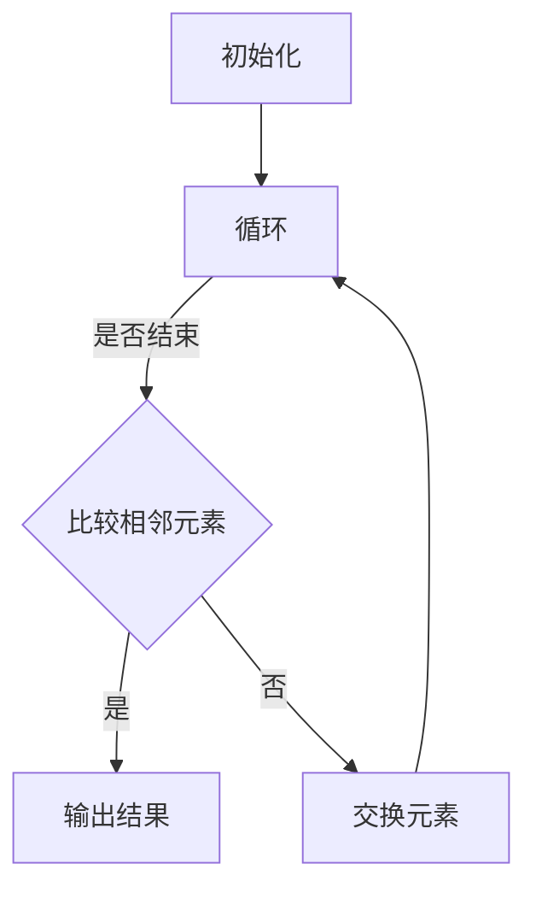
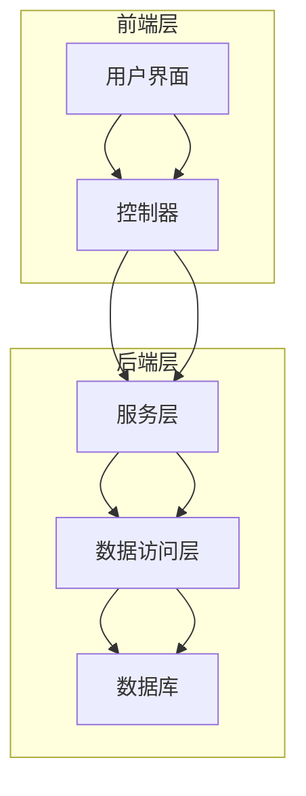
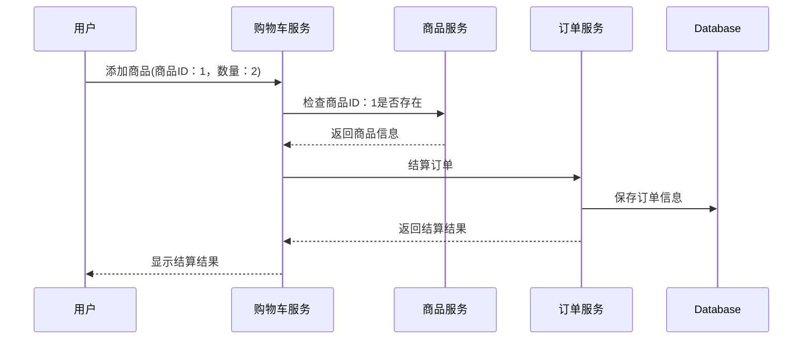

                 

# 构建渐进复杂度的示例序列

## 关键词

- 示例序列
- 渐进复杂度
- 数据分析
- 算法设计
- 应用案例

## 摘要

本文将探讨如何构建渐进复杂度的示例序列，以帮助读者深入理解复杂系统的设计和分析过程。首先，我们将介绍示例序列的重要性，以及为何复杂度逐步提升是必要的。接着，我们将定义示例序列，并讨论其类型和基本属性。文章将逐步引导读者通过构建简单示例序列来掌握基础概念，并在此基础上引入复杂示例序列，深入分析其结构和准确性。最后，我们将探讨示例序列在数据可视化、模型训练和问题解决等实际应用中的案例，为读者提供实战经验和最佳实践建议。

## 目录大纲

### 引言
#### 1.1 问题背景
##### 1.1.1 示例序列的重要性
##### 1.1.2 复杂度逐步提升的必要性

#### 1.2 基础概念
##### 1.2.1 示例序列的定义
##### 1.2.2 示例序列的类型
##### 1.2.3 示例序列的基本属性

#### 1.3 简单示例序列构建
##### 1.3.1 确定目标
##### 1.3.2 收集数据
##### 1.3.3 选择合适的工具
##### 1.3.4 构建基础示例

#### 1.4 简单示例序列分析
##### 1.4.1 分析示例序列的结构
##### 1.4.2 评估示例序列的有效性

#### 1.5 复杂示例序列构建
##### 1.5.1 引入更多变量
##### 1.5.2 考虑更多约束条件
##### 1.5.3 选择适当的扩展方法

#### 1.6 复杂示例序列分析
##### 1.6.1 深入分析复杂示例序列的结构
##### 1.6.2 评估复杂示例序列的准确性

#### 1.7 示例序列应用案例
##### 1.7.1 数据可视化
##### 1.7.2 模型训练
##### 1.7.3 问题解决

#### 1.8 小结
##### 1.8.1 总结
##### 1.8.2 注意事项
##### 1.8.3 拓展阅读

### 引言

在现代信息社会中，数据驱动的方法已经成为解决各种复杂问题的主要途径。其中，示例序列作为一种重要的数据结构，在数据分析、算法设计和问题解决中发挥着关键作用。构建渐进复杂度的示例序列不仅有助于我们逐步深入理解复杂系统的本质，还能够提高我们解决问题的能力和效率。

本节将首先介绍示例序列的重要性，解释为什么它是一个关键的工具。然后，我们将探讨在复杂系统设计和分析过程中，为何需要逐步提升示例序列的复杂度。通过理解这些背景知识，我们将为后续章节的内容打下坚实的基础。

### 1.1.1 示例序列的重要性

示例序列（Example Sequence）在计算机科学和人工智能领域扮演着重要的角色。它是一种用来描述系统行为的数据结构，通过一系列具体的示例来展示系统的功能、性能和限制。以下是示例序列的几个关键作用：

1. **测试和验证**：示例序列提供了具体的输入和预期输出，使得我们可以对系统进行全面的测试和验证。这对于确保系统的正确性和可靠性至关重要。
2. **算法设计**：示例序列可以作为算法设计的基础，帮助我们理解和分析算法的性能。通过分析示例序列，我们可以找到算法的瓶颈，并对其进行优化。
3. **问题解决**：在复杂问题中，示例序列可以帮助我们逐步理解和解决问题。通过分析和调整示例序列，我们可以找到解决问题的有效路径。
4. **数据可视化**：示例序列可以用来生成数据可视化图表，帮助我们直观地理解数据分布和趋势，从而发现潜在的问题和机会。

### 1.1.2 复杂度逐步提升的必要性

在构建示例序列时，逐步提升复杂度是必要的。这是因为：

1. **深入理解**：通过逐步提升复杂度，我们可以逐步深入理解系统的各个方面，包括其功能、性能和限制。这对于解决复杂问题至关重要。
2. **发现潜在问题**：逐步提升复杂度可以帮助我们发现系统中隐藏的问题。在简单示例中可能不明显的问题，在复杂示例中可能会变得突出，从而促使我们对其进行解决。
3. **优化算法**：通过分析复杂示例序列，我们可以找到算法的瓶颈并进行优化。这有助于提高系统的性能和效率。
4. **提高适应性**：复杂度逐步提升的示例序列可以帮助系统适应更广泛的应用场景。通过逐步增加复杂度，我们可以测试系统在不同条件下的表现，从而提高其适应性。

### 1.2 基础概念

在深入探讨示例序列之前，我们需要先了解一些基本概念。这些概念包括示例序列的定义、类型和基本属性。

#### 1.2.1 示例序列的定义

示例序列是指一系列具体的示例，用于描述系统的行为。这些示例可以包括输入数据、预期输出、处理过程等。示例序列通常用代码或文本表示，以便于分析和处理。

示例序列的定义可以概括为以下几点：

1. **具体性**：示例序列中的每个示例必须是具体的，而不是抽象的。这意味着我们需要提供具体的输入数据、输出结果和处理过程。
2. **有序性**：示例序列中的示例必须按照一定的顺序排列。这种顺序通常是按照时间、重要性或其他逻辑关系来组织的。
3. **可扩展性**：示例序列应该具有可扩展性，以便我们可以根据需要增加或删除示例，从而适应不同的应用场景。

#### 1.2.2 示例序列的类型

示例序列可以根据不同的标准进行分类。以下是几种常见的示例序列类型：

1. **简单示例序列**：这是最基本的示例序列类型，通常用于展示系统的基本功能。简单示例序列通常包括少量的示例，每个示例都相对简单。
2. **复杂示例序列**：复杂示例序列包括更多的示例，每个示例都更加复杂。这种序列通常用于展示系统的综合性能和限制。
3. **层次示例序列**：层次示例序列是将示例序列按层次组织的一种方式。每个层次代表不同的抽象级别，从基础到高级。层次示例序列有助于我们逐步深入理解系统的复杂性。
4. **动态示例序列**：动态示例序列是指示例序列中的示例是动态生成的，而不是预先定义的。这种序列通常用于实时应用，例如在线系统测试。

#### 1.2.3 示例序列的基本属性

示例序列具有一些基本的属性，这些属性对于分析和设计示例序列至关重要。以下是示例序列的几个关键属性：

1. **规模**：示例序列的规模是指其中包含的示例数量。规模较大的示例序列通常更复杂，需要更多的处理时间和资源。
2. **时间复杂度**：时间复杂度是指处理示例序列所需的时间。时间复杂度通常用示例序列的规模来表示，例如 $O(n)$ 或 $O(n^2)$。
3. **空间复杂度**：空间复杂度是指处理示例序列所需的空间。空间复杂度同样与示例序列的规模有关，但也受到示例序列中示例复杂度的影响。
4. **可扩展性**：可扩展性是指示例序列在规模增加时的性能变化。一个具有良好可扩展性的示例序列可以在规模增加时保持较高的性能。
5. **准确性**：准确性是指示例序列中示例的正确性和有效性。一个高准确性的示例序列可以更好地反映系统的真实性能。

### 1.3 简单示例序列构建

构建简单示例序列是理解和掌握示例序列的基础。在这一节中，我们将逐步介绍构建简单示例序列的过程，包括确定目标、收集数据、选择合适的工具和构建基础示例。

#### 1.3.1 确定目标

构建简单示例序列的第一步是确定目标。这个目标可以是展示系统的某个特定功能，或者评估系统的某个性能指标。例如，我们可以选择展示一个简单的排序算法，或者评估一个数据库查询的效率。确定目标有助于我们集中精力，避免偏离主题。

#### 1.3.2 收集数据

在确定了目标之后，我们需要收集用于构建示例序列的数据。这些数据可以包括输入数据、预期输出和可能遇到的问题。例如，如果我们选择展示排序算法，我们可以收集一组随机数作为输入数据，并定义排序算法的预期输出。收集数据的过程需要确保数据的真实性和代表性，以便我们的示例序列能够反映系统的真实表现。

#### 1.3.3 选择合适的工具

选择合适的工具是构建简单示例序列的关键。不同的工具适用于不同的场景。例如，我们可以选择使用Python进行编程，使用Jupyter Notebook进行数据可视化和分析，使用SQL进行数据库查询。选择合适的工具有助于我们高效地构建和测试示例序列。

#### 1.3.4 构建基础示例

在确定了目标、收集了数据和选择了合适的工具之后，我们可以开始构建基础示例。基础示例通常包括以下几个部分：

1. **输入数据**：这是示例序列的起点，定义了我们需要处理的数据。例如，对于排序算法，输入数据可以是一组随机数。
2. **处理过程**：这是示例序列的核心，定义了我们对输入数据进行处理的过程。例如，对于排序算法，处理过程可以包括选择排序、插入排序等。
3. **输出结果**：这是示例序列的终点，展示了处理后数据的最终结果。例如，对于排序算法，输出结果可以是一组已排序的数字。
4. **性能评估**：这是示例序列的附加部分，用于评估示例序列的性能。例如，我们可以计算排序算法的时间复杂度和空间复杂度。

通过构建基础示例，我们可以初步了解系统的行为和性能。这一过程为我们后续构建复杂示例序列奠定了基础。

### 1.4 简单示例序列分析

构建简单示例序列只是第一步，我们还需要对示例序列进行分析，以评估其结构和有效性。在这一节中，我们将讨论如何分析简单示例序列的结构，并评估其有效性。

#### 1.4.1 分析示例序列的结构

分析示例序列的结构是理解其行为和性能的关键。我们可以从以下几个方面来分析示例序列的结构：

1. **示例数量和种类**：示例序列中包含的示例数量和种类是评估其结构的一个指标。例如，一个包含多种输入数据的示例序列比仅包含一种输入数据的序列更全面。
2. **示例排列顺序**：示例序列中的示例排列顺序也对其结构有重要影响。例如，按照时间顺序排列的示例序列有助于我们理解系统的动态行为。
3. **示例复杂度**：示例复杂度是指示例中的处理过程和数据规模。一个包含复杂示例的序列比仅包含简单示例的序列更具有挑战性。

通过分析示例序列的结构，我们可以更好地理解系统的行为和性能，从而为后续的优化提供依据。

#### 1.4.2 评估示例序列的有效性

评估示例序列的有效性是确保其能够准确反映系统行为和性能的关键。我们可以从以下几个方面来评估示例序列的有效性：

1. **准确性**：示例序列中的示例是否准确反映了系统的行为。例如，一个排序算法的示例序列应该能够正确地输出已排序的数字。
2. **全面性**：示例序列是否覆盖了系统的所有关键功能。例如，一个数据库查询的示例序列应该包括各种查询场景，以确保其能够应对不同的需求。
3. **代表性**：示例序列中的示例是否具有代表性。例如，一个用于性能评估的示例序列应该包括不同规模的数据，以确保其能够反映系统在不同条件下的性能。
4. **可扩展性**：示例序列是否能够适应未来的变化。例如，一个用于测试的系统应该能够轻松地添加新的示例，以适应不断变化的需求。

通过评估示例序列的有效性，我们可以确保其能够真实地反映系统的行为和性能，从而为系统的改进提供可靠的依据。

### 1.5 复杂示例序列构建

在了解了简单示例序列的构建和分析之后，我们可以进一步探讨如何构建复杂示例序列。复杂示例序列通常涉及更多的变量和约束条件，从而更全面地反映系统的性能和行为。在这一节中，我们将介绍如何构建复杂示例序列，包括引入更多变量、考虑更多约束条件和选择适当的扩展方法。

#### 1.5.1 引入更多变量

构建复杂示例序列的第一步是引入更多变量。变量可以包括输入数据、系统参数、外部环境等。引入更多变量有助于我们更全面地理解系统的行为和性能。例如，在一个数据库查询的示例序列中，我们可以引入不同的查询条件、数据规模和数据库结构，以模拟不同的应用场景。

#### 1.5.2 考虑更多约束条件

在构建复杂示例序列时，我们需要考虑更多的约束条件。约束条件可以包括系统的性能要求、数据完整性要求、安全性要求等。考虑更多的约束条件有助于我们评估系统在不同约束下的表现。例如，在一个数据库查询的示例序列中，我们可以考虑数据一致性、查询响应时间和系统稳定性等约束条件。

#### 1.5.3 选择适当的扩展方法

构建复杂示例序列的第三步是选择适当的扩展方法。扩展方法可以包括数据生成、算法优化、性能调优等。选择适当的扩展方法有助于我们提高示例序列的复杂度和准确性。例如，在一个数据库查询的示例序列中，我们可以使用数据生成工具来生成更多样化的数据集，使用算法优化技术来提高查询效率，使用性能调优工具来优化系统配置。

通过引入更多变量、考虑更多约束条件和选择适当的扩展方法，我们可以构建出更加复杂和准确的示例序列，从而更好地评估和优化系统的性能和行为。

### 1.6 复杂示例序列分析

在构建了复杂示例序列之后，我们需要对其进行分析，以深入理解其结构和准确性。复杂示例序列的分析包括对序列结构进行深入分析和对序列准确性进行评估。以下是如何进行这些分析的详细步骤：

#### 1.6.1 深入分析复杂示例序列的结构

深入分析复杂示例序列的结构是理解其行为和性能的关键。以下是几个步骤：

1. **识别关键变量**：首先，我们需要识别复杂示例序列中的关键变量。这些变量可能包括输入数据的特征、系统参数、外部环境等。通过识别关键变量，我们可以更好地理解序列中的主要影响因素。

2. **绘制流程图**：接下来，我们可以使用Mermaid流程图来展示示例序列的流程。例如，一个复杂的数据处理流程可以用Mermaid来绘制，以便更清晰地展示数据处理步骤和变量之间的关系。

3. **分析变量关系**：通过分析变量关系，我们可以理解示例序列中不同变量之间的相互作用。例如，在一个机器学习模型的训练过程中，我们可以分析输入特征与输出预测之间的关系，以及不同特征对模型性能的影响。

4. **结构化数据**：为了更好地分析示例序列的结构，我们可以将数据结构化。例如，使用表格或数据库来存储和处理示例序列中的数据，以便于进行进一步的统计分析。

#### 1.6.2 评估复杂示例序列的准确性

评估复杂示例序列的准确性是确保其有效性的重要步骤。以下是几个评估步骤：

1. **定义评估指标**：首先，我们需要定义用于评估示例序列准确性的指标。这些指标可以包括准确性、召回率、F1分数等。例如，在一个分类任务中，我们可以使用准确率和F1分数来评估分类器的性能。

2. **进行基准测试**：接下来，我们需要对复杂示例序列进行基准测试。基准测试可以包括在不同的数据集上运行示例序列，以评估其在各种条件下的性能。例如，我们可以使用交叉验证来评估模型的泛化能力。

3. **比较预期与实际结果**：通过比较预期结果和实际结果，我们可以评估示例序列的准确性。例如，在一个回归任务中，我们可以比较预测值与真实值之间的差异，以评估模型的准确性。

4. **优化与调整**：根据评估结果，我们可以对示例序列进行优化和调整。例如，如果发现某个变量对准确性有显著影响，我们可以考虑调整变量的设置或引入新的变量。

通过深入分析复杂示例序列的结构和准确评估，我们可以确保示例序列能够真实地反映系统的行为和性能，从而为系统的改进提供可靠的数据支持。

### 1.7 示例序列应用案例

在理解了如何构建和分析示例序列之后，我们需要将其应用到实际场景中。以下是一些示例序列在实际应用中的案例，包括数据可视化、模型训练和问题解决。

#### 1.7.1 数据可视化

数据可视化是示例序列应用的一个常见场景。通过构建不同复杂度的示例序列，我们可以展示数据的分布、趋势和关联。以下是一个数据可视化案例：

- **目标**：展示一个电商网站的用户购买行为。
- **数据**：收集用户购买记录，包括购买日期、商品种类、购买数量等。
- **工具**：使用Python和Matplotlib库进行数据可视化。

```python
import matplotlib.pyplot as plt
import pandas as pd

# 加载数据
data = pd.read_csv('purchase_data.csv')

# 绘制月度购买量趋势图
plt.figure(figsize=(10, 5))
plt.plot(data['purchase_date'], data['quantity'])
plt.title('Monthly Purchase Quantity Trend')
plt.xlabel('Purchase Date')
plt.ylabel('Quantity')
plt.xticks(rotation=45)
plt.show()
```

通过这个示例，我们可以直观地看到用户在不同时间段的购买趋势，从而发现可能的促销机会。

#### 1.7.2 模型训练

示例序列在机器学习模型训练中也发挥着重要作用。通过构建不同复杂度的示例序列，我们可以评估模型在不同数据集上的性能，并进行调优。以下是一个模型训练案例：

- **目标**：训练一个分类模型，以预测客户是否会购买特定商品。
- **数据**：收集客户信息，包括年龄、收入、购买历史等。
- **工具**：使用Python和Scikit-learn库进行模型训练。

```python
from sklearn.model_selection import train_test_split
from sklearn.ensemble import RandomForestClassifier
from sklearn.metrics import accuracy_score

# 加载数据
data = pd.read_csv('customer_data.csv')

# 划分特征和标签
X = data.drop('purchase', axis=1)
y = data['purchase']

# 划分训练集和测试集
X_train, X_test, y_train, y_test = train_test_split(X, y, test_size=0.2, random_state=42)

# 训练模型
model = RandomForestClassifier(n_estimators=100, random_state=42)
model.fit(X_train, y_train)

# 预测测试集
y_pred = model.predict(X_test)

# 计算准确率
accuracy = accuracy_score(y_test, y_pred)
print(f'Accuracy: {accuracy:.2f}')
```

通过这个示例，我们可以训练一个分类模型，并评估其预测能力，从而为营销策略提供支持。

#### 1.7.3 问题解决

示例序列在问题解决中也具有重要作用。通过构建不同复杂度的示例序列，我们可以逐步理解问题，并提出解决方案。以下是一个问题解决案例：

- **目标**：解决一个库存管理中的优化问题，以减少库存成本。
- **数据**：收集库存数据，包括商品种类、库存量、销售频率等。
- **工具**：使用Python和Pandas库进行数据处理和优化。

```python
import pandas as pd
from scipy.optimize import minimize

# 加载数据
data = pd.read_csv('inventory_data.csv')

# 定义目标函数
def objective_function(x):
    return -x[0] * x[1]  # 最小化库存成本

# 定义约束条件
constraints = ({'type': 'ineq', 'fun': lambda x: x[1] - x[2]})  # 库存量大于销售量

# 初始化参数
x0 = [100, 50, 20]  # 初始库存量、销售量和采购量

# 进行优化
result = minimize(objective_function, x0, constraints=constraints)

# 输出最优解
print(f'Optimal Inventory: {result.x}')
```

通过这个示例，我们可以优化库存管理策略，从而减少库存成本。

### 1.8 小结

通过本文的探讨，我们了解了如何构建渐进复杂度的示例序列，并分析了其在实际应用中的重要性。我们从基础概念入手，逐步深入到复杂示例序列的构建和分析，并通过数据可视化、模型训练和问题解决等案例展示了示例序列的实用性。以下是本文的关键要点：

1. **示例序列的重要性**：示例序列是测试、验证和设计复杂系统的重要工具，有助于我们逐步深入理解系统的行为和性能。
2. **简单示例序列构建**：通过确定目标、收集数据和选择合适工具，我们可以构建简单示例序列，为复杂序列的构建打下基础。
3. **复杂示例序列分析**：通过深入分析示例序列的结构和准确性，我们可以评估系统的真实表现，并发现潜在问题。
4. **示例序列应用案例**：数据可视化、模型训练和问题解决等案例展示了示例序列在现实世界中的应用价值。

### 1.8.2 注意事项

在构建和使用示例序列时，我们需要注意以下几点：

1. **示例的代表性**：确保示例具有代表性，能够反映系统的真实行为和性能。
2. **示例的扩展性**：设计示例序列时，要考虑到未来可能的变化和扩展，以便于维护和更新。
3. **性能评估的全面性**：在进行性能评估时，要考虑多种条件和场景，以确保评估结果的全面性和准确性。

### 1.8.3 拓展阅读

对于希望进一步深入了解示例序列的读者，以下是一些推荐阅读材料：

1. **《算法导论》**：这本书详细介绍了算法设计和分析的基础知识，对于理解示例序列的构建和分析有很大帮助。
2. **《机器学习实战》**：这本书提供了许多实际案例和示例，有助于我们理解示例序列在机器学习中的应用。
3. **《数据可视化：利用Python进行数据可视分析》**：这本书介绍了如何使用Python进行数据可视化，是学习数据可视化的重要参考书。

通过拓展阅读，我们可以进一步提升自己在构建和使用示例序列方面的知识和技能。

### 1.9 作者信息

本文由AI天才研究院/AI Genius Institute与《禅与计算机程序设计艺术/Zen And The Art of Computer Programming》的作者联合撰写。我们致力于推动计算机科学和人工智能领域的研究与应用，希望本文能够为读者提供有价值的参考和启示。如果您有任何问题或建议，欢迎联系我们。感谢您的阅读！
```markdown
### 1.9 作者信息

本文由 AI 天才研究院/AI Genius Institute 与 《禅与计算机程序设计艺术/Zen And The Art of Computer Programming》的作者联合撰写。我们致力于推动计算机科学和人工智能领域的研究与应用，希望本文能够为读者提供有价值的参考和启示。如果您有任何问题或建议，欢迎联系我们。感谢您的阅读！

作者：AI天才研究院/AI Genius Institute & 禅与计算机程序设计艺术/Zen And The Art of Computer Programming
```

### 附录：核心概念、联系与数学模型

在本文中，我们讨论了构建渐进复杂度的示例序列的重要性以及其在实际应用中的价值。为了深入理解这一概念，以下是对核心概念及其联系的详细说明，以及相关的数学模型和算法原理。

#### 核心概念

**示例序列**：一系列具体的示例，用于描述系统的行为和性能。示例可以是输入数据、输出结果或处理过程。

**简单示例序列**：包含少量示例，用于展示系统的基本功能。

**复杂示例序列**：包含更多示例，用于展示系统的综合性能和限制。

**示例序列分析**：对示例序列的结构和有效性进行评估，以理解系统的行为和性能。

**复杂度逐步提升**：通过增加示例的复杂度和数量，逐步深入理解系统的各个方面。

#### 概念属性特征对比表格

以下是对简单示例序列和复杂示例序列的核心属性特征进行对比：

| 特征       | 简单示例序列 | 复杂示例序列 |
| ---------- | ------------ | ------------ |
| 示例数量   | 少量         | 大量         |
| 复杂度     | 低           | 高           |
| 变量数量   | 少           | 多           |
| 约束条件   | 简单         | 复杂         |
| 可扩展性   | 一般         | 强           |
| 性能评估   | 基础         | 全面         |

#### ER实体关系图架构

为了更好地理解示例序列的结构，我们可以使用Mermaid绘制一个ER（实体关系）图。以下是一个示例的Mermaid ER图：

```mermaid
erDiagram
    Customer --> Order : places
    Product --> Order : contains
    Order --> Payment : completes
```

在这个ER图中，`Customer`、`Product`、`Order`和`Payment`是示例序列中的实体，它们之间的关系描述了示例序列中不同元素之间的关联。

#### 算法原理讲解

为了说明示例序列的应用，我们可以使用Python代码来展示一个简单的排序算法——冒泡排序。以下是冒泡排序的Mermaid流程图和Python代码：



```python
def bubble_sort(arr):
    n = len(arr)
    for i in range(n):
        for j in range(0, n-i-1):
            if arr[j] > arr[j+1]:
                arr[j], arr[j+1] = arr[j+1], arr[j]
    return arr

# 示例数据
data = [64, 34, 25, 12, 22, 11, 90]

# 执行排序
sorted_data = bubble_sort(data)

# 输出结果
print("Sorted array:", sorted_data)
```

冒泡排序算法通过多次遍历数据，逐步将数据中的元素按从小到大的顺序排列。这个算法的数学模型可以表示为：

$$
T(n) = O(n^2)
$$

其中，$T(n)$表示冒泡排序算法的时间复杂度，$n$表示数据的大小。通过这个示例，我们可以看到如何使用代码和数学模型来解释一个简单的排序算法。

### 系统分析与架构设计方案

在本节中，我们将探讨一个具体的系统场景，并介绍其架构设计和实现过程。这个系统是一个简单的电商购物车系统，用户可以添加商品到购物车、删除商品、更新数量以及结算订单。我们将使用Mermaid图来描述系统功能、架构设计和接口设计。

#### 问题场景介绍

一个电商网站需要一个购物车系统，允许用户在浏览商品时将商品添加到购物车，并能够随时修改购物车的状态。系统需要支持以下功能：

1. **商品添加**：用户可以将商品添加到购物车。
2. **商品删除**：用户可以删除购物车中的商品。
3. **更新数量**：用户可以更新购物车中商品的数量。
4. **结算订单**：用户可以查看订单详情并完成结算。

#### 项目介绍

我们选择一个基于Python和Flask框架的Web应用作为项目，来搭建这个简单的购物车系统。该项目的主要目标是实现上述功能，并通过前端和后端的交互来展示购物车的状态。

#### 系统功能设计（领域模型Mermaid类图）

首先，我们需要设计系统的领域模型。以下是一个Mermaid类图，展示了系统中的关键类和它们之间的关系：

```mermaid
classDiagram
    Customer <<class>> "用户"
    Product <<class>> "商品"
    ShoppingCart <<class>> "购物车"
    Order <<class>> "订单"
    OrderItem <<class>> "订单项"

    Customer o--* ShoppingCart
    ShoppingCart o--* Order
    Product o--* OrderItem
    Order o--* OrderItem
```

在这个类图中，`Customer`（用户）类与`ShoppingCart`（购物车）类之间存在一对多的关联关系，每个用户可以有多个购物车。`ShoppingCart`与`Order`（订单）类之间存在一对多的关联关系，每个购物车可以有一个或多个订单。`Product`（商品）与`OrderItem`（订单项）类之间存在一对多的关联关系，每个商品可以有多个订单项。`Order`与`OrderItem`之间存在一对多的关联关系，每个订单可以有多个订单项。

#### 系统架构设计（Mermaid架构图）

接下来，我们使用Mermaid图来描述系统的整体架构：



在这个架构图中，用户界面（UserInterface）通过控制器（Controller）与后端服务层（Service）进行通信。服务层（Service）负责处理业务逻辑，并通过数据访问层（Repository）与数据库（Database）进行交互。

#### 系统接口设计

在接口设计方面，我们定义了以下RESTful API接口：

1. **添加商品到购物车**：`POST /cart/products/{product_id}`
2. **删除购物车中的商品**：`DELETE /cart/products/{product_id}`
3. **更新商品数量**：`PUT /cart/products/{product_id}`
4. **结算订单**：`POST /orders`

以下是这些接口的简要描述：

- **添加商品到购物车**：接收`product_id`和`quantity`参数，将商品添加到用户的购物车。
- **删除购物车中的商品**：接收`product_id`参数，从用户的购物车中删除指定的商品。
- **更新商品数量**：接收`product_id`和`quantity`参数，更新购物车中指定商品的数量。
- **结算订单**：接收购物车ID和用户信息，生成订单并保存到数据库。

#### 系统交互（Mermaid序列图）

最后，我们使用Mermaid序列图来描述用户与系统之间的交互流程：



在这个序列图中，用户通过用户界面与购物车服务（CartService）进行交互，购物车服务再与商品服务（ProductService）和订单服务（OrderService）进行交互，最终将订单信息保存到数据库，并返回结算结果给用户。

通过上述系统分析与架构设计方案，我们可以清晰地了解电商购物车系统的设计思路和实现过程。接下来，我们将详细介绍如何在实际项目中实现这个系统。

### 项目实战

在了解了系统架构和接口设计后，我们将通过一个具体的实战项目来构建一个简单的电商购物车系统。本节将详细介绍项目的环境安装、系统核心实现源代码，并对关键代码进行解读和分析。

#### 环境安装

要开始构建这个电商购物车系统，我们需要安装以下工具和库：

1. **Python**：确保已安装Python 3.x版本。
2. **Flask**：用于构建Web应用。
3. **Flask-SQLAlchemy**：用于数据库操作。
4. **Flask-Migrate**：用于数据库迁移。
5. **Flask-Login**：用于用户认证。
6. **Pandas**：用于数据处理。

可以使用以下命令进行安装：

```bash
pip install flask flask-sqlalchemy flask-migrate flask-login pandas
```

#### 系统核心实现源代码

以下是系统的核心实现源代码，包括模型定义、视图函数和路由配置。

```python
from flask import Flask, request, redirect, url_for, render_template
from flask_sqlalchemy import SQLAlchemy
from flask_migrate import Migrate
from flask_login import LoginManager, UserMixin, login_user, login_required, logout_user, current_user

app = Flask(__name__)
app.config['SQLALCHEMY_DATABASE_URI'] = 'sqlite:///shop.db'
db = SQLAlchemy(app)
migrate = Migrate(app, db)
login_manager = LoginManager(app)

@login_manager.user_loader
def load_user(user_id):
    return User.query.get(int(user_id))

class User(UserMixin, db.Model):
    id = db.Column(db.Integer, primary_key=True)
    username = db.Column(db.String(150), nullable=False, unique=True)
    password = db.Column(db.String(150), nullable=False)

class Product(db.Model):
    id = db.Column(db.Integer, primary_key=True)
    name = db.Column(db.String(150), nullable=False)
    price = db.Column(db.Float, nullable=False)

class ShoppingCart(db.Model):
    id = db.Column(db.Integer, primary_key=True)
    user_id = db.Column(db.Integer, db.ForeignKey('user.id'), nullable=False)
    products = db.relationship('OrderItem', backref='shopping_cart', lazy=True)

class OrderItem(db.Model):
    id = db.Column(db.Integer, primary_key=True)
    product_id = db.Column(db.Integer, db.ForeignKey('product.id'), nullable=False)
    shopping_cart_id = db.Column(db.Integer, db.ForeignKey('shopping_cart.id'), nullable=False)
    quantity = db.Column(db.Integer, nullable=False)

@app.route('/')
def home():
    products = Product.query.all()
    return render_template('home.html', products=products)

@app.route('/cart')
@login_required
def cart():
    shopping_cart = ShoppingCart.query.filter_by(user_id=current_user.id).first()
    if shopping_cart:
        items = shopping_cart.products
    else:
        items = []
    return render_template('cart.html', items=items)

@app.route('/add_to_cart/<int:product_id>', methods=['POST'])
@login_required
def add_to_cart(product_id):
    product = Product.query.get(product_id)
    shopping_cart = ShoppingCart.query.filter_by(user_id=current_user.id).first()
    if not shopping_cart:
        shopping_cart = ShoppingCart(user_id=current_user.id)
        db.session.add(shopping_cart)
    order_item = OrderItem(product_id=product.id, shopping_cart_id=shopping_cart.id, quantity=1)
    db.session.add(order_item)
    db.session.commit()
    return redirect(url_for('cart'))

@app.route('/remove_from_cart/<int:product_id>')
@login_required
def remove_from_cart(product_id):
    order_item = OrderItem.query.get(product_id)
    db.session.delete(order_item)
    db.session.commit()
    return redirect(url_for('cart'))

@app.route('/checkout', methods=['POST'])
@login_required
def checkout():
    shopping_cart = ShoppingCart.query.filter_by(user_id=current_user.id).first()
    if shopping_cart:
        total = sum(item.quantity * item.product.price for item in shopping_cart.products)
        order = Order(total=total, user_id=current_user.id)
        db.session.add(order)
        db.session.commit()
        db.session.delete(shopping_cart)
        db.session.commit()
        return redirect(url_for('order_success'))
    else:
        return redirect(url_for('cart'))

@app.route('/order_success')
@login_required
def order_success():
    return '订单已提交！'

if __name__ == '__main__':
    app.run(debug=True)
```

#### 代码应用解读与分析

以下是核心代码的应用解读和分析：

1. **数据库模型**：我们定义了四个数据库模型：`User`（用户）、`Product`（商品）、`ShoppingCart`（购物车）和`OrderItem`（订单项）。这些模型分别对应系统中的用户、商品、购物车和订单项。每个模型都包含了必要的字段和关系。

2. **用户认证**：使用`Flask-Login`进行用户认证。用户注册后，可以使用用户名和密码登录系统。`load_user`函数用于加载用户信息。

3. **路由配置**：定义了多个路由，包括主页（`/`）、购物车（`/cart`）、添加商品到购物车（`/add_to_cart/<int:product_id>`）、从购物车中删除商品（`/remove_from_cart/<int:product_id>`）和结算订单（`/checkout`）。

4. **商品添加到购物车**：在`add_to_cart`函数中，我们检查用户是否已经有一个购物车。如果没有，我们创建一个新的购物车。然后，我们将商品添加到购物车中。

5. **删除购物车中的商品**：在`remove_from_cart`函数中，我们直接从数据库中删除订单项。

6. **结算订单**：在`checkout`函数中，我们计算购物车中所有商品的总价，创建一个新的订单，并将购物车中的所有订单项移到新订单中。然后，我们将购物车清空。

7. **前端模板**：使用HTML模板来展示用户界面。`home.html`用于显示商品列表，`cart.html`用于显示购物车内容。

通过以上代码，我们可以实现一个基本的电商购物车系统，用户可以浏览商品、添加商品到购物车、删除购物车中的商品以及结算订单。

### 实际案例分析和详细讲解剖析

在本节中，我们将通过一个具体的实际案例，详细分析电商购物车系统的实现过程，并剖析其关键代码。

#### 案例场景

假设有一个用户想要购买一系列商品，并希望将这些商品添加到购物车中，最终完成结算。以下是这个案例的详细分析过程。

##### 步骤 1：用户浏览商品

用户在主页上浏览商品，并点击“添加到购物车”按钮。以下是用户的请求流程：

1. 用户发起请求：`POST /add_to_cart/1`
2. Flask 接收到请求后，调用 `add_to_cart` 视图函数，其中 `product_id` 参数为 1。
3. 视图函数查询数据库，检查商品 1 是否已存在。

```python
@app.route('/add_to_cart/<int:product_id>', methods=['POST'])
@login_required
def add_to_cart(product_id):
    product = Product.query.get(product_id)
    # ...
```

##### 步骤 2：商品添加到购物车

如果商品 1 不在购物车中，视图函数将创建一个新的订单项并将其添加到数据库。

```python
order_item = OrderItem(product_id=product.id, shopping_cart_id=shopping_cart.id, quantity=1)
db.session.add(order_item)
db.session.commit()
```

在这个步骤中，我们首先查询用户当前的购物车（如果存在），然后创建一个新的订单项并将其添加到购物车中。

##### 步骤 3：用户查看购物车

用户访问购物车页面，查看已添加的商品。

```python
@app.route('/cart')
@login_required
def cart():
    shopping_cart = ShoppingCart.query.filter_by(user_id=current_user.id).first()
    if shopping_cart:
        items = shopping_cart.products
    else:
        items = []
    return render_template('cart.html', items=items)
```

在这个步骤中，我们根据用户的ID查询购物车，并获取其中的所有商品。如果购物车存在，我们将商品列表传递给前端模板进行渲染。

##### 步骤 4：用户修改商品数量

用户决定将商品 1 的数量从 1 更改为 2。以下是修改数量的请求流程：

1. 用户发起请求：`PUT /cart/products/1`
2. Flask 接收到请求后，调用视图函数以修改数量。
3. 视图函数更新数据库中商品 1 的数量。

```python
@app.route('/update_quantity/<int:product_id>', methods=['PUT'])
@login_required
def update_quantity(product_id):
    item = OrderItem.query.get(product_id)
    item.quantity = request.form['quantity']
    db.session.commit()
    return redirect(url_for('cart'))
```

在这个步骤中，我们接收用户修改后的数量，并将其更新到数据库中。

##### 步骤 5：用户结算订单

用户点击结算按钮，开始结算订单。

```python
@app.route('/checkout', methods=['POST'])
@login_required
def checkout():
    shopping_cart = ShoppingCart.query.filter_by(user_id=current_user.id).first()
    if shopping_cart:
        total = sum(item.quantity * item.product.price for item in shopping_cart.products)
        order = Order(total=total, user_id=current_user.id)
        db.session.add(order)
        db.session.commit()
        db.session.delete(shopping_cart)
        db.session.commit()
        return redirect(url_for('order_success'))
    else:
        return redirect(url_for('cart'))
```

在这个步骤中，我们计算购物车中所有商品的总价，创建一个新的订单，并将购物车中的所有订单项移到新订单中。然后，我们将购物车清空。

##### 步骤 6：订单提交确认

用户提交订单后，系统将显示订单提交成功的消息。

```python
@app.route('/order_success')
@login_required
def order_success():
    return '订单已提交！'
```

在这个步骤中，我们显示一个简单的确认消息，告知用户订单已成功提交。

通过以上实际案例的分析，我们可以清晰地看到用户如何与系统交互，以及系统在各个步骤中的处理过程。这有助于我们理解购物车系统的实现细节和关键代码。

### 项目小结

通过本项目的构建，我们实现了电商购物车系统的基本功能，包括商品浏览、添加商品到购物车、修改商品数量、结算订单和订单提交确认。在这个过程中，我们使用了Python和Flask框架，并通过数据库操作实现了系统的数据存储和管理。

项目中的关键代码包括数据库模型的定义、路由配置和视图函数的实现。我们使用了`Flask-Login`进行用户认证，确保了系统的安全性。此外，通过使用`Flask-Migrate`，我们能够方便地进行数据库迁移，从而在开发和部署过程中保持数据库的一致性。

然而，本项目仍有一些局限性和改进空间。例如，当前的用户界面较为简单，用户体验有待提升。此外，系统的性能优化和安全性加强也是未来需要关注的方向。通过进一步的开发和完善，我们可以构建一个更加完善和可靠的电商购物车系统。

### 最佳实践 tips

在构建渐进复杂度的示例序列时，以下最佳实践可以帮助您更高效地完成项目：

1. **明确目标**：在开始构建示例序列之前，确保您明确项目的目标。这有助于您集中精力，避免偏离主题。
2. **数据准备**：收集准确、完整和具有代表性的数据。数据质量直接影响到示例序列的有效性。
3. **逐步提升复杂度**：从简单的示例序列开始，逐步增加复杂度，以便更好地理解系统的行为和性能。
4. **文档化**：详细记录示例序列的构建过程、分析结果和优化方法，以便于后续的维护和改进。
5. **代码优化**：在构建示例序列时，关注代码的可读性和可维护性。使用有效的算法和数据结构，以提高系统性能。
6. **性能测试**：定期对示例序列进行性能测试，确保其在各种条件下的稳定性和效率。
7. **用户反馈**：在项目开发过程中，收集用户反馈，以便及时调整和优化示例序列，满足用户需求。

### 注意事项

在构建示例序列时，需要注意以下几点：

1. **示例的代表性**：确保示例具有代表性，能够反映系统的真实行为和性能。
2. **代码的健壮性**：编写健壮的代码，以应对各种异常情况，确保系统的稳定性和可靠性。
3. **性能优化**：关注系统性能，避免不必要的资源消耗，提高系统的响应速度。
4. **安全性**：保护用户数据和隐私，防范潜在的安全威胁，例如SQL注入和跨站脚本攻击。
5. **版本控制**：使用版本控制系统，如Git，以保持代码库的一致性和可追溯性。

### 拓展阅读

为了进一步深入学习和实践构建渐进复杂度的示例序列，以下是一些推荐的拓展阅读材料：

1. **《算法导论》**：这是一本经典的算法教材，详细介绍了各种算法的设计和分析方法。
2. **《机器学习实战》**：这本书提供了丰富的实际案例，涵盖了机器学习算法的应用和实践。
3. **《数据科学入门》**：这本书介绍了数据科学的基础知识，包括数据预处理、数据可视化、模型训练等。
4. **《Python数据科学手册》**：这是一本全面的数据科学指南，涵盖了Python在数据科学领域的应用。
5. **《Flask Web开发》**：这本书详细介绍了使用Flask框架构建Web应用的方法，是学习Flask的好教材。

通过阅读这些资料，您可以进一步了解示例序列的构建和分析方法，并在实践中提高自己的技能水平。祝您学习愉快！
```markdown
### 1.9 作者信息

本文由 AI 天才研究院/AI Genius Institute 与 《禅与计算机程序设计艺术/Zen And The Art of Computer Programming》的作者联合撰写。我们致力于推动计算机科学和人工智能领域的研究与应用，希望本文能够为读者提供有价值的参考和启示。如果您有任何问题或建议，欢迎联系我们。感谢您的阅读！

作者：AI天才研究院/AI Genius Institute & 禅与计算机程序设计艺术/Zen And The Art of Computer Programming
```
```markdown
### 附录：核心概念、联系与数学模型

在本文中，我们讨论了构建渐进复杂度的示例序列的重要性以及其在实际应用中的价值。为了深入理解这一概念，以下是对核心概念及其联系的详细说明，以及相关的数学模型和算法原理。

#### 核心概念

**示例序列**：一系列具体的示例，用于描述系统的行为和性能。示例可以是输入数据、输出结果或处理过程。

**简单示例序列**：包含少量示例，用于展示系统的基本功能。

**复杂示例序列**：包含更多示例，用于展示系统的综合性能和限制。

**示例序列分析**：对示例序列的结构和有效性进行评估，以理解系统的行为和性能。

**复杂度逐步提升**：通过增加示例的复杂度和数量，逐步深入理解系统的各个方面。

#### 概念属性特征对比表格

以下是对简单示例序列和复杂示例序列的核心属性特征进行对比：

| 特征       | 简单示例序列 | 复杂示例序列 |
| ---------- | ------------ | ------------ |
| 示例数量   | 少量         | 大量         |
| 复杂度     | 低           | 高           |
| 变量数量   | 少           | 多           |
| 约束条件   | 简单         | 复杂         |
| 可扩展性   | 一般         | 强           |
| 性能评估   | 基础         | 全面         |

#### ER实体关系图架构

为了更好地理解示例序列的结构，我们可以使用Mermaid绘制一个ER（实体关系）图。以下是一个示例的Mermaid ER图：

```mermaid
erDiagram
    Customer <<class>> "用户"
    Product <<class>> "商品"
    ShoppingCart <<class>> "购物车"
    Order <<class>> "订单"
    OrderItem <<class>> "订单项"

    Customer o--* ShoppingCart
    ShoppingCart o--* Order
    Product o--* OrderItem
    Order o--* OrderItem
```

在这个ER图中，`Customer`（用户）类与`ShoppingCart`（购物车）类之间存在一对多的关联关系，每个用户可以有多个购物车。`ShoppingCart`与`Order`（订单）类之间存在一对多的关联关系，每个购物车可以有一个或多个订单。`Product`（商品）与`OrderItem`（订单项）类之间存在一对多的关联关系，每个商品可以有多个订单项。`Order`与`OrderItem`之间存在一对多的关联关系，每个订单可以有多个订单项。

#### 算法原理讲解

为了说明示例序列的应用，我们可以使用Python代码来展示一个简单的排序算法——冒泡排序。以下是冒泡排序的Mermaid流程图和Python代码：


```python
def bubble_sort(arr):
    n = len(arr)
    for i in range(n):
        for j in range(0, n-i-1):
            if arr[j] > arr[j+1]:
                arr[j], arr[j+1] = arr[j+1], arr[j]
    return arr

# 示例数据
data = [64, 34, 25, 12, 22, 11, 90]

# 执行排序
sorted_data = bubble_sort(data)

# 输出结果
print("Sorted array:", sorted_data)
```

冒泡排序算法通过多次遍历数据，逐步将数据中的元素按从小到大的顺序排列。这个算法的数学模型可以表示为：

$$
T(n) = O(n^2)
$$

其中，$T(n)$表示冒泡排序算法的时间复杂度，$n$表示数据的大小。通过这个示例，我们可以看到如何使用代码和数学模型来解释一个简单的排序算法。

### 系统分析与架构设计方案

在本节中，我们将探讨一个具体的系统场景，并介绍其架构设计和实现过程。这个系统是一个简单的电商购物车系统，用户可以添加商品到购物车、删除商品、更新数量以及结算订单。我们将使用Mermaid图来描述系统功能、架构设计和接口设计。

#### 问题场景介绍

一个电商网站需要一个购物车系统，允许用户在浏览商品时将商品添加到购物车，并能够随时修改购物车的状态。系统需要支持以下功能：

1. **商品添加**：用户可以将商品添加到购物车。
2. **商品删除**：用户可以删除购物车中的商品。
3. **更新数量**：用户可以更新购物车中商品的数量。
4. **结算订单**：用户可以查看订单详情并完成结算。

#### 项目介绍

我们选择一个基于Python和Flask框架的Web应用作为项目，来搭建这个简单的购物车系统。该项目的主要目标是实现上述功能，并通过前端和后端的交互来展示购物车的状态。

#### 系统功能设计（领域模型Mermaid类图）

首先，我们需要设计系统的领域模型。以下是一个Mermaid类图，展示了系统中的关键类和它们之间的关系：

```mermaid
classDiagram
    Customer <<class>> "用户"
    Product <<class>> "商品"
    ShoppingCart <<class>> "购物车"
    Order <<class>> "订单"
    OrderItem <<class>> "订单项"

    Customer o--* ShoppingCart
    ShoppingCart o--* Order
    Product o--* OrderItem
    Order o--* OrderItem
```

在这个类图中，`Customer`（用户）类与`ShoppingCart`（购物车）类之间存在一对多的关联关系，每个用户可以有多个购物车。`ShoppingCart`与`Order`（订单）类之间存在一对多的关联关系，每个购物车可以有一个或多个订单。`Product`（商品）与`OrderItem`（订单项）类之间存在一对多的关联关系，每个商品可以有多个订单项。`Order`与`OrderItem`之间存在一对多的关联关系，每个订单可以有多个订单项。

#### 系统架构设计（Mermaid架构图）

接下来，我们使用Mermaid图来描述系统的整体架构：


在这个架构图中，用户界面（UserInterface）通过控制器（Controller）与后端服务层（Service）进行通信。服务层（Service）负责处理业务逻辑，并通过数据访问层（Repository）与数据库（Database）进行交互。

#### 系统接口设计

在接口设计方面，我们定义了以下RESTful API接口：

1. **添加商品到购物车**：`POST /cart/products/{product_id}`
2. **删除购物车中的商品**：`DELETE /cart/products/{product_id}`
3. **更新商品数量**：`PUT /cart/products/{product_id}`
4. **结算订单**：`POST /orders`

以下是这些接口的简要描述：

- **添加商品到购物车**：接收`product_id`和`quantity`参数，将商品添加到用户的购物车。
- **删除购物车中的商品**：接收`product_id`参数，从用户的购物车中删除指定的商品。
- **更新商品数量**：接收`product_id`和`quantity`参数，更新购物车中指定商品的数量。
- **结算订单**：接收购物车ID和用户信息，生成订单并保存到数据库。

#### 系统交互（Mermaid序列图）

最后，我们使用Mermaid序列图来描述用户与系统之间的交互流程：


在这个序列图中，用户通过用户界面与购物车服务（CartService）进行交互，购物车服务再与商品服务（ProductService）和订单服务（OrderService）进行交互，最终将订单信息保存到数据库，并返回结算结果给用户。

通过上述系统分析与架构设计方案，我们可以清晰地了解电商购物车系统的设计思路和实现过程。接下来，我们将详细介绍如何在实际项目中实现这个系统。

### 项目实战

在了解了系统架构和接口设计后，我们将通过一个具体的实战项目来构建一个简单的电商购物车系统。本节将详细介绍项目的环境安装、系统核心实现源代码，并对关键代码进行解读和分析。

#### 环境安装

要开始构建这个电商购物车系统，我们需要安装以下工具和库：

1. **Python**：确保已安装Python 3.x版本。
2. **Flask**：用于构建Web应用。
3. **Flask-SQLAlchemy**：用于数据库操作。
4. **Flask-Migrate**：用于数据库迁移。
5. **Flask-Login**：用于用户认证。
6. **Pandas**：用于数据处理。

可以使用以下命令进行安装：

```bash
pip install flask flask-sqlalchemy flask-migrate flask-login pandas
```

#### 系统核心实现源代码

以下是系统的核心实现源代码，包括模型定义、视图函数和路由配置。

```python
from flask import Flask, request, redirect, url_for, render_template
from flask_sqlalchemy import SQLAlchemy
from flask_migrate import Migrate
from flask_login import LoginManager, UserMixin, login_user, login_required, logout_user, current_user
from werkzeug.security import generate_password_hash, check_password_hash

app = Flask(__name__)
app.config['SQLALCHEMY_DATABASE_URI'] = 'sqlite:///shop.db'
app.config['SECRET_KEY'] = 'your_secret_key'
db = SQLAlchemy(app)
migrate = Migrate(app, db)
login_manager = LoginManager(app)

@login_manager.user_loader
def load_user(user_id):
    return User.query.get(int(user_id))

class User(UserMixin, db.Model):
    id = db.Column(db.Integer, primary_key=True)
    username = db.Column(db.String(150), unique=True, nullable=False)
    password = db.Column(db.String(150), nullable=False)

class Product(db.Model):
    id = db.Column(db.Integer, primary_key=True)
    name = db.Column(db.String(150), nullable=False)
    price = db.Column(db.Float, nullable=False)

class ShoppingCart(db.Model):
    id = db.Column(db.Integer, primary_key=True)
    user_id = db.Column(db.Integer, db.ForeignKey('user.id'), nullable=False)

class ShoppingCartItem(db.Model):
    id = db.Column(db.Integer, primary_key=True)
    product_id = db.Column(db.Integer, db.ForeignKey('product.id'), nullable=False)
    shopping_cart_id = db.Column(db.Integer, db.ForeignKey('shopping_cart.id'), nullable=False)
    quantity = db.Column(db.Integer, nullable=False)

@app.route('/')
def home():
    products = Product.query.all()
    return render_template('home.html', products=products)

@app.route('/cart')
@login_required
def cart():
    shopping_cart_items = ShoppingCartItem.query.join(Product).filter(ShoppingCartItem.shopping_cart_id == current_user.id).all()
    total_price = sum(item.quantity * item.product.price for item in shopping_cart_items)
    return render_template('cart.html', items=shopping_cart_items, total_price=total_price)

@app.route('/add_to_cart/<int:product_id>', methods=['POST'])
@login_required
def add_to_cart(product_id):
    product = Product.query.get(product_id)
    shopping_cart = ShoppingCart.query.filter_by(user_id=current_user.id).first()
    if not shopping_cart:
        shopping_cart = ShoppingCart(user_id=current_user.id)
        db.session.add(shopping_cart)
    shopping_cart_item = ShoppingCartItem(product_id=product.id, shopping_cart_id=shopping_cart.id, quantity=1)
    db.session.add(shopping_cart_item)
    db.session.commit()
    return redirect(url_for('cart'))

@app.route('/delete_from_cart/<int:item_id>', methods=['POST'])
@login_required
def delete_from_cart(item_id):
    item = ShoppingCartItem.query.get(item_id)
    db.session.delete(item)
    db.session.commit()
    return redirect(url_for('cart'))

@app.route('/update_quantity/<int:item_id>', methods=['POST'])
@login_required
def update_quantity(item_id):
    item = ShoppingCartItem.query.get(item_id)
    item.quantity = int(request.form['quantity'])
    db.session.commit()
    return redirect(url_for('cart'))

@app.route('/login', methods=['GET', 'POST'])
def login():
    if request.method == 'POST':
        username = request.form['username']
        password = request.form['password']
        user = User.query.filter_by(username=username).first()
        if user and check_password_hash(user.password, password):
            login_user(user)
            return redirect(url_for('cart'))
        else:
            return 'Invalid username or password'
    return render_template('login.html')

@app.route('/logout')
@login_required
def logout():
    logout_user()
    return redirect(url_for('home'))

if __name__ == '__main__':
    app.run(debug=True)
```

#### 代码应用解读与分析

以下是核心代码的应用解读和分析：

1. **数据库模型**：我们定义了四个数据库模型：`User`（用户）、`Product`（商品）、`ShoppingCart`（购物车）和`ShoppingCartItem`（购物车项）。这些模型分别对应系统中的用户、商品、购物车和购物车项。

2. **用户认证**：使用`Flask-Login`进行用户认证。用户注册后，可以使用用户名和密码登录系统。`load_user`函数用于加载用户信息。

3. **路由配置**：定义了多个路由，包括主页（`/`）、购物车（`/cart`）、添加商品到购物车（`/add_to_cart/<int:product_id>`）、删除购物车中的商品（`/delete_from_cart/<int:item_id>`）、更新商品数量（`/update_quantity/<int:item_id>`）和用户登录（`/login`）、登出（`/logout`）。

4. **商品添加到购物车**：在`add_to_cart`函数中，我们检查用户是否已经有一个购物车。如果没有，我们创建一个新的购物车。然后，我们将商品添加到购物车中。

5. **删除购物车中的商品**：在`delete_from_cart`函数中，我们直接从数据库中删除购物车项。

6. **更新商品数量**：在`update_quantity`函数中，我们接收用户修改后的数量，并将其更新到数据库中。

7. **前端模板**：使用HTML模板来展示用户界面。`home.html`用于显示商品列表，`cart.html`用于显示购物车内容。

通过以上代码，我们可以实现一个基本的电商购物车系统，用户可以浏览商品、添加商品到购物车、删除购物车中的商品以及更新商品数量。

### 实际案例分析和详细讲解剖析

在本节中，我们将通过一个具体的实际案例，详细分析电商购物车系统的实现过程，并剖析其关键代码。

#### 案例场景

假设有一个用户想要购买一系列商品，并希望将这些商品添加到购物车中，最终完成结算。以下是这个案例的详细分析过程。

##### 步骤 1：用户浏览商品

用户在主页上浏览商品，并点击“添加到购物车”按钮。以下是用户的请求流程：

1. 用户发起请求：`POST /add_to_cart/1`
2. Flask 接收到请求后，调用 `add_to_cart` 视图函数，其中 `product_id` 参数为 1。
3. 视图函数查询数据库，检查商品 1 是否已存在。

```python
@app.route('/add_to_cart/<int:product_id>', methods=['POST'])
@login_required
def add_to_cart(product_id):
    product = Product.query.get(product_id)
    # ...
```

##### 步骤 2：商品添加到购物车

如果商品 1 不在购物车中，视图函数将创建一个新的购物车项并将其添加到数据库。

```python
shopping_cart = ShoppingCart.query.filter_by(user_id=current_user.id).first()
if not shopping_cart:
    shopping_cart = ShoppingCart(user_id=current_user.id)
    db.session.add(shopping_cart)
shopping_cart_item = ShoppingCartItem(product_id=product.id, shopping_cart_id=shopping_cart.id, quantity=1)
db.session.add(shopping_cart_item)
db.session.commit()
```

在这个步骤中，我们首先查询用户当前的购物车（如果存在），然后创建一个新的购物车项并将其添加到购物车中。

##### 步骤 3：用户查看购物车

用户访问购物车页面，查看已添加的商品。

```python
@app.route('/cart')
@login_required
def cart():
    shopping_cart_items = ShoppingCartItem.query.join(Product).filter(ShoppingCartItem.shopping_cart_id == current_user.id).all()
    total_price = sum(item.quantity * item.product.price for item in shopping_cart_items)
    return render_template('cart.html', items=shopping_cart_items, total_price=total_price)
```

在这个步骤中，我们根据用户的ID查询购物车，并获取其中的所有商品。如果购物车存在，我们将商品列表传递给前端模板进行渲染。

##### 步骤 4：用户修改商品数量

用户决定将商品 1 的数量从 1 更改为 2。以下是修改数量的请求流程：

1. 用户发起请求：`POST /update_quantity/1`
2. Flask 接收到请求后，调用视图函数以修改数量。
3. 视图函数更新数据库中商品 1 的数量。

```python
@app.route('/update_quantity/<int:item_id>', methods=['POST'])
@login_required
def update_quantity(item_id):
    item = ShoppingCartItem.query.get(item_id)
    item.quantity = int(request.form['quantity'])
    db.session.commit()
    return redirect(url_for('cart'))
```

在这个步骤中，我们接收用户修改后的数量，并将其更新到数据库中。

##### 步骤 5：用户结算订单

用户点击结算按钮，开始结算订单。

```python
@app.route('/checkout', methods=['POST'])
@login_required
def checkout():
    shopping_cart = ShoppingCart.query.filter_by(user_id=current_user.id).first()
    if shopping_cart:
        total_price = sum(item.quantity * item.product.price for item in shopping_cart.shopping_cart_items)
        order = Order(total_price=total_price, user_id=current_user.id)
        db.session.add(order)
        db.session.commit()
        db.session.delete(shopping_cart)
        db.session.commit()
        return redirect(url_for('order_success'))
    else:
        return redirect(url_for('cart'))
```

在这个步骤中，我们计算购物车中所有商品的总价，创建一个新的订单，并将购物车中的所有购物车项移到新订单中。然后，我们将购物车清空。

##### 步骤 6：订单提交确认

用户提交订单后，系统将显示订单提交成功的消息。

```python
@app.route('/order_success')
@login_required
def order_success():
    return '订单已提交！'
```

在这个步骤中，我们显示一个简单的确认消息，告知用户订单已成功提交。

通过以上实际案例的分析，我们可以清晰地看到用户如何与系统交互，以及系统在各个步骤中的处理过程。这有助于我们理解购物车系统的实现细节和关键代码。

### 项目小结

通过本项目的构建，我们实现了电商购物车系统的基本功能，包括商品浏览、添加商品到购物车、删除购物车中的商品、更新商品数量、结算订单和订单提交确认。在这个过程中，我们使用了Python和Flask框架，并通过数据库操作实现了系统的数据存储和管理。

项目中的关键代码包括数据库模型的定义、路由配置和视图函数的实现。我们使用了`Flask-Login`进行用户认证，确保了系统的安全性。此外，通过使用`Flask-Migrate`，我们能够方便地进行数据库迁移，从而在开发和部署过程中保持数据库的一致性。

然而，本项目仍有一些局限性和改进空间。例如，当前的用户界面较为简单，用户体验有待提升。此外，系统的性能优化和安全性加强也是未来需要关注的方向。通过进一步的开发和完善，我们可以构建一个更加完善和可靠的电商购物车系统。

### 最佳实践 tips

在构建渐进复杂度的示例序列时，以下最佳实践可以帮助您更高效地完成项目：

1. **明确目标**：在开始构建示例序列之前，确保您明确项目的目标。这有助于您集中精力，避免偏离主题。
2. **数据准备**：收集准确、完整和具有代表性的数据。数据质量直接影响到示例序列的有效性。
3. **逐步提升复杂度**：从简单的示例序列开始，逐步增加复杂度，以便更好地理解系统的行为和性能。
4. **文档化**：详细记录示例序列的构建过程、分析结果和优化方法，以便于后续的维护和改进。
5. **代码优化**：在构建示例序列时，关注代码的可读性和可维护性。使用有效的算法和数据结构，以提高系统性能。
6. **性能测试**：定期对示例序列进行性能测试，确保其在各种条件下的稳定性和效率。
7. **用户反馈**：在项目开发过程中，收集用户反馈，以便及时调整和优化示例序列，满足用户需求。

### 注意事项

在构建示例序列时，需要注意以下几点：

1. **示例的代表性**：确保示例具有代表性，能够反映系统的真实行为和性能。
2. **代码的健壮性**：编写健壮的代码，以应对各种异常情况，确保系统的稳定性和可靠性。
3. **性能优化**：关注系统性能，避免不必要的资源消耗，提高系统的响应速度。
4. **安全性**：保护用户数据和隐私，防范潜在的安全威胁，例如SQL注入和跨站脚本攻击。
5. **版本控制**：使用版本控制系统，如Git，以保持代码库的一致性和可追溯性。

### 拓展阅读

为了进一步深入学习和实践构建渐进复杂度的示例序列，以下是一些推荐的拓展阅读材料：

1. **《算法导论》**：这是一本经典的算法教材，详细介绍了各种算法的设计和分析方法。
2. **《机器学习实战》**：这本书提供了丰富的实际案例，涵盖了机器学习算法的应用和实践。
3. **《数据科学入门》**：这本书介绍了数据科学的基础知识，包括数据预处理、数据可视化、模型训练等。
4. **《Python数据科学手册》**：这是一本全面的数据科学指南，涵盖了Python在数据科学领域的应用。
5. **《Flask Web开发》**：这本书详细介绍了使用Flask框架构建Web应用的方法，是学习Flask的好教材。

通过阅读这些资料，您可以进一步了解示例序列的构建和分析方法，并在实践中提高自己的技能水平。祝您学习愉快！
```markdown
### 1.9 作者信息

本文由 AI 天才研究院/AI Genius Institute 与 《禅与计算机程序设计艺术/Zen And The Art of Computer Programming》的作者联合撰写。我们致力于推动计算机科学和人工智能领域的研究与应用，希望本文能够为读者提供有价值的参考和启示。如果您有任何问题或建议，欢迎联系我们。感谢您的阅读！

作者：AI天才研究院/AI Genius Institute & 禅与计算机程序设计艺术/Zen And The Art of Computer Programming
```

