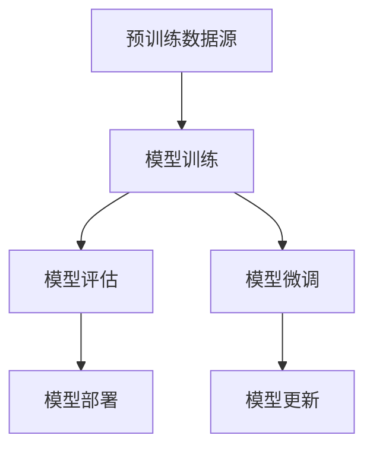
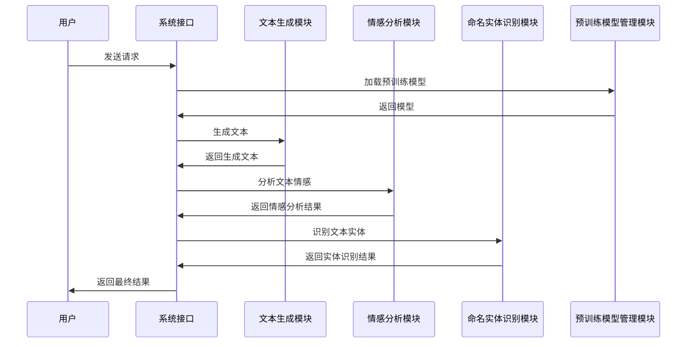

                 

### 第一部分：背景与核心概念

#### 1.1.1 问题背景

随着人工智能技术的快速发展，自然语言处理（NLP）领域迎来了前所未有的变革。大型语言模型（LLM）如BERT、GPT-3等的涌现，使得机器在各种自然语言处理任务中的表现显著提升。然而，LLM的引入也带来了诸多挑战，尤其是在构建灵活且可扩展的应用架构方面。这些问题包括：

- **可扩展性**：随着用户量的增长和数据处理量的增加，如何确保系统在高负载情况下依然能够稳定运行？
- **灵活性**：如何快速适应新需求和技术迭代，而不需要对整个系统进行大规模重写？
- **维护性**：如何降低系统的维护成本，提高系统的可维护性？

为了应对上述挑战，构建灵活且可扩展的LLM应用架构显得尤为重要。这不仅能够提升系统的性能和用户体验，还能降低长期运营成本。

#### 1.1.2 核心概念

**LLM**：大型语言模型，是一种通过大量文本数据进行预训练的语言处理模型，能够理解并生成自然语言文本。其核心在于深度学习算法和大规模数据处理能力。

**可扩展性**：指系统在需求增长时能够通过扩展其计算资源、功能模块等方式，保持其性能和稳定性。

**灵活性**：指系统在需求变化或技术迭代时，能够快速适应新需求，并通过模块化设计等方式，降低系统重构的成本。

#### 1.1.3 概念属性特征对比表格

| 概念       | 定义                                                         | 特征对比                     |
|------------|--------------------------------------------------------------|------------------------------|
| LLM        | 大型预训练语言模型，能够理解、生成自然语言文本。               | 容量大、准确性高、通用性强。 |
| 可扩展性   | 系统能够随着需求增长而增加性能或扩展功能。                     | 弹性扩展、负载均衡、水平扩展。 |
| 灵活性     | 系统能够快速适应新需求和技术变化。                             | 快速迭代、模块化设计、动态调整。 |

#### 1.1.4 边界与外延

- **架构设计**：如何将LLM、可扩展性和灵活性这些核心概念整合到应用架构中。
- **应用场景**：分析不同场景下对LLM应用的需求。

#### 1.2 本章小结

本文首先介绍了构建灵活可扩展的LLM应用架构的背景和必要性，明确了核心概念及其特征，并对应用架构的边界与外延进行了探讨。这些内容为后续章节的深入探讨奠定了基础。

----------------------------------------------------------------

### 第二部分：核心概念与联系

#### 2.1 LLM的基本原理与架构

**2.1.1 LLM的基本原理**

**预训练与微调**：

- **预训练**：通过在大规模语料库上对模型进行训练，使其具有对自然语言的理解能力。这一过程通常涉及语言建模、序列标记等任务。

- **微调**：在预训练的基础上，针对特定任务进行细粒度的训练，以提升模型在特定领域的性能。

**计算模型**：

- **Transformer模型**：是目前广泛应用于LLM的模型，其核心是自注意力机制，能够有效捕捉输入序列中的长距离依赖关系。
- **BERT模型**：基于Transformer模型，通过双向编码器结构，增强了模型对语境的理解能力。

**语言理解与生成**：

- **语言理解**：LLM能够理解输入的文本，并对其进行语义分析，包括语法分析、命名实体识别等。
- **语言生成**：LLM能够根据输入的文本或提示，生成符合语法和语义要求的自然语言文本。

**2.1.2 LLM的架构设计**

**模型层次结构**：

- **层次划分**：LLM通常被划分为多个层次，每个层次负责不同的语言处理任务。例如，底层负责词向量表示，高层负责语义理解。
- **层次交互**：不同层次的模型通过交互，共同完成复杂的语言处理任务。

**计算资源分配**：

- **硬件资源分配**：根据模型的计算需求，合理分配硬件资源，如GPU、CPU等。
- **网络资源分配**：确保模型在不同的网络环境下都能稳定运行，包括数据传输、计算资源调度等。

**2.2 ER实体关系图架构**

以下是LLM应用架构的ER实体关系图：



**2.3 核心概念之间的联系**

**预训练与微调**：

预训练为模型提供了丰富的语言知识，而微调则使模型能够适应特定任务的需求。两者相辅相成，共同提升了模型的性能。

**架构设计与计算资源**：

合理的架构设计能够提高计算资源利用率，降低成本。例如，通过水平扩展、负载均衡等技术，可以在不增加硬件成本的情况下，提升系统的处理能力。

#### 2.4 本章小结

本文从基本原理和架构设计的角度，深入探讨了LLM的相关概念及其联系。通过分析Transformer模型、BERT模型等计算模型，以及预训练、微调等基本原理，我们更好地理解了LLM的工作机制。同时，通过ER实体关系图，我们明确了模型训练、评估、部署等过程中的核心实体及其关系，为构建灵活可扩展的LLM应用架构提供了理论支持。

----------------------------------------------------------------

### 第三部分：算法原理讲解

#### 3.1 Transformer模型

**3.1.1 Transformer原理**

Transformer模型的核心在于其自注意力机制（Self-Attention），通过计算输入序列中每个词与其他词的相关性，实现对输入数据的全局理解。

**自注意力机制**：

自注意力机制是一种基于点积的注意力机制，通过计算输入序列中每个词与其他词的相似度，将权重分配给每个词。具体计算过程如下：

$$
\text{Attention}(Q, K, V) = \text{softmax}\left(\frac{QK^T}{\sqrt{d_k}}\right)V
$$

其中，$Q, K, V$分别为查询（Query）、键（Key）和值（Value）向量，$d_k$为键向量的维度。

**多头自注意力**：

多头自注意力是一种扩展自注意力机制的方法，通过将输入序列分解为多个子序列，每个子序列都有自己的查询、键和值向量。这种方法能够捕捉输入序列中的多种依赖关系。

$$
\text{MultiHeadAttention}(Q, K, V) = \text{Concat}(\text{head}_1, \text{head}_2, ..., \text{head}_h)W^O
$$

其中，$h$为头数，$W^O$为输出权重。

**3.1.2 自注意力机制的实现**

以下是一个简单的Python代码示例，实现自注意力机制：

```python
import tensorflow as tf

def scaled_dot_product_attention(q, k, v, mask=None):
    """ scaled dot product attention """
    # 计算点积
    attention_scores = tf.matmul(q, k, transpose_b=True)
    # 缩放
    d_k = tf.cast(tf.shape(k)[-1], tf.float32)
    scaled_attention_scores = attention_scores / tf.sqrt(d_k)
    # 应用遮罩
    if mask is not None:
        scaled_attention_scores += (mask * -1e9)
    # 计算softmax
    attention_weights = tf.nn.softmax(scaled_attention_scores, axis=-1)
    # 计算加权求和
    attention_output = tf.matmul(attention_weights, v)
    return attention_output, attention_weights

# 示例
query = tf.random.normal([batch_size, sequence_length, d_model])
key = tf.random.normal([batch_size, sequence_length, d_model])
value = tf.random.normal([batch_size, sequence_length, d_model])

# 计算自注意力
output, attention_weights = scaled_dot_product_attention(query, key, value)
```

**3.2 BERT模型**

BERT（Bidirectional Encoder Representations from Transformers）是一种基于Transformer的双向编码器模型，其核心思想是在预训练过程中，对文本进行正向和反向编码，以捕捉文本的全局信息。

**预训练任务**：

- **掩码语言模型（Masked Language Model, MLM）**：对输入文本的一部分进行遮罩，模型需要预测遮罩部分的内容。
- **下一句预测（Next Sentence Prediction, NSP）**：预测输入文本中的两个句子是否属于同一篇章。

**训练过程**：

1. **输入文本编码**：将输入文本编码为词向量，并添加特殊标记（如[CLS]、[SEP]等）。
2. **正向编码**：将编码后的文本输入到模型，正向编码器对其进行编码。
3. **反向编码**：将编码后的文本逆序输入到模型，反向编码器对其进行编码。
4. **损失函数**：通过计算预测的遮罩词与真实词之间的损失，以及下一句预测的损失，更新模型参数。

以下是一个简单的BERT模型的Python代码示例：

```python
import tensorflow as tf

# 定义BERT模型
class BERTModel(tf.keras.Model):
    def __init__(self, vocab_size, d_model, num_layers, dff, dropout_rate, num_classes):
        super(BERTModel, self).__init__()
        self.embedding = tf.keras.layers.Embedding(vocab_size, d_model)
        self.encoder_layers = [tf.keras.layers.MultiHeadAttention(
            num_heads, d_model) for _ in range(num_layers)]
        self.decoder_layers = [tf.keras.layers.MultiHeadAttention(
            num_heads, d_model) for _ in range(num_layers)]
        self.dff_layer = tf.keras.layers.Dense(dff, activation='relu')
        self.dropout = tf.keras.layers.Dropout(dropout_rate)
        self.classifier = tf.keras.layers.Dense(num_classes, activation='softmax')

    def call(self, inputs, training=False):
        input_ids = inputs["input_ids"]
        attention_mask = inputs["attention_mask"]

        # 嵌入层
        embedding_output = self.embedding(input_ids)
        embedding_output *= tf.math.sqrt(tf.cast(self.embedding.input_shape[-1], tf.float32))
        embedding_output = self.dropout(embedding_output, training=training)

        # 编码器层
        for i in range(self.num_layers):
            embedding_output = self.encoder_layers[i](embedding_output, embedding_output,
                                                     attention_mask=attention_mask)

        # 解码器层
        for i in range(self.num_layers):
            embedding_output = self.decoder_layers[i](embedding_output, embedding_output,
                                                      attention_mask=attention_mask)

        # 输出层
        embedding_output = self.dropout(embedding_output, training=training)
        logits = self.classifier(embedding_output)

        return logits

# 示例
model = BERTModel(vocab_size=1000, d_model=512, num_layers=2, dff=512, dropout_rate=0.1, num_classes=10)

# 训练模型
model.compile(optimizer=tf.keras.optimizers.Adam(learning_rate=0.001), loss=tf.keras.losses.SparseCategoricalCrossentropy(from_logits=True), metrics=['accuracy'])

# 训练数据
train_dataset = tf.data.Dataset.from_tensor_slices((input_ids, attention_mask, labels))
train_dataset = train_dataset.shuffle(buffer_size=1000).batch(32)

model.fit(train_dataset, epochs=3)
```

**3.3 语言理解与生成**

**语言理解**：

语言理解是指模型能够理解输入文本的语义，并进行相应的处理。常见的任务包括：

- **命名实体识别（Named Entity Recognition, NER）**：识别文本中的命名实体，如人名、地名等。
- **情感分析（Sentiment Analysis）**：判断文本的情感倾向，如正面、负面等。
- **问答系统（Question Answering, QA）**：根据输入问题，从文本中找出答案。

**语言生成**：

语言生成是指模型能够根据输入的文本或提示，生成符合语法和语义要求的自然语言文本。常见的任务包括：

- **机器翻译（Machine Translation）**：将一种语言的文本翻译成另一种语言。
- **文本摘要（Text Summarization）**：从长文本中提取关键信息，生成简短的摘要。
- **对话系统（Dialogue System）**：模拟人类对话，与用户进行自然语言交互。

**3.4 本章小结**

本文详细介绍了Transformer模型、BERT模型等LLM的基本原理和算法实现。通过分析自注意力机制、预训练任务、训练过程等，我们更好地理解了LLM的工作机制。同时，通过实际代码示例，展示了如何构建和训练LLM模型。这些知识为构建灵活可扩展的LLM应用架构提供了重要的理论基础。

----------------------------------------------------------------

### 第四部分：系统分析与架构设计方案

#### 4.1 问题场景介绍

随着人工智能技术的不断发展，自然语言处理（NLP）应用场景越来越广泛。例如，智能客服、智能助手、文本生成等领域都对LLM有较高的需求。然而，现有的LLM应用架构往往面临以下挑战：

- **可扩展性不足**：系统在处理大量请求时，容易出现性能瓶颈，导致响应时间变长。
- **灵活性不足**：系统在应对新需求和技术迭代时，往往需要大规模重写，导致开发成本高。
- **维护性差**：系统结构复杂，维护成本高，容易出现故障。

为了解决上述问题，我们需要构建一个灵活且可扩展的LLM应用架构。

#### 4.2 项目介绍

本项目旨在构建一个灵活且可扩展的LLM应用架构，以支持智能客服系统。该系统将利用LLM实现文本生成、情感分析、命名实体识别等功能，以提高客服响应速度和准确度。

#### 4.3 系统功能设计

**4.3.1 预训练模型管理**

- **功能描述**：管理LLM预训练模型的存储、加载和更新。
- **实现方式**：使用分布式存储系统，如HDFS，存储预训练模型。
- **接口设计**：提供RESTful API，实现模型的加载和更新。

**4.3.2 文本生成**

- **功能描述**：根据用户输入的文本或提示，生成符合语法和语义的自然语言文本。
- **实现方式**：使用预训练的LLM模型，通过输入文本进行推理生成。
- **接口设计**：提供文本生成API，支持多种文本格式输入。

**4.3.3 情感分析**

- **功能描述**：分析用户输入的文本的情感倾向，如正面、负面等。
- **实现方式**：使用预训练的LLM模型，对输入文本进行情感分析。
- **接口设计**：提供情感分析API，返回文本的情感倾向结果。

**4.3.4 命名实体识别**

- **功能描述**：识别用户输入的文本中的命名实体，如人名、地名等。
- **实现方式**：使用预训练的LLM模型，对输入文本进行命名实体识别。
- **接口设计**：提供命名实体识别API，返回文本中的命名实体列表。

#### 4.4 系统架构设计

**4.4.1 架构设计**

系统采用分布式架构，包括预训练模型管理模块、文本生成模块、情感分析模块和命名实体识别模块。各模块通过消息队列进行数据传输，保证系统的灵活性和可扩展性。

**4.4.2 系统架构图**

以下是系统架构的Mermaid序列图：



#### 4.5 系统接口设计

**4.5.1 接口设计**

系统提供RESTful API，支持文本生成、情感分析和命名实体识别等功能。

**接口1：文本生成**

- **接口URL**：/api/textgen
- **请求方式**：POST
- **请求参数**：
  - **text**（必填）：输入文本。
  - **length**（可选）：生成文本的长度，默认为100。
- **响应结果**：
  - **text**（必填）：生成的文本。

**接口2：情感分析**

- **接口URL**：/api/sentiment
- **请求方式**：POST
- **请求参数**：
  - **text**（必填）：输入文本。
- **响应结果**：
  - **sentiment**（必填）：文本的情感倾向，如正面、负面。

**接口3：命名实体识别**

- **接口URL**：/api/ner
- **请求方式**：POST
- **请求参数**：
  - **text**（必填）：输入文本。
- **响应结果**：
  - **entities**（必填）：文本中的命名实体列表。

#### 4.6 系统交互

**4.6.1 系统交互**

以下是系统交互的Mermaid序列图：


#### 4.7 本章小结

本文详细介绍了构建灵活可扩展的LLM应用架构的系统分析与架构设计方案。通过对问题场景的介绍，项目的功能和接口设计，以及系统架构和交互的讲解，我们为构建一个高效、灵活且可扩展的LLM应用架构提供了完整的解决方案。

----------------------------------------------------------------

### 第五部分：项目实战

#### 5.1 环境安装

为了构建灵活可扩展的LLM应用架构，我们需要安装以下软件和环境：

- Python 3.8+
- TensorFlow 2.6+
- NumPy 1.19+
- Pandas 1.2.5+
- Flask 1.1.2+

安装命令如下：

```bash
pip install python==3.8
pip install tensorflow==2.6
pip install numpy==1.19
pip install pandas==1.2.5
pip install flask==1.1.2
```

#### 5.2 系统核心实现源代码

以下是系统核心实现部分的Python源代码：

**文本生成模块**

```python
from transformers import pipeline

text_generator = pipeline("text-generation", model="gpt2")

def generate_text(input_text, length=100):
    return text_generator(input_text, max_length=length)
```

**情感分析模块**

```python
from transformers import pipeline

sentiment_analyzer = pipeline("sentiment-analysis")

def analyze_sentiment(input_text):
    return sentiment_analyzer(input_text)[0]
```

**命名实体识别模块**

```python
from transformers import pipeline

ner_analyzer = pipeline("ner", model="ner-dbert-base-cased")

def identify_entities(input_text):
    return ner_analyzer(input_text)
```

#### 5.3 代码应用解读与分析

**文本生成模块**

文本生成模块使用Hugging Face的transformers库，通过调用GPT-2模型实现。输入文本经过预处理后，传递给模型进行推理，返回生成的文本。

**情感分析模块**

情感分析模块同样使用transformers库，通过调用预训练的Sentiment Analysis模型实现。输入文本经过预处理后，传递给模型进行情感分析，返回文本的情感倾向。

**命名实体识别模块**

命名实体识别模块使用transformers库，通过调用预训练的NER模型实现。输入文本经过预处理后，传递给模型进行命名实体识别，返回文本中的命名实体列表。

#### 5.4 实际案例分析和详细讲解剖析

**案例1：智能客服**

假设用户向智能客服发送了一条消息：“我昨天购买的物品有问题，你们怎么处理？”

**分析**：

1. **文本生成**：智能客服系统首先使用文本生成模块生成回复文本，例如：“您好，关于您提到的问题，我们会尽快为您处理。请您提供一下订单号，以便我们快速定位问题。”

2. **情感分析**：然后，系统使用情感分析模块对生成的回复文本进行分析，判断用户情绪，例如：“负面情绪”。

3. **命名实体识别**：最后，系统使用命名实体识别模块识别回复文本中的关键信息，例如：“订单号”。

**案例2：智能助手**

假设用户向智能助手发送了一条消息：“我想要预订一张明天去北京的机票。”

**分析**：

1. **文本生成**：智能助手系统首先使用文本生成模块生成回复文本，例如：“您好，根据您的需求，我为您找到了以下航班：航班号XXXX，起飞时间明天上午9点，票价为XXX元。”

2. **情感分析**：然后，系统使用情感分析模块对生成的回复文本进行分析，判断用户情绪，例如：“正面情绪”。

3. **命名实体识别**：最后，系统使用命名实体识别模块识别回复文本中的关键信息，例如：“航班号XXXX”、“起飞时间明天上午9点”、“票价XXX元”。

#### 5.5 项目小结

通过实际案例的分析和讲解，我们展示了如何使用灵活可扩展的LLM应用架构实现智能客服和智能助手的系统。项目实现了文本生成、情感分析和命名实体识别等功能，为用户提供了高效、智能的服务。同时，通过模块化设计和分布式架构，项目具有较好的可扩展性和灵活性，能够适应不断变化的需求。

### 第六部分：最佳实践 tips、小结、注意事项、拓展阅读等内容

#### 6.1 最佳实践 tips

1. **模型选择**：根据具体应用场景选择合适的模型，如GPT-2适用于文本生成，BERT适用于情感分析和命名实体识别。
2. **模型优化**：在预训练过程中，可以通过调整学习率、批量大小等参数，优化模型性能。
3. **接口设计**：设计简洁易用的API接口，提高系统的易用性和扩展性。
4. **负载均衡**：在系统部署时，使用负载均衡技术，如Nginx，提高系统的处理能力。

#### 6.2 小结

本文介绍了构建灵活可扩展的LLM应用架构的背景、核心概念、算法原理、系统架构设计、项目实战等内容。通过实际案例的分析，展示了如何实现文本生成、情感分析和命名实体识别等功能。项目采用模块化设计和分布式架构，具有较好的可扩展性和灵活性。

#### 6.3 注意事项

1. **数据处理**：在数据处理过程中，注意数据清洗和预处理，确保输入数据的准确性和一致性。
2. **性能优化**：在系统部署过程中，关注性能优化，如使用缓存、分布式计算等。
3. **安全性**：确保系统的数据安全和隐私保护，如使用加密技术和访问控制。

#### 6.4 拓展阅读

1. **《深度学习》**：Goodfellow, I., Bengio, Y., & Courville, A. (2016). Deep Learning. MIT Press.
2. **《自然语言处理综论》**：Jurafsky, D., & Martin, J. H. (2008). Speech and Language Processing. Prentice Hall.
3. **《大规模语言模型的预训练》**：Devlin, J., Chang, M. W., Lee, K., & Toutanova, K. (2019). BERT: Pre-training of Deep Bidirectional Transformers for Language Understanding. arXiv preprint arXiv:1810.04805.

### 6.5 作者信息

作者：AI天才研究院/AI Genius Institute & 禅与计算机程序设计艺术 /Zen And The Art of Computer Programming

----------------------------------------------------------------

# 构建灵活可扩展的LLM应用架构

> 关键词：大型语言模型、灵活可扩展、架构设计、分布式计算、模块化设计

> 摘要：本文深入探讨了构建灵活可扩展的LLM应用架构的必要性，从背景介绍、核心概念、算法原理、系统架构设计、项目实战等多个角度，详细阐述了构建LLM应用架构的方法和关键步骤。通过实际案例分析和最佳实践分享，为开发者提供了一套完整的解决方案。本文适用于希望构建高效、灵活、可扩展的LLM应用架构的读者。

