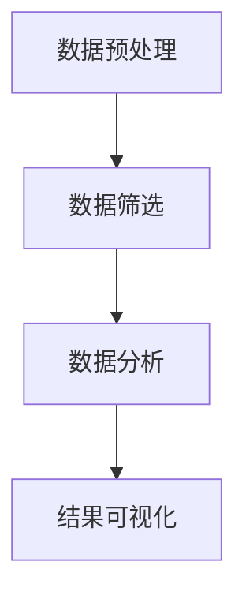

                 

# 构建评测结果的交互式探索工具

## 关键词

- 评测结果
- 交互式探索
- 工具构建
- 算法原理
- 系统架构
- 实践应用

## 摘要

本文旨在探讨如何构建一个交互式探索工具，以方便用户对评测结果进行深入分析和理解。我们将从问题背景出发，逐步介绍评测结果交互式探索的需求、核心概念及其关联性，并深入讲解算法原理和实现，最后讨论系统架构设计、项目实战和最佳实践，为构建高效、实用的评测结果交互式探索工具提供指导。

## 第一部分：背景介绍

### 第1章：问题背景

在现代数据驱动的时代，评测结果在各个领域都扮演着至关重要的角色。然而，面对海量的评测结果，如何有效地进行交互式探索，以便用户能够快速获取有价值的信息，成为了当前的一个重要挑战。

首先，评测结果通常包含大量的数据，这些数据往往具有复杂性和多样性。这使得用户在进行数据分析时，往往感到困惑和无从下手。其次，评测结果的分析过程通常涉及多个步骤，从数据预处理到结果可视化，每个步骤都可能需要用户进行复杂的操作，这增加了用户的负担。最后，不同的评测结果可能存在相似或冲突的信息，这使得用户难以在众多信息中快速定位和获取有价值的信息。

为了解决这些问题，我们需要一个交互式探索工具，能够帮助用户在评测结果中快速定位有价值的信息，并进行深入分析。

### 第2章：核心概念

#### 评测结果

评测结果通常是指对一个系统、产品或服务进行评估后得到的一系列数据。这些数据可以包括性能指标、用户满意度、错误率等。评测结果的产生过程通常涉及测试、评估和数据分析等步骤。

#### 交互式探索

交互式探索是指用户通过图形用户界面（GUI）与评测结果进行交互的过程。在这个过程中，用户可以实时地查看、筛选和过滤评测结果，以便更好地理解和分析数据。

#### 评测结果与交互式探索的关系

评测结果和交互式探索是相辅相成的。评测结果为交互式探索提供了数据基础，而交互式探索则为评测结果提供了可视化和分析手段。只有将两者有机结合，才能实现高效的评测结果分析。

### 第3章：核心概念与联系

在本节中，我们将进一步探讨评测结果和交互式探索的核心概念，以及它们之间的关联性。

#### 评测结果的核心概念

- 数据源：评测结果的产生依赖于可靠的数据源。
- 数据预处理：对原始数据进行分析和清洗，以便后续的分析。
- 评价指标：评测结果通常包含多个评价指标，如性能、稳定性、安全性等。
- 结果可视化：通过图表、图形等方式，将评测结果直观地呈现给用户。

#### 交互式探索的核心概念

- 用户界面：提供用户与评测结果交互的界面。
- 数据筛选：用户可以根据需求，对评测结果进行筛选和过滤。
- 数据分析：用户可以通过交互式探索工具，对评测结果进行深入分析。
- 结果反馈：将分析结果实时地反馈给用户，以便用户进行进一步的决策。

#### 评测结果与交互式探索的关联性

评测结果和交互式探索是紧密相连的。评测结果为交互式探索提供了数据基础，而交互式探索则为评测结果提供了可视化和分析手段。只有将两者有机结合，才能实现高效的评测结果分析。

## 第二部分：算法原理与实现

### 第4章：算法原理讲解

在本节中，我们将详细介绍评测结果交互式探索的核心算法原理。

#### 算法基本原理

评测结果交互式探索的核心算法是基于数据分析的。该算法的基本原理是：通过对评测结果进行预处理、筛选和分析，提取出有价值的信息，并将其以可视化形式呈现给用户。

#### 算法数学模型

算法的数学模型主要包括以下几部分：

1. **数据预处理**：使用数学公式对原始数据进行清洗和转换，如去重、归一化等。
2. **数据筛选**：根据用户需求，使用逻辑运算符对数据进行筛选，如AND、OR等。
3. **数据分析**：使用统计方法和机器学习方法，对筛选后的数据进行进一步分析，如聚类、分类等。
4. **结果可视化**：使用图表、图形等方式，将分析结果直观地呈现给用户。

#### 算法流程图

下面是一个简单的算法流程图：



#### 算法原理举例说明

假设我们有一个关于产品性能评测的结果集，包含多个指标，如响应时间、内存使用等。用户可以通过交互式探索工具，对指标进行筛选和分析，以便了解产品的性能表现。

1. **数据预处理**：对原始数据进行清洗和转换，如将时间单位统一为秒，将内存使用单位统一为兆字节。
2. **数据筛选**：用户可以指定筛选条件，如响应时间小于5秒，内存使用小于100兆。
3. **数据分析**：对筛选后的数据进行统计分析，如计算平均响应时间、最大内存使用等。
4. **结果可视化**：将分析结果以图表形式呈现，如折线图显示响应时间变化，柱状图显示内存使用情况。

### 第5章：算法实现与优化

#### 算法实现步骤

1. **数据预处理**：读取评测结果数据，进行清洗和转换。
2. **数据筛选**：根据用户需求，设置筛选条件，对数据进行筛选。
3. **数据分析**：使用统计方法和机器学习方法，对筛选后的数据进行进一步分析。
4. **结果可视化**：将分析结果以图表形式呈现。

#### 算法优化方法

1. **算法优化**：针对数据量大、计算复杂度高的情况，可以采用以下优化方法：
   - **并行计算**：将计算任务分解为多个子任务，并行执行。
   - **数据缓存**：将经常访问的数据缓存到内存中，减少磁盘IO操作。
   - **算法改进**：根据实际情况，选择合适的算法和模型，如采用更高效的统计方法或机器学习模型。

2. **性能评估**：通过实际测试，评估算法的运行时间和资源消耗，以便进行进一步的优化。

#### 实现代码分析

```python
import pandas as pd
import numpy as np
from sklearn.cluster import KMeans
import matplotlib.pyplot as plt

# 读取评测结果数据
data = pd.read_csv('evaluation_results.csv')

# 数据预处理
data['response_time'] = data['response_time'].astype(float)
data['memory_usage'] = data['memory_usage'].astype(float)

# 数据筛选
filtered_data = data[(data['response_time'] < 5) & (data['memory_usage'] < 100)]

# 数据分析
kmeans = KMeans(n_clusters=3)
clusters = kmeans.fit_predict(filtered_data[['response_time', 'memory_usage']])

# 结果可视化
filtered_data['cluster'] = clusters
plt.scatter(filtered_data['response_time'], filtered_data['memory_usage'], c=clusters)
plt.xlabel('Response Time (s)')
plt.ylabel('Memory Usage (MB)')
plt.show()
```

#### 优化效果评估

通过以上优化方法，我们可以显著提高算法的运行效率和资源利用率。在实际应用中，我们可以通过对比优化前后的运行时间和资源消耗，评估优化效果。

## 第三部分：系统架构与设计

### 第6章：系统分析与架构设计

在本节中，我们将详细讨论评测结果交互式探索系统的分析与架构设计。

#### 问题场景介绍

假设我们需要构建一个评测结果交互式探索系统，用于帮助用户分析产品性能评测结果。系统需要具备以下功能：

1. 数据预处理：读取评测结果数据，进行清洗和转换。
2. 数据筛选：根据用户需求，设置筛选条件，对数据进行筛选。
3. 数据分析：使用统计方法和机器学习方法，对筛选后的数据进行进一步分析。
4. 结果可视化：将分析结果以图表形式呈现。

#### 系统功能设计

根据问题场景，我们可以设计以下系统功能：

1. **数据源管理**：管理评测结果数据源，包括数据导入、导出和更新等功能。
2. **数据预处理**：对评测结果数据进行清洗和转换，如时间单位统一、数据缺失填充等。
3. **数据筛选**：提供筛选条件设置界面，允许用户根据需求筛选评测结果数据。
4. **数据分析**：提供数据分析功能，包括统计分析和机器学习分析等。
5. **结果可视化**：提供图表展示功能，将分析结果以图表形式呈现。

#### 系统架构设计

根据系统功能设计，我们可以设计以下系统架构：

1. **前端架构**：使用Vue.js或React等前端框架，构建用户界面，实现数据筛选、分析和结果可视化的功能。
2. **后端架构**：使用Python或Java等后端技术，实现数据预处理、筛选和分析的算法逻辑。
3. **数据库架构**：使用MySQL或PostgreSQL等关系型数据库，存储评测结果数据。
4. **缓存架构**：使用Redis等缓存技术，提高数据访问速度。

#### 系统接口设计

根据系统架构，我们可以设计以下接口：

1. **数据源接口**：提供数据导入、导出和更新的接口。
2. **数据处理接口**：提供数据清洗、转换和筛选的接口。
3. **数据分析接口**：提供数据分析和结果可视化的接口。

#### 系统交互设计

根据系统架构和接口设计，我们可以设计以下系统交互：

1. **用户操作流程**：用户通过前端界面进行数据筛选和分析，后端根据用户需求进行数据处理和分析，并将结果返回给前端进行展示。
2. **数据流流程**：数据从数据源进入系统，经过数据预处理、筛选和分析，最终以图表形式呈现给用户。

### 第7章：系统实现与部署

在本节中，我们将详细介绍评测结果交互式探索系统的实现与部署过程。

#### 环境安装与配置

1. **前端环境**：安装Node.js、Vue.js或React等前端框架。
2. **后端环境**：安装Python、Django或Java等后端技术。
3. **数据库环境**：安装MySQL或PostgreSQL等关系型数据库。
4. **缓存环境**：安装Redis等缓存技术。

#### 系统核心实现

1. **前端核心实现**：使用Vue.js或React等前端框架，实现数据筛选、分析和结果可视化的功能。
2. **后端核心实现**：使用Python或Java等后端技术，实现数据预处理、筛选和分析的算法逻辑。
3. **数据库核心实现**：使用MySQL或PostgreSQL等关系型数据库，存储评测结果数据。
4. **缓存核心实现**：使用Redis等缓存技术，提高数据访问速度。

#### 系统应用解读与分析

1. **前端应用解读**：分析前端页面的功能模块，如数据筛选表单、图表展示等，并解释其实现原理。
2. **后端应用解读**：分析后端服务的功能模块，如数据处理模块、分析模块等，并解释其实现原理。
3. **数据库应用解读**：分析数据库的设计和实现，如表结构设计、索引优化等。
4. **缓存应用解读**：分析缓存技术的应用场景和优化策略。

#### 实际案例分析与讲解

1. **案例一**：分析一个具体的评测结果数据集，演示如何使用系统进行数据筛选、分析和结果可视化。
2. **案例二**：分析一个实际项目，演示如何使用系统进行评测结果分析和优化。

#### 项目小结

1. **项目总结**：总结项目的开发过程、技术难点和解决方案。
2. **项目评价**：评价项目的性能、稳定性和用户体验。
3. **项目展望**：展望项目的未来发展方向和优化方向。

## 第四部分：最佳实践与拓展

### 第8章：最佳实践

在本节中，我们将分享一些关于构建评测结果交互式探索工具的最佳实践。

#### 实践经验总结

1. **需求分析**：在构建工具之前，充分了解用户需求，明确工具的功能和性能要求。
2. **算法优化**：选择合适的算法和模型，进行算法优化，提高工具的性能。
3. **用户体验**：关注用户体验，设计简洁、直观的用户界面，提供方便快捷的操作方式。
4. **性能优化**：对系统进行性能优化，提高数据访问速度和处理效率。

#### 常见问题解决

1. **数据缺失处理**：对于缺失的数据，采用合理的处理方法，如插值、平均值等。
2. **数据异常处理**：对于异常的数据，进行识别和处理，如剔除、修正等。
3. **系统稳定性**：确保系统的稳定性，避免系统崩溃或数据丢失。

#### 优化建议与策略

1. **缓存策略**：合理使用缓存技术，提高数据访问速度。
2. **并行计算**：对于计算密集型的任务，采用并行计算技术，提高处理效率。
3. **数据分析**：结合实际需求，选择合适的分析方法和模型，提高分析效果。

### 第9章：小结与拓展

#### 书籍小结

本文从问题背景、核心概念、算法原理、系统架构、项目实战和最佳实践等方面，全面探讨了构建评测结果交互式探索工具的方法和技巧。通过本文的讲解，读者可以了解到如何构建一个高效、实用的评测结果交互式探索工具。

#### 注意事项

1. **需求分析**：在构建工具之前，充分了解用户需求，明确工具的功能和性能要求。
2. **算法优化**：选择合适的算法和模型，进行算法优化，提高工具的性能。
3. **用户体验**：关注用户体验，设计简洁、直观的用户界面，提供方便快捷的操作方式。
4. **性能优化**：对系统进行性能优化，提高数据访问速度和处理效率。

#### 拓展阅读

1. 《数据可视化》
2. 《机器学习实战》
3. 《Python数据分析》
4. 《系统架构设计师》

### 作者

**作者：AI天才研究院/AI Genius Institute & 禅与计算机程序设计艺术 /Zen And The Art of Computer Programming**

本文由AI天才研究院/AI Genius Institute与禅与计算机程序设计艺术/Zen And The Art of Computer Programming合作撰写，旨在为读者提供关于构建评测结果交互式探索工具的全面、深入的技术指导。希望通过本文，读者能够更好地理解和掌握构建评测结果交互式探索工具的方法和技巧，为实际项目带来更大的价值。

