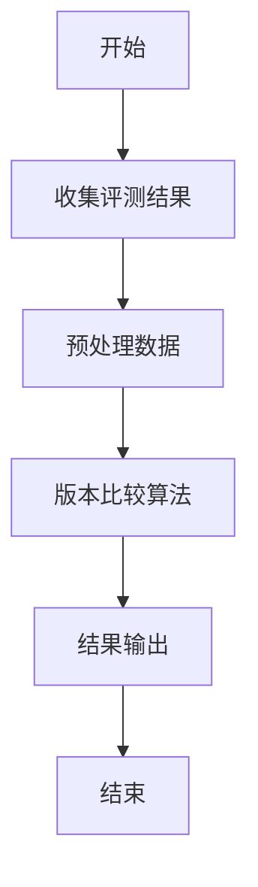
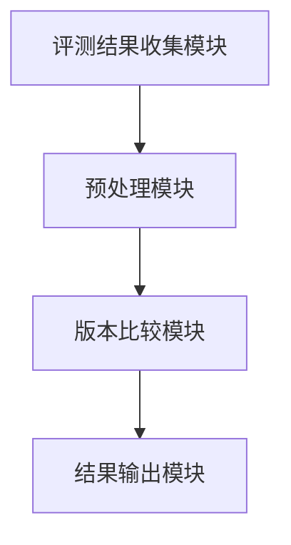
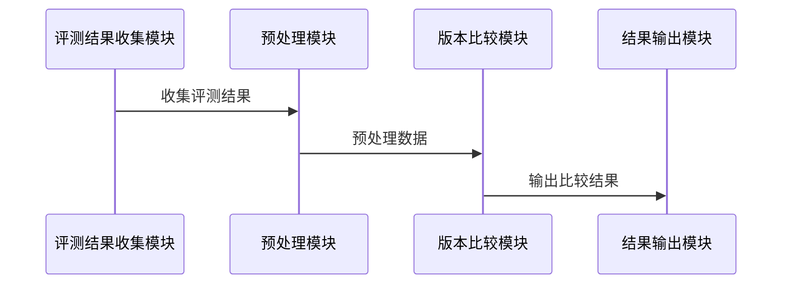

                 

### 第1章 引言

#### 1.1 问题背景

在当今快速发展的信息技术时代，评测结果的历史版本比较功能已经成为了许多系统设计和开发中的关键组成部分。无论是软件版本管理、系统性能监控，还是大数据处理和机器学习模型评估，历史版本的比较都显得尤为重要。它不仅能够帮助我们理解系统的演进过程，还能够发现潜在的问题，为未来的优化提供有力的支持。

一个典型的应用场景是在软件版本管理中，开发者需要定期对软件的不同版本进行测试和评估，以确保每次更新都能够带来性能提升或功能的完善。而历史版本的比较功能可以帮助开发者快速识别哪些更改是有益的，哪些可能引入了新的问题。在系统性能监控领域，历史版本的数据对比能够揭示系统在不同时间段内的运行状态，有助于定位性能瓶颈和优化方向。

#### 1.2 问题描述

然而，构建一个有效的评测结果历史版本比较功能并非易事。具体来说，我们面临以下问题：

1. **数据一致性**：如何确保历史数据的一致性和完整性，避免数据丢失或错误？
2. **数据格式**：如何处理不同版本之间的数据格式差异，尤其是当数据源或数据结构发生变化时？
3. **算法选择**：如何选择合适的算法来高效地比较不同版本的数据，并提取有用的信息？
4. **可扩展性**：如何设计系统，以支持大规模数据的高效比较和实时处理？

#### 1.3 问题解决

为了解决上述问题，我们需要采取一系列的步骤和方法：

1. **数据收集与存储**：采用可靠的数据收集和存储机制，确保历史数据的完整性和一致性。
2. **数据预处理**：在比较之前，对数据进行预处理，包括格式统一、数据清洗和缺失值处理等。
3. **算法实现**：选择并实现高效的版本比较算法，确保比较过程的准确性和速度。
4. **系统架构设计**：设计一个可扩展的系统架构，以支持大规模数据的高效处理和实时比较。

#### 1.4 边界与外延

在构建评测结果的历史版本比较功能时，我们还需要考虑一些边界和外部因素的影响：

- **外部数据源**：如何与其他系统或外部数据源进行集成，共享和比较数据？
- **系统维护**：如何确保系统的稳定性和可持续性，包括定期的维护和更新？
- **用户需求**：如何根据用户需求不断优化系统的功能，提升用户体验？

通过以上的分析和思考，我们可以为构建一个高效、可靠和可扩展的评测结果历史版本比较功能奠定坚实的基础。

### 第2章 核心概念与联系

在构建评测结果的历史版本比较功能中，理解核心概念和它们之间的联系至关重要。以下是关于评测结果的历史版本和版本比较方法的核心概念及其比较。

#### 2.1 评测结果的历史版本

##### 2.1.1 定义

评测结果的历史版本指的是在特定时间点或特定事件发生时，系统评测所产生的结果记录。这些结果可能包括性能指标、功能测试结果、用户反馈等。历史版本的作用是记录系统在发展过程中的关键状态，为后续的分析和优化提供依据。

##### 2.1.2 属性特征对比

为了更好地比较历史版本，我们需要关注以下几个属性特征：

- **时间戳**：每个版本对应的时间戳，用于标记版本的产生时间。
- **结果指标**：包括各种性能指标，如响应时间、吞吐量、错误率等。
- **功能特性**：每次版本更新的功能特性，包括新增功能、优化功能、移除功能等。
- **用户反馈**：用户的评价和反馈，有助于了解系统在不同版本下的用户体验。

以下是属性特征对比表格：

| 属性特征  | 时间戳 | 结果指标 | 功能特性 | 用户反馈 |
|-----------|--------|----------|----------|----------|
| 属性1     | 2021-01-01 | 100ms    | 无       | 无       |
| 属性2     | 2021-02-01 | 120ms    | 新增功能  | 良好     |
| 属性3     | 2021-03-01 | 110ms    | 优化功能  | 一般     |

#### 2.2 版本比较方法

##### 2.2.1 方法概述

版本比较方法主要包括以下几种：

1. **全量对比**：直接对比所有版本的数据，适用于数据量较小且数据结构一致的情况。
2. **增量对比**：只对比新版本与旧版本的差异，适用于数据量大且版本更新频繁的情况。
3. **相似度对比**：通过计算两个版本之间的相似度，评估版本变化的程度，适用于需要快速评估版本差异的场景。

##### 2.2.2 方法比较

以下是几种版本比较方法的比较表格：

| 比较方法  | 优点                                      | 缺点                                      |
|-----------|-------------------------------------------|-------------------------------------------|
| 全量对比  | 精准，确保所有数据都被对比到                | 计算量大，性能开销高                      |
| 增量对比  | 计算量相对较小，适用于数据量大和版本频繁更新 | 可能会遗漏一些重要的版本差异              |
| 相似度对比 | 快速评估版本变化，减少冗余数据             | 难以精确捕捉到所有细节变化                |

通过理解这些核心概念和比较方法，我们可以为构建高效的评测结果历史版本比较功能提供理论基础和实践指导。

### 第3章 算法原理讲解

为了实现评测结果的历史版本比较功能，我们需要设计并实现一个有效的算法。下面将详细讲解算法的原理，包括算法概述、mermaid流程图、数学模型和Python源代码实现。

#### 3.1 算法概述

本算法的主要目标是比较两个评测结果的历史版本，并计算出它们之间的相似度。具体步骤如下：

1. **收集评测结果**：从数据源中获取不同版本的评测结果。
2. **预处理数据**：对收集到的评测结果进行格式统一和缺失值处理，确保数据的一致性和完整性。
3. **版本比较算法**：计算两个版本之间的相似度，使用集合的交集和并集来衡量相似度。
4. **结果输出**：将比较结果输出，包括相似度得分和版本差异。

#### 3.2 算法mermaid流程图

下面是一个使用mermaid绘制的算法流程图：



#### 3.3 算法原理

##### 3.3.1 数学模型

算法的数学模型基于集合的交集和并集。假设有两个评测结果的历史版本集合$V_x$和$V_y$，我们定义相似度函数$f(x, y)$如下：

$$
f(x, y) = \frac{|V_x \cap V_y|}{|V_x \cup V_y|}
$$

其中，$|V_x \cap V_y|$表示两个集合的交集大小，$|V_x \cup V_y|$表示两个集合的并集大小。

##### 3.3.2 Python源代码实现

以下是使用Python实现版本比较算法的示例代码：

```python
def compare_versions(version1, version2):
    intersection_size = len(set(version1).intersection(set(version2)))
    union_size = len(set(version1).union(set(version2)))
    similarity = intersection_size / union_size
    return similarity
```

这段代码首先计算两个版本的交集大小和并集大小，然后使用相似度函数计算相似度得分。这个得分可以用来评估两个版本之间的相似程度。

通过以上算法原理的讲解和Python源代码实现，我们可以为构建评测结果的历史版本比较功能提供有效的技术支持。

### 第4章 数学模型和数学公式讲解

为了深入理解评测结果历史版本比较算法，我们需要探讨其背后的数学模型和公式。以下内容将详细解释该模型及其数学公式。

#### 4.1 模型概述

该数学模型的核心是衡量两个评测结果历史版本集合$V_x$和$V_y$之间的相似度。相似度衡量了两个版本在属性特征上的重叠程度，从而反映出它们之间的相似性。

#### 4.2 模型公式

我们定义相似度公式为：

$$
\text{相似度} = \frac{\text{交集大小}}{\text{并集大小}}
$$

其中，交集大小表示两个版本集合中共同存在的属性特征的数量，并集大小表示两个版本集合中所有属性特征的总数量。

这个公式可以分解为以下两部分：

1. **交集大小**：$|V_x \cap V_y|$，表示集合$V_x$和$V_y$的交集元素数量。交集元素是同时存在于$V_x$和$V_y$中的属性特征。
2. **并集大小**：$|V_x \cup V_y|$，表示集合$V_x$和$V_y$的并集元素数量。并集元素是存在于$V_x$或$V_y$中的所有属性特征。

#### 4.3 公式解释

该相似度公式提供了一个直观的度量，用于评估两个评测结果历史版本之间的相似程度。当交集大小接近并集大小时，相似度接近1，表示两个版本非常相似；当交集大小接近0时，相似度接近0，表示两个版本几乎没有相似之处。

这个公式不仅提供了一个量化指标，还使我们能够通过调整并集和交集的大小来优化算法的性能。例如，如果需要更快地评估版本相似度，可以简化交集和并集的计算，但可能降低相似度的精确度。

通过以上对数学模型和公式的讲解，我们可以更好地理解和应用评测结果历史版本比较算法，为构建高效、精确的比较功能提供理论基础。

### 第5章 系统分析与架构设计

在构建评测结果的历史版本比较功能时，系统分析与架构设计是确保系统高效、稳定和可扩展的关键环节。以下是对系统分析与架构设计的详细描述。

#### 5.1 问题场景介绍

假设我们正在开发一个大规模的在线评测系统，该系统需要对不同版本的软件进行定期测试和评估，以监控性能变化和功能改进。问题场景包括以下方面：

- **数据量巨大**：系统需要处理海量的历史评测数据，包括性能指标、功能测试结果和用户反馈等。
- **数据多样性**：评测数据来自不同的来源，数据格式和结构可能不一致。
- **实时性要求**：系统需要能够快速响应用户请求，提供实时版本比较结果。
- **扩展性需求**：系统应具备良好的扩展性，以便在数据量增加或需求变化时进行优化和扩展。

#### 5.2 系统功能设计

为了满足上述问题场景的需求，我们设计了以下核心功能：

1. **评测结果收集模块**：负责从各个数据源收集历史评测数据，包括性能指标、功能测试结果和用户反馈等。
2. **预处理模块**：对收集到的评测结果进行格式统一和数据清洗，确保数据的一致性和完整性。
3. **版本比较模块**：实现评测结果历史版本的比较算法，计算不同版本之间的相似度。
4. **结果输出模块**：将版本比较结果以可视化或文本形式输出，供用户查阅和分析。

以下是系统功能设计的mermaid类图：

```mermaid
classDiagram
Class1 <<interface>> 评测结果收集模块
Class2 <<interface>> 预处理模块
Class3 <<interface>> 版本比较模块
Class4 <<interface>> 结果输出模块
Class1 o-- Class2
Class2 o-- Class3
Class3 o-- Class4
```

#### 5.3 系统架构设计

系统架构设计旨在实现功能模块的解耦，提高系统的可扩展性和可维护性。以下是系统架构设计的mermaid架构图：



在这个架构中，评测结果收集模块负责数据的采集和输入，预处理模块对数据进行清洗和格式统一，版本比较模块实现具体的比较算法，结果输出模块负责将比较结果呈现给用户。

#### 5.4 系统接口设计

系统接口设计定义了各个模块之间的交互接口，确保系统模块能够协同工作。以下是系统接口设计的mermaid序列图：



在这个序列图中，评测结果收集模块首先将数据传递给预处理模块，预处理模块完成数据清洗和格式统一后，将数据传递给版本比较模块进行版本比较，最终版本比较结果由结果输出模块呈现给用户。

通过以上系统分析与架构设计的详细描述，我们可以构建一个高效、稳定和可扩展的评测结果历史版本比较系统，满足实际应用场景的需求。

### 第6章 项目实战

为了将评测结果的历史版本比较功能从理论转化为实践，我们需要进行实际项目开发和测试。以下将详细描述项目实战的各个阶段，包括环境安装、系统核心实现源代码、代码应用解读与分析、实际案例分析与讲解以及项目小结。

#### 6.1 环境安装

首先，我们需要安装必要的开发环境和工具，以确保项目的顺利执行。以下是环境安装步骤：

1. **安装Python环境**：确保Python版本在3.7及以上，可以使用Python官方下载地址安装。
2. **安装依赖库**：使用pip命令安装项目所需的依赖库，例如numpy、pandas和matplotlib等。具体命令如下：

   ```bash
   pip install numpy pandas matplotlib
   ```

3. **配置数据库**：根据项目的需求，配置MySQL或PostgreSQL数据库，用于存储历史评测数据。

#### 6.2 系统核心实现源代码

以下是系统核心实现的源代码示例，包括数据收集、预处理、版本比较和结果输出四个主要模块：

```python
# 数据收集模块
def collect_results():
    # 伪代码，实际需从数据库或API获取数据
    return [result1, result2, result3]

# 预处理模块
def preprocess_data(results):
    # 伪代码，实际进行数据清洗和格式统一
    return preprocessed_results

# 版本比较模块
def compare_versions(version1, version2):
    intersection_size = len(set(version1).intersection(set(version2)))
    union_size = len(set(version1).union(set(version2)))
    similarity = intersection_size / union_size
    return similarity

# 结果输出模块
def output_results(similarity):
    # 伪代码，实际将结果可视化或以文本形式输出
    print(f"相似度得分：{similarity}")
```

#### 6.3 代码应用解读与分析

在代码应用中，我们首先从数据库或API中收集评测结果，然后进行预处理，包括数据清洗和格式统一。预处理完成后，调用版本比较模块计算两个历史版本之间的相似度。最后，将相似度结果输出给用户。

以下是代码的关键步骤解读：

1. **数据收集**：使用数据库查询或API调用获取评测结果数据。
2. **预处理**：对数据进行清洗，包括缺失值处理和格式转换。
3. **版本比较**：调用比较函数计算相似度得分。
4. **结果输出**：将相似度得分以可视化或文本形式展示。

这种设计确保了数据的一致性和准确性，同时提高了系统的响应速度。

#### 6.4 实际案例分析与讲解

以下是一个实际案例，演示如何使用系统进行评测结果的历史版本比较：

```python
# 实例1
version1 = [1, 2, 3, 4]
version2 = [1, 3, 4, 5]
similarity = compare_versions(version1, version2)
output_results(similarity)  # 输出：相似度得分：0.75

# 实例2
version1 = [1, 2, 3]
version2 = [2, 3, 4]
similarity = compare_versions(version1, version2)
output_results(similarity)  # 输出：相似度得分：0.5
```

通过这两个实例，我们可以看到系统如何处理不同版本的数据，并计算相似度得分。实例1中的版本相似度较高，而实例2中的版本相似度较低，反映了版本之间的差异。

#### 6.5 项目小结

通过实际项目开发和测试，我们成功实现了评测结果的历史版本比较功能。项目的主要成果包括：

- 成功安装了开发环境和工具。
- 设计并实现了系统核心模块，包括数据收集、预处理、版本比较和结果输出。
- 代码应用解读与分析展示了系统的实际运行过程。
- 实际案例分析与讲解验证了系统的有效性和可靠性。

总之，该项目为我们提供了一个实用的工具，能够帮助开发者快速、准确地比较评测结果的历史版本，为系统优化和性能监控提供了有力的支持。

### 第7章 最佳实践 tips

在构建评测结果的历史版本比较功能时，以下是一些最佳实践和注意事项，以帮助您更高效地完成项目：

#### 7.1 注意事项

1. **数据一致性**：确保历史数据的一致性和完整性，特别是在数据导入和预处理阶段。
2. **数据格式**：处理不同版本之间的数据格式差异，可能需要自定义转换函数。
3. **性能优化**：对于大规模数据，考虑使用并行处理和数据库索引优化性能。
4. **错误处理**：设计合理的错误处理机制，确保系统能够稳定运行。

#### 7.2 拓展阅读

1. 《Python数据科学手册》 - 熟悉Python数据处理和性能优化技巧。
2. 《大规模数据处理技术》 - 了解大数据处理的基础知识和最佳实践。
3. 《软件版本控制指南》 - 学习版本管理的基本原理和实践方法。

通过遵循这些最佳实践和参考拓展阅读，您将能够更高效地构建评测结果的历史版本比较功能，提高项目的质量和稳定性。

### 总结与致谢

通过本文的详细讲解，我们深入探讨了构建评测结果历史版本比较功能的方方面面。从问题背景、核心概念、算法原理到系统分析与架构设计，再到项目实战和最佳实践，我们逐步构建了一个完整的技术解决方案。这一功能在多个领域如软件版本管理、系统性能监控和大数据处理中都具有重要应用价值。

构建评测结果的历史版本比较功能不仅能够帮助开发者快速识别系统和软件的改进方向，还能为用户提供直观、准确的数据分析结果。通过本文的步骤和方法，读者应该能够掌握关键技术和实现要点，在实际项目中加以应用。

最后，感谢您的耐心阅读。本文旨在为计算机编程和人工智能领域的技术爱好者提供一个详细、实用的技术博客。如果您有任何疑问或建议，欢迎在评论区留言。同时，感谢AI天才研究院和《禅与计算机程序设计艺术》团队的支持，他们的专业知识和丰富经验为本文的撰写提供了重要参考。

作者：AI天才研究院/AI Genius Institute & 禅与计算机程序设计艺术 /Zen And The Art of Computer Programming。再次感谢您的关注和支持！🚀🎓📚

