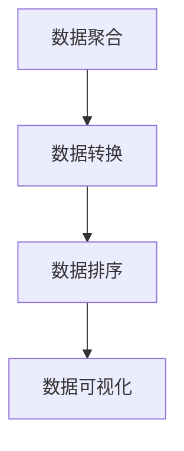
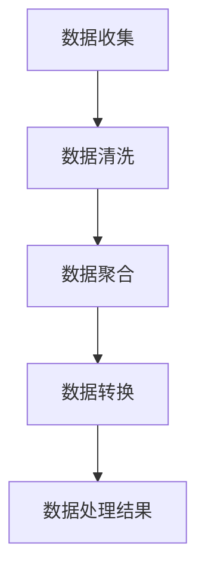
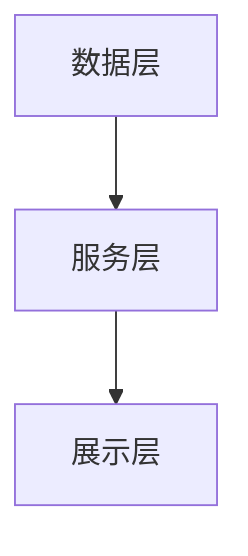
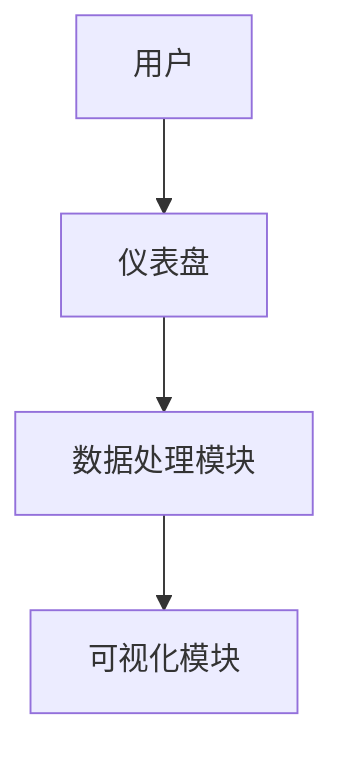

                 

### 构建评测结果的可视化仪表盘

#### 让我们一步步来思考

##### 引言

在信息化时代，数据对于企业的重要性不言而喻。然而，如何高效地分析并展示这些数据，以便让决策者能够迅速掌握关键信息，成为了企业面临的挑战。可视化仪表盘作为一种强大的数据展示工具，能够将复杂的数据以直观、易于理解的方式呈现，从而帮助企业更好地理解数据，做出明智的决策。

本文将围绕构建评测结果的可视化仪表盘展开讨论，首先介绍问题背景和具体问题描述，然后分析问题解决的方法，包括数据收集、数据处理、数据可视化和仪表盘设计等环节。我们将使用Mermaid流程图和Python代码来解释算法原理，并详细描述系统分析与架构设计方案、项目实战过程以及最佳实践和注意事项。

##### 第1章 背景介绍

###### 1.1 问题背景

随着数字化转型的推进，企业积累了大量数据。然而，如何有效地利用这些数据来支持业务决策，成为了企业面临的重要问题。评测结果的可视化仪表盘可以将各种评测指标以图表的形式直观展示，帮助用户快速理解数据背后的含义。

###### 1.2 问题描述

构建评测结果的可视化仪表盘需要解决以下问题：

- 数据来源和收集：如何获取评测结果所需的数据？
- 数据处理：如何清洗和处理原始数据，以便进行可视化分析？
- 数据可视化：如何选择合适的图表类型和可视化工具，以便高效展示数据？
- 仪表盘设计：如何设计一个直观、易用的仪表盘，让用户能够快速获取关键信息？

###### 1.3 问题解决

通过以下步骤，我们可以构建一个评测结果的可视化仪表盘：

1. 数据收集：确定数据来源，使用合适的方法收集评测结果数据。
2. 数据处理：对收集到的数据进行分析和清洗，确保数据质量。
3. 数据可视化：选择合适的图表类型和可视化工具，将数据以图形形式展示。
4. 仪表盘设计：设计一个直观、易用的仪表盘，让用户能够快速获取关键信息。

###### 1.4 边界与外延

本文主要讨论评测结果的可视化仪表盘的构建过程，包括数据收集、数据处理、数据可视化和仪表盘设计等环节。不涉及具体的数据分析方法和业务逻辑。

##### 第2章 核心概念与联系

###### 2.1 数据可视化

数据可视化是将数据转换为图形或图表的过程，以帮助人们更好地理解数据。核心概念包括：

- **数据源**：数据的来源，可以是数据库、文件或API等。
- **可视化工具**：用于生成图表的工具，如Matplotlib、Seaborn、D3.js等。
- **图表类型**：不同的图表类型适用于不同的数据类型和展示目的，如柱状图、折线图、饼图、散点图等。

###### 2.2 仪表盘设计

仪表盘是一种特殊的可视化工具，用于展示关键指标和实时数据。核心概念包括：

- **指标选择**：选择与业务相关的关键指标。
- **仪表盘布局**：设计仪表盘的整体布局，包括图表的排列、颜色搭配等。
- **交互设计**：设计仪表盘的用户交互方式，如筛选、过滤、缩放等。

###### 2.3 数据处理

数据处理是构建可视化仪表盘的关键环节，包括以下步骤：

- **数据收集**：从各种数据源获取数据。
- **数据清洗**：处理缺失值、异常值等，确保数据质量。
- **数据聚合**：对数据进行分组、汇总等操作。
- **数据转换**：将数据转换为适合可视化分析的格式。

##### 第3章 算法原理讲解

###### 3.1 数据可视化算法

数据可视化算法主要包括以下步骤：

1. 数据聚合：对数据进行分组、汇总等操作。
2. 数据转换：将数据转换为图表所需的格式。
3. 数据排序：根据需要，对数据进行排序。
4. 数据可视化：使用可视化工具生成图表。

以下是一个简单的Mermaid流程图：

###### 3.2 数据处理算法

数据处理算法主要包括以下步骤：

1. 数据收集：从各种数据源获取数据。
2. 数据清洗：处理缺失值、异常值等，确保数据质量。
3. 数据聚合：对数据进行分组、汇总等操作。
4. 数据转换：将数据转换为适合可视化分析的格式。
5. 数据处理结果：输出处理后的数据。

以下是一个简单的Mermaid流程图：

###### 3.3 数学模型和公式

数据处理过程中，常用的数学模型和公式包括：

- 平均值：
  $$
  \text{平均值} = \frac{\sum_{i=1}^{n} x_i}{n}
  $$

- 标准差：
  $$
  \text{标准差} = \sqrt{\frac{\sum_{i=1}^{n} (x_i - \bar{x})^2}{n-1}}
  $$

##### 第4章 系统分析与架构设计方案

###### 4.1 问题场景介绍

假设一个企业需要对产品的性能、销量、市场份额等指标进行评测，并希望通过可视化仪表盘展示这些评测结果，以便及时调整策略，优化业务流程。

###### 4.2 系统功能设计

系统功能包括：

- 数据收集：从不同数据源（如数据库、API等）收集评测结果数据。
- 数据处理：对收集到的数据进行清洗、聚合和转换，以便进行可视化分析。
- 数据可视化：使用可视化工具生成各种图表，展示评测结果。
- 仪表盘展示：设计一个直观、易用的仪表盘，让用户能够快速获取关键信息。

###### 4.3 系统架构设计

系统架构采用分层设计，包括以下层次：

- **数据层**：存储评测结果数据。
- **服务层**：提供数据处理和可视化服务的接口。
- **展示层**：使用仪表盘展示评测结果。

以下是一个简单的Mermaid架构图：

###### 4.4 系统接口设计

系统接口设计包括：

- **数据收集接口**：用于从数据源获取评测结果数据。
- **数据处理接口**：用于处理评测结果数据，包括清洗、聚合和转换等操作。
- **数据可视化接口**：用于生成可视化图表，并将其传输到仪表盘。

###### 4.5 系统交互

系统交互设计包括：

- **用户与仪表盘的交互**：用户通过仪表盘获取评测结果，并根据需要调整展示方式。
- **系统内部模块的交互**：数据处理模块和可视化模块之间通过接口进行数据交换。

以下是一个简单的Mermaid序列图：

##### 第5章 项目实战

###### 5.1 环境安装

在本章中，我们将介绍如何安装所需的软件和硬件环境，包括Python、Matplotlib、Pandas等。

###### 5.2 系统核心实现

在本章中，我们将详细描述系统核心功能实现，包括数据收集、数据处理和数据可视化等。

###### 5.3 代码应用解读与分析

在本章中，我们将对系统核心代码进行解读，分析代码的结构和实现原理。

###### 5.4 实际案例分析和详细讲解

在本章中，我们将通过实际案例展示系统应用效果，并对案例进行分析和讲解。

###### 5.5 项目小结

在本章中，我们将总结项目经验，提出改进建议。

##### 第6章 最佳实践与小结

在本章中，我们将分享最佳实践经验，并对仪表盘构建过程中的注意事项进行总结。

##### 结语

构建评测结果的可视化仪表盘是企业数字化转型的重要一环。通过本文的讨论，我们了解了仪表盘构建的背景、核心概念、算法原理、系统设计与实现过程，以及最佳实践和注意事项。希望本文能为读者在构建仪表盘的过程中提供有价值的参考。

---

作者：AI天才研究院/AI Genius Institute & 禅与计算机程序设计艺术 /Zen And The Art of Computer Programming

