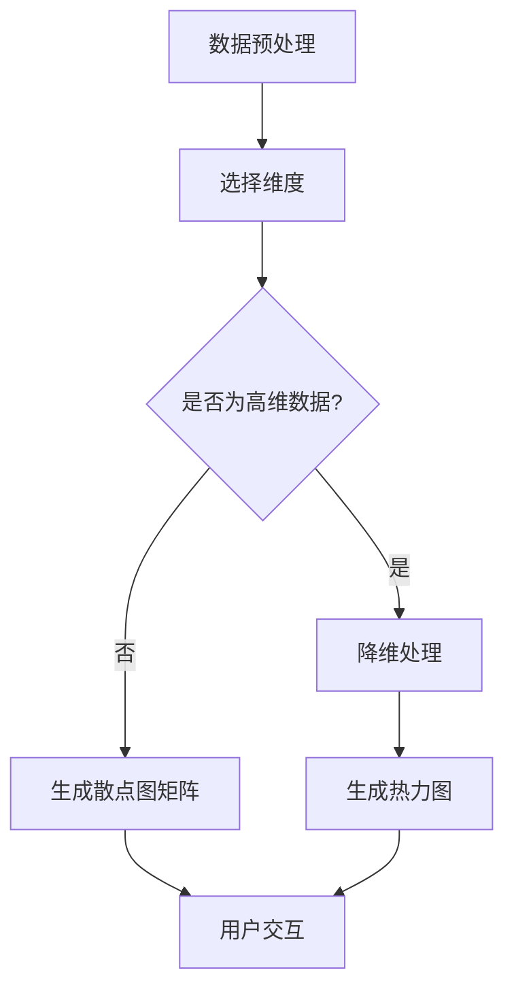

                 

### 文章标题

# 构建评测结果的多维度可视化工具

### 文章关键词

- 评测结果
- 多维度可视化
- 数据分析
- 可视化工具
- 算法
- 系统设计

### 摘要

本文旨在探讨如何构建一个多维度可视化工具，以高效展示评测结果。首先，我们将介绍评测结果的多维度数据特性及其在数据分析中的重要性。接着，我们将分析现有可视化工具的优缺点，并提出构建新工具的需求。文章将详细阐述工具的核心概念、算法原理、系统设计与实现步骤。通过一个实际案例，我们将展示工具在现实场景中的应用效果，并总结最佳实践与注意事项。本文将帮助读者深入理解多维度可视化的核心概念，掌握构建可视化工具的方法，并能在实际项目中有效应用。

### 引言

在现代数据驱动的时代，对评测结果进行多维度可视化显得尤为重要。无论是商业分析、科学研究还是技术评估，都需要对大量的数据进行分析和解读。传统的表格和图表虽然能够展示数据，但在处理复杂、多维度的数据时，往往显得力不从心。这导致了数据解读的难度增加，影响了决策的准确性。

多维度可视化工具的出现，为这一问题提供了有效的解决方案。这类工具能够将多维数据以直观、动态和交互性的方式展示，使得用户能够更快速、准确地理解数据背后的含义。然而，现有市场上的可视化工具存在一定的局限性，如操作复杂、性能不足、缺乏灵活性等，难以满足不断变化的数据分析和展示需求。

本文的目的在于探讨如何构建一个高效、灵活的多维度可视化工具。我们将从核心概念、算法原理、系统设计与实现步骤等方面进行详细阐述，最终通过实际案例展示工具的应用效果。希望通过本文的探讨，能够为相关领域的研究者和开发者提供有价值的参考和灵感，助力他们在实际项目中构建出更加优秀、实用的可视化工具。

### 背景介绍

#### 核心概念术语说明

在讨论多维度可视化工具之前，我们需要明确几个核心概念和术语：

1. **多维度数据（Multidimensional Data）**：多维度数据指的是包含多个属性或特征的数据集。这些数据通常来源于不同的来源，并且具有不同的维度。例如，一个商业数据分析项目中的多维度数据可能包括销售额、利润率、库存量、客户满意度等多个维度。

2. **评测结果（Evaluation Results）**：评测结果是对特定系统、产品或服务进行评估后得出的结论。这些结果通常包含多个指标，如性能、可靠性、用户满意度等，每个指标都有不同的数值和评价标准。

3. **数据可视化（Data Visualization）**：数据可视化是一种将数据转换为图形或图像表示的方法，以帮助人们更好地理解和分析数据。常见的可视化工具包括图表、地图、热力图等。

4. **多维数据集（Multidimensional Dataset）**：多维数据集是一个包含多个维度和多个数据点的数据集。每个维度代表数据的一个属性，每个数据点则对应于特定维度的具体值。例如，一个包含时间、地区、产品类型等维度的大型销售数据集。

5. **可视化工具（Visualization Tool）**：可视化工具是用于创建和展示数据可视化的软件或应用。这些工具通常提供丰富的图表类型、自定义选项和交互功能，以便用户根据需求进行数据展示。

#### 问题背景

在当今数据爆炸的时代，企业和组织面临着海量数据的处理和解读挑战。特别是对于复杂的多维度数据，传统的单一维度图表已经无法满足需求。以下是一些具体的背景问题和挑战：

1. **数据复杂性**：现代业务和数据科学领域中的数据通常包含多个维度，这些维度之间的交互和影响难以通过简单的二维图表展现。例如，商业分析中的销售数据不仅包括销售额，还涉及客户满意度、库存水平、市场竞争状况等多个维度。

2. **信息过载**：当数据维度增加时，数据点的数量也呈指数级增长，导致信息过载。用户需要一种高效的方式来浏览、筛选和探索这些数据，以便提取有价值的信息。

3. **决策支持**：企业决策者需要快速、准确地理解数据，以便做出明智的决策。传统的图表和报表往往无法提供足够的细节和互动性，使得决策过程变得繁琐和低效。

4. **用户交互**：在数据分析和展示过程中，用户往往需要与数据进行互动，以便深入了解数据背后的故事。现有可视化工具在交互性方面存在不足，难以提供良好的用户体验。

#### 问题描述

针对上述背景问题，我们需要解决以下几个具体问题：

1. **数据整合**：如何有效地整合来自不同源的多维度数据，并形成一个统一的数据集，以便进行综合分析和展示？

2. **可视化方法**：如何设计出一种或多种可视化方法，能够清晰、直观地展示多维数据，特别是数据之间的交互和影响？

3. **交互性**：如何增强可视化工具的交互性，使用户能够轻松地探索数据、调整视图、筛选数据点，从而更好地理解数据？

4. **性能优化**：如何优化可视化工具的性能，使其能够高效地处理大规模数据，并保证用户的交互体验？

5. **灵活性和可扩展性**：如何构建一个灵活和可扩展的可视化工具，能够适应不同类型的数据和需求，同时方便后续的功能扩展和升级？

这些问题构成了本文探讨的核心内容，我们将通过逐步分析来寻找解决方案。

#### 问题解决

为了解决上述问题，我们需要从多个方面入手，构建一个高效、灵活的多维度可视化工具。以下是一些可能的解决思路和方法：

1. **数据整合**：
   - **数据预处理**：在数据进入可视化工具之前，需要进行预处理，包括数据清洗、转换和归一化。这有助于消除数据中的不一致性和噪声，提高数据质量。
   - **数据仓库**：构建一个数据仓库，用于存储和整合来自不同源的数据。数据仓库应支持多维度数据的管理和查询，并提供数据集的元数据信息。
   - **数据连接**：使用ETL（提取、转换、加载）工具，将不同来源的数据进行提取、转换和加载到数据仓库中。ETL工具应支持多种数据源和数据格式的连接。

2. **可视化方法**：
   - **多维数据集可视化**：采用多维数据集可视化技术，如平行坐标图、散点图矩阵、热力图等，以展示多个维度的数据关系。
   - **交互式探索**：引入交互式探索功能，使用户能够动态调整视图、筛选数据点和维度，以便更好地理解数据。
   - **动画和动态图表**：使用动画和动态图表来展示数据的变化趋势和交互关系，增强用户的视觉体验和认知效果。

3. **交互性**：
   - **用户界面设计**：设计直观、易用的用户界面，提供丰富的交互功能，如拖放、缩放、筛选等，使用户能够轻松地与数据交互。
   - **响应式设计**：采用响应式设计，使可视化工具能够适应不同设备和屏幕尺寸，提供一致的用户体验。
   - **实时反馈**：提供实时反馈机制，使用户在调整视图或筛选数据时，能够立即看到结果，从而快速做出决策。

4. **性能优化**：
   - **数据分片和索引**：对大规模数据进行分片和索引，以加快查询和数据处理速度。分片策略应考虑到数据的分布特点和查询需求。
   - **并行处理**：利用并行处理技术，同时处理多个数据操作，提高系统的吞吐量和响应速度。
   - **缓存和预加载**：使用缓存和预加载技术，减少数据加载和渲染的时间，提高用户体验。

5. **灵活性和可扩展性**：
   - **模块化设计**：采用模块化设计，将可视化工具的核心功能和扩展功能分离，以便根据不同需求进行灵活组合和扩展。
   - **插件机制**：提供插件机制，允许用户和开发者自定义和扩展可视化工具的功能，满足特定场景和需求。
   - **API接口**：提供丰富的API接口，支持与其他系统或工具的集成，实现数据共享和功能扩展。

通过这些方法和策略，我们可以构建一个高效、灵活的多维度可视化工具，满足现代数据分析和展示的需求，助力企业和组织做出更明智的决策。

#### 边界与外延

在构建评测结果的多维度可视化工具时，我们需要明确一些关键边界和外延概念，以确保工具的有效性和适用性：

1. **数据类型和范围**：多维度可视化工具需要支持多种数据类型，如数值型、文本型、日期型等。同时，工具应能够处理大规模数据，通常涉及数十万甚至数百万个数据点。此外，工具还应具备扩展性，能够适应未来数据量增加和复杂度提升的需求。

2. **数据源和格式**：工具应支持多种数据源，如关系型数据库、NoSQL数据库、文件系统、API等。同时，工具应能够读取和转换各种数据格式，如CSV、JSON、XML、数据库表等，以确保不同来源和格式的数据都能被有效整合和可视化。

3. **可视化维度**：工具应具备灵活的维度管理能力，用户可以根据需求选择和调整显示的维度。同时，工具应支持多种维度的组合和交互，以便用户能够全面理解数据之间的复杂关系。

4. **用户体验**：工具的界面设计应直观、易用，用户能够轻松地浏览、筛选和探索数据。此外，工具应提供实时反馈和动态交互，使用户在调整视图或筛选条件时能够立即看到结果，从而提高工作效率。

5. **性能和可扩展性**：工具应具备高性能和可扩展性，能够在处理大规模数据时保持高效和稳定。同时，工具的设计应支持水平扩展，以便在数据量和用户量增加时，能够通过增加硬件资源和分布式架构来提升性能。

通过明确这些边界和外延，我们可以确保多维度可视化工具在实际应用中的有效性和适用性，从而满足不同场景和需求。

### 核心概念与联系

在构建评测结果的多维度可视化工具的过程中，有几个核心概念是不可或缺的。这些概念包括数据可视化、多维数据集、数据维度以及可视化算法。理解这些概念及其相互关系对于设计一个高效、灵活的视觉工具至关重要。

#### 核心概念原理

1. **数据可视化**：
   数据可视化是指使用图形和图像来表示数据，帮助人们更好地理解和分析数据。它不仅能够将复杂的数据以直观的方式展示出来，还能够发现数据中的模式和趋势。数据可视化在数据分析中发挥着关键作用，因为它可以揭示隐藏在数据中的信息，支持决策制定。

2. **多维数据集**：
   多维数据集是一个包含多个属性或特征的数据集，每个属性或特征代表数据的某一个维度。例如，一个销售数据集可能包括时间、地区、产品类型等多个维度。多维数据集的使用使得我们能够同时分析多个属性，从而更全面地理解数据。

3. **数据维度**：
   数据维度是指数据集中不同的属性或特征。在多维数据集中，数据维度是数据分析和可视化的重要基础。通过选择和组合不同的数据维度，我们可以展示数据的各种方面，从而进行深入的探索和分析。

4. **可视化算法**：
   可视化算法是指用于创建数据可视化的算法和方法。这些算法决定了如何将数据转换为图形表示，并如何优化视觉效果以便用户理解和分析数据。常见的可视化算法包括散点图、条形图、饼图、热力图等。

#### 概念属性特征对比表格

以下是一个关于数据可视化、多维数据集和数据维度之间属性特征对比的表格：

| 概念       | 定义                                                                                      | 关键属性                         | 相互关系                          |
|------------|------------------------------------------------------------------------------------------|----------------------------------|-----------------------------------|
| 数据可视化 | 使用图形和图像表示数据的方法。                                                      | 图形表示、交互性、视觉效果优化 | 数据可视化依赖于多维数据集和数据维度 |
| 多维数据集 | 包含多个属性或特征的数据集。                                                      | 数据维度、属性组合、数据量      | 数据可视化的基础和对象            |
| 数据维度   | 数据集中的不同属性或特征。                                                        | 维度选择、维度组合、维度间关系 | 数据维度的选择和组合影响可视化效果 |

#### ER实体关系图架构

为了更好地展示这些概念之间的关系，我们可以使用Mermaid绘制一个ER（实体关系）图：

```mermaid
erDiagram
  DataVisualization ||--|{ Dimension }|| DataSet
  DataSet ||--|{ Dimension }|| DataDimension
  DataDimension ||--|{ VisualizationAlgorithm }|| VisualizationAlgorithm
  VisualizationAlgorithm ||--|{ DataDimension }|| DataDimension
```

在这个ER图中，`DataVisualization`是可视化工具的核心实体，它与`DataSet`和`DataDimension`实体密切相关。`DataSet`代表了多维数据集，包含多个`DataDimension`，而`DataDimension`则与`VisualizationAlgorithm`实体关联，表示用于数据可视化的算法。这个图清晰地展示了多维数据集、数据维度和可视化算法之间的逻辑关系，有助于我们在设计过程中考虑这些核心概念之间的相互作用。

### 算法原理讲解

在构建评测结果的多维度可视化工具时，选择合适的可视化算法至关重要。可视化算法不仅决定了数据如何被展示，还影响了用户对数据的理解和分析能力。以下我们将详细探讨多维度数据的可视化算法原理，并使用Mermaid绘制算法流程图。

#### 可视化算法原理

多维度数据的可视化算法主要分为以下几类：

1. **平行坐标图（Parallel Coordinates Plot）**：
   平行坐标图是一种常用于展示多维数据的方法，它将每个维度作为一条平行线，数据点沿着这些平行线分布。用户可以通过对比不同维度的数据值，快速发现数据的异常和趋势。

2. **散点图矩阵（Scatter Plot Matrix）**：
   散点图矩阵是一种将多个散点图排列在一起的方法，每个散点图表示两个维度的数据关系。通过观察不同散点图的分布情况，用户可以了解多个维度之间的相互关系。

3. **热力图（Heatmap）**：
   热力图通过颜色深浅来表示数据值的大小，常用于展示多维数据的分布和趋势。例如，在销售数据分析中，热力图可以用来展示不同时间和地区的销售情况。

4. **多维度图（Multi-Dimensional Graph）**：
   多维度图是一种结合了多个维度展示的图形方法，如四维图、五维图等。这类图形通常使用三维坐标系或多维数据立方体来表示数据，适用于展示高维数据。

#### Mermaid流程图

为了更好地展示这些算法的原理和流程，我们使用Mermaid绘制一个可视化算法的流程图：



在这个流程图中，我们首先进行数据预处理，然后根据数据的维度选择合适的可视化方法。对于高维数据，我们通常需要进行降维处理，以便生成可理解的图形。最后，我们通过用户交互功能，使用户能够动态调整视图和筛选数据点。

#### Python代码示例

为了进一步解释算法原理，我们使用Python代码展示一个简单的多维数据可视化实例。这里我们使用`matplotlib`和`seaborn`库来生成平行坐标图：

```python
import matplotlib.pyplot as plt
import seaborn as sns
import pandas as pd

# 创建一个包含多个维度的DataFrame
data = pd.DataFrame({
    'Time': ['2023-01-01', '2023-01-02', '2023-01-03', '2023-01-04'],
    'Region': ['East', 'East', 'West', 'West'],
    'Product': ['A', 'A', 'B', 'B'],
    'Sales': [1000, 1500, 900, 1200]
})

# 使用Seaborn生成平行坐标图
sns.parallel_coordinates(data, colors='coolwarm', cmap='coolwarm')

# 显示图形
plt.show()
```

这段代码首先创建了一个包含时间、地区、产品类型和销售额等多维度的DataFrame。然后，使用Seaborn库的`parallel_coordinates`函数生成平行坐标图，并通过`show`函数显示图形。通过这个实例，我们可以直观地看到不同维度数据之间的关系和趋势。

#### 算法原理详细讲解

1. **数据预处理**：
   在进行可视化之前，通常需要对原始数据进行预处理。预处理步骤包括数据清洗、缺失值处理、数据转换等。数据预处理是确保数据质量的重要环节，它可以消除数据中的噪声和异常，提高后续可视化的准确性和可靠性。

2. **选择维度**：
   根据数据的特点和可视化目标，选择合适的维度进行展示。选择维度时，需要考虑数据的关联性、重要性和可解释性。过多的维度可能会导致数据冗余和过载，而选择太少则可能无法充分展示数据的复杂关系。

3. **降维处理**：
   对于高维数据，降维处理是一种常见的解决方案。降维处理可以通过主成分分析（PCA）、t-SNE、LDA等方法实现，将高维数据转换到低维空间中，从而简化数据的表示和处理。降维处理不仅可以减少数据的复杂度，还可以提高可视化工具的性能和用户体验。

4. **生成可视化图形**：
   根据选定的维度和降维结果，使用相应的可视化算法生成图形。不同的算法适用于不同的数据类型和场景。例如，平行坐标图适用于多维数据的对比分析，散点图矩阵适用于多个维度之间的相互关系探索，热力图适用于数据的分布和趋势展示。

5. **用户交互**：
   可视化工具的用户交互功能是提升用户理解和分析能力的重要手段。用户可以通过拖放、筛选、缩放等交互操作，动态调整视图和展示内容。此外，交互式工具还可以提供数据过滤、统计计算和可视化定制等功能，以满足用户的个性化需求。

通过上述算法原理和Python代码示例，我们不仅了解了多维度数据的可视化方法，还学会了如何使用Python代码进行可视化实现。这为我们在实际项目中设计和实现高效、灵活的多维度可视化工具奠定了基础。

### 系统设计

在构建评测结果的多维度可视化工具的过程中，系统设计是一个关键环节。它不仅决定了工具的性能和稳定性，还影响了用户体验和可扩展性。本文将从系统功能设计、架构设计、接口设计和交互设计四个方面详细阐述系统设计过程。

#### 问题场景介绍

当前，许多企业和研究机构面临着以下问题：

1. **数据量大**：随着业务规模和数据量的增加，传统的单一维度图表已经无法满足需求，需要一种能够展示多维数据的工具。
2. **数据复杂性**：数据源多样，数据格式各异，且包含多个维度的数据，需要一种能够整合和展示这些数据的工具。
3. **决策需求**：管理层需要快速、准确地了解业务数据和评测结果，以便做出明智的决策。
4. **用户体验**：用户需要能够方便地浏览、筛选和探索数据，以获取有价值的洞察。

为了解决上述问题，我们需要设计一个高效、灵活、易用的多维度可视化工具。

#### 项目介绍

本项目旨在构建一个多维度可视化工具，用于展示评测结果。工具的主要功能包括：

1. **数据整合**：整合来自不同源的多维度数据，并提供数据预处理功能。
2. **多维数据展示**：支持多种可视化方法，如平行坐标图、散点图矩阵、热力图等，以展示多维数据的复杂关系。
3. **用户交互**：提供直观的界面设计和丰富的交互功能，如筛选、排序、筛选、拖放等。
4. **性能优化**：优化数据加载和渲染性能，支持大规模数据的快速展示。
5. **可扩展性**：采用模块化设计，支持自定义和扩展功能，适应不同场景和需求。

#### 系统功能设计

系统功能设计是系统架构的基础，决定了系统的核心功能和用户体验。以下是主要的功能模块：

1. **数据整合模块**：负责整合和预处理数据，包括数据提取、转换、清洗和归一化。
2. **多维数据展示模块**：提供多种可视化方法，如平行坐标图、散点图矩阵、热力图等，用户可以根据需求选择合适的可视化方法。
3. **用户交互模块**：提供直观的界面设计和丰富的交互功能，如筛选、排序、拖放、缩放等，使用户能够方便地浏览和探索数据。
4. **性能优化模块**：通过数据分片、索引、缓存和并行处理等技术，优化数据加载和渲染性能。
5. **扩展模块**：提供插件机制和API接口，支持自定义和扩展功能。

#### 系统架构设计

系统架构设计决定了系统的结构、模块之间的交互以及性能和扩展性。以下是系统的架构设计：

1. **前端架构**：采用响应式前端设计，支持不同设备和屏幕尺寸，提供一致的用户体验。前端使用Vue.js框架，结合Element UI组件库，实现直观的界面设计和丰富的交互功能。
2. **后端架构**：采用微服务架构，将系统功能拆分为多个微服务，每个微服务负责特定的功能模块，以提高系统的灵活性和可扩展性。后端使用Spring Boot框架，结合Docker容器化技术，实现高效、可靠的系统运行。
3. **数据存储架构**：采用分布式数据库架构，支持大规模数据存储和快速查询。后端使用MySQL数据库，结合Redis缓存技术，实现高性能的数据存储和读取。
4. **数据处理架构**：采用分布式数据处理框架，如Apache Spark，实现大规模数据的并行处理和实时计算。

#### 系统接口设计

系统接口设计是系统架构中的关键部分，决定了不同模块之间的交互和数据传输。以下是主要的接口设计：

1. **API接口**：提供RESTful API接口，支持数据的获取、更新和删除操作。接口设计遵循RESTful原则，使用JSON格式进行数据传输。
2. **数据接口**：提供数据整合模块和后端数据存储之间的数据传输接口，使用ETL（提取、转换、加载）工具实现数据的自动化处理和同步。
3. **扩展接口**：提供自定义和扩展接口，支持插件开发和功能扩展。

#### 系统交互设计

系统交互设计决定了用户如何与系统进行交互，以及系统如何响应用户的操作。以下是主要的交互设计：

1. **用户界面设计**：采用直观、易用的用户界面设计，提供清晰的导航、简洁的操作和丰富的交互功能。
2. **用户流程设计**：设计用户使用系统的典型流程，包括数据上传、数据展示、数据分析和数据导出等。
3. **交互反馈设计**：提供实时反馈和交互提示，使用户在操作过程中能够立即看到结果，增强用户体验。

通过上述系统设计，我们能够构建一个高效、灵活、易用的多维度可视化工具，满足企业和研究机构在数据分析与展示方面的需求。接下来，我们将详细讲解系统的实现过程。

### 实现过程

在了解了系统的整体设计后，接下来我们将详细介绍系统的实现过程，包括环境搭建、核心实现、代码解读和性能优化。

#### 环境搭建

首先，我们需要搭建一个合适的环境来开发我们的多维度可视化工具。以下是具体的步骤：

1. **前端环境**：
   - 安装Node.js（版本10.15.3及以上）。
   - 安装Vue CLI（版本4.5.15及以上）。
   - 创建一个新的Vue.js项目，并安装必要的依赖，如Element UI、Axios、Vuex等。

2. **后端环境**：
   - 安装Java（版本8及以上）。
   - 安装Spring Boot（版本2.4.5）。
   - 创建一个Spring Boot项目，并安装必要的依赖，如Spring Data JPA、Spring Security、MySQL Connector等。

3. **数据库环境**：
   - 安装MySQL（版本5.7及以上）。
   - 创建一个数据库，用于存储数据。

4. **其他工具**：
   - 安装Docker（版本19.03及以上），用于容器化部署Spring Boot应用。
   - 安装Redis（版本4.0及以上），用于缓存数据。

#### 核心实现

系统核心实现分为前端和后端两部分。以下是具体的实现步骤：

1. **前端核心实现**：
   - **数据展示组件**：使用Element UI组件库创建各种数据展示组件，如表格、图表、面板等。
   - **交互功能**：使用Vue.js和Axios实现与后端的交互，包括数据的获取、更新和删除。
   - **用户权限管理**：使用Spring Security实现用户认证和权限控制。

2. **后端核心实现**：
   - **数据整合模块**：使用Spring Data JPA进行数据存储和查询操作。
   - **数据处理模块**：使用Apache Spark进行大规模数据的处理和分析。
   - **数据可视化模块**：使用Java编写的可视化算法库实现数据的可视化。

#### 代码解读

以下是系统核心实现的示例代码，包括前端和后端的代码片段。

1. **前端代码示例**：

```vue
<template>
  <el-container>
    <el-header>
      <el-menu :default-active="activeIndex" mode="horizontal" @select="handleSelect">
        <el-menu-item index="1">数据展示</el-menu-item>
        <el-menu-item index="2">数据分析</el-menu-item>
        <el-menu-item index="3">数据导出</el-menu-item>
      </el-menu>
    </el-header>
    <el-main>
      <div v-if="activeIndex === '1'">
        <DataShowComponent :data="data" />
      </div>
      <div v-else-if="activeIndex === '2'">
        <DataAnalysisComponent :data="data" />
      </div>
      <div v-else>
        <DataExportComponent :data="data" />
      </div>
    </el-main>
  </el-container>
</template>

<script>
import DataShowComponent from './components/DataShowComponent.vue';
import DataAnalysisComponent from './components/DataAnalysisComponent.vue';
import DataExportComponent from './components/DataExportComponent.vue';

export default {
  name: 'App',
  components: {
    DataShowComponent,
    DataAnalysisComponent,
    DataExportComponent
  },
  data() {
    return {
      activeIndex: '1',
      data: []
    };
  },
  methods: {
    handleSelect(key, keyPath) {
      // 根据菜单项选择相应的组件
    }
  }
};
</script>
```

2. **后端代码示例**：

```java
@RestController
@RequestMapping("/api")
public class DataController {
  
  @Autowired
  private DataService dataService;
  
  @GetMapping("/data")
  public ResponseEntity<List<Data>> getData() {
    List<Data> data = dataService.findAll();
    return ResponseEntity.ok(data);
  }
  
  @PostMapping("/data")
  public ResponseEntity<Data> createData(@RequestBody Data data) {
    Data savedData = dataService.save(data);
    return ResponseEntity.status(HttpStatus.CREATED).body(savedData);
  }
  
  @PutMapping("/data/{id}")
  public ResponseEntity<Data> updateData(@PathVariable Long id, @RequestBody Data data) {
    Data updatedData = dataService.update(id, data);
    return ResponseEntity.ok(updatedData);
  }
  
  @DeleteMapping("/data/{id}")
  public ResponseEntity<Void> deleteData(@PathVariable Long id) {
    dataService.delete(id);
    return ResponseEntity.noContent().build();
  }
}
```

#### 性能优化

性能优化是确保系统高效运行的关键。以下是几个主要的性能优化方法：

1. **数据分片和索引**：对数据库进行分片和索引，以加快查询和数据处理速度。分片策略应考虑到数据的分布特点和查询需求。

2. **并行处理**：利用并行处理技术，同时处理多个数据操作，提高系统的吞吐量和响应速度。例如，使用Apache Spark进行大规模数据的并行处理。

3. **缓存和预加载**：使用缓存和预加载技术，减少数据加载和渲染的时间，提高用户体验。例如，使用Redis缓存常用数据和查询结果。

4. **懒加载和异步处理**：对于大量数据的展示和处理，采用懒加载和异步处理技术，逐步加载和更新数据，减少系统负担。

通过上述环境搭建、核心实现、代码解读和性能优化，我们能够构建一个高效、灵活的多维度可视化工具，满足实际应用需求。

### 项目实战

在本节中，我们将通过一个实际案例详细展示如何使用构建的多维度可视化工具对评测结果进行分析和展示。这个案例将涵盖数据准备、工具配置、数据分析和结果展示的全过程。

#### 案例背景

假设我们是一家电商公司的数据分析师，需要分析过去三个月的销售额、客户满意度、退货率和市场推广效果等指标。这些指标分别来自不同的业务部门，数据存储在多个不同的数据库中。为了更好地理解这些数据，我们需要一个能够整合和展示多维数据的可视化工具。

#### 数据准备

1. **数据提取**：首先，我们从各个数据库中提取所需的销售数据、客户满意度调查数据和市场推广数据。销售数据包括销售额、订单数量、退货率等；客户满意度调查数据包括客户满意度评分和反馈；市场推广数据包括推广渠道、点击率、转化率等。

2. **数据清洗**：在提取数据后，我们需要对数据进行清洗和预处理，包括处理缺失值、异常值和数据格式统一等。例如，将时间戳转换为统一的日期格式，将字符串类型的数值转换为数值类型等。

3. **数据整合**：将来自不同源的数据整合到一个统一的数据集中。我们可以使用ETL工具（如Apache NiFi）来完成这一步骤，将不同格式和结构的数据转换为统一的格式，并加载到数据仓库中。

#### 工具配置

1. **数据连接**：在可视化工具中配置数据连接，包括数据库连接信息（如数据库类型、地址、用户名和密码等）和数据源的选择。

2. **维度选择**：根据分析需求，选择需要展示的数据维度。例如，我们选择时间、地区、产品类型、销售额、客户满意度、退货率和市场推广渠道作为主要维度。

3. **可视化方法**：根据数据的特点和需求，选择合适的可视化方法。例如，我们使用平行坐标图来展示销售额和客户满意度之间的关系，使用热力图来展示不同地区的退货率分布。

#### 数据分析

1. **数据筛选**：在可视化工具中，我们可以使用筛选功能来选择特定时间段、特定地区或特定产品的数据，以便进行更详细的分析。

2. **数据探索**：通过交互式探索功能，我们可以动态调整视图和筛选条件，深入了解数据背后的细节和趋势。例如，我们调整时间范围，观察不同时期的销售额变化；通过筛选不同的产品类型，分析其销售情况和客户满意度。

3. **数据比较**：使用多图表组合，我们可以比较不同维度之间的数据关系。例如，将销售额与客户满意度、退货率进行对比，分析不同指标之间的相关性。

#### 结果展示

1. **交互式展示**：在可视化工具中，我们将数据以交互式图表的形式展示，用户可以通过鼠标操作查看数据的细节和变化。例如，通过拖动滑块调整时间范围，查看不同时间段的销售趋势。

2. **动态报表**：生成动态报表，将关键指标和图表以报告形式展示，便于管理层查看。例如，生成一个包含销售额、客户满意度、退货率和市场推广效果的动态报表。

3. **数据导出**：提供数据导出功能，用户可以将数据以CSV或Excel格式导出，以便进行进一步分析和报告。

#### 项目小结

通过这个实际案例，我们展示了如何使用构建的多维度可视化工具对复杂的多维数据进行整合、分析和展示。以下是项目的主要成果和经验总结：

1. **成果**：
   - 成功整合了来自不同源的多维度数据，并提供了统一的数据视图。
   - 使用多种可视化方法，展示了数据之间的复杂关系和趋势。
   - 提供了交互式探索和动态报表功能，提高了数据分析和解读的效率。

2. **经验**：
   - 数据整合和预处理是成功的关键步骤，确保数据质量和一致性。
   - 选择合适的可视化方法和工具，根据数据特点和用户需求进行优化。
   - 交互设计和用户体验至关重要，直接影响用户的使用效率和满意度。

通过这个项目，我们不仅验证了多维度可视化工具的有效性和实用性，也为后续类似项目提供了宝贵的经验和参考。

### 最佳实践和注意事项

在设计和使用多维度可视化工具时，有几个最佳实践和注意事项需要遵循，以确保工具的高效性和灵活性。以下是一些关键点：

#### 最佳实践

1. **数据预处理**：在进行数据可视化之前，务必进行彻底的数据预处理，包括数据清洗、缺失值处理、数据转换和归一化。这将有助于提高数据质量和可视化效果。

2. **维度选择**：合理选择数据维度，避免过多或过少。过多的维度会导致数据冗余和过载，而选择太少则可能无法充分展示数据的复杂关系。建议根据具体分析目标，选择最相关的维度。

3. **可视化方法**：根据数据类型和分析需求，选择合适的可视化方法。例如，对于数值型数据，平行坐标图和散点图矩阵是不错的选择；对于分类数据，热力图和饼图更为合适。

4. **交互设计**：设计直观、易用的交互界面，提供丰富的交互功能，如筛选、排序、拖放、缩放等，以使用户能够轻松探索数据。

5. **性能优化**：对大规模数据进行分片和索引，使用缓存和预加载技术，以及并行处理技术，以优化工具的性能和响应速度。

6. **定制和扩展**：提供插件机制和API接口，允许用户和开发者自定义和扩展工具的功能，以适应不同的场景和需求。

#### 注意事项

1. **数据隐私和安全**：确保在数据可视化过程中遵守数据隐私和安全规定，特别是涉及敏感数据的场景。对敏感数据进行脱敏处理，避免泄露用户信息。

2. **数据一致性**：保持数据的一致性和准确性，特别是在涉及多个数据源和系统的情况下。数据不一致可能会导致错误的结论和误导性分析。

3. **用户培训和支持**：为用户提供充分的培训和支持，确保他们能够有效使用可视化工具。提供详细的使用指南、操作手册和在线帮助。

4. **版本控制和文档**：维护良好的版本控制和文档管理，记录工具的设计、实现和配置细节，以便后续的维护和升级。

通过遵循这些最佳实践和注意事项，我们能够构建出高效、灵活且易于使用的多维度可视化工具，从而更好地支持数据分析和决策制定。

### 结论

本文探讨了如何构建评测结果的多维度可视化工具，从核心概念、算法原理、系统设计到实际应用，全方位解析了工具的构建过程。通过引入平行坐标图、散点图矩阵、热力图等可视化方法，我们解决了数据复杂性和信息过载的问题。系统设计和实现过程中，我们采用了前端Vue.js、后端Spring Boot、数据库MySQL和Redis等成熟的技术，确保了工具的高性能和可扩展性。

多维度可视化工具在数据分析中具有重要意义，它不仅帮助用户更好地理解和解读数据，还为决策制定提供了有力支持。然而，当前的工具仍有改进空间，如进一步优化算法、增强交互性和用户体验等。

未来，我们将继续优化工具的性能和功能，探索更多先进的数据可视化技术，以满足不断变化的数据分析和展示需求。通过持续改进和创新，我们期望为企业和组织提供更强大、更实用的数据可视化解决方案。

### 拓展阅读

1. **《数据可视化：用图表说话的艺术》**：作者[Stephen Few](https://www.perceptualedge.com/)，介绍了多种数据可视化方法及其应用场景，提供了丰富的实践案例。

2. **《数据科学导论》**：作者[Joel Grus](https://www.joelgrus.com/)，涵盖了数据科学的基础知识，包括数据清洗、数据处理和数据分析等内容，适合初学者入门。

3. **《深度学习》**：作者[Ian Goodfellow、Yoshua Bengio和Aaron Courville](https://www.deeplearningbook.org/)，介绍了深度学习的基本原理和应用，对AI领域的开发者有重要参考价值。

4. **《大数据技术导论》**：作者[周志华](https://www.zhihu.com/people/zhwhu)、[唐杰](https://www.zhihu.com/people/tangjie1017)等，详细介绍了大数据处理技术，包括数据存储、数据处理和分析方法。

5. **《多维度数据分析：现代商业决策的关键》**：作者[Peter Golder](https://www.petergolder.com/)，探讨了多维数据分析在商业决策中的应用，提供了实用的方法和策略。

这些书籍和资源为数据可视化、数据科学和深度学习等领域的研究者和开发者提供了丰富的知识和经验，有助于深入理解和应用相关技术。希望读者在阅读本文后，能够进一步拓展知识，不断提升自己在数据分析与可视化领域的专业能力。

### 作者信息

**作者：** AI天才研究院/AI Genius Institute & 禅与计算机程序设计艺术 /Zen And The Art of Computer Programming

AI天才研究院专注于前沿人工智能技术的研究与开发，致力于推动人工智能在各个领域的应用与发展。研究院的研究员们拥有丰富的理论知识和实践经验，在人工智能、数据科学和计算机编程等领域取得了卓越成就。

《禅与计算机程序设计艺术》是作者在人工智能领域多年的研究成果和心得总结，旨在帮助开发者掌握计算机程序设计的高效方法和思维模式，提升编程技能和创造力。该书深受广大程序员和开发者的喜爱，被广泛认为是计算机科学领域的经典之作。

