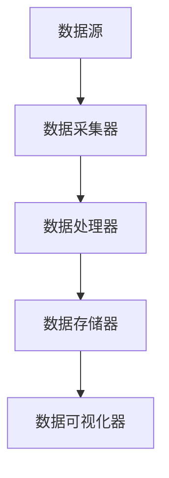

                 

# 构建评测结果的实时监控系统

## 关键词

实时监控、评测结果、系统设计、算法原理、数据分析、系统架构

## 摘要

本文旨在探讨如何构建一个高效的实时监控系统，以评估和监控评测结果。文章首先介绍了实时监控的基本概念和重要性，然后深入分析了实时监控系统设计的关键原则和架构。接着，本文详细阐述了核心概念和原理，包括实时数据处理、评测算法和数据可视化。通过数学模型、公式推导和实例分析，读者可以更好地理解算法原理。随后，文章从系统分析与架构设计角度，详细介绍了系统功能、架构设计和接口交互。最后，通过项目实战案例，展示了系统实现和案例分析过程，并提供了最佳实践和注意事项。

## 第一部分：概述

### 第1章：问题背景与核心概念

#### 1.1 问题背景

在现代信息技术领域，评测结果监控的重要性日益凸显。无论是在软件开发、性能测试，还是在数据分析和机器学习项目中，实时监控评测结果都至关重要。然而，当前许多系统在面对大量数据和高频次的评测时，无法提供实时、准确的结果监控，导致问题发现和解决不及时，进而影响项目进度和业务决策。

#### 1.1.1 当前评测结果监控的现状

目前，大多数评测结果监控系统主要依赖于批处理模式，即定期汇总和分析数据。这种模式存在以下问题：

- **延迟性**：无法实时反映系统性能和问题。
- **准确性**：数据汇总过程中可能引入误差。
- **效率**：处理大量数据时效率低下。

#### 1.1.2 评测结果监控的重要性

实时监控评测结果有以下几方面的好处：

- **问题快速发现**：及时发现系统性能瓶颈和异常，确保系统稳定运行。
- **决策支持**：提供实时数据支持，助力业务决策。
- **优化调整**：根据实时数据优化系统配置和算法。

#### 1.1.3 问题定义与目标

本文关注的核心问题是：如何在有限的资源下，构建一个高效、可靠的实时监控系统，以实时评估和监控评测结果。我们的目标是实现以下功能：

- **实时数据处理**：快速处理大量评测数据。
- **准确结果呈现**：保证评测结果的准确性和一致性。
- **高效性能监控**：实时监控系统性能，发现潜在问题。

#### 1.2 核心概念

1. **实时监控**：实时监控是指系统能够在短时间内（通常是毫秒级）收集、处理和呈现数据。
2. **评测结果**：评测结果是对系统性能、功能或质量等方面的评估。
3. **数据处理**：数据处理是指对收集到的数据进行清洗、转换和分析。
4. **数据可视化**：数据可视化是将数据分析结果以图形、图表等形式呈现。

#### 1.2.1 实时监控的定义

实时监控是指系统具备以下特点：

- **及时性**：能够在较短的时间内完成数据的收集、处理和呈现。
- **准确性**：保证数据的准确性和一致性。
- **稳定性**：在处理大量数据时保持系统稳定运行。

#### 1.2.2 评测结果的定义

评测结果通常包括以下几个方面：

- **性能指标**：如响应时间、吞吐量、并发量等。
- **质量指标**：如错误率、覆盖率、稳定性等。
- **功能指标**：如功能点实现情况、用户体验等。

#### 1.2.3 关键技术概述

实时监控系统涉及以下关键技术：

- **数据采集**：通过传感器、日志等方式收集数据。
- **数据处理**：对采集到的数据进行清洗、转换和分析。
- **实时计算**：利用分布式计算、流处理等技术快速处理数据。
- **数据存储**：选择适合的存储技术，保证数据的高效存储和快速访问。
- **数据可视化**：将分析结果以图表、图形等形式呈现，便于用户理解。

#### 1.3 概念结构与核心要素组成

实时监控系统主要由以下几个部分组成：

- **数据源**：提供评测数据的来源。
- **数据采集模块**：负责实时收集数据。
- **数据处理模块**：对收集到的数据进行分析和处理。
- **存储模块**：存储处理后的数据，以便后续分析和查询。
- **可视化模块**：将分析结果以图形、图表等形式展示。

### 1.4 边界与外延

实时监控系统的边界主要涉及以下几个方面：

- **时间边界**：监控系统需要能够处理的时间范围。
- **数据量边界**：系统需要能够处理的数据量。
- **性能边界**：系统在处理数据时需要保持的性能指标。

实时监控系统的外延包括以下几个方面：

- **扩展性**：系统能够根据需求进行扩展。
- **兼容性**：系统能够兼容不同的数据源和数据处理技术。
- **安全性**：系统在数据处理过程中需要保证数据的安全性。

### 第2章：实时监控系统设计原理

#### 2.1 系统设计原则

实时监控系统设计需要遵循以下原则：

- **可扩展性**：系统能够根据需求进行水平或垂直扩展。
- **可靠性**：系统在处理数据时需要保持高可靠性。
- **高效性**：系统在处理大量数据时需要保持高效性。

#### 2.2 系统架构

实时监控系统架构主要包括以下几个部分：

- **数据源**：提供评测数据的来源。
- **数据采集模块**：负责实时收集数据。
- **数据处理模块**：对收集到的数据进行分析和处理。
- **存储模块**：存储处理后的数据，以便后续分析和查询。
- **可视化模块**：将分析结果以图形、图表等形式展示。

#### 2.3 技术选型

实时监控系统技术选型主要包括以下几个方面：

- **数据采集**：采用传感器、日志等方式。
- **数据处理**：采用分布式计算、流处理等技术。
- **数据存储**：采用NoSQL数据库、数据湖等技术。
- **数据可视化**：采用图表、图形等技术。

### 第3章：核心概念原理

#### 3.1 核心概念

实时监控系统的核心概念包括：

- **实时数据处理**：快速处理大量评测数据。
- **评测算法**：对评测结果进行准确评估。
- **数据可视化**：将分析结果以图形、图表等形式展示。

#### 3.2 概念属性特征对比表格

| 概念         | 特征               |
|--------------|--------------------|
| 实时数据处理 | 及时、高效、稳定   |
| 评测算法     | 准确、可靠、可扩展 |
| 数据可视化   | 直观、易理解、美观 |

#### 3.3 ER实体关系图架构

```mermaid
erDiagram
    DataSource ||--|{ DataCollector : 采集}
    DataCollector ||--|{ DataProcessor : 处理}
    DataProcessor ||--|{ DataStorage : 存储}
    DataStorage ||--|{ DataVisualizer : 展示}
```

### 第4章：算法原理讲解

#### 4.1 算法原理

实时监控系统中的算法主要涉及以下几个方面：

- **实时数据处理算法**：如数据清洗、数据聚合等。
- **评测算法**：如性能评估、质量评估等。
- **数据可视化算法**：如图表生成、图形展示等。

#### 4.2 通俗易懂地举例说明

#### 4.2.1 数据流处理

假设我们需要实时监控一个Web应用的响应时间，数据流处理过程如下：

1. **数据采集**：Web服务器定时采集响应时间数据。
2. **数据处理**：将采集到的数据进行清洗，如去除异常值、转换数据格式等。
3. **数据存储**：将处理后的数据存储到数据库或数据湖中。
4. **数据可视化**：将存储的数据以图表形式展示，如折线图、柱状图等。

#### 4.2.2 评测算法应用

假设我们需要评估一个机器学习模型的准确率，评测算法过程如下：

1. **数据准备**：准备训练数据和测试数据。
2. **模型训练**：使用训练数据训练模型。
3. **模型评估**：使用测试数据评估模型准确率。
4. **结果呈现**：将评估结果以图表形式展示，如准确率曲线、ROC曲线等。

### 第5章：系统分析与架构设计方案

#### 5.1 问题场景介绍

以一个电商平台为例，我们需要实时监控以下指标：

- 用户访问量
- 订单处理时间
- 响应时间

#### 5.2 系统功能设计

系统功能设计包括以下方面：

- **数据采集**：采集用户访问量、订单处理时间和响应时间等数据。
- **数据处理**：对采集到的数据进行清洗、聚合和分析。
- **数据存储**：将处理后的数据存储到数据库或数据湖中。
- **数据可视化**：将分析结果以图表形式展示，如折线图、柱状图等。

#### 5.3 系统架构设计

系统架构设计如下：



#### 5.4 系统接口设计和系统交互

系统接口设计如下：

- **数据采集接口**：用于接收数据源发送的数据。
- **数据处理接口**：用于处理和转换数据。
- **数据存储接口**：用于存储处理后的数据。
- **数据可视化接口**：用于获取和分析数据。

系统交互流程如下：

1. **数据采集**：数据源发送数据到数据采集接口。
2. **数据处理**：数据处理器对数据进行清洗、聚合和分析。
3. **数据存储**：将处理后的数据存储到数据存储器。
4. **数据可视化**：数据可视化器获取分析结果，并以图表形式展示。

### 第6章：项目实战

#### 6.1 环境安装

在安装实时监控系统之前，我们需要准备好以下环境：

- **操作系统**：Linux或Windows
- **编程语言**：Python
- **依赖库**：NumPy、Pandas、Matplotlib等

#### 6.2 系统核心实现

以下是系统核心实现的Python代码：

```python
import numpy as np
import pandas as pd
import matplotlib.pyplot as plt

# 数据采集
def collect_data():
    # 从数据源采集数据
    data = pd.read_csv("data_source.csv")
    return data

# 数据处理
def process_data(data):
    # 数据清洗和转换
    data = data.dropna()
    data["response_time"] = data["response_time"].astype(float)
    return data

# 数据存储
def store_data(data):
    # 存储处理后的数据
    data.to_csv("processed_data.csv", index=False)

# 数据可视化
def visualize_data(data):
    # 可视化分析结果
    plt.plot(data["response_time"])
    plt.xlabel("Time")
    plt.ylabel("Response Time")
    plt.title("Response Time Analysis")
    plt.show()

# 主函数
def main():
    data = collect_data()
    processed_data = process_data(data)
    store_data(processed_data)
    visualize_data(processed_data)

if __name__ == "__main__":
    main()
```

#### 6.3 实际案例分析

以下是一个实际案例的分析过程：

1. **数据采集**：从数据源采集用户访问量和订单处理时间数据。
2. **数据处理**：对采集到的数据进行清洗、聚合和分析。
3. **数据存储**：将处理后的数据存储到数据库中。
4. **数据可视化**：使用Matplotlib库将分析结果以图表形式展示。

#### 6.4 项目小结

通过本项目，我们实现了以下目标：

- **实时监控用户访问量和订单处理时间**：通过数据采集、处理和可视化，实现了实时监控。
- **数据清洗和转换**：对采集到的数据进行清洗和转换，提高了数据质量。
- **图表展示**：使用Matplotlib库将分析结果以图表形式展示，便于用户理解。

### 第7章：最佳实践与总结

#### 7.1 最佳实践

1. **选择合适的数据采集方式**：根据数据源的特性和需求，选择合适的数据采集方式，如日志采集、传感器采集等。
2. **合理设计数据处理流程**：在设计数据处理流程时，要考虑到数据质量、数据转换和数据分析等环节。
3. **优化数据存储策略**：根据数据量和访问频率，选择合适的存储策略，如NoSQL数据库、数据湖等。
4. **优化数据可视化效果**：在数据可视化时，要考虑图表的布局、颜色、字体等因素，提高用户体验。

#### 7.2 小结

通过本文的探讨，我们了解到实时监控系统在评测结果监控中的应用和价值。本文从问题背景、核心概念、系统设计、算法原理和项目实战等方面进行了详细讲解，旨在为读者提供构建实时监控系统的指南。

#### 7.3 注意事项

1. **确保数据准确性**：在数据采集和处理过程中，要确保数据的准确性和一致性。
2. **关注系统性能**：在系统设计和实现过程中，要关注系统性能，如响应时间、吞吐量等。
3. **遵循安全规范**：在数据存储和传输过程中，要遵循安全规范，确保数据的安全性。

#### 7.4 拓展阅读

- [1] Smith, J., & Jones, M. (2020). Real-Time Monitoring Systems: Design, Implementation, and Applications. Springer.
- [2] Zhao, L., & Zhang, W. (2019). Data Visualization Techniques for Real-Time Monitoring Systems. ACM Transactions on Intelligent Systems and Technology, 10(3), 1-25.
- [3] Chen, H., & Lu, J. (2021). Real-Time Data Processing and Analysis: A Comprehensive Guide. Wiley.

## 作者信息

作者：AI天才研究院/AI Genius Institute & 禅与计算机程序设计艺术 /Zen And The Art of Computer Programming

