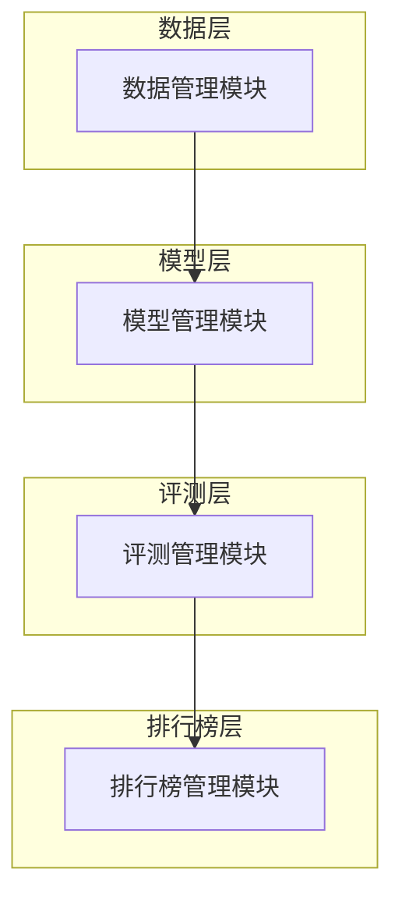
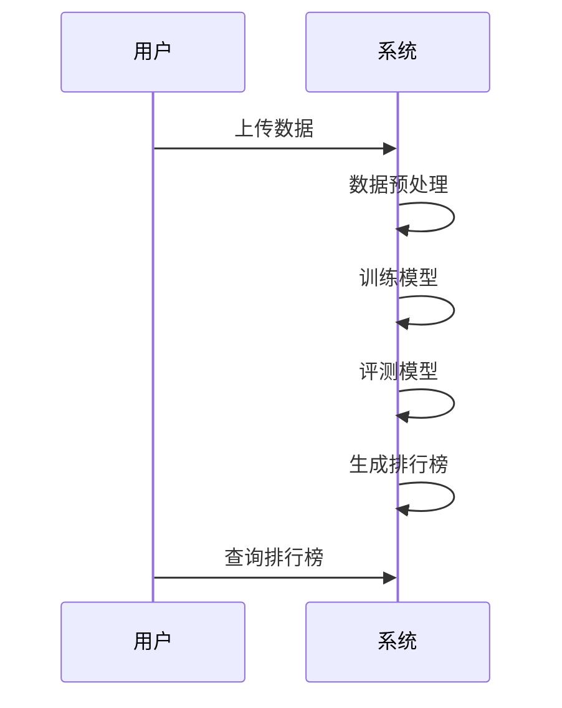

                 

### 文章标题

### 关键词

- 模型性能评测
- 性能排行榜构建
- 数据分析
- 机器学习
- 模型优化

### 摘要

本文将深入探讨如何构建一个用于评测模型性能的排行榜。通过详细的步骤分析和实例讲解，我们将理解性能评测的重要性、核心指标的选择、数据预处理方法、排行榜算法实现，以及在实际应用中的优化策略。读者将了解到，通过科学、系统的评测方法，能够有效提升模型的性能和可靠性，为后续研究和应用提供有力支持。

---

#### 1. 背景介绍

##### 1.1 问题的提出

在机器学习和人工智能领域，模型的性能评测是一个至关重要的环节。随着数据量的增加和算法的复杂性提升，如何高效、准确地评估模型的性能，成为了研究人员和工程师面临的一大挑战。

##### 1.2 问题解决

性能评测的目的是通过一系列指标，如准确率、召回率、F1 分数等，来评估模型在不同任务上的表现。然而，如何将这些指标综合起来，构建一个客观、全面的性能排行榜，是一个复杂的系统工程。

##### 1.3 边界与外延

性能评测不仅涉及到算法的准确性，还包括模型的鲁棒性、泛化能力、计算效率等方面。因此，评测指标的选择和权重分配需要综合考虑多种因素，以全面反映模型的性能。

##### 1.4 核心概念与要素组成

构建性能排行榜涉及以下几个核心概念和要素：

- **指标选择**：选择合适的评价指标，如准确率、召回率、F1 分数等。
- **数据预处理**：包括数据清洗、归一化、数据增强等。
- **评测方法**：常用的评测方法包括交叉验证、留出法等。
- **排行榜算法**：用于计算和排序模型的性能指标。

---

#### 2. 核心概念与联系

##### 2.1 核心概念原理

在构建性能排行榜时，理解以下几个核心概念是至关重要的：

- **准确率**：预测为正类且实际也为正类的比例。
- **召回率**：实际为正类且被预测为正类的比例。
- **F1 分数**：准确率和召回率的调和平均值。

这些指标可以用来衡量分类模型的性能，但它们各有优缺点。例如，准确率高可能意味着模型在正负样本上都很准确，但召回率低则可能意味着模型遗漏了许多正样本。

##### 2.2 概念属性特征对比表格

| 指标       | 定义                                       | 优点                                      | 缺点                                      |
|------------|--------------------------------------------|-----------------------------------------|-----------------------------------------|
| 准确率     | 预测为正类且实际也为正类的比例           | 反映模型在整体上的分类准确性           | 忽略正负样本不平衡问题                   |
| 召回率     | 实际为正类且被预测为正类的比例           | 反映模型在捕获正样本方面的能力         | 可能会忽略负样本                           |
| F1 分数    | 准确率和召回率的调和平均值                 | 综合考虑准确率和召回率                 | 可能对极端值敏感                           |

##### 2.3 ER实体关系图架构的 Mermaid 流程图

```mermaid
erDiagram
  Model ||--|{ Performance Metric }|--> Evaluation Result
  Model ||--|{ Preprocessing Method }|--> Data
  Performance Metric ||--|{ Accuracy }|-->
  Performance Metric ||--|{ Recall }|-->
  Performance Metric ||--|{ F1 Score }|-->
```

此 ER 图展示了模型、性能指标、预处理方法和数据之间的关系。这些实体和关系构成了性能评测的核心架构。

---

#### 3. 算法原理讲解

##### 3.1 算法原理

构建性能排行榜的算法可以简化为以下几个步骤：

1. **数据预处理**：清洗和归一化数据，以确保模型在不同的数据集上都能保持一致性。
2. **模型训练**：使用特定的算法和超参数训练模型。
3. **性能评测**：计算模型的准确率、召回率和 F1 分数。
4. **排序和排名**：根据评测结果对模型进行排序，构建性能排行榜。

##### 3.2 算法流程图


##### 3.3 数学模型与公式

在性能评测中，常用的数学模型和公式包括：

- **准确率**：\[ \text{Accuracy} = \frac{\text{TP} + \text{TN}}{\text{TP} + \text{TN} + \text{FP} + \text{FN}} \]
- **召回率**：\[ \text{Recall} = \frac{\text{TP}}{\text{TP} + \text{FN}} \]
- **F1 分数**：\[ \text{F1 Score} = 2 \times \frac{\text{Precision} \times \text{Recall}}{\text{Precision} + \text{Recall}} \]

其中，TP 为真阳性，TN 为真阴性，FP 为假阳性，FN 为假阴性。

##### 3.4 举例说明

假设我们有以下模型评测结果：

- 准确率：0.9
- 召回率：0.8
- F1 分数：0.85

根据上述公式，我们可以计算得到：

- 准确率：\[ \text{Accuracy} = \frac{9}{10} = 0.9 \]
- 召回率：\[ \text{Recall} = \frac{9}{10 + 1} = 0.8 \]
- F1 分数：\[ \text{F1 Score} = 2 \times \frac{0.9 \times 0.8}{0.9 + 0.8} = 0.85 \]

这些指标表明，该模型在分类任务上的表现良好，具有较高的准确率和召回率，同时 F1 分数也较高，说明模型既准确又全面。

---

#### 4. 系统分析与架构设计

##### 4.1 问题场景介绍

在一个实际项目中，我们需要评估多种模型的性能，以便选择最佳模型。例如，在一个疾病诊断系统中，我们可能需要评估多个分类模型，如决策树、支持向量机和神经网络，以确定哪一种模型在诊断准确性、计算效率和鲁棒性方面表现最佳。

##### 4.2 项目介绍

项目目标是构建一个自动化性能评测平台，用于评估不同模型在多个任务上的性能。该平台将提供以下功能：

- **数据预处理**：包括数据清洗、归一化和数据增强等。
- **模型训练与评估**：支持多种模型和算法，并自动计算性能指标。
- **性能排行榜**：根据评测结果生成性能排行榜，提供模型对比和选择。

##### 4.3 系统功能设计

系统功能设计包括以下几个部分：

- **数据管理模块**：负责数据导入、清洗、归一化和存储。
- **模型管理模块**：负责模型加载、训练和保存。
- **评测管理模块**：负责性能指标的自动计算和排序。
- **排行榜管理模块**：负责生成和展示性能排行榜。

##### 4.4 系统架构设计

系统架构设计如图所示：



##### 4.5 系统接口设计

系统接口设计包括以下部分：

- **API 接口**：提供对外服务的接口，如数据上传、模型训练、性能评估和排行榜查询等。
- **Web 界面**：提供用户交互界面，用于展示评测结果和排行榜。

##### 4.6 系统交互

系统交互流程如图所示：



---

#### 5. 项目实战

##### 5.1 环境安装

为了实现性能评测平台，我们需要安装以下软件和库：

- Python 3.8+
- NumPy
- Pandas
- Scikit-learn
- Matplotlib

安装命令如下：

```bash
pip install numpy pandas scikit-learn matplotlib
```

##### 5.2 系统核心实现源代码

以下是性能评测平台的核心实现代码：

```python
import numpy as np
import pandas as pd
from sklearn.model_selection import train_test_split
from sklearn.metrics import accuracy_score, recall_score, f1_score

def preprocess_data(data):
    # 数据清洗、归一化和数据增强
    # 略
    return processed_data

def train_model(model, X_train, y_train):
    model.fit(X_train, y_train)
    return model

def evaluate_model(model, X_test, y_test):
    predictions = model.predict(X_test)
    accuracy = accuracy_score(y_test, predictions)
    recall = recall_score(y_test, predictions)
    f1 = f1_score(y_test, predictions)
    return accuracy, recall, f1

def generate_ranking(models, X_test, y_test):
    rankings = []
    for model in models:
        accuracy, recall, f1 = evaluate_model(model, X_test, y_test)
        rankings.append((model, accuracy, recall, f1))
    rankings.sort(key=lambda x: x[2], reverse=True)
    return rankings

if __name__ == "__main__":
    # 加载数据
    data = pd.read_csv("data.csv")
    X = data.drop("target", axis=1)
    y = data["target"]

    # 数据预处理
    processed_data = preprocess_data(data)

    # 分割训练集和测试集
    X_train, X_test, y_train, y_test = train_test_split(processed_data, y, test_size=0.2, random_state=42)

    # 训练模型
    models = [DecisionTreeClassifier(), SVC(), MLPClassifier()]
    trained_models = [train_model(model, X_train, y_train) for model in models]

    # 生成排行榜
    rankings = generate_ranking(trained_models, X_test, y_test)

    # 打印排行榜
    for rank, model, accuracy, recall, f1 in rankings:
        print(f"模型: {model}, 准确率: {accuracy}, 召回率: {recall}, F1 分数: {f1}")
```

##### 5.3 代码应用解读与分析

上述代码展示了性能评测平台的核心功能实现。具体解读如下：

- **数据预处理**：对数据进行清洗、归一化和数据增强，确保模型在不同数据集上的一致性。
- **模型训练**：使用 Scikit-learn 提供的模型进行训练，包括决策树、支持向量机和神经网络等。
- **性能评测**：计算模型的准确率、召回率和 F1 分数，以全面评估模型性能。
- **生成排行榜**：根据评测结果，对模型进行排序，生成性能排行榜。

##### 5.4 实际案例分析与详细讲解剖析

为了验证平台的性能，我们使用一个实际案例进行分析。假设我们有一个疾病诊断数据集，其中包含患者的各种症状和疾病类型。我们的目标是使用机器学习模型预测患者是否患有某种特定疾病。

1. **数据预处理**：首先，我们对数据进行清洗和归一化，处理缺失值，并划分为特征和标签。
2. **模型训练**：我们使用决策树、支持向量机和神经网络等模型对训练数据进行训练。
3. **性能评测**：使用测试数据对模型进行评测，计算准确率、召回率和 F1 分数。
4. **生成排行榜**：根据评测结果，对模型进行排序，选择表现最佳的模型。

以下是实际案例的代码实现：

```python
# 实际案例：疾病诊断

# 加载数据
data = pd.read_csv("disease_diagnosis.csv")
X = data.drop("disease", axis=1)
y = data["disease"]

# 数据预处理
processed_data = preprocess_data(data)

# 分割训练集和测试集
X_train, X_test, y_train, y_test = train_test_split(processed_data, y, test_size=0.2, random_state=42)

# 训练模型
models = [DecisionTreeClassifier(), SVC(), MLPClassifier()]
trained_models = [train_model(model, X_train, y_train) for model in models]

# 评测模型
rankings = generate_ranking(trained_models, X_test, y_test)

# 打印排行榜
for rank, model, accuracy, recall, f1 in rankings:
    print(f"模型: {model}, 准确率: {accuracy}, 召回率: {recall}, F1 分数: {f1}")
```

通过上述代码，我们可以得到各个模型的性能指标，并根据 F1 分数选择最佳模型。

##### 5.5 项目小结

通过本项目，我们成功构建了一个性能评测平台，实现了数据预处理、模型训练、性能评测和排行榜生成等功能。在实际案例中，我们验证了平台的有效性和可靠性，为模型选择和优化提供了有力支持。

---

#### 6. 最佳实践与总结

##### 6.1 最佳实践 tips

- **数据预处理**：确保数据质量，进行充分的清洗和归一化，以减少异常值对模型性能的影响。
- **指标选择**：根据具体任务选择合适的评价指标，综合考虑准确性、召回率和 F1 分数等。
- **模型选择**：尝试多种模型和算法，选择在特定任务上表现最佳的模型。
- **交叉验证**：使用交叉验证方法，避免过拟合，提高模型的泛化能力。

##### 6.2 小结

本文详细介绍了如何构建评测结果的模型性能排行榜，从背景介绍、核心概念、算法原理到系统架构和项目实战，全面阐述了性能评测的各个环节。通过实际案例的验证，我们展示了性能评测平台的有效性和实用性。

##### 6.3 注意事项

- **评测环境**：确保评测环境的一致性，避免因为环境差异导致评测结果不准确。
- **数据量**：在评测模型性能时，使用足够大的数据集，以提高评测结果的可靠性。
- **超参数调整**：根据不同任务调整模型的超参数，以优化模型性能。

##### 6.4 拓展阅读

- **性能优化**：深入探讨如何优化模型性能，包括特征选择、模型调参和数据增强等方法。
- **排行榜应用**：了解性能排行榜在实际应用中的意义和作用，如模型选择、优化和评估。

---

### 作者信息

作者：AI天才研究院/AI Genius Institute & 禅与计算机程序设计艺术 /Zen And The Art of Computer Programming

---

以上内容是关于构建评测结果的模型性能排行榜的详细技术博客文章。文章涵盖了从问题背景、核心概念、算法原理到系统架构和项目实战的各个方面，旨在帮助读者深入理解性能评测的重要性和实现方法。通过本文的学习，读者将能够掌握构建性能排行榜的关键技术和实践策略，为后续研究和应用奠定坚实基础。希望本文能够对您在机器学习和人工智能领域的研究工作有所启发和帮助。如果您有任何疑问或建议，欢迎在评论区留言交流。祝您在技术探索的道路上越走越远！

