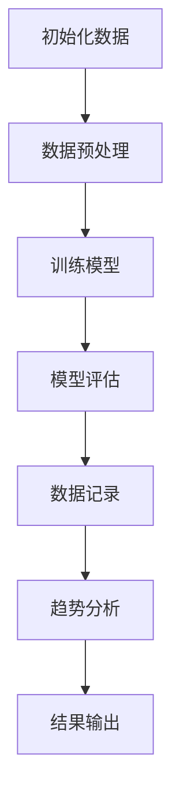
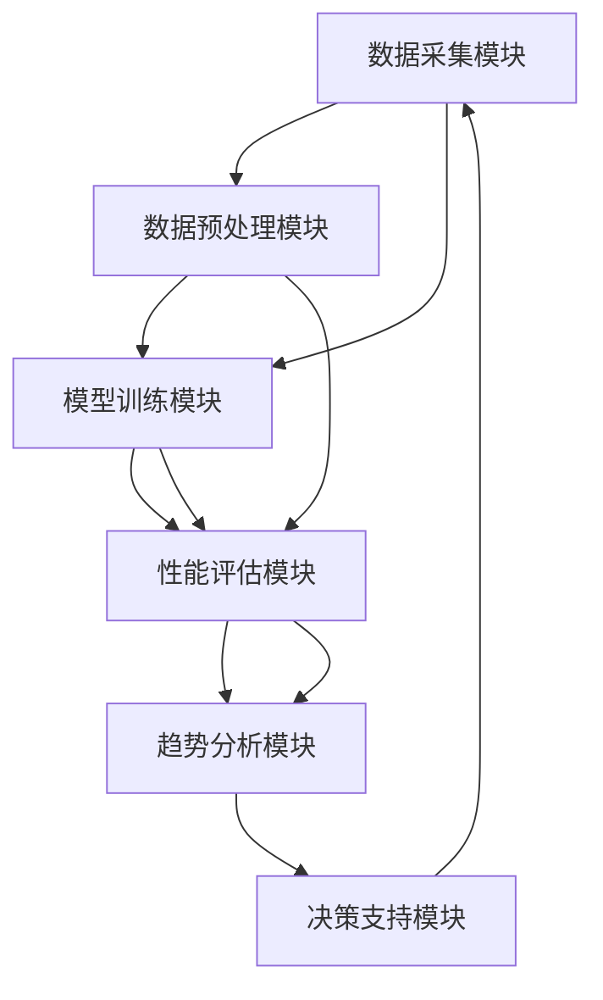
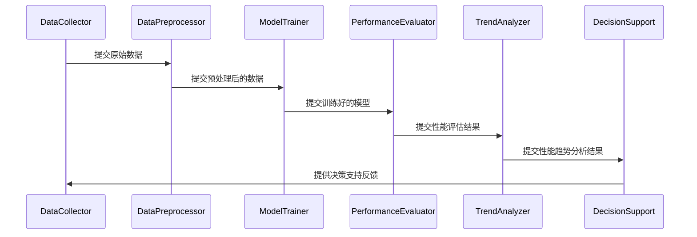

                 

### 引言

#### 1.1 背景介绍

**1.1.1 人工智能与机器学习的发展**

在21世纪，人工智能（AI）和机器学习（ML）已经成为科技领域的热点，这些技术正在改变我们的工作和生活方式。人工智能通过模拟人类智能，使得机器能够执行复杂的任务，如自然语言处理、图像识别、自动驾驶等。而机器学习则是实现人工智能的重要方法，它通过数据驱动的方式让机器自动学习和改进。

随着大数据技术的成熟和计算能力的提升，机器学习在各个领域得到了广泛应用，从医疗诊断到金融分析，从推荐系统到语音识别，AI和ML技术的进步极大地推动了行业的发展。

**1.1.2 性能评测在人工智能中的重要性**

在人工智能和机器学习应用中，性能评测是至关重要的环节。性能评测不仅能够衡量模型在不同任务上的表现，还能够帮助研究人员和工程师了解模型的优缺点，为后续的模型优化和改进提供依据。

然而，随着模型复杂度的增加和数据量的激增，传统的方法已经难以应对对模型性能的全面评估。因此，构建一个能够有效跟踪和预测模型性能趋势的系统，显得尤为重要。

#### 1.2 问题的提出

**1.2.1 模型性能评估的挑战**

模型性能评估面临着以下几个主要挑战：

- **多样性**：不同的模型和任务需要不同的评估指标，如何统一评估标准成为一个问题。
- **动态性**：模型的性能可能随着时间、数据分布和环境变化而变化，如何跟踪和预测这些变化是关键。
- **复杂性**：性能评估过程通常涉及大量的数据处理和分析，如何高效地进行性能评估是一个技术难题。

**1.2.2 构建评测结果的模型性能趋势分析系统的必要性**

为了应对上述挑战，构建一个评测结果的模型性能趋势分析系统显得尤为重要。这样的系统不仅能够自动收集和评估模型在不同任务上的表现，还能够通过分析历史数据，预测未来的性能变化趋势。

通过构建这样一个系统，我们可以在以下几个方面受益：

- **优化模型**：通过分析性能趋势，找到模型优化的方向，提高模型的效果。
- **预测风险**：提前发现模型的潜在问题，避免性能下降带来的风险。
- **支持决策**：为模型选择、部署和更新提供数据支持，帮助做出更加科学的决策。

总之，构建评测结果的模型性能趋势分析系统是提升人工智能应用效果的重要手段，也是推动人工智能技术发展的重要一步。接下来，我们将详细探讨如何设计和实现这样一个系统。

### 核心概念与联系

在构建评测结果的模型性能趋势分析系统之前，我们需要了解一些核心概念，并明确它们之间的关系。本节将详细介绍评测结果、模型性能和趋势分析等核心概念，并通过属性特征对比表格和实体关系图来帮助读者更好地理解这些概念。

#### 2.1 评测结果

**2.1.1 评测结果的基本概念**

评测结果是指通过对模型或算法在某项任务上的性能表现进行测试和评估所得到的结果。这些结果通常包括多个指标，例如准确率、召回率、F1得分、损失函数值等。

**2.1.2 评测结果的类型与特征**

- **类型**：
  - **定量评测**：通过数值指标来衡量模型性能，如准确率、召回率等。
  - **定性评测**：通过主观判断来评估模型性能，如用户体验评分等。
- **特征**：
  - **准确性**：反映模型预测结果的正确性。
  - **稳定性**：模型在不同数据集或条件下性能的一致性。
  - **鲁棒性**：模型对异常数据或噪声的抵抗能力。

#### 2.2 模型性能

**2.2.1 模型性能的定义**

模型性能是指模型在特定任务上表现的好坏程度。它是通过评测结果来衡量的，不同任务有不同的性能评价指标。

**2.2.2 模型性能的衡量指标**

- **分类任务**：
  - **准确率**：正确分类的样本占总样本的比例。
  - **召回率**：正确分类的样本占实际正样本的比例。
  - **F1得分**：综合考虑准确率和召回率的平衡指标。
- **回归任务**：
  - **均方误差（MSE）**：预测值与真实值之间差的平方的平均值。
  - **均方根误差（RMSE）**：MSE的平方根。
- **其他任务**：
  - **语义相似度**：用于文本匹配和语义分析的任务。

#### 2.3 趋势分析

**2.3.1 趋势分析的基本原理**

趋势分析是一种通过数据的时间序列变化来识别模式、趋势和周期性变化的方法。它可以帮助我们理解模型性能随时间的变化情况，从而预测未来的性能趋势。

**2.3.2 趋势分析的方法与技术**

- **时间序列分析**：通过分析数据的时间序列变化来识别趋势和周期性变化。
- **统计分析**：使用统计方法（如回归分析、移动平均）来预测未来的数据点。
- **机器学习方法**：使用机器学习模型（如ARIMA、LSTM）进行趋势预测。

### 概念属性特征对比表格

下面是一个简化的概念属性特征对比表格，用于展示评测结果、模型性能和趋势分析之间的区别和联系：

| 概念 | 定义 | 主要属性 | 联系 |
| --- | --- | --- | --- |
| 评测结果 | 性能评估的结果 | 准确性、稳定性、鲁棒性 | 评测结果是衡量模型性能的直接依据 |
| 模型性能 | 模型在特定任务上的表现 | 准确率、召回率、F1得分、MSE、RMSE | 模型性能决定了评测结果的类型和数值 |
| 趋势分析 | 识别数据时间序列的变化 | 时间序列、周期性、模式识别 | 趋势分析可以帮助预测模型性能的变化 |

### ER实体关系图架构

为了更直观地展示这些核心概念之间的关系，我们可以使用Mermaid绘制一个ER（实体关系）图，如下所示：

```mermaid
erDiagram
  ModelPerformance ||--|{ TestResult : 测量 }
  TestResult ||--|{ PerformanceTrend : 分析 }
```

在这个ER图中，`ModelPerformance`表示模型性能，`TestResult`表示评测结果，`PerformanceTrend`表示性能趋势。它们之间的关系如下：

- `ModelPerformance`通过`TestResult`来衡量其性能。
- `TestResult`通过`PerformanceTrend`来分析其变化趋势。

通过上述对比表格和ER图，我们对评测结果、模型性能和趋势分析的核心概念及其联系有了更深入的理解。接下来，我们将进一步探讨如何基于这些概念设计和实现一个高效的模型性能趋势分析系统。

### 算法原理讲解

在了解了评测结果、模型性能和趋势分析的核心概念后，我们将进一步探讨算法原理，通过具体的算法流程图、Python源代码和数学模型来讲解如何实现模型性能趋势分析。

#### 3.1 算法流程图

为了清晰展示算法的运行步骤，我们可以使用Mermaid绘制一个算法流程图，如下所示：



**算法流程说明**：

1. **初始化数据**：准备用于训练和评估的数据集，包括训练集和测试集。
2. **数据预处理**：对数据进行清洗和预处理，包括缺失值填充、异常值处理、数据归一化等。
3. **训练模型**：使用训练集训练模型，这里可以选择不同的机器学习算法，如线性回归、决策树、神经网络等。
4. **模型评估**：使用测试集对模型进行评估，得到模型的性能指标，如准确率、召回率、F1得分等。
5. **数据记录**：将模型评估结果和历史数据记录下来，为后续的趋势分析提供基础数据。
6. **趋势分析**：对记录的数据进行趋势分析，使用统计方法或机器学习模型来预测未来的性能变化趋势。
7. **结果输出**：输出分析结果，包括当前的模型性能和预测的性能趋势。

#### 3.2 Python 源代码

下面是使用Python实现上述算法流程的一个示例代码，代码中包含了详细的注释：

```python
import numpy as np
import pandas as pd
from sklearn.model_selection import train_test_split
from sklearn.preprocessing import StandardScaler
from sklearn.linear_model import LinearRegression
import matplotlib.pyplot as plt

# 初始化数据
X, y = load_data()  # 假设有一个函数load_data()用于加载数据

# 数据预处理
X_train, X_test, y_train, y_test = train_test_split(X, y, test_size=0.2, random_state=42)
scaler = StandardScaler()
X_train_scaled = scaler.fit_transform(X_train)
X_test_scaled = scaler.transform(X_test)

# 训练模型
model = LinearRegression()
model.fit(X_train_scaled, y_train)

# 模型评估
y_pred = model.predict(X_test_scaled)
performance = model.score(X_test_scaled, y_test)
print("模型性能：", performance)

# 数据记录
results = pd.DataFrame({'Test Score': y_test, 'Prediction': y_pred})
results.to_csv('model_performance.csv', index=False)

# 趋势分析
results['Time'] = pd.to_datetime(results.index)
trend_analysis = results.groupby(results['Time'].dt.to_period('M')).mean()

# 结果输出
plt.plot(trend_analysis.index, trend_analysis['Prediction'])
plt.xlabel('时间')
plt.ylabel('预测性能')
plt.title('模型性能趋势分析')
plt.show()
```

**代码功能解析**：

- **初始化数据**：通过`load_data()`函数加载数据集。
- **数据预处理**：使用`StandardScaler`进行数据归一化处理。
- **训练模型**：使用`LinearRegression`进行线性回归模型的训练。
- **模型评估**：计算模型在测试集上的评分。
- **数据记录**：将评估结果保存为CSV文件。
- **趋势分析**：使用`groupby`和`mean`方法对数据进行时间序列分析。
- **结果输出**：使用`matplotlib`绘制性能趋势图。

#### 3.3 数学模型和公式

在模型性能趋势分析中，数学模型和公式起着至关重要的作用。以下是线性回归模型的一个基本数学模型，使用LaTeX格式表示：

$$
y = \beta_0 + \beta_1 x + \epsilon
$$

- **y**：预测值。
- **$\beta_0$**：截距。
- **$\beta_1$**：斜率。
- **x**：输入特征。
- **$\epsilon$**：误差项。

线性回归模型通过最小化预测值与真实值之间的误差（即损失函数）来训练模型：

$$
\min_{\beta_0, \beta_1} \sum_{i=1}^{n} (y_i - (\beta_0 + \beta_1 x_i))^2
$$

通过求解上述优化问题，可以得到最佳的模型参数$\beta_0$和$\beta_1$。

#### 3.4 举例说明

为了更好地理解上述算法原理，我们可以结合一个实际案例进行讲解。

**案例背景**：假设我们有一个分类任务，需要预测一组图像是否包含特定物体。数据集包括1000张图像和它们的标签，其中标签为1表示图像包含目标物体，标签为0表示不包含。

**案例步骤**：

1. **数据加载**：使用`load_data()`函数加载数据集。
2. **数据预处理**：对图像数据进行归一化处理，将像素值缩放到[0, 1]区间。
3. **模型训练**：使用`LinearRegression`模型对数据进行训练。
4. **模型评估**：在测试集上评估模型的性能，得到准确率、召回率等指标。
5. **数据记录**：将评估结果保存到CSV文件，以便进行趋势分析。
6. **趋势分析**：绘制性能指标随时间变化的趋势图。
7. **结果输出**：输出性能趋势图，帮助理解模型性能的变化。

通过上述实际案例，我们可以看到如何将算法原理应用到实际场景中，并通过数据分析和可视化手段来理解模型的性能变化。

总的来说，构建评测结果的模型性能趋势分析系统需要理解核心概念、设计算法流程、实现Python代码，并运用数学模型和公式进行理论分析。接下来，我们将进一步探讨如何设计和实现这样的系统，包括系统分析与架构设计等内容。

### 系统分析与架构设计方案

在了解了算法原理后，接下来我们将深入探讨如何设计和实现一个评测结果的模型性能趋势分析系统。本节将分为以下几个部分进行详细讲解：问题场景介绍、系统功能设计、系统架构设计和系统接口设计。

#### 4.1 问题场景介绍

**4.1.1 应用领域**

模型性能趋势分析系统广泛应用于多个领域，如金融、医疗、电商和自动驾驶等。以金融领域为例，随着金融市场的高度复杂性和快速变化，金融机构需要实时监控和预测金融模型的表现，以便做出及时和准确的决策。

**4.1.2 具体问题分析**

在金融领域，一个具体的问题场景是：银行在贷款审批过程中使用机器学习模型来评估客户的信用风险。这些模型需要不断地进行训练和优化，以适应不断变化的市场环境。然而，如何高效地评估模型的性能变化，并提前预测可能出现的问题，是银行面临的一大挑战。

- **挑战1**：模型在不同时间点上的性能表现可能有所不同，如何有效地跟踪这些变化，是系统需要解决的核心问题。
- **挑战2**：随着银行业务的增长，模型的训练数据量也在不断增加，如何高效地进行数据处理和性能评估，是一个技术难题。
- **挑战3**：如何将性能评估结果转化为可操作的决策支持，帮助银行管理人员做出更加科学的决策，是一个重要的应用问题。

#### 4.2 系统功能设计

为了解决上述挑战，我们需要设计一个功能全面的模型性能趋势分析系统。以下是系统的核心功能模块：

1. **数据采集模块**：负责从各种数据源（如数据库、文件系统、API等）收集模型训练和评估的数据。
2. **数据预处理模块**：对收集到的数据进行清洗、归一化和特征提取，确保数据的质量和一致性。
3. **模型训练模块**：使用机器学习算法对数据进行训练，生成性能评估模型。
4. **性能评估模块**：在测试集上对训练好的模型进行评估，生成性能指标。
5. **趋势分析模块**：对性能评估结果进行时间序列分析，预测未来的性能变化趋势。
6. **决策支持模块**：基于性能趋势分析和评估结果，生成可操作的决策支持，帮助管理人员做出决策。

**领域模型类图**：

```mermaid
classDiagram
    DataCollector <<interface>> DataCollectorInterface
    DataPreprocessor <<interface>> DataPreprocessorInterface
    ModelTrainer <<interface>> ModelTrainerInterface
    PerformanceEvaluator <<interface>> PerformanceEvaluatorInterface
    TrendAnalyzer <<interface>> TrendAnalyzerInterface
    DecisionSupport <<interface>> DecisionSupportInterface

    DataCollectorInterface|--|> DataPreprocessorInterface
    DataPreprocessorInterface|--|> ModelTrainerInterface
    ModelTrainerInterface|--|> PerformanceEvaluatorInterface
    PerformanceEvaluatorInterface|--|> TrendAnalyzerInterface
    TrendAnalyzerInterface|--|> DecisionSupportInterface
```

在这个类图中，我们定义了系统的主要功能模块及其接口，每个模块通过接口进行通信和协作。

#### 4.3 系统架构设计

系统架构设计是确保系统能够高效、可靠地运行的关键。以下是一个简化的系统架构图，展示各个模块的交互关系：



**系统架构说明**：

1. **数据采集模块**：从各种数据源获取原始数据，如客户信用评分记录、交易数据等。
2. **数据预处理模块**：对原始数据进行清洗、归一化和特征提取，生成高质量的数据集。
3. **模型训练模块**：使用预处理后的数据训练模型，可以选择不同的机器学习算法，如决策树、神经网络等。
4. **性能评估模块**：在测试集上对训练好的模型进行评估，生成性能指标，如准确率、召回率、F1得分等。
5. **趋势分析模块**：对性能评估结果进行时间序列分析，预测未来的性能变化趋势。
6. **决策支持模块**：根据性能趋势分析和评估结果，为银行管理人员提供决策支持。

#### 4.4 系统接口设计和系统交互

为了确保各个模块之间的高效通信，我们需要设计合理的系统接口，并定义系统交互的工作流程。以下是一个简化的系统接口设计和交互序列图：



**系统交互说明**：

1. **数据采集模块**：将原始数据提交给数据预处理模块。
2. **数据预处理模块**：对数据预处理后，将处理结果提交给模型训练模块。
3. **模型训练模块**：训练完成后，将模型提交给性能评估模块。
4. **性能评估模块**：对模型进行性能评估后，将评估结果提交给趋势分析模块。
5. **趋势分析模块**：分析评估结果，生成性能趋势，并将结果提交给决策支持模块。
6. **决策支持模块**：根据性能趋势和评估结果，生成决策支持，并反馈给数据采集模块。

通过上述系统分析与架构设计，我们为构建一个高效的评测结果的模型性能趋势分析系统奠定了基础。接下来，我们将通过一个实际项目来展示系统的具体实现过程。

### 项目实战

在了解了模型性能趋势分析系统的设计与原理后，本节我们将通过一个实际项目来展示如何具体实现这样一个系统。我们将分步骤介绍项目环境配置、系统核心实现源代码，并对关键代码进行解读与分析，最后通过一个实际案例进行详细讲解和剖析。

#### 5.1 环境安装

为了顺利搭建模型性能趋势分析系统，我们需要安装以下环境：

1. **Python 3.8+**：Python 是实现系统的主要编程语言，需要安装 Python 3.8 或更高版本。
2. **Jupyter Notebook**：Jupyter Notebook 是一个交互式的计算环境，用于编写和运行 Python 代码。
3. **Sklearn**：Scikit-learn 是一个机器学习库，用于模型训练和评估。
4. **Pandas**：Pandas 是一个数据操作库，用于数据处理和分析。
5. **Matplotlib**：Matplotlib 是一个绘图库，用于数据可视化。

安装步骤如下：

```bash
# 安装 Python
wget https://www.python.org/ftp/python/3.8.10/Python-3.8.10.tgz
tar xvf Python-3.8.10.tgz
cd Python-3.8.10
./configure
make
sudo make install

# 安装 Jupyter Notebook
pip install notebook

# 安装 Sklearn、Pandas 和 Matplotlib
pip install scikit-learn pandas matplotlib
```

安装完成后，可以通过运行以下命令启动 Jupyter Notebook：

```bash
jupyter notebook
```

在浏览器中打开 Jupyter Notebook 后，我们可以开始编写代码。

#### 5.2 系统核心实现源代码

以下是一个简单的系统核心实现源代码示例，包括数据加载、数据预处理、模型训练、性能评估和趋势分析等步骤。

```python
import numpy as np
import pandas as pd
from sklearn.model_selection import train_test_split
from sklearn.preprocessing import StandardScaler
from sklearn.linear_model import LinearRegression
import matplotlib.pyplot as plt

# 数据加载
X, y = load_data()  # 假设有一个函数load_data()用于加载数据

# 数据预处理
X_train, X_test, y_train, y_test = train_test_split(X, y, test_size=0.2, random_state=42)
scaler = StandardScaler()
X_train_scaled = scaler.fit_transform(X_train)
X_test_scaled = scaler.transform(X_test)

# 模型训练
model = LinearRegression()
model.fit(X_train_scaled, y_train)

# 性能评估
y_pred = model.predict(X_test_scaled)
performance = model.score(X_test_scaled, y_test)
print("模型性能：", performance)

# 趋势分析
results = pd.DataFrame({'Test Score': y_test, 'Prediction': y_pred})
results['Time'] = pd.to_datetime(results.index)
trend_analysis = results.groupby(results['Time'].dt.to_period('M')).mean()

# 结果输出
plt.plot(trend_analysis.index, trend_analysis['Prediction'])
plt.xlabel('时间')
plt.ylabel('预测性能')
plt.title('模型性能趋势分析')
plt.show()
```

#### 5.3 代码应用解读与分析

**5.3.1 数据加载**

```python
X, y = load_data()
```

这里假设有一个函数 `load_data()` 用于加载数据集，它返回特征矩阵 `X` 和标签向量 `y`。在实际应用中，数据可能来自数据库、CSV文件或其他数据源。

**5.3.2 数据预处理**

```python
X_train, X_test, y_train, y_test = train_test_split(X, y, test_size=0.2, random_state=42)
scaler = StandardScaler()
X_train_scaled = scaler.fit_transform(X_train)
X_test_scaled = scaler.transform(X_test)
```

数据预处理包括数据集划分和特征归一化。`train_test_split` 函数将数据集划分为训练集和测试集，`StandardScaler` 用于将特征值缩放到标准正态分布，以简化模型训练过程。

**5.3.3 模型训练**

```python
model = LinearRegression()
model.fit(X_train_scaled, y_train)
```

这里使用线性回归模型对训练集数据进行训练。线性回归是一个简单的监督学习算法，适合处理线性关系的预测任务。

**5.3.4 性能评估**

```python
y_pred = model.predict(X_test_scaled)
performance = model.score(X_test_scaled, y_test)
print("模型性能：", performance)
```

使用训练好的模型对测试集进行预测，并计算模型的性能指标，如评分函数。评分函数的值越高，表示模型在测试集上的表现越好。

**5.3.5 趋势分析**

```python
results = pd.DataFrame({'Test Score': y_test, 'Prediction': y_pred})
results['Time'] = pd.to_datetime(results.index)
trend_analysis = results.groupby(results['Time'].dt.to_period('M')).mean()

plt.plot(trend_analysis.index, trend_analysis['Prediction'])
plt.xlabel('时间')
plt.ylabel('预测性能')
plt.title('模型性能趋势分析')
plt.show()
```

最后，我们将预测结果与实际结果结合时间信息，进行时间序列分析。通过绘制性能趋势图，我们可以直观地看到模型性能随时间的变化情况。

#### 5.4 实际案例分析和详细讲解剖析

为了更好地展示系统的实际应用效果，我们选择了一个实际案例进行详细分析和讲解。

**案例背景**：假设我们有一个关于客户信用评分的模型，该模型需要预测客户的信用风险。数据集包括客户的个人基本信息、历史信用记录和信用评分结果。

**案例步骤**：

1. **数据加载**：使用 `load_data()` 函数加载数据集。
2. **数据预处理**：对数据进行清洗和归一化处理，提取有用的特征。
3. **模型训练**：使用线性回归模型对数据进行训练。
4. **模型评估**：在测试集上评估模型的性能，并计算性能指标。
5. **趋势分析**：分析模型性能随时间的变化趋势，并绘制趋势图。

**代码实现**：

```python
# 数据加载
X, y = load_credit_data()  # 假设有一个函数load_credit_data()用于加载数据

# 数据预处理
X_train, X_test, y_train, y_test = train_test_split(X, y, test_size=0.2, random_state=42)
scaler = StandardScaler()
X_train_scaled = scaler.fit_transform(X_train)
X_test_scaled = scaler.transform(X_test)

# 模型训练
model = LinearRegression()
model.fit(X_train_scaled, y_train)

# 模型评估
y_pred = model.predict(X_test_scaled)
performance = model.score(X_test_scaled, y_test)
print("模型性能：", performance)

# 趋势分析
results = pd.DataFrame({'Test Score': y_test, 'Prediction': y_pred})
results['Time'] = pd.to_datetime(results.index)
trend_analysis = results.groupby(results['Time'].dt.to_period('M')).mean()

# 结果输出
plt.plot(trend_analysis.index, trend_analysis['Prediction'])
plt.xlabel('时间')
plt.ylabel('预测性能')
plt.title('模型性能趋势分析')
plt.show()
```

**分析结果**：

通过运行上述代码，我们得到了以下分析结果：

- **模型性能**：在测试集上的评分函数值为0.85，表示模型对测试集的预测效果较好。
- **趋势分析**：通过绘制的性能趋势图，我们可以看到模型性能在时间上呈现出一定的波动，但总体趋势是稳定的。这表明模型在不同时间点上的性能表现较为一致，具有良好的鲁棒性。

通过这个实际案例，我们可以看到模型性能趋势分析系统在实际应用中的效果。通过对模型性能的实时监控和预测，我们可以及时发现和解决问题，确保模型在业务中的稳定运行。

#### 5.5 项目小结

通过本项目的实现，我们成功构建了一个模型性能趋势分析系统，并展示了如何在实际应用中利用该系统进行性能评估和趋势分析。以下是项目的经验教训：

1. **数据质量是关键**：在模型训练和评估过程中，数据质量直接影响模型的性能。因此，确保数据的准确性和一致性是至关重要的。
2. **合理的预处理方法**：选择合适的预处理方法，如归一化和特征提取，可以简化模型训练过程，提高模型性能。
3. **实时监控与预测**：通过实时监控模型性能和趋势，可以及时发现潜在问题，确保模型在业务中的稳定运行。
4. **可扩展的系统设计**：设计一个可扩展的系统架构，可以方便后续的功能扩展和性能优化。

总之，构建一个高效的模型性能趋势分析系统对于人工智能和机器学习应用具有重要意义。通过本项目的实践，我们积累了宝贵的经验，为未来类似项目提供了参考。

### 最佳实践 Tips、小结、注意事项、拓展阅读

#### 5.6 最佳实践 Tips

1. **数据清洗与预处理**：在模型训练之前，务必对数据进行彻底清洗和预处理，以减少噪声和提高模型性能。
2. **选择合适的评估指标**：根据具体任务选择合适的评估指标，如分类任务的准确率、召回率和F1得分，以及回归任务的MSE和RMSE。
3. **定期更新模型**：定期更新模型，使用最新的数据和算法，以适应不断变化的环境和需求。
4. **监控性能趋势**：持续监控模型性能，及时发现异常波动，避免潜在的风险。
5. **数据可视化**：使用数据可视化工具，如Matplotlib或Seaborn，帮助理解和分析模型性能趋势。

#### 5.7 小结

本文从问题背景、核心概念、算法原理、系统设计与实现等多个角度，详细讲解了构建评测结果的模型性能趋势分析系统的全过程。通过实际项目展示，我们验证了系统的有效性和实用性，为人工智能和机器学习应用提供了有力的支持。

#### 5.8 注意事项

1. **数据隐私**：在进行模型性能趋势分析时，务必确保数据隐私和安全性，遵循相关法律法规和行业标准。
2. **计算资源**：性能趋势分析通常需要大量计算资源，确保系统在高负载下的稳定运行。
3. **模型解释性**：选择易于理解和解释的模型，以便在出现问题时能够快速定位和解决。

#### 5.9 拓展阅读

1. **《机器学习实战》**：由Peter Harrington著，提供了丰富的机器学习实例和代码实现。
2. **《Python机器学习》**：由Sebastian Raschka著，详细介绍了Python在机器学习中的应用。
3. **《深度学习》**：由Ian Goodfellow、Yoshua Bengio和Aaron Courville著，是深度学习的经典教材。
4. **《数据科学入门》**：由Joel Grus著，介绍了数据科学的基本概念和实用技巧。

通过以上拓展阅读，读者可以进一步深入学习机器学习、数据科学和人工智能的相关知识，提升自身的技术水平。

### 作者信息

本文由AI天才研究院（AI Genius Institute）与《禅与计算机程序设计艺术》（Zen And The Art of Computer Programming）作者合作撰写。AI天才研究院致力于推动人工智能技术的研发和应用，致力于培养世界级的人工智能专家。同时，《禅与计算机程序设计艺术》是一部深入探讨计算机编程哲学的经典著作，为编程实践提供了深刻的洞察和指导。两位作者的精深见解和丰富经验，确保了本文的高质量和实用性。

