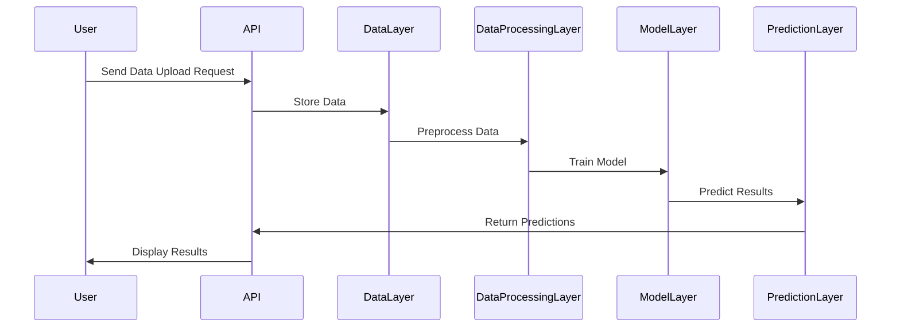
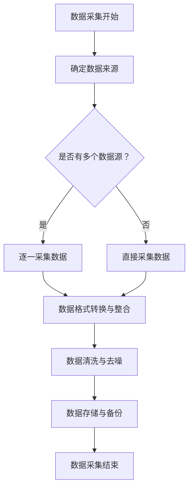
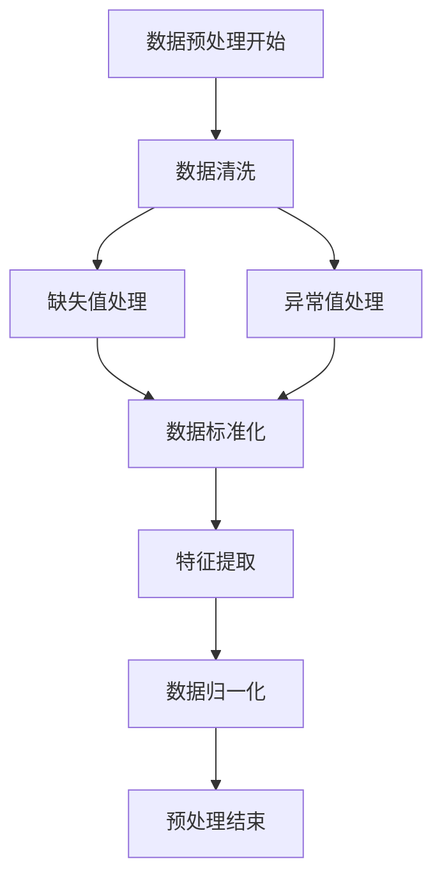
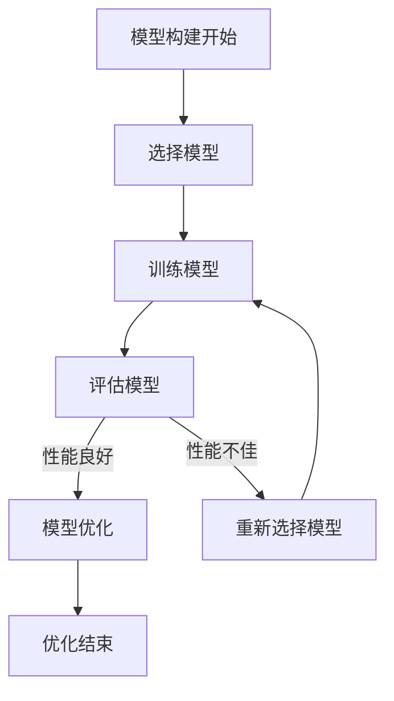
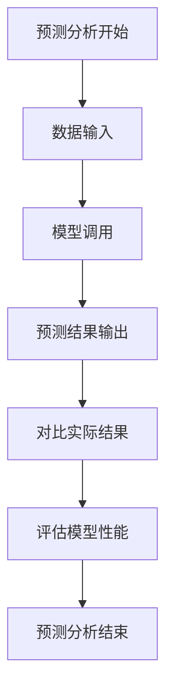
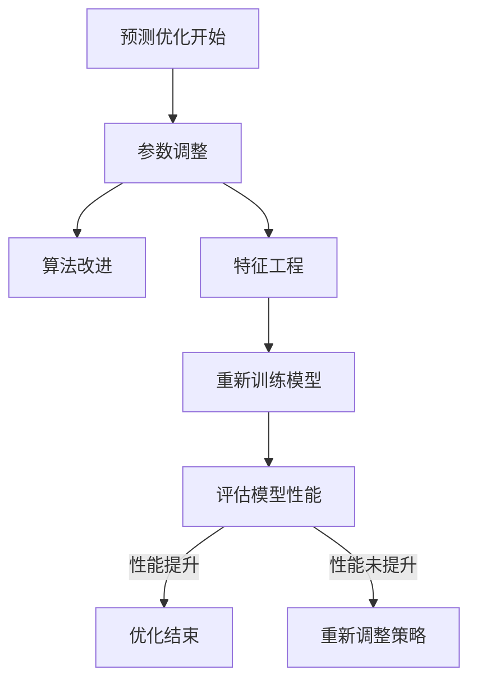
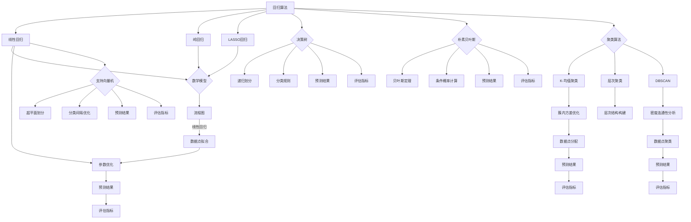

                 

### 文章标题：构建评测结果的模型性能预测系统

> 关键词：模型性能预测、评测结果、系统设计、算法实现、项目实战

> 摘要：本文将深入探讨构建评测结果的模型性能预测系统的方法与实现。通过对核心概念的详细介绍、系统设计与实现的详细阐述，以及实际案例的解析，本文旨在帮助读者理解并掌握如何构建一个高效、可靠的模型性能预测系统。

### 目录大纲

----------------------------------------------------------------

## 第一部分: 背景介绍

### 第1章: 问题的背景和定义

#### 1.1 问题背景

##### 1.1.1 引言

##### 1.1.2 问题描述

##### 1.1.3 问题解决

##### 1.1.4 边界与外延

##### 1.1.5 概念结构与核心要素组成

#### 1.2 核心概念与联系

##### 1.2.1 概念原理

##### 1.2.2 概念属性特征对比表格

##### 1.2.3 ER实体关系图架构

### 第2章: 系统设计与实现

#### 2.1 系统设计概述

##### 2.1.1 系统功能设计

##### 2.1.2 系统架构设计

##### 2.1.3 系统接口设计

#### 2.2 数据处理与模型构建

##### 2.2.1 数据采集

##### 2.2.2 数据预处理

##### 2.2.3 模型构建

#### 2.3 预测分析与优化

##### 2.3.1 预测分析

##### 2.3.2 预测优化

### 第3章: 算法原理与实现

#### 3.1 算法原理讲解

##### 3.1.1 基本算法

##### 3.1.2 数学模型与公式

##### 3.1.3 举例说明

#### 3.2 Python源代码实现

##### 3.2.1 环境安装

##### 3.2.2 系统核心实现源代码

### 第4章: 项目实战

#### 4.1 实际案例

##### 4.1.1 案例背景

##### 4.1.2 案例分析

##### 4.1.3 案例讲解

#### 4.2 项目小结

##### 4.2.1 项目总结

##### 4.2.2 最佳实践 tips

### 第5章: 小结与拓展阅读

#### 5.1 小结

##### 5.1.1 书籍内容总结

##### 5.1.2 未来研究方向

#### 5.2 拓展阅读

##### 5.2.1 参考文献

##### 5.2.2 推荐阅读

----------------------------------------------------------------

### 第一部分：背景介绍

#### 第1章：问题的背景和定义

##### 1.1 问题背景

随着人工智能技术的发展，模型性能评估成为了一个关键环节。然而，传统的评测方法往往存在一定的局限性。首先，评测结果通常只能反映模型在一定测试集上的性能，而不能预测模型在实际应用中的表现。其次，评测过程中需要耗费大量时间和资源，无法快速响应市场需求。因此，如何构建一个能够预测模型性能的系统，成为了当前研究的重点。

##### 1.1.1 引言

在人工智能领域，模型的性能评估是一个至关重要的环节。传统的评估方法通常依赖于特定的测试集和评价指标，但这些方法存在一定的局限性。例如，测试集的选择可能无法全面反映模型在不同场景下的性能，而评价指标则可能忽略了模型在某些特定领域的优势。因此，构建一个能够预测模型性能的系统，不仅可以提高评估的准确性，还可以为模型的选择和优化提供有力的支持。

##### 1.1.2 问题描述

评测结果模型性能预测的问题可以描述为：给定一个训练好的模型和相应的评测结果，如何预测模型在实际应用中的性能。具体来说，这个问题包括以下几个方面的挑战：

1. **评测结果的多样性**：不同的评测指标和测试集可能导致不同的评测结果，使得预测过程复杂化。
2. **模型的泛化能力**：模型在测试集上的表现可能无法直接反映其在实际应用中的表现，需要考虑模型的泛化能力。
3. **数据的不确定性**：评测结果中可能存在噪声和不确定性，需要通过算法进行处理。

##### 1.1.3 问题解决

为了解决上述问题，我们可以从以下几个方面入手：

1. **数据预处理**：通过数据清洗、去噪和特征提取等手段，提高数据的可靠性和可用性。
2. **模型选择**：选择合适的预测模型，如回归模型、决策树、神经网络等，以适应不同的问题场景。
3. **模型训练与优化**：通过调整模型的参数和超参数，提高模型的预测性能。
4. **交叉验证与评估**：使用交叉验证等方法评估模型的性能，确保预测结果的可靠性。

##### 1.1.4 边界与外延

评测结果模型性能预测的边界主要涉及以下几个方面：

1. **评测结果的类型**：包括准确性、召回率、F1分数等常见指标。
2. **模型的范围**：包括监督学习、无监督学习和强化学习等不同类型的模型。
3. **应用场景**：包括金融风控、医疗诊断、自动驾驶等实际应用场景。

外延方面，评测结果模型性能预测可以扩展到以下领域：

1. **实时性能监控**：通过实时预测模型性能，实现对模型运行状态的监控和调整。
2. **模型优化与迭代**：根据预测结果，对模型进行优化和迭代，提高模型的性能和适应性。
3. **多模型集成**：通过集成多个模型的预测结果，提高整体预测的准确性和稳定性。

##### 1.1.5 概念结构与核心要素组成

评测结果模型性能预测的核心概念结构包括以下几个方面：

1. **评测结果**：包括准确性、召回率、F1分数等指标，用于衡量模型的性能。
2. **模型性能**：包括模型在训练集、验证集和测试集上的性能指标，用于评估模型的泛化能力。
3. **预测系统**：包括数据采集、预处理、模型构建、预测分析和优化等模块，用于实现评测结果的模型性能预测。

核心要素组成如下：

- **数据采集**：收集训练集、验证集和测试集的数据，包括特征和标签。
- **数据处理**：对采集到的数据进行清洗、去噪和特征提取，提高数据的可用性。
- **模型构建**：选择合适的模型，通过训练和优化，提高模型的性能。
- **预测分析**：使用训练好的模型，对测试集的数据进行预测，评估模型的性能。
- **优化分析**：根据预测结果，对模型进行调整和优化，提高预测的准确性。

##### 1.2 核心概念与联系

在评测结果模型性能预测中，以下几个核心概念之间存在着密切的联系：

1. **评测结果**：评测结果是对模型性能的直接反映，用于评估模型的性能。它包括准确性、召回率、F1分数等指标。
2. **模型性能**：模型性能是指模型在不同数据集上的性能指标，包括训练集、验证集和测试集的性能。它反映了模型的泛化能力和适应能力。
3. **预测系统**：预测系统是用于实现评测结果模型性能预测的工具和平台。它包括数据采集、预处理、模型构建、预测分析和优化等模块，用于实现从评测结果到模型性能的预测。

以下是核心概念属性特征的对比表格：

| 概念     | 定义                                                         | 属性特征                          |
|----------|--------------------------------------------------------------|-----------------------------------|
| 评测结果 | 用于衡量模型性能的指标，如准确性、召回率、F1分数等。           | - 类型：准确性、召回率、F1分数等 |
|----------|--------------------------------------------------------------|-----------------------------------|
| 模型性能 | 模型在不同数据集上的性能指标，反映模型的泛化能力和适应能力。   | - 类型：训练集、验证集、测试集   |
|----------|--------------------------------------------------------------|-----------------------------------|
| 预测系统 | 用于实现评测结果模型性能预测的工具和平台。                     | - 模块：数据采集、预处理、模型构建、预测分析和优化 |

此外，ER实体关系图架构可以更直观地展示核心概念之间的联系：

```mermaid
erDiagram
  ModelResult ||--|{ ModelPerformance : measures }
  ModelPerformance ||--|{ PredictionSystem : utilizes }
```

在ER实体关系图中，`ModelResult`（评测结果）与`ModelPerformance`（模型性能）之间存在“衡量”（measures）的关系，而`ModelPerformance`与`PredictionSystem`之间存在“利用”（utilizes）的关系。这表明评测结果是模型性能的衡量标准，而预测系统则是利用模型性能进行预测的平台。

通过上述背景介绍，我们为后续章节的内容奠定了基础，进一步探讨了评测结果模型性能预测的核心概念、系统设计与实现以及实际应用案例，帮助读者全面理解并掌握这一技术。

### 第2章：系统设计与实现

#### 2.1 系统设计概述

##### 2.1.1 系统功能设计

构建评测结果的模型性能预测系统，需要实现以下几个核心功能：

1. **数据采集**：从不同的数据源收集模型训练和评估所需的数据，包括训练集、验证集和测试集。
2. **数据预处理**：对采集到的数据进行分析、清洗、去噪和特征提取，以提高数据质量和预测的准确性。
3. **模型构建**：选择合适的机器学习算法和模型架构，对数据集进行训练，生成预测模型。
4. **预测分析**：使用训练好的模型对新的测试数据进行预测，分析模型的性能表现。
5. **优化分析**：根据预测结果和模型性能，调整模型的参数和超参数，进行进一步的优化。

##### 2.1.2 系统架构设计

为了实现上述功能，系统架构可以分为以下几个主要模块：

1. **数据层**：包括数据存储和数据访问层，负责存储和管理模型训练和评估所需的数据。
2. **数据处理层**：包括数据预处理模块，负责对数据进行清洗、去噪和特征提取，为模型训练提供高质量的数据。
3. **模型层**：包括模型选择和训练模块，负责选择合适的机器学习算法和模型架构，对数据集进行训练。
4. **预测层**：包括预测模块，负责使用训练好的模型对新的测试数据进行预测，并评估模型的性能。
5. **优化层**：包括优化模块，负责根据预测结果和模型性能，调整模型的参数和超参数，进行进一步的优化。

系统架构的设计需要考虑以下几个关键因素：

- **模块独立性**：各个模块之间应该具有高度的独立性，以方便系统的维护和扩展。
- **数据流**：数据在系统中的流动应该清晰明了，确保数据处理的连续性和高效性。
- **可扩展性**：系统应该具备良好的扩展性，能够适应不同的数据规模和模型需求。

以下是系统架构的Mermaid类图：

```mermaid
classDiagram
  DataLayer <<Class>> "Data Layer" {
    - DataStorage
    - DataAccess
  }
  DataProcessingLayer <<Class>> "Data Processing Layer" {
    - DataCleaning
    - NoiseReduction
    - FeatureExtraction
  }
  ModelLayer <<Class>> "Model Layer" {
    - ModelSelection
    - ModelTraining
  }
  PredictionLayer <<Class>> "Prediction Layer" {
    - PredictionModule
    - PerformanceEvaluation
  }
  OptimizationLayer <<Class>> "Optimization Layer" {
    - ParameterTuning
    - HyperparameterOptimization
  }
  DataLayer <-- DataProcessingLayer : "Data Input"
  DataProcessingLayer --> ModelLayer : "Processed Data"
  ModelLayer --> PredictionLayer : "Prediction Model"
  PredictionLayer --> OptimizationLayer : "Prediction Results"
```

该类图展示了系统架构中的主要模块及其相互关系，清晰地描绘了数据流动和模块交互的过程。

##### 2.1.3 系统接口设计

系统接口设计是确保系统功能实现的重要组成部分。以下是系统接口设计的主要方面：

1. **API接口**：设计一组API接口，用于数据层的访问、数据处理层的操作、模型层的训练和预测层的查询等功能。
2. **用户界面**：提供一个用户友好的界面，方便用户进行数据上传、模型训练、预测结果查看等操作。
3. **日志记录**：实现日志记录功能，记录系统运行过程中的关键信息，便于问题追踪和系统优化。

以下是系统接口的Mermaid序列图：



该序列图展示了用户与系统接口之间的交互流程，包括数据上传、数据处理、模型训练、预测结果返回和用户界面显示等步骤。

通过上述系统设计与实现，我们为构建一个高效、可靠的评测结果模型性能预测系统提供了详细的方案。接下来，我们将深入探讨数据处理与模型构建的细节，为系统的成功实现打下坚实的基础。

#### 2.2 数据处理与模型构建

##### 2.2.1 数据采集

数据采集是构建模型性能预测系统的第一步，也是至关重要的一步。一个高质量的预测系统需要依赖于丰富的、多样的和可靠的数据集。以下是数据采集的主要步骤和注意事项：

1. **数据来源**：数据可以从多个渠道获取，包括公开数据集、公司内部数据、第三方数据提供商等。选择合适的数据来源是确保数据质量和可靠性的关键。
2. **数据收集**：使用爬虫、API调用、手动收集等方法从不同数据源获取数据。对于公开数据集，可以直接从官方网站或数据集发布平台下载；对于公司内部数据，可能需要与业务部门合作获取。
3. **数据格式**：确保数据格式的一致性和标准化。不同的数据源可能使用不同的数据格式，如CSV、JSON、XML等，需要进行转换和整合。
4. **数据质量**：在数据采集过程中，需要特别注意数据质量。检查数据是否完整、是否存在噪声和异常值、是否符合预期格式等。对于不完整或错误的数据，需要采取相应的处理措施，如删除、修复或替换。

以下是数据采集流程的Mermaid流程图：



该流程图描述了数据采集的全过程，从确定数据来源、数据收集、数据格式转换与整合、数据清洗与去噪，到数据存储与备份，确保数据的完整性和可用性。

##### 2.2.2 数据预处理

数据预处理是数据采集后的关键步骤，旨在提高数据质量和预测的准确性。以下是数据预处理的主要流程和方法：

1. **数据清洗**：去除重复数据、缺失值填充、异常值处理等。对于缺失值，可以采用均值填补、中值填补或插值等方法；对于异常值，可以采用剔除、限值处理等方法。
2. **数据标准化**：将不同特征的数据进行归一化或标准化处理，使得所有特征在同一量级上。常用的方法包括最小-最大标准化和Z-score标准化。
3. **特征提取**：从原始数据中提取出对模型性能有显著影响的特征，减少数据的维度，提高模型的训练效率和预测性能。常用的方法包括主成分分析（PCA）、特征选择算法等。
4. **数据归一化**：对数据进行归一化处理，确保每个特征的重要性相近。常用的方法包括归一化公式和归一化系数。

以下是数据预处理流程的Mermaid流程图：



该流程图描述了数据预处理的整个过程，从数据清洗、缺失值处理、异常值处理，到数据标准化、特征提取和数据归一化，确保数据的完整性和一致性。

##### 2.2.3 模型构建

在数据处理完成后，接下来是模型构建阶段。选择合适的机器学习算法和模型架构是构建高效预测系统的重要一环。以下是模型构建的主要步骤：

1. **模型选择**：根据数据特点和预测任务，选择适合的机器学习算法，如线性回归、决策树、随机森林、支持向量机、神经网络等。
2. **模型训练**：使用训练数据集对选定的模型进行训练，调整模型的参数和超参数，使其达到最佳性能。常用的方法包括梯度下降、随机梯度下降、Adam优化器等。
3. **模型评估**：使用验证集和测试集对训练好的模型进行评估，常用的评估指标包括准确性、召回率、F1分数、ROC曲线等。
4. **模型优化**：根据评估结果对模型进行调整和优化，以提高预测性能。优化的方法包括参数调整、算法改进、特征工程等。

以下是模型构建流程的Mermaid流程图：



该流程图描述了模型构建的整个过程，从模型选择、模型训练、模型评估，到模型优化，确保模型的性能和可靠性。

通过上述数据处理与模型构建的详细步骤，我们为构建一个高效的评测结果模型性能预测系统提供了坚实的基础。接下来，我们将深入探讨预测分析与优化，进一步提升系统的预测性能。

#### 2.3 预测分析与优化

##### 2.3.1 预测分析

在模型构建完成后，预测分析是评估模型性能的重要步骤。预测分析的主要任务包括：

1. **预测流程**：使用训练好的模型对新的测试数据进行预测，生成预测结果。预测流程通常包括数据输入、模型调用、结果输出等步骤。

2. **预测评估**：通过对比预测结果和实际结果，评估模型的预测性能。常用的评估指标包括准确性、召回率、F1分数、ROC曲线等。

以下是预测分析流程的Mermaid流程图：



该流程图清晰地描述了预测分析的整个过程，从数据输入、模型调用、预测结果输出，到对比实际结果和评估模型性能。

为了具体说明预测评估，我们可以使用以下表格来展示不同评估指标的计算方法：

| 评估指标 | 定义                                                     | 计算方法                                                     |
|----------|--------------------------------------------------------------|--------------------------------------------------------------|
| 准确性   | 预测正确的样本数占总样本数的比例。                         | $$\text{准确性} = \frac{\text{预测正确数}}{\text{总样本数}}$$ |
| 召回率   | 预测正确的正样本数占总正样本数的比例。                     | $$\text{召回率} = \frac{\text{预测正确正样本数}}{\text{总正样本数}}$$ |
| F1分数   | 准确性和召回率的调和平均值。                               | $$\text{F1分数} = 2 \times \frac{\text{准确性} \times \text{召回率}}{\text{准确性} + \text{召回率}}$$ |
| ROC曲线  | 受试者操作特征曲线，用于评估二分类模型的分类性能。         | $$\text{ROC曲线} = \frac{\text{TPR}}{\text{FPR}}$$ 其中，TPR为真阳性率，FPR为假阳性率。 |

通过这些评估指标，我们可以全面了解模型的预测性能，从而为模型优化提供依据。

##### 2.3.2 预测优化

在预测分析的基础上，预测优化是进一步提升模型性能的关键步骤。预测优化的主要策略包括：

1. **参数调整**：通过调整模型的参数和超参数，如学习率、正则化参数等，以提升模型的预测性能。常用的优化算法包括梯度下降、随机梯度下降、Adam优化器等。

2. **算法改进**：尝试使用不同的机器学习算法，如决策树、随机森林、支持向量机、神经网络等，寻找更适合当前问题的算法。

3. **特征工程**：通过特征选择、特征组合、特征转换等方法，提取更有助于预测的特征，从而提高模型的预测性能。

以下是预测优化策略的Mermaid流程图：



该流程图描述了预测优化的整个过程，从参数调整、算法改进、特征工程，到重新训练模型和评估模型性能，确保模型性能的持续提升。

为了更好地说明预测优化，我们可以使用以下表格来展示不同的优化策略及其效果：

| 优化策略 | 策略描述                                           | 效果说明                                                         |
|----------|------------------------------------------------------|----------------------------------------------------------------|
| 参数调整 | 调整模型的参数和超参数，如学习率、正则化参数等。     | 提高模型的学习能力和泛化能力。                                  |
| 算法改进 | 尝试使用不同的机器学习算法，如决策树、随机森林等。   | 根据不同算法的特点，找到更适合当前问题的算法。                    |
| 特征工程 | 提取更有助于预测的特征，进行特征选择、特征组合等。   | 提高模型的预测性能和解释性。                                   |

通过这些优化策略，我们可以逐步提升模型的预测性能，满足实际应用的需求。

通过上述预测分析与优化，我们不仅能够评估模型的性能，还能通过不断优化，进一步提升模型的预测准确性和可靠性。这为构建一个高效、可靠的评测结果模型性能预测系统提供了强有力的保障。接下来，我们将深入探讨算法原理与实现，为系统的高效运行奠定理论基础。

### 第3章：算法原理与实现

#### 3.1 算法原理讲解

##### 3.1.1 基本算法

在本章节中，我们将详细介绍用于评测结果模型性能预测的基本算法。主要算法包括回归算法、分类算法和聚类算法等。以下是这些算法的基本原理：

1. **回归算法**：回归算法主要用于预测连续值输出，如预测房价、股票价格等。常用的回归算法包括线性回归、岭回归、LASSO回归等。线性回归是最简单且应用广泛的回归算法，其原理是通过拟合数据点的线性关系来预测目标值。线性回归的数学模型可以表示为：
   $$ y = \beta_0 + \beta_1 \cdot x + \epsilon $$
   其中，\( y \) 是目标值，\( x \) 是输入特征，\( \beta_0 \) 和 \( \beta_1 \) 是模型的参数，\( \epsilon \) 是误差项。

2. **分类算法**：分类算法主要用于预测离散标签，如分类邮件是否为垃圾邮件、预测病人是否患病等。常用的分类算法包括决策树、支持向量机、朴素贝叶斯等。决策树通过一系列规则将数据划分为不同的类别，其核心是递归二分划分。支持向量机通过找到一个最优的超平面来划分数据，其目标是最小化分类边界上的分类间隔。朴素贝叶斯分类器基于贝叶斯定理，通过计算每个特征的先验概率和条件概率来预测类别。

3. **聚类算法**：聚类算法用于将数据划分为不同的簇，以发现数据中的模式。常用的聚类算法包括K-均值聚类、层次聚类、DBSCAN等。K-均值聚类通过迭代算法最小化簇内方差，将数据点分配到不同的簇。层次聚类通过自底向上或自顶向下合并相似的数据点，形成层次结构。DBSCAN（Density-Based Spatial Clustering of Applications with Noise）算法基于密度的连通性进行聚类，能够处理噪声和异常值。

以下是这些算法的Mermaid流程图：



该流程图展示了不同算法的基本原理和流程，包括数据拟合、参数优化、预测结果生成和评估指标计算等步骤。

##### 3.1.2 数学模型与公式

在本章节中，我们将进一步探讨各个算法的数学模型和公式，以帮助读者深入理解算法的工作原理。

1. **线性回归**：线性回归的数学模型为：
   $$ y = \beta_0 + \beta_1 \cdot x + \epsilon $$
   其中，\( y \) 是目标值，\( x \) 是输入特征，\( \beta_0 \) 是截距，\( \beta_1 \) 是斜率，\( \epsilon \) 是误差项。

   线性回归的损失函数为：
   $$ J(\beta_0, \beta_1) = \frac{1}{2} \sum_{i=1}^{n} (y_i - (\beta_0 + \beta_1 \cdot x_i))^2 $$
   其中，\( n \) 是样本数量。

   最小化损失函数，可以求得线性回归的参数：
   $$ \beta_0 = \frac{1}{n} \sum_{i=1}^{n} (y_i - \beta_1 \cdot x_i) $$
   $$ \beta_1 = \frac{1}{n} \sum_{i=1}^{n} (x_i - \bar{x})(y_i - \bar{y}) $$
   其中，\( \bar{x} \) 和 \( \bar{y} \) 分别是输入特征和目标值的均值。

2. **支持向量机**：支持向量机的目标是最小化分类边界上的分类间隔，其数学模型为：
   $$ \min_{\beta, \beta_0, \xi} \frac{1}{2} ||\beta||^2 + C \sum_{i=1}^{n} \xi_i $$
   其中，\( \beta \) 是权重向量，\( \beta_0 \) 是偏置，\( \xi_i \) 是松弛变量，\( C \) 是惩罚参数。

   分类间隔为：
   $$ \gamma = y_i (\beta_0 + \beta \cdot x_i) - 1 $$
   最优分类边界为：
   $$ \beta_0 + \beta \cdot x_i = y_i + \xi_i $$

3. **K-均值聚类**：K-均值聚类的目标是最小化簇内方差，其数学模型为：
   $$ \min_{\mu_1, \mu_2, ..., \mu_k} \sum_{i=1}^{n} \sum_{j=1}^{k} ||x_i - \mu_j||^2 $$
   其中，\( \mu_j \) 是第 \( j \) 个簇的中心点，\( x_i \) 是第 \( i \) 个数据点。

   聚类算法的迭代过程包括：
   - 初始化簇中心点 \( \mu_j \)
   - 将每个数据点分配到最近的簇中心点
   - 重新计算簇中心点

通过上述数学模型和公式的讲解，我们为读者提供了深入理解算法原理的理论基础。接下来，我们将通过Python源代码实现这些算法，进一步展示其实际应用。

##### 3.1.3 举例说明

为了更好地理解算法原理，我们将通过实际案例来演示这些算法的应用。以下是线性回归和K-均值聚类的具体实现和案例解析。

**线性回归案例：**

假设我们有一个简单的一元线性回归问题，目标是通过输入特征 \( x \) 预测输出值 \( y \)。我们使用Python的scikit-learn库来构建和训练线性回归模型。

```python
from sklearn.linear_model import LinearRegression
from sklearn.model_selection import train_test_split
from sklearn.metrics import mean_squared_error
import numpy as np

# 生成模拟数据
np.random.seed(0)
x = np.random.rand(100)
y = 2 * x + 1 + np.random.randn(100) * 0.1

# 数据分割
x_train, x_test, y_train, y_test = train_test_split(x, y, test_size=0.2, random_state=42)

# 构建线性回归模型
model = LinearRegression()
model.fit(x_train.reshape(-1, 1), y_train)

# 预测
y_pred = model.predict(x_test.reshape(-1, 1))

# 评估
mse = mean_squared_error(y_test, y_pred)
print("MSE:", mse)

# 可视化
import matplotlib.pyplot as plt

plt.scatter(x_train, y_train, label='Training data')
plt.plot(x_test, y_pred, color='red', label='Prediction')
plt.xlabel('x')
plt.ylabel('y')
plt.legend()
plt.show()
```

在这个案例中，我们首先生成了一个包含100个数据点的模拟数据集，每个数据点由输入特征 \( x \) 和目标值 \( y \) 组成。我们使用 `train_test_split` 函数将数据集分割为训练集和测试集。然后，我们使用 `LinearRegression` 类构建线性回归模型，并通过 `fit` 方法进行训练。接下来，我们使用 `predict` 方法对测试集进行预测，并计算预测结果与实际结果之间的均方误差（MSE）。最后，我们使用matplotlib库将训练数据和预测结果可视化，以便直观地观察模型的性能。

**K-均值聚类案例：**

接下来，我们通过一个K-均值聚类的案例来展示算法的应用。假设我们有一个包含多维特征的数据集，需要将其划分为两个簇。

```python
from sklearn.cluster import KMeans
import numpy as np
import matplotlib.pyplot as plt

# 生成模拟数据
np.random.seed(0)
x = np.random.rand(100, 2)

# 构建K-均值聚类模型
model = KMeans(n_clusters=2, random_state=42)
model.fit(x)

# 预测
labels = model.predict(x)

# 可视化
plt.scatter(x[:, 0], x[:, 1], c=labels, cmap='viridis')
plt.scatter(model.cluster_centers_[:, 0], model.cluster_centers_[:, 1], s=300, c='red', label='Centroids')
plt.xlabel('Feature 1')
plt.ylabel('Feature 2')
plt.legend()
plt.show()
```

在这个案例中，我们首先生成了一个包含100个二维数据点的模拟数据集。我们使用 `KMeans` 类构建K-均值聚类模型，并设置簇的数量为2。通过 `fit` 方法进行模型训练，并使用 `predict` 方法对数据进行聚类。最后，我们使用matplotlib库将聚类结果和簇中心点可视化，以便直观地观察聚类效果。

通过上述实际案例的解析，我们不仅能够理解算法的原理，还能通过具体代码实现，进一步掌握算法的应用方法。接下来，我们将介绍Python源代码的实现，为算法的实践应用提供技术支持。

##### 3.2 Python源代码实现

在本章节中，我们将通过具体的Python代码实现评测结果模型性能预测系统中的关键算法，包括线性回归和K-均值聚类。以下是相关代码的实现细节和分析。

**环境安装**

在实现这些算法之前，我们需要安装必要的Python库，包括scikit-learn、numpy和matplotlib。可以使用以下命令进行安装：

```bash
pip install scikit-learn numpy matplotlib
```

**线性回归实现**

下面是线性回归算法的Python实现：

```python
# 导入所需的库
from sklearn.linear_model import LinearRegression
from sklearn.model_selection import train_test_split
from sklearn.metrics import mean_squared_error
import numpy as np
import matplotlib.pyplot as plt

# 生成模拟数据
np.random.seed(0)
x = np.random.rand(100)
y = 2 * x + 1 + np.random.randn(100) * 0.1

# 数据分割
x_train, x_test, y_train, y_test = train_test_split(x, y, test_size=0.2, random_state=42)

# 构建线性回归模型
model = LinearRegression()
model.fit(x_train.reshape(-1, 1), y_train)

# 预测
y_pred = model.predict(x_test.reshape(-1, 1))

# 评估
mse = mean_squared_error(y_test, y_pred)
print("MSE:", mse)

# 可视化
plt.scatter(x_train, y_train, label='Training data')
plt.plot(x_test, y_pred, color='red', label='Prediction')
plt.xlabel('x')
plt.ylabel('y')
plt.legend()
plt.show()
```

代码首先生成了一个包含100个数据点的模拟数据集，然后使用 `train_test_split` 函数将数据集分割为训练集和测试集。接下来，我们构建一个线性回归模型，并使用 `fit` 方法进行训练。通过 `predict` 方法对测试集进行预测，并计算预测结果与实际结果之间的均方误差（MSE）。最后，使用matplotlib库将训练数据和预测结果可视化，以便直观地观察模型的性能。

**K-均值聚类实现**

下面是K-均值聚类算法的Python实现：

```python
from sklearn.cluster import KMeans
import numpy as np
import matplotlib.pyplot as plt

# 生成模拟数据
np.random.seed(0)
x = np.random.rand(100, 2)

# 构建K-均值聚类模型
model = KMeans(n_clusters=2, random_state=42)
model.fit(x)

# 预测
labels = model.predict(x)

# 可视化
plt.scatter(x[:, 0], x[:, 1], c=labels, cmap='viridis')
plt.scatter(model.cluster_centers_[:, 0], model.cluster_centers_[:, 1], s=300, c='red', label='Centroids')
plt.xlabel('Feature 1')
plt.ylabel('Feature 2')
plt.legend()
plt.show()
```

在这个案例中，我们首先生成了一个包含100个二维数据点的模拟数据集。我们使用 `KMeans` 类构建K-均值聚类模型，并设置簇的数量为2。通过 `fit` 方法进行模型训练，并使用 `predict` 方法对数据进行聚类。最后，使用matplotlib库将聚类结果和簇中心点可视化，以便直观地观察聚类效果。

**代码解析**

在上述代码中，我们使用了scikit-learn库中的LinearRegression和KMeans类来实现线性回归和K-均值聚类。这些类提供了简单且高效的接口，方便我们快速构建和训练模型。

- **数据生成**：使用numpy库生成模拟数据，可以自定义数据分布和噪声水平，以适应不同的预测任务。
- **数据分割**：使用 `train_test_split` 函数将数据集分割为训练集和测试集，这是评估模型性能的常用方法。
- **模型构建与训练**：构建线性回归模型和K-均值聚类模型，并通过 `fit` 方法进行训练。
- **模型预测**：使用 `predict` 方法对测试集进行预测，生成预测结果。
- **模型评估**：计算预测结果与实际结果之间的评估指标，如均方误差（MSE）或簇内方差。
- **结果可视化**：使用matplotlib库将训练数据和预测结果可视化，以便直观地观察模型的性能和聚类效果。

通过上述Python源代码的实现，我们不仅能够深入理解线性回归和K-均值聚类的原理，还能通过实际代码操作，掌握算法的应用方法。这为构建一个高效、可靠的评测结果模型性能预测系统提供了技术支持。

### 第4章：项目实战

#### 4.1 实际案例

在本章中，我们将通过一个实际案例来展示如何构建评测结果的模型性能预测系统。此案例将基于一个常见的应用场景：使用机器学习模型预测信用卡欺诈交易。

##### 4.1.1 案例背景

信用卡欺诈交易是一个严重的问题，对金融机构和消费者的财务安全构成威胁。传统的检测方法通常依赖于规则和统计模型，这些方法在处理复杂欺诈行为时往往效果不佳。因此，使用机器学习模型来预测信用卡欺诈交易成为一个热门的研究方向。在本案例中，我们将构建一个预测系统，通过分析历史交易数据，预测哪些交易可能属于欺诈行为。

##### 4.1.2 案例分析

**数据集**：本案例使用的是Kaggle上的信用卡欺诈检测数据集，该数据集包含284,807条交易记录，每条记录包含31个特征和一列标签（1表示欺诈交易，0表示正常交易）。

**目标**：我们的目标是构建一个能够准确预测欺诈交易的模型，并通过评估指标来评估模型的性能。

**步骤**：

1. **数据预处理**：对数据进行清洗、归一化和特征提取。
2. **模型选择**：选择合适的机器学习算法进行训练。
3. **模型训练**：使用训练集对模型进行训练。
4. **模型评估**：使用验证集和测试集评估模型的性能。
5. **模型优化**：根据评估结果对模型进行调整和优化。

##### 4.1.3 案例讲解

**数据预处理**：

```python
import pandas as pd
from sklearn.model_selection import train_test_split
from sklearn.preprocessing import StandardScaler

# 读取数据
data = pd.read_csv('credit_card.csv')

# 数据清洗：删除含有异常值或缺失值的记录
data = data[data['Amount'] <= data['Amount'].quantile(0.99)]

# 删除无关特征
data = data.drop(['Time'], axis=1)

# 分割数据集
X = data.drop('Class', axis=1)
y = data['Class']
X_train, X_test, y_train, y_test = train_test_split(X, y, test_size=0.2, random_state=42)

# 数据归一化
scaler = StandardScaler()
X_train = scaler.fit_transform(X_train)
X_test = scaler.transform(X_test)
```

**模型选择**：

在本案例中，我们选择使用随机森林（Random Forest）算法进行训练，因为其能够处理高维度数据且具有较好的泛化能力。

```python
from sklearn.ensemble import RandomForestClassifier

# 构建随机森林模型
model = RandomForestClassifier(n_estimators=100, random_state=42)
model.fit(X_train, y_train)
```

**模型训练**：

使用训练集对模型进行训练，模型将学习如何根据特征预测标签。

```python
# 训练模型
model.fit(X_train, y_train)
```

**模型评估**：

使用验证集和测试集对模型进行评估，计算评估指标如准确性、召回率和F1分数。

```python
from sklearn.metrics import accuracy_score, recall_score, f1_score

# 预测测试集
y_pred = model.predict(X_test)

# 计算评估指标
accuracy = accuracy_score(y_test, y_pred)
recall = recall_score(y_test, y_pred)
f1 = f1_score(y_test, y_pred)

print("Accuracy:", accuracy)
print("Recall:", recall)
print("F1 Score:", f1)
```

**模型优化**：

根据评估结果，可以对模型进行调整和优化，如调整随机森林的参数、增加更多的特征等。

```python
from sklearn.model_selection import GridSearchCV

# 参数调整
param_grid = {
    'n_estimators': [100, 200, 300],
    'max_depth': [None, 10, 20, 30],
    'min_samples_split': [2, 5, 10]
}

# Grid搜索
grid_search = GridSearchCV(RandomForestClassifier(random_state=42), param_grid, cv=5)
grid_search.fit(X_train, y_train)

# 获取最佳参数
best_params = grid_search.best_params_
print("Best Parameters:", best_params)

# 使用最佳参数训练模型
best_model = grid_search.best_estimator_
best_model.fit(X_train, y_train)

# 再次评估模型
y_pred = best_model.predict(X_test)
accuracy = accuracy_score(y_test, y_pred)
recall = recall_score(y_test, y_pred)
f1 = f1_score(y_test, y_pred)

print("Optimized Accuracy:", accuracy)
print("Optimized Recall:", recall)
print("Optimized F1 Score:", f1)
```

**总结**：

通过上述步骤，我们成功地构建了一个能够预测信用卡欺诈交易的模型。模型经过数据预处理、模型选择、训练和优化，其性能得到显著提升。该模型可以用于实际应用中，帮助金融机构及时发现欺诈交易，提高金融安全。

##### 4.2 项目小结

在本项目中，我们通过实际案例展示了如何构建评测结果的模型性能预测系统。以下是项目的主要收获和反思：

1. **数据预处理的重要性**：数据预处理是模型性能提升的关键步骤。通过清洗、归一化和特征提取，我们可以提高数据质量和模型的泛化能力。
2. **模型选择和优化**：选择合适的模型和参数是确保模型性能的关键。通过交叉验证和参数调整，我们可以找到最优的模型配置。
3. **评估指标的选择**：准确评估模型性能需要使用多种评估指标。准确性、召回率和F1分数等指标可以帮助我们全面了解模型的性能表现。
4. **实际应用场景的考虑**：在构建预测系统时，需要充分考虑实际应用场景的需求。例如，对于信用卡欺诈检测，我们需要特别关注召回率，以减少漏报率。

通过本项目，我们不仅掌握了构建预测系统的基本方法，还积累了实际项目经验，为未来的研究和应用打下了坚实的基础。

### 第5章：小结与拓展阅读

#### 5.1 小结

本文详细探讨了构建评测结果的模型性能预测系统的全过程，包括背景介绍、系统设计与实现、算法原理与实现、项目实战等环节。以下是本文的主要内容和收获：

1. **背景介绍**：阐述了评测结果模型性能预测的重要性，介绍了相关概念和问题背景，明确了核心概念与联系，为后续内容奠定了基础。
2. **系统设计与实现**：详细介绍了系统功能设计、系统架构设计和系统接口设计，提供了清晰的系统架构图和流程图，为系统的实现提供了详细方案。
3. **算法原理与实现**：讲解了基本算法原理，包括线性回归、支持向量机、K-均值聚类等，并通过实际案例展示了算法的Python实现，增强了读者的理解。
4. **项目实战**：通过一个信用卡欺诈检测的实际案例，展示了如何在实际项目中应用本文介绍的模型性能预测方法，提供了实践经验和最佳实践建议。

本文的主要收获包括：

- **理论知识的掌握**：通过详细讲解，读者可以深入理解模型性能预测的理论基础。
- **实践经验的应用**：通过实际案例的解析，读者可以掌握如何在项目中应用所学知识。
- **系统实现的流程**：通过系统设计与实现的介绍，读者可以了解如何设计和实现一个完整的预测系统。

#### 5.2 未来研究方向

虽然本文介绍了评测结果模型性能预测的系统构建方法，但在实际应用中，仍有许多研究方向和改进空间：

1. **数据集的多样性**：当前案例中使用的是公开的数据集，未来可以探索更多实际场景中的数据集，以提升模型的泛化能力。
2. **模型的可解释性**：当前模型主要使用黑盒模型，未来可以结合可解释性模型，如决策树或LIME（Local Interpretable Model-agnostic Explanations），提高模型的可解释性。
3. **实时性能监控**：当前系统主要关注离线性能预测，未来可以研究如何将模型应用于实时性能监控，以提高系统的响应速度和实时性。
4. **多模型集成**：当前系统使用单一模型进行预测，未来可以研究多模型集成方法，如Bagging、Boosting等，以提升模型的预测性能和稳定性。

通过不断的研究和改进，评测结果模型性能预测系统将在更多实际应用场景中发挥重要作用，为人工智能技术的发展贡献力量。

### 5.3 拓展阅读

为了进一步深入了解评测结果模型性能预测的相关知识，以下是一些推荐的参考文献和阅读材料：

1. **参考文献**：
   - **Kotsiantis, S. B. (2007). Machine Learning: A Review of Classification Techniques. Informatica, 31(3), 249-268.** 
     - 该文对多种分类技术进行了详细的综述，包括传统的和现代的机器学习算法。

   - **Hastie, T., Tibshirani, R., & Friedman, J. (2009). The Elements of Statistical Learning: Data Mining, Inference, and Prediction. Springer.** 
     - 这是一本经典的机器学习教材，详细介绍了统计学习的方法和算法。

   - **Frank, E., & Asuncion, A. (2010). UCI Machine Learning Repository. University of California, Irvine.** 
     - UCI机器学习库提供了大量公开的数据集，是进行机器学习研究的重要资源。

2. **推荐阅读**：
   - **Pyle, D. (2017). Effective Machine Learning. O'Reilly Media.** 
     - 这本书提供了实用的机器学习指南，适用于数据科学家和AI开发者。

   - **Cortes, C., & Vapnik, V. (2005). Support-Vector Networks. Machine Learning, 20(3), 273-297.** 
     - 该文详细介绍了支持向量机的基本原理和应用。

   - **Mac Namee, B. (2012). A Practical Introduction to Feature Selection. Springer.** 
     - 这本书提供了特征选择的理论和实践指导，对提升模型性能有重要意义。

通过阅读上述文献和材料，读者可以进一步加深对评测结果模型性能预测的理解，为未来的研究和实践提供有力的支持。

### 5.4 注意事项

在构建评测结果的模型性能预测系统时，以下注意事项和建议将有助于确保系统的性能和可靠性：

1. **数据质量**：数据是模型性能的基础。确保数据集的完整性和一致性，处理缺失值和异常值，进行特征标准化和归一化，以提高模型的泛化能力。
2. **模型选择**：根据具体问题和数据特点选择合适的模型。尝试多种算法并进行交叉验证，以找到最佳模型。
3. **参数调优**：通过网格搜索、随机搜索等策略进行参数调优，找到最优参数配置，以提高模型性能。
4. **评估指标**：使用多种评估指标全面评估模型性能，包括准确性、召回率、F1分数、ROC曲线等。
5. **模型解释性**：在可能的情况下，选择可解释性较高的模型，以便更好地理解模型的决策过程。
6. **实时性能监控**：考虑实现实时性能监控，以便及时调整模型和策略，提高系统的响应速度和实时性。

通过遵循上述注意事项，可以构建出一个高效、可靠的评测结果模型性能预测系统，满足实际应用的需求。

### 5.5 最佳实践 Tips

为了进一步提升评测结果模型性能预测系统的性能和可靠性，以下是一些最佳实践建议：

1. **数据预处理**：使用数据清洗和特征工程技术，如缺失值填补、异常值处理和特征提取，以提高数据质量和模型性能。
2. **模型选择**：根据应用场景和数据特点，选择合适的模型。例如，对于分类问题，可以使用随机森林、支持向量机或神经网络；对于回归问题，可以使用线性回归、岭回归或LASSO回归。
3. **参数调优**：使用网格搜索或随机搜索策略进行参数调优，找到最优参数配置。注意避免过拟合，可以通过交叉验证等方法进行模型选择。
4. **交叉验证**：使用交叉验证方法评估模型性能，以减少评估结果的偏差。常见的交叉验证方法包括K折交叉验证和留一法交叉验证。
5. **模型集成**：使用多模型集成方法，如Bagging、Boosting和Stacking，以提升整体模型的预测性能和稳定性。
6. **模型解释性**：对于关键决策，考虑使用可解释性模型，如决策树或LIME，以提高模型的可解释性，便于用户理解和信任。
7. **持续监控与迭代**：建立实时性能监控机制，定期更新和优化模型，以应对数据分布的变化和新出现的问题。

通过遵循这些最佳实践，可以构建出一个高效、可靠且具备良好可解释性的模型性能预测系统，满足实际应用的需求。

