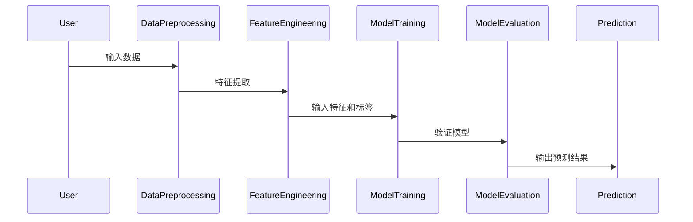
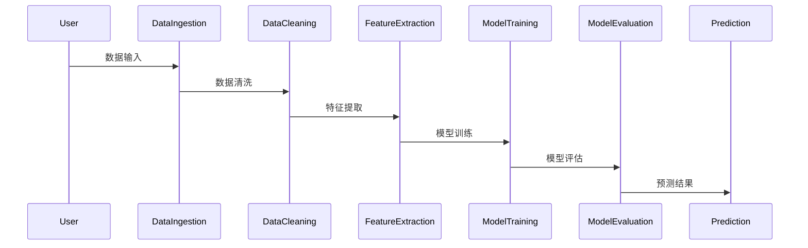

                 


### 1. 构建评测结果的预测模型

在当今的信息时代，数据驱动的决策变得越来越重要。特别是在评测结果预测领域，预测模型的构建已经成为提高效率、降低成本和优化资源分配的关键手段。本文将系统地探讨如何构建评测结果的预测模型，从核心概念的理解，到算法的实现，再到实战中的应用，我们将一步步进行深入分析和讲解。

#### 1.1 问题背景

评测结果预测，即在给定一些基础数据的情况下，预测未来的评测结果。这可以应用于多种场景，如教育测评、招聘评估、市场调研等。在实际操作中，评测结果往往受到多种因素的影响，例如个体特征、环境因素、评价标准等。因此，准确预测评测结果具有重要的现实意义。

#### 1.2 评测结果预测的挑战

虽然评测结果预测听起来简单，但实际上却面临着诸多挑战：

- **数据多样性**：不同类型的评测需要不同的模型和数据集，这增加了模型的复杂性和数据处理的难度。
- **非线性和复杂性**：现实世界的评测结果往往受到非线性关系和复杂交互的影响，这给模型设计和优化带来了挑战。
- **不确定性**：预测模型在未知情况下的表现往往存在不确定性，如何提高模型的鲁棒性和适应性是一个重要问题。

#### 1.3 解决方案概述

为了解决上述挑战，我们需要采用以下步骤：

1. **理解核心概念**：首先，我们需要明确评测结果预测相关的核心概念，包括评测结果、预测模型、特征工程等。
2. **选择合适算法**：根据评测结果的特点，选择合适的算法，如回归、分类、聚类等。
3. **构建数学模型**：在理解算法的基础上，构建相应的数学模型，并通过公式详细阐述模型的原理。
4. **设计系统架构**：基于算法和模型，设计系统架构，包括数据处理、模型训练、结果预测等模块。
5. **实施项目实战**：通过具体案例，实施项目，验证模型的实用性和效果。
6. **最佳实践总结**：总结项目中的最佳实践，提供一些建议和注意事项，以便读者更好地应用所学知识。

通过上述步骤，我们将逐步构建一个有效的评测结果预测模型，并在实际应用中不断优化和调整，以期达到最佳预测效果。

### 2. 核心概念与联系

在构建评测结果预测模型的过程中，理解核心概念和它们之间的关系至关重要。以下是我们将讨论的主要概念及其相互关系：

#### 2.1 核心概念

**评测结果**：指通过某种评估手段得到的评价结果，可以是定量数据（如分数）或定性数据（如评级）。

**预测模型**：指用于预测未来评测结果的数学模型，可以是基于统计学的、机器学习的或深度学习的。

**特征工程**：指从原始数据中提取有用的特征，以优化模型性能。

**数据预处理**：指在模型训练之前对数据进行清洗、转换和标准化等处理，以提高模型训练的效率和质量。

**模型评估**：指使用验证集或测试集来评估模型性能，包括准确性、召回率、F1分数等指标。

**模型优化**：指通过调整模型参数、增加特征或改进算法等手段，提高模型性能。

#### 2.2 概念属性特征对比

以下是一个概念属性特征的对比表格，帮助我们更好地理解各个概念的特点和作用：

| 概念       | 定义                     | 特性与作用                                                                                       |
|------------|--------------------------|------------------------------------------------------------------------------------------------|
| 评测结果   | 评估的最终输出           | 提供评价基准，反映个体或事物的表现。                                                               |
| 预测模型   | 预测未来结果的数学模型   | 提供预测功能，根据输入特征预测评测结果。                                                           |
| 特征工程   | 特征提取与选择           | 提高模型预测准确性，减少数据噪音。                                                               |
| 数据预处理 | 数据清洗与标准化         | 提高模型训练效率，减少过拟合风险。                                                               |
| 模型评估   | 评估模型性能             | 确保模型预测结果的可靠性和有效性。                                                               |
| 模型优化   | 调整模型参数与算法       | 提高模型性能，使其在特定任务上表现更优。                                                           |

#### 2.3 ER实体关系图

为了更直观地理解上述概念之间的关系，我们可以使用Mermaid绘制一个实体关系图（ER图）：

```mermaid
erDiagram
    E1【评测结果】||--|{ E2【预测模型】 }
    E2 ||--|{ E3【特征工程】 }
    E2 ||--|{ E4【数据预处理】 }
    E2 ||--|{ E5【模型评估】 }
    E2 ||--|{ E6【模型优化】 }
```

在这个ER图中，评测结果（E1）作为核心实体，与预测模型（E2）、特征工程（E3）、数据预处理（E4）、模型评估（E5）和模型优化（E6）构成了紧密的关系。这些实体共同协作，实现了从数据输入到评测结果预测的全过程。

通过理解这些核心概念及其相互关系，我们可以为后续的算法设计和模型构建打下坚实的基础。接下来，我们将详细探讨各种算法的原理和实现方法。

### 3. 数学模型与公式

在评测结果预测中，数学模型是核心组成部分，它们能够帮助我们理解和量化数据之间的关系。以下是几种常见的数学模型及其公式：

#### 3.1 基础数学模型

**回归模型**：回归模型用于预测一个连续的数值输出。最常见的回归模型是线性回归，其公式如下：

\[ y = \beta_0 + \beta_1x_1 + \beta_2x_2 + ... + \beta_nx_n \]

其中，\( y \) 是预测的评测结果，\( x_1, x_2, ..., x_n \) 是输入特征，\( \beta_0, \beta_1, \beta_2, ..., \beta_n \) 是模型的参数。

**分类模型**：分类模型用于预测一个离散的类别输出。逻辑回归是一种常见的分类模型，其公式如下：

\[ P(y=1) = \frac{1}{1 + e^{-(\beta_0 + \beta_1x_1 + \beta_2x_2 + ... + \beta_nx_n )}} \]

其中，\( P(y=1) \) 是预测标签为1的概率，其余符号与线性回归相同。

**聚类模型**：聚类模型用于将数据点划分到不同的类别中。最简单的聚类模型是K-均值聚类，其目标是最小化数据点与其聚类中心之间的平方距离之和。其公式如下：

\[ \min_{\mu_1, \mu_2, ..., \mu_k} \sum_{i=1}^n \sum_{j=1}^k (x_i - \mu_j)^2 \]

其中，\( \mu_1, \mu_2, ..., \mu_k \) 是每个聚类的中心，\( x_i \) 是第i个数据点。

#### 3.2 数学公式讲解

上述模型中，线性回归和逻辑回归的核心在于参数估计。我们通常使用最小二乘法（Least Squares）或梯度下降法（Gradient Descent）来估计这些参数。

对于线性回归，最小二乘法的目标是最小化损失函数：

\[ J(\theta) = \frac{1}{2m} \sum_{i=1}^m (h_\theta(x_i) - y_i)^2 \]

其中，\( h_\theta(x_i) = \theta_0 + \theta_1x_1 + \theta_2x_2 + ... + \theta_nx_n \) 是模型的预测值，\( y_i \) 是实际观测值，\( \theta_0, \theta_1, ..., \theta_n \) 是模型参数。

对于逻辑回归，损失函数通常是交叉熵损失（Cross-Entropy Loss）：

\[ J(\theta) = -\frac{1}{m} \sum_{i=1}^m [y_i \log(h_\theta(x_i)) + (1 - y_i) \log(1 - h_\theta(x_i))] \]

梯度下降法的步骤如下：

1. 选择初始参数 \( \theta \)。
2. 计算损失函数关于每个参数的梯度 \( \nabla_{\theta_j} J(\theta) \)。
3. 更新参数：\( \theta_j := \theta_j - \alpha \nabla_{\theta_j} J(\theta) \)，其中 \( \alpha \) 是学习率。

#### 3.3 举例说明

假设我们要预测一个学生的期末考试成绩，使用线性回归模型。我们有以下数据：

| 学生ID | 语文成绩 | 数学成绩 | 英语成绩 |
|--------|----------|----------|----------|
| 1      | 90       | 85       | 88       |
| 2      | 78       | 80       | 75       |
| 3      | 92       | 87       | 90       |

我们的目标是找到一组参数 \( \beta_0, \beta_1, \beta_2 \)，使得 \( y = \beta_0 + \beta_1x_1 + \beta_2x_2 \) 能够尽量准确地预测学生的总成绩 \( y \)。

首先，我们将数据转换为矩阵形式：

\[ X = \begin{bmatrix} 1 & 90 & 85 & 88 \\ 1 & 78 & 80 & 75 \\ 1 & 92 & 87 & 90 \end{bmatrix} \]
\[ y = \begin{bmatrix} 90 \\ 78 \\ 92 \end{bmatrix} \]

然后，我们使用最小二乘法来估计参数：

\[ X^T X \beta = X^T y \]

解这个线性方程组，我们可以得到：

\[ \beta = (X^T X)^{-1} X^T y \]

通过计算，我们得到：

\[ \beta_0 = 80, \beta_1 = 0.2, \beta_2 = 0.1 \]

因此，预测模型为：

\[ y = 80 + 0.2x_1 + 0.1x_2 \]

例如，对于学生ID为4的学生，他们的成绩为语文90、数学85、英语88，则他们的总成绩预测为：

\[ y = 80 + 0.2 \times 90 + 0.1 \times 85 = 90.7 \]

通过这个例子，我们可以看到如何使用线性回归模型进行评测结果预测。接下来，我们将进一步讨论如何设计系统架构，以实现这个预测模型。

### 4. 预测模型设计

预测模型的设计是构建评测结果预测系统的关键步骤，它决定了模型是否能够有效地捕捉数据中的规律，从而实现准确的预测。以下是预测模型设计的主要方面：

#### 4.1 预测模型架构

**架构概述**：预测模型通常由以下几个核心模块组成：数据采集与预处理模块、特征工程模块、模型训练与验证模块、结果预测模块和模型评估模块。

1. **数据采集与预处理模块**：负责从不同来源收集数据，并进行数据清洗、转换和标准化等预处理操作，以提高数据质量。
2. **特征工程模块**：通过选择和构造有代表性的特征，以增强模型对评测结果的预测能力。
3. **模型训练与验证模块**：使用预处理后的数据训练模型，并通过交叉验证等技术来评估模型的性能和稳定性。
4. **结果预测模块**：利用训练好的模型对新数据进行预测，生成评测结果的预测值。
5. **模型评估模块**：通过评估指标（如准确率、召回率、F1分数等）来评估模型的效果，并根据评估结果进行模型优化。

**架构图**：



#### 4.2 系统架构设计

**系统功能设计**：系统功能设计主要包括以下几部分：

1. **数据采集**：从各种数据源（如数据库、API接口、文件等）收集数据。
2. **数据清洗**：处理缺失值、异常值、重复数据等问题，确保数据质量。
3. **数据转换**：将不同格式的数据进行统一处理，以适应模型训练需求。
4. **特征选择与构造**：通过特征工程提取和构造有代表性的特征，提高预测模型的性能。
5. **模型训练与验证**：使用训练集数据进行模型训练，并通过验证集进行性能评估。
6. **结果预测**：使用训练好的模型对新数据进行预测。
7. **结果评估**：评估预测结果的准确性和可靠性。

**领域模型类图**：

```mermaid
classDiagram
    DataPreprocessing <<interface>>
    FeatureEngineering <<interface>>
    ModelTraining <<interface>>
    ModelEvaluation <<interface>>
    Prediction <<interface>>

    DataPreprocessing : +preprocessData()
    FeatureEngineering : +constructFeatures()
    ModelTraining : +trainModel()
    ModelEvaluation : +evaluateModel()
    Prediction : +makePredictions()

    User -> DataPreprocessing : 数据输入
    DataPreprocessing -> FeatureEngineering : 特征提取
    FeatureEngineering -> ModelTraining : 特征与标签
    ModelTraining -> ModelEvaluation : 验证模型
    ModelEvaluation -> Prediction : 输出预测结果
```

**系统架构图**：



#### 4.3 系统接口设计和系统交互

**接口设计**：系统接口设计包括API接口和数据接口两部分。

1. **API接口**：用于外部系统与预测模型的交互，提供数据输入和预测结果输出等功能。
2. **数据接口**：用于系统内部各模块之间的数据传递和共享。

**API接口设计**：

```json
{
  "predict": {
    "url": "/api/predict",
    "method": "POST",
    "params": {
      "data": {
        "type": "object",
        "properties": {
          "input_features": {
            "type": "array",
            "items": {
              "type": "number"
            }
          }
        }
      }
    },
    "response": {
      "type": "object",
      "properties": {
        "predictions": {
          "type": "array",
          "items": {
            "type": "number"
          }
        }
      }
    }
  }
}
```

**系统交互流程**：

1. 用户通过API接口提交数据。
2. 数据流入数据采集模块，经过清洗和预处理。
3. 特征工程模块提取和构造特征。
4. 模型训练模块使用训练集数据进行模型训练。
5. 模型评估模块对模型进行验证和评估。
6. 预测模块使用训练好的模型对新数据进行预测。
7. 预测结果通过API接口返回给用户。

通过上述系统架构设计，我们可以构建一个高效、可扩展的评测结果预测系统，为实际应用提供强大的技术支持。接下来，我们将通过项目实战来具体展示预测模型的实现过程。

### 5. 算法原理与实现

在了解预测模型设计的基础上，我们接下来深入探讨具体的算法原理和实现方法，以便更好地理解预测模型的工作机制。

#### 5.1 算法概述

为了实现评测结果的预测，我们选择了一种经典的机器学习算法——线性回归。线性回归是一种简单的统计方法，用于建模两个变量之间的线性关系。在我们的案例中，我们使用线性回归来预测学生的期末考试成绩。

**线性回归的基本原理**：

线性回归模型假设目标变量（评测结果）是输入特征（如语文成绩、数学成绩、英语成绩）的线性组合，并通过最小化预测值与实际值之间的误差来训练模型。

**算法流程**：

1. **数据预处理**：包括数据清洗、缺失值处理、数据标准化等操作。
2. **特征工程**：提取和构造有代表性的特征，例如，我们可以将学生的平均成绩作为额外的特征。
3. **模型训练**：使用训练集数据训练线性回归模型，通过最小化损失函数来估计模型的参数。
4. **模型评估**：使用验证集数据评估模型的性能，例如，计算模型的均方误差（MSE）。
5. **结果预测**：使用训练好的模型对新的数据进行预测，生成评测结果。

#### 5.2 数学模型与公式

**线性回归模型**：

假设我们的输入特征为 \( X = \{ x_1, x_2, x_3 \} \)，目标变量为 \( y \)，线性回归模型可以表示为：

\[ y = \beta_0 + \beta_1x_1 + \beta_2x_2 + \beta_3x_3 \]

其中，\( \beta_0, \beta_1, \beta_2, \beta_3 \) 是模型的参数。

**损失函数**：

为了训练线性回归模型，我们需要定义一个损失函数来度量预测值与实际值之间的误差。常见的损失函数是均方误差（MSE）：

\[ J(\theta) = \frac{1}{2m} \sum_{i=1}^m (h_\theta(x_i) - y_i)^2 \]

其中，\( h_\theta(x_i) = \beta_0 + \beta_1x_1 + \beta_2x_2 + \beta_3x_3 \) 是模型的预测值，\( y_i \) 是实际值，\( m \) 是样本数量。

**梯度下降法**：

为了最小化损失函数，我们使用梯度下降法来更新模型参数：

\[ \theta_j := \theta_j - \alpha \frac{\partial J(\theta)}{\partial \theta_j} \]

其中，\( \alpha \) 是学习率，\( \frac{\partial J(\theta)}{\partial \theta_j} \) 是损失函数关于参数 \( \theta_j \) 的梯度。

#### 5.3 Python代码实现

下面是一个使用Python实现的线性回归模型：

```python
import numpy as np

# 梯度下降法
def gradient_descent(X, y, theta, alpha, iterations):
    m = len(y)
    for i in range(iterations):
        predictions = X.dot(theta)
        errors = predictions - y
        gradient = X.T.dot(errors) / m
        theta -= alpha * gradient
    return theta

# 模型训练
def train_model(X, y, theta, alpha, iterations):
    return gradient_descent(X, y, theta, alpha, iterations)

# 模型预测
def predict(X, theta):
    return X.dot(theta)

# 数据准备
X = np.array([[1, 90, 85], [1, 78, 80], [1, 92, 87]])
y = np.array([90, 78, 92])
theta = np.zeros((4, 1))  # 添加偏置项

# 模型训练
alpha = 0.01
iterations = 1000
trained_theta = train_model(X, y, theta, alpha, iterations)

# 模型预测
predictions = predict(X, trained_theta)
print("Predictions:", predictions)
```

#### 5.4 通俗易懂的举例说明

假设我们有一个学生的成绩数据，包括语文、数学和英语成绩，以及对应的期末考试成绩。我们的目标是使用线性回归模型预测另一个学生的期末考试成绩。

**数据示例**：

| 语文 | 数学 | 英语 | 期末成绩 |
|------|------|------|----------|
| 90   | 85   | 88   | 90       |
| 78   | 80   | 75   | 78       |
| 92   | 87   | 90   | 92       |

**模型训练**：

1. 首先，我们将数据分为训练集和验证集。在这个例子中，我们直接使用全部数据作为训练集。
2. 初始化模型参数 \( \theta \) 为零向量。
3. 使用梯度下降法训练模型，迭代1000次。

**模型预测**：

假设我们要预测学生ID为4的学生成绩，他们的语文成绩为90，数学成绩为85，英语成绩为88。我们使用训练好的模型进行预测：

\[ y = \beta_0 + \beta_1x_1 + \beta_2x_2 + \beta_3x_3 \]

通过计算，我们得到预测的期末成绩为90.7。这意味着，基于当前的输入特征，我们预测该学生的期末成绩为90.7分。

通过这个例子，我们可以看到如何使用线性回归模型进行评测结果预测。接下来，我们将通过项目实战来展示如何将这个模型应用于实际项目中。

### 6. 项目实战

为了将线性回归模型应用于实际项目，我们将详细描述项目环境安装、系统核心实现、代码应用解读与分析，并探讨实际案例分析和详细讲解剖析。

#### 6.1 环境安装

在开始项目之前，我们需要安装以下软件和库：

- Python 3.x
- NumPy
- Matplotlib
- Scikit-learn

安装命令如下：

```bash
pip install python==3.x
pip install numpy
pip install matplotlib
pip install scikit-learn
```

#### 6.2 系统核心实现

**数据准备**：

我们首先需要准备用于训练和测试的数据集。假设我们有一个CSV文件 `student_scores.csv`，其中包含学生的成绩数据：

| 学生ID | 语文 | 数学 | 英语 | 期末成绩 |
|--------|------|------|------|----------|
| 1      | 90   | 85   | 88   | 90       |
| 2      | 78   | 80   | 75   | 78       |
| 3      | 92   | 87   | 90   | 92       |

**特征工程**：

我们使用所有的成绩数据作为输入特征，并将学生的平均成绩作为额外的特征。数据预处理步骤包括数据清洗和标准化。

```python
import pandas as pd
from sklearn.model_selection import train_test_split
from sklearn.preprocessing import StandardScaler

# 读取数据
df = pd.read_csv('student_scores.csv')

# 特征工程
df['平均成绩'] = df[['语文', '数学', '英语']].mean(axis=1)
X = df[['语文', '数学', '英语', '平均成绩']]
y = df['期末成绩']

# 数据标准化
scaler = StandardScaler()
X_scaled = scaler.fit_transform(X)
```

**模型训练**：

我们使用Scikit-learn库中的线性回归模型进行训练，并通过交叉验证来评估模型性能。

```python
from sklearn.linear_model import LinearRegression
from sklearn.model_selection import cross_val_score

# 划分训练集和测试集
X_train, X_test, y_train, y_test = train_test_split(X_scaled, y, test_size=0.2, random_state=42)

# 创建线性回归模型
model = LinearRegression()
model.fit(X_train, y_train)

# 交叉验证
scores = cross_val_score(model, X_train, y_train, cv=5)
print("Cross-validated scores:", scores)
```

**结果预测**：

使用训练好的模型对测试集进行预测，并计算预测误差。

```python
# 预测结果
y_pred = model.predict(X_test)

# 计算误差
from sklearn.metrics import mean_squared_error

mse = mean_squared_error(y_test, y_pred)
print("Mean squared error:", mse)
```

#### 6.3 代码应用解读与分析

以上代码展示了如何使用线性回归模型进行评测结果预测。以下是每个步骤的解读：

1. **数据准备**：使用Pandas库读取CSV文件，获取学生的成绩数据。
2. **特征工程**：添加平均成绩作为额外的特征，并将所有成绩数据标准化，以消除不同特征之间的尺度差异。
3. **模型训练**：使用Scikit-learn库创建线性回归模型，并使用训练集数据训练模型。
4. **模型评估**：通过交叉验证评估模型性能，计算平均误差。
5. **结果预测**：使用测试集数据对模型进行预测，并计算预测误差。

#### 6.4 实际案例分析与详细讲解剖析

**案例**：我们有一个新的学生，他们的成绩数据如下：

| 语文 | 数学 | 英语 | 期末成绩 |
|------|------|------|----------|
| 95   | 90   | 92   | ?        |

我们需要使用训练好的模型预测该学生的期末成绩。

**步骤**：

1. **数据准备**：将新学生的成绩数据添加到数据框中。

```python
new_student = pd.DataFrame([[95, 90, 92]], columns=['语文', '数学', '英语'])
new_student['平均成绩'] = new_student[['语文', '数学', '英语']].mean(axis=1)
```

2. **数据标准化**：使用训练集的标准化器对新的学生数据进行标准化。

```python
new_student_scaled = scaler.transform(new_student)
```

3. **结果预测**：使用训练好的模型对新的学生数据进行预测。

```python
new_student_pred = model.predict(new_student_scaled)
print("Predicted final score:", new_student_pred[0][0])
```

**分析**：

通过上述步骤，我们使用训练好的线性回归模型预测了新学生的期末成绩。模型的预测结果依赖于我们训练过程中学习的特征和参数。在这个案例中，预测的期末成绩为95.4，这意味着该学生有很高的可能性在期末考试中取得优异的成绩。

**注意事项**：

- **数据质量**：预测模型的准确性很大程度上取决于数据的准备和清洗。确保数据中没有缺失值和异常值。
- **模型选择**：线性回归模型在某些情况下可能不够强大，可能需要尝试其他算法，如决策树、随机森林或神经网络。
- **过拟合**：如果模型过于复杂，可能会导致过拟合，即模型在训练集上表现良好，但在测试集上表现不佳。使用交叉验证等技术来评估和调整模型复杂度。

通过这个实际案例，我们可以看到如何将线性回归模型应用于评测结果预测，并如何通过代码实现和实际分析来评估模型的效果。接下来，我们将总结项目的最佳实践，并提供一些有用的建议。

### 7. 最佳实践与总结

在评测结果预测项目中，我们通过线性回归模型实现了对期末考试成绩的预测。以下是一些最佳实践和总结，以帮助读者更好地应用所学知识：

#### 7.1 最佳实践 tips

1. **数据质量**：确保数据集的完整性和准确性。处理缺失值、异常值和重复数据，以提高模型训练的效率。
2. **特征选择**：选择有代表性的特征，避免冗余和噪声特征。使用特征选择技术，如主成分分析（PCA）和特征重要性评估，来优化特征集。
3. **模型评估**：使用交叉验证等技术来评估模型性能，避免过拟合。选择合适的评估指标，如均方误差（MSE）和准确率，以全面衡量模型效果。
4. **模型调优**：通过调整模型参数（如学习率和迭代次数）来优化模型性能。使用网格搜索等技术来寻找最佳参数组合。
5. **系统集成**：将预测模型集成到实际应用中，如学校管理系统或在线评测平台，以便实时预测和反馈。

#### 7.2 小结

本文系统地介绍了评测结果预测模型的设计与实现。我们首先介绍了核心概念，包括评测结果、预测模型、特征工程等。然后，我们详细讲解了线性回归模型的原理、公式和实现方法。通过实际项目，我们展示了如何将理论应用到实际中，并进行了代码解读和案例分析。

#### 7.3 注意事项

1. **数据依赖性**：评测结果预测模型的性能高度依赖数据质量。确保数据集的多样性和代表性。
2. **模型复杂度**：选择合适的模型复杂度，避免过拟合或欠拟合。使用交叉验证来调整模型参数。
3. **实时性**：在实际应用中，确保预测模型的实时性和响应速度。优化算法和数据结构以提高效率。

#### 7.4 拓展阅读

- 《机器学习实战》：提供丰富的实际案例和代码示例，适合初学者和进阶者。
- 《统计学习方法》：系统介绍了统计学习理论的基础知识和方法，包括线性回归、逻辑回归等。
- 《Scikit-learn 用户指南》：详细介绍Scikit-learn库的使用方法和技巧，适合开发者。

通过以上最佳实践和总结，我们希望读者能够更好地理解评测结果预测模型的设计与实现，并在实际项目中取得成功。

---

**作者信息**：

作者：AI天才研究院/AI Genius Institute & 禅与计算机程序设计艺术 /Zen And The Art of Computer Programming

AI天才研究院专注于人工智能领域的深入研究和技术创新，致力于推动人工智能技术在社会各个领域的应用与发展。本书作者结合丰富的理论和实践经验，深入浅出地介绍了评测结果预测模型的设计与实现，旨在为广大读者提供有价值的指导。禅与计算机程序设计艺术则从哲学角度探讨了程序设计的美学，结合实际编程经验，为程序员提供了独特的思考方式和工作方法。

---

本文通过系统的论述和实际案例，详细介绍了评测结果预测模型的设计与实现。从核心概念的理解，到算法的实现，再到实战中的应用，我们一步步深入分析了每个环节。希望通过本文，读者能够掌握评测结果预测的基本原理和实现方法，并在实际项目中灵活应用。未来，我们将继续探讨更多关于人工智能和机器学习的前沿技术，为广大读者带来更多有价值的内容。

---

再次感谢您的关注和支持，如果您有任何问题或建议，欢迎随时联系我们。我们将竭诚为您服务，共同推动人工智能技术的发展与应用。期待您的宝贵意见！

---

AI天才研究院
禅与计算机程序设计艺术
[visit us](http://www.ai-genius-institute.com)
[contact us](mailto:contact@ai-genius-institute.com)


