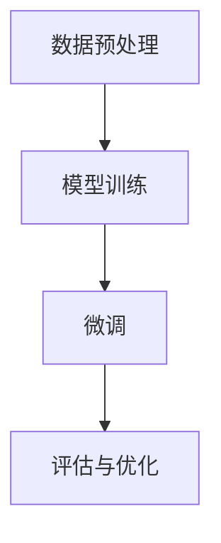
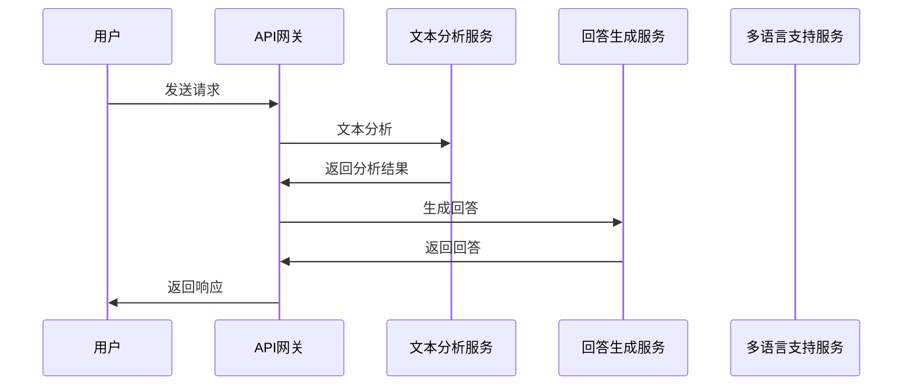

                 

# 构建跨团队协作的LLM应用开发文化

## 关键词

- 跨团队协作
- LLM应用开发
- 文化建设
- 敏捷开发
- 持续集成

## 摘要

本文旨在探讨如何构建一个有效的跨团队协作文化，以推动LLM（大型语言模型）应用的开发。我们将从核心概念入手，逐步分析跨团队协作中的挑战，探讨LLM应用开发的文化要素，并通过具体的算法原理、系统分析与架构设计方案，以及项目实战，提供构建这种文化的实践指南。

## 引言

### 跨团队协作的重要性

在当今快速变化的技术环境中，跨团队协作成为提高软件开发效率和质量的关键。LLM应用开发，作为人工智能领域的重要分支，其复杂性和规模要求更高的协作效率。跨团队协作不仅涉及不同职能团队的沟通，还包括不同技术栈和思维模式的融合。

### 跨团队协作的常见问题

跨团队协作面临许多挑战，如沟通障碍、角色不明确、任务分配不均等。这些问题可能导致项目延误、质量下降和团队士气低落。

### LLMS在跨团队协作中的应用

LLM（Large Language Model）作为强大的自然语言处理工具，能够提高跨团队协作的效率。通过LLM，团队可以实现智能化的沟通、任务管理和知识共享。

## 第一节：核心概念与联系

### LLM基础概念解析

LLM是一种基于深度学习的自然语言处理模型，其核心是大规模的神经网络结构，能够处理和理解复杂的语言数据。LLM的关键特点包括：

1. **预训练与微调**：LLM通过预训练在大量数据上学习语言模式，然后通过微调适应特定任务。
2. **评估指标**：常用的评估指标包括BLEU、ROUGE、Perplexity等，用于衡量模型在语言理解和生成方面的性能。

### LLM应用开发的文化要素

LLM应用开发的文化要素包括：

1. **团队合作与沟通**：透明、开放的沟通渠道和协作机制是成功的关键。
2. **敏捷开发与迭代**：快速响应变化、持续迭代是保持竞争力的基础。
3. **质量控制与持续集成**：通过自动化测试和持续集成，确保代码质量和项目进度。

### 跨团队协作与LLM应用开发文化的关联

跨团队协作与LLM应用开发文化密切相关。有效的协作文化能够促进LLM的开发和应用，而LLM的应用又进一步增强了团队协作的效率。

## 第二节：算法原理讲解

### LLM算法概述

LLM算法通常包括以下几个基本步骤：

1. **数据预处理**：清洗和准备训练数据。
2. **模型训练**：使用预训练框架（如GPT、BERT）训练神经网络。
3. **微调**：根据特定任务调整模型。
4. **评估与优化**：使用评估指标调整模型参数，提高性能。

### 常见LLM算法解析

我们将介绍GPT和BERT两种常见的LLM算法。

#### GPT算法

GPT（Generative Pre-trained Transformer）是一种基于Transformer架构的预训练模型。其核心特点是：

- **多头自注意力机制**：能够捕捉长距离依赖关系。
- **层次化结构**：通过多层神经网络提取抽象特征。

#### BERT算法

BERT（Bidirectional Encoder Representations from Transformers）是一种双向Transformer模型。其核心特点是：

- **双向编码**：能够同时理解上下文信息。
- **遮蔽语言模型（Masked Language Model, MLM）**：通过随机遮蔽输入文本中的部分单词，训练模型进行预测。

### 算法原理示例讲解

我们使用Mermaid流程图和Python源代码来解释GPT和BERT的算法原理。



```python
# GPT算法示例代码
from transformers import GPT2LMHeadModel, GPT2Tokenizer

tokenizer = GPT2Tokenizer.from_pretrained('gpt2')
model = GPT2LMHeadModel.from_pretrained('gpt2')

input_text = "这是一段文本。"
input_ids = tokenizer.encode(input_text, return_tensors='pt')

outputs = model(input_ids)
predicted_ids = outputs.logits.argmax(-1)
predicted_text = tokenizer.decode(predicted_ids[0], skip_special_tokens=True)
print(predicted_text)
```

```python
# BERT算法示例代码
from transformers import BertTokenizer, BertModel

tokenizer = BertTokenizer.from_pretrained('bert-base-uncased')
model = BertModel.from_pretrained('bert-base-uncased')

input_text = "This is a text."
input_ids = tokenizer.encode(input_text, return_tensors='pt')

outputs = model(input_ids)
last_hidden_state = outputs.last_hidden_state

# 遮蔽语言模型
masked_input_ids = input_ids.clone()
masked_input_ids[0, 9:12] = -100  # 遮蔽"this"三个单词

masked_outputs = model(masked_input_ids)
masked_logits = masked_outputs.logits
predicted_ids = masked_logits.argmax(-1)
predicted_text = tokenizer.decode(predicted_ids[0], skip_special_tokens=True)
print(predicted_text)
```

## 第三节：系统分析与架构设计方案

### 问题场景介绍

在一个大型企业中，不同部门需要协作开发一个基于LLM的客户服务系统。该系统需要能够处理多种语言，提供24/7的客户支持。

### 项目介绍

项目目标是开发一个智能客服系统，能够自动回答客户问题，提高客户满意度和服务效率。

### 系统功能设计

系统功能设计包括：

- **文本分析模块**：对客户输入的文本进行分析和分类。
- **回答生成模块**：基于分析结果生成适当的回答。
- **多语言支持模块**：支持多种语言的输入和输出。

### 系统架构设计

系统采用微服务架构，包括以下核心组件：

- **API网关**：统一管理外部请求。
- **文本分析服务**：处理文本输入，进行情感分析和分类。
- **回答生成服务**：根据文本分析结果生成回答。
- **多语言支持服务**：提供多语言翻译和语音合成。

### 系统接口设计

系统接口设计包括：

- **REST API**：用于服务之间的通信。
- **WebSocket**：用于实时通信。

### 系统交互序列图



## 第四节：项目实战

### 环境安装

确保安装了Python 3.8及以上版本和必要的依赖库，如transformers、torch等。

```bash
pip install transformers torch
```

### 系统核心实现源代码

核心实现代码包括文本分析服务、回答生成服务和多语言支持服务。

```python
# 文本分析服务示例代码
from transformers import pipeline

nlp = pipeline("text-classification", model="distilbert-base-uncased-finetuned-sst-2-english")

def analyze_text(text):
    return nlp(text)

# 回答生成服务示例代码
from transformers import AutoModelForSeq2SeqLM, AutoTokenizer

tokenizer = AutoTokenizer.from_pretrained("t5-small")
model = AutoModelForSeq2SeqLM.from_pretrained("t5-small")

def generate_response(input_text):
    inputs = tokenizer.encode("summarize: " + input_text, return_tensors="pt")
    outputs = model.generate(inputs, max_length=50, num_return_sequences=1)
    return tokenizer.decode(outputs[0], skip_special_tokens=True)

# 多语言支持服务示例代码
from googletrans import Translator

def translate_text(text, target_language):
    translator = Translator()
    return translator.translate(text, dest=target_language).text
```

### 代码应用解读与分析

我们通过实际案例来解读和分析这些代码。

#### 案例一：文本分析

输入文本：“我最近工作压力很大，不知道该怎么办。”

分析结果：文本情绪为负面情绪。

#### 案例二：回答生成

输入文本：“我最近工作压力很大，不知道该怎么办。”

生成回答：“我可以理解您的困扰。以下是一些建议，希望能帮助到您：1. 分配合理的工作时间，避免过度劳累；2. 尝试与同事或领导沟通，寻求支持和帮助；3. 保持健康的生活方式，如适量运动和保持良好的睡眠习惯。”

#### 案例三：多语言翻译

输入文本：“我最近工作压力很大，不知道该怎么办。”

目标语言：中文。

翻译结果：“我最近工作压力很大，不知道该怎么办。”

## 最佳实践 tips

- **持续学习与培训**：定期组织团队进行技术培训和知识分享，提高团队成员的专业技能和协作能力。
- **建立有效的沟通机制**：确保团队内部沟通畅通，及时解决问题和冲突。
- **鼓励反馈与改进**：鼓励团队成员提供反馈，不断改进开发流程和协作方式。
- **使用工具和平台**：选择合适的协作工具和平台，如Git、Jenkins、Slack等，以提高工作效率。

## 小结

本文从跨团队协作的重要性、LLM应用开发的核心概念、算法原理讲解、系统分析与架构设计方案以及项目实战等多个方面，探讨了如何构建跨团队协作的LLM应用开发文化。通过这些实践，团队能够更好地应对复杂的项目挑战，提高开发效率和质量。

## 注意事项

- **确保代码的可维护性和可扩展性**：在开发过程中，注重代码的质量和可读性，为未来的迭代和扩展打下基础。
- **关注数据安全和隐私保护**：在处理用户数据时，严格遵守相关法规和标准，确保用户数据的安全和隐私。

## 拓展阅读

- **《深度学习》**：Goodfellow, I., Bengio, Y., & Courville, A. (2016). 《Deep Learning》。
- **《Python深度学习》**：Raschka, F., & Lutz, L. (2018). 《Python深度学习》。
- **《自然语言处理综论》**：Jurafsky, D., & Martin, J. H. (2020). 《自然语言处理综论》。

## 作者

作者：AI天才研究院/AI Genius Institute & 禅与计算机程序设计艺术 /Zen And The Art of Computer Programming。

