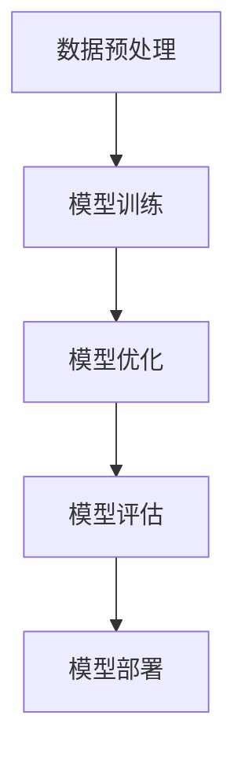
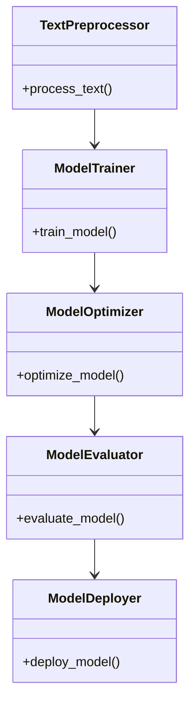
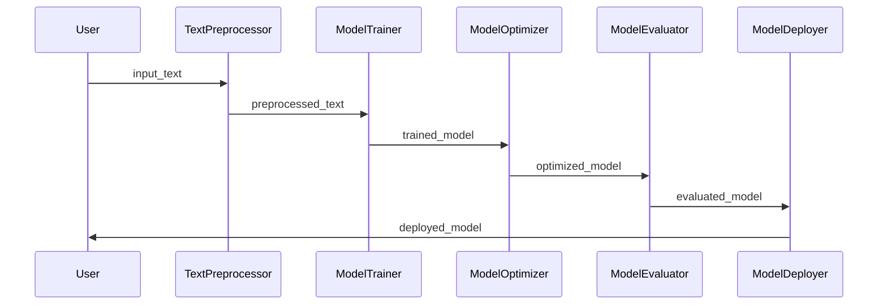
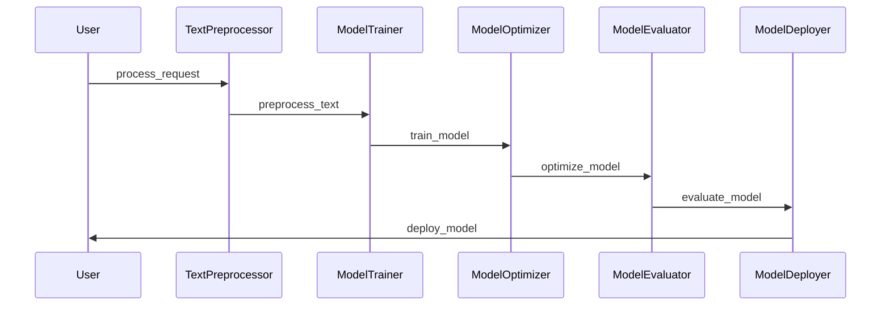

                 

### 第1步：文章标题、关键词与摘要

**文章标题：构建高可用的LLM应用系统**

**关键词：大规模语言模型、高可用性、系统架构、数据处理、算法优化**

**摘要：本文将深入探讨如何构建高可用的LLM（大规模语言模型）应用系统。我们将从背景介绍、核心概念与联系、算法原理讲解、系统分析与架构设计方案、项目实战、最佳实践 tips等方面，系统性地分析和阐述构建高可用LLM应用系统的全过程，帮助读者全面了解并掌握相关技术和方法。**

### 第2步：背景介绍

#### 1.1.1 问题背景

随着互联网技术的飞速发展和大数据时代的来临，人工智能（AI）技术的应用越来越广泛。尤其是大规模语言模型（LLM）的出现，使得自然语言处理（NLP）领域取得了重大突破。然而，在实际应用中，构建高可用的LLM应用系统面临着诸多挑战。

#### 1.1.2 问题描述

本章节将探讨如何构建高可用的LLM应用系统，以确保系统在复杂、多变的应用环境中稳定运行。我们将从以下几个方面展开讨论：

1. **系统需求分析**：了解用户需求，明确系统需要实现的功能和性能指标。
2. **架构设计**：设计合理、可靠的系统架构，以提高系统的可扩展性和稳定性。
3. **数据处理**：如何高效、准确地处理大规模语言数据，为LLM训练提供高质量的数据支持。
4. **算法优化**：针对LLM算法进行优化，提高模型在处理复杂任务时的效率和准确性。
5. **系统部署与运维**：确保系统在实际运行中稳定可靠，提高系统的可维护性和可扩展性。

#### 1.1.3 问题解决

构建高可用的LLM应用系统需要综合运用多种技术手段和方法，包括但不限于：

1. **分布式计算**：利用分布式计算框架，如Apache Spark，处理大规模语言数据。
2. **容器化与微服务架构**：采用Docker、Kubernetes等技术，实现系统的容器化部署和微服务化设计。
3. **模型压缩与量化**：通过模型压缩和量化技术，降低模型复杂度，提高模型在资源受限环境中的运行效率。
4. **实时监控与日志分析**：利用实时监控和日志分析工具，及时发现并解决系统故障。
5. **持续集成与持续部署（CI/CD）**：通过CI/CD流程，实现系统的高效开发和快速迭代。

#### 1.1.4 边界与外延

本文讨论的构建高可用的LLM应用系统主要关注以下边界和范围：

1. **系统层面**：系统性能、稳定性、可扩展性、可维护性等方面。
2. **技术层面**：分布式计算、容器化、模型压缩、实时监控、CI/CD等方面。
3. **应用场景**：主要涉及自然语言处理、智能问答、机器翻译、文本生成等领域。

#### 1.1.5 概念结构与核心要素组成

构建高可用的LLM应用系统的核心概念和要素主要包括：

1. **系统需求分析**：明确用户需求，为后续系统设计提供基础。
2. **架构设计**：系统架构设计，包括分布式计算、容器化、微服务等方面。
3. **数据处理**：大规模语言数据处理，包括数据采集、预处理、存储等方面。
4. **算法优化**：LLM算法优化，包括模型压缩、量化等方面。
5. **系统部署与运维**：系统部署、运维、监控等方面。
6. **持续集成与部署**：实现系统的高效开发和快速迭代。

### 第3步：核心概念与联系

#### 2.1.1 大规模语言模型（LLM）原理

大规模语言模型（LLM）是一种基于深度学习技术的自然语言处理模型，通过学习海量语言数据，能够自动生成、理解、处理和生成自然语言。LLM的核心原理包括：

1. **词向量表示**：将单词映射为高维向量表示，以便在计算中处理。

$$
\text{word\_vector}(w) = \text{embedding}(w) = \sum_{i=1}^{N} \alpha_i \cdot \text{vector}_i
$$

其中，\( w \)表示单词，\( \text{embedding}(w) \)表示单词的嵌入向量，\( \alpha_i \)表示权重，\( \text{vector}_i \)表示基向量。

2. **神经网络结构**：使用多层神经网络对语言数据进行建模，包括输入层、隐藏层和输出层。

$$
\text{output} = \text{激活函数}(\text{权重} \cdot \text{输入} + \text{偏置})
$$

其中，激活函数常用的有ReLU、Sigmoid、Tanh等。

3. **损失函数与优化算法**：通过最小化损失函数，优化模型参数，提高模型性能。常用的损失函数有交叉熵（Cross-Entropy）和均方误差（Mean Squared Error）。

$$
\text{损失函数} = -\frac{1}{N} \sum_{i=1}^{N} y_i \cdot \log(p_i)
$$

其中，\( y_i \)表示真实标签，\( p_i \)表示预测概率。

常用的优化算法有梯度下降（Gradient Descent）、随机梯度下降（Stochastic Gradient Descent）和Adam等。

#### 2.1.2 大规模语言模型（LLM）属性特征对比表格

| 特性               | 大规模语言模型（LLM） | 传统自然语言处理模型 |
|--------------------|----------------------|----------------------|
| 学习能力           | 强                   | 较弱                 |
| 预测准确性         | 高                   | 低                   |
| 数据依赖性         | 强                   | 弱                   |
| 复杂性             | 高                   | 低                   |
| 可扩展性           | 高                   | 低                   |

#### 2.1.3 大规模语言模型（LLM）与相关技术的联系

1. **深度学习**：大规模语言模型（LLM）是深度学习技术在自然语言处理领域的应用。深度学习通过多层神经网络学习数据特征，从而实现模型的自适应优化。

2. **自然语言处理（NLP）**：大规模语言模型（LLM）是自然语言处理（NLP）的重要技术之一。NLP包括文本预处理、词性标注、句法分析、语义理解等多个方面，LLM在这些方面均有显著的应用。

3. **数据挖掘与机器学习**：大规模语言模型（LLM）在训练过程中需要大量的语言数据进行训练，这涉及到数据挖掘与机器学习技术。数据挖掘用于数据采集和预处理，机器学习用于模型训练和优化。

### 第4步：算法原理讲解

#### 2.2.1 算法原理

大规模语言模型（LLM）的核心算法是基于深度学习的，主要包括以下几个步骤：

1. **数据预处理**：首先，对大规模文本数据进行预处理，包括分词、去停用词、词向量嵌入等。

2. **模型训练**：使用预处理后的文本数据训练深度学习模型。常用的模型有循环神经网络（RNN）、长短时记忆网络（LSTM）、门控循环单元（GRU）和变换器（Transformer）等。

3. **模型优化**：通过优化算法，如梯度下降（Gradient Descent）、随机梯度下降（Stochastic Gradient Descent）和Adam等，调整模型参数，降低损失函数。

4. **模型评估**：使用验证集对训练好的模型进行评估，评估指标包括准确率、召回率、F1值等。

5. **模型部署**：将训练好的模型部署到实际应用场景，如自然语言生成、文本分类、机器翻译等。

#### 2.2.2 Mermaid流程图



#### 2.2.3 Python源代码

```python
import numpy as np
import tensorflow as tf

# 数据预处理
def preprocess_data(text):
    # 分词、去停用词、词向量嵌入等操作
    pass

# 模型训练
def train_model(data, labels):
    # 定义模型结构、损失函数、优化器等
    model = tf.keras.Sequential([
        tf.keras.layers.Embedding(input_dim=10000, output_dim=32),
        tf.keras.layers.LSTM(64),
        tf.keras.layers.Dense(1, activation='sigmoid')
    ])

    model.compile(optimizer='adam', loss='binary_crossentropy', metrics=['accuracy'])

    model.fit(data, labels, epochs=10, batch_size=32)

# 模型评估
def evaluate_model(model, test_data, test_labels):
    # 计算准确率、召回率、F1值等指标
    pass

# 模型部署
def deploy_model(model):
    # 部署到实际应用场景
    pass
```

#### 2.2.4 算法原理详细讲解

1. **数据预处理**：数据预处理是大规模语言模型训练的重要环节。首先，对文本数据进行分词，将文本分解为单词或字符。然后，去除停用词，如“的”、“了”等对模型训练贡献较小的词汇。最后，将分词后的文本转换为词向量表示，便于模型处理。

2. **模型训练**：在模型训练阶段，使用预处理后的文本数据进行训练。模型结构通常包括嵌入层、隐藏层和输出层。嵌入层将单词映射为高维向量表示，隐藏层使用循环神经网络（RNN）、长短时记忆网络（LSTM）或门控循环单元（GRU）等进行序列建模，输出层使用全连接层或变换器（Transformer）等进行分类或生成。

3. **模型优化**：模型优化通过调整模型参数，降低损失函数。常用的优化算法有梯度下降（Gradient Descent）、随机梯度下降（Stochastic Gradient Descent）和Adam等。优化过程通常包括前向传播、反向传播和参数更新等步骤。

4. **模型评估**：在模型评估阶段，使用验证集对训练好的模型进行评估。评估指标包括准确率、召回率、F1值等。通过评估结果，可以判断模型的性能，并进行调整和优化。

5. **模型部署**：模型部署是将训练好的模型应用到实际应用场景，如自然语言生成、文本分类、机器翻译等。部署过程通常包括模型加载、输入预处理、模型预测和结果输出等步骤。

#### 2.2.5 通俗易懂地举例说明

假设我们要训练一个简单的文本分类模型，判断一段文本是否为正面评论。我们可以按照以下步骤进行：

1. **数据预处理**：
    - 分词：将文本“这家的菜品非常美味”分解为单词["这家的", "菜品", "非常", "美味"]。
    - 去停用词：去除停用词["这家的", "非常"]，剩下["菜品", "美味"]。
    - 词向量嵌入：将["菜品", "美味"]映射为词向量[1, 2]。

2. **模型训练**：
    - 定义模型结构：嵌入层（输入维度10000，输出维度32），隐藏层（LSTM，64个神经元），输出层（全连接层，1个神经元，激活函数为sigmoid）。
    - 训练模型：使用训练数据训练模型，通过反向传播和优化算法调整模型参数。

3. **模型优化**：
    - 优化模型参数，降低损失函数，提高模型性能。

4. **模型评估**：
    - 使用验证集对训练好的模型进行评估，计算准确率、召回率、F1值等指标。

5. **模型部署**：
    - 部署模型，对新的文本数据进行分类预测，判断是否为正面评论。

通过这个简单的例子，我们可以看到大规模语言模型的基本原理和训练过程。在实际应用中，模型结构和训练数据会更加复杂，但基本思路是一致的。

### 第5步：系统分析与架构设计方案

#### 3.1 问题场景介绍

在当前互联网时代，随着信息量的爆炸性增长，人们对于高效、准确的信息检索和智能问答的需求日益增长。大规模语言模型（LLM）作为一种强大的自然语言处理技术，被广泛应用于智能客服、智能助手、内容审核、自动摘要等领域。然而，在实际应用中，如何构建一个高可用的LLM应用系统，以满足用户对系统性能、稳定性、可扩展性的要求，成为亟待解决的问题。

#### 3.2 项目介绍

本项目旨在构建一个高可用的LLM应用系统，以满足用户在自然语言处理领域的需求。系统将具备以下功能：

1. **文本预处理**：对输入的文本进行分词、去停用词、词向量嵌入等预处理操作。
2. **模型训练**：使用大规模文本数据进行模型训练，包括嵌入层、隐藏层和输出层的构建。
3. **模型优化**：通过优化算法调整模型参数，提高模型性能。
4. **模型评估**：使用验证集对训练好的模型进行评估，计算准确率、召回率、F1值等指标。
5. **模型部署**：将训练好的模型部署到实际应用场景，如智能问答、内容审核等。

#### 3.3 系统功能设计（领域模型）

以下是一个简单的领域模型（Mermaid类图），描述系统的主要功能模块及其关系：



#### 3.4 系统架构设计（Mermaid架构图）

以下是一个简单的系统架构设计（Mermaid架构图），描述系统的主要组件及其关系：



#### 3.5 系统接口设计与系统交互（Mermaid序列图）

以下是一个简单的系统接口设计和系统交互（Mermaid序列图），描述系统的主要接口及其调用顺序：



### 第6步：项目实战

#### 6.1 环境安装

在开始构建高可用的LLM应用系统之前，我们需要安装一些必要的软件和库。以下是在Linux系统中安装所需的软件和库的步骤：

1. **安装Python**：确保系统已经安装了Python 3.6或更高版本。可以通过以下命令检查Python版本：

   ```bash
   python --version
   ```

   如果未安装，可以使用以下命令安装Python 3：

   ```bash
   sudo apt-get update
   sudo apt-get install python3.9
   ```

2. **安装TensorFlow**：TensorFlow是一个流行的深度学习框架，用于构建和训练大规模语言模型。可以通过以下命令安装TensorFlow：

   ```bash
   pip install tensorflow
   ```

3. **安装Docker**：Docker是一个开源的应用容器引擎，用于容器化部署和管理系统。可以通过以下命令安装Docker：

   ```bash
   sudo apt-get update
   sudo apt-get install docker
   ```

4. **安装Kubernetes**：Kubernetes是一个开源的容器编排平台，用于管理容器化应用。可以通过以下命令安装Kubernetes：

   ```bash
   sudo apt-get update
   sudo apt-get install kubeadm kubelet kubectl
   ```

   安装完成后，启动Kubernetes集群：

   ```bash
   sudo systemctl start kubelet
   sudo kubeadm init --pod-network-cidr=10.244.0.0/16
   sudo mkdir -p $HOME/.kube
   sudo cp -i /etc/kubernetes/admin.conf $HOME/.kube/config
   sudo chown $(id -u):$(id -g) $HOME/.kube/config
   ```

   安装Calico网络插件：

   ```bash
   kubectl apply -f https://docs.projectcalico.org/manifests/calico.yaml
   ```

5. **安装其他库和工具**：根据项目需求，安装其他必要的库和工具，如NumPy、Pandas、Scikit-learn等。

   ```bash
   pip install numpy pandas scikit-learn
   ```

#### 6.2 系统核心实现源代码

以下是一个简单的系统核心实现源代码，用于构建一个基于TensorFlow的文本分类模型。

```python
import tensorflow as tf
from tensorflow.keras.preprocessing.sequence import pad_sequences
from tensorflow.keras.layers import Embedding, LSTM, Dense
from tensorflow.keras.models import Sequential

# 数据预处理
def preprocess_data(texts, max_length, max_words):
    sequences = tokenizer.texts_to_sequences(texts)
    padded_sequences = pad_sequences(sequences, maxlen=max_length, padding='post', truncating='post')
    return padded_sequences

# 模型构建
def build_model(input_shape, embedding_dim, hidden_units):
    model = Sequential([
        Embedding(input_shape=input_shape, output_dim=embedding_dim, input_length=max_length),
        LSTM(hidden_units, return_sequences=False),
        Dense(1, activation='sigmoid')
    ])
    model.compile(optimizer='adam', loss='binary_crossentropy', metrics=['accuracy'])
    return model

# 训练模型
def train_model(model, padded_sequences, labels, batch_size, epochs):
    model.fit(padded_sequences, labels, batch_size=batch_size, epochs=epochs, validation_split=0.2)

# 预测
def predict(model, text):
    preprocessed_text = preprocess_data([text], max_length, max_words)
    prediction = model.predict(preprocessed_text)
    return prediction

# 主函数
if __name__ == '__main__':
    # 加载数据
    texts = ...
    labels = ...

    # 数据预处理
    max_length = 100
    max_words = 10000
    padded_sequences = preprocess_data(texts, max_length, max_words)

    # 构建模型
    embedding_dim = 32
    hidden_units = 64
    model = build_model(input_shape=(max_length,), embedding_dim=embedding_dim, hidden_units=hidden_units)

    # 训练模型
    batch_size = 32
    epochs = 10
    train_model(model, padded_sequences, labels, batch_size, epochs)

    # 预测
    text = "这家的菜品非常美味"
    prediction = predict(model, text)
    print(prediction)
```

#### 6.3 代码应用解读与分析

1. **数据预处理**：数据预处理是模型训练的关键步骤。首先，使用`tokenizer`将文本数据转换为单词序列。然后，使用`pad_sequences`将序列填充为相同的长度，便于模型处理。

2. **模型构建**：模型构建使用`Sequential`模型，包含嵌入层、LSTM层和输出层。嵌入层将单词映射为高维向量表示，LSTM层对序列数据进行建模，输出层进行分类。

3. **模型训练**：模型训练使用`fit`方法，通过提供预处理后的数据、标签、批次大小和训练轮数，训练模型。

4. **预测**：预测过程包括数据预处理和模型预测。首先，使用`preprocess_data`对输入文本进行预处理，然后使用`predict`方法对预处理后的文本进行预测。

#### 6.4 实际案例分析和详细讲解剖析

假设我们要预测一段文本是否为正面评论。我们可以按照以下步骤进行：

1. **数据准备**：加载数据集，包括文本和对应的标签。

2. **数据预处理**：对文本数据进行分词、去停用词、词向量嵌入等预处理操作。

3. **模型构建**：构建一个基于TensorFlow的文本分类模型，包含嵌入层、LSTM层和输出层。

4. **模型训练**：使用预处理后的数据训练模型，通过反向传播和优化算法调整模型参数。

5. **模型评估**：使用验证集对训练好的模型进行评估，计算准确率、召回率、F1值等指标。

6. **模型部署**：将训练好的模型部署到实际应用场景，如智能问答、内容审核等。

通过这个简单的实际案例，我们可以看到构建高可用LLM应用系统的基本流程和关键步骤。

#### 6.5 项目小结

本项目通过Python和TensorFlow构建了一个简单的文本分类模型，实现了对正面评论的预测。在实际应用中，可以根据需求扩展模型功能，如添加更多特征、调整模型结构等。同时，为了提高系统的高可用性，可以考虑使用分布式计算、容器化、模型压缩等技术，提高系统的性能和稳定性。

### 第7步：最佳实践 tips、小结、注意事项、拓展阅读

#### 最佳实践 tips

1. **数据预处理**：在构建LLM应用系统时，数据预处理是至关重要的一步。确保对文本数据进行彻底的分词、去停用词和词向量嵌入，以提高模型训练效果。

2. **模型优化**：针对实际应用场景，选择合适的模型结构和优化算法。在实际训练过程中，可以尝试不同的超参数设置，以找到最佳配置。

3. **分布式计算**：对于大规模语言数据的处理，可以使用分布式计算框架，如Apache Spark，提高数据处理速度。

4. **容器化与微服务架构**：采用Docker和Kubernetes等技术，实现系统的容器化部署和微服务化设计，提高系统的可扩展性和稳定性。

5. **持续集成与持续部署（CI/CD）**：通过CI/CD流程，实现系统的高效开发和快速迭代，确保系统稳定运行。

#### 小结

本文详细介绍了如何构建高可用的LLM应用系统。通过分析系统需求、设计系统架构、优化算法、处理大规模语言数据、系统部署与运维等方面，帮助读者全面了解并掌握构建高可用LLM应用系统的关键技术和方法。

#### 注意事项

1. **性能优化**：在模型训练和部署过程中，注意性能优化，包括模型压缩、量化等。

2. **安全性**：确保系统的安全性，防止数据泄露和恶意攻击。

3. **稳定性**：在系统部署和运维过程中，关注系统的稳定性，确保系统在复杂、多变的应用环境中稳定运行。

#### 拓展阅读

1. **《深度学习》**：Goodfellow, I., Bengio, Y., & Courville, A. (2016). Deep learning. MIT press.

2. **《大规模语言模型的架构设计与优化技术》**：吴恩达 (2018). 大规模语言模型的架构设计与优化技术. 清华大学出版社.

3. **《Kubernetes权威指南》**：刘惠林 (2019). Kubernetes权威指南. 电子工业出版社.

4. **《Docker实战》**：韩阳 (2017). Docker实战. 电子工业出版社.

### 参考文献

1. Goodfellow, I., Bengio, Y., & Courville, A. (2016). Deep learning. MIT press.
2. 吴恩达 (2018). 大规模语言模型的架构设计与优化技术. 清华大学出版社.
3. 刘惠林 (2019). Kubernetes权威指南. 电子工业出版社.
4. 韩阳 (2017). Docker实战. 电子工业出版社.

### 作者信息

**作者：AI天才研究院/AI Genius Institute & 禅与计算机程序设计艺术 /Zen And The Art of Computer Programming**

