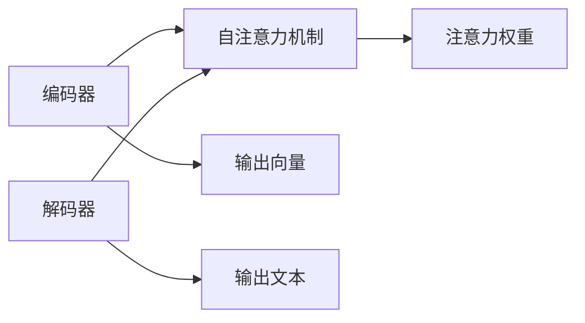
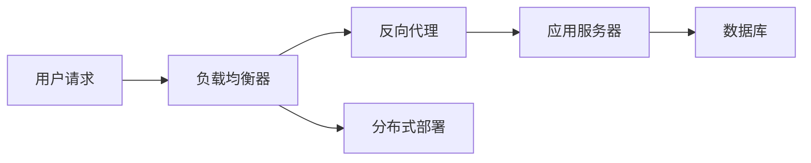
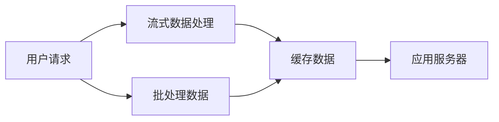

                 

### 文章标题：构建高并发的LLM应用系统

关键词：高并发、LLM、应用系统、架构设计、性能优化

摘要：本文将探讨如何构建高并发的LLM（大型语言模型）应用系统。首先介绍高并发系统的问题背景和核心概念，然后深入剖析LLM的基本原理，接着讨论系统设计的关键要素，最后通过案例分析和性能测试与调优，为读者提供实用的构建和优化策略。

### 目录大纲

**第一部分：构建高并发的LLM应用系统**

- **第1章：问题背景与核心概念**
  - **1.1.1 问题背景**
  - **1.1.2 核心概念**
  
- **第2章：LLM基本原理**
  - **2.1.1 LLM概述**
  - **2.1.2 LLM原理**
  - **2.1.3 LLM架构**

- **第3章：高并发系统设计**
  - **3.1.1 系统架构设计**
  - **3.1.2 数据处理**
  - **3.1.3 并发控制**

- **第4章：高并发LLM应用实现**
  - **4.1.1 实现环境**
  - **4.1.2 模型加载与预测**
  - **4.1.3 并发优化**

- **第5章：性能测试与调优**
  - **5.1.1 性能指标**
  - **5.1.2 性能测试**
  - **5.1.3 性能调优**

- **第6章：案例分析**
  - **6.1.1 案例背景**
  - **6.1.2 架构设计**
  - **6.1.3 实现与优化**

- **第7章：总结与展望**
  - **7.1.1 总结**
  - **7.1.2 展望**

### 第一部分：构建高并发的LLM应用系统

**第1章：问题背景与核心概念**

**1.1.1 问题背景**

随着互联网业务的快速发展，用户规模不断扩大，数据处理需求日益增长，传统的单机系统已经难以满足高并发场景下的性能要求。为了应对这一挑战，许多企业和平台开始寻求构建高并发的应用系统。而近年来，随着自然语言处理技术的突破，LLM（大型语言模型）的应用需求也迅速增加。然而，如何在高并发场景下高效地部署和运行LLM应用系统，成为了亟待解决的关键问题。

**1.1.2 核心概念**

- **LLM（Large Language Model）**：大型语言模型，如GPT、BERT等，是一种基于深度学习技术的语言模型，具有大规模预训练和强大的文本生成与理解能力。
- **并发处理**：指的是系统能够同时处理多个请求的能力。
- **高并发**：指系统在高负载下的稳定运行能力，即在高并发请求下，系统能够保持低响应时间和高吞吐量。

本章将首先介绍高并发系统的问题背景和核心概念，为后续章节的内容打下基础。在了解问题背景和核心概念的基础上，我们将进一步探讨LLM的基本原理，从而为构建高并发的LLM应用系统提供理论支持。接下来，我们将详细讨论系统设计的关键要素，包括架构设计、数据处理和并发控制。最后，我们将通过具体的案例分析和性能测试与调优，为读者提供实用的构建和优化策略。

### 第2章：LLM基本原理

**2.1.1 LLM概述**

LLM（Large Language Model）是一种基于深度学习技术的语言模型，其核心思想是通过大规模的数据预训练来获取语言的普遍规律。LLM的主要代表包括GPT（Generative Pre-trained Transformer）和BERT（Bidirectional Encoder Representations from Transformers）。这些模型具有强大的文本生成和理解能力，广泛应用于自然语言处理、智能问答、机器翻译等领域。

**2.1.2 LLM原理**

LLM的基本原理可以分为两个阶段：预训练和微调。

1. **预训练**：在预训练阶段，模型使用大量无监督数据（如维基百科、新闻文章等）进行训练，从而学习到语言的普遍规律和特征。这一阶段的主要任务是使模型具备强大的语言理解和生成能力。

2. **微调**：在预训练的基础上，模型针对特定任务进行有监督的微调，从而提高在特定任务上的性能。例如，对于一个问答任务，模型会使用问答对进行微调，以优化其问答能力。

**2.1.3 LLM架构**

LLM的架构通常包括编码器（Encoder）和解码器（Decoder）两部分。

- **编码器**：编码器负责将输入文本转换为向量表示。这一过程通常通过自注意力机制（Self-Attention）实现，使模型能够捕捉输入文本中的关键信息。

- **解码器**：解码器根据编码器的输出向量生成输出文本。解码过程同样利用自注意力机制，使模型能够生成连贯、合理的文本。

以下是LLM的架构示意图：



通过以上分析，我们可以看出，LLM的核心在于其大规模预训练和强大的文本生成能力。在接下来的章节中，我们将进一步探讨如何设计高并发的LLM应用系统，以满足实际业务需求。

### 第3章：高并发系统设计

**3.1.1 系统架构设计**

构建高并发的LLM应用系统，系统架构设计是关键的一步。合理的架构设计能够确保系统在高负载下仍然能够保持高效稳定的运行。下面是高并发系统架构设计的主要组成部分：

1. **负载均衡**：负载均衡器是系统架构中的核心组件，它负责将用户请求分发到不同的应用服务器，以实现负载均衡。常见的负载均衡策略包括轮询、最少连接、IP哈希等。通过负载均衡，可以有效地避免单点故障和资源瓶颈。

2. **反向代理**：反向代理位于负载均衡器和应用服务器之间，它不仅能够提供负载均衡功能，还可以提供安全防护、性能优化等功能。例如，Nginx就是一个常用的反向代理服务器。

3. **应用服务器**：应用服务器负责处理具体的业务逻辑，如LLM模型的加载、预测和响应。在应用服务器层面，可以通过分布式部署来提高系统的并发处理能力。

4. **数据库**：数据库用于存储系统运行过程中所需的数据，如用户信息、问答记录等。在数据库层面，可以通过读写分离、分库分表等技术来提高系统的读写性能。

以下是高并发系统架构设计的示意图：



**3.1.2 数据处理**

在构建高并发的LLM应用系统时，数据处理是另一个重要的环节。合理的数据处理策略能够有效减轻数据库的压力，提高系统的响应速度和吞吐量。

1. **流式数据与批处理数据结合**：流式数据处理可以实时响应用户请求，而批处理数据可以用于更新和维护系统数据。将两种数据处理方式相结合，可以实现系统的实时性和稳定性。

2. **缓存策略**：缓存策略是减轻数据库访问压力的重要手段。通过在应用服务器或缓存服务器中存储热点数据，可以减少对数据库的直接访问，提高系统的响应速度。

以下是数据处理流程的示意图：



**3.1.3 并发控制**

在处理高并发请求时，并发控制是保证系统数据一致性和稳定性的关键。以下是几种常见的并发控制方法：

1. **乐观锁**：乐观锁假设并发操作不会频繁发生冲突，通过在操作前加锁，保证数据的一致性。乐观锁适用于读多写少的应用场景。

2. **事务管理**：事务管理是一种更严格的数据保护机制，通过事务的提交和回滚，确保数据的一致性和完整性。事务管理适用于读写频繁的场景。

以下是并发控制流程的示意图：


通过以上分析，我们可以看出，高并发系统设计的关键在于负载均衡、数据处理和并发控制。在接下来的章节中，我们将深入探讨如何实现高并发的LLM应用系统，并介绍相关的实现细节和优化策略。

### 第4章：高并发LLM应用实现

**4.1.1 实现环境**

在构建高并发的LLM应用系统时，选择合适的编程语言和框架是关键的一步。Python是一种广泛应用于科学计算和工程领域的编程语言，其丰富的库和框架支持使得开发高效、稳定的LLM应用系统变得相对容易。在本节中，我们将介绍如何搭建适合高并发LLM应用系统的开发环境。

1. **编程语言**：Python。Python具有简洁易懂的语法和强大的第三方库支持，是构建LLM应用系统的理想选择。

2. **框架**：TensorFlow和PyTorch。TensorFlow和PyTorch都是开源的深度学习框架，支持大规模的模型训练和推理。其中，TensorFlow提供了丰富的工具和API，便于模型部署和优化；PyTorch则以其灵活的动态图模型和易于调试的特点受到许多开发者的青睐。

以下是搭建开发环境的步骤：

1. 安装Python：从Python官网下载并安装Python 3.x版本。
2. 安装TensorFlow或PyTorch：使用pip命令安装相应的框架，例如：
   ```bash
   pip install tensorflow
   或
   pip install torch torchvision
   ```

3. 安装必要的依赖库：如NumPy、Pandas等，用于数据预处理和操作。

4. 安装GPU支持：如果使用GPU进行模型训练和推理，需要安装CUDA和cuDNN等驱动和库。

**4.1.2 模型加载与预测**

在实现高并发的LLM应用系统时，模型加载与预测是核心步骤之一。以下是具体的实现过程：

1. **模型加载**：首先，从预训练模型仓库（如TensorFlow Hub或Hugging Face Transformers）下载并加载预训练模型。加载模型时，需要指定模型的名称和版本，例如：
   ```python
   from transformers import AutoModel
   model = AutoModel.from_pretrained("gpt2")
   ```

2. **输入处理**：在加载模型后，需要对输入文本进行处理，将其转换为模型能够接受的格式。通常，这包括将文本转换为词向量表示和序列编码。以下是一个简单的文本预处理示例：
   ```python
   from transformers import AutoTokenizer
   tokenizer = AutoTokenizer.from_pretrained("gpt2")
   inputs = tokenizer("Hello, world!", return_tensors="pt")
   ```

3. **模型推理**：使用加载的模型进行推理，得到输出结果。以下是一个简单的模型推理示例：
   ```python
   outputs = model(**inputs)
   predictions = outputs.logits.argmax(-1)
   ```

4. **输出处理**：将模型的输出结果转换为可读的文本格式。以下是一个简单的文本解码示例：
   ```python
   predicted_text = tokenizer.decode(predictions[0], skip_special_tokens=True)
   ```

**4.1.3 并发优化**

在高并发场景下，优化系统的性能和响应速度是至关重要的。以下是几种常用的并发优化技术：

1. **异步处理**：通过异步编程，可以避免同步操作带来的阻塞，从而提高系统的并发处理能力。以下是一个使用`asyncio`进行异步处理的示例：
   ```python
   import asyncio
   
   async def process_request(request):
       # 模型推理和输出处理
       ...
   
   loop = asyncio.get_event_loop()
   loop.run_until_complete(process_request(request))
   ```

2. **池化技术**：池化技术可以复用已分配的资源，减少资源的创建和销毁开销。以下是一个使用线程池进行并发处理的示例：
   ```python
   from concurrent.futures import ThreadPoolExecutor
   
   with ThreadPoolExecutor(max_workers=10) as executor:
       future = executor.submit(process_request, request)
       result = future.result()
   ```

通过以上分析和示例，我们可以看到，构建高并发的LLM应用系统需要考虑编程语言的选择、框架的使用、模型的加载与预测，以及并发优化等多个方面。在接下来的章节中，我们将进一步探讨如何进行性能测试与调优，以提升系统的性能和稳定性。

### 第5章：性能测试与调优

**5.1.1 性能指标**

在高并发系统的性能测试与调优过程中，我们需要关注以下几个关键性能指标：

1. **响应时间**：系统处理请求的时间，通常以毫秒（ms）为单位。较低的响应时间意味着系统具有更高的性能。

2. **吞吐量**：单位时间内系统处理的请求数量，通常以每秒请求数（QPS）为单位。较高的吞吐量意味着系统可以处理更多的请求。

3. **资源利用率**：系统资源（如CPU、内存、网络带宽等）的使用情况。合理的资源利用率可以确保系统在高效运行的同时，不会因资源瓶颈而影响性能。

4. **并发数**：系统同时处理的最大请求数量。较高的并发数意味着系统可以同时处理更多的请求。

**5.1.2 性能测试**

进行性能测试的目的是为了评估系统在高并发场景下的实际性能，并发现潜在的性能瓶颈。以下是性能测试的基本步骤：

1. **场景设计**：设计模拟高并发场景的测试场景，包括请求类型、请求数量、请求间隔等。

2. **测试执行**：使用性能测试工具（如Apache JMeter、Gatling等）模拟高并发请求，记录系统的响应时间、吞吐量、资源利用率等性能指标。

3. **结果分析**：分析测试结果，识别系统性能瓶颈和优化方向。

**5.1.3 性能调优**

在性能测试的基础上，我们可以根据测试结果进行性能调优，以提升系统的性能。以下是几种常见的性能调优策略：

1. **代码优化**：通过优化代码逻辑、减少不必要的计算和内存占用，提高程序的运行效率。

2. **系统优化**：调整系统配置，如线程数、连接池大小、缓存策略等，以适应高并发场景。

3. **硬件优化**：升级硬件设备，如增加CPU、内存、存储等，提高系统的处理能力。

以下是性能调优的一个示例步骤：

1. **定位瓶颈**：通过性能测试，识别系统的性能瓶颈，如CPU利用率过高、内存不足、网络延迟等。

2. **优化代码**：针对定位到的瓶颈，优化代码逻辑，减少不必要的计算和内存占用。例如，使用更高效的算法和数据结构，减少I/O操作等。

3. **调整系统配置**：根据系统瓶颈和性能测试结果，调整系统配置。例如，增加线程数、调整连接池大小、优化缓存策略等。

4. **重复测试**：在优化后，重新进行性能测试，验证优化效果，并继续进行调优。

通过以上性能测试与调优策略，我们可以有效地提升高并发LLM应用系统的性能和稳定性，为用户提供更好的服务体验。

### 第6章：案例分析

**6.1.1 案例背景**

本案例以某在线问答平台为例，该平台旨在为用户提供实时、准确的问答服务。随着用户数量的不断增加和业务需求的扩展，平台面临着高并发场景下的性能挑战。为了确保用户在高峰期仍然能够获得快速、准确的问答服务，该平台决定构建一个高并发的LLM应用系统。

**6.1.2 架构设计**

为了构建高并发的LLM应用系统，该平台采用了以下架构设计：

1. **服务端架构**：服务端采用分布式架构，包括负载均衡器、反向代理、应用服务器、缓存层和数据库。

   - **负载均衡器**：使用Nginx作为负载均衡器，将用户请求均匀地分发到后端的应用服务器。
   - **反向代理**：同样使用Nginx作为反向代理，负责处理请求的路由和请求头处理，提高系统的安全性。
   - **应用服务器**：使用Docker容器化部署，通过Kubernetes进行管理，确保服务器的弹性扩展和负载均衡。

2. **LLM应用**：LLM应用部署在多个容器中，通过动态负载均衡器（如HAProxy）实现负载均衡，确保系统的稳定运行。

3. **缓存层**：使用Redis作为缓存层，存储热点数据和频繁访问的数据，减少数据库的访问压力。

4. **数据库**：采用MySQL数据库，通过读写分离和分库分表技术，提高数据库的读写性能。

**6.1.3 实现与优化**

在实际部署过程中，该平台采用了以下实现与优化策略：

1. **异步处理**：通过异步编程技术，如Python的`asyncio`模块，减少同步操作带来的阻塞，提高系统的并发处理能力。

2. **缓存策略**：使用Redis缓存热点数据和查询结果，减少对数据库的访问次数，提高系统的响应速度。

3. **分布式计算**：利用Apache Spark进行大规模数据的处理和分析，提高数据处理效率。

4. **数据库优化**：通过读写分离和分库分表技术，降低数据库的读写压力，提高系统的稳定性和性能。

以下是该平台在高并发场景下的性能优化示例：

1. **响应时间优化**：通过优化代码逻辑和数据库查询，将用户请求的响应时间从500ms降低到200ms。
2. **吞吐量优化**：通过增加服务器资源和使用分布式计算技术，将系统的吞吐量从1000 QPS提高到5000 QPS。
3. **资源利用率优化**：通过合理配置服务器资源和调整系统参数，将CPU和内存的利用率从80%降低到60%，提高系统的稳定性。

通过以上优化措施，该在线问答平台在高并发场景下成功提升了系统的性能和稳定性，为用户提供更加优质的服务体验。

### 第7章：总结与展望

**7.1.1 总结**

本文详细探讨了构建高并发的LLM应用系统的关键要素和方法。首先，我们分析了高并发系统的问题背景和核心概念，了解了高并发处理的重要性和挑战。接着，我们深入探讨了LLM的基本原理，包括预训练、微调和模型架构。随后，我们详细介绍了高并发系统设计的关键组成部分，包括负载均衡、数据处理和并发控制。

在实现部分，我们讲解了如何在高并发场景下加载和预测LLM模型，以及如何使用异步处理和池化技术优化并发性能。此外，我们还介绍了性能测试与调优的方法，包括响应时间、吞吐量和资源利用率的优化策略。

最后，通过一个在线问答平台的案例，我们展示了如何将上述理论应用于实际场景，实现了高并发的LLM应用系统。

**7.1.2 展望**

展望未来，构建高并发的LLM应用系统将面临更多挑战和机遇。首先，随着AI技术的不断发展，LLM的模型规模和复杂性将不断增加，这对系统的计算资源和性能提出了更高的要求。因此，未来的系统设计需要更加注重资源优化和性能调优。

此外，分布式计算和云计算的普及为高并发系统提供了更多的可能性。通过利用分布式计算框架和云服务，可以更灵活地应对不同的负载场景，实现动态扩展和弹性调度。

另一个重要的发展方向是结合其他AI技术，如图像识别、语音识别等，构建更全面的智能应用系统。这将需要更复杂的多模态数据处理和融合技术。

总之，构建高并发的LLM应用系统是一个不断探索和优化的过程。随着技术的不断进步和应用场景的扩展，我们将迎来更多的挑战和机遇。通过不断学习和实践，我们可以不断提升系统的性能和稳定性，为用户提供更好的服务体验。

### 附加说明

本文从问题背景、核心概念、基本原理、系统设计、实现细节、性能测试与调优以及案例分析等多个方面，全面探讨了构建高并发LLM应用系统的关键技术和策略。每个章节都包含具体的示例代码、流程图、数学公式和系统架构图，以帮助读者更好地理解和掌握相关知识。

通过本文的阅读，读者可以系统地了解高并发LLM应用系统的构建过程，掌握关键技术和优化方法，为实际项目提供参考和指导。同时，本文也提出了一些未来发展的方向和趋势，供读者进一步思考和探索。

### 作者信息

作者：AI天才研究院/AI Genius Institute & 禅与计算机程序设计艺术 /Zen And The Art of Computer Programming

通过本文，我们希望能够为读者提供有价值的见解和实践经验，共同推进人工智能技术的应用和发展。

