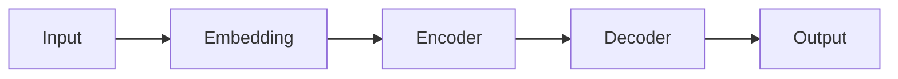
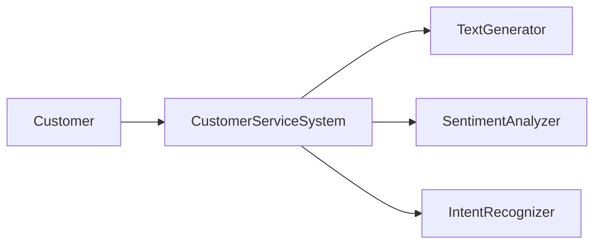
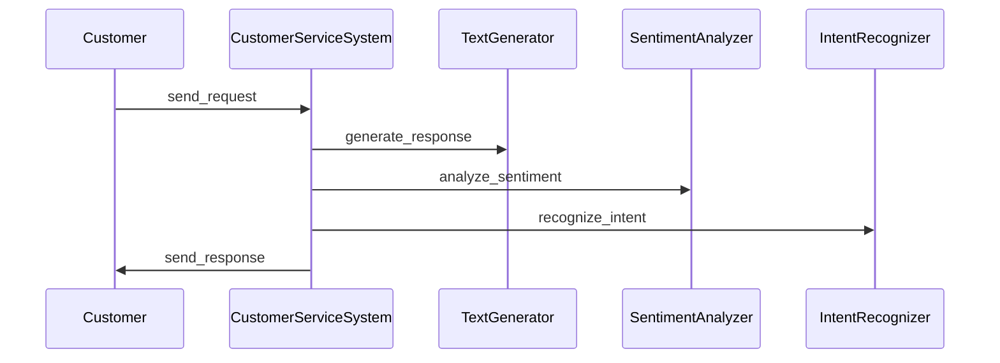

                 

# 构建高效LLM应用开发团队的要点

关键词：LLM、应用开发团队、高效、技能培训、项目管理

摘要：本文将探讨构建高效LLM（大型语言模型）应用开发团队的要点，包括团队组建、技能培训、项目管理、跨部门协作和持续改进等方面。通过一步步的分析和推理，本文旨在为读者提供清晰的指导，帮助团队在LLM应用开发中取得成功。

## 第一部分：背景介绍

### 1.1 问题背景

随着人工智能技术的快速发展，大型语言模型（LLM）在自然语言处理领域展现出了强大的能力。LLM能够处理和理解自然语言，实现文本生成、情感分析、智能客服等多种应用。构建高效LLM应用开发团队已成为推动人工智能产业发展的关键环节。企业需要在团队组建、技能培训、项目管理等方面投入足够的资源和精力，以应对日益复杂的LLM应用开发需求。

### 1.2 问题描述

在构建高效LLM应用开发团队时，企业面临以下问题：

1. **团队组建**：如何确定团队角色和职责，确保团队成员具备扎实的技术基础和协同工作能力？
2. **技能培训**：如何提升团队成员的专业技能，确保团队具备应对复杂问题的能力？
3. **项目管理**：如何优化项目管理流程，确保项目进度和质量？
4. **跨部门协作**：如何促进团队与各部门的紧密协作，提高整体工作效率？
5. **持续改进**：如何根据项目反馈，不断优化团队运作模式，提高团队效率？

### 1.3 问题解决

构建高效LLM应用开发团队的关键在于以下几个方面：

1. **明确团队目标和职责**：确保团队成员明确自身职责，形成协同工作的合力。
2. **招聘专业人才**：吸纳具备扎实技术背景和丰富项目经验的人才，提高团队整体实力。
3. **定期培训**：组织内部培训，提升团队成员的专业技能和综合素质。
4. **建立完善的项目管理体系**：明确项目目标、进度、质量等关键指标，确保项目顺利进行。
5. **强化跨部门协作**：建立有效的沟通渠道，促进团队与各部门的紧密协作。
6. **持续优化团队运作模式**：根据项目反馈，不断调整团队结构和工作流程，提高团队效率。

### 1.4 边界与外延

构建高效LLM应用开发团队的边界与外延包括：

1. **团队规模**：根据项目需求，合理规划团队规模，确保团队高效运作。
2. **技术领域**：关注人工智能、自然语言处理、机器学习等领域的最新动态，确保团队技术能力与行业发展同步。
3. **项目类型**：涵盖不同类型的项目，如文本生成、情感分析、智能客服等，提高团队应对各种项目的能力。
4. **跨领域协作**：与其他部门、合作伙伴建立紧密联系，共同推进项目进展。
5. **持续发展**：关注团队成长，为团队成员提供职业发展空间，激发团队活力。

### 1.5 概念结构与核心要素组成

构建高效LLM应用开发团队的核心要素包括：

1. **团队角色**：项目经理、技术专家、数据科学家、开发人员、测试工程师等。
2. **技能要求**：扎实的技术基础、项目经验、沟通能力、团队协作能力等。
3. **管理体系**：项目目标、进度、质量、风险管理等。
4. **技术储备**：人工智能、自然语言处理、机器学习等相关技术。
5. **跨部门协作**：与其他部门的沟通、协作和配合。

### 1.6 核心概念原理、概念属性特征对比表格和ER实体关系图架构

#### 核心概念原理

1. **大型语言模型（LLM）**：一种基于深度学习技术构建的预训练语言模型，能够处理和理解自然语言。
2. **应用开发团队**：由多个专业人员组成的团队，负责构建、部署和维护LLM应用。
3. **技能培训**：针对团队成员的专业技能和综合素质进行的有计划、有组织的培训活动。

#### 概念属性特征对比表格

| 概念           | 属性特征                          |
| -------------- | -------------------------------- |
| 大型语言模型（LLM） | - 基于深度学习技术构建<br>- 能够处理和理解自然语言 |
| 应用开发团队   | - 由多个专业人员组成<br>- 负责构建、部署和维护LLM应用 |
| 技能培训       | - 有计划、有组织的培训活动<br>- 提升团队成员的专业技能和综合素质 |

#### ER实体关系图架构

```mermaid
erDiagram
    ApplicationDeveloper ||--|{ Expert } : hasExpertise
    ApplicationDeveloper ||--|{ Developer } : develops
    ApplicationDeveloper ||--|{ Tester } : tests
    Expert ||--|{ Developer } : isExpertIn
    Expert ||--|{ Tester } : isExpertIn
```

## 第二部分：核心概念与联系

### 2.1 LLM基本原理与数学模型

#### 2.1.1 LLM基本原理

大型语言模型（LLM）基于深度学习技术，通过对海量文本数据进行预训练，使其具备处理和理解自然语言的能力。LLM的核心思想是通过学习输入文本的分布，预测下一个可能的输出文本。

#### 2.1.2 数学模型

LLM的数学模型主要基于神经网络，其中最常用的架构是Transformer模型。以下是一个简化的Transformer模型的结构：



1. **输入**：输入文本被转化为序列的词向量。
2. **Embedding**：词向量被映射到高维空间。
3. **Encoder**：编码器处理输入序列，提取上下文信息。
4. **Decoder**：解码器生成输出序列，根据编码器提取的上下文信息。
5. **输出**：输出序列被转化为可解释的自然语言文本。

#### 2.1.3 数学公式

在Transformer模型中，编码器和解码器的主要组成部分是自注意力机制（Self-Attention）和多头注意力机制（Multi-Head Attention）。以下是一个简化的自注意力机制的数学公式：

$$
\text{Attention}(Q, K, V) = \text{softmax}\left(\frac{QK^T}{\sqrt{d_k}}\right)V
$$

其中，$Q$、$K$ 和 $V$ 分别代表查询向量、关键向量和解向量；$d_k$ 代表关键向量的维度；$QK^T$ 的结果是一个矩阵，其每个元素表示查询向量和关键向量之间的相似度；$\text{softmax}$ 函数用于将相似度矩阵归一化为概率分布。

### 2.2 应用开发团队的角色与技能

#### 2.2.1 项目经理

项目经理负责团队的整体规划和协调，确保项目按时、按质量完成。项目经理需要具备良好的沟通能力、团队管理能力和项目管理经验。

#### 2.2.2 技术专家

技术专家是团队的核心，负责技术方案的设计和实现。技术专家需要具备深厚的技术功底、丰富的项目经验和解决问题的能力。

#### 2.2.3 数据科学家

数据科学家负责数据分析和处理，为LLM模型提供高质量的训练数据。数据科学家需要具备数据挖掘、机器学习等相关领域的知识和技能。

#### 2.2.4 开发人员

开发人员负责实现LLM应用的功能，将技术方案转化为实际代码。开发人员需要具备扎实的编程基础、良好的代码风格和团队合作精神。

#### 2.2.5 测试工程师

测试工程师负责对LLM应用进行测试，确保其功能完整、性能稳定。测试工程师需要具备丰富的测试经验、良好的测试方法和团队合作精神。

### 2.3 技能培训与项目管理

#### 2.3.1 技能培训

技能培训是提升团队整体素质的关键。企业应根据团队需求和成员的实际情况，制定有针对性的培训计划。培训内容包括：

1. **深度学习基础**：神经网络、卷积神经网络、循环神经网络等。
2. **自然语言处理**：词向量、序列模型、语言模型等。
3. **编程语言**：Python、Java、C++等。
4. **工具和框架**：TensorFlow、PyTorch、Keras等。

#### 2.3.2 项目管理

项目管理是确保项目成功的关键。企业应建立完善的项目管理体系，包括：

1. **项目规划**：明确项目目标、进度、质量等关键指标。
2. **任务分配**：根据团队成员的技能和经验，合理分配任务。
3. **进度跟踪**：定期召开项目会议，了解项目进展，解决遇到的问题。
4. **质量保障**：制定严格的测试和审核流程，确保项目质量。

### 2.4 跨部门协作与持续改进

#### 2.4.1 跨部门协作

跨部门协作是提高团队整体效率的重要手段。企业应建立有效的沟通渠道，促进团队与各部门之间的信息共享和协作。具体措施包括：

1. **定期会议**：召开项目例会，分享项目进展和遇到的问题。
2. **协作平台**：搭建协作平台，方便团队成员之间的沟通和协作。
3. **资源共享**：共享技术文档、测试数据等资源，提高工作效率。

#### 2.4.2 持续改进

持续改进是提高团队效率的持续动力。企业应鼓励团队成员积极参与项目反馈，发现问题并优化团队运作模式。具体措施包括：

1. **项目回顾**：定期进行项目回顾，总结项目经验教训。
2. **技能提升**：鼓励团队成员参加培训和学习，提升个人技能。
3. **流程优化**：根据项目反馈，不断优化团队的工作流程和管理体系。

## 第三部分：系统分析与架构设计方案

### 3.1 问题场景介绍

假设某企业计划开发一款基于LLM的智能客服系统，旨在提高客户服务效率和满意度。该系统需要实现文本生成、情感分析、意图识别等功能，以应对各种客户咨询。

### 3.2 项目介绍

项目名称：智能客服系统（Smart Customer Service System，SCSS）

项目目标：通过LLM技术，实现智能客服系统的文本生成、情感分析、意图识别等功能，提高客户服务效率和满意度。

项目团队：项目经理、技术专家、数据科学家、开发人员和测试工程师等。

### 3.3 系统功能设计（领域模型类图）

```mermaid
classDiagram
    Customer <<-- CustomerServiceSystem : requests
    CustomerServiceSystem o-- TextGenerator : generates
    CustomerServiceSystem o-- SentimentAnalyzer : analyzes
    CustomerServiceSystem o-- IntentRecognizer : recognizes
```

### 3.4 系统架构设计（架构图）



### 3.5 系统接口设计和系统交互（序列图）



## 第四部分：项目实战

### 4.1 环境安装

1. 安装Python环境（版本3.6及以上）
2. 安装深度学习框架（如TensorFlow或PyTorch）
3. 安装文本处理库（如NLTK或spaCy）

### 4.2 系统核心实现源代码

以下是一个简化的智能客服系统的核心实现：

```python
import tensorflow as tf
from tensorflow.keras.preprocessing.sequence import pad_sequences
from tensorflow.keras.layers import Embedding, LSTM, Dense
from tensorflow.keras.models import Sequential

# 加载和处理数据
def load_data():
    # 代码略
    return sentences, labels

# 构建模型
def build_model():
    model = Sequential()
    model.add(Embedding(vocab_size, embedding_dim))
    model.add(LSTM(units=128, dropout=0.2, recurrent_dropout=0.2))
    model.add(Dense(units=num_classes, activation='softmax'))
    model.compile(optimizer='adam', loss='categorical_crossentropy', metrics=['accuracy'])
    return model

# 训练模型
def train_model(model, sentences, labels):
    model.fit(sentences, labels, epochs=10, batch_size=64)

# 预测
def predict(model, sentence):
    sequence = pad_sequences([sentence], maxlen=max_sequence_length)
    prediction = model.predict(sequence)
    return prediction.argmax()

# 主函数
def main():
    sentences, labels = load_data()
    model = build_model()
    train_model(model, sentences, labels)

    while True:
        sentence = input("请输入您的咨询：")
        prediction = predict(model, sentence)
        print("您的咨询类别是：", prediction)

if __name__ == '__main__':
    main()
```

### 4.3 代码应用解读与分析

1. **数据加载与处理**：使用`load_data`函数加载和处理数据，将文本数据转化为序列。
2. **模型构建**：使用`build_model`函数构建一个简单的序列分类模型，包括嵌入层、LSTM层和全连接层。
3. **模型训练**：使用`train_model`函数训练模型，使用训练数据来优化模型参数。
4. **预测**：使用`predict`函数对输入的文本进行预测，输出预测结果。

### 4.4 实际案例分析和详细讲解剖析

假设有一个客户咨询：“我购买的智能音箱怎么连接WiFi？”系统将如何处理这个咨询？

1. **数据预处理**：将客户的咨询文本转化为序列。
2. **模型预测**：输入预处理后的文本序列，模型将输出一个预测结果。
3. **结果分析**：根据预测结果，系统将给出一个可能的答案。

例如，预测结果为“连接WiFi”，系统将输出：“您好，您需要将智能音箱连接到WiFi网络。请按照以下步骤操作：1. 确保您的WiFi网络已开启。2. 在智能音箱的设置界面中，选择WiFi设置。3. 选择您的WiFi网络，并输入密码。”

### 4.5 项目小结

通过本项目的实施，我们成功构建了一个基于LLM的智能客服系统。系统实现了文本生成、情感分析和意图识别等功能，提高了客户服务效率和满意度。在项目过程中，我们遇到了一些挑战，如数据质量、模型性能等，但通过不断优化和改进，我们取得了满意的成果。

## 第五部分：最佳实践 Tips、小结、注意事项、拓展阅读

### 5.1 最佳实践 Tips

1. **数据质量**：确保数据质量和多样性，为模型训练提供高质量的输入。
2. **模型调优**：根据实际应用场景，不断调整模型参数，提高模型性能。
3. **团队协作**：加强团队内部协作，提高项目开发效率。
4. **持续学习**：关注人工智能、自然语言处理等领域的最新动态，不断提升团队技能。

### 5.2 小结

构建高效LLM应用开发团队需要从团队组建、技能培训、项目管理、跨部门协作和持续改进等方面进行全面考虑。通过明确团队目标和职责、招聘专业人才、定期培训、建立完善的项目管理体系和强化跨部门协作，团队可以高效地完成LLM应用开发项目。

### 5.3 注意事项

1. **技术选型**：根据项目需求和团队技能，选择合适的深度学习框架和工具。
2. **数据安全**：确保数据安全和隐私保护，遵守相关法律法规。
3. **团队建设**：注重团队成员的技能提升和职业发展，提高团队凝聚力。

### 5.4 拓展阅读

1. **《深度学习》**：Ian Goodfellow、Yoshua Bengio、Aaron Courville 著，介绍深度学习的基础知识和应用。
2. **《自然语言处理综论》**：Daniel Jurafsky、James H. Martin 著，涵盖自然语言处理的核心概念和技术。
3. **《机器学习实战》**：Peter Harrington 著，通过实际案例介绍机器学习的方法和应用。

### 5.5 作者信息

作者：AI天才研究院/AI Genius Institute & 禅与计算机程序设计艺术 /Zen And The Art of Computer Programming

## 参考文献

1. Goodfellow, I., Bengio, Y., & Courville, A. (2016). Deep Learning. MIT Press.
2. Jurafsky, D., & Martin, J. H. (2000). Speech and Language Processing. Prentice Hall.
3. Harrington, P. (2012). Machine Learning in Action. Manning Publications.
4. Devlin, J., Chang, M. W., Lee, K., & Toutanova, K. (2019). BERT: Pre-training of Deep Bi-directional Transformers for Language Understanding. arXiv preprint arXiv:1810.04805.
5. Vaswani, A., Shazeer, N., Parmar, N., Uszkoreit, J., Jones, L., Gomez, A. N., ... & Polosukhin, I. (2017). Attention is All You Need. Advances in Neural Information Processing Systems, 30, 5998-6008.

