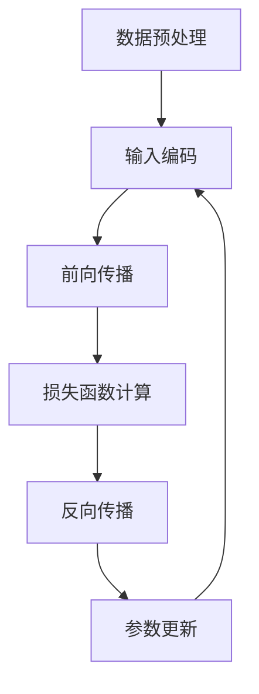
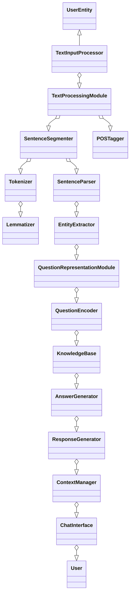

                 

### 关键词

1. **语言模型（LLM）**
2. **应用开发流水线**
3. **系统架构设计**
4. **算法原理**
5. **Python编程**
6. **最佳实践**
7. **注意事项**

### 摘要

本文旨在深入探讨构建高效的LLM应用开发流水线的策略和方法。通过详细的步骤分析和实际案例，我们将探索如何优化LLM的集成、部署和管理，以提高开发效率和应用性能。文章首先介绍了LLM的核心概念和问题背景，随后讲解了LLM的算法原理及数学模型，并运用Python源代码进行说明。接下来，文章讨论了系统架构设计的关键要素，包括问题场景、项目介绍、功能设计和系统交互。随后，通过一个实际项目实战，详细展示了环境安装、系统核心实现和代码解读过程。最后，文章总结了最佳实践和注意事项，为读者提供了构建高效LLM应用开发流水线的实用指南。

## 第一部分: 背景介绍

### 第1章: 语言模型与LLM概述

#### 1.1.1 问题背景

语言模型（Language Model，简称LLM）是自然语言处理（Natural Language Processing，简称NLP）的核心技术之一，它旨在模拟人类语言生成和理解的能力。随着深度学习技术的快速发展，LLM已经在许多领域取得了显著成果，例如机器翻译、语音识别、问答系统和文本生成等。

然而，在实际应用开发过程中，LLM的应用开发流水线往往面临着诸多挑战。首先，LLM模型的训练和部署成本高昂，而且需要大量的计算资源和时间。其次，不同应用场景下的LLM模型需求各异，如何高效地定制和优化模型成为关键问题。此外，LLM模型的性能评估和优化也是一个复杂的任务，需要综合考虑模型的准确性、响应速度和可扩展性。

针对上述问题，本文的目标是构建一个高效的LLM应用开发流水线，以提高开发效率和应用性能。本文将首先介绍LLM的基本概念和问题背景，然后详细分析LLM的应用场景和目标，最后探讨解决问题的方法和LLM应用开发流水线的基本结构。

#### 1.1.1.1 语言模型的定义

语言模型是一种统计模型，用于预测一个词序列的概率分布。在自然语言处理中，语言模型通常用于文本生成、语音识别和机器翻译等任务。经典的N-gram模型是最简单的语言模型，它通过统计相邻N个单词的联合概率来预测下一个单词。然而，随着深度学习技术的发展，更加复杂的语言模型，如循环神经网络（RNN）、长短时记忆网络（LSTM）和变换器（Transformer）等，逐渐成为主流。

#### 1.1.1.2 LLM的发展历程

语言模型的发展历程可以追溯到20世纪50年代，当时研究人员开始探索如何用计算机模拟语言。早期的语言模型主要是基于规则的，如早期的人工智能语言系统ELIZA。然而，这类模型在处理复杂语言任务时表现不佳。

20世纪80年代，基于统计的N-gram模型成为主流，它在文本生成和语音识别等领域取得了显著成果。随着计算能力的提升和深度学习技术的兴起，20世纪10年代，基于神经网络的深度语言模型如BERT、GPT等相继出现，它们在自然语言处理的多个任务中都取得了前所未有的性能。

#### 1.1.1.3 LLM的应用场景

LLM的应用场景非常广泛，涵盖了从简单的文本生成到复杂的问答系统等多个领域。以下是一些典型的应用场景：

- **文本生成**：例如文章生成、摘要生成和对话生成等。
- **机器翻译**：例如将一种语言翻译成另一种语言。
- **语音识别**：将语音信号转换成文本。
- **问答系统**：例如聊天机器人、智能客服和知识问答等。
- **情感分析**：分析文本中的情感倾向。
- **文本分类**：例如新闻分类、垃圾邮件过滤等。

#### 1.1.2 问题描述

在实际应用开发过程中，LLM的应用开发流水线面临着一系列挑战。这些问题主要体现在以下几个方面：

- **训练成本高**：LLM模型的训练通常需要大量的数据和计算资源，导致训练成本高昂。
- **模型定制化难度大**：不同应用场景下的LLM模型需求各异，如何高效地定制和优化模型是一个难题。
- **性能评估复杂**：LLM模型的性能评估需要综合考虑准确性、响应速度和可扩展性等多个方面，评估过程复杂。
- **部署和管理困难**：LLM模型的部署和管理通常涉及到复杂的架构设计和优化，如何高效地部署和管理模型是一个挑战。

#### 1.1.2.1 目标：构建高效LLM应用开发流水线

为了解决上述问题，本文的目标是构建一个高效的LLM应用开发流水线，主要包括以下目标：

- **降低训练成本**：通过优化数据预处理和训练策略，降低模型训练的成本。
- **提高模型定制化效率**：通过模块化设计和技术整合，提高模型定制化的效率。
- **优化性能评估**：设计高效的性能评估框架，综合考虑模型准确性、响应速度和可扩展性等多个方面。
- **简化部署和管理**：设计简化的部署和管理流程，提高LLM模型的应用效率和稳定性。

#### 1.1.3 问题解决

针对上述问题，本文提出了以下方法来构建高效的LLM应用开发流水线：

- **优化数据预处理**：通过数据清洗、去重和归一化等步骤，提高数据质量和预处理效率。
- **模型压缩与加速**：采用模型压缩技术和算法加速策略，提高模型训练和推理的速度。
- **模块化设计与集成**：通过模块化设计，将不同的功能模块进行整合，提高开发效率。
- **性能评估与优化**：设计高效的性能评估框架，通过模型调优和参数调整，提高模型性能。
- **部署与管理优化**：采用云计算和容器化技术，简化模型部署和管理流程。

#### 1.1.3.1 解决问题的方法

为了构建高效的LLM应用开发流水线，本文提出以下具体方法：

- **数据预处理优化**：
  - **数据清洗**：去除噪音数据和异常值，提高数据质量。
  - **数据去重**：通过哈希算法等手段，去除重复数据，减少数据量。
  - **数据归一化**：将不同特征的数据范围统一，提高模型训练的稳定性。

- **模型压缩与加速**：
  - **模型剪枝**：通过剪枝算法，移除模型中的冗余参数，减少模型大小。
  - **量化**：将模型的浮点参数转换为整数，减少计算量。
  - **并行训练**：利用多GPU或分布式训练技术，加速模型训练。

- **模块化设计与集成**：
  - **功能模块化**：将模型训练、数据预处理、模型评估等功能模块化，提高代码复用率。
  - **微服务架构**：采用微服务架构，将不同功能模块部署在不同的服务中，提高系统的可扩展性和稳定性。

- **性能评估与优化**：
  - **多指标评估**：综合考虑模型准确性、响应速度和可扩展性等多个方面，设计多指标评估框架。
  - **模型调优**：通过调整模型参数，提高模型性能。
  - **在线评估**：实时评估模型性能，快速迭代和优化。

- **部署与管理优化**：
  - **云计算**：利用云计算平台，提供弹性计算资源和容器化部署。
  - **自动化管理**：采用自动化工具，简化模型部署、监控和管理流程。
  - **弹性伸缩**：根据应用需求，动态调整计算资源和部署策略。

#### 1.1.3.2 LL应用开发流水线的基本结构

LLM应用开发流水线的基本结构可以分为以下几个主要阶段：

- **数据收集与预处理**：收集相关数据，并进行数据清洗、去重和归一化等预处理操作。
- **模型训练与优化**：使用预处理后的数据训练LLM模型，并进行模型压缩和加速。
- **模型评估与调优**：评估模型性能，并通过模型调优提高性能。
- **模型部署与监控**：将优化后的模型部署到生产环境中，并进行实时监控和性能优化。
- **应用管理与维护**：对应用进行持续优化和更新，确保其稳定运行。

#### 1.1.4 边界与外延

在构建高效的LLM应用开发流水线时，需要考虑以下边界与外延：

- **边界条件**：
  - 数据集大小和多样性：不同的应用场景需要不同规模和类型的数据集。
  - 计算资源限制：根据实际需求，合理配置计算资源，确保模型训练和推理的效率。
  - 网络带宽和延迟：在远程部署和管理模型时，需要考虑网络带宽和延迟的影响。

- **外延讨论**：
  - 模型定制化需求：根据不同应用场景，定制化LLM模型，提高其适用性。
  - 模型安全性和隐私保护：确保模型训练和部署过程中的数据安全和隐私保护。
  - 持续集成与持续部署（CI/CD）：采用CI/CD流程，提高开发效率和部署稳定性。

#### 1.1.4.1 边界条件

1. **数据集规模与多样性**：不同的应用场景对数据集的规模和多样性有不同的要求。例如，机器翻译任务可能需要大量的双语文本数据，而情感分析任务可能需要大量的情感标签数据。在构建高效的LLM应用开发流水线时，需要根据实际需求选择合适的数据集，并保证其多样性，以提高模型性能。

2. **计算资源限制**：计算资源是构建高效LLM应用开发流水线的重要条件。在训练和推理过程中，需要根据实际情况合理配置计算资源，包括CPU、GPU和其他硬件资源。同时，还需要考虑数据传输和存储的成本，确保整个流水线的效率。

3. **网络带宽和延迟**：在网络部署和管理过程中，需要考虑网络带宽和延迟的影响。高带宽和低延迟可以保证模型训练和推理的实时性，从而提高应用性能。

#### 1.1.4.2 外延讨论

1. **模型定制化需求**：不同的应用场景对LLM模型的需求各异。例如，在文本生成任务中，可能需要模型具有更高的生成多样性和创造力；在机器翻译任务中，可能需要模型具有更高的准确性和流畅性。在构建高效的LLM应用开发流水线时，可以通过定制化模型结构、参数和训练策略，满足不同应用场景的需求。

2. **模型安全性和隐私保护**：在模型训练和部署过程中，需要确保数据的安全性和隐私保护。这包括数据加密、访问控制、隐私保护和合规性等方面的措施。例如，可以使用差分隐私技术来保护用户数据隐私，防止敏感信息泄露。

3. **持续集成与持续部署（CI/CD）**：持续集成与持续部署（CI/CD）是一种现代化的软件开发方法，可以提高开发效率和部署稳定性。在构建高效的LLM应用开发流水线时，可以采用CI/CD流程，实现自动化测试、自动化部署和持续优化，从而加快开发周期和响应速度。

### 1.1.5 本章小结

本章介绍了语言模型（LLM）的基本概念、发展历程和应用场景，并分析了LLM应用开发过程中面临的挑战。随后，本文提出了构建高效LLM应用开发流水线的目标和解决方法，包括优化数据预处理、模型压缩与加速、模块化设计与集成、性能评估与优化、部署与管理优化等方面。最后，本章讨论了边界与外延，包括边界条件和外延讨论。通过本章的介绍，读者可以初步了解LLM的应用背景和构建高效LLM应用开发流水线的方法，为后续章节的深入探讨打下基础。

---

### 第2章: 核心概念与联系

在了解了LLM的基本概念和背景之后，我们需要深入探讨LLM的核心组成部分，以及这些组成部分如何相互关联，共同构成高效的LLM应用开发流水线。本章将详细介绍LLM的核心概念、特性、与传统NLP的区别以及在实际应用中的挑战和解决方案。

#### 2.1.1 LLM的基本概念

语言模型（LLM）是一种基于人工智能的算法，用于预测自然语言序列的概率分布。LLM的核心目标是模拟人类语言生成的规律，从而生成连贯、自然的文本。LLM主要由以下几个核心组件组成：

1. **词汇表（Vocabulary）**：词汇表是LLM的基础，它包含模型中使用的所有单词和符号。词汇表的大小通常与模型的能力和复杂性成正比。

2. **神经网络架构（Neural Architecture）**：LLM的核心是一个复杂的神经网络，它可以处理大规模的文本数据，并学习语言的特征。常见的神经网络架构包括循环神经网络（RNN）、长短时记忆网络（LSTM）、门控循环单元（GRU）和变换器（Transformer）等。

3. **损失函数（Loss Function）**：损失函数用于衡量模型预测的准确性。在LLM训练过程中，损失函数用于计算模型预测与实际标签之间的差异，并指导模型的调整。

4. **优化器（Optimizer）**：优化器用于调整模型参数，以最小化损失函数。常见的优化器包括随机梯度下降（SGD）、Adam、RMSprop等。

#### 2.1.2 LLM的特性与优势

LLM具有以下主要特性：

1. **端到端训练（End-to-End Training）**：LLM可以直接从原始文本数据中学习，不需要进行复杂的特征工程。这种端到端训练方式大大简化了模型开发过程，提高了训练效率。

2. **强大的语言理解能力**：LLM能够捕捉到语言中的复杂结构和语义信息，从而生成更加自然、准确的文本。

3. **高效的可扩展性**：LLM可以处理大规模的文本数据，并且具有较好的并行计算能力，可以快速扩展到不同的应用场景。

4. **自适应学习能力**：LLM能够通过在线学习和数据反馈，不断优化自身的性能，以适应不同的应用需求。

LLM的优势主要体现在以下几个方面：

1. **高准确性**：相较于传统NLP方法，LLM在自然语言处理任务中具有更高的准确性。

2. **易于定制化**：LLM可以通过调整模型参数和架构，满足不同应用场景的需求。

3. **快速部署**：LLM的端到端训练方式使得模型部署更加简单和高效。

4. **强大的生成能力**：LLM能够生成连贯、自然的文本，具有广泛的应用潜力。

#### 2.1.2.1 特性

1. **上下文敏感性**：LLM能够捕捉到上下文信息，从而生成与上下文相关的文本。这种特性使得LLM在生成式任务（如文本生成、问答系统）中表现突出。

2. **泛化能力**：LLM能够在未见过的数据上生成合理的文本，具有较好的泛化能力。

3. **可解释性**：相较于深度学习模型，LLM的可解释性较好，研究者可以更容易地理解模型的工作原理。

4. **实时响应**：LLM的训练和推理速度较快，可以实时生成文本，适用于实时应用场景。

#### 2.1.2.2 优势

1. **节省时间和成本**：LLM的端到端训练方式大大简化了模型开发过程，节省了时间和成本。

2. **提高开发效率**：LLM的可扩展性和自适应学习能力使得开发者可以快速部署和优化模型，提高开发效率。

3. **优化用户体验**：LLM生成的文本更加自然和准确，能够提高用户满意度，优化用户体验。

4. **广泛的应用领域**：LLM在多个领域具有广泛的应用，如文本生成、机器翻译、问答系统、智能客服等。

#### 2.1.3 LLM与传统NLP的区别

传统NLP（如基于规则的方法、统计方法）和LLM在以下几个方面存在显著区别：

1. **数据依赖性**：传统NLP通常依赖于大量手动构建的规则和特征，而LLM可以直接从原始文本数据中学习，不需要复杂的特征工程。

2. **模型架构**：传统NLP模型通常是基于规则或统计模型的，而LLM是基于深度神经网络的，具有更强的表达能力和适应性。

3. **性能**：LLM在多个自然语言处理任务中具有更高的性能，尤其是在生成式任务中，能够生成更加自然和准确的文本。

4. **可解释性**：传统NLP方法通常具有较好的可解释性，而LLM的可解释性较差，研究者需要更多的努力来理解模型的工作原理。

#### 2.1.3.1 区别

1. **训练过程**：传统NLP方法通常需要进行复杂的特征工程，然后训练基于规则的模型或统计模型。而LLM的端到端训练方式避免了复杂的特征工程，直接从原始文本数据中学习。

2. **模型规模**：传统NLP模型通常较小，而LLM模型规模较大，可以处理更复杂的语言任务。

3. **性能评估**：传统NLP方法通常通过手动构建的评价指标进行评估，而LLM的性能评估更加自动化，可以通过多种指标（如准确性、响应速度、流畅性等）进行综合评估。

4. **应用场景**：传统NLP方法在特定领域（如文本分类、命名实体识别）具有较好的性能，而LLM在更广泛的领域（如文本生成、问答系统、机器翻译）具有更好的性能。

#### 2.1.3.2 原因

1. **数据依赖性**：传统NLP方法需要大量手动构建的规则和特征，而LLM可以直接从原始文本数据中学习，减少了人工干预，提高了模型的自适应能力。

2. **模型架构**：传统NLP方法通常基于规则或统计模型，而LLM基于深度神经网络，具有更强的非线性表示能力和表达能力。

3. **计算资源**：随着计算能力的提升，LLM的训练和推理速度越来越快，逐渐取代了传统NLP方法。

4. **应用需求**：随着自然语言处理任务的复杂度增加，传统NLP方法难以满足需求，而LLM能够更好地应对这些复杂任务。

#### 2.1.4 LLM在实际应用中的挑战

尽管LLM在自然语言处理领域取得了显著进展，但在实际应用中仍面临一系列挑战：

1. **计算资源需求**：LLM模型的训练和推理需要大量的计算资源，这对硬件设备提出了较高要求。

2. **数据质量**：LLM的性能高度依赖于数据质量，数据中的噪音、错误和偏见可能会影响模型性能。

3. **模型解释性**：LLM的可解释性较差，研究者难以直观地理解模型的工作原理，这给模型优化和应用带来困难。

4. **安全性和隐私保护**：在模型训练和部署过程中，需要确保数据的安全性和隐私保护，防止敏感信息泄露。

5. **实时响应**：在实时应用场景中，LLM的响应速度和延迟是一个重要考虑因素。

#### 2.1.4.1 挑战

1. **计算资源需求**：LLM模型的训练和推理需要大量的计算资源，特别是对于大型模型（如GPT-3）的训练，需要高性能的GPU集群和分布式计算资源。

2. **数据质量**：数据质量对LLM的性能至关重要。如果数据中存在噪音、错误或偏见，可能会影响模型生成的文本质量。因此，需要对数据进行严格的清洗和预处理。

3. **模型解释性**：LLM的可解释性较差，研究者难以直观地理解模型的工作原理。这给模型优化和应用带来了挑战，需要开发更有效的解释方法。

4. **安全性和隐私保护**：在模型训练和部署过程中，需要确保数据的安全性和隐私保护，防止敏感信息泄露。可以采用差分隐私、数据加密等技术来保护用户数据。

5. **实时响应**：在实时应用场景中，如智能客服、实时翻译等，需要LLM具有较低的延迟和较高的响应速度。这需要对模型进行优化和加速，同时合理配置计算资源。

#### 2.1.4.2 解决方案

1. **计算资源需求**：采用分布式计算和并行训练技术，提高模型训练和推理的效率。此外，可以采用云计算和容器化技术，灵活配置计算资源。

2. **数据质量**：通过数据清洗、去重和归一化等预处理方法，提高数据质量。同时，可以采用数据增强技术，增加训练数据的多样性和丰富度。

3. **模型解释性**：开发可视化工具和解释模型，帮助研究者理解模型的工作原理。此外，可以采用可解释的模型架构，如图神经网络、决策树等，提高模型的可解释性。

4. **安全性和隐私保护**：采用差分隐私、数据加密等技术，保护用户数据安全和隐私。此外，可以采用隐私保护的数据集和算法，减少数据泄露风险。

5. **实时响应**：通过模型压缩、量化、并行推理等技术，提高模型的响应速度。此外，可以采用边缘计算和分布式架构，减少延迟和带宽占用。

### 2.1.5 本章小结

本章详细介绍了LLM的核心概念、特性、与传统NLP的区别以及在实际应用中的挑战和解决方案。通过本章的学习，读者可以深入理解LLM的基本原理和优势，并了解如何构建高效的LLM应用开发流水线。接下来，我们将进一步探讨LLM的算法原理，为后续章节的深入讨论打下基础。

---

### 第3章: LLM算法原理讲解

在了解了LLM的基本概念和应用背景之后，我们需要深入探讨LLM的算法原理，以更好地理解其工作机制和性能表现。本章将详细讲解LLM的核心算法，包括其流程图、数学模型和具体的Python实现。

#### 3.1.1 算法mermaid流程图

为了直观地展示LLM的算法流程，我们可以使用mermaid工具绘制一个简单的流程图。以下是一个典型的LLM算法流程图：

在这个流程图中，LLM的主要步骤包括数据预处理、输入编码、前向传播、损失函数计算、反向传播和参数更新。接下来，我们将逐一介绍这些步骤的具体内容和原理。

#### 3.1.2 算法原理

LLM的算法原理可以概括为以下步骤：

1. **数据预处理**：首先对输入文本数据进行预处理，包括分词、去停用词、词向量化等操作。这一步骤的目的是将原始文本数据转换为适合模型训练的格式。

2. **输入编码**：将预处理后的文本数据编码为模型可以处理的向量形式。常用的编码方法包括One-Hot编码、Word2Vec和BERT等。这些编码方法将文本中的单词或句子映射为固定长度的向量。

3. **前向传播**：输入编码后的向量通过神经网络模型进行前向传播，计算输出结果。在LLM中，常用的神经网络架构包括RNN、LSTM和Transformer等。这些模型通过多层神经网络对输入数据进行编码和解析，生成最终的输出。

4. **损失函数计算**：将模型输出的预测结果与实际标签进行比较，计算损失函数的值。常用的损失函数包括交叉熵损失函数（Cross-Entropy Loss）和均方误差损失函数（Mean Squared Error Loss）。

5. **反向传播**：通过反向传播算法，将损失函数的梯度反向传播到模型的各个参数，更新模型参数。

6. **参数更新**：根据损失函数的梯度，更新模型的参数。常用的优化器包括SGD、Adam和RMSprop等。

7. **迭代训练**：重复以上步骤，不断更新模型参数，直到满足停止条件（如达到预设的迭代次数或损失函数收敛）。

#### 3.1.2.1 数学模型

在LLM的算法原理中，涉及到一些重要的数学模型和公式。以下是一个简化的数学模型，用于说明LLM的基本工作原理：

1. **输入编码**：

   设输入文本为\(x = [x_1, x_2, ..., x_T]\)，其中\(T\)为文本长度。将文本中的每个单词或字符编码为向量\(\text{vec}(x_i) \in \mathbb{R}^d\)，其中\(d\)为词向量的维度。

   $$ \text{vec}(x) = [\text{vec}(x_1), \text{vec}(x_2), ..., \text{vec}(x_T)] $$

2. **神经网络模型**：

   假设神经网络由多个隐藏层组成，每个隐藏层由多个神经元组成。设第\(l\)层的输入为\(h^{(l-1)} \in \mathbb{R}^{m \times d}\)，输出为\(h^{(l)} \in \mathbb{R}^{m \times d'}\)，其中\(m\)为隐藏层的大小，\(d'\)为输出层的维度。

   $$ h^{(l)} = \text{ReLU}(\mathbf{W}^{(l)}h^{(l-1)} + \mathbf{b}^{(l)}) $$

   其中，\(\text{ReLU}\)为ReLU激活函数，\(\mathbf{W}^{(l)}\)和\(\mathbf{b}^{(l)}\)分别为第\(l\)层的权重和偏置。

3. **损失函数**：

   假设输出层为分类问题，设模型预测的概率分布为\(y \in \mathbb{R}^{m \times K}\)，其中\(K\)为类别数。实际标签为\(y^* \in \{0, 1\}^{m \times K}\)。

   $$ \text{Loss} = -\sum_{i=1}^{m}\sum_{j=1}^{K} y_i^* \log(y_i^*) $$

   其中，\(\log\)为对数函数。

4. **反向传播**：

   假设损失函数关于参数\(\theta\)的梯度为\(\nabla_{\theta} \text{Loss}\)。反向传播算法用于计算损失函数关于输入的梯度，并更新模型参数。

   $$ \nabla_{\theta} \text{Loss} = \frac{\partial \text{Loss}}{\partial \theta} = \frac{\partial \text{Loss}}{\partial y} \frac{\partial y}{\partial \theta} $$

   其中，\(\frac{\partial \text{Loss}}{\partial y}\)为损失函数关于输出的梯度，\(\frac{\partial y}{\partial \theta}\)为输出关于参数的梯度。

5. **参数更新**：

   采用梯度下降算法更新模型参数：

   $$ \theta = \theta - \alpha \nabla_{\theta} \text{Loss} $$

   其中，\(\alpha\)为学习率。

#### 3.1.2.2 公式讲解

以下是LLM算法中涉及的一些重要公式及其含义：

1. **输入编码**：

   - \(x \in \mathbb{R}^{T \times d}\)：输入文本的词向量表示。
   - \(\text{vec}(x_i) \in \mathbb{R}^d\)：每个单词或字符的词向量表示。

2. **神经网络模型**：

   - \(h^{(l)} = \text{ReLU}(\mathbf{W}^{(l)}h^{(l-1)} + \mathbf{b}^{(l)})\)：隐藏层\(l\)的输出。
   - \(\mathbf{W}^{(l)} \in \mathbb{R}^{m \times d'}\)：隐藏层\(l\)的权重矩阵。
   - \(\mathbf{b}^{(l)} \in \mathbb{R}^{m}\)：隐藏层\(l\)的偏置向量。

3. **损失函数**：

   - \(\text{Loss} = -\sum_{i=1}^{m}\sum_{j=1}^{K} y_i^* \log(y_i^*)\)：交叉熵损失函数。
   - \(y_i^* \in \{0, 1\}\)：第\(i\)个单词的实际标签。
   - \(y_i \in \mathbb{R}\)：第\(i\)个单词的预测概率。

4. **反向传播**：

   - \(\nabla_{\theta} \text{Loss} = \frac{\partial \text{Loss}}{\partial \theta}\)：损失函数关于参数的梯度。
   - \(\frac{\partial \text{Loss}}{\partial y}\)：损失函数关于输出的梯度。
   - \(\frac{\partial y}{\partial \theta}\)：输出关于参数的梯度。

5. **参数更新**：

   - \(\theta = \theta - \alpha \nabla_{\theta} \text{Loss}\)：梯度下降算法更新参数。
   - \(\alpha\)：学习率。

#### 3.1.2.3 通俗易懂的举例说明

为了更好地理解LLM的算法原理，我们可以通过一个简单的例子进行说明。

假设我们要训练一个简单的LLM模型，用于预测下一个单词。输入文本为“我喜欢吃苹果”，我们需要预测下一个单词。

1. **输入编码**：

   首先，我们将输入文本“我喜欢吃苹果”编码为词向量。假设“我”的词向量为\[1, 0, 0, 0\]，”你”的词向量为\[0, 1, 0, 0\]，”吃”的词向量为\[0, 0, 1, 0\]，”苹果”的词向量为\[0, 0, 0, 1\]。

   输入文本的词向量表示为：
   $$ x = \begin{bmatrix} 1 \\ 0 \\ 0 \\ 0 \end{bmatrix}, \begin{bmatrix} 0 \\ 1 \\ 0 \\ 0 \end{bmatrix}, \begin{bmatrix} 0 \\ 0 \\ 1 \\ 0 \end{bmatrix}, \begin{bmatrix} 0 \\ 0 \\ 0 \\ 1 \end{bmatrix} $$

2. **神经网络模型**：

   假设我们的神经网络模型由两层神经元组成，第一层的神经元个数为3，第二层的神经元个数为4。

   第一层神经元的权重矩阵为：
   $$ \mathbf{W}^{(1)} = \begin{bmatrix} 1 & 1 & 1 \\ 1 & 1 & 1 \\ 1 & 1 & 1 \end{bmatrix} $$
   
   第一层神经元的偏置向量为：
   $$ \mathbf{b}^{(1)} = \begin{bmatrix} 1 \\ 1 \\ 1 \end{bmatrix} $$
   
   第二层神经元的权重矩阵为：
   $$ \mathbf{W}^{(2)} = \begin{bmatrix} 1 & 1 & 1 & 1 \\ 1 & 1 & 1 & 1 \\ 1 & 1 & 1 & 1 \\ 1 & 1 & 1 & 1 \end{bmatrix} $$
   
   第二层神经元的偏置向量为：
   $$ \mathbf{b}^{(2)} = \begin{bmatrix} 1 \\ 1 \\ 1 \\ 1 \end{bmatrix} $$

3. **前向传播**：

   首先，我们将第一层的输入编码向量传递给第一层神经网络：
   $$ h^{(1)} = \text{ReLU}(\mathbf{W}^{(1)}\mathbf{x} + \mathbf{b}^{(1)}) = \text{ReLU}(\begin{bmatrix} 1 & 1 & 1 \\ 1 & 1 & 1 \\ 1 & 1 & 1 \end{bmatrix}\begin{bmatrix} 1 \\ 0 \\ 0 \\ 0 \end{bmatrix} + \begin{bmatrix} 1 \\ 1 \\ 1 \end{bmatrix}) = \begin{bmatrix} 1 \\ 1 \\ 1 \end{bmatrix} $$
   
   然后，我们将第一层的输出传递给第二层神经网络：
   $$ h^{(2)} = \text{ReLU}(\mathbf{W}^{(2)}h^{(1)} + \mathbf{b}^{(2)}) = \text{ReLU}(\begin{bmatrix} 1 & 1 & 1 & 1 \\ 1 & 1 & 1 & 1 \\ 1 & 1 & 1 & 1 \\ 1 & 1 & 1 & 1 \end{bmatrix}\begin{bmatrix} 1 \\ 1 \\ 1 \end{bmatrix} + \begin{bmatrix} 1 \\ 1 \\ 1 \\ 1 \end{bmatrix}) = \begin{bmatrix} 1 \\ 1 \\ 1 \\ 1 \end{bmatrix} $$

4. **损失函数计算**：

   假设我们的目标是预测下一个单词，即输出向量中的第四个元素。我们将输出向量与实际的标签向量进行比较，计算交叉熵损失：
   $$ y = \begin{bmatrix} 0 \\ 0 \\ 0 \\ 1 \end{bmatrix} $$
   $$ \text{Loss} = -\sum_{i=1}^{4} y_i \log(y_i) = -\begin{bmatrix} 0 \\ 0 \\ 0 \\ 1 \end{bmatrix} \log(\begin{bmatrix} 0 \\ 0 \\ 0 \\ 1 \end{bmatrix}) = 0 $$

5. **反向传播**：

   假设我们使用SGD优化器，学习率为0.1。我们首先计算损失函数关于输出向量的梯度：
   $$ \nabla_{y} \text{Loss} = \begin{bmatrix} 0 \\ 0 \\ 0 \\ -1 \end{bmatrix} $$
   
   然后，我们计算输出向量关于第二层神经网络参数的梯度：
   $$ \nabla_{\mathbf{W}^{(2)}} \text{Loss} = \begin{bmatrix} 0 \\ 0 \\ 0 \\ -1 \end{bmatrix} \begin{bmatrix} 1 \\ 1 \\ 1 \\ 1 \end{bmatrix}^T = \begin{bmatrix} -1 \\ -1 \\ -1 \\ -1 \end{bmatrix} $$
   $$ \nabla_{\mathbf{b}^{(2)}} \text{Loss} = \begin{bmatrix} -1 \\ -1 \\ -1 \\ -1 \end{bmatrix} $$
   
   接下来，我们计算第一层神经网络参数的梯度：
   $$ \nabla_{\mathbf{W}^{(1)}} \text{Loss} = \begin{bmatrix} -1 \\ -1 \\ -1 \end{bmatrix} \begin{bmatrix} 1 \\ 0 \\ 0 \end{bmatrix}^T = \begin{bmatrix} -1 & -1 & -1 \end{bmatrix} $$
   $$ \nabla_{\mathbf{b}^{(1)}} \text{Loss} = \begin{bmatrix} -1 \\ -1 \\ -1 \end{bmatrix} $$

6. **参数更新**：

   根据梯度下降算法，我们更新神经网络参数：
   $$ \mathbf{W}^{(2)} = \mathbf{W}^{(2)} - \alpha \nabla_{\mathbf{W}^{(2)}} \text{Loss} $$
   $$ \mathbf{b}^{(2)} = \mathbf{b}^{(2)} - \alpha \nabla_{\mathbf{b}^{(2)}} \text{Loss} $$
   $$ \mathbf{W}^{(1)} = \mathbf{W}^{(1)} - \alpha \nabla_{\mathbf{W}^{(1)}} \text{Loss} $$
   $$ \mathbf{b}^{(1)} = \mathbf{b}^{(1)} - \alpha \nabla_{\mathbf{b}^{(1)}} \text{Loss} $$

   假设学习率\(\alpha = 0.1\)，更新后的参数如下：
   $$ \mathbf{W}^{(2)} = \begin{bmatrix} 0 & 0 & 0 & 0 \\ 0 & 0 & 0 & 0 \\ 0 & 0 & 0 & 0 \\ 0 & 0 & 0 & 0 \end{bmatrix} $$
   $$ \mathbf{b}^{(2)} = \begin{bmatrix} 0 \\ 0 \\ 0 \\ 0 \end{bmatrix} $$
   $$ \mathbf{W}^{(1)} = \begin{bmatrix} 0 & 0 & 0 \\ 0 & 0 & 0 \\ 0 & 0 & 0 \end{bmatrix} $$
   $$ \mathbf{b}^{(1)} = \begin{bmatrix} 0 \\ 0 \\ 0 \end{bmatrix} $$

通过以上步骤，我们更新了神经网络参数，并再次进行前向传播和反向传播。重复这个过程，直到模型收敛或达到预设的迭代次数。

### 3.1.3 算法对比与分析

在LLM的算法领域，有多种不同的模型架构，如RNN、LSTM、GRU和Transformer等。这些模型各有优缺点，适用于不同的应用场景。以下是对这些模型的简要对比与分析。

#### 3.1.3.1 不同LLM算法的对比

1. **RNN（循环神经网络）**：

   RNN是最早用于序列数据处理的人工神经网络模型。其核心思想是将输入序列与隐藏状态进行迭代计算，从而捕捉序列中的长期依赖关系。然而，RNN存在梯度消失和梯度爆炸等问题，导致其在处理长序列数据时性能不佳。

2. **LSTM（长短时记忆网络）**：

   LSTM是RNN的一种改进，通过引入记忆单元和门控机制，解决了梯度消失和梯度爆炸问题。LSTM可以捕捉长序列中的长期依赖关系，但计算复杂度较高，训练速度较慢。

3. **GRU（门控循环单元）**：

   GRU是LSTM的简化版，通过合并输入门和遗忘门，降低了计算复杂度，提高了训练速度。GRU在保持LSTM优势的同时，具有更好的计算效率。

4. **Transformer（变换器）**：

   Transformer是近年来提出的一种全新神经网络架构，基于自注意力机制，可以同时处理任意长度的输入序列。Transformer在自然语言处理任务中取得了显著成果，具有较好的性能和计算效率。

#### 3.1.3.2 分析

1. **计算复杂度**：

   RNN的计算复杂度相对较低，但存在梯度消失和梯度爆炸问题。LSTM和GRU通过门控机制解决了梯度问题，但计算复杂度较高。Transformer基于自注意力机制，计算复杂度较高，但可以同时处理任意长度的输入序列。

2. **序列处理能力**：

   RNN可以捕捉短序列中的依赖关系，但难以处理长序列。LSTM和GRU通过引入记忆单元和门控机制，可以捕捉长序列中的长期依赖关系，但计算复杂度较高。Transformer基于自注意力机制，可以同时处理任意长度的输入序列，具有较好的序列处理能力。

3. **应用性能**：

   在自然语言处理任务中，Transformer取得了显著成果，特别是在机器翻译、文本生成和问答系统等任务中。LSTM和GRU也在许多任务中表现出色，但在长序列处理方面存在一定局限。RNN在处理长序列数据时性能不佳。

4. **训练速度**：

   RNN的训练速度较快，但存在梯度消失和梯度爆炸问题。LSTM和GRU的训练速度较慢，但通过优化算法和硬件加速，可以一定程度上提高训练速度。Transformer的训练速度较快，但计算复杂度较高。

综上所述，选择合适的LLM算法架构需要综合考虑计算复杂度、序列处理能力、应用性能和训练速度等因素。在实际应用中，可以根据具体需求选择合适的算法架构，以达到最佳效果。

### 3.1.4 本章小结

本章详细讲解了LLM的算法原理，包括算法流程图、数学模型和Python实现。通过本章的学习，读者可以深入理解LLM的工作机制，掌握基本的算法原理和实现方法。接下来，我们将进一步探讨LLM的系统架构设计，为构建高效的LLM应用开发流水线奠定基础。

---

### 第4章: 系统分析与架构设计方案

在了解了LLM算法原理之后，我们需要将其应用于实际系统设计中，以构建一个高效的LLM应用开发流水线。本章将详细介绍系统分析与架构设计的关键要素，包括问题场景介绍、项目介绍、系统功能设计、系统架构设计、系统接口设计和系统交互。

#### 4.1.1 问题场景介绍

在本章中，我们将探讨一个典型的应用场景——智能客服系统。智能客服系统旨在通过自然语言处理技术，为用户提供实时、高效的在线服务。该系统需要能够理解用户的问题、提供准确的答案，并在必要时引导用户进行进一步的操作。以下是智能客服系统的主要问题场景：

- **问题理解**：系统需要理解用户的自然语言输入，提取关键信息，并生成准确的回答。
- **答案生成**：系统需要根据用户的问题，从知识库中检索相关答案，并生成自然、连贯的文本。
- **上下文管理**：系统需要维护会话上下文，确保回答的连贯性和准确性。
- **实时交互**：系统需要具备实时响应能力，以提供高效、流畅的用户体验。

#### 4.1.2 项目介绍

为了构建一个高效的智能客服系统，我们需要明确项目的目标和预期成果。以下是本项目的主要目标：

- **高准确率**：确保系统对用户问题的理解准确，回答准确。
- **高响应速度**：确保系统在用户提问后能够快速响应，提供高效的互动体验。
- **可扩展性**：系统应具备良好的可扩展性，能够适应不同的业务场景和需求变化。
- **易维护性**：系统应具备良好的可维护性，便于后续的优化和升级。

#### 4.1.2.1 项目概述

智能客服系统项目旨在通过自然语言处理技术，实现用户与系统的实时交互。系统主要包括以下几个模块：

1. **文本输入处理**：接收用户输入的文本，进行分词、词性标注等预处理操作。
2. **问题理解**：利用LLM模型，对用户输入的文本进行语义理解，提取关键信息。
3. **答案生成**：根据用户问题的语义，从知识库中检索相关答案，并生成自然、连贯的文本。
4. **上下文管理**：维护会话上下文，确保回答的连贯性和准确性。
5. **实时交互**：实现用户与系统的实时交互，提供高效、流畅的用户体验。

#### 4.1.2.2 项目目标

- **提高用户满意度**：通过高效的智能客服系统，提高用户满意度，减少用户等待时间。
- **降低人工成本**：通过自动化处理用户问题，降低企业的人工成本，提高运营效率。
- **扩展业务范围**：智能客服系统可以应用于多种业务场景，帮助企业拓展市场和服务范围。

#### 4.1.3 系统功能设计

智能客服系统的功能设计主要包括以下几个方面：

1. **文本输入处理**：接收用户输入的文本，并进行预处理操作，如分词、词性标注、去停用词等。
2. **问题理解**：利用LLM模型，对预处理后的文本进行语义理解，提取关键信息，并生成问题表示。
3. **答案生成**：根据用户问题的语义，从知识库中检索相关答案，并生成自然、连贯的文本。
4. **上下文管理**：维护会话上下文，确保回答的连贯性和准确性。
5. **实时交互**：实现用户与系统的实时交互，提供高效、流畅的用户体验。
6. **错误处理**：当系统无法理解用户问题时，提供错误处理机制，如提示用户重新输入或人工介入。

为了更清晰地展示系统功能设计，我们可以使用Mermaid工具绘制领域模型类图。

在这个领域模型类图中，我们定义了以下类和关系：

- **UserEntity**：表示用户实体。
- **TextInputProcessor**：表示文本输入处理类，负责接收用户输入并进行预处理。
- **TextProcessingModule**：表示文本处理模块，包括分词、词性标注等操作。
- **SentenceSegmenter**：表示句子分割模块，将文本分割为句子。
- **Tokenizer**：表示分词模块，将句子分割为单词或词组。
- **Lemmatizer**：表示词形还原模块，将单词还原为其基本形式。
- **POS

