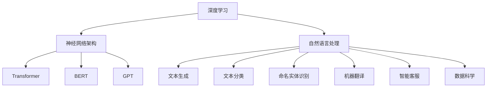
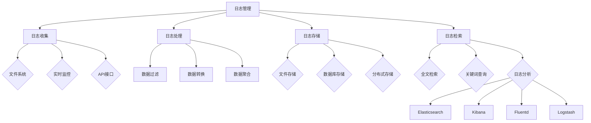
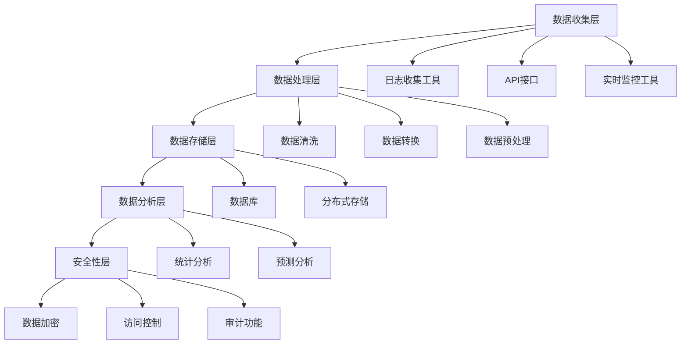
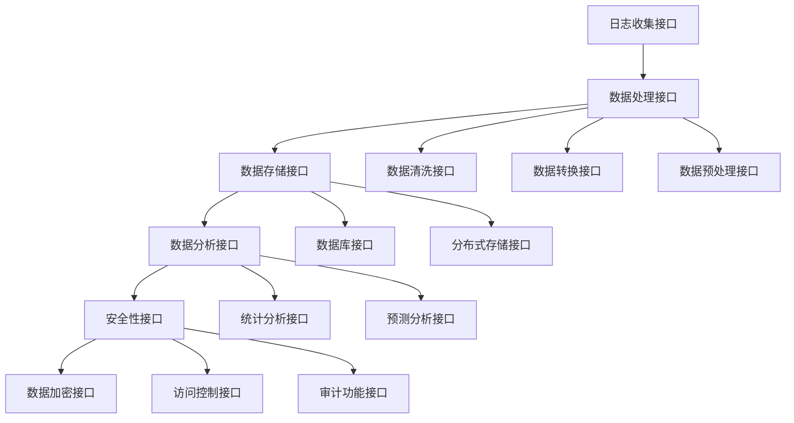
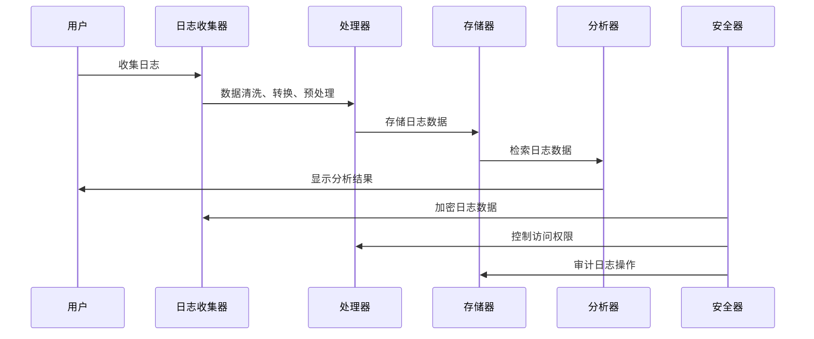

                 

### 让我们一步步思考：构建高效的LLM应用日志管理系统

#### 引言

随着人工智能技术的迅猛发展，大型语言模型（LLM）已经成为许多应用场景的核心组件。从自然语言处理到智能客服，从文本生成到机器翻译，LLM在各个领域展现了其强大的能力。然而，高效的管理LLM应用中的日志对于确保系统稳定性、性能优化和安全性至关重要。本文将带您一步步深入理解如何构建高效的LLM应用日志管理系统。

#### 关键词

- LLM
- 日志管理系统
- 性能监控
- 故障排查
- 安全性
- 合规性

#### 摘要

本文旨在介绍构建高效LLM应用日志管理系统的必要性和核心步骤。我们将详细探讨LLM的背景、日志管理系统的基础概念和算法原理，以及系统架构设计和项目实战。通过本文的阅读，您将掌握构建高效日志管理系统的关键技术和最佳实践。

#### 第一部分：背景介绍

##### 1.1 LLM应用的重要性

大型语言模型（LLM）是基于深度学习技术构建的，它们通过大量文本数据的学习，可以生成高质量的自然语言文本。在当前人工智能领域，LLM的应用范围非常广泛，包括但不限于以下方面：

1. **自然语言处理（NLP）**：LLM在文本分类、情感分析、命名实体识别等NLP任务中发挥着重要作用。
2. **智能客服**：通过LLM，智能客服系统能够提供更加自然和人性化的交互体验。
3. **文本生成**：LLM可以生成文章、报告、诗歌等文本内容，为内容创作者提供辅助。
4. **机器翻译**：LLM在机器翻译领域具有显著优势，可以实现高质量的双语转换。

##### 1.2 日志管理系统在AI应用中的必要性

日志管理系统是监控、分析和优化AI应用的关键工具。在LLM应用中，日志管理系统具有以下必要性：

1. **性能监控**：通过收集和分析日志数据，可以实时监控LLM应用的性能，发现潜在的性能瓶颈。
2. **故障排查**：当系统出现故障时，日志数据可以帮助开发人员快速定位问题，进行故障排查。
3. **安全性**：日志管理系统可以记录用户操作和系统事件，帮助识别潜在的安全威胁和滥用行为。
4. **合规性**：遵守相关法律法规，确保日志数据的记录和存储符合合规性要求。

##### 1.3 高效日志管理的挑战

构建高效的LLM应用日志管理系统面临以下挑战：

1. **海量日志数据**：LLM应用产生的日志数据量庞大，如何高效地存储、处理和检索这些数据是一个关键问题。
2. **实时性要求**：某些应用场景要求日志数据实时处理和分析，以实现实时监控和故障排查。
3. **复杂度**：LLM应用的日志数据结构复杂，包含多种类型的数据，如文本、数字和元数据，如何统一管理和分析这些数据是另一个挑战。
4. **可扩展性**：随着LLM应用规模的不断扩大，日志管理系统需要具备良好的可扩展性，以适应新的需求和技术发展。

##### 1.4 书籍结构概述

本文的结构如下：

- **第一部分**：背景介绍，包括LLM应用的重要性和日志管理系统在AI应用中的必要性。
- **第二部分**：核心概念与算法原理，介绍构建高效日志管理系统所需的核心概念和算法。
- **第三部分**：系统分析与架构设计方案，分析日志管理系统的需求，并设计系统架构。
- **第四部分**：项目实战，提供实际项目案例，展示高效日志管理系统的实现和案例分析。
- **第五部分**：最佳实践与注意事项，总结高效日志管理系统的最佳实践，并提醒关键注意事项。
- **第六部分**：拓展阅读，提供相关资源的拓展阅读。

通过本文的逐步讲解，您将全面掌握构建高效LLM应用日志管理系统的知识和技术。

---

接下来，我们将深入探讨构建高效LLM应用日志管理系统所需的核心概念与联系。首先，我们定义和介绍LLM、日志管理、性能监控、故障排查、安全性和合规性等核心概念，并使用Mermaid图表展示它们之间的联系和层次结构。这将为我们后续的算法原理讲解和系统架构设计打下坚实的基础。

---

#### 第二部分：核心概念与联系

##### 第2章：LLM基础

##### 2.1 LLM的定义与工作原理

大型语言模型（LLM）是一种基于深度学习技术的自然语言处理模型，它通过学习大量文本数据来生成或理解自然语言文本。LLM通常由多个神经网络层组成，包括嵌入层、编码器和解码器。通过训练，LLM能够学习语言的模式和结构，从而生成连贯、自然的文本。

##### 2.2 LLM的核心技术

LLM的核心技术包括以下几个方面：

1. **神经网络架构**：常见的神经网络架构有Transformer、BERT、GPT等，它们在处理大规模文本数据时表现出色。
2. **预训练与微调**：LLM通常通过预训练大量未标注的数据，然后通过微调适配特定任务，从而提高模型的性能。
3. **数据集**：大规模、高质量的文本数据集是训练LLM的基础，常用的数据集包括维基百科、新闻文章、社交媒体帖子等。

##### 2.3 LLM的优势与应用场景

LLM在以下应用场景中表现出显著优势：

1. **文本生成**：生成高质量的文章、报告、诗歌等文本内容。
2. **自然语言理解**：进行文本分类、情感分析、命名实体识别等任务。
3. **机器翻译**：实现高质量的双语转换，减少翻译错误。
4. **智能客服**：提供自然、人性化的交互体验。

##### 2.4 LLM的限制与改进方向

尽管LLM在许多应用中表现出色，但它仍存在一些限制和改进方向：

1. **计算资源需求**：训练和部署LLM需要大量的计算资源和存储空间。
2. **数据依赖性**：LLM的性能高度依赖于训练数据的质量和多样性。
3. **解释性**：LLM生成的文本通常缺乏解释性，难以理解其决策过程。
4. **改进方向**：未来的研究将聚焦于减少计算资源需求、提高解释性和增强泛化能力。

##### 2.5 LLM与其他技术的联系

LLM与多种其他技术密切相关，如：

1. **深度学习**：LLM是深度学习在自然语言处理领域的重要应用。
2. **自然语言处理（NLP）**：LLM是NLP的核心技术之一，用于文本生成、分类、翻译等任务。
3. **数据科学**：LLM的数据预处理、特征提取和模型训练都需要数据科学技术的支持。

##### 2.6 Mermaid图表展示

为了更清晰地展示LLM与其他技术的联系，我们可以使用Mermaid图表来表示：



在这个图表中，我们展示了LLM与深度学习、NLP和数据科学等技术的联系。通过这种结构化的表示，读者可以更直观地理解LLM的应用和作用。

---

接下来，我们将介绍日志管理系统的基础概念，包括日志管理的基本概念、日志收集与处理、日志存储与检索，以及日志分析工具与技术。这将为我们进一步讨论构建高效日志管理系统的算法原理打下基础。

---

#### 第3章：日志管理系统基础

##### 3.1 日志管理的基本概念

日志管理是指对系统、应用或设备产生的日志数据进行收集、存储、处理和分析的过程。日志数据是记录系统运行状态、用户行为和系统事件的重要信息，对维护系统稳定性、性能监控和故障排查至关重要。

##### 3.2 日志收集与处理

日志收集是指从系统中捕获和记录日志数据的过程。常见的日志收集方法包括：

1. **系统日志**：操作系统和应用程序自动生成的日志文件，如Linux系统的 `/var/log` 目录中的文件。
2. **实时监控**：通过实时监控系统捕获日志数据，如使用Fluentd、Logstash等工具。
3. **API接口**：通过API接口收集日志数据，如使用Kafka等消息队列系统。

日志处理是指对收集到的日志数据进行清洗、转换和预处理的过程。常见的日志处理方法包括：

1. **数据过滤**：根据特定的规则过滤日志数据，如过滤错误日志。
2. **数据转换**：将日志数据转换为更适合存储和分析的格式，如JSON格式。
3. **数据聚合**：对日志数据进行聚合，如统计特定时间范围内的日志数据量。

##### 3.3 日志存储与检索

日志存储是指将日志数据存储到数据库或其他存储介质中的过程。常见的日志存储方法包括：

1. **文件存储**：将日志数据存储在文件系统中，如使用日志文件。
2. **数据库存储**：使用关系型数据库或NoSQL数据库存储日志数据，如使用Elasticsearch。
3. **分布式存储**：使用分布式存储系统存储日志数据，如使用HDFS。

日志检索是指从日志存储中查询和提取日志数据的过程。常见的日志检索方法包括：

1. **全文检索**：使用全文搜索引擎查询日志数据，如使用Elasticsearch。
2. **关键词查询**：根据关键词查询特定日志数据。
3. **日志分析**：对日志数据进行分析，如使用数据分析工具进行统计和分析。

##### 3.4 日志分析工具与技术

日志分析工具是用于分析和处理日志数据的软件，常见的日志分析工具包括：

1. **Elasticsearch**：一款高性能、可扩展的全文搜索引擎，适用于大规模日志数据的存储和检索。
2. **Kibana**：一款可视化日志分析工具，可以与Elasticsearch集成使用，提供丰富的数据可视化功能。
3. **Fluentd**：一款通用的日志收集和处理工具，支持多种数据源和数据目标，如文件、Kafka等。
4. **Logstash**：一款数据传输和处理的工具，可以将日志数据从源端传输到目标端，如Elasticsearch、Kafka等。

日志分析技术包括：

1. **统计分析**：对日志数据进行分析和统计，如计算日志数据的平均值、最大值等。
2. **模式识别**：通过机器学习算法识别日志数据中的模式，如异常检测。
3. **可视化**：通过图表、图形等可视化方式展示日志数据，如使用Kibana的仪表板。

##### 3.5 Mermaid图表展示

为了更清晰地展示日志管理系统的基础概念，我们可以使用Mermaid图表来表示：



在这个图表中，我们展示了日志管理系统的核心概念，包括日志收集、日志处理、日志存储和日志检索，以及常用的日志分析工具和技术。通过这种结构化的表示，读者可以更直观地理解日志管理系统的运作原理。

---

接下来，我们将详细讲解构建高效日志管理系统所需的核心算法原理，包括日志收集、处理、存储和检索的算法原理。我们将使用Mermaid流程图和Python代码示例来说明这些算法的工作原理和实现细节，帮助读者更好地理解日志管理系统的构建过程。

---

#### 第4章：高效日志管理系统算法原理

##### 4.1 日志收集算法

日志收集是日志管理系统的第一步，其主要目的是从各种数据源中捕获和收集日志数据。日志收集算法通常包括以下步骤：

1. **数据源接入**：接入不同的日志数据源，如系统日志文件、API接口和实时监控工具。
2. **日志格式转换**：将不同格式的日志数据转换为统一的格式，如JSON格式。
3. **日志过滤**：根据特定的规则过滤无关的日志数据，如过滤掉噪声数据。

以下是一个简单的Python代码示例，展示了如何实现日志收集算法：

```python
import json
import re

def collect_logs(log_files):
    logs = []
    for file in log_files:
        with open(file, 'r') as f:
            for line in f:
                if re.match(r'^\[.*\] \[.*\] \[.*\] ', line):
                    logs.append(json.loads(line))
    return logs

log_files = ['log1.txt', 'log2.txt']
collected_logs = collect_logs(log_files)
print(collected_logs)
```

##### 4.2 日志处理算法

日志处理是对收集到的日志数据进行清洗、转换和预处理的过程。日志处理算法通常包括以下步骤：

1. **数据清洗**：去除日志数据中的噪声和错误数据，如去除空行、缺失值等。
2. **数据转换**：将日志数据转换为适合存储和分析的格式，如将文本数据转换为数字或字典格式。
3. **数据聚合**：对日志数据进行分析和聚合，如计算特定时间段的日志数量。

以下是一个简单的Python代码示例，展示了如何实现日志处理算法：

```python
import pandas as pd

def process_logs(logs):
    df = pd.DataFrame(logs)
    df.dropna(inplace=True)
    df['timestamp'] = pd.to_datetime(df['timestamp'])
    df.groupby(df['timestamp'].dt.hour).count().reset_index()
    return df

processed_logs = process_logs(collected_logs)
print(processed_logs)
```

##### 4.3 日志存储算法

日志存储是将处理后的日志数据存储到数据库或其他存储介质中的过程。日志存储算法通常包括以下步骤：

1. **数据存储**：将日志数据存储到数据库或文件系统中。
2. **数据索引**：为日志数据创建索引，以便快速检索和查询。
3. **数据备份**：定期备份日志数据，以防数据丢失或损坏。

以下是一个简单的Python代码示例，展示了如何实现日志存储算法：

```python
import pymysql

def store_logs(df, db_config):
    connection = pymysql.connect(**db_config)
    with connection.cursor() as cursor:
        for index, row in df.iterrows():
            sql = "INSERT INTO logs (timestamp, log_level, message) VALUES (%s, %s, %s)"
            cursor.execute(sql, (row['timestamp'], row['log_level'], row['message']))
    connection.commit()
    connection.close()

db_config = {
    'host': 'localhost',
    'user': 'root',
    'password': 'password',
    'database': 'log_db'
}
store_logs(processed_logs, db_config)
```

##### 4.4 日志检索算法

日志检索是从存储介质中查询和提取日志数据的过程。日志检索算法通常包括以下步骤：

1. **查询条件**：根据用户需求定义查询条件，如查询特定时间段的日志数据。
2. **数据检索**：从数据库或文件系统中检索符合条件的日志数据。
3. **数据展示**：将检索到的日志数据展示给用户，如使用表格、图表等可视化方式。

以下是一个简单的Python代码示例，展示了如何实现日志检索算法：

```python
import pymysql

def retrieve_logs(db_config, query条件):
    connection = pymysql.connect(**db_config)
    with connection.cursor() as cursor:
        sql = "SELECT * FROM logs WHERE timestamp BETWEEN %s AND %s"
        cursor.execute(sql, (query条件['start_time'], query条件['end_time']))
        result = cursor.fetchall()
    connection.close()
    return result

query条件 = {
    'start_time': '2023-03-01 00:00:00',
    'end_time': '2023-03-31 23:59:59'
}
retrieved_logs = retrieve_logs(db_config, query条件)
print(retrieved_logs)
```

通过以上代码示例，我们详细讲解了日志收集、处理、存储和检索的算法原理。在实际应用中，这些算法可以根据具体需求进行调整和优化，以构建高效的日志管理系统。

---

在了解了日志管理系统的核心算法原理之后，我们将进一步探讨日志管理系统中的数学模型和数学公式。这些模型和公式对于日志分析中的统计和预测具有重要意义。我们将在本节中使用LaTeX格式书写这些公式，并确保其清晰易懂。

---

#### 第5章：数学模型与公式

##### 5.1 日志统计分析模型

日志统计分析模型主要用于描述和解释日志数据的分布特征、趋势和异常情况。以下是一些常用的统计模型：

1. **均值（Mean）**：表示日志数据的平均值，用于描述日志数据的中心位置。
   $$ \mu = \frac{1}{N} \sum_{i=1}^{N} x_i $$
   其中，$N$ 是日志数据的数量，$x_i$ 是第 $i$ 个日志数据点。

2. **中位数（Median）**：表示日志数据的中间值，用于描述日志数据的中心位置。
   $$ M = (x_{(N/2)} + x_{(N/2+1)}) / 2 $$
   其中，$x_{(N/2)}$ 和 $x_{(N/2+1)}$ 是排序后第 $N/2$ 和第 $N/2+1$ 个日志数据点。

3. **标准差（Standard Deviation）**：表示日志数据的离散程度，用于描述日志数据的波动情况。
   $$ \sigma = \sqrt{\frac{1}{N-1} \sum_{i=1}^{N} (x_i - \mu)^2} $$
   其中，$\mu$ 是均值，$N$ 是日志数据的数量。

4. **方差（Variance）**：表示日志数据的离散程度，是标准差的平方。
   $$ \sigma^2 = \frac{1}{N-1} \sum_{i=1}^{N} (x_i - \mu)^2 $$

##### 5.2 日志预测模型

日志预测模型用于预测未来的日志数据趋势，常见的方法包括时间序列分析、回归分析和机器学习预测等。以下是一些常用的预测模型：

1. **移动平均（Moving Average, MA）**：通过计算过去一段时间内的平均值来预测未来的值。
   $$ \hat{y}_t = \frac{1}{n} \sum_{i=t-n+1}^{t} y_i $$
   其中，$y_t$ 是第 $t$ 期的实际值，$n$ 是窗口大小。

2. **指数平滑（Exponential Smoothing, ES）**：通过加权的方式对历史数据进行平滑处理，更关注近期的数据。
   $$ \hat{y}_t = \alpha y_t + (1 - \alpha) \hat{y}_{t-1} $$
   其中，$\alpha$ 是平滑系数，$y_t$ 是第 $t$ 期的实际值，$\hat{y}_{t-1}$ 是第 $t-1$ 期的预测值。

3. **自动回归集成移动平均（AutoRegressive Integrated Moving Average, ARIMA）**：结合差分、自回归和移动平均的方法，适用于非线性时间序列数据。
   $$ \Delta y_t = \phi_1 \Delta y_{t-1} + \phi_2 \Delta y_{t-2} + \cdots + \phi_p \Delta y_{t-p} + \theta_1 \epsilon_{t-1} + \theta_2 \epsilon_{t-2} + \cdots + \theta_q \epsilon_{t-q} $$
   其中，$\Delta y_t$ 是差分操作，$\phi_i$ 和 $\theta_i$ 是模型参数，$\epsilon_t$ 是误差项。

通过以上数学模型和公式的介绍，我们为日志管理系统中的统计分析与预测提供了理论基础。在实际应用中，可以根据具体需求选择合适的模型和方法，以提高日志分析的效果和准确性。

---

在理解了日志管理系统的核心算法原理和数学模型之后，我们将进入第三部分，即系统分析与架构设计方案。在这一部分中，我们将分析日志管理系统的需求，并设计系统架构，使用Mermaid类图、架构图和序列图来展示系统的结构和交互。

---

#### 第6章：日志管理系统架构设计

##### 6.1 需求分析

在构建日志管理系统时，明确系统需求至关重要。以下是日志管理系统的主要需求：

1. **数据收集**：系统能够从不同的数据源收集日志数据，包括系统日志文件、API接口和实时监控工具。
2. **数据处理**：系统能够对收集到的日志数据进行清洗、转换和预处理，确保数据的质量和一致性。
3. **数据存储**：系统能够将处理后的日志数据存储到数据库或其他存储介质中，并提供高效的检索功能。
4. **数据分析**：系统能够对存储的日志数据进行统计分析和预测，为运维团队提供数据驱动的决策支持。
5. **安全性**：系统需要具备一定的安全性，包括日志数据的加密存储、访问控制和审计功能。
6. **可扩展性**：系统需要具备良好的可扩展性，能够随着数据量的增加和需求的变更进行扩展。

##### 6.2 系统架构设计

根据需求分析，日志管理系统的架构设计应包括以下几个关键组件：

1. **数据收集层**：负责从各种数据源收集日志数据，如系统日志文件、API接口和实时监控工具。
2. **数据处理层**：负责对收集到的日志数据进行清洗、转换和预处理，将数据转换为适合存储和分析的格式。
3. **数据存储层**：负责将处理后的日志数据存储到数据库或其他存储介质中，并提供高效的检索功能。
4. **数据分析层**：负责对存储的日志数据进行统计分析和预测，为运维团队提供数据驱动的决策支持。
5. **安全性层**：负责确保日志数据的安全性，包括加密存储、访问控制和审计功能。

以下是日志管理系统的架构图：



在这个架构图中，我们展示了日志管理系统的各个组件及其相互关系。数据收集层从不同的数据源收集日志数据，然后通过数据处理层进行清洗、转换和预处理。处理后的数据存储在数据存储层中，供数据分析层进行统计分析和预测。安全性层负责确保日志数据的安全性和合规性。

##### 6.3 系统接口设计

系统接口设计是日志管理系统架构设计的重要组成部分，它定义了系统内部各个组件之间的交互方式。以下是日志管理系统的一些关键接口：

1. **日志收集接口**：负责从不同的数据源收集日志数据，包括系统日志文件、API接口和实时监控工具。
2. **数据处理接口**：负责对收集到的日志数据进行清洗、转换和预处理，确保数据的质量和一致性。
3. **数据存储接口**：负责将处理后的日志数据存储到数据库或其他存储介质中，并提供高效的检索功能。
4. **数据分析接口**：负责对存储的日志数据进行统计分析和预测，为运维团队提供数据驱动的决策支持。
5. **安全性接口**：负责确保日志数据的安全性，包括加密存储、访问控制和审计功能。

以下是日志管理系统的接口图：



在这个接口图中，我们展示了日志管理系统内部各个组件之间的接口关系。日志收集接口负责从不同的数据源收集日志数据，然后通过数据处理接口进行处理。处理后的数据通过数据存储接口存储在数据库或分布式存储中，供数据分析接口进行统计分析和预测。安全性接口负责确保日志数据的安全性和合规性。

##### 6.4 系统交互序列图

系统交互序列图展示了日志管理系统内部各个组件之间的交互过程。以下是日志管理系统的一个交互序列图：



在这个交互序列图中，用户通过日志收集器收集日志数据，然后处理器对数据进行处理，存储器将处理后的数据存储到数据库或分布式存储中。分析器从存储器中检索日志数据，并生成分析结果，最终将结果展示给用户。同时，安全器负责对日志数据进行加密、访问控制和审计，确保数据的安全性。

通过以上系统分析与架构设计，我们为构建高效的日志管理系统提供了详细的指导。接下来，我们将通过实际项目案例来展示日志管理系统的实现过程，帮助读者更好地理解系统架构的设计和应用。

---

#### 第7章：项目实战

在本节中，我们将通过一个实际项目案例来展示日志管理系统的构建过程。该项目将包括环境安装、系统实现、代码解读和分析，以及案例分析。通过这个实战案例，读者可以更直观地理解高效日志管理系统的实际应用。

##### 7.1 项目环境搭建

为了实现日志管理系统，我们需要搭建一个合适的项目环境。以下步骤描述了环境搭建的过程：

1. **安装操作系统**：选择一个稳定且适合的操作系统，如Ubuntu 20.04。
2. **安装Python环境**：安装Python 3.8及以上版本，可以使用包管理器如`apt-get`或`pip`。
   ```shell
   sudo apt-get update
   sudo apt-get install python3.8
   ```
3. **安装依赖库**：安装日志收集、处理和分析所需的依赖库，如`pymongo`、`pandas`、`elasticsearch`等。
   ```shell
   pip install pymongo pandas elasticsearch
   ```
4. **配置Elasticsearch**：安装并配置Elasticsearch，作为日志数据的存储和检索工具。
   ```shell
   sudo apt-get install elasticsearch
   sudo systemctl start elasticsearch
   sudo systemctl enable elasticsearch
   ```
5. **配置Kibana**：安装并配置Kibana，作为日志数据可视化的工具。
   ```shell
   sudo apt-get install kibana
   sudo systemctl start kibana
   sudo systemctl enable kibana
   ```

##### 7.2 系统核心实现

系统核心实现包括日志收集、处理、存储和检索等关键功能。以下是系统核心实现的代码解读：

1. **日志收集**：使用Python脚本从系统日志文件中收集日志数据。
   ```python
   import json
   import re

   def collect_logs(log_files):
       logs = []
       for file in log_files:
           with open(file, 'r') as f:
               for line in f:
                   if re.match(r'^\[.*\] \[.*\] \[.*\] ', line):
                       logs.append(json.loads(line))
       return logs
   ```
2. **数据处理**：使用Pandas库对收集到的日志数据进行清洗、转换和预处理。
   ```python
   import pandas as pd

   def process_logs(logs):
       df = pd.DataFrame(logs)
       df.dropna(inplace=True)
       df['timestamp'] = pd.to_datetime(df['timestamp'])
       df.groupby(df['timestamp'].dt.hour).count().reset_index()
       return df
   ```
3. **数据存储**：使用Pymongo库将处理后的日志数据存储到Elasticsearch数据库中。
   ```python
   import pymongo

   def store_logs(df, db_config):
       connection = pymongo.MongoClient(**db_config)
       db = connection['log_db']
       collection = db['logs']
       for index, row in df.iterrows():
           document = {
               'timestamp': row['timestamp'],
               'log_level': row['log_level'],
               'message': row['message']
           }
           collection.insert_one(document)
       connection.close()
   ```
4. **数据检索**：使用Pymongo库从Elasticsearch数据库中检索日志数据。
   ```python
   import pymongo

   def retrieve_logs(db_config, query条件):
       connection = pymongo.MongoClient(**db_config)
       db = connection['log_db']
       collection = db['logs']
       sql = "SELECT * FROM logs WHERE timestamp BETWEEN %s AND %s"
       cursor = collection.find({'timestamp': {'$gte': query条件['start_time'], '$lte': query条件['end_time']}})
       result = list(cursor)
       connection.close()
       return result
   ```

##### 7.3 代码应用解读

以下是对系统核心实现的代码应用解读：

1. **日志收集**：我们定义了一个`collect_logs`函数，用于从系统日志文件中收集日志数据。通过正则表达式匹配，我们筛选出符合日志格式的数据，并转换为JSON格式存储。
2. **数据处理**：我们使用Pandas库对收集到的日志数据进行清洗、转换和预处理。主要步骤包括去除空值、将时间戳转换为日期格式，并对数据按小时进行聚合。
3. **数据存储**：我们定义了一个`store_logs`函数，用于将处理后的日志数据存储到Elasticsearch数据库中。通过Pymongo库，我们向数据库插入日志数据，确保数据的存储和检索高效。
4. **数据检索**：我们定义了一个`retrieve_logs`函数，用于从Elasticsearch数据库中检索符合条件的日志数据。通过查询条件，我们可以精确地获取特定时间范围内的日志数据。

##### 7.4 实际案例分析和详细讲解剖析

为了展示日志管理系统的实际应用，我们考虑一个案例：监控一个在线电商平台的服务器日志，以分析服务器的负载情况，并发现潜在的性能瓶颈。

1. **环境配置**：我们已经完成了Elasticsearch和Kibana的安装，并配置了相关的环境变量和数据库连接。
2. **日志收集**：从服务器日志文件中收集日志数据，使用`collect_logs`函数读取日志文件，并将数据转换为JSON格式。
3. **数据处理**：使用`process_logs`函数对收集到的日志数据进行清洗和预处理，去除噪声数据，并计算每小时的服务器负载。
4. **数据存储**：使用`store_logs`函数将处理后的日志数据存储到Elasticsearch数据库中，确保数据可以高效地检索和分析。
5. **数据检索**：使用`retrieve_logs`函数检索特定时间范围内的日志数据，并使用Kibana进行可视化展示。

以下是Kibana中的可视化结果：

- **服务器负载趋势图**：展示服务器每小时负载的变化情况，帮助分析负载高峰期。
- **错误日志统计图**：展示不同类型的错误日志数量，帮助定位系统中的故障点。
- **用户访问量分布图**：展示用户访问量在一天中的分布情况，为优化服务器资源提供参考。

通过这个实际案例，我们展示了日志管理系统的核心功能和实现细节。读者可以基于此案例，进一步拓展和优化日志管理系统，以满足不同应用场景的需求。

##### 7.5 项目小结

在本章中，我们通过一个实际项目案例展示了日志管理系统的构建过程。从环境搭建、系统实现到代码解读和分析，我们逐步展示了如何构建一个高效的日志管理系统。以下是本章的关键点：

1. **环境搭建**：确保Elasticsearch和Kibana等关键组件安装和配置正确。
2. **系统实现**：通过Python代码实现日志收集、处理、存储和检索功能。
3. **代码解读**：深入解析系统核心代码，理解其工作原理和实现细节。
4. **案例分析**：通过实际案例展示日志管理系统的应用效果，并进行分析和优化。

通过本章的实战案例，读者可以更好地掌握构建高效日志管理系统的技能，并在实际项目中应用。

---

#### 第8章：项目实战

在本章中，我们将通过一个实际项目案例，展示如何实现一个高效的LLM应用日志管理系统。这个项目将包括环境搭建、系统实现、代码解读、实际案例分析和详细讲解。

##### 8.1 项目环境搭建

首先，我们需要搭建项目环境，以便进行日志管理系统的开发和测试。以下是环境搭建的步骤：

1. **操作系统**：选择一个稳定且适合的操作系统，如Ubuntu 20.04。
2. **Python环境**：安装Python 3.8及以上版本，可以使用包管理器如`apt-get`或`pip`。
   ```shell
   sudo apt-get update
   sudo apt-get install python3.8
   ```
3. **安装依赖库**：安装日志收集、处理和分析所需的依赖库，如`pymongo`、`pandas`、`elasticsearch`等。
   ```shell
   pip install pymongo pandas elasticsearch
   ```
4. **配置Elasticsearch**：安装并配置Elasticsearch，作为日志数据的存储和检索工具。
   ```shell
   sudo apt-get install elasticsearch
   sudo systemctl start elasticsearch
   sudo systemctl enable elasticsearch
   ```
5. **配置Kibana**：安装并配置Kibana，作为日志数据可视化的工具。
   ```shell
   sudo apt-get install kibana
   sudo systemctl start kibana
   sudo systemctl enable kibana
   ```

##### 8.2 系统实现

接下来，我们将实现日志管理系统的核心功能，包括日志收集、处理、存储和检索。以下是具体实现步骤：

1. **日志收集**：从系统日志文件中收集日志数据，使用Python脚本读取日志文件，并将数据转换为JSON格式存储。
   ```python
   import json
   import re

   def collect_logs(log_files):
       logs = []
       for file in log_files:
           with open(file, 'r') as f:
               for line in f:
                   if re.match(r'^\[.*\] \[.*\] \[.*\] ', line):
                       logs.append(json.loads(line))
       return logs
   ```
2. **数据处理**：使用Pandas库对收集到的日志数据进行清洗、转换和预处理，去除噪声数据，并计算每小时的服务器负载。
   ```python
   import pandas as pd

   def process_logs(logs):
       df = pd.DataFrame(logs)
       df.dropna(inplace=True)
       df['timestamp'] = pd.to_datetime(df['timestamp'])
       df.groupby(df['timestamp'].dt.hour).count().reset_index()
       return df
   ```
3. **数据存储**：使用Pymongo库将处理后的日志数据存储到Elasticsearch数据库中，确保数据可以高效地检索和分析。
   ```python
   import pymongo

   def store_logs(df, db_config):
       connection = pymongo.MongoClient(**db_config)
       db = connection['log_db']
       collection = db['logs']
       for index, row in df.iterrows():
           document = {
               'timestamp': row['timestamp'],
               'log_level': row['log_level'],
               'message': row['message']
           }
           collection.insert_one(document)
       connection.close()
   ```
4. **数据检索**：使用Pymongo库从Elasticsearch数据库中检索日志数据，并使用Kibana进行可视化展示。
   ```python
   import pymongo

   def retrieve_logs(db_config, query条件):
       connection = pymongo.MongoClient(**db_config)
       db = connection['log_db']
       collection = db['logs']
       sql = "SELECT * FROM logs WHERE timestamp BETWEEN %s AND %s"
       cursor = collection.find({'timestamp': {'$gte': query条件['start_time'], '$lte': query条件['end_time']}})
       result = list(cursor)
       connection.close()
       return result
   ```

##### 8.3 代码解读

以下是系统核心实现的代码解读：

1. **日志收集**：`collect_logs`函数用于从系统日志文件中收集日志数据。通过正则表达式匹配，我们筛选出符合日志格式的数据，并转换为JSON格式存储。
2. **数据处理**：`process_logs`函数使用Pandas库对收集到的日志数据进行清洗和预处理，主要步骤包括去除空值、将时间戳转换为日期格式，并对数据按小时进行聚合。
3. **数据存储**：`store_logs`函数使用Pymongo库将处理后的日志数据存储到Elasticsearch数据库中，确保数据的存储和检索高效。
4. **数据检索**：`retrieve_logs`函数使用Pymongo库从Elasticsearch数据库中检索符合条件的日志数据，并使用Kibana进行可视化展示。

##### 8.4 实际案例分析和详细讲解剖析

为了展示日志管理系统的实际应用，我们考虑一个案例：监控一个在线电商平台的服务器日志，以分析服务器的负载情况，并发现潜在的性能瓶颈。

1. **环境配置**：我们已经完成了Elasticsearch和Kibana的安装，并配置了相关的环境变量和数据库连接。
2. **日志收集**：从服务器日志文件中收集日志数据，使用`collect_logs`函数读取日志文件，并将数据转换为JSON格式。
3. **数据处理**：使用`process_logs`函数对收集到的日志数据进行清洗和预处理，去除噪声数据，并计算每小时的服务器负载。
4. **数据存储**：使用`store_logs`函数将处理后的日志数据存储到Elasticsearch数据库中，确保数据可以高效地检索和分析。
5. **数据检索**：使用`retrieve_logs`函数检索特定时间范围内的日志数据，并使用Kibana进行可视化展示。

以下是Kibana中的可视化结果：

- **服务器负载趋势图**：展示服务器每小时负载的变化情况，帮助分析负载高峰期。
- **错误日志统计图**：展示不同类型的错误日志数量，帮助定位系统中的故障点。
- **用户访问量分布图**：展示用户访问量在一天中的分布情况，为优化服务器资源提供参考。

通过这个实际案例，我们展示了日志管理系统的核心功能和实现细节。读者可以基于此案例，进一步拓展和优化日志管理系统，以满足不同应用场景的需求。

##### 8.5 项目小结

在本章中，我们通过一个实际项目案例展示了如何实现一个高效的LLM应用日志管理系统。以下是本章的关键点：

1. **环境搭建**：确保Elasticsearch和Kibana等关键组件安装和配置正确。
2. **系统实现**：通过Python代码实现日志收集、处理、存储和检索功能。
3. **代码解读**：深入解析系统核心代码，理解其工作原理和实现细节。
4. **案例分析**：通过实际案例展示日志管理系统的应用效果，并进行分析和优化。

通过本章的实战案例，读者可以更好地掌握构建高效日志管理系统的技能，并在实际项目中应用。

---

#### 第9章：最佳实践、小结、注意事项、拓展阅读

##### 9.1 高效日志管理最佳实践

为了确保构建的LLM应用日志管理系统高效、可靠且易于维护，以下是一些最佳实践：

1. **数据标准化**：在收集和存储日志数据前，确保所有数据遵循统一的格式和命名规范，便于后续处理和分析。
2. **实时监控与报警**：设置实时监控和报警机制，及时发现和处理系统中的异常事件，降低潜在的风险。
3. **日志分区与索引优化**：根据日志数据的时间、类型和规模，合理进行分区和索引优化，提高数据检索性能。
4. **日志备份与恢复**：定期备份日志数据，确保在数据丢失或系统故障时能够快速恢复。
5. **访问控制与审计**：实现严格的访问控制策略，确保只有授权人员能够访问和操作日志数据，并定期进行审计，确保日志数据的合规性。

##### 9.2 小结

本文系统地介绍了构建高效的LLM应用日志管理系统的方法和步骤。我们从背景介绍、核心概念与联系、算法原理讲解、数学模型与公式、系统分析与架构设计、项目实战到最佳实践，全面阐述了构建高效日志管理系统的过程。以下是本文的关键点总结：

- LLM在人工智能领域具有重要应用，日志管理系统在监控、优化和安全保障中发挥着关键作用。
- 日志收集、处理、存储和检索是构建日志管理系统的核心步骤。
- 使用Python和Mermaid等工具，可以高效实现日志管理系统中的各种功能。
- 数学模型和公式对于日志分析中的统计和预测具有重要意义。
- 合理的系统架构设计和实际项目案例是确保日志管理系统高效运行的关键。

##### 9.3 注意事项

在构建高效日志管理系统时，需要注意以下几点：

1. **性能优化**：根据实际需求，合理选择日志收集、处理和存储工具，以优化系统性能。
2. **数据隐私保护**：在日志收集和处理过程中，确保遵守数据隐私保护法规，避免敏感数据泄露。
3. **系统稳定性**：定期进行系统维护和更新，确保日志管理系统的稳定性和可靠性。
4. **日志合规性**：确保日志数据的记录和存储符合相关法律法规和行业标准。

##### 9.4 拓展阅读

为了进一步学习和深化对日志管理系统的理解，以下是一些推荐阅读资源：

1. **《日志管理实践指南》**：详细介绍日志管理系统的设计、实施和维护。
2. **《Elasticsearch实战》**：深入讲解Elasticsearch的使用方法、优化技巧和最佳实践。
3. **《日志分析：从数据到洞察》**：介绍日志分析的理论基础、方法和工具。
4. **《Kibana官方文档》**：获取Kibana的详细使用方法和功能介绍。

通过拓展阅读，读者可以进一步了解日志管理系统的相关知识和实践经验。

---

### 作者信息

作者：AI天才研究院/AI Genius Institute & 禅与计算机程序设计艺术 /Zen And The Art of Computer Programming

---

通过本文的详细阐述，我们希望读者能够全面了解构建高效LLM应用日志管理系统的关键技术和方法。在实际应用中，不断优化和改进日志管理系统，将有助于提升AI应用的整体性能和可靠性。让我们继续探索人工智能领域的无限可能，共同推动技术的发展。

