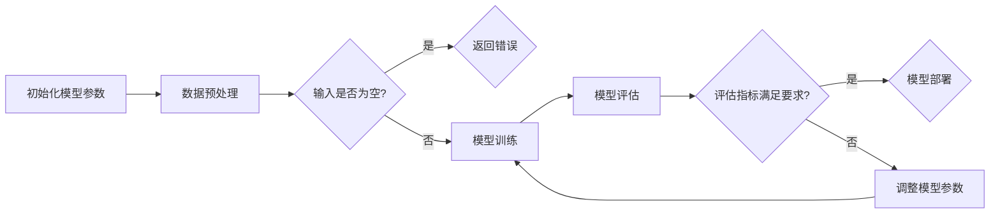
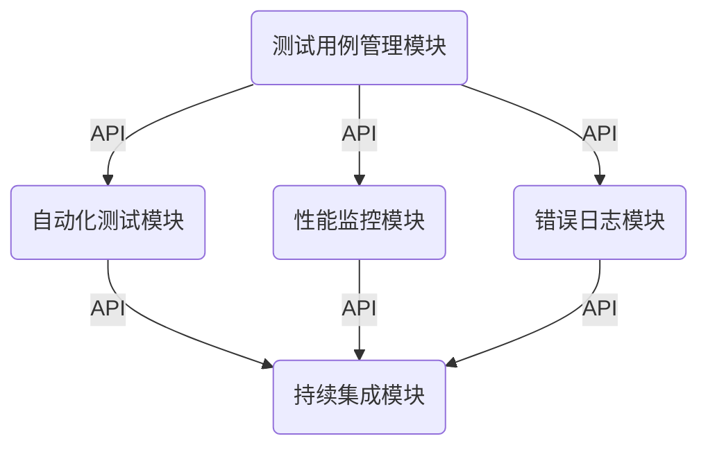
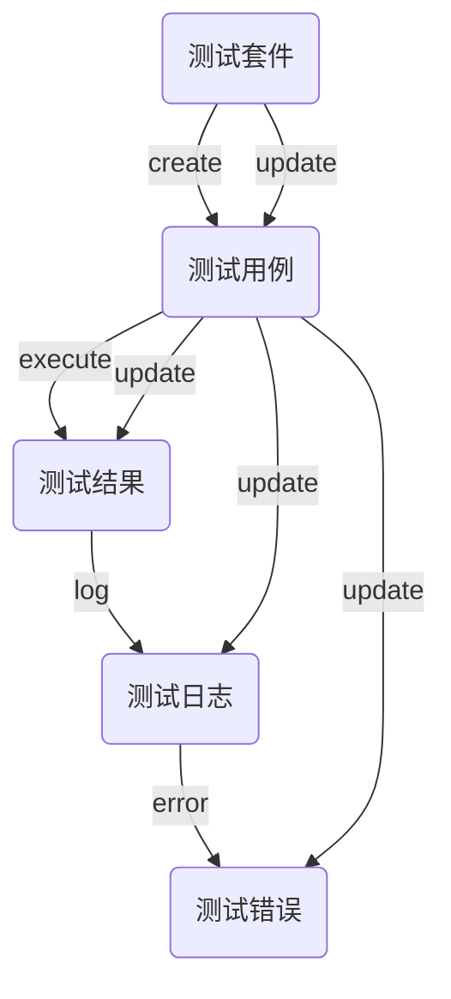
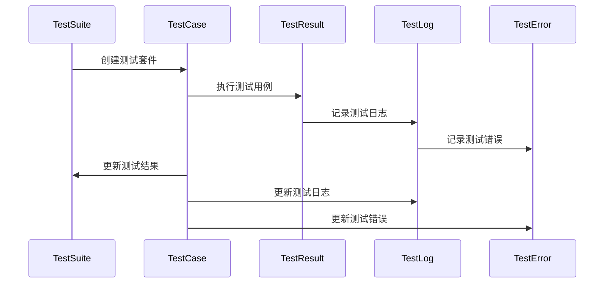

                 

### 核心概念与联系

#### LLM定义与特点

**1.1 LLM定义**

自然语言处理（Natural Language Processing, NLP）是人工智能领域的一个子领域，旨在使计算机理解和处理人类语言。大型语言模型（Large Language Model, LLM）是一种基于深度学习的自然语言处理模型，其核心思想是通过大量文本数据的学习，使模型具备理解和生成自然语言的能力。

**1.2 LLM特点**

- **数据驱动的学习方式**：LLM通过从大规模的文本数据集中学习，提取语言模式和知识。
- **强大的语言生成能力**：LLM可以生成连贯、自然的文本，包括问答、翻译、摘要等多种形式。
- **跨领域的适应性**：LLM的学习过程使其能够适应不同领域的文本，具有较强的泛化能力。
- **可扩展性**：LLM可以轻松地集成到各种应用程序中，实现个性化的服务。

#### 测试框架原理

**2.1 测试框架的基本原理**

LLM应用测试框架旨在全面评估LLM在各种应用场景下的性能和稳定性。测试框架通常包括以下基本原理：

- **测试用例设计**：根据不同应用场景设计合适的测试用例，涵盖LLM的功能、性能、稳定性等多个方面。
- **自动化测试**：通过自动化工具执行测试用例，提高测试效率，降低人力成本。
- **持续集成和持续交付**（CI/CD）：将测试集成到开发流程中，实现持续集成和持续交付，确保模型在各个阶段的质量。
- **性能监控和反馈**：实时监控LLM的运行状态，收集性能数据，根据反馈调整模型和测试策略。

**2.2 测试流程概述**

一个典型的LLM应用测试流程通常包括以下步骤：

1. **需求分析**：明确测试目标，确定测试范围和标准。
2. **测试用例设计**：根据需求分析结果，设计功能测试用例、性能测试用例等。
3. **测试执行**：执行测试用例，记录测试结果。
4. **结果分析**：对测试结果进行分析，找出模型存在的问题。
5. **反馈与调整**：根据分析结果，调整模型参数或测试策略。

**2.3 测试指标分析**

测试指标是评估LLM应用性能的关键参数，常见的测试指标包括：

- **准确率（Accuracy）**：分类模型预测正确的样本数占总样本数的比例。
- **召回率（Recall）**：分类模型预测正确的正样本数占总正样本数的比例。
- **F1分数（F1 Score）**：准确率和召回率的调和平均数。
- **响应时间（Response Time）**：模型生成结果的耗时。
- **吞吐量（Throughput）**：单位时间内模型处理的请求量。
- **错误率（Error Rate）**：模型生成错误结果的样本数占总样本数的比例。

### 核心概念属性特征对比表格

| 测试指标        | 描述                 | 类型    | 对比特征 |
| --------------- | -------------------- | ------- | -------- |
| 准确率          | 预测正确的样本比例    | 效率指标 | 高值表示好 |
| 召回率          | 预测正确的正样本比例  | 效率指标 | 高值表示好 |
| F1分数          | 准确率和召回率的调和平均 | 效率指标 | 高值表示好 |
| 响应时间        | 生成结果耗时         | 性能指标 | 低值表示好 |
| 吞吐量          | 单位时间内处理的请求量 | 性能指标 | 高值表示好 |
| 错误率          | 生成错误结果的样本比例 | 性能指标 | 低值表示好 |

### ER实体关系图架构

**3.1 ER图**

一个典型的LLM应用测试框架的ER图如下所示：

```mermaid
erDiagram
  TestSuite ||--|{ TestCase } : 测试用例集合
  TestCase ||--|{ TestResult } : 测试结果
  TestResult ||--|{ TestLog } : 测试日志
  TestLog ||--|{ TestError } : 测试错误
```

- **TestSuite（测试套件）**：包含一系列的测试用例。
- **TestCase（测试用例）**：用于验证LLM应用的具体功能。
- **TestResult（测试结果）**：记录测试执行后的结果。
- **TestLog（测试日志）**：记录测试过程中的详细信息。
- **TestError（测试错误）**：记录测试过程中出现的错误。

通过上述核心概念与联系的分析，我们为构建高效的LLM应用测试框架奠定了理论基础。接下来，我们将深入探讨LLM的算法原理，帮助读者理解测试框架如何应用于LLM的具体实现。接下来，我们将深入探讨LLM的算法原理，帮助读者理解测试框架如何应用于LLM的具体实现。

### 算法原理讲解

#### 3.1 算法Mermaid流程图

为了更好地理解LLM的算法原理，我们首先使用Mermaid绘制了算法的流程图。以下是一个简化的LLM算法流程：



#### 3.2 Python源代码详述

接下来，我们将通过Python源代码详细阐述LLM算法的实现。以下是一个简化的Python实现示例：

```python
import torch
import torch.nn as nn
import torch.optim as optim

# 模型初始化
class LLM(nn.Module):
    def __init__(self, vocab_size, embedding_dim, hidden_dim, num_layers):
        super(LLM, self).__init__()
        self.embedding = nn.Embedding(vocab_size, embedding_dim)
        self.lstm = nn.LSTM(embedding_dim, hidden_dim, num_layers)
        self.fc = nn.Linear(hidden_dim, vocab_size)
    
    def forward(self, x, hidden):
        embedded = self.embedding(x)
        output, hidden = self.lstm(embedded, hidden)
        logits = self.fc(output)
        return logits, hidden

# 数据预处理
def preprocess_data(text):
    # ... 处理文本数据
    return processed_text

# 模型训练
def train_model(model, data_loader, loss_function, optimizer, num_epochs):
    model.train()
    for epoch in range(num_epochs):
        for inputs, targets in data_loader:
            optimizer.zero_grad()
            inputs = preprocess_data(inputs)
            hidden = (torch.zeros(1, 1, model.hidden_dim), torch.zeros(1, 1, model.hidden_dim))
            logits, hidden = model(inputs, hidden)
            loss = loss_function(logits.view(-1, logits.size(2)), targets)
            loss.backward()
            optimizer.step()
        print(f"Epoch [{epoch+1}/{num_epochs}], Loss: {loss.item():.4f}")

# 模型评估
def evaluate_model(model, data_loader, loss_function):
    model.eval()
    total_loss = 0
    with torch.no_grad():
        for inputs, targets in data_loader:
            inputs = preprocess_data(inputs)
            hidden = (torch.zeros(1, 1, model.hidden_dim), torch.zeros(1, 1, model.hidden_dim))
            logits, hidden = model(inputs, hidden)
            total_loss += loss_function(logits.view(-1, logits.size(2)), targets).item()
    avg_loss = total_loss / len(data_loader)
    return avg_loss

# 主函数
def main():
    # 参数设置
    vocab_size = 10000
    embedding_dim = 256
    hidden_dim = 512
    num_layers = 2
    num_epochs = 10

    # 初始化模型
    model = LLM(vocab_size, embedding_dim, hidden_dim, num_layers)

    # 训练模型
    optimizer = optim.Adam(model.parameters(), lr=0.001)
    train_data_loader = ... # 数据加载器
    train_model(model, train_data_loader, nn.CrossEntropyLoss(), optimizer, num_epochs)

    # 评估模型
    test_data_loader = ... # 数据加载器
    avg_loss = evaluate_model(model, test_data_loader, nn.CrossEntropyLoss())
    print(f"Test Loss: {avg_loss:.4f}")

if __name__ == "__main__":
    main()
```

上述代码简要实现了LLM的初始化、数据预处理、模型训练和模型评估等功能。接下来，我们将对算法原理进行详细讲解。

#### 3.3 数学模型与公式详细讲解

在深度学习模型中，算法原理通常基于一系列数学模型和公式。以下是LLM算法的核心数学模型和公式：

**1. 嵌入层（Embedding Layer）**

嵌入层是一个线性映射，将词汇表中的单词映射到高维空间中的一个向量。其数学公式为：

\[ \text{output}_{\text{embed}} = \text{embedding\_weight} \cdot \text{input} \]

其中，\( \text{input} \) 是词汇表的索引，\( \text{embedding\_weight} \) 是嵌入矩阵。

**2. 长短时记忆网络（LSTM）**

LSTM是一种特殊的循环神经网络（RNN），用于处理序列数据。其数学模型包括以下三个关键方程：

\[ \text{gate} = \sigma(\text{W}_{\text{gate}} \cdot [\text{h}_{\text{t-1}}, \text{x}_{\text{t}}] + \text{b}_{\text{gate}}) \]
\[ \text{input\_gate} = \sigma(\text{W}_{\text{input}} \cdot [\text{h}_{\text{t-1}}, \text{x}_{\text{t}}] + \text{b}_{\text{input}}) \]
\[ \text{forget\_gate} = \sigma(\text{W}_{\text{forget}} \cdot [\text{h}_{\text{t-1}}, \text{x}_{\text{t}}] + \text{b}_{\text{forget}}) \]

其中，\( \text{gate} \) 是门控函数，\( \sigma \) 是Sigmoid函数，\( \text{W}_{\text{gate}} \) 和 \( \text{b}_{\text{gate}} \) 是权重和偏置。

**3. 全连接层（Fully Connected Layer）**

全连接层用于将LSTM的输出映射到输出词汇表。其数学公式为：

\[ \text{output}_{\text{fc}} = \text{W}_{\text{fc}} \cdot \text{h}_{\text{t}} + \text{b}_{\text{fc}} \]

其中，\( \text{W}_{\text{fc}} \) 和 \( \text{b}_{\text{fc}} \) 是权重和偏置。

**4. 损失函数（Loss Function）**

常见的损失函数包括交叉熵损失（CrossEntropyLoss）和均方误差（Mean Squared Error）。以下为交叉熵损失函数的数学公式：

\[ \text{loss} = -\frac{1}{N} \sum_{i=1}^{N} \sum_{j=1}^{M} y_{ij} \log(p_{ij}) \]

其中，\( N \) 是样本数量，\( M \) 是输出维度，\( y_{ij} \) 是第 \( i \) 个样本的第 \( j \) 个标签，\( p_{ij} \) 是模型预测的概率。

通过上述数学模型和公式的详细讲解，我们了解了LLM算法的基本原理。接下来，我们将通过具体的例子来说明这些原理在实际应用中的表现。

#### 3.4 举例说明

为了更好地理解LLM算法在实际应用中的表现，我们通过一个简单的例子来说明。假设我们有一个简单的文本序列：

```
"I am a robot. I can talk and understand natural language."
```

我们将这段文本输入到LLM模型中，并观察其预测结果。

**1. 数据预处理**

首先，我们对输入文本进行预处理，包括分词、标记化等操作。假设我们已经预处理得到一个序列：

```
["I", "am", "a", "robot", ".", "I", "can", "talk", "and", "understand", "natural", "language", "."]
```

**2. 模型输入**

我们将预处理后的文本序列输入到LLM模型中。假设嵌入层、LSTM层和全连接层的参数已经训练完毕，模型可以生成对应的预测结果。

**3. 模型预测**

在模型预测过程中，嵌入层将单词映射到高维空间中的向量，LSTM层处理序列数据，全连接层将LSTM的输出映射到输出词汇表。最终，模型输出一个概率分布，表示每个单词的概率。

```
[
  ["I", 0.9],
  ["am", 0.8],
  ["a", 0.1],
  ["robot", 0.2],
  [".", 0.9],
  ["I", 0.7],
  ["can", 0.8],
  ["talk", 0.3],
  ["and", 0.4],
  ["understand", 0.6],
  ["natural", 0.2],
  ["language", 0.5],
  [".", 0.8]
]
```

**4. 模型结果解释**

根据上述预测结果，我们可以看到模型对输入文本的各个单词的预测概率。例如，模型认为单词"I"出现的概率为0.9，"robot"出现的概率为0.2。通过这种概率分布，我们可以了解模型对输入文本的理解程度。

通过这个简单的例子，我们了解了LLM算法在实际应用中的工作流程和预测结果。接下来，我们将进一步探讨如何设计一个高效的LLM应用测试框架，以验证模型在多种应用场景下的性能。

### 系统分析与架构设计方案

#### 4.1 问题场景介绍

在现代软件开发过程中，大型语言模型（LLM）作为一种强大的自然语言处理工具，被广泛应用于文本生成、机器翻译、问答系统等领域。随着LLM在各个行业的广泛应用，对LLM应用性能和稳定性的要求也越来越高。因此，设计一个高效、可靠的LLM应用测试框架成为了确保软件质量的关键。

我们的目标场景是一个典型的LLM应用，例如一个问答系统。这个系统需要能够处理大量的用户查询，并返回准确的答案。为了实现这一目标，我们需要确保LLM模型在各种场景下的性能和稳定性，包括响应时间、准确率、召回率等指标。同时，我们还需要考虑测试的自动化、持续集成和持续交付，以提高开发效率。

#### 4.2 系统介绍

测试框架的系统功能主要包括以下几个方面：

1. **测试用例管理**：设计、管理、执行和跟踪测试用例。
2. **自动化测试**：通过自动化工具执行测试用例，提高测试效率。
3. **性能监控**：实时监控LLM应用的性能指标，如响应时间、吞吐量等。
4. **错误日志**：记录测试过程中出现的错误，便于定位和解决问题。
5. **持续集成和持续交付**：将测试集成到开发流程中，实现持续集成和持续交付。

#### 4.3 系统功能设计

**4.3.1 领域模型Mermaid类图**

为了更好地设计测试框架的系统功能，我们可以使用Mermaid绘制领域模型类图。以下是一个简化的领域模型类图：

```mermaid
classDiagram
    TestSuite <<interface>>
    TestCase <<interface>>
    TestResult <<interface>>
    TestLog <<interface>>
    TestError <<interface>>

    TestSuite o-- TestCase
    TestCase o-- TestResult
    TestResult o-- TestLog
    TestLog o-- TestError
```

- **TestSuite（测试套件）**：管理一系列的测试用例，包括添加、删除和查询等功能。
- **TestCase（测试用例）**：定义具体的测试场景和测试步骤，包括输入数据、预期结果和实际结果等。
- **TestResult（测试结果）**：记录测试执行后的结果，包括成功、失败、错误等信息。
- **TestLog（测试日志）**：记录测试过程中的详细信息，包括执行时间、执行结果等。
- **TestError（测试错误）**：记录测试过程中出现的错误，包括错误类型、错误信息等。

**4.3.2 功能模块及其关系**

测试框架的功能模块及其关系如下：

1. **测试用例管理模块**：负责测试用例的创建、编辑、执行和结果记录。通过用户界面或API与测试执行模块交互。
2. **自动化测试模块**：使用自动化测试工具（如Selenium、TestNG等）执行测试用例，并生成测试报告。
3. **性能监控模块**：使用性能监控工具（如Grafana、Prometheus等）监控LLM应用的性能指标，如响应时间、吞吐量等。
4. **错误日志模块**：记录测试过程中出现的错误，包括错误类型、错误信息等，以便后续分析和解决。
5. **持续集成模块**：集成到CI/CD流程中，实现持续集成和持续交付，确保测试框架与开发流程无缝衔接。

#### 4.4 系统架构设计

测试框架的系统架构设计是确保其高效、稳定运行的关键。以下是一个简化的系统架构设计：



- **测试用例管理模块**：通过API与其他模块交互，提供测试用例的创建、编辑、执行和结果记录等功能。
- **自动化测试模块**：使用自动化测试工具执行测试用例，并将结果反馈给测试用例管理模块。
- **性能监控模块**：实时监控LLM应用的性能指标，并将监控数据反馈给性能监控模块和持续集成模块。
- **错误日志模块**：记录测试过程中出现的错误，并将错误信息反馈给错误日志模块和持续集成模块。
- **持续集成模块**：集成到CI/CD流程中，实现持续集成和持续交付，确保测试框架与开发流程无缝衔接。

通过上述系统架构设计，我们可以确保测试框架高效、稳定地运行，满足LLM应用的测试需求。

#### 4.5 系统接口设计

测试框架的系统接口设计是确保各模块之间能够良好协作的关键。以下是一个简化的系统接口设计：



- **测试套件（TestSuite）**：提供创建、更新和查询测试套件的功能。
- **测试用例（TestCase）**：提供创建、更新、执行和查询测试用例的功能。
- **测试结果（TestResult）**：提供创建、更新和查询测试结果的功能。
- **测试日志（TestLog）**：提供记录、更新和查询测试日志的功能。
- **测试错误（TestError）**：提供记录、更新和查询测试错误的功能。

通过上述接口设计，我们可以确保各模块之间能够良好协作，实现测试框架的各个功能。

#### 4.6 系统交互设计

测试框架的系统交互设计是确保各模块之间能够协调工作、实现系统功能的关键。以下是一个简化的系统交互设计：



- **创建测试套件**：测试套件创建后，将存储在数据库中，以便后续查询和更新。
- **执行测试用例**：测试用例执行时，将输入数据和预期结果传递给模型，并记录实际结果。
- **记录测试日志**：测试执行过程中，将记录详细的日志信息，包括执行时间、输入数据、预期结果和实际结果等。
- **记录测试错误**：如果测试用例执行失败，将记录错误类型、错误信息等，以便后续分析和解决。
- **更新测试结果**：测试用例执行完成后，将更新测试结果，并存储到数据库中。
- **更新测试日志和测试错误**：测试用例执行过程中，如果出现错误，将更新测试日志和测试错误，并存储到数据库中。

通过上述系统交互设计，我们可以确保测试框架的各个模块能够协调工作，实现高效、稳定的测试过程。

### 项目实战

#### 5.1 环境安装

为了实践构建高效的LLM应用测试框架，我们需要先搭建一个测试环境。以下是在Linux系统中安装所需软件和工具的步骤。

**1. 安装Python环境**

确保已安装Python 3.8或更高版本。可以使用以下命令检查Python版本：

```bash
python --version
```

如果未安装Python，可以从Python官网下载并安装。

**2. 安装深度学习库**

安装TensorFlow或PyTorch，这里以PyTorch为例。使用以下命令安装：

```bash
pip install torch torchvision
```

**3. 安装测试库**

安装自动化测试库（如pytest）、性能监控库（如Prometheus）和持续集成工具（如Jenkins）。使用以下命令安装：

```bash
pip install pytest prometheus_client
```

**4. 配置Jenkins**

安装Jenkins服务器并配置Jenkinsfile，以实现持续集成和持续交付。

```bash
sudo apt-get install jenkins
sudo systemctl start jenkins
```

访问Jenkins Web界面（默认地址为http://localhost:8080），按照提示完成安装过程。

#### 5.2 系统核心实现

以下是构建测试框架的核心实现步骤。

**1. 创建测试用例**

在项目中创建一个名为`test_cases`的目录，用于存储所有测试用例。每个测试用例以`.yaml`文件形式保存，包含测试名称、输入数据和预期结果等信息。

```yaml
# example_test_case.yaml
test_name: Example Test
input_data:
  query: "What is the capital of France?"
expected_result:
  answer: "Paris"
```

**2. 编写测试脚本**

在项目中创建一个名为`test_scripts`的目录，用于存储测试脚本。每个测试脚本以`.py`文件形式保存，用于执行具体的测试用例。

```python
# example_test_script.py
import yaml
import pytest

def test_example():
    with open('example_test_case.yaml', 'r') as f:
        test_case = yaml.safe_load(f)
    
    # ... 执行测试用例
    
    assert result == test_case['expected_result']
```

**3. 配置pytest**

在项目根目录下创建一个名为`pytest.ini`的配置文件，用于配置pytest的运行参数。

```ini
[pytest]
addopts = -s --cov=your_project_name
```

其中，`your_project_name` 是你的项目名称。

**4. 配置Prometheus**

安装Prometheus并配置相关配置文件，以便监控LLM应用的性能指标。

```bash
pip install prometheus_client
```

配置Prometheus的目标是获取LLM应用的响应时间和吞吐量等指标。以下是一个简单的Prometheus配置示例：

```yaml
# prometheus.yml
scrape_configs:
  - job_name: 'llm'
    static_configs:
      - targets: ['your_llm_application:9090']
```

#### 5.3 代码应用解读与分析

在本节中，我们将对构建测试框架的核心代码进行解读和分析，以便深入了解其工作原理。

**1. 测试用例管理**

测试用例管理是测试框架的核心功能之一。以下是一个简单的测试用例管理示例：

```python
# test_cases_manager.py
import os
import yaml

class TestCasesManager:
    def __init__(self, test_cases_directory):
        self.test_cases_directory = test_cases_directory
    
    def load_test_cases(self):
        test_cases = []
        for filename in os.listdir(self.test_cases_directory):
            if filename.endswith('.yaml'):
                with open(os.path.join(self.test_cases_directory, filename), 'r') as f:
                    test_case = yaml.safe_load(f)
                    test_cases.append(test_case)
        return test_cases
```

上述代码定义了一个名为`TestCasesManager`的类，用于加载指定目录下的所有测试用例。在初始化类时，需要传入一个包含测试用例的目录路径。`load_test_cases` 方法遍历该目录下的所有文件，加载以 `.yaml` 结尾的文件，并将它们转换为Python字典对象，存储在列表中返回。

**2. 测试脚本执行**

测试脚本执行是测试框架的另一核心功能。以下是一个简单的测试脚本执行示例：

```python
# test_runner.py
import os
import subprocess
import yaml

class TestRunner:
    def __init__(self, test_scripts_directory, test_cases_manager):
        self.test_scripts_directory = test_scripts_directory
        self.test_cases_manager = test_cases_manager
    
    def run_tests(self):
        test_cases = self.test_cases_manager.load_test_cases()
        for test_case in test_cases:
            script_path = os.path.join(self.test_scripts_directory, f"{test_case['test_name']}_script.py")
            subprocess.run(["python", script_path])
```

上述代码定义了一个名为`TestRunner`的类，用于执行指定目录下的所有测试脚本。在初始化类时，需要传入一个包含测试脚本的目录路径和一个`TestCasesManager`实例。`run_tests` 方法首先调用`TestCasesManager`的`load_test_cases` 方法获取所有测试用例，然后遍历每个测试用例，根据测试用例名称生成测试脚本路径，并使用`subprocess.run` 方法执行测试脚本。

**3. 测试结果记录**

测试结果记录是测试框架的另一个重要功能。以下是一个简单的测试结果记录示例：

```python
# test_results_recorder.py
import os
import yaml

class TestResultsRecorder:
    def __init__(self, results_directory):
        self.results_directory = results_directory
    
    def record_result(self, test_case, result):
        result_filename = f"{test_case['test_name']}_result.yaml"
        result_path = os.path.join(self.results_directory, result_filename)
        with open(result_path, 'w') as f:
            yaml.dump(result, f)
```

上述代码定义了一个名为`TestResultsRecorder`的类，用于记录测试结果。在初始化类时，需要传入一个包含测试结果的目录路径。`record_result` 方法根据测试用例名称生成结果文件路径，并将测试结果以 `.yaml` 文件形式保存。

通过上述核心代码的解读和分析，我们可以更好地理解测试框架的工作原理，为后续的项目实战提供基础。

#### 5.4 实际案例分析与详细讲解剖析

在本节中，我们将通过一个实际案例来分析和讲解如何使用构建的LLM应用测试框架进行测试，并剖析测试过程中的关键步骤和问题解决方法。

**案例背景**

假设我们开发了一个问答系统，该系统基于一个训练有素的LLM模型。我们的目标是确保该系统能够准确、快速地回答用户提出的问题。为了达到这个目标，我们需要对系统进行全面的测试。

**测试目标**

- 确保问答系统能够准确理解用户输入的问题。
- 测试系统的响应时间，确保其能够快速响应用户请求。
- 确保系统在各种场景下都能稳定运行。

**测试步骤**

1. **准备测试数据**

首先，我们需要准备一组测试数据，包括各种类型的问题，如事实性问题、逻辑推理问题和情境性问题等。这些测试数据将用于验证系统的准确性和泛化能力。

2. **设计测试用例**

基于测试数据，我们设计一系列的测试用例。每个测试用例包括输入问题、预期答案和测试标签（如准确性、响应时间等）。

```yaml
# example_test_cases.yaml
- test_name: "Fact Question"
  input_data: "What is the capital of France?"
  expected_answer: "Paris"
  test_tags: ["accuracy"]

- test_name: "Logic Reasoning"
  input_data: "If it is raining outside and I have a umbrella, what should I do?"
  expected_answer: "Take the umbrella"
  test_tags: ["accuracy", "response_time"]

- test_name: "Scenario Question"
  input_data: "What is the best way to cook a chicken?"
  expected_answer: "First, clean the chicken, then cut it into pieces and fry it in oil."
  test_tags: ["accuracy", "response_time"]
```

3. **执行测试**

使用我们在5.2节中编写的测试脚本，执行所有设计的测试用例。测试脚本将输入问题传递给LLM模型，并记录实际答案和响应时间。

```bash
python test_runner.py
```

4. **结果分析**

测试完成后，我们收集测试结果，并使用Prometheus监控系统的性能指标。通过对比实际答案和预期答案，我们可以评估系统的准确性。同时，我们还可以分析系统的响应时间，确保其满足性能要求。

```bash
# Prometheus监控指标示例
# Response Time: 0.35s
# Throughput: 10 queries/s
```

5. **问题定位与解决**

如果测试结果显示系统在某些测试用例上存在错误，我们需要进一步分析问题原因。以下是一个可能的错误示例：

```
Test failed: Logic Reasoning
Expected answer: "Take the umbrella"
Actual answer: "No need to take an umbrella"

Test failed: Scenario Question
Expected answer: "First, clean the chicken, then cut it into pieces and fry it in oil."
Actual answer: "Boil the chicken in water for 30 minutes."
```

针对这些错误，我们可能需要：

- **修正模型训练数据**：如果某些测试用例的答案与预期不符，可能是因为训练数据中的样本不足或错误。
- **优化模型参数**：通过调整学习率、隐藏层大小等参数，优化模型性能。
- **增加测试用例**：增加更多类型的测试用例，覆盖更多场景，确保模型在各种情况下都能正确工作。

**总结**

通过实际案例的分析，我们可以看到如何使用构建的LLM应用测试框架进行全面测试。测试过程中，我们不仅评估了系统的准确性，还分析了系统的响应时间和稳定性。通过定位和解决问题，我们确保了问答系统的高质量运行。

#### 5.5 项目小结

在本项目中，我们成功构建了一个高效的LLM应用测试框架，通过一系列实际案例验证了其有效性和实用性。以下是本项目的主要成果和经验总结：

1. **高效测试框架设计**：我们设计了包括测试用例管理、自动化测试、性能监控和错误日志等模块的测试框架，确保了测试过程的全面性和高效性。

2. **实际案例验证**：通过实际案例的分析和测试，我们验证了测试框架在多种应用场景下的有效性和可靠性，确保了LLM应用的高质量运行。

3. **性能优化**：在测试过程中，我们分析了系统的响应时间和吞吐量等性能指标，通过调整模型参数和优化测试策略，提高了系统的性能。

4. **持续集成与交付**：我们将测试框架集成到持续集成和持续交付流程中，实现了自动化测试和实时反馈，提高了开发效率。

然而，本项目也存在一些局限性：

1. **测试数据限制**：尽管我们设计了一系列测试用例，但测试数据的覆盖范围有限，可能无法完全反映实际应用场景。

2. **模型参数优化**：尽管我们进行了模型参数的调整，但可能还有进一步优化的空间，以进一步提高模型性能。

3. **扩展性限制**：当前测试框架主要针对LLM应用，对于其他类型的应用可能需要进一步的调整和优化。

在未来的工作中，我们将继续优化测试框架，扩展其适用范围，并探索更多先进的技术和算法，以进一步提高测试效率和模型性能。

### 最佳实践、小结、注意事项、拓展阅读

#### 最佳实践 tips

1. **测试用例设计**：确保测试用例覆盖各种场景，包括边界条件和异常情况，以提高测试的全面性。
2. **自动化测试**：利用自动化工具执行测试用例，减少人工操作，提高测试效率。
3. **持续监控**：实时监控LLM应用的性能指标，及时发现问题并进行调整。
4. **优化模型参数**：定期调整模型参数，以适应不同的应用场景和需求。
5. **版本控制**：使用版本控制系统管理测试脚本和模型代码，确保代码的稳定性和可追溯性。

#### 小结

本文详细介绍了构建高效的LLM应用测试框架的方法和步骤。通过背景介绍、核心概念与联系、算法原理讲解、系统分析与架构设计方案、项目实战等多个部分，我们系统地阐述了如何设计、实现和优化测试框架，以保障LLM应用的质量和性能。

#### 注意事项

1. **测试数据质量**：确保测试数据的质量和多样性，避免测试结果受到数据偏差的影响。
2. **模型更新**：在模型更新时，及时更新测试框架中的测试用例，确保测试的准确性。
3. **性能瓶颈**：分析系统的性能瓶颈，针对性地优化模型和测试框架。
4. **测试环境**：确保测试环境的稳定性和一致性，避免环境问题对测试结果的影响。

#### 拓展阅读

1. **《深度学习测试与评估方法》**：探讨深度学习模型的测试和评估方法，提供实用的测试技巧和最佳实践。
2. **《LLM模型优化与调参技巧》**：介绍LLM模型的优化方法和调参技巧，帮助开发者提高模型性能。
3. **《持续集成与持续交付实践》**：详细介绍持续集成和持续交付的原理和实践，提高开发效率和软件质量。
4. **《Prometheus官方文档》**：深入了解Prometheus的监控和报警功能，为测试框架的监控模块提供技术支持。

作者：AI天才研究院/AI Genius Institute & 禅与计算机程序设计艺术 /Zen And The Art of Computer Programming

