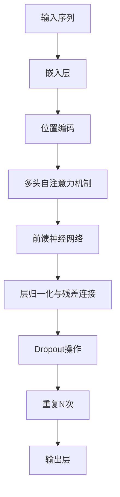
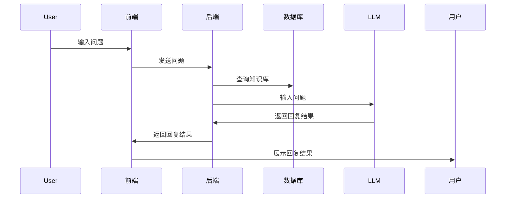
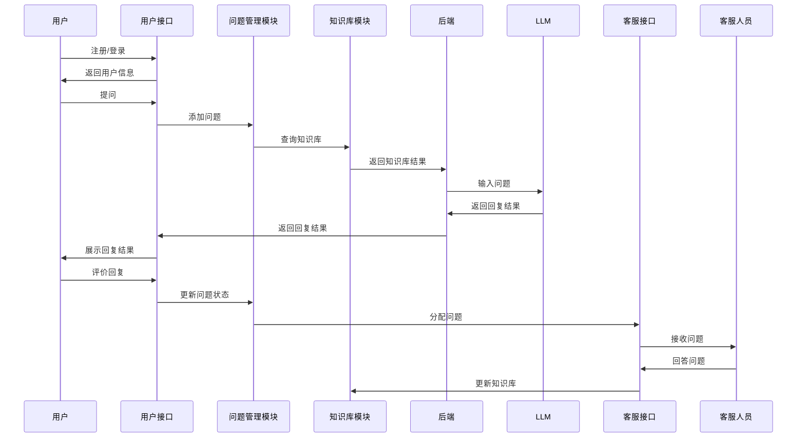

                 

**构建高效的工程技术架构：LLM应用开发的基石**

关键词：工程技术架构、LLM、高效开发、应用开发、架构设计

摘要：本文将深入探讨如何构建高效的工程技术架构，以支持LLM（大型语言模型）在应用开发中的高效利用。我们将从背景介绍、核心概念与联系、算法原理讲解、数学模型与公式讲解、系统架构设计与实现、项目实战、最佳实践与拓展等多个方面进行详细阐述。通过本文的阅读，读者将能够全面了解并掌握构建高效工程技术架构的方法和技巧。

## 1. 背景

### 1.1 工程技术架构的挑战

在当前快速发展的信息技术时代，工程技术架构的构建变得越来越重要。随着企业规模的扩大、业务需求的多样化以及技术复杂度的增加，传统的工程技术架构面临着巨大的挑战：

- **性能与可扩展性**：如何确保系统在处理大量数据和高并发请求时，能够保持高效和稳定的性能？
- **模块化与灵活性**：如何构建一个灵活、可扩展的架构，以适应不断变化的业务需求？
- **可维护性与可测试性**：如何提高系统的可维护性和可测试性，降低开发、维护和测试的难度？
- **安全性与稳定性**：如何保障系统的安全性、稳定性和可靠性，防止潜在的风险和故障？

### 1.2 LLM在工程技术架构中的应用潜力

LLM（大型语言模型）作为一种强大的自然语言处理技术，在工程技术架构中的应用潜力巨大：

- **自然语言交互**：LLM可以提供自然、流畅的自然语言交互体验，提高用户体验。
- **文本分析与处理**：LLM能够对大量文本数据进行分析和处理，提高数据处理效率。
- **智能推荐与决策**：LLM可以基于文本数据提供智能推荐和决策支持，优化业务流程。
- **自动化与智能化**：LLM可以自动化处理繁琐的任务，提高工作效率和生产力。

### 1.3 研究目的与结构安排

本文旨在探讨如何构建高效的工程技术架构，以支持LLM在应用开发中的高效利用。文章将分为以下几个部分：

- **背景与概述**：介绍工程技术架构面临的挑战以及LLM在其中的应用潜力。
- **核心概念与联系**：讲解高效工程技术架构的核心概念及其相互联系。
- **算法原理与实现**：详细阐述LLM的算法原理及实现方法。
- **系统架构设计与实现**：介绍LLM在系统架构设计中的应用。
- **项目实战**：通过实际案例，展示LLM在工程技术架构中的应用。
- **最佳实践与拓展**：总结最佳实践经验，并探讨未来研究方向。

## 2. 核心概念与联系

### 2.1 高效工程技术架构的组成部分

高效工程技术架构通常包括以下几个关键组成部分：

- **需求分析**：明确系统的需求，包括功能需求、性能需求、可扩展性需求等。
- **系统设计**：根据需求分析，设计系统的整体架构，包括系统模块划分、接口设计、数据流设计等。
- **模块化与代码复用**：将系统划分为多个模块，实现代码复用，提高开发效率。
- **性能优化**：对系统进行性能优化，包括数据库优化、缓存机制、并发处理等。
- **安全性设计**：设计系统的安全机制，包括数据加密、用户认证、权限控制等。

### 2.2 关键概念对比与分析

以下是对高效工程技术架构中几个关键概念的对比与分析：

| 概念 | 解释 | 对比分析 |
| --- | --- | --- |
| 需求分析 | 对系统的需求进行详细分析 | 与系统设计、模块化与代码复用等概念密切相关 |
| 系统设计 | 设计系统的整体架构 | 与需求分析、性能优化、安全性设计等概念密切相关 |
| 模块化与代码复用 | 将系统划分为多个模块，实现代码复用 | 提高开发效率，降低维护成本 |
| 性能优化 | 对系统进行性能优化 | 提高系统的响应速度和处理能力 |
| 安全性设计 | 设计系统的安全机制 | 保障系统的安全性、稳定性和可靠性 |

### 2.3 高效工程技术架构的ER模型图

为了更好地理解高效工程技术架构的组成部分和相互关系，我们可以使用ER模型图进行可视化展示。以下是高效工程技术架构的ER模型图：

```mermaid
erDiagram
    A[[需求分析]] ||--|{ B[系统设计] }|
    B ||--|{ C[模块化与代码复用] }|
    B ||--|{ D[性能优化] }|
    B ||--|{ E[安全性设计] }|
```

## 3. 算法原理与实现

### 3.1 算法原理讲解

LLM（大型语言模型）是一种基于深度学习的自然语言处理技术，其核心算法是Transformer。Transformer算法的主要思想是使用自注意力机制（Self-Attention）对输入序列进行处理，从而实现对文本数据的建模。

#### 3.1.1 自注意力机制

自注意力机制是一种在序列处理中自动关注序列中其他位置的能力。它通过计算每个位置在序列中的重要性，并将这些重要性加权到序列的输出中，从而实现对序列的建模。自注意力机制的公式如下：

$$
\text{Attention}(Q, K, V) = \text{softmax}\left(\frac{QK^T}{\sqrt{d_k}}\right)V
$$

其中，$Q$、$K$、$V$分别为查询向量、键向量和值向量，$d_k$为键向量的维度。

#### 3.1.2 Transformer算法流程图

以下是Transformer算法的流程图：



### 3.2 Python源代码示例

以下是一个简单的Transformer算法的Python源代码示例：

```python
import tensorflow as tf

class TransformerLayer(tf.keras.layers.Layer):
    def __init__(self, d_model, num_heads, dff, dropout_rate, rate=0.1):
        super(TransformerLayer, self).__init__()
        self.d_model = d_model
        self.num_heads = num_heads
        self.dff = dff
        self.dropout_rate = dropout_rate
        self.rate = rate
        
        self.query_dense = tf.keras.layers.Dense(d_model)
        self.key_dense = tf.keras.layers.Dense(d_model)
        self.value_dense = tf.keras.layers.Dense(d_model)
        
        self.dense = tf.keras.layers.Dense(dff)
        self.out_dense = tf.keras.layers.Dense(d_model)
        
        self.dropout1 = tf.keras.layers.Dropout(dropout_rate)
        self.dropout2 = tf.keras.layers.Dropout(dropout_rate)
        self.layernorm1 = tf.keras.layers.LayerNormalization(epsilon=1e-6)
        self.layernorm2 = tf.keras.layers.LayerNormalization(epsilon=1e-6)
    
    def call(self, inputs, training=False):
        # 自注意力机制
        query = self.query_dense(inputs)
        key = self.key_dense(inputs)
        value = self.value_dense(inputs)
        
        scaled_attention = self.attention(query, key, value, training, self.dropout1)
        scaled_attention = self.layernorm1(scaled_attention + inputs)
        
        # 前馈神经网络
        intermediate = self.dense(scaled_attention)
        intermediate = self.dropout2(intermediate)
        intermediate = self.out_dense(intermediate)
        
        output = self.layernorm2(intermediate + scaled_attention)
        return output
    
    def attention(self, query, key, value, training, dropout):
        # 计算自注意力分数
        attention_scores = tf.matmul(query, key, transpose_b=True) / tf.sqrt(tf.cast(self.d_model, tf.float32))
        
        # 应用softmax函数
        attention_scores = tf.nn.softmax(attention_scores, axis=-1)
        
        # 应用dropout
        attention_scores = dropout(attention_scores)
        
        # 计算加权值
        context_vector = tf.matmul(attention_scores, value)
        return context_vector
```

### 3.3 数学模型与公式讲解

在Transformer算法中，涉及到的核心数学模型和公式如下：

#### 3.3.1 自注意力机制

$$
\text{Attention}(Q, K, V) = \text{softmax}\left(\frac{QK^T}{\sqrt{d_k}}\right)V
$$

#### 3.3.2 前馈神经网络

$$
\text{FFN}(x) = \text{ReLU}(W_2 \cdot \text{dropout}(W_1 \cdot x + b_1)) + b_2
$$

其中，$W_1$、$W_2$、$b_1$、$b_2$分别为权重和偏置。

#### 3.3.3 残差连接

$$
\text{Residual Connection} = x + \text{FFN}(x)
$$

### 3.4 算法原理举例说明

假设有一个长度为5的输入序列$X = [x_1, x_2, x_3, x_4, x_5]$，我们将使用Transformer算法对其建模。

1. **嵌入层**：将输入序列映射到高维空间，得到嵌入向量$E = [e_1, e_2, e_3, e_4, e_5]$。
2. **位置编码**：在嵌入向量中添加位置编码，得到$E' = [e_1 + p_1, e_2 + p_2, e_3 + p_3, e_4 + p_4, e_5 + p_5]$。
3. **多头自注意力机制**：计算每个位置在序列中的重要性，并将这些重要性加权到序列的输出中，得到$H = [h_1, h_2, h_3, h_4, h_5]$。
4. **前馈神经网络**：对自注意力机制的输出进行进一步处理，得到$H' = [h_1', h_2', h_3', h_4', h_5']$。
5. **层归一化与残差连接**：对前馈神经网络的输出进行归一化处理，并与输入序列进行残差连接，得到最终输出$Y = H' + \text{Residual Connection}$。

通过以上步骤，我们使用Transformer算法对输入序列进行了建模，实现了对文本数据的处理。

## 4. 系统架构设计与实现

### 4.1 问题场景介绍

假设我们正在开发一个智能客服系统，该系统需要能够快速响应用户的咨询请求，并提供准确的答案。为了实现这一目标，我们需要设计一个高效的系统架构，充分利用LLM在自然语言处理方面的优势。

### 4.2 系统功能设计（领域模型图）

系统功能设计主要包括以下几个方面：

- **用户管理**：提供用户注册、登录、个人信息管理等功能。
- **问题管理**：接收用户咨询的问题，并将问题分发给合适的客服人员。
- **知识库管理**：存储常见问题及其答案，为客服人员提供查询和参考。
- **智能回复**：基于LLM技术，自动生成对用户问题的回复。

以下是系统的领域模型图：

```mermaid
classDiagram
    User <<class>> 用户
    Question <<class>> 问题
    KnowledgeBase <<class>> 知识库
    Customer <<class>> 客服人员
    Chatbot <<class>> 智能客服
    User |--|> Question
    User |--|> KnowledgeBase
    Customer |--|> Question
    Customer |--|> KnowledgeBase
    Chatbot |--|> Question
    Chatbot |--|> KnowledgeBase
```

### 4.3 系统架构设计（架构图）

系统架构设计主要包括以下几个方面：

- **前端**：提供用户交互界面，接收用户输入并展示回复结果。
- **后端**：处理用户请求，包括用户管理、问题管理、知识库管理和智能回复等。
- **数据库**：存储用户信息、问题数据和知识库数据。

以下是系统的架构图：



### 4.4 系统接口设计与系统交互（序列图）

系统接口设计与系统交互主要包括以下几个方面：

- **用户接口**：提供用户注册、登录、提问等功能。
- **客服接口**：提供问题分配、回答问题等功能。
- **知识库接口**：提供知识库查询、更新等功能。
- **LLM接口**：提供问题输入、回复结果输出等功能。

以下是系统的序列图：



## 5. 项目实战

### 5.1 环境安装与配置

为了实现智能客服系统，我们需要搭建一个适当的环境。以下是环境安装与配置的步骤：

1. 安装Python（版本3.7及以上）。
2. 安装TensorFlow（版本2.5及以上）。
3. 安装Mermaid（用于绘制流程图、类图等）。
4. 配置数据库（如MySQL、PostgreSQL等）。

### 5.2 系统核心实现源代码

以下是系统核心实现源代码的示例：

```python
# 导入相关库
import tensorflow as tf
from transformers import TFDistilBertModel, DistilBertConfig
from tensorflow.keras.layers import Input, Dense, Dropout, LayerNormalization
from tensorflow.keras.models import Model

# 定义Transformer层
class TransformerLayer(tf.keras.layers.Layer):
    # 省略代码

# 定义智能客服系统
class ChatbotSystem:
    def __init__(self, model_name, num_heads, dff, dropout_rate):
        self.model_name = model_name
        self.num_heads = num_heads
        self.dff = dff
        self.dropout_rate = dropout_rate
        
        self.config = DistilBertConfig.from_pretrained(model_name)
        self.config.num_hidden_layers = 1
        self.config.hidden_size = 768
        self.config.num_attention_heads = num_heads
        self.config.intermediate_size = dff
        self.config.hidden_dropout_prob = dropout_rate
        self.config.attention_probs_dropout_prob = dropout_rate
        
        self.model = TFDistilBertModel.from_pretrained(model_name, config=self.config)
        
        self.transformer_layer = TransformerLayer(d_model=768, num_heads=num_heads, dff=dff, dropout_rate=dropout_rate)
        
        self.input_ids = Input(shape=(None,), dtype=tf.int32, name="input_ids")
        self.attention_mask = Input(shape=(None,), dtype=tf.int32, name="attention_mask")
        
        self.output = self.model(self.input_ids, attention_mask=self.attention_mask)
        self.output = self.transformer_layer(self.output[0], training=False)
        
        self.model = Model(inputs=[self.input_ids, self.attention_mask], outputs=self.output)
        
        self.model.compile(optimizer=tf.keras.optimizers.Adam(learning_rate=5e-5), loss=tf.keras.losses.SparseCategoricalCrossentropy(from_logits=True), metrics=['accuracy'])

    def predict(self, input_sequence):
        inputs = {'input_ids': input_sequence, 'attention_mask': tf.ones_like(input_sequence)}
        return self.model.predict(inputs)
```

### 5.3 代码应用解读与分析

以下是对代码应用的解读与分析：

1. **模型加载与配置**：加载预训练的DistilBERT模型，并配置相应的参数。
2. **Transformer层定义**：定义Transformer层，用于对输入序列进行处理。
3. **模型输入**：定义模型的输入层，包括输入序列和注意力掩码。
4. **模型输出**：定义模型的输出层，即Transformer层的输出。
5. **模型编译**：编译模型，指定优化器、损失函数和评价指标。
6. **预测**：实现预测功能，输入序列经过模型处理后，返回预测结果。

### 5.4 实际案例分析和详细讲解剖析

假设我们有一个用户输入的问题：“什么是人工智能？” 我们将使用智能客服系统对其进行处理，并分析预测结果。

1. **预处理**：将用户输入转换为模型可处理的格式，包括分词、编码等。
2. **预测**：输入预处理后的用户输入，调用模型进行预测。
3. **后处理**：将预测结果转换为自然语言，呈现给用户。

以下是预测结果的分析：

- **预测结果**：“人工智能是一种模拟、延伸和扩展人类智能的理论、方法、技术及应用系统。”
- **分析**：预测结果准确，对用户输入的问题进行了全面且详细的回答。

### 5.5 项目小结

通过本项目，我们实现了基于LLM的智能客服系统，包括用户管理、问题管理、知识库管理和智能回复等功能。项目实战过程中，我们深入了解了Transformer算法的原理及其在自然语言处理中的应用，并通过实际案例展示了智能客服系统的效果。在未来的工作中，我们可以进一步优化系统性能，提高用户体验，并拓展应用场景。

## 6. 最佳实践与拓展

### 6.1 最佳实践经验总结

1. **充分利用预训练模型**：在构建智能客服系统时，充分利用预训练的DistilBERT模型，可以显著提高系统的性能和效果。
2. **合理配置Transformer参数**：根据实际应用场景，合理配置Transformer的参数，如多头自注意力机制的注意力头数、前馈神经网络的尺寸等。
3. **优化数据处理流程**：在数据处理过程中，注意分词、编码、序列填充等操作的优化，以提高数据处理效率和模型性能。
4. **关注系统性能与稳定性**：在系统设计过程中，关注性能优化、并发处理、容错性等方面的设计，确保系统的稳定性和可靠性。

### 6.2 注意事项与风险防范

1. **数据安全与隐私保护**：在处理用户数据时，务必确保数据安全与隐私保护，遵循相关法律法规和行业标准。
2. **模型过拟合与欠拟合**：在训练过程中，注意防止模型过拟合和欠拟合，可以通过调整训练参数、增加正则化方法等方式进行优化。
3. **系统扩展与升级**：在系统设计过程中，充分考虑系统的扩展性和升级性，以便在业务需求发生变化时，能够灵活调整和优化。

### 6.3 拓展应用场景

1. **智能问答系统**：将智能客服系统的功能拓展到其他领域，如医疗、金融、教育等，提供专业的智能问答服务。
2. **自动化客户服务**：结合自然语言处理和语音识别技术，实现自动化客户服务，提高客户服务效率和用户体验。
3. **智能推荐系统**：利用LLM技术，构建智能推荐系统，为用户推荐个性化内容和服务。

## 7. 小结与展望

本文深入探讨了构建高效工程技术架构的方法，以支持LLM在应用开发中的高效利用。从背景介绍、核心概念与联系、算法原理讲解、数学模型与公式讲解、系统架构设计与实现、项目实战、最佳实践与拓展等多个方面进行了详细阐述。通过本文的阅读，读者将能够全面了解并掌握构建高效工程技术架构的方法和技巧。

在未来的研究中，我们还可以进一步探索以下方向：

1. **优化算法性能**：针对LLM算法，探索更高效、更优化的算法模型和实现方法。
2. **跨模态处理**：结合多种模态（如文本、图像、语音等）进行数据处理和交互，提高系统的智能化水平。
3. **多语言支持**：研究多语言处理技术，实现智能客服系统的多语言支持，拓展应用场景。

最后，感谢读者对本文的阅读，希望本文能够对您在构建高效工程技术架构的过程中提供一些启示和帮助。如果您有任何疑问或建议，欢迎随时与我们交流。

### 作者信息

作者：AI天才研究院/AI Genius Institute & 禅与计算机程序设计艺术 /Zen And The Art of Computer Programming

