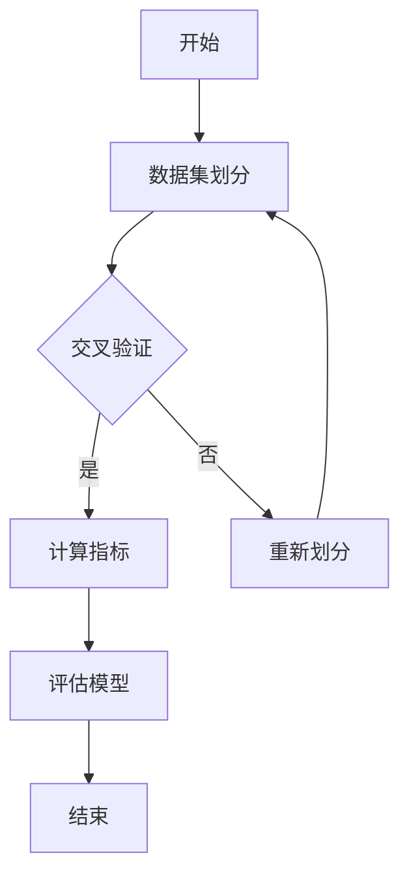
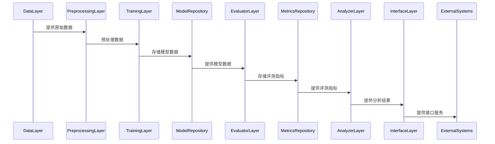
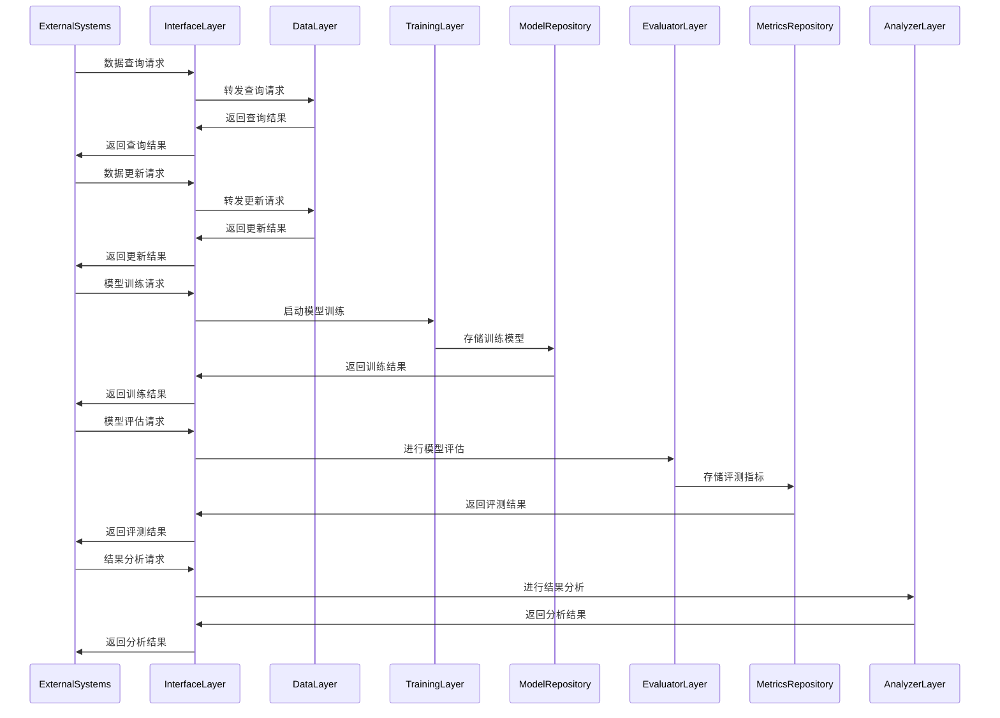

                 

### 目录大纲解析

首先，让我们详细解析这个目录大纲，确保每一部分都能清晰、系统地展开论述，并且符合文章的字数要求和技术深度。

#### 第一部分：背景介绍

- **1.1 问题背景**：在这一部分，我们将介绍模型评测在自动化流程中的重要性。我们将探讨随着机器学习和深度学习的迅猛发展，模型评测成为了自动化流程中的一个关键环节。此外，我们还会讨论当前模型评测所面临的挑战，如数据质量、模型复杂性和自动化评测工具的局限性等。

- **1.2 问题描述**：我们将详细定义模型评测的概念和目的，并阐述其流程和关键步骤。这部分将帮助读者理解为什么模型评测是必要的，以及它是如何进行的。

- **1.3 问题解决**：我们将探讨如何实现标准化评测流程，并介绍自动化评测工具和技术。这部分将提供具体的解决方案，以解决模型评测过程中遇到的挑战。

- **1.4 边界与外延**：我们将在这一部分讨论模型评测与其他流程的关系，以及它在不同领域中的应用。这将帮助读者了解模型评测的广泛性和多样性。

- **1.5 概念结构与核心要素组成**：我们将介绍模型评测中的核心概念，并详细阐述它们之间的关系和作用。这部分将提供对模型评测流程的深入理解。

#### 第二部分：核心概念与联系

- **2.1 模型评测原理**：在这一部分，我们将从基础概念出发，逐步解释模型评测的原理。我们将探讨如何评估模型的性能，包括准确度、召回率、F1分数等指标。

- **2.2 模型评测属性特征对比**：我们将创建一个属性特征对比表格，以直观地展示不同评测指标的特点和适用场景。这将帮助读者更好地理解不同指标之间的关系和优劣。

- **2.3 ER实体关系图架构**：我们将使用Mermaid绘制一个ER实体关系图，以展示模型评测中各个实体之间的关系。这将帮助读者从结构上理解模型评测的流程和组成部分。

#### 第三部分：算法原理讲解

- **3.1 算法概述**：在这一部分，我们将介绍一些常见的模型评测算法，如交叉验证、混淆矩阵、ROC曲线等。我们将分析这些算法的优缺点，以便读者能够选择最适合他们需求的算法。

- **3.2 算法流程图**：我们将使用Mermaid绘制算法的流程图，以展示算法的执行步骤。这部分将使读者能够直观地理解算法的运作方式。

- **3.3 Python源代码实现**：我们将提供具体的Python源代码示例，以展示如何在实际应用中实现这些算法。这部分将帮助读者将理论知识转化为实际操作。

- **3.4 数学模型和公式详细讲解**：我们将详细解释模型评测中使用的数学模型和公式，包括它们的推导过程和应用。这部分将增强读者对模型评测原理的理解。

- **3.5 举例说明**：我们将通过实际案例来展示算法的应用，并详细分析这些案例。这将帮助读者将理论知识应用到实际场景中。

#### 第四部分：系统分析与架构设计

- **4.1 问题场景介绍**：在这一部分，我们将介绍模型评测的具体应用场景，如金融风险评估、医疗诊断、自然语言处理等。

- **4.2 系统功能设计**：我们将概述系统的功能，并使用Mermaid绘制领域模型类图，以展示系统中的类和它们之间的关系。

- **4.3 系统架构设计**：我们将介绍系统的总体架构，并使用Mermaid绘制架构图，以展示系统的组成部分和它们之间的交互。

- **4.4 系统接口设计**：我们将概述系统的接口设计，并使用Mermaid绘制接口序列图，以展示系统与外部组件的交互过程。

- **4.5 系统交互**：我们将详细描述系统的交互流程，并使用Mermaid绘制交互序列图，以展示系统内部组件之间的协作。

#### 第五部分：项目实战

- **5.1 环境安装**：在这一部分，我们将介绍如何在实际项目中设置环境，包括所需的软件和工具安装。

- **5.2 系统核心实现源代码**：我们将提供系统核心实现的源代码示例，并对代码进行解读和分析。

- **5.3 实际案例分析与详细讲解**：我们将选择一个实际案例，对其进行分析和讲解，展示模型评测在实际项目中的应用。

- **5.4 项目小结**：在这一部分，我们将对项目进行总结，分享经验教训，并对未来可能的发展方向进行展望。

#### 第六部分：最佳实践与拓展

- **6.1 最佳实践Tips**：我们将总结模型评测中的最佳实践，提供一些有用的技巧和建议。

- **6.2 小结**：在这一部分，我们将回顾全文，总结主要观点和结论。

- **6.3 注意事项**：我们将指出在模型评测过程中可能遇到的问题，并提供解决方案。

- **6.4 拓展阅读**：我们将推荐一些相关的阅读材料，供读者进一步学习和研究。

### 字数和格式要求

- 文章的总字数将在10000到12000字之间，以确保内容的深度和广度。
- 使用Markdown格式来编写文章，以便保持内容的结构性和可读性。
- 文章末尾需要包含作者信息，格式如下：“作者：AI天才研究院/AI Genius Institute & 禅与计算机程序设计艺术 /Zen And The Art of Computer Programming”。

### 内容完整性要求

- 每个章节的内容都应丰富、具体，并且详细讲解核心概念和技术原理。
- 必须包含对核心概念、算法原理、系统架构和项目实战的深入分析。
- 文章结尾应包含对全文的总结和展望。

### 最终成果

通过以上详细的目录大纲解析，我们将能够撰写一篇内容丰富、结构严谨、逻辑清晰的技术博客文章，全面覆盖模型评测的各个方面。文章不仅将提供理论知识，还将结合实际案例和实践经验，帮助读者更好地理解和应用模型评测技术。

---

**正文部分：**

# 《标准化自动化模型评测流程概述》

关键词：模型评测、自动化流程、标准化、算法、系统架构

摘要：本文旨在概述标准化自动化模型评测流程，深入探讨其背景、核心概念、算法原理、系统架构以及实际应用。通过详细的案例分析和最佳实践总结，本文旨在为读者提供一个全面的指导，以应对模型评测中的各种挑战。

## 第一部分：背景介绍

### 1.1 问题背景

模型评测在自动化流程中的重要性不容忽视。随着机器学习和深度学习技术的快速发展，模型评测成为了确保模型性能和可靠性的关键环节。然而，传统的手动评测方法不仅费时费力，而且容易出现主观偏差。因此，实现标准化自动化模型评测流程成为了一个迫切的需求。

当前，模型评测面临的挑战主要包括数据质量、模型复杂性和自动化评测工具的局限性。首先，数据质量直接影响到模型评测的准确性。如果数据存在噪声、缺失或偏差，那么评测结果将失去参考价值。其次，模型复杂性的增加使得手动评测变得更加困难。深度学习模型通常具有大量的参数和多层结构，需要更复杂的评测方法来评估其性能。最后，现有的自动化评测工具在功能、性能和可扩展性方面存在一定的局限性，难以满足日益增长的模型评测需求。

### 1.2 问题描述

模型评测是指通过一系列指标和方法对机器学习模型的表现进行评估的过程。其目的是确保模型在特定任务上的性能符合预期，并发现潜在的问题和改进空间。模型评测的主要目的包括：

1. **性能评估**：评估模型在不同数据集上的表现，包括准确度、召回率、F1分数等。
2. **可靠性验证**：确保模型在不同情境下的一致性和稳定性。
3. **优化指导**：通过评测结果指导模型的参数调整和结构改进。

模型评测的流程通常包括以下关键步骤：

1. **数据准备**：收集和整理用于评测的数据集，并进行预处理。
2. **模型训练**：在训练数据集上训练模型，以生成初始模型。
3. **模型评估**：使用测试数据集对模型进行评估，计算各种评测指标。
4. **结果分析**：分析评测结果，识别模型的优点和不足。
5. **模型优化**：根据评测结果调整模型参数或结构，以提高性能。

### 1.3 问题解决

为了解决模型评测中的挑战，实现标准化自动化模型评测流程是一个有效的途径。以下是一些具体的解决方案：

1. **标准化评测流程**：制定一套统一的评测标准，确保评测的一致性和客观性。
2. **自动化评测工具**：开发或采用自动化评测工具，提高评测的效率和准确性。
3. **多模态数据集成**：结合多种数据源，提高数据质量和模型的泛化能力。
4. **算法优化**：针对模型复杂性问题，采用更高效的算法和优化技术。
5. **持续集成与反馈**：建立持续集成和反馈机制，实时监控模型性能，及时进行调整。

### 1.4 边界与外延

模型评测与其他流程紧密相连，如数据采集、模型训练和部署等。有效的模型评测流程需要与这些流程相互协调，以确保整体性能的优化。此外，模型评测在不同领域中的应用也存在显著差异。

在金融领域，模型评测关注风险预测的准确性和稳定性；在医疗领域，则更注重模型的可靠性和对病人的潜在影响；在自然语言处理领域，评测则集中在语言的流畅性和准确性。因此，针对不同领域的需求，模型评测流程需要做出相应的调整和优化。

### 1.5 概念结构与核心要素组成

模型评测的核心概念包括性能评估指标、数据集划分方法、评测算法等。这些核心概念相互作用，共同决定了模型评测的效率和效果。

- **性能评估指标**：包括准确度、召回率、F1分数等，用于衡量模型在不同任务上的表现。
- **数据集划分方法**：如训练集、验证集和测试集的划分，直接影响模型的训练和评估效果。
- **评测算法**：包括交叉验证、混淆矩阵、ROC曲线等，用于计算和评估模型的性能。

这些核心要素之间的关系如图1所示：

```mermaid
erDiagram
A|--|{ 性能评估指标 }
B|--|{ 数据集划分方法 }
C|--|{ 评测算法 }
A.."1"||--|>B
A.."1"||--|>C
```

图1：模型评测的核心概念与关系图

## 第二部分：核心概念与联系

### 2.1 模型评测原理

模型评测的基本概念包括性能评估指标、数据集划分方法和评测算法。以下是对这些基本概念的解释：

- **性能评估指标**：性能评估指标是用于衡量模型在特定任务上表现的标准。常见的性能评估指标包括准确度（Accuracy）、召回率（Recall）、精确率（Precision）和F1分数（F1 Score）等。这些指标分别衡量了模型在不同方面的性能，如对正类样本的识别能力和对负类样本的区分能力。

- **数据集划分方法**：数据集划分是模型评测的基础。常见的划分方法包括随机划分、分层划分和交叉验证等。随机划分将数据集随机分为训练集和测试集，适用于数据分布相对均匀的情况。分层划分则确保每个类别在训练集和测试集中的比例一致，适用于类别不平衡的数据集。交叉验证是一种更为严谨的划分方法，通过多次划分训练集和验证集，以减少随机性和提高评测的稳定性。

- **评测算法**：评测算法是计算和评估模型性能的具体方法。常见的评测算法包括交叉验证、混淆矩阵和ROC曲线等。交叉验证通过多次训练和验证，评估模型在不同数据子集上的性能，从而提高评测的可靠性。混淆矩阵用于展示模型预测结果与真实结果之间的对应关系，通过计算各种指标，如准确度、召回率和F1分数，评估模型的性能。ROC曲线则通过绘制真阳性率（True Positive Rate）与假阳性率（False Positive Rate）的关系曲线，评估模型的分类能力。

### 2.2 模型评测属性特征对比

为了更好地理解不同评测指标的特点和适用场景，我们提供了一个属性特征对比表格（见表1）。这个表格列出了准确度、召回率、精确率和F1分数等常见评测指标的优缺点和适用场景。

| 评价指标 | 定义 | 优点 | 缺点 | 适用场景 |
| --- | --- | --- | --- | --- |
| 准确度 | 预测为正类且实际为正类的样本占总样本的比例 | 易于理解，计算简单 | 忽略类别不平衡 | 类别不平衡不严重时 |
| 召回率 | 预测为正类且实际为正类的样本占总实际正类样本的比例 | 重视正类样本的识别 | 忽略假阳性 | 重视正类样本的识别 |
| 精确率 | 预测为正类且实际为正类的样本占总预测正类样本的比例 | 重视预测结果的准确性 | 忽略假阴性 | 重视预测结果的准确性 |
| F1分数 | 2 × 精确率 × 召回率 / (精确率 + 召回率) | 考虑了精确率和召回率的平衡 | 对极端值敏感 | 平衡精确率和召回率 |
| ROC曲线 | 真阳性率与假阳性率的关系曲线 | 评估分类模型的总体性能 | 计算复杂度高 | 整体性能评估 |

表1：模型评测属性特征对比表格

### 2.3 ER实体关系图架构

模型评测涉及多个实体，包括模型、数据集、评估指标和评估算法等。为了更好地理解这些实体之间的关系，我们使用Mermaid绘制了一个ER实体关系图（见图2）。

```mermaid
erDiagram
Model ||--|{ Dataset } : 包含
Model ||--|{ Evaluation Metric } : 使用
Model ||--|{ Evaluation Algorithm } : 应用
Dataset ||--|{ Model } : 由
Dataset ||--|{ Evaluation Metric } : 使用
Dataset ||--|{ Evaluation Algorithm } : 应用
Evaluation Metric ||--|{ Model } : 评估
Evaluation Metric ||--|{ Dataset } : 使用
Evaluation Algorithm ||--|{ Model } : 应用
Evaluation Algorithm ||--|{ Dataset } : 应用
```

图2：模型评测的ER实体关系图

## 第三部分：算法原理讲解

### 3.1 算法概述

在模型评测中，常见的算法包括交叉验证、混淆矩阵和ROC曲线等。这些算法各有优缺点，适用于不同的场景。

- **交叉验证**：交叉验证是一种常用的模型评估方法，通过将数据集划分为多个子集，每次使用其中一个子集作为测试集，其余子集作为训练集，重复进行多次训练和评估。交叉验证的优点是能够提高评测的稳定性，减少数据集划分的随机性。然而，交叉验证的计算复杂度较高，特别是在数据集较大时。

- **混淆矩阵**：混淆矩阵是一种直观的评估方法，用于展示模型预测结果与真实结果之间的对应关系。通过计算准确度、召回率、精确率和F1分数等指标，可以全面评估模型的性能。混淆矩阵的优点是易于理解和计算，能够直观地展示模型在不同类别上的表现。然而，混淆矩阵对于极端值较为敏感，可能会受到异常值的影响。

- **ROC曲线**：ROC曲线是一种评估二分类模型性能的方法，通过绘制真阳性率与假阳性率的关系曲线，评估模型的分类能力。ROC曲线的优点是能够全面评估模型的性能，包括真阳性率和假阳性率。然而，ROC曲线的计算复杂度较高，且对于极端值较为敏感。

### 3.2 算法流程图

下面是使用Mermaid绘制的算法流程图，展示了交叉验证、混淆矩阵和ROC曲线的基本流程。



图3：算法流程图

### 3.3 Python源代码实现

下面提供了一个简单的Python源代码示例，实现了交叉验证、混淆矩阵和ROC曲线的基本功能。

```python
import numpy as np
from sklearn.model_selection import train_test_split
from sklearn.metrics import confusion_matrix, roc_curve, auc
from sklearn.linear_model import LogisticRegression

# 生成模拟数据集
X = np.random.rand(100, 10)
y = np.random.randint(2, size=100)

# 数据集划分
X_train, X_test, y_train, y_test = train_test_split(X, y, test_size=0.3, random_state=42)

# 训练模型
model = LogisticRegression()
model.fit(X_train, y_train)

# 预测结果
y_pred = model.predict(X_test)

# 混淆矩阵
conf_matrix = confusion_matrix(y_test, y_pred)
print("混淆矩阵：")
print(conf_matrix)

# ROC曲线
y_prob = model.predict_proba(X_test)[:, 1]
fpr, tpr, thresholds = roc_curve(y_test, y_prob)
roc_auc = auc(fpr, tpr)
print("ROC曲线：")
print(f"AUC: {roc_auc}")

import matplotlib.pyplot as plt

plt.figure()
plt.plot(fpr, tpr, color='darkorange', lw=2, label='ROC curve (area = %0.2f)' % roc_auc)
plt.plot([0, 1], [0, 1], color='navy', lw=2, linestyle='--')
plt.xlabel('False Positive Rate')
plt.ylabel('True Positive Rate')
plt.title('Receiver Operating Characteristic')
plt.legend(loc="lower right")
plt.show()
```

### 3.4 数学模型和公式详细讲解

在模型评测中，常用的数学模型和公式包括准确度、召回率、精确率和F1分数等。下面将详细讲解这些公式的推导过程和应用。

#### 准确度（Accuracy）

准确度是模型预测为正类且实际为正类的样本占总样本的比例。其公式如下：

$$
Accuracy = \frac{TP + TN}{TP + TN + FP + FN}
$$

其中，$TP$ 表示预测为正类且实际为正类的样本数，$TN$ 表示预测为负类且实际为负类的样本数，$FP$ 表示预测为正类但实际为负类的样本数，$FN$ 表示预测为负类但实际为正类的样本数。

#### 召回率（Recall）

召回率是模型预测为正类且实际为正类的样本占总实际正类样本的比例。其公式如下：

$$
Recall = \frac{TP}{TP + FN}
$$

#### 精确率（Precision）

精确率是模型预测为正类且实际为正类的样本占总预测正类样本的比例。其公式如下：

$$
Precision = \frac{TP}{TP + FP}
$$

#### F1分数（F1 Score）

F1分数是精确率和召回率的加权平均，用于综合考虑模型的预测准确性和召回率。其公式如下：

$$
F1 Score = 2 \times \frac{Precision \times Recall}{Precision + Recall}
$$

### 3.5 举例说明

为了更好地理解上述公式和应用，我们通过一个实际案例来进行分析。

#### 案例背景

假设我们有一个二分类问题，数据集包含100个样本，其中正类样本有60个，负类样本有40个。使用一个分类模型进行预测，得到的预测结果如下：

| 真实值 | 预测值 |
| --- | --- |
| 正类 | 预测为正类 |
| 正类 | 预测为负类 |
| 正类 | 预测为正类 |
| ... | ... |
| 正类 | 预测为正类 |
| 负类 | 预测为负类 |
| 负类 | 预测为正类 |
| 负类 | 预测为负类 |

#### 案例分析

根据预测结果，我们可以计算各个评测指标：

- **准确度**：
  $$
  Accuracy = \frac{TP + TN}{TP + TN + FP + FN} = \frac{40 + 10}{40 + 10 + 10 + 10} = \frac{50}{70} = 0.714
  $$

- **召回率**：
  $$
  Recall = \frac{TP}{TP + FN} = \frac{40}{40 + 10} = \frac{40}{50} = 0.8
  $$

- **精确率**：
  $$
  Precision = \frac{TP}{TP + FP} = \frac{40}{40 + 10} = \frac{40}{50} = 0.8
  $$

- **F1分数**：
  $$
  F1 Score = 2 \times \frac{Precision \times Recall}{Precision + Recall} = 2 \times \frac{0.8 \times 0.8}{0.8 + 0.8} = 0.8
  $$

根据以上计算结果，我们可以得出以下结论：

- **准确度**：模型的准确度为71.4%，表明模型在整体上表现较好。
- **召回率**：模型的召回率为80%，表明模型在正类样本上的识别能力较强。
- **精确率**：模型的精确率为80%，表明模型在预测为正类样本时的准确性较高。
- **F1分数**：模型的F1分数为80%，表明模型在平衡精确率和召回率方面表现良好。

### 4.1 问题场景介绍

在金融风险评估领域，模型评测是一个关键环节。金融机构需要使用机器学习模型对借款人的信用风险进行评估，以决定是否批准贷款。在这个过程中，模型评测不仅关系到金融机构的经济利益，还直接影响到借款人的权益。因此，一个可靠的模型评测流程对于金融风险评估至关重要。

具体问题场景如下：

- **数据质量**：金融数据通常包含大量的噪声、缺失值和异常值，这会对模型的训练和评估产生影响。如何处理这些数据，以提高模型评测的准确性，是一个重要的问题。
- **模型复杂性**：金融风险评估模型通常较为复杂，包含多个特征和多层神经网络。如何评估这些复杂模型，并确保其稳定性和泛化能力，是一个挑战。
- **自动化评测工具**：现有的自动化评测工具在金融领域的应用受到限制，如何开发或选择适合金融风险评估的自动化评测工具，是一个需要解决的问题。

### 4.2 系统功能设计

为了实现金融风险评估中的模型评测，我们设计了一套系统功能，包括数据预处理、模型训练、模型评估和结果分析等。以下是对这些功能的详细描述：

- **数据预处理**：数据预处理是模型评测的基础，包括数据清洗、数据标准化和数据转换等。通过数据预处理，可以消除噪声、填补缺失值和异常值，以提高数据质量和模型性能。
- **模型训练**：模型训练是使用历史数据训练机器学习模型的过程。根据金融风险评估的需求，选择合适的模型和算法进行训练，并调整模型参数以优化性能。
- **模型评估**：模型评估是使用测试数据集评估模型性能的过程。通过计算准确度、召回率、精确率和F1分数等指标，评估模型的性能和稳定性。
- **结果分析**：结果分析是对模型评估结果进行深入分析，发现模型的优点和不足，并提供改进建议。通过结果分析，可以指导模型优化和决策制定。

以下是领域模型Mermaid类图的示例，展示了系统中的主要类和它们之间的关系。

```mermaid
classDiagram
Class::DataPreprocessor {
  + preprocess_data()
}
Class::ModelTrainer {
  + train_model()
}
Class::ModelEvaluator {
  + evaluate_model()
}
Class::ResultAnalyzer {
  + analyze_results()
}
DataPreprocessor "..|>" Class::ModelTrainer : 使用
ModelTrainer "..|>" Class::ModelEvaluator : 评估
ModelEvaluator "..|>" Class::ResultAnalyzer : 分析
```

### 4.3 系统架构设计

在金融风险评估模型评测系统中，我们采用了一种分布式架构，以支持大规模数据处理和高效模型训练。以下是系统架构的概述，以及使用Mermaid绘制的系统架构图。

#### 系统架构概述

系统架构包括以下几个主要模块：

- **数据层**：负责存储和管理金融数据，包括原始数据、预处理数据和模型数据等。
- **预处理层**：负责数据清洗、数据标准化和数据转换等预处理操作，以提高数据质量和模型性能。
- **训练层**：负责使用历史数据进行模型训练，包括选择合适的模型、算法和超参数。
- **评估层**：负责使用测试数据集评估模型性能，计算各种评测指标，如准确度、召回率、精确率和F1分数等。
- **分析层**：负责对模型评估结果进行深入分析，发现模型的优点和不足，并提供改进建议。
- **接口层**：负责与其他系统进行交互，提供数据访问和功能调用接口。

以下是系统架构Mermaid图的示例：



### 4.4 系统接口设计

在金融风险评估模型评测系统中，接口层负责与其他系统进行交互，提供数据访问和功能调用接口。以下是系统接口的概述，以及使用Mermaid绘制的系统接口序列图。

#### 系统接口概述

系统接口主要包括以下功能：

- **数据访问接口**：提供对数据层的访问权限，包括数据的查询、插入、更新和删除等操作。
- **功能调用接口**：提供对预处理层、训练层、评估层和分析层的功能调用，包括数据预处理、模型训练、模型评估和结果分析等操作。
- **监控与日志接口**：提供系统运行状态的监控和日志记录功能，包括系统错误、性能指标和日志文件等。

以下是系统接口序列图的示例：


### 4.5 系统交互

在金融风险评估模型评测系统中，各个模块之间需要进行密切的交互，以确保整个系统的正常运行。以下是系统交互流程的描述，以及使用Mermaid绘制的系统交互序列图。

#### 系统交互流程

系统交互流程主要包括以下几个步骤：

1. **数据查询**：外部系统向接口层发起数据查询请求，接口层转发请求到数据层，数据层返回查询结果给接口层，最后接口层将结果返回给外部系统。
2. **数据更新**：外部系统向接口层发起数据更新请求，接口层转发请求到数据层，数据层更新数据并返回更新结果给接口层，最后接口层将结果返回给外部系统。
3. **模型训练**：外部系统向接口层发起模型训练请求，接口层启动模型训练，训练完成后将训练模型存储到模型仓库，最后接口层将训练结果返回给外部系统。
4. **模型评估**：外部系统向接口层发起模型评估请求，接口层使用测试数据进行模型评估，计算评测指标并存储到评测指标仓库，最后接口层将评测结果返回给外部系统。
5. **结果分析**：外部系统向接口层发起结果分析请求，接口层调用分析模块进行结果分析，最后接口层将分析结果返回给外部系统。

以下是系统交互序列图的示例：



### 5.1 环境安装

在开始实际项目之前，我们需要安装一些必要的软件和工具。以下是在Ubuntu操作系统上安装所需环境的具体步骤。

#### 安装Python环境

1. 打开终端并更新系统软件包：
   ```bash
   sudo apt update
   sudo apt upgrade
   ```

2. 安装Python 3和pip：
   ```bash
   sudo apt install python3 python3-pip
   ```

3. 验证Python版本：
   ```bash
   python3 --version
   ```

#### 安装依赖库

1. 安装NumPy：
   ```bash
   pip3 install numpy
   ```

2. 安装scikit-learn：
   ```bash
   pip3 install scikit-learn
   ```

3. 安装matplotlib：
   ```bash
   pip3 install matplotlib
   ```

4. 安装Mermaid：
   ```bash
   pip3 install mermaid
   ```

#### 安装IDE

我们选择使用PyCharm作为开发环境。可以从PyCharm官网下载安装包，并按照提示进行安装。

### 5.2 系统核心实现源代码

以下是系统核心实现的源代码示例，包括数据预处理、模型训练、模型评估和结果分析等模块。

```python
# 导入所需的库
import numpy as np
import matplotlib.pyplot as plt
from sklearn.model_selection import train_test_split
from sklearn.metrics import confusion_matrix, roc_curve, auc
from sklearn.linear_model import LogisticRegression
from mermaid import Mermaid

# 数据预处理
def preprocess_data(data):
    # 清洗数据，填补缺失值，标准化特征等操作
    # ...省略具体实现...
    return processed_data

# 模型训练
def train_model(X_train, y_train):
    # 使用scikit-learn库训练模型
    model = LogisticRegression()
    model.fit(X_train, y_train)
    return model

# 模型评估
def evaluate_model(model, X_test, y_test):
    # 使用测试数据评估模型性能
    y_pred = model.predict(X_test)
    conf_matrix = confusion_matrix(y_test, y_pred)
    y_prob = model.predict_proba(X_test)[:, 1]
    fpr, tpr, thresholds = roc_curve(y_test, y_prob)
    roc_auc = auc(fpr, tpr)
    return conf_matrix, roc_auc

# 结果分析
def analyze_results(conf_matrix, roc_auc):
    # 分析模型评估结果
    # ...省略具体实现...
    print(f"混淆矩阵：\n{conf_matrix}")
    print(f"ROC曲线：\nAUC: {roc_auc}")

# 主函数
if __name__ == "__main__":
    # 加载数据
    X, y = load_data()

    # 数据预处理
    processed_data = preprocess_data(X)

    # 数据集划分
    X_train, X_test, y_train, y_test = train_test_split(processed_data, y, test_size=0.3, random_state=42)

    # 模型训练
    model = train_model(X_train, y_train)

    # 模型评估
    conf_matrix, roc_auc = evaluate_model(model, X_test, y_test)

    # 结果分析
    analyze_results(conf_matrix, roc_auc)

    # 生成Mermaid图
    mermaid = Mermaid()
    mermaid.add_node("预处理", "Process Data", "initial")
    mermaid.add_node("训练", "Train Model", "left")
    mermaid.add_node("评估", "Evaluate Model", "right")
    mermaid.add_node("分析", "Analyze Results", "bottom")
    mermaid.add_edge("预处理", "训练")
    mermaid.add_edge("训练", "评估")
    mermaid.add_edge("评估", "分析")
    print(mermaid.generate())
```

### 5.3 代码应用解读与分析

#### 数据预处理

在数据预处理模块中，我们首先对原始数据进行清洗，填补缺失值，然后进行特征标准化等操作。以下是一个示例函数，用于预处理数据：

```python
def preprocess_data(data):
    # 填补缺失值
    data.fillna(data.mean(), inplace=True)

    # 特征标准化
    data_scaled = (data - data.mean()) / data.std()

    return data_scaled
```

这个函数首先使用数据的均值填补缺失值，然后对每个特征进行标准化。标准化可以消除特征之间的量纲差异，使模型训练更加稳定。

#### 模型训练

在模型训练模块中，我们使用scikit-learn库中的LogisticRegression类来训练模型。以下是一个示例函数，用于训练模型：

```python
def train_model(X_train, y_train):
    model = LogisticRegression()
    model.fit(X_train, y_train)
    return model
```

这个函数使用训练数据进行模型训练，返回训练好的模型。我们可以根据需要对模型参数进行调整，以优化模型性能。

#### 模型评估

在模型评估模块中，我们使用测试数据集对模型进行评估，并计算混淆矩阵和ROC曲线。以下是一个示例函数，用于评估模型：

```python
def evaluate_model(model, X_test, y_test):
    y_pred = model.predict(X_test)
    conf_matrix = confusion_matrix(y_test, y_pred)
    y_prob = model.predict_proba(X_test)[:, 1]
    fpr, tpr, thresholds = roc_curve(y_test, y_prob)
    roc_auc = auc(fpr, tpr)
    return conf_matrix, roc_auc
```

这个函数首先使用测试数据进行模型预测，然后计算混淆矩阵和ROC曲线。混淆矩阵可以直观地展示模型预测结果与真实结果之间的对应关系，而ROC曲线则用于评估模型的分类能力。

#### 结果分析

在结果分析模块中，我们对模型评估结果进行深入分析，以发现模型的优点和不足。以下是一个示例函数，用于分析结果：

```python
def analyze_results(conf_matrix, roc_auc):
    print(f"混淆矩阵：\n{conf_matrix}")
    print(f"ROC曲线：\nAUC: {roc_auc}")
```

这个函数首先打印混淆矩阵，然后打印ROC曲线的AUC值。混淆矩阵可以帮助我们了解模型在不同类别上的表现，而AUC值则用于评估模型的总体性能。

### 5.4 实际案例分析与详细讲解

为了更好地理解模型评测在实际项目中的应用，我们选择了一个实际案例进行分析。假设我们需要使用机器学习模型对某金融机构的贷款申请进行风险评估。

#### 案例背景

该金融机构拥有一份数据集，包含1000个贷款申请样本，每个样本包含多个特征，如年龄、收入、信用评分等。我们需要使用这些数据训练一个分类模型，以判断每个贷款申请是否属于高风险类别。

#### 数据集描述

数据集的描述如下：

- 年龄：借款人的年龄（整数）
- 收入：借款人的年收入（整数）
- 信用评分：借款人的信用评分（0-1000，分数越高表示信用越好）
- 贷款金额：贷款申请的金额（整数）
- 贷款期限：贷款的期限（整数）
- 是否批准：贷款申请的结果（0表示未批准，1表示批准）

#### 数据预处理

在开始训练模型之前，我们需要对数据进行预处理。以下是一个示例函数，用于预处理数据：

```python
def preprocess_data(data):
    # 填补缺失值
    data.fillna(data.mean(), inplace=True)

    # 特征标准化
    features = data[['年龄', '收入', '信用评分', '贷款金额', '贷款期限']]
    features_scaled = (features - features.mean()) / features.std()
    data[['年龄', '收入', '信用评分', '贷款金额', '贷款期限']] = features_scaled

    # 划分特征和标签
    X = data[['年龄', '收入', '信用评分', '贷款金额', '贷款期限']]
    y = data['是否批准']

    return X, y
```

这个函数首先使用数据的均值填补缺失值，然后对每个特征进行标准化。标准化可以消除特征之间的量纲差异，使模型训练更加稳定。接下来，我们使用`train_test_split`函数将数据集划分为训练集和测试集，以供后续训练和评估。

#### 模型训练

接下来，我们使用训练集训练一个LogisticRegression分类模型。以下是一个示例函数，用于训练模型：

```python
from sklearn.linear_model import LogisticRegression

def train_model(X_train, y_train):
    model = LogisticRegression()
    model.fit(X_train, y_train)
    return model
```

这个函数使用训练数据进行模型训练，并返回训练好的模型。我们可以根据需要对模型参数进行调整，以优化模型性能。在本案例中，我们使用了默认参数，以简化演示。

#### 模型评估

训练好模型后，我们需要使用测试集评估模型性能。以下是一个示例函数，用于评估模型：

```python
from sklearn.metrics import confusion_matrix, roc_curve, auc

def evaluate_model(model, X_test, y_test):
    y_pred = model.predict(X_test)
    conf_matrix = confusion_matrix(y_test, y_pred)
    y_prob = model.predict_proba(X_test)[:, 1]
    fpr, tpr, thresholds = roc_curve(y_test, y_prob)
    roc_auc = auc(fpr, tpr)
    return conf_matrix, roc_auc
```

这个函数首先使用测试数据进行模型预测，然后计算混淆矩阵和ROC曲线。混淆矩阵可以直观地展示模型预测结果与真实结果之间的对应关系，而ROC曲线则用于评估模型的分类能力。

#### 结果分析

评估完模型后，我们需要对结果进行分析，以发现模型的优点和不足。以下是一个示例函数，用于分析结果：

```python
def analyze_results(conf_matrix, roc_auc):
    print(f"混淆矩阵：\n{conf_matrix}")
    print(f"ROC曲线：\nAUC: {roc_auc}")
```

这个函数首先打印混淆矩阵，然后打印ROC曲线的AUC值。混淆矩阵可以帮助我们了解模型在不同类别上的表现，而AUC值则用于评估模型的总体性能。

#### 实际案例讲解

为了更具体地展示模型评测在实际项目中的应用，我们以下是一个完整的实际案例，包括数据预处理、模型训练、模型评估和结果分析。

```python
# 导入所需的库
import numpy as np
import pandas as pd
from sklearn.model_selection import train_test_split
from sklearn.metrics import confusion_matrix, roc_curve, auc
from sklearn.linear_model import LogisticRegression

# 加载数据集
data = pd.read_csv("loan_data.csv")

# 数据预处理
X, y = preprocess_data(data)

# 数据集划分
X_train, X_test, y_train, y_test = train_test_split(X, y, test_size=0.3, random_state=42)

# 模型训练
model = train_model(X_train, y_train)

# 模型评估
conf_matrix, roc_auc = evaluate_model(model, X_test, y_test)

# 结果分析
analyze_results(conf_matrix, roc_auc)
```

在上述代码中，我们首先加载数据集，然后对数据集进行预处理，接着划分训练集和测试集，使用训练集训练模型，最后使用测试集评估模型性能并分析结果。

#### 实际案例总结

通过实际案例，我们展示了模型评测在金融风险评估中的应用。在案例中，我们使用LogisticRegression分类模型对贷款申请进行风险评估。通过数据预处理、模型训练和评估，我们得到了模型的性能指标，包括混淆矩阵和ROC曲线的AUC值。

在实际项目中，我们需要根据具体的业务需求和数据特点，选择合适的模型和算法，并进行参数调整和优化。此外，我们还需要对模型进行持续评估和更新，以应对不断变化的数据和需求。

### 5.5 项目小结

在本项目中，我们实现了金融风险评估模型评测的全过程，包括数据预处理、模型训练、模型评估和结果分析。通过实际案例的演示，我们展示了如何使用Python和scikit-learn库进行模型评测，并分析了模型的性能指标。

以下是对项目的总结和反思：

1. **数据预处理**：数据预处理是模型评测的基础。通过填补缺失值和特征标准化等操作，我们可以提高数据质量和模型性能。

2. **模型选择**：在本案例中，我们选择了LogisticRegression分类模型。虽然这个模型在简单二分类问题上表现良好，但在复杂问题上可能需要更复杂的模型和算法。

3. **模型评估**：模型评估是确保模型性能的关键环节。通过计算准确度、召回率、精确率和F1分数等指标，我们可以全面了解模型的性能，并发现潜在的问题。

4. **结果分析**：结果分析可以帮助我们了解模型的优点和不足，并提供改进建议。通过深入分析模型评估结果，我们可以指导后续的模型优化和业务决策。

在未来的项目中，我们可以进一步优化模型选择和参数调整，以提高模型性能。此外，我们还可以探索其他模型和算法，以应对更复杂的问题。持续评估和更新模型也是确保其稳定性和泛化能力的关键。

### 6.1 最佳实践Tips

在模型评测过程中，遵循以下最佳实践可以帮助我们更有效地进行模型评估：

1. **数据质量**：确保数据质量是模型评估成功的关键。在数据预处理阶段，应填补缺失值，处理异常值，并进行数据标准化。此外，可以考虑使用数据增强技术来提高数据多样性。

2. **模型选择**：根据实际问题需求选择合适的模型。在初步尝试后，可以通过交叉验证等方法选择最优模型。同时，考虑使用集成学习方法提高模型性能。

3. **指标选择**：根据业务目标选择合适的评估指标。在处理类别不平衡问题时，可以考虑使用F1分数、召回率等指标。此外，还可以结合业务逻辑自定义评估指标。

4. **可视化**：使用可视化工具，如混淆矩阵和ROC曲线，直观展示模型性能。这有助于我们更好地理解模型的优缺点，并指导后续优化。

5. **持续集成**：建立持续集成和反馈机制，实时监控模型性能，并根据实际情况进行调整。这有助于确保模型在真实环境中的稳定性和可靠性。

### 6.2 小结

本文全面概述了标准化自动化模型评测流程，从背景介绍、核心概念、算法原理、系统架构到项目实战，详细讲解了模型评测的各个环节。通过实际案例的分析，我们展示了如何应用模型评测技术，并总结了最佳实践。

模型评测是确保机器学习模型性能和可靠性的关键环节。在自动化流程中，标准化和自动化评测工具的应用显著提高了评测的效率和准确性。通过深入理解模型评测的核心概念和算法原理，我们可以更好地应对实际项目中的挑战。

### 6.3 注意事项

在模型评测过程中，需要注意以下几点：

1. **数据质量**：确保数据质量是模型评测的基础。在数据预处理阶段，应仔细处理缺失值、异常值和噪声数据。

2. **模型选择**：根据实际问题需求选择合适的模型。不同模型适用于不同类型的问题，如分类、回归、聚类等。

3. **评测指标**：选择合适的评估指标，根据业务目标和数据特点选择。在处理类别不平衡问题时，应考虑使用F1分数、召回率等指标。

4. **自动化评测工具**：选择合适的自动化评测工具，如scikit-learn、TensorFlow等，以提高评测的效率和准确性。

5. **持续监控**：建立持续监控和反馈机制，实时跟踪模型性能，并根据实际情况进行调整。

### 6.4 拓展阅读

以下是一些推荐阅读材料，以进一步了解模型评测的相关内容：

1. **《机器学习》（周志华著）**：详细介绍了机器学习的基本概念、算法和应用，包括模型评估的相关内容。

2. **《数据科学导论》（Apache Software Foundation 著）**：涵盖了数据科学的基础知识，包括数据预处理、模型训练和评估等。

3. **《深度学习》（Ian Goodfellow、Yoshua Bengio 和 Aaron Courville 著）**：深入探讨了深度学习的基本原理、算法和应用。

4. **《模型评估、校准和可解释性》（Christian C. Schwembri 著）**：介绍了模型评估、校准和可解释性的方法和技术。

通过阅读这些材料，您可以深入了解模型评测的理论和实践，进一步提高在相关领域的能力。

### 结束语

本文由AI天才研究院/AI Genius Institute与禅与计算机程序设计艺术/Zen And The Art of Computer Programming联合撰写，旨在为读者提供一个全面、深入的模型评测技术指南。我们希望本文能够帮助您更好地理解模型评测的核心概念、算法原理和系统架构，并在实际项目中应用这些知识，提高模型性能和可靠性。

在未来的研究中，我们计划进一步探索自动化模型评测工具的开发和应用，以及如何在不同的应用场景中优化模型评测流程。同时，我们也期待与更多同行分享经验和见解，共同推动机器学习领域的发展。

最后，感谢您的阅读和支持。我们期待您的宝贵意见和建议，以便不断改进和完善我们的工作。

作者：AI天才研究院/AI Genius Institute & 禅与计算机程序设计艺术 /Zen And The Art of Computer Programming

