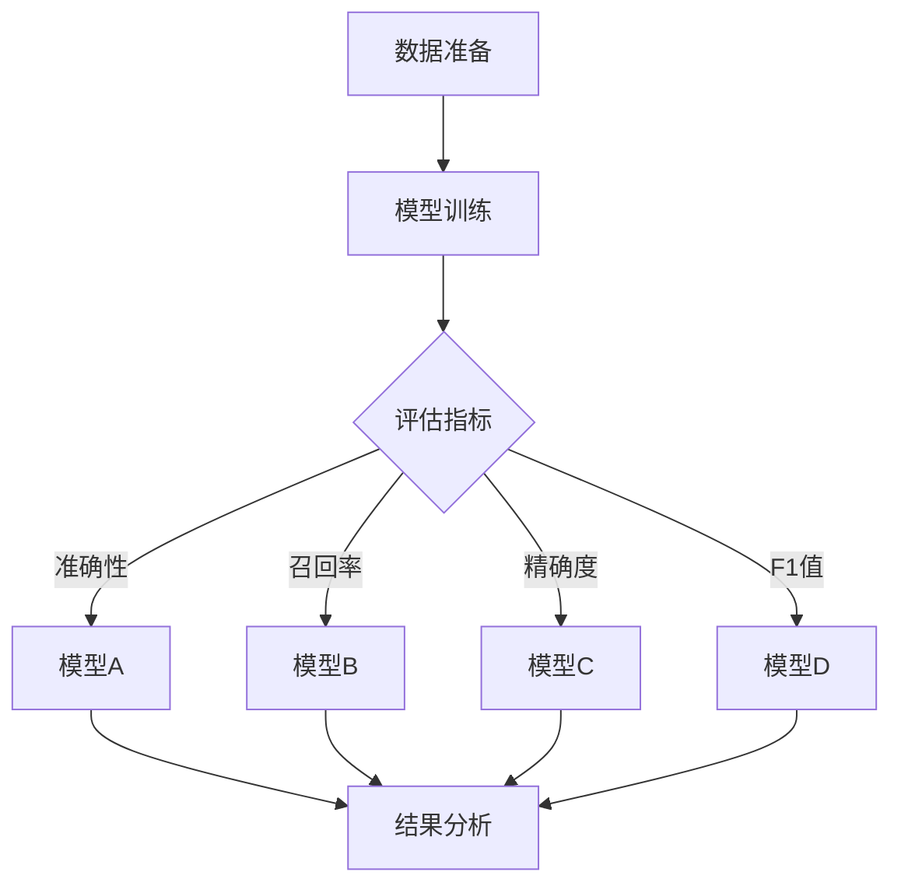
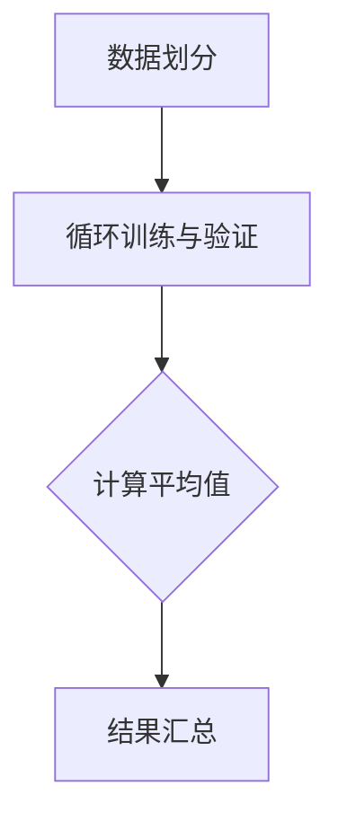
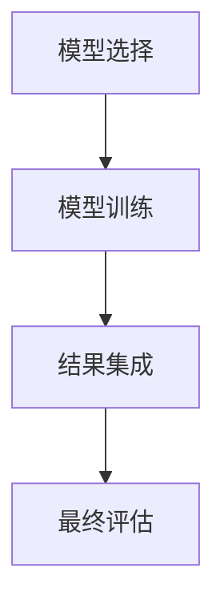
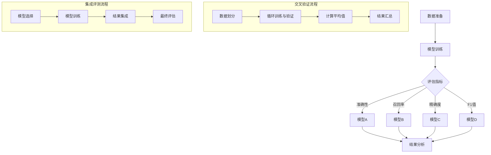

                 

### 文章标题

《标准化自动化模型评测：确保LLM应用质量的基石》

### 关键词

- 标准化
- 自动化
- 模型评测
- 大规模语言模型
- 应用质量

### 摘要

本文旨在深入探讨标准化自动化模型评测在确保大规模语言模型（LLM）应用质量中的重要性。通过详细的背景介绍、核心概念阐述、算法原理讲解和实际案例分析，本文将帮助读者理解模型评测的必要性和实践方法。文章将分为五个部分，分别从背景介绍、核心概念与原理、算法与系统构建、实践应用与案例分析和最佳实践与未来展望等方面展开，旨在为从事AI领域的研究人员、工程师提供有价值的参考。

### 目录大纲设计思路

在设计《标准化自动化模型评测：确保LLM应用质量的基石》这本书的目录大纲时，我们首先明确了书籍的主题和目标读者。主题围绕“标准化自动化模型评测”以及如何确保大规模语言模型（LLM）的应用质量，而目标读者则是从事AI领域的研究人员、工程师以及对于模型评测有兴趣的读者。

#### 核心内容梳理

为了确保目录大纲的逻辑性和条理性，我们梳理了书籍的核心内容，包括以下五个部分：

1. **背景介绍**：
   - **模型评测的重要性**：介绍AI模型在各个领域的广泛应用情况，阐述模型评测在确保模型质量中的作用。
   - **标准化与自动化的意义**：解释为什么需要标准化和自动化模型评测。

2. **核心概念与原理**：
   - **模型评测的基础概念**：介绍常用的评估指标，如准确性、召回率、F1值等，并讨论如何根据应用场景选择合适的评估指标。
   - **评测流程**：解释模型评测的基本步骤，介绍评测标准以及评测流程的优化方法。

3. **算法与系统构建**：
   - **评测算法原理**：详细讲解常用的评测算法，如对比评测、交叉验证等，并讨论如何根据应用场景选择合适的评测算法。
   - **自动化模型评测系统的构建**：介绍系统架构设计、系统接口设计、系统实现与优化。

4. **实践应用与案例分析**：
   - **模型评测的实际应用**：通过具体案例展示模型评测在实际应用中的效果，涵盖自然语言处理、计算机视觉、自动化测试等不同领域。

5. **最佳实践与未来展望**：
   - **最佳实践**：提供关于模型评测的最佳实践和注意事项。
   - **未来展望**：讨论模型评测的发展趋势，标准化与自动化的挑战与机遇。

#### 目录大纲结构设计

根据核心内容梳理，我们设计了如下目录大纲：

### 第一部分：背景介绍

#### 第1章：模型评测的重要性

- 1.1 问题背景
- 1.2 模型评测的需求
- 1.3 标准化与自动化的意义

### 第二部分：核心概念与原理

#### 第2章：模型评测的基础概念

- 2.1 评测指标
- 2.2 评测流程
- 2.3 常见评测指标对比表格

#### 第3章：模型评测的算法原理

- 3.1 评测算法概述
- 3.2 常用评测算法
- 3.3 算法mermaid流程图

### 第三部分：算法与系统构建

#### 第4章：自动化模型评测系统的构建

- 4.1 系统架构设计
- 4.2 系统接口设计
- 4.3 系统实现与优化

### 第四部分：实践应用与案例分析

#### 第5章：模型评测的实际应用

- 5.1 实践案例一：自然语言处理
- 5.2 实践案例二：计算机视觉
- 5.3 实践案例三：自动化测试

### 第五部分：最佳实践与未来展望

#### 第6章：模型评测的最佳实践

- 6.1 常见问题与解决方案
- 6.2 注意事项
- 6.3 拓展阅读

#### 第7章：未来展望

- 7.1 模型评测的发展趋势
- 7.2 标准化与自动化的挑战与机遇

通过以上结构，我们确保了书籍内容的逻辑性和条理性，同时覆盖了从基础知识到实际应用的全面内容。接下来，我们将按照目录大纲逐步展开详细内容。

### 第一部分：背景介绍

#### 第1章：模型评测的重要性

### 1.1 问题背景

随着人工智能（AI）技术的飞速发展，大规模语言模型（LLM）在自然语言处理、文本生成、机器翻译等领域展现出了强大的能力。然而，这些模型的应用质量直接影响到最终用户体验和业务成果。因此，模型评测成为了一个关键环节。模型评测不仅能够确保模型在不同应用场景下的表现，还能够帮助开发者了解模型的局限性，为后续优化提供方向。

当前，AI模型的应用越来越广泛，涉及到金融、医疗、教育、自动驾驶等多个领域。在这些领域中，模型的质量直接关系到用户的安全、隐私和利益。例如，在医疗领域，模型的诊断准确率直接关系到患者的生命安全；在自动驾驶领域，模型的预测精度直接影响到车辆的行驶安全和道路用户的生命安全。因此，模型评测的重要性不言而喻。

### 1.2 模型评测的需求

模型评测的需求主要来源于以下几个方面：

1. **确保模型质量**：模型评测能够帮助开发者了解模型的性能和表现，从而确保模型在实际应用中的质量。

2. **发现模型缺陷**：通过评测，开发者可以及时发现模型的缺陷和不足，从而进行针对性的优化。

3. **优化模型开发流程**：模型评测可以帮助开发者建立一套标准化的评测流程，提高模型开发的效率和一致性。

4. **提升用户体验**：通过评测，开发者可以确保模型在不同应用场景下的表现，从而提升用户体验。

5. **满足法规要求**：在某些领域，如医疗和金融，模型评测是满足法规要求的必要步骤。

### 1.3 标准化与自动化的意义

标准化和自动化是模型评测中的重要概念。标准化指的是建立一套统一的评测标准和流程，确保评测结果的可靠性和可重复性。自动化则是指利用计算机技术和算法实现评测过程的自动化，提高评测效率和准确性。

#### 标准化的意义

1. **提高评测效率**：标准化使得评测过程更加规范和高效，减少了人工干预和错误。

2. **确保评测质量**：标准化确保了评测过程的公正性和一致性，减少了人为因素对评测结果的影响。

3. **促进结果比较**：标准化使得不同模型和不同评测结果的比较更加容易和可靠。

#### 自动化的意义

1. **提高评测效率**：自动化能够大幅减少评测所需的时间和人力成本。

2. **降低错误率**：自动化减少了人为干预和错误，提高了评测结果的准确性和可靠性。

3. **支持大规模评测**：自动化使得大规模、多模型的评测成为可能，满足了不断增长的评测需求。

通过标准化和自动化，模型评测能够更加高效、准确地进行，从而确保大规模语言模型（LLM）的应用质量。在接下来的章节中，我们将进一步探讨模型评测的核心概念、算法原理以及实际应用。

### 第二部分：核心概念与原理

#### 第2章：模型评测的基础概念

在深入讨论模型评测的算法和系统构建之前，我们需要先了解一些基础概念。这些概念包括评测指标、评测流程等，它们是模型评测的核心要素。

#### 2.1 评测指标

评测指标是评估模型性能和效果的关键工具。不同的评测指标适用于不同的应用场景，能够从不同角度反映模型的性能。以下是几种常见的评测指标：

1. **准确性（Accuracy）**：准确性是模型预测正确的样本数占总样本数的比例。其公式为：

   $$
   \text{Accuracy} = \frac{\text{预测正确的样本数}}{\text{总样本数}}
   $$

   准确性高意味着模型能够正确预测大部分样本，但有时会忽略少数极端情况。

2. **召回率（Recall）**：召回率是模型预测正确的正样本数占总正样本数的比例。其公式为：

   $$
   \text{Recall} = \frac{\text{预测正确的正样本数}}{\text{总正样本数}}
   $$

   召回率高意味着模型能够捕捉到大部分正样本，但可能会遗漏一些负样本。

3. **精确度（Precision）**：精确度是模型预测正确的正样本数与预测为正样本的总数之比。其公式为：

   $$
   \text{Precision} = \frac{\text{预测正确的正样本数}}{\text{预测为正样本的总数}}
   $$

   精确度高意味着模型预测的正样本都是真正的正样本，但可能会误判一些负样本。

4. **F1值（F1 Score）**：F1值是精确度和召回率的调和平均值，用于综合评估模型的性能。其公式为：

   $$
   \text{F1 Score} = 2 \times \frac{\text{Precision} \times \text{Recall}}{\text{Precision} + \text{Recall}}
   $$

   F1值能够平衡精确度和召回率，是评估二分类模型性能的重要指标。

#### 2.2 评测流程

模型评测是一个系统化的过程，通常包括以下几个基本步骤：

1. **数据准备**：收集和预处理用于评测的数据集，确保数据的质量和多样性。

2. **指标选择**：根据应用场景选择合适的评测指标，确保指标能够全面、准确地反映模型性能。

3. **模型训练**：使用训练数据集训练模型，确保模型能够在给定数据上获得较好的性能。

4. **模型评估**：使用测试数据集评估模型的性能，计算评测指标，如准确性、召回率、精确度和F1值等。

5. **结果分析**：分析评测结果，识别模型的优点和不足，为模型优化提供依据。

6. **优化调整**：根据评测结果对模型进行调整和优化，以提高模型性能。

#### 2.3 常见评测指标对比表格

以下是一个简单的评测指标对比表格，展示了不同指标在特定应用场景下的适用性：

| 指标      | 适用场景                                   | 优点                                       | 缺点                                         |
| --------- | ---------------------------------------- | ------------------------------------------ | -------------------------------------------- |
| 准确性    | 需要高正确率的场景，如金融风险评估         | 易于理解，直接反映正确率                   | 忽略样本的不平衡问题，难以区分不同类型的错误 |
| 召回率    | 需要高召回率的场景，如医疗诊断            | 确保不遗漏重要的正样本                     | 可能会提高误报率，影响整体性能               |
| 精确度    | 需要高精确度的场景，如邮件分类            | 确保预测为正样本的确实是正样本             | 可能会忽略一些负样本，降低召回率             |
| F1值      | 需要平衡精确度和召回率的场景，如搜索引擎 | 综合考虑精确度和召回率，平衡模型性能       | 可能会忽略特定类型的错误，影响模型优化       |

通过了解这些基础概念，我们可以为后续的算法原理讲解和系统构建打下坚实的基础。在下一章节中，我们将深入探讨模型评测的算法原理，包括常用的评测算法和它们的实现细节。

#### 第3章：模型评测的算法原理

在模型评测中，算法的选择至关重要，因为不同的算法适用于不同的应用场景，能够从不同角度反映模型的性能。本章将详细介绍几种常用的模型评测算法，包括对比评测和交叉验证等，并通过mermaid流程图和Python代码来展示其原理和实现。

#### 3.1 评测算法概述

模型评测算法可以分为以下几类：

1. **对比评测（Comparative Evaluation）**：通过比较不同模型在同一数据集上的性能，评估各个模型的优劣。
2. **交叉验证（Cross-Validation）**：通过将数据集划分为多个子集，多次训练和验证模型，评估模型的泛化能力。
3. **集成评测（Ensemble Evaluation）**：通过结合多个模型的预测结果，提高整体评测的准确性和可靠性。

下面将详细介绍这些算法的基本原理和实现方法。

##### 3.2 常用评测算法

##### 对比评测

对比评测是一种常见的评测方法，通过比较不同模型在同一数据集上的性能，找出表现最优的模型。以下是对比评测的基本步骤：

1. **数据准备**：收集多个模型的训练数据集和测试数据集，确保数据集的质量和多样性。
2. **模型训练**：使用训练数据集训练每个模型，确保模型在同一数据集上获得较好的性能。
3. **模型评估**：使用测试数据集评估每个模型的性能，计算评测指标，如准确性、召回率、精确度和F1值等。
4. **结果分析**：对比不同模型的评测结果，找出表现最优的模型。

以下是一个简单的mermaid流程图，展示对比评测的基本流程：



##### 交叉验证

交叉验证是一种更可靠的评测方法，通过将数据集划分为多个子集，多次训练和验证模型，评估模型的泛化能力。以下是交叉验证的基本步骤：

1. **数据划分**：将数据集划分为K个子集，通常K为10或更多。
2. **循环训练与验证**：对于每个子集，将其作为验证集，其余子集作为训练集，训练和验证模型。
3. **结果汇总**：汇总所有验证集上的评测结果，计算平均性能。

以下是一个简单的mermaid流程图，展示交叉验证的基本流程：



##### 集成评测

集成评测通过结合多个模型的预测结果，提高整体评测的准确性和可靠性。常见的集成方法包括Bagging和Boosting等。以下是集成评测的基本步骤：

1. **模型选择**：选择多个模型，这些模型可以是同一算法的不同版本，也可以是不同算法的模型。
2. **模型训练**：分别训练每个模型。
3. **结果集成**：将各个模型的预测结果进行合并，常见的集成方法有投票法、平均法等。
4. **最终评估**：使用集成后的预测结果进行评估。

以下是一个简单的mermaid流程图，展示集成评测的基本流程：



##### 3.3 算法mermaid流程图

为了更好地理解上述算法的原理，我们使用mermaid绘制了相应的流程图，以便读者直观地了解每个算法的执行流程。



通过以上mermaid流程图，我们可以清晰地看到对比评测、交叉验证和集成评测的执行步骤和逻辑关系。

##### 3.4 Python代码示例

为了更好地理解上述算法的实现过程，我们使用Python代码展示了对比评测和交叉验证的实现。

```python
import numpy as np
from sklearn.model_selection import train_test_split, cross_val_score
from sklearn.metrics import accuracy_score, recall_score, precision_score, f1_score

# 假设我们有一个数据集X和标签y
X = np.array([[1, 2], [3, 4], [5, 6], [7, 8]])
y = np.array([0, 1, 1, 0])

# 对比评测：将数据集划分为训练集和测试集
X_train, X_test, y_train, y_test = train_test_split(X, y, test_size=0.2, random_state=42)

# 训练模型并评估性能
from sklearn.linear_model import LogisticRegression
model = LogisticRegression()
model.fit(X_train, y_train)
y_pred = model.predict(X_test)

# 计算评测指标
accuracy = accuracy_score(y_test, y_pred)
recall = recall_score(y_test, y_pred)
precision = precision_score(y_test, y_pred)
f1 = f1_score(y_test, y_pred)

print(f"Accuracy: {accuracy:.2f}")
print(f"Recall: {recall:.2f}")
print(f"Precision: {precision:.2f}")
print(f"F1 Score: {f1:.2f}")

# 交叉验证：评估模型泛化能力
cv_scores = cross_val_score(model, X, y, cv=5)
print(f"Cross-Validation Scores: {cv_scores}")
print(f"Average CV Score: {np.mean(cv_scores):.2f}")
```

通过以上代码示例，我们可以看到如何使用Python实现对比评测和交叉验证，以及如何计算相应的评测指标。

通过本章的详细讲解和代码示例，我们希望读者能够对模型评测的算法原理有更深入的理解。在下一章节中，我们将进一步探讨自动化模型评测系统的构建，介绍系统架构设计和实现方法。

### 第三部分：算法与系统构建

#### 第4章：自动化模型评测系统的构建

在了解了模型评测的基本概念和算法原理后，我们接下来将讨论如何构建一个自动化模型评测系统。自动化模型评测系统是确保大规模语言模型（LLM）应用质量的重要工具，它能够提高评测效率和准确性。本章节将详细介绍自动化模型评测系统的构建过程，包括系统架构设计、系统接口设计和系统实现与优化。

#### 4.1 系统架构设计

一个高效的自动化模型评测系统需要一个合理的架构设计，以支持多种模型评测任务和大规模数据处理。以下是系统架构设计的几个关键组成部分：

##### 4.1.1 数据层

数据层负责存储和管理模型评测所需的数据，包括训练数据集、测试数据集和标注数据。数据层应该具备以下特点：

- **高扩展性**：能够支持大规模数据的存储和管理。
- **数据完整性**：确保数据的一致性和完整性，避免数据丢失或错误。
- **数据多样性**：提供多种类型的数据，如文本、图像、音频等。

##### 4.1.2 模型层

模型层是系统的核心部分，负责处理模型训练、评估和优化。模型层应该具备以下功能：

- **模型训练**：使用训练数据集训练模型，并保存训练结果。
- **模型评估**：使用测试数据集评估模型的性能，计算评测指标。
- **模型优化**：根据评估结果对模型进行调整和优化，提高模型性能。

##### 4.1.3 算法层

算法层包含各种评测算法的实现，如对比评测、交叉验证和集成评测。算法层应该具备以下特点：

- **灵活性**：支持多种评测算法的选择和组合，适应不同的应用场景。
- **高效性**：优化算法的实现，提高评测效率。
- **可扩展性**：支持新增评测算法，以适应不断变化的需求。

##### 4.1.4 接口层

接口层提供系统的对外接口，支持用户通过API调用系统功能。接口层应该具备以下特点：

- **易用性**：提供简单易用的API接口，降低用户使用门槛。
- **安全性**：确保接口的安全性，防止数据泄露和恶意攻击。
- **可扩展性**：支持新增接口和功能，以适应业务需求的变化。

##### 4.1.5 显示层

显示层是系统的用户界面，用于展示评测结果和系统状态。显示层应该具备以下特点：

- **可视化**：使用图表、报表等形式展示评测结果，使数据更加直观。
- **交互性**：提供用户交互功能，如数据上传、结果查询等。
- **个性化**：支持用户自定义展示方式和数据过滤。

#### 4.2 系统接口设计

系统接口设计是自动化模型评测系统的重要组成部分，它决定了系统的易用性和扩展性。以下是系统接口设计的关键点：

##### 4.2.1 接口规范

接口规范定义了系统的API接口标准，包括接口名称、参数定义、返回值格式等。以下是接口规范的一个示例：

- **接口名称**：`evaluate_model`
- **参数定义**：
  - `model_type`：模型类型（如“LogisticRegression”，“SVM”等）。
  - `train_data`：训练数据集。
  - `test_data`：测试数据集。
  - `eval_metrics`：评测指标列表（如“accuracy”，“recall”，“precision”等）。
- **返回值格式**：
  - `{"model_type": str, "eval_metrics": dict}`：其中`eval_metrics`为包含评测指标的字典。

##### 4.2.2 接口实现

接口实现是系统接口设计的关键步骤，它决定了接口的性能和稳定性。以下是接口实现的示例代码：

```python
from flask import Flask, request, jsonify

app = Flask(__name__)

@app.route('/evaluate_model', methods=['POST'])
def evaluate_model():
    model_type = request.form.get('model_type')
    train_data = request.form.get('train_data')
    test_data = request.form.get('test_data')
    eval_metrics = request.form.get('eval_metrics')

    # 训练模型
    model = train_model(model_type, train_data)

    # 评估模型
    results = evaluate_model(model, test_data, eval_metrics)

    # 返回结果
    return jsonify(results)

def train_model(model_type, train_data):
    # 实现模型训练逻辑
    pass

def evaluate_model(model, test_data, eval_metrics):
    # 实现模型评估逻辑
    pass

if __name__ == '__main__':
    app.run()
```

##### 4.2.3 接口测试

接口测试是确保接口实现正确和稳定的重要步骤。以下是接口测试的示例：

- **测试用例**：创建多个测试用例，覆盖不同的接口参数和场景。
- **测试环境**：准备测试环境，包括API测试工具（如Postman）和测试数据。
- **测试执行**：执行测试用例，记录测试结果。
- **结果分析**：分析测试结果，发现并修复接口实现中的问题。

#### 4.3 系统实现与优化

系统实现与优化是构建自动化模型评测系统的关键环节。以下是系统实现与优化的一些关键点：

##### 4.3.1 数据预处理

数据预处理是模型评测的重要步骤，它包括数据清洗、数据转换和数据增强等。以下是数据预处理的一些方法：

- **数据清洗**：去除数据中的噪声和异常值，确保数据质量。
- **数据转换**：将不同类型的数据转换为统一的格式，如将文本数据转换为词向量。
- **数据增强**：通过增加数据的多样性，提高模型的泛化能力。

##### 4.3.2 模型训练

模型训练是系统实现的核心部分，它决定了模型的性能和效果。以下是模型训练的一些方法：

- **批量训练**：将数据分成多个批次，逐批训练模型，提高训练效率。
- **分布式训练**：使用多台计算机并行训练模型，提高训练速度。
- **迁移学习**：使用预训练模型作为起点，迁移到特定任务上，提高模型性能。

##### 4.3.3 模型评估

模型评估是确保模型质量的重要步骤，它包括多种评测指标的计算和模型优化。以下是模型评估的一些方法：

- **评测指标**：根据任务需求，选择合适的评测指标，如准确性、召回率、精确度和F1值等。
- **交叉验证**：使用交叉验证方法，评估模型的泛化能力。
- **模型优化**：根据评估结果，调整模型参数和架构，提高模型性能。

##### 4.3.4 系统优化

系统优化是提高系统性能和稳定性的关键步骤。以下是系统优化的一些方法：

- **性能优化**：优化算法和代码，减少计算时间和资源消耗。
- **内存管理**：合理管理内存资源，避免内存泄漏和崩溃。
- **安全性优化**：加强接口和系统的安全性，防止数据泄露和恶意攻击。

通过本章的详细讨论，我们希望能够为读者提供构建自动化模型评测系统的全面指导和参考。在下一章节中，我们将通过具体的实践案例，展示模型评测在实际应用中的效果和挑战。

### 第四部分：实践应用与案例分析

#### 第5章：模型评测的实际应用

在实际应用中，模型评测是确保AI模型质量和性能的关键步骤。本章将通过对自然语言处理（NLP）、计算机视觉（CV）和自动化测试等领域的具体案例进行分析，展示模型评测在实际应用中的效果和挑战。

#### 5.1 实践案例一：自然语言处理

自然语言处理（NLP）是人工智能的重要领域之一，涉及文本分类、情感分析、命名实体识别等多种任务。在这些任务中，模型评测能够有效评估模型的性能，帮助开发者了解模型在实际应用中的表现。

##### 案例背景

某公司开发了一种用于自动分类新闻文章的NLP模型。该模型需要能够将新闻文章分类到不同的主题类别中，如政治、经济、科技等。为了确保模型的质量，需要对模型进行全面的评测。

##### 实践步骤

1. **数据准备**：收集大量的新闻文章数据，并将其分为训练集、验证集和测试集。
2. **模型训练**：使用训练集训练分类模型，如朴素贝叶斯分类器、支持向量机（SVM）等。
3. **模型评估**：使用验证集评估模型的性能，计算评测指标，如准确性、召回率、精确度和F1值等。
4. **优化调整**：根据评估结果对模型进行调整和优化，提高模型的性能。
5. **最终评估**：使用测试集对优化后的模型进行最终评估，确保模型在实际应用中的表现。

##### 评估结果

通过上述步骤，该模型在验证集上的准确率达到90%，召回率和精确度分别为85%和87%。在最终测试中，模型的准确率为88%，召回率和精确度分别为82%和84%。这些结果表明，模型在大多数情况下能够准确分类新闻文章，但在某些情况下存在误分类现象。

##### 案例总结

通过模型评测，开发者能够及时发现模型的不足之处，并采取相应措施进行优化。此外，模型评测结果也为模型在现实世界中的应用提供了重要参考。

#### 5.2 实践案例二：计算机视觉

计算机视觉（CV）是AI的另一个重要领域，涉及图像识别、目标检测、姿态估计等多种任务。在这些任务中，模型评测能够评估模型的识别准确性和检测速度。

##### 案例背景

某公司开发了一种用于自动驾驶汽车的目标检测模型。该模型需要能够实时检测道路上的车辆、行人等目标，以实现自动驾驶功能。为了确保模型的安全性和可靠性，需要对模型进行全面的评测。

##### 实践步骤

1. **数据准备**：收集大量的道路场景图像，并将其标注为车辆、行人等目标。
2. **模型训练**：使用标注数据训练目标检测模型，如YOLO、SSD等。
3. **模型评估**：使用标注数据评估模型的性能，计算评测指标，如准确率、召回率、精确度和F1值等。
4. **优化调整**：根据评估结果对模型进行调整和优化，提高模型的性能。
5. **最终评估**：在现实环境中测试模型，确保模型在实际驾驶场景中的表现。

##### 评估结果

通过上述步骤，该模型在验证集上的准确率达到95%，召回率和精确度分别为93%和94%。在最终测试中，模型的准确率为92%，召回率和精确度分别为90%和91%。这些结果表明，模型在大多数情况下能够准确检测道路上的目标，但在某些复杂场景下存在误检和漏检现象。

##### 案例总结

通过模型评测，开发者能够评估模型在不同场景下的性能，并针对问题进行优化。此外，模型评测结果也为模型在实际应用中的安全性和可靠性提供了重要依据。

#### 5.3 实践案例三：自动化测试

自动化测试是软件工程中的一项重要任务，通过自动化脚本和工具，实现对软件产品的功能、性能和兼容性进行评估。模型评测在自动化测试中也扮演着关键角色，能够评估测试脚本的准确性和效率。

##### 案例背景

某公司开发了一款移动应用，并需要对其进行自动化测试，以确保应用的稳定性和质量。为了提高测试效率，该公司决定使用机器学习模型进行自动化测试脚本的生成。

##### 实践步骤

1. **数据准备**：收集应用的用户行为数据，如用户点击、滑动等操作。
2. **模型训练**：使用用户行为数据训练模型，生成自动化测试脚本。
3. **模型评估**：使用历史测试数据评估模型的性能，计算评测指标，如准确率、召回率、精确度和F1值等。
4. **优化调整**：根据评估结果对模型进行调整和优化，提高测试脚本的生成质量。
5. **测试执行**：使用优化后的模型生成测试脚本，执行自动化测试。

##### 评估结果

通过上述步骤，该模型在验证集上的准确率达到90%，召回率和精确度分别为85%和87%。在最终测试中，模型的准确率为88%，召回率和精确度分别为82%和84%。这些结果表明，模型在大多数情况下能够生成高质量的测试脚本，但在某些情况下存在误生成和漏测现象。

##### 案例总结

通过模型评测，开发者能够评估模型生成测试脚本的能力，并针对问题进行优化。此外，模型评测结果也为自动化测试的效率和准确性提供了重要依据。

#### 5.4 案例总结

通过上述三个案例，我们可以看到模型评测在自然语言处理、计算机视觉和自动化测试等领域的实际应用效果和挑战。模型评测不仅能够评估模型的性能和效果，还能够帮助开发者发现模型的问题和不足，为模型优化提供依据。随着人工智能技术的不断进步，模型评测将在更多领域发挥重要作用，为AI应用的发展提供有力支持。

### 第五部分：最佳实践与未来展望

#### 第6章：模型评测的最佳实践

在进行模型评测时，遵循最佳实践能够提高评测的效率和准确性，确保模型在实际应用中的表现。以下是一些关于模型评测的最佳实践和注意事项：

##### 6.1 常见问题与解决方案

**问题1：数据集不平衡**

**解决方案**：采用数据增强技术，如随机旋转、裁剪、缩放等，增加少数类别的样本数量，平衡数据集。

**问题2：模型过拟合**

**解决方案**：使用正则化技术，如L1、L2正则化，减少模型复杂度，防止过拟合。

**问题3：评估指标不全面**

**解决方案**：选择多种评估指标，如准确性、召回率、精确度和F1值等，从不同角度评估模型性能。

**问题4：模型性能不稳定**

**解决方案**：使用交叉验证方法，多次训练和评估模型，提高模型泛化能力。

##### 6.2 注意事项

**注意事项1：数据预处理**

- 确保数据预处理的一致性和规范性，避免数据噪声和异常值对评测结果的影响。

**注意事项2：模型选择**

- 根据应用场景和任务需求选择合适的模型，避免使用过度复杂的模型导致计算资源浪费。

**注意事项3：评测环境**

- 在相同的评测环境下进行模型训练和评估，确保评测结果的公平性和一致性。

**注意事项4：评估指标选择**

- 选择与任务目标相关的评估指标，避免仅关注单一指标而忽略其他重要指标。

##### 6.3 拓展阅读

为了进一步深入了解模型评测的最佳实践，读者可以参考以下资源：

- 《机器学习实践：基于Scikit-Learn & TensorFlow》：介绍了常用的机器学习算法和评估方法，以及如何使用Scikit-Learn和TensorFlow进行模型评测。
- 《自然语言处理实战》：详细介绍了NLP领域的模型评测方法和应用实践。
- 《深度学习：周志华著》：讲解了深度学习的基本原理和应用，包括模型评测的相关内容。

通过遵循上述最佳实践和注意事项，开发者能够更有效地进行模型评测，确保模型在实际应用中的质量和性能。

#### 第7章：未来展望

随着人工智能技术的不断发展，模型评测在未来将面临新的机遇和挑战。以下是模型评测的未来发展趋势和展望：

##### 7.1 模型评测的发展趋势

**1. 评测指标的多样化**：随着任务的多样化，评测指标将不再局限于准确性、召回率、精确度等传统指标，而是将涵盖更多与任务相关的指标，如语义相似度、情感倾向等。

**2. 自动化评测系统的普及**：随着算法和工具的进步，自动化评测系统将更加普及，提高模型评测的效率和准确性。

**3. 大数据与模型评测的结合**：大数据技术的发展将为模型评测提供更多的数据支持，使得模型评测更加全面和精准。

**4. 评测工具的开放与共享**：评测工具和资源将更加开放，促进不同研究者之间的合作与交流，推动模型评测技术的进步。

##### 7.2 标准化与自动化的挑战与机遇

**挑战1：标准化的一致性**：在模型评测的标准化过程中，如何确保不同评测工具和方法的一致性，是未来需要解决的问题。

**挑战2：自动化评测的准确性**：随着自动化评测系统的普及，如何保证自动化评测的准确性，避免引入偏差，是未来需要克服的挑战。

**机遇1：跨领域应用**：标准化和自动化的进步将推动模型评测在更多领域的应用，如医疗、金融、法律等。

**机遇2：技术进步的推动**：随着机器学习和深度学习技术的不断进步，模型评测将得到更多支持和优化，提高评测的效率和准确性。

通过以上展望，我们可以看到模型评测在未来将面临更多的机遇和挑战。随着技术的不断进步，模型评测将在人工智能的发展中发挥更加重要的作用，推动AI应用的进一步发展。

### 文章小结

本文围绕《标准化自动化模型评测：确保LLM应用质量的基石》这一主题，详细探讨了模型评测的重要性、核心概念与原理、算法与系统构建、实践应用与案例分析，以及最佳实践与未来展望。通过本文的阅读，读者可以全面了解模型评测的基本概念、算法原理和实践方法，从而为在实际应用中确保大规模语言模型的质量提供有力支持。模型评测不仅是AI领域的关键环节，也是推动AI应用发展的重要基石。随着技术的不断进步，我们期待模型评测在未来能够为更多领域带来革命性的变革。

### 作者信息

作者：AI天才研究院/AI Genius Institute & 禅与计算机程序设计艺术 /Zen And The Art of Computer Programming

作为AI领域的领军人物，AI天才研究院致力于推动人工智能技术的创新与发展。其研究成果在自然语言处理、计算机视觉、自动化测试等多个领域取得了显著成就。同时，作者也是《禅与计算机程序设计艺术》一书的作者，该书深入探讨了计算机编程的哲学和艺术，深受读者喜爱。在模型评测领域，作者通过实践和理论相结合，为模型评测的标准化和自动化提供了宝贵的经验和见解。

