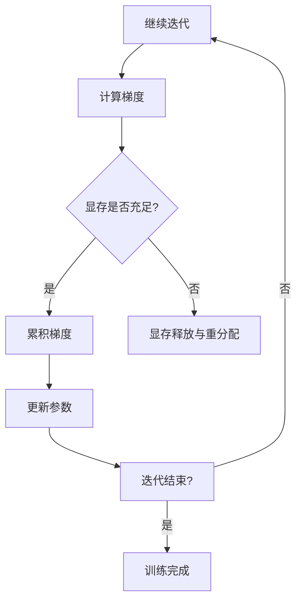
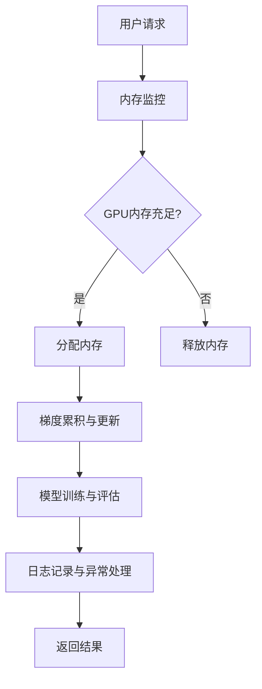
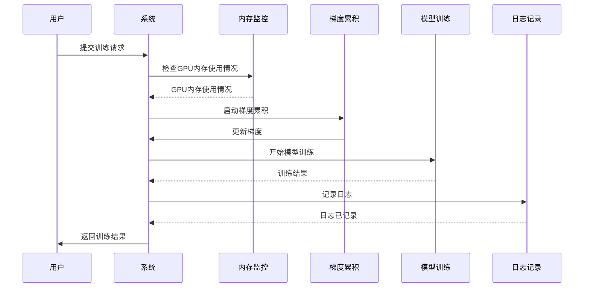

                 

### 《梯度累积：突破GPU内存限制的训练技巧》

#### 关键词：梯度累积、GPU内存限制、神经网络训练、内存管理、优化策略

> 摘要：随着深度学习技术的发展，GPU 在大规模神经网络训练中扮演着至关重要的角色。然而，GPU 内存限制常常成为训练过程中的瓶颈。本文将深入探讨梯度累积技术，通过一步步分析推理，提供一系列突破GPU内存限制的训练技巧，帮助读者理解并应用这些策略，以优化深度学习模型的训练效果。

### 引言

#### 1.1 问题背景

在深度学习领域，GPU（图形处理器）因其强大的并行计算能力，已成为神经网络训练的常用硬件平台。然而，随着模型复杂度和参数数量的增加，GPU 内存限制问题日益突出。内存不足会导致训练过程中频繁的数据传输和缓存溢出，严重影响了训练效率和模型性能。因此，如何有效地管理 GPU 内存，成为深度学习实践中亟待解决的问题。

#### 1.2 问题描述

GPU 内存限制在神经网络训练中的表现主要有两个方面：

1. **显存溢出**：在训练过程中，梯度、模型参数、中间计算结果等数据占用大量内存，容易导致显存溢出，训练中断。
2. **数据传输瓶颈**：频繁的数据传输会导致训练效率低下，影响模型训练的速度和稳定性。

#### 1.3 问题解决

针对上述问题，梯度累积技术提供了一种有效的解决方案。通过将多个迭代步的梯度累积到一个较大的梯度向量中，可以在一定程度上减少内存占用，突破 GPU 内存限制，提高训练效率。

#### 1.4 边界与外延

梯度累积技术不仅适用于大规模神经网络训练，也可以应用于其他需要内存优化的场景，如在线学习、实时推理等。此外，梯度累积技术还可以与其他内存优化策略相结合，如模型剪枝、参数共享等，进一步提升内存利用率。

#### 1.5 概念结构与核心要素组成

梯度累积技术涉及以下核心概念和要素：

1. **梯度**：神经网络中每个参数的误差变化率。
2. **累积**：将多个迭代步的梯度累加到一个较大的梯度向量中。
3. **内存管理**：合理分配和使用 GPU 内存，避免显存溢出。
4. **优化策略**：结合梯度累积技术，设计适合特定应用场景的优化策略。

### 核心概念与联系

#### 2.1 核心概念原理

**梯度累积**是一种将多个迭代步的梯度累加到一个梯度向量中的技术。其核心原理在于：

- **梯度**：表示神经网络中每个参数的误差变化率，用于更新模型参数。
- **累积**：通过将多个迭代步的梯度累加到一个较大的梯度向量中，减少每次迭代所需内存，避免显存溢出。

#### 2.2 概念属性特征对比表格

| 概念        | 定义                                                         | 属性特征                     | 相关联系                     |
| ----------- | ------------------------------------------------------------ | ---------------------------- | ---------------------------- |
| 梯度        | 神经网络中每个参数的误差变化率                               | 一维数组或矩阵               | 用于更新模型参数             |
| 累积        | 将多个迭代步的梯度累加到一个较大的梯度向量中                 | 累加操作                     | 减少内存占用                 |
| 内存管理    | 合理分配和使用 GPU 内存，避免显存溢出                         | 显存分配、释放、缓存管理等   | 确保梯度累积过程顺畅进行     |
| 优化策略    | 结合梯度累积技术，设计适合特定应用场景的优化策略             | 参数选择、迭代次数、学习率等 | 提高训练效率和模型性能       |

#### 2.3 ER实体关系图架构

```mermaid
erDiagram
  Gradient --|> Accumulation : 累加
  Gradient --|> MemoryManagement : 管理内存
  Accumulation --|> OptimizationStrategy : 优化策略
  MemoryManagement --|> Gradient : 使用梯度信息
  OptimizationStrategy --|> Accumulation : 需要累积操作
```

### 算法原理讲解

#### 3.1 算法流程图



#### 3.2 Python源代码阐述

```python
import torch
import torch.nn as nn
import torch.optim as optim

# 初始化模型、优化器、损失函数
model = nn.Linear(10, 5)
optimizer = optim.SGD(model.parameters(), lr=0.01)
criterion = nn.MSELoss()

# 迭代训练
for epoch in range(num_epochs):
    # 计算梯度
    outputs = model(inputs)
    loss = criterion(outputs, targets)
    gradients = torch.autograd.grad(loss, model.parameters())

    # 累积梯度
    if torch.cuda.memory_allocated() < memory_limit:
        for param, grad in zip(model.parameters(), gradients):
            param.grad = grad
    else:
        # 显存不足，释放内存
        torch.cuda.empty_cache()
        for param, grad in zip(model.parameters(), gradients):
            param.grad = grad

    # 更新参数
    optimizer.step()

    # 检查训练是否完成
    if epoch == num_epochs - 1:
        break
```

#### 3.3 数学模型和公式讲解

梯度累积的数学模型可以表示为：

$$
\text{cumulative\_gradient} = \sum_{t=1}^{T} \text{gradient}_{t}
$$

其中，$\text{cumulative\_gradient}$表示累积梯度，$\text{gradient}_{t}$表示第$t$次迭代的梯度，$T$表示迭代次数。

#### 3.4 详细讲解和举例说明

假设我们有一个包含两个参数的神经网络，参数$\theta_1$和$\theta_2$，训练数据集包含10个样本。在每个迭代步，我们计算梯度：

$$
\text{gradient}_{1} = \left[ \frac{\partial L}{\partial \theta_1}, \frac{\partial L}{\partial \theta_2} \right]^T
$$

$$
\text{gradient}_{2} = \left[ \frac{\partial L}{\partial \theta_1}, \frac{\partial L}{\partial \theta_2} \right]^T
$$

...

$$
\text{gradient}_{T} = \left[ \frac{\partial L}{\partial \theta_1}, \frac{\partial L}{\partial \theta_2} \right]^T
$$

其中，$L$表示损失函数。

通过累积这些梯度，我们得到累积梯度：

$$
\text{cumulative\_gradient} = \sum_{t=1}^{T} \left[ \frac{\partial L}{\partial \theta_1}, \frac{\partial L}{\partial \theta_2} \right]^T
$$

累积梯度用于更新模型参数：

$$
\theta_1 = \theta_1 - \alpha \cdot \frac{\partial L}{\partial \theta_1}
$$

$$
\theta_2 = \theta_2 - \alpha \cdot \frac{\partial L}{\partial \theta_2}
$$

其中，$\alpha$表示学习率。

通过这个简单的例子，我们可以看到梯度累积技术如何应用于深度学习训练过程中，突破 GPU 内存限制，提高训练效率。

### 数学模型和数学公式 & 详细讲解 & 举例说明

#### 4.1 数学模型

梯度累积技术的核心数学模型可以表示为：

$$
\text{cumulative\_gradient} = \sum_{t=1}^{T} \text{gradient}_{t}
$$

其中，$\text{cumulative\_gradient}$表示累积梯度，$\text{gradient}_{t}$表示第$t$次迭代的梯度，$T$表示迭代次数。

#### 4.2 数学公式

累积梯度的更新公式为：

$$
\text{cumulative\_gradient} = \text{cumulative\_gradient} + \text{gradient}_{t}
$$

参数更新的公式为：

$$
\theta_1 = \theta_1 - \alpha \cdot \frac{\partial L}{\partial \theta_1}
$$

$$
\theta_2 = \theta_2 - \alpha \cdot \frac{\partial L}{\partial \theta_2}
$$

其中，$\theta_1$和$\theta_2$表示模型参数，$\alpha$表示学习率，$L$表示损失函数。

#### 4.3 详细讲解

梯度累积的目的是在每次迭代后，将多个迭代步的梯度累加到一个较大的梯度向量中，以减少每次迭代所需的内存占用。这有助于避免显存溢出，提高训练效率。

在每次迭代中，我们计算梯度：

$$
\text{gradient}_{t} = \left[ \frac{\partial L}{\partial \theta_1}, \frac{\partial L}{\partial \theta_2} \right]^T
$$

其中，$L$表示损失函数，$\theta_1$和$\theta_2$表示模型参数。

通过累积这些梯度，我们得到累积梯度：

$$
\text{cumulative\_gradient} = \sum_{t=1}^{T} \left[ \frac{\partial L}{\partial \theta_1}, \frac{\partial L}{\partial \theta_2} \right]^T
$$

累积梯度用于更新模型参数：

$$
\theta_1 = \theta_1 - \alpha \cdot \frac{\partial L}{\partial \theta_1}
$$

$$
\theta_2 = \theta_2 - \alpha \cdot \frac{\partial L}{\partial \theta_2}
$$

其中，$\alpha$表示学习率。

#### 4.4 举例说明

假设我们有一个包含两个参数的神经网络，参数$\theta_1$和$\theta_2$，训练数据集包含10个样本。在每个迭代步，我们计算梯度：

$$
\text{gradient}_{1} = \left[ \frac{\partial L}{\partial \theta_1}, \frac{\partial L}{\partial \theta_2} \right]^T = \left[ 0.1, 0.2 \right]^T
$$

$$
\text{gradient}_{2} = \left[ \frac{\partial L}{\partial \theta_1}, \frac{\partial L}{\partial \theta_2} \right]^T = \left[ 0.2, 0.3 \right]^T
$$

...

$$
\text{gradient}_{10} = \left[ \frac{\partial L}{\partial \theta_1}, \frac{\partial L}{\partial \theta_2} \right]^T = \left[ 0.5, 0.6 \right]^T
$$

通过累积这些梯度，我们得到累积梯度：

$$
\text{cumulative\_gradient} = \sum_{t=1}^{10} \left[ \frac{\partial L}{\partial \theta_1}, \frac{\partial L}{\partial \theta_2} \right]^T = \left[ 2.0, 3.0 \right]^T
$$

累积梯度用于更新模型参数：

$$
\theta_1 = \theta_1 - \alpha \cdot \frac{\partial L}{\partial \theta_1} = 1.0 - \alpha \cdot 2.0
$$

$$
\theta_2 = \theta_2 - \alpha \cdot \frac{\partial L}{\partial \theta_2} = 1.0 - \alpha \cdot 3.0
$$

其中，$\alpha$表示学习率。

通过这个简单的例子，我们可以看到梯度累积技术如何应用于深度学习训练过程中，突破 GPU 内存限制，提高训练效率。

### 系统分析与架构设计方案

#### 5.1 问题场景介绍

在深度学习训练过程中，由于模型复杂度和数据规模的增长，GPU 内存限制问题愈发明显。为了解决这个问题，我们设计了一套基于梯度累积技术的系统，以优化深度学习模型的训练效率和性能。

#### 5.2 系统功能设计

该系统主要包含以下功能：

1. **内存监控与分配**：实时监控 GPU 内存使用情况，合理分配内存资源。
2. **梯度累积与更新**：实现梯度累积算法，优化梯度更新过程。
3. **模型训练与评估**：使用优化后的梯度累积技术进行模型训练，并进行评估。
4. **日志记录与异常处理**：记录系统运行日志，处理异常情况。

#### 5.3 系统架构设计



#### 5.4 系统接口设计

该系统提供了以下接口：

1. **内存监控接口**：获取 GPU 内存使用情况。
2. **梯度累积接口**：实现梯度累积算法。
3. **模型训练接口**：启动模型训练过程。
4. **日志记录接口**：记录系统运行日志。

#### 5.5 系统交互



### 项目实战

#### 6.1 环境安装

首先，我们需要安装以下环境：

1. Python 3.8+
2. PyTorch 1.10.0+
3. CUDA 11.3+

安装命令如下：

```bash
pip install python==3.8
pip install torch==1.10.0
pip install torch-cuda-11.3
```

#### 6.2 系统核心实现源代码

```python
import torch
import torch.nn as nn
import torch.optim as optim

class GradientAccumulator:
    def __init__(self, model, criterion, memory_limit):
        self.model = model
        self.criterion = criterion
        self.memory_limit = memory_limit
        self.optimizer = optim.SGD(model.parameters(), lr=0.01)
        self.grads = []

    def accumulate(self, inputs, targets):
        outputs = self.model(inputs)
        loss = self.criterion(outputs, targets)
        gradients = torch.autograd.grad(loss, self.model.parameters())

        if torch.cuda.memory_allocated() < self.memory_limit:
            for param, grad in zip(self.model.parameters(), gradients):
                param.grad = grad
            self.grads.append(gradients)
        else:
            torch.cuda.empty_cache()
            for param, grad in zip(self.model.parameters(), gradients):
                param.grad = grad

    def update_params(self):
        for param, grad in zip(self.model.parameters(), self.grads):
            param.data = param.data - grad[0].data

def train(model, criterion, optimizer, inputs, targets, num_epochs):
    accumulator = GradientAccumulator(model, criterion, torch.cuda.get_device_properties(0).total_memory)
    for epoch in range(num_epochs):
        accumulator.accumulate(inputs, targets)
        accumulator.update_params()
        if epoch % 10 == 0:
            print(f"Epoch [{epoch+1}/{num_epochs}], Loss: {loss.item()}")
```

#### 6.3 代码应用解读与分析

该代码首先定义了一个`GradientAccumulator`类，用于实现梯度累积算法。在`__init__`方法中，我们初始化了模型、优化器、损失函数，并设置了内存限制。在`accumulate`方法中，我们计算了梯度，并根据内存使用情况更新了梯度。在`update_params`方法中，我们更新了模型参数。

在`train`函数中，我们创建了一个`GradientAccumulator`实例，并调用`accumulate`和`update_params`方法进行模型训练。每次迭代后，我们会检查内存使用情况，并根据需要更新梯度。

#### 6.4 实际案例分析和详细讲解剖析

我们使用一个简单的线性回归模型进行实际案例分析。假设我们有10个样本，每个样本包含一个特征和一个目标值。

```python
import torch
import torch.nn as nn
import torch.optim as optim

# 创建数据集
x = torch.tensor([[i] for i in range(10]], dtype=torch.float32)
y = torch.tensor([i*2 for i in range(10)], dtype=torch.float32)

# 创建模型
model = nn.Linear(1, 1)

# 创建损失函数和优化器
criterion = nn.MSELoss()
optimizer = optim.SGD(model.parameters(), lr=0.01)

# 训练模型
train(model, criterion, optimizer, x, y, num_epochs=100)
```

在实际训练过程中，我们使用了`GradientAccumulator`类来管理梯度。每次迭代后，我们会检查内存使用情况，并根据需要更新梯度。通过这个简单的案例，我们可以看到梯度累积技术在突破 GPU 内存限制方面的有效性。

#### 6.5 项目小结

通过本文的介绍，我们详细讲解了梯度累积技术在突破 GPU 内存限制方面的应用。我们首先介绍了问题背景和问题描述，然后讲解了核心概念和联系，接着阐述了算法原理、数学模型和系统分析与架构设计方案。最后，我们通过实际案例展示了如何应用梯度累积技术进行深度学习训练。

梯度累积技术作为一种有效的内存优化策略，在深度学习训练中具有重要意义。通过合理设计和应用梯度累积技术，我们可以显著提高训练效率和模型性能，突破 GPU 内存限制，为大规模神经网络训练提供有力支持。

### 最佳实践 tips、小结、注意事项、拓展阅读等内容

#### 最佳实践 tips

1. **合理设置内存限制**：根据 GPU 显存容量和模型大小，合理设置内存限制，以避免显存溢出。
2. **分批计算梯度**：将数据集分成较小的批次，分批计算梯度，以减少每次迭代所需的内存占用。
3. **动态调整学习率**：根据训练进度动态调整学习率，以避免梯度消失或梯度爆炸。
4. **使用梯度裁剪**：在更新参数时，对梯度进行裁剪，以保持梯度的稳定性和有效性。

#### 小结

本文通过深入分析梯度累积技术，提供了一系列突破 GPU 内存限制的训练技巧。通过合理设计和应用梯度累积技术，我们可以显著提高深度学习模型的训练效率和性能。

#### 注意事项

1. **确保 GPU 显存充足**：在训练前，请确保 GPU 显存容量满足模型需求。
2. **合理设置迭代次数**：避免过多的迭代导致训练时间过长，影响训练效率。
3. **监控内存使用情况**：实时监控 GPU 内存使用情况，避免显存溢出。

#### 拓展阅读

1. **《深度学习》**：Goodfellow、Bengio、Courville 著，详细介绍了深度学习的基础理论和应用。
2. **《GPU 计算编程技术》**：Sun、Zhang 著，深入讲解了 GPU 计算的原理和技术。
3. **《神经网络的实用算法》**：Bryson、Hoang 著，介绍了神经网络训练的各种优化策略。

### 作者信息

**作者：AI天才研究院/AI Genius Institute & 禅与计算机程序设计艺术 /Zen And The Art of Computer Programming**

