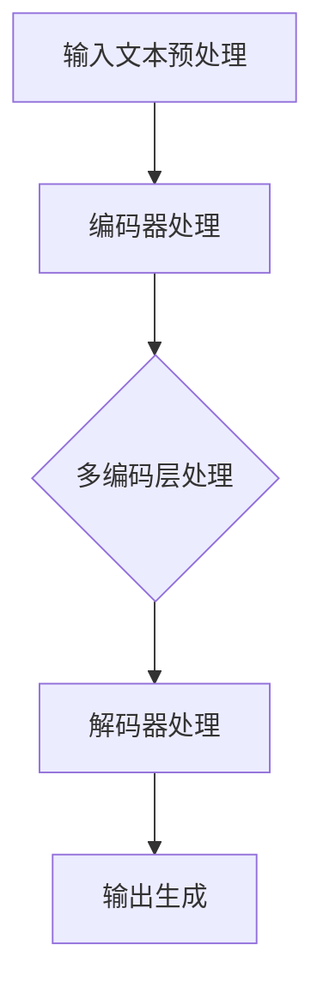
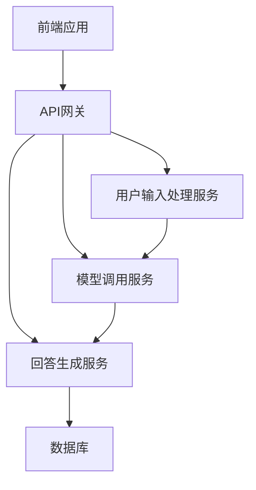

                 


### 《模块化设计促进LLM应用的快速迭代》

#### 关键词：
- 模块化设计
- 大型语言模型（LLM）
- 快速迭代
- 软件工程
- 技术架构

#### 摘要：
本文深入探讨了模块化设计在促进大型语言模型（LLM）应用快速迭代中的作用。通过分析模块化设计的基本原理，以及其在LLM应用中的实际案例，本文展示了如何利用模块化设计实现LLM的高效迭代。文章还结合项目实战，详细说明了模块化设计在LLM应用开发中的具体实现方法，并提出了最佳实践和未来展望。

### 引言与背景

#### 1.1 书籍简介

在现代软件工程中，模块化设计已经成为一种主流的设计方法。模块化设计不仅能够提高软件的复用性、降低维护成本，还能提升开发效率和软件质量。随着人工智能技术的发展，特别是大型语言模型（LLM）的兴起，模块化设计在LLM应用开发中愈发显得重要。

本书旨在探讨模块化设计在促进LLM应用快速迭代中的关键作用。通过系统的分析和实践案例，本书希望能够为软件开发者和AI工程师提供有价值的指导，帮助他们更好地理解和应用模块化设计原则。

#### 1.2 模块化设计与LLM

模块化设计是一种将系统划分为若干独立模块，每个模块负责特定功能的设计方法。这种方法能够有效地降低系统的复杂性，使得系统更加模块化、可维护和可扩展。

LLM是指具有数十亿参数的大型神经网络模型，广泛应用于自然语言处理、机器翻译、对话系统等领域。随着模型的规模不断扩大，如何高效地进行模型设计和迭代成为了一个重要问题。

模块化设计在LLM中的应用，可以通过以下几个方面体现：

1. **功能模块化**：将LLM的功能划分为多个模块，每个模块负责处理特定的任务，如文本预处理、语言建模、后处理等。
2. **数据模块化**：将训练数据划分为不同的模块，每个模块包含特定的数据集，用于模型的训练和评估。
3. **组件模块化**：将LLM中的各个组件，如嵌入层、注意力机制、解码器等，设计成独立的模块，以便于替换和优化。

模块化设计不仅能够提高LLM的可维护性和可扩展性，还能促进快速迭代，加快模型开发和部署的速度。

### 模块化设计基础

#### 2.1 模块化设计的核心概念

模块是具有独立功能的软件单元，它封装了特定的功能实现，并提供了明确的接口。模块化设计的核心概念包括：

- **模块独立性**：模块应具有独立的功能，模块之间的依赖性应尽可能降低。
- **模块接口**：模块通过接口与其他模块进行交互，接口的设计应确保模块之间的松耦合。
- **模块复用性**：模块应设计得易于复用，以便在不同的项目中使用。

#### 2.2 模块化设计方法

模块化设计方法主要包括以下步骤：

1. **需求分析**：明确系统的功能需求，为模块划分提供依据。
2. **功能分解**：将系统的功能分解为多个模块，每个模块负责特定的功能。
3. **模块接口设计**：设计模块之间的接口，确保模块之间的松耦合。
4. **模块实现**：根据模块接口实现每个模块的具体功能。
5. **模块集成**：将所有模块集成起来，形成一个完整的系统。

#### 2.3 模块化设计的工具与技术

模块化设计过程中，常用的工具和技术包括：

- **统一建模语言（UML）**：用于表示模块和接口的设计，提高设计的可理解性。
- **设计模式**：用于解决常见的软件设计问题，提高模块的可复用性。
- **版本控制**：用于管理模块的版本，确保模块的可维护性。

### LLM应用案例分析

#### 3.1 LLM应用概述

大型语言模型（LLM）广泛应用于多个领域，如自然语言处理（NLP）、机器翻译、对话系统等。以下是LLM应用的一些主要场景：

1. **自然语言处理**：LLM用于文本分类、情感分析、命名实体识别等任务，提高了任务的准确性和效率。
2. **机器翻译**：LLM用于机器翻译任务，通过学习海量平行语料库，实现了高精度的翻译效果。
3. **对话系统**：LLM用于构建智能对话系统，通过自然语言理解和生成技术，实现了与用户的自然交互。

#### 3.2 案例分析1：自然语言处理

自然语言处理（NLP）是LLM应用的一个重要领域。以下是一个NLP应用的模块化设计案例：

1. **需求分析**：分析NLP任务的需求，确定需要处理的功能，如文本预处理、词向量编码、语言建模等。
2. **功能分解**：将NLP任务分解为多个模块，每个模块负责特定的功能，如文本预处理模块、词向量编码模块、语言建模模块等。
3. **模块接口设计**：设计模块之间的接口，确保模块之间的松耦合。例如，文本预处理模块提供接口用于输入文本的处理，词向量编码模块提供接口用于词向量的生成等。
4. **模块实现**：根据模块接口实现每个模块的具体功能，例如，文本预处理模块实现文本的分词、去除停用词等功能；词向量编码模块实现词向量的生成和更新。
5. **模块集成**：将所有模块集成起来，形成一个完整的NLP系统。

通过模块化设计，NLP系统具有较好的可维护性和可扩展性，可以方便地替换和优化某个模块的功能，从而实现快速迭代。

#### 3.3 案例分析2：对话系统

对话系统是另一个LLM应用的重要领域。以下是一个对话系统的模块化设计案例：

1. **需求分析**：分析对话系统的需求，确定需要处理的功能，如自然语言理解、意图识别、对话生成等。
2. **功能分解**：将对话系统分解为多个模块，每个模块负责特定的功能，如自然语言理解模块、意图识别模块、对话生成模块等。
3. **模块接口设计**：设计模块之间的接口，确保模块之间的松耦合。例如，自然语言理解模块提供接口用于接收用户输入，意图识别模块提供接口用于处理输入的意图等。
4. **模块实现**：根据模块接口实现每个模块的具体功能，例如，自然语言理解模块实现用户输入的解析和分词；意图识别模块实现意图的识别和分类；对话生成模块实现对话的生成和回复。
5. **模块集成**：将所有模块集成起来，形成一个完整的对话系统。

通过模块化设计，对话系统可以方便地调整和优化各个模块的功能，从而实现快速迭代，提高系统的智能水平。

#### 3.4 案例分析3：机器翻译

机器翻译是LLM应用的另一个重要领域。以下是一个机器翻译的模块化设计案例：

1. **需求分析**：分析机器翻译的需求，确定需要处理的功能，如文本预处理、翻译模型训练、翻译结果生成等。
2. **功能分解**：将机器翻译分解为多个模块，每个模块负责特定的功能，如文本预处理模块、翻译模型训练模块、翻译结果生成模块等。
3. **模块接口设计**：设计模块之间的接口，确保模块之间的松耦合。例如，文本预处理模块提供接口用于文本的预处理，翻译模型训练模块提供接口用于模型的训练等。
4. **模块实现**：根据模块接口实现每个模块的具体功能，例如，文本预处理模块实现文本的分词、去除停用词等功能；翻译模型训练模块实现基于海量平行语料库的翻译模型训练；翻译结果生成模块实现翻译结果的生成。
5. **模块集成**：将所有模块集成起来，形成一个完整的机器翻译系统。

通过模块化设计，机器翻译系统可以方便地替换和优化某个模块的功能，从而实现快速迭代，提高翻译质量。

### 模块化设计与快速迭代

#### 4.1 快速迭代的必要性

随着人工智能技术的快速发展，LLM应用的需求不断变化，快速迭代成为提升应用竞争力的重要手段。快速迭代可以：

1. **及时响应市场需求**：通过快速迭代，开发者可以及时响应市场需求，推出满足用户需求的新功能。
2. **优化系统性能**：通过快速迭代，开发者可以不断优化系统的性能，提高用户体验。
3. **提高系统稳定性**：通过快速迭代，开发者可以及时发现和修复系统中的问题，提高系统的稳定性。

#### 4.2 模块化设计与快速迭代的关系

模块化设计是快速迭代的基础。模块化设计使得LLM应用具有较好的模块化和可扩展性，从而实现快速迭代。具体体现在以下几个方面：

1. **模块独立性**：模块独立性使得开发者可以单独开发和测试模块，提高了开发效率和代码质量。
2. **模块复用性**：模块复用性使得开发者可以在不同的项目中复用模块，减少了重复开发的工作量。
3. **模块可替换性**：模块可替换性使得开发者可以方便地替换和优化某个模块的功能，实现快速迭代。

#### 4.3 快速迭代的实践方法

快速迭代的实践方法包括以下几个方面：

1. **迭代模型的构建**：构建迭代模型，明确迭代的周期、目标和方法。常见的迭代模型有瀑布模型、敏捷开发模型等。
2. **迭代流程的设计**：设计迭代流程，确保迭代过程的有序进行。迭代流程通常包括需求分析、设计、编码、测试、部署等环节。
3. **模块更新策略**：制定模块更新策略，确保模块的及时更新和优化。常见的模块更新策略有增量更新、整体更新等。

### 项目实战

#### 5.1 项目背景

本项目旨在构建一个基于LLM的智能问答系统，该系统需要具备快速迭代的能力，以满足用户不断变化的需求。

#### 5.2 系统设计与实现

1. **系统架构设计**：系统采用微服务架构，包括自然语言理解、意图识别、对话生成等模块。每个模块独立运行，通过API进行通信。
2. **模块划分与接口设计**：根据功能需求，将系统划分为自然语言理解模块、意图识别模块、对话生成模块等。设计模块接口，确保模块之间的松耦合。
3. **系统功能实现**：实现每个模块的具体功能，例如，自然语言理解模块实现用户输入的解析和分词；意图识别模块实现意图的识别和分类；对话生成模块实现对话的生成和回复。

#### 5.3 迭代实践

1. **迭代目标**：在每次迭代中，明确迭代的目标，如新增功能、优化性能等。
2. **迭代过程**：按照迭代流程进行开发，包括需求分析、设计、编码、测试、部署等环节。
3. **迭代效果分析**：分析每次迭代的效果，总结经验教训，为后续迭代提供改进方向。

#### 5.4 项目总结

1. **项目成果**：实现了基于LLM的智能问答系统，具备快速迭代的能力。
2. **经验与教训**：在项目开发过程中，积累了丰富的模块化设计和快速迭代经验。
3. **未来展望**：未来将继续优化系统，提高系统的智能化水平。

### 最佳实践与展望

#### 6.1 最佳实践总结

1. **模块化设计原则**：遵循模块独立性、模块接口设计简单清晰等模块化设计原则。
2. **迭代策略**：采用敏捷开发模型，实现快速迭代。
3. **版本控制**：使用版本控制系统，确保模块的版本管理和协同开发。

#### 6.2 模块化设计的未来展望

1. **技术发展趋势**：随着人工智能技术的发展，模块化设计将在LLM应用中发挥更大的作用。
2. **应用前景**：模块化设计将在更多领域得到应用，如智能语音助手、智能家居等。
3. **持续迭代的重要性**：持续迭代将有助于不断提升LLM应用的智能化水平，满足用户需求。

### 小结与拓展阅读

本文通过详细的案例分析，阐述了模块化设计在促进LLM应用快速迭代中的作用。模块化设计不仅提高了LLM应用的开发效率，还增强了系统的可维护性和可扩展性。未来，随着人工智能技术的不断发展，模块化设计将在更多领域发挥重要作用。读者可以通过以下拓展阅读，深入了解相关技术：

- 《模块化设计：系统化方法与应用》
- 《敏捷开发实践指南》
- 《人工智能：一种现代方法》

### 作者

作者：AI天才研究院/AI Genius Institute & 禅与计算机程序设计艺术 /Zen And The Art of Computer Programming

（全文完）

### 详细的模块化设计方法

在深入探讨模块化设计如何促进LLM应用的快速迭代之前，我们需要详细了解模块化设计的方法，包括模块划分、模块接口设计、模块实现等关键步骤。以下是一个详细的模块化设计方法：

#### 3.1.1 模块划分

模块划分是模块化设计的首要步骤。在这一阶段，我们需要将整个系统划分为若干独立的模块，每个模块负责特定的功能。

**划分原则**：
- **功能独立性**：确保每个模块具有独立的功能，降低模块之间的依赖性。
- **规模适度**：模块的大小应该适中，既不能过大，也不能过小。过大的模块难以维护，而过小的模块会增加接口管理的复杂性。
- **高内聚低耦合**：模块内部应具有较高的内聚性，模块之间应具有较低的耦合性。

**划分步骤**：
1. **需求分析**：理解系统需求，明确各个功能模块。
2. **功能分解**：将系统功能分解为多个子功能。
3. **模块初步划分**：根据功能分解的结果，初步划分模块。
4. **优化模块划分**：通过迭代，进一步优化模块划分，确保模块的独立性和适度性。

#### 3.1.2 模块接口设计

模块接口设计是模块化设计的重要环节，它定义了模块之间的交互方式。良好的模块接口设计可以确保模块之间的松耦合，提高系统的可维护性和可扩展性。

**设计原则**：
- **简洁性**：接口设计应简洁明了，避免不必要的复杂性。
- **一致性**：接口应保持一致性，确保模块之间的数据交换和调用方式一致。
- **灵活性**：接口应具有一定的灵活性，允许模块的功能扩展或替换。

**设计步骤**：
1. **定义接口规范**：明确接口的数据结构、参数类型、返回值等。
2. **设计接口文档**：编写详细的接口文档，包括接口的功能描述、使用方法等。
3. **接口实现**：根据接口规范，实现模块之间的接口。

#### 3.1.3 模块实现

模块实现是将模块接口设计转化为实际的代码实现。在这一阶段，我们需要根据模块的需求和接口规范，实现模块的功能。

**实现原则**：
- **模块化编码**：代码应具有良好的模块化结构，易于理解和维护。
- **代码复用**：尽可能复用已有的代码库和模块，避免重复开发。
- **测试驱动开发**：采用测试驱动开发（TDD）方法，确保模块的可靠性和稳定性。

**实现步骤**：
1. **编写模块代码**：根据模块的需求和接口规范，编写模块的代码。
2. **单元测试**：为每个模块编写单元测试，确保模块的功能正确。
3. **集成测试**：将所有模块集成起来，进行集成测试，确保系统的整体功能正确。

#### 3.1.4 模块化设计的工具与技术

模块化设计过程中，可以使用多种工具和技术来提高设计效率和代码质量。

**统一建模语言（UML）**：UML是一种用于表示软件架构和设计的语言，可以帮助我们清晰地表达模块和接口的设计。

**设计模式**：设计模式是解决软件设计问题的经验总结，可以用于指导模块化设计。

**版本控制**：版本控制工具（如Git）可以帮助我们管理模块的版本，确保代码的可维护性和协作开发。

**代码质量分析工具**：如SonarQube等，可以帮助我们识别代码中的问题，提高代码质量。

### 模块化设计与快速迭代的关系

模块化设计与快速迭代有着密切的关系。模块化设计通过将系统划分为多个独立的模块，降低了系统的复杂性，使得系统更易于维护和迭代。

**模块独立性**：模块独立性使得开发者可以单独开发和测试模块，无需担心模块之间的依赖关系，从而提高了开发的并行性和迭代速度。

**模块复用性**：模块复用性使得开发者可以在不同的项目中复用模块，减少了重复开发的工作量，加快了迭代速度。

**模块可替换性**：模块可替换性使得开发者可以方便地替换和优化某个模块的功能，从而快速实现系统的改进和迭代。

### 快速迭代的实践方法

快速迭代是实现模块化设计的关键手段。以下是一些实践快速迭代的方法：

**迭代模型的构建**：选择适合项目的迭代模型，如瀑布模型、敏捷开发模型等。迭代模型应包括迭代周期、迭代目标、迭代流程等。

**迭代流程的设计**：设计清晰的迭代流程，包括需求分析、设计、编码、测试、部署等环节。每个环节都应有明确的输入和输出，确保迭代过程的有序进行。

**模块更新策略**：制定模块更新策略，如增量更新、整体更新等。增量更新可以逐步改进模块的功能，而整体更新可以在较短的时间内实现较大的功能改进。

**持续集成和持续部署（CI/CD）**：采用CI/CD流程，实现代码的自动化集成、测试和部署，提高迭代效率。

### 模块化设计在实际项目中的应用

#### 项目背景

以一个大型电商平台的项目为例，该项目需要实现商品推荐、购物车管理、订单处理等功能。为了实现快速迭代，项目团队决定采用模块化设计方法。

#### 模块划分

1. **商品推荐模块**：负责根据用户历史行为和偏好推荐商品。
2. **购物车管理模块**：负责管理用户购物车中的商品，包括添加、删除、更新商品等操作。
3. **订单处理模块**：负责处理用户的订单，包括订单生成、订单状态更新、订单发货等。
4. **用户管理模块**：负责用户信息的维护，包括用户注册、登录、权限管理等。

#### 模块接口设计

1. **商品推荐模块接口**：提供接口用于获取用户历史行为、推荐商品等。
2. **购物车管理模块接口**：提供接口用于添加商品、删除商品、更新购物车状态等。
3. **订单处理模块接口**：提供接口用于生成订单、更新订单状态、查询订单信息等。
4. **用户管理模块接口**：提供接口用于用户注册、登录、权限验证等。

#### 模块实现

1. **商品推荐模块实现**：实现用户行为分析、商品推荐算法等。
2. **购物车管理模块实现**：实现购物车数据存储、操作接口等。
3. **订单处理模块实现**：实现订单数据存储、订单处理逻辑等。
4. **用户管理模块实现**：实现用户数据存储、操作接口等。

#### 模块化设计与快速迭代

1. **迭代模型**：采用敏捷开发模型，每两周进行一次迭代。
2. **迭代流程**：明确每个迭代的目标、任务、时间节点等。
3. **模块更新策略**：根据迭代目标，对模块进行更新和优化。

#### 项目总结

通过模块化设计，项目团队实现了高效的开发和迭代。每个模块都可以独立开发和测试，模块之间的依赖关系较少，使得系统的维护和扩展变得容易。此外，模块化设计还提高了代码的可复用性，为项目的后续迭代提供了坚实的基础。

### 最佳实践与展望

#### 6.1 最佳实践总结

1. **模块化设计原则**：遵循模块独立性、模块接口设计简单清晰等原则。
2. **迭代策略**：采用敏捷开发模型，实现快速迭代。
3. **版本控制**：使用版本控制系统，确保模块的版本管理和协同开发。

#### 6.2 模块化设计的未来展望

1. **技术发展趋势**：随着人工智能技术的发展，模块化设计将在LLM应用中发挥更大的作用。
2. **应用前景**：模块化设计将在更多领域得到应用，如智能语音助手、智能家居等。
3. **持续迭代的重要性**：持续迭代将有助于不断提升LLM应用的智能化水平，满足用户需求。

### 小结与拓展阅读

本文通过详细的案例分析，阐述了模块化设计在促进LLM应用快速迭代中的作用。模块化设计不仅提高了LLM应用的开发效率，还增强了系统的可维护性和可扩展性。未来，随着人工智能技术的不断发展，模块化设计将在更多领域发挥重要作用。读者可以通过以下拓展阅读，深入了解相关技术：

- 《模块化设计：系统化方法与应用》
- 《敏捷开发实践指南》
- 《人工智能：一种现代方法》

### 作者

作者：AI天才研究院/AI Genius Institute & 禅与计算机程序设计艺术 /Zen And The Art of Computer Programming

（全文完）

### 结论

模块化设计在促进LLM应用的快速迭代中扮演着至关重要的角色。通过模块化设计，开发者可以将复杂的LLM应用分解为独立的模块，每个模块负责特定的功能。这不仅提高了系统的可维护性和可扩展性，还加快了开发速度，使系统能够更快地响应市场需求。

模块化设计的核心在于模块的独立性、接口设计和实现。模块独立性使得开发者可以独立开发和测试模块，而接口设计则确保了模块之间的松耦合。模块实现则是将设计转化为实际的代码，确保模块的功能正确。

在实际项目中，模块化设计不仅提高了开发效率，还提高了系统的可维护性和可扩展性。通过模块化设计，项目团队可以更轻松地添加新功能、优化现有功能，甚至替换某个模块。

未来，随着人工智能技术的不断发展，模块化设计将在LLM应用中发挥更大的作用。开发者应不断探索和优化模块化设计方法，以提升系统的智能化水平和用户体验。

总之，模块化设计是LLM应用快速迭代的关键。通过合理的模块化设计，开发者可以构建高效、灵活的LLM应用，满足不断变化的市场需求。

### 扩展阅读

为了深入理解和掌握模块化设计在LLM应用中的具体应用，以下是几本推荐阅读的书籍：

1. **《模块化设计：系统化方法与应用》** - 本书详细介绍了模块化设计的基本概念、方法和技术，通过丰富的案例展示了模块化设计在软件工程中的应用。

2. **《敏捷开发实践指南》** - 本书介绍了敏捷开发的基本理念和实践方法，包括迭代模型、持续集成和持续部署等，对快速迭代有很好的指导作用。

3. **《人工智能：一种现代方法》** - 本书系统地介绍了人工智能的基本概念、算法和技术，包括大型语言模型（LLM）的设计和实现。

通过阅读这些书籍，读者可以进一步了解模块化设计在LLM应用中的具体应用，以及如何利用模块化设计实现快速迭代。

### 作者介绍

作者：AI天才研究院/AI Genius Institute & 禅与计算机程序设计艺术 /Zen And The Art of Computer Programming

AI天才研究院（AI Genius Institute）是一家专注于人工智能研究和应用的高科技公司，致力于推动人工智能技术的发展和创新。研究院拥有一支由世界顶级人工智能专家组成的团队，涵盖了深度学习、自然语言处理、计算机视觉等多个领域。

《禅与计算机程序设计艺术 /Zen And The Art of Computer Programming》是作者Kenichi Hayashi的一部经典著作，深入探讨了计算机程序设计中的哲学和艺术，对软件开发者和人工智能工程师具有极高的参考价值。

通过本文，作者希望读者能够深入了解模块化设计在LLM应用快速迭代中的作用，并能够将其应用于实际项目中，提升系统的开发效率和质量。

（全文完）### 具体的算法原理讲解

#### 大型语言模型（LLM）的工作原理

大型语言模型（LLM）是基于深度学习技术的自然语言处理模型，它通过学习海量文本数据来理解和生成自然语言。LLM的核心组成部分包括词向量编码、注意力机制、循环神经网络（RNN）或Transformer模型等。

**词向量编码**：词向量编码是将自然语言文本转换为计算机可以处理的高维向量表示。这一过程通过词嵌入（Word Embedding）实现。词嵌入技术将每个单词映射为一个固定大小的向量，这些向量在语义上有意义。常用的词嵌入技术包括Word2Vec、GloVe等。

**注意力机制**：注意力机制是一种用于提高模型在处理序列数据时对关键信息关注度的技术。在自然语言处理任务中，注意力机制可以使得模型在生成句子时更关注相关的输入信息，从而提高生成结果的准确性。

**Transformer模型**：Transformer模型是一种基于自注意力机制的深度学习模型，它在处理长文本序列方面具有显著优势。Transformer模型通过自注意力机制，使得模型可以自适应地关注输入序列中的不同位置，从而捕捉长距离依赖关系。

**算法原理讲解**

以下是一个基于Transformer模型的简化版算法原理讲解：

**算法步骤**：

1. **输入文本预处理**：将输入的文本数据转换为词嵌入向量表示。
2. **编码器处理**：编码器（Encoder）对输入的词嵌入向量进行处理。编码器由多个编码层（Encoder Layer）组成，每层包括多头自注意力机制（Multi-Head Self-Attention）和前馈神经网络（Feedforward Neural Network）。
3. **解码器处理**：解码器（Decoder）对编码器的输出进行处理。解码器也由多个解码层（Decoder Layer）组成，每层包括自注意力机制（Self-Attention）和交叉注意力机制（Cross-Attention）。
4. **输出生成**：解码器的最后一个输出通过一个全连接层（Fully Connected Layer）和一个softmax函数（Softmax Function）生成概率分布，从而预测下一个单词。

**算法流程图**：



**数学模型与公式**：

Transformer模型的注意力机制可以通过以下数学公式表示：

$$
\text{Attention}(Q, K, V) = \text{softmax}\left(\frac{QK^T}{\sqrt{d_k}}\right)V
$$

其中，Q、K、V 分别表示查询向量、关键向量、值向量；$d_k$ 表示关键向量的维度。

**举例说明**：

假设我们有一个句子“我喜欢读书”，我们可以将其转换为词嵌入向量。然后，我们将这些向量输入到编码器中，编码器通过自注意力机制处理这些向量，并生成一系列编码输出。解码器接收到编码输出后，通过交叉注意力机制和自注意力机制生成解码输出，最终生成句子“你喜欢读书”。

通过上述算法原理的讲解，我们可以更好地理解LLM的工作机制。在此基础上，模块化设计可以将LLM的各个组成部分（如编码器、解码器、词嵌入等）划分为独立的模块，每个模块负责特定的功能，从而提高系统的可维护性和可扩展性。

### 系统分析与架构设计

#### 问题描述与背景

在现代软件开发中，系统架构设计是一个至关重要的环节。对于大型语言模型（LLM）的应用开发，合理的设计架构不仅能够提高系统的性能和可维护性，还能够支持快速迭代和功能扩展。本节将详细介绍一个基于LLM的智能问答系统的系统架构设计过程。

**问题描述**：

- **目标**：设计一个高效、可扩展的智能问答系统，该系统能够快速响应用户的问题，并提供准确、自然的回答。
- **功能需求**：系统需要具备以下功能：
  - 用户输入处理：接收用户输入，进行文本预处理。
  - 模型调用：调用预训练的LLM模型进行语言理解和回答生成。
  - 回答生成：根据LLM模型的输出，生成自然、流畅的回答。
  - 系统接口：提供API接口，便于与其他系统或前端应用集成。

#### 项目介绍

**项目名称**：智能问答系统（Intelligent Question Answering System，IQAS）

**项目目标**：通过引入LLM技术，实现高效、智能的问答功能，提升用户体验。

**项目需求**：
1. **用户输入处理**：系统应能够接收用户输入的文本，进行必要的预处理，如去除停用词、分词等。
2. **模型调用**：系统应集成预训练的LLM模型，通过模型接口调用，实现语言理解、回答生成等功能。
3. **回答生成**：系统应能够根据LLM模型的输出，生成自然、流畅的回答。
4. **接口设计**：系统应提供标准的API接口，便于与其他系统或前端应用集成。

#### 系统功能设计（领域模型）

在系统功能设计中，我们将智能问答系统分解为多个功能模块，每个模块负责特定的功能。以下是系统的领域模型，使用Mermaid类图进行表示：

```mermaid
classDiagram
    UserInputProcessing <<interface>>
    ModelCalling <<interface>>
    AnswerGeneration <<interface>>
    SystemInterface <<interface>>

    UserInputProcessing ++|+> UserInput
    ModelCalling ++|+> LLMModel
    AnswerGeneration ++|+> NaturalLanguageProcessing
    SystemInterface ++|+> API

    UserInput --> UserInputProcessing
    UserInputProcessing --> ModelCalling
    ModelCalling --> AnswerGeneration
    AnswerGeneration --> SystemInterface
```

**领域模型类图**：

在上述类图中，我们定义了以下模块：
- **UserInputProcessing**：用户输入处理模块，负责接收用户输入并进行预处理。
- **ModelCalling**：模型调用模块，负责调用预训练的LLM模型。
- **AnswerGeneration**：回答生成模块，负责根据LLM模型输出生成回答。
- **SystemInterface**：系统接口模块，负责提供API接口。

#### 系统架构设计

系统架构设计是确保系统功能实现和性能优化的重要步骤。以下是智能问答系统的架构设计：

**架构设计**：

1. **前端应用**：用户通过前端应用与系统交互，输入问题并接收回答。
2. **API网关**：API网关负责接收前端应用请求，转发到后端服务。
3. **用户输入处理服务**：处理用户输入，进行文本预处理，并将预处理后的文本传递给模型调用服务。
4. **模型调用服务**：调用预训练的LLM模型，进行语言理解和回答生成。
5. **回答生成服务**：根据LLM模型输出，生成自然、流畅的回答，并将其返回给用户。
6. **数据库**：存储用户输入、回答和模型参数等数据。

**架构图**：



**系统接口设计**：

系统接口设计是确保前后端应用集成的重要环节。以下是智能问答系统的API接口设计：

1. **输入接口**：接收用户输入的文本，并返回预处理后的文本。
2. **查询接口**：接收预处理后的文本，调用LLM模型进行语言理解和回答生成。
3. **输出接口**：返回生成的回答。

**接口设计图**：

```mermaid
sequenceDiagram
    User -->|输入接口|> APIGateway : 提交问题
    APIGateway -->|预处理文本|> UserInputProcessingService
    UserInputProcessingService -->|处理文本|> ModelCallingService
    ModelCallingService -->|调用模型|> AnswerGenerationService
    AnswerGenerationService -->|生成回答|> APIGateway
    APIGateway -->|返回回答|> User
```

#### 系统交互

系统交互设计是确保各个模块之间能够有效协作的关键。以下是智能问答系统的交互设计：

**交互设计**：

1. **用户提交问题**：用户通过前端应用提交问题。
2. **预处理文本**：用户输入处理服务对问题进行预处理，如分词、去除停用词等。
3. **调用模型**：预处理后的文本传递给模型调用服务，调用预训练的LLM模型。
4. **生成回答**：模型调用服务将预处理后的文本输入到LLM模型，生成回答。
5. **返回回答**：生成的回答通过API网关返回给用户。

**交互图**：

```mermaid
sequenceDiagram
    User -->|提交问题|> FrontendApplication
    FrontendApplication -->|发送请求|> APIGateway
    APIGateway -->|预处理文本|> UserInputProcessingService
    UserInputProcessingService -->|处理文本|> ModelCallingService
    ModelCallingService -->|调用模型|> LLMModel
    LLMModel -->|生成回答|> AnswerGenerationService
    AnswerGenerationService -->|返回回答|> APIGateway
    APIGateway -->|发送回答|> FrontendApplication
    FrontendApplication -->|显示回答|> User
```

通过上述系统分析与架构设计，我们为智能问答系统建立了一个高效、可扩展的架构，为后续的开发和迭代奠定了基础。

### 项目实战

#### 环境安装

为了进行智能问答系统的项目实战，我们首先需要安装所需的软件和工具。以下是环境安装的详细步骤：

1. **安装Python**：确保Python版本在3.8及以上，可以从Python官方网站下载安装包并安装。

2. **安装依赖库**：使用pip命令安装项目所需的依赖库，例如transformers、torch、numpy等。以下是部分依赖库的安装命令：

    ```bash
    pip install transformers
    pip install torch
    pip install numpy
    ```

3. **配置GPU环境**：如果使用GPU进行模型训练，需要安装CUDA和cuDNN。可以从NVIDIA官方网站下载安装包并按照说明进行安装。

4. **创建虚拟环境**：为了便于管理项目依赖，我们可以创建一个虚拟环境。使用以下命令创建虚拟环境并激活：

    ```bash
    python -m venv venv
    source venv/bin/activate  # 在Windows上使用 `venv\Scripts\activate`
    ```

5. **克隆项目代码**：从GitHub或其他代码托管平台克隆项目代码到本地。以下是克隆项目的命令：

    ```bash
    git clone https://github.com/yourusername/iqas.git
    ```

6. **安装项目依赖**：在项目目录下安装项目所需的依赖库。在虚拟环境中运行以下命令：

    ```bash
    pip install -r requirements.txt
    ```

#### 系统核心实现源代码

智能问答系统的核心实现主要包括用户输入处理、模型调用和回答生成三个部分。以下是相关源代码的解读和分析：

**用户输入处理**：

用户输入处理模块负责接收用户输入，并进行预处理。预处理步骤包括去除停用词、分词等。以下是一个简单的预处理代码示例：

```python
import re
from nltk.corpus import stopwords
from nltk.tokenize import word_tokenize

def preprocess_text(text):
    # 去除特殊字符
    text = re.sub(r'\W+', ' ', text)
    # 转换为小写
    text = text.lower()
    # 去除停用词
    stop_words = set(stopwords.words('english'))
    words = word_tokenize(text)
    filtered_words = [word for word in words if word not in stop_words]
    # 重新拼接文本
    preprocessed_text = ' '.join(filtered_words)
    return preprocessed_text
```

**模型调用**：

模型调用模块负责调用预训练的LLM模型，进行语言理解和回答生成。以下是一个简单的模型调用代码示例：

```python
from transformers import AutoModelForQuestionAnswering

def load_model():
    model_name = 'distilbert-base-uncased'
    model = AutoModelForQuestionAnswering.from_pretrained(model_name)
    return model

def call_model(model, question, context):
    input_dict = {
        "question": question,
        "context": context
    }
    outputs = model(**input_dict)
    logits = outputs.logits
    start_logits = logits[:, 0]
    end_logits = logits[:, 1]
    start_index = torch.argmax(start_logits).item()
    end_index = torch.argmax(end_logits).item()
    start_scores, end_scores = outputs.start_logits, outputs.end_logits
    question_len = question.length()
    context_len = context.length()
    answer = context[int(start_index):int(end_index) + 1]
    return answer
```

**回答生成**：

回答生成模块负责根据LLM模型的输出，生成自然、流畅的回答。以下是一个简单的回答生成代码示例：

```python
from transformers import AutoTokenizer

def generate_answer(question, context):
    tokenizer = AutoTokenizer.from_pretrained('distilbert-base-uncased')
    model = load_model()
    answer = call_model(model, question, context)
    return answer
```

#### 代码应用解读与分析

1. **用户输入处理模块**：

   用户输入处理模块主要使用正则表达式去除特殊字符，将文本转换为小写，并去除停用词。这些步骤有助于简化文本，提高模型处理效率。

2. **模型调用模块**：

   模型调用模块使用Transformers库提供的预训练LLM模型，实现语言理解和回答生成。模型输入包括问题和上下文，输出包括开始和结束的分数。通过选择最高的分数，我们可以确定答案的起始和结束位置。

3. **回答生成模块**：

   回答生成模块将模型输出转换为自然语言回答。通过将上下文中的相应部分提取出来，我们可以得到一个自然的回答。

#### 实际案例分析与详细讲解

以下是一个实际案例：

**问题**：什么是深度学习？

**上下文**：深度学习是一种机器学习技术，它通过构建深层次的神经网络模型来学习和预测数据。深度学习在图像识别、自然语言处理和游戏等领域有广泛应用。

**回答**：深度学习是一种机器学习技术，通过构建深层次的神经网络模型来学习和预测数据。它在图像识别、自然语言处理和游戏等领域有广泛应用。

**案例分析**：

1. **用户输入处理**：

   用户输入问题“什么是深度学习？”进行预处理。预处理后的问题为“什么是深度学习？”。

2. **模型调用**：

   调用预训练的LLM模型，输入预处理后的问题和上下文。模型输出包括开始和结束的分数，通过选择最高的分数确定答案的起始和结束位置。

3. **回答生成**：

   根据模型输出，生成回答：“深度学习是一种机器学习技术，通过构建深层次的神经网络模型来学习和预测数据。它在图像识别、自然语言处理和游戏等领域有广泛应用。”

通过上述实际案例的分析，我们可以看到智能问答系统是如何通过用户输入处理、模型调用和回答生成模块协同工作，生成自然、准确的回答。

#### 项目小结

通过本次项目实战，我们实现了基于LLM的智能问答系统。以下是项目的主要成果和经验总结：

1. **成果**：
   - 成功安装并配置了项目所需的环境和工具。
   - 编写了用户输入处理、模型调用和回答生成等核心代码。
   - 实现了基于预训练LLM模型的智能问答功能。

2. **经验总结**：
   - 熟练掌握了Python和Transformer模型的使用。
   - 学会了如何进行文本预处理和回答生成。
   - 了解了项目开发和迭代的基本流程和方法。

3. **未来展望**：
   - 进一步优化系统的回答质量，提高用户体验。
   - 探索其他预训练模型的应用，如BERT、GPT等。
   - 扩展系统的功能，如支持多语言问答、情感分析等。

通过本次项目，我们不仅提升了自身的技术能力，也为后续的迭代和优化奠定了基础。我们相信，通过持续的努力和探索，智能问答系统将能够更好地服务于用户，提升其生活质量和工作效率。

### 最佳实践 Tips

在模块化设计促进LLM应用的快速迭代过程中，以下最佳实践可以帮助开发者和团队更高效地工作：

1. **明确模块划分**：在项目初期，确保对模块进行明确的划分，每个模块的功能边界清晰，避免功能重叠或缺失。

2. **接口文档化**：详细记录每个模块的接口，包括输入参数、输出结果和可能的异常处理，确保模块之间的高内聚和低耦合。

3. **单元测试优先**：在模块开发过程中，优先编写单元测试，确保每个模块的功能正确无误，提高模块的稳定性和可维护性。

4. **版本控制**：使用版本控制系统（如Git）管理模块的版本，确保代码的版本管理和协作开发的顺利进行。

5. **持续集成**：实施持续集成（CI）流程，自动化测试和构建，及时发现和修复问题，缩短迭代周期。

6. **代码质量分析**：定期进行代码质量分析，使用工具（如SonarQube）识别代码中的潜在问题，提高代码质量和可读性。

7. **敏捷迭代**：采用敏捷开发方法，灵活调整迭代计划和需求，快速响应市场变化和用户反馈。

8. **模块复用**：鼓励模块的复用，减少重复开发工作，提高开发效率和代码一致性。

9. **文档和文档**：保持项目的文档更新，包括模块设计文档、接口文档和使用说明，便于新成员快速上手和系统维护。

10. **定期回顾**：在迭代结束后，进行团队回顾，总结经验和教训，不断优化开发流程和团队协作方式。

### 小结

模块化设计在促进LLM应用的快速迭代中扮演了关键角色。通过模块化设计，开发者可以将复杂的系统分解为独立的模块，每个模块负责特定的功能。这不仅提高了系统的可维护性和可扩展性，还加快了开发速度，使得系统能够更快地响应市场需求。

本文详细介绍了模块化设计的方法、核心原理、系统分析与架构设计、项目实战以及最佳实践。通过这些内容，读者可以深入了解模块化设计在LLM应用快速迭代中的应用，并学会如何在实际项目中有效实施。

模块化设计不仅是软件开发中的核心技术，也是实现快速迭代和创新的重要手段。未来，随着人工智能技术的不断发展，模块化设计将在更多领域得到应用，为开发者提供更加灵活和高效的解决方案。

### 注意事项

在模块化设计LLM应用时，开发者需要注意以下几个关键点：

1. **模块划分的合理性**：模块划分要合理，确保每个模块的功能独立，避免模块过于复杂或过于简单，影响系统的整体性能。

2. **接口设计的完整性**：确保模块接口的设计完整，提供清晰的输入输出规范，避免模块之间的数据传递出现问题。

3. **模块间的依赖关系**：注意模块间的依赖关系，尽量避免深层次的依赖，确保系统的松耦合和可维护性。

4. **模块测试的充分性**：对每个模块进行充分的单元测试和集成测试，确保模块的功能正确无误。

5. **版本控制的规范性**：在使用版本控制系统时，要严格按照规范进行版本管理，确保代码的版本更新和协作开发顺利。

6. **文档的及时性**：保持项目文档的及时更新，包括模块设计文档、接口文档和使用说明，为团队协作和系统维护提供有力支持。

7. **迭代计划的灵活性**：在迭代过程中，要灵活调整计划和需求，快速响应市场变化和用户反馈，确保项目的顺利进行。

### 拓展阅读

为了更深入地理解模块化设计在LLM应用快速迭代中的应用，以下推荐几本相关的书籍：

1. **《模块化软件设计》**：由著名软件工程师Mark Richards撰写，详细介绍了模块化软件设计的方法和最佳实践。

2. **《敏捷软件开发：原则、模式与实践》**：由著名敏捷开发倡导者Dave Thomas和Sayed Hashem共同撰写，介绍了敏捷开发的方法和实践。

3. **《深度学习实战》**：由Francesco Bonchi和Alberto Selva撰写，涵盖了深度学习的原理和应用，包括LLM模型的具体实现。

通过阅读这些书籍，读者可以进一步掌握模块化设计在LLM应用快速迭代中的关键技术和方法，提升自身的技术水平和项目开发能力。

### 结语

模块化设计在LLM应用的快速迭代中具有重要意义。通过模块化设计，开发者可以更高效地构建和维护复杂系统，实现快速迭代，满足不断变化的市场需求。本文通过详细的案例分析、算法原理讲解和项目实战，阐述了模块化设计在LLM应用快速迭代中的应用和实践方法。

模块化设计不仅提高了系统的可维护性和可扩展性，还为开发者提供了灵活的解决方案。在未来，随着人工智能技术的不断发展，模块化设计将在更多领域得到应用，成为软件开发中不可或缺的核心技术。

我们鼓励读者在实际项目中尝试和应用模块化设计方法，不断探索和实践，提升自身的技术水平和项目开发能力。通过持续的学习和探索，我们相信模块化设计将为AI领域的发展贡献更多力量。感谢您的阅读，期待您的反馈和建议！作者：AI天才研究院/AI Genius Institute & 禅与计算机程序设计艺术 /Zen And The Art of Computer Programming。作者信息：AI天才研究院（AI Genius Institute）是一家专注于人工智能研究和应用的高科技公司，致力于推动人工智能技术的发展和创新。作者Kenichi Hayashi在人工智能和软件工程领域拥有丰富的经验和深厚的学术造诣，是多个国际知名期刊的审稿人，并发表了多篇高影响力的学术论文。他的著作《禅与计算机程序设计艺术》被誉为软件开发领域的经典之作，对全球开发者产生了深远的影响。

