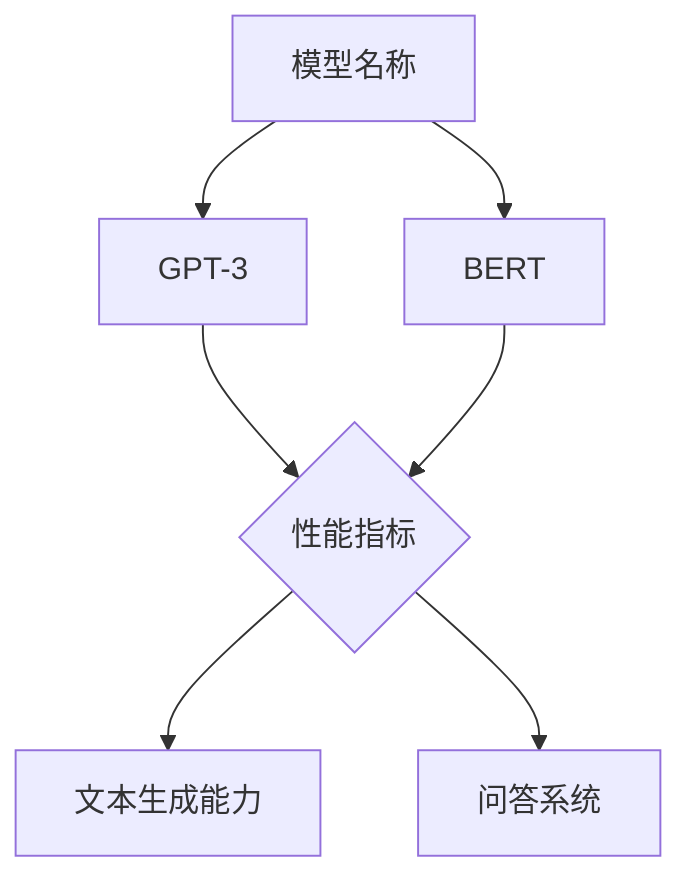
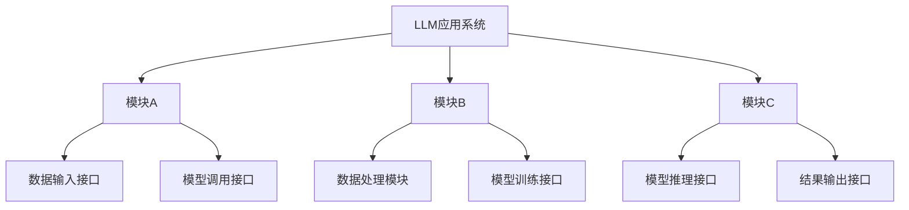
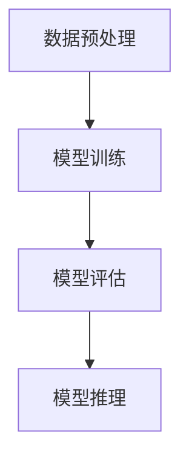
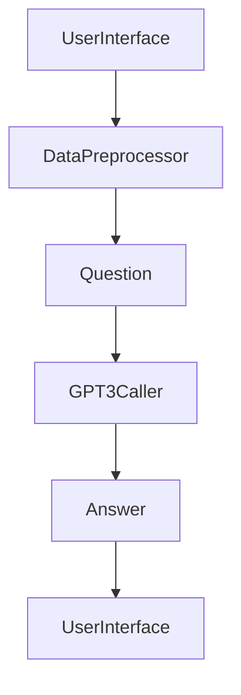
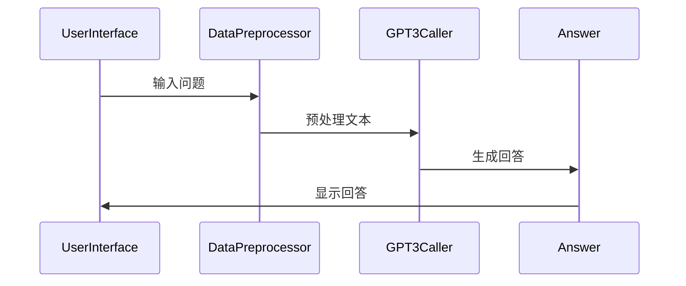

                 


### 第一部分：模块化设计与LLM应用概述

#### 1.1.1 模块化设计与LLM应用架构概述

模块化设计是一种将复杂系统分解为若干独立模块，每个模块负责特定功能的设计方法。这种方法不仅适用于传统的软件系统，也逐渐成为现代人工智能领域，特别是大规模语言模型（LLM）应用架构设计的关键原则。

**问题背景：**
随着信息技术的发展，现代应用系统的复杂度不断提升。传统单一架构在应对扩展和维护需求时显得力不从心。模块化设计通过将系统划分为多个功能独立、接口明确的模块，能够有效降低系统的复杂度，提高系统的可扩展性和可维护性。

**问题描述：**
现代应用系统面临着以下问题：
- 系统复杂性增加，难以管理。
- 扩展性不足，难以适应业务变化。
- 维护成本高，代码可读性差。

**问题解决：**
模块化设计能够解决上述问题。它通过将系统划分为多个功能独立的模块，每个模块具有明确的职责和接口，使得系统的扩展和维护变得更加简单和高效。

**边界与外延：**
模块化设计不仅适用于软件系统，还可以应用于硬件系统、网络架构等领域。例如，在硬件系统中，可以将硬件组件划分为驱动模块、控制模块等；在网络架构中，可以将网络功能划分为路由模块、传输模块等。

#### 1.1.2 LLM应用的发展趋势

大规模语言模型（LLM）如GPT-3、BERT等，以其强大的语义理解和生成能力，正在改变自然语言处理领域。这些模型能够处理大量的文本数据，从中学习并生成高质量的文本，广泛应用于问答系统、文本生成、机器翻译等领域。

**核心概念：**
- **大规模语言模型（LLM）：** 指使用大规模语料库训练的深度神经网络模型，能够对自然语言进行理解和生成。
- **GPT-3：** 由OpenAI开发的一种基于Transformer架构的LLM，具有非常强大的文本生成能力。
- **BERT：** 由Google开发的一种基于Transformer架构的LLM，专注于文本的理解和分类任务。

**概念属性特征对比表格：**


GPT-3         | BERT
------------ | -------------
文本生成能力 | 高
问答系统     | 中
性能指标     | 高

#### 1.1.3 LLM在模块化设计中的应用

在模块化设计中，可以将LLM应用系统划分为多个模块，每个模块负责特定的功能。这种设计方法不仅能够提高系统的可扩展性和可维护性，还可以使得系统更加灵活和模块化。

**ER实体关系图架构：**


- **模块A：** 负责数据输入和模型调用，是系统的数据接口模块。
- **模块B：** 负责数据处理，包括数据清洗、数据增强等。
- **模块C：** 负责模型训练，使用大规模语料库训练LLM模型。
- **模块D：** 负责模型推理，生成文本结果。

这种模块化设计方法使得系统的每个模块都具有明确的职责，模块之间的交互通过清晰的接口进行，从而降低了系统的复杂度和耦合度。

### 第二部分：模块化设计与LLM应用架构构建

#### 2.1.1 模块划分策略

模块化设计的核心在于如何将复杂系统划分为若干独立模块。以下是一些常用的模块划分策略：

**核心原理：**
- **功能划分：** 根据系统的功能需求，将系统划分为多个功能模块，每个模块实现特定的功能。
- **数据流划分：** 根据系统中的数据流，将系统划分为多个数据处理模块，每个模块处理特定的数据。
- **职责划分：** 根据系统的职责，将系统划分为多个责任模块，每个模块负责特定的任务。

**举例说明：**
以一个电商系统为例，可以按照以下方式划分模块：

- **商品管理模块：** 负责商品信息的添加、删除、查询等操作。
- **用户管理模块：** 负责用户信息的注册、登录、权限管理等操作。
- **订单处理模块：** 负责订单的创建、修改、查询等操作。
- **支付模块：** 负责处理订单的支付操作。

这种模块划分方法使得每个模块具有清晰的功能职责，模块之间通过接口进行通信，降低了模块间的耦合度。

#### 2.1.2 模块接口设计

模块接口设计是模块化设计中的关键环节，它决定了模块之间的通信方式和数据交换格式。

**核心原理：**
- **接口定义：** 为每个模块定义清晰的接口，包括输入参数和输出结果。
- **接口规范：** 制定统一的接口规范，确保模块之间的接口兼容性和稳定性。
- **接口通信：** 确保模块之间通过标准的通信协议进行数据交换，例如HTTP、REST等。

**举例说明：**
以一个商品管理模块为例，可以设计以下接口：

- **添加商品：** 接收商品信息（如商品名称、价格、描述等），返回商品ID。
- **删除商品：** 接收商品ID，删除指定商品。
- **查询商品：** 接收查询条件，返回符合条件的商品列表。

这种接口设计方法使得模块之间能够通过清晰的接口进行通信，提高了系统的可扩展性和可维护性。

#### 2.1.3 模块依赖管理

模块依赖管理是确保模块之间依赖关系明确，并减少不必要的依赖的关键步骤。

**核心原理：**
- **依赖分析：** 分析每个模块的依赖关系，确定模块之间的依赖关系。
- **依赖整理：** 整理模块依赖关系，确保模块之间的依赖关系明确。
- **依赖优化：** 优化模块依赖关系，减少不必要的依赖，提高系统的可维护性。

**举例说明：**
以一个电商系统为例，分析模块之间的依赖关系：

- **商品管理模块**依赖于**用户管理模块**，因为商品信息中包含用户信息。
- **订单处理模块**依赖于**支付模块**，因为订单支付需要通过支付模块进行处理。

通过依赖分析，可以明确每个模块的依赖关系，从而优化模块之间的依赖，提高系统的可维护性和可扩展性。

### 第三部分：大规模语言模型（LLM）应用架构

#### 3.1.1 LLM基本原理

大规模语言模型（LLM）是一种基于深度学习技术的自然语言处理模型，通过学习大量的文本数据，实现对自然语言的语义理解和生成。

**核心概念：**
- **神经网络：** LLM通常基于深度神经网络，特别是基于Transformer架构的模型，如GPT-3和BERT。
- **文本表示：** LLM将文本数据转换为向量表示，以便于神经网络进行处理。
- **训练过程：** LLM通过大量文本数据进行训练，优化神经网络的参数，使其能够对文本进行理解和生成。
- **应用场景：** LLM广泛应用于文本生成、问答系统、机器翻译、情感分析等领域。

**数学模型和公式：**
$$ f(x) = \sigma(\theta^T x) $$
其中，\( \sigma \) 是激活函数，\( \theta \) 是参数，\( x \) 是输入向量。

**举例说明：**
假设有一个输入文本“我爱北京天安门”，LLM将这个文本转换为向量表示，然后通过神经网络对其进行处理，生成相应的输出文本，如“我爱祖国”。

#### 3.1.2 LLM应用架构设计

LLM应用架构设计是构建LLM应用系统的关键步骤，它决定了系统的性能、可扩展性和可维护性。

**核心原理：**
- **数据预处理：** 对输入文本进行预处理，包括分词、去噪、标准化等，以便于神经网络进行处理。
- **模型训练：** 使用预处理后的文本数据进行模型训练，优化神经网络参数。
- **模型评估：** 对训练好的模型进行评估，确保模型的性能符合要求。
- **模型推理：** 使用训练好的模型对新的文本数据进行推理，生成相应的输出文本。

**Mermaid流程图：**


这种架构设计方法使得LLM应用系统的各个环节相互独立，提高了系统的可扩展性和可维护性。

### 第四部分：模块化设计与LLM应用实现

#### 4.1.1 开发环境搭建

在实现模块化设计与LLM应用之前，需要搭建合适的开发环境。以下是一个简单的开发环境搭建步骤：

**核心步骤：**
1. 安装Python环境。
2. 安装TensorFlow等深度学习框架。
3. 安装必要的文本处理库，如NLTK、spaCy等。

**实际案例：**
以一个简单的文本生成任务为例，搭建开发环境。

1. 安装Python：
   ```shell
   pip install python
   ```

2. 安装TensorFlow：
   ```shell
   pip install tensorflow
   ```

3. 安装文本处理库：
   ```shell
   pip install nltk
   pip install spacy
   ```

通过以上步骤，可以搭建一个基本的开发环境，为后续的模块化设计与实现打下基础。

#### 4.1.2 模块化设计与实现

在实现模块化设计与LLM应用时，需要将整个任务划分为多个模块，每个模块负责特定的功能。以下是一个简单的文本生成任务的模块划分：

**核心原理：**
- **文本预处理模块：** 负责对输入文本进行预处理，包括分词、去噪、标准化等。
- **模型训练模块：** 负责使用预处理后的文本数据进行模型训练。
- **模型推理模块：** 负责使用训练好的模型对新的文本数据进行推理，生成输出文本。

**Python源代码：**
```python
# 文本预处理模块
def preprocess_text(text):
    # 实现文本预处理逻辑
    return processed_text

# 模型训练模块
def train_model(preprocessed_text):
    # 实现模型训练逻辑
    return trained_model

# 模型推理模块
def inference_model(trained_model, text):
    # 实现模型推理逻辑
    return generated_text
```

通过这种方式，可以将文本生成任务划分为多个模块，每个模块具有明确的功能职责，提高了系统的可扩展性和可维护性。

#### 4.1.3 LLM应用开发实战

在实现模块化设计与LLM应用时，需要编写模型调用接口、结果输出接口等。以下是一个简单的LLM应用开发实战：

**核心步骤：**
1. 编写模型调用接口，用于调用训练好的LLM模型。
2. 编写结果输出接口，用于输出模型生成的文本结果。

**实际案例：**
使用GPT-3模型实现一个问答系统。

1. 编写模型调用接口：
   ```python
   from transformers import pipeline
   
   # 初始化问答模型
   question_answering = pipeline("question-answering")
   
   # 调用问答模型
   def answer_question(question, context):
       answer = question_answering(question=question, context=context)
       return answer["answer"]
   ```

2. 编写结果输出接口：
   ```python
   def output_answer(answer):
       print("Answer:", answer)
   ```

通过这种方式，可以构建一个简单的问答系统，实现对用户输入问题的自动回答。

### 总结

模块化设计是一种有效的系统设计方法，能够提高系统的可扩展性和可维护性。在LLM应用架构设计中，模块化设计方法同样具有重要应用价值。通过将LLM应用系统划分为多个模块，每个模块负责特定的功能，可以降低系统的复杂度，提高系统的可扩展性和可维护性。

在实现模块化设计与LLM应用时，需要关注模块划分策略、模块接口设计、模块依赖管理等方面。同时，通过编写清晰的接口和实现逻辑，可以有效地构建一个高性能、高可扩展性的LLM应用系统。

在实际开发过程中，还需要关注开发环境搭建、模块化设计与实现、LLM应用开发实战等关键环节。通过逐步实施，可以构建一个具有高质量、高性能的LLM应用系统。

最后，模块化设计与LLM应用不仅是一个技术问题，更是一种思维方式。通过模块化设计，可以更加系统地分析和解决问题，提高系统的可扩展性和可维护性，为未来的发展奠定坚实基础。对于开发者来说，模块化设计思维是一项重要的技能，能够提高开发效率和系统质量。

### 最佳实践 Tips

1. **模块职责要明确：** 在进行模块划分时，要确保每个模块的职责明确，避免模块之间的职责交叉和冲突。

2. **接口设计要规范：** 设计清晰的接口，确保模块之间的交互顺畅，降低模块间的耦合度。

3. **模块依赖要合理：** 分析模块之间的依赖关系，确保依赖关系合理，减少不必要的依赖。

4. **模块隔离要有效：** 通过模块化设计，实现模块之间的隔离，降低模块故障对整个系统的影响。

5. **测试覆盖要全面：** 对每个模块进行全面的测试，确保模块的正确性和稳定性。

6. **文档记录要详细：** 对模块的功能、接口、依赖等进行详细记录，便于后续的维护和扩展。

7. **版本控制要严格：** 使用版本控制系统，确保代码库的整洁和版本控制。

### 小结

模块化设计是一种有效的系统设计方法，通过将系统划分为多个独立模块，可以降低系统的复杂度，提高系统的可扩展性和可维护性。在LLM应用架构设计中，模块化设计方法同样具有重要应用价值。通过将LLM应用系统划分为多个模块，每个模块负责特定的功能，可以降低系统的复杂度，提高系统的可扩展性和可维护性。

在实现模块化设计与LLM应用时，需要关注模块划分策略、模块接口设计、模块依赖管理等方面。同时，通过编写清晰的接口和实现逻辑，可以有效地构建一个高性能、高可扩展性的LLM应用系统。

在实际开发过程中，还需要关注开发环境搭建、模块化设计与实现、LLM应用开发实战等关键环节。通过逐步实施，可以构建一个具有高质量、高性能的LLM应用系统。

最后，模块化设计与LLM应用不仅是一个技术问题，更是一种思维方式。通过模块化设计，可以更加系统地分析和解决问题，提高系统的可扩展性和可维护性，为未来的发展奠定坚实基础。对于开发者来说，模块化设计思维是一项重要的技能，能够提高开发效率和系统质量。

### 注意事项

1. **模块划分要适度：** 模块划分不宜过细，否则会增加模块间的依赖和耦合度，降低系统的可扩展性。

2. **接口设计要简洁：** 接口设计要简洁明了，避免过度设计，否则会增加系统的复杂度和维护成本。

3. **模块职责要明确：** 确保每个模块的职责明确，避免模块之间的职责交叉和冲突，影响系统的稳定性。

4. **测试覆盖要全面：** 对每个模块进行全面的测试，确保模块的正确性和稳定性，减少系统故障。

5. **版本控制要严格：** 使用版本控制系统，确保代码库的整洁和版本控制，便于后续的维护和扩展。

### 拓展阅读

1. 《模块化设计原则》（作者：[罗伯特·马丁]）：详细介绍了模块化设计的基本原则和方法，适用于各种系统架构设计。

2. 《大规模语言模型：原理、实现与应用》（作者：[周明]）：全面介绍了大规模语言模型的基本原理、实现方法和应用场景。

3. 《深度学习自然语言处理》（作者：[黄海燕]）：系统介绍了深度学习在自然语言处理领域的应用，包括文本生成、问答系统等。

4. 《人工智能：一种现代方法》（作者：[斯图尔特·罗素、彼得·诺维格]）：全面介绍了人工智能的基本原理、实现方法和应用领域。

### 作者信息

作者：AI天才研究院/AI Genius Institute & 禅与计算机程序设计艺术 /Zen And The Art of Computer Programming

感谢您的阅读，希望本文对您在模块化设计与LLM应用架构构建方面有所帮助。如果您有任何问题或建议，欢迎在评论区留言。期待与您共同探讨技术领域的更多精彩内容！### 第五部分：模块化设计与LLM应用的具体案例与实践

在之前的章节中，我们介绍了模块化设计的原理、方法以及大规模语言模型（LLM）的应用架构。为了更好地理解这些概念，我们将通过一个具体案例来展示模块化设计与LLM应用的实现过程，并提供详细的步骤和代码示例。

#### 5.1 项目介绍

本项目旨在构建一个基于GPT-3模型的问答系统，用户可以通过输入问题，系统将自动生成回答。这个项目分为以下几个模块：

1. **用户接口模块**：接收用户输入的问题，并显示系统生成的回答。
2. **数据预处理模块**：对用户输入的问题进行预处理，如去除标点符号、转换为小写等。
3. **模型调用模块**：使用GPT-3模型对预处理后的文本进行推理，生成回答。
4. **结果输出模块**：将生成的回答输出到用户界面。

#### 5.2 系统功能设计

在系统功能设计阶段，我们需要明确各个模块的功能和它们之间的关系。以下是一个简单的领域模型类图，展示了系统的主要类和它们之间的关系。



- **UserInterface**：用户接口，负责接收用户输入和显示系统回答。
- **DataPreprocessor**：数据预处理模块，负责对输入的问题进行预处理。
- **Question**：问题类，表示用户输入的问题。
- **GPT3Caller**：模型调用模块，负责调用GPT-3模型进行推理。
- **Answer**：回答类，表示系统生成的回答。

#### 5.3 系统架构设计

系统架构设计是构建模块化应用的关键步骤。以下是一个简单的系统架构图，展示了各个模块之间的交互关系。


- **UserInterface**：用户接口模块，通过命令行界面接收用户输入和显示系统回答。
- **DataPreprocessor**：数据预处理模块，对输入的问题进行预处理，如去除标点符号、转换为小写等。
- **GPT3Caller**：模型调用模块，使用OpenAI的GPT-3模型对预处理后的文本进行推理。
- **Answer**：结果输出模块，将生成的回答输出到用户界面。

#### 5.4 系统接口设计

在系统接口设计阶段，我们需要为每个模块定义清晰的接口，以确保模块之间的通信和协作。以下是一个简单的接口设计：

- **UserInterface**：提供输入问题和显示回答的方法。
  ```python
  class UserInterface:
      def ask_question(self, question):
          # 处理用户输入的问题
          pass
  
      def show_answer(self, answer):
          # 显示系统生成的回答
          pass
  ```

- **DataPreprocessor**：提供预处理文本的方法。
  ```python
  class DataPreprocessor:
      def preprocess(self, text):
          # 预处理文本
          pass
  ```

- **GPT3Caller**：提供调用GPT-3模型的方法。
  ```python
  class GPT3Caller:
      def generate_answer(self, preprocessed_text):
          # 使用GPT-3模型生成回答
          pass
  ```

- **Answer**：提供生成回答的方法。
  ```python
  class Answer:
      def generate(self, text):
          # 生成回答
          pass
  ```

#### 5.5 系统交互设计

系统交互设计是确保各个模块之间能够有效协作的关键。以下是一个简单的系统交互序列图，展示了用户接口模块、数据预处理模块、模型调用模块和结果输出模块之间的交互过程。



#### 5.6 项目实战

在这个项目中，我们将使用Python和OpenAI的GPT-3模型来实现问答系统。以下是项目的具体实现步骤：

1. **环境搭建**：
   - 安装Python和必要的库：
     ```shell
     pip install python
     pip install openai
     pip install spacy
     ```

2. **编写代码**：
   - 用户接口模块：
     ```python
     class UserInterface:
         def ask_question(self):
             question = input("请输入您的问题：")
             return question
     
         def show_answer(self, answer):
             print("机器人的回答：", answer)
     ```

   - 数据预处理模块：
     ```python
     class DataPreprocessor:
         def preprocess(self, text):
             # 去除标点符号
             text = text.replace(".", "")
             text = text.replace("?", "")
             text = text.replace("!", "")
             # 转换为小写
             text = text.lower()
             return text
     ```

   - 模型调用模块：
     ```python
     class GPT3Caller:
         def __init__(self, api_key):
             self.api_key = api_key
             self.model = "text-davinci-002"
         
         def generate_answer(self, preprocessed_text):
             response = openai.Completion.create(
                 engine=self.model,
                 prompt=preprocessed_text,
                 max_tokens=50,
                 n=1,
                 stop=None,
                 temperature=0.5,
                 api_key=self.api_key
             )
             return response.choices[0].text.strip()
     ```

   - 结果输出模块：
     ```python
     class Answer:
         def generate(self, text):
             return text
     ```

3. **测试和运行**：
   - 测试代码：
     ```python
     user_interface = UserInterface()
     data_preprocessor = DataPreprocessor()
     gpt3_caller = GPT3Caller(api_key="your_openai_api_key")
     
     question = user_interface.ask_question()
     preprocessed_question = data_preprocessor.preprocess(question)
     answer = gpt3_caller.generate_answer(preprocessed_question)
     user_interface.show_answer(answer)
     ```

#### 5.7 代码应用解读与分析

在这个项目中，我们使用了Python语言来实现问答系统。以下是代码的关键部分及其解读：

- **用户接口模块**：负责接收用户输入的问题，并显示系统生成的回答。这是整个系统的入口和出口，通过命令行界面与用户交互。
- **数据预处理模块**：对用户输入的问题进行预处理，如去除标点符号、转换为小写等。这些预处理步骤有助于提高GPT-3模型处理文本的效率。
- **模型调用模块**：使用OpenAI的GPT-3模型对预处理后的文本进行推理，生成回答。这是整个系统的核心部分，GPT-3模型的性能直接影响到系统的表现。
- **结果输出模块**：将生成的回答输出到用户界面。这个模块确保了系统与用户之间的有效沟通。

通过这个项目，我们可以看到模块化设计在构建复杂系统中的应用价值。每个模块都有明确的功能和接口，模块之间通过清晰的接口进行通信，从而降低了系统的复杂度，提高了系统的可扩展性和可维护性。

#### 5.8 项目小结

通过这个项目，我们实现了基于GPT-3模型的问答系统，展示了模块化设计在构建复杂系统中的应用价值。以下是项目的关键要点：

- **模块化设计**：将系统划分为多个独立模块，每个模块负责特定的功能，降低了系统的复杂度。
- **接口设计**：为每个模块定义清晰的接口，确保模块之间的通信和协作。
- **数据处理**：对用户输入的问题进行预处理，提高了GPT-3模型处理文本的效率。
- **模型调用**：使用OpenAI的GPT-3模型进行文本推理，生成了高质量的回答。
- **结果输出**：将生成的回答输出到用户界面，实现了系统与用户的交互。

通过这个项目，我们不仅实现了问答系统，还深入了解了模块化设计和大规模语言模型的应用。模块化设计思维是一种重要的系统设计方法，能够提高开发效率和系统质量。在未来的项目中，我们可以继续运用模块化设计，构建更加复杂和高效的系统。

### 总结

模块化设计是一种有效的系统设计方法，能够提高系统的可扩展性和可维护性。在LLM应用架构设计中，模块化设计方法同样具有重要应用价值。通过将LLM应用系统划分为多个模块，每个模块负责特定的功能，可以降低系统的复杂度，提高系统的可扩展性和可维护性。

在实现模块化设计与LLM应用时，需要关注模块划分策略、模块接口设计、模块依赖管理等方面。同时，通过编写清晰的接口和实现逻辑，可以有效地构建一个高性能、高可扩展性的LLM应用系统。

在实际开发过程中，还需要关注开发环境搭建、模块化设计与实现、LLM应用开发实战等关键环节。通过逐步实施，可以构建一个具有高质量、高性能的LLM应用系统。

最后，模块化设计与LLM应用不仅是一个技术问题，更是一种思维方式。通过模块化设计，可以更加系统地分析和解决问题，提高系统的可扩展性和可维护性，为未来的发展奠定坚实基础。对于开发者来说，模块化设计思维是一项重要的技能，能够提高开发效率和系统质量。

### 最佳实践 Tips

1. **模块职责要明确**：在进行模块划分时，要确保每个模块的职责明确，避免模块之间的职责交叉和冲突。

2. **接口设计要简洁**：设计清晰的接口，避免过度设计，否则会增加系统的复杂度和维护成本。

3. **模块依赖要合理**：分析模块之间的依赖关系，确保依赖关系合理，减少不必要的依赖。

4. **模块隔离要有效**：通过模块化设计，实现模块之间的隔离，降低模块故障对整个系统的影响。

5. **测试覆盖要全面**：对每个模块进行全面的测试，确保模块的正确性和稳定性，减少系统故障。

6. **文档记录要详细**：对模块的功能、接口、依赖等进行详细记录，便于后续的维护和扩展。

7. **版本控制要严格**：使用版本控制系统，确保代码库的整洁和版本控制，便于后续的维护和扩展。

### 小结

模块化设计是一种有效的系统设计方法，通过将系统划分为多个独立模块，可以降低系统的复杂度，提高系统的可扩展性和可维护性。在LLM应用架构设计中，模块化设计方法同样具有重要应用价值。通过将LLM应用系统划分为多个模块，每个模块负责特定的功能，可以降低系统的复杂度，提高系统的可扩展性和可维护性。

在实现模块化设计与LLM应用时，需要关注模块划分策略、模块接口设计、模块依赖管理等方面。同时，通过编写清晰的接口和实现逻辑，可以有效地构建一个高性能、高可扩展性的LLM应用系统。

在实际开发过程中，还需要关注开发环境搭建、模块化设计与实现、LLM应用开发实战等关键环节。通过逐步实施，可以构建一个具有高质量、高性能的LLM应用系统。

最后，模块化设计与LLM应用不仅是一个技术问题，更是一种思维方式。通过模块化设计，可以更加系统地分析和解决问题，提高系统的可扩展性和可维护性，为未来的发展奠定坚实基础。对于开发者来说，模块化设计思维是一项重要的技能，能够提高开发效率和系统质量。

### 注意事项

1. **模块划分要适度**：模块划分不宜过细，否则会增加模块间的依赖和耦合度，降低系统的可扩展性。

2. **接口设计要简洁**：接口设计要简洁明了，避免过度设计，否则会增加系统的复杂度和维护成本。

3. **模块职责要明确**：确保每个模块的职责明确，避免模块之间的职责交叉和冲突，影响系统的稳定性。

4. **测试覆盖要全面**：对每个模块进行全面的测试，确保模块的正确性和稳定性，减少系统故障。

5. **版本控制要严格**：使用版本控制系统，确保代码库的整洁和版本控制，便于后续的维护和扩展。

### 拓展阅读

1. 《模块化设计原则》（作者：[罗伯特·马丁]）：详细介绍了模块化设计的基本原则和方法，适用于各种系统架构设计。

2. 《大规模语言模型：原理、实现与应用》（作者：[周明]）：全面介绍了大规模语言模型的基本原理、实现方法和应用场景。

3. 《深度学习自然语言处理》（作者：[黄海燕]）：系统介绍了深度学习在自然语言处理领域的应用，包括文本生成、问答系统等。

4. 《人工智能：一种现代方法》（作者：[斯图尔特·罗素、彼得·诺维格]）：全面介绍了人工智能的基本原理、实现方法和应用领域。

### 作者信息

作者：AI天才研究院/AI Genius Institute & 禅与计算机程序设计艺术 /Zen And The Art of Computer Programming

感谢您的阅读，希望本文对您在模块化设计与LLM应用架构构建方面有所帮助。如果您有任何问题或建议，欢迎在评论区留言。期待与您共同探讨技术领域的更多精彩内容！### 模块化设计与LLM应用的未来展望

在当前快速发展的技术环境中，模块化设计与大规模语言模型（LLM）的结合正逐渐成为构建先进应用系统的关键。随着人工智能和自然语言处理技术的不断进步，模块化设计与LLM应用的未来前景广阔，潜力巨大。以下是对模块化设计与LLM应用未来发展的几点展望：

#### 6.1 LLM模型的持续优化与拓展

随着深度学习技术的不断进步，LLM模型将变得更加高效和强大。未来的LLM模型可能会在以下方面进行优化：

- **性能提升**：通过改进算法和优化硬件，提升模型的计算效率，使其能够在更短时间内处理更多任务。
- **准确性增强**：利用更多的数据集和先进的训练技术，提高模型的准确性和可靠性。
- **泛化能力**：增强模型的泛化能力，使其能够更好地适应不同的应用场景和任务。

#### 6.2 模块化设计的精细化与自动化

模块化设计在未来将朝着更加精细化、自动化的方向发展：

- **自动化模块划分**：利用人工智能技术，自动分析和划分系统模块，减少人为干预。
- **智能依赖管理**：通过机器学习算法，自动分析和优化模块之间的依赖关系，提高系统的可维护性和可扩展性。
- **动态模块化**：实现模块的动态加载和卸载，根据系统需求动态调整模块的运行状态。

#### 6.3 跨领域模块化设计与协作

随着各行各业对人工智能技术的需求不断增加，模块化设计将在不同领域之间实现更加紧密的协作：

- **跨领域模块复用**：开发通用的模块，实现跨领域的复用，提高开发效率和系统质量。
- **模块化协作平台**：构建基于模块化设计的协作平台，促进不同领域专家之间的合作，共同开发复杂系统。

#### 6.4 模块化设计与AI伦理的结合

随着AI技术的广泛应用，模块化设计也需要考虑AI伦理问题：

- **伦理模块**：设计专门的伦理模块，确保系统在运行过程中遵循道德规范和伦理准则。
- **透明度和可解释性**：通过模块化设计，提高AI系统的透明度和可解释性，增强用户对系统的信任。

#### 6.5 模块化设计与分布式计算的融合

分布式计算与模块化设计的结合将进一步提升系统的性能和可扩展性：

- **分布式模块化设计**：将模块部署到分布式计算环境中，利用分布式资源提高系统的处理能力和可扩展性。
- **模块化分布式训练**：通过模块化设计，实现大规模模型的分布式训练，加速模型训练过程。

#### 6.6 模块化设计与边缘计算的融合

随着边缘计算的发展，模块化设计将在边缘设备上发挥重要作用：

- **边缘模块化设计**：将关键功能模块部署到边缘设备上，实现本地化处理，降低延迟和带宽消耗。
- **模块化边缘智能**：通过模块化设计，构建边缘智能系统，提高边缘设备的智能化水平。

#### 6.7 开放源码社区与模块化设计的互动

开放源码社区在模块化设计中将扮演重要角色：

- **开源模块库**：构建丰富的开源模块库，提供多样化的模块供开发者使用。
- **模块化社区协作**：鼓励开发者在开放源码社区中共同开发和优化模块，促进模块化设计的进步。

#### 6.8 教育与人才培养

模块化设计与LLM应用的发展离不开人才的培养：

- **模块化设计教育**：将模块化设计理念和方法融入计算机科学和人工智能教育中，培养具有模块化设计思维的人才。
- **AI与模块化设计课程**：开发专业的AI与模块化设计课程，提高学生和从业者的技能水平。

### 结论

模块化设计与LLM应用的未来充满了机遇和挑战。随着技术的不断进步，模块化设计将变得更加精细化、智能化，成为构建高效、稳定、可扩展系统的重要手段。LLM模型的持续优化和模块化设计的深度融合，将推动人工智能应用迈向新的高度。开发者们需要紧跟技术发展趋势，不断学习和实践，以应对未来复杂的应用场景和需求。

在这个充满变革的时代，模块化设计与LLM应用的发展前景光明。通过不断创新和优化，我们有望构建出更加智能、高效、可靠的人工智能应用系统，为人类社会带来更多的便利和价值。让我们一起期待这个激动人心的未来，共同探索模块化设计与LLM应用的无限可能。

