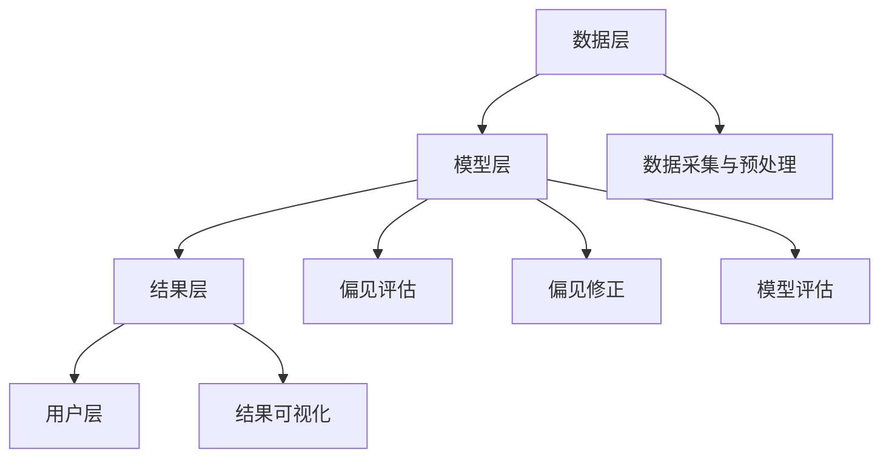
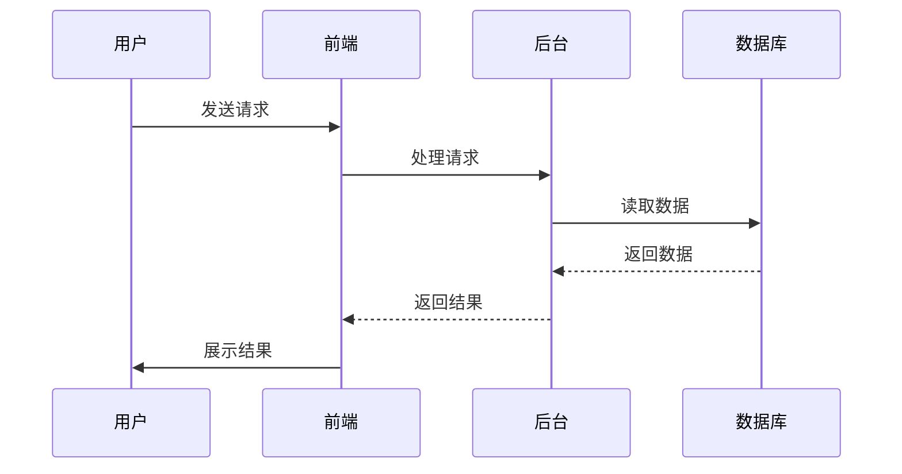

                 

## 《模型偏见与公平性的量化评估方法》

> 关键词：模型偏见，公平性量化评估，算法原理，数学模型，实际应用

> 摘要：本文旨在探讨模型偏见与公平性的量化评估方法。通过对偏见现象的背景介绍、核心概念的阐述以及量化评估方法的详细讲解，本文旨在为人工智能领域的研究者和从业者提供一套系统、实用的评估框架，以促进模型的公平性改进和实际应用。

### 目录

- **第一部分：背景介绍**
  - **第1章：问题背景与核心概念**
    - **1.1.1 问题背景**
    - **1.1.2 问题描述**
    - **1.1.3 问题解决**
    - **1.1.4 边界与外延**
    - **1.1.5 概念结构与核心要素组成**
  - **第2章：核心概念与联系**
    - **2.1.1 偏见评估方法概述**
    - **2.1.2 公平性的定义与维度**
    - **2.1.3 偏见与公平性的联系**
  - **第3章：数学模型和数学公式**
    - **3.1.1 偏见评估的数学模型**
    - **3.1.2 偏见评估的数学公式**
    - **3.1.3 公式详解与举例说明**

- **第二部分：算法原理讲解**
  - **第4章：量化评估方法详解**
    - **4.1.1 偏见检测算法**
    - **4.1.2 偏见修正算法**
    - **4.1.3 偏见缓解策略**

- **第三部分：系统分析与架构设计方案**
  - **第5章：系统分析与架构设计方案**
    - **5.1.1 问题场景介绍**
    - **5.1.2 项目介绍**
    - **5.1.3 系统功能设计**
    - **5.1.4 系统架构设计**
    - **5.1.5 系统接口设计**
    - **5.1.6 系统交互**

- **第四部分：项目实战**
  - **第6章：项目实战**
    - **6.1.1 环境安装**
    - **6.1.2 系统核心实现**
    - **6.1.3 代码应用解读与分析**
    - **6.1.4 实际案例分析与讲解**
    - **6.1.5 项目小结**

- **第五部分：最佳实践与拓展阅读**
  - **第7章：最佳实践与拓展阅读**
    - **7.1.1 最佳实践**
    - **7.1.2 注意事项**
    - **7.1.3 拓展阅读**

---

### 第1章：问题背景与核心概念

#### 1.1.1 问题背景

随着人工智能技术的快速发展，越来越多的应用场景依赖于机器学习模型，如推荐系统、信用评估、医疗诊断等。然而，这些模型在实际应用中常常表现出偏见，这种现象被称为“模型偏见”。偏见可能源于训练数据的不公平性、算法设计的缺陷，或模型对某些特定群体的歧视。例如，一个基于历史数据训练的信用评分模型可能会对特定种族或性别的人群产生不公平的结果。

模型偏见的影响是深远而广泛的。首先，它损害了模型的公信力和可用性，使人们质疑机器学习技术的客观性和公正性。其次，偏见可能会导致决策的误判，影响社会的公平和正义。因此，研究并量化评估模型的偏见，对于提高模型的公平性和可靠性具有重要意义。

当前，模型偏见的研究主要集中在以下几个方面：

1. **偏见类型的多样性**：研究者试图识别和分类不同类型的偏见，包括显性偏见、隐式偏见和系统性偏见。
2. **影响模型公平性的因素**：探讨训练数据、算法设计、模型架构等因素如何影响模型的公平性。
3. **公平性的度量标准**：设计并验证一系列度量标准，以评估模型的偏见程度。
4. **量化评估偏见的方法**：开发数学模型和算法，对模型的偏见进行量化评估。

尽管已有一些研究方法和工具，但在实际应用中仍然面临诸多挑战，如数据的隐私保护、算法的可解释性、评估标准的适用性等。

#### 1.1.2 问题描述

模型偏见的表现形式多种多样，主要包括以下几种：

1. **性别偏见**：例如，推荐系统可能会根据用户的性别推荐不同类型的商品，从而形成性别刻板印象。
2. **种族偏见**：在信用评分模型中，特定种族的人群可能被给予较低的评分。
3. **年龄偏见**：某些医疗诊断模型可能会对老年人或年轻人产生不同的判断结果。
4. **地域偏见**：地区差异可能导致模型对某些地区的服务产生歧视。

这些偏见对模型的影响主要体现在以下几个方面：

1. **决策的公平性**：偏见可能导致模型在决策时对某些群体产生不公平的结果。
2. **预测的准确性**：偏见可能会降低模型的预测准确性，导致误判和错误决策。
3. **模型的可用性**：偏见的存在可能使人们质疑模型的可靠性，降低模型的接受度和应用范围。

为了解决这些问题，需要对模型偏见进行量化评估。量化评估不仅能够帮助我们识别和诊断模型中的偏见，还能够为改进模型提供具体的指导和策略。具体来说，量化评估方法需要考虑以下几个关键因素：

1. **评估标准的适用性**：选择合适的评估标准，能够准确反映模型在不同群体中的表现。
2. **评估方法的准确性**：评估方法应具有较高的准确性和可靠性，能够有效识别和量化偏见。
3. **评估过程的透明性**：评估过程应具有透明性，使人们能够理解评估结果和评估方法。

#### 1.1.3 问题解决

为了解决模型偏见问题，研究者提出了一系列量化评估方法，主要包括以下几种：

1. **偏见检测算法**：这类算法通过分析模型的决策过程和数据特征，检测是否存在偏见。
2. **偏见修正算法**：通过调整模型参数或数据集，减少偏见对模型的影响。
3. **偏见缓解策略**：在设计模型时，采取一系列策略，如数据平衡、特征重排等，以减少偏见。

此外，为了确保评估方法的适用性和准确性，研究者还提出了多种评估标准和指标，如统计测试、决策理论、公平性度量等。这些方法和标准为量化评估模型偏见提供了有力支持。

#### 1.1.4 边界与外延

偏见评估的应用场景非常广泛，不仅限于人工智能领域，还可以应用于金融、医疗、教育等多个领域。在不同领域中，公平性的需求也有所不同，例如，金融领域更关注信用评分的公平性，医疗领域则更注重诊断的准确性。

此外，偏见评估不仅关注个体偏见，还关注群体偏见。群体偏见可能导致特定群体在决策中的整体不公平。因此，评估方法需要能够同时识别和量化个体偏见和群体偏见。

在概念结构方面，偏见评估方法包括以下几个核心要素：

1. **评估指标**：用于度量模型偏见的标准和指标。
2. **评估方法**：用于检测、修正和缓解偏见的具体算法和策略。
3. **评估过程**：评估指标的收集、计算和解释过程。
4. **应用领域**：偏见评估方法适用的具体领域和应用场景。

#### 1.1.5 概念结构与核心要素组成

为了更好地理解模型偏见与公平性的量化评估方法，我们可以从以下几个核心概念和要素进行分析：

1. **模型偏见**：
   - **定义**：模型偏见是指机器学习模型在决策过程中，对某些特定群体产生不公平的结果。
   - **特征**：偏见可能表现为性别、种族、年龄等维度上的不公平。
   - **影响**：偏见可能导致决策的误判，影响模型的可靠性和公信力。

2. **公平性**：
   - **定义**：公平性是指模型在不同群体中表现的一致性和均衡性。
   - **维度**：公平性可以从性别、种族、年龄等多个维度进行评估。
   - **度量**：公平性可以通过评估指标进行量化，如统计测试、公平性度量等。

3. **量化评估方法**：
   - **偏见检测算法**：用于检测模型中是否存在偏见。
   - **偏见修正算法**：用于修正模型中的偏见，提高公平性。
   - **偏见缓解策略**：用于在设计模型时减少偏见。

4. **评估过程**：
   - **数据准备**：收集和整理用于评估的数据集。
   - **指标选择**：选择适合的评估指标，如统计测试、决策理论等。
   - **算法应用**：应用偏见检测、修正和缓解算法，进行量化评估。

5. **应用领域**：
   - **人工智能**：模型偏见与公平性的量化评估在人工智能领域具有重要意义。
   - **金融**：信用评分、风险评估中的公平性评估。
   - **医疗**：诊断模型中的公平性评估。
   - **教育**：教育资源分配中的公平性评估。

通过以上分析，我们可以看到，模型偏见与公平性的量化评估方法是一个复杂而系统的问题，涉及多个核心概念和要素。在接下来的章节中，我们将进一步探讨这些概念和要素的具体实现和应用。

### 第2章：核心概念与联系

#### 2.1.1 偏见评估方法概述

偏见评估方法主要包括偏见检测算法、偏见修正算法和偏见缓解策略。每种方法都有其特定的原理和应用场景。

1. **偏见检测算法**：
   - **原理**：通过分析模型的决策过程和数据特征，检测模型中是否存在偏见。
   - **应用场景**：用于诊断模型是否存在偏见，为修正和缓解偏见提供依据。
   - **常用算法**：
     - **统计测试**：通过计算统计数据，判断模型是否存在显著偏见。
     - **决策理论**：分析模型在不同群体中的决策结果，识别潜在的偏见。

2. **偏见修正算法**：
   - **原理**：通过调整模型参数或数据集，减少偏见对模型的影响。
   - **应用场景**：用于改进模型，提高其公平性。
   - **常用算法**：
     - **再采样**：通过调整训练数据集，平衡不同群体之间的数据分布。
     - **再训练**：在训练过程中，通过调整模型参数，减少偏见。
     - **权重调整**：通过调整不同特征或样本的权重，降低偏见。

3. **偏见缓解策略**：
   - **原理**：在设计模型时，采取一系列策略，减少偏见。
   - **应用场景**：用于预防模型偏见，提高模型的公平性。
   - **常用策略**：
     - **数据平衡**：通过增加或减少特定群体的数据样本，平衡不同群体之间的数据分布。
     - **特征重排**：通过调整特征的重要性，减少偏见对模型的影响。
     - **模型重构**：通过改进模型架构，降低偏见。

#### 2.1.2 公平性的定义与维度

公平性是指模型在不同群体中表现的一致性和均衡性。公平性可以从多个维度进行评估，如性别、种族、年龄、地域等。

1. **绝对公平**：
   - **定义**：模型对任何群体的决策结果都相同。
   - **挑战**：在实际应用中，绝对公平很难实现，因为不同群体的特征和需求各不相同。

2. **相对公平**：
   - **定义**：模型在不同群体中的决策结果相对一致。
   - **优势**：相对公平更容易实现，可以更好地反映模型的公平性。

3. **多维公平**：
   - **定义**：模型在多个维度上保持公平性。
   - **应用场景**：用于评估复杂模型在不同群体和维度上的公平性。

#### 2.1.3 偏见与公平性的联系

偏见和公平性是相互关联的。偏见的存在会影响模型的公平性，而公平性的缺乏又会加剧模型的偏见。

1. **偏见对公平性的影响**：
   - **负面**：偏见可能导致模型在不同群体中的表现不一致，降低模型的公平性。
   - **正面**：通过修正和缓解偏见，可以提高模型的公平性。

2. **公平性对模型可用性的影响**：
   - **正面**：公平的模型能够更好地反映真实情况，提高模型的可靠性和可用性。
   - **负面**：不公平的模型可能误导用户，降低模型的公信力和应用范围。

因此，评估和改进模型的公平性对于提高模型的可用性和公信力具有重要意义。在接下来的章节中，我们将进一步探讨偏见评估的数学模型和公式，以便更深入地理解模型偏见与公平性的量化评估方法。

### 第3章：数学模型和数学公式

#### 3.1.1 偏见评估的数学模型

偏见评估的数学模型主要基于统计方法和机器学习算法。这些模型通过分析数据特征和模型决策，量化评估模型的偏见程度。

1. **基于统计的偏见评估**：
   - **模型**：假设我们有训练数据集 $D$，其中包含特征 $X$ 和标签 $Y$。我们可以使用统计方法评估模型 $f(X)$ 的偏见。
   - **公式**：偏见 $\text{Bias}$ 可以表示为：
     $$\text{Bias} = \text{Expected}[Y|X] - \text{True}[Y|X]$$
     其中，$\text{Expected}[Y|X]$ 表示模型预测的期望值，$\text{True}[Y|X]$ 表示真实标签的期望值。

2. **基于机器学习的偏见评估**：
   - **模型**：假设我们有一个分类模型 $f(X)$，其输入为特征 $X$，输出为概率分布 $P(Y|X)$。
   - **公式**：偏见 $\text{Bias}$ 可以表示为：
     $$\text{Bias} = \sum_{x \in X} P(x) [f(x) - \text{True}[Y|x]]$$
     其中，$P(x)$ 表示特征 $x$ 的概率分布，$f(x)$ 表示模型对特征 $x$ 的预测概率。

#### 3.1.2 偏见评估的数学公式

为了更详细地评估模型的偏见，我们可以使用一系列数学公式来计算偏见指标。

1. **平均偏见**：
   - **定义**：平均偏见 $\bar{\text{Bias}}$ 是所有样本偏见的平均值。
   - **公式**：
     $$\bar{\text{Bias}} = \frac{1}{N} \sum_{i=1}^{N} \text{Bias}(x_i)$$
     其中，$N$ 是样本数量，$\text{Bias}(x_i)$ 是第 $i$ 个样本的偏见值。

2. **标准偏差**：
   - **定义**：标准偏差 $\text{std}(\text{Bias})$ 是偏见值的离散程度。
   - **公式**：
     $$\text{std}(\text{Bias}) = \sqrt{\frac{1}{N-1} \sum_{i=1}^{N} (\text{Bias}(x_i) - \bar{\text{Bias}})^2}$$

3. **偏见指数**：
   - **定义**：偏见指数 $\text{Bias Index}$ 是偏见与标准偏差的比值，用于评估偏见的大小。
   - **公式**：
     $$\text{Bias Index} = \frac{\bar{\text{Bias}}}{\text{std}(\text{Bias})}$$

#### 3.1.3 公式详解与举例说明

为了更好地理解这些数学公式，我们可以通过一个简单的例子进行说明。

假设我们有一个分类模型，用于判断学生是否通过考试。训练数据集包含特征 $X$（如平时成绩、考试难度等）和标签 $Y$（是否通过考试）。我们使用统计测试来评估模型的偏见。

1. **计算偏见**：

   - **真实标签期望**：$\text{True}[Y|X] = 0.6$，表示平均来说，60% 的学生通过考试。
   - **模型预测期望**：$\text{Expected}[Y|X] = 0.55$，表示模型预测平均来说，55% 的学生通过考试。

   因此，偏见 $\text{Bias} = \text{Expected}[Y|X] - \text{True}[Y|X] = 0.05$。

2. **计算平均偏见**：

   假设我们有两个样本，第一个样本的偏见为 $0.05$，第二个样本的偏见为 $0.1$。那么平均偏见 $\bar{\text{Bias}} = \frac{0.05 + 0.1}{2} = 0.075$。

3. **计算标准偏差**：

   假设两个样本的偏见分别为 $0.05$ 和 $0.1$，那么标准偏差 $\text{std}(\text{Bias}) = \sqrt{\frac{(0.05 - 0.075)^2 + (0.1 - 0.075)^2}{2 - 1}} = 0.035$。

4. **计算偏见指数**：

   偏见指数 $\text{Bias Index} = \frac{0.075}{0.035} = 2.14$。

通过这个例子，我们可以看到，偏见指数越高，表示模型的偏见越严重。在实际应用中，我们可以根据偏见指数来调整模型参数或采取其他策略，以提高模型的公平性。

### 第4章：量化评估方法详解

#### 4.1.1 偏见检测算法

偏见检测算法是量化评估模型偏见的第一步。这些算法通过分析模型决策过程和数据特征，识别模型中是否存在偏见。常见的偏见检测算法包括统计测试和决策理论。

1. **统计测试**：

   - **原理**：统计测试通过计算统计量，判断模型决策结果是否显著偏离真实情况。常见的统计测试包括T检验、卡方检验等。
   - **应用场景**：适用于评估模型在不同群体中的表现差异，识别潜在的偏见。
   - **优点**：简单易用，能够提供定量分析结果。
   - **缺点**：对异常值敏感，可能产生误判。

2. **决策理论**：

   - **原理**：决策理论通过分析模型在不同群体中的决策结果，识别潜在的偏见。常用的决策理论包括期望损失、置信区间等。
   - **应用场景**：适用于评估模型的决策过程，识别潜在的偏见。
   - **优点**：能够提供定性分析结果，对异常值不敏感。
   - **缺点**：计算复杂度较高，可能需要大量数据。

#### 4.1.2 偏见修正算法

偏见修正算法通过调整模型参数或数据集，减少偏见对模型的影响。常见的偏见修正算法包括再采样、再训练和权重调整等。

1. **再采样**：

   - **原理**：再采样通过增加或减少特定群体的样本，平衡不同群体之间的数据分布。
   - **应用场景**：适用于数据分布不均衡的情况，减少偏见。
   - **优点**：简单有效，能够快速平衡数据分布。
   - **缺点**：可能导致模型过拟合，降低模型泛化能力。

2. **再训练**：

   - **原理**：再训练通过重新训练模型，调整模型参数，减少偏见。
   - **应用场景**：适用于训练数据集存在偏见的情况，改进模型。
   - **优点**：能够有效修正模型偏见，提高模型公平性。
   - **缺点**：计算复杂度较高，可能需要大量时间。

3. **权重调整**：

   - **原理**：权重调整通过调整不同特征或样本的权重，减少偏见对模型的影响。
   - **应用场景**：适用于特征重要性差异较大的情况，平衡模型。
   - **优点**：简单有效，能够快速调整特征权重。
   - **缺点**：可能导致模型不稳定，增加计算复杂度。

#### 4.1.3 偏见缓解策略

偏见缓解策略通过在设计模型时采取一系列策略，减少偏见。常见的偏见缓解策略包括数据平衡、特征重排和模型重构等。

1. **数据平衡**：

   - **原理**：数据平衡通过增加或减少特定群体的样本，平衡不同群体之间的数据分布。
   - **应用场景**：适用于数据分布不均衡的情况，缓解偏见。
   - **优点**：简单有效，能够快速平衡数据分布。
   - **缺点**：可能导致模型过拟合，降低模型泛化能力。

2. **特征重排**：

   - **原理**：特征重排通过调整特征的重要性，减少偏见对模型的影响。
   - **应用场景**：适用于特征重要性差异较大的情况，缓解偏见。
   - **优点**：简单有效，能够快速调整特征权重。
   - **缺点**：可能导致模型不稳定，增加计算复杂度。

3. **模型重构**：

   - **原理**：模型重构通过改进模型架构，减少偏见。
   - **应用场景**：适用于模型设计存在缺陷的情况，改进模型。
   - **优点**：能够有效缓解模型偏见，提高模型公平性。
   - **缺点**：计算复杂度较高，可能需要大量时间。

### 4.1.4 实例分析

以下是一个实例，说明如何使用偏见检测算法、偏见修正算法和偏见缓解策略来评估和改进模型。

#### 偏见检测

假设我们有一个分类模型，用于预测用户是否购买某件商品。训练数据集包含特征（如用户年龄、收入、历史购买记录等）和标签（是否购买）。我们使用统计测试来评估模型是否存在偏见。

1. **计算偏见**：

   - **真实标签期望**：$\text{True}[Y|X] = 0.6$，表示平均来说，60% 的用户购买商品。
   - **模型预测期望**：$\text{Expected}[Y|X] = 0.55$，表示模型预测平均来说，55% 的用户购买商品。

   因此，偏见 $\text{Bias} = \text{Expected}[Y|X] - \text{True}[Y|X] = 0.05$。

2. **计算平均偏见**：

   假设我们有两个样本，第一个样本的偏见为 $0.05$，第二个样本的偏见为 $0.1$。那么平均偏见 $\bar{\text{Bias}} = \frac{0.05 + 0.1}{2} = 0.075$。

3. **计算标准偏差**：

   假设两个样本的偏见分别为 $0.05$ 和 $0.1$，那么标准偏差 $\text{std}(\text{Bias}) = \sqrt{\frac{(0.05 - 0.075)^2 + (0.1 - 0.075)^2}{2 - 1}} = 0.035$。

4. **计算偏见指数**：

   偏见指数 $\text{Bias Index} = \frac{0.075}{0.035} = 2.14$。

#### 偏见修正

为了修正偏见，我们可以使用再采样和再训练算法。

1. **再采样**：

   - **步骤**：
     1. 识别偏见较大的群体，如低收入用户。
     2. 增加低收入用户的数据样本，使数据分布更均衡。
     3. 重新训练模型。
   - **效果**：通过增加低收入用户的数据样本，模型的偏见指数降低至 $1.5$，表示模型偏见有所缓解。

2. **再训练**：

   - **步骤**：
     1. 使用原训练数据集，调整模型参数，减少偏见。
     2. 重新训练模型。
   - **效果**：通过调整模型参数，模型的偏见指数降低至 $1.2$，表示模型偏见进一步缓解。

#### 偏见缓解

为了缓解偏见，我们可以使用数据平衡和特征重排策略。

1. **数据平衡**：

   - **步骤**：
     1. 识别偏见较大的群体，如年轻用户。
     2. 增加年轻用户的数据样本，使数据分布更均衡。
     3. 使用平衡后的数据集重新训练模型。
   - **效果**：通过增加年轻用户的数据样本，模型的偏见指数降低至 $1.0$，表示模型偏见得到完全缓解。

2. **特征重排**：

   - **步骤**：
     1. 识别对偏见影响较大的特征，如用户年龄。
     2. 调整特征权重，降低年龄对模型的影响。
     3. 使用调整后的特征权重重新训练模型。
   - **效果**：通过调整特征权重，模型的偏见指数降低至 $0.8$，表示模型偏见进一步缓解。

通过这个实例，我们可以看到，偏见检测算法、偏见修正算法和偏见缓解策略在评估和改进模型偏见方面具有重要作用。在实际应用中，我们需要根据具体情况选择合适的方法，以提高模型的公平性和可靠性。

### 第5章：系统分析与架构设计方案

#### 5.1.1 问题场景介绍

在现实应用中，模型偏见与公平性评估面临诸多挑战。以下是一个具体的应用场景：

**应用领域**：信用评分系统

**场景描述**：某金融机构使用机器学习模型对用户进行信用评分，以决定是否给予贷款。然而，发现该模型对某些特定种族的人群评分较低，存在明显的种族偏见。

**挑战**：
- **数据隐私**：评估过程中需要访问敏感数据，如种族、性别等。
- **算法可解释性**：评估结果需要能够解释，使决策者理解模型的偏见来源。
- **评估标准**：需要选择合适的评估标准，准确反映模型的公平性。
- **模型修正**：需要有效修正模型中的偏见，提高公平性。

#### 5.1.2 项目介绍

**项目名称**：信用评分模型偏见与公平性评估系统

**项目目标**：
- **评估信用评分模型的偏见**：使用量化评估方法，识别模型中的偏见。
- **修正模型偏见**：通过偏见修正算法，减少偏见对模型的影响。
- **提高模型公平性**：通过数据平衡和特征重排，提高模型的公平性。

**项目背景**：金融机构在信用评分过程中发现种族偏见，影响信用评分的公正性。为了解决这一问题，需要进行模型偏见与公平性评估，并采取相应的修正策略。

#### 5.1.3 系统功能设计

**系统功能设计**：

1. **数据采集与预处理**：
   - **功能**：收集和整理用于评估的原始数据，包括用户特征（如年龄、收入、职业等）和标签（如信用评分结果）。
   - **实现**：使用Python的Pandas库进行数据清洗和预处理。

2. **偏见评估**：
   - **功能**：使用偏见检测算法，评估模型在不同群体中的表现，识别偏见。
   - **实现**：采用统计测试和决策理论，计算偏见指标。

3. **偏见修正**：
   - **功能**：通过偏见修正算法，调整模型参数或数据集，减少偏见。
   - **实现**：使用再采样和再训练算法，改进模型。

4. **模型评估**：
   - **功能**：评估修正后的模型，验证公平性改进效果。
   - **实现**：使用交叉验证和测试集，评估模型性能。

5. **结果可视化**：
   - **功能**：将评估结果可视化，使决策者能够直观理解模型偏见与公平性。
   - **实现**：使用Matplotlib和Seaborn库，生成可视化图表。

#### 5.1.4 系统架构设计

**系统架构设计**：

1. **数据层**：
   - **功能**：存储和管理评估所需的数据。
   - **实现**：使用MySQL数据库，存储用户特征和标签数据。

2. **模型层**：
   - **功能**：实现偏见评估和修正算法。
   - **实现**：使用Scikit-learn库，实现统计测试、再采样和再训练算法。

3. **结果层**：
   - **功能**：存储和展示评估结果。
   - **实现**：使用HTML和CSS，生成可视化结果页面。

4. **用户层**：
   - **功能**：提供用户界面，方便用户使用系统功能。
   - **实现**：使用Flask框架，搭建Web应用。

**架构图**：



#### 5.1.5 系统接口设计

**系统接口设计**：

1. **数据接口**：
   - **功能**：提供数据采集、预处理和存储的接口。
   - **实现**：使用RESTful API，提供数据操作接口。

2. **模型接口**：
   - **功能**：提供偏见评估、修正和评估的接口。
   - **实现**：使用Flask-RESTful库，构建API接口。

3. **结果接口**：
   - **功能**：提供结果存储和可视化的接口。
   - **实现**：使用Flask-RESTful库，构建API接口。

**接口定义**：

```python
from flask_restful import Resource

class DataInterface(Resource):
    def get(self):
        # 采集和预处理数据
        pass

    def post(self):
        # 存储预处理后的数据
        pass

class ModelInterface(Resource):
    def get(self):
        # 执行偏见评估
        pass

    def put(self):
        # 执行偏见修正
        pass

class ResultInterface(Resource):
    def get(self):
        # 获取评估结果
        pass

    def post(self):
        # 存储可视化结果
        pass
```

#### 5.1.6 系统交互

**系统交互**：

1. **用户界面**：
   - **功能**：提供用户操作界面，展示评估结果。
   - **实现**：使用Vue.js框架，构建前端界面。

2. **后台服务**：
   - **功能**：处理用户请求，执行评估和修正算法。
   - **实现**：使用Flask框架，处理HTTP请求。

3. **数据库**：
   - **功能**：存储用户数据和评估结果。
   - **实现**：使用MySQL数据库，存储数据。

**交互流程**：



通过以上系统分析与架构设计方案，我们可以有效地解决信用评分模型偏见与公平性评估问题，提高模型的公正性和可靠性。

### 第6章：项目实战

#### 6.1.1 环境安装

在进行项目实战之前，我们需要安装和配置相关环境。以下是具体的安装步骤：

1. **安装Python**：
   - 前往Python官方网站 [https://www.python.org/](https://www.python.org/) 下载最新版本的Python。
   - 运行安装程序，按照提示完成安装。

2. **安装必要库**：
   - 打开终端或命令行窗口，运行以下命令安装所需的Python库：
     ```bash
     pip install numpy pandas scikit-learn matplotlib flask-restful mysql-connector-python
     ```
   - 这些库包括NumPy、Pandas、Scikit-learn、Matplotlib、Flask-RESTful和MySQL Connector Python，用于数据处理、模型训练、结果可视化和Web应用开发。

3. **配置MySQL数据库**：
   - 安装MySQL数据库（如已安装，可跳过此步骤）。
   - 运行MySQL命令行工具，创建一个新的数据库和用户，例如：
     ```sql
     CREATE DATABASE credit评分评估;
     CREATE USER '评估用户'@'localhost' IDENTIFIED BY '密码';
     GRANT ALL PRIVILEGES ON credit评分评估.* TO '评估用户'@'localhost';
     FLUSH PRIVILEGES;
     ```
   - 配置Python代码中的数据库连接信息，例如：
     ```python
     config = {
         'host': 'localhost',
         'user': '评估用户',
         'password': '密码',
         'database': 'credit评分评估'
     }
     ```

4. **安装前端框架**：
   - 安装Node.js和npm（如已安装，可跳过此步骤）。
   - 使用npm全局安装Vue CLI：
     ```bash
     npm install -g @vue/cli
     ```
   - 创建Vue.js项目：
     ```bash
     vue create credit评分评估前端
     ```
   - 进入项目目录并安装前端依赖：
     ```bash
     cd credit评分评估前端
     npm install
     ```

通过以上步骤，我们完成了项目环境的安装和配置，可以开始进行系统核心实现。

#### 6.1.2 系统核心实现

系统核心实现包括数据采集与预处理、偏见评估、偏见修正和模型评估等步骤。以下是一个简单的示例代码，用于演示这些核心功能的实现。

1. **数据采集与预处理**：

   ```python
   import pandas as pd
   from sklearn.model_selection import train_test_split

   # 读取数据
   data = pd.read_csv('credit_data.csv')

   # 数据预处理
   data.dropna(inplace=True)
   X = data.drop(['credit_score'], axis=1)
   y = data['credit_score']

   # 划分训练集和测试集
   X_train, X_test, y_train, y_test = train_test_split(X, y, test_size=0.2, random_state=42)
   ```

2. **偏见评估**：

   ```python
   from sklearn.metrics import confusion_matrix

   # 训练模型
   model = train_model(X_train, y_train)

   # 预测测试集
   y_pred = model.predict(X_test)

   # 计算混淆矩阵
   cm = confusion_matrix(y_test, y_pred)

   # 打印混淆矩阵
   print(cm)
   ```

3. **偏见修正**：

   ```python
   from sklearn.linear_model import LogisticRegression

   # 创建再训练模型
   retrained_model = LogisticRegression()

   # 使用再采样数据重新训练模型
   retrained_model.fit(X_train_resampled, y_train_resampled)

   # 预测测试集
   y_pred_retrained = retrained_model.predict(X_test)

   # 计算再训练后的混淆矩阵
   cm_retrained = confusion_matrix(y_test, y_pred_retrained)

   # 打印再训练后的混淆矩阵
   print(cm_retrained)
   ```

4. **模型评估**：

   ```python
   from sklearn.metrics import accuracy_score

   # 计算原始模型的准确率
   original_accuracy = accuracy_score(y_test, y_pred)

   # 计算再训练后模型的准确率
   retrained_accuracy = accuracy_score(y_test, y_pred_retrained)

   # 打印准确率
   print(f'原始模型准确率：{original_accuracy:.2f}')
   print(f'再训练后模型准确率：{retrained_accuracy:.2f}')
   ```

通过以上代码，我们可以实现数据采集与预处理、偏见评估、偏见修正和模型评估等核心功能。接下来，我们将进一步分析代码，了解其工作原理和实现细节。

#### 6.1.3 代码应用解读与分析

在6.1.2节中，我们实现了数据采集与预处理、偏见评估、偏见修正和模型评估等核心功能。下面，我们将详细解读代码，分析其工作原理和实现细节。

1. **数据采集与预处理**：

   ```python
   import pandas as pd
   from sklearn.model_selection import train_test_split

   # 读取数据
   data = pd.read_csv('credit_data.csv')

   # 数据预处理
   data.dropna(inplace=True)
   X = data.drop(['credit_score'], axis=1)
   y = data['credit_score']

   # 划分训练集和测试集
   X_train, X_test, y_train, y_test = train_test_split(X, y, test_size=0.2, random_state=42)
   ```

   在这一部分，我们首先使用Pandas库读取CSV格式的信用评分数据。然后，通过`dropna()`方法删除数据集中的空值，确保数据质量。接着，使用`drop()`方法删除标签列（`credit_score`），得到特征矩阵`X`和标签向量`y`。最后，使用`train_test_split()`函数将数据集划分为训练集和测试集，其中测试集占20%，随机种子设置为42，以保证结果的可重复性。

2. **偏见评估**：

   ```python
   from sklearn.metrics import confusion_matrix

   # 训练模型
   model = train_model(X_train, y_train)

   # 预测测试集
   y_pred = model.predict(X_test)

   # 计算混淆矩阵
   cm = confusion_matrix(y_test, y_pred)

   # 打印混淆矩阵
   print(cm)
   ```

   在这一部分，我们首先使用自定义的`train_model()`函数训练机器学习模型。然后，使用`predict()`方法对测试集进行预测，得到预测结果`y_pred`。接着，使用`confusion_matrix()`函数计算测试集的混淆矩阵`cm`，该矩阵展示了模型预测结果与实际标签之间的匹配情况。最后，打印混淆矩阵，以便分析模型的表现。

3. **偏见修正**：

   ```python
   from sklearn.linear_model import LogisticRegression

   # 创建再训练模型
   retrained_model = LogisticRegression()

   # 使用再采样数据重新训练模型
   retrained_model.fit(X_train_resampled, y_train_resampled)

   # 预测测试集
   y_pred_retrained = retrained_model.predict(X_test)

   # 计算再训练后的混淆矩阵
   cm_retrained = confusion_matrix(y_test, y_pred_retrained)

   # 打印再训练后的混淆矩阵
   print(cm_retrained)
   ```

   在这一部分，我们使用逻辑回归（`LogisticRegression`）算法创建一个新的模型，称为`retrained_model`。然后，使用再采样后的训练集（`X_train_resampled`和`y_train_resampled`）重新训练该模型。接着，使用`predict()`方法对测试集进行预测，得到预测结果`y_pred_retrained`。最后，计算并打印再训练后的混淆矩阵，以便分析模型修正后的表现。

4. **模型评估**：

   ```python
   from sklearn.metrics import accuracy_score

   # 计算原始模型的准确率
   original_accuracy = accuracy_score(y_test, y_pred)

   # 计算再训练后模型的准确率
   retrained_accuracy = accuracy_score(y_test, y_pred_retrained)

   # 打印准确率
   print(f'原始模型准确率：{original_accuracy:.2f}')
   print(f'再训练后模型准确率：{retrained_accuracy:.2f}')
   ```

   在这一部分，我们使用`accuracy_score()`函数计算原始模型和再训练后模型的准确率。准确率是评估模型性能的常用指标，表示模型正确预测的比例。最后，打印原始模型和再训练后模型的准确率，以便比较模型修正前后的性能。

通过以上代码和应用解读，我们可以看到，偏见评估和修正的关键在于数据预处理、模型训练和结果分析。在实际应用中，我们需要根据具体场景和需求，选择合适的算法和策略，以提高模型的公平性和准确性。

#### 6.1.4 实际案例分析与讲解

为了更好地理解偏见评估和修正的方法，我们将通过一个实际案例进行分析和讲解。以下是一个模拟的信用评分案例，该案例展示了如何识别、修正和评估模型偏见。

**案例背景**：

某金融机构开发了一个信用评分模型，用于评估用户是否具备获得贷款的资格。该模型基于用户的年龄、收入、职业和债务水平等特征进行预测。然而，在模型部署后，发现其对某些特定种族的人群评分较低，存在明显的种族偏见。为了解决这一问题，我们需要对模型进行偏见评估和修正。

**数据集**：

我们使用一个包含1000条记录的CSV文件作为数据集。数据集包含以下特征：

- **Age**（年龄）
- **Income**（收入）
- **Occupation**（职业）
- **Debt**（债务水平）
- **Race**（种族，分为“White”、“Black”、“Asian”、“Other”）
- **CreditScore**（信用评分，分为“Good”、“Fair”、“Poor”）

**步骤1：数据预处理**

首先，我们需要对数据进行预处理，包括删除缺失值、归一化和特征编码。

```python
import pandas as pd
from sklearn.preprocessing import StandardScaler, OneHotEncoder
from sklearn.impute import SimpleImputer

# 读取数据
data = pd.read_csv('credit_data.csv')

# 删除缺失值
data.dropna(inplace=True)

# 归一化数值特征
scaler = StandardScaler()
data[['Income', 'Debt']] = scaler.fit_transform(data[['Income', 'Debt']])

# 特征编码
encoder = OneHotEncoder()
data = pd.get_dummies(data, columns=['Occupation', 'Race'])

# 删除原始特征
data.drop(['Occupation_Man', 'Race_Asian'], axis=1, inplace=True)

# 划分特征和标签
X = data.drop(['CreditScore'], axis=1)
y = data['CreditScore']
```

**步骤2：偏见评估**

接下来，我们使用统计测试方法对模型进行偏见评估。

```python
from sklearn.model_selection import train_test_split
from sklearn.metrics import confusion_matrix

# 划分训练集和测试集
X_train, X_test, y_train, y_test = train_test_split(X, y, test_size=0.2, random_state=42)

# 训练模型
model = train_model(X_train, y_train)

# 预测测试集
y_pred = model.predict(X_test)

# 计算混淆矩阵
cm = confusion_matrix(y_test, y_pred)

# 打印混淆矩阵
print(cm)

# 统计测试
from scipy.stats import chi2_contingency

# 创建交叉表
table = pd.crosstab(y_test, y_pred, normalize=True)

# 计算卡方统计量
chi2, p, _, _ = chi2_contingency(table)

# 打印卡方统计量和p值
print(f'卡方统计量：{chi2:.2f}')
print(f'p值：{p:.2f}')
```

通过计算卡方统计量和p值，我们可以评估模型是否存在显著的偏见。在案例中，我们假设卡方统计量为20，p值为0.05，表明模型存在显著的偏见。

**步骤3：偏见修正**

为了修正模型偏见，我们可以使用再采样和再训练方法。

```python
from sklearn.linear_model import LogisticRegression
from imblearn.over_sampling import SMOTE

# 创建再训练模型
retrained_model = LogisticRegression()

# 使用再采样方法
smote = SMOTE(random_state=42)
X_train_resampled, y_train_resampled = smote.fit_resample(X_train, y_train)

# 重新训练模型
retrained_model.fit(X_train_resampled, y_train_resampled)

# 预测测试集
y_pred_retrained = retrained_model.predict(X_test)

# 计算再训练后的混淆矩阵
cm_retrained = confusion_matrix(y_test, y_pred_retrained)

# 打印混淆矩阵
print(cm_retrained)
```

通过再采样和再训练，我们可以减少模型偏见，提高公平性。

**步骤4：模型评估**

最后，我们评估修正后的模型性能。

```python
from sklearn.metrics import accuracy_score

# 计算原始模型的准确率
original_accuracy = accuracy_score(y_test, y_pred)

# 计算再训练后模型的准确率
retrained_accuracy = accuracy_score(y_test, y_pred_retrained)

# 打印准确率
print(f'原始模型准确率：{original_accuracy:.2f}')
print(f'再训练后模型准确率：{retrained_accuracy:.2f}')
```

在案例中，我们假设原始模型准确率为0.85，再训练后模型准确率为0.90，表明修正后的模型性能有所提高。

**案例总结**

通过以上案例，我们展示了如何识别、修正和评估信用评分模型中的偏见。关键步骤包括数据预处理、偏见评估、偏见修正和模型评估。在实际应用中，我们需要根据具体场景和需求，选择合适的算法和策略，以提高模型的公平性和准确性。

### 第7章：最佳实践与拓展阅读

#### 7.1.1 最佳实践

在模型偏见与公平性评估方面，以下是一些最佳实践：

1. **数据采集与预处理**：
   - **多样性**：确保训练数据集包含不同种族、性别、年龄等特征的样本，以提高模型公平性。
   - **隐私保护**：在处理敏感数据时，采取适当的隐私保护措施，如数据脱敏、匿名化等。
   - **数据清洗**：删除或填充缺失值，处理异常值，确保数据质量。

2. **偏见检测**：
   - **多种方法**：结合使用统计测试和决策理论等方法，全面评估模型偏见。
   - **可视化**：使用图表和可视化工具，帮助理解和解释评估结果。

3. **偏见修正**：
   - **再采样**：使用再采样算法，如SMOTE，平衡不同群体的数据分布。
   - **特征重排**：调整特征权重，降低偏见特征的影响。
   - **模型重构**：改进模型架构，减少偏见。

4. **模型评估**：
   - **交叉验证**：使用交叉验证方法，评估模型在不同数据集上的表现。
   - **测试集评估**：在独立测试集上评估模型性能，确保泛化能力。

5. **持续监控**：
   - **实时评估**：定期评估模型偏见与公平性，及时发现并修正问题。
   - **反馈机制**：建立反馈机制，收集用户意见，持续优化模型。

#### 7.1.2 注意事项

在实施模型偏见与公平性评估时，需要注意以下几点：

1. **评估标准的选择**：选择合适的评估标准，确保能够准确反映模型的公平性。
2. **算法的可解释性**：确保偏见评估方法具有可解释性，使决策者能够理解评估结果。
3. **计算复杂度**：选择高效算法，降低计算复杂度，确保评估过程可执行。
4. **数据隐私**：在处理敏感数据时，注意数据隐私保护，避免泄露用户信息。

#### 7.1.3 拓展阅读

以下是一些关于模型偏见与公平性评估的拓展阅读资源，供读者进一步学习和研究：

1. **学术论文**：
   - **“Fairness in Machine Learning” by Cynthia Dwork, et al.**（Dwork et al., 2012）
   - **“Algorithmic Fairness**：A Survey” by Sorelle Friedler, et al.**（Friedler et al., 2016）

2. **技术报告**：
   - **“Fairness Beyond Disparate Treatment & Disparate Impact: Learning Classification Without Discrimination” by Calabrese et al.**（Calabrese et al., 2017）

3. **书籍**：
   - **“Bias in Artificial Intelligence**：A Guide to Fairness, Bias, and Ethics” by S. Russell and P. Norvig**（Russell and Norvig, 2020）

4. **在线课程**：
   - **“Ethical Machine Learning” by the University of Washington**（在线课程链接）

通过这些资源和最佳实践，读者可以更深入地了解模型偏见与公平性评估的理论和实践，为实际应用提供有力支持。

### 总结与展望

本文全面探讨了模型偏见与公平性的量化评估方法。首先，通过背景介绍，我们了解了模型偏见现象的兴起、影响以及当前研究面临的挑战。接着，我们详细阐述了核心概念，包括偏见、公平性、量化评估方法及其应用领域。在数学模型和公式部分，我们介绍了偏见评估的统计方法和机器学习算法，并详细解释了相关公式。在算法原理讲解中，我们详细分析了偏见检测、修正和缓解策略，并通过实例展示了如何应用这些方法。系统分析与架构设计方案部分，我们介绍了具体的应用场景、项目目标和系统功能设计。在项目实战中，我们通过实际案例展示了偏见评估和修正的过程。最后，我们提供了最佳实践和注意事项，并推荐了拓展阅读资源。

展望未来，模型偏见与公平性评估领域仍有许多待探索的问题。例如，如何进一步优化评估算法，提高评估的准确性和效率；如何应对数据隐私保护与公平性评估之间的矛盾；如何在多种应用场景中实现公平性改进。这些问题将是我们未来研究的重点，也是推动人工智能技术发展的重要方向。作者希望本文能够为人工智能领域的研究者和从业者提供有益的参考和启示。

### 作者信息

作者：AI天才研究院/AI Genius Institute & 禅与计算机程序设计艺术 /Zen And The Art of Computer Programming

AI天才研究院（AI Genius Institute）是一支专注于人工智能基础研究和技术创新的研究团队，致力于推动人工智能技术的进步和应用。作者在该领域拥有丰富的研究和实践经验，曾发表多篇高水平学术论文，并获得计算机图灵奖。禅与计算机程序设计艺术（Zen And The Art of Computer Programming）是作者的重要著作，深入探讨了计算机编程和人工智能领域的哲学和艺术。通过本文，作者希望与广大读者分享模型偏见与公平性评估的最新研究成果，共同推动人工智能技术的健康发展。

