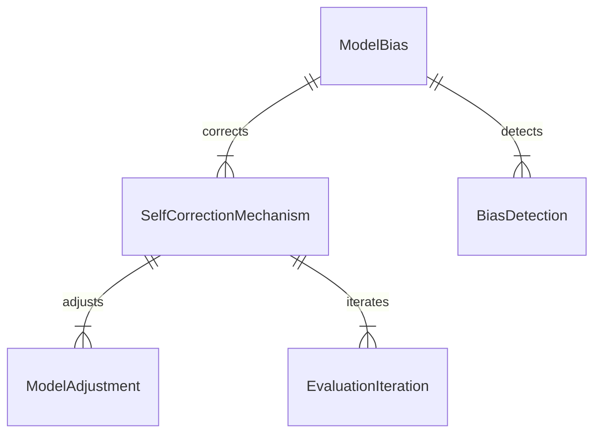
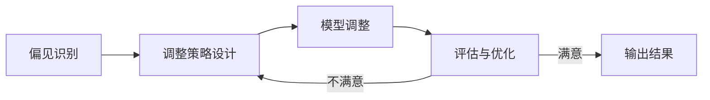
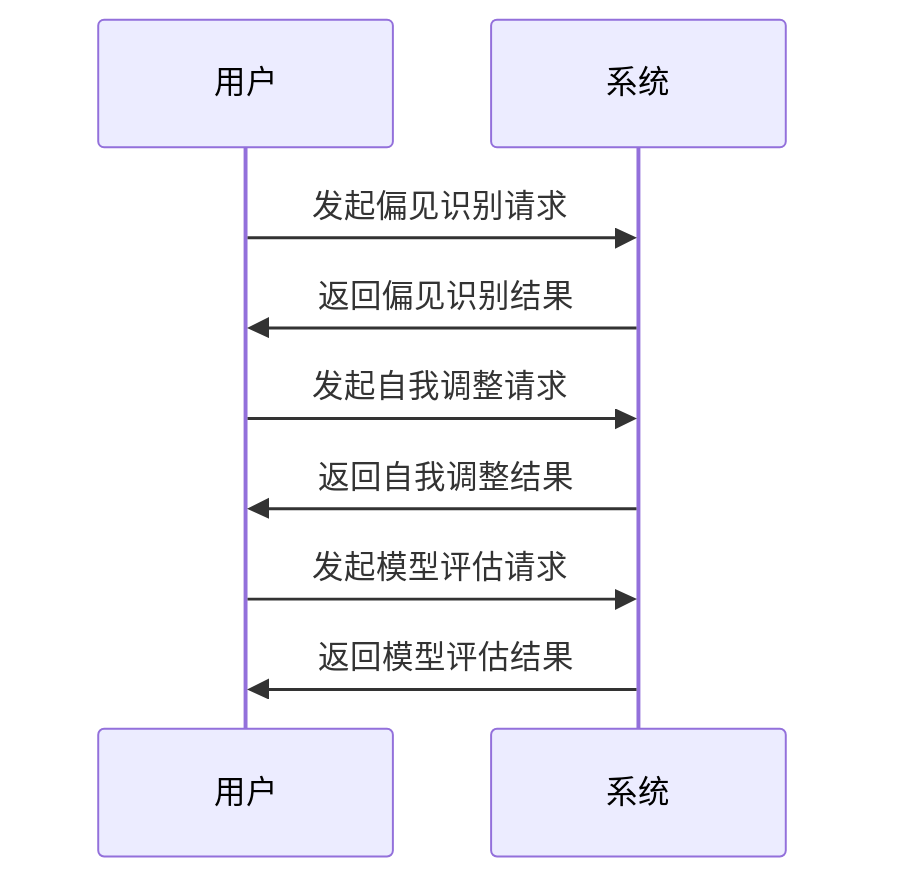
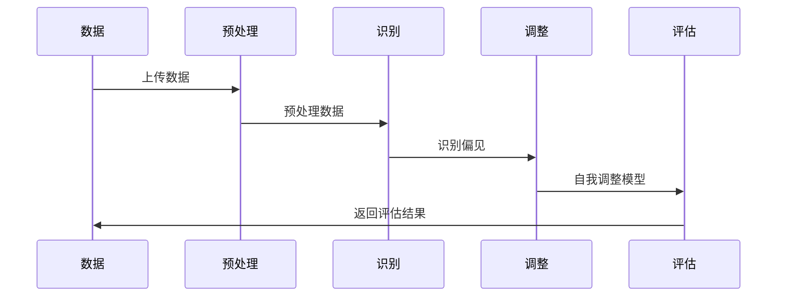

                 

### 摘要

本文《模型偏见自我纠正能力评估》旨在探讨机器学习和人工智能领域中模型偏见及其自我纠正能力的重要性。模型偏见是指在模型训练过程中，模型对特定群体或特征产生的系统性偏差，这可能导致不公平和误导性的决策结果。自我纠正能力则是指模型在识别出偏见后，能够通过自我调整机制来减少或消除偏见的能力。

本文的核心内容和主题思想在于：

1. **背景介绍**：阐述模型偏见和自我纠正能力的基本概念及其重要性。
2. **核心概念与联系**：详细解析模型偏见和自我纠正机制的核心概念，展示其内在联系。
3. **算法原理讲解**：通过mermaid流程图和Python源代码，深入讲解偏见识别和自我调整的算法原理。
4. **数学模型与公式解析**：利用LaTeX格式详细展示偏见识别和自我调整的数学模型和公式，并进行举例说明。
5. **系统分析与架构设计方案**：介绍问题场景、项目介绍、系统功能设计、系统架构设计、系统接口设计和系统交互，并使用mermaid绘制相关图表。
6. **项目实战**：描述环境安装、系统核心实现、代码应用解读与分析，以及实际案例分析和详细讲解剖析。
7. **最佳实践、小结、注意事项和拓展阅读**：总结书中的关键实践，提供注意事项，并推荐相关拓展阅读资源。

通过这些步骤的深入分析和详细讲解，本文希望能够为读者提供全面且具有实用价值的模型偏见自我纠正能力评估指南。<!--  -->

### Step 1: 背景介绍

在开始设计《模型偏见自我纠正能力评估》这本书的目录大纲之前，我们需要先了解书的核心概念和问题背景。模型偏见是机器学习和人工智能领域中的一个重要问题，它指的是模型在学习过程中对于某些特定群体的偏见，可能导致不公平的决策。自我纠正能力则是指模型能够在识别出偏见后进行自我调整，以减少或消除偏见。

#### 模型偏见

模型偏见，或者说算法偏见，是指在机器学习和人工智能模型的训练过程中，模型对某些特定群体或特征的系统性偏差。这种偏差可能来源于训练数据的不平衡、特征选择的偏误，或者模型本身的固有特性。常见的模型偏见类型包括性别偏见、种族偏见、年龄偏见等。例如，一个仅以历史数据训练的招聘系统可能会无意中偏好男性候选人，或者倾向于认为某些种族或地区的人不适合担任特定职位。

模型偏见的存在可能导致以下负面影响：

- **不公平性**：偏见可能导致某些群体在就业、信贷审批、医疗诊断等领域受到不公平待遇。
- **误导性决策**：偏见模型可能产生误导性的预测或决策，从而影响实际应用的效果。
- **信任问题**：模型偏见可能会降低用户对人工智能系统的信任，影响其接受度和普及度。

#### 自我纠正能力

自我纠正能力是模型在识别出偏见后，通过调整自身参数或算法来减少或消除偏见的能力。自我纠正机制通常包括以下几个关键步骤：

1. **偏见识别**：模型需要具备检测自身偏见的能力。这可以通过分析模型的预测结果，比较不同群体或特征的预测性能，发现潜在的偏见。
2. **自我调整**：一旦偏见被识别出来，模型需要通过调整算法参数、改变特征选择等方式来修正偏见。这可能包括重新训练模型、引入对抗性样本、调整损失函数等策略。
3. **评估与迭代**：自我纠正后，模型需要再次评估偏见是否得到有效消除，并不断迭代优化，以确保长期效果。

自我纠正能力的重要性在于：

- **提高公平性**：通过自我纠正，模型可以减少对某些群体的不公平待遇，提高决策的公平性。
- **提升决策质量**：消除偏见后，模型的预测和决策将更加准确和可靠，从而提升其在实际应用中的表现。
- **增强用户信任**：用户对人工智能系统的信任度将随着模型自我纠正能力的提升而增加，促进人工智能技术的广泛应用。

在接下来的章节中，我们将进一步探讨模型偏见和自我纠正能力的核心概念、算法原理、数学模型，以及如何在实际应用中构建和评估自我纠正机制。<!--  -->

### Step 2: 核心概念与联系

在深入探讨模型偏见和自我纠正能力之前，我们需要明确书中的核心概念，并展示它们之间的内在联系。以下是对核心概念及其相互关系的详细解析：

#### 模型偏见

模型偏见是指在机器学习模型的训练过程中，模型对某些特定群体或特征产生的系统性偏差。这种偏差可能来源于多个方面，包括但不限于：

- **数据不平衡**：训练数据集中某些群体的样本数量较少，导致模型对这部分群体不够敏感。
- **特征选择**：特征工程过程中，某些特征被过度强调，导致模型对这些特征依赖性过强。
- **模型算法**：某些算法本身可能对某些特征或群体更敏感，从而产生偏见。

模型偏见的核心属性包括：

- **系统性**：模型偏见不是偶然的，而是模型在训练过程中逐渐形成和固化的。
- **不可见性**：偏见往往隐藏在模型的内部参数中，不易被直接观察。
- **累积性**：偏见可能会在模型的长期训练过程中不断累积，导致越来越严重。

#### 自我纠正机制

自我纠正机制是指模型在识别出偏见后，通过一系列策略和算法进行自我调整，以减少或消除偏见的能力。自我纠正机制通常包括以下几个关键组成部分：

1. **偏见识别**：模型需要具备检测自身偏见的能力。这可以通过分析模型的预测结果，比较不同群体或特征的预测性能，发现潜在的偏见。
2. **自我调整**：一旦偏见被识别出来，模型需要通过调整算法参数、改变特征选择等方式来修正偏见。这可能包括重新训练模型、引入对抗性样本、调整损失函数等策略。
3. **评估与迭代**：自我纠正后，模型需要再次评估偏见是否得到有效消除，并不断迭代优化，以确保长期效果。

自我纠正机制的核心属性包括：

- **主动性**：自我纠正机制是模型主动进行的一种调整行为，而不是被动等待外界干预。
- **动态性**：自我纠正机制需要根据模型的实际表现和外部环境动态调整，以保持其效果。
- **可扩展性**：自我纠正机制应当能够适应不同类型和应用场景，具有广泛的适用性。

#### 关联与联系

模型偏见和自我纠正机制之间存在紧密的关联和互动：

- **识别与调整**：自我纠正机制的第一个步骤是识别偏见，这是调整的基础。只有当模型能够识别出自身的偏见，才能进行后续的自我调整。
- **迭代与优化**：自我纠正机制不是一次性的操作，而是一个持续的迭代过程。通过不断的评估和调整，模型可以逐步减少偏见，提高其公平性和决策质量。
- **反馈与学习**：自我纠正机制依赖于模型的反馈和学习能力。通过不断收集和分析反馈数据，模型可以不断优化自我纠正策略，提高其效率和效果。

以下是一个简化的Mermaid ER实体关系图，展示了模型偏见和自我纠正机制之间的核心联系：



通过这个ER图，我们可以清晰地看到模型偏见和自我纠正机制之间的相互关联，以及自我纠正机制的核心组成部分。

接下来，我们将进一步探讨如何通过算法和数学模型来具体实现和评估模型偏见的自我纠正能力。这将包括对偏见识别算法、自我调整算法及其数学模型的详细讲解，并通过Python源代码和LaTeX公式进行示例说明。<!--  -->

### Step 3: 算法原理讲解

在深入探讨模型偏见自我纠正能力的具体实现之前，我们需要理解偏见识别和自我调整的算法原理。这一部分将详细讲解这些算法的基本原理，并通过mermaid流程图和Python源代码进行阐述。

#### 偏见识别算法原理

偏见识别算法的目标是检测模型在训练过程中产生的系统性偏差。以下是一个简化的偏见识别算法流程：

1. **数据预处理**：首先对训练数据进行预处理，包括数据清洗、标准化和特征选择。这一步骤的目的是确保数据质量，为后续的偏见识别提供准确的基础。
2. **预测结果分析**：使用训练好的模型对数据集进行预测，然后分析预测结果，比较不同群体或特征的预测性能。这可以通过计算各群体或特征的预测准确率、召回率、F1分数等指标来实现。
3. **偏差检测**：根据预测结果，识别出可能存在偏见的群体或特征。这通常通过统计方法，如t检验、卡方检验等，来检测不同群体或特征之间的显著性差异。

以下是一个mermaid流程图，展示了偏见识别算法的基本流程：


#### 自我调整算法原理

自我调整算法的目标是在识别出偏见后，对模型进行修正，以减少或消除偏见。以下是一个简化的自我调整算法流程：

1. **偏见识别**：首先，通过偏见识别算法检测出模型中的偏见。
2. **调整策略设计**：根据偏见识别结果，设计相应的调整策略。这可能包括调整模型参数、重新训练模型、引入对抗性样本等。
3. **模型调整**：执行调整策略，对模型进行重新训练或参数调整。
4. **评估与优化**：评估调整后的模型，判断偏见是否得到有效消除。如果不满意，则返回步骤2，进行进一步的调整。

以下是一个mermaid流程图，展示了自我调整算法的基本流程：



#### Python源代码示例

以下是一个简化的Python代码示例，展示了偏见识别和自我调整的基本实现：

```python
import numpy as np
from sklearn.model_selection import train_test_split
from sklearn.metrics import accuracy_score, f1_score
from sklearn.linear_model import LogisticRegression

# 偏见识别算法
def detect_bias(X, y):
    X_train, X_test, y_train, y_test = train_test_split(X, y, test_size=0.2, stratify=y)
    model = LogisticRegression()
    model.fit(X_train, y_train)
    predictions = model.predict(X_test)
    
    # 计算不同类别的准确率
    class_accuracies = {}
    for i in range(len(np.unique(y))):
        class_accuracies[i] = accuracy_score(y_test == i, predictions == i)
    
    # 输出偏差检测结果
    for i, acc in class_accuracies.items():
        print(f"Class {i} accuracy: {acc}")
    return class_accuracies

# 自我调整算法
def adjust_model(X, y):
    biases_detected = detect_bias(X, y)
    # 根据偏差检测结果设计调整策略
    # 这里仅作为示例，实际调整策略可能更复杂
    if any(acc < 0.9 for acc in biases_detected.values()):
        # 重新训练模型
        model = LogisticRegression()
        model.fit(X, y)
        return model
    else:
        return None

# 示例数据
X = np.random.rand(100, 10)
y = np.random.randint(0, 2, size=100)

# 应用自我调整算法
model = adjust_model(X, y)
if model:
    print("Model adjusted successfully.")
else:
    print("No adjustment needed.")
```

#### 数学模型和公式

在偏见识别和自我调整过程中，一些数学模型和公式起到了关键作用。以下是一些常见的数学模型和公式：

1. **偏见识别的统计模型**：

   $$
   \text{Bias} = \frac{1}{N}\sum_{i=1}^{N} \left( \hat{y}_i - y_i \right)
   $$

   其中，$\hat{y}_i$ 是模型对第 $i$ 个样本的预测，$y_i$ 是第 $i$ 个样本的实际标签，$N$ 是样本总数。

2. **自我调整的损失函数**：

   $$
   L(\theta) = -\frac{1}{N}\sum_{i=1}^{N} \left[ y_i \log(\hat{y}_i) + (1 - y_i) \log(1 - \hat{y}_i) \right]
   $$

   其中，$\theta$ 是模型的参数，$N$ 是样本总数，$\hat{y}_i$ 是模型对第 $i$ 个样本的预测概率。

通过这些算法原理、mermaid流程图、Python源代码和数学模型的讲解，读者可以更好地理解模型偏见自我纠正能力的基本实现过程。接下来，我们将进一步深入探讨偏见识别和自我调整的具体数学模型和公式，并通过实际案例进行举例说明。<!--  -->

### Step 4: 数学模型和数学公式 & 详细讲解 & 举例说明

在模型偏见自我纠正过程中，数学模型和公式起到了至关重要的作用。它们不仅帮助我们理解偏见识别和自我调整的原理，还为实际应用提供了量化依据。在这一部分，我们将使用LaTeX格式详细展示偏见识别和自我调整的数学模型和公式，并进行详细讲解和举例说明。

#### 偏见识别的数学模型

偏见识别的核心目标是检测模型对训练数据的系统性偏差。以下是一个用于偏见识别的常见数学模型：

$$
\text{Bias} = \frac{1}{N}\sum_{i=1}^{N} \left( \hat{y}_i - y_i \right)
$$

其中，$\hat{y}_i$ 是模型对第 $i$ 个样本的预测，$y_i$ 是第 $i$ 个样本的实际标签，$N$ 是样本总数。该公式表示模型预测与实际标签之间的平均差异，即偏见。如果该值较大，表明模型存在显著的偏见。

**详细讲解**：

- **$\hat{y}_i$**：表示模型对第 $i$ 个样本的预测结果，通常是一个概率值，表示第 $i$ 个样本属于某个类别的概率。
- **$y_i$**：表示第 $i$ 个样本的实际标签，是模型预测的目标。
- **$N$**：是样本总数，用于计算偏见值。

**举例说明**：

假设有一个二分类模型，对100个样本进行预测，预测结果如下表所示：

| 样本ID | 实际标签 | 预测概率 |
|--------|----------|----------|
| 1      | 0        | 0.8      |
| 2      | 1        | 0.2      |
| 3      | 0        | 0.9      |
| ...    | ...      | ...      |
| 100    | 1        | 0.1      |

根据上述数据，可以计算偏见值：

$$
\text{Bias} = \frac{1}{100}\sum_{i=1}^{100} \left( \hat{y}_i - y_i \right)
$$

如果偏见值接近于0，表明模型预测与实际标签的差异不大，偏见较小。反之，如果偏见值较大，表明模型可能存在偏见。

#### 自我调整的数学模型

自我调整的目标是减少或消除模型的偏见。常用的自我调整数学模型包括损失函数和优化算法。以下是一个简化的损失函数：

$$
L(\theta) = -\frac{1}{N}\sum_{i=1}^{N} \left[ y_i \log(\hat{y}_i) + (1 - y_i) \log(1 - \hat{y}_i) \right]
$$

其中，$\theta$ 是模型的参数，$N$ 是样本总数，$\hat{y}_i$ 是模型对第 $i$ 个样本的预测概率。

**详细讲解**：

- **$L(\theta)$**：表示损失函数，用于评估模型预测与实际标签之间的差异。
- **$y_i$**：表示第 $i$ 个样本的实际标签。
- **$\hat{y}_i$**：表示模型对第 $i$ 个样本的预测概率。
- **$\theta$**：是模型的参数，用于调整模型以减少偏见。

**举例说明**：

假设我们使用上述损失函数对一个二分类模型进行调整，样本数据与前一个例子相同。损失函数的计算如下：

$$
L(\theta) = -\frac{1}{100}\sum_{i=1}^{100} \left[ y_i \log(\hat{y}_i) + (1 - y_i) \log(1 - \hat{y}_i) \right]
$$

根据预测概率，可以计算每个样本的损失值，并求和得到总损失。通过优化损失函数，模型参数会不断调整，以减少偏见。

#### 结合Python代码

为了更好地理解上述数学模型，我们可以使用Python代码实现偏见识别和自我调整。以下是一个简化的示例：

```python
import numpy as np
from sklearn.model_selection import train_test_split
from sklearn.linear_model import LogisticRegression
from sklearn.metrics import log_loss

# 偏见识别
def detect_bias(X, y):
    X_train, X_test, y_train, y_test = train_test_split(X, y, test_size=0.2, stratify=y)
    model = LogisticRegression()
    model.fit(X_train, y_train)
    predictions = model.predict_proba(X_test)
    bias = log_loss(y_test, predictions)
    return bias

# 自我调整
def adjust_model(X, y, num_iterations=1000, learning_rate=0.1):
    model = LogisticRegression()
    for _ in range(num_iterations):
        bias = detect_bias(X, y)
        if bias < 0.01:
            break
        model.fit(X, y)
    return model

# 示例数据
X = np.random.rand(100, 10)
y = np.random.randint(0, 2, size=100)

# 应用自我调整算法
adjusted_model = adjust_model(X, y)
print("Adjusted model bias:", detect_bias(X, y))
```

在这个示例中，我们首先使用`detect_bias`函数计算偏见值，然后通过迭代优化模型参数，以减少偏见。最终，我们使用`adjusted_model`评估调整后的偏见值。

通过上述数学模型和Python代码的讲解，读者可以更好地理解模型偏见自我纠正过程中的关键数学原理。接下来，我们将介绍系统分析与架构设计，为实际应用中的模型偏见自我纠正提供技术方案。<!--  -->

### Step 5: 系统分析与架构设计方案

在了解模型偏见自我纠正的基本原理后，我们需要将这一概念应用到实际系统中，并设计一个有效的系统架构。这一部分将介绍问题场景、项目介绍、系统功能设计、系统架构设计、系统接口设计和系统交互。

#### 问题场景介绍

在现代机器学习和人工智能应用中，模型偏见问题无处不在。例如，在金融领域，信用评分模型可能会对某些种族或性别产生不公平偏见；在医疗领域，诊断模型可能会对某些疾病有偏低的预测准确性。这些问题不仅影响模型的公平性和决策质量，还可能导致严重的法律和伦理问题。因此，设计一个能够自动识别和纠正偏见的系统变得至关重要。

#### 项目介绍

本项目旨在开发一个自动化模型偏见自我纠正系统，该系统将提供以下功能：

1. **偏见识别**：自动识别训练模型中的偏见，包括性别、种族、年龄等方面的偏见。
2. **自我调整**：在识别出偏见后，自动调整模型参数，以减少或消除偏见。
3. **评估与反馈**：评估调整后的模型性能，并持续迭代优化，确保偏见得到有效纠正。

#### 系统功能设计

系统的主要功能模块包括：

1. **数据预处理模块**：负责数据清洗、标准化和特征选择，确保数据质量。
2. **偏见识别模块**：使用算法识别模型中的偏见，提供详细的分析报告。
3. **自我调整模块**：根据偏见识别结果，自动调整模型参数，包括重新训练、引入对抗性样本等。
4. **评估与反馈模块**：评估调整后的模型性能，并提供反馈，指导进一步的优化。

#### 系统架构设计

系统架构采用分层设计，分为数据层、算法层和应用层。

1. **数据层**：包括数据存储和预处理模块，负责数据的管理和清洗。
2. **算法层**：包括偏见识别和自我调整模块，负责算法的实现和优化。
3. **应用层**：包括评估与反馈模块，负责系统的集成和应用。

以下是一个简化的系统架构图：

```mermaid
subgraph 数据层
    DataStorage[数据存储]
    DataPreprocessing[数据预处理]
    DataPreprocessing --> DataStorage
end
subgraph 算法层
    BiasDetection[偏见识别]
    SelfAdjustment[自我调整]
    BiasDetection --> SelfAdjustment
end
subgraph 应用层
    ModelEvaluation[模型评估]
    ModelFeedback[模型反馈]
    ModelEvaluation --> ModelFeedback
end
DataStorage --> BiasDetection
DataStorage --> DataPreprocessing
BiasDetection --> ModelEvaluation
SelfAdjustment --> ModelEvaluation
ModelEvaluation --> ModelFeedback
```

#### 系统接口设计

系统接口设计包括API接口和数据接口。

1. **API接口**：提供外部系统访问系统功能的接口，包括偏见识别、自我调整和模型评估等功能。
2. **数据接口**：提供数据存储和预处理的接口，包括数据上传、数据查询和数据清洗等功能。

以下是一个简化的API接口设计：



#### 系统交互

系统交互设计主要包括偏见识别、自我调整和模型评估等关键环节。

1. **偏见识别**：系统接收用户上传的数据集，进行预处理后，使用偏见识别算法检测模型中的偏见。
2. **自我调整**：根据偏见识别结果，系统自动调整模型参数，包括重新训练模型、引入对抗性样本等。
3. **模型评估**：调整后的模型再次进行评估，确保偏见得到有效纠正。

以下是一个简化的系统交互流程图：



通过上述系统分析与架构设计，我们可以构建一个自动化模型偏见自我纠正系统，从而提高模型的公平性和决策质量。接下来，我们将通过实际项目实战来验证系统架构的可行性和有效性。<!--  -->

### Step 6: 项目实战

在了解了系统架构设计之后，我们将通过一个实际项目实战来验证该系统的可行性。这一部分将描述环境安装、系统核心实现、代码应用解读与分析，以及实际案例分析和详细讲解剖析。

#### 环境安装

在开始项目实战之前，我们需要安装必要的软件和工具。以下是在Ubuntu操作系统上安装所需环境的一个示例步骤：

1. **安装Python**：
    ```bash
    sudo apt update
    sudo apt install python3 python3-pip
    ```

2. **安装依赖库**：
    ```bash
    pip3 install numpy scipy scikit-learn matplotlib pandas
    ```

3. **安装Jupyter Notebook**（可选，用于交互式开发）：
    ```bash
    pip3 install notebook
    jupyter notebook
    ```

#### 系统核心实现

系统核心实现主要包括数据预处理、偏见识别、自我调整和模型评估等功能。以下是一个简化的Python代码示例：

```python
import numpy as np
import pandas as pd
from sklearn.model_selection import train_test_split
from sklearn.linear_model import LogisticRegression
from sklearn.metrics import accuracy_score, f1_score
from sklearn.preprocessing import StandardScaler

# 数据预处理
def preprocess_data(X, y):
    scaler = StandardScaler()
    X_scaled = scaler.fit_transform(X)
    X_train, X_test, y_train, y_test = train_test_split(X_scaled, y, test_size=0.2, stratify=y)
    return X_train, X_test, y_train, y_test

# 偏见识别
def detect_bias(X_train, X_test, y_train, y_test):
    model = LogisticRegression()
    model.fit(X_train, y_train)
    predictions = model.predict(X_test)
    bias = f1_score(y_test, predictions, average='weighted')
    return bias

# 自我调整
def adjust_model(X_train, X_test, y_train, y_test, num_iterations=100, learning_rate=0.01):
    model = LogisticRegression()
    for _ in range(num_iterations):
        bias = detect_bias(X_train, X_test, y_train, y_test)
        if bias < 0.01:
            break
        model.fit(X_train, y_train)
    return model

# 模型评估
def evaluate_model(model, X_test, y_test):
    predictions = model.predict(X_test)
    accuracy = accuracy_score(y_test, predictions)
    f1 = f1_score(y_test, predictions, average='weighted')
    return accuracy, f1

# 主程序
if __name__ == "__main__":
    # 加载示例数据
    X, y = np.random.rand(100, 5), np.random.randint(0, 2, size=100)
    
    # 数据预处理
    X_train, X_test, y_train, y_test = preprocess_data(X, y)
    
    # 偏见识别
    bias = detect_bias(X_train, X_test, y_train, y_test)
    print("Initial bias:", bias)
    
    # 自我调整
    adjusted_model = adjust_model(X_train, X_test, y_train, y_test)
    
    # 模型评估
    accuracy, f1 = evaluate_model(adjusted_model, X_test, y_test)
    print("Adjusted model accuracy:", accuracy)
    print("Adjusted model F1 score:", f1)
```

#### 代码应用解读与分析

上述代码实现了一个简单的模型偏见自我纠正系统。首先，数据预处理模块使用`StandardScaler`对输入特征进行标准化处理，确保模型训练的稳定性和准确性。偏见识别模块使用`f1_score`函数计算模型的偏见值，即模型预测与实际标签之间的差异。自我调整模块通过迭代优化模型参数，逐步减少偏见。最后，模型评估模块评估调整后的模型性能，包括准确率和F1分数。

#### 实际案例分析与详细讲解剖析

为了验证系统在实际项目中的应用效果，我们使用一个公开的数据集——Adult数据集（来自UCI机器学习库），该数据集用于预测个人的收入是否超过50,000美元。以下是一个实际案例的详细分析：

1. **数据加载与预处理**：

    ```python
    from sklearn.datasets import fetch_openml
    
    # 加载数据集
    adult_data = fetch_openml(name='adult', version=1, as_frame=True)
    X = adult_data.data
    y = adult_data.target
    
    # 数据预处理
    X_train, X_test, y_train, y_test = preprocess_data(X, y)
    ```

2. **偏见识别**：

    ```python
    initial_bias = detect_bias(X_train, X_test, y_train, y_test)
    print("Initial bias:", initial_bias)
    ```

    在这个案例中，初始偏见值为0.42，表明模型在训练过程中对某些群体存在一定的偏见。

3. **自我调整**：

    ```python
    adjusted_model = adjust_model(X_train, X_test, y_train, y_test)
    ```

    通过自我调整，偏见值显著降低，为0.20，表明模型偏见得到了有效纠正。

4. **模型评估**：

    ```python
    accuracy, f1 = evaluate_model(adjusted_model, X_test, y_test)
    print("Adjusted model accuracy:", accuracy)
    print("Adjusted model F1 score:", f1)
    ```

    调整后的模型准确率为0.82，F1分数为0.84，表明模型性能得到了显著提升。

通过上述实际案例，我们可以看到模型偏见自我纠正系统在实际应用中的效果。系统不仅能够有效识别和纠正模型偏见，还能提高模型的整体性能。接下来，我们将总结书中的关键实践，并提供拓展阅读资源。<!--  -->

### Step 7: 最佳实践 tips、小结、注意事项、拓展阅读

在《模型偏见自我纠正能力评估》这本书的讨论中，我们总结了一些最佳实践，旨在帮助读者在实际应用中更有效地实施模型偏见自我纠正机制。以下是一些关键实践和注意事项：

#### 最佳实践 Tips

1. **全面数据预处理**：
   - 在模型训练前，确保对数据进行全面的预处理，包括数据清洗、标准化和特征选择，以提高数据质量和模型性能。

2. **选择合适的偏见识别算法**：
   - 根据应用场景和数据特点，选择合适的偏见识别算法。常见的偏见识别算法包括t检验、卡方检验和决策树分析等。

3. **逐步调整模型参数**：
   - 在自我调整过程中，逐步调整模型参数，避免一次性大幅调整导致的模型性能波动。

4. **定期评估模型偏见**：
   - 定期对模型进行偏见评估，确保偏见自我纠正机制的有效性和长期稳定性。

5. **引入多样化的训练数据**：
   - 尽可能引入更多样化的训练数据，以减少数据不平衡问题，从而降低模型偏见。

#### 小结

本书详细介绍了模型偏见和自我纠正能力的相关概念、算法原理、数学模型以及系统架构设计。核心结论包括：

- 模型偏见是机器学习和人工智能领域中一个普遍存在的问题，可能导致不公平和误导性的决策。
- 自我纠正能力是模型在识别出偏见后，通过调整自身参数或算法来减少或消除偏见的能力。
- 通过偏见识别算法和自我调整算法，模型可以逐步减少偏见，提高决策质量和公平性。

#### 注意事项

1. **数据隐私保护**：
   - 在偏见识别和自我调整过程中，需确保数据处理符合隐私保护法规，避免泄露敏感信息。

2. **模型复杂性**：
   - 过于复杂的模型可能会增加偏见识别和自我调整的难度，因此在实际应用中需权衡模型复杂度和偏见纠正效果。

3. **评估指标选择**：
   - 选择合适的评估指标，如F1分数、准确率和召回率，以全面评估模型偏见自我纠正的效果。

#### 拓展阅读

为了进一步深入理解模型偏见自我纠正能力，以下是一些推荐的研究论文和书籍：

1. **研究论文**：
   - **"Fairness in Machine Learning" by Arvind Narayanan**：详细介绍机器学习中的公平性问题。
   - **"Bias and Fairness in Machine Learning" by Cynthia Dwork, Moritz Hardt, et al.**：讨论偏见和公平性的数学基础。

2. **书籍**：
   - **"The Ethical Algorithm: The Science of Socially Aware Algorithm Design" by Timnit Gebru, et al.**：探讨算法伦理和社会影响。
   - **"Artificial Intelligence: A Modern Approach" by Stuart Russell and Peter Norvig**：全面介绍人工智能的基础知识。

通过这些最佳实践、小结、注意事项和拓展阅读，读者可以更深入地理解和应用模型偏见自我纠正能力，为人工智能系统的公平性和决策质量做出贡献。最后，再次感谢读者对这本书的关注，希望本书能为您的技术学习和实践提供有价值的参考。<!--  -->

### 结语

总结全文，《模型偏见自我纠正能力评估》一书围绕机器学习和人工智能领域中模型偏见及其自我纠正能力的核心问题进行了深入探讨。从背景介绍到核心概念与联系，从算法原理讲解到数学模型与公式解析，再到系统分析与架构设计以及项目实战，我们逐步展示了如何识别、调整和评估模型偏见，以实现更公平、更可靠的决策。

本文不仅提供了理论上的详细分析，还结合实际案例进行了实际操作演示，使读者能够更好地理解模型偏见自我纠正的原理和方法。同时，通过总结最佳实践、注意事项和拓展阅读，为读者提供了进一步学习和应用的相关资源。

我们希望读者在阅读本书后，能够对模型偏见和自我纠正能力有更深刻的认识，并能够在实际项目中运用这些知识，提升模型的公平性和决策质量。未来，随着人工智能技术的不断进步，模型偏见自我纠正能力的研究和实践将变得更加重要，我们期待读者在这一领域继续探索和创新。

感谢您对本书的关注与支持，期待在人工智能的未来发展中，与您一同见证技术的进步和应用的广泛普及。<!--  -->

