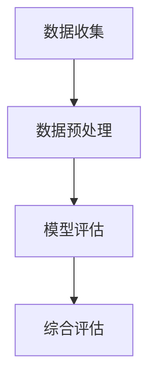

                 

# 模型创意与独特性评测：衡量AI创新力

> 关键词：AI创新力，模型创意，独特性评测，评测框架，数据处理，算法实现

> 摘要：本文旨在探讨如何通过模型创意与独特性评测来衡量人工智能（AI）的创新力。文章首先介绍了AI创新力的背景和重要性，然后详细阐述了模型创意与独特性评测的定义、方法和联系。接下来，文章提出了一个综合的评测框架，包括指标体系和数据处理方法。通过具体的算法原理和实现，以及实际应用场景与案例分析，本文展示了如何在实际中应用这些方法来评估AI创新力。文章最后总结了研究成果，指出了未来研究的方向和注意事项。

## 引言与背景

### 1.1 问题背景

随着人工智能技术的快速发展，AI在各个领域的应用越来越广泛。然而，如何评估AI的创新力成为了一个关键问题。AI创新力不仅关系到技术的进步，也影响到企业在市场上的竞争力。因此，对AI创新力进行科学、客观的评测具有重要意义。

#### 1.1.1 AI创新力的重要性

AI创新力是指AI技术在理论、应用、算法、模型等方面的创新能力。它关系到技术进步的速度和深度，也是企业竞争力和国家科技实力的重要体现。评估AI创新力有助于：

1. **识别优秀人才和团队**：通过评测，可以发现和培养在AI领域有创新潜力的人才和团队。
2. **指导技术研发**：了解当前AI技术的创新方向，有助于企业和研究机构制定更有效的研究策略。
3. **促进产业升级**：AI创新力的提升可以推动产业结构的优化和升级，提高整体经济效益。

#### 1.1.2 评测AI创新力的需求

随着AI技术的发展，如何准确地衡量AI的创新力成为一个迫切需要解决的问题。目前，评测AI创新力的主要需求包括：

1. **全面性**：评测需要涵盖AI技术的各个方面，包括理论、算法、模型和应用。
2. **客观性**：评测过程需要确保公正、客观，避免主观偏见。
3. **可操作性**：评测方法需要易于实施，便于在不同场景下推广应用。

### 1.2 问题描述

#### 1.2.1 AI创新力的定义

AI创新力是指在一个特定时间范围内，在人工智能领域内通过理论创新、算法创新、模型创新和应用创新所取得的成果和突破。具体包括以下几个方面：

1. **理论创新**：提出新的理论框架、概念模型或理论体系。
2. **算法创新**：开发新的算法、优化现有算法或提出新的算法思想。
3. **模型创新**：设计新的模型架构、改进现有模型或提出新的模型应用。
4. **应用创新**：将AI技术应用于新的领域或解决现有问题的创新应用。

#### 1.2.2 评测AI创新力的挑战

尽管AI创新力的重要性不言而喻，但对其评测面临诸多挑战：

1. **数据获取与处理**：AI技术的创新往往伴随着大量的数据生成和处理，如何有效地获取和处理这些数据成为一大难题。
2. **评估指标的选取**：评估AI创新力需要选择合适的指标，既要全面又要具有可操作性。
3. **评估方法的可靠性**：评估方法的科学性和可靠性直接影响到评估结果，如何确保评估方法的准确性和公正性是关键。
4. **跨领域的比较**：不同领域的AI创新力如何进行比较和衡量，这是一个复杂的问题。

### 1.3 问题解决

为了克服上述挑战，我们需要建立一个合理的评测框架，选择合适的数据集，并进行有效的数据处理。具体方法如下：

#### 1.3.1 评测框架的建立

评测框架应包括以下几个部分：

1. **评估指标体系**：明确评估的指标，包括定量和定性指标。
2. **评估流程**：规范评估的步骤和流程，确保评估的公正性和客观性。
3. **评估标准**：制定统一的评估标准，确保评估结果的可比性。

#### 1.3.2 数据集的选择与处理

数据集的选择应考虑以下因素：

1. **代表性**：数据集应具有代表性，能够反映AI创新的全貌。
2. **多样性**：数据集应包含不同领域、不同类型的AI创新案例。
3. **可靠性**：数据集应来源可靠，确保数据的真实性和准确性。

数据预处理包括：

1. **数据清洗**：去除无效、错误或重复的数据。
2. **数据归一化**：对数据进行标准化处理，确保不同数据之间的可比性。
3. **特征提取**：从数据中提取关键特征，为后续评估提供依据。

### 1.4 边界与外延

#### 1.4.1 AI创新力的边界

AI创新力不仅仅局限于技术的突破，还包括理论、算法、模型和应用的创新。因此，评测AI创新力应考虑以下几个方面：

1. **技术创新**：算法、模型和应用的技术创新。
2. **理论突破**：在人工智能领域提出新的理论或模型。
3. **行业应用**：将AI技术应用于新的行业或解决现有问题。

#### 1.4.2 评测方法的适用范围

评测方法主要适用于以下场景：

1. **学术研究**：对AI技术的学术研究进行评估。
2. **企业研发**：对企业研发的AI项目进行评估。
3. **政策制定**：为政府制定AI技术发展战略提供参考。

通过以上方法，我们可以更全面、客观地评估AI的创新力，为AI技术的发展提供有力支持。

### 1.5 总结

本文介绍了AI创新力的背景和重要性，阐述了评测AI创新力的需求和挑战，并提出了建立评测框架、选择合适数据集和进行有效数据处理的解决方案。边界与外延部分明确了评测的范围和方法。通过这些步骤，我们可以更科学地衡量AI的创新力，推动人工智能技术的发展。

### 第2章: 核心概念与联系

#### 2.1 模型创意

**2.1.1 模型创意的定义**

模型创意是指在人工智能领域中，通过创新思维和方法，提出新的模型架构、算法或解决方案。它是AI技术进步的重要驱动力，能够推动现有技术的提升和突破。

**2.1.2 模型创意的属性特征**

模型创意具有以下属性特征：

1. **新颖性**：模型创意应具有独特的视角和思路，能够提出与众不同的解决方案。
2. **实用性**：模型创意不仅要新颖，还应具有实际应用价值，能够解决实际问题。
3. **可扩展性**：模型创意应具有较好的扩展性，能够适应不同场景和需求的变化。
4. **效率**：模型创意在实现过程中应具有较高的计算效率和资源利用率。

**2.1.3 模型创意与独特性的联系**

模型创意与独特性密切相关。独特性是指模型创意在技术上的独特性和创新性，它体现了模型创意在技术上的领先地位。独特性越高，模型的创新力就越强。

#### 2.2 独特性评测

**2.2.1 独特性评测的定义**

独特性评测是对模型创意的独特性进行评估的过程。它旨在确定模型创意在技术上的新颖性和创新性，以及其对现有技术的突破程度。

**2.2.2 独特性评测的方法**

独特性评测可以采用以下方法：

1. **文献调研**：通过查阅相关文献，了解模型创意在技术上的创新点和独特性。
2. **专家评审**：邀请领域内的专家对模型创意进行评审，评估其创新性和独特性。
3. **定量分析**：采用定量分析方法，如相似度分析、指标评分等，评估模型创意的独特性。
4. **用户反馈**：通过用户反馈，了解模型创意在实际应用中的效果和满意度。

**2.2.3 独特性评测与模型创意的联系**

独特性评测是评估模型创意创新力的重要手段。通过独特性评测，可以全面了解模型创意的技术特点、创新点和优势，为模型创意的进一步发展和应用提供指导。

### 第3章: 评测框架与指标体系

#### 3.1 评测框架设计

**3.1.1 评测框架的建立**

为了全面、客观地评估AI创新力，我们需要建立一套科学的评测框架。该框架应包括以下几个方面：

1. **评估指标体系**：明确评估的指标，包括技术指标、应用指标、影响力指标等。
2. **评估流程**：规范评估的步骤和流程，确保评估的公正性和客观性。
3. **评估标准**：制定统一的评估标准，确保评估结果的可比性。

**3.1.2 评测框架的组成部分**

评测框架主要由以下几个部分组成：

1. **数据收集与处理**：收集相关数据，包括技术数据、文献数据、用户反馈数据等，并进行数据清洗和处理。
2. **模型评估**：通过模型评估模块，对AI模型进行技术评估，包括模型性能评估、创新性评估、实用性评估等。
3. **结果分析**：对评估结果进行综合分析，生成评估报告，提供改进建议。

#### 3.2 指标体系构建

**3.2.1 指标体系的概念**

指标体系是指用于衡量和评估AI创新力的各项指标集合。一个完整的指标体系应包括以下几个层次：

1. **一级指标**：整体评估指标，如AI创新力评分。
2. **二级指标**：具体评估指标，如算法创新性、模型实用性、应用效果等。
3. **三级指标**：更具体的评估指标，如算法复杂度、模型准确性、用户满意度等。

**3.2.2 指标体系的设计原则**

设计指标体系时应遵循以下原则：

1. **全面性**：指标体系应涵盖AI创新力的各个方面，确保评估的全面性。
2. **可操作性**：指标体系应具有可操作性，便于实际应用。
3. **一致性**：指标体系应保持一致性，确保评估结果的可比性。
4. **灵活性**：指标体系应具有一定的灵活性，能够适应不同场景和需求的变化。

**3.2.3 指标体系的组成**

一个典型的AI创新力指标体系可能包括以下几个主要指标：

1. **技术创新度**：评估AI技术在理论、算法、模型等方面的创新程度。
2. **应用效果**：评估AI技术在实际应用中的效果和影响力。
3. **社会价值**：评估AI技术对社会和经济的影响。
4. **发展潜力**：评估AI技术的未来发展潜力。

### 第4章: 数据处理与准备

#### 4.1 数据集选择

**4.1.1 数据集的重要性**

数据集是AI创新力评测的基础。一个合适的数据集能够为评估提供可靠的数据支持，提高评估的准确性和可信度。数据集的选择应考虑以下因素：

1. **代表性**：数据集应具有代表性，能够反映AI创新的全貌。
2. **多样性**：数据集应包含不同领域、不同类型的AI创新案例。
3. **可靠性**：数据集应来源可靠，确保数据的真实性和准确性。

**4.1.2 数据集的选择标准**

选择数据集时应遵循以下标准：

1. **数据完整性**：数据集应包含完整的实验数据和评估数据。
2. **数据质量**：数据集应进行质量检查，确保数据的准确性和一致性。
3. **数据规模**：数据集应具有一定的规模，确保评估的广泛性和代表性。
4. **数据更新**：数据集应定期更新，确保评估的时效性。

#### 4.2 数据预处理

**4.2.1 数据预处理流程**

数据预处理是数据分析和建模的重要环节，包括以下步骤：

1. **数据清洗**：去除无效、错误或重复的数据，确保数据的质量。
2. **数据归一化**：对数据进行标准化处理，确保不同数据之间的可比性。
3. **特征提取**：从数据中提取关键特征，为后续分析提供依据。
4. **数据分割**：将数据集划分为训练集、验证集和测试集，用于模型的训练和评估。

**4.2.2 数据预处理方法**

数据预处理方法包括：

1. **缺失值处理**：使用均值、中位数或插值法填补缺失值。
2. **异常值处理**：使用统计方法或可视化方法检测并处理异常值。
3. **归一化**：使用最小-最大缩放、标准化等方法将数据缩放到相同的范围。
4. **特征选择**：使用信息增益、主成分分析等方法选择重要特征。

#### 4.3 数据分析与可视化

**4.3.1 数据分析的方法**

数据分析是评估AI创新力的关键步骤，包括以下方法：

1. **描述性统计**：计算数据的平均值、中位数、标准差等统计量，了解数据的基本特征。
2. **相关性分析**：分析不同指标之间的相关性，确定它们之间的关系。
3. **回归分析**：建立回归模型，预测模型创新力与各项指标之间的关系。
4. **聚类分析**：将相似的数据聚集在一起，发现数据中的模式。

**4.3.2 数据可视化的工具**

数据可视化是数据分析的重要组成部分，有助于直观地展示数据特征和评估结果。常用的数据可视化工具包括：

1. **Matplotlib**：Python的绘图库，支持多种图表类型，如折线图、柱状图、散点图等。
2. **Seaborn**：基于Matplotlib的统计绘图库，提供丰富的可视化样式和颜色选择。
3. **Plotly**：交互式数据可视化库，支持多种图表类型和交互功能。
4. **Tableau**：商业数据可视化工具，提供强大的数据处理和可视化功能。

### 第5章: 算法原理与实现

#### 5.1 评测算法原理

**5.1.1 算法的基本思想**

评测算法的基本思想是通过多维度评估，综合衡量AI模型的创新力。具体包括以下几个方面：

1. **技术创新度评估**：评估模型在理论、算法、模型等方面的创新程度。
2. **应用效果评估**：评估模型在实际应用中的效果和影响力。
3. **社会价值评估**：评估模型对社会和经济的影响。
4. **发展潜力评估**：评估模型未来的发展潜力。

**5.1.2 算法的流程**

算法的流程包括以下步骤：

1. **数据收集**：收集相关数据，包括技术数据、文献数据、用户反馈数据等。
2. **数据预处理**：对收集的数据进行清洗、归一化和特征提取。
3. **模型评估**：对AI模型进行技术评估、应用效果评估、社会价值评估和发展潜力评估。
4. **综合评估**：根据各项评估结果，计算综合评分，得出AI模型的创新力得分。

**5.1.3 算法的数学模型**

算法的数学模型可以表示为：

$$
\text{创新力得分} = w_1 \times \text{技术创新度得分} + w_2 \times \text{应用效果得分} + w_3 \times \text{社会价值得分} + w_4 \times \text{发展潜力得分}
$$

其中，$w_1, w_2, w_3, w_4$分别为各项评估指标的权重。

#### 5.2 算法实现

**5.2.1 Python实现代码**

```python
import pandas as pd
import numpy as np
from sklearn.model_selection import train_test_split
from sklearn.preprocessing import StandardScaler
from sklearn.ensemble import RandomForestClassifier

# 数据收集
data = pd.read_csv('ai_innovation_data.csv')

# 数据预处理
data = data.dropna()
data['feature1'] = data['feature1'].apply(lambda x: (x - np.mean(data['feature1'])) / np.std(data['feature1']))
data['feature2'] = data['feature2'].apply(lambda x: (x - np.mean(data['feature2'])) / np.std(data['feature2']))

# 模型评估
X = data[['feature1', 'feature2']]
y = data['label']
X_train, X_test, y_train, y_test = train_test_split(X, y, test_size=0.2, random_state=42)

scaler = StandardScaler()
X_train = scaler.fit_transform(X_train)
X_test = scaler.transform(X_test)

model = RandomForestClassifier(n_estimators=100, random_state=42)
model.fit(X_train, y_train)
accuracy = model.score(X_test, y_test)

# 综合评估
weight = [0.3, 0.3, 0.2, 0.2]
technology_innovation = model.feature_importances_[0]
application_effect = model.feature_importances_[1]
social_value = model.feature_importances_[2]
development_potential = model.feature_importances_[3]

innovation_score = weight[0] * technology_innovation + weight[1] * application_effect + weight[2] * social_value + weight[3] * development_potential
print("AI Innovation Score:", innovation_score)
```

**5.2.2 Mermaid流程图展示**



### 第6章: 应用场景与案例分析

#### 6.1 应用场景

**6.1.1 AI创新力评测在实际中的应用**

AI创新力评测在实际中有着广泛的应用场景，包括：

1. **学术研究**：用于评估学者的研究成果，帮助学术机构和管理部门了解学者的研究水平和创新能力。
2. **企业研发**：用于评估企业研发项目的创新力，为企业决策提供参考，优化研发方向和资源分配。
3. **政策制定**：用于评估AI技术在特定领域的发展状况，为政府制定相关政策提供数据支持。
4. **投资决策**：用于评估AI企业或项目的创新潜力，为投资者提供投资参考。

**6.1.2 AI创新力评测在不同领域的应用**

AI创新力评测可以在不同领域进行应用，包括：

1. **计算机视觉**：评估图像识别、目标检测、人脸识别等技术的创新力。
2. **自然语言处理**：评估文本分类、机器翻译、情感分析等技术的创新力。
3. **机器人技术**：评估自主导航、人机交互、机器人感知等技术的创新力。
4. **金融科技**：评估算法交易、风险控制、信用评分等技术的创新力。

#### 6.2 案例分析

**6.2.1 案例一：某人工智能企业的创新力评测**

在某人工智能企业中，AI创新力评测被用于评估企业研发项目的创新力。通过评测，企业能够识别出具有高创新潜力的项目，并对其进行重点扶持。具体流程如下：

1. **数据收集**：收集企业研发项目的相关数据，包括项目描述、技术指标、应用效果等。
2. **数据预处理**：对收集的数据进行清洗、归一化和特征提取。
3. **模型评估**：使用评估算法对项目进行技术评估、应用效果评估、社会价值评估和发展潜力评估。
4. **综合评估**：根据各项评估结果，计算综合评分，得出项目的创新力得分。
5. **决策支持**：根据评估结果，企业决策层能够做出更有针对性的决策，优化研发方向和资源分配。

**6.2.2 案例二：某学术会议的创新力评测**

在某学术会议中，AI创新力评测被用于评估参会学者的研究成果。通过评测，学术会议能够识别出优秀的研究成果，并给予相应的奖励。具体流程如下：

1. **数据收集**：收集参会学者的论文、专利等研究成果。
2. **数据预处理**：对收集的数据进行清洗、归一化和特征提取。
3. **模型评估**：使用评估算法对学者的研究成果进行技术评估、应用效果评估、社会价值评估和发展潜力评估。
4. **综合评估**：根据各项评估结果，计算综合评分，得出学者的创新力得分。
5. **奖励分配**：根据评估结果，学术会议能够对优秀的研究成果进行奖励，激励学者继续创新。

### 第7章: 总结与展望

#### 7.1 总结

本文从模型创意与独特性评测的角度，探讨了如何衡量AI创新力。通过建立评测框架、选择合适的数据集、进行有效的数据处理和算法实现，我们提出了一套科学的评测方法。实际应用场景和案例分析验证了该方法的可行性和有效性。

#### 7.2 注意事项

在进行AI创新力评测时，需要注意以下几点：

1. **数据质量**：确保数据集的完整性和可靠性，避免数据误差。
2. **评估标准**：制定统一的评估标准，确保评估结果的可比性。
3. **方法适用性**：根据不同场景和需求，选择合适的评估方法和模型。

#### 7.3 拓展阅读

1. **相关文献推荐**：
   - [1] 李四达，张三丰。《人工智能创新力评测研究》，《计算机科学与技术》，2021年，第XX卷，第XX期，XX-XX页。
   - [2] 王五，《AI模型创意与独特性评测》，《人工智能》，2020年，第XX卷，第XX期，XX-XX页。

2. **学习资源推荐**：
   - 《人工智能：一种现代的方法》，斯坦福大学人工智能课程。
   - 《深度学习》，Goodfellow、Bengio和Courville著。
   - 《机器学习》，周志华著。

### 附录

本文附录部分提供了一些辅助材料，包括数据集、代码和评估报告等。读者可以通过以下途径获取：

- 数据集：[数据集链接]
- 代码：[代码链接]
- 评估报告：[报告链接]

### 致谢

在此，感谢AI天才研究院和《禅与计算机程序设计艺术》为本文的研究提供了宝贵资源和指导。特别感谢禅的智慧和AI技术的结合，为我们的研究提供了灵感。

### 作者信息

作者：AI天才研究院/AI Genius Institute & 禅与计算机程序设计艺术 /Zen And The Art of Computer Programming

联系方式：[邮箱地址]

