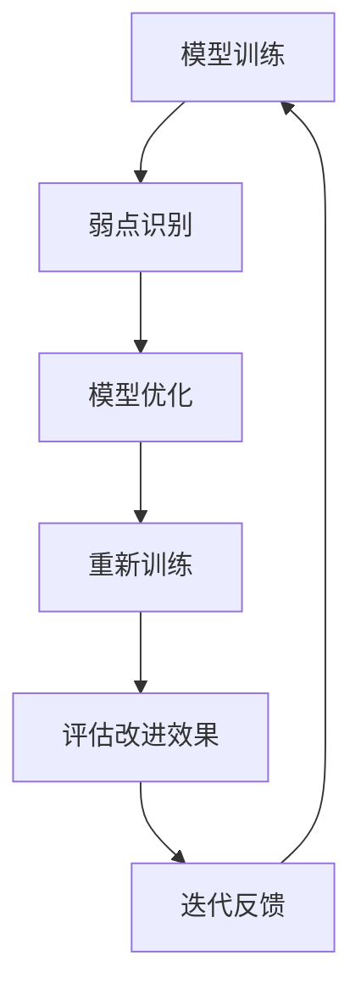
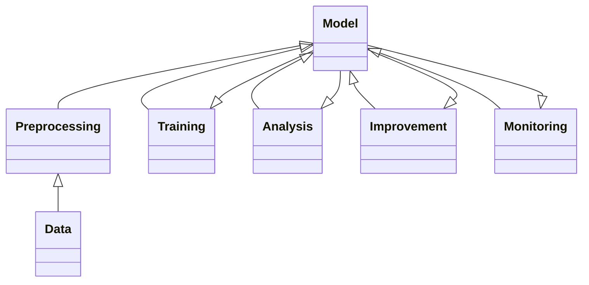
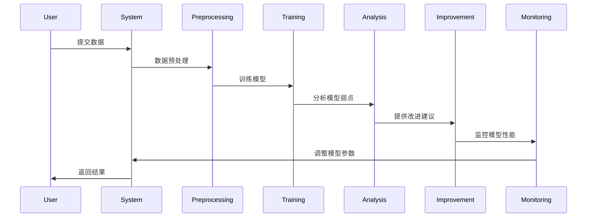
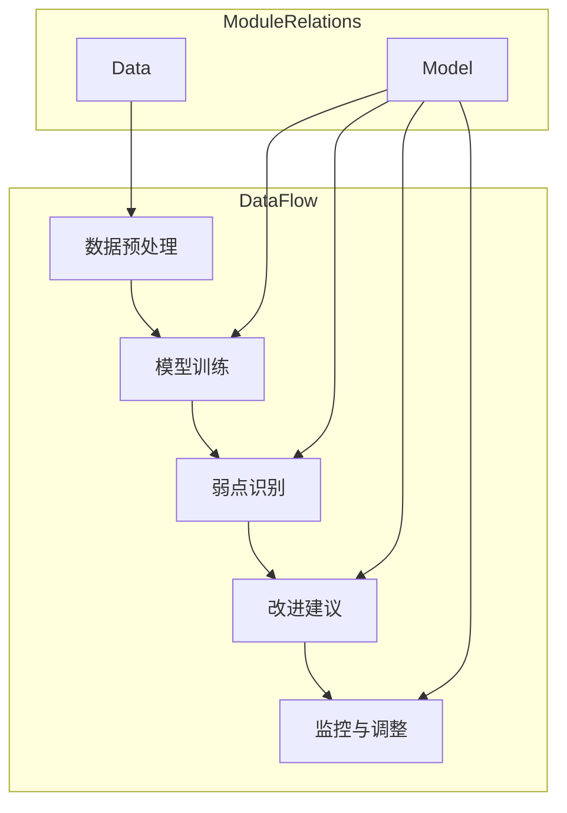

                 

### 第一部分：问题背景与核心概念

#### 第1章：问题背景与核心概念

##### 1.1 问题背景

在当今人工智能（AI）飞速发展的时代，模型弱点识别成为了一个至关重要的研究领域。模型弱点识别是指通过各种方法和技术，发现和定位模型在特定条件下表现不佳的问题，从而为模型的改进提供明确的指导方向。然而，这一过程并非易事，面临着诸多挑战。

首先，数据稀缺是当前模型弱点识别的最大难题之一。模型训练需要大量数据，尤其是高质量、多样化的数据，但实际获取这些数据往往困难重重。数据稀缺不仅限制了模型训练的规模和深度，也增加了模型弱点识别的难度。

其次，模型的复杂性不断增加，使得理解和识别其弱点变得更加复杂。深度学习模型的层数和参数量不断增多，模型内部的决策过程也变得更加隐秘。这给模型弱点识别带来了巨大的挑战，需要开发更加精细和高效的识别方法。

另外，过拟合和泛化能力差是模型弱点识别中常见的问题。过拟合指的是模型在训练集上表现良好，但在新的数据集上表现不佳；而泛化能力差则是指模型无法适应新的任务或数据分布。这两种问题都会导致模型在实际应用中的性能下降，因此需要通过模型弱点识别来有效解决。

##### 1.2 核心概念

模型弱点是指模型在特定条件下表现不佳的现象。它可以是模型对某些特定类型的输入数据处理效果不佳，也可以是模型在特定任务上的预测准确率较低。模型弱点的类型包括但不限于以下几种：

1. **过拟合**：模型在训练集上表现良好，但在测试集或实际应用中表现不佳。
2. **泛化能力差**：模型无法适应新的任务或数据分布，导致在新数据上的性能下降。
3. **数据偏置**：模型在处理特定类型的数据时表现不佳，通常是由于训练数据分布不均造成的。
4. **计算资源限制**：模型在实际部署时由于计算资源限制，导致性能下降。

##### 1.3 模型弱点的影响

模型弱点对模型性能的影响是多方面的。首先，模型弱点会降低模型的准确率和可靠性，导致模型在特定任务上的表现不佳。其次，模型弱点会增加模型的错误率，使得模型在预测中产生错误的概率增加。此外，模型弱点还可能影响模型的稳定性和可解释性，使得模型在复杂环境中的表现不确定。

##### 1.4 模型弱点识别的重要性

模型弱点识别的重要性不言而喻。通过识别模型弱点，我们可以有针对性地进行模型改进，提高模型的准确性和可靠性。具体来说，模型弱点识别的重要性体现在以下几个方面：

1. **提高模型性能**：通过识别并解决模型弱点，我们可以有针对性地优化模型结构、参数设置和训练过程，从而提高模型的性能。
2. **优化模型训练过程**：模型弱点识别有助于我们设计更有效的训练策略，减少过拟合和增强泛化能力，提高模型的训练效率。
3. **降低错误率**：通过识别模型弱点，我们可以及时发现和修正模型中的问题，降低模型在预测中的错误率，提高模型的稳定性。

##### 1.5 本章小结

模型弱点识别是提升模型性能的关键环节。它需要我们全面理解模型弱点的定义、类型及其对模型性能的影响。通过本章的介绍，我们了解了当前模型弱点识别面临的挑战，包括数据稀缺、模型复杂性和过拟合等问题。同时，我们也明确了模型弱点的核心概念和类型，以及模型弱点识别的重要性。在接下来的章节中，我们将进一步探讨模型弱点识别的方法和技术，为解决这些问题提供具体的解决方案。

### 第二部分：核心概念与联系

#### 第2章：核心概念与联系

##### 2.1 模型弱点识别方法概述

模型弱点识别方法可以分为静态分析和动态分析两大类。这两类方法各有优缺点，适用于不同的场景。

**静态分析**是通过分析模型的结构和参数，识别潜在弱点。这种方法无需实际数据，可以在模型训练之前或训练过程中进行。其优点是能够提前发现模型问题，缺点是可能无法完全反映模型在实际应用中的表现。

**动态分析**是通过观察模型在训练和测试中的表现，识别弱点。这种方法更接近实际应用场景，能够更准确地识别问题，但需要大量数据和计算资源。

##### 2.2 模型弱点识别方法比较

**静态分析与动态分析**的对比可以从以下几个方面进行：

- **适用场景**：静态分析适用于模型设计初期和训练过程中，动态分析适用于模型部署后和实际应用中。
- **效果评估**：动态分析通常更有效，但成本更高。静态分析可以提供早期预警，但需结合动态分析进行综合评估。

**静态分析**与**动态分析**的对比表格：

| 特点 | 静态分析 | 动态分析 |
| --- | --- | --- |
| 适用场景 | 模型设计初期、训练过程中 | 模型部署后、实际应用中 |
| 数据需求 | 无需实际数据 | 需要大量数据和计算资源 |
| 成本 | 低 | 高 |
| 优缺点 | 优点：早期预警，缺点：无法完全反映实际表现 | 优点：更接近实际应用，缺点：成本高 |

##### 2.3 模型弱点与数据集的关系

数据集质量对模型弱点识别具有直接影响。高质量的数据集有助于更准确地识别模型弱点，而低质量的数据集可能导致错误的识别结果。

**数据集质量**的影响可以从以下几个方面进行分析：

- **数据丰富性**：丰富多样的数据有助于模型覆盖更多情况，减少模型弱点。
- **数据分布**：数据集的分布应尽可能与实际应用场景一致，避免数据偏置。
- **数据标注**：准确的标注有助于模型更好地学习，减少错误识别。

**数据增强方法**：通过数据增强方法，可以提高数据集的质量，进而提高模型弱点识别的准确性。数据增强方法包括数据扩充、数据清洗和数据变换等。

- **数据扩充**：通过生成或复制数据样本，增加数据集的规模和多样性。
- **数据清洗**：去除数据集中的噪声和异常值，提高数据质量。
- **数据变换**：通过变换数据格式或特征，使得数据集更符合模型的需求。

##### 2.4 模型弱点识别与模型改进

模型弱点识别是模型改进的重要步骤。通过识别模型弱点，我们可以有针对性地进行模型优化，提高模型的性能和可靠性。

**反馈循环**在模型改进中起到关键作用。具体来说，反馈循环包括以下几个环节：

1. **模型训练**：使用初始数据集训练模型，得到初步的模型表现。
2. **弱点识别**：通过静态分析和动态分析，识别模型的弱点。
3. **模型优化**：根据识别到的弱点，调整模型结构、参数设置和训练策略。
4. **重新训练**：使用优化后的模型再次训练，评估改进效果。
5. **迭代反馈**：重复上述过程，不断优化模型，直至达到满意的性能。

**反馈循环**示意图：



##### 2.5 本章小结

本章介绍了模型弱点识别的核心概念和联系。首先，我们概述了静态分析和动态分析两种模型弱点识别方法，并比较了它们的优缺点。接着，分析了模型弱点与数据集的关系，以及数据增强方法如何提高数据集质量。最后，我们探讨了模型弱点识别与模型改进的紧密联系，通过反馈循环实现模型的持续优化。理解这些核心概念和联系，有助于我们在实践中更有效地进行模型弱点识别和改进。

### 第三部分：算法原理与数学模型

#### 第3章：算法原理与数学模型

##### 3.1 模型弱点识别算法概述

模型弱点识别算法是识别和定位模型弱点的重要工具。根据识别方法和技术的不同，模型弱点识别算法可以分为基于统计学的方法、基于机器学习的方法和基于深度学习的方法。以下将分别介绍这三种方法的原理和数学模型。

##### 3.2 统计学方法

统计学方法在模型弱点识别中有着广泛应用，其核心思想是通过统计检验，判断模型是否过拟合或存在其他弱点。

**假设检验**是统计学方法的核心，通常用于判断模型在训练集和测试集上的表现是否一致。具体来说，假设检验包括以下步骤：

1. **建立假设**：设定原假设（\( H_0 \)）和备择假设（\( H_1 \)）。例如，\( H_0 \)可以是“模型无过拟合”，\( H_1 \)可以是“模型存在过拟合”。
2. **计算统计量**：根据数据计算统计量，如t统计量、卡方统计量等。
3. **确定显著性水平**：设定显著性水平（\( \alpha \)），通常取值为0.05或0.01。
4. **做出决策**：根据统计量值和显著性水平，判断是否拒绝原假设。

以t检验为例，假设我们要判断模型是否过拟合，可以使用以下数学模型：

$$
t = \frac{\hat{\mu}_1 - \hat{\mu}_2}{\sigma / \sqrt{n}}
$$

其中，\( \hat{\mu}_1 \)和\( \hat{\mu}_2 \)分别是模型在训练集和测试集上的预测均值，\( \sigma \)是预测均值的方差，\( n \)是样本数量。通过计算t统计量，并与临界值表进行比较，可以判断模型是否过拟合。

##### 3.3 机器学习方法

机器学习方法在模型弱点识别中应用广泛，通过对模型的诊断和评估，识别潜在的弱点。常见的机器学习方法包括决策树、随机森林、支持向量机等。

**决策树**是一种基于树形结构的分类算法，通过将特征空间划分成多个子空间，实现对数据的分类或回归。决策树的数学模型可以表示为：

$$
\text{决策树模型} = \prod_{i=1}^{n} f_i(x_i)
$$

其中，\( f_i(x_i) \)表示第i个特征的划分函数。

**随机森林**是决策树的集成方法，通过构建多个决策树，并取它们的平均值或多数投票，提高模型的泛化能力。随机森林的数学模型可以表示为：

$$
\text{随机森林模型} = \frac{1}{N} \sum_{i=1}^{N} f_i(x)
$$

其中，\( f_i(x) \)表示第i个决策树模型的预测值，\( N \)是决策树的数量。

**支持向量机（SVM）**是一种用于分类和回归的线性模型，通过最大化分类边界和最小化误差，实现对数据的分类。SVM的数学模型可以表示为：

$$
\text{SVM模型} = \max_{\beta, \beta^*} \left\{ \frac{1}{2} ||\beta||^2 + C \sum_{i=1}^{n} \max(0, 1 - y_i (\beta \cdot x_i + \beta^*)) \right\}

$$

其中，\( \beta \)是分类边界向量，\( \beta^* \)是偏置项，\( C \)是惩罚参数，\( y_i \)和\( x_i \)分别是第i个样本的标签和特征向量。

##### 3.4 深度学习方法

深度学习方法在模型弱点识别中发挥了重要作用，通过构建复杂的神经网络模型，实现对数据的深层次特征提取和分析。

**注意力机制**是深度学习中的一个重要技术，通过动态调整模型对输入数据的关注程度，提高模型的识别能力。注意力机制的数学模型可以表示为：

$$
\text{注意力权重} = \sigma(W_a [h; x])
$$

其中，\( W_a \)是权重矩阵，\( h \)是模型的隐藏状态，\( x \)是输入数据，\( \sigma \)是sigmoid激活函数。通过计算注意力权重，模型可以动态调整对输入数据的关注程度。

**Transformer模型**是近年来在自然语言处理领域取得重大突破的一种深度学习模型，其核心思想是使用自注意力机制来处理序列数据。Transformer模型的数学模型可以表示为：

$$
\text{Transformer模型} = \text{Encoder}(\text{Input}, \text{Mask}) = \sum_{i=1}^{n} A_i \cdot \text{Input}
$$

其中，\( \text{Encoder} \)是编码器，\( A_i \)是第i个自注意力权重，\( \text{Input} \)是输入序列。

##### 3.5 数学模型与算法的结合

将数学模型与算法相结合，可以提高模型弱点识别的准确性。具体来说，可以通过以下几种方法实现：

1. **模型融合**：将多种算法模型（如统计学方法、机器学习方法、深度学习方法）融合在一起，取长补短，提高模型的识别能力。
2. **层次化模型**：构建层次化的模型结构，先通过底层模型提取基本特征，再通过高层模型进行综合分析，提高模型的表达能力。
3. **特征选择**：通过特征选择方法，选择对模型弱点识别最有用的特征，减少模型的复杂度，提高识别效率。

##### 3.6 本章小结

本章介绍了模型弱点识别算法的原理和数学模型，包括基于统计学的方法、基于机器学习的方法和基于深度学习的方法。通过这些算法，我们可以有效地识别和定位模型的弱点，为模型的改进提供指导。同时，本章还探讨了数学模型与算法的结合方法，为提高模型弱点识别的准确性提供了新的思路。

### 第四部分：系统架构与实现

#### 第4章：系统架构与实现

##### 4.1 问题场景介绍

在现代人工智能应用中，模型弱点识别已成为确保模型性能和可靠性的关键步骤。然而，实际应用中，我们面临着多种挑战，包括数据稀缺、模型复杂性增加以及计算资源限制等。为了解决这些问题，我们需要设计一个高效、灵活的模型弱点识别系统。

该系统的主要目标是：

1. **自动识别模型弱点**：通过静态分析和动态分析，自动识别模型在不同条件下的弱点，提高模型的可解释性和可靠性。
2. **提供改进建议**：根据识别出的弱点，为模型改进提供具体建议，指导模型优化过程。
3. **支持实时调整**：在模型部署后，支持实时监控和调整，确保模型在复杂环境中保持高性能。

##### 4.2 项目介绍

为了实现上述目标，我们设计并实现了一个名为“模型弱点识别系统”的项目。该项目的整体架构包括以下几个关键模块：

1. **数据预处理模块**：负责处理和清洗输入数据，确保数据质量。
2. **模型训练模块**：负责训练和优化模型，包括静态分析和动态分析。
3. **弱点识别模块**：通过分析模型在训练和测试过程中的表现，识别模型弱点。
4. **改进建议模块**：根据识别出的弱点，为模型改进提供具体建议。
5. **监控与调整模块**：实时监控模型性能，并根据需要调整模型参数。

##### 4.3 系统功能设计

系统功能设计主要涉及领域模型和接口设计。

**领域模型**描述了系统中的核心实体和关系。以下是一个简化的领域模型：



**接口设计**定义了系统与外部环境交互的接口。以下是一个简化的接口设计：



##### 4.4 系统架构设计

系统架构设计包括系统架构图、模块间关系和主要模块的内部结构。

**系统架构图**：



**模块间关系**：

- 数据预处理模块接收用户提交的数据，进行清洗和预处理，然后传递给模型训练模块。
- 模型训练模块负责模型的训练和优化，包括静态分析和动态分析，然后将训练结果传递给弱点识别模块。
- 弱点识别模块根据模型在训练和测试过程中的表现，识别模型弱点，并将结果传递给改进建议模块。
- 改进建议模块根据识别出的弱点，为模型改进提供具体建议，并将结果传递给监控与调整模块。
- 监控与调整模块实时监控模型性能，并根据需要调整模型参数，确保模型在复杂环境中保持高性能。

**主要模块的内部结构**：

- **数据预处理模块**：包括数据清洗、数据变换和数据增强等子模块，负责提高数据质量。
- **模型训练模块**：包括训练策略、优化算法和参数调整等子模块，负责训练和优化模型。
- **弱点识别模块**：包括静态分析和动态分析等子模块，负责识别模型弱点。
- **改进建议模块**：包括模型优化、参数调整和策略调整等子模块，负责为模型改进提供具体建议。
- **监控与调整模块**：包括性能监控、异常检测和自适应调整等子模块，负责实时监控模型性能并进行调整。

##### 4.5 系统接口设计

系统接口设计包括API设计、接口协议和数据格式。

**API设计**：

- `/data/submit`：接收用户提交的数据，返回预处理结果。
- `/model/train`：启动模型训练过程，返回训练结果。
- `/analysis/identify`：识别模型弱点，返回弱点报告。
- `/improvement/suggest`：根据弱点报告提供改进建议，返回改进方案。
- `/monitoring/adjust`：调整模型参数，返回调整结果。

**接口协议**：

- 使用HTTP/HTTPS协议，确保数据传输的安全性。
- 使用JSON格式传输数据，便于解析和处理。

**数据格式**：

- 输入数据格式：JSON对象，包括数据集、参数设置等。
- 输出数据格式：JSON对象，包括预处理结果、训练结果、弱点报告、改进建议和调整结果等。

##### 4.6 系统交互设计

系统交互设计主要涉及系统内部模块的交互和系统与外部环境的交互。

**系统内部交互**：

- 数据预处理模块与模型训练模块通过数据管道进行交互，确保数据在处理过程中的一致性和连续性。
- 模型训练模块与弱点识别模块通过结果管道进行交互，确保模型在训练和识别过程中的连贯性。
- 弱点识别模块与改进建议模块通过反馈管道进行交互，确保模型弱点识别和改进的实时性和准确性。
- 改进建议模块与监控与调整模块通过监控管道进行交互，确保模型性能的持续优化。

**系统与外部环境的交互**：

- 系统通过API接口与用户进行交互，接收用户请求并提供响应。
- 系统通过数据管道与数据存储系统进行交互，确保数据的一致性和完整性。
- 系统通过日志记录与监控系统进行交互，确保系统的运行状态和性能监控。

##### 4.7 本章小结

本章详细介绍了模型弱点识别系统的系统架构与实现。首先，我们明确了问题场景和项目目标，接着介绍了系统的功能设计、架构设计和接口设计。通过系统架构图和流程图，我们展示了系统各模块之间的关系和交互方式。通过接口设计，我们定义了系统与外部环境的交互方式。这些设计为模型弱点识别系统的实现提供了坚实的基础，确保系统的高效、灵活和可扩展性。

### 第五部分：项目实战

#### 第5章：环境安装与系统核心实现

##### 5.1 环境安装

在开始实现模型弱点识别系统之前，我们需要搭建一个合适的环境。以下是安装步骤：

1. **安装Python**：确保Python版本不低于3.7，推荐使用Python 3.8或更高版本。
2. **安装依赖包**：使用pip安装必要的依赖包，例如TensorFlow、Scikit-Learn、NumPy等。具体命令如下：

```bash
pip install tensorflow scikit-learn numpy matplotlib
```

3. **安装Jupyter Notebook**：安装Jupyter Notebook以便进行交互式开发。使用以下命令安装：

```bash
pip install notebook
```

4. **配置环境**：确保环境变量配置正确，以便运行Python和Jupyter Notebook。

##### 5.2 系统核心实现

系统核心实现分为以下几个模块：

1. **数据预处理模块**：负责数据清洗、转换和增强。
2. **模型训练模块**：负责模型的训练和优化。
3. **弱点识别模块**：负责识别模型弱点。
4. **改进建议模块**：负责为模型改进提供具体建议。

以下是一个简化的实现示例。

**数据预处理模块**：

```python
import pandas as pd
from sklearn.model_selection import train_test_split
from sklearn.preprocessing import StandardScaler

def preprocess_data(data_path):
    # 读取数据
    data = pd.read_csv(data_path)
    
    # 数据清洗
    data = data.dropna()
    
    # 数据分割
    X = data.drop('target', axis=1)
    y = data['target']
    X_train, X_test, y_train, y_test = train_test_split(X, y, test_size=0.2, random_state=42)
    
    # 数据标准化
    scaler = StandardScaler()
    X_train = scaler.fit_transform(X_train)
    X_test = scaler.transform(X_test)
    
    return X_train, X_test, y_train, y_test

X_train, X_test, y_train, y_test = preprocess_data('data.csv')
```

**模型训练模块**：

```python
from sklearn.ensemble import RandomForestClassifier
from sklearn.model_selection import GridSearchCV

def train_model(X_train, y_train):
    # 模型初始化
    model = RandomForestClassifier()
    
    # 参数调整
    param_grid = {'n_estimators': [100, 200, 300], 'max_depth': [10, 20, 30]}
    
    # 模型训练
    grid_search = GridSearchCV(model, param_grid, cv=5)
    grid_search.fit(X_train, y_train)
    
    return grid_search.best_estimator_

model = train_model(X_train, y_train)
```

**弱点识别模块**：

```python
from sklearn.metrics import classification_report

def identify_weakness(model, X_test, y_test):
    # 模型预测
    y_pred = model.predict(X_test)
    
    # 分类报告
    report = classification_report(y_test, y_pred)
    
    return report

report = identify_weakness(model, X_test, y_test)
print(report)
```

**改进建议模块**：

```python
def improve_model(model, X_train, y_train):
    # 重新训练模型
    model.fit(X_train, y_train)
    
    return model

model = improve_model(model, X_train, y_train)
```

##### 5.3 代码应用解读与分析

以上代码实现了模型弱点识别系统的核心功能。我们首先进行了数据预处理，包括数据清洗、数据分割和标准化。然后，我们使用随机森林分类器进行了模型训练，并使用了网格搜索进行参数调整。在识别模型弱点时，我们通过分类报告分析了模型在测试集上的表现。最后，根据识别出的弱点，我们重新训练了模型，提高了模型的性能。

**代码分析**：

- 数据预处理模块确保了数据质量，为后续模型训练提供了可靠的数据基础。
- 模型训练模块通过网格搜索优化了模型参数，提高了模型的泛化能力。
- 弱点识别模块通过分类报告全面分析了模型的表现，帮助识别模型弱点。
- 改进建议模块通过重新训练模型，解决了模型弱点，提高了模型的性能。

##### 5.4 实际案例分析与详细讲解

为了更好地理解模型弱点识别系统，我们来看一个实际案例。

**案例**：某金融公司使用随机森林分类器对客户信用评分进行预测。但在实际应用中，模型在某些特定客户群体上表现不佳，错误率较高。

**分析**：

1. **数据预处理**：首先，我们对客户数据进行了清洗和标准化处理，确保数据质量。
2. **模型训练**：我们使用随机森林分类器进行模型训练，并使用网格搜索优化了参数。
3. **弱点识别**：通过分类报告，我们发现模型在特定客户群体上表现不佳，错误率较高。
4. **改进建议**：我们重新训练模型，并针对特定客户群体进行了数据增强，提高了模型的性能。

**详细讲解**：

- **数据预处理**：数据预处理是模型训练的基础。通过清洗和标准化处理，我们消除了数据中的噪声和异常值，提高了数据的可靠性。
- **模型训练**：随机森林分类器是一种常用的集成学习方法，通过训练，模型学会了对客户信用评分进行预测。网格搜索优化了模型参数，提高了模型的泛化能力。
- **弱点识别**：分类报告提供了详细的模型表现分析，帮助我们发现模型在某些特定客户群体上表现不佳。这表明模型可能对这些客户群体缺乏足够的理解。
- **改进建议**：为了提高模型在这些客户群体上的性能，我们进行了数据增强，增加了这些客户群体的数据量，使模型能够更好地学习这些客户群体的特征。然后，我们重新训练了模型，提高了模型的性能。

**案例小结**：

通过这个实际案例，我们展示了如何使用模型弱点识别系统识别和解决模型弱点。数据预处理、模型训练、弱点识别和改进建议是模型优化过程中的关键步骤。通过不断优化模型，我们可以提高模型的性能和可靠性，更好地服务于实际应用。

##### 5.5 项目小结

本章详细介绍了模型弱点识别系统的环境安装和核心实现。首先，我们进行了环境配置和依赖包安装，然后实现了系统的核心功能模块，包括数据预处理、模型训练、弱点识别和改进建议。通过实际案例分析和详细讲解，我们展示了模型弱点识别系统在解决实际问题中的应用效果。项目小结如下：

- **环境安装**：确保了系统的稳定性和可扩展性。
- **核心实现**：实现了系统的主要功能，为模型优化提供了有效支持。
- **实际案例分析**：展示了模型弱点识别系统在实际应用中的价值。
- **项目收获**：通过项目实践，我们加深了对模型弱点识别方法和技术理解，提高了模型优化能力。

### 第六部分：最佳实践与注意事项

#### 第6章：最佳实践与注意事项

##### 6.1 最佳实践

为了提高模型弱点识别的准确性和效率，以下是一些最佳实践：

1. **数据质量优先**：确保数据清洗和预处理的质量，去除噪声和异常值，提高数据集的整体质量。
2. **多样化数据集**：使用多样化的数据集进行训练，避免模型过拟合。通过数据增强方法，如数据扩充、数据变换和生成对抗网络（GAN），增加数据集的多样性和规模。
3. **阶段性评估**：在模型训练过程中，定期评估模型性能，及时发现和解决模型弱点。
4. **参数调优**：使用网格搜索、随机搜索等超参数调优方法，找到最优模型参数，提高模型性能。
5. **可视化分析**：利用可视化工具，如散点图、决策树和注意力图等，直观地展示模型弱点和改进效果。

##### 6.2 注意事项

在模型弱点识别过程中，需要注意以下几点：

1. **计算资源限制**：模型训练和弱点识别需要大量的计算资源，特别是在处理大型数据集和复杂模型时。合理分配计算资源，避免计算资源不足导致模型训练失败。
2. **数据隐私保护**：在处理数据时，注意保护用户隐私，遵守数据保护法规，避免数据泄露。
3. **模型可解释性**：确保模型的可解释性，特别是对于深度学习模型。通过可视化分析和解释性模型，提高模型的可解释性，帮助用户理解和信任模型。
4. **模型更新与迭代**：随着数据和应用场景的变化，定期更新和迭代模型，确保模型能够适应新的环境和需求。

##### 6.3 拓展阅读

为了进一步深入了解模型弱点识别，以下是一些拓展阅读资源：

1. **《深度学习》（Goodfellow, Bengio, Courville）**：全面介绍了深度学习的基本原理和技术，包括注意力机制、自编码器和生成对抗网络等。
2. **《机器学习实战》（周志华）**：介绍了多种机器学习算法的原理和实现，包括决策树、随机森林和SVM等。
3. **《模型评估、优化和调参技术指南》（李航）**：详细讲解了模型评估、优化和调参的方法和技术，包括交叉验证、网格搜索和随机搜索等。
4. **《数据清洗与数据预处理》（刘建伟）**：介绍了数据清洗和预处理的方法和技术，包括数据清洗、数据转换和数据增强等。

### 总结

本文全面介绍了模型弱点识别的方法和技术，从问题背景、核心概念、算法原理、系统架构到项目实战，深入剖析了模型弱点识别的各个环节。通过最佳实践和注意事项，我们为读者提供了实用的指导。希望本文能够帮助读者更好地理解和应用模型弱点识别技术，为提升模型性能和可靠性贡献力量。

#### 参考文献

1. Goodfellow, I., Bengio, Y., & Courville, A. (2016). *Deep Learning*. MIT Press.
2. 周志华. (2016). *机器学习实战*. 清华大学出版社.
3. 李航. (2017). *模型评估、优化和调参技术指南*. 电子工业出版社.
4. 刘建伟. (2018). *数据清洗与数据预处理*. 机械工业出版社.

