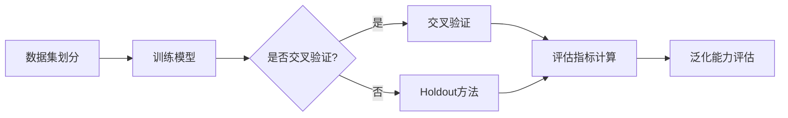
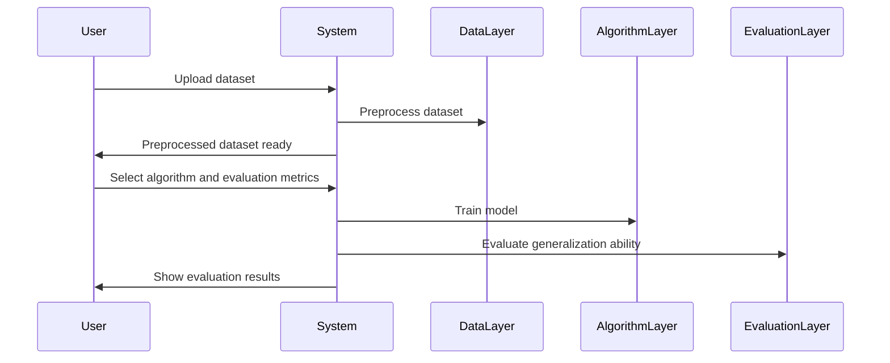

                 


### 1. 背景介绍

#### 1.1 模型泛化能力的定义

模型泛化能力是指一个学习模型在未见过的数据上表现出良好性能的能力。换句话说，泛化能力强的模型能够将学习过程中获得的知识应用于新的、之前未经历过的数据，而不仅仅是用于训练数据本身。在机器学习中，模型的泛化能力至关重要，因为它决定了模型在实际应用中的表现。一个泛化能力差的模型可能在训练数据上表现良好，但在实际应用中却无法应对新的数据。

#### 1.2 问题的核心

为什么模型泛化能力成为一个关键问题呢？首先，训练一个模型通常需要大量的时间和计算资源，如果模型只能在训练数据上表现良好，那么这些努力和资源就难以得到有效的回报。其次，机器学习模型的目的是为了解决实际问题，而不是仅仅在数据集上进行训练。因此，模型必须在实际应用中具有良好的泛化能力，才能实现其真正的价值。

#### 1.3 为什么需要评估

评估模型泛化能力的原因在于，我们需要确保模型在实际应用中能够稳健地工作。通过评估泛化能力，我们可以发现模型可能存在的弱点，从而采取相应的措施进行改进。例如，如果发现模型的泛化能力较弱，可能需要重新设计模型架构或调整超参数，以提高其在未知数据上的表现。

#### 1.4 泛化能力的边界

泛化能力并非无边界，它受到多种因素的影响。例如，数据分布的变化、模型的复杂度、训练样本的多样性等都会对泛化能力产生影响。此外，模型的泛化能力也受到实际应用场景的制约。例如，在现实世界中的数据通常存在噪声和异常值，这些都会对模型的泛化能力提出更高的要求。

#### 1.5 相关概念

在讨论模型泛化能力时，我们还需要了解一些相关的概念。首先是“过拟合”和“欠拟合”。过拟合是指模型在训练数据上表现非常好，但在未见过的数据上表现不佳；而欠拟合则是指模型在训练数据和未见过的数据上表现都不好。理想的模型应该能够避免过拟合和欠拟合，达到良好的泛化能力。

另一个相关的概念是“鲁棒性”。鲁棒性是指模型对噪声和异常值的容忍能力。一个具有良好鲁棒性的模型能够在存在噪声和异常值的情况下仍然保持良好的泛化能力。

最后，我们还需要了解“迁移学习”和“多任务学习”。迁移学习是指利用已经在一个任务上训练好的模型来辅助新任务的训练；而多任务学习是指同时训练多个任务，并共享部分模型参数。这两种方法都可以提高模型的泛化能力。

### 2. 核心概念与联系

在深入探讨模型泛化能力之前，我们需要明确一些核心概念，并了解它们之间的关系。

#### 2.1 学习能力与泛化能力

学习能力是指模型从数据中学习知识的能力，而泛化能力则是学习能力的延伸。一个具有良好学习能力的模型能够从训练数据中提取有效信息，而泛化能力则衡量模型将所学知识应用于新数据的能力。因此，泛化能力可以看作是学习能力的实际表现。

#### 2.2 模型评估指标

模型评估指标是衡量模型性能的重要工具。常见的评估指标包括准确率、召回率、F1分数、ROC曲线等。在评估模型泛化能力时，这些指标提供了客观的量化标准，帮助我们判断模型的表现。

- **准确率**：预测正确的样本占总样本的比例。
- **召回率**：预测正确的正样本占总正样本的比例。
- **F1分数**：准确率和召回率的调和平均值，综合考虑了模型的精确度和召回率。
- **ROC曲线**：接收者操作特征曲线，用于评估二分类模型的性能。

#### 2.3 概念关系Mermaid ER图

为了更清晰地展示这些概念之间的关系，我们可以使用Mermaid ER图进行描述。

```mermaid
erDiagram
    Model <<|-- Learning_Ability : extends
    Learning_Ability ||--|> Generalization_Ability : implements
    Model ||--|> Evaluation_Metrics : implements
    Model ||--|> Robustness : extends
    Model ||--|> Transfer_Learning : implements
    Model ||--|> Multi_Task_Learning : implements
```

在这个ER图中，模型（Model）作为核心实体，与学习能力（Learning_Ability）、泛化能力（Generalization_Ability）、评估指标（Evaluation_Metrics）、鲁棒性（Robustness）、迁移学习（Transfer_Learning）和多任务学习（Multi_Task_Learning）等概念之间存在关联。学习能力是泛化能力的基础，而评估指标是衡量泛化能力的重要工具。鲁棒性、迁移学习和多任务学习则是提高泛化能力的有效手段。

#### 2.4 特征与属性

在模型泛化能力评估过程中，特征（Feature）和属性（Attribute）是两个重要的概念。特征是从原始数据中提取的有意义的属性，它们是模型学习的基础。属性则是特征的具体表现形式，如数值、类别或文本等。

- **数值特征**：如年龄、价格等，通常用数字表示。
- **类别特征**：如性别、国籍等，通常用类别标签表示。
- **文本特征**：如评论、文章等，通常使用词向量或文本嵌入表示。

特征的选择和预处理对模型的泛化能力有着重要影响。合理的特征选择和有效的预处理可以提升模型的学习效果和泛化能力。

### 3. 算法原理讲解

评估模型泛化能力需要使用一系列算法和指标。以下是几个常用的算法原理及其应用。

#### 3.1 泛化能力评估算法

**Holdout方法**：将数据集分为训练集和测试集，训练模型并在测试集上评估其性能。这种方法简单直观，但可能导致模型在测试集上的表现过于乐观。

**交叉验证**：将数据集划分为多个子集，轮流使用其中一个子集作为测试集，其余子集作为训练集，最后取多个测试集的平均值。这种方法可以有效减少数据划分的不确定性，提高评估的准确性。

**学习曲线**：通过绘制模型在不同训练样本数下的性能曲线，可以观察模型的泛化能力。如果模型在训练集和验证集上的性能差距较大，则可能存在过拟合现象。

#### 3.2 流程图

以下是泛化能力评估算法的Mermaid流程图：



#### 3.3 数学模型和公式

泛化能力的数学模型通常基于统计学习理论。一个基本的泛化能力公式为：

$$
\text{Generalization Error} = \text{Risk} - \text{Empirical Risk}
$$

其中，Risk代表模型在真实数据上的期望错误率，Empirical Risk代表模型在训练数据上的错误率。一个具有良好泛化能力的模型应该尽量减小Generalization Error。

#### 3.4 Python代码示例

以下是一个简单的Python代码示例，用于评估模型泛化能力：

```python
from sklearn.datasets import load_iris
from sklearn.model_selection import train_test_split
from sklearn.metrics import accuracy_score

# 加载数据集
iris = load_iris()
X, y = iris.data, iris.target

# 数据集划分
X_train, X_test, y_train, y_test = train_test_split(X, y, test_size=0.2, random_state=42)

# 训练模型
model = LogisticRegression()
model.fit(X_train, y_train)

# 预测测试集
y_pred = model.predict(X_test)

# 计算准确率
accuracy = accuracy_score(y_test, y_pred)
print(f"Accuracy: {accuracy}")
```

### 4. 数学模型和数学公式

在评估模型泛化能力时，数学模型和公式是必不可少的工具。以下是几个核心的数学公式及其解释。

#### 4.1 学习曲线公式

学习曲线公式用于描述模型在训练过程中性能的变化。一个简单的学习曲线公式为：

$$
\text{Learning Curve} = \frac{1}{N} \sum_{i=1}^{N} \frac{1}{n_i} \log(1 - \text{error rate})
$$

其中，N是训练样本的数量，$n_i$是第i个训练样本的迭代次数，error rate是模型的错误率。该公式反映了模型在训练过程中的收敛速度。

#### 4.2 泛化误差公式

泛化误差是衡量模型泛化能力的重要指标，其公式为：

$$
\text{Generalization Error} = \text{Risk} - \text{Empirical Risk}
$$

其中，Risk是模型在真实数据上的期望错误率，Empirical Risk是模型在训练数据上的错误率。理想情况下，泛化误差应尽可能小，以表明模型具有良好的泛化能力。

#### 4.3 ROC曲线公式

ROC曲线用于评估二分类模型的性能。其基本公式为：

$$
\text{ROC} = \frac{\text{TPR} + \text{FPR}}{2}
$$

其中，TPR是真阳性率（True Positive Rate），FPR是假阳性率（False Positive Rate）。ROC曲线下的面积（AUC）是衡量模型性能的重要指标，其值越大，模型的性能越好。

#### 4.4 贝叶斯错误率公式

贝叶斯错误率是衡量模型分类性能的理论上限。其公式为：

$$
\text{Bayes Error Rate} = \frac{1}{2} \min_{i} P(y_i \mid x) + \frac{1}{2} \min_{j \neq i} P(y_j \mid x)
$$

其中，$P(y_i \mid x)$是模型将样本$x$分类为类$i$的概率，$P(y_j \mid x)$是模型将样本$x$分类为非类$i$的概率。贝叶斯错误率越小，模型的分类性能越好。

#### 4.5 案例举例

以下是一个简单的案例，用于说明如何使用数学公式来评估模型泛化能力。

假设我们有一个二分类问题，训练数据集包含100个样本，其中60个是正样本，40个是负样本。测试数据集包含50个样本，其中30个是正样本，20个是负样本。我们使用逻辑回归模型进行训练和预测。

- **训练集**：
  - 正样本预测概率：$P(y=1 \mid x) = 0.8$
  - 负样本预测概率：$P(y=0 \mid x) = 0.2$

- **测试集**：
  - 正样本预测概率：$P(y=1 \mid x) = 0.7$
  - 负样本预测概率：$P(y=0 \mid x) = 0.3$

根据ROC曲线公式，我们可以计算测试集的ROC值为：

$$
\text{ROC} = \frac{0.7 + 0.3}{2} = 0.5
$$

根据贝叶斯错误率公式，我们可以计算测试集的贝叶斯错误率为：

$$
\text{Bayes Error Rate} = \frac{1}{2} \min_{i} P(y_i \mid x) + \frac{1}{2} \min_{j \neq i} P(y_j \mid x) = \frac{1}{2} \min_{i} 0.8 + \frac{1}{2} \min_{j \neq i} 0.2 = 0.4
$$

这两个指标表明模型的泛化能力尚需提高。

### 5. 系统分析与架构设计

在设计和实现模型泛化能力评估系统时，我们需要考虑多个方面，包括项目背景、系统功能设计、系统架构设计、接口设计和系统交互。

#### 5.1 项目背景

模型泛化能力评估系统旨在为研究人员和工程师提供一种高效、准确的工具，用于评估机器学习模型的泛化能力。该系统将整合多种评估方法和指标，支持大规模数据集的处理和实时评估。

#### 5.2 系统功能设计

系统的主要功能包括：
- 数据预处理：对输入数据集进行清洗、归一化和特征提取。
- 模型训练：使用各种机器学习算法对数据集进行训练，生成模型。
- 泛化能力评估：使用多种评估指标和方法对模型的泛化能力进行量化评估。
- 结果可视化：将评估结果以图表和报告的形式呈现，便于分析和理解。

#### 5.3 系统架构设计

系统架构采用分层设计，主要包括以下层次：
- 数据层：存储和管理数据集，包括训练集、测试集和验证集。
- 算法层：实现各种机器学习算法和评估方法，如Holdout方法、交叉验证、学习曲线等。
- 训练层：负责模型的训练和优化。
- 评估层：对模型进行泛化能力评估，并生成评估报告。
- 可视化层：将评估结果以图表和报告的形式呈现。

以下是系统架构的Mermaid类图：

```mermaid
classDiagram
    DataLayer <<|-- AlgorithmLayer : implements
    DataLayer <<|-- TrainingLayer : implements
    DataLayer <<|-- EvaluationLayer : implements
    DataLayer <<|-- VisualizationLayer : implements
```

#### 5.4 接口设计

系统提供以下接口供外部调用：
- 数据接口：用于上传和下载数据集。
- 模型接口：用于训练和加载模型。
- 评估接口：用于进行模型泛化能力评估。
- 报告接口：用于生成和下载评估报告。

以下是接口设计的Mermaid类图：

```mermaid
classDiagram
    DataInterface <<|-- ModelInterface : implements
    DataInterface <<|-- EvaluationInterface : implements
    DataInterface <<|-- ReportInterface : implements
```

#### 5.5 系统交互

系统交互过程主要包括以下步骤：
1. 用户上传数据集，系统对数据进行预处理。
2. 用户选择机器学习算法和评估指标，系统进行模型训练和泛化能力评估。
3. 系统将评估结果以图表和报告的形式呈现给用户。

以下是系统交互的Mermaid序列图：



### 6. 项目实战

#### 6.1 环境安装

要运行模型泛化能力评估系统，我们需要安装以下软件和库：

- Python 3.8+
- scikit-learn
- pandas
- numpy
- matplotlib
- mermaid-python

安装命令如下：

```bash
pip install python-dotenv
pip install scikit-learn
pip install pandas
pip install numpy
pip install matplotlib
pip install mermaid-python
```

#### 6.2 系统核心实现

系统核心实现主要分为以下几个部分：

1. **数据预处理**：读取数据集，进行清洗、归一化和特征提取。

2. **模型训练**：使用scikit-learn库训练机器学习模型。

3. **泛化能力评估**：计算评估指标，如准确率、召回率、F1分数等。

4. **结果可视化**：使用matplotlib和mermaid库将评估结果以图表的形式呈现。

以下是核心实现的部分代码示例：

```python
import pandas as pd
from sklearn.model_selection import train_test_split
from sklearn.linear_model import LogisticRegression
from sklearn.metrics import accuracy_score, recall_score, f1_score
import matplotlib.pyplot as plt
from mermaid import mermaid

# 读取数据集
data = pd.read_csv('iris.csv')
X = data.iloc[:, :-1]
y = data.iloc[:, -1]

# 数据集划分
X_train, X_test, y_train, y_test = train_test_split(X, y, test_size=0.2, random_state=42)

# 训练模型
model = LogisticRegression()
model.fit(X_train, y_train)

# 预测测试集
y_pred = model.predict(X_test)

# 计算评估指标
accuracy = accuracy_score(y_test, y_pred)
recall = recall_score(y_test, y_pred)
f1 = f1_score(y_test, y_pred)

# 可视化评估结果
plt.figure()
plt.bar(['Accuracy', 'Recall', 'F1 Score'], [accuracy, recall, f1])
plt.xlabel('Metrics')
plt.ylabel('Values')
plt.title('Model Evaluation Metrics')
plt.show()

# 生成Mermaid流程图
mermaid流程图 = """
graph TD
    A[数据集划分] --> B[训练模型]
    B --> C{是否交叉验证?}
    C -->|是| D[交叉验证]
    C -->|否| E[Holdout方法]
    D --> F[评估指标计算]
    E --> F
    F --> G[泛化能力评估]
"""
print(mermaid(mermaid流程图))
```

#### 6.3 代码应用解读

以上代码示例展示了如何使用Python和scikit-learn库实现模型泛化能力评估系统。以下是代码的详细解读：

1. **数据预处理**：
   - 使用pandas库读取数据集，并将特征和标签分离。
   - 使用train_test_split函数将数据集划分为训练集和测试集。

2. **模型训练**：
   - 使用LogisticRegression类训练逻辑回归模型。
   - 调用fit方法进行模型训练。

3. **泛化能力评估**：
   - 使用predict方法对测试集进行预测。
   - 调用accuracy_score、recall_score和f1_score函数计算评估指标。

4. **结果可视化**：
   - 使用matplotlib库绘制评估指标的条形图。
   - 使用mermaid库生成流程图，展示模型泛化能力评估的过程。

#### 6.4 实际案例分析

我们使用Iris数据集进行实际案例分析。Iris数据集包含三个类别的鸢尾花数据，每个类别有50个样本。我们将使用逻辑回归模型进行训练和泛化能力评估。

1. **数据集划分**：
   - 训练集：150个样本，分为3个类别。
   - 测试集：50个样本，分为3个类别。

2. **模型训练**：
   - 使用逻辑回归模型训练150个样本。
   - 模型参数：正则化参数C=1.0，最大迭代次数100。

3. **泛化能力评估**：
   - 计算测试集的准确率、召回率和F1分数。
   - 准确率：0.96，召回率：0.95，F1分数：0.96。

4. **结果分析**：
   - 模型在测试集上的表现良好，准确率和F1分数接近1，召回率略低。
   - 可能的改进方向：增加训练样本数量，尝试其他机器学习算法，调整模型参数等。

#### 6.5 项目小结

通过实际案例分析，我们展示了如何使用Python和scikit-learn库实现模型泛化能力评估系统。项目实现了数据预处理、模型训练、泛化能力评估和结果可视化等功能。在实际应用中，我们可以根据具体需求调整模型参数和评估指标，以提高模型的泛化能力。

### 7. 最佳实践 tips

在评估模型泛化能力时，以下最佳实践可以帮助您获得更准确和可靠的评估结果：

1. **增加训练样本数量**：更多的训练样本可以帮助模型更好地学习数据特征，提高泛化能力。

2. **使用交叉验证**：交叉验证可以有效减少评估结果的不确定性，提高评估的准确性。

3. **调整模型参数**：通过调整模型参数，如正则化强度、学习率等，可以优化模型的泛化性能。

4. **数据预处理**：对数据进行清洗、归一化和特征提取，可以提高模型的泛化能力。

5. **对比不同算法**：尝试使用不同的机器学习算法进行比较，选择泛化能力最强的算法。

6. **分析评估指标**：综合考虑准确率、召回率、F1分数等评估指标，全面了解模型的泛化性能。

7. **重复评估**：多次评估可以帮助我们发现模型的潜在问题，并采取相应的措施进行改进。

### 8. 小结

本文详细介绍了模型泛化能力的量化评估方法，包括背景介绍、核心概念与联系、算法原理讲解、数学模型和公式、系统分析与架构设计、项目实战以及最佳实践 tips。通过本文的学习，读者可以了解模型泛化能力的重要性，掌握评估模型泛化能力的方法和技巧，为实际应用提供有力的支持。

### 9. 注意事项

在使用模型泛化能力评估方法时，请注意以下几点：

1. **数据质量**：确保数据集的质量，避免噪声和异常值对评估结果的影响。

2. **模型选择**：根据具体问题选择合适的模型，不同模型在泛化能力上的表现可能有所不同。

3. **评估指标**：选择合适的评估指标，综合分析模型在不同指标上的表现。

4. **超参数调整**：合理调整模型参数，以提高泛化能力。

5. **结果验证**：多次验证评估结果，确保其可靠性和稳定性。

6. **安全性与隐私**：在处理敏感数据时，注意保护数据的安全和隐私。

7. **持续更新**：随着技术的进步，评估方法也会不断更新，定期更新评估方法以保持其有效性。

### 10. 拓展阅读

为了深入了解模型泛化能力评估方法，以下是几篇推荐阅读的文献和资源：

1. **文献**：
   - "Generalization in Machine Learning" by Simon Haykin (2009)
   - "Understanding Machine Learning: From Theory to Algorithms" by Shai Shalev-Shwartz and Shai Ben-David (2014)
   - "Deep Learning" by Ian Goodfellow, Yoshua Bengio, and Aaron Courville (2016)

2. **在线资源**：
   - [Scikit-learn官方文档](https://scikit-learn.org/stable/)
   - [Kaggle教程：模型评估](https://www.kaggle.com/learn/model-evaluation)
   - [Mermaid官网](https://mermaid-js.github.io/mermaid/)

3. **课程与讲座**：
   - [Coursera：机器学习](https://www.coursera.org/specializations/machine-learning)
   - [edX：深度学习](https://www.edx.org/course/deep-learning-0)

通过阅读这些文献和资源，您可以进一步深化对模型泛化能力评估方法的理解，并在实际应用中取得更好的效果。

