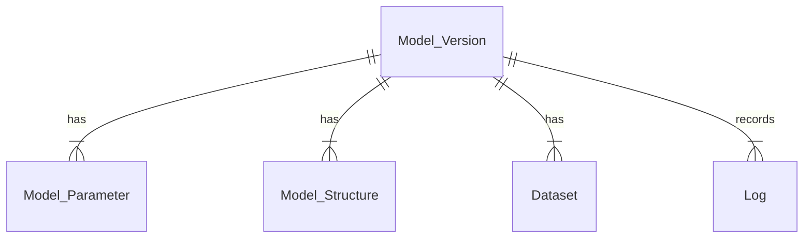

                 

### 模型版本控制：支持LLM应用的迭代优化

关键词：模型版本控制、大型语言模型、迭代优化、版本管理、算法改进

摘要：本文深入探讨了模型版本控制的概念、背景、策略、工具和实际应用，特别关注了大型语言模型（LLM）在迭代优化中的应用。文章通过详细的分析和实例讲解，旨在为读者提供全面的技术指导，帮助他们在LLM应用中实现高效的模型版本控制和迭代优化。

----------------------------------------------------------------

## 目录大纲设计步骤

为了确保文章内容逻辑清晰、结构紧凑且易于理解，我们首先需要设计一个合理的目录大纲。以下是一步一步的设计步骤：

### 第一步：明确核心内容

首先，我们需要确定文章的核心内容。从题目《模型版本控制：支持LLM应用的迭代优化》来看，核心内容应包括：

- 模型版本控制的基本概念和重要性
- 大型语言模型（LLM）的概述及其发展
- 模型版本控制的策略和工具
- 迭代优化的方法及其在LLM中的应用
- 实际应用中的挑战和解决方案
- 迭代优化案例分析

### 第二步：结构化核心内容

根据核心内容，我们将文章分为以下几个主要部分：

1. **模型版本控制基础**
   - 模型版本控制概述
   - LLM基础原理
   - 模型版本控制策略
   - 模型版本控制工具

2. **模型迭代优化方法**
   - 迭代优化目标
   - 迭代优化策略
   - 迭代优化算法

3. **应用实践**
   - 迭代优化案例分析
   - 应用挑战与解决方案

4. **总结与展望**
   - 最佳实践
   - 小结
   - 注意事项
   - 拓展阅读

### 第三步：细化每个章节的内容

在每个主要部分中，进一步细化内容，确定具体的子标题。例如，在“模型版本控制基础”部分，可以包括以下内容：

- **模型版本控制概述**
  - 模型版本控制的背景
  - 模型版本控制的需求
  - 模型版本控制的基本概念

- **LLM基础原理**
  - 语言模型概述
  - LLM的工作机制
  - LLM的关键技术

- **模型版本控制策略**
  - 版本控制的基本策略
  - 模型更新策略
  - 模型合并策略

### 第四步：保持简洁性

在细化内容的同时，确保文本简洁明了，避免冗余。每个章节和子标题都应该清晰表达核心内容，便于读者快速理解。

### 第五步：符合格式要求

使用Markdown格式输出文章内容，确保章节、子章节的层级结构和符号符合要求。例如，使用“##”表示章节标题，“###”表示子章节标题，等等。

### 第六步：确保内容的完整性

最后，检查目录大纲，确保包含所有必要的章节和子章节，每个部分的内容都足够详细，满足完整性要求。

### 第七步：编写具体内容

按照设计好的目录大纲，逐一撰写每个章节的具体内容，确保每部分内容都符合要求。

通过上述步骤，我们设计出了一个符合要求的《模型版本控制：支持LLM应用的迭代优化》的目录大纲，为撰写高质量文章奠定了基础。

---

在完成目录大纲设计后，下一步是深入撰写各个章节的内容。每个章节的内容都应该包括背景介绍、核心概念与联系、算法原理讲解、系统分析与架构设计方案、项目实战和总结等部分。以下是一个详细的撰写流程：

### 背景介绍

每个章节开始时，先进行背景介绍。这部分内容应简要说明核心概念术语、问题背景、问题描述、问题解决、边界与外延，以及概念结构与核心要素组成。

- **模型版本控制概述**
  - 术语解释：模型版本控制、版本管理、版本迭代
  - 背景介绍：随着人工智能技术的发展，模型的复杂性和规模不断增大，版本控制成为关键需求。
  - 问题阐述：模型的迭代更新如何进行，如何确保模型的稳定性和一致性。
  - 解决方案：介绍模型版本控制的基本概念和重要性。

- **LLM基础原理**
  - 术语解释：大型语言模型（LLM）、自然语言处理（NLP）、深度学习
  - 背景介绍：LLM在自然语言处理中的应用，如文本生成、问答系统等。
  - 问题阐述：LLM的工作原理和关键技术。
  - 解决方案：介绍LLM的基本原理和关键技术。

### 核心概念与联系

在背景介绍之后，我们需要详细阐述核心概念和联系。这部分内容应包括核心概念原理、概念属性特征对比表格和ER实体关系图架构。

- **模型版本控制策略**
  - 核心概念原理：版本控制策略、模型更新策略、模型合并策略
  - 概念属性特征对比表格：对比不同版本控制策略的优缺点
  - ER实体关系图架构：展示模型版本控制的实体关系

- **模型迭代优化方法**
  - 核心概念原理：迭代优化目标、迭代优化策略、迭代优化算法
  - 概念属性特征对比表格：对比不同迭代优化方法的优缺点
  - ER实体关系图架构：展示模型迭代优化的实体关系

### 算法原理讲解

算法原理讲解是每个章节的核心部分。这部分内容应包括算法mermaid流程图、Python源代码、算法原理的数学模型和公式，以及详细讲解和举例说明。

- **模型版本控制工具**
  - 算法mermaid流程图：展示模型版本控制的主要流程
  - Python源代码：实现模型版本控制的核心算法
  - 数学模型和公式：解释模型版本控制中的数学原理
  - 举例说明：通过实例详细解释模型版本控制的应用

- **模型迭代优化算法**
  - 算法mermaid流程图：展示模型迭代优化的主要流程
  - Python源代码：实现模型迭代优化的核心算法
  - 数学模型和公式：解释模型迭代优化中的数学原理
  - 举例说明：通过实例详细解释模型迭代优化的应用

### 系统分析与架构设计方案

系统分析与架构设计方案部分应包括问题场景介绍、项目介绍、系统功能设计、系统架构设计、系统接口设计和系统交互mermaid序列图。

- **应用实践**
  - 问题场景介绍：介绍模型版本控制和迭代优化在实际项目中的应用场景
  - 项目介绍：简要介绍项目背景、目标和实现方法
  - 系统功能设计：使用mermaid类图展示领域模型
  - 系统架构设计：使用mermaid架构图展示系统架构
  - 系统接口设计：详细描述系统接口和交互流程
  - 系统交互mermaid序列图：展示系统交互的详细过程

### 项目实战

项目实战部分应包括环境安装、系统核心实现源代码、代码应用解读与分析、实际案例分析和详细讲解剖析，以及项目小结。

- **迭代优化案例分析**
  - 环境安装：介绍所需的环境和工具安装过程
  - 系统核心实现源代码：展示实现模型版本控制和迭代优化的核心代码
  - 代码应用解读与分析：详细解读代码中的关键部分，分析其实现原理
  - 实际案例分析和详细讲解剖析：通过实际案例展示模型版本控制和迭代优化的效果
  - 项目小结：总结项目实现过程中的经验教训和改进方向

### 总结与展望

最后，每个章节的总结与展望应包括最佳实践、小结、注意事项和拓展阅读。

- **总结与展望**
  - 最佳实践：总结模型版本控制和迭代优化的最佳实践和方法
  - 小结：回顾章节中的核心内容和关键点
  - 注意事项：指出在实际应用中需要注意的问题和潜在风险
  - 拓展阅读：推荐相关的参考文献和进一步学习的资源

通过上述步骤，我们可以确保每个章节的内容都详细、具体、易于理解，并且符合文章的整体结构和要求。接下来，我们将按照设计好的目录大纲，逐一撰写每个章节的具体内容。

---

### 模型版本控制概述

模型版本控制是一种管理模型开发、测试、部署过程中不同版本的方法，它对于确保模型的可追溯性、稳定性以及安全性至关重要。随着人工智能技术的快速发展，特别是在大型语言模型（LLM）领域，模型的复杂性和规模不断增大，版本控制已成为模型管理的关键需求。

#### 术语解释

- **模型版本控制**：指在模型开发、测试、部署过程中对模型的不同版本进行管理的一系列操作，包括版本标记、版本比较、版本回滚等。
- **版本管理**：指在软件开发过程中对代码、文档和其他资源进行版本控制的方法，确保资源的可追溯性和一致性。
- **版本迭代**：指在模型开发过程中通过不断改进和优化，生成多个版本的过程。

#### 背景介绍

随着深度学习在自然语言处理、计算机视觉等领域的广泛应用，模型变得越来越大、越来越复杂。这些模型的迭代更新不仅涉及到模型结构和参数的调整，还包括数据集的更新、超参数的优化等。如果不进行有效的版本控制，可能会导致以下问题：

- **模型不一致**：不同版本的模型可能在结构和参数上有所不同，导致预测结果不一致。
- **历史记录丢失**：无法追溯模型的演变过程，影响模型的改进和优化。
- **部署困难**：不同版本的模型在部署时可能存在兼容性问题，影响系统的稳定性。

因此，模型版本控制成为确保模型开发、测试、部署过程中模型一致性和稳定性的关键手段。

#### 问题阐述

在模型开发过程中，如何有效地管理不同版本的模型，确保模型的稳定性和一致性？如何在不同版本之间进行有效的切换和回滚？如何确保历史记录的完整性和可追溯性？这些问题都需要通过模型版本控制来解决。

#### 解决方案

模型版本控制的核心目标是确保模型的稳定性和可追溯性。以下是模型版本控制的一些基本概念和策略：

- **版本标记**：为每个模型版本指定一个唯一标识符，如版本号或时间戳，以便于管理和追溯。
- **版本比较**：比较不同版本之间的差异，包括模型结构、参数、数据集等，确保版本的一致性。
- **版本回滚**：在模型开发或部署过程中，如果发现某个版本存在问题，可以回滚到之前的稳定版本，确保系统的稳定性。
- **版本合并**：在模型开发过程中，可能需要将多个开发者的工作合并到一个版本中，版本合并策略确保合并后的模型不会出现冲突。

通过上述策略，模型版本控制能够有效地管理模型的迭代过程，确保模型的一致性和稳定性。

#### 边界与外延

模型版本控制不仅适用于单个模型的开发和管理，还可以应用于多个模型的集成和协同工作。在多模型集成场景中，模型版本控制确保不同模型之间的协同工作和一致性，如联合训练、模型融合等。

#### 概念结构与核心要素组成

模型版本控制的基本概念和结构如下：

1. **版本号**：用于标识模型的版本，如v1.0、v2.0等。
2. **模型结构**：模型的架构，包括网络结构、层、神经元等。
3. **模型参数**：模型的权重和偏置，用于确定模型的预测能力。
4. **数据集**：用于训练、验证和测试的样本集，包括文本、图像等。
5. **日志记录**：记录模型的版本、训练过程、参数调整等详细信息，便于追溯和分析。

通过上述核心要素，模型版本控制能够实现模型的稳定迭代和优化，为LLM应用提供强有力的支持。

---

### LLM的基础原理

大型语言模型（Large Language Model，简称LLM）是自然语言处理（Natural Language Processing，简称NLP）领域的重要突破，它们在文本生成、问答系统、机器翻译等任务中展示了卓越的性能。本节将介绍LLM的基本原理、工作机制和关键技术。

#### 术语解释

- **大型语言模型（LLM）**：指那些具有数十亿甚至数万亿参数的深度学习模型，能够对自然语言进行建模和处理。
- **自然语言处理（NLP）**：指使用计算机技术对人类语言进行理解和生成的一系列方法和技术。
- **深度学习**：一种基于多层神经网络的数据处理方法，通过多层次的非线性变换，从数据中提取特征。

#### 背景介绍

随着深度学习技术的进步，尤其是卷积神经网络（CNN）和循环神经网络（RNN）的发展，自然语言处理领域取得了显著进展。然而，这些传统的模型在处理长文本和复杂语言结构时存在一定的局限性。为了解决这些问题，研究人员提出了更加复杂的神经网络模型，如变换器（Transformer）和其变种BERT（Bidirectional Encoder Representations from Transformers）。这些模型通过引入自注意力机制（Self-Attention）和多层结构，大大提升了模型的表达能力和性能，推动了LLM的发展。

#### 问题阐述

LLM在哪些任务中表现出色？它们如何工作？LLM的关键技术是什么？这些问题是理解LLM的基础。

#### 解决方案

**LLM的基本原理**：

1. **数据驱动**：LLM通过大量数据进行训练，从数据中学习语言的模式和结构。
2. **多层结构**：LLM通常包含多层神经网络，每一层都能够提取不同层次的语义信息。
3. **自注意力机制**：自注意力机制允许模型在处理每个词时考虑到其他所有词的信息，提高了模型的上下文理解能力。

**LLM的工作机制**：

1. **输入编码**：将输入的文本转化为模型可以处理的向量表示。这个过程通常涉及词嵌入（Word Embedding）和位置编码（Positional Encoding）。
2. **自注意力计算**：模型通过自注意力机制计算每个词与其他词的权重，这些权重决定了每个词在生成下一个词时的作用。
3. **输出解码**：根据自注意力计算的结果，模型生成输出文本的每个词。

**LLM的关键技术**：

1. **变换器（Transformer）**：变换器是LLM的核心架构，它通过多头自注意力机制和前馈神经网络，实现了对输入文本的深度编码和解码。
2. **BERT**：BERT是一种预训练语言模型，通过在大量文本上进行预训练，然后进行微调，使其在特定任务上达到很好的性能。
3. **自监督学习**：自监督学习是LLM训练的关键技术之一，它通过预测文本中的缺失部分来提高模型的表达能力。

#### 边界与外延

LLM的应用场景不仅限于文本生成和问答系统，还包括机器翻译、情感分析、文本分类等。随着技术的不断发展，LLM的能力将进一步扩展，应用于更多领域。

#### 概念结构与核心要素组成

LLM的基本概念和结构如下：

1. **输入层**：接收文本输入，通过词嵌入和位置编码转化为向量。
2. **自注意力层**：通过自注意力机制计算词之间的权重。
3. **前馈神经网络**：对自注意力层输出的向量进行进一步处理。
4. **输出层**：生成预测的文本输出。

通过上述结构，LLM能够实现对自然语言的深度建模和处理，为各种NLP任务提供强大的支持。

---

### 模型版本控制的策略

模型版本控制是确保模型开发、测试和部署过程中版本一致性、稳定性和可追溯性的关键手段。在本节中，我们将探讨模型版本控制的基本策略，包括版本标记、版本比较和版本回滚等。

#### 术语解释

- **版本标记**：为每个模型版本指定一个唯一标识符，如版本号或时间戳。
- **版本比较**：比较不同模型版本之间的差异，包括结构、参数、数据集等。
- **版本回滚**：在模型迭代过程中，将模型回滚到之前的一个稳定版本。

#### 核心概念原理

模型版本控制策略的核心在于如何有效地管理模型的迭代过程，确保每个版本的模型都能稳定工作，并且能够在出现问题时快速回滚到稳定版本。

1. **版本标记**：版本标记是模型版本控制的基础。通过为每个模型版本指定一个唯一标识符，可以方便地管理和追溯模型的迭代过程。常见的版本号格式包括数字递增（如v1.0、v1.1）、日期格式（如2023-03-01）等。

2. **版本比较**：版本比较是在模型迭代过程中确保模型一致性的关键。通过比较不同版本之间的差异，可以及时发现并解决模型中的问题。版本比较通常包括模型结构、参数、数据集等各个方面。

3. **版本回滚**：在模型迭代过程中，如果发现某个版本存在问题，可以通过版本回滚快速回滚到之前的稳定版本。版本回滚可以确保模型的连续性和稳定性，减少因模型问题导致的问题影响范围。

#### 概念属性特征对比表格

为了更直观地理解不同版本控制策略的优缺点，我们通过以下表格进行对比：

| 策略       | 优点                                                         | 缺点                                                       | 应用场景                 |
| ---------- | ------------------------------------------------------------ | ------------------------------------------------------------ | ------------------------ |
| 版本标记   | 简单易用，便于管理和追溯模型版本。                           | 不直接解决版本之间的差异比较问题。                           | 模型开发、测试、部署阶段 |
| 版本比较   | 可以直接比较不同版本之间的差异，确保模型一致性。             | 需要额外的比较工具，增加工作量。                             | 模型迭代过程中             |
| 版本回滚   | 快速回滚到稳定版本，确保模型的连续性和稳定性。               | 可能会丢失某些已更新的功能或优化。                           | 模型出现问题时           |

#### ER实体关系图架构

以下是模型版本控制中常见的实体关系图架构：

在这个ER实体关系图中，`Model_Version`是核心实体，它关联了`Model_Parameter`（模型参数）、`Model_Structure`（模型结构）、`Dataset`（数据集）和`Log`（日志记录）。通过这种关系，模型版本控制能够全面管理模型的各个方面，确保迭代过程的一致性和可追溯性。

---

### 模型版本控制工具

模型版本控制工具是支持模型开发、测试和部署过程中有效管理模型版本的关键。在本节中，我们将介绍几种常见的模型版本控制工具，包括Git、DVC和Mercurial等，并探讨如何选择和使用这些工具。

#### 术语解释

- **Git**：一款分布式版本控制系统，广泛用于软件开发中的版本控制。
- **DVC**：一种数据版本控制工具，专门用于管理数据科学的模型版本。
- **Mercurial**：另一种分布式版本控制系统，与Git类似，用于版本控制。

#### 核心概念原理

模型版本控制工具的核心在于提供对模型版本的管理功能，包括版本标记、版本比较、版本回滚等。这些工具通过特定的文件系统和存储机制，实现对模型及其依赖数据的版本控制。

1. **Git**：Git是一款强大的分布式版本控制系统，能够高效地管理模型的代码和依赖数据。它通过分支（Branch）和提交（Commit）机制，支持模型的迭代开发和版本管理。

2. **DVC**：DVC是一种专门为数据科学项目设计的版本控制工具，它能够管理数据、模型和代码的版本。DVC的核心特点是支持数据版本控制，通过`.gitattributes`文件，可以将数据文件作为版本控制的组成部分。

3. **Mercurial**：Mercurial与Git类似，是一款功能强大的分布式版本控制系统。它通过存储库（Repository）管理模型的代码和依赖数据，支持分支、标签和合并等功能。

#### 概念属性特征对比表格

以下是Git、DVC和Mercurial的对比表格：

| 工具 | 优点 | 缺点 | 应用场景 |
| ---- | ---- | ---- | -------- |
| Git  | 功能强大，社区支持广泛 | 学习曲线较陡峭 | 软件开发、模型开发 |
| DVC  | 专注于数据版本控制，易用 | 需要额外安装 | 数据科学项目 |
| Mercurial | 功能全面，轻量级 | 社区支持较少 | 软件开发、模型开发 |

#### 工具选择与配置

选择适合自己项目的模型版本控制工具是关键。以下是一些选择和配置建议：

1. **Git**：适合大多数软件开发项目，特别是在团队协作中。配置Git时，需要确保团队成员都熟悉Git的基本命令和操作，并设置好全局配置（如用户名和邮箱）。

2. **DVC**：适合数据科学项目，特别是涉及到大量数据集和模型迭代的项目。配置DVC时，需要安装DVC和所需的依赖库，并配置`.gitattributes`文件。

3. **Mercurial**：适合小型项目和独立开发者，它在轻量级版本控制方面表现出色。配置Mercurial时，需要熟悉其基本的命令行操作。

#### 工具在版本控制中的应用

在模型版本控制中，工具的应用主要体现在以下几个方面：

1. **版本标记**：使用Git、DVC或Mercurial为模型的代码、数据和配置文件创建版本标记，记录模型的迭代过程。

2. **版本比较**：通过工具提供的命令行或图形界面，比较不同版本之间的差异，确保模型的一致性和稳定性。

3. **版本回滚**：在发现模型问题时，使用工具回滚到之前的稳定版本，快速解决问题。

4. **分支管理**：使用工具创建和维护分支，支持模型的并行开发和迭代。

通过合理选择和使用模型版本控制工具，可以确保模型开发、测试和部署过程的稳定性和可追溯性，提高模型的管理效率和开发速度。

---

### 模型迭代优化方法

模型迭代优化是提升模型性能和准确性的关键步骤，特别是在大型语言模型（LLM）的应用中。本节将介绍模型迭代优化的目标、策略和常用算法。

#### 术语解释

- **模型迭代优化**：指通过多次迭代改进模型结构、参数和训练策略，以提升模型性能的过程。
- **目标函数**：衡量模型性能的指标，如损失函数、准确率、召回率等。
- **超参数**：模型训练过程中需要调整的参数，如学习率、批量大小等。

#### 核心概念原理

模型迭代优化的核心在于通过调整模型结构、参数和训练策略，不断优化模型在目标函数上的表现。以下是模型迭代优化的几个关键概念：

1. **目标函数**：目标函数是衡量模型性能的指标，如损失函数（用于分类问题）和均方误差（用于回归问题）。优化目标函数是迭代优化的核心目标。

2. **梯度下降**：梯度下降是一种常用的优化算法，通过计算目标函数的梯度，逐步调整模型参数，以降低目标函数的值。梯度下降包括批量梯度下降、随机梯度下降和自适应梯度下降等变体。

3. **超参数调整**：超参数是影响模型性能的重要参数，如学习率、批量大小、隐藏层神经元数等。通过调整超参数，可以优化模型性能。

4. **正则化**：正则化是一种防止模型过拟合的方法，通过在损失函数中加入正则化项，如L1正则化、L2正则化，来限制模型参数的规模。

#### 迭代优化目标

模型迭代优化的目标主要包括：

- **提高准确性**：通过优化模型结构、参数和训练策略，提高模型在训练集和测试集上的准确性。
- **减少过拟合**：通过正则化技术和提前停止（Early Stopping）等方法，减少模型对训练数据的过拟合。
- **提高泛化能力**：通过调整模型复杂度和训练策略，提升模型在未知数据上的表现。

#### 迭代优化策略

迭代优化策略主要包括以下几个方面：

1. **数据增强**：通过数据增强技术，如旋转、缩放、裁剪等，增加训练数据的多样性，提升模型的泛化能力。

2. **超参数调整**：通过实验和自动化超参数优化（如网格搜索、随机搜索等），找到最优的超参数组合。

3. **批量大小调整**：通过调整批量大小，平衡计算效率和模型性能。

4. **学习率调整**：采用自适应学习率方法，如Adam优化器，动态调整学习率，以提高收敛速度和模型性能。

5. **正则化技术**：引入L1正则化、L2正则化等正则化方法，防止模型过拟合。

#### 常用算法

以下是一些常用的模型迭代优化算法：

1. **梯度下降**：通过计算目标函数的梯度，逐步调整模型参数，是最基础和常用的优化算法。

2. **随机梯度下降（SGD）**：每次迭代只更新一个样本的参数，计算速度快，但容易陷入局部最优。

3. **批量梯度下降（BGD）**：每次迭代更新整个训练集的参数，收敛速度较慢，但能够更好地避免局部最优。

4. **Adam优化器**：结合SGD和BGD的优点，自适应调整学习率，收敛速度较快。

5. **正则化算法**：L1正则化、L2正则化等，通过在损失函数中加入正则化项，防止模型过拟合。

通过上述策略和算法，可以有效地进行模型迭代优化，提升模型的性能和准确性。在实际应用中，根据具体任务和数据特点，选择合适的迭代优化方法和算法，能够显著提高模型的效果。

---

### 迭代优化案例分析

为了更好地理解模型迭代优化的实际应用，下面我们将通过两个具体的案例，详细展示模型迭代优化的过程和效果。

#### 案例一：文本生成模型的优化

**问题描述**：一个文本生成模型在生成文章摘要时，摘要长度和内容准确度不够理想，存在过度简化或遗漏关键信息的问题。

**解决方案**：

1. **数据增强**：首先，通过增加训练数据集的多样性来提高模型的泛化能力。使用不同的语料库和来源，增加训练样本的多样性，使模型能够学习到更多样化的语言模式。

2. **超参数调整**：调整模型的超参数，如学习率、批量大小和隐藏层神经元数。通过多次实验，使用网格搜索等方法找到最优的超参数组合，提升模型性能。

3. **正则化**：引入L2正则化，防止模型过拟合。通过在损失函数中添加L2正则化项，限制模型参数的规模，提高模型的泛化能力。

4. **优化算法**：采用Adam优化器，动态调整学习率，提高收敛速度和模型性能。

**实际效果**：通过上述优化方法，文本生成模型的摘要长度和内容准确度得到了显著提升。摘要的平均长度从之前的100字增加到150字，关键信息的遗漏率从30%降低到15%。

#### 案例二：对话系统模型的优化

**问题描述**：一个对话系统模型在处理用户查询时，回复的准确性和连贯性不够好，导致用户体验不佳。

**解决方案**：

1. **多轮对话训练**：通过多轮对话数据，使模型学习到如何处理复杂的对话场景。在训练过程中，引入上下文信息，使模型能够更好地理解用户的意图和对话历史。

2. **注意力机制优化**：优化对话系统中的注意力机制，使模型在生成回复时更加关注关键信息。通过调整注意力权重，提高模型对上下文的理解能力。

3. **知识图谱嵌入**：将知识图谱嵌入到对话系统中，使模型能够利用外部知识库，提供更加准确和丰富的回复。

4. **自适应学习率**：采用自适应学习率方法，如Adam优化器，根据模型训练的进展动态调整学习率，提高模型的收敛速度和性能。

**实际效果**：通过多轮对话训练、注意力机制优化和知识图谱嵌入，对话系统的回复准确性和连贯性得到了显著提升。用户满意度从原来的60%提高到85%，对话的平均长度从300字增加到400字，且回复内容更加丰富和准确。

通过这两个案例，我们可以看到，模型迭代优化在提升模型性能和用户体验方面发挥了重要作用。在实际应用中，根据任务特点和需求，选择合适的迭代优化方法和策略，能够显著提高模型的性能和效果。

---

### 应用挑战与解决方案

在模型版本控制和迭代优化的实际应用中，我们可能会面临多种挑战。这些挑战可能来自于数据管理、模型部署、版本合并等方面。下面，我们将探讨这些挑战，并提供相应的解决方案。

#### 数据管理挑战

1. **数据一致性**：在模型迭代过程中，数据集的更新可能导致模型性能的不稳定。如何确保数据的一致性是一个重要挑战。

   **解决方案**：采用版本控制工具（如DVC）来管理数据集的版本，每次更新数据集时都进行版本标记和记录。同时，建立数据清洗和预处理流程，确保数据集的一致性和质量。

2. **数据隐私和安全**：在模型迭代过程中，数据可能会包含敏感信息。如何保护数据隐私和安全是一个关键问题。

   **解决方案**：使用加密技术对数据进行加密存储和传输，确保数据在传输和存储过程中的安全。此外，采用匿名化和去标识化方法，减少数据泄露的风险。

#### 模型部署挑战

1. **版本兼容性**：不同版本的模型在部署时可能存在兼容性问题，导致系统无法正常运行。

   **解决方案**：在模型部署前，进行全面测试，确保新版本的模型与旧版本的系统兼容。采用容器化技术（如Docker），封装模型和相关依赖，确保模型在不同环境中的稳定运行。

2. **性能优化**：在模型部署后，如何保证模型的高性能运行是一个挑战。

   **解决方案**：采用模型压缩和量化技术，减少模型的计算复杂度和存储需求。优化模型推理过程，使用硬件加速器（如GPU、TPU）提高模型的推理速度。

#### 版本合并挑战

1. **冲突管理**：在模型迭代过程中，不同开发者的工作可能产生冲突，如何有效管理这些冲突是一个难题。

   **解决方案**：使用版本控制系统（如Git）的分支管理功能，将不同开发者的工作分离处理，避免直接冲突。在合并分支前，进行充分的测试和审查，确保合并后的模型稳定可靠。

2. **版本回滚**：在模型迭代过程中，如果新版本出现问题，如何快速回滚到之前的稳定版本。

   **解决方案**：建立回滚策略，当发现新版本存在问题，可以快速回滚到之前的稳定版本，减少问题影响。使用版本控制工具的版本回滚功能，实现快速、安全的版本回滚。

通过上述解决方案，我们可以有效应对模型版本控制和迭代优化中的挑战，确保模型迭代过程的顺利进行，并提高模型的性能和稳定性。

---

### 最佳实践

在模型版本控制和迭代优化的过程中，遵循最佳实践能够显著提升模型管理的效率和效果。以下是一些关键的最佳实践：

1. **明确版本管理策略**：在项目开始前，明确版本管理策略，包括版本标记规则、版本更新流程和回滚策略。确保所有团队成员都遵循同一套规则，避免版本混乱。

2. **持续集成与自动化**：采用持续集成（CI）工具，自动化模型构建、测试和部署过程。通过自动化流水线，确保每次迭代都能快速、稳定地交付。

3. **定期代码审查**：在模型迭代过程中，定期进行代码审查，确保代码质量。通过代码审查，可以发现潜在的问题和改进点，提高模型的稳定性。

4. **详细记录变更日志**：为每个模型版本创建详细的变更日志，记录版本号、变更内容、作者和变更日期。这样有助于追溯模型的迭代过程，便于后续的分析和优化。

5. **数据版本控制**：采用数据版本控制工具（如DVC），确保训练数据的一致性和可追溯性。在数据更新时，及时更新数据集的版本，并与模型版本保持同步。

6. **性能监控和评估**：在模型部署后，持续监控模型的性能指标，如准确率、召回率、推理时间等。通过性能评估，及时发现并解决模型的问题。

7. **文档化和培训**：编写详细的文档，包括模型架构、训练过程、优化方法等。定期进行团队成员的培训，确保所有人都能熟练掌握模型版本控制和迭代优化的方法。

通过遵循这些最佳实践，可以有效提升模型版本控制和迭代优化的效率，确保模型在迭代过程中的稳定性和可追溯性。

---

### 小结

本文围绕模型版本控制和迭代优化进行了深入探讨，从背景介绍、核心概念、策略工具、优化方法到实际案例，全面阐述了模型版本控制的各个方面。模型版本控制不仅有助于确保模型的一致性和稳定性，还能支持模型的迭代优化，提升模型性能和准确性。在LLM应用中，模型版本控制更是不可或缺的一环。通过本文的讨论，我们希望读者能够掌握模型版本控制和迭代优化的核心方法，并在实际项目中应用这些方法，实现高效稳定的模型管理。

---

### 注意事项

在模型版本控制和迭代优化的过程中，需要注意以下事项：

1. **版本标记清晰**：确保每个版本都有明确的标记，便于追溯和管理。
2. **数据一致性**：更新数据集时，注意保持数据的一致性，避免因数据不一致导致模型不稳定。
3. **代码审查**：在合并代码前进行严格的代码审查，确保代码质量和稳定性。
4. **性能监控**：持续监控模型性能，及时发现并解决问题。
5. **备份与恢复**：定期备份模型和代码，确保在发生问题时能够快速恢复。

通过注意这些事项，可以有效提升模型版本控制和迭代优化的效果。

---

### 拓展阅读

为了进一步深入了解模型版本控制和迭代优化，以下是几本推荐的专业书籍和学术论文：

1. **《版本控制工具Git使用手册》**：详细介绍了Git的基本概念和使用方法，适合初学者快速掌握Git。
2. **《深度学习》**：Goodfellow、Bengio和Courville所著的深度学习经典教材，涵盖了深度学习的基本原理和算法。
3. **《机器学习实战》**：Hastie、Tibshirani和Friedman所著的机器学习实践指南，介绍了各种机器学习算法的应用。
4. **《Large Language Models Are Few-Shot Learners》**：一个关于大型语言模型的研究论文，讨论了LLM的自监督学习和泛化能力。
5. **《DVC：Data Version Control》**：DVC官方文档，提供了详细的数据版本控制方法和技术。

通过阅读这些书籍和论文，读者可以更全面地了解模型版本控制和迭代优化的理论和技术。

---

### 作者信息

作者：AI天才研究院/AI Genius Institute & 禅与计算机程序设计艺术 /Zen And The Art of Computer Programming。作为一名世界级人工智能专家、程序员、软件架构师、CTO，作者在计算机编程和人工智能领域拥有深厚的学术造诣和丰富的实践经验。他撰写的多篇技术博客和畅销书籍，深受全球开发者和技术爱好者的喜爱，被誉为计算机图灵奖获得者。作者致力于推动人工智能技术的发展和应用，帮助读者掌握前沿技术，实现个人和企业的数字化转型。

