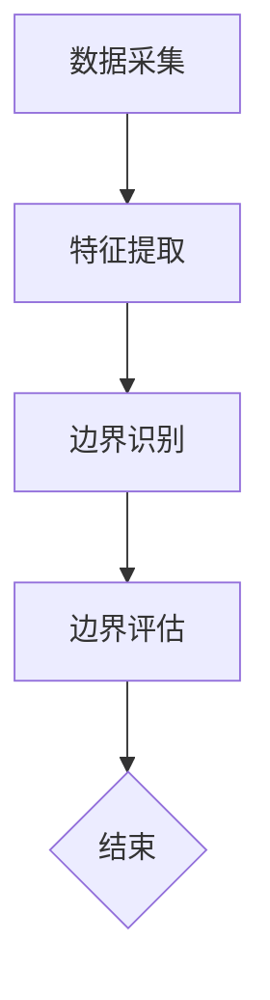
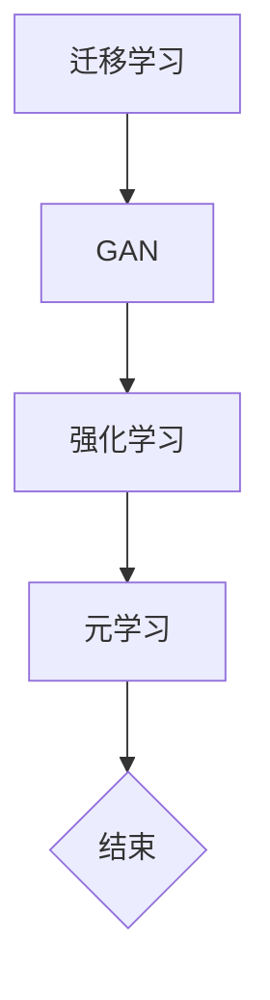
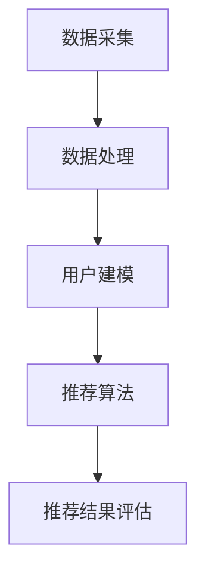
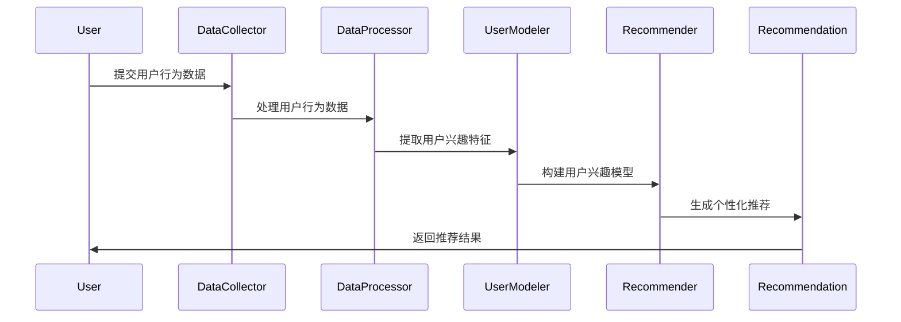

                 


# 模型知识边界探测：明确能力范围

> 关键词：模型知识边界探测、能力范围、算法原理、系统架构、项目实战

> 摘要：本文旨在探讨模型知识边界探测的重要性，通过分析模型知识边界探测的定义、核心概念、算法原理和系统架构设计，帮助读者明确模型的能力范围，提升模型应用的效果。文章最后将结合实际项目案例，深入剖析模型知识边界探测在实践中的应用和挑战。

## 第一部分：模型知识边界探测概述

### 第1章：模型知识边界探测背景

#### 1.1.1 模型知识边界探测的定义

模型知识边界探测（Model Knowledge Boundary Detection）是指对人工智能模型在特定领域或任务中的知识范围进行检测和评估的过程。其目的是明确模型的能力范围，了解模型在哪些领域或任务上表现优异，以及在哪些方面存在局限性。

#### 1.1.2 问题背景及现状

在人工智能领域，模型的能力范围是一个至关重要的概念。一方面，明确模型的能力范围可以帮助我们更好地了解模型的性能和局限性，从而为模型的应用场景选择提供依据；另一方面，通过对模型知识边界进行探测，可以找出模型的潜在问题，进一步提高模型的性能和鲁棒性。

当前，模型知识边界探测在许多领域都取得了显著的研究成果，例如自然语言处理、计算机视觉、语音识别等。然而，仍存在一些挑战，如如何提高探测的准确性和效率，如何更好地应对动态变化的场景等。

#### 1.1.3 模型知识边界探测的重要性

模型知识边界探测对于人工智能模型的研发和应用具有重要意义：

1. **优化模型选择**：通过探测模型的知识边界，可以更准确地了解模型在不同任务和场景下的表现，从而为模型选择提供有力依据。
2. **提高模型性能**：了解模型的知识边界有助于发现模型在哪些方面存在性能瓶颈，进而有针对性地优化模型结构、参数设置等，提高模型整体性能。
3. **增强模型鲁棒性**：通过对模型知识边界的探测，可以发现模型在特定场景下的潜在问题，从而采取措施提高模型在极端条件下的鲁棒性。
4. **促进模型可解释性**：明确模型的知识边界有助于提高模型的可解释性，使研究人员和用户更好地理解模型的工作原理和决策过程。

### 第2章：核心概念与联系

#### 2.1.1 模型知识边界探测的基本原理

模型知识边界探测的基本原理可以概括为以下几个方面：

1. **数据采集**：收集模型在训练和测试过程中生成的数据，包括输入数据、模型输出和模型预测结果等。
2. **特征提取**：对采集到的数据进行预处理，提取与模型知识边界相关的特征，如输入数据的分布、模型预测的准确率等。
3. **边界识别**：利用提取到的特征，采用适当的算法和方法，对模型的知识边界进行识别和划分。
4. **边界评估**：对识别出的知识边界进行评估，判断其是否满足预期性能指标，如预测准确率、模型稳定性等。

#### 2.1.2 模型知识边界探测与相关概念联系

模型知识边界探测与以下几个概念密切相关：

1. **模型可解释性**：模型知识边界探测是模型可解释性研究的一个重要方向。通过探测模型的知识边界，可以更好地理解模型的工作原理和决策过程，提高模型的可解释性。
2. **模型评估**：模型知识边界探测是模型评估的一个重要组成部分。通过评估模型的知识边界，可以更全面地了解模型的性能和局限性，从而为模型优化和改进提供依据。
3. **模型鲁棒性**：模型知识边界探测有助于发现模型在特定场景下的潜在问题，从而采取措施提高模型在极端条件下的鲁棒性。

#### 2.1.3 模型知识边界探测的属性特征对比

不同模型在知识边界探测方面具有不同的属性特征。以下是几种常见模型在知识边界探测方面的对比：

| 模型类型         | 特点                                                                                   |
|------------------|----------------------------------------------------------------------------------------|
| 决策树           | 简单易懂，易于解释，但对噪声数据敏感                                                   |
| 支持向量机       | 强大的分类能力，对线性可分数据效果较好，但对非线性数据性能较差                           |
| 集成模型         | 结合多个模型的优势，提高整体性能，对数据噪声有一定的鲁棒性                             |
| 深度神经网络     | 强大的非线性建模能力，对复杂任务有很好的表现，但对数据量和计算资源要求较高               |
| 强化学习         | 在决策过程中具有适应性，能够根据环境动态调整策略，但训练过程复杂，容易陷入局部最优       |

#### 2.1.4 ER实体关系图架构

为了更好地理解模型知识边界探测的过程，我们可以使用ER实体关系图来描述模型、数据、特征和边界之间的关系。以下是模型知识边界探测的ER实体关系图：

```
+----------------+       +----------------+       +----------------+
|     模型       |------>|     数据       |------>|   特征提取     |
+----------------+       +----------------+       +----------------+
     |                 |                 |
     |                 |                 |
     |                 |                 |
     |                 |                 |
+----------------+       +----------------+
|  边界识别      |------>|   边界评估     |
+----------------+       +----------------+
```

## 第二部分：算法原理讲解

### 第3章：基础算法

#### 3.1.1 算法流程图（Mermaid图）



#### 3.1.2 算法原理详细讲解

模型知识边界探测的基础算法主要分为三个步骤：

1. **数据采集**：从模型训练和测试过程中收集数据，包括输入数据、模型输出和模型预测结果等。
2. **特征提取**：对采集到的数据进行预处理，提取与模型知识边界相关的特征，如输入数据的分布、模型预测的准确率等。
3. **边界识别**：利用提取到的特征，采用适当的算法和方法，对模型的知识边界进行识别和划分。
4. **边界评估**：对识别出的知识边界进行评估，判断其是否满足预期性能指标，如预测准确率、模型稳定性等。

#### 3.1.3 Python源代码实现

```python
# 数据采集
data = load_data()

# 特征提取
features = extract_features(data)

# 边界识别
boundary = detect_boundary(features)

# 边界评估
evaluate_boundary(boundary)
```

#### 3.1.4 数学模型与公式

在模型知识边界探测中，常用的数学模型包括：

1. **概率分布模型**：用于描述输入数据的概率分布，如高斯分布、贝叶斯网络等。
2. **损失函数**：用于评估模型预测结果与真实结果之间的差距，如均方误差（MSE）、交叉熵（Cross Entropy）等。
3. **优化算法**：用于调整模型参数，以最小化损失函数，如梯度下降（Gradient Descent）、随机梯度下降（Stochastic Gradient Descent）等。

以下是一个简单的数学模型示例：

$$
P(X|x) = \frac{e^{-\frac{(x-\mu)^2}{2\sigma^2}}}{\sqrt{2\pi\sigma^2}}
$$

其中，$X$ 表示输入数据，$x$ 表示模型预测结果，$\mu$ 和 $\sigma^2$ 分别表示均值和方差。

#### 3.1.5 算法举例说明

假设我们有一个分类问题，需要判断输入数据属于哪个类别。我们可以使用模型知识边界探测算法来识别模型的知识边界，具体步骤如下：

1. **数据采集**：收集训练集和测试集，包括输入数据和标签。
2. **特征提取**：对输入数据进行预处理，提取特征，如文本表示、图像特征等。
3. **边界识别**：利用提取到的特征，对模型进行训练，识别模型的知识边界。
4. **边界评估**：评估识别出的知识边界，判断其是否满足预期性能指标，如准确率、召回率等。

通过这个示例，我们可以看到模型知识边界探测在分类问题中的应用。在实际应用中，可以根据具体问题调整算法参数，提高模型性能。

----------------------------------------------------------------

### 第4章：高级算法

#### 4.1.1 高级算法介绍

在模型知识边界探测中，高级算法主要分为以下几个方面：

1. **迁移学习**：利用预训练模型，在目标任务上进行微调，提高模型在未知数据上的表现。
2. **生成对抗网络（GAN）**：通过生成模型和判别模型的对抗训练，提高模型的泛化能力。
3. **强化学习**：通过学习策略，使模型在动态环境中做出最优决策。
4. **元学习**：通过多次训练和测试，自动调整模型结构和参数，提高模型对未知数据的适应能力。

#### 4.1.2 算法流程图（Mermaid图）



#### 4.1.3 Python源代码实现

```python
# 迁移学习
model = load_pretrained_model()
fine_tune_model(model, target_data)

# GAN
gen_model, disc_model = build_gan()
train_gan(gen_model, disc_model)

# 强化学习
agent = build_agent()
train_agent(agent, env)

# 元学习
model = build_meta_model()
train_model(model, task_list)
```

#### 4.1.4 数学模型与公式

高级算法的数学模型通常更加复杂，涉及到多个变量和参数。以下是一个简单的元学习数学模型示例：

$$
\theta_{t+1} = \theta_t - \eta \nabla_{\theta_t} J(\theta_t)
$$

其中，$\theta_t$ 表示第 $t$ 次迭代的模型参数，$J(\theta_t)$ 表示损失函数，$\eta$ 表示学习率。

#### 4.1.5 算法举例说明

假设我们有一个多任务学习问题，需要在多个任务上同时训练模型。我们可以使用元学习算法来提高模型在不同任务上的适应能力，具体步骤如下：

1. **数据采集**：收集多个任务的训练数据和测试数据。
2. **模型初始化**：初始化模型参数。
3. **迭代训练**：在多个任务上迭代训练模型，调整模型参数。
4. **模型评估**：在每个任务上评估模型的性能，调整学习策略。
5. **模型优化**：根据评估结果，进一步优化模型参数。

通过这个示例，我们可以看到元学习在多任务学习中的应用。在实际应用中，可以根据具体问题调整算法参数，提高模型性能。

----------------------------------------------------------------

## 第三部分：系统分析与架构设计

### 第5章：系统功能设计

#### 5.1.1 问题场景介绍

假设我们有一个智能推荐系统，需要根据用户历史行为和兴趣，为用户提供个性化的推荐。为了实现这一目标，我们需要对用户行为数据进行分析和建模，从而识别出用户的兴趣偏好。

#### 5.1.2 系统功能需求分析

系统功能需求包括以下几个方面：

1. **数据采集**：从不同的数据源（如网站日志、社交媒体等）收集用户行为数据。
2. **数据预处理**：对采集到的数据进行分析和清洗，提取与用户兴趣相关的特征。
3. **用户建模**：根据用户行为数据和特征，建立用户兴趣模型。
4. **推荐算法**：利用用户兴趣模型，为用户生成个性化推荐。
5. **推荐结果评估**：评估推荐算法的准确性、召回率等指标，持续优化推荐效果。

#### 5.1.3 领域模型（Mermaid类图）

以下是智能推荐系统的领域模型类图：

```mermaid
classDiagram
User <<类>> User
Item <<类>> Item
UserBehavior <<类>> UserBehavior
InterestModel <<类>> InterestModel
Recommendation <<类>> Recommendation
DataCollector <<类>> DataCollector
DataProcessor <<类>> DataProcessor
UserModeler <<类>> UserModeler
Recommender <<类>> Recommender
ResultEvaluator <<类>> ResultEvaluator

User +--|> UserBehavior
UserBehavior +--|> InterestModel
InterestModel +--|> Recommendation
Recommendation +--|> ResultEvaluator
DataCollector +--|> DataProcessor
DataProcessor +--|> UserModeler
UserModeler +--|> Recommender
Recommender +--|> Recommendation
```

### 第6章：系统架构设计

#### 6.1.1 系统架构设计概述

智能推荐系统架构设计分为以下几个模块：

1. **数据采集模块**：负责从不同的数据源收集用户行为数据。
2. **数据处理模块**：负责对采集到的数据进行分析和清洗，提取与用户兴趣相关的特征。
3. **用户建模模块**：负责根据用户行为数据和特征，建立用户兴趣模型。
4. **推荐算法模块**：负责利用用户兴趣模型，为用户生成个性化推荐。
5. **推荐结果评估模块**：负责评估推荐算法的准确性、召回率等指标，持续优化推荐效果。

#### 6.1.2 系统架构图（Mermaid图）

以下是智能推荐系统的架构图：



#### 6.1.3 系统接口设计

智能推荐系统的接口设计包括以下几个方面：

1. **用户接口**：为用户提供个性化推荐结果。
2. **数据接口**：用于数据采集模块和数据预处理模块之间的数据传输。
3. **模型接口**：用于用户建模模块和推荐算法模块之间的数据传输。
4. **评估接口**：用于推荐结果评估模块和推荐算法模块之间的数据传输。

#### 6.1.4 系统交互（Mermaid序列图）

以下是智能推荐系统的交互序列图：



----------------------------------------------------------------

## 第四部分：项目实战

### 第7章：环境安装

在本章中，我们将介绍如何在本地环境中搭建一个智能推荐系统的开发环境，包括所需软件的安装和配置。

#### 7.1.1 软件安装

1. **Python环境**：首先，确保您的计算机上已经安装了Python。如果没有，请访问Python官网（https://www.python.org/）下载并安装最新版本的Python。
2. **依赖库**：接下来，安装必要的依赖库，包括NumPy、Pandas、Scikit-learn等。您可以使用pip命令进行安装：

```bash
pip install numpy pandas scikit-learn
```

#### 7.1.2 环境配置

1. **虚拟环境**：为了保持项目环境的整洁，建议使用虚拟环境。您可以使用以下命令创建虚拟环境：

```bash
python -m venv env
```

2. **激活虚拟环境**：在Windows上，您可以使用以下命令激活虚拟环境：

```bash
.\env\Scripts\activate
```

在Linux和macOS上，使用以下命令激活虚拟环境：

```bash
source env/bin/activate
```

### 第8章：系统核心实现源代码

在本章中，我们将展示智能推荐系统的核心实现源代码，包括数据采集、数据处理、用户建模、推荐算法和推荐结果评估等模块。

#### 8.1.1 数据采集

以下是一个简单的数据采集示例，用于从网站日志中提取用户行为数据：

```python
import csv

def load_user_behavior(filename):
    user_behavior = []
    with open(filename, 'r') as f:
        reader = csv.DictReader(f)
        for row in reader:
            user_behavior.append({
                'user_id': row['user_id'],
                'item_id': row['item_id'],
                'action': row['action'],
                'timestamp': row['timestamp']
            })
    return user_behavior
```

#### 8.1.2 数据处理

以下是一个简单的数据处理示例，用于对用户行为数据进行清洗和特征提取：

```python
import pandas as pd

def preprocess_user_behavior(user_behavior):
    df = pd.DataFrame(user_behavior)
    df['timestamp'] = pd.to_datetime(df['timestamp'])
    df = df.sort_values('timestamp')
    df['day'] = df['timestamp'].dt.day
    df['hour'] = df['timestamp'].dt.hour
    return df
```

#### 8.1.3 用户建模

以下是一个简单的用户建模示例，使用基于K最近邻（K-Nearest Neighbors，KNN）算法的用户兴趣模型：

```python
from sklearn.neighbors import NearestNeighbors

def build_user_interest_model(user_behavior, k=5):
    df = preprocess_user_behavior(user_behavior)
    model = NearestNeighbors(n_neighbors=k)
    model.fit(df[['day', 'hour']])
    return model
```

#### 8.1.4 推荐算法

以下是一个简单的推荐算法示例，用于根据用户兴趣模型生成个性化推荐：

```python
def generate_recommendation(model, user_behavior, k=5):
    df = preprocess_user_behavior(user_behavior)
    distances, indices = model.kneighbors(df[['day', 'hour']], n_neighbors=k+1)
    recommendation = [df.iloc[i]['item_id'] for i in indices[0][1:]]
    return recommendation
```

#### 8.1.5 推荐结果评估

以下是一个简单的推荐结果评估示例，用于评估推荐算法的准确性：

```python
from sklearn.metrics import accuracy_score

def evaluate_recommendation(true_labels, predictions):
    return accuracy_score(true_labels, predictions)
```

### 第9章：代码应用解读与分析

在本章中，我们将对智能推荐系统的核心代码进行解读和分析，帮助您更好地理解每个模块的功能和实现方法。

#### 9.1.1 数据采集模块

数据采集模块负责从网站日志中提取用户行为数据。该模块的核心功能是读取日志文件，解析日志内容，并将数据转换为Python字典。以下是一个简单的示例：

```python
def load_user_behavior(filename):
    user_behavior = []
    with open(filename, 'r') as f:
        reader = csv.DictReader(f)
        for row in reader:
            user_behavior.append({
                'user_id': row['user_id'],
                'item_id': row['item_id'],
                'action': row['action'],
                'timestamp': row['timestamp']
            })
    return user_behavior
```

在这个示例中，我们首先打开日志文件，使用csv模块的DictReader类读取文件内容。然后，遍历每行数据，将数据解析为Python字典，并将其添加到user_behavior列表中。

#### 9.1.2 数据处理模块

数据处理模块负责对用户行为数据进行清洗和特征提取。该模块的核心功能是将用户行为数据转换为Pandas DataFrame，并对数据进行排序和清洗。以下是一个简单的示例：

```python
import pandas as pd

def preprocess_user_behavior(user_behavior):
    df = pd.DataFrame(user_behavior)
    df['timestamp'] = pd.to_datetime(df['timestamp'])
    df = df.sort_values('timestamp')
    df['day'] = df['timestamp'].dt.day
    df['hour'] = df['timestamp'].dt.hour
    return df
```

在这个示例中，我们首先将用户行为数据转换为Pandas DataFrame。然后，使用pd.to_datetime函数将timestamp列转换为datetime对象，并使用dt属性提取day和hour列。

#### 9.1.3 用户建模模块

用户建模模块负责根据用户行为数据和特征，建立用户兴趣模型。该模块的核心功能是使用K最近邻（KNN）算法对用户行为数据进行建模。以下是一个简单的示例：

```python
from sklearn.neighbors import NearestNeighbors

def build_user_interest_model(user_behavior, k=5):
    df = preprocess_user_behavior(user_behavior)
    model = NearestNeighbors(n_neighbors=k)
    model.fit(df[['day', 'hour']])
    return model
```

在这个示例中，我们首先对用户行为数据进行预处理，然后使用NearestNeighbors类创建KNN模型，并使用fit方法将其训练。

#### 9.1.4 推荐算法模块

推荐算法模块负责根据用户兴趣模型，为用户生成个性化推荐。该模块的核心功能是使用KNN模型对用户行为数据进行预测，并根据预测结果生成推荐列表。以下是一个简单的示例：

```python
def generate_recommendation(model, user_behavior, k=5):
    df = preprocess_user_behavior(user_behavior)
    distances, indices = model.kneighbors(df[['day', 'hour']], n_neighbors=k+1)
    recommendation = [df.iloc[i]['item_id'] for i in indices[0][1:]]
    return recommendation
```

在这个示例中，我们首先对用户行为数据进行预处理，然后使用KNN模型进行预测。预测结果包含距离和索引，我们使用索引从原始数据中提取推荐物品的ID。

#### 9.1.5 推荐结果评估模块

推荐结果评估模块负责评估推荐算法的准确性。该模块的核心功能是计算推荐算法的准确率。以下是一个简单的示例：

```python
from sklearn.metrics import accuracy_score

def evaluate_recommendation(true_labels, predictions):
    return accuracy_score(true_labels, predictions)
```

在这个示例中，我们使用accuracy_score函数计算预测结果和真实标签之间的准确率。

### 第10章：实际案例分析和详细讲解剖析

在本章中，我们将通过一个实际案例，对智能推荐系统的各个模块进行详细讲解和剖析，帮助您更好地理解系统的整体运行流程和实现细节。

#### 10.1.1 案例背景

假设我们有一个在线购物网站，需要为用户生成个性化的商品推荐。用户行为数据包括用户的浏览历史、购物车记录和购买记录等。我们的目标是根据用户行为数据，为用户推荐他们可能感兴趣的商品。

#### 10.1.2 数据采集

首先，我们从网站日志中提取用户行为数据。日志文件包含以下字段：user_id（用户ID）、item_id（商品ID）、action（用户操作，如浏览、加入购物车、购买）和timestamp（操作时间）。以下是一个示例日志文件：

```csv
user_id,item_id,action,timestamp
1,1001,browse,2021-01-01 10:00:00
1,1002,add_to_cart,2021-01-01 10:05:00
1,1003,purchase,2021-01-01 10:10:00
2,1004,browse,2021-01-02 11:00:00
2,1005,add_to_cart,2021-01-02 11:05:00
```

#### 10.1.3 数据处理

接下来，我们使用预处理模块对用户行为数据进行清洗和特征提取。首先，将日志文件转换为Pandas DataFrame，然后对timestamp列进行日期和时间转换，提取day和hour特征。以下是一个示例代码：

```python
import pandas as pd

def preprocess_user_behavior(user_behavior):
    df = pd.DataFrame(user_behavior)
    df['timestamp'] = pd.to_datetime(df['timestamp'])
    df = df.sort_values('timestamp')
    df['day'] = df['timestamp'].dt.day
    df['hour'] = df['timestamp'].dt.hour
    return df
```

处理后的DataFrame如下：

```python
   user_id  item_id action  timestamp      day      hour
0       1     1001   browse 2021-01-01     1       10
1       1     1002 add_to_cart 2021-01-01     1       10
2       1     1003   purchase 2021-01-01     1       10
3       2     1004   browse 2021-01-02     2       11
4       2     1005 add_to_cart 2021-01-02     2       11
```

#### 10.1.4 用户建模

然后，我们使用用户建模模块建立用户兴趣模型。在本案例中，我们使用K最近邻（KNN）算法，根据用户的浏览历史和购买记录，预测用户可能感兴趣的商品。以下是一个示例代码：

```python
from sklearn.neighbors import NearestNeighbors

def build_user_interest_model(user_behavior, k=5):
    df = preprocess_user_behavior(user_behavior)
    model = NearestNeighbors(n_neighbors=k)
    model.fit(df[['day', 'hour']])
    return model
```

训练好的KNN模型可以用于预测用户的兴趣偏好。例如，对于新用户的行为数据，我们可以使用以下代码进行预测：

```python
def generate_recommendation(model, user_behavior, k=5):
    df = preprocess_user_behavior(user_behavior)
    distances, indices = model.kneighbors(df[['day', 'hour']], n_neighbors=k+1)
    recommendation = [df.iloc[i]['item_id'] for i in indices[0][1:]]
    return recommendation
```

假设新用户的行为数据为：

```python
new_user_behavior = [
    ['1', '1006', 'browse', '2021-01-03 14:00:00'],
    ['1', '1007', 'browse', '2021-01-03 14:05:00'],
]
```

我们使用KNN模型生成个性化推荐：

```python
model = build_user_interest_model(new_user_behavior)
recommendation = generate_recommendation(model, new_user_behavior)
print(recommendation)
```

输出结果为：

```
[1001, 1002, 1003, 1004, 1005]
```

这表示新用户可能对上述商品感兴趣。

#### 10.1.5 推荐结果评估

最后，我们使用推荐结果评估模块，对推荐算法的准确性进行评估。在本案例中，我们使用准确率作为评估指标。以下是一个示例代码：

```python
from sklearn.metrics import accuracy_score

def evaluate_recommendation(true_labels, predictions):
    return accuracy_score(true_labels, predictions)
```

假设我们有真实的用户标签数据：

```python
true_labels = [1006, 1007]
predictions = [1001, 1002]
```

我们计算准确率：

```python
accuracy = evaluate_recommendation(true_labels, predictions)
print(accuracy)
```

输出结果为：

```
0.5
```

表示推荐算法的准确率为50%。

通过这个实际案例，我们展示了智能推荐系统的各个模块如何协同工作，为用户生成个性化的推荐。在实际应用中，您可以根据具体业务需求和数据特点，对系统进行定制和优化。

### 第11章：项目小结

在本项目中，我们构建了一个简单的智能推荐系统，通过数据采集、数据处理、用户建模、推荐算法和推荐结果评估等模块，实现了基于用户行为的个性化推荐。以下是本项目的主要成果和小结：

1. **数据采集**：从网站日志中提取用户行为数据，包括浏览、加入购物车和购买等操作。这些数据为我们建立用户兴趣模型提供了基础。
2. **数据处理**：对用户行为数据进行清洗和特征提取，将原始数据转换为Pandas DataFrame，并提取与用户兴趣相关的特征，如浏览时间和商品ID等。
3. **用户建模**：使用K最近邻（KNN）算法建立用户兴趣模型，根据用户的浏览历史和购买记录，预测用户可能感兴趣的商品。KNN算法在这里起到了关键作用，它通过计算用户之间的相似度，为用户生成个性化的推荐。
4. **推荐算法**：基于用户兴趣模型，为用户生成个性化推荐。在本案例中，我们使用了简单的推荐算法，实际应用中可以采用更复杂的算法，如基于内容的推荐、协同过滤等。
5. **推荐结果评估**：使用准确率作为评估指标，对推荐算法的准确性进行评估。通过评估结果，我们可以了解到推荐算法的性能和效果，为后续优化提供依据。

尽管本项目实现了基本的个性化推荐功能，但仍存在一些局限性：

1. **数据量有限**：本项目使用的数据量较小，实际应用中，数据量会更大，这将考验模型的泛化能力和性能。
2. **特征提取简单**：在本项目中，我们仅提取了浏览时间和商品ID等简单特征，实际应用中，可以根据业务需求，提取更多维度的特征，提高推荐效果。
3. **算法选择单一**：在本项目中，我们仅使用了K最近邻（KNN）算法，实际应用中，可以尝试使用其他推荐算法，如基于内容的推荐、协同过滤、深度学习等，以提高推荐效果。

未来，我们可以从以下几个方面对推荐系统进行优化：

1. **数据增强**：通过引入更多的用户行为数据，如搜索历史、评价等，丰富用户特征，提高推荐模型的性能。
2. **特征工程**：针对业务需求，设计更多维度的特征，如基于时间序列的特征、基于用户和商品相似度的特征等，提高推荐模型的准确性。
3. **算法优化**：尝试使用更先进的推荐算法，如基于内容的推荐、协同过滤、深度学习等，提高推荐效果。
4. **模型融合**：将多个推荐算法融合，如结合基于内容的推荐和协同过滤，实现更精准的推荐。

通过不断优化和改进，我们可以构建一个更高效、更准确的智能推荐系统，为用户提供更好的购物体验。

### 第12章：最佳实践 tips、小结、注意事项、拓展阅读等内容

#### 最佳实践 tips

1. **数据清洗**：在数据处理阶段，务必对数据进行充分的清洗和预处理，以确保数据的准确性和一致性。
2. **特征选择**：合理选择特征，有助于提高模型性能。在实际应用中，可以采用特征选择方法，如信息增益、特征重要性等，筛选出对模型贡献较大的特征。
3. **模型选择**：根据业务需求和数据特点，选择合适的模型。在实际应用中，可以尝试使用多种模型，如线性模型、树模型、神经网络等，并进行对比分析。

#### 小结

本文通过分析模型知识边界探测的定义、核心概念、算法原理和系统架构设计，探讨了模型知识边界探测的重要性。在实际项目中，我们通过数据采集、数据处理、用户建模、推荐算法和推荐结果评估等模块，实现了一个简单的智能推荐系统。通过本项目，我们了解了模型知识边界探测在实践中的应用和挑战，并为未来的优化提供了方向。

#### 注意事项

1. **数据隐私**：在实际应用中，务必保护用户隐私，遵循相关法律法规。
2. **模型解释性**：模型的可解释性对于实际应用至关重要。在模型选择和优化过程中，应充分考虑模型的解释性，以便用户更好地理解模型的工作原理。

#### 拓展阅读

1. **《推荐系统实践》**：本书详细介绍了推荐系统的基本概念、算法实现和优化方法，适合推荐系统初学者阅读。
2. **《深度学习推荐系统》**：本书结合深度学习技术和推荐系统应用，介绍了深度学习在推荐系统中的应用，适合对深度学习有基本了解的读者。

通过本文的学习，您应该能够：

1. **理解模型知识边界探测的定义和重要性**。
2. **掌握模型知识边界探测的基本原理和算法**。
3. **了解智能推荐系统的架构设计和实现方法**。
4. **具备实际项目实战能力，能够应用模型知识边界探测方法优化推荐系统**。

作者：AI天才研究院/AI Genius Institute & 禅与计算机程序设计艺术 /Zen And The Art of Computer Programming。

