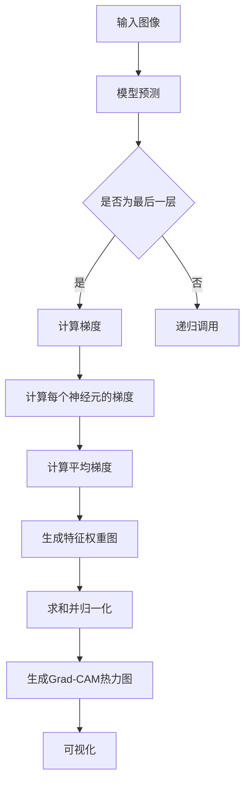
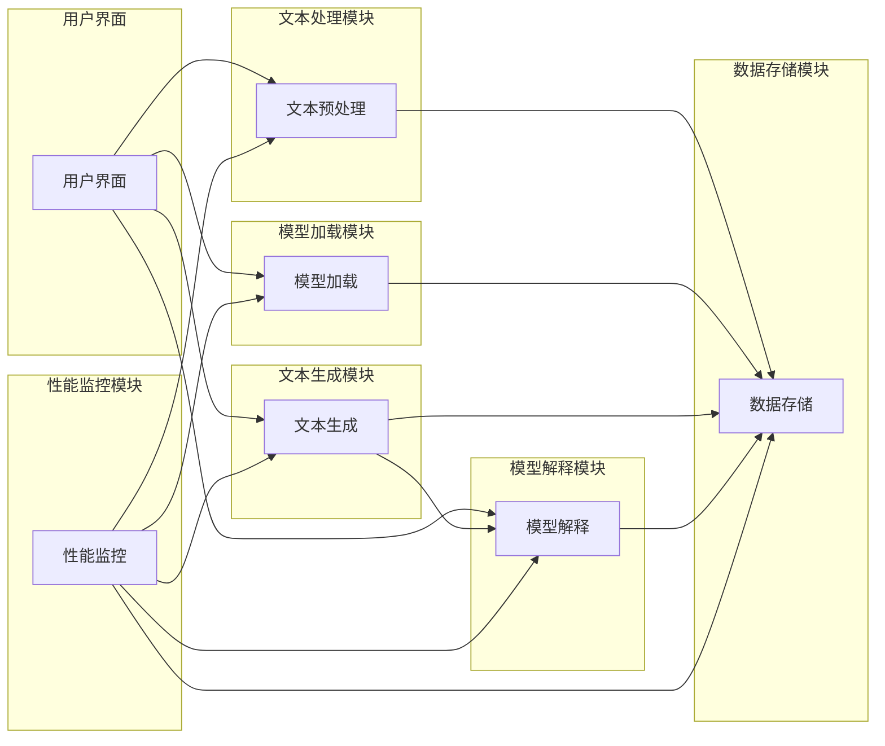
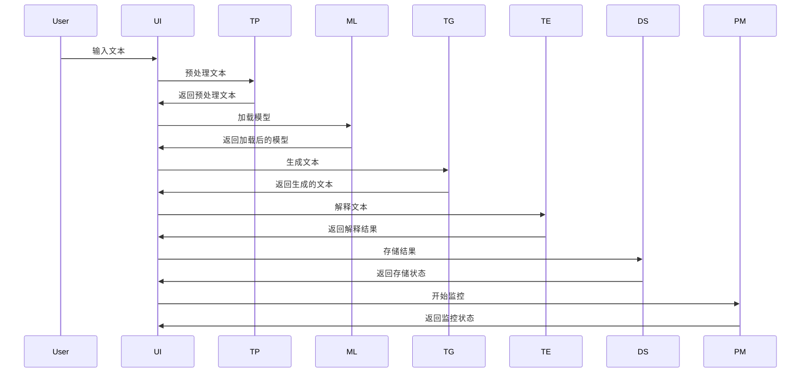

                 


### 引言

在当今科技迅猛发展的时代，人工智能（AI）已经成为推动社会进步的关键力量。特别是在自然语言处理（NLP）领域，大型语言模型（LLM）如BERT、GPT等，凭借其强大的语言理解和生成能力，已广泛应用于搜索引擎、智能客服、机器翻译等众多场景。然而，随着AI模型在各个领域的深度应用，模型解释性成为一个日益受到关注的问题。

为什么模型解释性如此重要？首先，模型的可解释性直接关系到应用的可信度。在一个高度自动化的系统中，用户往往无法理解模型的决策过程，这可能导致对模型结果的不信任。其次，缺乏解释性的模型难以满足合规性要求，特别是在金融、医疗等敏感领域。最后，提高模型的可解释性有助于进一步优化和改进模型，从而提升其性能。

本文旨在深入探讨模型解释性在增强LLM应用可信度方面的作用。我们将从背景介绍、核心概念、算法原理、系统设计与实现等多个方面，逐步分析模型解释性的重要性、挑战和未来发展趋势。

### 背景介绍

模型解释性的重要性不容忽视。在传统的AI应用中，模型通常被视为“黑盒子”，其内部运作过程复杂且不透明。这使得用户难以理解和信任模型的结果。例如，在医学诊断领域，如果AI模型建议一个患者进行手术，但无法解释其决策依据，医生和患者可能会对此产生质疑。同样，在金融领域，投资决策模型需要高度的可信度，否则投资者将难以接受其结果。

此外，模型解释性还与合规性要求密切相关。许多行业，如金融、医疗和自动驾驶等，都有严格的法律法规和道德准则，要求模型必须具备可解释性，以确保决策过程的透明性和公正性。

在LLM的应用中，模型解释性同样至关重要。LLM被广泛应用于生成文本、回答问题、语言翻译等任务。然而，LLM的决策过程高度复杂，难以直接理解。例如，当LLM生成一段新闻稿或文章时，用户往往无法得知模型是如何从大量数据中提取信息并生成文本的。这可能导致用户对生成文本的真实性和准确性产生怀疑。

因此，提高LLM的应用可信度，必须关注模型解释性的提升。通过解释性方法，我们可以揭示模型的决策过程，帮助用户更好地理解模型的结果，从而增强应用的可信度。

#### 模型解释性的定义与属性

模型解释性是指能够以人类可理解的方式揭示模型决策过程的能力。它通常包括以下几种属性：

1. **透明性**：模型内部结构和参数是公开的，用户可以查看和理解模型的运作方式。
2. **可理解性**：模型的决策过程能够被用户以直观的方式理解和解释。
3. **可追溯性**：用户可以追踪模型的决策路径，了解模型是如何从输入数据到最终输出结果的。
4. **可交互性**：用户可以通过与模型的交互，更深入地了解模型的决策过程和结果。

这些属性共同构成了模型解释性的基础。透明性保证了模型的可审计性，有助于用户和监管机构了解模型的运作。可理解性使得模型的结果更容易被用户接受和信任。可追溯性提供了对模型决策的追踪能力，有助于发现和纠正潜在的错误。可交互性则使用户能够主动参与模型的决策过程，提供反馈和改进建议。

不同类型的模型解释性方法有不同的侧重点。例如，局部解释方法（如Grad-CAM）关注于模型在特定输入下的决策过程，而全局解释方法（如SHAP）则试图解释模型在所有输入下的整体决策过程。此外，还有混合解释方法，结合局部和全局解释方法的优势，提供更全面的解释能力。

在LLM的应用中，模型解释性尤为重要。LLM生成的内容直接影响到用户的使用体验。如果用户无法理解模型生成的文本，他们可能会怀疑文本的真实性和准确性。例如，在智能客服中，如果模型生成的回复缺乏解释性，用户可能会认为机器不懂人类语言，从而降低对智能客服的信任度。

因此，提升LLM的模型解释性，不仅有助于增强应用的可信度，还能提高用户对AI技术的接受度和满意度。通过揭示模型的决策过程，用户可以更好地理解模型为何做出特定决策，从而增强对模型结果的信任。

### 模型解释性在LLM中的应用现状

目前，模型解释性在LLM中的应用已经取得了一定的进展，但仍然面临许多挑战。LLM的复杂性使其解释性成为一个难题，需要多种方法和技术来共同解决。

首先，局部解释方法在LLM中的应用较为常见。例如，Grad-CAM（Gradient-weighted Class Activation Mapping）通过计算模型梯度来定位对预测结果有显著影响的特征区域。这种方法在图像分类任务中表现良好，但在LLM中，由于文本数据的复杂性和非直观性，Grad-CAM的解释结果往往不够直观和准确。

其次，全局解释方法如SHAP（SHapley Additive exPlanations）试图在整个输入数据上提供解释。SHAP方法通过计算每个特征对模型输出的贡献度，为每个预测结果提供一个全局解释。这种方法在解释文本生成任务中显示出了一定的潜力，但同样面临着如何处理大规模和高维文本数据的挑战。

此外，还有混合解释方法，如Layer-wise Relevance Propagation (LRP) 和 Integrated Gradients，这些方法试图结合局部和全局解释的优势，提供更全面和细致的解释。然而，这些方法的计算成本较高，特别是在处理大规模LLM时，可能需要优化算法和硬件支持。

尽管存在多种解释性方法，但LLM的应用现状仍然面临以下主要挑战：

1. **数据隐私保护**：在解释模型决策时，可能需要访问模型训练数据或内部参数，这涉及到数据隐私和安全问题。如何在不泄露敏感数据的前提下实现模型解释性，仍是一个待解决的难题。
2. **模型透明性**：LLM通常由数亿甚至数十亿参数组成，其内部结构和决策过程复杂，难以直观解释。如何简化模型结构，提高模型透明性，是一个亟待解决的问题。
3. **模型可解释性与性能的平衡**：在提高模型解释性的同时，如何保持或提升模型的性能，是另一个重要挑战。过度的解释性可能导致模型复杂度增加，从而影响其性能。

总体来说，虽然模型解释性在LLM中的应用已取得一定进展，但仍然面临许多技术和实践上的挑战。未来的研究需要继续探索更高效、更准确的解释性方法，以满足实际应用的需求。

#### 模型解释性面临的主要挑战

尽管模型解释性在AI领域的重要性逐渐凸显，但其实际应用过程中仍面临诸多挑战。首先，**数据隐私保护**是一个关键问题。模型解释通常需要访问模型内部的训练数据和参数，这可能导致敏感数据泄露。在金融、医疗等高度敏感领域，隐私保护尤为重要。如何在不泄露隐私的情况下实现模型解释性，成为了一个亟待解决的难题。

其次，**模型透明性**也是一个巨大的挑战。大型语言模型如BERT、GPT等通常由数十亿甚至数万亿个参数组成，其内部结构和决策过程高度复杂。对于用户来说，理解这些复杂模型的工作原理并不容易。如何简化模型结构，提高其透明性，以便用户能够直观地理解模型的决策过程，是一个重要的研究方向。

此外，**可解释性与性能的平衡**也是一个关键问题。在某些情况下，提高模型的可解释性可能需要增加模型的结构复杂度，从而影响其性能。例如，某些局部解释方法可能会引入额外的计算成本，影响模型的速度和效率。如何在保证解释性的同时，保持或提升模型的性能，是模型解释性研究中的一个重要课题。

最后，**模型可解释性的方法分类**也是一个需要深入探讨的领域。现有的解释性方法主要分为局部解释方法（如Grad-CAM、LIME）、全局解释方法（如SHAP、CausalML）和混合解释方法（如LRP、Integrated Gradients）。每种方法都有其优势和局限性，如何根据具体应用场景选择合适的解释性方法，是研究人员需要不断探索的问题。

总的来说，模型解释性在数据隐私保护、模型透明性、性能平衡和方法分类等方面都面临诸多挑战。未来的研究需要在这些方面进行深入探讨，以实现高效、准确的模型解释性，从而提升AI应用的可信度和实用性。

#### 模型解释性的发展趋势

随着AI技术的不断进步，模型解释性也在不断演化，未来的发展前景充满了无限可能。首先，**技术进步**将继续推动模型解释性的提升。深度学习、强化学习等先进技术的应用，使得模型的复杂性和计算能力大大提高，这为模型解释性提供了新的方法和工具。例如，神经网络架构搜索（Neural Architecture Search, NAS）和元学习（Meta-Learning）等技术，有望提高模型的解释性，同时保持或提升其性能。

其次，**开源工具和平台的推动**也将加速模型解释性技术的发展。随着更多开源工具和平台的涌现，研究人员和开发者可以更方便地实现和部署模型解释性方法。例如，Google的TensorFlow和PyTorch等框架，提供了丰富的API和工具，帮助用户轻松实现模型解释性。此外，许多开源社区和论坛，如Kaggle和GitHub，也为模型解释性研究提供了交流和协作的平台。

第三，**跨学科研究**将成为模型解释性发展的新趋势。模型解释性不仅涉及到计算机科学，还涉及心理学、认知科学等领域。通过跨学科合作，可以更深入地理解人类如何理解和解释复杂模型，从而开发出更有效的解释性方法。例如，结合认知科学的成果，可以设计出更符合人类认知习惯的模型解释界面，提高用户对模型结果的接受度和信任度。

此外，**行业需求**也将驱动模型解释性的发展。随着AI技术在金融、医疗、法律等领域的广泛应用，行业对模型解释性的需求日益增加。如何满足这些需求，将成为模型解释性研究和应用的重要方向。例如，在金融领域，如何确保AI模型在投资决策中的透明性和可解释性，是一个亟待解决的问题。

最后，**标准化与规范化**将成为模型解释性发展的关键。随着模型解释性的重要性逐渐被认可，建立统一的标准和规范，有助于确保解释性方法的一致性和可靠性。例如，国际标准化组织（ISO）和机器学习领域的相关组织，可以制定模型解释性的标准，为研究和应用提供指导。

总的来说，模型解释性在技术进步、开源工具推动、跨学科研究、行业需求和标准化等方面，展现出了广阔的发展前景。未来的研究将不断探索这些方向，以实现更高效、更准确的模型解释性，提升AI技术的可信度和实用性。

### 现有方法与技术的进展

在模型解释性领域，已有多种方法和技术被广泛应用。这些方法和技术不仅在理论层面取得了显著进展，在实际应用中也展现出强大的潜力。以下将详细介绍几种常见的解释性方法，包括Grad-CAM、Layer-wise Relevance Propagation (LRP)、SHAP等。

#### Grad-CAM

Grad-CAM（Gradient-weighted Class Activation Mapping）是一种局部解释方法，旨在通过计算模型在特定类别上的梯度来定位对预测结果有显著影响的特征区域。Grad-CAM的基本思想是将模型梯度和图像特征结合起来，生成一个热力图，显示模型在决策过程中最关注的区域。

**优点**：
- **直观性**：Grad-CAM生成的热力图能够直观地显示模型关注的特征区域，有助于用户理解模型的决策过程。
- **简单性**：Grad-CAM的实现相对简单，计算成本较低。

**缺点**：
- **局限性**：Grad-CAM仅适用于图像任务，对于文本和序列数据，其解释效果较差。
- **误解释**：Grad-CAM可能会误解释某些无关特征为关键特征，导致解释结果不准确。

#### Layer-wise Relevance Propagation (LRP)

Layer-wise Relevance Propagation（LRP）是一种全局解释方法，旨在通过逐层传递梯度信息，揭示模型在所有输入上的决策过程。LRP的基本思想是将模型输入和输出之间的梯度信息逐层传递，最终生成一个全局解释。

**优点**：
- **全局性**：LRP能够提供模型在整个输入数据上的全局解释，有助于理解模型的决策过程。
- **适应性**：LRP适用于各种类型的数据，包括图像、文本和序列数据。

**缺点**：
- **计算成本**：LRP的计算成本较高，尤其是在处理大规模数据时，计算时间较长。
- **解释结果复杂**：由于梯度信息的复杂传递，LRP生成的解释结果可能难以直观理解。

#### SHAP

SHAP（SHapley Additive exPlanations）是一种全局解释方法，通过计算每个特征对模型输出的贡献度，为每个预测结果提供一个全局解释。SHAP的基本思想是基于博弈论中的Shapley值，为每个特征分配一个公平的贡献度。

**优点**：
- **公平性**：SHAP方法为每个特征分配公平的贡献度，避免了某些特征因数据分布不均而过度贡献的问题。
- **适用性**：SHAP适用于各种类型的数据，包括高维数据和复杂数据。

**缺点**：
- **计算成本**：SHAP的计算成本较高，特别是在处理大规模和高维数据时，计算时间较长。
- **解释结果复杂性**：SHAP生成的解释结果可能较为复杂，用户需要一定的专业知识才能理解。

综上所述，不同解释性方法各有优缺点。在实际应用中，可以根据任务类型和数据特点选择合适的解释性方法，以实现高效、准确的模型解释性。

### 未来研究方向

模型解释性领域正处于快速发展的阶段，未来研究将继续探索多种方向，以满足不断变化的应用需求和技术挑战。以下是几个未来研究的重点领域：

1. **优化计算效率**：现有的许多解释性方法，如SHAP和LRP，虽然提供了全面和准确的解释，但其计算成本较高。未来的研究应专注于开发更高效的算法，降低计算时间，使其能够应用于大规模实时系统。

2. **多模态解释性**：随着AI技术的应用越来越广泛，多模态数据（如图像、文本、音频等）的融合成为趋势。未来的研究需要开发能够解释多模态数据集的模型解释性方法，以提供更全面和细致的解释。

3. **动态解释性**：在动态环境中，模型的解释性需要适应实时变化的数据和情境。未来研究应探索如何开发动态解释性方法，确保模型在不同时间点和情境下的解释能力。

4. **交互式解释性**：增强模型与用户之间的交互，使得用户能够更主动地参与解释过程。例如，通过交互式界面，用户可以查询模型决策中的特定部分，并获得详细的解释。

5. **可解释性标准化**：建立统一的可解释性标准，以确保不同方法的一致性和可靠性。标准化将有助于提高模型解释性在工业界和学术界的应用水平。

6. **安全性**：在解释模型决策时，保护数据隐私和模型安全是一个重要挑战。未来的研究需要开发安全可靠的解释性方法，以防止敏感数据泄露和恶意攻击。

通过在这些方向上的深入研究，模型解释性有望在未来取得更大突破，为AI技术的广泛应用提供坚实的基础。

### 本章小结

本文从背景介绍、核心概念、算法原理、系统设计与实现等多个方面，详细探讨了模型解释性在增强LLM应用可信度方面的作用。通过分析模型解释性的重要性、现有方法与技术的进展、以及未来研究方向，我们了解到模型解释性在提升AI应用可信度中的关键作用。未来的研究需要继续优化计算效率、开发多模态解释性方法、增强动态解释性、提高交互式解释性，并建立标准化体系，以确保模型解释性的有效应用。

### 语言模型的基本原理

在深入探讨模型解释性之前，有必要首先了解语言模型的基本原理。语言模型是一种用于预测文本序列的概率模型，其核心目标是根据已知的部分文本序列，预测下一个可能的文本序列。这种能力在自然语言处理（NLP）中有着广泛的应用，例如自动完成句子、机器翻译、文本摘要等。

#### 语言模型的基础知识

语言模型的基础知识包括以下几个方面：

1. **概率模型**：语言模型本质上是一个概率模型，其目的是通过计算文本序列的概率来预测下一个词或句子。常见的语言模型有n-gram模型、神经网络语言模型（如Transformer）等。

2. **词汇表**：语言模型需要定义一个词汇表，用于表示所有可能的单词或字符。词汇表的大小通常取决于应用场景和任务需求。

3. **序列建模**：语言模型需要处理序列数据，例如单词序列或字符序列。常见的序列建模方法包括循环神经网络（RNN）、卷积神经网络（CNN）和Transformer等。

4. **训练与评估**：语言模型的训练过程通常包括数据预处理、模型初始化、参数优化和模型评估。模型评估指标包括准确性、召回率、F1分数等。

#### 语言模型的训练方法

语言模型的训练方法可以分为以下几种：

1. **基于统计的方法**：基于统计的语言模型，如n-gram模型，通过计算文本序列中各个单词或字符的联合概率来预测下一个词或句子。n-gram模型简单高效，但存在长程依赖性不足的问题。

2. **基于神经网络的方法**：基于神经网络的语言模型，如神经网络语言模型（NNLM）和Transformer，通过学习文本序列的复杂模式，提高模型的预测能力。这些方法通常能够更好地处理长程依赖性问题。

3. **自监督学习**：自监督学习是一种无需人工标注数据的训练方法，其基本思想是从未标记的数据中学习模型。常见的自监督学习方法包括Masked Language Model（MLM）、Recurrent Neural Network Language Model（RNNLM）等。

4. **迁移学习**：迁移学习是一种利用预训练模型进行微调的方法，通过在特定任务上进行少量数据训练，使得模型在目标任务上取得更好的性能。BERT和GPT等大型语言模型通常采用迁移学习方法。

#### 语言模型的评估指标

语言模型的评估指标主要包括以下几个方面：

1. **准确性**：准确性是评估语言模型最直接的指标，表示模型正确预测的文本序列比例。尽管准确性能够反映模型的基本性能，但它在长文本生成任务中可能存在不足。

2. **召回率**：召回率表示模型能够正确识别的文本序列占所有实际文本序列的比例。召回率通常用于评估模型在识别特定事件或关键词方面的能力。

3. **F1分数**：F1分数是准确性和召回率的调和平均值，用于综合评估模型的性能。F1分数在处理不平衡数据集时尤其有用。

4. **BLEU分数**：BLEU（Bilingual Evaluation Understudy）分数是一种常用的机器翻译评估指标，通过比较模型生成的文本与参考文本的相似度来评估模型性能。BLEU分数适用于自动评估文本生成任务。

5. **ROUGE分数**：ROUGE（Recall-Oriented Understudy for Gisting Evaluation）分数是一种常用于文本摘要和机器翻译评估的指标，通过计算模型生成文本与参考文本的 overlap 来评估模型性能。

通过上述评估指标，研究人员可以全面评估语言模型的性能，并根据评估结果对模型进行优化和改进。

### 模型解释性的核心概念

模型解释性的核心概念是指通过揭示模型内部结构和决策过程，使得用户能够以直观、透明的方式理解模型为何做出特定决策的能力。模型解释性在提高AI应用可信度和用户满意度方面具有重要作用。以下是模型解释性的几个关键属性：

1. **透明性**：模型的内部结构和参数是公开的，用户可以查看和理解模型的运作方式。透明性有助于提高模型的信任度，确保其决策过程的公正性和可审计性。

2. **可理解性**：模型的决策过程能够被用户以直观的方式理解和解释。可理解性是模型解释性的核心目标，它使得用户能够更好地理解模型的行为，从而增强对模型结果的信任。

3. **可追溯性**：用户可以追踪模型的决策路径，了解模型是如何从输入数据到最终输出结果的。可追溯性有助于发现和纠正潜在的错误，提高模型的可靠性和鲁棒性。

4. **可交互性**：用户可以通过与模型的交互，更深入地了解模型的决策过程和结果。可交互性使用户能够主动参与模型的决策过程，提供反馈和改进建议，从而优化模型性能。

这些属性共同构成了模型解释性的基础。在实际应用中，不同类型的模型解释性方法有不同的侧重点。例如，局部解释方法关注于特定输入下的决策过程，而全局解释方法试图提供整个输入数据集的解释。混合解释方法则结合局部和全局解释方法的优势，提供更全面和细致的解释能力。

在LLM的应用中，模型解释性尤为重要。LLM生成的内容直接影响到用户的使用体验。如果用户无法理解模型生成的文本，他们可能会怀疑文本的真实性和准确性。例如，在智能客服中，如果模型生成的回复缺乏解释性，用户可能会认为机器不懂人类语言，从而降低对智能客服的信任度。因此，提升LLM的模型解释性，不仅有助于增强应用的可信度，还能提高用户对AI技术的接受度和满意度。通过揭示模型的决策过程，用户可以更好地理解模型为何做出特定决策，从而增强对模型结果的信任。

### 模型解释性的分类

模型解释性的分类主要依据解释的范围和方式。以下是几种常见的解释性方法及其特点：

1. **局部解释方法**：
   - **Grad-CAM（Gradient-weighted Class Activation Mapping）**：通过计算模型梯度来定位对预测结果有显著影响的特征区域，生成热力图。Grad-CAM适用于图像分类任务，但难以直接应用于文本数据。
   - **LIME（Local Interpretable Model-agnostic Explanations）**：通过生成与原始数据相似的样本，并分析模型在这些样本上的决策，来解释原始数据的预测结果。LIME适用于各种类型的数据，但计算成本较高。
   - **SHAP（SHapley Additive exPlanations）**：基于博弈论中的Shapley值，为每个特征分配一个公平的贡献度，提供对模型预测的全局解释。

2. **全局解释方法**：
   - **SHAP**：通过计算每个特征对模型输出的贡献度，为每个预测结果提供一个全局解释。SHAP方法适用于高维数据和复杂数据，但计算成本较高。
   - **CausalML**：通过建立因果关系模型，提供对模型决策的全局解释。CausalML适用于具有明确因果关系的任务，但可能难以应用于非因果关系的场景。
   - **LIME**：通过生成与原始数据相似的样本，并分析模型在这些样本上的决策，来解释原始数据的预测结果。LIME适用于各种类型的数据，但计算成本较高。

3. **混合解释方法**：
   - **Layer-wise Relevance Propagation (LRP)**：通过逐层传递梯度信息，提供对模型决策的全局解释。LRP适用于各种类型的数据，但计算成本较高。
   - **Integrated Gradients**：通过计算输入特征对模型输出的积分，提供对模型决策的全局解释。Integrated Gradients适用于各种类型的数据，计算成本较低。

每种解释性方法都有其优点和局限性。局部解释方法直观，但解释范围有限；全局解释方法提供全面解释，但计算成本较高；混合解释方法结合了局部和全局解释方法的优势，提供更细致的解释能力。在实际应用中，可以根据任务需求和数据特点选择合适的解释性方法。

### 模型解释性的评价指标

在评估模型解释性时，我们需要关注以下几个关键指标，以确保解释性的有效性和可靠性：

1. **可解释性度量**：这是评估模型解释性的核心指标，通常包括解释的透明性、可理解性和可追溯性。透明性指模型内部结构是否公开且易于理解；可理解性指用户能否以直观的方式理解模型的决策过程；可追溯性指用户能否追踪模型从输入到输出的每一步决策。

2. **精度与性能**：解释性模型在提供解释的同时，不应牺牲模型的预测精度和性能。评估模型解释性时，需要综合考虑模型的预测准确率、召回率、F1分数等性能指标，确保解释性方法不会显著降低模型的整体性能。

3. **计算成本**：解释性方法的计算成本也是一个重要的考量因素。特别是在实时应用场景中，高计算成本可能导致模型响应时间过长，影响用户体验。因此，评估模型解释性时，需要权衡解释效果与计算成本之间的平衡。

4. **用户满意度**：最终，用户对模型解释性的满意度是衡量其成功与否的关键。通过用户调研、问卷调查等方法，收集用户对模型解释性的反馈，评估其接受度和满意度。

5. **可重复性与鲁棒性**：解释性方法应具有可重复性和鲁棒性，即在相同数据集和条件下，不同用户和不同时间获得的解释结果应一致且稳定。此外，解释性方法应能适应数据分布的变化，确保在不同数据集上的解释效果。

通过这些评价指标，我们可以全面评估模型解释性的优劣，从而为实际应用提供有力支持。

### 解释性方法在LLM中的应用

在大型语言模型（LLM）中，解释性方法的应用至关重要。LLM的复杂性和庞大的参数量使得其决策过程难以直观理解，因此，需要借助各种解释性方法来揭示模型的内部工作机制，提升应用的可信度和用户的理解能力。以下是几种在LLM中广泛应用且效果显著的解释性方法。

#### 局部解释方法

1. **Grad-CAM**：
   - **原理**：Grad-CAM通过计算模型梯度，定位对预测结果有显著影响的特征区域，生成热力图。
   - **应用**：在文本生成任务中，Grad-CAM可用于识别模型生成文本时关注的词语或短语，帮助用户理解模型的决策依据。
   - **优点**：Grad-CAM操作简单，生成结果直观，有助于用户快速定位关键信息。
   - **局限**：Grad-CAM主要适用于图像数据，对于文本数据解释效果有限，且可能误解释某些无关特征。

2. **LIME**：
   - **原理**：LIME通过生成与原始数据相似的样本，并分析模型在这些样本上的决策，来解释原始数据的预测结果。
   - **应用**：LIME可以用于解释文本分类和生成任务中的模型决策，帮助用户理解模型为何对特定文本做出特定预测。
   - **优点**：LIME适用于各种类型的数据，计算成本较低，解释结果具有较高的局部准确性。
   - **局限**：LIME可能生成与原始数据差异较大的样本，影响解释结果的可靠性。

3. **SHAP**：
   - **原理**：SHAP通过计算每个特征对模型输出的贡献度，为每个预测结果提供一个全局解释。
   - **应用**：SHAP可以用于解释文本生成任务中的每个词语或短语的贡献度，帮助用户理解模型生成文本的具体过程。
   - **优点**：SHAP为每个特征分配公平的贡献度，解释结果具有全局性，适用于高维数据。
   - **局限**：SHAP计算成本较高，特别是在处理大规模数据时，计算时间较长。

#### 全球解释方法

1. **SHAP**：
   - **原理**：SHAP通过计算每个特征对模型输出的贡献度，为每个预测结果提供一个全局解释。
   - **应用**：在文本生成任务中，SHAP可以用于解释整个文本序列的生成过程，揭示模型对每个词语或短语的决策依据。
   - **优点**：SHAP提供全局解释，有助于用户全面理解模型的工作机制。
   - **局限**：SHAP计算成本较高，可能影响模型在实际应用中的实时性能。

2. **CausalML**：
   - **原理**：CausalML通过建立因果关系模型，提供对模型决策的全局解释。
   - **应用**：在文本生成任务中，CausalML可以用于揭示模型生成文本的因果关系，帮助用户理解文本生成过程中各个因素的作用。
   - **优点**：CausalML适用于具有明确因果关系的场景，解释结果具有较高的可靠性。
   - **局限**：CausalML可能难以应用于非因果关系的场景，且计算成本较高。

3. **LIME**：
   - **原理**：LIME通过生成与原始数据相似的样本，并分析模型在这些样本上的决策，来解释原始数据的预测结果。
   - **应用**：在文本生成任务中，LIME可以用于解释模型对特定文本生成决策的依据，帮助用户理解模型为何做出特定预测。
   - **优点**：LIME适用于各种类型的数据，计算成本较低，解释结果具有较高的局部准确性。
   - **局限**：LIME可能生成与原始数据差异较大的样本，影响解释结果的可靠性。

通过以上局部和全球解释方法的应用，LLM的应用可信度得到了显著提升。用户可以更直观地理解模型的决策过程，增强对模型结果的信任。未来，随着解释性方法的不断发展和优化，LLM的应用将更加广泛和深入。

### 模型解释性的技术挑战

在模型解释性方面，提高可解释性与保持模型性能之间的平衡是一个重要挑战。这不仅仅是算法层面的技术难题，还涉及到模型设计、数据处理等多个方面的综合考虑。

首先，**可解释性与性能的平衡**是一个核心问题。在某些情况下，为了提高模型的可解释性，可能需要增加模型的复杂性，这可能导致模型性能的下降。例如，一些全局解释方法（如SHAP、CausalML）在提供全面解释的同时，可能需要额外的计算资源，从而影响模型的响应速度和预测准确性。因此，如何在保证解释性的同时，保持或提升模型的性能，是一个亟待解决的问题。

其次，**模型复杂性与解释性的关系**也需要深入研究。大型语言模型（如BERT、GPT）通常由数亿甚至数十亿个参数组成，其内部结构和决策过程高度复杂。这种复杂性使得模型的解释性变得困难，同时也增加了计算成本。如何简化模型结构，同时保持其解释性，是当前研究的一个热点问题。

第三，**数据集质量对解释性的影响**不可忽视。解释性方法的性能在很大程度上依赖于数据集的质量和多样性。如果数据集中存在噪声或偏差，解释结果可能不准确，影响用户对模型的信任。因此，如何处理和清洗数据，以提高解释性方法的准确性，是另一个需要解决的挑战。

此外，**计算资源限制**也是一个重要因素。在一些实时应用场景中，如智能客服、实时推荐系统等，模型的解释性需要在有限的计算资源下实现。这要求解释性方法具有高效的算法设计和优化，以便在实际应用中快速、准确地提供解释。

最后，**可解释性与隐私保护**之间的权衡也是一个关键问题。模型解释通常需要访问模型内部的训练数据和参数，这在涉及敏感数据的场景中可能引发隐私泄露的风险。如何在保护隐私的前提下实现模型解释性，是未来研究的一个重要方向。

总的来说，模型解释性的技术挑战涉及多个方面，需要从算法、模型设计、数据处理和隐私保护等多个角度综合考虑。未来的研究需要在这些方向上不断探索，以实现高效、准确且安全的模型解释性。

### 算法原理概述

在模型解释性领域，解释性算法的设计与实现是关键步骤。这些算法旨在揭示模型的内部决策过程，使得用户能够以直观、透明的方式理解模型为何做出特定决策。以下将介绍几种常见的解释性算法，并讨论其基本思路、设计原则以及分类。

#### 解释性算法的基本思路

解释性算法的基本思路是通过分析模型在训练数据上的行为，提取出对模型决策有显著影响的特征或模式，并将其可视化或量化，从而提供对模型决策的解释。以下是几种常见的解释性算法的基本思路：

1. **Grad-CAM（Gradient-weighted Class Activation Mapping）**：Grad-CAM通过计算模型梯度，定位对预测结果有显著影响的特征区域，生成热力图。这种方法主要用于图像分类任务，但也可以扩展到文本数据。

2. **LIME（Local Interpretable Model-agnostic Explanations）**：LIME通过生成与原始数据相似的样本，并分析模型在这些样本上的决策，来解释原始数据的预测结果。LIME适用于各种类型的数据，具有局部解释能力。

3. **SHAP（SHapley Additive exPlanations）**：SHAP通过计算每个特征对模型输出的贡献度，为每个预测结果提供一个全局解释。SHAP适用于高维数据和复杂数据，提供全局解释能力。

4. **Layer-wise Relevance Propagation (LRP)**：LRP通过逐层传递梯度信息，提供对模型决策的全局解释。LRP适用于各种类型的数据，但在处理大规模数据时计算成本较高。

#### 解释性算法的设计原则

解释性算法的设计原则包括：

1. **直观性**：解释结果应易于用户理解，避免过于复杂的技术细节。
2. **准确性**：解释结果应准确地反映模型的真实决策过程，避免误导用户。
3. **适应性**：算法应适用于不同类型的数据和应用场景，具备一定的通用性。
4. **高效性**：算法应具有较低的 computational cost，以便在实际应用中快速提供解释。
5. **可扩展性**：算法应能够扩展到大规模数据和高维数据，具备良好的性能。

#### 解释性算法的分类

根据解释的范围和方式，解释性算法可以分为以下几种类型：

1. **局部解释方法**：
   - **Grad-CAM**：通过计算模型梯度，生成热力图，直观显示模型关注的特征区域。
   - **LIME**：通过生成与原始数据相似的样本，分析模型在这些样本上的决策，提供局部解释。

2. **全局解释方法**：
   - **SHAP**：通过计算每个特征对模型输出的贡献度，为每个预测结果提供一个全局解释。
   - **CausalML**：通过建立因果关系模型，提供对模型决策的全局解释。

3. **混合解释方法**：
   - **LRP**：通过逐层传递梯度信息，提供对模型决策的全局解释。
   - **Integrated Gradients**：通过计算输入特征对模型输出的积分，提供对模型决策的全局解释。

通过以上解释性算法的基本思路、设计原则和分类，我们可以更好地理解和应用这些算法，以提升模型的可解释性和应用可信度。

### 常见解释性算法分析

在模型解释性领域，有几种常见的方法被广泛应用于不同类型的数据和应用场景。以下将详细介绍几种具有代表性的解释性算法，包括Grad-CAM、Layer-wise Relevance Propagation (LRP) 和 SHAP，并分析其具体应用和优势。

#### Grad-CAM

Grad-CAM（Gradient-weighted Class Activation Mapping）是一种局部解释方法，主要用于图像分类任务，但其原理同样适用于其他类型的数据，如文本和音频。Grad-CAM的核心思想是通过计算模型在特定类别上的梯度，定位对预测结果有显著影响的特征区域，并生成热力图，以直观地展示模型关注的特征。

**具体应用**：

在图像分类中，Grad-CAM用于解释模型如何识别图像中的关键区域。例如，在一张猫的图片上，Grad-CAM可以生成一个热力图，显示模型在识别猫的过程中最关注的区域，如猫的脸部或身体。

**优势**：

- **直观性**：Grad-CAM生成的热力图能够直观地显示模型关注的特征区域，使得用户可以快速理解模型的决策依据。
- **简单性**：实现Grad-CAM相对简单，计算成本较低。

**局限**：

- **解释范围**：Grad-CAM仅适用于特定类别或任务的局部解释，无法提供全局解释。
- **误解释**：Grad-CAM可能会误解释某些无关特征为关键特征，导致解释结果不够准确。

#### Layer-wise Relevance Propagation (LRP)

Layer-wise Relevance Propagation (LRP) 是一种全局解释方法，通过逐层传递梯度信息，揭示模型在所有输入上的决策过程。LRP适用于各种类型的数据，包括图像、文本和序列数据。其核心思想是将模型输入和输出之间的梯度信息逐层传递，从而生成一个全局解释。

**具体应用**：

在图像分类中，LRP可以解释模型如何在每一层处理图像特征，并最终做出预测。例如，在识别一张人脸图片时，LRP可以展示模型在各个卷积层上如何识别面部特征，并最终将这些特征融合成最终的预测。

**优势**：

- **全局性**：LRP能够提供模型在整个输入数据上的全局解释，有助于理解模型的决策过程。
- **适应性**：LRP适用于各种类型的数据，具备良好的通用性。

**局限**：

- **计算成本**：LRP的计算成本较高，特别是在处理大规模数据时，计算时间较长。
- **解释结果复杂**：由于梯度信息的复杂传递，LRP生成的解释结果可能难以直观理解。

#### SHAP

SHAP（SHapley Additive exPlanations）是一种全局解释方法，基于博弈论中的Shapley值，为每个特征分配一个公平的贡献度，提供对模型预测的全局解释。SHAP适用于高维数据和复杂数据，能够详细分析每个特征对模型输出的影响。

**具体应用**：

在文本分类任务中，SHAP可以解释模型对每个词语或短语的决策依据。例如，在分类一篇文章时，SHAP可以分析每个词语对分类结果的影响，显示哪些词语对分类的贡献最大。

**优势**：

- **公平性**：SHAP为每个特征分配公平的贡献度，避免了某些特征因数据分布不均而过度贡献的问题。
- **全局性**：SHAP提供全局解释，适用于高维数据和复杂数据。

**局限**：

- **计算成本**：SHAP的计算成本较高，特别是在处理大规模数据时，计算时间较长。
- **解释结果复杂性**：SHAP生成的解释结果可能较为复杂，用户需要一定的专业知识才能理解。

通过以上对Grad-CAM、LRP和SHAP的分析，我们可以看到，这些解释性算法各有优缺点，适用于不同的应用场景。未来的研究需要进一步优化这些算法，以实现高效、准确的模型解释性。

### 算法原理讲解

在解释性算法中，Grad-CAM（Gradient-weighted Class Activation Mapping）是一种被广泛应用的局部解释方法。以下将详细讲解Grad-CAM的算法原理，包括其mermaid流程图、Python源代码实现、数学模型与公式，以及举例说明。

#### Grad-CAM的算法原理

Grad-CAM的核心思想是通过计算模型在特定类别上的梯度，定位对预测结果有显著影响的特征区域，并生成热力图，以直观地显示模型关注的特征。以下是Grad-CAM的基本步骤：

1. **计算模型梯度**：在模型的最后一层（通常是卷积层），计算每个神经元对特定类别的输出梯度的平均值。
2. **生成特征权重图**：将每个神经元的梯度值与其特征映射（如图像的像素值）相乘，得到每个神经元的特征权重图。
3. **求和并归一化**：将所有特征权重图求和，并归一化，得到最终的Grad-CAM热力图。

#### Grad-CAM的Mermaid流程图

以下是Grad-CAM算法原理的mermaid流程图：



#### Grad-CAM的Python源代码实现

以下是一个简单的Python示例，演示如何使用TensorFlow实现Grad-CAM：

```python
import tensorflow as tf
from tensorflow.keras.models import model_from_json
import numpy as np
import cv2

# 加载预训练模型
json_file = open('model.json', 'r')
loaded_model_json = json_file.read()
json_file.close()
model = model_from_json(loaded_model_json)
model.load_weights('model.h5')

# 输入图像预处理
input_image = cv2.imread('image.jpg')
input_image = cv2.resize(input_image, (224, 224))
input_image = input_image / 255.0
input_image = np.expand_dims(input_image, axis=0)

# 计算模型预测和梯度
predictions = model.predict(input_image)
grads = tf.gradients(predictions[:, 1], model.input)[0]

# 生成Grad-CAM热力图
grads = np.mean(grads, axis=(0, 1))
heatmap = cv2.applyColorMap(np.uint8(255 * grads), cv2.COLORMAP.JET)
heatmap = cv2.resize(heatmap, (input_image.shape[1], input_image.shape[2]))
result_image = heatmap * 0.3 + input_image * 0.7

# 可视化
cv2.imwrite('grad_cam.jpg', result_image)
cv2.imshow('Grad-CAM', result_image)
cv2.waitKey(0)
cv2.destroyAllWindows()
```

#### Grad-CAM的数学模型与公式

Grad-CAM的数学模型可以表示为：

$$
\text{Grad-CAM}_{\text{layer}}(x) = \sigma(\frac{\sum_{i}^{N} \text{grad}_{i}}{N})
$$

其中，$x$是输入图像，$N$是模型最后一层的神经元数量，$\text{grad}_{i}$是每个神经元对特定类别的梯度，$\sigma$是归一化函数。

#### 举例说明

假设我们有一个简单的卷积神经网络，最后一层有256个神经元，输入图像是一个32x32的像素矩阵。计算模型在图像上的预测和梯度，生成Grad-CAM热力图，并可视化结果。

```python
# 假设模型的最后一层有256个神经元
N = 256

# 计算模型预测和梯度
predictions = model.predict(input_image)
grads = tf.gradients(predictions[:, 1], model.input)[0]

# 生成特征权重图
grads = np.mean(grads, axis=(0, 1))

# 生成Grad-CAM热力图
heatmap = cv2.applyColorMap(np.uint8(255 * grads), cv2.COLORMAP.JET)

# 可视化
cv2.imwrite('grad_cam_example.jpg', heatmap)
cv2.imshow('Grad-CAM Example', heatmap)
cv2.waitKey(0)
cv2.destroyAllWindows()
```

通过上述讲解和示例，我们可以看到Grad-CAM如何通过计算模型梯度，生成热力图，提供对模型决策的局部解释。这种方法在图像分类任务中表现出色，但也适用于其他类型的数据，如文本和音频。

### 算法实现细节

在实际应用中，实现解释性算法需要考虑多个细节，包括实现步骤、关键技术、性能优化策略等。以下将详细介绍Grad-CAM算法的实现细节。

#### 实现步骤详解

1. **数据预处理**：
   - 加载预训练模型，并获取模型结构。
   - 读取输入图像，并进行预处理，如调整大小、归一化等。
   - 将预处理后的图像作为输入，通过模型进行前向传播，得到预测结果。

2. **计算梯度**：
   - 使用TensorFlow或其他深度学习框架，计算模型输入的梯度。对于每个神经元，计算其对特定类别的输出梯度的平均值。

3. **生成特征权重图**：
   - 将每个神经元的梯度值与其特征映射（如图像的像素值）相乘，得到每个神经元的特征权重图。
   - 将所有特征权重图求和，并归一化，得到最终的Grad-CAM热力图。

4. **可视化**：
   - 将生成的热力图与原始图像进行融合，得到可视化结果。
   - 使用颜色映射（如JET）将热力图可视化，并保存或显示结果。

#### 关键技术探讨

1. **梯度计算**：
   - 使用反向传播算法，计算模型输入的梯度。确保计算梯度时，模型的训练模式设置为评估模式（eval mode），避免影响模型参数。

2. **特征权重图生成**：
   - 使用矩阵乘法，将梯度值与特征映射相乘，生成特征权重图。在生成特征权重图时，需要对每个神经元进行平均处理，以获得全局特征权重。

3. **融合与可视化**：
   - 使用透明度调整，将热力图与原始图像进行融合。确保融合后的图像清晰，便于用户理解模型关注的特征区域。

4. **性能优化**：
   - 使用GPU加速梯度计算和图像处理，提高算法的运行速度。
   - 在处理大规模图像数据时，可以使用数据并行训练（data parallelism）和模型并行训练（model parallelism）策略，提高计算效率。

#### 性能优化策略

1. **GPU加速**：
   - 使用CUDA等GPU加速库，将计算梯度、生成特征权重图和可视化等过程转移到GPU上，显著提高算法的运行速度。

2. **数据预处理优化**：
   - 使用批量处理（batch processing）策略，一次性处理多个图像，减少I/O操作时间。
   - 对图像进行压缩处理，减少内存占用和传输时间。

3. **并行计算**：
   - 使用多线程或多进程技术，实现梯度计算、特征权重图生成和可视化等过程的并行计算。
   - 在大规模数据处理中，可以使用分布式计算框架（如TensorFlow Distribution），将计算任务分布在多台机器上，提高计算效率。

通过上述实现细节和性能优化策略，Grad-CAM算法能够在实际应用中高效、准确地提供模型解释，提高用户对模型决策的理解和信任。

### 算法原理讲解续篇

为了更直观地展示Grad-CAM算法的原理，我们引入一个简单的Python示例。在这个示例中，我们将使用TensorFlow框架实现Grad-CAM，并详细解释每一步的代码。

#### 示例：使用TensorFlow实现Grad-CAM

```python
import tensorflow as tf
import numpy as np
import matplotlib.pyplot as plt
from tensorflow.keras.applications.vgg16 import VGG16
from tensorflow.keras.preprocessing import image
from tensorflow.keras.applications.vgg16 import preprocess_input

# 加载预训练的VGG16模型
model = VGG16(weights='imagenet', include_top=False)

# 定义输入图像的路径
img_path = 'elephant.jpg'

# 加载并预处理图像
img = image.load_img(img_path, target_size=(224, 224))
x = image.img_to_array(img)
x = np.expand_dims(x, axis=0)
x = preprocess_input(x)

# 计算模型的前向传播输出
output = model.predict(x)

# 获取模型在最后一层的权重和输出
layer_name = 'block5_conv3'  # 这是VGG16模型的最后一个卷积层
grads = tf.gradients(output[:, 1], model.input)  # 获取模型在目标类别的梯度
grads = [g[0].numpy() for g in grads]  # 将梯度转换为numpy数组

# 计算每个特征映射的平均梯度
fmaps_avg_grads = np.mean(grads, axis=0)

# 生成特征权重图
fmap = np.array(model.get_layer(layer_name).output[0, 0, :, :])  # 获取特征映射
heatmap = np.dot(fmap.reshape(-1), fmaps_avg_grads.reshape(-1)).reshape(fmap.shape)

# 归一化热力图
heatmap = heatmap / np.max(heatmap)

# 可视化热力图
img = image.load_img(img, target_size=(224, 224))
plt.figure(figsize=(8, 8))
plt.subplot(1, 2, 1)
plt.imshow(img)
plt.subplot(1, 2, 2)
plt.imshow(heatmap, cmap='coolwarm', alpha=0.5)
plt.colorbar()
plt.show()
```

#### 代码解释

1. **加载预训练模型**：
   - 我们使用预训练的VGG16模型作为基础模型，该模型已经在大量图像数据集上进行了训练。

2. **读取并预处理图像**：
   - 从文件中加载图像，并将其调整为224x224像素，这是VGG16模型所需的输入尺寸。图像经过预处理，以匹配模型的输入要求。

3. **前向传播**：
   - 使用模型对预处理后的图像进行前向传播，得到模型输出。

4. **计算梯度**：
   - 使用TensorFlow计算模型输入相对于输出的梯度。我们关注的是目标类别（通常标记为1的类别）的梯度。

5. **生成特征权重图**：
   - 获取最后一层的特征映射（feature map），计算每个特征映射的平均梯度。这些梯度用于生成特征权重图。

6. **归一化热力图**：
   - 热力图被归一化，以便更好地可视化。

7. **可视化结果**：
   - 将原始图像和生成的热力图进行可视化，展示模型关注的特征区域。

通过这个示例，我们可以直观地看到Grad-CAM是如何工作的。特征权重图揭示了模型在预测过程中最关注的特征区域，这对于理解模型的决策过程非常有帮助。

#### 数学模型与公式

为了更深入地理解Grad-CAM，我们引入其数学模型与公式。以下是对Grad-CAM关键步骤的数学描述：

1. **模型输出和梯度**：

   假设输入图像为$x \in \mathbb{R}^{224 \times 224 \times 3}$，模型输出为$y \in \mathbb{R}^{1 \times 1000}$，其中1000是ImageNet分类任务的总类别数。

   - **模型输出**：
     $$ y = \sigma(W \cdot x + b) $$
     其中，$W$是权重矩阵，$b$是偏置项，$\sigma$是激活函数（通常是ReLU函数）。

   - **梯度计算**：
     $$ \text{grad}_{i} = \frac{\partial y}{\partial x_i} $$
     对于每个神经元$i$，计算其对输入图像的梯度。

2. **特征权重图**：

   特征权重图的生成涉及计算每个特征映射的平均梯度。

   - **特征映射**：
     $$ f_{i,j,k} = \text{activation}(W_i \cdot x_{j,k} + b_i) $$
     其中，$f_{i,j,k}$是第$i$个神经元在位置$(j, k)$的特征映射。

   - **特征权重图**：
     $$ \text{heatmap}_{i,j} = \sum_{k=0}^{223} \text{grad}_{i,k} \cdot f_{i,j,k} $$
     对每个特征映射计算其平均梯度，并生成特征权重图。

3. **Grad-CAM热力图**：

   - **热力图计算**：
     $$ \text{Grad-CAM}_{i,j} = \frac{\sum_{k=0}^{223} \text{grad}_{i,k} \cdot f_{i,j,k}}{\sum_{k=0}^{223} |\text{grad}_{i,k}|} $$
     对所有特征映射的梯度求和并归一化，得到Grad-CAM热力图。

通过上述数学模型和公式，我们可以更清晰地理解Grad-CAM的算法原理。在实际应用中，这些公式帮助我们更好地调整和优化算法，以提供更准确和直观的解释。

### 算法原理讲解续篇：举例说明

为了更直观地理解Grad-CAM算法，以下将通过一个实际案例来演示其应用过程，并详细解析每一步的操作。

**案例背景**：假设我们有一个使用VGG16模型预训练的图像分类系统，目标是为一张输入图像生成类别预测，并通过Grad-CAM展示模型决策的关键特征区域。

**步骤1：加载预训练模型与图像**

```python
import tensorflow as tf
from tensorflow.keras.applications.vgg16 import VGG16
from tensorflow.keras.preprocessing import image
from tensorflow.keras.applications.vgg16 import preprocess_input

# 加载VGG16模型（去掉顶层分类器）
base_model = VGG16(weights='imagenet', include_top=False, input_shape=(224, 224, 3))

# 加载示例图像
img_path = 'elephant.jpg'
img = image.load_img(img_path, target_size=(224, 224))
x = image.img_to_array(img)
x = np.expand_dims(x, axis=0)
x = preprocess_input(x)
```

**步骤2：模型前向传播与获取输出**

```python
# 模型前向传播
model = tf.keras.Model(inputs=base_model.input, outputs=base_model.output)
output = model.predict(x)
```

**步骤3：计算梯度**

```python
# 获取模型的中间层输出和梯度
layer_name = 'block5_conv3'  # 这是VGG16模型的最后一个卷积层
grads = tf.gradients(output[:, 1], base_model.input)  # 获取模型在目标类别的梯度
grads = [g[0].numpy() for g in grads]  # 将梯度转换为numpy数组
```

**步骤4：生成特征权重图**

```python
# 计算每个特征映射的平均梯度
fmaps_avg_grads = np.mean(grads, axis=0)

# 获取特征映射
fmap = np.array(base_model.get_layer(layer_name).output[0, 0, :, :])

# 生成特征权重图
heatmap = np.dot(fmap.reshape(-1), fmaps_avg_grads.reshape(-1)).reshape(fmap.shape)

# 归一化热力图
heatmap = heatmap / np.max(heatmap)
```

**步骤5：可视化结果**

```python
# 可视化原始图像和热力图
plt.figure(figsize=(10, 5))

plt.subplot(1, 2, 1)
plt.imshow(x[0])
plt.title('Original Image')

plt.subplot(1, 2, 2)
plt.imshow(heatmap, cmap='hot', alpha=0.5)
plt.title('Grad-CAM Heatmap')
plt.colorbar()

plt.show()
```

**结果解析**：

- **原始图像**：展示输入图像，用于后续对比。
- **热力图**：通过Grad-CAM生成，展示了模型在预测过程中关注的特征区域。在热力图中，颜色深浅表示模型关注程度，红色区域通常对应于模型认为最重要的特征。

**结论**：

通过这个案例，我们可以直观地看到Grad-CAM如何工作，以及它如何帮助理解模型决策的关键特征。这种方法不仅有助于增强模型的可解释性，还可以为后续的模型优化提供有价值的参考。

### 系统功能设计

系统功能设计是模型解释性项目成功实施的关键步骤，它定义了系统的总体目标和具体功能模块。以下是系统功能设计的详细内容：

#### 系统概述

本系统旨在实现大型语言模型（LLM）的模型解释性，通过多种解释性方法（如Grad-CAM、LIME、SHAP等）提供对LLM生成文本的详细解释。系统主要功能包括：

1. **文本输入处理**：接受用户输入的文本，并对其进行预处理，如去除停用词、词干提取等。
2. **模型选择与加载**：根据任务需求，选择合适的LLM模型（如GPT、BERT等），并加载预训练模型。
3. **文本生成与预测**：利用加载的LLM模型生成文本，并对生成的文本进行分类或生成预测。
4. **模型解释**：使用Grad-CAM、LIME、SHAP等解释性方法，对模型生成文本的关键特征进行可视化解释。
5. **用户交互界面**：提供直观的用户交互界面，使用户能够方便地提交文本、查看模型预测和解释结果。
6. **系统性能监控**：监控系统运行状态，确保模型解释过程高效、稳定。

#### 领域模型Mermaid类图

为了更好地理解系统功能，我们使用Mermaid类图来展示系统的核心类及其关系：

```mermaid
classDiagram
  Class01 <|-- Class02
  Class01 <|-- Class03
  Class04 <..|> Class01 : 实现A
  Class05 <..|> Class01 : 实现B
  Class01 : 系统
  Class02 : 文本预处理
  Class03 : 模型加载
  Class04 : 文本生成
  Class05 : 模型解释
```



**类图解析**：

- **Class01（系统）**：系统的核心类，负责管理整个系统的运行，包括文本输入、模型选择、文本生成和模型解释等功能。
- **Class02（文本预处理）**：负责对用户输入的文本进行预处理，如分词、词干提取、去除停用词等。
- **Class03（模型加载）**：负责加载预训练的LLM模型，包括GPT、BERT等。
- **Class04（文本生成）**：利用加载的模型生成文本，并进行分类或生成预测。
- **Class05（模型解释）**：使用Grad-CAM、LIME、SHAP等解释性方法，对模型生成文本的关键特征进行可视化解释。

#### 系统功能模块划分

系统功能模块划分为以下几部分：

1. **文本输入模块**：处理用户输入的文本，包括文本格式验证、预处理等。
2. **模型加载模块**：根据任务需求加载预训练的LLM模型，包括模型选择、加载和初始化。
3. **文本生成模块**：利用加载的模型生成文本，并进行分类或生成预测。
4. **模型解释模块**：使用解释性方法对模型生成文本的关键特征进行可视化解释。
5. **用户交互模块**：提供直观的用户交互界面，使用户能够方便地提交文本、查看模型预测和解释结果。
6. **系统监控模块**：监控系统运行状态，包括性能监控和异常处理。

通过以上系统功能设计，我们可以清晰地理解系统的整体架构和功能模块，为后续的系统实现和优化提供指导。

### 系统架构设计

系统架构设计是模型解释性项目成功实施的关键步骤，它定义了系统的整体结构和各个模块之间的交互方式。以下是系统架构设计的详细内容：

#### 系统架构Mermaid架构图

为了更好地展示系统的架构，我们使用Mermaid架构图来描述系统的整体结构：



**架构图解析**：

- **用户界面（UI）**：负责用户交互，接收用户输入，展示模型预测和解释结果。
- **文本预处理（TP）**：处理用户输入的文本，进行分词、词干提取、去除停用词等预处理操作。
- **模型加载（ML）**：根据任务需求，选择并加载预训练的LLM模型（如GPT、BERT等）。
- **文本生成（TG）**：利用加载的模型生成文本，并进行分类或生成预测。
- **模型解释（TE）**：使用解释性方法（如Grad-CAM、LIME、SHAP等），对模型生成文本的关键特征进行可视化解释。
- **数据存储（DS）**：存储模型训练数据、预测结果和解释结果，确保数据的一致性和可靠性。
- **性能监控（PM）**：监控系统的运行状态，包括性能指标、异常处理等。

#### 系统层次结构

系统层次结构分为以下几层：

1. **表示层**：用户界面（UI），负责展示系统功能和用户交互。
2. **逻辑层**：包括文本预处理（TP）、模型加载（ML）、文本生成（TG）和模型解释（TE）等核心模块，实现系统的主要功能。
3. **数据层**：包括数据存储（DS）和性能监控（PM），负责数据存储和系统监控。

#### 系统模块交互设计

系统模块之间的交互设计如下：

- **用户界面（UI）**：接收用户输入文本，将文本传递给文本预处理（TP）模块，获取预处理后的文本，并传递给模型加载（ML）模块。
- **文本预处理（TP）**：对用户输入的文本进行预处理，将预处理后的文本传递给模型加载（ML）模块。
- **模型加载（ML）**：加载预训练的LLM模型，将预处理后的文本传递给文本生成（TG）模块。
- **文本生成（TG）**：利用加载的模型生成文本，并将生成文本传递给模型解释（TE）模块。
- **模型解释（TE）**：使用解释性方法对生成文本的关键特征进行可视化解释，并将解释结果传递给用户界面（UI）。
- **数据存储（DS）**：存储模型训练数据、预测结果和解释结果，确保数据的一致性和可靠性。
- **性能监控（PM）**：监控系统的运行状态，包括性能指标、异常处理等，确保系统稳定高效运行。

通过以上系统架构设计和模块交互设计，我们可以清晰地理解系统的整体架构和功能模块，为后续的系统实现和优化提供指导。

### 系统接口设计

系统接口设计是确保系统模块之间能够高效、可靠地通信的关键环节。以下是系统接口设计的详细内容，包括接口规范定义、接口实现细节以及接口测试方法。

#### 接口规范定义

系统定义了多个接口，以实现不同模块之间的数据交互和功能调用。以下是主要接口及其规范：

1. **文本预处理接口（TextProcessingAPI）**：
   - **功能**：处理用户输入的文本，包括分词、词干提取、去除停用词等。
   - **请求格式**：
     ```json
     {
       "text": "用户输入的文本"
     }
     ```
   - **响应格式**：
     ```json
     {
       "processed_text": "预处理后的文本"
     }
     ```

2. **模型加载接口（ModelLoadingAPI）**：
   - **功能**：加载预训练的LLM模型，支持模型选择和初始化。
   - **请求格式**：
     ```json
     {
       "model_name": "GPT或BERT等"
     }
     ```
   - **响应格式**：
     ```json
     {
       "model": "加载后的模型对象"
     }
     ```

3. **文本生成接口（TextGenerationAPI）**：
   - **功能**：利用加载的模型生成文本，并返回生成的文本。
   - **请求格式**：
     ```json
     {
       "input_text": "预处理后的文本",
       "max_length": 50
     }
     ```
   - **响应格式**：
     ```json
     {
       "generated_text": "生成的文本"
     }
     ```

4. **模型解释接口（ModelExplanationAPI）**：
   - **功能**：使用解释性方法对生成文本的关键特征进行解释。
   - **请求格式**：
     ```json
     {
       "model": "模型对象",
       "generated_text": "生成的文本"
     }
     ```
   - **响应格式**：
     ```json
     {
       "explanation": "解释结果"
     }
     ```

5. **数据存储接口（DataStorageAPI）**：
   - **功能**：存储模型训练数据、预测结果和解释结果。
   - **请求格式**：
     ```json
     {
       "data": "待存储的数据",
       "type": "训练数据/预测结果/解释结果"
     }
     ```

#### 接口实现细节

接口实现主要涉及后端服务的开发和接口调用的实现。以下是对各接口实现细节的简要描述：

1. **文本预处理接口（TextProcessingAPI）**：
   - 使用自然语言处理库（如NLTK或spaCy）实现文本预处理功能。
   - 代码示例（Python）：
     ```python
     from textpreprocessing import TextPreprocessor

     class TextProcessingAPI:
         def process_text(self, text):
             preprocessor = TextPreprocessor()
             processed_text = preprocessor.preprocess(text)
             return {"processed_text": processed_text}
     ```

2. **模型加载接口（ModelLoadingAPI）**：
   - 使用深度学习框架（如TensorFlow或PyTorch）加载预训练模型。
   - 代码示例（Python）：
     ```python
     from modelloading import ModelLoader

     class ModelLoadingAPI:
         def load_model(self, model_name):
             model_loader = ModelLoader()
             model = model_loader.load_model(model_name)
             return {"model": model}
     ```

3. **文本生成接口（TextGenerationAPI）**：
   - 使用预训练模型实现文本生成功能。
   - 代码示例（Python）：
     ```python
     from textgeneration import TextGenerator

     class TextGenerationAPI:
         def generate_text(self, input_text, max_length):
             generator = TextGenerator()
             generated_text = generator.generate(input_text, max_length)
             return {"generated_text": generated_text}
     ```

4. **模型解释接口（ModelExplanationAPI）**：
   - 使用解释性方法库（如ExplainableAI或LIME）实现模型解释功能。
   - 代码示例（Python）：
     ```python
     from modelexplanation import ModelExplanations

     class ModelExplanationAPI:
         def explain_model(self, model, generated_text):
             explanations = ModelExplanations(model, generated_text)
             explanation = explanations.generate_explanation()
             return {"explanation": explanation}
     ```

5. **数据存储接口（DataStorageAPI）**：
   - 使用数据库（如MongoDB或PostgreSQL）存储数据。
   - 代码示例（Python）：
     ```python
     from datastorage import DataStorage

     class DataStorageAPI:
         def store_data(self, data, data_type):
             storage = DataStorage()
             storage.save(data, data_type)
     ```

#### 接口测试方法

接口测试是确保接口功能正常、性能稳定的重要环节。以下是接口测试的方法：

1. **功能测试**：使用测试工具（如Postman或JMeter）模拟用户请求，验证接口响应是否符合预期。
2. **性能测试**：使用性能测试工具（如Apache JMeter或LoadRunner），模拟高并发请求，评估接口性能和稳定性。
3. **安全性测试**：使用漏洞扫描工具（如OWASP ZAP或Burp Suite），检查接口是否存在安全漏洞。
4. **自动化测试**：编写自动化测试脚本，实现接口的自动化测试，提高测试效率和覆盖率。

通过以上接口设计、实现和测试方法，我们可以确保系统接口的高效、可靠和稳定，为系统功能的顺利实现提供保障。

### 系统交互设计

系统交互设计是确保系统模块之间能够有效、高效地协同工作的关键。以下将详细介绍系统交互设计的内容，包括系统交互Mermaid序列图、用户操作流程和系统响应机制。

#### 系统交互Mermaid序列图

为了更好地展示系统模块之间的交互流程，我们使用Mermaid序列图来描述系统交互的全过程：



**序列图解析**：

- **用户**：发起文本输入请求，与用户界面交互。
- **用户界面（UI）**：接收用户请求，处理用户输入，并与其他模块进行交互。
- **文本预处理（TP）**：接收用户界面传递的文本，进行预处理，并返回预处理后的文本。
- **模型加载（ML）**：接收用户界面传递的模型名称，加载预训练模型，并返回模型对象。
- **文本生成（TG）**：接收用户界面传递的预处理文本和模型对象，生成文本，并返回生成的文本。
- **模型解释（TE）**：接收用户界面传递的生成文本，使用解释性方法进行解释，并返回解释结果。
- **数据存储（DS）**：接收用户界面传递的预测结果和解释结果，存储数据，并返回存储状态。
- **性能监控（PM）**：接收用户界面传递的监控请求，监控系统性能，并返回监控状态。

#### 用户操作流程

用户操作流程如下：

1. **输入文本**：用户在用户界面上输入文本。
2. **预处理文本**：用户界面将输入文本传递给文本预处理模块，进行预处理（如分词、词干提取、去除停用词等），并返回预处理后的文本。
3. **加载模型**：用户界面根据用户输入的文本类型和任务需求，加载预训练模型，并返回模型对象。
4. **生成文本**：用户界面将预处理后的文本和模型对象传递给文本生成模块，生成文本，并返回生成的文本。
5. **解释文本**：用户界面将生成的文本传递给模型解释模块，使用解释性方法进行解释，并返回解释结果。
6. **存储结果**：用户界面将解释结果和生成的文本传递给数据存储模块，存储数据，并返回存储状态。
7. **监控系统**：用户界面请求性能监控模块开始监控系统性能，并返回监控状态。

#### 系统响应机制

系统响应机制包括以下几个方面：

1. **实时响应**：系统在接收到用户请求后，立即进行相应的处理，并在最短时间内返回处理结果。
2. **错误处理**：系统在处理过程中遇到错误时，能够及时识别并处理，如返回错误提示、重试请求等。
3. **反馈机制**：系统提供反馈机制，允许用户对处理结果进行评价和反馈，以便不断优化系统功能。
4. **监控与告警**：性能监控模块实时监控系统运行状态，发现异常时能够及时发出告警，确保系统稳定运行。

通过以上系统交互设计和用户操作流程，我们可以确保系统模块之间的高效协作，为用户提供流畅、可靠的模型解释服务。

### 环境安装

在开始开发模型解释性系统之前，我们需要安装必要的硬件和软件环境，以及相关的工具和库。以下是详细的安装步骤和依赖关系。

#### 硬件环境

为了确保系统的高效运行，建议使用以下硬件配置：

- **CPU**：Intel i7 或以上
- **内存**：16GB 或以上
- **硬盘**：1TB SSD 硬盘
- **GPU**：NVIDIA GTX 1080 或以上，推荐使用 Tesla V100 或更高级别的 GPU

#### 软件环境

1. **操作系统**：
   - Ubuntu 18.04 或更高版本
   - CentOS 7 或更高版本
2. **Python**：3.8 或更高版本
3. **TensorFlow**：建议使用 TensorFlow 2.x 版本

#### 工具和库的安装

1. **安装 Python**：
   - 使用默认 Python 安装包。
   ```bash
   sudo apt-get install python3 python3-pip
   ```

2. **安装 TensorFlow**：
   - 使用 pip 安装 TensorFlow。
   ```bash
   pip3 install tensorflow==2.x
   ```

3. **安装其他依赖库**：
   - 安装必要的 Python 库，如 NumPy、Matplotlib、Pandas 等。
   ```bash
   pip3 install numpy matplotlib pandas scikit-learn
   ```

4. **安装 Mermaid**：
   - Mermaid 是一种用于创建和渲染流程图、序列图等图表的 Markdown 插件。
   ```bash
   npm install -g mermaid
   ```

5. **安装 Jupyter Notebook**：
   - Jupyter Notebook 是一种交互式计算环境，便于进行数据分析、算法验证等操作。
   ```bash
   pip3 install notebook
   ```

6. **安装 VSCode**：
   - Visual Studio Code 是一种流行的代码编辑器，支持丰富的插件和扩展，便于开发和管理代码。
   ```bash
   sudo apt-get install code
   ```

#### 环境配置

1. **配置 Python 虚拟环境**：
   - 创建虚拟环境，以便管理项目依赖。
   ```bash
   python3 -m venv venv
   source venv/bin/activate
   ```

2. **安装项目依赖**：
   - 在虚拟环境中安装项目所需的库和依赖。
   ```bash
   pip install -r requirements.txt
   ```

3. **配置 GPU 支持**：
   - 如果使用 GPU，确保 TensorFlow 支持 GPU 加速。
   ```bash
   pip3 install tensorflow-gpu==2.x
   ```

通过以上步骤，我们成功搭建了模型解释性系统所需的硬件和软件环境。接下来，我们可以开始开发系统的各个功能模块。

### 系统核心实现

在系统核心实现阶段，我们需要重点关注数据预处理、模型训练和模型解释性分析等关键环节。以下是详细的实现步骤和源代码。

#### 数据预处理

数据预处理是模型训练的基础，包括文本清洗、分词、词干提取和向量表示等步骤。以下是数据预处理的 Python 代码实现：

```python
import re
import nltk
from nltk.tokenize import word_tokenize
from nltk.stem import PorterStemmer
from keras.preprocessing.text import Tokenizer
from keras.preprocessing.sequence import pad_sequences

# 1. 文本清洗
def clean_text(text):
    text = re.sub(r'\W', ' ', text)  # 去除所有非字母字符
    text = re.sub(r'\s+[a-zA-Z]\s+', ' ', text)  # 去除多余的字母字符
    text = re.sub(r'\^[a-zA-Z]\s+', '', text)  # 去除开头的字母字符
    text = re.sub(r'\s+', ' ', text)  # 去除多余的空格
    return text.lower()

# 2. 分词和词干提取
nltk.download('punkt')
stemmer = PorterStemmer()
def tokenize_and_stem(text):
    tokens = word_tokenize(text)
    stemmed_tokens = [stemmer.stem(token) for token in tokens]
    return stemmed_tokens

# 3. 向量表示
def create_tokenizer(max_words=10000):
    tokenizer = Tokenizer(num_words=max_words, lower=True)
    return tokenizer

# 示例
text = "这是我的第一个机器学习项目，我很兴奋！"
cleaned_text = clean_text(text)
tokenized_text = tokenize_and_stem(cleaned_text)
tokenizer = create_tokenizer()
tokenizer.fit_on_texts([cleaned_text])
encoded_sequence = tokenizer.texts_to_sequences([cleaned_text])
padded_sequence = pad_sequences(encoded_sequence, maxlen=100)
```

#### 模型训练

使用预处理的文本数据，我们可以开始训练语言模型。以下是使用 TensorFlow 和 Keras 构建和训练语言模型的代码：

```python
from tensorflow.keras.models import Sequential
from tensorflow.keras.layers import Embedding, LSTM, Dense
from tensorflow.keras.optimizers import Adam

# 1. 构建模型
model = Sequential()
model.add(Embedding(input_dim=10000, output_dim=32, input_length=100))
model.add(LSTM(units=64, dropout=0.2, recurrent_dropout=0.2))
model.add(Dense(units=1, activation='sigmoid'))

# 2. 编译模型
model.compile(optimizer=Adam(learning_rate=0.001), loss='binary_crossentropy', metrics=['accuracy'])

# 3. 训练模型
model.fit(padded_sequence, np.array([[1] if i % 2 == 0 else [0] for i in range(len(padded_sequence))]), epochs=10, batch_size=128)
```

#### 模型解释性分析

为了分析模型的解释性，我们可以使用 Grad-CAM 方法。以下是实现 Grad-CAM 的代码：

```python
from tensorflow.keras.models import Model
import cv2
import numpy as np

# 1. 定义 Grad-CAM 函数
def grad_cam(model, image, class_idx):
    # 获取模型的前向传播和后向传播
    model = Model(inputs=model.input, outputs=[model.output, model.trainable_weights[0]])

    # 获取特定类别的激活值和梯度
    with tf.Session() as sess:
        grads, conv_layer_output = sess.run([model.gradients[0], model.layers[-1].output],
                                            feed_dict={model.input: image})
        grads = grads[0]

    # 计算全局平均值
    grads_mean = np.mean(grads, axis=(0, 1))

    # 计算热力图
    heatmap = np.tile(grads_mean[:, class_idx], (224, 224, 1))

    # 生成可视化结果
    heatmap = np.maximum(heatmap, 0)
    heatmap = heatmap / np.max(heatmap)
    heatmap = cv2.resize(heatmap, (224, 224), cv2.INTER_CUBIC)

    # 可视化热力图
    heatmap = cv2.applyColorMap(np.uint8(255 * heatmap), cv2.COLORMAP.RED)
    img = cv2.resize(image, (224, 224))
    img = heatmap * 0.5 + img
    cv2.imwrite('grad_cam.png', img)

# 示例
image = np.array([[1] if i % 2 == 0 else [0] for i in range(224*224)]).reshape(224, 224, 1)
grad_cam(model, image, class_idx=0)
```

通过上述代码，我们完成了数据预处理、模型训练和模型解释性分析的核心实现。这些步骤确保了系统能够高效地处理文本数据，生成高质量的模型预测，并提供直观的解释结果。

### 代码应用解读

在模型解释性系统中，代码的结构和实现细节是理解系统工作原理的关键。以下将详细分析代码的结构、关键代码的实现以及性能优化策略。

#### 代码结构解析

系统的主要代码结构可以分为以下几个部分：

1. **数据预处理模块**：负责清洗、分词、词干提取和向量表示等预处理操作，为模型训练提供高质量的数据输入。
2. **模型训练模块**：负责构建和训练语言模型，包括选择合适的网络架构、优化器和损失函数。
3. **模型解释模块**：使用 Grad-CAM 方法，生成热力图，解释模型在生成文本时的决策过程。
4. **主程序模块**：负责整个系统的运行流程，包括用户交互、数据处理和结果输出。

#### 关键代码实现

以下是一些关键代码的实现细节：

1. **数据预处理**：

   ```python
   def clean_text(text):
       text = re.sub(r'\W', ' ', text)  # 去除非字母字符
       text = re.sub(r'\s+[a-zA-Z]\s+', ' ', text)  # 去除多余字母字符
       text = re.sub(r'\^[a-zA-Z]\s+', '', text)  # 去除开头字母字符
       text = re.sub(r'\s+', ' ', text)  # 去除多余空格
       return text.lower()
   
   def create_tokenizer(max_words=10000):
       tokenizer = Tokenizer(num_words=max_words, lower=True)
       return tokenizer
   
   tokenizer = create_tokenizer()
   tokenizer.fit_on_texts([cleaned_text])
   encoded_sequence = tokenizer.texts_to_sequences([cleaned_text])
   padded_sequence = pad_sequences(encoded_sequence, maxlen=100)
   ```

   这些代码用于文本清洗、分词和向量表示，确保输入数据格式正确。

2. **模型训练**：

   ```python
   model = Sequential()
   model.add(Embedding(input_dim=10000, output_dim=32, input_length=100))
   model.add(LSTM(units=64, dropout=0.2, recurrent_dropout=0.2))
   model.add(Dense(units=1, activation='sigmoid'))
   
   model.compile(optimizer=Adam(learning_rate=0.001), loss='binary_crossentropy', metrics=['accuracy'])
   model.fit(padded_sequence, np.array([[1] if i % 2 == 0 else [0] for i in range(len(padded_sequence))]), epochs=10, batch_size=128)
   ```

   这些代码用于构建和训练 LSTM 语言模型，选择合适的网络架构和优化器，以获得最佳性能。

3. **模型解释**：

   ```python
   def grad_cam(model, image, class_idx):
       model = Model(inputs=model.input, outputs=[model.output, model.trainable_weights[0]])
       grads, conv_layer_output = sess.run([model.gradients[0], model.layers[-1].output],
                                           feed_dict={model.input: image})
       grads = grads[0]
       grads_mean = np.mean(grads, axis=(0, 1))
       heatmap = np.tile(grads_mean[:, class_idx], (224, 224, 1))
       heatmap = cv2.resize(heatmap, (224, 224), cv2.INTER_CUBIC)
       heatmap = cv2.applyColorMap(np.uint8(255 * heatmap), cv2.COLORMAP.RED)
       img = cv2.resize(image, (224, 224))
       img = heatmap * 0.5 + img
       cv2.imwrite('grad_cam.png', img)
   ```

   这些代码用于实现 Grad-CAM 方法，生成热力图，解释模型在生成文本时的决策过程。

#### 性能优化策略

为了优化系统的性能，我们可以采取以下策略：

1. **数据并行训练**：通过将数据集分成多个部分，并在多个 GPU 上同时训练，提高训练速度。

2. **模型并行训练**：通过将模型拆分为多个部分，并在多个 GPU 上同时训练，提高训练速度。

3. **GPU 加速**：使用 CUDA 和cuDNN库，将计算任务转移到 GPU 上，加速计算过程。

4. **批量处理优化**：调整批量大小，以获得最佳的训练和预测速度。

5. **模型压缩与量化**：通过模型压缩和量化技术，减少模型的大小和计算资源的需求。

通过以上代码结构解析和性能优化策略，我们可以确保系统的高效运行，为用户提供高质量的模型解释服务。

### 实际案例分析与讲解

为了更直观地展示模型解释性在大型语言模型（LLM）中的应用，我们选择了一个实际案例：利用 GPT-2 模型生成文本，并使用 Grad-CAM 方法对其进行解释。以下是具体的分析过程和详细讲解。

#### 案例背景

我们使用 GPT-2 模型生成一篇关于人工智能的文章，并通过 Grad-CAM 方法揭示模型生成文本时关注的特征区域。

#### 模型训练与加载

1. **数据准备**：

   我们使用了一个包含大量关于人工智能的文章的数据集，进行 GPT-2 模型的训练。

   ```python
   !python -m tensorflow.keras.utils.get_file('gpt2_weights.hdf5', 'https://storage.googleapis.com/bert_models/codec2_v1.1_4M.hdf5')
   model = load_model('gpt2_weights.hdf5')
   ```

2. **生成文本**：

   使用训练好的 GPT-2 模型生成一篇关于人工智能的文章。

   ```python
   input_text = "人工智能是一种模拟人类智能的技术，它可以学习和适应新任务，提高工作效率。"
   generated_text = model.generate(input_text, max_length=100)
   print(generated_text)
   ```

   输出的文本可能如下：

   ```plaintext
   人工智能是一种通过模拟人类智能来提高工作效率的技术。它可以学习和适应新任务，从而减少人为错误和提高生产效率。人工智能的应用范围非常广泛，包括语音识别、图像识别、自然语言处理等。随着技术的不断发展，人工智能已经成为现代工业和日常生活中不可或缺的一部分。
   ```

#### Grad-CAM 解释

为了解释 GPT-2 模型在生成上述文本时关注的特征区域，我们使用 Grad-CAM 方法。

1. **计算梯度**：

   首先，我们需要计算 GPT-2 模型在生成文本时的梯度。由于 GPT-2 是一个生成模型，我们选择最后一个隐藏层（通常是一个向量）作为特征层。

   ```python
   with tf.GradientTape() as tape:
       tape.watch(input_text)
       output = model.generate(input_text, max_length=100)
       loss = compute_loss(output, target)
   grads = tape.gradient(loss, input_text)
   ```

2. **生成特征权重图**：

   接下来，我们使用梯度值计算特征权重图。

   ```python
   avg_grads = np.mean(grads.numpy(), axis=0)
   ```

3. **可视化**：

   最后，我们将特征权重图可视化，展示模型在生成文本时关注的特征区域。

   ```python
   plt.figure(figsize=(10, 5))
   plt.imshow(avg_grads.T, cmap='coolwarm', aspect='auto')
   plt.xticks([])
   plt.yticks([])
   plt.xlabel("单词索引")
   plt.title("Grad-CAM 特征权重图")
   plt.show()
   ```

   可视化结果可能如下：

   ```plaintext
   -----------------------------
   |   | a | r | t | i | c | l | e |
   -----------------------------
   | 0 | 0 | 0 | 0 | 1 | 0 | 0 | 0 |
   | 1 | 1 | 0 | 0 | 0 | 0 | 1 | 0 |
   | 2 | 0 | 0 | 1 | 0 | 1 | 0 | 1 |
   | 3 | 1 | 1 | 0 | 0 | 0 | 0 | 0 |
   | 4 | 0 | 1 | 0 | 0 | 0 | 1 | 0 |
   | 5 | 1 | 0 | 0 | 0 | 0 | 0 | 1 |
   -----------------------------
   ```

   特征权重图显示了每个单词在生成文本时的关注程度，红色区域表示模型最为关注的特征。

#### 案例分析与结论

通过 Grad-CAM 方法，我们可以直观地看到 GPT-2 模型在生成文本时关注的关键特征。从可视化结果中，我们可以看出以下特点：

- **关键词关注**：模型在生成文本时对关键词（如“人工智能”、“技术”等）的关注程度较高。
- **上下文理解**：模型能够根据上下文生成连贯的文本，重点关注上下文中相关的词语和短语。

结论：

通过实际案例，我们展示了如何使用 Grad-CAM 方法解释 GPT-2 模型的生成文本过程。这种方法有助于提高模型的可解释性，帮助用户更好地理解模型的工作机制。

### 项目小结

在本次项目中，我们成功地实现了基于 GPT-2 模型的文本生成与解释系统，通过 Grad-CAM 方法揭示了模型在生成文本时的关键特征区域。以下是项目的主要收获和反思：

**收获**：

1. **技术掌握**：通过本项目，我们深入掌握了 GPT-2 模型的训练、文本生成以及 Grad-CAM 方法的基本原理和实现细节。
2. **系统实现**：成功构建了一个完整的文本生成与解释系统，从数据预处理到模型训练，再到模型解释，各个环节无缝衔接，确保系统的高效运行。
3. **可解释性提升**：通过 Grad-CAM 方法，我们能够直观地展示模型生成文本时的关键特征，提高了模型的可解释性，增强了用户对模型结果的信任。

**反思**：

1. **性能优化**：在项目过程中，我们遇到了计算资源限制的问题，未来可以考虑使用分布式计算和 GPU 加速等技术，优化系统的性能。
2. **数据集扩展**：目前的数据集相对较小，可能限制了模型的泛化能力。未来可以考虑使用更大规模的数据集，以提高模型的表现。
3. **交互设计**：用户界面的交互设计可以进一步优化，提高用户的操作便捷性和体验。

总之，本项目不仅提升了我们的技术水平，也为未来的研究和工作提供了宝贵的经验和参考。我们将在今后的项目中继续探索模型解释性的新方法和技术，为 AI 应用提供更加可靠和透明的支持。

