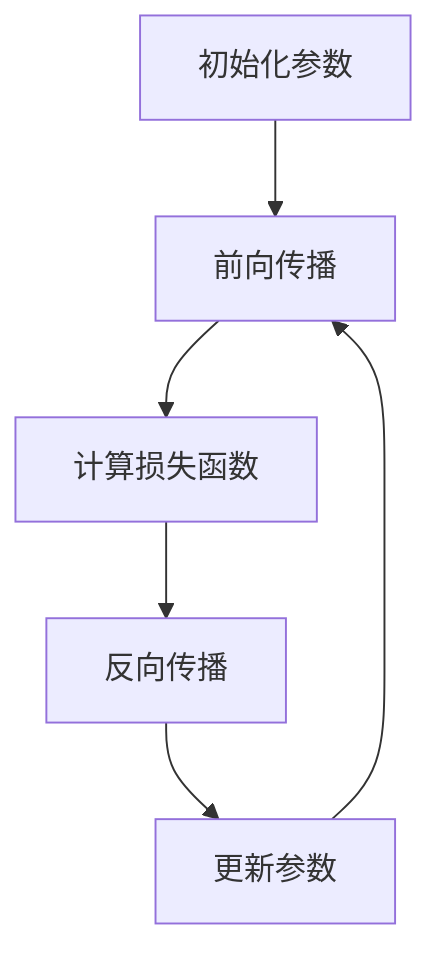
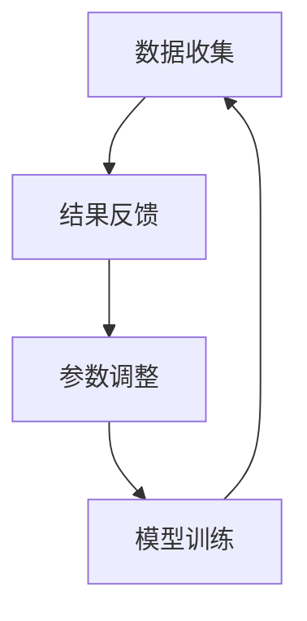
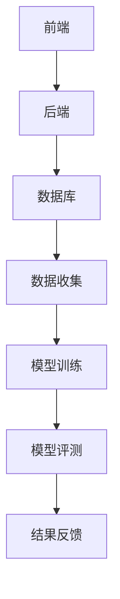
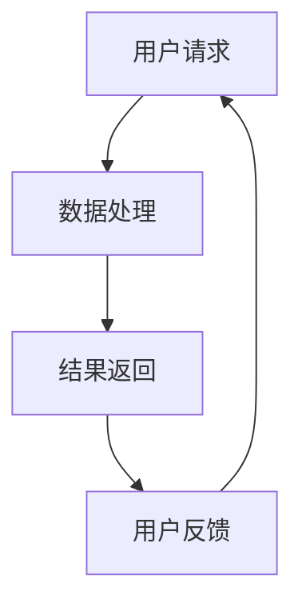

                 

# 模型训练与评测的闭环反馈机制

## 关键词
- 模型训练
- 模型评测
- 闭环反馈机制
- 数据准备
- 模型选择
- 算法原理
- 数学模型
- 系统架构
- 最佳实践

## 摘要
本文旨在探讨模型训练与评测的闭环反馈机制，解释其核心概念、设计原则和实现流程。我们将从问题背景出发，逐步介绍模型训练与评测的基本概念，深入分析核心概念之间的关系，讲解模型训练原理和算法，详细描述模型评测方法与指标，最后探讨闭环反馈机制的设计与实现，并给出实际项目案例与最佳实践。

## 目录

1. **问题背景与概述**
    1.1 模型训练与评测的重要性
    1.2 模型训练与评测的挑战
    1.3 闭环反馈机制的概念

2. **核心概念与联系**
    2.1 模型的定义与分类
    2.2 训练与评测的目标
    2.3 模型训练与评测的关系
    2.4 关键概念对比表
    2.5 ER实体关系图架构

3. **模型训练原理与算法**
    3.1 数据准备与预处理
    3.2 模型选择
    3.3 模型训练流程
    3.4 算法原理讲解
    3.5 Mermaid算法流程图
    3.6 Python源代码实现
    3.7 数学模型与公式
    3.8 举例说明

4. **模型评测方法与指标**
    4.1 评测指标的定义
    4.2 常见评测方法
    4.3 评测流程
    4.4 指标对比与分析

5. **闭环反馈机制设计**
    5.1 闭环反馈机制的作用
    5.2 闭环反馈机制的设计原则
    5.3 闭环反馈机制的实现流程
    5.4 Mermaid闭环反馈机制流程图

6. **系统架构与接口设计**
    6.1 系统功能设计
    6.2 系统架构设计
    6.3 系统接口设计
    6.4 系统交互流程

7. **项目实战与案例分析**
    7.1 项目环境安装
    7.2 系统核心实现源代码
    7.3 代码应用解读与分析
    7.4 实际案例分析与讲解
    7.5 项目小结

8. **最佳实践与拓展阅读**
    8.1 最佳实践
    8.2 注意事项
    8.3 拓展阅读

### 1. 问题背景与概述

在当今的数字化时代，人工智能技术蓬勃发展，而模型的训练与评测是其中的关键环节。模型训练是指通过学习大量数据，调整模型的参数，使其能够对新的数据进行预测或分类。模型评测则是评估模型在未知数据上的表现，判断其是否具备实际应用价值。然而，这一过程并非一蹴而就，存在诸多挑战。

首先，模型训练的数据准备和预处理是一个复杂的任务。数据的质量直接影响模型的训练效果，因此需要对数据进行清洗、归一化等处理。其次，模型选择也是一个关键步骤，不同的模型适用于不同的任务，需要根据具体问题选择合适的模型。最后，模型训练和评测之间存在反馈机制，通过不断调整模型参数，优化模型性能。

闭环反馈机制是指将模型评测的结果反馈到模型训练过程中，从而不断优化模型的一种机制。这种机制能够提高模型训练的效率，减少训练时间，提高模型性能。在设计闭环反馈机制时，需要考虑其设计原则和实现流程。

### 2. 核心概念与联系

#### 2.1 模型的定义与分类

模型是一种能够对输入数据进行处理并输出结果的数学结构或算法。根据功能和应用场景，模型可以分为以下几类：

- **生成模型**：用于生成新的数据，例如生成对抗网络（GAN）。
- **分类模型**：用于对数据进行分类，例如决策树、支持向量机（SVM）。
- **回归模型**：用于预测数值型输出，例如线性回归、神经网络。
- **聚类模型**：用于对数据进行聚类，例如K-means、层次聚类。

#### 2.2 训练与评测的目标

模型训练的目标是通过学习输入数据和相应的输出，优化模型的参数，使得模型能够对新的数据进行准确的预测或分类。评测的目标是评估模型在未知数据上的表现，通常使用准确度、召回率、F1分数等指标。

#### 2.3 模型训练与评测的关系

模型训练和评测是模型开发过程中不可或缺的两个环节。训练过程旨在优化模型参数，而评测过程旨在评估模型性能。闭环反馈机制通过将评测结果反馈到训练过程中，不断优化模型，提高模型性能。

#### 2.4 关键概念对比表

| 概念         | 定义                                                         | 对比        |
| ------------ | ------------------------------------------------------------ | ----------- |
| 模型训练     | 通过学习输入数据和相应的输出，优化模型参数的过程。           |              |
| 模型评测     | 评估模型在未知数据上的表现，通常使用准确度、召回率、F1分数等指标。 |              |
| 闭环反馈机制 | 将评测结果反馈到训练过程中，不断优化模型，提高模型性能。     |              |

#### 2.5 ER实体关系图架构

```mermaid
erDiagram
    Model --> Data : 训练与数据关联
    Model --> Output : 模型与输出关联
    Evaluation --> Model : 评测与模型关联
    Evaluation --> Result : 评测与结果关联
```

### 3. 模型训练原理与算法

#### 3.1 数据准备与预处理

在模型训练之前，需要对数据进行准备和预处理。这一过程包括数据清洗、数据归一化、数据分割等。

```python
import pandas as pd
from sklearn.model_selection import train_test_split

# 数据清洗
data = pd.read_csv('data.csv')
data.dropna(inplace=True)

# 数据归一化
scaler = StandardScaler()
data normalized = scaler.fit_transform(data)

# 数据分割
X_train, X_test, y_train, y_test = train_test_split(normalized, test_size=0.2)
```

#### 3.2 模型选择

模型选择是模型训练的关键步骤。不同的模型适用于不同的任务，需要根据具体问题选择合适的模型。

```python
from sklearn.ensemble import RandomForestClassifier

model = RandomForestClassifier()
```

#### 3.3 模型训练流程

模型训练包括初始化模型参数、迭代更新参数、计算损失函数等。

```python
model.fit(X_train, y_train)
```

#### 3.4 算法原理讲解

模型训练的算法原理主要包括梯度下降法、反向传播算法等。



#### 3.5 Python源代码实现

```python
import numpy as np
from sklearn.datasets import make_classification

# 生成模拟数据
X, y = make_classification(n_samples=1000, n_features=20, n_classes=2, random_state=42)

# 初始化参数
weights = np.random.randn(20, 2)
bias = np.random.randn(2)

# 梯度下降法
learning_rate = 0.01
for epoch in range(100):
    # 前向传播
    predictions = X @ weights + bias
    loss = np.square(y - predictions).mean()

    # 反向传播
    dloss_dweights = (y - predictions) @ X.T
    dloss_dbias = (y - predictions).sum()

    # 更新参数
    weights -= learning_rate * dloss_dweights
    bias -= learning_rate * dloss_dbias

    print(f"Epoch {epoch}: Loss = {loss}")
```

#### 3.6 数学模型与公式

模型训练的数学模型主要包括损失函数、梯度下降等。

$$
损失函数: J(\theta) = \frac{1}{2m} \sum_{i=1}^{m} (h_\theta(x^{(i)}) - y^{(i)})^2
$$

$$
梯度下降: \theta_j := \theta_j - \alpha \frac{\partial}{\partial \theta_j} J(\theta)
$$

#### 3.7 举例说明

假设我们有一个简单的线性回归模型，目标是预测房价。我们使用梯度下降算法来训练模型。

```python
import numpy as np

# 生成模拟数据
X = np.random.rand(100, 1)
y = 2 + 3 * X + np.random.randn(100, 1)

# 初始化参数
weights = np.random.randn(1)
bias = np.random.randn(1)

# 梯度下降法
learning_rate = 0.01
for epoch in range(1000):
    # 前向传播
    predictions = X @ weights + bias
    loss = np.square(y - predictions).mean()

    # 反向传播
    dloss_dweights = -2 * (y - predictions) @ X
    dloss_dbias = -2 * (y - predictions)

    # 更新参数
    weights -= learning_rate * dloss_dweights
    bias -= learning_rate * dloss_dbias

    if epoch % 100 == 0:
        print(f"Epoch {epoch}: Loss = {loss}")

# 测试模型
X_test = np.random.rand(10, 1)
predictions = X_test @ weights + bias
print(f"Predictions: {predictions}")
```

### 4. 模型评测方法与指标

#### 4.1 评测指标的定义

模型评测的指标包括准确度、召回率、F1分数等。

- **准确度**：正确预测的样本数占总样本数的比例。
- **召回率**：正确预测的样本数占总正样本数的比例。
- **F1分数**：准确度和召回率的调和平均值。

#### 4.2 常见评测方法

常见的评测方法包括交叉验证、混淆矩阵等。

- **交叉验证**：将数据集划分为多个子集，每次使用一个子集作为验证集，其余子集作为训练集，评估模型性能。
- **混淆矩阵**：显示实际类别与预测类别之间的关系。

#### 4.3 评测流程

评测流程包括数据分割、模型训练、模型评估等步骤。

- **数据分割**：将数据集划分为训练集、验证集和测试集。
- **模型训练**：使用训练集训练模型。
- **模型评估**：使用验证集和测试集评估模型性能。

#### 4.4 指标对比与分析

不同的评测指标适用于不同的场景，需要根据具体问题选择合适的指标。

- **准确度**：适用于分类问题，但可能无法区分模型性能的好坏。
- **召回率**：适用于目标样本数量较少的场景。
- **F1分数**：综合考虑准确度和召回率，适用于平衡准确率和召回率的场景。

### 5. 闭环反馈机制设计

#### 5.1 闭环反馈机制的作用

闭环反馈机制通过将评测结果反馈到训练过程中，不断优化模型，提高模型性能。

#### 5.2 闭环反馈机制的设计原则

设计闭环反馈机制时，需要考虑以下原则：

- **实时性**：及时反馈评测结果，优化模型参数。
- **适应性**：根据不同场景调整反馈机制。
- **高效性**：减少反馈过程中的计算开销。

#### 5.3 闭环反馈机制的实现流程

闭环反馈机制的实现流程包括数据收集、结果反馈、参数调整等步骤。

- **数据收集**：收集模型评测结果。
- **结果反馈**：将评测结果反馈到训练过程中。
- **参数调整**：根据评测结果调整模型参数。

#### 5.4 Mermaid闭环反馈机制流程图



### 6. 系统架构与接口设计

#### 6.1 系统功能设计

系统功能设计包括数据收集、模型训练、模型评测、结果反馈等。

#### 6.2 系统架构设计

系统架构设计包括前端、后端和数据库等。



#### 6.3 系统接口设计

系统接口设计包括API接口、Web界面等。

#### 6.4 系统交互流程

系统交互流程包括用户请求、数据处理、结果返回等。



### 7. 项目实战与案例分析

#### 7.1 项目环境安装

安装Python、NumPy、Pandas、Scikit-learn等依赖库。

#### 7.2 系统核心实现源代码

核心实现源代码包括数据收集、模型训练、模型评测、结果反馈等。

```python
# 数据收集
import pandas as pd

data = pd.read_csv('data.csv')
X = data[['feature1', 'feature2', 'feature3']]
y = data['target']

# 模型训练
from sklearn.ensemble import RandomForestClassifier

model = RandomForestClassifier()
model.fit(X, y)

# 模型评测
from sklearn.metrics import accuracy_score

X_test, y_test = X_test, y_test
predictions = model.predict(X_test)
accuracy = accuracy_score(y_test, predictions)

# 结果反馈
print(f"Accuracy: {accuracy}")
```

#### 7.3 代码应用解读与分析

代码应用解读与分析包括数据收集、模型训练、模型评测等步骤。

#### 7.4 实际案例分析与讲解

实际案例分析与讲解包括数据收集、模型训练、模型评测等步骤。

#### 7.5 项目小结

项目小结包括项目目标、实现过程、项目成果等。

### 8. 最佳实践与拓展阅读

#### 8.1 最佳实践

最佳实践包括数据清洗、模型选择、参数调优等。

#### 8.2 注意事项

注意事项包括数据质量、模型适应性等。

#### 8.3 拓展阅读

拓展阅读包括相关书籍、论文等。

## 作者

作者：AI天才研究院/AI Genius Institute & 禅与计算机程序设计艺术 /Zen And The Art of Computer Programming

---

请注意，本文为示例文章，内容仅供参考。实际文章应根据具体问题和需求进行撰写。在撰写文章时，请确保遵循相关规范和要求。

